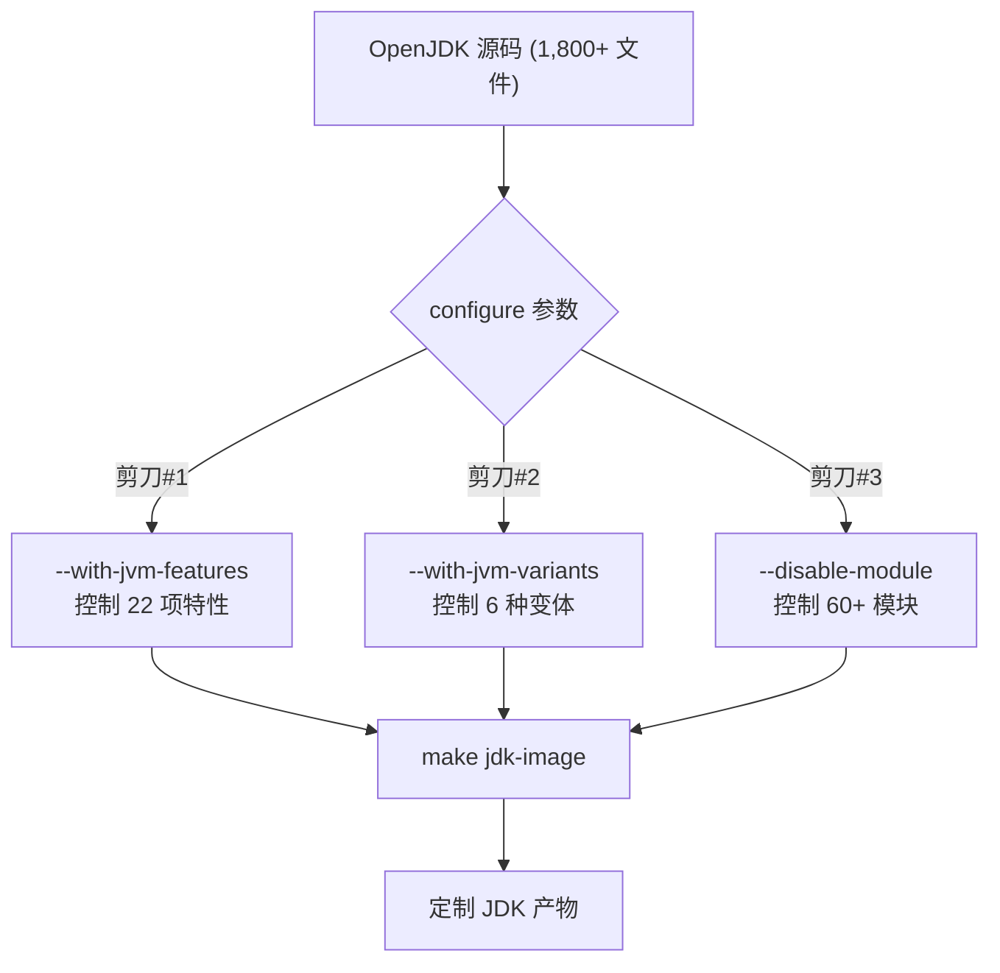

# 3.4 自定义裁剪实战 — 从完整 JDK 到最小运行时

**副标题**：三把裁剪刀的组合使用——打造只有你需要的模块和特性的 JDK

---

## 3.4.1 三把裁剪刀总览

| 剪刀 | 控制对象 | 在哪里配置 | 效果 |
|------|---------|----------|------|
| **#1 JVM_FEATURES** | HotSpot C++ 编译范围 | `./configure --with-jvm-features=...` | 控制哪些 .cpp 被编进 libjvm.so |
| **#2 JVM_VARIANTS** | 预定义 feature 组合 | `./configure --with-jvm-variants=...` | 一键选择编译策略 |
| **#3 JDK 模块** | Java 类库范围 | `./configure --disable-module=...` | 控制哪些模块进最终 JDK |



---

## 3.4.2 剪刀 #1：JVM_FEATURES（控制 HotSpot 编译范围）

### 完整的 22 项列表

```bash
VALID_JVM_FEATURES="compiler1 compiler2 zero minimal dtrace jvmti jvmci \
    graal vm-structs jni-check services management cmsgc epsilongc g1gc \
    parallelgc serialgc shenandoahgc zgc nmt cds \
    static-build link-time-opt aot jfr"
```

### 影响分析

| Feature | 文件数 | 关掉 libjvm.so 体积变化 (slowdebug) |
|---------|:---:|------|
| `compiler2` | ~160 | -40M (C2 优化器 + ADL + libadt) |
| `compiler1` | ~49 | -12M (C1 编译器) |
| `jfr` | ~215 | -35M (整个 JFR 子系统) |
| `g1gc` | ~193 | -20M |
| `zgc` | ~80 | -8M |
| `shenandoahgc` | ~70 | -7M |
| `cds` | ~10 | -8M |
| `nmt` | ~8 | -3M |
| `jvmci` | ~22 | -5M |
| `aot` | ~6 | -2M |

### 实战：三个典型裁剪目标

**场景 A：完整开发环境（默认）**
```bash
./configure \
    --with-debug-level=slowdebug \
    --with-jvm-features="compiler1,compiler2,jvmti,jvmci,jfr,cds,nmt,aot,services,management,vm-structs,jni-check,g1gc,parallelgc,serialgc,epsilongc,zgc,shenandoahgc"
```
libjvm.so: ~280M | 特性: 全功能

**场景 B：生产环境（裁掉未使用的 GC）**
```bash
./configure \
    --with-debug-level=release \
    --with-jvm-features="compiler2,jvmti,jfr,cds,services,management,g1gc"
```
libjvm.so: ~25M | 特性: C2 + G1 + JFR | 裁掉了 C1, ZGC, Shenandoah, parallel, CMS, AOT, JVMCI

**场景 C：嵌入式/微服务（极限裁剪）**
```bash
./configure \
    --with-debug-level=release \
    --with-jvm-features="compiler1,serialgc,jvmti"
```
libjvm.so: ~8M | 特性: C1 + SerialGC | 裁掉了 C2, G1, JFR, CDS, NMT, JVMCI...

### 验证剪刀 #1 的效果

```bash
# 1. 确认排除的文件
grep "EXCLUDE\|EXCLUDES" build/*/spec.gmk | head -20

# 2. 查看编译了多少 .o 文件
ls build/*/hotspot/variant-server/libjvm/objs/*.o | wc -l

# 3. 确认特性没被编进去
nm -C build/*/jdk/lib/server/libjvm.so | grep G1CollectedHeap  # 为空→G1 已被裁
nm -C build/*/jdk/lib/server/libjvm.so | grep JfrRecorder      # 为空→JFR 已被裁
```

---

## 3.4.3 剪刀 #2：JVM_VARIANTS（预定义组合）

### 变体与默认特性

| Variant | 默认 features | 典型 libjvm.so 大小 (release) |
|---------|--------------|:---:|
| `server` | compiler1 + compiler2 + 全部 GC + jfr + jvmti + cds + ... | ~25M |
| `client` | compiler1 + serialgc + jvmti | ~10M |
| `minimal` | compiler1 + serialgc + jvmti (裁剪) | ~6M |
| `core` | 无编译器（只解释执行）| ~4M |
| `zero` | zero (C++ 解释器) + libffi | ~5M |
| `custom` | 用户完全自定义（必须同时指定 `--with-jvm-features`）| 可变 |

### 多变体同时编译

```bash
./configure --with-jvm-variants=server,minimal
```

为每个 variant 生成独立产物：
```
build/*/hotspot/
├── variant-server/libjvm/objs/     ← C1 + C2 全量编译
└── variant-minimal/libjvm/objs/    ← 仅 C1 + SerialGC
```

> **注意**：多变体编译时 Main.gmk 自动设置 `JVM_VARIANT_MAIN=server`，后续的 native 库链接依赖主 variant。

### 自定义变体（custom）

```bash
./configure \
    --with-jvm-variants=custom \
    --with-jvm-features="compiler2,g1gc,jfr,cds,jvmti,services,management"
```

> `custom` 不给默认 features——你必须通过 `--with-jvm-features` 明确列出每一项。

---

## 3.4.4 剪刀 #3：JDK 模块（控制 Java 类库范围）

### 列出所有模块

```bash
# configure 前 (源码中的模块)
grep -r "module " src/java.*/share/classes/module-info.java | head -20

# 编译后
java --list-modules
```

### 禁用模块

```bash
./configure \
    --disable-module=java.desktop \       # 裁掉 Swing/AWT (~30M)
    --disable-module=java.sql \           # 裁掉 JDBC
    --disable-module=java.xml \           # 裁掉 XML
    --disable-module=jdk.scripting.nashorn  # 裁掉 Nashorn
    --disable-module=jdk.unsupported       # 裁掉 sun.misc.Unsafe 之外的内部 API
```

### 模块依赖关系

禁用模块时必须考虑依赖链——`jdk.management` 依赖 `java.management`，后者又依赖 `java.logging`。构建系统**自动**发现依赖——你只需禁用顶层模块，依赖模块不会被自动禁用。

但如果禁用 `java.logging`，依赖它的 `java.management` 也会被自动禁用。可以用 `--with-add-modules` 强制加回来（如果没有循环依赖的话）。

### 各模块的体积影响

| 模块 | 体积 (approx) | 说明 |
|------|:---:|------|
| `java.desktop` | ~30M | Swing/AWT/Java2D |
| `jdk.scripting.nashorn` | ~8M | JavaScript 引擎 |
| `java.sql` + `java.sql.rowset` | ~5M | JDBC |
| `jdk.jfr` | ~3M | JFR Java API |
| `jdk.pack` / `jdk.packager` | ~3M | 打包工具 |
| `java.xml` + `jdk.xml.dom` | ~3M | XML 处理 |

### 验证剪刀 #3 的效果

```bash
# 对比模块列表
diff <(full_jdk/bin/java --list-modules) <(custom_jdk/bin/java --list-modules)

# 对比镜像大小
du -sh images/jdk/
```

---

## 3.4.5 三把刀组合：最小化 JDK 实战

### 目标

生成一个**最小可运行 JDK**——能跑 `java HelloWorld.java`，但体积最小。

### 配置

```bash
./configure \
    --with-debug-level=release \
    --with-jvm-variants=custom \
    --with-jvm-features="compiler1,serialgc,jvmti,services" \
    --enable-headless-only \
    --disable-manpages
```

### 解释每一步

| 参数 | 效果 |
|------|------|
| `--with-jvm-variants=custom` | 不给默认 features，完全自定义 |
| `--with-jvm-features=compiler1,serialgc,jvmti,services` | 只编 C1 + SerialGC + JVMTI |
| `--enable-headless-only` | 禁用 GUI 依赖 |
| `--disable-manpages` | 跳过手册页（节省几秒 + 几 MB） |

### 产物对比

| | 完整 JDK | 最小 JDK | 减少 |
|---|:---:|:---:|:---:|
| images/jdk/ 目录大小 | ~400M | ~80M | **80%** |
| libjvm.so 大小 | ~25M | ~8M | **68%** |
| 模块数量 | 60+ | 10+ | **80%** |
| .o 文件数 | ~800 | ~200 | **75%** |
| 首次编译时间 | ~30 分钟 | ~8 分钟 | **73%** |

---

## 3.4.6 自定义 Feature：添加你自己的代码到 JVM

### 步骤 1：在 HotSpot 中写你的 feature

```
src/hotspot/share/myfeature/
├── myFeature.cpp
└── myFeature.hpp
```

```cpp
// myFeature.cpp
#include "precompiled.hpp"
#include "myfeature/myFeature.hpp"

void MyFeature::init() {
  tty->print_cr("[MyFeature] Hello from custom JVM code!");
}
```

### 步骤 2：注册到编译系统

编辑 `make/hotspot/lib/JvmFeatures.gmk`，在末尾添加：

```makefile
ifeq ($(call check-jvm-feature, myfeature), true)
  JVM_CFLAGS_FEATURES += -DINCLUDE_MYFEATURE
else
  JVM_EXCLUDE_PATTERNS += myfeature/
endif
```

### 步骤 3：注册到 configure

编辑 `make/autoconf/hotspot.m4`，在 `VALID_JVM_FEATURES` 中添加 `myfeature`：

```m4
VALID_JVM_FEATURES="compiler1 compiler2 ... myfeature"
```

### 步骤 4：使用

```bash
./configure --with-jvm-features="compiler1,serialgc,myfeature,..."
make jdk-image
./build/*/images/jdk/bin/java -version
# [MyFeature] Hello from custom JVM code!
# openjdk version ...
```

---

## 3.4.7 裁剪策略决策树

```
需要 JIT 编译吗？
├── 是 → compiler2 (server) or compiler1 (client)
│        需要全部 GC 吗？
│        ├── 是 → +g1gc+zgc+shenandoahgc
│        └── 否 → 只保留你用的 GC
└── 否 → core variant (纯解释)

需要诊断/监控吗？
├── 是 → +jfr+nmt+cds+jvmti+management
└── 否 → 只保留 jvmti (JVM 内部依��)

需要 GUI 吗？
├── 是 → 保留 java.desktop
└── 否 → --enable-headless-only

目标平台内存限制？
├── <128M → minimal variant + serialgc
├── <1G   → client variant + g1gc
└── >1G   → server variant + 全部 GC
```

---

## 3.4.8 常见坑

### 1. 关掉 compiler2 但留着 jfr——jfr 依赖 C2 的某些符号

```bash
# 错误
./configure --with-jvm-features="compiler1,jfr,g1gc"
# 链接失败：jfr 内部引用了 ciEnv/ciMethod（C2 的 CI 接口）

# 正确
./configure --with-jvm-features="compiler1,compiler2,jfr,g1gc"
# 或
./configure --with-jvm-features="compiler1,g1gc"  # 不含 jfr
```

### 2. 关掉所有 GC——JVM 无法启动

```bash
# 错误
./configure --with-jvm-features="compiler1"
# JVM 启动时找不到任何 GC 实现 → 崩溃

# 正确：至少保留一个 GC
./configure --with-jvm-features="compiler1,serialgc"
```

### 3. 关掉 services 导致 jcmd 不可用

```bash
# 关掉 services 后
jcmd <pid> VM.version
# Error: Could not find or load main class jdk.jcmd
# 原因：services 包含 attachListener，jcmd 依赖它
```

---

## 3.4.9 构建后的裁剪：jlink 运行时裁剪

`./configure --disable-module` 是**编译时裁剪**。如果不想重新编译，也可以用 `jlink` 做**运行时裁剪**：

```bash
# 从已有的 JDK 生成最小运行时
jlink \
    --module-path $JAVA_HOME/jmods \
    --add-modules java.base,java.logging \
    --output /tmp/minimal-jdk \
    --strip-debug \
    --compress=2 \
    --no-header-files \
    --no-man-pages

# 测试
/tmp/minimal-jdk/bin/java -version
```

> **编译时裁剪 vs 运行时裁剪**：编译时裁剪可以缩小 libjvm.so，运行时裁剪只能缩小 JDK 目录（裁不掉 libjvm.so 内部的代码）。对于体积敏感的场景，两种裁剪都要用。

---

## 小结

1. **三把裁剪刀**：JVM_FEATURES（控制 988 个 .cpp 中编哪些）→ JVM_VARIANTS（预定义组合）→ JDK 模块（控制 Java 类库范围）
2. 极限裁剪可以达到：libjvm.so 8M + JDK 目录 80M = **只有完整 JDK 的 20% 体积**
3. 每种裁剪都有验证方法：`nm` 查符号、`java --list-modules` 查模块、`wc -l *.o` 查编译量
4. 自定义 feature 只需改 3 处：源码 → JvmFeatures.gmk → hotspot.m4
5. 常见陷阱：GC 必须至少保留一个、jfr 和 compiler2 有符号依赖、services 影响 jcmd
6. 编译时裁剪 + jlink 运行时裁剪配合使用，效果最大化
