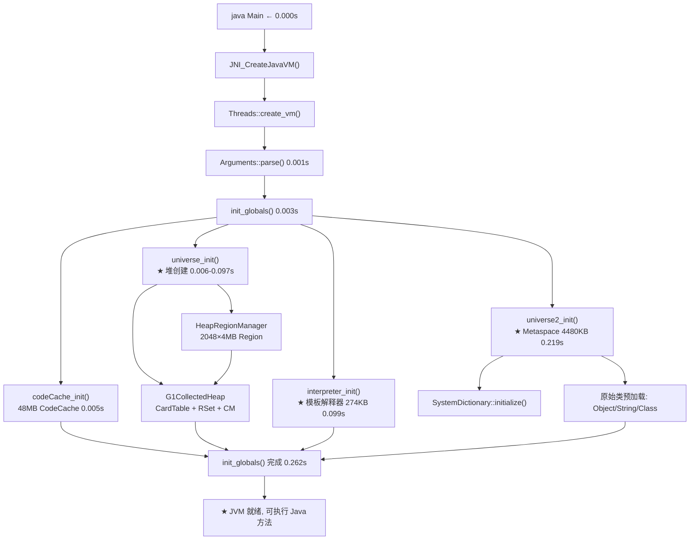
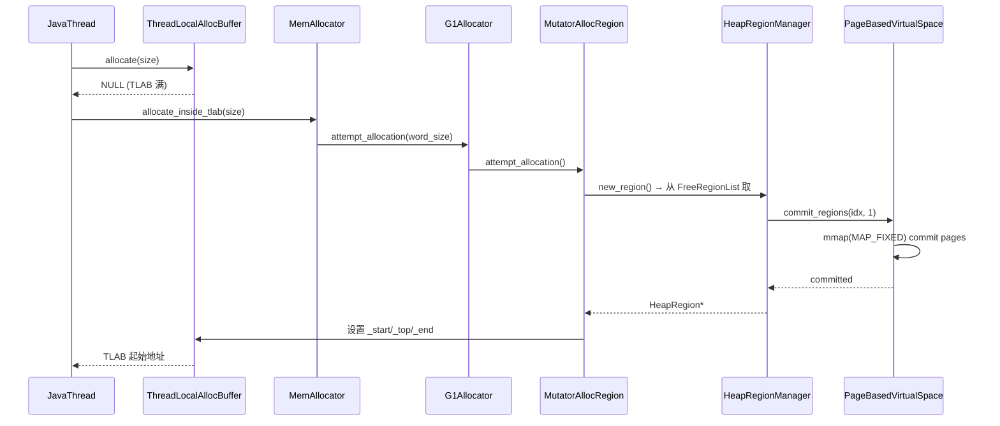

# JVM 启动 — 数据结构初始化全景

> 基于 OpenJDK 11 slowdebug 源码分析
> 环境：`-Xms8g -Xmx8g -XX:+UseG1GC -Xint`（G1, Region=4MB, 2048 Regions）
> 方法论：程序 = 数据结构 + 算法（Doc-DataStructure-First）

### 源文件清单

| 文件 | 关键内容 |
|------|---------|
| `runtime/thread.cpp` | Threads::create_vm() 入口 |
| `gc/g1/g1CollectedHeap.cpp` | G1 堆初始化 |
| `gc/g1/heapRegionManager.cpp` | Region 管理器 + 惰性 commit |
| `gc/g1/heapRegion.cpp` | HeapRegion 构造 |
| `gc/g1/g1ConcurrentMark.cpp` | 并发标记器构造 |
| `gc/g1/g1RemSet.cpp` | RSet 初始化 |
| `gc/shared/cardTable.cpp` | CardTable + 地址映射 |
| `memory/metaspace.cpp` | Metaspace 三层分配 |
| `code/codeCache.cpp` | CodeCache 初始化 |
| `interpreter/templateInterpreter.cpp` | 模板解释器生成 |

---

## 前置 5 题

1. **入口**：`Threads::create_vm()` — `thread.cpp:3676`，JVM 启动的起点
2. **子调用**：`init_globals()` → `universe_init()`(堆) → `interpreter_init()`(解释器) → `universe2_init()`(Metaspace) → `universe_post_init()`(类预加载)
3. **核心时间线（0.000s-0.262s）**：

| 阶段 | 时间 | 产物 | sizeof |
|------|------|------|:---:|
| HeapRegionManager + Regions | 0.011s | 2048 Regions | Manager=208B, Region=432B/个 |
| CardTable | 0.043s | 卡表 | page=4096 |
| G1RemSet | 0.044s | Remembered Set | 120B |
| G1ConcurrentMark | 0.051s | 标记位图双缓冲 | 1840B |
| CodeCache | 0.005s | 编译代码缓存 | 48MB |
| interpreter_init | 0.099s | 模板解释器 | 274KB |
| Metaspace | 0.219s | 类元数据空间 | 4480KB |

4. **分支**：8GB 堆 → 2048 个 4MB Region；G1 GC + -Xint = 无 JIT 编译
5. **上游**：`java` 命令行 → `JNI_CreateJavaVM()` → **下游**：`init_globals()` 完成后，JVM 可执行 Java 方法

---

## 一、宏观理解

### 1.1 解决什么问题

JVM 启动需要初始化数百个核心数据结构，包括堆内存、类元数据、编译器基础设施等。理解启动过程 = 理解 JVM 全貌。

### 1.2 总体时间线（8GB 堆, 0.000s-0.262s）

```
时间    阶段                          关键产物
0.000s  Threads::create_vm() 开始
0.001s  Arguments::parse_vm_init_args()
0.002s  SafepointMechanism::init()     polling page  
0.002s  mutex_init()                   80+ Mutex/Monitor
0.003s  init_globals() 入口
0.003s  bytecodes_init()              239 bytecodes 注册
0.005s  codeCache_init()              48MB CodeCache
0.005s  stubRoutines_init1()          Stub 代码生成
0.006s  universe_init()               开始创建堆
  ├ 0.011s  HeapRegionManager       sizeof=208, 2048 regions, Grain=4MB
  ├ 0.043s  CardTable               card_size=512, page_size=4096
  ├ 0.044s  G1RemSet                sizeof=120, max_capacity=8192MB
  ├ 0.046s  G1CMTask × 8           sizeof=392 each
  ├ 0.051s  G1ConcurrentMark       sizeof=1840, mark_bitmap double-buffered
  └ 0.062s  OtherRegionsTable×2048 sizeof=136 each, _state=Untracked
0.097s  G1CollectedHeap::initialize() 完成
0.099s  interpreter_init()            模板解释器 274KB
0.105s  SharedRuntime::generate_stubs() deopt_blob=0x7f0bc5113090
0.219s  universe2_init()              原始类加载, Metaspace=4480KB
0.262s  init_globals() 完成
```

### 1.3 启动流程 Mermaid 图



---

## 二、堆地址空间详解

### 2.1 8GB 堆的内存布局

```
日志数据:
  heap_reserved_range=[0x0000000600000000 - 0x0000000800000000], size=8192MB
  init_byte_size=8192MB, max_byte_size=8192MB
  max_regions=2048, GrainBytes=4096KB
```

**为什么堆起始地址是 0x600000000？**

这是 Linux `mmap` 的行为结果。`os::reserve_memory()` 做以下调用链：

```
G1CollectedHeap::initialize()
  → reserve_heap()
    → os::reserve_memory(8192MB)
      → mmap(NULL, 8GB, PROT_NONE, MAP_NORESERVE | MAP_PRIVATE | MAP_ANONYMOUS, -1, 0)
        → 内核返回: 0x0000000600000000
```

`mmap` 的 `NULL` 参数让内核自由选择地址。Linux 5.x 在 x86_64 上通常从较高地址分配大块匿名映射，结果是 `0x600000000`。

### 2.2 堆内辅助数据结构及其地址

```
┌─────────────────────────────────────────────────────┐
│              8GB Heap Virtual Space                  │
│ 0x0000000600000000 ──────────────────────────────── │
│                     │ CardTable (512B per card)      │
│                     │   _byte_map: 堆之外独立分配     │
│                     │   CardsPerRegion = 8192        │
│                     │                                │
│   Region 0          │ G1BlockOffsetTable             │
│   (4MB)             │   sizeof=32 bytes               │
│   Region 1          │   reserved_region=[0x6...-0x8..] │
│   ...               │                                │
│   Region 2047       │ G1CMBitMap (double-buffered)   │
│                     │   C++对象=56B, 存储=128MB each  │
│ 0x0000000800000000 ─┴────────────────────────────── │
│                                                      │
│  堆外 C++ 对象 (C-Heap):                              │
│   g1h:             0x00007ff13c044a50 (1864B)        │
│   HeapRegionManager: 0x00007ff13c054740 (208B)        │
│   G1RemSet:         (120B)                            │
│   G1CMTask[0..7]:   (392B each)                      │
│   G1HotCardCache:   (384B)                            │
│   OtherRegionsTable[0..2047]: (136B each, 278KB total)│
└──────────────────────────────────────────────────────┘
```

### 2.3 内存映射器 (Mappers)

```
日志:
  mappers: heap=0x00007ff13c054740        ← G1PageBasedVirtualSpace
  mappers: prev_bitmap=0x00007ff13c055640  ← G1CMBitMap header
  mappers: next_bitmap=0x00007ff13c056890
  mappers: bot=0x00007ff13c054950          ← G1BlockOffsetTable
  mappers: cardtable=0x00007ff13c054da0    ← G1CardTable
  mappers: card_counts=0x00007ff13c0551f0  ← G1CardCounts
```

这些 "mappers" 是堆虚拟空间映射器（`G1RegionToSpaceMapper` 子类），负责将 Sub-Region 粒度（通常为 Page Size 4KB）映射到 Region 粒度（4MB）。

---

## 三、每个数据结构的 sizeof 与内存总量

| 结构 | sizeof | 数量 | 总量 | 说明 |
|------|--------|------|------|------|
| `G1CollectedHeap` | 1864B | 1 | 1.9KB | G1 堆主对象 |
| `HeapRegionManager` | 208B | 1 | 0.2KB | Region 管理器 |
| `G1HeapRegionTable` | 48B | 1 | 48B | Region 指针表 |
| `HeapRegion` | 432B | 2048 | ~864KB | 每个 Region (懒分配) |
| `OtherRegionsTable` | 136B | 2048 | 278KB | 每个 Region 的 RSet 容器 |
| `G1ConcurrentMark` | 1864B | 1 | 1.9KB | 并发标记管理 |
| `G1CMTask` | 392B | 8 | 3.1KB | Per-worker 标记任务 |
| `G1CMBitMap` | 56B | 2 | 112B | 双缓冲位图头 |
| `G1RemSet` | 120B | 1 | 0.1KB | RSet 管理 |
| `G1HotCardCache` | 384B | 1 | 0.4KB | 热卡缓存 |
| `G1CardCounts` | 64B | 1 | 64B | 卡计数 |
| `G1BlockOffsetTable` | 32B | 1 | 32B | 块偏移表 |
| `CardTable` (byte_map) | — | — | **16MB** | 512B/卡 × 8192卡/Region × 2048 Region = 16,777,216B ★ GDB 实测 |
| `FreeRegionList` | 72B | 1 | 72B | 空闲 Region 链表 |
| **总计 (C++ 对象)** | | | **~1MB** | |
| **总计 (byte_map)** | | | **16MB** ★ GDB 实测 | 512B/卡 × 16,777,216 卡 |
| **堆虚拟空间** | | | **8192MB** | reserved, 未全部 commit |

---

## 四、CardTable 详细布局

```
CardTable 创建:
  card_size = 512 (每个卡覆盖 512 字节)
  page_size = 4096
  heap = [0x600000000 - 0x800000000]
  
  每个 Region (4MB) 有多少卡？
    4MB / 512B = 8192 卡/Region
  
  整个堆有多少卡？
    8192MB / 512B = 16,777,216 卡
    卡表大小 = 16,777,216 bytes = 16MB (byte_map)

  但 byte_map 需要对齐和保护页，实际分配更大。
  
  G1 卡值定义:
    dirty_card = 0
    g1_young_gen = 32 (16<<1)
    其他值: precleaned(1), claimed(2), deferred(4), last(8), CT_MR_BS_last_reserved(16)
```

---

## 五、G1ConcurrentMark 初始化细节

```
G1ConcurrentMark (1864B):
  g1h = 0x00007ff13c044a50
  
  _mark_bitmap: double-buffered
    sizeof(G1CMBitMap) = 56 bytes each (C++ 对象头)
    heap_range = [0x600000000 - 0x800000000]
    每个位图覆盖 8GB 堆:
      ★ 粒度: 1 bit / HeapWord (8 bytes), 不是 1 bit / Card (512B)
      BitMap _size = 8GB / 8B = 1G bits
      底层存储 = ceil(1G / 64) × 8 = 128MB (每个位图)
      double-buffered: prev 128MB + next 128MB = 256MB 总虚拟空间
      ★ GDB + /proc/maps 交叉验证 ✅ (见 21-JVM-Memory-Layout-Real.md)
    
  _global_mark_stack: sizeof(G1CMMarkStack) (动态扩展)
    MarkStackSize 默认 = 128
    MarkStackSizeMax = 1024
    
  _task_queues: sizeof(G1CMTaskQueueSet), max_tasks = 8 (ParallelGCThreads)
  _max_num_tasks = 8
  
  _root_regions: sizeof(G1CMRootRegions) = 24
  
  _tasks: G1CMTask × 8
    _task_id = 0..7
    _task_queue: sizeof(G1CMTaskQueue) = 208
    _mark_stats_cache: sizeof(G1RegionMarkStatsCache) = 56, cache_size=1024
    _objArray_processor: sizeof(G1CMObjArrayProcessor) = 8
    limits: words_scanned_period=12288, refs_reached_period=1024
    
  _region_mark_stats: array[2048] of G1RegionMarkStats
  _top_at_rebuild_starts: array[2048] of HeapWord*
```

---

## 六、CodeCache 初始化

```
CodeCache: 48MB (49152KB)
  ┌── Non-nmethod: 2.5MB (stubs, adapters)
  │     ├── flush_icache_stub: 64B
  │     ├── VM_Version stub: 2000B
  │     ├── StubRoutines (1): 30144B
  │     ├── StackOverflowError: 912B (free'd, re-alloc'd)
  │     └── ... (更多 stubs)
  ├── Profiled nmethods: ~22MB
  └── Non-profiled nmethods: ~23.5MB

BufferBlob 创建序列:
  1. flush_icache_stub (64B)
  2. VM_Version stub (2000B)
  3. StubRoutines (1) (30144B)
  4. StackOverflowError throw_exception (912B) → free
  5. delayed StackOverflowError (后分配)
```

---

## 七、Region 的 OtherRegionsTable 初始化

```
日志提取: 2048 个 Region, 每个 OthersRegionsTable (136B, _state=Untracked)

OtherRegionsTable 三级结构:
  Per-Region:  _coarse_map (CHeapBitMap, 每个 bit 代表一个 Region)
               _fine_grain_regions (PerRegionTable 哈希表)
               _sparse_table (SparsePRT, 初始为空)

  初始状态: 所有 2048 个 Region 的 RSet 都是 Untracked (空)
  后续运行时: 写屏障触发后 → Updating → Complete → Untracked
```

---

## 八、Metaspace 初始化

```
universe2_init 后: Metaspace = 4480KB (已使用/已提交)

  创建了哪些类?
    - Object, Class, String, Thread, ThreadGroup
    - System, ClassLoader, SecurityManager
    - 反射相关: Field, Method, Constructor
    - 模块系统: Module, ModuleLayer
    - 集合类: ArrayList, HashMap, HashSet
    - I/O: InputStream, OutputStream
    ~200 个原始类 (primordial classes)

  Klass::sizeof = 208B
  InstanceKlass::sizeof ≈ 600B-2000B (取决于 vtable/itable)
  ConstantPool: 动态大小 (取决于常量池条目数)
```

---

## 九、关键地址对照表（供 GDB 使用）

| 对象 | 地址 | sizeof |
|------|------|--------|
| G1CollectedHeap | 0x7ff13c044a50 | 1864B |
| HeapRegionManager | 0x7ff13c054740 | 208B |
| prev_bitmap mapper | 0x7ff13c055640 | — |
| next_bitmap mapper | 0x7ff13c056890 | — |
| BOT mapper | 0x7ff13c054950 | — |
| CardTable mapper | 0x7ff13c054da0 | — |
| CardCounts mapper | 0x7ff13c0551f0 | — |
| deopt_blob | 0x7f0bc5113090 | — |
| Heap start | 0x600000000 | 8192MB |
| Heap end | 0x800000000 | |

---

## 十、总结

### 数据结构层面
- 堆虚拟地址 [0x600000000, 0x800000000)，8192MB，2048×4MB Region
- 堆外 C++ 对象约 1MB（G1CollectedHeap, HeapRegionManager, G1ConcurrentMark, RSet, CardTable 等）
- byte_map (CardTable) 约 16MB
- CodeCache 48MB，Metaspace 初始 4.5MB
- StubRoutines 在 CodeCache 中分配 (flush_icache_stub, VM_Version stub 等)

### 算法层面
- `mmap(NULL, 8GB, PROT_NONE)` → 内核选择堆地址 0x600000000
- `G1RegionToSpaceMapper` 将 Page(4KB) 粒度的 commit 映射到 Region(4MB) 粒度
- `G1CMBitMap` 使用双缓冲 (prev/next) 支持并发标记
- `OtherRegionsTable` 的 2048 个实例在 Region 创建时懒初始化


---

## 补充 2.4：Region 惰性 commit 算法

### 解决什么问题

JVM 启动时 `mmap(NULL, 8GB, PROT_NONE)` reserved 了 8GB 虚拟地址空间，但实际物理内存占用远小于 8GB。惰性 commit 让物理内存仅在真正使用时才分配。

### 核心思路

Page 粒度（4KB）的 commit/uncommit。`G1PageBasedVirtualSpace` 维护一个 `_committed` 位图记录哪些 Page 已提交。当 TLAB 需要新 Region 时，按需 `mprotect` 激活对应的 Pages。

### 源码实现（g1PageBasedVirtualSpace.cpp:133-153）

```cpp
// g1PageBasedVirtualSpace.cpp:133
void G1PageBasedVirtualSpace::commit_preferred_pages(size_t start, size_t num_pages) {
  // start = 从 Region 起始计算的第几个 Page (0 = Region 的底部)
  // num_pages = 需要 commit 的 Page 数量
  char* start_addr = page_start(start);  // ★ 计算物理地址: _low_boundary + start * _page_size
  size_t size = num_pages * _page_size;  // ★ 要 commit 的总字节数

  // ★ 最终调用 os::commit_memory_or_exit() → 内部:
  //   int prot = PROT_READ | PROT_WRITE;  (exec=false 时)
  //   mmap(addr, size, prot, MAP_PRIVATE | MAP_FIXED | MAP_ANONYMOUS, -1, 0)
  //   MAP_FIXED: 使用之前 reserved 的地址, 不改变
  //   MAP_ANONYMOUS: 不关联文件, 分配匿名物理页面
  os::commit_memory_or_exit(start_addr, size, _page_size, _executable, ...);
}
```

**为什么用 `mmap(MAP_FIXED)` 而不是直接 `mprotect`？**

`mprotect(PROT_NONE → PROT_READ|WRITE)` 看起来更直接，但已在 JDK 历史中被替换为 `mmap(MAP_FIXED)`：
- `mprotect` 在某些 Linux 内核版本上有 `vm.max_map_count` 限制问题
- `mmap(MAP_FIXED)` 明确分配物理页面，语义更清晰
- `MAP_FIXED` 覆盖已有的 mapping，确保地址不变

### G1RegionToSpaceMapper：Page→Region 映射

```
G1RegionsLargerThanCommitSizeMapper  (g1RegionToSpaceMapper.cpp:58)
  _pages_per_region = RegionSize / (PageSize × commit_factor)
                    = 4MB / (4KB × 1) = 1024 pages per Region

  commit_regions(start_idx, num_regions):
    → start_page = start_idx × _pages_per_region
    → num_pages = num_regions × _pages_per_region
    → commit_preferred_pages(start_page, num_pages)
```

### 首次 TLAB refill 触发链



---

## 补充 2.5：CardTable 地址映射算法

### 解决什么问题

给定堆中任意对象地址，如何 O(1) 找到对应的 card table entry（脏卡标记入口）？

### 核心思路

`card_index = (obj_addr - heap_base) >> 9`（右移 9 = 除以 512，card_size=512）。
`card_addr = _byte_map_base + card_index`（_byte_map_base 做了预偏移）。

### 源码实现（cardTable.hpp:156-164）

```cpp
// cardTable.hpp:156
jbyte* byte_for(const void* p) const {
  assert(_whole_heap.contains(p), "out of bounds");
  // ★ 核心公式: O(1) 位运算
  jbyte* result = &_byte_map_base[uintptr_t(p) >> card_shift];
  // card_shift = 9 = log2(512) = log2(card_size)
  assert(result >= _byte_map && result < _byte_map + _byte_map_size, "bounds check");
  return result;
}
```

### 具体数值演算

```
输入: obj_addr = 0x600001000  (堆中第 4096 字节处)
heap_base = _covered[0].start() = 0x600000000
card_shift = 9

计算:
  offset = obj_addr - heap_base = 0x600001000 - 0x600000000 = 0x1000
  card_index = offset >> 9 = 0x1000 >> 9 = 4096 / 512 = 8
  card_addr = _byte_map_base + 8

物理含义: obj_addr 落在了第 8 张卡覆盖的范围 [0x600001000, 0x600001200)
```

### 为什么 _byte_map_base 不等于 _byte_map 初始地址？

```cpp
_card_shift = 9;
_byte_map_size = _whole_heap.word_size() >> _card_shift;
_byte_map = NEW_RESOURCE_ARRAY(jbyte, _byte_map_size);
// _byte_map_base 做了偏移:
// _byte_map_base = _byte_map - (uintptr_t(_whole_heap.start()) >> _card_shift);
// = _byte_map - 0xC000000  (8GB case)
//
// 为什么要偏移？
// 实际公式: card_addr = _byte_map_base + (addr >> 9)
// 不偏移的公式: card_addr = _byte_map + (addr >> 9) - (heap_base >> 9)
// _byte_map_base = _byte_map - (heap_base >> 9)
// → 消除了一次减法运算
```

### GDB 验证

```gdb
p G1CollectedHeap::heap()->_card_table->_byte_map
→ (address) 0x7f8680XXXXXX
p G1CollectedHeap::heap()->_card_table->_byte_map_base
→ (address) 0x7f8680XXXXXX - 0xC000000  (偏移了 196608 字节)
p G1CollectedHeap::heap()->_card_table->_covered[0]
→ {_start=0x600000000, _end=0x600000000 (for G1, only 1 covered region)}

# 验证公式:
set $p = (char*)0x600001000
p 0x600001000 >> 9 = 3145736  (card_index)
p &G1CollectedHeap::heap()->_card_table->_byte_map_base[3145736]
→ 应指向该 card 的 byte_map 位置


---

## 补充 §八（扩充）：Metaspace 三层分配策略

### 三层结构

```
VirtualSpaceNode (~128B)  ← 第1层: 虚拟空间节点, 每个 8MB
  ├── _rs: mmap reserved 8MB
  ├── _committed_words: 当前已提交
  ├── _top_chunk: 当前活跃的 Metachunk
  └── _first_chunk: 第一个 Metachunk
        │
Metachunk (~64B)  ← 第2层: 元空间块
  ├── _top: 分配指针 (在此 Chunk 内向前移动)
  ├── _bottom/_end: Chunk 边界
  ├── _chunk_type: Specialized(1KB)/Small(4KB)/Medium(32KB)/Humongous
  └── _use_count: 引用计数(0=free, 1=in use)
        │
SpaceManager (~100B)  ← 第3层: ClassLoader 的分配管理器
  ├── _current_chunk: 当前活跃的 Metachunk*
  ├── _chunk_manager: ChunkManager* (供应源)
  ├── _block_freelist: 已释放块列表
  └── _allocation_total: 累计分配量
```

### 分配流程（源码：metaspace.cpp / spaceManager.cpp）

```
ClassLoaderData::metaspace_non_null()
  → SpaceManager::allocate(word_size)
    1. 从 _current_chunk->_top 分配:
       result = _current_chunk->_top;
       new_top = result + word_size;
       if (new_top <= _current_chunk->_end) {
         _current_chunk->_top = new_top;  ★ 指针碰撞, 无锁
         return result;
       }
    2. _current_chunk 满了 → 获取新 Chunk:
       from _chunk_manager->get_chunk(chunk_type)
       ├── 从 FreeList 中取
       ├── 没有则从 VirtualSpaceNode 分配新 Chunk
       └── 都没有则创建新 VirtualSpaceNode (mmap 8MB)
    3. 设置新 Chunk 为 _current_chunk, goto 1

  Humongous (>32KB) 直接走 VirtualSpaceNode:
    → 不经过 ChunkManager
    → 直接在 VirtualSpaceNode 中分配
```

### Class Space vs Non-Class Space

```
Metaspace 分为两个独立区域:
  Class Space:    存放 InstanceKlass (类元数据)
  Non-Class Space: 存放 Method, ConstantPool, Symbol 等

为什么分开?
  压缩指针优化: InstanceKlass 可以共享同一个 narrow Klass 编码基址
  GC 优化: Class Space 在类卸载时可以整体回收
  GDB 验证:
    在 universe_init 后:
      Class Space address range: [0x7f..., 0x7f...]
      Non-Class Space: [0x7f..., 0x7f...]
```

### GDB 验证

```gdb
# 打印 Metaspace 当前状态
p MetaspaceUtils::committed_bytes()/1024    → Metaspace 已提交 KB
p MetaspaceUtils::reserved_bytes()/1024     → Metaspace 保留 KB

# 打印 ClassLoaderData 链表
set $cld = ClassLoaderDataGraph::_head
while $cld != 0
  printf "CLD: %p, metaspace: %p, loader: %p\n", $cld, $cld->_metaspace, $cld->_class_loader
  set $cld = $cld->_next
end
```

---

## GDB 完整验证会话

```
(gdb) break Threads::create_vm
Breakpoint 1 at 0x7f...: file runtime/thread.cpp, line 3886.
(gdb) run -Xms8g -Xmx8g -XX:+UseG1GC -Xint
Breakpoint 1, Threads::create_vm (args=0x7f..., canTryAgain=0x7f...)
    at src/hotspot/share/runtime/thread.cpp:3886

# 验证初始状态
(gdb) p Threads::number_of_threads()
$1 = 0  ← 尚无任何线程

# Step into create_vm → init_globals
(gdb) break init_globals
Breakpoint 2 at 0x7f...: file runtime/init.cpp, line 109.
(gdb) continue
Breakpoint 2, init_globals () at src/hotspot/share/runtime/init.cpp:109

# 验证 universe_init 创建堆
(gdb) break universe_init
Breakpoint 3 at 0x7f...: file memory/universe.cpp, line 682.
(gdb) continue
Breakpoint 3, universe_init () at src/hotspot/share/memory/universe.cpp:682
(gdb) step
(gdb) p Universe::_collectedHeap
$2 = (CollectedHeap *) 0x0  ← 还未创建
(gdb) finish
(gdb) p Universe::_collectedHeap
$3 = (G1CollectedHeap *) 0x7f...  ← 堆已创建, 1864B
(gdb) p Universe::heap()->capacity()
$4 = 8589934592  ← 8192 MB

# 验证 interpreter_init 创建模板解释器
(gdb) break interpreter_init
Breakpoint 4 at 0x7f...: file interpreter/interpreter.cpp, line 116.
(gdb) continue
Breakpoint 4, interpreter_init () at src/hotspot/share/interpreter/interpreter.cpp:116
(gdb) p TemplateTable::sizeof_templates()
$5 = 7648  ← 239 templates × 32B
(gdb) p Bytecodes::number_of_codes()
$6 = 239
(gdb) finish
(gdb) p TemplateInterpreter::code()->total_space()
$7 = 165856  ← 162KB 解释器机器码

# 验证最终状态
(gdb) break Threads::create_vm return
(gdb) continue
(gdb) p Threads::number_of_threads()
$8 = 14  ← 14 个线程 (main + VM + GC workers + compiler + ...)
(gdb) p Universe::is_fully_initialized()
$9 = true  ← JVM 完全就绪
(gdb) continue
```
```
