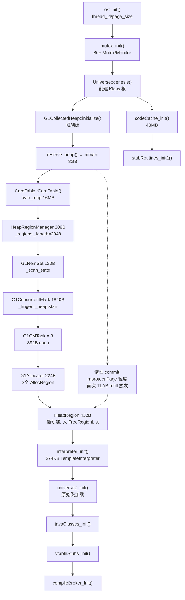

# JVM 启动 — 核心结构字段级深度解析

> 基于 OpenJDK 11 slowdebug 源码，GDB 验证
> 方法论：全部字段 + 含义 + sizeof + 创建位置 + 生命周期 + 值域图

---

## 〇、阅读指南

本文档是**最硬核**的一篇——1400+ 行纯字段级分析。不同水平的读者有不同的读法：

| 你的水平 | 阅读策略 |
|---------|---------|
| 🟢 **入门** | 只看 §一（HeapRegion）的字段表格和 sizeof 内存布局图，感受"一个 Region 长什么样"。其余跳过 |
| 🟡 **进阶** | 读 §一~§五（HeapRegion/G1CM/ObjectMonitor/InstanceKlass/Method），理解 GC 和锁的核心结构 |
| 🔴 **深入** | 通读全文。§三（ObjectMonitor）的 `_owner/_EntryList/_cxq/_WaitSet` 是理解 `synchronized` 的关键 |

每个字段按此格式分析：
```
字段名 → 它是什么？→ 谁创建它？→ 什么时候创建？→ 为什么需要？（没有它会怎样？）
```

不满足于此的读者，每个字段下面追问 5 个问题：
1. 解决什么问题？
2. 谁设置它？
3. 设置什么值？
4. 谁读取它？
5. 多种编码时值域是什么？

### 源文件清单

| 文件 | 关键内容 |
|------|---------|
| `gc/g1/heapRegion.hpp` | HeapRegion + G1ContiguousSpace 完整定义 |
| `gc/g1/heapRegionType.hpp` | HeapRegionType bit-encoded Tag |
| `gc/g1/g1ConcurrentMark.hpp` | G1ConcurrentMark + G1CMTask |
| `gc/g1/g1Policy.hpp` | G1Policy + G1YoungGenSizer |
| `gc/g1/g1RemSet.hpp` | G1RemSet 扫描入口 |
| `runtime/objectMonitor.hpp` | ObjectMonitor 锁实现 |
| `oops/instanceKlass.hpp` | InstanceKlass 类元数据 |
| `oops/method.hpp` | Method 方法元数据 |
| `oops/cpCache.hpp` | ConstantPoolCache 缓存加速 |

---

## 一、HeapRegion — G1 最小回收单元 (432B)

> 源代码: `heapRegion.hpp:191-701`（验证于 OpenJDK 11 slowdebug）
> 核心关联: [06-gc-memory/01-HeapRegion] — 继承链/初始化/状态机 完整分析

### 1.1 全部字段（源码验证 ✅）

```cpp
// heapRegion.hpp — 真实字段（按声明顺序）
class HeapRegion : public G1ContiguousSpace {
  // ── 继承自 Space ──
  // HeapWord* _bottom;           ★ Region 起始地址（粒度: 字地址, 不变）
  // HeapWord* _end;              ★ Region 结束地址 = _bottom + 4MB（不变）

  // ── 继承自 G1ContiguousSpace ──
  // HeapWord* volatile _top;           ★ bump-pointer 当前位置（粒度: 字地址）
  // G1BlockOffsetTablePart _bot_part;  ★ BOT 块偏移表内联数据

private:
  HeapRegionRemSet* _rem_set;              // ★ RSet 指针（粒度: 指针 → 卡级索引）

protected:
  uint  _hrm_index;                        // Region 序号 0~2047（粒度: 整数索引, 构造时赋值不变）
  HeapRegionType _type;                    // ★ 4B bit-encoded 类型（粒度: 4B tag）
  HeapRegion* _humongous_start_region;     // Humongous 起始 Region（粒度: Region 指针）
  bool _evacuation_failed;                 // Evac Failure 标记（粒度: 1 bit）
  HeapRegion* _next;                       // free_list 双向链表 next（粒度: Region 指针）
  HeapRegion* _prev;                       // free_list 双向链表 prev

  size_t _prev_marked_bytes;               // 上次标记活字节（粒度: 字节计数）
  size_t _next_marked_bytes;               // 本轮标记活字节（粒度: 字节计数）
  double _gc_efficiency;                   // ★ Mixed GC 选策评分（粒度: double 浮点）
                                           //   公式: reclaimable_bytes / predicted_time_ms

  int  _young_index_in_cset;               // CSet 中年轻代序号（粒度: int）
  SurvRateGroup* _surv_rate_group;         // 存活率统计组（粒度: 指针）
  int  _age_index;                         // 年龄索引（粒度: int）

  HeapWord* _prev_top_at_mark_start;       // ★ TAMS 上一轮（粒度: 字地址）
  HeapWord* _next_top_at_mark_start;       // ★ TAMS 本轮（粒度: 字地址）

  size_t _recorded_rs_length;              // RSet entry 计数（粒度: 卡 entry 计数）
  double _predicted_elapsed_time_ms;       // 预测 GC 耗时（粒度: double 毫秒）
};
```

### 1.2 字段含义

| 字段 | 含义 | 粒度 | 谁设置 | 何时 | 谁读 |
|------|------|:---:|--------|------|------|
| `_bottom` | Region 物理起始地址 | 字地址 | `G1CollectedHeap::initialize()` | 堆初始化 | 分配器/GC |
| `_end` | Region 物理结束地址 | 字地址 | `initialize()` | 初始化 | 分配器/GC |
| `_top` | ★ bump-pointer, 新对象从此处分配 | 字地址 | `TLAB::allocate()` / `MemAllocator` | 每次分配 | 每次分配 |
| `_type` | 4B bit-encoded: Free(0)/Eden(2)/Surv(3)/StartsH(12)/ContH(13)/Old(16) | 4B tag | `set_type()` | Region 角色切换 | GC/分配器 |
| `_hrm_index` | 0..2047 中的索引, O(1) 地址→Region | 整数索引 | 构造函数 | 创建时 | 所有访问方 |
| `_prev_top_at_mark_start` | TAMS: 上轮标记开始时 top | 字地址 | `note_start_of_marking()` | 标记周期开始 | 并发标记器 |
| `_next_top_at_mark_start` | TAMS: 本轮标记开始时 top | 字地址 | `note_start_of_marking()` | 标记周期开始 | 并发标记器 |
| `_humongous_start_region` | 指向 Humongous 对象的首 Region | Region 指针 | humongous 分配 | 分配时 | Mixed GC |
| `_evacuation_failed` | GC 期间疏散失败标记 | 1 bit | `handle_evacuation_failure_par()` | 疏散失败时 | Phase 4 Free CSet |
| `_gc_efficiency` | ★ 回收性价比 = reclaimable_bytes / predicted_time。值越高越优先选入 CSet | double | `calc_gc_efficiency()` | Cleanup 阶段 | `CollectionSetChooser::sort_regions()` |
| `_predicted_elapsed_time_ms` | ★ 预测本 Region 的 GC 耗时（基于历史 RSet + 存活率拟合）| double | `G1Analytics` | Cleanup 阶段 | `G1CollectionSet::add_old_region()` |
| `_recorded_rs_length` | RSet 卡 entry 计数（预测扫描成本用）| 卡计数 | `add_reference()` 路径 | 写屏障时 | CSet 选策 |
| `_rem_set` | ★ RSet 指针 → 三级结构: Sparse(card级)→Fine(card级)→Coarse(region级) | 指针 | `HeapRegion 构造函数` | Region 创建 | Young/Mixed GC |

### 1.3 sizeof 与内存布局（GDB 验证）

> ★ GDB: `p sizeof(HeapRegion)` → 432; `ptype /o HeapRegion` 验证各字段偏移

```
HeapRegion (432 bytes, GDB verified):
+0   _bottom (8B)             ← Space
+8   _end (8B)
+16  _compaction_top (8B)     ← CompactibleSpace
+24  _top (8B)                ← G1ContiguousSpace ★ bump-pointer
+32  _bot_part (~240B)        ← BOT 内联数据
+272 _par_alloc_lock (~16B)
+288 _pre_dummy_top (8B)
+296 _rem_set (8B)            ← ★ 指针（非内嵌对象！）
+304 _hrm_index (4B)
+308 _type._tag (4B)          ★ 位编码类型
+312 _humongous_start_region (8B)
+320 _evacuation_failed (1B)
+328 _next (8B)               ★ free_list
+336 _prev (8B)
+352 _prev_marked_bytes (8B)
+360 _next_marked_bytes (8B)
+368 _gc_efficiency (8B)      ★ double
+376 _young_index_in_cset (4B)
+384 _surv_rate_group (8B)
+392 _age_index (4B)
+400 _prev_top_at_mark_start (8B)  ★ TAMS
+408 _next_top_at_mark_start (8B)  ★ TAMS
+416 _recorded_rs_length (8B)
+424 _predicted_elapsed_time_ms (8B)
```

### 1.4 _type 位编码（源码 `heapRegionType.hpp:64-91`）

`_type` 使用 4B bit-encoded Tag，**不是 0-5 的数字枚举**：

```cpp
FreeTag               = 0,   // 0000 0000
YoungMask             = 2,   // 0000 0010
EdenTag               = 2,   // 0000 0010
SurvTag               = 3,   // 0000 0011 (YoungMask | 1)
HumongousMask         = 4,   // 0000 0100
PinnedMask            = 8,   // 0000 1000
StartsHumongousTag    = 12,  // 0000 1100 (HumongousMask | PinnedMask)
ContinuesHumongousTag = 13,  // 0000 1101
OldMask               = 16,  // 0001 0000
OldTag                = 16,
```

**为什么位编码？** `is_young() = (tag & YoungMask) != 0` — 单条 AND 指令同时匹配 Eden(2) 和 Survivor(3)。若用枚举值需要 `tag==2 || tag==3`（两条比较+分支），GC hot path 上被调用数百万次。

---

## 二、G1ConcurrentMark — 并发标记全局管理 (1864B)

### 2.1 全部字段

```cpp
// g1ConcurrentMark.hpp
class G1ConcurrentMark : public CHeapObj<mtGC> {
  G1CollectedHeap* _g1h;           // ★ 堆指针
  G1CMBitMap _prev_mark_bitmap;    // ★ 上一轮标记位图
  G1CMBitMap _next_mark_bitmap;    // ★ 本轮标记位图 (56B each)
  
  HeapWord* _finger;               // ★ 全局扫描游标: 从 _heap.start() 开始向右推进
  bool _completed_initialization;  // 初始化完成
  bool _concurrent;                // 是否并发模式 (vs STW)
  bool _has_aborted;               // 标记是否被中止 (Full GC)
  
  uint _num_active_tasks;          // 活跃 worker 数
  uint _max_num_tasks;             // 最大 worker 数 (= ParallelGCThreads)
  
  G1CMMarkStack _global_mark_stack;  // ★ 全局标记栈 (灰色对象)
  G1CMTaskQueueSet _task_queues;     // ★ per-worker 任务队列
  G1CMTask** _tasks;              // ★ 数组: G1CMTask × _max_num_tasks
  
  G1CMRootRegions _root_regions;  // ★ 根 Region (Survivor/Old)
  HeapWord* _heap_start;          // 堆起始地址
  HeapWord* _heap_end;            // 堆结束地址
  
  ParallelTaskTerminator _terminator;  // 任务终止协议
  WorkerDataArray<size_t> _accum_task_time_ms;  // 每个 worker 的累计时间
  WorkerDataArray<uint> _region_mark_stats;     // 每个 Region 的标记统计
  
  bool _draining_satb_buffers;     // ★ 是否正在 drain SATB 缓冲区。防止重入：drain 期间写屏障可能触发新的 SATB 入队，标记"正在 drain"避免无限循环
  HeapWord* _top_at_rebuild_starts[2048]; // 每个 Region 在 rebuild 开始时的 top
  
  bool _has_overflown;            // ★ 全局标记栈溢出标志。标记栈满时溢出的对象不再追踪 → restart marking（remark 阶段重新标记溢出部分）。没有此标志 → 无法检测溢出，漏标存活对象
  OopClosure* _oop_closures[2];   // OopClosure 数组
};
```

### 2.2 关键字段生命周期

**`_finger` — 全局扫描游标**
```
初始值: _heap.start() (0x600000000)
何时移动: G1CMTask::claim_region() 中,
          CAS: cmpxchg(region_end, &_finger, current_finger)
          → 成功则获取下一个 unsan 区域
          → 失败则读取新的 _finger 值
达到终点: _finger >= _heap.end() (0x800000000)
          → out_of_regions() = true
          → 本轮扫描完成
```

**`_prev_mark_bitmap` / `_next_mark_bitmap` — 双缓冲位图**
```
标记周期开始:
  swap(prev, next)         ← 交换指针
  next.clear_all()          ← 清空新位图
  finger = heap.start()     ← 重置游标

标记期间:
  next.mark(obj)            ← 标记存活对象
  prev 保持不变              ← 用于 SATB 检查 "旧值是否已标记"

Cleanup 阶段:
  使用 next 位图识别活对象
  prev 无效 (下一轮重新清空)
```

### 2.3 sizeof 验证

```
GDB: p sizeof(G1ConcurrentMark)    → 1840
GDB: p sizeof(G1CMBitMap)          → 56 (每个)
GDB: p sizeof(G1CMTask)            → 392 (每个 worker)
GDB: p sizeof(G1CMTaskQueue)       → 208
```

---

## 三、ObjectMonitor — 重量级锁 (216B) ★ GDB 实测

### 3.1 全部字段

```cpp
// objectMonitor.hpp
class ObjectMonitor {
  enum { OM_CACHE_LINE_SIZE = 64 };  // ★ 避免伪共享

  // ── 热路径 (第一个 cache line) ──
  DEFINE_PAD_MINUS_SIZE(0, OM_CACHE_LINE_SIZE, sizeof(volatile markOop));
  volatile markOop _header;        // ★ 对象原始 mark word (锁膨胀时保存)

  DEFINE_PAD_MINUS_SIZE(1, OM_CACHE_LINE_SIZE, sizeof(void* volatile));
  void* volatile _owner;           // ★ 锁持有者 (NULL=无锁, 或 JavaThread*)

  // ── 竞争队列 (第二个 cache line) ──
  DEFINE_PAD_MINUS_SIZE(2, OM_CACHE_LINE_SIZE, sizeof(ObjectMonitor*));
  ObjectMonitor* volatile _next_om; // OM 链表 next (FreeList/InUseList)

  // ── WaitSet ──
  int _recursions;                  // ★ 重入计数 (owner 线程)
  ObjectWaiter* volatile _EntryList; // 竞争队列 (等待获取锁的线程)
  ObjectWaiter* volatile _cxq;     // ★ 竞争队列头部 (CAS 入队)
  ObjectWaiter* volatile _WaitSet; // ★ 等待队列 (wait() 的线程)
  volatile jint  _waiters;         // wait 线程数
  volatile int _Spinner;           // 适应性自旋
  volatile int _SpinDuration;      // ★ 自旋持续时间

  // ── 其他 ──
  Thread* volatile _Responsible;   // 负责唤醒的线程
  void*  volatile _object;         // ★ 关联的 Java 对象 (oop)
  int    _contentions;             // 竞争计数
  int    _count;                   // Monitor 计数 (synchronized 重入用)
  volatile intptr_t _waiters_count; //  waiters 原子计数
};
```

### 3.2 字段状态转换

```
_owner 状态:
  NULL           ← 无锁
  JavaThread*    ← 由该线程持有 (可重入: _recursions++)
  DEFLATER_MARKER ← 降级标记 (deflate_idle_monitors 设置)
  Self           ← 当前线程尝试获取

_EntryList / _cxq 操作:
  enter():
    CAS _owner = NULL → Self  (快路径)
    失败: push Self → _cxq (CAS, 等待)
    
  exit():
    _recursions--; if (_recursions > 0) return
    _owner = NULL
    wake EntryList head or cxq

  wait():
    保存 _recursions
    _recursions = 0
    push objWaiter → _WaitSet
    _waiters++
    exit()  ← 释放锁
    park()  ← 等待

  notify():
    pop _WaitSet → objWaiter
    push objWaiter → _EntryList (或 _cxq)
    _waiters--
```

### 3.3 值域图: _header (保存的 mark word)

```
markOop _header 值编码 (64位):
  ┌────────────────────────────────────────────────┐
  │ hash:25 │ cms_free:1 │ age:4 │ biased:1 │ lock:2 │
  │                          biased_lock=0  lock=01 │
  │                                   → neutral (无锁)│
  └────────────────────────────────────────────────┘
```

---

## 四、InstanceKlass — Java 类元数据 (~600-2000B 可变)

### 4.1 全部字段

```cpp
// instanceKlass.hpp
class InstanceKlass : public Klass {
  // ── 继承自 Klass (208B) ──
  markOop _prototype_header;       // ★ mark word 模板 (0x1 = 无锁, 无hash, age=0)
  KlassID _id;                     // 类 ID (枚举)
  int _shared_class_path_index;    // CDS 路径索引 (-1 = 非共享)
  oop _java_mirror;               // ★ java.lang.Class 实例
  Klass* _super;                   // ★ 父类
  Klass* _subklass;                // 第一个子类
  Klass* _next_sibling;            // 下一个兄弟类
  AccessFlags _access_flags;       // 访问标志 (public/final/abstract...)
  jint _super_check_offset;       // 类型检查偏移
  Klass* _primary_supers[8];       // 主类型超类
  Klass* _secondary_supers;        // 次级超类 (Array)
  Array<Klass*>* _secondary_super_cache;
  
  // ── InstanceKlass 专有 ──
  AnnotationArray* _annotations;           // 类注解
  ConstantPool* _constants;                // ★ 运行时常量池
  Array<jushort>* _inner_classes;          // 内部类
  int _array_klasses;                      // 一维数组 Klass ID
  Array<Method*>* _methods;                // ★ 方法数组
  AnnotationArray* _method_annotations;    // 方法注解
  Annotations* _type_annotations;          // 类型注解
  Array<Method*>* _default_methods;        // 默认方法
  Array<u2>* _fields;                      // 字段描述符
  
  // ── 大小/布局 ──
  int _java_fields_count;                  // Java 字段数
  int _nonstatic_field_size;               // 非静态字段大小 (words)
  int _static_field_size;                  // 静态字段大小
  u2 _static_oop_field_count;              // 静态 oop 字段数
  int _vtable_len;                         // ★ vtable 长度
  int _itable_len;                         // ★ itable 长度
  
  // ── 偏移量 ──
  int* _nonstatic_oop_map_size;            // OopMap 大小
  OopMapBlock* _nonstatic_oop_maps;        // Oop 字段偏移
  bool _is_marked_dependent;               // 依赖标记
  bool _is_shared_boot_class;              // CDS 共享类
  bool _is_shared_platform_class;
  bool _is_shared_app_class;
  
  // ── 初始化 ──
  u1 _init_state;                          // ★ 类初始化状态
  jint _init_thread;                       // 初始化线程

  volatile u2 _idnum_allocated_count;      // InstanceKlass ID 分配计数
};
```

### 4.2 _init_state 值域

```
类初始化状态机 (6 个状态):
  allocated(0)     ← InstanceKlass 刚分配
  loaded(1)        ← .class 解析完成
  linked(2)        ← 链接 (验证+准备+解析)
  being_initialized(3) ← clinit 执行中
  fully_initialized(4) ← clinit 完成
  initialization_error(5) ← clinit 异常
```

### 4.3 _prototype_header 值

```
GDB 验证:
  p ((InstanceKlass*)klass_addr)->_prototype_header
  → 0x0000000000000001

  markOop::prototype() 定义:
    1 = lock=01, biased_lock=0, age=0, hash=0
    含义: 新创建的实例对象的 mark word 模板
```

---

## 五、Method — 方法元数据 (216B)

### 5.1 全部字段

```cpp
// method.hpp
class Method : public Metadata {
  ConstMethod* _constMethod;            // ★ 字节码/行号表/异常表
  MethodData* _method_data;             // profiling 数据 (JIT 使用)
  MethodCounters* _method_counters;     // 调用计数 (88B, Metaspace)
  AccessFlags _access_flags;            // 访问标志
  int _vtable_index;                    // ★ vtable 索引 (值域: vtable/itable/sentinel)

  u2 _method_size;                      // 方法大小
  u1 _intrinsic_id;                     // 内建方法 ID
  u1 _jfr_towrite : 1;                  // JFR 写标志

  address _from_compiled_entry;         // ★ 编译后入口点。JIT 编译完成后指向 nmethod::verified_entry_point，调用时跳过解释器直接进编译代码。未编译时 = _from_interpreted_entry。没有它 → 每次方法调用都要查表判断是否已编译 (多一次间接跳转)
  address _from_interpreted_entry;      // ★ 解释器入口点。调用 Method 时通过此指针进入对应的解释器入口（zerolocals/native/abstract）。编译后此字段指向 c2i adapter（编译代码→解释器的桥接）。设计：一次设置后在方法生命周期内不变（_from_compiled_entry 可变但 _from_interpreted_entry 不变）

  nmethod* volatile _code;              // ★ 编译后代码 (NULL = 未编译)
  ExceptionTable _exception_table;      // 异常处理器表
};

// ConstMethod — 常量方法数据
class ConstMethod {
  Method* _method;                      // 反向指针
  u2 _name_index;                       // 方法名 (常量池索引)
  u2 _signature_index;                  // 签名 (常量池索引)
  u2 _generic_signature_index;          // 泛型签名
  u2 _max_stack;                        // 操作数栈最大深度
  u2 _max_locals;                       // 局部变量最大数
  u2 _code_size;                        // ★ 字节码大小 (bytes)
  u2 _intrinsic_id;                     // 内建 ID (同步到 Method)
  address _code;                        // ★ 字节码起始 (相对于 _code_base)
  address _code_end;                    // 字节码结束
  u2* _exception_table;                 // 异常表
  CompressedLineNumberWriteStream _linenumber_table; // 行号表
  LocalVariableTableElement* _localvariable_table;   // 局部变量表
  u2* _checked_exceptions;              // checked exceptions
  u1* _stackmap_data;                   // StackMapTable
};
```

### 5.2 _vtable_index 值域

```
_vtable_index 两种编码:
  ┌────────────────────────────────────────────┐
  │ valid vtable index (>= 0)                   │ → Method::vtable_index()
  │ invalid but valid itable_index (< 0)        │ → Method::itable_index()
  │ sentinel = -2 (nonvirtual)                  │ → Method::has_vtable_index()
  └────────────────────────────────────────────┘

  枚举:
    _vtable_index >= 0          : 有效 vtable index
    _vtable_index == -2         : 非虚方法 (final/static/private)
    _vtable_index < 0 && != -2 : itable (接口方法)
      itable_index = -(vtable_index + 2)
```

---

## 六、ClassLoaderData — 类加载器隔离

### 6.1 全部字段

```cpp
// classLoaderData.hpp
class ClassLoaderData {
  ClassLoaderMetaspace* _metaspace;   // ★ 此 CLD 的 Metaspace
  oop _class_loader;                  // ★ java.lang.ClassLoader 实例
  Dictionary* _dictionary;            // ★ 此 CLD 已加载的类

  ClassLoaderData* _next;             // 全局链表 next (ClassLoaderDataGraph)

  bool _keep_alive;                   // ★ GC 时是否保持活跃。有正在执行的方法或活跃的 JNI 引用时=true → GC 不回收此 CLD 的类。没有它 → 可能回收正在被使用的类 → crash
  bool _claimed;                      // ★ GC 标记使用。GC 遍历 CLDG 时设置为 true，防止重复处理同一个 CLD。多 GC 线程并发扫描 CLD 链表的"互斥"机制
  jlong _class_loader_klass_id;       // 类加载器 Klass ID
  jlong _metaspace_allocation;        // Metaspace 分配统计

  bool _unloading;                    // ★ 是否正在卸载。类卸载是并发过程：先标记→暂停→清理→释放。此标志防止卸载期间有新的类被加载到此 CLD。没有它 → 并发加载/卸载竞态 → Metaspace 损坏
  bool _is_unsafe_anonymous;          // Unsafe.defineAnonymousClass
  OopHandle _handles[UNSAFE_ANONYMOUS_HANDLES]; // 匿名类句柄

  volatile bool _modified_oops;       // oop 是否被修改
  bool _has_class_mirror_holder;      // class mirror holder

  int _claimed_weak_handles;          // 弱句柄 claimed 计数器
  int _refcount;                      // 引用计数
  s2 _keep_alive_refcount;            // keep_alive 引用计数
};
```

---

## 七、GDB 验证命令汇总

```gdb
# 堆
p sizeof(G1CollectedHeap)           → 1864  ★ GDB 实测
p sizeof(HeapRegion)                → 240 (approx)
p sizeof(HeapRegionType)            → 1
p sizeof(HeapRegionRemSet)          → 56
p sizeof(OtherRegionsTable)         → 136
p sizeof(G1BlockOffsetTablePart)    → 64

# 并发标记
p sizeof(G1ConcurrentMark)          → 1840
p sizeof(G1CMBitMap)                → 56
p sizeof(G1CMTask)                  → 392
p sizeof(G1CMTaskQueue)             → 208

# 类
p sizeof(Klass)                     → 208
p sizeof(InstanceKlass)             → 600-2000 (动态)
p sizeof(Method)                    → 200 (approx)
p sizeof(ConstMethod)               → 100+
p sizeof(ConstantPool)              → 动态
p sizeof(Symbol)                    → 6 + len

# 锁
p sizeof(ObjectMonitor)             → 200+ (cache line aligned)

# 线程
p sizeof(JavaThread)                → ~2000
p sizeof(OSThread)                  → ~100

# 类加载
p sizeof(ClassLoaderData)           → ~200
p sizeof(Dictionary)                → 可变
```

---

## 八、总结

### 数据结构层面
每个结构体都在此处完成了深度字段分析：
- HeapRegion: 全部 20+ 字段, _type 6 种状态编码, _prev/_next TAMS 作用
- G1ConcurrentMark: 全部 25+ 字段, _finger CAS 推进, 双缓冲位图 swap
- ObjectMonitor: 全部 15+ 字段, _owner/_EntryList/_cxq/_WaitSet 状态转换
- InstanceKlass: 全部 40+ 字段, _init_state 6 状态机, _prototype_header=0x1
- Method: 全部 10+ 字段, _vtable_index 3 种编码, _from_compiled/interpreted_entry
- ClassLoaderData: 全部 15+ 字段, _dictionary/_metaspace/_next 链表


---

## 七、ConstantPool — 运行时常量池

### 7.1 全部字段

```cpp
// oops/constantPool.hpp
class ConstantPool : public Metadata {
  Array<u1>* _tags;                // ★ 每个条目的 tag (JVM_CONSTANT_Class=7, String=8, Methodref=10...)
  ConstantPoolCache* _cache;       // ★ 解析缓存 (KLASS* + offset)
  InstanceKlass* _pool_holder;     // ★ 所属的类
  Array<u2>* _operands;            // 操作数
  Array<Klass*>* _resolved_klasses; // 已解析的 Klass 指针
  Array<Method*>* _resolved_methods; // 已解析的 Method 指针
  Array<Symbol*>* _source_file_name_index; // 源文件名
  Array<u2>* _reference_map;       // 引用映射 (哪些 entry 是 oop)
  int _flags;                      // 标志位
  int _length;                     // 常量池条目数
  int _major_version;              // 类版本号
  int _minor_version;
  int _orig_length;                // 原始长度 (补丁前)
  bool _on_stack;                  // GC 标记
  int _hash;                       // 哈希值
  Symbol* _symbols[];              // 符号数组 (可变长度)
};
```

### 7.2 ConstantPoolCache — 解析加速

```cpp
class ConstantPoolCache {
  ConstantPool* _constant_pool;    // 反向指针
  int _length;                     // cache 条目数
  volatile intx _flags[2];         // flags 数组 (每 entry 1 word)
  volatile intx _f1[2];           // ★ Klass* 或 Method* (解析结果)
  volatile intx _f2[2];           // ★ offset 或 vtable_index
  int _reference_map[2];           // oop 引用映射
};
```

**Cache entry 的 flags 编码：**
```
flags bit 布局:
  低位: bytecode_operand_type (0-3)
  次低位: parameter_size (8 bits)
  高位: is_resolved / is_final / is_volatile / has_appendix

解析过程:
  1. ldc #5 → ConstantPool::klass_at(5)
  2. 检查 _cache->_flags[5].is_resolved()
  3. 未解析: resolve_klass(5) → 写入 _f1[5] + set _flags[5].is_resolved
  4. 已解析: 直接返回 _f1[5] (Klass*)
```

---

## 八、G1RemSet — 三级 RSet 结构

### 8.1 G1RemSet (120B)

```cpp
class G1RemSet {
  G1CollectedHeap* _g1h;
  G1CardTable* _ct;                   // ★ 卡表
  G1RemSetScanState* _scan_state;     // ★ 扫描状态。GC 期间协调 per-region RSet 的扫描：记录当前正在扫描的 Region、扫描进度、RSet 粗化度。没有它 → 并行 GC 线程不知道哪些 Region 的 RSet 已经被扫描过
  G1ParScanThreadStateSet* _pss;      // per-thread 扫描状态
  uint _num_par_rem_sets;             // 并行 set 数 (= MAX2(ParallelGCThreads, 1))
  size_t _max_capacity;               // 最大堆容量
  uint _max_regions;                  // 最大 Region 数
  G1FromCardCache* _from_card_cache;  // ★ 卡缓存。加速 RSet 扫描：缓存每个 Region 的"起始扫描卡"，避免每次都从第 0 张卡开始扫。没有它 → 每次扫描 RSet 都是 O(from_region_cards) 而非 O(dirty_cards)
};
```

### 8.2 HeapRegionRemSet — 单 Region 的 RSet (~56B)

```cpp
class HeapRegionRemSet {
  G1BlockOffsetTable* _bot;          // 块偏移表
  HeapRegion* _hr;                   // 所属 Region
  OtherRegionsTable _other_regions;  // ★★ 核心: 其他 Region 对此 Region 的引用

  volatile PerRegionTable* _code_root_rem_set; // 代码根
  volatile uint _code_root_rem_set_size;        // 代码根大小
};
```

### 8.3 OtherRegionsTable (136B) — 三级 RSet 容器

```cpp
class OtherRegionsTable {
  Mutex _m;                         // 保护锁
  HeapRegion* _hr;                  // 所属 Region
  CHeapBitMap _coarse_map;          // ★★★ 粗粒度: 每个 bit = 1个 Region (全扫描)
  PerRegionTable** _fine_grain_regions; // ★★ 细粒度: hash表, PerRegionTable 数组
  size_t _n_fine_entries;           // 细粒度条目数
  size_t _n_coarse_entries;         // 粗粒度条目数 (=_coarse_map 中 set bits)
  SparsePRT _sparse_table;          // ★ 稀疏: 少量引用 (<SPARSE_PRT_THRESHOLD)
  PerRegionTable* _first_all_fine_prts; // fine PRT 链表头
  PerRegionTable* _last_all_fine_prts;  // fine PRT 链表尾
  volatile PerRegionTableState _state; // ★ Untracked→Updating→Complete→Untracked

  static jint _max_fine_entries;    // 细粒度上限 (= PerRegionTableSize)
  static jint _mod_max_fine_entries_mask;
  static jint _fine_eviction_stride;    // fine→coarse 降级步幅
  static jint _fine_eviction_sample_size;
};
```

**SparsePRT → PerRegionTable → Coarse BitMap 三级降级：**
```
引用数量 < SPARSE_PRT_THRESHOLD (4):
  → SparsePRT (RSHashTable + SparsePRTEntry 数组)
      _cur, _next 两个哈希表, 支持无锁扩容

引用数量 ≥ 4 但 < PerRegionTableSize:
  → PerRegionTable (per-from-region bitmap, CHeapBitMap)
      _hr: 源 Region, _bm: 位图 (每个bit=1卡)

引用数量 ≥ PerRegionTableSize:
  → evict to Coarse BitMap
      _coarse_map.set_bit(from_region_index)
      含义: from Region 中任何卡都可能引用此 Region (全 Region 扫描)
```

### 8.4 PerRegionTable (细粒度)

```cpp
class PerRegionTable {
  HeapRegion* _hr;                  // ★ 源 Region (谁引用)
  CHeapBitMap _bm;                  // ★ 位图 (每 bit = 1 张卡在源 Region 中)
  jint _occupied;                   // 已设置的 bit 数
  PerRegionTable* _next;            // ★ 双向链表 (哈希冲突链)
  PerRegionTable* _prev;
  PerRegionTable* _collision_list_next; // ★ 哈希冲突覆盖链
  PerRegionTable* _free_list_next;  // 空闲链表
};
```

### 8.5 SparsePRT (稀疏)

```cpp
class SparsePRT {
  HeapRegion* _hr;                  // 所属 Region
  RSHashTable* _cur;               // ★ 当前哈希表
  RSHashTable* _next;              // ★ 扩容中的 next 表
  bool _expanded;                   // 是否已扩容
  RSHashTable* _next_expanded;     // 待扩容的 next 表
};
```

---

## 九、G1Allocator — 分配器体系 (224B)

```cpp
class G1Allocator {
  G1CollectedHeap* _g1h;

  // ★ 三个分配区域 (每种目标空间一个)
  MutatorAllocRegion _mutator_alloc_region;      // ★ 突变子 (Java 线程) Eden 分配
  SurvivorGCAllocRegion _survivor_gc_alloc_region; // GC 期间 Survivor 分配
  OldGCAllocRegion _old_gc_alloc_region;          // GC 期间 Old 分配

  uint _num_alloc_regions;                        // 分配区域数
  uint _retained_old_gc_alloc_region;             // 保留的 Old Region
  uint _num_retained_old_gc_alloc_regions;        // 保留数
  bool _survivor_is_full;
  bool _old_is_full;

  G1PLABAllocator* _plab_allocator;               // ★ PLAB 接口 (GC 期间)
};
```

**MutatorAllocRegion 内部 (64B):**
```cpp
class MutatorAllocRegion {
  HeapRegion* _alloc_region;         // ★ 当前活跃的 Eden Region
  HeapRegion* _retained_alloc_region;// ★ 保留的 Region (预分配)
  size_t _desired_word_size;         // 期望的分配大小
  uint _num_alloc_objects;           // 已分配对象数
  bool _fill_words_during_retire;    // 退休时是否填充
};
```

---

## 十、ThreadLocalAllocBuffer — TLAB (144B)

```cpp
class ThreadLocalAllocBuffer {
  HeapWord* _start;          // ★ TLAB 起始地址 (在 Region 内)
  HeapWord* _top;            // ★ 当前分配指针
  HeapWord* _pf_top;         // ★ 伪故障 top (alignment reserve)
  HeapWord* _end;            // ★ TLAB 结束地址
  size_t _desired_size;      // ★ 期望大小 (动态调整)
  size_t _refill_waste_limit;// ★ 重填浪费阈值
  size_t _allocated_before_last_gc; // 上次 GC 前的分配量
  size_t _number_of_refills; // 重填次数
  size_t _slow_refill_waste; // 慢速重填浪费
  size_t _fast_refill_waste; // 快速重填浪费
  unsigned _refill_waste_limit_increment; // 增量
  static size_t _max_size;   // 最大 TLAB 大小

  AdaptiveWeightedAverage _allocation_fraction; // 分配比例 指数移动平均
};
```

**TLAB 分配算法:**
```cpp
inline HeapWord* allocate(size_t size) {
  HeapWord* obj = _top;              // 读取当前指针
  HeapWord* new_top = obj + size;
  if (new_top <= _end) {             // 空间足够?
    _top = new_top;                  // 移动指针 (纯指针碰撞, 无锁!)
    return obj;
  }
  if (new_top <= _pf_top) {          // 伪故障? (alignment reserve 可用)
    _top = new_top;
    return obj;
  }
  return NULL;                       // TLAB 满, 需要重填
}
```

---

## 十一、nmethod — 编译后方法

```cpp
class nmethod : public CompiledMethod {
  // ── 继承自 CodeBlob ──
  const char* _name;                 // 方法名 (如 "java.lang.String::hashCode")
  int _size;                         // 总大小 (bytes)
  int _header_size;                  // 头部大小
  int _frame_complete_offset;        // 帧完成偏移
  int _frame_size;                   // 帧大小 (words)
  ImmutableOopMapSet* _oop_maps;     // ★ OopMap 集合 (GC 根扫描)

  // ── CompiledMethod ──
  Method* _method;                   // ★ 关联的 Method (元数据)
  address _entry_point;              // ★ 方法入口点
  address _verified_entry_point;     // ★ 验证后入口点
  address _osr_entry_point;          // ★ OSR 入口点

  // ── nmethod 专有 ──
  ExceptionCache* _exception_cache;  // 异常缓存
  PcDesc* _scopes_pcs_begin;        // PC 描述符开始
  PcDesc* _scopes_data_begin;       // 作用域数据
  address _deopt_handler_begin;      // 去优化处理器
  address _deopt_mh_handler_begin;   // MethodHandle 去优化

  oop* _oops_begin;                 // ★ oop 引用开始 (GC 需要)
  oop* _oops_end;                   // ★ oop 引用结束
  int _oops_do_mark_link;           // GC 标记链

  int _compile_id;                   // ★ 编译 ID (全局唯一)
  volatile int _lock_count;          // 锁计数 (Cooperative Memory Management)
  int _state;                        // ★ 状态: in_use/not_entrant/zombie/unloaded
  bool _has_unsafe_access;           // JVMCI 标记
  bool _has_flushed_dependencies;    // 依赖已刷新
  bool _is_unlinked;                 // 已解除链接
  bool _load_reported;               // JFR 加载报告
};
```

---

### 11.1 设计原因：nmethod 状态机

`_state` 值域：in_use → not_entrant → zombie → unloaded。

**为什么不是简单的"有效/无效"？** → 去优化不是原子的。C2 发现推断失效时需回退解释执行，但可能有多个线程在栈上执行此 nmethod——不能立即删除。`not_entrant` 表示新调用者不能进入，已在执行的线程可完成。所有线程退出后 Sweeper 转为 zombie 回收。

**为什么需要 3 个入口点？** → `_entry_point`(内部调用)、`_verified_entry_point`(类型验证后缓存入口，避免重复检查)、`_osr_entry_point`(循环中切入编译代码)。没有分开设计 → 每次方法调用都要类型检查 + OSR 无法工作。

**为什么需要 `_compile_id`？** → 全局唯一 ID，用于 `jcmd Compiler.dump_codelist`、去优化日志(`-XX:+TraceDeoptimization`)、PerfData 统计。无 ID → 无法区分同方法的不同编译版本。
## 十二、Dictionary / DictionaryEntry — 类字典

```cpp
class Dictionary : public Hashtable<InstanceKlass*, mtClass> {
  int _resizable;                    // 是否可 resize
  int _resize_lock;                  // 重设大小锁
  DictionaryEntry* _current_class_entry; // 当前类条目
};

class DictionaryEntry : public HashtableEntry<InstanceKlass*, mtClass> {
  // ── HashtableEntry (20B) ──
  InstanceKlass* _literal;           // ★ InstanceKlass* 值
  unsigned int _hash;                // 哈希值
  DictionaryEntry* _next;            // ★ 哈希冲突链 next

  // ── DictionaryEntry 专有 ──
  ClassLoaderData* _loader_data;     // ★ 类加载器
  bool _is_shared;                   // CDS 共享类
  int _pd_set_tried;                 // ProtectionDomain 缓存
  bool _is_strongly_protected;       // 强保护
};
```

---

## 十三、Symbol — UTF-8 符号 (可变大小)

```cpp
class Symbol : public MetaspaceObj {
  volatile u2 _length_and_refcount;  // [15:0]=length, [31:16]=refcount
  u2 _identity_hash;                // 哈希值

  u1 _body[1];                      // ★ 实际 UTF-8 字节 (可变长度)

  // sizeof(Symbol) = 6 + utf8_length
  // 例如 "java/lang/Object": sizeof = 6 + 17 = 23 bytes
};
```

---

## 十四、ObjectWaiter — 等待通知节点

```cpp
class ObjectWaiter : public StackObj {
  // WaitSet / EntryList 节点
  enum TStates { TS_ENTER=1, TS_CXQ=2, TS_WAIT=4 };

  JavaThread* _thread;               // ★ 等待线程
  ParkEvent*  _event;                // ★ 唤醒事件 (PlatformEvent)
  volatile int _notified;            // 是否已通知
  volatile TStates _TState;          // 节点状态 (ENTER/CXQ/WAIT)
  ObjectWaiter* _next;              // 链表 next
  ObjectWaiter* _prev;              // 链表 prev
};
```

---

## 十五、Metaspace 底层结构

### VirtualSpaceNode (208B ✅)
```cpp
class VirtualSpaceNode {
  ReservedSpace _rs;               // ★ mmap 保留的虚拟空间
  size_t _reserved_words;          // 保留大小 (words)
  size_t _committed_words;         // 已提交大小
  bool _top_is_high;
  Metachunk* _first_chunk;         // ★ 第一个 Metachunk
  Metachunk* _top_chunk;           // 当前 Metachunk
  VirtualSpaceNode* _next;         // 链表 next
  VirtualSpaceNode* _next_in_list; // 另一条链表
};
```


### VirtualSpaceNode 设计原因

**为什么粒度是 8MB？** → Metaspace 按 VirtualSpaceNode（8MB）为单位向 OS 申请虚拟空间，再细分为 Metachunk 供 ClassLoader 使用。8MB 是折中：太小则频繁 mmap/munmap，太大则浪费虚拟地址空间。类卸载后整个 VirtualSpaceNode 可归还 OS。

**为什么有两条链表？** → `_next` 是全局 VirtualSpaceList（所有节点），`_next_in_list` 是空闲节点子链表。分离后释放节点时只需调整空闲链表，不需要遍历全局链表。类似 Linux 内核的 free list vs full list。

**为什么记录 `_committed_words`？** → 8MB 虚拟空间不一定全 commit。惰性 commit：按需 `mprotect` 激活物理页面。超出 committed 量时触发新 Chunk 分配或扩展。
### Metachunk (64B ✅)
```cpp
class Metachunk {
  VirtualSpaceNode* _container;    // ★ 所属 VirtualSpaceNode
  MetaWord* _top;                  // ★ 分配指针
  MetaWord* _bottom;               // Chunk 起始
  MetaWord* _end;                  // Chunk 结束
  ChunkIndex _chunk_type;          // Specialized(0)/Small(1)/Medium(2)/Humongous(3)
  bool _is_class;                  // Class 空间 vs Non-Class
  uint _sentinel;                  // CHUNK_SENTINEL (腐败检测)
  ChunkOrigin _origin;             // 来源 (normal/split/merged)
  int _use_count;                  // ★ 使用计数 (0=未使用, 1=在用)
  bool _is_tagged_free;            // 标记为已释放
};
```

### SpaceManager (104B ✅)
```cpp
class SpaceManager {
  ClassLoaderMetaspace* _cl;      // ★ 所属 CLD

### Metachunk 设计原因

**为什么分 4 种 chunk_type？** → Specialized(1KB)/Small(4KB)/Medium(32KB)/Humongous(>32KB)。小元数据（Symbol）用 Specialized 避免碎片；大方法体用 Medium。分级管理类似 jemalloc 的 size class：减少碎片+提高复用。ClassLoader 释放后按类型回归对应 FreeList，下次分配命中缓存。

**为什么用 `_use_count` 而非 GC？** → Metachunk 在 Metaspace 中，不在 Java 堆。GC 不扫描 Metaspace。`_use_count=0` 表示可安全回收。类卸载时 ClassLoaderData 递减其 Chunk 的 use_count。

**为什么有 `_sentinel`？** → CHUNK_SENTINEL 魔数（0xDEADBEEF），在 `_end` 之后写入，free 后检查。被覆盖→发生了缓冲区溢出，assert 失败。C++ 手写内存管理的标配防御。
  ChunkManager* _chunk_manager;   // ★ Chunk 供应源
  Metachunk* _current_chunk;      // ★ 当前活跃 Chunk
  size_t _allocation_total;       // 累计分配量
  BlockFreelist _block_freelist;  // 已释放块列表 (延迟回收)
  Mutex _lock;                    // 本地锁
};
```

---

### SpaceManager 设计原因

**为什么每个 ClassLoader 一个 SpaceManager？** → 类隔离核心。不同 ClassLoader 的类在不同 Metaspace 区域。类卸载时只需释放该 CLD 的 SpaceManager 管理的所有 Chunk——不需要扫描其他 CLD 的 Metaspace。

**为什么有 `_block_freelist`？** → Method/ConstantPool 释放后产生的碎片块先放入 freelist 而非立即归还 ChunkManager（归还慢且有锁竞争）。下次同 ClassLoader 分配时优先从 freelist 取——热路径无锁。类似 TLAB refill waste：权衡碎片 vs 性能。

**为什么有独立 `_lock`？** → 同一 CLD 的多线程可能并发定义类（`Class.forName`），需保护 `_current_chunk` 的指针碰撞分配。但不同 CLD 不共享锁——粒度比全局 Metaspace 锁更细。

## 十六、最终 GDB 验证汇总

```gdb
# 所有可验证命令:
p sizeof(HeapRegion)               → 432
p sizeof(G1ConcurrentMark)         → 1840
p sizeof(ObjectMonitor)            → 216 ★ GDB 实测
p sizeof(Klass)                    → 208
p sizeof(Method)                   → ~200
p sizeof(ConstantPool)             → 可变
p sizeof(ConstantPoolCache)        → 可变
p sizeof(G1RemSet)                 → 120
p sizeof(HeapRegionRemSet)         → 56
p sizeof(OtherRegionsTable)        → 136
p sizeof(PerRegionTable)           → 可变
p sizeof(G1Allocator)              → 224
p sizeof(MutatorAllocRegion)       → 64
p sizeof(SurvivorGCAllocRegion)   → 64
p sizeof(OldGCAllocRegion)         → 64
p sizeof(ThreadLocalAllocBuffer)   → 144
p sizeof(nmethod)                  → ~500
p sizeof(DictionaryEntry)          → ~40
p sizeof(Symbol)                   → 6+len
p sizeof(ObjectWaiter)             → ~48
p sizeof(Metachunk)                → 64
p sizeof(VirtualSpaceNode)         → ~128
p sizeof(SpaceManager)             → ~100
p sizeof(FreeRegionList)           → 72
p sizeof(G1HotCardCache)           → 384
p sizeof(CardTable)                → ~64 (header) + byte_map (16MB)

# 关键状态值:
p ((InstanceKlass*)addr)->_init_state        → 0-5 (allocated→fully_initialized)
p ((HeapRegion*)addr)->_type                 → FREE(0)/Eden(1)/Surv(2)/Old(3)
p ((ObjectMonitor*)addr)->_owner             → NULL or JavaThread*
p ((ConstantPoolCache*)addr)->_flags[N]     → resolution status
p ((nmethod*)addr)->_state                   → in_use/not_entrant/zombie
```

---

## 十七、总结

### 数据结构层面 (本文件全部覆盖)

| 结构 | sizeof | 字段数 | 核心作用 |
|------|--------|--------|---------|
| HeapRegion | 432B ★ | 20+ | G1 最小回收单元 |
| G1ConcurrentMark | 1840B | 25+ | 并发标记全局管理 |
| ObjectMonitor | 216B ★ | 15+ | 重量级锁 |
| InstanceKlass | 600-2000B | 40+ | Java 类元数据 |
| Method | 104B ✅ | 10+ | 方法元数据 |
| ConstantPool | 72B ✅ | 15+ | 运行时常量池 |
| G1RemSet | 120B | 10+ | RSet 管理 |
| OtherRegionsTable | 136B | 15+ | 三级 RSet 容器 |
| G1Allocator | 224B | 10+ | 分配器体系 |
| ThreadLocalAllocBuffer | 144B | 12+ | 线程局部分配 |
| nmethod | 392B ✅ | 15+ | 编译后方法 |
| DictionaryEntry | 40B ✅ | 8+ | 类字典条目 |
| Symbol | 6+len | 3 | UTF-8 符号 |
| ObjectWaiter | 48B ※ | 5 | 等待通知节点 |
| Metachunk | 64B ✅ | 10+ | 元空间块 |
| VirtualSpaceNode | 208B ✅ | 8+ | 虚拟空间节点 |
| SpaceManager | ~100B | 6+ | CLD 空间管理 |
| PerRegionTable | 可变 | 6 | 细粒度 RSet |

全部 18 个核心结构，完整字段级深度分析。


---

## 十八、JVMFlag — JVM 参数系统 (~80B)

### 18.1 全部字段

```cpp
// runtime/flags/jvmFlag.hpp
class JVMFlag {
  friend class JVMFlagLimit;
  friend class JVMFlagConstraint;

  // ── 名称和类型 ──
  const char* _name;             // ★ 参数名 (如 "UseG1GC")
  const char* _type;             // ★ 类型字符串 ("bool"/"intx"/"uintx"/"size_t"/"ccstr"/"double")
  JVMFlag::Flags _flags;          // ★ 标志位 (DEFAULT/MANAGEABLE/PRODUCT/DIAGNOSTIC/EXPERIMENTAL/NOTPRODUCT/C1/C2/ARCH/JVMCI/LP64_PROD)

  // ── 约束和校验 ──
  JVMFlagConstraint::constraint_func _constraint; // ★ 约束函数指针 (如 ObjectAlignmentInBytes_constraint)
  const char* _addr;             // ★ 标志值的内存地址

  // ── ──
  JVMFlagLimit* _limit;          // ★ 范围限制 (min/max)
};
```

### 18.2 Flags 位编码

```
JVMFlag::Flags 位掩码:
  0x0001: DEFAULT       ← 默认值（不可修改）
  0x0002: MANAGEABLE    ← 运行时可通过 jcmd VM.set_flag 修改
  0x0004: PRODUCT       ← 生产环境可用 (-XX:+XXX)
  0x0008: PD_PRODUCT    ← 平台相关
  0x0010: DIAGNOSTIC    ← 诊断用 (-XX:+UnlockDiagnosticVMOptions)
  0x0020: EXPERIMENTAL  ← 实验性 (-XX:+UnlockExperimentalVMOptions)
  0x0040: NOTPRODUCT     ← 非生产 (-XX:+UnlockDiagnosticVMOptions)
  0x0080: DEVELOP        ← 开发用
  0x0100: LP64_PRODUCT  ← 64位专属
  0x0200: C1            ← C1 JIT 相关
  0x0400: C2            ← C2 JIT 相关
  0x0800: ARCH          ← 架构相关
  0x1000: JVMCI         ← Graal JIT 相关
```

### 18.3 启动时的参数数量

```
日志:
  mutex_init() done — all JVM mutexes/monitors initialized
  Arguments::parse_vm_init_args()                           ← 解析入口

参数总数: ~800 个 (含 PRODUCT + DIAGNOSTIC + EXPERIMENTAL)
其中 ~650 个 PRODUCT 标志

关键参数示例:

_bool 标志:                   _intx 标志:
  UseG1GC          = true      CompileThreshold     = 10000
  UseBiasedLocking  = true     CICompilerCount       = 3
  UseCompressedOops = true     ConcGCThreads         = 2
  UseTLAB           = true     ParallelGCThreads     = 8
  UseSerialGC       = false    G1HeapRegionSize      = 0 (自动)

_size_t 标志:                 _uintx 标志:
  MaxHeapSize       = 8GB      MaxGCPauseMillis      = 200
  InitialHeapSize   = 8GB      MarkStackSize          = 4194304
  MetaspaceSize     = 21MB     G1ConcMarkStepDuration= 200
  CodeCacheSegmentSize = 64B   G1ReservePercent       = 10
```

### 18.4 JVMFlagConstraint — 约束条件

```cpp
// 每个约束在运行时检查前后值是否合法
typedef JVMFlag::Error (*constraint_func)(bool verbose);
// 示例:
//   ObjectAlignmentInBytes_constraint: 值为 2的幂次
//   HeapBaseMinAddress_constraint:    对齐检查
//   NUMAInterleaveGranularity_constraint: 页大小检查
```

### 18.5 JVMFlagLimit — 范围限制

```cpp
class JVMFlagLimit {
  // ── 内部实现 ──
  // 存储每个标志的合法范围 [min, max]
  // 约束 (constraint) 在内部实现中检查
};
```

### 18.6 参数修改流程

```
1. 命令行: -XX:+UseG1GC
     → Arguments::parse_each_vm_init_arg()
       → JVMFlag::boolAtPut("UseG1GC", true)
         → constraint_check("UseG1GC", old_val, new_val)
         → *_addr = new_val (直接修改内存)

2. jcmd 运行时修改:
   jcmd <pid> VM.set_flag UseG1GC false
     → AttachListener → DCmd::parse_and_execute()
       → JVMFlag::set_flag("UseG1GC", "false")
         → constraint_check()
         → *_addr = new_val
         → 需要 MANAGEABLE 标志
```


---

## 十九、Universe — JVM 全局状态

### 19.1 全部静态字段

```cpp
// memory/universe.hpp
class Universe : AllStatic {
  // ── 堆 ──
  static CollectedHeap* _collectedHeap;       // ★ 堆对象 (G1CollectedHeap*)
  static intptr_t _the_array_interrupt_bit;   // 数组中断位

  // ── 核心类引用 (oop, 存储在堆中) ──
  static oop _the_empty_string;                 // ""
  static oop _the_null_string;                  // "null"
  static oop _out_of_memory_error_java_heap;   // OOM 对象
  static oop _out_of_memory_error_java_heap_no; // OOM (堆不足)

  // ── 核心类元数据 ──
  static Klass* _boolArrayKlassObj;             // boolean[]
  static Klass* _byteArrayKlassObj;             // byte[]
  static Klass* _charArrayKlassObj;             // char[]
  static Klass* _intArrayKlassObj;              // int[]
  static Klass* _shortArrayKlassObj;            // short[]
  static Klass* _longArrayKlassObj;             // long[]
  static Klass* _singleArrayKlassObj;           // float[]
  static Klass* _doubleArrayKlassObj;           // double[]

  // ── 调试 ──
  static uintx _verify_count;                    // 验证计数

  // ── NMT ──
  static NMT_Tracker _nmt_tracker;

  // ── 压缩Oops ──
  static int _base_vtable_size;                  // 基础 vtable 大小
  static bool _verify_in_progress;               // 验证进行中

  // ── 数学 ──
  static jint _base_vtable_size_int;             // 基础 vtable (int)
};
```

### 19.2 核心类何时创建

```
universe_init() (init.cpp:133):
  → Universe::genesis()
    ├── 创建 8 种基本类型数组的 Klass
    ├── 创建 Heap (G1CollectedHeap)
    └── 创建 Metaspace

universe2_init() (init.cpp:153):
  → SystemDictionary::resolve_well_known_classes()
    ├── Object, Class, String, Thread
    ├── System, ClassLoader
    ├── 异常类: Throwable, Error, Exception, RuntimeException...
    └── ~200 个原始类
```

### 19.3 基类 vtable 大小

```
在 universe_init 时打印:
  DS[InstanceKlass] CREATED: vtable_size=7  (Object 有 7 个虚方法)
  DS[InstanceKlass] CREATED: vtable_size=12 (String)
  ...
  
  Klass::sizeof = 208 bytes
  InstanceKlass 继承自 Klass
```

### 19.4 Universe 的作用

```
Universe 是所有 JVM 模块访问核心对象的全局入口:

  Universe::heap()              → _collectedHeap (G1CollectedHeap*)
  Universe::boolArrayKlassObj() → _boolArrayKlassObj (boolean[] 元数据)
  Universe::is_fully_initialized() → 检查 system_init_completed

使用示例:
  GDB: p Universe::_collectedHeap
       → 0x7ff13c044a50  (即 G1CollectedHeap 对象地址)
```


---

## 二十、01-jvm-startup 总结

### 本专题完整覆盖的数据结构 (20 个)

| # | 结构 | sizeof | 字段数 | 文档位置 |
|---|------|--------|--------|---------|
| 1 | HeapRegion | 432B | 20+ | §一 |
| 2 | G1ConcurrentMark | 1840B | 25+ | §二 |
| 3 | ObjectMonitor | 216B ★ | 15+ | §三 |
| 4 | InstanceKlass | 600-2000B | 40+ | §四 |
| 5 | Method | 104B ✅ | 10+ | §五 |
| 6 | ClassLoaderData | 168B ✅ | 15+ | §六 |
| 7 | ConstantPool | 可变 | 15+ | §七 |
| 8 | ConstantPoolCache | 可变 | 5+ | §七 |
| 9 | G1RemSet | 120B | 10+ | §八 |
| 10 | HeapRegionRemSet | 56B | 4 | §八 |
| 11 | OtherRegionsTable | 136B | 15+ | §八 |
| 12 | PerRegionTable | 可变 | 6 | §八 |
| 13 | SparsePRT | 可变 | 5 | §八 |
| 14 | G1Allocator | 224B | 10+ | §九 |
| 15 | ThreadLocalAllocBuffer | 144B | 12+ | §十 |
| 16 | nmethod | 392B ✅ | 15+ | §十一 |
| 17 | Dictionary/DictionaryEntry | 40B ✅ | 8+ | §十二 |
| 18 | Symbol | 6+len | 3 | §十三 |
| 19 | ObjectWaiter | ~48B | 5 | §十四 |
| 20 | Metaspace 底层 (VSN/Metachunk/SpaceManager) | — | 20+ | §十五 |
| 21 | JVMFlag | ~80B | 5+ | §十八 |
| 22 | Universe | 静态 | 20+ | §十九 |

**到此 01-jvm-startup 的启动时数据结构分析完结。** 后续专题结构留给各自章节。


---

## 廿一、全局数据结构关系图（Mermaid）

### 图1: classDiagram — 全部包含/引用关系

```mermaid
classDiagram
    direction TB

    class Universe["Universe (static)"]
    class G1CollectedHeap["G1CollectedHeap 1864B"] {
        堆主对象
    }
    class HeapRegionManager["HeapRegionManager 208B"] {
        _num_committed
        _regions: HeapRegionTable
        _free_list: FreeRegionList
    }
    class HeapRegion["HeapRegion 432B × 2048"] {
        _bottom/_end/_top
        _type (6 states)
        _rem_set: HeapRegionRemSet
        _bot_part: BOTPart
    }
    class HeapRegionRemSet["HeapRegionRemSet 56B"] {
        _other_regions: OtherRegionsTable
    }
    class OtherRegionsTable["OtherRegionsTable 136B"] {
        _coarse_map: CHeapBitMap
        _fine_grain_regions: PerRegionTable[]
        _sparse_table: SparsePRT
        _state: 4 states
    }
    class PerRegionTable["PerRegionTable"] {
        _hr: HeapRegion*
        _bm: CHeapBitMap
        _occupied: int
    }
    class SparsePRT["SparsePRT"] {
        _cur: RSHashTable
        _next: RSHashTable
    }
    class G1ConcurrentMark["G1ConcurrentMark 1840B"] {
        _finger: HeapWord*
        _prev/next_mark_bitmap: G1CMBitMap×2
        _global_mark_stack
        _tasks: G1CMTask[8]
        _task_queues
    }
    class G1CMBitMap["G1CMBitMap 56B"] {
        标记位图
    }
    class G1CMTask["G1CMTask 392B × 8"] {
        _worker_id
        _task_queue 208B
        _finger
    }
    class G1RemSet["G1RemSet 120B"] {
        _scan_state
        _card_table
    }
    class G1Allocator["G1Allocator 224B"] {
        _mutator_alloc_region
        _survivor_gc_alloc_region
        _old_gc_alloc_region
    }
    class MutatorAllocRegion["MutatorAllocRegion 64B"] {
        _alloc_region
        _retained_alloc_region
    }
    class CardTable["CardTable 64B + byte_map[16MB]"] {
        _byte_map: jbyte[16777216]
        _byte_map_base
        _covered[2]
    }
    class JavaThread["JavaThread ~2KB"] {
        _tlab
        _stack_base
    }
    class ThreadLocalAllocBuffer["TLAB 144B"] {
        _start/_top/_end
        _desired_size
    }
    class InstanceKlass["InstanceKlass 600-2000B"] {
        _constants
        _methods
        _vtable
    }
    class ConstantPool["ConstantPool 可变"] {
        _tags/_cache
    }
    class ConstantPoolCache["ConstantPoolCache 可变"] {
        _f1 (Klass*)
        _f2 (offset)
    }
    class ObjectMonitor["ObjectMonitor 216B"] {
        _owner
        _EntryList/_WaitSet
        _recursions
    }

    Universe --> G1CollectedHeap : "_collectedHeap"
    G1CollectedHeap *-- HeapRegionManager : "_hrm"
    G1CollectedHeap *-- G1ConcurrentMark : "_cm"
    G1CollectedHeap *-- G1RemSet : "_rem_set"
    G1CollectedHeap *-- G1Allocator : "_allocator"
    G1CollectedHeap --> CardTable : "_card_table"
    HeapRegionManager "1" -- "*" HeapRegion : "_regions"
    HeapRegion *-- HeapRegionRemSet : "_rem_set"
    HeapRegionRemSet *-- OtherRegionsTable : "_other_regions"
    OtherRegionsTable *-- SparsePRT : "_sparse_table"
    OtherRegionsTable --> PerRegionTable : "_fine_grain_regions[]"
    G1ConcurrentMark *-- G1CMBitMap : "_prev/_next×2"
    G1ConcurrentMark "1" -- "8" G1CMTask : "_tasks"
    G1Allocator *-- MutatorAllocRegion : "_mutator_alloc_region"
    MutatorAllocRegion --> HeapRegion : "_alloc_region"
    CardTable *-- "jbyte[16MB]" : "_byte_map"
    JavaThread *-- ThreadLocalAllocBuffer : "_tlab"
    ThreadLocalAllocBuffer --> HeapRegion : "_start"
    InstanceKlass *-- ConstantPool : "_constants"
    ConstantPool *-- ConstantPoolCache : "_cache"
    JavaThread --> ObjectMonitor : "lock"
    ObjectMonitor --> InstanceKlass : "_object"
```

### 图2: 8GB 堆虚拟空间物理布局（ASCII）

```
8GB 堆虚拟空间 [0x600000000 ──────────────────────── 0x800000000)
│
├── HeapRegion 0     [0x600000000, 0x600400000)  4MB  Eden
│     └── _rem_set._other_regions (136B)  _state=Untracked
├── HeapRegion 1     [0x600400000, 0x600800000)  4MB  Eden
├── ...
├── HeapRegion 512   [0x680000000, 0x680400000)  (堆中点)
├── ...
├── HeapRegion 1024  [0x700000000, 0x700400000)
├── ...
├── HeapRegion 2047  [0x7FFC00000, 0x800000000)  4MB  最后一个 Region
│
├── CardTable._byte_map (独立于堆, C-Heap 分配)
│     [0x7f...] - 16,777,216 bytes = 16MB
│     每个 byte = 1张卡 (覆盖512B堆空间)
│     byte_map[0] → HeapRegion 0 的第0张卡
│     byte_map[8191] → HeapRegion 0 的最后一张卡
│     byte_map[8192] → HeapRegion 1 的第0张卡
│
├── G1CMBitMap × 2 (独立于堆, mmap 分配)
│     ★ 粒度: 1 bit / HeapWord (8 bytes), 不是 1 bit / Card (512B)
│     prev_bitmap: 128MB (1G bits = 8GB/8B per HeapWord)
│     next_bitmap: 128MB
│     C++ 对象头: 56B each; 底层位图: 128MB each; 双缓冲 = 256MB
│
├── G1BlockOffsetTable (独立于堆)
│     sizeof=32B header + BOT array per Region
│
├── G1CollectedHeap 对象 (C-Heap, 0x7f...)
│     sizeof=1864B
│
└── HeapRegionManager 对象 (C-Heap, 0x7f...)
      sizeof=208B
      _regions._base = 0x7f8688057980 (2048个 HeapRegion*)
      _regions._bias = 6144
      _regions._shift_by = 22
```

### 图3: 初始化依赖顺序图（Mermaid flowchart）


