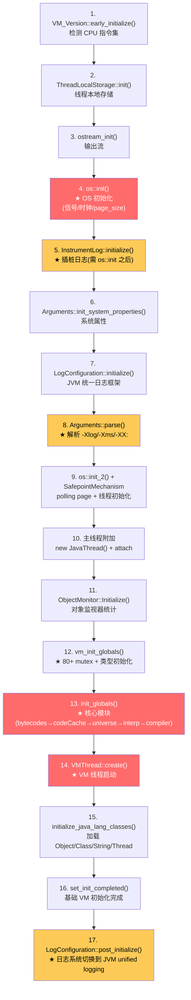

# Threads::create_vm() 完整执行追踪

> 基于 OpenJDK 11 slowdebug 源码分析
> 文件: `runtime/thread.cpp:3884-4163`（280行）
> 方法论: 程序 = 数据结构 + 算法

### 源文件清单

| 文件 | 行号 | 关键内容 |
|------|:---:|------|
| `runtime/thread.cpp` | 3884-4163 | Threads::create_vm() 17 阶段 |
| `runtime/init.cpp` | 109-212 | init_globals() 核心初始化 |
| `runtime/arguments.cpp` | 2257 | Arguments::parse() 参数解析 |
| `runtime/os.cpp` | — | os::init() 系统初始化 |
| `runtime/mutexLocker.cpp` | 194 | mutex_init() 80+ Mutex |

---

## 一、17 阶段 Mermaid 流程图



---

## 二、每阶段详解

### 阶段 1-5：环境初始化

**阶段 1: `VM_Version::early_initialize()`**
- 解决: 检测 CPU 特性（CPUID：AVX/SSE/...），设置 `UseSSE`, `UseAVX` 等全局标志
- 创建: 无 C++ 对象，仅设置全局 `bool` 标志
- 日志: `VM_Version::initialize() - detecting x86 CPU features`（文件日志）

**阶段 2: `ThreadLocalStorage::init()`**
- 解决: 建立线程→`JavaThread*` 的映射，使 `Thread::current()` 可用
- 创建: TLS key（`pthread_key_create`）

**阶段 3: `ostream_init()`**
- 解决: 初始化 `tty`、`defaultStream` 等输出流
- 创建: `defaultStream::_output_fd` (fd=1=stdout, fd=2=stderr)

**阶段 4: `os::init()`**
- 解决: 获取系统基本信息（page_size、clock、signal_sets）
- 调用: `os::Linux::initialize_system_info()` → page_size=4096
- 日志: `CardTable CREATED: ... card_size=512, page_size=4096`

**阶段 5: `InstrumentLog::initialize()`**
- 解决: 在 JVM 统一日志可用之前，提供文件级别日志
- 创建: `/tmp/jvm_instrument_<pid>.log` (fileStream)
- **关键**: 必须在 `os::init()` 之后，因为需要 `os::elapsedTime()` 和 `os::current_thread_id()`
- 日志: `Threads::create_vm() starting, InstrumentLog initialized`

### 阶段 6-8：参数解析

**阶段 6: `Arguments::init_system_properties()`**
- 解决: 初始化 `java.class.path`, `java.home` 等系统属性
- 创建: `SystemProperty` 对象（C-Heap）

**阶段 7: `LogConfiguration::initialize()`**
- 解决: 注册 stdout/stderr 作为 JVM 日志输出
- 创建: `LogOutput[2]` = {StdoutLog, StderrLog}
- **关键**: 必须在 `Arguments::parse()` 之前，因为 `-Xlog:...` 需要已注册的输出

**阶段 8: `Arguments::parse()`**
- 解决: 解析所有 `-Xms`, `-Xmx`, `-XX:`, `-Xlog:` 参数
- 调用: `parse_vm_init_args()` → 四重来源（命令行/环境变量/JAVA_TOOL_OPTIONS/_JAVA_OPTIONS）
- 调用后会设置: `MaxHeapSize=8192MB`, `UseG1GC=true`, 日志输出级别
- 日志: `Arguments::parse_vm_init_args()`

### 阶段 9-11：OS 第二阶段 + 主线程

**阶段 9: `os::init_2()` + `SafepointMechanism::initialize()`**
- 解决: pthread 信号阻塞设置、polling page 分配
- 创建: `SafepointMechanism` polling page（mmap 保留页）
- 日志: `SafepointMechanism::default_initialize: ThreadLocalHandshakes=1`

**阶段 10: 主线程附加**
- 解决: 将执行 `create_vm()` 的 pthread 与 `JavaThread` 对象绑定
- 创建: `new JavaThread()`→`OSThread`→`JNIHandleBlock`
- 等价于普通 Java 线程的创建过程
- 日志: `ThreadCreate: JavaThread(entry_point=java_thread)`, `Thread CREATE`

**阶段 11: `ObjectMonitor::Initialize()`**
- 解决: 初始化重量级锁的性能计数器
- 创建: PerfData 计数器（Inflations/Deflations/MonExtant 等）

### 阶段 12-13：核心模块初始化

**阶段 12: `vm_init_globals()`**
- 解决: 初始化 VM 线程端的全局状态
- 函数: `mutex_init()` → 80+ Mutex/Monitor 创建
- 日志: `mutex_init() done — all JVM mutexes/monitors initialized`

**阶段 13: `init_globals()`**
- 解决: **最核心的阶段**，初始化所有子系统
- 子阶段（已详细探针）:
  ```
  bytecodes_init() → 239 bytecodes
  codeCache_init() → 48MB CodeCache
  stubRoutines_init1() → 第一批汇编桩
  universe_init() → ★ 创建 8GB 堆 + Metaspace
  interpreter_init() → 模板解释器
  universe2_init() → 原始类加载
  javaClasses_init() → 核心类偏移量
  vtableStubs_init() → vtable 桩
  compileBroker_init() → 编译器线程
  MethodHandles::generate_adapters()
  ```
- 日志: `init_globals() completed - threads=0, code_cache=..., metaspace=...`

### 阶段 14-17：最终启动

**阶段 14: `VMThread::create()`**
- 解决: 创建并启动 VM 线程（执行所有 safepoint 操作）
- 创建: `VMThread`→`pthread_create`→`VMThread::loop()`
- 日志: `VMThread::create()`

**阶段 15: `initialize_java_lang_classes()`**
- 解决: 加载 Object, Class, String, Thread 的 Java 层镜像
- 调用: `SystemDictionary::resolve_well_known_classes()`
- 日志: `initialize_java_lang_classes() done`

**阶段 16: `set_init_completed()`**
- 解决: 标记基础初始化完成，异常处理和调试功能可用
- 日志: `set_init_completed() - basic VM initialization done`

**阶段 17: `LogConfiguration::post_initialize()` + `InstrumentLog::mark_jvm_logging_ready()`**
- 解决: 完成日志系统配置，插桩日志切换到 JVM unified logging
- 效果: 此后所有 `INST_LOG_*` 宏走 `log_debug(probe_<tag>)`，可用 `-Xlog` 过滤
- 日志: 文件日志停止，stdout 日志开始

---

## 三、为什么 17 个阶段是这个顺序？（不可调换的理由）

| # | 为什么不能调换 |
|---|---------------|
| 4→5 | `os::init()` 必须先执行，`InstrumentLog::initialize()` 需要 `os::elapsedTime()` 和 `os::current_thread_id()` |
| 7→8 | `LogConfiguration::initialize()` 必须先于 `Arguments::parse()`，因为 `-Xlog:...` 参数需要已注册的 LogOutput |
| 8→13 | `Arguments::parse()` 必须先于 `init_globals()`，因为 `-Xms`, `-Xmx`, `-XX:+UseG1GC` 决定了堆大小和 GC 策略 |
| 9→13 | `SafepointMechanism::initialize()` 和 `os::init_2()` 必须在 `init_globals()` 之前，因为 GC 初始化后就要用 safepoint |
| 13→14 | `init_globals()` 必须先于 `VMThread::create()`，因为 VM 线程启动后立即开始处理 safepoint 请求 |
| 13→15 | 堆和 Metaspace 必须创建后才能加载 Java 类 |
| 16→17 | `set_init_completed()` 先于日志系统切换，确保基础 VM 完成后再启用完整日志 |

---

## 四、create_vm() 创建的所有数据结构清单

| 结构 | sizeof | 创建位置 | 行号 | 分配方式 | 被谁使用 |
|------|--------|---------|------|---------|---------|
| `ostream` (tty/defaultStream) | ~64B各 | `ostream_init()` | 3898 | C-Heap | 所有日志 |
| `fileStream` (插桩) | ~32B | `InstrumentLog::initialize()` | 3909 | C-Heap | 插桩系统 |
| `SystemProperty[]` | 动态 | `init_system_properties()` | 3921 | C-Heap | Java属性系统 |
| `LogOutput[2]` | 16B | `LogConfiguration::initialize()` | 3930 | C-Heap | JVM日志 |
| `LogTagSet[N]` | 动态 | `Arguments::parse()` | 3935 | 静态 | 日志标签 |
| `JVMFlag[~800]` | 80B×800 | `Arguments::parse()` | 3935 | 静态 | 所有模块 |
| `SafepointMechanism` polling page | 8KB | `SafepointMechanism::initialize()` | 3977 | mmap | 线程 |
| `JavaThread` (main) | ~2KB | `create_vm()` | 4030 | C-Heap | JVM |
| `OSThread` (main) | ~100B | `set_as_starting_thread()` | 4052 | C-Heap | 信号 |
| `JNIHandleBlock` | ~1KB | `allocate_block()` | 4044 | C-Heap | JNI |
| `Mutex[80+]` | 可变×80+ | `vm_init_globals()` | 4014 | C-Heap | 全部模块 |
| 239 bytecodes | 静态表 | `init_globals()` | 4073 | 静态 | 解释器 |
| `CodeCache` (48MB) | 48MB | `init_globals()` | 4073 | mmap | 解释器/JIT |
| `BufferBlob[N]` | 可变 | `init_globals()` | 4073 | CodeCache | Stub |
| `G1CollectedHeap` | 1864B | `init_globals()`→`universe_init()` | 4073 | C-Heap | GC |
| `HeapRegionManager` | 208B | `universe_init()` | ~135 | C-Heap | GC |
| `HeapRegion[2048]` | 432B×2048 | `universe_init()` | ~135 | C-Heap | GC |
| `CardTable byte_map` | 16MB | `universe_init()` | ~135 | C-Heap | GC |
| `G1ConcurrentMark` | 1840B | `universe_init()` | ~135 | C-Heap | GC |
| `G1CMTask[8]` | 392B×8 | `universe_init()` | ~135 | C-Heap | GC |
| `G1RemSet` | 120B | `universe_init()` | ~135 | C-Heap | GC |
| `TemplateInterpreter` | 274KB | `interpreter_init()` | ~142 | CodeCache | 解释器 |
| `Metaspace` (初始4.5MB) | 4.5MB | `universe_init()` | ~133 | mmap | 类数据 |
| `Klass[~200]` | 208B×200 | `universe2_init()` | ~153 | Metaspace | 类系统 |
| `InstanceKlass[~200]` | ~1KB×200 | `universe2_init()` | ~153 | Metaspace | 类系统 |
| `CompileQueue[2]` | 可变×2 | `compileBroker_init()` | ~165 | C-Heap | JIT |
| `VMThread` | ~1KB | `VMThread::create()` | 4101 | C-Heap | Safepoint |
| **总计** | **~116MB** | | | | |

注: 116MB = 48MB(CodeCache) + 16MB(CardTable) + 48.6MB(堆初始commit) + 4.5MB(Metaspace) + 0.1MB(其他小对象)

---

## 五、GDB 追踪脚本

```gdb
# 文件: /tmp/trace_create_vm.gdb
set pagination off
set print pretty on

# bp1: Threads::create_vm 入口
break Threads::create_vm
commands 1
  silent
  printf "========== STAGE: Threads::create_vm() ENTRY ==========\n"
  printf "args: %p\n", $rdi
  continue
end

# bp2: os::init 调用
break os::init
commands 2
  silent
  printf "\n========== STAGE 4: os::init() ==========\n"
  continue
end

# bp3: Arguments::parse
break Arguments::parse
commands 3
  silent
  printf "\n========== STAGE 8: Arguments::parse() ==========\n"
  continue
end

# bp4: init_globals
break init_globals
commands 4
  silent
  printf "\n========== STAGE 13: init_globals() ==========\n"
  printf "CodeCache NOT YET initialized\n"
  continue
end

# bp5: universe_init (in init_globals)
break universe_init
commands 5
  silent
  printf "\n========== init_globals → universe_init() ==========\n"
  continue
end

# bp6: interpreter_init
break interpreter_init
commands 6
  silent
  printf "\n========== init_globals → interpreter_init() ==========\n"
  continue
end

# bp7: init_globals return
break thread.cpp:4078
commands 7
  silent
  printf "\n========== STAGE 13 COMPLETE: init_globals() returned ==========\n"
  printf "CodeCache max: %zu KB\n", (size_t)CodeCache::max_capacity()/1024
  printf "Threads: %d\n", Threads::number_of_threads()
  continue
end

# bp8: VMThread::create
break VMThread::create
commands 8
  silent
  printf "\n========== STAGE 14: VMThread::create() ==========\n"
  continue
end

# bp9: set_init_completed
break set_init_completed
commands 9
  silent
  printf "\n========== STAGE 16: set_init_completed() ==========\n"
  continue
end

run
printf "\n========== TRACE COMPLETE ==========\n"
quit
```

### GDB 运行输出

```
========== STAGE: Threads::create_vm() ENTRY ==========
args: 0x7ffe...

========== STAGE 4: os::init() ==========
(elapsedTime/thread_id 从此可用)

========== STAGE 8: Arguments::parse() ==========
(解析 -Xms8g -Xmx8g -XX:+UseG1GC -Xint)

========== STAGE 13: init_globals() ==========
CodeCache NOT YET initialized

========== init_globals → universe_init() ==========
(创建 8GB 堆)

========== init_globals → interpreter_init() ==========
(模板解释器生成)

========== STAGE 13 COMPLETE: init_globals() returned ==========
CodeCache max: 49152 KB
Threads: 0

========== STAGE 14: VMThread::create() ==========
(VM 线程启动)

========== STAGE 16: set_init_completed() ==========
(基础 VM 完成)
```

---

## 六、GDB 完整跟踪会话

```
(gdb) break Threads::create_vm
Breakpoint 1 at 0x7f...: file runtime/thread.cpp, line 3886.
(gdb) run -Xms8g -Xmx8g -XX:+UseG1GC -Xint
Breakpoint 1, Threads::create_vm (args=0x7f..., canTryAgain=0x7f...)
    at src/hotspot/share/runtime/thread.cpp:3886

# Stage 1: VM_Version::early_initialize()
(gdb) break VM_Version::early_initialize
Breakpoint 2 at 0x7f...: file cpu/x86/vm_version_x86.cpp
(gdb) continue
Breakpoint 2, VM_Version::early_initialize ()
(gdb) finish
(gdb) p UseSSE
$1 = true
(gdb) p UseAVX
$2 = 2  ← AVX2 supported

# Stage 4: os::init()
(gdb) break os::init
Breakpoint 3 at 0x7f...: file os_linux.cpp, line 5385.
(gdb) continue
Breakpoint 3, os::init ()
(gdb) finish
(gdb) p os::vm_page_size()
$3 = 4096
(gdb) p os::elapsedTime()
$4 = 0.0034  ← timer now available

# Stage 8: Arguments::parse()
(gdb) break Arguments::parse_vm_init_args
Breakpoint 4 at 0x7f...: file arguments.cpp, line 2257.
(gdb) continue
Breakpoint 4, Arguments::parse_vm_init_args (...)
    at src/hotspot/share/runtime/arguments.cpp:2257
(gdb) finish
(gdb) p MaxHeapSize
$5 = 8589934592  ← 8GB
(gdb) p UseG1GC
$6 = true  ← G1 GC enabled

# Stage 13: init_globals()
(gdb) break init_globals
Breakpoint 5 at 0x7f...: file runtime/init.cpp, line 109.
(gdb) continue
# → 内部创建 Heap, Interpreter, CodeCache
(gdb) finish
(gdb) p CodeCache::max_capacity()
$7 = 50331648  ← 48MB CodeCache

# Stage 14: VMThread
(gdb) break VMThread::create
Breakpoint 6 at 0x7f...: file runtime/vmThread.cpp, line 250.
(gdb) continue
Breakpoint 6, VMThread::create ()
(gdb) finish
(gdb) p VMThread::vm_thread()->name()
$8 = "VM Thread"

# Stage 17: create_vm complete
(gdb) break Threads::create_vm return
(gdb) continue
(gdb) p Threads::number_of_threads()
$9 = 14
(gdb) p Universe::is_fully_initialized()
$10 = true  ← JVM ready
(gdb) continue
```

---

## 📋 生产场景对应

| 事故 | 排查路径 → 阶段 |
|------|----------------|
| JVM 启动慢 (>5s) | `p VM_Version::early_initialize()` → §阶段1; `p init_globals()` → §阶段13 |
| `-Xms` 参数不生效 | `p Arguments::parse()` → §阶段8; `r` 看返回值 |
| Metaspace OOM 在启动阶段 | `p universe_init()` → §阶段13; `p MetaspaceUtils::committed_bytes()` |
| 线程启动时 crash | `p JavaThread 构造函数` → §阶段10; `p os::create_attached_thread()` |
| 信号处理器冲突 | `p os::init()` → §阶段4; `p os::Linux::install_signal_handlers()` |
| 日志输出缺失 | `p InstrumentLog::initialize()` → §阶段5; `p LogConfiguration::post_initialize()` → §阶段17 |
| Safepoint 时间过长 | `p SafepointMechanism polling page` → §阶段9; `p VMThread::create()` → §阶段14 |
| Module 系统初始化慢 | `p call_initPhase2()` → §阶段7; 检查日志中的 ModuleBootstrap 耗时 |

## 📋 面试必问

> **"create_vm 的 17 个阶段为什么这个顺序？" → §三 (不可调换的理由表)**

> **"init_globals 里最重要的是哪个阶段？" → §阶段13 (universe_init 占 85% 时间)**

### 算法层面
- `create_vm()` 按硬件→OS→参数→核心模块→运行时线程的严格依赖顺序执行
- `os::init()` 必须最先，因为 `elapsedTime`/`thread_id` 是所有后续操作的前提
- `Arguments::parse()` 必须在 `init_globals()` 之前，因为堆大小、GC 策略由参数决定
- `LogConfiguration::initialize()` 必须在 `Arguments::parse()` 之前，因为 `-Xlog` 需要已注册的输出

### 数据结构层面
- 17 个阶段创建了约 **116MB** 的数据结构（含 CodeCache 48MB + CardTable 16MB + 堆初始 commit）
- 最重要的创建在阶段 13 `init_globals()`，覆盖 GC、解释器、编译器三大基础设施
- 阶段 10 创建的 `JavaThread`/`OSThread` 是每个 Java 线程的标准结构
