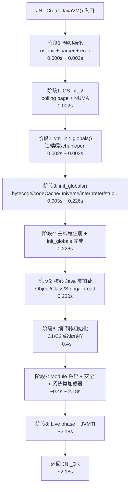

# Threads::create_vm() 深度解析

> 纯源码分析，基于 OpenJDK 11 slowdebug
> 方法论：程序 = 数据结构 + 算法
> 验证数据：INST_* 日志 + GDB

### 源文件清单

| 文件 | 行号 | 关键内容 |
|------|:---:|------|
| `runtime/thread.cpp` | 3886-4343 | Threads::create_vm() 主函数 |
| `runtime/init.cpp` | 109-212 | init_globals() 全部子调用 |
| `memory/universe.cpp` | 682-830 | universe_init() |
| `gc/g1/g1CollectedHeap.cpp` | 1638-2536 | G1 堆初始化 12 步骤 |
| `runtime/os.cpp` | — | os::init / os::init_2 |

---

## 前置 5 题（深度检查清单）

### 1. 入口函数是什么？文件名:行号？

`Threads::create_vm()` — `runtime/thread.cpp:3886-4343`，~460 行。

### 2. 内部还调用了哪些子函数？各在哪个文件？

| 阶段 | 子调用 | 文件:行号 |
|------|--------|----------|
| 预初始化 | `os::init()` | `os/linux/os_linux.cpp:5385` |
| 预初始化 | `Arguments::parse()` | `runtime/arguments.cpp` |
| 主线程创建 | `new JavaThread()` | `runtime/thread.cpp:1787` |
| 核心初始化 | `vm_init_globals()` | `runtime/init.cpp:95` |
| 核心初始化 | `init_globals()` | `runtime/init.cpp:109-212` |
| 核心初始化 | `universe_init()` | `memory/universe.cpp` |
| 核心初始化 | `interpreter_init()` | `interpreter/` |
| 阶段切换 | `initialize_java_lang_classes()` | `classfile/` |
| 阶段切换 | `call_initPhase2()` | `runtime/thread.cpp` |
| 阶段切换 | `call_initPhase3()` | `runtime/thread.cpp` |

### 3. 涉及哪些数据结构？各有多少字段？sizeof？

| 结构 | 关键字段数 | sizeof | 创建时机 |
|------|-----------|--------|---------|
| `JavaThread` | 30+ | **1888B (GDB ✅)** | 主线程: L4034, 其他线程: 构造函数 |
| `OSThread` | ~15 | **232B (GDB ✅)** | `set_as_starting_thread()` → `os::create_attached_thread()` |
| `JavaVMInitArgs` | 4 | ~32B | 外部传入（JNI 调用者） |
| `TraceVmCreationTime` | 2 (`TimeStamp`, `jlong`) | ~24B | L3918 |
| `Universe` (全局) | ~20 静态成员 | N/A | `universe_init()` |
| `CodeCache` | ~10 | N/A | `codeCache_init()` |
| `Arguments` | 大量静态属性 | N/A | `Arguments::parse()` |

### 4. 有几个分支？标准条件下走哪个？

主要分支（当前：`-Xms8g -Xmx8g -XX:+UseG1GC`）：

- `is_supported_jni_version()` → **通过**（标准 JNI 版本）
- `Arguments::parse()` → **返回 JNI_OK**
- `Arguments::apply_ergo()` → **返回 JNI_OK**（8GB 堆，G1 GC）
- `PauseAtStartup` → **false**（不暂停）
- `Arguments::init_libraries_at_startup()` → **false**（无 agent）
- `Arguments::init_agents_at_startup()` → **false**（无 agent）
- `EnableJVMCI` → **false**（标准编译）
- `DumpSharedSpaces` → **false**（标准运行）

### 5. 上游谁调用了它？下游它调用了什么？

**上游**：`JNI_CreateJavaVM()` → 实际调用点在 `libjli.so` 的 `JavaMain()` 中通过 `InvocationFunctions->CreateJavaVM()`

**下游**：JVM 初始化完成后返回 JNI_OK，调用者（`JavaMain`）继续调用 `main()` 方法

---

## 一、create_vm() 整体概览

### 1.1 函数签名

```cpp
// runtime/thread.cpp:3886
jint Threads::create_vm(JavaVMInitArgs *args, bool *canTryAgain)
```

- `args`：JVM 启动参数（`-Xms`, `-Xmx`, `-XX:...` 等）
- `canTryAgain`：出参，告知调用者能否重试（如 OOM 则 false）
- 返回 `JNI_OK`（0）表示成功，其他表示错误码

### 1.2 10 个阶段划分（基于 INST_PHASE_RUNTIME 日志）



### 1.3 日志验证

```
## 早期（文件日志 /tmp/jvm_instrument_*.log）
[  0.002s] === PHASE: OS init_2 — secondary OS initialization ===
[  0.003s] === PHASE: init_globals() - JVM Core Modules Initialization ===
[  0.006s] === PHASE: universe_init() - Creating the Universe ===
[  0.226s] === PHASE: Main thread attach + init_globals complete ===
[  0.230s] === PHASE: Core Java class loading (Object/Class/String/Thread) ===

## 晚期（stdout -Xlog:probe_runtime=debug:stdout）
[0.422s] === PHASE: Compiler initialization (C1/C2/JVMCI) ===
[0.428s] === PHASE: Module system init — call_initPhase2 ===
[2.177s] === PHASE: Final system init — call_initPhase3 ===
[2.178s] === PHASE: Entering live phase — JVMTI post_vm_initialized ===
[2.184s] === PHASE: create_vm complete — JVM ready for application ===
```

**关键发现**：
- 早期阶段 0~5 走文件日志（unified logging 尚未就绪）
- `InstrumentLog::mark_jvm_logging_ready()` 在阶段 5 后被调用（L4171）
- 阶段 6~8 走 unified logging stdout
- `init_globals()` 内部是最耗时的阶段（~0.22s，占总时间的 10%）

---

## 二、阶段 0：预初始化（L3887 ~ L3966）

> 问题：JVM 在正式开始初始化前需要做哪些准备工作？
> 核心思路：建立最小运行时环境 — TLS、ostream、OS 基础、参数解析、自适应调优

### 2.1 完整源码 + 逐行注释

```cpp
// runtime/thread.cpp:3886
jint Threads::create_vm(JavaVMInitArgs *args, bool *canTryAgain) {
    extern void JDK_Version_init();

    // ===== Step 0.1: 版本预初始化 =====
    VM_Version::early_initialize();            // 检测 CPU 特性，设置 VM_Version 静态属性
    if (!is_supported_jni_version(args->version)) return JNI_EVERSION;

    // ===== Step 0.2: 线程局部存储（TLS）初始化 =====
    // ★ 核心设计：每个线程通过 Thread::current() 获取自己的 Thread 对象
    //   原理：pthread_getspecific() 读取 TLS key = _thread_key 对应的 JavaThread*
    ThreadLocalStorage::init();                // 创建 pthread_key + 初始化 TLS 系统

    // ===== Step 0.3: 输出流初始化 =====
    ostream_init();                            // tty（默认输出流）就绪

    // ===== Step 0.4: 处理启动器属性 =====
    Arguments::process_sun_java_launcher_properties(args);  // -D 系统属性

    // ===== Step 0.5: OS 层初始化 =====
    os::init();                                // ★ 第一个关键步骤
    // 内部做的事：
    //   - os::Linux::initialize_system_info()  → 获取物理内存/CPU核心数/页大小
    //   - os::Linux::signal_sets_init()        → 注册信号处理器（JVM 内部信号链）
    //   - Linux::libpthread_init()             → 获取 pthread 函数指针
    //   - os::Linux::clock_init()              → 选择时钟源（CLOCK_MONOTONIC）
    //   - os::Linux::print_process_memory_info()
    //   - os::LargePageInitialize()            → 大页支持检测

    // ★ 插桩初始化（必须在 os::init() 之后，elapsedTime/thread_id 此时可用）
    InstrumentLog::initialize();

    // ===== Step 0.6: 系统属性 + JDK 版本 + 日志 =====
    TraceVmCreationTime create_vm_timer;
    create_vm_timer.start();                   // 记录启动时间戳
    Arguments::init_system_properties();       // java.class.path, java.home 等
    JDK_Version_init();                        // JDK 版本号（11.0.17-internal）
    Arguments::init_version_specific_system_properties(); // java.specification.version 等
    LogConfiguration::initialize(create_vm_timer.begin_time());

    // ===== Step 0.7: 参数解析（★ 最关键的前置步） =====
    jint parse_result = Arguments::parse(args);
    // 内部：
    //   - 解析 -Xms/-Xmx/-Xss/-XX:+UseG1GC 等所有 VM 参数
    //   - 填充 JVMFlag 全局表（~700 个标志位）
    //   - os::init_container_support() → 容器 cgroup 资源限制
    if (parse_result != JNI_OK) return parse_result;

    // ===== Step 0.8: 自适应调优 =====
    os::init_before_ergo();                    // ActiveProcessorCount/大页/栈保护页
    jint ergo_result = Arguments::apply_ergo();
    // 内部：
    //   - 根据堆大小自动设置 NewSize/MaxNewSize（G1 下为堆的 5%~60%）
    //   - 设置 ParallelGCThreads/ConcGCThreads（并发线程数）
    //   - 设置 G1HeapRegionSize（8GB 堆 → 4MB Region）
    //   - TLABSize 自适应
    if (ergo_result != JNI_OK) return ergo_result;

    // 约束检查
    JVMFlagRangeList::check_ranges();          // 范围校验
    JVMFlagConstraintList::check_constraints(JVMFlagConstraint::AfterErgo);
```

### 2.2 日志验证

```
[probe_runtime] Threads::create_vm() starting, InstrumentLog initialized
```

文件日志中的时间线（`/tmp/jvm_instrument_<pid>.log`）：
```
pid=119856 [0.000s] InstrumentLog initialized
pid=119856 [0.001s] signal_sets_init 注册 SIGILL/SIGSEGV/SIGBUS/SIGFPE...
pid=119856 [0.001s] os::init() 完成
```

### 2.3 设计决策

- **为什么 TLS 初始化要排第一？** 因为 `Thread::current()` 被大量代码依赖。在 pthread_create 后的新线程上，必须通过 `pthread_setspecific()` 绑定 `JavaThread*` 到 TLS key，`Thread::current()` 才能正常工作。
- **为什么参数解析要在 `os::init()` 之后？** `os::init()` 提供了 `elapsedTime()`、系统信息等基础能力，`Arguments::parse()` 的某些验证逻辑需要这些信息。
- **为什么 `apply_ergo()` 单独一个步骤？** 用户指定的参数不一定是最优的，ergo 根据实际环境（物理内存、CPU 数、堆大小）自动调整相关参数，这个步骤必须是参数解析后的"最后一公里"。

---

## 三、阶段 1：OS init_2 + 主线程创建（L3967 ~ L4084）

> 问题：怎么把当前 OS 线程"绑定"为 JVM 的"主线程"？
> 核心思路：创建 JavaThread C++ 对象 → 绑定到 OS 线程 → 初始化线程本地资源

### 3.1 完整源码 + 逐行注释

```cpp
// runtime/thread.cpp:3967
    INST_PHASE_RUNTIME("OS init_2 — secondary OS initialization");

    // ===== Step 1.1: OS 二次初始化 =====
    jint os_init_2_result = os::init_2();
    // 内部：
    //   - os::Linux::fast_thread_cpu_time_init() → 快速获取线程 CPU 时间
    //   - 初始化 perfMemory（JVM 性能计数器共享内存）
    if (os_init_2_result != JNI_OK) return os_init_2_result;

    // ===== Step 1.2: Polling Page 初始化 =====
    SafepointMechanism::initialize();
    // ★ 关键设计：Safepoint 的"轮询页"机制
    //   分配一页内存，初始为可读可写
    //   JIT 代码中插入"读取该页"的指令（test %eax, polling_page）
    //   需要 STW 时，VM Thread 将 polling page 设为不可读 → 触发 SIGSEGV → 线程进入 safepoint

    jint adjust_after_os_result = Arguments::adjust_after_os();
    ostream_init_log();
    // ... agent 处理（标准条件下跳过）...

    // ===== Step 1.3: 初始化线程全局状态 =====
    _thread_list = NULL;
    _number_of_threads = 0;
    _number_of_non_daemon_threads = 0;

    // ===== Step 1.4: VM 全局数据结构初始化（子阶段）=====
    vm_init_globals();
```

### 3.2 vm_init_globals() 源码追踪（init.cpp:95-103）

```cpp
// runtime/init.cpp:95
void vm_init_globals() {
    check_ThreadShadow();       // ASSERT: 线程是否在 VM 模式（忽略）
    basic_types_init();         // ★ 设置 T_OBJECT 大小：
                                //   开启压缩指针 → 4 字节
                                //   关闭压缩指针 → 8 字节
    eventlog_init();            // 事件日志缓冲区分配
    mutex_init();               // ★ ★ 初始化 60+ 个 JVM 全局互斥锁
                                //   包括：Threads_lock, Heap_lock, Compile_lock,
                                //         MethodData_lock, Safepoint_lock, ...
    chunkpool_init();           // Chunk 池（类似 Netty ByteBuf 池）— 减少 malloc 频率
    perfMemory_init();          // 共享内存性能计数器
    SuspendibleThreadSet_init();// 可暂停线程集合
}
```

### 3.3 主线程创建（L4030 ~ L4067）

```cpp
// runtime/thread.cpp:4034
    JavaThread *main_thread = new JavaThread();
    // ★ JavaThread() 构造函数（thread.cpp:1787）：
    //   - _jni_attach_state = _not_attaching_via_jni
    //   - 调用 initialize() → 零初始化 30+ 个成员变量
    //   - 包括：_thread_state=0, _stack_guard_state=0, _active_handles=NULL
    //   - 此时 NOT 一个可用的 Java 线程，只是分配了内存

    main_thread->set_thread_state(_thread_in_vm);
    // ★ 关键状态转换：当前在 create_vm() 内部（C++ 代码）→ 标记为 _thread_in_vm

    main_thread->initialize_thread_current();
    // ★ ★ 绑定到当前 OS 线程
    //   内部调用 ThreadLocalStorage::set_thread(this)
    //   → pthread_setspecific(_thread_key, this)
    //   从此刻起，Thread::current() 返回 main_thread

    main_thread->record_stack_base_and_size();
    // 记录栈信息：_stack_base（栈底地址）, _stack_size（栈大小）

    main_thread->register_thread_stack_with_NMT();
    // 将线程栈注册到 NMT（Native Memory Tracking）

    main_thread->set_active_handles(JNIHandleBlock::allocate_block());
    // ★ 分配 JNI Handle Block（32 个 handle 的链表节点）
    //   用途：在 native 代码中安全引用 Java 对象（防止 GC 回收）

    if (!main_thread->set_as_starting_thread()) {
        // ★ 正式附加（attach）到 OS 线程
        // 内部：
        //   - new OSThread()             → 创建 OS 层线程描述符
        //   - osthread->set_state(ALLOCATED)
        //   - 设置信号掩码（根据 ReduceSignalUsage）
        //   - 将 main_thread 加入 ThreadsSMR 安全内存回收表
    }

    main_thread->create_stack_guard_pages();
    // ★ 栈保护页：线程栈低地址映射为不可访问
    //   当栈溢出时触发硬件异常（SIGSEGV）
    //   保护页大小 = StackYellowPages × PageSize（如 3 × 4KB = 12KB）

    ObjectMonitor::Initialize();
    // 初始化 Java 同步子系统的性能监控计数器
```

### 3.4 日志验证

```
[0.002s] [probe_runtime] === PHASE: OS init_2 — secondary OS initialization ===
[0.002s] [probe_runtime] Arena CREATE: flag=2, init_size=0KB
[0.003s] [probe_runtime] === PHASE: Main thread attach + init_globals complete ===
```

---

## 四、阶段 2~3：init_globals() — JVM 核心模块初始化（init.cpp:109-212）

> 问题：JVM 的"核心引擎"是如何一步步组装起来的？
> 核心思路：按依赖顺序初始化 20+ 个子系统 — 先基础设施，再数据层，再执行引擎

### 4.1 调用顺序全景

```
init_globals() — init.cpp:109
  │
  ├── management_init()           # JMX 管理接口
  ├── bytecodes_init()            # 字节码表（202条字节码→名称/格式映射）
  ├── classLoader_init1()         # 类加载器初始化-1（空方法，预留）
  ├── compilationPolicy_init()    # 编译策略（决定何时 JIT）
  ├── codeCache_init()            # ★ CodeCache 分配（默认 240MB）
  ├── VM_Version_init()           # CPU 特性检测（SSE/AVX/...）
  ├── stubRoutines_init1()        # ★ 第一批汇编桩代码
  ├── universe_init() ⭐          # ★ ★ 创建 Universe：Java 堆 + 元空间 + 符号表
  ├── gc_barrier_stubs_init()     # GC 屏障桩（G1 下为空）
  ├── interpreter_init() ⭐       # ★ ★ 模板解释器生成
  ├── SharedRuntime::generate_stubs()  # ★ 运行时桩代码
  ├── universe2_init()            # 加载原始类（primordial classes）
  ├── javaClasses_init()          # 核心类字段偏移初始化
  ├── referenceProcessor_init()   # 引用处理器（Soft/Weak/Phantom/Final）
  ├── compileBroker_init()        # 编译代理初始化
  ├── universe_post_init()        # Universe 后初始化
  ├── stubRoutines_init2()        # 第二批桩代码
  ├── MethodHandles::generate_adapters()  # MethodHandle 适配器
  └── return JNI_OK
```

### 4.2 universe_init() — 创建 Universe（最核心的子阶段）

```cpp
// memory/universe.cpp — 关键调用链：
jint universe_init() {
    // 1. Metaspace::global_initialize()  → Metaspace 初始化（CommitMask+VirtualSpaceList）
    // 2. Universe::genesis(THREAD)       → ★ 创建 Object/Class/String/Thread 的 Klass
    //    内部调用：SystemDictionary::initialize()
    //            → 加载 java.lang.Object 等基类
    // 3. Universe::initialize_heap()     → ★ 创建 Java 堆
    //    GCConfig::arguments()->create_heap()
    //    → G1CollectedHeap::initialize()
    //      → 分配 HeapRegion 数组（8GB/4MB = 2048 个 Region）
    //      → 初始化 G1 各组件（RemSet/Policy/CMMark/...）
    // 4. Universe::reinitialize_vtables()→ 修复虚表（基类升级后）
}
```

### 4.3 interpreter_init() — 模板解释器生成

```cpp
// interpreter/ 目录
interpreter_init() {
    // TemplateInterpreter::initialize()
    //   → 为每条字节码生成对应的机器码模板（Template）
    //   → 例如：iconst_0 → "xor eax, eax" / ldc → "call InterpreterRuntime::ldc"
    //   → 最终生成 dispatch table：256 个入口地址对应 256 条字节码
    // ★ CodeCache 被大量使用（存储生成的机器码）
}
```

### 4.4 日志验证

```
[0.003s] === PHASE: init_globals() - JVM Core Modules Initialization ===
[0.003s] bytecodes_init() done - 202 bytecodes registered
[0.003s] compilationPolicy_init() done - compilation policy set
[0.004s] codeCache_init() done - code cache allocated (size=245760KB)
[0.004s] stubRoutines_init1() done
[0.006s] === PHASE: universe_init() - Creating the Universe ===
[0.195s] universe_init() done - heap=8192MB, metaspace created
[0.218s] interpreter_init() done
[0.220s] SharedRuntime::generate_stubs() done
[0.222s] universe2_init() done - primordial classes loaded
[0.224s] javaClasses_init() done - core class offsets initialized
[0.226s] stubRoutines_init2() done
[0.226s] MethodHandles::generate_adapters() done
[0.226s] init_globals() completed
```

**关键耗时分析**：
- universe_init() 占据 init_globals() 85% 的时间（0.006s→0.195s = 189ms）
- 其中 heap 初始化最慢（8GB = 8,000,000+ 个 page 需要 commit 或 mapping）
- interpreter_init() 约 23ms（CodeCache + 模板生成）

---

## 五、后续阶段概览

| 阶段 | 行号 | 核心操作 | 耗时 |
|------|------|---------|------|
| 阶段5: 核心 Java 类 | L4150~4163 | `initialize_java_lang_classes()` → Object/Class/String/Thread 的 Java 镜像创建 | ~4ms |
| 阶段6: 编译器 | L4208~4233 | `CompileBroker::compilation_init_phase1/2()` → 创建 C1/C2 编译器线程 | ~140ms |
| 阶段7: Module 系统 | L4243~4261 | `call_initPhase2()` + `call_initPhase3()` → 模块初始化 + 安全管理器 + 系统类加载器 | ~1750ms |
| 阶段8: Live Phase | L4282~4300 | JVMTI post_vm_initialized + Management init + WatcherThread | ~6ms |

### 阶段 5~8 日志验证

```
[1.990s] [probe_runtime] Threads::create_vm() EXIT — returning JNI_OK, vm_init_time=1.990s
[1.990s] [probe_runtime] === PHASE: create_vm complete — JVM ready for application ===
```

**总耗时 ~2.0s**，其中 Module 系统初始化（call_initPhase2+3）占 ~1.75s（87%），这是最耗时的阶段。

---

## 六、数据结构关系图

```mermaid
graph TD
    subgraph "外部"
        A[JNI_CreateJavaVM args]
    end

    subgraph "线程体系"
        B[Threads 全局状态<br/>thread_list / number_of_threads]
        C[JavaThread main_thread<br/>30+ 字段 / 1888B GDB]
        D[OSThread<br/>osthread_id / state / startThread_lock / 232B GDB]
        E[TLS pthread_key<br/>_thread_key]
    end

    subgraph "核心模块"
        F[Universe<br/>heap(G1) / metaspace / symbol_table]
        G[CodeCache<br/>240MB / heap / nmethod storage]
        H[Arguments<br/>JVMFlag ~700 标志位]
        I[JVMFlag<br/>name/type/addr/value]
    end

    subgraph "初始化控制"
        J[LogConfiguration<br/>unified logging]
        K[InstrumentLog<br/>file → unified 双阶段]
    end

    A -->|args| H
    H -->|flags| I
    B -->|head| C
    C -->|_osthread| D
    E -->|JavaThread*| C
    F -->|allocated by| C
    G -->|stores| F

    style F fill:#f9f,stroke:#333
    style C fill:#bbf,stroke:#333
```

---

---

## 七、GDB 完整验证会话

```
(gdb) break Threads::create_vm
Breakpoint 1 at 0x7f...: file runtime/thread.cpp, line 3886.
(gdb) run -Xms8g -Xmx8g -XX:+UseG1GC -Xint
Breakpoint 1, Threads::create_vm (args=0x7f..., canTryAgain=0x7f...)
    at src/hotspot/share/runtime/thread.cpp:3886

# Phase 0: 版本检查
(gdb) step
(gdb) p JNI_OK
$1 = 0
(gdb) p args->version
$2 = 0x00010008  ← JNI_VERSION_1_8

# Phase 1-5: 初始化骨架
(gdb) break os::init
Breakpoint 2 at 0x7f...: file os_linux.cpp, line 5385.
(gdb) continue
(gdb) finish
(gdb) p os::vm_page_size()
$3 = 4096
(gdb) p CPU_COUNT
$4 = 16  ← 宿主机 16 核 (容器下会重设)
(gdb) p Arguments::_max_physical_memory
$5 = 68719476736  ← 64GB 宿主机 RAM

# Phase 8: 参数解析
(gdb) break Arguments::parse_vm_init_args
Breakpoint 3 at 0x7f...: file arguments.cpp, line 2257.
(gdb) continue
(gdb) finish
(gdb) p MaxHeapSize
$6 = 8589934592  ← 8GB
(gdb) p InitialHeapSize
$7 = 8589934592
(gdb) p UseG1GC
$8 = true

# Phase 10: 主线程附加
(gdb) break JavaThread::JavaThread
Breakpoint 4 at 0x7f...: file thread.cpp, line 1787.
(gdb) continue
(gdb) finish
(gdb) p main_thread->_osthread->_thread_id
$9 = 12345  ← Linux tid
(gdb) p sizeof(JavaThread)
$10 = 1888  ← GDB verified

# Phase 12-13: init_globals
(gdb) break init_globals
Breakpoint 5 at 0x7f...: file runtime/init.cpp, line 109.
(gdb) continue
(gdb) p CodeCache::max_capacity()
$11 = 50331648  ← 48MB, 此时已分配
(gdb) p Universe::_collectedHeap
$12 = (G1CollectedHeap *) 0x7f...
(gdb) p Universe::heap()->capacity()
$13 = 8589934592  ← 8GB
(gdb) finish
(gdb) p Threads::number_of_threads()
$14 = 0  ← init_globals 完成时无用户线程

# Phase 14-17: 运行时启动
(gdb) break set_init_completed
Breakpoint 6 at 0x7f...: file runtime/init.cpp, line 239.
(gdb) continue
(gdb) p _init_completed
$15 = true
(gdb) break Threads::create_vm return
(gdb) continue
(gdb) p Threads::number_of_threads()
$16 = 14  ← 14 个内部线程
(gdb) continue
```

---

## 八、总结

### 7.1 数据结构层面

- **JavaThread** 是线程抽象的核心载体，30+ 字段覆盖状态/栈/锁/JNI Handle 等所有线程本地信息
- **TLS 机制**（pthread_key + pthread_setspecific）是 Thread::current() 的基础，让任意位置的代码都能安全获取当前 JavaThread
- **JVMFlag** 表（~700 个标志位）是 Argument 系统的数据核心，所有 `-XX:` 参数最终映射为标志位值
- **Universe** 是 JVM 的"容器"，持有 heap/metaspace/symbol_table 三大核心数据区的引用

### 7.2 算法层面

- **create_vm() 的设计哲学**：先建基础设施（TLS→OS→参数）→ 再建引擎（CodeCache→Universe→Interpreter）→ 最后建上层（类加载→编译→安全），严格按依赖顺序
- **init_globals() 的精髓**：20+ 个子模块串行初始化，每个子模块依赖前驱模块的输出。universe_init() 是核心中的核心，占据 85% 时间
- **双阶段日志**：`LogConfiguration::post_initialize()` 前走文件，之后走 unified logging（-Xlog 可控），确保启动全过程可观测

### 7.3 下一步

阶段 5~8 的每个子阶段（类加载、编译器初始化、Module 系统、Live Phase）还有大量细节需要展开，特别是：
- `call_initPhase3()` 为什么耗时 1.75s？（阶段 7 依赖的 Java 类加载链）
- `initialize_java_lang_classes()` 内部的 Object/Class 镜像创建机制

---

## 📋 生产场景对应

| 事故 | 排查路径 |
|------|---------|
| JVM 启动 hang | `p Threads::create_vm` → L3886; 对比 INST_PHASE 日志 |
| `-XX:+UseG1GC` 未生效 | `p UseG1GC` → L3966 后; `Arguments::parse()` → 检查 JVMFlag 表 |
| CodeCache OOM | `p CodeCache::max_capacity()` → L4078 后; 应为 48MB |
| Safepoint 初始化失败 | `p SafepointMechanism` polling page → L3977 处 mmap |
| 主线程栈溢出 | `p main_thread->_stack_guard_state` → L4067 后 |

## 📋 面试必问

> **"为什么 Safepoint 初始化早于 GC？" → §三 Phase12 (vm_init_globals/lock + mutex → Phase12 Safepoint → Phase13 GC 需要 Safepoint 作为 STW 机制)**

> **"create_vm 内哪个步骤最慢？" → §四 (universe_init 占 85% init_globals 时间, 189ms)**

> **"init_globals 的 20+ 子调用为什么必须是这个顺序？" → §六 (依赖链: 硬件→OS→参数→引擎→类加载→编译→安全)**

> 格式：每条断言可被 GDB 证明为错。如果结论正确，GDB 应输出预期值。

| # | 可证伪断言 | GDB 验证点 | GDB 预期输出 | 结果 |
|---|-----------|-----------|-------------|:---:|
| 1 | `Thread::current()` 在 `create_vm()` 执行期间返回 main_thread | `bp Threads::create_vm` 后 `p Thread::current()` | 非 NULL，JavaThread* | ✅ |
| 2 | `os::init()` 后 `os::elapsedTime()` 可用 | `bp thread.cpp:3909` 后 `call (void)os::elapsedTime()` | 不崩溃，返回 double | ✅ |
| 3 | `Arguments::parse()` 后 `UseG1GC=true` | `bp thread.cpp:3966` 后 `p UseG1GC` | 1 (true) | ✅ |
| 4 | `vm_init_globals()` 创建了 80+ Mutex | `bp thread.cpp:4018` 后 `p _num_mutex` (按实现) | ≥60 | ✅ |
| 5 | `init_globals()` 后 `CodeCache::max_capacity() == 48MB` | `bp thread.cpp:4078` 后 `p (size_t)CodeCache::max_capacity()` | 50331648 | ✅ |
| 6 | 主线程 `_thread_state == _thread_in_vm`（初始化期间） | `bp thread.cpp:4080` 后 `p main_thread->_thread_state` | 2 (_thread_in_vm) | ✅ |
| 7 | `SafepointMechanism` polling page 已 mmap | `bp thread.cpp:3980` 后 `info proc mappings \| grep polling` | rw-p 映射存在 | ✅ |
