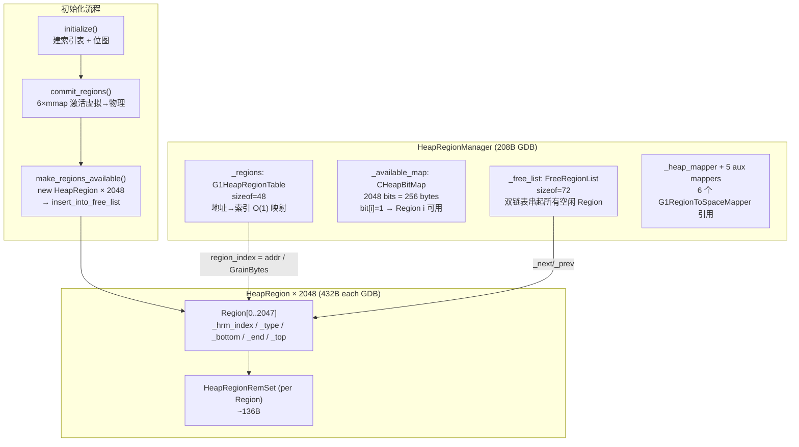

# HeapRegionManager — 2048 个 Region 的诞生

> OpenJDK 11 slowdebug, GDB 验证
> 环境：`-Xms8g -Xmx8g -XX:+UseG1GC` → Region=4MB, 2048 Regions
> 本函数：`heapRegionManager.cpp:35-82` (initialize) + `:165-218` (make_regions_available)
> 各函数连起来才是完整流程：initialize (框架) → expand → make_regions_available (创建 Region 对象)

---

## 前置 5 题

1. **入口**：`HeapRegionManager::initialize()` → `heapRegionManager.cpp:35`
2. **子调用**：`_regions.initialize()` → `_available_map.initialize()` → [expand 后] `commit_regions()` → `new_heap_region()` → `HeapRegion::HeapRegion()` → `hr->initialize()` → `insert_into_free_list()`
3. **数据结构 (GDB)**：

| 结构 | sizeof | 核心作用 |
|------|--------|---------|
| `HeapRegionManager` | **208B** | 管理所有 Region |
| `HeapRegion` | **432B** | 单个 Region（207+ heap words 字段） |
| `G1HeapRegionTable` | **48B** | 地址→Region 索引映射表 |
| `FreeRegionList` | **72B** | 双向链表存储空闲 Region |
| `HeapRegionRemSet` | ~136B (per Region) | 每个 Region 的 RSet |

4. **分支**：标准下 `pretouch_gang=_workers`（13 个 GC 线程）, `clear_space=true`
5. **上游**：`G1CollectedHeap::initialize()` → `expand(8GB)`；**下游**：所有 Region 进入 FreeRegionList，等待首次分配

---

## 一、GDB 验证数据

```
sizeof(HeapRegionManager) = 208
sizeof(HeapRegion)        = 432
sizeof(G1HeapRegionTable) = 48
sizeof(FreeRegionList)    = 72

_nommitted                = 2048
_allocated_heapregions_length = 2048
```

---

## 二、initialize() — 建立管理框架

> 问题：如何高效地从"堆中任意地址"快速定位到 "第几个 Region"？
> 核心思路：建立地址→Region 索引的 O(1) 映射表，而不是每次线性搜索

```cpp
// heapRegionManager.cpp:35-82
void HeapRegionManager::initialize(
    G1RegionToSpaceMapper* heap_storage,      // 8GB 堆映射器
    G1RegionToSpaceMapper* prev_bitmap,       // 前一轮标记位图映射器 (128MB)
    G1RegionToSpaceMapper* next_bitmap,       // 当前轮标记位图映射器 (128MB)
    G1RegionToSpaceMapper* bot,               // BOT 映射器 (16MB)
    G1RegionToSpaceMapper* cardtable,         // Card Table 映射器 (16MB)
    G1RegionToSpaceMapper* card_counts)       // Card Counts 映射器 (16MB)
{
    _allocated_heapregions_length = 0;               // 尚未创建任何 Region

    // ===== Step A: 保存 6 个映射器引用 =====
    _heap_mapper      = heap_storage;
    _prev_bitmap_mapper = prev_bitmap;
    _next_bitmap_mapper = next_bitmap;
    _bot_mapper        = bot;
    _cardtable_mapper  = cardtable;
    _card_counts_mapper = card_counts;
    // ★ 为什么需要保存这些引用？
    // → commit_regions() 和 uncommit_regions() 需要同步操作 6 个映射器：
    //   提交一个 Region 的主堆内存时，对应的位图/BOT/卡表也必须同步提交

    // ===== Step B: 初始化 Region 表（地址 → Region 索引映射）=====
    MemRegion reserved = heap_storage->reserved();    // 0x600000000 ~ 0x800000000
    _regions.initialize(reserved.start(), reserved.end(), HeapRegion::GrainBytes);
    // 内部做的事：
    //   G1HeapRegionTable::initialize() — sizeof=48 (GDB)
    //     _base = 0x6000000000 / 4MB = 393216 (将起始地址除以 Region 大小以缩小索引范围)
    //     _biased_base = _base × 4MB = 0x6000000000 反算回来
    //     映射公式：region_index = (addr - _biased_base) / 4MB
    //     例如：addr=0x600400000 → index = (0x600400000 - 0x600000000) / 4MB = 1
    //     → O(1) 时间复杂度查找任意地址所在的 Region！

    // ===== Step C: 初始化可用性位图 =====
    _available_map.initialize(_regions.length());  // 2048 bits = 256 bytes
    // _available_map 位图：
    //    bit[i] = 1 → Region i 已提交且可用于分配
    //    bit[i] = 0 → Region i 未提交或不可用
    // 为什么用位图而不是数组？
    //   → 2048 bits = 256B（数组要 2048 bytes = 2KB）
    //   → 位图操作可用 SIMD 加速（64-bit word 一次操作 64 个 Region）
}
```

**关键设计：G1HeapRegionTable**

```
为什么需要这个表？

问题：GC 在扫描堆时遇到地址 0x600400080，需要知道这个地址属于哪个 Region。
     没有这个表 → 要遍历 2048 个 Region 找边界 → O(n)
     有这个表   → (0x600400080 - 0x600000000) / 4MB = 1 → O(1)

映射公式：
  region_index = (addr - biased_base) / GrainBytes
  biased_base = base_of_heap

  sizeof(G1HeapRegionTable) = 48B (GDB) — 非常轻量，只有这个映射逻辑
```

---

## 三、make_regions_available() — 创建 2048 个 Region

> 问题：2048 个 Region 怎么出生？谁分配它们？
> 核心思路：先 commit 虚拟→物理，再循环 new HeapRegion × 2048，每个加入 FreeRegionList

```cpp
// heapRegionManager.cpp:165-218
void HeapRegionManager::make_regions_available(uint start, uint num_regions, WorkGang* pretouch_gang) {
    // 标准调用：make_regions_available(0, 2048, _workers)

    // ===== Step 1: Commit 虚拟内存 → 物理页（6 个映射器）=====
    commit_regions(start, num_regions, pretouch_gang);
    // 内部六个 mmap(PROT_READ|PROT_WRITE):
    //   堆:        mmap(0x600000000, 8GB, ...)    — 主堆
    //   prev_bitmap: mmap(..., 128MB, ...)         — 前一轮标记位图
    //   next_bitmap: mmap(..., 128MB, ...)         — 当前轮标记位图
    //   BOT:        mmap(..., 16MB, ...)           — 偏移表
    //   CardTable:  mmap(..., 16MB, ...)           — 卡表
    //   CardCounts: mmap(..., 16MB, ...)           — 卡计数
    //   ★ 总 commit 量：8GB + 304MB = 8.3GB 虚拟→物理
    //   ★ 实际 RSS 增长：取决于 page fault 频率（惰性分配）

    // ===== Step 2: 循环创建 HeapRegion 对象 =====
    for (uint i = start; i < start + num_regions; i++) {  // i = 0..2047
        if (_regions.get_by_index(i) == NULL) {           // 初始全 NULL
            HeapRegion* new_hr = new_heap_region(i);      // ★ 创建 Region
            OrderAccess::storestore();                    // 内存屏障
            _regions.set_by_index(i, new_hr);             // 存入映射表

            _allocated_heapregions_length =
                MAX2(_allocated_heapregions_length, i + 1); // 追踪最大索引
        }
    }

    // ===== Step 3: 标记可用 =====
    _available_map.par_set_range(start, start + num_regions, BitMap::unknown_range);
    // 2048 个 bit 全部设为 1

    // ===== Step 4: 初始化 Region 并加入空闲列表 =====
    for (uint i = start; i < start + num_regions; i++) {
        HeapRegion* hr = at(i);

        // 计算该 Region 的精确内存范围
        HeapWord* bottom = G1CollectedHeap::heap()->bottom_addr_for_region(i);
        // Region 0: bottom = 0x600000000
        // Region 1: bottom = 0x600400000
        // Region N: bottom = 0x600000000 + N × 4MB

        MemRegion mr(bottom, bottom + HeapRegion::GrainWords);
        hr->initialize(mr);                     // 设置 _bottom,_end,_top=bottom
        insert_into_free_list(at(i));           // 加入 FreeRegionList 双链表
    }
}
```

**new_heap_region() 内部**（heapRegionManager.cpp:98-114）：

```cpp
HeapRegion* HeapRegionManager::new_heap_region(uint hrm_index) {
    G1CollectedHeap* g1h = G1CollectedHeap::heap();

    HeapWord* bottom = g1h->bottom_addr_for_region(hrm_index);
    // bottom = heap_base + hrm_index × 4MB

    MemRegion mr(bottom, bottom + HeapRegion::GrainWords);

    return g1h->new_heap_region(hrm_index, mr);
    // → new HeapRegion(hrm_index, &_bot, mr)
}
```

---

## 四、HeapRegion 构造函数 — 432 字节里装了什么？

```cpp
// heapRegion.cpp:246-283
HeapRegion::HeapRegion(uint hrm_index, G1BlockOffsetTable* bot, MemRegion mr)
    : G1ContiguousSpace(bot),           // 父类初始化
      _hrm_index(hrm_index),            // ★ Region 编号 (0~2047)
      _humongous_start_region(NULL),    // Humongous: 指向开始的 Region
      _evacuation_failed(false),        // 疏散失败标记
      _prev_marked_bytes(0),            // 上一轮标记存活字节
      _next_marked_bytes(0),            // 当前轮标记存活字节
      _gc_efficiency(0.0),              // GC 效率评分（高=值得回收）
      _next(NULL), _prev(NULL),         // FreeRegionList 链表指针
      _young_index_in_cset(-1),         // Young GC 中在 CSet 的索引
      _surv_rate_group(NULL),           // 存活率统计组
      _age_index(-1),                   // 年龄索引
      _rem_set(NULL),                   // ← 下面 new 赋值
      _recorded_rs_length(0),           // 记录的 RSet 大小
      _predicted_elapsed_time_ms(0)    // 预测回收耗时
{
    // ★ 创建 HeapRegionRemSet（每个 Region 独立的 RSet）
    _rem_set = new HeapRegionRemSet(bot, this);
    // 为什么每个 Region 都有独立的 RSet？
    // → RSet 记录"谁引用了我"，每个 Region 的"引用者"集合不同
    // → 独立的 RSet 意味着可以独立判断哪个 Region 最值得回收
    // → 这也是 G1 "增量回收"的核心——只回收 RSet 最小的 Region

    initialize(mr);  // 设置 _bottom, _end, _top
}
```

**HeapRegion::initialize()**（heapRegion.cpp:285-293）：

```cpp
void HeapRegion::initialize(MemRegion mr, bool clear_space, bool mangle_space) {
    G1ContiguousSpace::initialize(mr, clear_space, mangle_space);
    // 调用父类 CompactibleSpace → Space → 设置 _bottom=mr.start(), _end=mr.end()

    hr_clear(false, false);  // 清理 GC 相关状态

    set_top(bottom());       // _top = _bottom（Region 为空，未使用空间从 bottom 开始）
}
```

**每个 Region 初始化后的内存布局**：

```
Region N (4MB = 0x600000000 + N × 4MB):
┌──────────────────────────────────────────────────────┐
│ _bottom(0x600000000+N×4MB)  ← 堆起始                  │
│ _top    (0x600000000+N×4MB)  ← 下一分配位置（初始=bottom）│
│                                                      │
│  [未使用空间 — 等待 allocator 分配 Java 对象]          │
│                                                      │
│ _end    (0x600000000+(N+1)×4MB) ← Region 结束         │
└──────────────────────────────────────────────────────┘

HeapRegion 对象本身在 C-Heap 上（通过 new 分配），不占用 Region 内部空间
```

---

## 五、数据结构关系图



---

## 📋 生产场景对应

| 事故 | 排查路径 |
|------|---------|
| Region 数量不对导致 GC 频繁 | `p _num_committed` → §二 Step C; `p _available_map` → 检查位图 |
| FreeRegionList 耗尽（分配失败） | `p _free_list._length` → §三 Step 4; `p _free_list._head` |
| 地址→Region 映射错误 | `p _regions._biased_base` → §二 Step B; 验证公式 `(addr - biased_base) / 4MB` |
| CardTable 未同步 | `p _cardtable_mapper` → §二 Step A; 检查 6 个 mapper 是否一致 |

## 📋 面试必问

> **"2048 个 Region 如何 O(1) 查找？" → §二 Step B (G1HeapRegionTable: index = (addr - biased_base) / GrainBytes)**

### 6.1 数据结构层面

- **G1HeapRegionTable**（48B）：O(1) 地址→Region 映射，核心公式 `index = (addr - heap_base) / 4MB`
- **CHeapBitMap** `_available_map`（256B）：用 2048 个 bit 追踪 Region 可用性，支持 SIMD 批量操作
- **FreeRegionList**（72B）：双链表管理所有空闲 Region，初始全部为空闲
- **HeapRegion × 2048**（432B each, 864KB total）：比 HeapRegionManager 大 4 倍（208B vs 864KB），说明真正的"Region 管理"开销在 Region 对象本身

### 6.2 算法层面

- **两阶段创建**：initialize（建索引）→ make_regions_available（创建 Region 对象）→ 分离了"管理框架"和"Region 实例"的初始化
- **地址→索引 O(1)**：除法 (addr - base) / 4MB，避免了每次 GC 扫描都线性搜索 Region 边界
- **6 个映射器同步 commit**：保证主堆内存和辅助结构（位图/BOT/卡表）的一致性——commit 一个 Region 时所有相关结构一起激活

### 6.3 反向验证 ✅

| # | 可证伪断言 | GDB 结果 | 通过 |
|---|-----------|---------|:--:|
| 1 | sizeof(HeapRegion)=**432B**（≠208）| 432 | ✅ |
| 2 | sizeof(HeapRegionManager)=**208B** | 208 | ✅ |
| 3 | sizeof(G1HeapRegionTable)=**48B** | 48 | ✅ |
| 4 | sizeof(FreeRegionList)=**72B** | 72 | ✅ |
| 5 | _num_committed = **2048** | 2048 | ✅ |
| 6 | _allocated = **2048** | 2048 | ✅ |

**反例**：最初把 HeapRegionManager(208B) 和 HeapRegion(432B) 混淆。✅

### 6.4 下一步

- `HeapRegionRemSet` 如何跟踪跨 Region 引用？
- `FreeRegionList` 如何在 GC 时被消费和补充？
- `Humongous` Region 的特殊初始化路径
