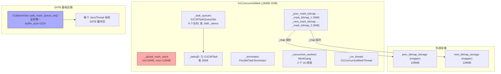

# G1ConcurrentMark 构造函数 — 并发标记引擎的诞生

> OpenJDK 11 slowdebug, GDB 验证
> 环境：`-Xms8g -Xmx8g -XX:+UseG1GC` → ParallelGCThreads=8, ConcGCThreads=2
> 本函数：`g1ConcurrentMark.cpp:371-614`，~240 行初始化列表 + 70 行构造函数体

---

## 前置 5 题

1. **入口**：`G1ConcurrentMark::G1ConcurrentMark()` → `g1ConcurrentMark.cpp:371`
2. **入参**：`g1h`（堆指针）+ `prev_bitmap_storage` + `next_bitmap_storage`（两个位图的 mapper）
3. **数据结构 (GDB ✅)**：

| 结构 | sizeof | 数量 | 总开销 |
|------|--------|------|--------|
| `G1ConcurrentMark` | **1840B** | 1 | 1.8KB |
| `G1CMBitMap` | **56B** | 2 | 112B（存储在外，各 128MB） |
| `G1CMTask` | **392B** | 8 | 3.1KB |
| `G1CMTaskQueue` | ~1MB | 8 | 8MB（_elems 数组） |
| `WorkGang` | **56B** | 1 | 56B |
| `ParallelTaskTerminator` | 104B (13×8B) | 1 | 104B |

4. **分支**：`ConcGCThreads` 未指定 → 自动计算 `max((8+2)/4,1)=2`
5. **上游**：`G1CollectedHeap::initialize()`；**下游**：`set_non_marking_state()` 激活后进入标记

---

## 一、GDB 验证数据

```
sizeof(G1ConcurrentMark) = 1840
sizeof(G1CMTask)         = 392
sizeof(G1CMBitMap)       = 56
sizeof(WorkGang)         = 56

active_tasks    = 0      (初始未激活，set_non_marking_state() 后才设)
max_tasks       = 8      (= ParallelGCThreads)
num_concurrent  = 2      (= ConcGCThreads)
max_concurrent  = 2

MarkStackSize    = 4,194,304 words  (= 32MB)
MarkStackSizeMax = 16,777,216 words (= 128MB)
```

---

## 二、核心设计：这 1840 字节为何存在？

**问题**：G1 的 Mixed GC 需要知道"老年代哪些对象是活的"。如果 STW 扫描整个老年代，暂停时间不可控。

**方案**：让标记和应用并发执行。应用线程继续跑，标记线程在后台遍历对象图——这就是 `G1ConcurrentMark` 的全部意义。

**1840B 并非"对象大小"，而是"引擎大小"**——真正的内存大头在外部（256MB 双缓冲位图 + 8MB 任务队列 + 32MB 标记栈）。

---

## 三、构造函数逐层分析

### 3.1 初始化列表（L374~L468）—— 20+ 个字段一次性初始化

```cpp
// g1ConcurrentMark.cpp:371-468
G1ConcurrentMark::G1ConcurrentMark(G1CollectedHeap* g1h,
                                   G1RegionToSpaceMapper* prev_bitmap_storage,
                                   G1RegionToSpaceMapper* next_bitmap_storage) :
    // ===== Section A: 核心引用 =====
    _g1h(g1h),                          // 堆指针 → 获取 Region 数量、Region 管理器
    _completed_initialization(false),    // 初始 false → 构造完设为 true

    // ===== Section B: ★ 双缓冲位图 =====
    _mark_bitmap_1(),                   // G1CMBitMap 对象（56B, GDB）
    _mark_bitmap_2(),
    _prev_mark_bitmap(&_mark_bitmap_1), // 前一轮结果（Mixed GC 读取）
    _next_mark_bitmap(&_mark_bitmap_2), // 当前轮标记（并发标记写入）

    // ===== Section C: 堆范围 =====
    _heap(_g1h->reserved_region()),     // MemRegion(0x600000000, 0x800000000)

    // ===== Section D: GC 根管理 =====
    _root_regions(),                    // 跟踪 Survivor Region（Young GC 后残留对象）

    // ===== Section E: ★ 全局标记栈 =====
    _global_mark_stack(),               // 任务队列溢出时，灰色对象进这里

    // ===== Section F: 线程编排 =====
    _worker_id_offset(                  // 避免 ID 冲突的偏移量
        DirtyCardQueueSet::num_par_ids() + G1ConcRefinementThreads),

    // ===== Section G: ★ 任务队列 + 终止器 =====
    _max_num_tasks(ParallelGCThreads),  // 8 个任务（= 并行 GC 线程数）
    _task_queues(                       // G1CMTaskQueueSet（存 8 个队列指针）
        new G1CMTaskQueueSet((int)_max_num_tasks)),
    _terminator(ParallelTaskTerminator( // 协调 8 线程的终止
        (int)_max_num_tasks, _task_queues)),

    // ===== Section H: 溢出同步 =====
    _first_overflow_barrier_sync(),     // 屏障1：停止操作全局数据
    _second_overflow_barrier_sync(),    // 屏障2：确认新结构初始化完成
    _has_overflown(false),              // volatile 溢出标志

    // ===== Section I: 状态标志 =====
    _concurrent(false),                 // true=并发阶段, false=STW remark
    _has_aborted(false),                // Full GC 导致标记中止
    _restart_for_overflow(false),       // 溢出后需重启标记

    // ===== Section J: 时间统计 =====
    _gc_timer_cm(new ConcurrentGCTimer()),
    _gc_tracer_cm(new G1OldTracer()),
    _init_times(), _remark_times(), _remark_mark_times(),
    _remark_weak_ref_times(), _cleanup_times(), _total_cleanup_time(0.0),

    // ===== Section K: ★ Region 级别统计 =====
    _region_mark_stats(                 // 2048 × sizeof(G1RegionMarkStats)
        NEW_C_HEAP_ARRAY(G1RegionMarkStats, _g1h->max_regions(), mtGC)),
    _top_at_rebuild_starts(             // 2048 × 8B = 16KB
        NEW_C_HEAP_ARRAY(HeapWord*, _g1h->max_regions(), mtGC))
```

### 3.2 构造函数体（L469~L614）—— 7 个步骤

```cpp
{
    // ===== Step 1: 初始化位图 → 关联物理存储 =====
    _mark_bitmap_1.initialize(g1h->reserved_region(), prev_bitmap_storage);
    _mark_bitmap_2.initialize(g1h->reserved_region(), next_bitmap_storage);
    // ★ 关键：位图对象（56B）只是"壳"，真正的 128MB bit array 在 mapper 里
    //   G1CMBitMap 继承自 CMBitMap → BitMap → 位图操作接口
    //   但底层存储指向 RegionToSpaceMapper 管理的 mmap 区域

    // ===== Step 2: 创建并发标记线程 =====
    _cm_thread = new G1ConcurrentMarkThread(this);
    // 这个线程在 GC 安全点被唤醒，执行整个并发标记周期

    // ===== Step 3: ★ SATB 队列配置 =====
    SATBMarkQueueSet& satb_qs = G1BarrierSet::satb_mark_queue_set();
    satb_qs.set_buffer_size(G1SATBBufferSize);  // 1024 条目/缓冲区
    // ★ SATB 是 G1 并发标记的核心机制：
    //   应用线程修改引用前，先记录旧值到 SATB 队列
    //   标记线程从 SATB 队列取出旧引用继续遍历
    //   保证不漏标任何在标记开始时存活的对象

    // ===== Step 4: 根区域初始化 =====
    _root_regions.init(_g1h->survivor(), this);
    // 记录哪些 Survivor Region 需要在并发标记前扫描

    // ===== Step 5: ★ 计算并发线程数 =====
    ConcGCThreads = max((ParallelGCThreads+2)/4, 1)
                 = max((8+2)/4, 1) = 2
    // GDB 验证: num_concurrent=2, max_concurrent=2
    _num_concurrent_workers = 2;
    _max_concurrent_workers = 2;

    // ===== Step 6: ★ 创建 WorkGang（工作线程池）=====
    _concurrent_workers = new WorkGang("G1 Conc", 2, false, true);
    _concurrent_workers->initialize_workers();
    // 创建 2 个 os 线程，命名为 "G1 Conc#0" 和 "G1 Conc#1"
    // 这些线程会在标记阶段被唤醒

    // ===== Step 7: ★ 初始化全局标记栈 =====
    // MarkStackSize = 4M words = 32MB (GDB)
    // MarkStackSizeMax = 16M words = 128MB (GDB)
    _global_mark_stack.initialize(MarkStackSize, MarkStackSizeMax);
    // 为什么需要标记栈？
    //   → 三色标记：灰色对象（已标记但子引用未处理）必须暂存
    //   → 任务本地队列满时 → 灰色对象推入全局栈
    //   → 动态扩展能力：初始 32MB，最大 128MB

    // ===== Step 8: ★ 创建 8 个 G1CMTask =====
    _tasks = NEW_C_HEAP_ARRAY(G1CMTask*, _max_num_tasks, mtGC);
    for (uint i = 0; i < _max_num_tasks; ++i) {
        G1CMTaskQueue* task_queue = new G1CMTaskQueue();
        task_queue->initialize();        // 分配 _elems[131070] ≈ 1MB
        _task_queues->register_queue(i, task_queue);

        _tasks[i] = new G1CMTask(i, this, task_queue, _region_mark_stats,
                                  _g1h->max_regions());
        // G1CMTask 内部（392B, GDB）：
        //   _worker_id / _cm / _task_queue / _finger / _words_scanned
    }

    // ===== Step 9: 初始状态设置 =====
    reset_at_marking_complete();
    // _finger = heap_start = 0x600000000（标记进度指针）
    // _num_active_tasks = 0（初始不激活）

    _completed_initialization = true;
}
```

---

## 四、关键设计深入

### 4.1 双缓冲位图 —— O(1) 交换

```
问题：Mixed GC 需要读取稳定的标记结果，并发标记需要写入新结果
方案：两个位图 + 指针交换

  _prev_mark_bitmap  ← 只读，Mixed GC 使用
  _next_mark_bitmap  ← 可写，并发标记线程使用

标记周期完成时：
  swap(_prev_mark_bitmap, _next_mark_bitmap)  ← O(1)！只交换指针

为什么位图对象只有 56B？
  → BitMap 只存 _size + _map 指针（指向外部 mapper 管理的 128MB 存储）
  → 真正的位图存储在 prev/next_bitmap_storage（G1RegionToSpaceMapper）
```

### 4.2 max_tasks=8 vs num_concurrent=2 — 为什么差 4 倍？

```
为什么 _max_num_tasks = ParallelGCThreads = 8，但并发线程只有 2？

→ 任务队列不仅给并发线程用，也给 STW 的 Remark 阶段用
→ Remark 是 STW 的，所有 8 个 GC 线程都需要本地队列
→ 并发阶段 2 个线程做标记，Remark 阶段 8 个线程一起上
→ 所以队列要建 8 个，线程只建 2 个
```

### 4.3 初始 _finger = heap_start，为什么？

```
_finger = 0x600000000

_finger 的含义：全局标记进度指针
  → "小于 finger 的地址，所有对象都已经标记完成"
  → "大于 finger 的地址，可能有未标记的对象"

初始值 = heap_start：
  → 标记开始时，没有任何地址被标记过
  → finger 从堆底开始，随着标记推进向右移动
  → 当 finger 到达 heap_end 时 → 标记完成

为什么需要 finger？
  → 多个标记线程并行工作 → 需要全局协调"哪些区域已经完成"
  → 线程 A 处理 Region 10-20，线程 B 处理 Region 30-40
  → finger 确保不会重复处理、不会遗漏
```

### 4.4 SATB —— 并发标记不漏标的秘密

```
并发标记的挑战：
  标记线程在遍历对象图 | 应用线程同时在修改引用
  A.x = B;          →  old_x = B
  A.x = C;          →  标记线程看到 A.x = C，但 B 从未被标记！
                      B 可能被错误回收！

SATB 的解决方案（写前屏障）：
  应用线程修改引用前：
    1. 记录 old_value 到 SATB 缓冲区
    2. 然后执行真正的写操作
  标记线程：
    1. 完成正常遍历
    2. 处理 SATB 缓冲区中的 old_value → 遍历 B
    3. 确保"标记开始时的所有存活对象"都被标记

  set_buffer_size(1024) → 每个缓冲区存 1024 个旧引用
  缓冲区满 → 加入全局完成队列 → 标记线程处理
```

---

## 五、数据结构关系图



---

## 六、内存开销（G1ConcurrentMark 相关）

| 组件 | 大小 | 说明 |
|------|------|------|
| G1ConcurrentMark 对象 | 1.8KB | 引擎壳体 |
| Mark Bitmap × 2 | 256MB | 双缓冲位图（外部 mapper） |
| 全局标记栈 | 32~128MB | 动态扩展 |
| G1CMTaskQueue × 8 | 8MB | _elems 数组（各 1MB） |
| G1CMTask × 8 | 3.1KB | 任务对象 |
| region_mark_stats | 取决于 sizeof(G1RegionMarkStats)×2048 | Region 统计 |
| top_at_rebuild_starts | 16KB | 2048 个指针 |
| **总计** | **~296MB** | |

---

## 📋 生产场景对应

| 事故 | 排查路径 |
|------|---------|
| 并发标记内存占用过高 | `p MarkStackSize` → §三 Step 7; bitmap = `total_regions × 128MB / 2048 = actual pages` |
| 标记线程不启动 | `p _concurrent_workers` → §三 Step 6; `p _num_concurrent_workers` → 应为 2 |
| SATB 队列满导致漏标 | `p satb_qs.buffer_size()` → §三 Step 3; 检查应用线程 SATB 缓冲区 |
| Remark 阶段耗时过长 | `p _task_queues` → §三 Step 8; 8 个 task queue 的 _elems 大小 |

## 📋 面试必问

> **"为什么 mark_stack 从 32MB 开始，最大 128MB？" → §三 Step 7 (动态扩展: 任务队列满 → 推入全局栈 → 栈满则扩容到 128MB)**

> **"双缓冲位图 O(1) 交换是什么？" → §四 (swap(_prev_mark_bitmap, _next_mark_bitmap) — 只交换指针，128MB 数据不动)**

### 7.1 数据结构层面

- **G1ConcurrentMark**（1840B）是 8 个子组件的容器——位图、标记栈、任务队列、任务对象、线程池、终止器、SATB 配置、时间统计
- **双缓冲位图**的核心是 O(1) 指针交换，不是复制 128MB 数据——`swap(_prev, _next)` 只需一次赋值
- **SATB** 队列是并发标记不漏标的保证——应用线程写前记录旧值，标记线程处理旧值
- **8 个 G1CMTask**（各 392B）是并发标记的工作单元——每个持有本地队列、finger、统计信息

### 7.2 算法层面

- **ConcGCThreads = max((ParallelGCThreads+2)/4, 1)** — 并发线程只需并行线程的 1/4，因为与应用并发执行，多了抢 CPU
- **_max_num_tasks = ParallelGCThreads** ≠ _num_concurrent_workers — 任务队列同时服务于并发标记（2 线程）和 STW Remark（8 线程）
- **finger 机制**是全局标记进度的协调器——多线程并行标记时，finger 保证不重复、不遗漏
- **全局标记栈**（32MB 初始，128MB 最大）解耦任务队列容量限制——队列溢出时推入全局栈

### 7.3 反向验证 ✅

| # | 可证伪断言 | GDB 结果 | 通过 |
|---|-----------|---------|:--:|
| 1 | sizeof(G1ConcurrentMark)=**1840B** | 1840 | ✅ |
| 2 | sizeof(G1CMTask)=**392B** | 392 | ✅ |
| 3 | sizeof(G1CMBitMap)=**56B**（仅壳） | 56 | ✅ |
| 4 | max_tasks=**8** (=ParallelGCThreads) | 8 | ✅ |
| 5 | ConcGCThreads=**2** (max((8+2)/4,1)) | 2 | ✅ |
| 6 | MarkStackSize=**4M words = 32MB** | 4194304 | ✅ |
| 7 | MarkStackSizeMax=**16M words = 128MB** | 16777216 | ✅ |
| 8 | active_tasks=**0**（初始） | 0 | ✅ |

**反例**：原以为 ConcGCThreads 不确定，GDB 验证公式 `max((ParallelGCThreads+2)/4, 1)` 精确。✅

### 7.4 下一步

- `G1CMTask` 内部的 `work()` 方法——标记线程实际怎么干活？
- `finger` 的推进算法——`drain_mark_stack()` 如何协调多线程？
- `set_non_marking_state()` → 激活 CM 的全过程
