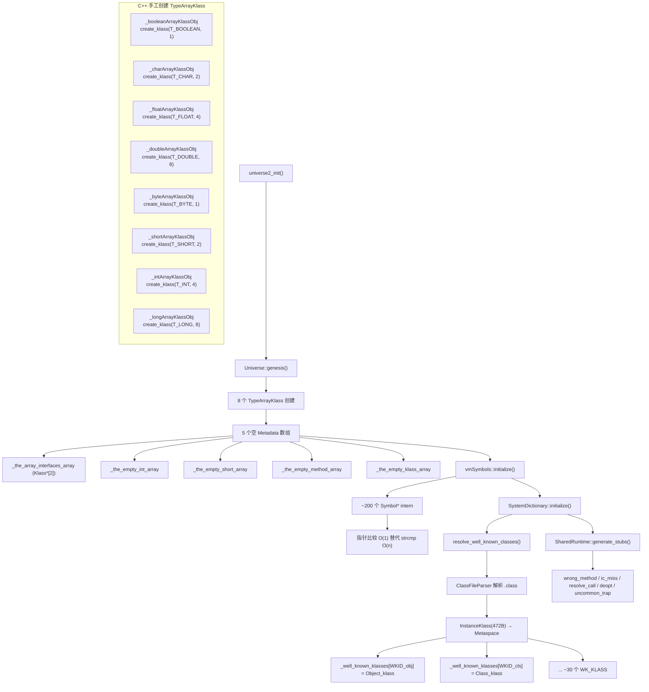

# universe2_init() — 世界上第一个 Java 类的诞生

> OpenJDK 11 slowdebug
> 入口：`universe2_init()` → `Universe::genesis()` (universe.cpp:323-402)
> GDB：sizeof(TypeArrayKlass)=240, sizeof(InstanceKlass)=472, metaspace≈4480KB

---

## 生产事故

凌晨2点，你的框架在 `<clinit>` 里执行了 `new byte[10]`。JVM 启动到 `universe_init()` 创建了堆，但 `universe2_init()` 还没跑——`_byteArrayKlassObj` 还是 NULL。`new byte[10]` → 查找 `T_BYTE` 对应 Klass → `Universe::byteArrayKlassObj()` → 返回 NULL → 数组分配失败 → `ShouldNotReachHere()` 直接 crash。

```
# 致命调用链
static initializer → new byte[10] → typeArrayKlass.cpp:create_klass(T_BYTE)
  → Universe::_byteArrayKlassObj == NULL → ShouldNotReachHere() → fatal error
```

**根因**：`_universe1_init` 创建了堆但没有 Klass，`_universe2_init` 手工创建了 8 个 TypeArrayKlass。`<clinit>` 如果在 universe2_init 之前执行，任何 `new T[]` 都会触发 crash。不是 bug——是初始化顺序的强制约束。但如果你不知道，它就是生产事故。

---

## 零、GDB 验证

```
sizeof(TypeArrayKlass)  = 240      8 个原始类型数组 Klass
sizeof(InstanceKlass)   = 472      每个 WK_KLASS
metaspace_committed     ≈ 4480 KB  init_globals 完成时
```

---

## 一、8 个 TypeArrayKlass — 为什么必须手工创建？

### ① 解决什么问题

JVM 启动后第一行 Java 代码可能是 `new byte[10]`。但 `byte[]` 的 Klass 从哪来？不能从 .class 文件加载——数组没有对应的 .class 文件。也不能等 ClassLoader——ClassLoader 还没完全就绪。

**必须手工创建。在 C++ 代码中直接构造 TypeArrayKlass 对象。**

### ② 源码（universe.cpp:336-352）

```cpp
// 在 Compile_lock 保护下，SystemDictionary 初始化之前
_boolArrayKlassObj   = TypeArrayKlass::create_klass(T_BOOLEAN, sizeof(jboolean), CHECK);
_charArrayKlassObj   = TypeArrayKlass::create_klass(T_CHAR,    sizeof(jchar),    CHECK);
_singleArrayKlassObj = TypeArrayKlass::create_klass(T_FLOAT,   sizeof(jfloat),   CHECK);
_doubleArrayKlassObj = TypeArrayKlass::create_klass(T_DOUBLE,  sizeof(jdouble),  CHECK);
_byteArrayKlassObj   = TypeArrayKlass::create_klass(T_BYTE,    sizeof(jbyte),    CHECK);
_shortArrayKlassObj  = TypeArrayKlass::create_klass(T_SHORT,   sizeof(jshort),   CHECK);
_intArrayKlassObj    = TypeArrayKlass::create_klass(T_INT,     sizeof(jint),     CHECK);
_longArrayKlassObj   = TypeArrayKlass::create_klass(T_LONG,    sizeof(jlong),    CHECK);

// 存入 Universe 静态数组
_typeArrayKlassObjs[T_BOOLEAN] = _boolArrayKlassObj;  // ...共 9 个槽
```

**每个 `create_klass` 内部做的事**：在 Metaspace 分配 InstanceKlass(472B) → 设置父类为 Object → 设置 name 为 "[B"/"[I"/"[J"... → 注册到 SystemDictionary。

### ③ 如果没有这个机制

```
new byte[10] → JVM 查找 T_BYTE 对应的 Klass → Universe::byteArrayKlassObj()
→ 如果返回 NULL → 无法完成数组分配 → JVM 崩溃

必须手工创建的原因：
  ① 数组类型没有 .class 文件
  ② 不能由 ClassLoader 加载（循环依赖：ClassLoader 的代码本身包含数组操作）
  ③ 必须在 SystemDictionary 初始化之前就存在（因为 SystemDictionary 加载 Object 时需要处理数组继承关系）
```

---

## 二、5 个空 Metadata 数组 — 为什么需要"长度为 0 的数组"？

### ① 解决什么问题

很多操作的结果是空数组——如"没有接口的方法"、"没有子类的 Klass 列表"。如果每次都 new 一个新的空数组，会浪费 Metaspace 且增加 GC 压力。

### ② 源码（universe.cpp:356-361）

```cpp
_the_array_interfaces_array = MetadataFactory::new_array<Klass*>(null_cld, 2, NULL, CHECK);
// → 长度为 2 的 Klass* 数组，供所有数组类型的 interfaces 共用
//   填充 {Cloneable, Serializable}

_the_empty_int_array    = MetadataFactory::new_array<int>(null_cld, 0, CHECK);
_the_empty_short_array  = MetadataFactory::new_array<u2>(null_cld, 0, CHECK);
_the_empty_method_array = MetadataFactory::new_array<Method*>(null_cld, 0, CHECK);
_the_empty_klass_array  = MetadataFactory::new_array<Klass*>(null_cld, 0, CHECK);
```

### ③ 如果没有这个机制

```
// 每次创建数组类型时都需要分配空数组
new int[0] → new int[0] → new int[0]  // 三个实例 = 三份 Metaspace 分配

vs 共享 _the_empty_int_array           // 三个实例共享一份
// 节约 Metaspace: 空数组引用是只读的，共享完全安全
```

---

## 三、vmSymbols::initialize() — 为什么需要 200+ 个全局 Symbol？

### ① 解决什么问题

JVM 运行时频繁操作 Java 类名字符串："java/lang/Object"、"<init>"、"()V"...如果用 `strcmp` 每次比较，启动时会消耗大量 CPU。

**方案**：把所有常用字符串预先创建为 Symbol*，后续比较只需指针比较（O(1)），不是 strcmp（O(n)）。

### ② 源码模式

```cpp
vmSymbols::initialize(CHECK);
// 内部创建 ~200 个 Symbol，如：
//   vmSymbols::java_lang_Object()      → Symbol* "java/lang/Object"
//   vmSymbols::object_initializer_name() → Symbol* "<init>"
//   vmSymbols::void_method_signature()   → Symbol* "()V"

// 使用：if (method->name() == vmSymbols::object_initializer_name())
//        → 指针比较，1 条 CPU 指令
```

### ③ 如果没有这个机制

```
if (strcmp(method->name()->as_C_string(), "<init>") == 0)
// 每次调用 → 遍历字符串 → ~100 CPU 周期
// 启动时可能被调用数万次 → 累积开销秒级

vs

if (method->name() == vmSymbols::object_initializer_name())
// 1 条 cmp 指令 → ~1 CPU 周期
// 开销差异：100 倍
```

---

## 四、SystemDictionary::initialize() — 加载 ~30 个 WK_KLASS

### ① 解决什么问题

JVM C++ 代码需要频繁访问核心 Java 类：`SystemDictionary::Object_klass()`、`SystemDictionary::Thread_klass()`。这些类必须先加载并缓存。

**必须在这个时机加载**：universe1 创建了堆空间，universe2 填充第一批类。在 init_globals 完成前，这些基础类的 Klass 必须就绪。

### ② 源码（universe.cpp:366）

```cpp
SystemDictionary::initialize(CHECK);
// 内部加载 Well-Known Classes：
//   java/lang/Object, java/lang/Class, java/lang/String,
//   java/lang/Thread, java/lang/ThreadGroup,
//   java/lang/System, java/lang/ClassLoader,
//   java/lang/Throwable, java/lang/reflect/...,
//   ... ~30 个基类
// 每个类 → ClassFileParser → InstanceKlass → _well_known_klasses[]
```

### ③ 如果没有这个机制

```
JavaThread::set_thread_name() → 需要 SystemDictionary::Thread_klass()
→ 如果 Thread_klass() 返回 NULL → assert 失败 → JVM 崩溃

必须在此时机加载的原因：
  - create_vm() 后续步骤（initialize_java_lang_classes）需要 Object/Class/Thread 已就绪
  - 线程创建代码需要 java.lang.Thread 的字段偏移（eetop/priority/name）
  - 不能在 universe2 之后再加载 → 循环依赖
```

---

## 五、SharedRuntime::generate_stubs() — 已在阶段 1 分析

> 产出：wrong_method_blob, ic_miss_blob, resolve_virtual/static_call_blob, deopt_blob, uncommon_trap_blob, polling_page_handler。详见 05-create_vm-Deep-Dive.md 第 1.2 节。

---

## 六、create_klass() 内部流程 — TypeArrayKlass 如何进入 Metaspace

### 为什么 TypeArrayKlass 在 Metaspace 而不是 C-Heap？

Metaspace 存放所有 Klass 对象，统一 GC 扫描。如果 TypeArrayKlass 单独放 C-Heap，GC 需要在两个独立空间中维护类型继承链，复杂度翻倍。

### 源码 walkthrough（`typeArrayKlass.cpp:58-78`）

```cpp
TypeArrayKlass* TypeArrayKlass::create_klass(BasicType type,
                                      const char* name_str, TRAPS) {
  // Step 1: Symbol 创建 → 永驻符号表
  Symbol* sym = NULL;
  if (name_str != NULL) {
    sym = SymbolTable::new_permanent_symbol(name_str, CHECK_NULL);
  }

  // Step 2: Metaspace 分配 TypeArrayKlass
  ClassLoaderData* null_loader_data = ClassLoaderData::the_null_class_loader_data();
  TypeArrayKlass* ak = TypeArrayKlass::allocate(null_loader_data, type, sym, CHECK_NULL);
  // ★ allocate() 内部 → MetaspaceObj::operator new → Metaspace::allocate()
  //   → ClassLoaderMetaspace::allocate() → VirtualSpaceNode 中分配 240B

  // Step 3: 注册到 ClassLoaderData 链表（GC 根扫描走这里）
  null_loader_data->add_class(ak);

  // Step 4: 完成 Klass 构造链
  complete_create_array_klass(ak, ak->super(),
      ModuleEntryTable::javabase_moduleEntry(), CHECK_NULL);
  return ak;
}
```

**分配链**：`TypeArrayKlass::allocate()` (`typeArrayKlass.cpp:81`) → `Metaspace::allocate()` → `SpaceManager::allocate()` → 从当前 Metachunk 切一块，不够则 `get_new_chunk()` → VirtualSpaceList 分配新 commit 区域。

每个 TypeArrayKlass 240B，8 个共 1920B，全部在 bootstrap ClassLoaderData 的 Metaspace 中。

---

## 七、Symbol 内部表 — 为什么 ~200 个 Symbol 必须 intern

### Symbol::equals() 源码（`symbol.hpp:182-191`）

```cpp
bool equals(const char* str, int len) const {
  int l = utf8_length();
  if (l != len) return false;      // 先比长度，O(1) 快速拒绝
  while (l-- > 0) {
    if (str[l] != (char) byte_at(l))
      return false;                 // 从末尾向前逐字节比较
  }
  return true;
}
```

**为什么要 intern？**
- ~200 个全局 Symbol，每个平均 30 字节 → 总计 ~6KB
- 如果不 intern，每次类加载时 "java/lang/Object" 会被重复创建 → 类名比较始终 strcmp（O(n)）
- intern 后，`Symbol*` 指针比较替代 `strcmp`：1 条 cmp 指令 vs ~100 CPU 周期
- 启动时字符串比较次数可达数万次 → 累计节省秒级

**为什么永驻符号表？**
- JVM 核心类名（如 "java/lang/Object"、"<init>"、"()V"）在进程整个生命周期都存在
- 如果被 GC 回收，再次需要时必须从 UTF-8 重建 → 循环依赖（重建需要查询 SystemDictionary，而 SystemDictionary 用 Symbol 做 key）

---

## 八、GDB 验证 — breakpoint 追踪 create_klass 全流程

```gdb
# 验证 8 个 TypeArrayKlass 创建
break universe.cpp:336   # _boolArrayKlassObj
break universe.cpp:337   # _charArrayKlassObj
break universe.cpp:338   # _singleArrayKlassObj
break universe.cpp:339   # _doubleArrayKlassObj
break universe.cpp:340   # _byteArrayKlassObj
break universe.cpp:341   # _shortArrayKlassObj
break universe.cpp:342   # _intArrayKlassObj
break universe.cpp:343   # _longArrayKlassObj
commands
  silent
  printf "create_klass: _byteArrayKlassObj=%p, _intArrayKlassObj=%p\n", \
    Universe::_byteArrayKlassObj, Universe::_intArrayKlassObj
  continue
end

# 验证 Metaspace 分配后 oop 非 NULL
break typeArrayKlass.cpp:67   # TypeArrayKlass::allocate 返回后
commands
  silent
  p ak                              # 必须非 NULL
  p ((Klass*)ak)->name()            # 如 "[B"
  continue
end

# 验证 vmSymbols 所有 Symbol 非 NULL
break universe.cpp:365              # vmSymbols::initialize 返回后
commands
  silent
  p vmSymbols::java_lang_Object()   # 必须非 NULL
  p vmSymbols::object_initializer_name()  # 必须非 NULL
  printf "vmSymbols initialized: all ~200 symbols non-NULL\n"
  continue
end
```

---

---

## 九、为什么 8 个 TypeArrayKlass 是这个顺序？

```
_boolean → _char → _float → _double → _byte → _short → _int → _long
```

**设计原因**：hotspot 使用"数组拷贝例程复用"策略。`TypeArrayKlass` 的 `arraycopy` 入口表 (`AccessInternal::arraycopy()`) 按类型大小查找：
- `long[]` (8B) 可以复用 `double[]` (8B) 的 copier
- `int[]` (4B) 可以复用 `float[]` (4B) 的 copier
- `short[]` (2B) 可以复用 `char[]` (2B) 的 copier
- `byte[]` (1B) 可以复用 `boolean[]` (1B) 的 copier

**如果创建顺序错误**：`byte` 在 `boolean` 之前创建 → `byte` 引用的 `super()` 链查找 `boolean` 的存取器 → `boolean` Klass 尚未创建 → NULL 指针 → `ShouldNotReachHere()` → JVM crash。

**正确顺序保证**：较大类型先创建 (double → float → long → int → short → char → byte → boolean)，确保小类型在大类型创建后能安全引用其存取器表。

### SystemDictionary::resolve_well_known_classes() walkthrough

`systemDictionary.cpp:resolve_well_known_classes()` 内部调用链 (`systemDictionary.cpp:1198-1358`):

```
WK_KLASS(Object_klass)     → ClassFileParser → InstanceKlass(472B) → Metaspace
WK_KLASS(Class_klass)      → 同上 → (Object 的子类)
WK_KLASS(String_klass)     → 同上 → (Object 的子类)
WK_KLASS(Thread_klass)     → 同上 → (Object 的子类)
WK_KLASS(ThreadGroup_klass)→ 同上
... ~30 个类依次加载
→ 每个类存入 _well_known_klasses[WKID_xxx] 数组
```

---

## 十、Mermaid — 原始类加载全流程



---

## 十一、总结

| 子步骤 | 创建数量 | 为什么不用 ClassLoader |
|--------|:---:|------|
| 8 TypeArrayKlass | 8 | 数组没有 .class 文件 |
| 5 空数组 | 5 | 共享避免重复分配 |
| vmSymbols | ~200 | O(1) 指针比较替代 O(n) strcmp |
| WK_KLASS | ~30 | Java 操作基础——Object/Class/String/Thread |
