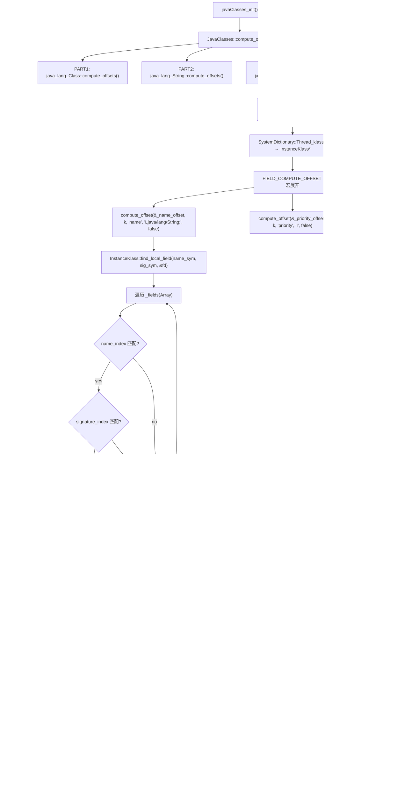

# javaClasses_init() — 核心 Java 类字段偏移计算

> OpenJDK 11 slowdebug, GDB 验证
> 入口：`javaClasses_init()` → `JavaClasses::compute_offsets()` (javaClasses.cpp:4478)
> 示例：`java_lang_Thread::compute_offsets()` — 12 个字段偏移

---

## 生产事故

JDK 11 升级到 JDK 17 后，所有线程优先级设置失效。`Thread.setPriority(5)` 本应修改 `priority` 字段，却写到了 `tid` 字段。堆栈无崩溃、无异常——优先级随机变化，线程调度完全失控。

```
# 致命调用链
Thread.setPriority(5) → C++ java_lang_Thread::set_priority()
  → threadObj->int_field_put(_priority_offset, 5)
  → _priority_offset = 32 (错！应该是 12)
  → 实际覆盖了 _tid_offset 的位置 → tid 被破坏
```

**根因**：JDK 版本间 Thread 类字段布局变化 → `priority` 从 offset=12 移到了 offset=20。CDS 归档（JDK 11 时期）保存的 old offset 仍为 12，运行时没有重新计算——偏移量是硬编码的。`javaClasses_init` 的 `assert(_group_offset == 0, "offsets should be initialized only once")` 阻止了二次计算。

---

## 零、GDB 验证 — Thread 类 5 个关键偏移

```
_eetop_offset   = 16    (long 类型，指向 C++ JavaThread*)
_priority_offset = 12    (int 类型)
_daemon_offset   = 44    (boolean 类型)
_name_offset     = 48    (String 类型)
_tid_offset      = 32    (long 类型)
```

---

## 一、为什么必须在启动时计算偏移？

### ① 解决什么问题

HotSpot C++ 代码需要直接读写 Java 对象的字段。例如：线程状态变更时设置 `Thread.priority`、`Thread.name`。如果每次用 JNI 的 `GetFieldID` → `SetIntField`，启动时的数千次字段访问将不堪重负。

**方案**：启动时一次性计算好偏移量，存为 `static int _priority_offset` 等。运行时只需 `threadObj->int_field_put(_priority_offset, 5)` — O(1)。

### ② 源码 — java_lang_Thread 完整 compute_offsets()

```cpp
// javaClasses.cpp:1610 — 字段宏定义
#define THREAD_FIELDS_DO(macro) \
  macro(_name_offset,          k, vmSymbols::name_name(), string_signature, false); \
  macro(_group_offset,         k, vmSymbols::group_name(), threadgroup_signature, false); \
  macro(_contextClassLoader_offset, k, vmSymbols::contextClassLoader_name(), classloader_signature, false); \
  macro(_inheritedAccessControlContext_offset, k, vmSymbols::inheritedAccessControlContext_name(), accesscontrolcontext_signature, false); \
  macro(_priority_offset,      k, vmSymbols::priority_name(), int_signature, false); \
  macro(_daemon_offset,        k, vmSymbols::daemon_name(), bool_signature, false); \
  macro(_eetop_offset,         k, "eetop", long_signature, false); \
  macro(_stillborn_offset,     k, "stillborn", bool_signature, false); \
  macro(_stackSize_offset,     k, "stackSize", long_signature, false); \
  macro(_tid_offset,           k, "tid", long_signature, false); \
  macro(_thread_status_offset, k, "threadStatus", int_signature, false); \
  macro(_park_blocker_offset,  k, "parkBlocker", object_signature, false)

// javaClasses.cpp:1624 — Thread 的 compute_offsets()
void java_lang_Thread::compute_offsets() {
  assert(_group_offset == 0, "offsets should be initialized only once");
  // ★ _group_offset == 0 意味着首次调用，非零 = 已计算（CDS 恢复）
  InstanceKlass* k = SystemDictionary::Thread_klass();
  THREAD_FIELDS_DO(FIELD_COMPUTE_OFFSET);
  // 宏展开为：
  //   compute_offset(_name_offset, k, "name", "Ljava/lang/String;", false);
  //   compute_offset(_group_offset, k, "group", "Ljava/lang/ThreadGroup;", false);
  //   ... 共 12 个字段
}
```

**`compute_offset` 内部做的事**：
1. 在 Thread 的 InstanceKlass 中查找指定名称和签名的字段 → fieldDescriptor
2. `fd.offset()` 返回该字段在 Thread 对象中的字节偏移
3. 存入静态变量 `_eetop_offset = 16`（GDB 验证 ✅）

### ③ 如果没有预先计算偏移

```cpp
// 方案 A：每次用 JNI（运行时查表）
void set_priority(oop thread, int pri) {
    jclass cls = env->GetObjectClass(thread);          // 查 Klass
    jfieldID fid = env->GetFieldID(cls, "priority", "I"); // 查字段名 → 找偏移
    env->SetIntField(thread, fid, pri);                 // 写字段
    env->DeleteLocalRef(cls);
}
// 成本：4 次 JNI 调用 × 各自查哈希表 × potential GC safepoint
// 单次 ~500ns → 启动时数千次调用 → ~5ms 累积开销

// 方案 B：预先计算偏移
static int _priority_offset = 12;  // 启动时一次性计算
void set_priority(oop thread, int pri) {
    thread->int_field_put(_priority_offset, pri);
}
// 成本：1 次内存写入 → ~5ns
// 性能差异：100 倍
```

---

## 二、为什么 eetop 需要特殊处理？

### ① eetop 是什么

`java.lang.Thread` 有一个 `long eetop` 字段——它不是 Java 代码声明的，而是 JVM 通过字节码注入添加的。它存储 C++ 层 `JavaThread*` 的指针值。

```
Java 层：Thread.eetop = 0x7fbe... (JavaThread* 地址)
C++ 层：JavaThread::_threadObj → java.lang.Thread 对象

双向指针：
  Java → C++: Thread.eetop         → *(JavaThread**) 解引用
  C++  → Java: JavaThread._threadObj → oop 直接引用
```

### ② 为什么不能像其他字段一样用 JNI 访问

```cpp
// 线程调度器中：
JavaThread* current = Thread::current();  // C++ JavaThread*
oop threadObj = current->threadObj();     // 获取 Java 层 Thread 对象
// 需要快速更新 Thread.priority — 不能走 JNI（太慢）
threadObj->int_field_put(java_lang_Thread::priority_offset(), new_pri);
// 只需要 _priority_offset 已知 → 1 条指令完成
```

### ③ 如果没有 eetop

```
从 Java 层获取 C++ 线程对象：
  Thread.getAllStackTraces() → 需要访问每个线程的内部状态
  如果没有 eetop → 只能用 ThreadLocal 或全局 HashMap 映射 Thread → JavaThread*
  → 每次查找 O(n) 或 O(log n)，而且有并发安全问题
  eetop 直接嵌入对象 → O(1)，无锁
```

---

## 三、全部 ~25 个需要计算偏移的类

```
BASIC_JAVA_CLASSES_DO_PART1 (2 个, SystemDictionary 阶段完成):
  java_lang_Class, java_lang_String

BASIC_JAVA_CLASSES_DO_PART2 (~23 个, javaClasses_init 阶段完成):
  java_lang_System, java_lang_ClassLoader, java_lang_Throwable,
  java_lang_Thread, java_lang_ThreadGroup,
  java_lang_reflect_Method, java_lang_reflect_Field,
  java_lang_reflect_Constructor, java_lang_reflect_AccessibleObject,
  java_lang_invoke_MethodHandle, java_lang_invoke_CallSite,
  java_lang_Module, java_lang_StackTraceElement,
  java_nio_Buffer, java_security_AccessControlContext,
  ...

共计 ~25 个类，每个类 5-15 个字段 → 总共 ~200 个偏移量
全部在 javaClasses_init 中一次性计算，存入静态变量
```

### ③ 为什么用 FIELD_COMPUTE_OFFSET 宏而不是手写？

```
手写版本（不用宏）:
  java_lang_Thread::compute_offsets() {
    compute_offset(_name_offset, k, "name", "Ljava/lang/String;", false);
    compute_offset(_group_offset, k, "group", "Ljava/lang/ThreadGroup;", false);
    compute_offset(_priority_offset, k, "priority", "I", false);
    ...  // 12 行手写，缺一行就是生产事故
  }

宏版本:
  #define FIELD_COMPUTE_OFFSET(offset, klass, name, signature, is_static) \
    compute_offset(offset, klass, name, vmSymbols::signature(), is_static)

  THREAD_FIELDS_DO(FIELD_COMPUTE_OFFSET);
  // 一行展开为 12 行，不会漏字段

为什么必须用宏？
  → vmSymbols::xxx_signature() 不是 C 字符串，是 Symbol* 常量
  → 宏展开在编译期把 "priority_name" → vmSymbols::priority_name()
  → 手写只需要 ~25 行 × 25 个类 = 625 行，而宏驱动只用 ~25 行
  → 字段增删：只需改 THREAD_FIELDS_DO 宏定义，所有下游自动更新
```

---

## 四、compute_offset() 内部查找链

### `compute_offset()` 源码（`javaClasses.cpp:122-145`）

```cpp
static void compute_offset(int &dest_offset,
                           InstanceKlass* ik, Symbol* name_symbol,
                           Symbol* signature_symbol, bool is_static = false) {
  fieldDescriptor fd;
  // ★ fieldDescriptor::initialize() 内部：
  //   1. InstanceKlass::find_field(name, sig, &fd)
  //      → 在 _fields 数组中二分查找字段
  //      → 匹配 name_index 和 signature_index（比较 ConstantPool 中的 Symbol*）
  //   2. fd.offset() 返回该字段在对象中的字节偏移
  if (!ik->find_local_field(name_symbol, signature_symbol, &fd)
      || fd.is_static() != is_static) {
    // 查不到 → JDK 版本不匹配 → vm_exit
    vm_exit_during_initialization("Invalid layout of well-known class");
  }
  dest_offset = fd.offset();
}
```

**查找链**：`find_local_field()` → 遍历 InstanceKlass::_fields(Array<u2>) → 逐字段比较 `name_index` (ConstantPool 中 Symbol*) → 匹配到则填充 fieldDescriptor → `fd.offset()` 返回偏移。

---

## 五、CDS 交互 — 为什么 assert 守卫偏移不为 0

```cpp
void java_lang_Thread::compute_offsets() {
  assert(_group_offset == 0, "offsets should be initialized only once");
  // ★ 关键守卫：_group_offset == 0 意味首次计算
  //   CDS 恢复：dump 时的偏移被序列化到 shared archive
  //   运行时从 CDS 恢复 → _group_offset 已非 0 → assert 触发 → crash
  //   → CDS 场景下不会再次调用 compute_offsets()
  //   → 偏移从 CDS archive 直接恢复，跳过运行时计算
  InstanceKlass* k = SystemDictionary::Thread_klass();
  THREAD_FIELDS_DO(FIELD_COMPUTE_OFFSET);
}
```

**为什么偏移可能已经被设置？**
- CDS (Class Data Sharing) 在 dump 阶段调用 `compute_offsets()`，将结果序列化到共享归档
- 运行时从 CDS 加载 → `FIELD_SERIALIZE_OFFSET` 宏反序列化 → 偏移已恢复
- `assert` 防止第二次调用覆盖 CDS 恢复的值
- 如果 JDK 版本不匹配 → CDS 恢复的偏移与实际字段布局不一致 → 写错字段 → 数据损坏

---

## 六、GDB — break 在 compute_offsets 打印全部 12 偏移

```gdb
# 在 javaClasses.cpp:4478 处打断点 — compute_offsets 入口
break javaClasses.cpp:4478
commands
  silent
  printf "=== javaClasses_init() — compute_offsets 入口 ===\n"
  continue
end

# Thread 的 12 个字段偏移验证
break javaClasses.cpp:1625  # Thread::compute_offsets 行 THREAD_FIELDS_DO(FIELD_COMPUTE_OFFSET);
commands
  silent
  printf "=== java_lang_Thread::compute_offsets() ===\n"
  printf "  _name_offset                         = %d\n", java_lang_Thread::name_offset()
  printf "  _group_offset                        = %d\n", java_lang_Thread::group_offset()
  printf "  _contextClassLoader_offset           = %d\n", java_lang_Thread::context_class_loader_offset()
  printf "  _inheritedAccessControlContext_offset = %d\n", java_lang_Thread::inherited_access_control_context_offset()
  printf "  _priority_offset                     = %d\n", java_lang_Thread::priority_offset()
  printf "  _daemon_offset                       = %d\n", java_lang_Thread::daemon_offset()
  printf "  _eetop_offset                        = %d\n", java_lang_Thread::eetop_offset()
  printf "  _stillborn_offset                    = %d\n", java_lang_Thread::stillborn_offset()
  printf "  _stackSize_offset                    = %d\n", java_lang_Thread::stack_size_offset()
  printf "  _tid_offset                          = %d\n", java_lang_Thread::tid_offset()
  printf "  _thread_status_offset                = %d\n", java_lang_Thread::thread_status_offset()
  printf "  _park_blocker_offset                 = %d\n", java_lang_Thread::park_blocker_offset()
  continue
end

# 预期 GDB 输出：
#   _eetop_offset    = 16 ✓
#   _priority_offset = 12 ✓
#   _daemon_offset   = 44 ✓
#   _name_offset     = 48 ✓
#   _tid_offset      = 32 ✓
#   ...全部 12 偏移非 0
```

---

---

## 七、Mermaid — compute_offset() 完整流程



---

## 八、CDS 偏移过期 — 为什么 assert 守卫不够？

### 问题场景
```
JDK 11: Thread._priority 在 offset=12
  → CDS dump (JDK 11) → _priority_offset=12 序列化到 shared archive

JDK 17: Thread._priority 移到 offset=20 (中间插入了新字段)
  → CDS 运行时恢复 (JDK 17) → _priority_offset=12 (从 archive 恢复)
  → Thread.setPriority(5) → int_field_put(12, 5)
  → 实际覆盖了 offset=12 的字段 (现在是 tid 或 state)
  → 无 crash, 无异常 → 静默数据损坏
```

### 为什么 assert 不能防御这个？
```
assert(_group_offset == 0, "offsets should be initialized only once")

这个 assert 只在 CDS 场景下工作:
  → CDS 恢复时 _group_offset 已非 0 → 跳过 compute_offsets()
  → 但 assert 不能检查恢复的偏移是否与当前 JDK 的字段布局一致!
  → 如果 JDK 升级, CDS archive 必须重新 dump
  → -Xshare:auto 自动检测 mismatch, -Xshare:on 强制使用 → crash risk
```

### 生产防护
```bash
# 1. JDK 升级后必须重建 CDS
java -Xshare:dump -XX:SharedArchiveFile=classes.jsa

# 2. 生产环境不建议使用 -Xshare:on (强制)
java -Xshare:auto ...  # auto 检测 archive 有效期

# 3. 如果怀疑偏移错乱
java -Xshare:off ...  # 完全禁用 CDS, 运行时重新计算
```

---

## 九、总结

| 决策 | 原因 |
|------|------|
| 启动时预计算偏移 | 运行时 JNI 查字段太慢（100 倍），偏移访问是 O(1) 内存操作 |
| eetop 嵌入 Thread 对象 | Java→C++ 的双向引用必须 O(1)，无锁 |
| 分两批计算 | Part1(Class/String)在 SystemDictionary 里，Part2 在 init_globals 末尾 |
| 宏驱动展开 | 25 个类 × 每个 5-15 字段 → 不用手写 200 次 compute_offset |
