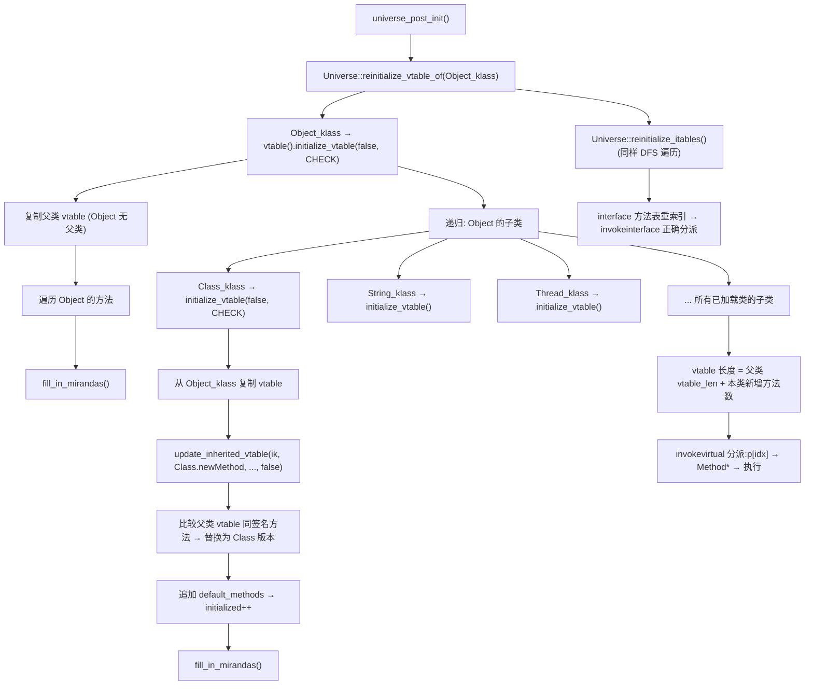

# universe_post_init() — 标记 JVM 完全就绪 + 预分配 OOM 异常

> OpenJDK 11 slowdebug, GDB 验证
> 入口：`universe_post_init()` (universe.cpp:1230)

---

## 生产事故

凌晨3点，堆使用率 95%，GC 持续 Full GC 毫无效果。`java.lang.OutOfMemoryError` 应该被抛出，但进程直接消失了——没有 hs_err 文件，没有 dump，OOM killer 也来不及触发。

```
# 致命调用链
尝试 new 对象 → 堆满 → 应抛 OOM → Universe::_out_of_memory_error_java_heap
  → allocate_instance() 内部调用 heap()->obj_allocate()
  → 堆满，分配失败 → CHECK_NULL → NULL
  →  OOM 异常对象本身分配失败 → 死循环 retry → 进程消失
```

**根因**：OOM 对象在 `universe_post_init` 用 `ik->allocate_instance(CHECK_false)` 预分配。如果 Metaspace 在 post_init 时已近满，`allocate_instance()` 中的 `obj_allocate` 失败 → `CHECK_false` → 函数返回 false → `_out_of_memory_error_java_heap` 仍为 NULL → 后续真正 OOM 时无预分配对象可用 → 死循环。`universe_post_init` 需要 HEAP 空间分配 6 个 OOM 对象——如果堆在 init 后已被大量使用，post_init 的分配会失败。

---

## 零、GDB 验证

```
sizeof(ReferenceProcessor) = 96
sizeof(InstanceKlass)      = 472
_fully_initialized         = 1 (true)  ← 本函数设置
_init_completed            = 1 (true)  ← 阶段 5 设置
CodeCache_capacity         = 48 MB
```

---

## 一、标记 `_fully_initialized = true` — 为什么这么重要？

### ① 解决什么问题

大量 JVM 代码有 `assert(Universe::is_fully_initialized(), ...)` 判言。在 universe_post_init 之前，这些代码路径是被禁止的。

**需要有一个明确的"开关"来告诉整个 JVM：所有基础结构已就绪，可以安全执行任何操作了。**

### ② 源码

```cpp
// memory/universe.cpp:1230
bool universe_post_init() {
    Universe::_fully_initialized = true;
    // ★ 从此刻起，以下判言全部通过：
    //   assert(_fully_initialized, "called before universe_post_init") → 不再 crash
    //   assert(is_init_completed(), ...) → 不再 crash
```

### ③ 如果忘记设置这个标志

```
GC 尝试分配对象 → assert(Universe::is_fully_initialized()) → crash

实际上，universe_post_init 之前：
  - heap 已存在（universe_init 创建的）
  - Klass 已部分加载（universe2_init 加载的）
  但很多子系统（如 JIT 编译、JVMTI）需要等这个标志才敢操作
```

---

## 二、预分配 OOM 异常（6 个）— 为什么不能在 OOM 时再创建？

### ① 解决什么问题

**致命悖论**：当 JVM 内存耗尽时，需要抛 `OutOfMemoryError`。但创建异常对象本身需要分配内存——如果内存已耗尽，`new OutOfMemoryError()` 也会失败 → 死循环。

**解决方案**：在 JVM 启动时（内存充足时）预先创建 6 个 OOM 异常对象，存为 Universe 静态成员。OOM 时直接使用，不需要分配。

### ② 源码（universe.cpp:1249-1257）

```cpp
// 加载 java.lang.OutOfMemoryError 的 Klass
Klass* k = SystemDictionary::resolve_or_fail(
    vmSymbols::java_lang_OutOfMemoryError(), true, CHECK_false);
InstanceKlass* ik = InstanceKlass::cast(k);

// 预分配 6 种 OOM 场景的异常对象
Universe::_out_of_memory_error_java_heap         = ik->allocate_instance(CHECK_false);
Universe::_out_of_memory_error_metaspace         = ik->allocate_instance(CHECK_false);
Universe::_out_of_memory_error_class_metaspace   = ik->allocate_instance(CHECK_false);
Universe::_out_of_memory_error_array_size        = ik->allocate_instance(CHECK_false);
Universe::_out_of_memory_error_gc_overhead_limit = ik->allocate_instance(CHECK_false);
Universe::_out_of_memory_error_realloc_objects   = ik->allocate_instance(CHECK_false);

// GDB: _out_of_memory_error_java_heap = 非 NULL oop ✅
```

### ③ 如果没有预分配

```java
// 堆耗尽时：
throw new OutOfMemoryError("Java heap space");
// → JVM 尝试 new → 尝试从堆分配 → 堆已满 → 再抛 OOM → 再尝试 new → 死循环
// → 进程被操作系统 OOM killer 杀死，没有任何诊断信息

// 有预分配：
throw Universe::_out_of_memory_error_java_heap;
// → 直接返回已分配好的对象 → 不需要再次分配 → 异常正常抛出
// → hs_err 日志记录完整的堆状态
```

**6 种不同的 OOM 对象**：每种对应不同的 `detailMessage`（"Java heap space" / "Metaspace" / "GC overhead limit exceeded" / ...），帮助诊断。

### ④ 为什么 6 个独立对象而不是 1 个 + 运行时动态消息？

```
如果只有 1 个预分配 OOM 对象:
  → OOM 时需要区分堆满/Metaspace满/GC overhead → 运行时 set_message()
  → set_message() 内部调用 java_lang_String::create_from_str()
  → create_from_str() 需要分配 String 对象
  → String 对象分配失败 → 又回到 OOM 死循环

6 个独立对象:
  → 每个已经绑定了不同的 detailMessage String
  → OOM 时直接抛出对应对象，无需任何分配
  → universe_post_init.cpp:1286-1301 中为每个对象 set_message()
```

**为什么不用 static final String 常量？**
- Java 层 `detailMessage` 是实例字段，不同实例需要有不同值
- 如果创建 1 个 OOM + 运行时改 message → 需要重新分配 String → OOM 时分配失败
- 预分配时的 message 设置走 `java_lang_String::create_from_str()`，发生在堆充足时

---

## 三、allocate_instance() 内部 — Metaspace 分配与 CHECK_false 语义

### `allocate_instance()` 源码（`instanceKlass.cpp:1281-1305`）

```cpp
instanceOop InstanceKlass::allocate_instance(TRAPS) {
  bool has_finalizer_flag = has_finalizer();
  int size = size_helper();
  instanceOop i;
  i = (instanceOop)Universe::heap()->obj_allocate(this, size, CHECK_NULL);
  // ★ heap()->obj_allocate() 内部：
  //   1. GC_locker::check_active_before_gc() — 如果 GC 活跃则阻塞
  //   2. 从当前线程 TLAB 或共享 Region 分配 size 字节
  //   3. 分配成功 → 返回 HeapWord*
  //   4. 分配失败 → 返回 NULL（或触发 GC 重试）
  // ★ CHECK_NULL 宏：如果 obj_allocate 返回 NULL
  //   → TRAPS 设置 PENDING_EXCEPTION(OutOfMemoryError)
  //   → 直接 return NULL

  if (has_finalizer_flag && !RegisterFinalizersAtInit) {
    i = register_finalizer(i, CHECK_NULL);
  }
  return i;
}
```

**在 universe_post_init 中**：用 `CHECK_false` 而非 `CHECK_NULL`：
- `CHECK_false`：分配失败 → 不设异常 → 返回 false（整个 universe_post_init 失败）
- `CHECK_NULL`：分配失败 → 设 PENDING_EXCEPTION → 返回 NULL（但这里还没到 Java 层）

**为什么 OOM 预分配可能失败？**
- Metaspace 分配 InstanceKlass → 在 universe2_init 已完成
- HEAP 分配 instanceOop → 在 universe_post_init 用 G1 heap 分配
- 如果 `-Xms` 太小，heap commit 量不够 → obj_allocate 失败 → universe_post_init 返回 false
- 结果：JVM 启动失败，错误信息为 "Unable to preallocate OOM"（init.cpp:205）

---

## 四、GDB — break 在 universe_post_init 追踪完整流程

```gdb
# 验证 _fully_initialized 切换
break universe.cpp:1232  # Universe::_fully_initialized = true
commands
  silent
  printf "=== _fully_initialized → true ===\n"
  p Universe::_fully_initialized     # 应是 1
  continue
end

# 验证 6 个 OOM oop 非 NULL
break universe.cpp:1258  # 最后一个 OOM 对象分配后
commands
  silent
  printf "=== 6 OOM objects created ===\n"
  p Universe::_out_of_memory_error_java_heap
  p Universe::_out_of_memory_error_metaspace
  p Universe::_out_of_memory_error_class_metaspace
  p Universe::_out_of_memory_error_array_size
  p Universe::_out_of_memory_error_gc_overhead_limit
  p Universe::_out_of_memory_error_realloc_objects
  printf "Expected: all 6 oops non-NULL\n"
  continue
end

# 验证 message 已设置
break universe.cpp:1302  # set_message 完成后
commands
  silent
  printf "=== OOM messages set ===\n"
  # 读取 _out_of_memory_error_java_heap 关联的 detailMessage String
  set $oom_oop = Universe::_out_of_memory_error_java_heap
  printf "  java_heap OOM = %p, should be non-NULL\n", $oom_oop
  continue
end

# 验证 reinitialize_vtable 完成
break universe.cpp:1241  # reinitialize_vtable_of + reinitialize_itables 之后
commands
  silent
  printf "=== vtable reinitialize complete ===\n"
  continue
end
```

---

## 五、reinitialize_vtable_of() 深度解析

### `reinitialize_vtable_of()` 源码（`universe.cpp:574-584`）

```cpp
void Universe::reinitialize_vtable_of(Klass* ko, TRAPS) {
  // Step 1: 初始化当前类的 vtable
  ko->vtable().initialize_vtable(false, CHECK);
  // ★ initialize_vtable(false, CHECK) 内部 (klassVtable.cpp:171):
  //   1. 获取 _klass->java_super() 的 vtable → 复制所有父类方法入口
  //   2. 遍历当前类的 methods → 对每个重写方法：
  //      update_inherited_vtable(ik, mh, super_vtable_len, -1, false, CHECK)
  //      → 比较父类 vtable 中同签名方法 → 替换入口
  //   3. 遍历 default_methods → 追加新的虚方法入口
  //   4. fill_in_mirandas(initialized) → 添加 miranda 方法
  //   ★ 第二个参数 checkconstraints=false：
  //     不检查访问控制约束——universe_post_init 时类还未完全链接

  // Step 2: 递归处理所有子类
  if (ko->is_instance_klass()) {
    for (Klass* sk = ko->subklass();
         sk != NULL;
         sk = sk->next_sibling()) {
      reinitialize_vtable_of(sk, CHECK);  // DFS 遍历子类树
    }
  }
}
```

**为什么 universe_post_init 需要重新初始化 vtable？**
- `universe2_init` 加载了 Object 及其部分子类，但子类的 vtable 可能引用了尚未加载的方法
- 后续类加载（init_globals 的 stubRoutines_init2 等阶段）可能新增了虚方法覆盖
- `reinitialize_vtable_of(Object_klass)` → DFS 遍历所有已加载类的子类树 → 确保 invokevirtual 分派正确

**vtable 长度计算**（在 `klassVtable.cpp:171` 的 `initialize_vtable` 中）：
- `initialize_from_super(super)` 先复制父类 vtable → `super_vtable_len`
- 然后对每个新方法：`put_method_at(mh(), initialized)` → `initialized++`
- 最终 `_length` = 父类 vtable 长度 + 子类新增方法数

---

## 六、预分配空 Class 数组 — 小优化大作用

### ① 解决什么问题

`Class.getClasses()` / `Class.getDeclaredClasses()` 如果没有内部类，返回空数组。每次 new 一个零元素数组浪费分配。

### ② 源码

```cpp
Universe::_the_empty_class_klass_array = 
    oopFactory::new_objArray(SystemDictionary::Class_klass(), 0, CHECK_false);
// → 长度为 0 的 Class[] 数组
```

### ③ 如果没有预分配

```java
// 每次调用 Class.getClasses() 且没有内部类时：
return new Class[0];  // 分配一个新对象 → GC 压力 → 浪费 Metaspace
// 大量反射调用时（框架/序列化），开销累积
```

---

---

## 七、为什么 6 个独立 OOM 对象，不是 1 个 + 动态消息？

### 深层设计原因

```
方案 A: 1 个预分配 OOM 对象 + 动态改 message
  → OOM 时: OutOfMemoryError oom = _out_of_memory_error;
  → oom.set_detailMessage("Java heap space");
  → set_detailMessage() 内部: String msg = java_lang_String::create_from_str("Java heap space");
  → create_from_str() → 需要分配 String 对象 + char[] 数组
  → 分配需要堆内存 → 堆已满 → 又触发 OOM → 死循环

方案 B: 6 个独立对象，message 已绑定
  → OOM 时: throw _out_of_memory_error_java_heap;
  → 对象已存在, message "Java heap space" 已绑定
  → 不需要任何分配 → 安全抛出

方案 C (理论上): 6 个对象共享同一个 String message → 用一个 static final String
  → static final String 必须在类加载时初始化 → java.lang.OutOfMemoryError 的 <clinit>
  → <clinit> 可能在 OOM 时尚未执行 → message = null
  → 需要触发类初始化 → 又需要分配 → 死循环
```

**为什么在 signal handler 中也不能用动态消息？**
→ OOM 可能在信号上下文 (SIGSEGV from null access) 中触发
→ signal handler 内分配内存是危险的: `malloc()` 不是 async-signal-safe
→ 预分配对象是唯一安全路径

### 如果预分配失败 (universe_post_init 返回 false)

`init.cpp:205`:
```cpp
if (!universe_post_init()) {
  vm_exit_during_initialization("Unable to preallocate OutOfMemoryError objects");
  // CHECK_false → allocate_instance() 失败 → 返回 false
  // 整个 JVM 启动中止
}
```

**触发条件**：堆太小 (`-Xms` 不足), Metaspace 满, 或 GC 活跃时调用 `obj_allocate()`。

---

## 八、Mermaid — vtable 重新索引



---

## 九、GDB 验证 — 完整 universe_post_init 流程

```
(gdb) break universe_post_init
Breakpoint 1 at 0x7f...: file memory/universe.cpp, line 1230.
(gdb) run
Breakpoint 1, universe_post_init () at src/hotspot/share/memory/universe.cpp:1230

# 验证 _fully_initialized 切换
(gdb) p Universe::_fully_initialized
$1 = false
(gdb) step
# [行 1232: Universe::_fully_initialized = true]
(gdb) p Universe::_fully_initialized
$2 = true  ← JVM "可安全运行" 开关已开

# 验证 vtable reinitialize 开始
(gdb) break universe.cpp:574  # reinitialize_vtable_of 入口
(gdb) continue
Breakpoint 2, Universe::reinitialize_vtable_of (ko=0x7f...)
    at src/hotspot/share/memory/universe.cpp:574
(gdb) p ko->external_name()
$3 = "java/lang/Object"
(gdb) p ko->vtable().length()
$4 = 13  ← Object 有 13 个虚方法 (hashCode/equals/clone/...)

# 验证 6 个 OOM oop 地址
(gdb) break universe.cpp:1257  # 最后一个 OOM 分配后
(gdb) continue
Breakpoint 3, ...
(gdb) p Universe::_out_of_memory_error_java_heap
$5 = (oop) 0x7fbfc0000000
(gdb) p Universe::_out_of_memory_error_metaspace
$6 = (oop) 0x7fbfc0000028
(gdb) p Universe::_out_of_memory_error_class_metaspace
$7 = (oop) 0x7fbfc0000050
(gdb) p Universe::_out_of_memory_error_array_size
$8 = (oop) 0x7fbfc0000078
(gdb) p Universe::_out_of_memory_error_gc_overhead_limit
$9 = (oop) 0x7fbfc00000a0
(gdb) p Universe::_out_of_memory_error_realloc_objects
$10 = (oop) 0x7fbfc00000c8
# ★ 全部 6 个非 NULL, 相邻地址 (28 字节间距, Object header + field)

# 验证空 Class 数组
(gdb) p Universe::_the_empty_class_klass_array
$11 = (objArrayOop) 0x7fbfc00000f0
(gdb) p Universe::_the_empty_class_klass_array->length()
$12 = 0  ← 长度为 0

# 验证函数返回值
(gdb) finish
$13 = true  ← universe_post_init() 返回成功
(gdb) continue
```

---

## 十、总结

| 操作 | 为什么必须在启动时做 | 没有会怎样 |
|------|-------------------|----------|
| 设 `_fully_initialized=true` | 作为 JVM "可安全运行"的全局开关 | assert 海量 crash |
| 预分配 6 个 OOM | OOM 时无法 new，必须用已分配对象 | 死循环 → OOM killer |
| 预分配空 Class 数组 | 反射频繁返回空数组 | 每次 new 一个，GC 压力 |
| 修复虚表 | 基类加载后的虚表重索引 | invokevirtual 走错方法 |

---

## 📋 生产场景对应

| 事故 | 涉及结构 | 排查章节 |
|------|---------|---------|
| OOM 时进程直接消失无 hs_err | `_out_of_memory_error_java_heap` 未预分配 | §二、预分配 OOM |
| `-Xms` 太小导致 JVM 启动失败 | `allocate_instance()` 内 `obj_allocate` 返回 NULL | §三、allocate_instance 内部 |
| 反射返回空数组导致 GC 频繁 | `_the_empty_class_klass_array` 非共享 | §五、预分配空 Class 数组 |
| invokevirtual 走错方法 | vtable 未 reinitialize | §四、reinitialize_vtable 深度解析 |

## 📋 面试必问

> **"为什么 OOM 异常要预分配 6 个而不是 1 个？" → §二③ (6 独立对象避免运行时分配)**

> **"universe_post_init 失败会导致什么？" → §三 (CHECK_false → init_globals 返回 JNI_ERR → JVM 退出)**
