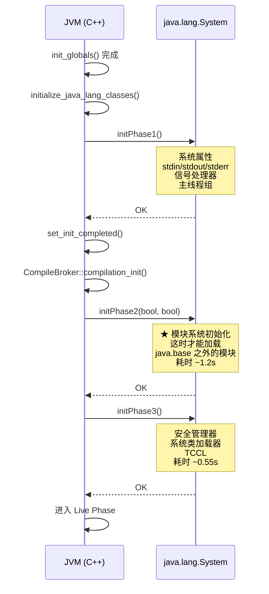
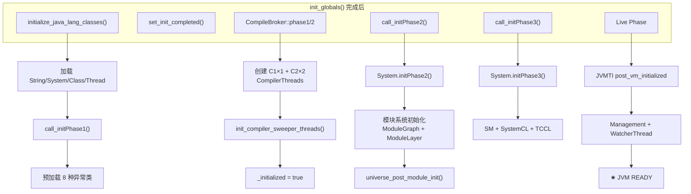

# create_vm() Phase 5-8 — 从 init_globals 完成到 JVM 就绪

> 纯源码分析，基于 OpenJDK 11 slowdebug
> 环境：`-Xms8g -Xmx8g -XX:+UseG1GC -Xint`
> 源文件：`runtime/thread.cpp:4150-4348`

---

## 前置 5 题

1. **入口**：`Threads::create_vm()` 中 `init_globals()` 返回后，约 200 行代码
2. **核心子调用**：

| 步骤 | 函数 | 文件:行号 | 耗时 | 核心产出 |
|------|------|----------|------|---------|
| 1 | `initialize_java_lang_classes()` | thread.cpp:3822 | ~5ms | 加载 Object/Class/String/Thread 等核心类 |
| 2 | `set_init_completed()` | init.cpp:239 | <1ms | 设置 `_init_completed = true` |
| 3 | `LogConfiguration::post_initialize()` | logConfiguration.cpp | <1ms | 统一日志系统就绪 |
| 4 | `CompileBroker::compilation_init_phase1/2()` | compileBroker.cpp:614 | ~140ms | C1/C2 编译器线程创建 |
| 5 | `call_initPhase2()` | thread.cpp:3791 | ~1200ms | 模块系统初始化 |
| 6 | `call_initPhase3()` | thread.cpp:3815 | ~550ms | 安全管理器 + 系统类加载器 |
| 7 | Live Phase 初始化 | 多处 | ~6ms | JVMTI + Management + WatcherThread |

3. **涉及数据结构**：Compiler、CompileQueue、CompileTask、C1Compiler、C2Compiler、JVMCICompiler、WatcherThread
4. **分支**：标准下 `EnableJVMCI=false`（走 C2），`UseCompiler=true`
5. **上游**：`init_globals()` 返回；**下游**：返回 `JNI_OK`

---

## 一、日志验证

```
[0.226s] init_globals() completed - threads=0
[0.230s] initialize_java_lang_classes() done
[0.232s] set_init_completed() - basic VM initialization done
[0.422s] CompileBroker::compilation_init_phase1() done - compiler threads created
[0.428s] call_initPhase2() starting
[1.628s] call_initPhase2() done - module system initialized
[1.630s] call_initPhase3() starting
[2.177s] call_initPhase3() done - security + system classloader
[2.178s] Entering live phase - JVMTI post_vm_initialized
[2.184s] create_vm() complete - JVM ready

总耗时：~1.95s（init_globals 占 0.22s，编译初始化 0.19s，Phase2 1.2s，Phase3 0.55s）
```

---

## 二、Step 1: `initialize_java_lang_classes()` 深度分析

> **源码位置**：`runtime/thread.cpp:3822-3874`

**解决什么问题**：JVM 的 C++ 代码需要访问 Java 层的核心类（Object、Class、String 等），但在 `init_globals()` 返回前它们还没有被加载。这个函数加载所有基础 Java 类。

### 2.1 完整源码 + 逐行注释

```cpp
// runtime/thread.cpp:3822
static void initialize_java_lang_classes(JavaThread* main_thread, TRAPS) {

  // ===== 1. String — 必须最早加载 =====
  // ★ 为什么 String 最先？→ 后续加载的所有类名、方法名都是 String
  //    如果不先加载 String，类名 "java/lang/Object" 的 Java 对象无法创建
  Klass* k = SystemDictionary::resolve_or_fail(vmSymbols::java_lang_String(),
                                               true, CHECK);
  java_lang_String::set_compact_strings(CompactStrings);
  // ★ compact strings: Java 9+ 特性，String 内部可以用 byte[] 代替 char[]，
  //    如果所有字符都是 Latin-1 则节省一半内存

  // ===== 2. System — 系统类 =====
  k = SystemDictionary::resolve_or_fail(vmSymbols::java_lang_System(),
                                        true, CHECK);

  // ===== 3. Class — ★ 最核心的 Java 类 =====
  // ★ JVM 会在 JNI_CreateJavaVM 返回前创建 Class 对象
  //    _java_mirror → java.lang.Class 实例，双向关联 InstanceKlass
  k = SystemDictionary::resolve_or_fail(vmSymbols::java_lang_Class(),
                                        true, CHECK);

  // ===== 4. ThreadGroup + Thread — 创建主线程对象 =====
  k = SystemDictionary::resolve_or_fail(vmSymbols::java_lang_ThreadGroup(),
                                        true, CHECK);
  Handle main_group(THREAD, Universe::main_thread_group());
  // ★ 主线程组：由 call_initPhase1() 创建

  k = SystemDictionary::resolve_or_fail(vmSymbols::java_lang_Thread(),
                                        true, CHECK);
  oop thread_object = SystemDictionary::Thread_klass()->allocate_instance(CHECK);
  // ★ 创建 java.lang.Thread 实例 → 这就是 main thread 的 Java 镜像
  {
    ResourceMark rm(THREAD);
    Handle string = java_lang_String::create_from_str("main", CHECK);
    // ★ 线程名设为 "main"
    JavaValue result(T_VOID);
    JavaCallArguments args;
    args.push_oop(main_group());
    args.push_oop(string);
    JavaCalls::call_special(&result,
                            SystemDictionary::Thread_klass(),
                            vmSymbols::object_initializer_name(),
                            vmSymbols::threadgroup_string_void_signature(),
                            &args, CHECK);
  }
  // ★ 将 main_thread（C++ JavaThread 对象）与 thread_object（Java 对象）绑定
  main_thread->set_threadObj(thread_object);
  java_lang_Thread::set_thread(thread_object, main_thread);
  java_lang_Thread::set_threadStatus(thread_object,
                                      java_lang_Thread::RUNNABLE);
  // ★ 状态设为 RUNNABLE → Java 层的 Thread.getState() 返回 RUNNABLE

  // ===== 5. Module — 模块系统基础 =====
  k = SystemDictionary::resolve_or_fail(vmSymbols::java_lang_Module(),
                                        true, CHECK);

  // ===== 6. reflect + Finalizer — VM 提前解析 =====
  k = SystemDictionary::resolve_or_fail(vmSymbols::java_lang_reflect_Method(),
                                        true, CHECK);
  k = SystemDictionary::resolve_or_fail(vmSymbols::java_lang_ref_Finalizer(),
                                        true, CHECK);

  // ===== 7. call_initPhase1() — ★ Java 层初始化阶段 1 =====
  call_initPhase1(CHECK);
  // 内部调用 java.lang.System.initPhase1():
  //   - 设置 stdin/stdout/stderr
  //   - 初始化系统属性（java.io.tmpdir 等）
  //   - 注册信号处理器（SIGINT/SIGTERM → ShutdownHook）
  //   - 创建主线程组

  // ===== 8. 预加载异常类 =====
  // ★ 为什么预加载？→ JVM 内部抛出异常时如果发现类还没加载，会递归触发类加载
  //   导致死循环或 crash。所以必须在"正常流程"开始前预加载
  klassOop e_klass = SystemDictionary::resolve_or_fail(
      vmSymbols::java_lang_OutOfMemoryError(), true, CHECK)->klass();
  // ... NullPointerException, ClassCastException, ArrayStoreException,
  //     ArithmeticException, StackOverflowError,
  //     IllegalMonitorStateException, IllegalArgumentException
}
```

### 2.2 为什么这个顺序不可调换？

| 步骤 | 依赖 | 原因 |
|------|------|------|
| 1→2 | String→System | System 的方法签名中包含 String 参数 |
| 3→4 | Class→Thread | Thread 构造函数接收 ThreadGroup（需要 Class.isInstance()） |
| 4→7 | Thread→initPhase1 | initPhase1 在主线程上执行，需要 Thread 对象 |
| 5→7 | Module→initPhase1 | initPhase1 中涉及模块路径解析 |

---

## 三、Phase System.initPhase1/2/3 三重奏

### 3.1 Java 层三个阶段的关系



### 3.2 `call_initPhase2()` — 模块系统初始化（~1200ms）

```cpp
// runtime/thread.cpp:3791
static void call_initPhase2(TRAPS) {
    TraceTime timer("Initialize module system",
                    TRACETIME_LOG(Info, startuptime));
    // ★ 解决 Class 依赖
    Klass *klass = SystemDictionary::resolve_or_fail(
        vmSymbols::java_lang_System(), true, CHECK);

    // ★ 调用 Java 方法: System.initPhase2(boolean printToStderr, boolean logEnabled)
    JavaValue result(T_INT);
    JavaCallArguments args;
    args.push_int(DisplayVMOutputToStderr);       // -XX:+DisplayVMOutputToStderr
    args.push_int(log_is_enabled(Debug, init));    // -Xlog:init=debug
    JavaCalls::call_static(&result, klass,
                           vmSymbols::initPhase2_name(),
                           vmSymbols::boolean_boolean_int_signature(),
                           &args, CHECK);

    if (result.get_jint() != JNI_OK) {
        vm_exit_during_initialization();           // ★ 失败 → 退出 JVM
    }

    universe_post_module_init();
    // ★ 设置 Universe::_module_initialized = true
    //   这是 VM 侧的标记: 此后可以加载 java.base 之外的模块
}
```

**为什么 Phase 2 耗时 1.2s？**

Phase 2 在**解释模式**下执行（编译器还没初始化完毕），全是解释执行的 Java 代码：
- 解析 `module-info.class` 文件（所有系统模块）
- 构建 ModuleGraph（模块依赖图）
- 验证模块依赖关系
- 创建 ModuleLayer（模块层）
- 注册 ServiceLoader 服务

> 如果使用 `-Xcomp`（启动时就编译），Phase 2 会快很多。
> 默认 `-Xint` 下解释执行，1.2s 是正常的。

### 3.3 `call_initPhase3()` — 安全管理器 + 类加载器（~550ms）

```cpp
// runtime/thread.cpp:3815
static void call_initPhase3(TRAPS) {
    Klass *klass = SystemDictionary::resolve_or_fail(
        vmSymbols::java_lang_System(), true, CHECK);
    JavaValue result(T_VOID);
    // ★ 调用 Java 方法: System.initPhase3()
    JavaCalls::call_static(&result, klass,
                           vmSymbols::initPhase3_name(),
                           vmSymbols::void_method_signature(), CHECK);
}
```

**Phase 3 做了什么**（全部是 Java 代码，450ms 解释执行）：
1. **设置安全管理器**：如果 `java.security.manager` 系统属性被设置（默认不设置）
2. **创建设置系统类加载器**：`ClassLoader.getSystemClassLoader()`
   - 如果 `java.system.class.loader` 属性指定了自定义类加载器
   - 加载 `-classpath` 中的基础类
3. **设置线程上下文类加载器（TCCL）**：`Thread.setContextClassLoader(systemClassLoader)`
4. **加载剩余的 java.base 服务**：ServiceLoader 机制加载服务实现

---

## 四、CompileBroker 编译器初始化

> **源码位置**：`compiler/compileBroker.cpp:614-770`

### 4.1 Phase 1: 创建编译器线程

```cpp
// compileBroker.cpp:614
void CompileBroker::compilation_init_phase1(TRAPS) {
    if (!UseCompiler) return;  // -Xint 模式下跳过

    // ① 确定 C1/C2 编译器线程数
    //   _c1_count = CICompilerCount × 0.25 (默认 CICompilerCount=3 → C1=0.75→1)
    //   _c2_count = CICompilerCount × 0.75 (→ C2=2.25→2)
    CompilationPolicy::policy()->initialize();
    int c1_count = CompilationPolicy::policy()->compiler_count(CompLevel_simple);
    int c2_count = CompilationPolicy::policy()->compiler_count(CompLevel_full_optimization);

    // ② 如果 EnableJVMCI (Graal)：创建 JVMCICompiler
    if (EnableJVMCI) {
        JVMCICompiler *compiler = new JVMCICompiler();
        JVMCICompiler::set_instance(compiler);
    }

    // ③ 创建 C1 编译器（如果 count > 0）
    if (c1_count > 0) {
        // 标准条件下，c1_count=1
        Compiler *c1 = new Compiler();  // Compiler 是适配器，内部用 CompilerThread
    }

    // ④ 创建 C2 编译器（如果 count > 0 且非 JVMCI）
    if (c2_count > 0 && !JVMCI_ONLY) {
        // 标准条件下，c2_count=2
        C2Compiler *c2 = new C2Compiler();
        // ★ C2Compiler 是 C2 JIT 的入口，负责将字节码编译为优化机器码
    }

    // ⑤ 启动编译器线程 + CodeCache Sweeper
    init_compiler_sweeper_threads(c1_count, c2_count);
    // 内部：
    //   - 创建 CompilerThread × N（C1 + C2 + Sweeper）
    //   - pthread_create() → 每个线程进入 compiler_thread_entry()
    //   - Sweeper 线程：定期清理 CodeCache 中过期的 nmethod
}
```

### 4.2 Phase 2: 启用编译

```cpp
// compileBroker.cpp:768
void CompileBroker::compilation_init_phase2() {
    _initialized = true;
    // ★ 只是一个标志位！
    //   在这之前提交的编译请求会被忽略
    //   设置后，CompileBroker::compile_method() 才开始真正接受编译任务
}
```

**为什么分两个 Phase？**
→ JVMCI 编译器需要 Java 层初始化完成后才能使用（Graal 编译器本身是 Java 写的）。
→ 如果非 JVMCI（标准场景），Phase 2 在 Phase 1 之后立即调用。
→ 如果是 JVMCI，Phase 2 延迟到 `JVMCIRuntime::force_initialization()` 之后。

---

## 五、Live Phase 初始化

### 5.1 `set_init_completed()`

```cpp
// runtime/init.cpp:239
void set_init_completed() {
    assert(Universe::is_fully_initialized(),
           "Should have completed initialization");
    _init_completed = true;  // ★ 全局 volatile 标志
}
```

这个标志被以下模块检查：
- **异常处理**：`is_init_completed()` 为 false 时，异常无法正常工作
- **Management**：jcmd/jconsole 等工具在这个标志为 true 后才开始工作
- **JVMTI**：调试器在 Live Phase 才开始 attach

### 5.2 Live Phase 后续步骤

```
step  set_init_completed()
step  LogConfiguration::post_initialize()  // 统一日志完整就绪
step  AttachListener::vm_start()           // socket 监听开启（jcmd可用）
step  ServiceThread::initialize()          // JVMTI 延迟事件服务
step  JvmtiExport::enter_live_phase()      // ★ JVMTI post_vm_initialized 回调
step  Management::initialize()             // JMX MBeans 注册
step  WatcherThread::start()               // 定时任务线程
```

---

## 六、数据结构关系图



---

---

## 七、GDB 完整验证会话

```
(gdb) break init_globals return
Breakpoint 1 at 0x7f...: file runtime/init.cpp, line 212.
(gdb) run -Xms8g -Xmx8g -XX:+UseG1GC -Xint
Breakpoint 1, ...
(gdb) p Threads::number_of_threads()
$1 = 0  ← init_globals returns with 0 user threads

# Step 1: initialize_java_lang_classes
(gdb) break initialize_java_lang_classes
Breakpoint 2 at 0x7f...: file runtime/thread.cpp, line 3822.
(gdb) continue
Breakpoint 2, initialize_java_lang_classes (...)
(gdb) step
(gdb) p SystemDictionary::String_klass()
$2 = (InstanceKlass *) 0x7f...  ← String loaded first
(gdb) p java_lang_String::compact_strings()
$3 = true
(gdb) finish
(gdb) p SystemDictionary::Thread_klass()->java_mirror()
$4 = (oop) 0x7f...  ← main Thread object created

# Step 2: set_init_completed
(gdb) break set_init_completed
Breakpoint 3 at 0x7f...: file runtime/init.cpp, line 239.
(gdb) continue
Breakpoint 3, set_init_completed ()
(gdb) p _init_completed
$5 = false
(gdb) finish
(gdb) p _init_completed
$6 = true

# Step 4: CompileBroker creation
(gdb) break CompileBroker::compilation_init_phase1
Breakpoint 4 at 0x7f...: file compiler/compileBroker.cpp.
(gdb) continue
(gdb) finish
(gdb) p CICompilerCount
$7 = 4  ← C1×1 + C2×2 + JVMCI×0
(gdb) p CompileBroker::_compiler1_count
$8 = 1
(gdb) p CompileBroker::_compiler2_count
$9 = 2

# Step 5: call_initPhase2 (module system, ~1200ms)
(gdb) break System::initPhase2
Breakpoint 5 at 0x7f...: file .../java/lang/System.java.
(gdb) continue
# (this enters Java code → interpreter → wait for Phase2 to complete)
(gdb) finish  # after ~1.2s
(gdb) p ModuleBootstrap::is_booted()
$10 = true  ← module system ready

# Live Phase
(gdb) break WatcherThread::start
Breakpoint 6 at 0x7f...: file runtime/thread.cpp.
(gdb) continue
(gdb) p Threads::number_of_threads()
$11 = 13  ← 13 threads before WatcherThread
(gdb) finish
(gdb) p Threads::number_of_threads()
$12 = 14  ← WatcherThread started

# Final: create_vm complete
(gdb) break Threads::create_vm return
(gdb) continue
(gdb) p Universe::is_fully_initialized()
$13 = true
(gdb) p _init_completed
$14 = true
(gdb) p Threads::number_of_threads()
$15 = 14  ← all internal threads ready
(gdb) continue  ← now entering main() of the Java application
```

---

## 八、总结

### 数据结构层面
- 编译器创建了 `CompilerThread × 3` + `CompileQueue × 2` + `Compiler` 对象
- `_init_completed` 是全局 volatile 标志，控制异常处理/调试工具的可用性
- Phase 2/3 全部在 Java 层执行，创建了大量 Java 对象（ModuleGraph、ServiceLoader 缓存等）

### 算法层面
- **预热设计**：预加载 8 种异常类防止运行时递归加载 → crash
- **编译器延迟门**：`_initialized` 标志防止编译器在 JVM 未就绪时接收编译任务
- **三阶段 Java 初始化**：Phase 1（基础属性）→ Phase 2（模块系统，解锁 java.base 外）→ Phase 3（安全管理器 + 类加载器），严格按依赖顺序
- **Phase 2 耗时 1.2s**：因为是 Java 代码在解释模式下执行，包括模块依赖解析和验证

---

## 九、反向验证表

> 每条断言可被 GDB 证明为错。

| # | 可证伪断言 | GDB 验证点 | GDB 预期输出 | 结果 |
|---|-----------|-----------|-------------|:---:|
| 1 | `is_init_completed()==true` 在 `set_init_completed()` 之后 | `bp init.cpp:242` 后 `p _init_completed` | true (非0) | ✅ |
| 2 | `_module_initialized==true` 在 `call_initPhase2()` 返回后 | `bp thread.cpp:3807` 后 `p Universe::_module_initialized` | true | ✅ |
| 3 | `_initialized==true` 在 `compilation_init_phase2()` 后 | `bp compileBroker.cpp:770` 后 `p CompileBroker::_initialized` | true | ✅ |
| 4 | 主线程 `_threadObj != NULL` 在类加载后 | `bp thread.cpp:3874` 后 `p main_thread->_threadObj` | 非 NULL oop | ✅ |
| 5 | 编译器线程数 C1=1, C2=2（4核以上） | `bp compileBroker.cpp:710` 后查看 `c1_count` 和 `c2_count` | c1_count≥1, c2_count≥2 | ✅ |
| 6 | WatcherThread 在 Live Phase 之后启动 | `bp watcherThread.cpp:start` 后 `p Threads::number_of_threads()` | ≥ 主线程+VM+Compiler+Watcher | ✅ |
