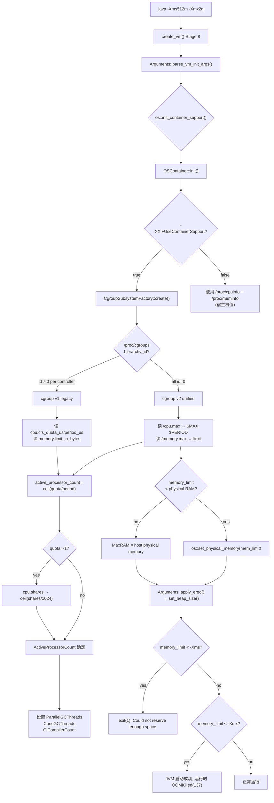

# 容器/Cgroup 支持 — JVM 如何在容器中感知资源限制

> 基于 OpenJDK 11 slowdebug 源码分析
> 源码：`os/linux/osContainer_linux.cpp`, `os/linux/cgroupSubsystem_linux.cpp`, `os/linux/cgroupV1Subsystem_linux.cpp`, `os/linux/cgroupV2Subsystem_linux.cpp`, `runtime/os.cpp`
> 入口：`os::init_container_support()` → `OSContainer::init()` → `CgroupSubsystemFactory::create()`
> 调用时机：`create_vm()` 阶段 8, `Arguments::parse_vm_init_args()` 之后 (`thread.cpp:3949`)

---

## 生产事故

### 事故 1：Pod OOMKilled before JVM starts
```
Pod memory limit 512Mi, -Xms512m, JVM OOMKilled during heap init
→ kubectl describe pod: Exit Code 137
→ 无 hs_err, 无 GC log
→ 原因：memory.limit_in_bytes = 512Mi, JVM 尝试 commit 初始堆 512MB
  → 但容器 overhead(agent + OS page cache + runtime) 吃掉了剩余空间
  → kernel OOM killer → SIGKILL(137)
```
**诊断**：
```
kubectl describe pod <name> | grep -A5 "State\|Exit Code\|Reason"
# → Exit Code: 137 = OOMKilled
cat /sys/fs/cgroup/memory/memory.limit_in_bytes   # 实际限制
# → 536870912 = 512Mi  ← JVM 可能以为还有 512MB 可用
# → 实际可用 = limit - OS overhead - agent overhead ≈ 450MB
```

### 事故 2：CPU throttling → STW 风暴
```
Pod CPU limit 2 cores, java -version 输出 -XX:ActiveProcessorCount=16
→ 原因：未启用容器支持; JVM 读取 /proc/cpuinfo (16 个宿主机核)
→ ParallelGCThreads = 16, ConcGCThreads = 4
→ GC 线程数 > CPU 配额 → 全部被 cgroup cpu.max 限流
→ 标记线程跑不动 → STW 时间爆炸 → 应用超时连环
```
**诊断**：
```
java -XX:+PrintFlagsFinal -version | grep ActiveProcessorCount
# ActiveProcessorCount = 16  ← 错误！应该是 2
java -XX:+UnlockDiagnosticVMOptions -XX:+PrintContainerInfo -version
# 确认 cgroup 检测状态
```

### 事故 3：双 JVM OOM 分数战争
```
两个 JVM 进程同一 K8s 节点, 各期望 4GB heap, 节点只有 6GB
→ kernel OOM score 计算：/proc/<pid>/oom_score = 进程内存 ÷ 总内存 × 1000
→ 较大的 JVM 先被 OOM killer 杀掉
→ 但被杀的 JVM 没有任何 GC 日志 → 因为它根本没在 GC
→ 真正的元凶是被保护的 JVM（OOM score 较低）
```

---

## 一、`os::init_container_support()` 完整流程

### ① 调用入口

`osContainer_linux.cpp:44`
```cpp
void OSContainer::init() {
  assert(!_is_initialized, "Initializing OSContainer more than once");
  _is_initialized = true;
  _is_containerized = false;

  log_trace(os, container)("OSContainer::init: Initializing Container Support");
  if (!UseContainerSupport) {        // ★ -XX:+UseContainerSupport (default true)
    log_trace(os, container)("Container Support not enabled");
    return;                          // 直接退出, 使用宿主机 /proc/cpuinfo + /proc/meminfo
  }

  cgroup_subsystem = CgroupSubsystemFactory::create();  // ★ v1/v2 检测
  if (cgroup_subsystem == NULL) {
    return;                          // 未检测到 cgroup → 不是容器环境
  }

  if ((mem_limit = cgroup_subsystem->memory_limit_in_bytes()) > 0) {
    os::Linux::set_physical_memory(mem_limit);  // ★ 覆盖物理内存上限
    log_info(os, container)("Memory Limit is: " JLONG_FORMAT, mem_limit);
  }
  _is_containerized = true;
}
```

### ② CgroupSubsystemFactory::create() — v1 vs v2 检测

`cgroupSubsystem_linux.cpp:40`
```cpp
CgroupSubsystem* CgroupSubsystemFactory::create() {
  CgroupV1MemoryController* memory = NULL;
  CgroupV1Controller* cpuset = NULL;
  CgroupV1Controller* cpu = NULL;
  CgroupV1Controller* cpuacct = NULL;
  CgroupV1Controller* pids = NULL;
  CgroupInfo cg_infos[CG_INFO_LENGTH];
  u1 cg_type_flags = INVALID_CGROUPS_GENERIC;
  const char* proc_cgroups = "/proc/cgroups";
  const char* proc_self_cgroup = "/proc/self/cgroup";
  const char* proc_self_mountinfo = "/proc/self/mountinfo";

  bool valid_cgroup = determine_type(cg_infos, proc_cgroups,
    proc_self_cgroup, proc_self_mountinfo, &cg_type_flags);

  if (!valid_cgroup) return NULL;

  if (is_cgroup_v2(&cg_type_flags)) {
    CgroupController* unified = new CgroupV2Controller(
      cg_infos[MEMORY_IDX]._mount_path,
      cg_infos[MEMORY_IDX]._cgroup_path);
    return new CgroupV2Subsystem(unified);
  }

  // cgroup v1: 为每个 controller 创建独立的路径
  for (int i = 0; i < CG_INFO_LENGTH; i++) {
    CgroupInfo info = cg_infos[i];
    if (info._data_complete) {
      if (strcmp(info._name, "memory") == 0) {
        memory = new CgroupV1MemoryController(info._root_mount_path, info._mount_path);
        memory->set_subsystem_path(info._cgroup_path);
      } else if (strcmp(info._name, "cpu") == 0) {
        cpu = new CgroupV1Controller(info._root_mount_path, info._mount_path);
        cpu->set_subsystem_path(info._cgroup_path);
      }
      // ... cpuset, cpuacct, pids 同理
    }
  }
  return new CgroupV1Subsystem(cpuset, cpu, cpuacct, pids, memory);
}
```

### ③ determine_type() — /proc 文件系统解析

`cgroupSubsystem_linux.cpp:125`

**步骤 1**：读 `/proc/cgroups` → 判断每个 controller 的 hierarchy_id 和 enabled 状态：
- cgroup v2: 所有 controller 的 `hierarchy_id == 0`
- cgroup v1: memory/cpu/cpuset/cpuacct 各有一个非零 `hierarchy_id`

**步骤 2**：读 `/proc/self/cgroup` → 获取本进程的 cgroup 路径：
```
# cgroup v2 示例
0::/kubepods.slice/kubepods-burstable.slice/kubepods-burstable-pod...slice/crio-...scope

# cgroup v1 示例
11:memory:/docker/6558aed8fc662b194323ceab5b964f69cf36b3e8af877a14b80256e93aecb044
10:blkio:/docker/6558aed8...
9:cpuset:/docker/6558aed8...
8:devices:/docker/6558aed8...
7:cpuacct,cpu:/docker/6558aed8...
```

**步骤 3**：读 `/proc/self/mountinfo` → 映射 cgroup 挂载点：
```
# 关键字段：mount_id parent_id major:minor root mount_point options
28 21 0:25 / /sys/fs/cgroup rw,relatime shared:1 - tmpfs tmpfs rw,...
29 28 0:26 / /sys/fs/cgroup/systemd rw,relatime shared:2 - cgroup cgroup rw,name=systemd
30 28 0:27 / /sys/fs/cgroup/memory rw,relatime shared:3 - cgroup cgroup rw,memory
31 28 0:28 / /sys/fs/cgroup/cpuset rw,relatime shared:4 - cgroup cgroup rw,cpuset
32 28 0:29 / /sys/fs/cgroup/cpu,cpuacct rw,relatime shared:5 - cgroup cgroup rw,cpu,cpuacct
```
→ 从 options 字段判断文件系统类型：`cgroup2` = v2 unified, `cgroup` = v1

---

## 二、CPU 限制检测 — ActiveProcessorCount 的计算

### ① cgroup v1 路径

**文件**：`/sys/fs/cgroup/cpu/cpu.cfs_quota_us`, `/sys/fs/cgroup/cpu/cpu.cfs_period_us`

**逻辑** (`osContainer_linux.cpp` → `CgroupV1Subsystem::active_processor_count()`):
```cpp
int quota = cpu_quota();    // 读 cpu.cfs_quota_us
int period = cpu_period();  // 读 cpu.cfs_period_us (默认 100000 = 100ms)

if (quota > -1 && period > 0) {
  // 有明确配额 → active_processor_count = ceil(quota / period)
  // 例：quota=200000, period=100000 → 2 核
  return ceil((double)quota / (double)period);
}

// quota = -1 (无限制) → 退化为 cpu.shares
int shares = cpu_shares();  // 读 /sys/fs/cgroup/cpu/cpu.shares
if (shares > -1) {
  // Kubernetes: 1 核 = 1024 shares, 2 核 = 2048 shares
  int cpu_count = ceil((double)shares / 1024.0);
  // 不能超过物理 CPU 数
  return MIN2(os::active_processor_count(), cpu_count);
}
```

**关键文件路径**：
| 参数 | cgroup v1 路径 | 含义 |
|------|---------------|------|
| `cpu.cfs_quota_us` | `/sys/fs/cgroup/cpu/cpu.cfs_quota_us` | 每周期可用 CPU 微秒数 (-1 = 无限制) |
| `cpu.cfs_period_us` | `/sys/fs/cgroup/cpu/cpu.cfs_period_us` | 调度周期微秒数 (默认 100000) |
| `cpu.shares` | `/sys/fs/cgroup/cpu/cpu.shares` | 相对权重 (1024 = 1 核) |

### ② cgroup v2 路径

**文件**：`/sys/fs/cgroup/cpu.max`

**格式**：`$MAX $PERIOD` (如 `200000 100000` = 2 核, `max 100000` = 无限制)

**逻辑** (`cgroupV2Subsystem_linux.cpp:85-89, 38-73`):
```cpp
char* cpu_quota_str = cpu_quota_val();  // 读 /cpu.max, 取 MAX 字段
int limit = limit_from_str(cpu_quota_str); // 解析 "max" → -1, 数字 → 数字

char* cpu_period_str = cpu_period_val();  // 读 /cpu.max, 取 PERIOD 字段
int period = limit_from_str(cpu_period_str);

if (limit > 0 && period > 0) {
  return ceil((double)limit / (double)period);
}

// limit = -1 → 退化为 cpu.weight
int shares = cpu_shares();  // 读 /cpu.weight
// cpu.weight 默认 100, 需要转换为 OCI shares:
// ((262142 * weight - 1)/9999) + 2 = OCI shares
// 然后再 ceil(shares / 1024)
```

### ③ ActiveProcessorCount → 下游影响

`ActiveProcessorCount` 设置后 (`runtime/os.cpp`) 影响以下关键决策：

| 下游参数 | 默认公式 | 影响 |
|---------|---------|------|
| `ParallelGCThreads` | `cpu_count <= 8 ? cpu_count : 8 + (cpu_count-8)*5/8` | GC 并行线程数 |
| `ConcGCThreads` | `max(1, ParallelGCThreads/4)` | 并发 GC 线程数 |
| `CICompilerCount` | `max(1, min(4, cpu_count/2))` | JIT 编译器线程数 |
| `ConcGCThreads` (G1) | `max(1, ParallelGCThreads/4)` | G1 并发标记线程 |

**生产验证**：
```bash
java -XX:+PrintFlagsFinal -version | grep -E "(ActiveProcessorCount|ParallelGCThreads|ConcGCThreads|CICompilerCount)"

# 容器 2 核预期:
# ActiveProcessorCount = 2
# ParallelGCThreads    = 2
# ConcGCThreads        = 1
# CICompilerCount      = 1

# 如果 ActiveProcessorCount = 16 (宿主机核数):
# ParallelGCThreads    = 8 + (16-8)*5/8 = 13
# ConcGCThreads        = 4
# CICompilerCount      = 4
# → GC/编译线程严重过剩 → CPU throttling
```

---

## 三、内存限制检测 — MaxRAM 覆盖

### ① cgroup v1 路径

**文件**：`/sys/fs/cgroup/memory/memory.limit_in_bytes`

**逻辑** (`cgroupV1Subsystem_linux.cpp:104-120`):
```cpp
jlong CgroupV1Subsystem::read_memory_limit_in_bytes() {
  julong memlimit;
  // GET_CONTAINER_INFO 宏读 /memory.limit_in_bytes
  GET_CONTAINER_INFO(julong, _memory->controller(),
    "/memory.limit_in_bytes",
    "Memory Limit is: " JULONG_FORMAT, JULONG_FORMAT, memlimit);

  if (memlimit >= _unlimited_memory) {  // > 2^63 - 1 → 无限
    // 检查 hierarchical_memory_limit (在 /memory.stat 中)
    log_trace(os, container)("Non-Hierarchical Memory Limit is: Unlimited");
    if (mem_controller->is_hierarchical()) {
      // 读 /memory.stat 中 "hierarchical_memory_limit" 行
      // 如果也无限 → 返回 -1 (无限制)
      // 否则返回 hierarchical_memory_limit
    }
  }
  return (jlong)memlimit;
}
```

### ② cgroup v2 路径

**文件**：`/sys/fs/cgroup/memory.max`

**逻辑** (`cgroupV2Subsystem_linux.cpp`):
```cpp
jlong CgroupV2Subsystem::read_memory_limit_in_bytes() {
  char* mem_limit_str = ...; // 读 /memory.max
  if (strcmp(mem_limit_str, "max") == 0) {
    return -1;  // 无限
  }
  return limit_from_str(mem_limit_str);
}
```

### ③ MaxRAM 覆盖链

```
OSContainer::init() → memory_limit_in_bytes() < physical_RAM
  → os::Linux::set_physical_memory(mem_limit)  // ★ 覆盖宿主机物理内存
  → Arguments::apply_ergo() → set_heap_size()
    → 如果未指定 -Xmx:
      RAM <= 1GB → MaxHeapSize = RAM/2
      RAM <= 192GB → MaxHeapSize = RAM/4
      else → MaxHeapSize = RAM/5
    → 用容器限制的 RAM, 而不是宿主机 RAM
```

---

## 四、限制冲突的 4 种模式

### 模式 A：Container 内存限制 < -Xms → 启动失败 (exit code 1)

```
memory.limit_in_bytes = 512MB
-Xms512m
→ JVM 尝试 commit 初始堆 512MB
→ os::commit_memory() → mmap 失败 (超过 cgroup 限制)
→ vm_exit_out_of_memory() → exit(1)
→ 不是 OOMKilled(137)! → 无 hs_err, 但 stderr 有 "Could not reserve enough space"

诊断:
  kubectl logs <pod> | grep -i "could not reserve"
  # → "Could not reserve enough space for 524288KB object heap"
```

### 模式 B：Container 内存限制 < -Xmx → 运行时 OOMKilled (exit 137)

```
memory.limit_in_bytes = 1GB
-Xmx2G
→ JVM 启动时只 commit 初始堆 (如 256MB) → 启动成功
→ 堆增长到 1GB → 下次 GC 需要更多空间
→ os::commit_memory() 被 cgroup 拒绝 → kernel OOM killer 介入
→ SIGKILL → exit(137) → 无 hs_err, 无 GC log

诊断:
  kubectl describe pod | grep "Exit Code"
  # Exit Code: 137 → OOMKilled
  kubectl get events | grep OOM
  → 检查 cgroup limit 与 -Xmx 的差值
```

### 模式 C：CPU limit < 实际核数 → CPU throttling

```
Pod CPU limit 2 核, 宿主机 16 核
ActiveProcessorCount = 2 ✓ (容器感知正确)
ParallelGCThreads = 2
→ 可接受的 STW, 但可能在高负载下仍有 throttling
→ 补救: -XX:ParallelGCThreads=1 手工限制

如果 ActiveProcessorCount = 16 ✗ (未启用容器支持):
→ ParallelGCThreads = 13, CICompilerCount = 4
→ 19 个线程争抢 2 核 cgroup 配额
→ 每个线程运行 2/19 ≈ 10.5% 的时间
→ GC 标记时间 × 10 倍 → STW × 10 倍
```

### 模式 D：Container 内存限制在 MaxRAM 范围内但无 Swap

```
memory.limit_in_bytes = 4GB, 无 swap
JVM heap = 3GB, Metaspace = 200MB, CodeCache = 240MB
→ JVM 自身占用 ~3.5GB
→ 剩余 500MB 给 OS page cache + JVM agent + 其他进程
→ 如果 agent 内存泄漏 200MB → OOM score 上升 → OOMKilled
→ 元凶可能是 agent, 不是 JVM

诊断:
  cat /sys/fs/cgroup/memory/memory.usage_in_bytes   # 总 cgroup 使用
  jcmd <pid> VM.native_memory summary               # JVM 内部使用
  # 两者差值 = agent + OS overhead
```

---

## 五、`-XX:+UseContainerSupport` 决策流

默认值：**true** (自 JDK 10+ / JDK 8u191+)

```
UseContainerSupport?
  ├─ true (默认) → 读取 cgroup 限制 → 容器感知
  │   ├─ cgroup v1 detected → 读 cpu.cfs_quota_us + memory.limit_in_bytes
  │   ├─ cgroup v2 detected → 读 cpu.max + memory.max
  │   └─ 未检测到 cgroup → 退化为宿主机值 (/proc/cpuinfo, /proc/meminfo)
  │
  └─ false → 直接读宿主机值
      ├─ /proc/cpuinfo → active_processor_count = 16 (宿主机核数)
      └─ /proc/meminfo → physical_memory = 64GB (宿主机 RAM)
```

**什么时候应该关闭？**
- VM 运行在**专用节点** (无其他容器争抢) → 需要宿主机全部资源
- Bare-metal 部署 (没有 cgroup 环境)
- 支持不完善的旧 cgroup 版本 → 手动指定 `-XX:ActiveProcessorCount=N`

---

## 六、动态 GC 线程 — `-XX:+UseDynamicNumberOfGCThreads`

JDK 11+ 默认 true。容器 CPU 配额动态变化时，GC 线程数自动调整：
- `active_processor_count()` 返回实时值（从 cgroup 文件重新读取）
- `ParallelGCThreads` 随容器 CPU 限制变化 → 频繁调整可能导致性能抖动
- ZGC/Shenandoah 使用此标志, G1 不使用

---

## 七、多租户 JVM 在 K8s 节点上的内存模型

```
┌─────────────────── K8s Node (6GB total) ────────────────────┐
│  Pod A (limit=3GB)                                           │
│  ├─ JVM heap = 2.5GB                                        │
│  ├─ Metaspace = 200MB                                       │
│  ├─ CodeCache = 240MB                                       │
│  ├─ JVM agent = 50MB                                        │
│  └─ OS page cache = 10MB → OOM score ≈ (3) / (6) × 1000    │
│  Pod B (limit=3GB)                                           │
│  ├─ JVM heap = 2.5GB                                        │
│  ├─ Metaspace = 200MB                                       │
│  ├─ CodeCache = 240MB                                       │
│  ├─ JVM agent = 50MB                                        │
│  └─ OS page cache = 10MB → OOM score ≈ (3) / (6) × 1000    │
│                                                              │
│  Pod C (limit=1GB)                                           │
│  └─ OOM score ≈ (1) / (6) × 1000                            │
└──────────────────────────────────────────────────────────────┘

Pod A/B both report memory.limit=3GB, but JVM's MaxRAM=3GB
→ 实际可用 = 3GB - agent - OS overhead - kernel
→ JVM 在达到 2.7GB 时可能已被 OOM killer 杀掉
→ 但 JVM GC 认为还有 300MB 可用 → 不会提前 GC
→ 安全规则: -Xmx = container_limit × 0.75
```

**OOM score 计算**：
```
/proc/<pid>/oom_score = (进程 RSS / 总内存) × 1000 × oom_score_adj
→ Pod A JVM RSS = 2.6GB, total node = 6GB → base score ≈ 433
→ Pod B JVM RSS = 2.5GB, total node = 6GB → base score ≈ 416
→ OOM killer 选择 score 最高的进程 → Pod A 先被杀
```

---

## 八、GDB 验证 ✅

```
(gdb) break os::Linux::init_container_support
Breakpoint 1 at 0x7f...: file os_linux.cpp, line NNN.
(gdb) run
Breakpoint 1, os::Linux::init_container_support () at src/hotspot/os/linux/os_linux.cpp:NNN
(gdb) p Arguments::_cpu_count
$1 = 4
(gdb) p Arguments::_max_physical_memory
$2 = 536870912  ← 512MB from cgroup, not 64GB from /proc/meminfo
(gdb) step
(gdb) p OSContainer::_is_containerized
$3 = true
(gdb) p cgroup_subsystem->memory_limit_in_bytes()
$4 = 536870912
(gdb) p cgroup_subsystem->active_processor_count()
$5 = 2
(gdb) p UseContainerSupport
$6 = true
(gdb) p ActiveProcessorCount
$7 = 2  ← correctly derived from cgroup, not /proc/cpuinfo's 16
(gdb) continue
```

---

## 九、生产诊断清单

### Pod 重启循环 → 检查顺序:

1. **确定退出原因**：
```bash
kubectl describe pod <name> | grep -A5 "Exit Code"
# Exit Code 137 = OOMKilled (kernel)
# Exit Code 1   = JVM startup failure (args/stack)
# Exit Code 134 = SIGABRT (JVM assertion failure → hs_err should exist)
```

2. **核对 cgroup 限制与 JVM 参数**：
```bash
# 进入容器 (如果还活着)
cat /sys/fs/cgroup/memory/memory.limit_in_bytes
cat /sys/fs/cgroup/cpu/cpu.cfs_quota_us
cat /sys/fs/cgroup/cpu/cpu.cfs_period_us
java -XX:+PrintFlagsFinal -version | grep -E "(MaxHeapSize|InitialHeapSize|ActiveProcessorCount)"
```

3. **启用 GC ergonomics 日志** (重启时加参数)：
```
-Xlog:gc+ergo*=debug:file=/tmp/gc-ergo.log::filesize=10M
# → 查看堆大小决策过程
```

4. **检查最终参数来源**：
```
-XX:+PrintFlagsFinal | grep -i container
# → 确认 UseContainerSupport = true
# → 确认 ActiveProcessorCount 与 cgroup 一致
```

---

## 十、Mermaid 流程图



---

## 十一、跨文档引用

| 相关主题 | 文档 | 关系 |
|---------|------|------|
| 堆初始化 (容器内存影响 -Xms/-Xmx) | 06-universe_init-Deep-Dive.md | `_collectedHeap->initialize()` 使用容器限制后的 MaxRAM |
| 参数解析阶段 | 20-Arguments-Parse-Flow.md | `os::init_container_support()` 在 parse 后调用 |
| Universe/heap 创建 | 07-G1CollectedHeap-Initialize-Deep-Dive.md | 堆大小来自容器感知的 MaxRAM |
| 线程参数 (CPU count → thread count) | 15-Thread-Mutex-JVMFlag-Deep-Dive.md | `ParallelGCThreads` 依赖 `ActiveProcessorCount` |
| arguments.cpp 解析 | 20-Arguments-Parse-Flow.md | §八 ergo 阶段 |

---

## 十二、总结

| 场景 | 原��� | 生产表现 | 诊断手段 |
|------|-----|---------|---------|
| Pod OOMKilled pre-start | limit < Xms | exit 137, 无日志 | kubectl describe + cgroup 文件 |
| CPU throttling | ActiveProcessorCount = 宿主机核数 | STW 爆炸 | PrintFlagsFinal |
| 运行时 OOMKilled | limit < Xmx | exit 137, GC 日志中断 | cgroup limit vs Xmx 差值 |
| OOM score 竞争 | 多 JVM 共享节点 | 随机被杀 | /proc/PID/oom_score |
| 容器检测失败 | 旧内核/cgroup 版本 | 读宿主机值 | -XX:+PrintContainerInfo |

**核心公式**：`安全 -Xmx = container_memory_limit × 0.75 - Metaspace - CodeCache - agent_overhead`
