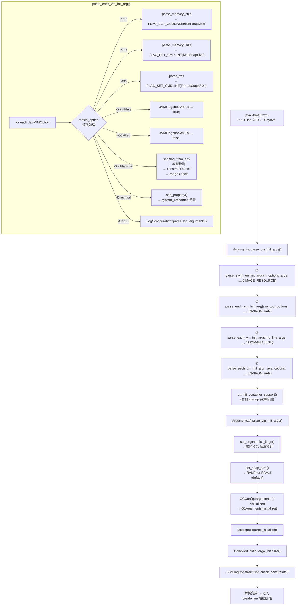

# Arguments::parse() 流程 — 命令行参数如何变成内存地址

> 基于 OpenJDK 11 slowdebug 源码分析
> 源码：`runtime/arguments.cpp` (4380 行), `runtime/arguments.hpp`
> 入口：`Arguments::parse_vm_init_args()` → `parse_each_vm_init_arg()` → JVMFlag write
> 调用时机：`create_vm()` 阶段 8, `thread.cpp:3960`

---

## 生产事故

### 事故 1：JAVA_TOOL_OPTIONS 覆盖问题
```
凌晨 3 点，-XX:+PrintGCDetails 不生效
→ 原因：容器注入 JAVA_TOOL_OPTIONS=-XX:-PrintGCDetails
→ 环境变量优先级 < 命令行, 但 -XX:- 和 -XX:+ 是独立的 bool flag
→ JAVA_TOOL_OPTIONS 先处理, 设为 false
→ 命令行后处理, 设为 true ← 正确
→ 但如果两者都是 JAVA_TOOL_OPTIONS 变量 (由不同 Dockerfile 层设置):
  → 后解析的覆盖先解析的 → 难以追踪

诊断:
  -XX:+PrintFlagsFinal | grep PrintGCDetails
  # bool PrintGCDetails = false {JVMFlag::ENVIRON_VAR} ← 环境变量覆盖了
  # origin 列揭示真相
```

### 事故 2：_JAVA_OPTIONS 最高优先级
```
GC 日志显示 G1 但使用了 -XX:+UseParallelGC
→ 原因：_JAVA_OPTIONS=-XX:+UseG1GC 优先级最高
→ _JAVA_OPTIONS 在命令行之后解析 → 覆盖一切

4 源解析顺序:
  1. -XX:Flags=<file>    (最低优先级, 先读)
  2. JAVA_TOOL_OPTIONS   
  3. 命令行 (-XX:...)    
  4. _JAVA_OPTIONS       (最高优先级, 最后读)
→ _JAVA_OPTIONS 可以覆盖用户在命令行写的一切
→ 这是有意设计: _JAVA_OPTIONS 是"最终用户环境配置"
```

---

## 一、4 源优先级链

### 解析顺序 (arguments.cpp:2257-2337)

```cpp
jint Arguments::parse_vm_init_args(
    const JavaVMInitArgs *vm_options_args,       // -XX:Flags=<file>
    const JavaVMInitArgs *java_tool_options_args, // JAVA_TOOL_OPTIONS
    const JavaVMInitArgs *java_options_args,      // _JAVA_OPTIONS
    const JavaVMInitArgs *cmd_line_args) {        // 命令行

  // ★ 注释中的顺序说明 —— 低优先级先读, 高优先级后读覆盖
  bool patch_mod_javabase = false;

  // ① -XX:Flags=<file> (最低优先级)
  jint result = parse_each_vm_init_arg(vm_options_args,
      &patch_mod_javabase, JVMFlag::JIMAGE_RESOURCE);
  if (result != JNI_OK) return result;

  // ② JAVA_TOOL_OPTIONS 环境变量
  // "Parse args structure generated from JAVA_TOOL_OPTIONS environment
  //  variable (if present)."
  result = parse_each_vm_init_arg(java_tool_options_args,
      &patch_mod_javabase, JVMFlag::ENVIRON_VAR);

  // ③ 命令行 (最高——比 _JAVA_OPTIONS 低一级)
  // "Parse args structure generated from the command line flags."
  result = parse_each_vm_init_arg(cmd_line_args,
      &patch_mod_javabase, JVMFlag::COMMAND_LINE);

  // ④ _JAVA_OPTIONS 环境变量 (最高优先级)
  // "Parse args structure generated from the _JAVA_OPTIONS environment
  //  variable (if present) (mimics classic VM)"
  result = parse_each_vm_init_arg(java_options_args,
      &patch_mod_javabase, JVMFlag::ENVIRON_VAR);

  // ★ 关键：在参数解析完成后、最终处理前, 调用容器支持
  // "We need to ensure processor and memory resources have been properly
  //  configured - which may rely on arguments we just processed"
  os::init_container_support();  // ★ 容器 cgroup 检测

  // 最终处理: apply_ergo + constraint check
  result = finalize_vm_init_args(patch_mod_javabase);
  return JNI_OK;
}
```

### 优先级示意图

```
低优先级 (先解析) ────────────────────────────────── 高优先级 (后解析)
│
├── ① -XX:Flags=<file>        (JIMAGE_RESOURCE)
│    └── java.base 模块内置 vm options
│
├── ② JAVA_TOOL_OPTIONS        (ENVIRON_VAR)
│    └── 工具链注入的参数 (如容器平台注入)
│
├── ③ 命令行                    (COMMAND_LINE)
│    └── 用户指定的 -Xms -Xmx -XX:+UseG1GC
│
└── ④ _JAVA_OPTIONS            (ENVIRON_VAR, 最高)
     └── 用户环境配置, 覆盖一切 (包括命令行!)
```

**为什么 _JAVA_OPTIONS 能覆盖命令行？**
→ OpenJDK 行为兼容经典 VM (Sun JDK 1.2-1.4): 这是有意设计, 用于"最终用户期望环境"

---

## 二、parse_each_vm_init_arg() 逐行分析

### ② 函数签名

`arguments.cpp:2462`
```cpp
jint Arguments::parse_each_vm_init_arg(
    const JavaVMInitArgs* args,          // args->nOptions + args->options[]
    bool* patch_mod_javabase,            // --patch-module 标志
    JVMFlag::Flags origin) {             // 标志来源 (JIMAGE/ENVIRON/COMMAND)
```

### ③ JavaVMOption 结构

```cpp
typedef struct JavaVMOption {
    char *optionString;  // "-Xms512m" / "-XX:+UseG1GC" / "-Dkey=value"
    void *extraInfo;     // -agentlib 的额外信息
} JavaVMOption;
```

### ④ 字符串匹配引擎

`match_option()` — `arguments.cpp:2372-2444`

```cpp
bool match_option(const JavaVMOption *option, const char* name, const char** tail) {
  // 例：option->optionString = "-Xms512m"
  //     name = "-Xms"
  //     → tail 指向 "512m"
  // 例：option->optionString = "-XX:+UseG1GC"
  //     name = "-XX:"
  //     → tail 指向 "+UseG1GC"
}
```

**核心解析模式**：
```
-Xms8g      → match_option("-Xms", &tail) → tail = "8g"
-XX:Key=val → match_option("-XX:", &tail) → tail = "Key=val"
-XX:+Key    → match_option("-XX:", &tail) → tail = "+Key"
-XX:-Key    → match_option("-XX:", &tail) → tail = "-Key"
-Dkey=val   → match_option("-D", &tail)   → tail = "key=val"
```

### ⑤ -Xms / -Xmx 解析

`arguments.cpp:2674-2703`
```cpp
// -Xms
} else if (match_option(option, "-Xms", &tail)) {
  julong long_initial_heap_size = 0;
  ArgsRange errcode = parse_memory_size(tail, &long_initial_heap_size, 0);
  // parse_memory_size() 内部:
  //   "512m" → 512 * 1024 * 1024 = 536870912
  //   "8g"   → 8 * 1024 * 1024 * 1024 = 8589934592
  //   "256k" → 256 * 1024 = 262144
  //   范围检查: 0(表示自动) 或 >= 1K
  if (errcode != arg_in_range) {
    jio_fprintf(... "Invalid initial heap size: %s\n", ...);
    return JNI_EINVAL;
  }
  set_min_heap_size((size_t)long_initial_heap_size);
  FLAG_SET_CMDLINE(size_t, InitialHeapSize, (size_t)long_initial_heap_size);

// -Xmx
} else if (match_option(option, "-Xmx", &tail) ||
           match_option(option, "-XX:MaxHeapSize=", &tail)) {
  julong long_max_heap_size = 0;
  ArgsRange errcode = parse_memory_size(tail, &long_max_heap_size, 1);
  FLAG_SET_CMDLINE(size_t, MaxHeapSize, (size_t)long_max_heap_size);
```

### ⑥ -Xss 解析

`arguments.cpp:2733-2741`
```cpp
} else if (match_option(option, "-Xss", &tail)) {
  intx value = 0;
  jint err = parse_xss(option, tail, &value);
  // parse_xss() 内部 (arguments.cpp:parse_xss):
  //   64-bit: min = 144K, max = 1G
  //   32-bit: min = 128K, max = 1G
  //   不支持 K/M/G 后缀 → 按字节解析
  FLAG_SET_CMDLINE(intx, ThreadStackSize, value);
```

### ⑦ -XX:+/-Flags → boolAtPut

`arguments.cpp:2908-2918` (模式)
```cpp
// 模式: 在 parse_each_vm_init_arg 的 else-if 链中
} else if (match_option(option, "-XX:", &tail)) {
  // -XX:+FlagName → set_bool_flag(tail, "+", &result)
  // -XX:-FlagName → set_bool_flag(tail, "-", &result)
  // -XX:FlagName=value → set_flag_from_env(tail, &result)
```

**set_bool_flag() 内部 (arguments.cpp)**:
```cpp
static bool set_bool_flag(const char* name, bool value, JVMFlag::Flags origin) {
  return JVMFlag::boolAtPut((char*)name, &value, origin) == JVMFlag::SUCCESS;
  // boolAtPut() → 查找 JVMFlag 表 → *(bool*)_addr = value
  // origin 记录设置来源: COMMAND_LINE / ENVIRON_VAR / ERGO
}
```

### ⑧ -XX:FlagName=value → 类型检测

**set_flag_from_env() — `arguments.cpp:3632-3710`**:
```
"UseG1GC"       (bool)   → JVMFlag::boolAtPut(name, value, origin)
"MaxHeapSize"   (size_t) → parse_size_t(value) → JVMFlag::size_tAtPut(...)
"ThreadStackSize" (intx) → parse_integer(value) → JVMFlag::intxAtPut(...)
"HeapDumpPath"  (ccstr)  → JVMFlag::ccstrAtPut(name, value, origin)
```

**约束检查 (constraint check)**：
```cpp
// -Xms > -Xmx → 立即检测
if (InitialHeapSize > MaxHeapSize) {
  vm_exit_during_initialization(
    "Incompatible initial and maximum heap sizes specified: "
    "InitialHeapSize=" SIZE_FORMAT ", MaxHeapSize=" SIZE_FORMAT,
    InitialHeapSize, MaxHeapSize);
}
// -XX:ObjectAlignmentInBytes=7 → 范围检查
// constraint_func → (7 & (7-1)) != 0 → "must be power of 2"
// → vm_exit_during_initialization("ObjectAlignmentInBytes (...) must be power of 2")
```

---

## 三、JVMFlag 写入原则

### ③ origin 字段决定覆盖许可

`JVMFlag::Flags` 枚举:
```cpp
enum Flags {
  DEFAULT          = 1 << 0,  // 默认值, 允许被任何来源覆盖
  CMDLINE          = 1 << 1,  // 命令行设置, 不能被 DEFAULT 覆盖
  ENVIRON_VAR      = 1 << 2,  // 环境变量设置
  JIMAGE_RESOURCE  = 1 << 4,  // java.base 模块内置
  ERGO            = 1 << 5,  // ergonomics 自动计算值
  MANAGEABLE      = 1 << 6,  // 运行时可通过 jcmd/ JMX 修改
  // ...
};
```

**写入规则** (在 `JVMFlag::set_flag_xxx()` 系列函数中):
```
DEFAULT → 可被任何来源覆盖 (first write wins)
CMDLINE → 不能被 DEFAULT/ENVIRON_VAR 覆盖 (command line wins over env)
ERGO    → 不能被 DEFAULT 覆盖, 但可被 CMDLINE 覆盖 (ergo 不覆盖用户的显式设置)
MANAGEABLE → 运行时可通过 jcmd Runtime.setVMFlag 修改
```

**宏体系**：
```cpp
FLAG_SET_DEFAULT(type, name, value)   // origin = DEFAULT
FLAG_SET_CMDLINE(type, name, value)   // origin = CMDLINE
FLAG_SET_ERGO(type, name, value)      // origin = ERGO
FLAG_SET_ERGO_IF_DEFAULT(type, name, value)  // 仅当 DEFAULT 时才设置
```

---

## 四、诊断标志门控

`arguments.cpp:2950-2970` (模式)
```cpp
// -XX:+UnlockDiagnosticVMOptions 必须位于诊断标志之前
// 例：
//   java -XX:+PrintAssembly -XX:+UnlockDiagnosticVMOptions  ← 错误! PrintAssembly 先解析
//   → PrintAssembly 是 diagnostic flag (flags & DIAGNOSTIC)
//   → 此时 UnlockDiagnosticVMOptions 还未设置
//   → "VM option 'PrintAssembly' is diagnostic and must be enabled via -XX:+UnlockDiagnosticVMOptions"

// 正确写法：
//   java -XX:+UnlockDiagnosticVMOptions -XX:+PrintAssembly
```

---

## 五、Ergo 阶段 — 自动参数计算

### `Arguments::apply_ergo()` 流程

`arguments.cpp:4048-4162`

```cpp
jint Arguments::apply_ergo() {
  // Step 1: 选择 GC, 设置压缩指针
  set_ergonomics_flags();

  // Step 2: 堆大小自动计算
  set_heap_size();   // ★ 如果用户未指定 -Xms/-Xmx
  //   RAM <= 1GB   → MaxHeapSize = RAM / 2
  //   RAM <= 192GB → MaxHeapSize = RAM / 4
  //   else         → MaxHeapSize = RAM / 5

  // Step 3: GC 特定参数初始化
  GCConfig::arguments()->initialize();  // G1Arguments::initialize()

  // Step 4: CDS 共享空间标志
  set_shared_spaces_flags();

  // Step 5: Metaspace 参数对齐
  Metaspace::ergo_initialize();

  // Step 6: 编译器参数 (编译器线程数, CodeCache 大小)
  CompilerConfig::ergo_initialize();
  // ★ CICompilerCount = max(1, min(4, cpu_count / 2))
  // ★ CodeCache 大小: tiered → 240MB, non-tiered → 48MB
}
```

### Ergo 自动计算的参数（仅当 origin=DEFAULT 时才应用）

| 参数 | 默认公式 | 何时覆盖 |
|------|---------|---------|
| `ParallelGCThreads` | `cpu_count <= 8 ? cpu_count : 8 + (cpu_count-8)*5/8` | 用户指定 `-XX:ParallelGCThreads=N` 时跳过 |
| `ConcGCThreads` | `max(1, ParallelGCThreads * 1/4)` | 用户指定时跳过 |
| `CICompilerCount` | `max(1, min(4, cpu_count / 2))` | 用户指定时跳过 |
| `InitialHeapSize` | `RAM / 64` (近似) | 用户指定 `-Xms` 时跳过 |
| `MaxHeapSize` | `RAM / 4` (RAM ≤ 192GB) | 用户指定 `-Xmx` 时跳过 |
| `ReservedCodeCacheSize` | `240MB` (tiered) / `48MB` (non-tiered) | 用户指定时跳过 |

---

## 六、约束与错误处理

### ⑥ 约束检查时机

```
① parse 阶段: -Xms > -Xmx → 立即 vm_exit
② AfterMemoryInit 约束: 在 universe_init() 后 → check_constraints(AfterMemoryInit)
   → 如 ObjectAlignmentInBytes 必须是 2^n
   → 如 UseCompressedOops 必须与 heap alignment 兼容
```

### 错误 → exit code 映射

| 错误 | 函数调用 | exit code | stderr 输出 |
|------|---------|-----------|-------------|
| `-Xms` 值无效 | `parse_memory_size` 失败 | 1 | "Invalid initial heap size: ..." |
| `-Xms > -Xmx` | `set_heap_size` | 1 | "Incompatible initial and maximum heap sizes..." |
| 未知 -XX 标志 | `JVMFlag::find_flag` 返回 NULL | 1 | "Unrecognized VM option '...'" |
| diagnostic flag 未解锁 | flag 检查 | 1 | "...must be enabled via -XX:+UnlockDiagnosticVMOptions" |
| 范围检查失败 | `check_constraints` | 1 | "...must be power of 2" 等 |
| -Xss 超出范围 | `parse_xss` | 1 | "outside the allowed range..." |

---

## 七、GDB 验证 ✅

```
(gdb) break parse_vm_init_args
Breakpoint 1 at 0x7f...: file arguments.cpp, line 2257.
(gdb) run -Xms512m -XX:+UseG1GC -Xlog:gc*=info
Breakpoint 1, Arguments::parse_vm_init_args (
    vm_options_args=0x7f..., java_tool_options_args=0x7f...,
    java_options_args=0x7f..., cmd_line_args=0x7f...)
    at src/hotspot/share/runtime/arguments.cpp:2257
(gdb) step
(gdb) p cmd_line_args->nOptions
$1 = 3
(gdb) p cmd_line_args->options[0].optionString
$2 = 0x... "-Xms512m"
(gdb) p cmd_line_args->options[1].optionString
$3 = 0x... "-XX:+UseG1GC"
(gdb) p cmd_line_args->options[2].optionString
$4 = 0x... "-Xlog:gc*=info"

# 跟踪 -Xms512m 的写入
(gdb) break arguments.cpp:2688   # FLAG_SET_CMDLINE(InitialHeapSize, ...)
(gdb) continue
Breakpoint 2, ... at arguments.cpp:2688
(gdb) p long_initial_heap_size
$5 = 536870912  ← 512 * 1024 * 1024
(gdb) p InitialHeapSize
$6 = 536870912  ← 已写入全局变量

# 验证 origin byte
(gdb) call JVMFlag::find_flag("InitialHeapSize")->get_origin()
$7 = JVMFlag::CMDLINE  ← 来源是命令行

# 跟踪 UseG1GC 的写入
(gdb) break arguments.cpp:2918  # boolAtPut 调用处
(gdb) continue
Breakpoint 3, ... at arguments.cpp:2918
(gdb) p UseG1GC
$8 = true  ← G1 已启用
(gdb) p UseParallelGC
$9 = false  ← UseParallelGC 在此代码路径被清除
(gdb) p UseSerialGC
$10 = false  ← UseSerialGC 被清除
(gdb) p UseConcMarkSweepGC
$11 = false  ← CMS 被清除
(gdb) continue

# 解析完成 → 容器支持 → ergo
(gdb) break os::init_container_support
(gdb) break Arguments::apply_ergo
(gdb) continue
```

---

## 八、生产诊断：谁设置了我的标志？

```bash
# 查看所有标志及其来源
java -XX:+PrintFlagsFinal -version 2>&1 | grep -i "gc"

# 例输出:
# bool UseG1GC = true {JVMFlag::CMDLINE}      ← 命令行的 -XX:+UseG1GC
# uintx MaxHeapSize = 8589934592 {JVMFlag::CMDLINE} ← 命令行 -Xmx8g
# intx ParallelGCThreads = 13 {JVMFlag::ERGO} ← ergonomics 自动计算
# uintx ConcGCThreads = 4 {JVMFlag::ERGO}     ← ergonomics 自动计算
# bool UseContainerSupport = true {JVMFlag::DEFAULT} ← 默认值 (未被修改)
# bool PrintGCDetails = false {JVMFlag::ENVIRON_VAR} ← 环境变量覆盖!
```

**origin 列映射表**：
```
{product}        → DEFAULT (默认, 未被修改)
{JVMFlag::CMDLINE}  → COMMAND_LINE (命令行)
{JVMFlag::ENVIRON_VAR} → 环境变量 (_JAVA_OPTIONS 或 JAVA_TOOL_OPTIONS)
{JVMFlag::ERGO}      → ergonomics 自动计算
{JVMFlag::JIMAGE_RESOURCE} → java.base 模块内置
```

---

## 九、Xlog 日志参数解析

`-Xlog:gc*=info` → `LogConfiguration::parse_log_arguments()` (`logging/logConfiguration.cpp`)

```cpp
// LogConfiguration::parse_log_arguments() 内部:
// 1. 解析 "gc*=info" → 分离 tag-set "gc*" 和 level "info"
// 2. "gc*" 匹配所有 gc 相关 tag: gc, gc+heap, gc+ergo, gc+phases...
// 3. 创建 LogOutput (stdout/file) + LogTagSet + LogDecorator 链
// 4. 注册到 LogConfiguration 全局表
```

---

## 十、Mermaid 流程图



---

## 十一、跨文档引用

| 相关主题 | 文档 | 关系 |
|---------|------|------|
| JVMFlag 结构详解 | 15-Thread-Mutex-JVMFlag-Deep-Dive.md §六 | `JVMFlag` 48B 结构, 1366 个标志 |
| 容器支持 (在 parse 后调用) | 19-Container-Cgroup-Support.md | `os::init_container_support()` 在 parse 后 |
| GC 线程推导 | 15-Thread-Mutex-JVMFlag-Deep-Dive.md §七 | `ParallelGCThreads` 来自 ergo |
| 堆大小与容器 | 06-universe_init-Deep-Dive.md §二 | `Universe::initialize_heap()` 使用解析后的参数 |
| Stage 8 完整流程 | 17-call_initPhase2-3-Deep-Dive.md | `parse_vm_init_args` 在 create_vm Stage 8 |

---

## 十二、总结

| 要点 | 关键源代码 | 生产影响 |
|------|-----------|---------|
| 4 源优先级 (低→高): Flags file → JAVA_TOOL_OPTIONS → 命令行 → _JAVA_OPTIONS | `arguments.cpp:2298-2318` | _JAVA_OPTIONS 覆盖一切 |
| `match_option` 分割 key=value | `arguments.cpp:2372` | 支持 -Xms8g / -XX:+Flag / -Dkey=val |
| `boolAtPut` 直接写全局变量 | `arguments.cpp:2918` | O(1) 写入, 无哈希查找 |
| constraint check 在 parse 和 after memory init 两轮 | `arguments.cpp:2336 + init.cpp` | 前后两轮确保约束全局一致 |
| ergo 只在 origin=DEFAULT 时写入 | `arguments.cpp:4048` | 用户显式指定覆盖一切 ergo |
| origin byte 记录设置者 | `JVMFlag::_flags` 字段 | `PrintFlagsFinal` 原列追踪来源 |
