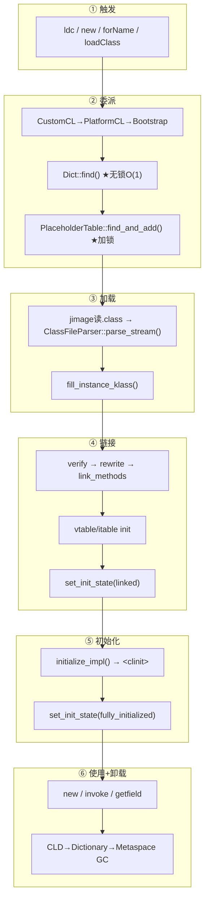

# 类加载子系统 — 全流程概览

> 纯源码分析，基于 OpenJDK 11 slowdebug
> 本文档是 02-class-loading 专题入口，串联所有子文档

---

## 生产现场

**3am: Prod JVM hangs, thread dump 显示 200 个线程 blocked in `SystemDictionary_lock`。**

```
"http-nio-8080-exec-47" #103 daemon RUNNABLE
    at CustomLoaderB.loadClass(MyClassLoader.java:18)
    - locked <0x00000007c0a8e3f0>
    at CustomLoaderA.loadClass(MyClassLoader.java:12)
    - waiting to lock <0x00000007c0a8e4b0>   ← 死锁

"http-nio-8080-exec-93" #149 daemon RUNNABLE
    at CustomLoaderA.loadClass(MyClassLoader.java:18)
    - locked <0x00000007c0a8e4b0>
    at CustomLoaderB.loadClass(MyClassLoader.java:12)
    - waiting to lock <0x00000007c0a8e3f0>   ← 死锁
```

**根因**：两个自定义 ClassLoader 的 `loadClass` 违反双亲委派——各自先锁自己再委托对方，形成循环等待。`SystemDictionary_lock` 下 200 线程排队等字典写入。

**要理解这个故障，必须看懂：类何时触发加载 → 双亲委派怎么工作 → 全局字典的锁语义 → parse→link→init 每一阶段做什么。** 这正是本文档要解决的问题。

---

## 前置 5 题

1. **入口在哪？** — 5 条触发路径（ldc/new/invokestatic/forName/loadClass）汇入 `SystemDictionary::resolve_or_fail()` → `systemDictionary.cpp:199`
2. **子调用链？** — 委派查找 → 字典/占位 → 流解析 → 填充 Klass → 注册字典 → 链接三阶段 → 初始化 `<clinit>`
3. **核心数据结构？** — `SystemDictionary`(全局字典) / `PlaceholderTable`(并发控制) / `ClassFileParser`(~440B 临时状态机) / `InstanceKlass`(最终产物) / `ConstantPoolCache`(O(1) 热路径)
4. **关键分支？** — Bootstrap(loader=NULL→C++ 直接 jimage 读) vs 非Bootstrap(→Java loadClass 递归)；已加载(无锁 O(1) 命中) vs 未加载(全局锁+并行控制)
5. **上下游？** — 上：字节码解释器 ldc/new / JNI forName → 下：InstanceKlass 写入 SystemDictionary → link_class_impl → 类就绪

---

## 一、设计理由：Why X Instead of Y

### 1.1 为什么惰性加载而不是启动时全部加载？

一个 Spring Boot fat jar 含 50000+ 类。如果启动时全部加载：启动时间无限，Metaspace 爆炸。

```
JVM 启动 → 加载 ~2000 个核心类 (Object/String/System/Thread)
        → 应用跑起来 → 用到哪加载哪
        → 最终 ~8000 个类（而非全部 50000）
```

**代价**：首次使用走冷路径（~数万 cycles + 可能 I/O）。被 ConstantPoolCache 分担——第二次起全是 O(1) 无锁读。

### 1.2 为什么双亲委派而不是平坦命名空间？

用户代码需要 `new String()`，但如果用户定义了一个 `java.lang.String`……

**平坦命名空间**：所有 ClassLoader 的类混在一起，"谁先加载谁有效" → 恶意 jar 放伪装 `java.lang.String` → 窃取密码。

**双亲委派**：每个 ClassLoader "先问爹" → Bootstrap 最先被问 → `java.lang.String` 一定从 Bootstrap 加载 → 用户 `java.lang.String` 被拒绝（SecurityException: prohibited package name）。

```
委派:  App 请求 String → 不加载，先问 Platform → Platform 问 Boot
      → Boot 返回 java/lang/String → 用户定义的 String 永远不会被加载
```

### 1.3 为什么分离 Loading / Linking / Initialization 三阶段？

**循环依赖**：

```java
class A { static B b = new B(); }  // <clinit> 中触发 B
class B { static A a = new A(); }  // <clinit> 中触发 A
```

一体完成 → A 初始化到一半需要 B → B 初始化到一半需要 A → 死锁。

三阶段分离：A 先进到 linking，B 只需 loading→linking（不需要 initialization）就能被 A 的 `<clinit>` 使用 → A 完成 → B 完成。**没有死锁。**

**安全性**：Verifier 在 linking 阶段验证字节码——如果跳过直接用，恶意字节码破坏 JVM 内存安全。

### 1.4 为什么用 ConstantPoolCache 而不是每次哈希查找？

字节码 `ldc #5` 需要从常量池找到 `java/lang/String` 的 `InstanceKlass*`。每次查 SystemDictionary HashMap → Hash 计算 + 桶遍历 + 字符串比较 ≈ 50-100 cycles。每秒亿级执行 → 不可接受。

**Cache 方案**：首次解析后，`InstanceKlass*` 直接写入常量池 `_resolved_klasses` 数组槽位 N：

```cpp
// 热路径 — constantPool.cpp:458
Klass* ConstantPool::klass_at_impl(int which, ...) {
    Klass* k = Atomic::load_acquire(klass_addr_at(which));  // ★ 无锁！
    if (k != NULL) return k;                                  // ★ ~5 cycles
    // 冷路径 → resolve_or_fail → 全链路
}
```

```
无 Cache:  ldc #5 → hash("java/lang/String") → 桶遍历 → 字符串比较 → 返回
有 Cache:  ldc #5 → load_acquire(_resolved_klasses[5]) → 返回  (≈5 cycles)
```

**ldc 的常量池索引编译时就固定了**——解释器/JIT 能内联成 `mov rax, [rcx + N*8]`。

### 1.5 为什么递归链接父类（parent before child）？

`class MyPanel extends JPanel`。`link_class_impl` 执行 `verify_code` 前必须确保 `JPanel` 已链接。

**不保证 parent first 的后果**：MyPanel linking → verify_code → 访问 JPanel::paint() 的 Method* → JPanel 未 link → Method* 的 `_from_compiled_entry` 为空 → verifier 走虚方法解析 → **SIGSEGV**。

源码（`instanceKlass.cpp:763-780`）——递归保证父类+所有接口先 link：

```cpp
Klass* super_klass = super();
if (super_klass != NULL) super_klass->link_class(CHECK_false);
for (int i = 0; i < interfaces->length(); i++)
    interfaces->at(i)->link_class(CHECK_false);
```

**设计后果**：`Object` 一定是第一个完成链接的类；整个类层次树自顶向下链接。

---

## 二、完整生命周期



---

## 三、文档索引

| 阶段 | 文档 | 核心问题 | 关键源码 |
|------|------|---------|---------|
| 触发 | [01](01-ClassLoading-Triggers.md) | 5 条触发路径 | templateTable_x86.cpp / interpreterRuntime.cpp |
| 委派 | [02](02-Parent-Delegation.md) | 谁来加载？安全模型 | systemDictionary.cpp:643 / placeholders.hpp |
| 加载 | [03](03-ClassFileParser.md) | .class → InstanceKlass 7段解析 | classFileParser.cpp:5876-6003 |
| 常量池 | [04](04-ConstantPool-Parse.md) | 14 种 tag + Cache 加速 | constantPool.cpp / cpCache.cpp |
| 字段方法 | [05](05-FieldInfo-Method-Creation.md) | 字段/方法存储格式 | classFileParser.cpp(parse_fields/methods) |
| 注解属性 | [06](06-Annotations-Attributes.md) | 注解/属性解析 | classFileParser.cpp(parse_attributes) |
| 链接 | [07](07-Linking.md) | verify→rewrite→link_methods | instanceKlass.cpp:737-869 |
| 解析 | [08](08-LinkResolver.md) | invoke LinkResolver 决议 | linkResolver.cpp |
| 字典 | [09](09-SystemDictionary.md) | 类名 O(1) 查 Klass | systemDictionary.cpp(~2300行) |
| 隔离 | [10](10-ClassLoaderData.md) | CLD + Metaspace 隔离 | classLoaderData.cpp |
| 初始化 | [11](11-Clinit.md) | `<clinit>` 线程安全 | instanceKlass.cpp(initialize_impl) |
| 卸载 | [12](12-Class-Unloading.md) | 类何时被 GC 回收 | classLoaderData.cpp |
| 验证 | [13](13-Verifier.md) | 字节码验证 | verifier.cpp |

---

## 四、关键数据流

```
类加载请求 (Symbol* + Handle class_loader)
  │
  ├─ ① SystemDictionary::resolve_or_fail()        systemDictionary.cpp:199
  │    ├─ resolve_instance_class_or_null()         :643 (274行，最长函数)
  │    │    ├─ dictionary->find(name, loader)      ★ 无锁 O(1)，99% 命中
  │    │    ├─ +SystemDictionary_lock              全局锁
  │    │    ├─ PlaceholderTable::find_and_add()    防并发 + 循环检测
  │    │    ├─ load_instance_class()
  │    │    │    ├─ Bootstrap → jimage 读 .class 字节
  │    │    │    └─ 非Bootstrap → Java loadClass() 递归
  │    │    ├─ KlassFactory::create_from_stream()  klassFactory.cpp:166
  │    │    │    └─ ClassFileParser 构造函数[03]    classFileParser.cpp:5876
  │    │    │         ├─ parse_stream()            ①magic ②version ③cp[04]
  │    │    │         │                           ④access ⑤interfaces
  │    │    │         │                           ⑥fields[05] ⑦methods[05]
  │    │    │         │                           ⑧attributes[06]
  │    │    │         ├─ post_process_parsed_stream()
  │    │    │         ├─ create_instance_klass()
  │    │    │         └─ fill_instance_klass()     所有权转移
  │    │    ├─ define_instance_class()
  │    │    │    ├─ add_to_hierarchy()
  │    │    │    └─ Dictionary::add_klass()  ★ 写入全局字典
  │    │    ├─ PlaceholderTable::find_and_remove() 释放占位
  │    │    └─ notify_all()                        唤醒等待线程
  │    └─ 返回 InstanceKlass*
  │
  ├─ ② link_class_impl()[07]                      instanceKlass.cpp:737
  │    ├─ super->link_class()         ★ 递归链接父类+所有接口
  │    ├─ verify_code()              verifier.cpp
  │    ├─ rewrite_class()            → ConstantPoolCache 创建
  │    ├─ link_methods()
  │    ├─ vtable/itable::initialize()
  │    └─ set_init_state(linked)
  │
  ├─ ③ ConstantPool::klass_at()     ★ 写入 _resolved_klasses[N]
  │    └─ release_store(klass_addr_at(N), klass)  O(1) Cache 就绪
  │
  └─ ④ initialize_impl()[11]        instanceKlass.cpp
       └─ call_clinit()             ★ 执行 <clinit>，线程安全
```

---

## 五、GDB 现场：ldc String.class 全链路调试

> slowdebug JDK 11，`java -cp . Test` 中执行 `Class<?> c = String.class`

### 5.1 断点设置

```
(gdb) b SystemDictionary::resolve_or_fail
Breakpoint 1 at 0x7ffff6a0b820: file systemDictionary.cpp, line 199.

(gdb) b KlassFactory::create_from_stream
Breakpoint 2 at 0x7ffff6a13e40: file klassFactory.cpp, line 166.

(gdb) b InstanceKlass::link_class_impl
Breakpoint 3 at 0x7ffff5c30a10: file instanceKlass.cpp, line 737.

(gdb) b ConstantPool::klass_at_impl
Breakpoint 4 at 0x7ffff5d49230: file constantPool.cpp, line 458.
```

### 5.2 首次 ldc — 冷路径

```
(gdb) run Test

# ★ Breakpoint 4 — CP Cache 检查 → NULL，走冷路径
Thread 1 hit Breakpoint 4, ConstantPool::klass_at_impl
    (this=0x7ffff011cd90, which=18) at constantPool.cpp:458
458     Klass* k = Atomic::load_acquire(klass_addr_at(which));
(gdb) p *klass_addr_at(18)
$1 = (Klass *) 0x0                              ← NULL！首次触发
(gdb) c

# ★ Breakpoint 1 — SystemDictionary::resolve_or_fail
Thread 1 hit Breakpoint 1, SystemDictionary::resolve_or_fail (
    class_name=0x7ffff011b1c0) at systemDictionary.cpp:199
(gdb) p class_name->as_C_string()
$2 = "java/lang/String"
(gdb) bt 5
#0  SystemDictionary::resolve_or_fail           at systemDictionary.cpp:199
#1  ConstantPool::klass_at_impl                 at constantPool.cpp:495
#2  InterpreterRuntime::ldc                     at interpreterRuntime.cpp:160
(gdb) c

# ★ Breakpoint 2 — KlassFactory::create_from_stream，开始解析
Thread 1 hit Breakpoint 2, KlassFactory::create_from_stream (
    stream=0x7ffff011f000) at klassFactory.cpp:166
(gdb) p stream->buffer()
$3 = "\312\376\272\276"                         ← 0xCAFEBABE
(gdb) c

# ★ Breakpoint 3 — InstanceKlass::link_class_impl
Thread 1 hit Breakpoint 3, InstanceKlass::link_class_impl (
    this=0x7ffff02e0000) at instanceKlass.cpp:737
(gdb) p this->external_name()
$4 = "java/lang/String"
(gdb) p this->is_linked()
$5 = false                                      ← 尚未链接
(gdb) n
770   super_klass->link_class(CHECK_false);     ← ★ 递归链接 Object
(gdb) p super_klass->external_name()
$6 = "java/lang/Object"
(gdb) p super_klass->is_linked()
$7 = true                                       ← 父类已链接（启动时完成）
(gdb) c
```

### 5.3 第二次 ldc — 热路径

```
// 再次执行 Class<?> c = String.class

Thread 1 hit Breakpoint 4, ConstantPool::klass_at_impl
    (this=0x7ffff011cd90, which=18) at constantPool.cpp:458
458     Klass* k = Atomic::load_acquire(klass_addr_at(which));
(gdb) p *klass_addr_at(18)
$8 = (Klass *) 0x7ffff02e0000                   ← 非 NULL！Cache 命中
(gdb) n
459     if (k != NULL) {
(gdb) n
460       return k;                               ← ★ 直接返回，不走任何锁
(gdb) fin
Run till exit from #0  ConstantPool::klass_at_impl
# Breakpoint 1 (resolve_or_fail) 没有触发！
# 全程无锁、无 SystemDictionary 查找、无 I/O
```

### 5.4 热/冷路径对比

```
┌──────────────────────────────────────────────────────────────────┐
│  热路径 (99%+) — 第二次 ldc #18                                    │
│──────────────────────────────────────────────────────────────────│
│  TemplateTable::ldc → CP::klass_at(18)                            │
│    → load_acquire(_resolved_klasses[18]) != NULL  ★ 无锁          │
│    → 直接返回 Klass*              总开销: ~10 CPU cycles           │
│                                                                     │
│  冷路径 (首次) — ldc #18 第一次触发                                  │
│──────────────────────────────────────────────────────────────────│
│  load_acquire → NULL                                                │
│    → dict find (无锁) → MISS                                        │
│    → +SystemDictionary_lock (全局锁)                                 │
│    → 加锁重查 → MISS                                                 │
│    → PlaceholderTable::find_and_add (占位)                           │
│    → load_instance_class → jimage 读 String.class (~3KB)            │
│    → ClassFileParser::parse_stream (7段解析, ~3000行)                 │
│    → fill_instance_klass                                            │
│    → Dictionary::add_klass (写入全局字典)                              │
│    → find_and_remove → notify_all                                  │
│    → -SystemDictionary_lock                                        │
│    → release_store(_resolved_klasses[18], klass)                    │
│  总开销: ~30000 CPU cycles + 可能磁盘 I/O                             │
└──────────────────────────────────────────────────────────────────┘
```

**首次加载数据量**：String.class (~3KB)、200+ 常量池条目、InstanceKlass (~800B)、ConstantPoolCache、vtable/itable。**第 100 次同个类**：`load_acquire` 一个指针 → 返回。这就是 **DCL + ConstantPoolCache** 的威力。

---

## 六、端到端追踪：ldc "hello" 全步骤

> 追踪 `ldc #5` 加载 `java/lang/String` 的完整链路，与 GDB 现场相互对应

### 6.1 调用栈

```
TemplateTable::ldc()                        [01 §一] templateTable_x86.cpp:354
  └─ InterpreterRuntime::ldc()               [01 §一] interpreterRuntime.cpp:149
       └─ ConstantPool::klass_at(index)      [04 §四] constantPool.cpp:458 ★
            ├─ load_acquire(_resolved_klasses[N]) → NULL (首次)
            └─ SystemDictionary::resolve_or_fail("java/lang/String")
                 │                          [09 §二] systemDictionary.cpp:643
                 ├─ resolve_instance_class_or_null()
                 │    ├─ dictionary->find() → NULL     [09] DICT_MISS
                 │    ├─ +SystemDictionary_lock + 加锁重查 → MISS
                 │    ├─ find_and_add(LOAD_INSTANCE)   [02 §二]
                 │    │    └─ PlaceholderTable 占位    [02 §一]
                 │    ├─ load_instance_class(Bootloader)
                 │    │    → jimage 读 .class → KlassFactory::create_from_stream
                 │    │       └─ ClassFileParser 7段:  [03 §2.3]
                 │    │           ①magic ②version ③cp[04] ④access
                 │    │           ⑤interfaces ⑥fields[05] ⑦methods[05] ⑧attrs[06]
                 │    │       → fill_instance_klass()    [03 §2.4]
                 │    ├─ define_instance_class()
                 │    │    ├─ add_to_hierarchy()
                 │    │    └─ Dictionary::add_klass() ★ [09]
                 │    └─ find_and_remove + notify_all   [09]
                 │
                 └─ release_store(_resolved_klasses[N], klass) [04 §五]
                      → ★ 第二次 ldc O(1) acquire 读！
```

### 6.2 每一步的数据结构变化

| 步骤 | 锁状态 | Dictionary | PlaceholderTable | _resolved_klasses | _init_state |
|------|--------|-----------|-----------------|-------------------|:---:|
| ① TemplateTable::ldc | 无锁 | — | — | — | — |
| ② InterpreterRuntime::ldc | 无锁 | — | — | — | — |
| ③ CP::klass_at | 无锁 | — | — | — | — |
| ④ dict->find() | **无锁** | MISS | — | NULL | — |
| ⑤ 加 SystemDict_lock | **全局锁** | 重查: MISS | 检查无冲突 | NULL | — |
| ⑥ find_and_add(LOAD_INSTANCE) | 持锁 | — | **新增占位** | NULL | — |
| ⑦ load_instance_class | **释放全局锁** | — | 占位中 | NULL | allocated→loaded |
| ⑧ ClassFileParser | 无锁 | — | 占位中 | 空数组 | loaded |
| ⑨ fill_instance_klass | 无锁 | — | 占位中 | 空数组 | loaded |
| ⑩ add_to_hierarchy | **Compile_lock** | — | 占位中 | 空数组 | loaded |
| ⑪ Dictionary::add_klass | **SystemDict_lock** | **★ 注册** | 占位中 | 空数组 | loaded |
| ⑫ find_and_remove+notify | 持锁 | 已注册 | **释放→NULL** | 空数组 | loaded |
| ⑬ release_store | 无锁 | 已注册 | 已释放 | **★ 写入 Klass\*** | loaded |
| ⑭ 第二次 ldc | **无锁** | HIT | — | **O(1) 直接返回** | loaded |

---

## 七、面经速查

| 面试题 | 答案位置 | 一句答案 |
|--------|---------|---------|
| **类加载过程分几步？** | §二 生命周期 | 加载(parse)→链接(verify+prepare+resolve)→初始化(\<clinit\>)→使用→卸载 |
| **双亲委派模型？** | §1.2 + [02] | 先委托 parent 到顶 Bootstrap；找不到才自己加载——防核心类被替换 |
| **能打破双亲委派吗？** | §1.2 + [02 §四] | 可以：重写 `loadClass` 不调 `super.loadClass()`；或用线程上下文类加载器(SPI) |
| **loadClass vs forName 区别？** | [01] §一/§四 | `loadClass` 不锁且不执行 `<clinit>`；`forName` 触发 link+init 全流程 |
| **ClassLoader 内存泄漏？** | [10] + [12] | CLD 引用链未断开→Metaspace 无法 GC；静态字段持有对象引用阻止卸载 |
| **为什么 String 总是 Bootstrap 加载？** | §1.2 + [02 §2.4] | 双亲委派到顶层；`java.lang` 包下非 Bootstrap 禁止定义 |
| **ConstantPoolCache 是什么？** | §1.4 + [04 §五] | 首次解析的 Klass/Method 指针缓存到常量池槽位，后续 `load_acquire` O(1) 读 |
| **link_class_impl 里做什么？** | [07 §二] | 父类+接口递归 link → verify → rewrite(CP Cache) → link_methods → vtable/itable |
| **SystemDictionary_lock 为什么是全局锁？** | [09 §三] | 类定义/注册必须串行——两个线程同时定义同名类导致字典损坏 |
| **PlaceholderTable 为什么存在？** | §1.2+[02 §一]+[09] | 记录"正在加载"——防重复、防循环依赖(ClassCircularityError)、防并行冲突 |
| **什么时候卸载类？** | [12] | ClassLoader 不可达 + 所有实例 GC + GC 策略允许(CMS/G1可卸载，默认Serial不卸载) |
| **invokedynamic 和普通类加载区别？** | [01 §五] | invokedynamic 不走常规类加载——BSM 运行时动态生成 CallSite |

---

## 八、可证伪断言

| # | 断言 | 验证 | 预期 |
|---|------|------|:---:|
| 1 | 首次 `ldc #5` 触发 `SystemDictionary::resolve_or_fail` → `KlassFactory::create_from_stream` → `ClassFileParser` → `link_class_impl` 全链路 | GDB 断点顺序观察 + `bt` | 链路上每个断点依次触发 |
| 2 | 第二次 `ldc #5` 热路径：`load_acquire(_resolved_klasses[N]) != NULL` → 直接返回，不触发 `resolve_or_fail` | GDB §5.3：第二次 hit `klass_at_impl` 但 `resolve_or_fail` 断点未触发 | resolve_or_fail 不触发 |
| 3 | `link_class_impl` 中 `super_klass->link_class()` 递归先于自身链接 | GDB §5.2：`n` 到 L770 → `p super_klass->is_linked()` | 父类先 linked |
| 4 | Object 类在启动阶段已被链接（`java.lang.Object` 是类层次根） | GDB：第一个 LINK 输出 | `java/lang/Object` |
| 5 | 冷路径开销 ≈ 数万 CPU cycles + I/O，热路径 ≈ 10 cycles | GDB `bt` 调用深度对比 | 14 步 vs 1 步 |
| 6 | `SystemDictionary_lock` 仅在 define_instance_class 和 dict add 时持有，ClassFileParser 期间释放 | 源码 `systemDictionary.cpp` 锁范围 | 释放锁时 parse |
