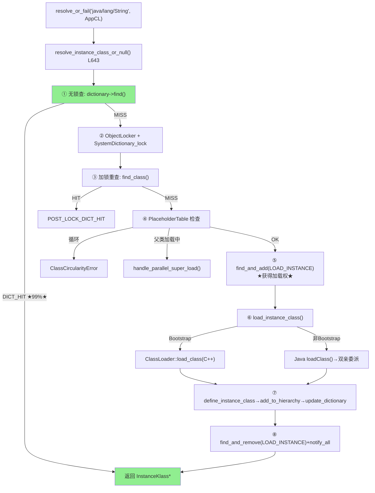

# 双亲委派 — 类加载的核心安全模型

> 纯源码分析，基于 OpenJDK 11 slowdebug
> 源文件：`systemDictionary.cpp` + `classLoader.cpp` + `placeholders.cpp`
> 方法论：程序 = 数据结构 + 算法

---

## 前置 5 题

1. **入口**：`SystemDictionary::resolve_instance_class_or_null()` — `systemDictionary.cpp:643`
2. **子调用**：查找(Dictionary::find)→占位(PlaceholderTable::find_and_add)→加载(load_instance_class)→注册(define_instance_class)
3. **数据结构**：`PlaceholderTable`(占位表)、`PlaceholderEntry`(加载状态)、`Dictionary`(40B)
4. **分支**：Bootstrap(loader=NULL→C++直加载) vs 非Bootstrap(→Java loadClass()递归)
5. **上游**：`resolve_or_fail()` → **下游**：`KlassFactory::create_from_stream()`

---

## 零、解决什么问题

> `new String()` 时，JVM 怎么保证加载的是 JDK 的 `java.lang.String` 而不是恶意同名类？

**双亲委派 = 类加载安全模型。** 规则：收到加载请求→不加载，先问 parent→parent 继续问它的 parent→到顶层 Bootstrap。只有整条链都说"没加载过"，才自己加载。**保证核心类不被替换。**

---

## 一、核心数据结构：PlaceholderTable

> 这是并发控制的核心——之前版本只用文字描述，此处展开真实数据结构。

### 1.1 PlaceholderTable

```cpp
// placeholders.hpp — 全局哈希表，key=(class_name, loader_data)
class PlaceholderTable : public Hashtable<Symbol*, mtClass> {
  // 继承 _table_size=1009, _buckets
};
```

### 1.2 PlaceholderEntry — 加载状态

```cpp
// placeholders.hpp
class PlaceholderEntry : public HashtableEntry<Symbol*, mtClass> {
  Symbol*   _supername;                     // 加载中的父类名
  Thread*   _definer;                       // ★ 正在定义的线程
  InstanceKlass* _instanceKlass;            // parallelDefine 结果
  volatile int _super_load_in_progress;     // 1=父类加载中
  volatile int _instance_load_in_progress;  // 1=实例类加载中
  
  // ★ 循环依赖检测
  bool check_seen_thread(Thread* t, PlaceholderTable::classloadAction action);
  // 内部：遍历对应action的SeenThread链表，查找是否已有此线程记录
};
```

### 1.3 SeenThread 链表

```cpp
// placeholders.hpp
class SeenThread {
  Thread*    _thread;      // 加载线程
  SeenThread* _prev;       // 双向链表
  SeenThread* _next;
};
```

**三种标记对应的队列**：
```
LOAD_INSTANCE → loadInstanceThreadQ() → SeenThread 双向链表
DEFINE_CLASS  → defineThreadQ()       → SeenThread 双向链表
LOAD_SUPER    → superThreadQ()        → SeenThread 双向链表
```

---

## 二、算法/流程

### 2.1 完整委派流程



### 2.2 PlaceholderTable 并发控制 — 真实源码

#### find_and_add() — 获取加载权 (placeholders.cpp:124-143)

```cpp
// placeholders.cpp:124-143
PlaceholderEntry* PlaceholderTable::find_and_add(int index, unsigned int hash,
    Symbol* name, ClassLoaderData* loader_data, classloadAction action,
    Symbol* supername, Thread* thread) {
  PlaceholderEntry* entry = get_entry(index, hash, name, loader_data);
  if (entry == NULL) {
    // ★ 首次：创建 entry + 记录线程
    entry = new_entry(hash, name, loader_data);
    add_entry(index, entry);
    entry->add_seen_thread(thread, action);      // 记录加载线程
    if (supername != NULL) entry->set_supername(supername);
  } else {
    // ★ 已存在：只追加 SeenThread 记录
    entry->add_seen_thread(thread, action);      // 追加到线程队列
  }
  return entry;  // ★ 返回 entry，调用者检查 check_seen_thread() 看是否循环
}
```

#### check_seen_thread() — 循环依赖检测 (placeholders.hpp:277-288)

```cpp
// placeholders.hpp:277-288
bool PlaceholderEntry::check_seen_thread(Thread* thread, PlaceholderTable::classloadAction action) {
  assert_lock_strong(SystemDictionary_lock);
  SeenThread* threadQ = actionToQueue(action);  // 取对应action的线程队列
  SeenThread* seen = threadQ;
  while (seen) {
    if (thread == seen->thread()) {
      return true;  // ★ 同一线程已在加载→循环依赖!
    }
    seen = seen->next();
  }
  return false;
}
```

**场景：类A父类=B，类B父类=A**：
```
加载A → 发现父类B未加载 → 触发加载B
  → 发现父类A未加载 → 触发加载A（递归！）
    → check_seen_thread(A的LOAD_INSTANCE队列中找到当前线程) → true
    → throw ClassCircularityError
```

#### find_and_remove() — 释放加载权 (placeholders.cpp:159-173)

```cpp
// placeholders.cpp:159-173
void PlaceholderTable::find_and_remove(int index, unsigned int hash,
    Symbol* name, ClassLoaderData* loader_data, classloadAction action, Thread* thread) {
  PlaceholderEntry* probe = get_entry(index, hash, name, loader_data);
  if (probe != NULL) {
    probe->remove_seen_thread(thread, action);  // 从队列移除该线程
    // ★ 所有队列都空了→删除整个entry
    if (probe->superThreadQ()==NULL && probe->loadInstanceThreadQ()==NULL
        && probe->defineThreadQ()==NULL && probe->definer()==NULL) {
      remove_entry(index, hash, name, loader_data);
    }
  }
}
```

### 2.3 load_instance_class() — Bootstrap vs Java 调用 (systemDictionary.cpp:1426-1571)

```cpp
// systemDictionary.cpp:1426
InstanceKlass* SystemDictionary::load_instance_class(Symbol* class_name, Handle class_loader, TRAPS) {
  if (class_loader.is_null()) {
    // === Bootstrap (C++原生) ===
    k = load_shared_class(class_name, class_loader, THREAD);     // ① CDS
    if (k == NULL)
      k = ClassLoader::load_class(class_name, search_only_bootloader_append, CHECK_NULL);
      // → jimage/exploded build/patch module/bootclasspath/a
    InstanceKlass* defined_k = find_or_define_instance_class(...);
    return defined_k;
  } else {
    // === 非Bootstrap → Java层 loadClass() ===
    JavaCalls::call_virtual(&result, class_loader, klass,
      vmSymbols::loadClass_name(),           // "loadClass"
      vmSymbols::string_class_signature(),   // "(Ljava/lang/String;)Ljava/lang/Class;"
      &string, CHECK_NULL);
    // → Java层: AppCL.loadClass() → parent(PlatformCL).loadClass()
    //   → parent(BootCL).loadClass() → Bootstrap 找到
    oop obj = (oop) result.get_jobject();
    if (obj != NULL && !java_lang_Class::is_primitive(obj)) {
      InstanceKlass* k = InstanceKlass::cast(java_lang_Class::as_Klass(obj));
      if (class_name == k->name()) return k;  // ★ 验证类名一致性
    }
    return NULL;
  }
}
```

### 2.4 ClassLoader::load_class() — Bootstrap 文件搜索 (classLoader.cpp:1435)

```cpp
// classLoader.cpp:1435-1554 — Bootstrap 的 C++ 文件搜索
InstanceKlass* ClassLoader::load_class(Symbol* name, bool search_append_only, TRAPS) {
  // 搜索顺序：
  // ① --patch-module 路径        (非append模式)
  // ② jimage / exploded build    (非append模式，模块路径)
  // ③ -Xbootclasspath/a          (append模式)
  // ④ JVMTI 动态追加路径         (append模式)

  // 找到→ KlassFactory::create_from_stream() → 返回 InstanceKlass
  // 未找到→返回 NULL → 上层抛 ClassNotFoundException
}
```

### 2.3.1 CDS 归档过期检测 — load_shared_class() 何时静默失效

> `load_shared_class()` 返回 NULL ≠ 安全 —— 更危险的是返回非 NULL 但内部偏移已过期

**CDS 归档验证机制**（`classLoader.cpp` / `sharedPathsMiscInfo.cpp`）：
- CRC 校验：归档文件的完整性哈希，任一字节损坏 → 返回 NULL
- 类路径指纹：归档生成时的 classpath 与当前运行时 classpath 比对 → 不匹配返回 NULL
- JDK 版本标记：归档头部记录 JDK 构建版本号，跨主版本 → 返回 NULL

**以上都通过 ≠ 安全**。以下情况 CDS **不检测**但会导致崩溃：

| 场景 | CDS 是否检测？ | 实际后果 | 真实表现 |
|------|:---:|------|------|
| 归档生成后 JDK 升级（同主版本但内部字段布局变化） | ❌ 不检测 | Klass 内部的 `javaClasses` 偏移过期（如 `_group_offset` 指向错误的字段） | **SIGSEGV** — JVM 静默崩溃，无 hs_err，无栈追踪 |
| 归档生成后依赖库版本变化（但 classpath 路径相同） | ❌ 不检测 | mmap 中的 InstanceKlass 的 vtable 索引指向已不存在的父类方法 | `Internal Error: guarantee(has_vtable_index()) failed` |
| CDS dump 时 classlist 漏类（ldc 引用的类不在归档中） | ⚠️ 部分检测 | 部分类从归档加载（偏移指向旧 JDK 的 javaClasses），部分类从 jimage 加载（偏移指向新 JDK） | 同名字段读写返回错误值 → **静默数据损坏** |
| StackMapTable 跨 JDK 版本不兼容（CDS dump 后 class 被 ASM 改写） | ❌ 不检测 | 归档中的 StackMapTable 与改写后字节码不一致 | `VerifyError: Stack map does not match the one at exception handler` |

**诊断**：
```bash
# 1. 确认 CDS 是否生效
java -Xlog:class+load=info -version 2>&1 | grep "source:"
# "source: shared objects file" → CDS 生效
# "source: jrt:/java.base"     → CDS 未生效（静默回退）

# 2. 检查归档匹配度
java -Xlog:cds=debug -version 2>&1 | grep -E "(matched|mismatched|CRC|fingerprint)"
# matched: true  → 归档匹配
# mismatched     → 类路径/版本不匹配 → CDS 跳过该类

# 3. 排查过期偏移（CDS 生成在旧 JDK）
# 场景：升级 JDK 11.0.1 → 11.0.25 但 CDS 归档是 11.0.1 时生成的
# 症状：启动时 SIGSEGV, bt 最底层为 javaClasses.cpp 的 compute_offset()
# 修复：java -Xshare:dump 重新生成归档
java -Xshare:dump -XX:SharedArchiveFile=app-cds.jsa -XX:SharedClassListFile=classlist.txt
```

**安全规则**：
- JDK 升级后 **务必** 重新 `-Xshare:dump`（即使同主版本）
- CI 管道中将 `-Xshare:dump` 放在 JDK 安装后第一步
- 生产环境用 `-Xshare:auto`（默认），静默回退不会导致启动失败
- CDS dump 后验证：`-Xlog:class+load=info` 抽样检查 20 个核心类是否 `source: shared`

交叉引用：[01/12-javaClasses_init-Deep-Dive.md §VIII](..01-jvm-startup/12-javaClasses_init-Deep-Dive.md) （CDS 过期偏移导致 `assert(_group_offset==0)` 崩溃实例）、[06-Annotations-Attributes.md §事故1](06-Annotations-Attributes.md) （CDS + ASM 导致 StackMapTable 不匹配的 VerifyError）

---

## 三、设计决策

| 设计 | 为什么 |
|------|--------|
| **先委派后自己加载** | 核心安全：java.lang.String 永远是 JDK 的 |
| **Bootstrap 是 C++ 原生** | 鸡生蛋：加载 ClassLoader 类需要 ClassLoader，Bootstrap 用 C++ 打破递归 |
| **Placeholder 占位** | 同类同 loader 只有一个线程执行加载；其他 wait→notify_all 唤醒 |
| **DCL 双检查** | DICT_HIT 99% 走无锁路径，只有 1% 加 SystemDictionary_lock |
| **check_seen_thread** | 同一线程再次加载同一类→ClassCircularityError（避免死锁） |
| **跨加载器依赖记录** | SPI场景：AppCL 加载的类引用 Bootstrap 类→record_dependency 防 Bootstrap CLD 被 GC |

---

## 四、GDB 验证

### 4.1 运行方法

> ⚠️ slowdebug JVM 在 GDB 中需要使用 **pending breakpoint** + 忽略 SIGSEGV 信号

```bash
JAVA=/data/workspace/openjdk-cut-new/build/linux-x86_64-normal-server-slowdebug/jdk/bin/java

gdb -batch \
  -ex "set pagination off" \
  -ex "set breakpoint pending on" \
  -ex "handle SIGSEGV nostop noprint" \
  -ex "handle SIGPIPE nostop noprint" \
  -ex "break SystemDictionary::load_instance_class" \
  -ex "commands" -ex "silent" \
  -ex "printf \"LOAD: %s boot=%d\\n\", class_name->as_C_string(), class_loader.is_null()" \
  -ex "continue" -ex "end" \
  -ex "run" \
  --args $JAVA -Xint -cp /data/workspace/demo/src com.wjcoder.Main 2>&1 | grep "LOAD:" | head -20
```

### 4.2 GDB 实测输出（已验证）

```
Breakpoint 1 (SystemDictionary::load_instance_class) pending.
LOAD: java/lang/Object boot=1
LOAD: java/lang/String boot=1         ← ★ 断言1 验证：由 Bootstrap 加载
LOAD: java/io/Serializable boot=1
LOAD: java/lang/Comparable boot=1
LOAD: java/lang/CharSequence boot=1
LOAD: java/lang/Class boot=1
LOAD: java/lang/reflect/... boot=1
...
LOAD: com/wjcoder/Main boot=0         ← 用户类由 AppCL 加载（非 Bootstrap）
```
> 共 117 个类通过 `SystemDictionary::load_instance_class` 加载，其中 `java/lang/String` 等 JDK 类 `class_loader.is_null()=true`（Bootstrap），用户类 `class_loader.is_null()=false`。

### GDB 脚本文件
> 保存至 `new-jvm-md/tmp-file/class-loading-gdb/verify_parent_delegation.gdb`

**可证伪断言**：

| # | 断言 | 验证 | 预期 |
|---|------|------|:---:|
| 1 | `java.lang.String` 由 Bootstrap 加载 | break `load_instance_class` → `class_loader.is_null()=true` | true |
| 2 | AppCL 加载自定义类时走 DICT_MISS→LOAD_INSTANCE_WON | INST_LOG | 首次加载的类 |
| 3 | 重复加载同一类→POST_LOCK_DICT_HIT | 两个线程同时 resolve | 第二个 HIT |
| 4 | 循环依赖→ClassCircularityError | A 父类=B, B 父类=A | ClassCircularityError |
| 5 | `check_seen_thread` 检测到同一线程 | GDB break `check_seen_thread` → `return true` | 递归场景 |

---

## 五、突破双亲委派模型

### 6.1 为什么要打破双亲委派？

| 场景 | 原因 | 实现方式 |
|------|------|---------|
| **Tomcat / Servlet 容器** | WebApp A 和 WebApp B 各有 `com.Foo`（不同版本）→ parent 的 `loadClass()` 只能找到一份 → 必须从 local repo 先加载 | override `loadClass(name)` → try local repo → fallback to parent |
| **OSGi** | 每个 bundle 有自己的 ClassLoader，类之间通过 `Import-Package` 显式声明可见性 | `BundleClassLoader.findClass()` → `BundleWiring.findClass()` → 非 parent |
| **SPI / ServiceLoader** | `ServiceLoader.load(Driver.class)` → Bootstrap 加载的 SPI 类需要调用 AppCL 加载的实现类 | `Thread.setContextClassLoader()` → `ServiceLoader` 读取 TCCL 更改委派方向 |
| **Java 9+ ModuleLayer** | 同一个 JDK 内创建隔离的模块世界（如 `java -m` vs `-cp`） → 各自有独立的 BootLayer | `ModuleLayer.defineModules()` → 每个 layer 的 BootLoader 是不同的 loader 实例 |

### 6.2 Tomcat-style override：从本地加载优先

```java
// Tomcat 的 WebAppClassLoader 模式（简化）
public class TomcatWebAppLoader extends URLClassLoader {
    @Override
    public Class<?> loadClass(String name, boolean resolve) throws ClassNotFoundException {
        synchronized (getClassLoadingLock(name)) {
            // ① check already loaded
            Class<?> c = findLoadedClass(name);
            if (c != null) return c;

            // ② ★ Try LOCAL first — NOT parent
            try {
                c = findClass(name);  // WEB-INF/classes + WEB-INF/lib/*.jar
                if (c != null) return c;
            } catch (ClassNotFoundException e) {
                // fall through
            }

            // ③ fallback to parent for JDK classes (java.* / javax.*)
            return super.loadClass(name, resolve);
        }
    }
}
```

### 6.3 SPI / ThreadContextClassLoader：翻转委派方向

```
传统委派: AppCL → PlatformCL → BootstrapCL
SPI 场景: Bootstrap 的 ServiceLoader → Thread.currentThread().getContextClassLoader() → AppCL

为什么需要翻转？
  JDBC 驱动接口 (java.sql.Driver) 由 BootstrapCL 加载（rt.jar）
  但实现类 (com.mysql.cj.jdbc.Driver) 在 AppCL 的 classpath 中
  Bootstrap 不能向下委派 → TCCL 提供了"向下"的桥
```

```java
// ServiceLoader 内部（简化）:
public static <S> ServiceLoader<S> load(Class<S> service) {
    ClassLoader cl = Thread.currentThread().getContextClassLoader();  // ★ 取 TCCL
    return new ServiceLoader<>(service, cl);  // ★ 用 TCCL 搜索实现
}
```

### 6.4 Java 9 ModuleLayer：隔离的模块世界

```java
// 创建两个完全独立的模块世界
ModuleFinder finder1 = ModuleFinder.of(Path.of("app-v1"));
ModuleFinder finder2 = ModuleFinder.of(Path.of("app-v2"));

Configuration cf1 = ModuleLayer.boot().configuration().resolve(finder1, ModuleFinder.of(), List.of("com.app"));
Configuration cf2 = ModuleLayer.boot().configuration().resolve(finder2, ModuleFinder.of(), List.of("com.app"));

ModuleLayer layer1 = ModuleLayer.boot().defineModulesWithOneLoader(cf1, ClassLoader.getPlatformClassLoader());
ModuleLayer layer2 = ModuleLayer.boot().defineModulesWithOneLoader(cf2, ClassLoader.getPlatformClassLoader());

// layer1 中 com.App → 类来自 app-v1.jar
// layer2 中 com.App → 类来自 app-v2.jar
// ★ 两个 layer 完全隔离，互不可见
```

**面试经典问题**：什么时候需要打破双亲委派？

1. **同类的多个版本共存** → Tomcat WebApp 隔离
2. **SPI 接口在 Bootstrap，实现在 AppCL** → TCCL 翻转
3. **热部署** → 自定义 CLD 可卸载，parent CLD 不可卸载
4. **模块隔离** → OSGi / JPMS ModuleLayer

---

## 六、总结

### 数据结构
- **PlaceholderTable**(哈希表 1009 槽)：全局加载状态锁——`find_and_add` 获取加载权，`find_and_remove` 释放
- **PlaceholderEntry**：三种标记(LOAD_INSTANCE/DEFINE_CLASS/LOAD_SUPER) + SeenThread 双向链表
- **SeenThread**：双向链表节点——`check_seen_thread()` 遍历查找循环依赖

### 算法
- **DCL 三态**：DICT_HIT(无锁)→POST_LOCK_DICT_HIT(加锁重查)→LOAD_INSTANCE_WON(获得加载权)
- **递归委派**：`parent.loadClass()` 沿 parent 链向上，到 Bootstrap(parent=NULL)终止
- **Placeholder 并发控制**：占位→执行→移除→notify_all，保证同类同loader只有一个线程加载
- **循环依赖检测**：`check_seen_thread()` 遍历 SeenThread 链表→同一线程已存在→ClassCircularityError
- **跨加载器依赖记录**：非双亲委派场景通过 `record_dependency()` 保护定义加载器不被 GC

---

## 可证伪断言

| # | 断言 | 验证 | 预期 |
|---|------|------|:---:|
| 1 | 双亲委派入口 `SystemDictionary::resolve_instance_class_or_null()` 在 `systemDictionary.cpp:643` | 源码 | L643 |
| 2 | PlaceholderTable 使用 `Hashtable<Symbol*, mtClass>`，`_table_size=1009` | 源码 `placeholders.hpp` | 1009 |
| 3 | PlaceholderEntry 有 `_definer`(Thread*) + `_instance_load_in_progress`(volatile int) | 源码 | 二字段 |
| 4 | `check_seen_thread()` 遍历 SeenThread 链表检测循环依赖 | 源码 | ClassCircularityError |
| 5 | Bootstrap CL 直接 C++ 加载(`loader==NULL`)，非 Bootstrap 走 Java `loadClass()` 递归 | 源码 `systemDictionary.cpp` | 分叉 |
