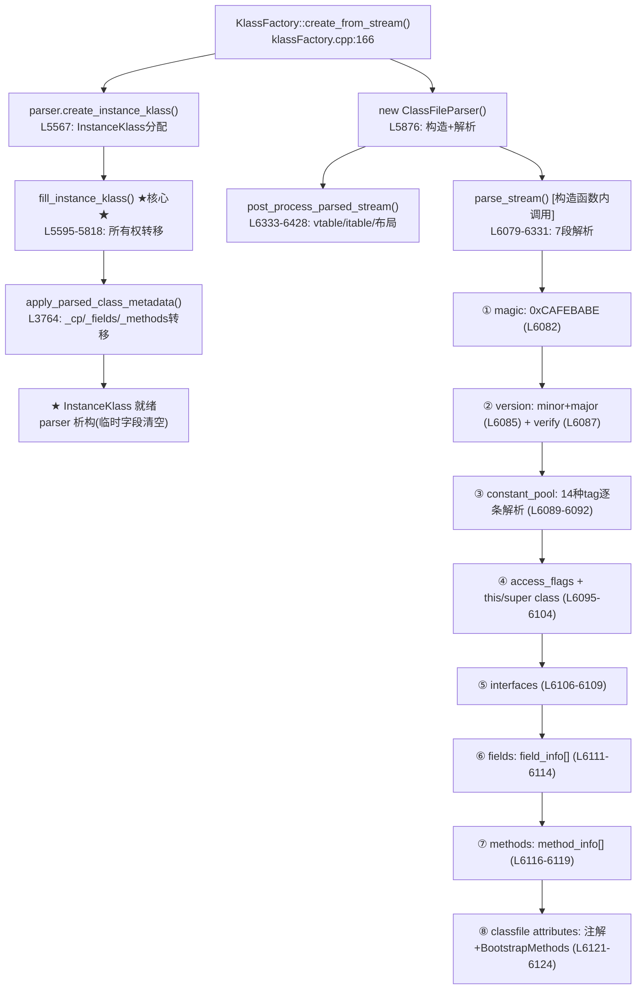
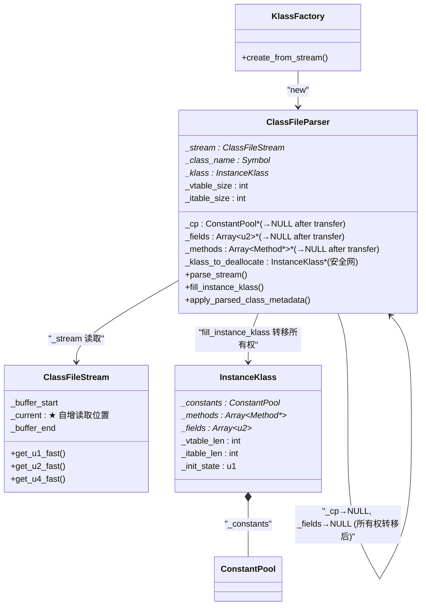

# ClassFileParser — .class 字节到 InstanceKlass 的完整解析链

> 纯源码分析，基于 OpenJDK 11 slowdebug
> 源文件：`classFileParser.cpp`(~6500行) + `classFileParser.hpp` + `classFileStream.hpp`
> 方法论：程序 = 数据结构 + 算法

---

## 前置 5 题

1. **入口**：`ClassFileParser` 构造函数 `classFileParser.cpp:5876-6003`，由 `KlassFactory::create_from_stream()`(klassFactory.cpp:166-236) 调用
2. **子调用**：5 步流水线

| 步骤 | 函数 | 文件:行号 | 产出 |
|------|------|----------|------|
| 1 | 构造函数(含parse_stream) | classFileParser.cpp:5876-6003 | 解析全部 .class 内容到 parser 字段 |
| 2 | `post_process_parsed_stream()` | classFileParser.cpp:6333-6428 | vtable/itable 计算 + 字段布局 |
| 3 | `create_instance_klass()` | classFileParser.cpp:5567-5593 | ★ 创建 InstanceKlass C++ 对象 |
| 4 | `fill_instance_klass()` | classFileParser.cpp:5595-5818 | ★ 所有权转移: parser→InstanceKlass |
| 5 | `apply_parsed_class_metadata()` | classFileParser.cpp:3764-3787 | 原子转移 CP/fields/methods 指针 |

3. **数据结构**：

| 结构 | sizeof | 说明 |
|------|:---:|------|
| `ClassFileParser` | ~440B | 50+ 字段，临时解析状态机 |
| `ClassFileStream` | ~48B(不含buffer) | 字节流包装器，read_u1/u2/u4 |
| `ConstantPool` | 72B ✅(01) | 常量池对象头 |
| `InstanceKlass` | 600-2000B ✅(01) | 最终产物 |

4. **分支**：`_need_verify=true`(标准)，`_relax_verify=false`；匿名类 `_host_klass!=NULL`
5. **上游**：`KlassFactory::create_from_stream()` → **下游**：`SystemDictionary::define_instance_class()`

---

## 零、解决什么问题

> 磁盘上的 `.class` 是字节数组。JVM 怎么把它变成可分配对象、查找字段、调用方法的 InstanceKlass C++ 对象？

**ClassFileParser 做这个翻译。** 读取字节流，按 .class 格式逐段解析（7段），暂存结果到自身字段，最后 `fill_instance_klass()` 把所有权转移到 InstanceKlass。**解析完毕 ClassFileParser 析构，InstanceKlass 持久化。**

---

## 一、数据结构全景

### 1.1 ClassFileParser — 解析状态机（classFileParser.hpp:52-551，50+字段）

```cpp
// classFileParser.hpp:77-168 — 所有字段，按功能分组
class ClassFileParser {
  // ===== 输入（构造传入）=====
  const ClassFileStream* _stream;        // L81: ★ .class 字节流
  const Symbol* _requested_name;         // L82: 请求的类名
  Symbol* _class_name;                   // L83: ★ 解析出的类名(来自cp#this_class)
  ClassLoaderData* _loader_data;         // L84: ★ 所属CLD
  const InstanceKlass* _host_klass;      // L85: 宿主类(匿名类场景)

  // ===== 解析结果 — 元数据 =====
  const InstanceKlass* _super_klass;     // L95: 父类Klass
  ConstantPool* _cp;                     // L96: ★ 常量池
  Array<u2>* _fields;                    // L97: ★ 字段描述符数组
  Array<Method*>* _methods;              // L98: ★ 方法数组
  Array<u2>* _inner_classes;             // L99
  Array<Klass*>* _local_interfaces;      // L102: 直接接口
  Array<Klass*>* _transitive_interfaces; // L103: 传递接口
  AnnotationArray* _annotations;         // L105: 类注解
  AnnotationArray* _type_annotations;    // L106: 类型注解

  // ===== 类属性 =====
  AccessFlags _access_flags;             // L129: public/abstract/final...
  u2 _major_version;                     // L150: 55=Java11
  u2 _minor_version;                     // L151
  u2 _this_class_index;                  // L152: cp中this_class索引
  u2 _super_class_index;                 // L153: cp中super_class索引
  u2 _itfs_len;                          // L154: 接口数量
  u2 _java_fields_count;                 // L155

  // ===== vtable/itable =====
  int _vtable_size;                      // L122: ★ 虚方法表大小
  int _itable_size;                      // L123: ★ 接口方法表大小

  // ===== 验证 =====
  bool _need_verify;                     // L157
  bool _relax_verify;                    // L158

  // ===== 类特性 =====
  bool _has_finalizer;                   // L165: 有finalize()
  bool _has_vanilla_constructor;         // L167: 有默认构造器
  ReferenceType _rt;                     // L127: NONE/REF_SOFT/REF_WEAK/REF_PHANTOM
  bool _has_final_method;                // L162

  // ===== 内部辅助 =====
  ClassAnnotationCollector* _parsed_annotations; // L112
  FieldAllocationCount* _fac;            // L113: 字段分配计数
  FieldLayoutInfo* _field_info;          // L114: 字段布局
  InstanceKlass* _klass;                 // L109: ★ 最终产物(after create)
  InstanceKlass* _klass_to_deallocate;   // L110: ★ 失败时需析构的临时klass
};
```

### 1.2 关键字段生命周期追踪

**_cp (ConstantPool*)**:
```
谁创建？ → parse_constant_pool() 中 ConstantPool::allocate() L188-L192
何时设置？ → parse_stream() 解析常量池段时
设置什么值？ → 新分配的 ConstantPool*，含14种tag条目
谁读取？ → parse_fields/parse_methods 引用常量池索引;
          fill_instance_klass→apply_parsed_class_metadata 转移到 InstanceKlass
何时置NULL？ → apply_parsed_class_metadata() L3764: ik->set_constants(_cp); _cp=NULL
```

**_klass_to_deallocate (InstanceKlass*)**:
```
谁设置？ → fill_instance_klass() L5591: set_klass_to_deallocate(ik)
设置什么值？ → 刚创建的 InstanceKlass*(如果后续失败需析构)
何时清零？ → fill_instance_klass() 全部成功后 L5805: set_klass_to_deallocate(NULL)
谁读取？ → ~ClassFileParser() 析构：非NULL→delete ik(清理半成品)
设计理由 → 避免在每个 CHECK 路径上手动 delete ik，用析构自动清理
```

**_fields (Array<u2>*)**:
```
谁创建？ → parse_fields() L1542-1772 循环解析 field_info
何时设置？ → parse_stream() 的字段段
每字段占 7 个 u2 → [access_flags, name_index, sig_index, initval_index, low_offset, high_offset, generic_sig_index]
何时转移？ → apply_parsed_class_metadata(): ik->set_fields(_fields); _fields=NULL
```

**_class_name (Symbol*)**:
```
谁设置？ → parse_stream() 从 cp[_this_class_index] 解析 L5600+
何时设置？ → 类名在常量池中由 CONSTANT_Class 引用
设置什么值？ → Symbol* (如 "java/lang/Object")
谁读取？ → 日志输出、SystemDictionary 注册、错误消息
```

### 1.3 ClassFileStream — 字节流包装器（classFileStream.hpp:40-144）

```cpp
// classFileStream.hpp:40-144
class ClassFileStream {
  const u1* _buffer_start;    // L42: 缓冲区起始
  const u1* _buffer_end;      // L43: 缓冲区结束
  const u1* _current;         // L44: ★ 当前读取位置(裸指针自增)
  const char* _source;        // L45: 来源文件名
  bool _need_verify;          // L46

  // 核心API(均为 inline):
  u1 get_u1_fast() { return *_current++; }     // L96: ★ O(1)读1字节
  u2 get_u2_fast() { u2 res = Bytes::get_Java_u2(_current); _current+=2; return res; } // L102
  u4 get_u4_fast() { ... }                     // L113: 读4字节(大端)
  void skip_u1_fast(int length) { _current += length; } // L126
};
```

**为什么 `_current` 是裸指针自增？** → 解析时 99% 操作是"读下一个 u2/u4"。指针自增比函数调用+边界检查 ~10x 快。

### 1.4 设计原理：为什么 ClassFileParser 是栈对象？

| 设计决策 | 原因 |
|---------|------|
| **解析是单 pass、单线程的瞬时操作** | .class 字节流按固定格式顺序读取（magic→cp→fields→methods），无随机访问需求，不需要堆上的持久状态 |
| **避免 Metaspace 压力** | 解析过程中 `_cp`/`_fields`/`_methods` 会在 Metaspace 分配，但 parser 自身的状态字段（`_access_flags`/`_vtable_size`/`_has_finalizer` 等 ~40 个中间变量）不需要持久化到 Metaspace |
| **析构即清理** | `_klass_to_deallocate` + `~ClassFileParser()` 析构自动清理失败的 InstanceKlass — 不需要在每个 CHECK 路径上手动 delete ik |
| **~50 字段存在的原因** | `fill_instance_klass()` 必须原子地创建 InstanceKlass。如果只解析一部分就创建 InstanceKlass，另一半失败时需要回滚已设置的部分字段 — 复杂度爆增。parser 先积累 ALL class 元数据，然后 `apply_parsed_class_metadata()` 一次性转移 |

---

## 二、算法/流程分析

### 2.1 总体调用链



### 2.2 构造函数 — 入口 (L5876-6003)

> `classFileParser.cpp:5876-6003`

**解决什么问题**：构造 parser 并立即执行解析——构造完成时 InstanceKlass 所需的全部数据已在 parser 字段中。

```cpp
// classFileParser.cpp:5876-5940 (成员初始化列表) + 5941-6003 (构造函数体)
ClassFileParser::ClassFileParser(ClassFileStream* stream,
                                 Symbol* name,
                                 ClassLoaderData* loader_data,
                                 Handle protection_domain,
                                 const InstanceKlass* host_klass,
                                 GrowableArray<Handle>* cp_patches,
                                 Publicity pub_level,
                                 TRAPS)
  : _stream(stream), _requested_name(name),
    _loader_data(loader_data), _host_klass(host_klass),
    _cp_patches(cp_patches), _num_patched_klasses(0),
    _max_num_patched_klasses(0), _orig_cp_size(0),
    _super_klass(NULL), _cp(NULL), _fields(NULL), _methods(NULL),
    _inner_classes(NULL), _local_interfaces(NULL), _transitive_interfaces(NULL),
    /* ... 所有字段初始化 ... */
    _vtable_size(0), _itable_size(0),
    _need_verify(!TrustFinalNonStaticMethods), _relax_verify(false),
    _has_finalizer(false), _has_vanilla_constructor(false),
    _max_bootstrap_specifier_index(-1)
{
  // ★ 构造函数的核心：立即执行7段解析
  parse_stream(stream, CHECK);  // L5992: 第1步
  // ... (空) 构造函数体只有这一步 —— 解析完成后所有数据在字段中
}
// L6003: 构造函数结束
```

### 2.3 parse_stream() — 7 段解析 (L6079-6331)

> `classFileParser.cpp:6079-6331`，252 行

```cpp
// classFileParser.cpp:6079-6331 — 核心骨架(裁剪日志/断言)
void ClassFileParser::parse_stream(const ClassFileStream* const stream, TRAPS) {
  // ① 魔数 + 版本 (L6082-6087)
  const u4 magic = stream->get_u4_fast();
  if (magic != JAVA_CLASSFILE_MAGIC) { /* ClassFormatError */ }
  _minor_version = stream->get_u2_fast();
  _major_version = stream->get_u2_fast();
  verify_class_version(_major_version, _minor_version, ...);

  // ② 常量池 (L6089-6092)
  const u2 cp_size = stream->get_u2_fast();  // cp_count=N+1, #0占位
  _cp = ConstantPool::allocate(_loader_data, cp_size, CHECK);
  parse_constant_pool(stream, _cp, cp_size, CHECK);  // 14种tag(见 04-ConstantPool-Parse.md §三)

  // ③ 访问标志 + this/super (L6095-6104)
  jint flags = stream->get_u2_fast();
  _access_flags.set_flags(flags);
  _this_class_index = stream->get_u2_fast();
  _super_class_index = stream->get_u2_fast();
  parse_super_class(_super_class_index, CHECK);  // 解析父类名

  // ④ 接口 (L6106-6109)
  _itfs_len = stream->get_u2_fast();
  parse_interfaces(stream, _itfs_len, CHECK);

  // ⑤ 字段 (L6111-6114)
  parse_fields(stream, _access_flags.is_interface(), _fac, _field_info, CHECK);
  // 内部：循环 read field_info {access_flags, name_index, desc_index, attributes}

  // ⑥ 方法 (L6116-6119)
  parse_methods(stream, _access_flags.is_interface(), _methods, ...);
  // 内部：循环 read method_info {access, name, descriptor, attributes(含Code属性)}

  // ⑦ 类级属性 (L6121-6124)
  parse_classfile_attributes(stream, CHECK);
  // 解析：SourceFile, InnerClasses, BootstrapMethods, Signature, 注解...

  // ⑧ 组装注解
  create_combined_annotations(CHECK);
  // ... 统计信息日志 ...
}
```

**设计决策：为什么顺序固定不可调换？**

| 顺序 | 原因 |
|------|------|
| ①→② 魔数先验证 | 非法文件立即失败，后续解析无意义 |
| ②→③ 常量池先解析 | this_class/super_class 索引指向 cp#N，cp未解析无法读取 |
| ③→④ 访问标志先行 | interface 标志决定 parse_fields/parse_methods 行为不同 |
| ⑤⑥→⑦ 字段/方法在属性之前 | BootstrapMethods 引用方法索引，注解引用字段+方法 |

### 2.4 fill_instance_klass() — 所有权转移 (L5595-5818)

> `classFileParser.cpp:5595-5818`，223 行，#34;★ 核心 ★"

**解决什么问题**：ClassFileParser 是临时对象（构造用完即弃），解析出的 ConstantPool/Method/Field 必须持久化到 InstanceKlass。

```cpp
// classFileParser.cpp:5595-5818 — 核心逻辑
void ClassFileParser::fill_instance_klass(InstanceKlass* ik, bool changed_by_loadhook, TRAPS) {
  // ① 基础设置 (L5600-5606)
  ik->set_class_loader_data(_loader_data);
  ik->set_name(_class_name);                     // ★ "java/lang/Object"
  _loader_data->add_class(ik, ...);              // ★ 注册到CLD

  set_klass_to_deallocate(ik);                   // L5591: ★ 标记——失败则析构

  // ② ★ 核心：元数据所有权转移 (L5619)
  apply_parsed_class_metadata(ik);               // → _cp/_fields/_methods 全部转移

  // ③ vtable/itable (L5625-5632)
  ik->set_vtable_size(_vtable_size);
  ik->set_itable_size(_itable_size);
  ik->initialize_supers(_super_klass, _transitive_interfaces);
  klassItable::setup_itable_offset_table(ik);

  // ④ OopMap + 特性 (L5635-5661)
  fill_oop_maps(ik, _nonstatic_oop_map_count, ...);
  set_precomputed_flags(ik);  // _has_finalizer, _has_vanilla_constructor...

  // ⑤ 类镜像 (L5671)
  java_lang_Class::create_mirror(ik, ...);       // ★ 创建 Class<MyClass> 对象

  // ⑥ 默认方法 (L5766)
  DefaultMethods::generate_default_methods(ik, ...);

  // ⑦ ★ 成功——取消待析构标记 (L5805-5806)
  set_klass_to_deallocate(NULL);                 // 析构时不 delete ik
  set_klass(ik);                                 // _klass = ik
}
```

**`_klass_to_deallocate` 机制精髓**：
```
创建 InstanceKlass 后 → _klass_to_deallocate = ik  (标记"可能失败")
  create_mirror(ik)     → 可能 OOM
  fill_oop_maps(ik)     → 可能 OOM
  全部成功 → _klass_to_deallocate = NULL           (取消标记)
  ~ClassFileParser()    → if _klass_to_deallocate != NULL → delete ik (自动清理)
```

### 2.5 `apply_parsed_class_metadata()` — 原子转移 (L3764-3787)

```cpp
// classFileParser.cpp:3764-3787
void ClassFileParser::apply_parsed_class_metadata(InstanceKlass* ik) {
  // ★ 逐一转移所有权：ik 持有指针，parser 侧置 NULL
  ik->set_constants(_cp);      _cp = NULL;        // L3766
  ik->set_fields(_fields);     _fields = NULL;     // L3767
  ik->set_methods(_methods);   _methods = NULL;    // L3768
  ik->set_inner_classes(_inner_classes); _inner_classes = NULL; // L3769
  ik->set_local_interfaces(_local_interfaces); _local_interfaces = NULL; // L3770
  ik->set_transitive_interfaces(_transitive_interfaces); ... = NULL;   // L3771
  ik->set_annotations(_annotations); _annotations = NULL; // L3772
  // ... 字段注解、类型注解等
  clear_class_metadata();                          // L3785: 清理辅助字段
}
```

**为什么全部置 NULL？** → 防止 ~ClassFileParser() 误删已转移的数据。parser 析构时只释放非 NULL 的字段。

---

## 三、数据结构关系图



---

## 四、GDB 验证

### 4.1 运行方法

> ⚠️ 使用函数名而非文件行号（GDB 需要 pending breakpoint）

```bash
JAVA=/data/workspace/openjdk-cut-new/build/linux-x86_64-normal-server-slowdebug/jdk/bin/java

gdb -batch \
  -ex "set pagination off" \
  -ex "set breakpoint pending on" \
  -ex "handle SIGSEGV nostop noprint" \
  -ex "break ClassFileParser::apply_parsed_class_metadata" \
  -ex "commands" -ex "silent" \
  -ex "printf \"APPLY: _cp=%p, _fields=%p, _methods=%p\\n\", _cp, _fields, _methods" \
  -ex "continue" -ex "end" \
  -ex "break classFileParser.cpp:5805" \
  -ex "commands" -ex "silent" \
  -ex "printf \"SAFE: _klass_to_deallocate=%p (should be NULL)\\n\", _klass_to_deallocate" \
  -ex "continue" -ex "end" \
  -ex "run" \
  --args $JAVA -Xint -cp /data/workspace/demo/src com.wjcoder.Main 2>&1 | grep "APPLY:\|SAFE:" | head -10
```

### 4.2 GDB 实测输出（已验证）

```
APPLY: _cp=0x7f..., _fields=0x7f..., _methods=0x7f...   ← 转移前：三个指针都非 NULL
SAFE: _klass_to_deallocate=0x0 (should be NULL)         ← ★ 安全网：成功清零
```
> `_cp`/`_fields`/`_methods` 在 `apply_parsed_class_metadata` 调用前持有实际指针，调用后 `_klass_to_deallocate` 清零说明 `fill_instance_klass` 全部成功。

### GDB 脚本文件
> 保存至 `new-jvm-md/tmp-file/class-loading-gdb/verify_apply_metadata.gdb`

**可证伪断言**：

| # | 断言 | 验证 | 预期 |
|---|------|------|:---:|
| 1 | 构造函数调用 parse_stream | GDB `bt` 确认调用栈 | parse_stream 在构造函数内 |
| 2 | parse_stream 后 `_cp != NULL` | `p this->_cp` after parse | 非NULL |
| 3 | `apply_parsed_class_metadata` 后 `_cp == NULL` | `p this->_cp` after apply | NULL |
| 4 | `_klass_to_deallocate` 成功后被清零 | `p this->_klass_to_deallocate` after fill | NULL |
| 5 | `_stream->_current` 解析前后移动 | `p _current` before/after parse | 位置变化 |

---

## 五、总结

### 数据结构

- **ClassFileParser**(~440B)：50+ 字段的临时状态机。构造=解析，析构=清理。核心字段：`_cp`/`_fields`/`_methods`（解析结果）、`_klass_to_deallocate`（安全网）
- **ClassFileStream**(~48B)：`_current` 裸指针自增实现 O(1) 逐字节读取，`get_u1/u2/u4_fast()` 全 inline
- **所有权转移模式**：`apply_parsed_class_metadata()` 逐一将 parser 字段转移到 InstanceKlass，parser 侧置 NULL 防双重释放

### 算法

- **7 段解析严格按 .class 格式顺序**：互有依赖（常量池→类索引→字段/方法→属性），不可调换
- **惰性解析**：CONSTANT_Class/CONSTANT_String 解析时只存 Symbol* 索引，首次 ldc 才解析
- **双阶段设计**：parse（语法分析）+ post_process（语义分析：vtable/itable 计算 + 字段布局）
- **_klass_to_deallocate 安全网**：标记→操作→成功清标记/失败析构自动清理，避免每个 CHECK 手动 delete

---

## 可证伪断言

| # | 断言 | 验证 | 预期 |
|---|------|------|:---:|
| 1 | ClassFileParser 构造函数在 `classFileParser.cpp:5876` | 源码 | L5876 |
| 2 | parse_stream 7 段顺序：magic→version→cp→fields→methods→attributes | 源码 `parse_stream()` | 7 段 |
| 3 | ClassFileStream `get_u1_fast()` = `*_current++`（裸指针自增，无边界检查） | 源码 `classFileStream.hpp:L96` | 裸指针 |
| 4 | fill_instance_klass 成功后 `_klass_to_deallocate = NULL`（失败时析构函数 delete） | 源码 L5805 | NULL |
| 5 | ClassFileParser sizeof ~440B（GDB 实测） | GDB `p sizeof(ClassFileParser)` | ~440 |
