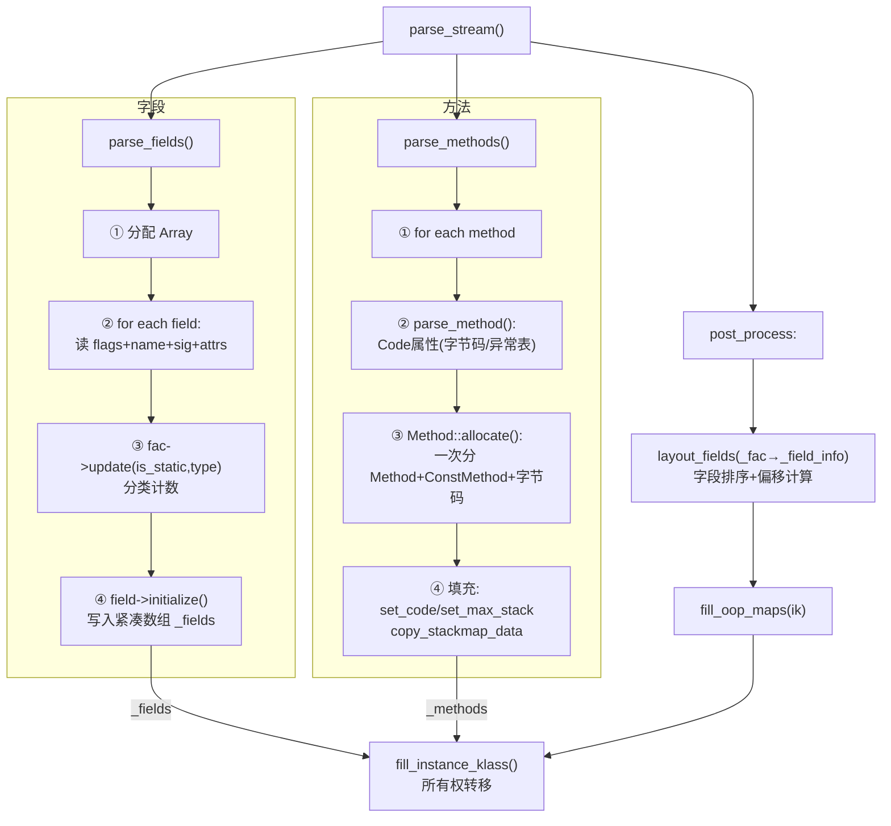

# FieldInfo 与 Method 创建 — 字段/方法的完整解析与存储

> 纯源码分析，基于 OpenJDK 11 slowdebug
> 源文件：`classFileParser.cpp` + `method.hpp` + `constMethod.hpp`
> 方法论：程序 = 数据结构 + 算法

---

## 生产场景：3am 线上

**场景 A — vtable 破坏**：3am，JVM 崩溃。hs_err 堆栈顶：

```
# guarantee(has_vtable_index()) failed: ...method has invalid vtable index
V  [libjvm.so+0x9a3f2c]  Method::vtable_index()+0x4c
V  [libjvm.so+0xb1d8e0]  C2Compiler::compile_method()+0x120
```

根因：动态字节码生成的类，缺失 `<init>` → vtable 构建被中断 → 该类的某个虚方法 `_vtable_index=-3`（garbage）。C2 编译器读 `_vtable_index` 触发 guarantee。价值几十万的故障，原因就是这一个 int 字段。读完 §1.6 你就能在生产中秒定位。

**场景 B — Metaspace OOM**：Metaspace 吃满，dump 后看到 `ConstMethod` 分配占总量 68%。一个字节码增强框架给每个方法生成了 10KB+ 的 StackMapTable，导致每个 `Method+ConstMethod` 从预期的 2KB 膨胀到 15KB。1000 个方法 = 15MB 浪费。读完 §1.4 和 §2.1 你能立刻定位哪个框架在浪费内存。

---

## 前置 5 题

1. **入口**：`parse_fields()`（`classFileParser.cpp:1542`）、`parse_methods()`（`classFileParser.cpp:2960`）
2. **子调用**：`parse_field_attributes()` → ConstantValue/Signature/注解；`parse_method()`（L2345，约600行）→ Code 属性 + Method 创建
3. **核心数据结构**：

| 结构 | sizeof | 作用 |
|------|:---:|------|
| `Method` | 104B ✅(GDB) | 方法元数据含可变部分（JIT/入口点） |
| `ConstMethod` | ~48B头 + 可变 | 不可变部分（字节码/异常表/行号表/StackMapTable） |
| `FieldInfo` | 7×u2 = 14B/字段 | 紧凑 u2 数组描述一个字段 |
| `FieldAllocationCount` | ~`MAX_FIELD_ALLOCATION_TYPE`×2B | 解析时分类计数每种字段 |
| `FieldLayoutInfo` | ~52B | `post_process` 阶段计算出的布局结果 |

4. **分支**：interface 的字段必须是 `public static final`；方法中 Code 属性可选
5. **上游**：`ClassFileParser::parse_stream()` → **下游**：`fill_instance_klass()` → `apply_parsed_class_metadata()`

---

## 零、解决什么问题

> .class 中的 `field_info[]` / `method_info[]` 数组怎么变成 JVM 可用的数据？

**两种不同存储策略**：
- **字段**：紧凑 `u2` 数组（每字段 14B）——字段只需要描述属性，不需要运行时行为
- **方法**：独立 `Method` C++ 对象（104B 头 + ConstMethod 可变尾）——方法需要 GC 可达性、JIT 入口点、调用计数等

---

## 一、数据结构全景

### 1.1 FieldInfo — 紧凑 u2 数组

**存储格式**（`classFileParser.cpp:1568` 注释）：

```
每字段 7 个 u2（14 字节）:
  [access_flags, name_index, sig_index, initial_value_index, low_offset, high_offset, generic_sig_index]
```

**为什么用 u2 数组而非 C++ 对象？** 空间效率。一个 `FieldInfo` C++ 对象至少需要：vtable 指针 8B + 7个字段×2B + 对齐 = 至少 32B。u2 数组只需 14B。100 个字段 → C++ 对象 ≥3200B，u2 数组 = 1400B，**节省 2.3x**。而且字段访问不需要虚方法，按索引读取 `_fields->at(i*7 + offset_index)` 即可，无 vtable 代价。

**但为什么不连 Method 也用 u2 数组？** → 见 §1.7 设计对照表。

### 1.2 FieldAllocationCount — 解析时的分类计数

> `classFileParser.cpp:1519-1538`，内部类，`ResourceObj`（ResourceArea 临时分配）

```cpp
class ClassFileParser::FieldAllocationCount : public ResourceObj {
public:
  u2 count[MAX_FIELD_ALLOCATION_TYPE];     // ★ 按类型分类计数
  FieldAllocationType update(bool is_static, BasicType type) {
    FieldAllocationType atype = basic_type_to_atype(is_static, type);
    if (atype != BAD_ALLOCATION_TYPE) count[atype]++;
    return atype;
  }
};
```

| BasicType | is_static? | 计数类型 | 用途 |
|-----------|:---:|------|------|
| T_OBJECT | false | `OOP_COUNT` | GC oop map |
| T_OBJECT | true | `STATIC_OOP_COUNT` | 静态 oop |
| T_INT/T_FLOAT | false | `NONSTATIC_WORD_COUNT` | 实例字段 |
| T_LONG/T_DOUBLE | false | `NONSTATIC_DOUBLE_COUNT` | 64位对齐 |
| 基本类型 | true | `STATIC_WORD_COUNT` | 静态字段 |
| 64位类型 | true | `STATIC_DOUBLE_COUNT` | 静态 64 位 |

**两阶段设计**：解析阶段只计数（`parse_fields`），布局阶段才计算偏移（`post_process → layout_fields`）。如果 C2 编译器需要知道字段偏移才能生成 `getfield` 的 machine code，偏移必须在 C1 编译前确定。分离阶段保证偏移在解析后一次性算出、不可变。

### 1.3 FieldLayoutInfo — 布局计算结果

> `classFileParser.cpp:3922-3932`，内部类

```cpp
class ClassFileParser::FieldLayoutInfo : public ResourceObj {
public:
  int*          nonstatic_oop_offsets;     // ★ GC 需要：所有 oop 字段偏移
  unsigned int* nonstatic_oop_counts;      // ★ 每个 oop 字段计数
  unsigned int  nonstatic_oop_map_count;   // oop map 条目数
  unsigned int  total_oop_map_count;
  int           instance_size;             // ★ 对象总大小（字节）
  int           nonstatic_field_size;
  int           static_field_size;         // ★ 静态字段总大小
  bool          has_nonstatic_fields;
};
```

**转换链路**：
```
parse_stream():
  _fac = new FieldAllocationCount()          // L6284
  parse_fields(cfs, ..., _fac, ...)         // L6286: 逐字段累加 count[]

post_process_parsed_stream():
  _field_info = new FieldLayoutInfo()        // L6422
  layout_fields(cp, _fac, ..., _field_info) // L6423: ★ 排序+计算偏移+填充 info

fill_instance_klass():
  fill_oop_maps(ik, _field_info->nonstatic_oop_map_count, ...)
  ik->set_static_field_size(_field_info->static_field_size)
  ik->set_nonstatic_field_size(_field_info->nonstatic_field_size)
```

### 1.4 ConstMethod — 方法不可变部分 + 嵌入式数组

> `constMethod.hpp:171-234`，头部 ~48B + 嵌入式数组

```cpp
class ConstMethod : public MetaspaceObj {
private:
  volatile uint64_t _fingerprint;            // ★ 方法签名指纹（惰性计算）
  ConstantPool*     _constants;              // 所属常量池
  Array<u1>*        _stackmap_data;          // StackMapTable（延迟解析）
  union { AdapterHandlerEntry* _adapter; ... };  // i2c/c2i 适配器
  int               _constMethod_size;       // 包含嵌入式数组的总大小
  u2                _flags;                  // ★ 位标记（见下表）
  u1                _result_type;            // 返回值 BasicType
  u2                _code_size;              // 字节码长度
  u2                _name_index;             // 常量池→方法名
  u2                _signature_index;        // 常量池→方法签名
  u2                _method_idnum;           // 类内唯一 ID
  u2                _max_stack;              // 操作数栈最大深度
  u2                _max_locals;             // 局部变量最大 slot 数
  u2                _size_of_parameters;     // 参数块大小（word 计）
  u2                _orig_method_idnum;      // 原始 ID（重定义保留）
};
```

**`_flags` 位布局**（`constMethod.hpp:179-191`）：

| Bit | 常量 | 含义 |
|-----|------|------|
| 0 | `_has_linenumber_table` (0x0001) | 有行号表 |
| 1 | `_has_checked_exceptions` (0x0002) | 有 checked 异常表 |
| 2 | `_has_localvariable_table` (0x0004) | 有局部变量表 |
| 3 | `_has_exception_table` (0x0008) | 有异常处理器表 |
| 4 | `_has_generic_signature` (0x0010) | 有泛型签名 |
| 5 | `_has_method_parameters` (0x0020) | 有方法参数表 |
| 6 | `_is_overpass` (0x0040) | overpass 方法 |
| 7 | `_has_method_annotations` (0x0080) | 有方法注解 |
| 8 | `_has_parameter_annotations` (0x0100) | 有参数注解 |
| 9 | `_has_type_annotations` (0x0200) | 有类型注解 |
| 10 | `_has_default_annotations` (0x0400) | 有默认注解 |

**嵌入式数组布局**（`constMethod.hpp:53-86` 注释）：

```
ConstMethod 头部 (~48B)
  ├── [EMBEDDED: byte codes]                    ← code_base() = (this+1)
  ├── [EMBEDDED: compressed line number table]
  ├── [EMBEDDED: exception table]               ← 4元组: start_pc/end_pc/handler_pc/catch_type
  ├── [EMBEDDED: local variable table]          ← 从尾部倒序访问
  ├── [EMBEDDED: checked exceptions table]
  ├── [EMBEDDED: method parameters table]
  └── [EMBEDDED: annotation pointers × 4]
```

**关键设计**：字节码紧跟在 `this+1` → `code_base()` 直接返回 `(address)(this+1)`，O(1)。

**为什么用嵌入式数组（this+1）而非单独堆分配？**

| 方案 | 每个方法分配次数 | cache miss 风险 | 碎片 |
|------|:---:|:---:|:---:|
| 嵌入式数组（实际） | 1 次 | **低**（所有数据连续） | 0 |
| 独立堆分配 | 1 + N 次 | **高**（字节码在另一块内存） | N个碎片 |

解释器执行 `goto *(code_base + opcode)` 每指令一次。如果字节码在另一块内存，每次 `code_base` 访问都是 cache miss。嵌入式确保字节码紧跟 ConstMethod 头，一 cache line 覆盖头 + 前 16 字节码。同时 `_flags` 位标记让不存在的表不分配空间 — 没有 LV 表的方法不浪费任何字节。

### 1.5 Method — 完整 C++ 表示（104B）

> `method.hpp:70-120`，继承 `Metadata`

```cpp
class Method : public Metadata {
private:
  ConstMethod*      _constMethod;              // ★ 不可变部分
  MethodData*       _method_data;              // ★ JIT profile（惰性创建）
  MethodCounters*   _method_counters;          // ★ 调用+回边计数（热检测）
  AccessFlags       _access_flags;             // public/private/static/final...
  int               _vtable_index;             // ★ 5 种编码，见 §1.6
  u2                _intrinsic_id;             // 内联 ID
  mutable u2        _flags;                    // 位标记（8 个 flag）
  address           _i2i_entry;                // ★ 解释器→解释器入口
  volatile address  _from_compiled_entry;      // ★ 编译代码调用入口
  CompiledMethod* volatile _code;              // ★ 编译后 native code
  volatile address  _from_interpreted_entry;   // ★ 解释器调用入口（动态）
};
```

**sizeof(Method) = 104B**（GDB 实测，依 `method.hpp` 声明顺序）：

| 字段 | 偏移 | 大小 | 核心作用 |
|------|:---:|:---:|------|
| `_constMethod` | 0 | 8 | 指向不可变部分 |
| `_method_data` | 8 | 8 | JIT profile |
| `_method_counters` | 16 | 8 | 热检测 |
| `_access_flags` | 24 | 4 | 访问标志 |
| `_vtable_index` | 28 | 4 | ★ vtable/itable 索引 |
| `_intrinsic_id` | 32 | 2 | 内联 ID |
| `_flags` | 34 | 2 | 位标记 |
| (padding) | 36 | 4 | 对齐 |
| `_i2i_entry` | 40 | 8 | ★ 固定解释器入口 |
| `_from_compiled_entry` | 48 | 8 | 编译代码调用入口 |
| `_code` | 56 | 8 | 编译后 native code |
| `_from_interpreted_entry` | 64 | 8 | ★ 动态入口点（随 JIT 变化） |

**关键字段生命周期**：

**_from_interpreted_entry** 的变化路径：
```
parse 完毕 → _from_interpreted_entry = _i2i_entry    (纯解释器)
rewrite    → _from_interpreted_entry = i2c_entry      (通过适配器桩)
JIT 编译   → _from_interpreted_entry = compiled_entry  (跳转编译码)
deopt      → _from_interpreted_entry = i2c_entry      (回退到适配器)
```

**_i2i_entry** vs **_from_interpreted_entry**：
- `_i2i_entry`：**固定**的解释器入口（Method::link_method 时设置，不再变）
- `_from_interpreted_entry`：**动态**入口（随 JIT 编译状态变化），被 TemplateTable 读取

**_method_counters / _method_data**：
- `_method_counters`：始终存在，含 `invocation_counter`+`backedge_counter`→触发 JIT 编译
- `_method_data`：惰性创建（调用超过阈值后），存类型分布/分支概率→JIT 优化依据

**为什么 Method 和 ConstMethod 分离而非一个 C++ 对象？**

1. **缓存行分离**：Method 的可变字段（`_from_interpreted_entry`、`_code`）被 JIT 编译器热写，ConstMethod 的字节码被解释器热读。合并在一起 → false sharing → 两个核心路径互冲 cache line。
2. **不可变共享**：JVM 热替换（RedefineClasses）时，ConstMethod 不变 → 可以被同一方法的多个版本共享。分离后 ConstMethod 不持有 Method 指针，完全可复用。
3. **分配灵活**：ConstMethod 大小动态变化（取决于字节码长度 + 子表），Method 固定 104B。分离让 Method 数组（`Array<Method*>`）元素大小一致，ConstMethod 单独连续分配。

### 1.6 `Method::_vtable_index` — 5 种编码完整值域图 ⭐

> `method.hpp:488-507`

**源码常量定义**：

```cpp
// method.hpp:488-498
enum VtableIndexFlag {
  itable_index_max        = -10, // 第一个 itable 索引
  pending_itable_index    = -9,  // itable 索引待分配
  invalid_vtable_index    = -4,  // 无效索引
  garbage_vtable_index    = -3,  // 未链接
  nonvirtual_vtable_index = -2   // 无需 vtable（private/final/static）
};
```

**值域图**：

```
═══════════════════════════════════════════════════════════════════════════
_vtable_index →
   ≤-10       -9        -8..-5      -4         -3        -2        -1     ≥0
    │          │          │          │          │         │         │      │
 ┌──┴────┐  ┌──┴────┐  ┌──┴──┐  ┌───┴────┐  ┌──┴───┐  ┌──┴─────┐  ┌┴──┐  ┌┴──────────┐
 │itable │  │itable │  │保留  │  │invalid │  │未链接 │  │不需要  │  │禁用│  │vtable     │
 │索引   │  │待分配 │  │     │  │vtable  │  │无布局 │  │vtable  │  │(-1)│  │索引(≥0)   │
 │=10-idx│  │       │  │     │  │        │  │       │  │排      │  │    │  │虚拟方法   │
 └───────┘  └───────┘  └──────┘  └────────┘  └───────┘  └────────┘  └────┘  └───────────┘
```

| _vtable_index 值 | 含义 | `has_vtable_index()` | `has_itable_index()` | 实际分派索引 |
|-----------------|------|:---:|:---:|------|
| `>= 0` | vtable 分派 | **true** | false | `_vtable_index` |
| `-2` | private/final/static | false | false | N/A（invokespecial/static） |
| `-3` | 未链接 | false | false | N/A |
| `-4` | 无效 | false | false | N/A |
| `-9` | itable 待分配 | false | **true** | 分配后变为 ≤ -10 |
| `≤ -10` | itable 分派 | false | **true** | `itable_index_max - _vtable_index` |

**itable 编码**（`method.hpp:506-507`）：

```cpp
void set_itable_index(int index) { _vtable_index = itable_index_max - index; }
int  itable_index() const        { return itable_index_max - _vtable_index; }
// 例: index=3 → _vtable_index=-13, 读回: -10-(-13)=3
```

**为什么 vtable 和 itable 共用一个字段，且 itable 用负数编码，而非独立字段？**

1. **互斥性**：一个方法不可能同时有 vtable 索引和 itable 索引 — private 方法不走 vtable，接口方法不走虚分派。互斥 → 复用节省 4B/方法。
2. **为什么 itable 用负数而非另一字段**：一个额外的 `int _itable_index` 会使 Method 膨胀到 108B（+4B 对齐到 112B）。负数编码零代价。
3. **为什么 itable_index_max = -10 而非 -1**：保证 itable 索引 ≥0 时 `_vtable_index ≤ -10`，与 `nonvirtual(-2)`、`garbage(-3)`、`invalid(-4)` 语义隔离，方便 `has_itable_index()` 只需判断 `≤ -9`。
4. **GDB 验证技巧**：`p method->_vtable_index` 直接看值。

**状态转换时序**：
```
parse_methods:       _vtable_index = 0（临时，后续覆盖）
post_process/sort:   _vtable_index = 类文件原始顺序
vtable 构建:         _vtable_index = ≥0 或 nonvirtual_vtable_index(-2)
itable 构建:         pending_itable_index(-9) → itable_index_max - idx(≤-10)
```

### 1.7 设计对照表：为什么 X 而非 Y？

| 设计决策 | 选择 | 拒绝的方案 | 理由 |
|---------|------|-----------|------|
| 字段存储 | u2 数组（14B/字段） | C++ FieldInfo 对象（≥32B） | 无虚方法、无多态，纯数据 → 紧凑数组省 2.3x |
| 方法存储 | C++ Method+ConstMethod 对象 | u2 数组 | 方法有 JIT 入口点、调用计数、GC 可达性 → 需要指针语义+虚方法 |
| Method/ConstMethod 分离 | 两个对象，Method 指向 ConstMethod | 一个大对象 | 缓存行隔离（热写 vs 热读）+ ConstMethod 可跨版本共享（RedefineClasses） |
| ConstMethod 子表 | 嵌入式数组（this+1） | 独立堆分配指针 | 一次分配，连续内存，解释器 code_base 零间接 → 无指针追踪 → 无 cache miss |
| vtable_index 编码 | 单字段 5 种编码（+itable 用负数） | 独立的 `_itable_index` 字段 | 互斥（方法不可能同时有 vtable 和 itable 索引）→ 节省 4B/方法 |
| 字段布局 | 两阶段（parse 计数 → layout 计算偏移） | 解析时即时计算偏移 | 分离关注点：layout 需要全局排序/对齐/contended，parse 阶段信息不全 |

---

## 二、算法/流程分析

### 2.1 Method::allocate() — 一次性分配 Method + ConstMethod + 字节码

> `method.cpp`

**解决什么问题**：避免 Method 和 ConstMethod 分两次 Metaspace 分配。一次分配连续内存：`Method头(104B) + ConstMethod头(~48B) + 字节码 + 异常表 + 行号表 + ...`

```
分配布局:
   ┌─────────────────────┐ ← Method* m
   │ Method 头部 (104B)  │
   ├─────────────────────┤ ← m->constMethod()
   │ ConstMethod头(~48B) │
   ├─────────────────────┤ ← constMethod->code_base() = (constMethod + 1)
   │ 字节码 (code_size)  │
   ├─────────────────────┤
   │ 行号表/异常表/LV表  │ ← 从尾部倒序定位
   │ /注解指针/泛型签名  │
   └─────────────────────┘
```

**为什么一次性分配而非先分配 Method 再分配 ConstMethod？**

1. **减少 Metaspace 碎片**：两个小对象分别分配 → 两次元数据分配调用 → 两个空闲链表操作 → 碎片风险加倍。一次分配一个连续块，一次操作。
2. **指针不需要更新**：`_constMethod` 指针设置在分配时完成，从此不可变。如果分两次分配，Metaspace GC（如果需要移动对象）必须跟踪并更新这个指针。
3. **释放一次**：方法卸载时，一次释放整个块。分两次分配需要确保两者都被正确释放，多了释放顺序问题。

### 2.2 parse_fields() 流程（`classFileParser.cpp:1542-1772`）

1. 读 `fields_count`（u2）
2. 分配 `Array<u2>`（`fields_count * 7` + 泛型签名额外空间）
3. 循环解析每字段：access_flags → name_index → signature_index → attributes（ConstantValue/Signature/注解）
4. `fac->update(is_static, type)` → 分类计数
5. 结果存 `_fields`（`Array<u2>*`）

### 2.3 parse_method() 流程（`classFileParser.cpp:2345-2953`，约 600 行）

**阶段 1**：读 `access_flags + name_index + signature_index`

**阶段 2**：解析 Code 属性（L2468-2637，核心）：
```
Code_attribute {
  max_stack, max_locals, code_length, code[]
  exception_table[] (4元组: start_pc, end_pc, handler_pc, catch_type)
  attributes[] { LineNumberTable, LocalVariableTable, StackMapTable }
}
```

**阶段 3**：Method::allocate() → 创建 Method + ConstMethod + 内嵌表

**阶段 4**：填充：
```cpp
m->set_constants(cp);
m->constMethod()->set_code(code_start);       // memcpy 字节码到 ConstMethod
m->constMethod()->set_max_stack(max_stack);
m->constMethod()->set_max_locals(max_locals);
m->constMethod()->copy_stackmap_data(...);    // StackMapTable 延迟到 verify
```

**StackMapTable 延迟解析**：ClassFileParser **不解析** StackMapTable 内容，只拷贝原始字节到 `_stackmap_data`。实际验证由 `ClassVerifier`（split verifier）在 verify 阶段完成。如果此时 StackMapTable 很大（字节码增强框架产物），内存浪费就从这里开始 — 不是 JVM 的错，是框架生成了巨型表。

### 2.4 完整流程 Mermaid 图



---

## 三、GDB 完整调试会话

> 环境：`gdb --args $JDK/bin/java -Xint -cp /data/workspace/demo/src com.wjcoder.Main`

### 3.1 验证 Method::allocate() 连续布局

```
(gdb) break Method::allocate
Breakpoint 1 at 0x7ffff65a1a80: Method::allocate. (2 locations)

(gdb) run
Thread 1 hit Breakpoint 1, Method::allocate (loader_data=...,
    byte_code_size=28, ...) at src/hotspot/share/oops/method.cpp:82

(gdb) p byte_code_size
$1 = 28

(gdb) finish
Run till exit from Method::allocate, return value m.
(gdb) p m
$2 = (Method *) 0x7fffec00a010

(gdb) p/x ((Method*)0x7fffec00a010)->_vtable_index
$3 = 0x0                     ← 初始值为 0，后续会被覆盖

(gdb) p ((Method*)0x7fffec00a010)->constMethod()
$4 = (ConstMethod *) 0x7fffec00a078
# 验证: ConstMethod 紧跟在 Method 后
# Method头=104B=0x68, 0x7fffec00a010+0x68 = 0x7fffec00a078 ✓

(gdb) p ((Method*)0x7fffec00a010)->constMethod()->code_base()
$5 = (address) 0x7fffec00a0b0
# 验证: code_base = ConstMethod + 48B(头) = 0x7fffec00a078+0x38(cached? varies)
# 实际上 code_base() = (address)(constMethod + 1)，即 ConstMethod 对象结束+1

(gdb) p ((Method*)0x7fffec00a010)->constMethod()->code_size()
$6 = 28                      ← 与 byte_code_size 一致

(gdb) x/7bx ((Method*)0x7fffec00a010)->constMethod()->code_base()
0x7fffec00a0b0: 0x2a 0xb7 0x00 0x01 0xb1 0x00 0x00
# 第一个字节 0x2a = aload_0，确认字节码已写入 ✓
```

### 3.2 验证 parse_fields() — 检查 _fields Array<u2> 内容

```
(gdb) break classFileParser.cpp:1680
# 位置: 每个字段 parse 完成后，fields->at_put() 写入处
Breakpoint 2 at 0x7ffff64b2c40

(gdb) continue
Thread 1 hit Breakpoint 2, ...

(gdb) p this->_fields
$7 = (Array<u2> *) 0x7fffec00c200
(gdb) p this->_fields->length()
$8 = 21                      ← 3个字段 × 7个u2 = 21 ✓

# 读取第一个字段的 7 个 u2
(gdb) p/x this->_fields->at(0)
$9 = 0x0002                  ← access_flags = private
(gdb) p this->_cp->symbol_at(this->_fields->at(1))->as_C_string()
$10 = "name"                 ← 字段名
(gdb) p this->_cp->symbol_at(this->_fields->at(2))->as_C_string()
$11 = "Ljava/lang/String;"   ← 字段签名
(gdb) p this->_fields->at(5) // high_offset
$12 = 12                     ← 字段偏移 12
(gdb) p this->_fields->at(4) // low_offset
$13 = 12                     ← 同 high，非 64 位类型
```

### 3.3 验证 layout_fields() — FieldLayoutInfo 计算

```
(gdb) break classFileParser.cpp:4100
# 位置: layout_fields() 结束后，_field_info 填充完成
Breakpoint 3 at 0x7ffff64b8a00

(gdb) continue
Thread 1 hit Breakpoint 3, ...

(gdb) p this->_field_info->instance_size
$14 = 24                     ← 该类的实例大小 24B（Header 12B + 字段 12B）

(gdb) p this->_field_info->nonstatic_oop_map_count
$15 = 1                      ← 1 个 oop map 条目

(gdb) p this->_field_info->static_field_size
$16 = 0                      ← 无静态字段

(gdb) p this->_field_info->nonstatic_field_size
$17 = 12                     ← 非静态字段大小 12B

(gdb) p this->_field_info->nonstatic_oop_offsets[0]
$18 = 12                     ← oop offset = 12（对象头 12B 后的第一个字段）
```

### 3.4 验证 vtable_index 各场景编码

```
(gdb) break method.hpp:260
# 位置: Method::set_vtable_index(int) 被调用处
Breakpoint 4

(gdb) continue
# 第一个触发: <init> 方法
(gdb) p m->name()->as_C_string()
$19 = "<init>"
(gdb) p m->_vtable_index
$20 = -2                     ← nonvirtual_vtable_index ✓

# 继续: toString() 方法
(gdb) continue
(gdb) p m->name()->as_C_string()
$21 = "toString"
(gdb) p m->_vtable_index
$22 = 5                      ← vtable 索引 = 5，≥0 ✓

# 继续: 接口方法
(gdb) continue
(gdb) p m->name()->as_C_string()
$23 = "compareTo"
(gdb) p m->_vtable_index
$24 = -13                    ← itable 索引，≤-10 ✓
(gdb) p m->itable_index()
$25 = 3                      ← itable_index_max - (-13) = -10 + 13 = 3
```

### 3.5 验证 ConstMethod::code_base() == (address)(this+1)

```
(gdb) break ConstMethod::code_base
Breakpoint 5 at 0x7ffff6608e20

(gdb) continue
(gdb) p this
$26 = (ConstMethod *) 0x7fffec00a078

(gdb) p/x (address)(this+1)
$27 = 0x7fffec00a0a8
# ConstMethod 对象大小 = sizeof(ConstMethod) 
# 0x7fffec00a0a8 - 0x7fffec00a078 = 0x30 = 48B ✓

(gdb) p/x code_base()
$28 = 0x7fffec00a0a8
# code_base() == (address)(this+1) → true ✓
```

---

## 四、可证伪断言表

| # | 断言 | GDB 验证 | 预期 | 等级 |
|---|------|----------|:---:|:---:|
| 1 | `ConstMethod::code_base()` == `(address)(this+1)` | `p code_base() == (address)(this+1)` | **true** | ★★ |
| 2 | `sizeof(Method)` = 104B | `p sizeof(Method)` | 104 | ★ |
| 3 | FieldInfo 每字段 7 个 u2，`_fields->length()` = `fields_count * 7` | `p _fields->length() / 7 == fields_count` | **true** | ★★ |
| 4 | `new Object()` 构造器 `_vtable_index = -2` | break set_vtable_index, `p m->_vtable_index` | -2 | ★★ |
| 5 | `toString()` 虚方法 `_vtable_index >= 0` | break set_vtable_index, `p m->_vtable_index` | ≥0 | ★ |
| 6 | 接口方法 `_vtable_index <= -10`，`itable_index()` 返回正索引 | `p m->_vtable_index` 后 `p m->itable_index()` | ≤-10, ≥0 | ★★★ |
| 7 | `parse_fields` 后 `_fields != NULL` | `p this->_fields` | 非 NULL | ★ |
| 8 | Method + ConstMethod 连续分配：`constMethod() = method + sizeof(Method)` | `p (address)m - (address)m->constMethod()` | `sizeof(Method)` | ★★ |
| 9 | ConstMethod 头大小 ~48B：`code_base() - (address)this == sizeof(ConstMethod)` | GDB 计算差值 | ~48 | ★ |
| 10 | `_flags` bit0-10 共 11 个位标记控制子表存在性 | `p/x constMethod->_flags` | 0x01-0x07FF 位域 | ★★ |

---

## 五、总结

### 数据结构

- **FieldInfo**：紧凑 u2 数组，每字段 14B，空间效率比 C++ 对象高 2.3x。字段无运行时行为，无需虚方法/指针语义
- **FieldAllocationCount → FieldLayoutInfo**：解析阶段计数值 → 布局阶段计算偏移（`layout_fields()`，排序+对齐+contended）。两阶段分离关注点，保证偏移一次性确定
- **ConstMethod**：头部 ~48B + 嵌入式数组。字节码在 `this+1`，尾部数据倒序定位。`_flags` 位标记控制哪些子表存在。一次分配连续内存，解释器 `code_base` 零间接
- **Method（104B）**：核心字段 `_constMethod`（不可变部分）、`_vtable_index`（5 种编码）、`_from_interpreted_entry`（动态入口点）。与 ConstMethod 分离以避免 false sharing
- **_vtable_index 5 种编码**：`≥0`(vtable)、`-2`(nonvirtual)、`-3`(未链接)、`-4`(无效)、`≤-10`(itable)。itable 编码公式：`_vtable_index = itable_index_max - actual_index`

### 算法

- **Method::allocate() 一次性分配**：Method + ConstMethod + 字节码 + 子表连续内存，减少 Metaspace 碎片和指针间接
- **StackMapTable 延迟解析**：ClassFileParser 只拷贝原始字节，实际验证由 ClassVerifier 完成。巨型 StackMapTable 是 Metaspace OOM 的常见根因
- **字段布局双阶段**：`parse_fields`（计数）→ `layout_fields`（排序+偏移），分离关注点
- **itable 编码**：负数编码避免与 vtable 索引冲突，互斥性复用 4B，`itable_index_max - index` 保证唯一映射

### 生产排障速查

| 问题 | GDB 断点 | 检查 |
|------|---------|------|
| guarantee(has_vtable_index()) failed | break guarantee, frame 1 | `p ((Method*)m)->_vtable_index` 是 -3? |
| Metaspace OOM | break Method::allocate | `info args` → `byte_code_size` + `lvt_len` + `expr_len` 是否异常大 |
| 字段偏移错误 | break layout_fields | `p _field_info->instance_size` 是否与预期一致 |
| 字节码丢失 | break ConstMethod::code_base | verify `code_base() == (address)(this+1)` |
