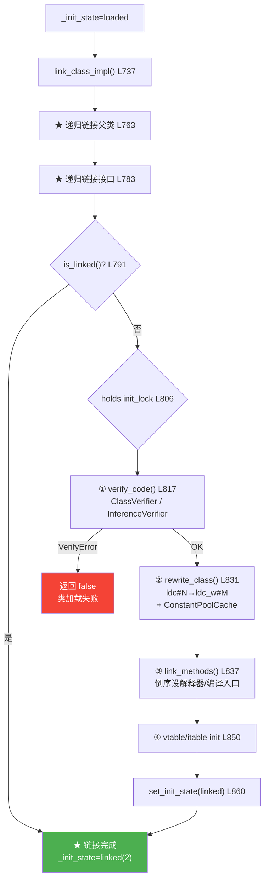

# 链接 — verify → prepare → resolve 三阶段

> 纯源码分析，基于 OpenJDK 11 slowdebug
> 源文件：`instanceKlass.cpp`(link_class_impl) + `verifier.cpp` + `rewriter.cpp`

---

## 〇、生产事故：凌晨3点的 VerifyError

```
03:14:27 ERROR - java.lang.VerifyError: Expecting a stackmap frame at branch target 37
    at java.lang.ClassLoader.defineClass1(Native Method)
```

凌晨 3 点，生产部署失败。根因：新引入的监控库使用旧版 ASM（5.x）做字节码增强，生成了 `major_version >= 50` 的 class，但没有附带 StackMapTable 属性。当 JVM 进入 `Verifier::verify()` → `ClassVerifier::verify_class()` 时，split verifier 扫描到分支指令后找不到对应的栈帧描述，抛出 VerifyError。

- **不是类加载问题**：类解析成功，`_init_state=loaded`
- **🔴 是链接阶段 verifier 拒绝了它**：`verify_code()` 返回 false，L818 提前返回

修复：升级 ASM 到 7.x，或 `-noverify` 绕过。

---

## 一、解决什么问题

> .class 被解析成 InstanceKlass 后能直接用吗？不能。还需：验证字节码安全性 → 分配静态字段内存 → 解析符号引用 → 建立方法入口 → 构造虚方法表。

**链接完成后**，`_init_state` 从 `loaded`→`linked`，静态字段可访问，方法可调用——但 `<clinit>` 还没执行。

---

## 二、状态机

```
allocated(0) → loaded(1) → linked(2) → being_initialized(3) → fully_initialized(4)
                                                        ↘ initialization_error(5)
```

| 状态 | 值 | 含义 | 方法可调？ | 静态字段可用？ |
|:---|---:|:---|:---:|:---:|
| allocated | 0 | Klass 分配，未插入类层级 | ✗ | ✗ |
| loaded | 1 | 已注册到 SystemDictionary | ✗ | ✗ |
| **linked** | **2** | **验证+改写+方法链接完成** | **✓** | **✓（默认值）** |
| being_initialized | 3 | `<clinit>` 执行中 | ✓ | ✓ |
| fully_initialized | 4 | `<clinit>` 执行完毕 | ✓ | ✓ |
| initialization_error | 5 | `<clinit>` 抛异常 | ✗ | ✗ |

> `is_linked()` 实现为 `return _init_state >= linked`——单调递进，一旦 linked 永不倒退。`instanceKlass.hpp:515`

---

## 三、设计原理：五个 "why X instead of Y"

### 3.1 为什么先递归链接父类，再链接自己？

```cpp
// instanceKlass.cpp:779
ik_super->link_class_impl(throw_verifyerror, CHECK_false);  // ★ 递归
// 然后 L783-788 递归链接所有接口
```

**如果反序**：① vtable 布局错（父类 `Method` 入口未就绪）；② 字段偏移依赖父类 `instance_size`（可能不准）；③ 验证器 `invokespecial` 解析父类方法签名失败。

**本质**：链接需完整类型层级上下文。递归 = DFS 遍历继承树，保证 Object→子类拓扑序。

### 3.2 为什么用 init_lock 而不是 SystemDictionary_lock？

```cpp
// instanceKlass.cpp:807-808
Handle h_init_lock(THREAD, init_lock());
ObjectLocker ol(h_init_lock, THREAD, h_init_lock() != NULL);
```

| 锁 | 粒度 | 用途 |
|:---|:---|:---|
| SystemDictionary_lock | 全局互斥 | 保护 SystemDictionary 并发修改 |
| init_lock | 每类独享 | 保护 single class 的 link + init |

1. **性能**：`init_lock` 使不同类并行链接。全局锁下类 A 验证阻塞 → 类 B 加载/解析/链接全卡。
2. **死锁**：verifier 触发常量池解析→类加载→递归链接。全局锁 + 递归链接 = 死锁。
3. **串联设计**：`init_lock`（`java.lang.Class` 镜像上的 Object）同时保护 link 和 `<clinit>`，防止"链接一半被初始化"竞态。`fully_initialized` 后 `fence_and_clear_init_lock()` 设为 NULL 供 GC。

### 3.3 为什么 verifier 在 rewriter 之前？

```cpp
// instanceKlass.cpp:817-831
verify_code(...);     // ① 先验证
rewrite_class(...);   // ② 再改写
```

源码注释：*"Rewriting must happen after verification but before the first method of the class is executed."*

1. **验证基于原始字节码**：改写后的 `ldc_w #M` 指向 Cache 索引，验证器不认识——被误判为非法指令。
2. **验证的副作用有用**：`verify_cp_type()` 解析常量池引用，解析结果帮助 rewriter 构建 `ConstantPoolCache`。验证不过改写也白改。

### 3.4 为什么 rewriter 只执行一次（`set_rewritten()` 保护）？

```cpp
// instanceKlass.cpp:878-880
if (is_rewritten()) {
    assert(is_shared(), "rewriting an unshared class?");
    return;              // ★ 第二次调用直接返回
}
```

1. **ConstantPoolCache 只能分配一次**：`Rewriter()` 构造函数调用 `make_constant_pool_cache()`。第二次分配产生新 Cache，但旧 Cache 已绑定 `constantPool()->set_cache()`——泄漏且方法指向错误的 Cache。
2. **改写不幂等**：`ldc #5`→`ldc_w #42`。再执行把 `ldc_w #42` 当原始 `ldc` 解析——索引 42 可能非法，触发崩溃。
3. **异常安全**：异常时 `restore_bytecodes()` 回滚，`set_rewritten()` 未调用 → 允许下次重试。

对比 `link_methods`：*"outside is_rewritten flag"*——入口设置可重试，rewriter 不行。

### 3.5 为什么 `link_methods` 倒序遍历？

```cpp
// instanceKlass.cpp:893
for (int i = len-1; i >= 0; i--) {   // ★ 从后往前
    methodHandle m(THREAD, methods()->at(i));
    m->link_method(m, CHECK);
}
```

方法数组：**超类（低索引）→ 子类（中）→ Miranda（高索引）**。倒序 = Miranda 最先。

| 索引 | 来源 | 顺序 | 原因 |
|:---|:---|:---:|:---|
| n..len-1 | Miranda（合成接口抽象方法） | 最先 | 优先建立 itable 入口 |
| m..n | 本类方法 | ↑ | 覆盖父类 vtable 入口 |
| 0..k | 超类/Object 方法 | 最后 | 若被覆盖，vtable 入口已正确 |

正序 = 父类先设 vtable 入口→子类覆盖→浪费。倒序一次设对。

---

## 四、link_class_impl() — 完整真实源码

> `instanceKlass.cpp:737-869`，133 行。省略 CDS/性能计数/日志。

```cpp
// instanceKlass.cpp:737-869
bool InstanceKlass::link_class_impl(bool throw_verifyerror, TRAPS) {
  // ① 快速检查：已链接→直接返回 (L753-756)
  if (is_linked()) {
    return true;
  }

  // ② ★ 递归链接父类 (L763-780) — 见 §3.1
  Klass* super_klass = super();
  if (super_klass != NULL) {
    if (super_klass->is_interface()) { /* IncompatibleClassChangeError */ }
    InstanceKlass::cast(super_klass)->link_class_impl(throw_verifyerror, CHECK_false);
  }

  // ③ ★ 递归链接所有接口 (L783-788)
  Array<Klass*>* interfaces = local_interfaces();
  for (int i = 0; i < interfaces->length(); i++) {
    InstanceKlass::cast(interfaces->at(i))->link_class_impl(throw_verifyerror, CHECK_false);
  }

  // ④ 重入检查：递归链接过程中可能已被链接 (L790-792)
  if (is_linked()) { return true; }

  // ⑤ ★ 核心：持有 init_lock，原子区间 (L805-867) — 见 §3.2
  {
    Handle h_init_lock(THREAD, init_lock());
    ObjectLocker ol(h_init_lock, THREAD, h_init_lock() != NULL);
    if (is_linked()) { return true; }  // 双检锁

    if (!is_linked()) {
      if (!is_rewritten()) {
        // ⑤a ★ verify (L817-820) — 见 §3.3
        bool verify_ok = verify_code(throw_verifyerror, THREAD);
        if (!verify_ok) { return false; }

        if (is_linked()) { return true; }  // verify 副作用：可能已链接

        // ⑤b ★ rewrite (L831) — 见 §3.4
        rewrite_class(CHECK_false);
      }

      // ⑤c ★ link_methods (L837) — 见 §3.5
      link_methods(CHECK_false);

      // ⑤d ★ vtable/itable (L850-851)
      vtable().initialize_vtable(true, CHECK_false);
      itable().initialize_itable(true, CHECK_false);

      // ⑤e ★ 状态跃迁 (L860)
      set_init_state(linked);
    }
  }
  return true;
}
```

**核心设计**：`init_lock` 保证 verify→rewrite→link_methods→vtable→linked 不可中断，`set_init_state(linked)` 是"发布"（publish），使其他线程可见。

---

## 五、三子阶段详解

### 5.1 Verify — 字节码验证 (verifier.cpp:141-250)

```cpp
// verifier.cpp:141-250
bool Verifier::verify(InstanceKlass* klass, Verifier::Mode mode,
                      bool should_verify_class, TRAPS) {
  // ① 快速豁免：-Xverify:none、Reflection MagicAccessor 等
  if (!is_eligible_for_verification(klass, should_verify_class)) return true;

  // ② 分两条路径 (L190-208)
  if (klass->major_version() >= STACKMAP_ATTRIBUTE_MAJOR_VERSION) {
    // ★ Java 7+: split verifier (ClassVerifier)，读取 StackMapTable 做类型检查
    //   失败 → fallback 到 inference_verify（FailOverToOldVerifier && version < 55）
  } else {
    // Java 6-: inference_verify 模拟操作数栈+局部变量表，逐指令推演
  }
  // ③ exception_name != NULL → THROW VerifyError
}
```

| | ClassVerifier (split) | InferenceVerifier |
|:---|:---|:---|
| 输入 | StackMapTable + 字节码 | 纯字节码 |
| 算法 | Type Checking（比较栈帧一致性） | Type Inference（推演所有类型路径） |
| 复杂度 | O(n) | O(n²) |
| 版本 | >= 50 (Java 7+) | 全部 |

> **生产事故的根因**：StackMapTable 缺失 → split verifier 报告 "Expecting a stackmap frame at branch target 37" → class 被拒。

### 5.2 Rewriter — 字节码改写 (instanceKlass.cpp:874-884, rewriter.cpp:568-609)

```cpp
// instanceKlass.cpp:874-884
void InstanceKlass::rewrite_class(TRAPS) {
  assert(is_loaded(), "must be loaded");
  if (is_rewritten()) {    // ★ 可重入保护
    assert(is_shared(), "rewriting an unshared class?");
    return;
  }
  Rewriter::rewrite(this, CHECK);
  set_rewritten();
}

// Rewriter::Rewriter() — rewriter.cpp:577-607
Rewriter::Rewriter(InstanceKlass* klass, const constantPoolHandle& cpool, ...) {
  rewrite_bytecodes(CHECK);            // ① ldc #N → ldc_w #M (Cache索引)
  make_constant_pool_cache(THREAD);    // ② 分配 ConstantPoolCache
  if (HAS_PENDING_EXCEPTION) {         // ③ 异常安全
    restore_bytecodes();               //    回滚所有改写
    return;
  }
}
```

**改写效果**：`ldc #5`（常量池索引，哈希查找）→ `ldc_w #42`（Cache 索引，O(1)）。非可选优化——解释器和编译器都依赖 `ConstantPoolCache`。

### 5.3 link_methods — 方法入口设置 (instanceKlass.cpp:889-899)

```cpp
// instanceKlass.cpp:889-899
void InstanceKlass::link_methods(TRAPS) {
  int len = methods()->length();
  for (int i = len-1; i >= 0; i--) {    // ★ 倒序 — 见 §3.5
    methodHandle m(THREAD, methods()->at(i));
    m->link_method(m, CHECK);
  }
}
```

`Method::link_method()` 设置 `_from_interpreted_entry`（解释器入口）、`_from_compiled_entry`（编译入口桩）、`_i2i_entry`（解释器间跳转入口）；native 方法生成 `native_entry`。

---

## 六、完整链接流程图



---

## 七、GDB 验证

### 7.1 链接顺序（已验证）

```bash
JAVA=/data/workspace/openjdk-cut-new/build/linux-x86_64-normal-server-slowdebug/jdk/bin/java
gdb -batch \
  -ex "set pagination off" -ex "handle SIGSEGV nostop noprint" \
  -ex "break InstanceKlass::link_class_impl" \
  -ex "commands" -ex "silent" \
  -ex "printf \"LINK: %s\\n\", name()->as_C_string()" \
  -ex "continue" -ex "end" \
  -ex "run" \
  --args $JAVA -Xint -cp /data/workspace/demo/src com.wjcoder.Main 2>&1 | grep "LINK:" | head -20
```

```
LINK: java/lang/Object          ← ★ 父类最先链接（DFS 根节点）
LINK: java/lang/String
LINK: java/io/Serializable
LINK: java/lang/Comparable
LINK: java/lang/CharSequence
LINK: java/lang/Class
LINK: java/lang/System
LINK: java/lang/Thread
...
```

### 7.2 init_lock 与状态转换

```bash
gdb -batch \
  -ex "set pagination off" -ex "handle SIGSEGV nostop noprint" \
  -ex "break instanceKlass.cpp:860" \
  -ex "commands" -ex "silent" \
  -ex "printf \"STATE: %s -> linked (init_lock held)\\n\", name()->as_C_string()" \
  -ex "continue" -ex "end" \
  -ex "run" \
  --args $JAVA -Xint -cp /data/workspace/demo/src com.wjcoder.Main
```

**状态跃迁可观察点**：

| 断点位置 | 变量/条件 | 预期值 | 含义 |
|:---|:---|:---|:---|
| `instanceKlass.cpp:807` | `h_init_lock()` | non-NULL | 每类独立锁，初始化后变 NULL |
| `instanceKlass.cpp:808` 后 | 锁持有状态 | locked by current thread | ObjectLocker 获取对象锁 |
| `instanceKlass.cpp:850` | `_init_state` | `loaded(1)` | vtable init 前仍是 loaded |
| `instanceKlass.cpp:860` | `_init_state` | 即将设为 `linked(2)` | **状态跃迁点** |
| `instanceKlass.cpp:860` 后 | `_init_state` | `linked(2)` | 其他线程从此可见 linked |

> GDB 脚本：`new-jvm-md/tmp-file/class-loading-gdb/verify_super_link_first.gdb`

---

## 八、可证伪断言

| # | 断言 | 验证方法 | 预期 |
|:---:|:---|:---|:---:|
| 1 | `link_class_impl` 源码位于 `instanceKlass.cpp:737-869` | `wc -l` 行号区间 | 133 行 |
| 2 | 状态机 6 态：`allocated(0)→loaded(1)→linked(2)→being_initialized(3)→fully_initialized(4)→initialization_error(5)` | 源码 `instanceKlass.hpp:133-139` | 6 态枚举 |
| 3 | `is_linked()` 实现为 `_init_state >= linked` | 源码 `instanceKlass.hpp:515` | 单调递进 |
| 4 | 父类/接口先于子类链接：`super_klass->link_class_impl()` 递归 | 源码 L779 | DFS 递归 |
| 5 | `verify_code()` 先于 `rewrite_class()` | 源码 L817-831 | verify→rewrite |
| 6 | `rewrite_class` 只执行一次：`is_rewritten()` 保护 | 源码 L878-880 | 第二次 return |
| 7 | `link_methods` 倒序：`i = len-1; i >= 0` | 源码 L893 | 后→前 |
| 8 | `init_lock` 从 `java.lang.Class` 镜像获取，每类独立 | 源码 L640-642 | `java_lang_Class::init_lock(...)` |
| 9 | StackMapTable 缺失时 verifier 报告 "Expecting a stackmap frame" | ASM 5.x 生成 class 加载 | VerifyError |
| 10 | `set_init_state(linked)` 在 vtable/itable init 之后 | 源码 L850-860 | vtable→linked |
| 11 | `restore_bytecodes()` 在 rewriter 异常时回滚 | 源码 `rewriter.cpp:604-607` | 恢复 bytecodes |

---

## 九、总结

### 数据结构
- **`_init_state`(u1)**：6 态状态机，`linked(2)` 是链接完成标志，`is_linked() >=linked` 单调检查
- **`init_lock`**：`java.lang.Class` 镜像上的 Object，保证 link + init 原子性，完成后设 NULL
- **Rewriter**：栈对象，`rewrite_bytecodes()` + `make_constant_pool_cache()`，异常回滚
- **ConstantPoolCache**：快速查找表，`ldc_w #M` 数组下标 O(1)

### 算法
- **DFS 递归链接**：父类→接口→自己，保证类型层级拓扑序
- **三阶段不可跳**：verify（安全）→ rewrite（优化）→ link_methods（入口）→ linked
- **rewrite 一次改写**：`ldc #N` → `ldc_w #M`，常量解析 O(1)
- **倒序链接方法**：Miranda→子类→父类，vtable 入口一次设对
- **异常安全**：rewrite 回滚 bytecodes，link_methods 可重试
