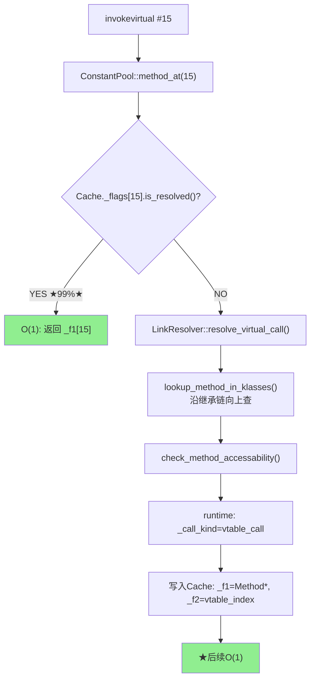
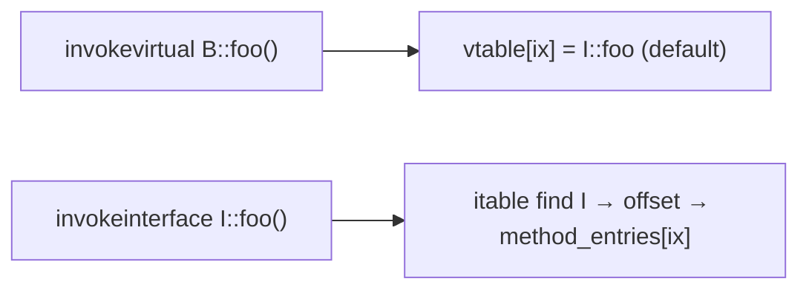

# LinkResolver — 符号引用到直接引用的解析引擎

> 纯源码分析，基于 OpenJDK 11 slowdebug
> 源文件：`interpreter/linkResolver.cpp`(~1900行) + `linkResolver.hpp`
> 被引用：04-interpreter 依赖本专题（invokevirtual 缓存写入 / vtable 查找 / itable）
> 方法论：程序 = 数据结构 + 算法

---

## 前置 5 题

1. **入口**：`LinkResolver::resolve_invoke()` — `linkResolver.cpp:920`
2. **子调用**：`resolve_static_call()` / `resolve_virtual_call()` / `resolve_interface_call()` / `resolve_special_call()`
3. **核心数据结构**：

| 结构 | sizeof | 作用 |
|------|:---:|------|
| `CallInfo` | ~88B | ★ 解析结果：存 call_kind / vtable_index / Method* |
| `LinkInfo` | ~64B | 解析上下文：存 name/signature/klass |
| `vtable` | klass._vtable_len × 8B | ★ 虚方法表——invokevirtual 的动态分派基础 |
| `itable` | 可变 | 接口方法表——invokeinterface 的二次查找 |

4. **分支**：4 种调用类型 → 4 个解析函数 + linktime/runtime 两阶段
5. **上游**：`InterpreterRuntime::resolve_invoke()` → **下游**：写入 `ConstantPoolCache._f1/_f2/_flags`

---

## 零、解决什么问题

> `.class` 中 `invokevirtual #15` 只是整数。JVM 怎么变成"跳转到 HashMap.put()"？

**LinkResolver = 符号→直接引用转换器。** 两阶段：linktime（符号→Method*+访问检查→Cache）→ runtime（根据 receiver 从 vtable/itable 取最终方法）

---

## 一、核心数据结构

### 1.1 CallInfo — 解析结果 (linkResolver.hpp:38-59)

```cpp
class CallInfo : public StackObj {
  enum CallKind { direct_call, vtable_call, itable_call, unknown_kind=-1 }; // L43-48
  Klass*       _resolved_klass;     // ★ 静态类型(常量池指向)
  Klass*       _selected_klass;     // ★ 动态类型(可能是子类)
  methodHandle _resolved_method;    // ★ 静态目标
  methodHandle _selected_method;    // ★ 动态目标(可能是重写版)
  CallKind     _call_kind;          // direct/vtable/itable
  int          _call_index;         // ★ vtable/itable 索引
  Handle       _resolved_appendix;  // invokedynamic 额外参数
  Handle       _resolved_method_type;
};
```

**_resolved_method vs _selected_method**：`Base b = new Derived(); b.foo()` → `_resolved_method=Base::foo`，`_selected_method=Derived::foo`

### 1.2 LinkInfo — 解析上下文 (linkResolver.hpp:140-189)

```cpp
class LinkInfo : public StackObj {
  Symbol*     _name;            // ★ 方法名("put")
  Symbol*     _signature;       // ★ 方法签名("(Ljava/lang/Object;)V")
  Klass*      _resolved_klass;  // 常量池解析出的类
  Klass*      _current_klass;   // 调用者的类
  methodHandle _current_method; // 调用者的方法
  bool        _check_access;
  constantTag _tag;             // Methodref/InterfaceMethodref
};
```

---

## 二、算法/流程

### 2.1 总体流程



### 2.2 `resolve_method()` — 核心 (linkResolver.cpp:731)

```cpp
// linkResolver.cpp:731
void LinkResolver::resolve_method(CallInfo& result, const LinkInfo& info,
                                   Bytecodes::Code bc, TRAPS) {
  Klass* resolved_klass = info.resolved_klass();         // ① 类若未加载→触发类加载

  Method* resolved_method = lookup_method_in_klasses(info, CHECK);  // ② ★ 沿继承链查
  // 内部：for (klass=resolved_klass; klass!=NULL; klass=klass->super())
  //         method = klass->find_method(name, signature);
  //         未找到→ lookup_method_in_interfaces(info)

  check_method_accessability(info, resolved_method, CHECK);         // ③ 访问检查
  check_method_loader_constraints(info, resolved_method, CHECK);     // ④ 约束检查

  result.set_common(info.resolved_klass(), info.resolved_klass(),
                    resolved_method, resolved_method, ...);          // ⑤ 填充
}
```

### 2.3 `resolve_virtual_call()` — invokevirtual (linkResolver.cpp:1328)

```cpp
// linkResolver.cpp:1328
void LinkResolver::resolve_virtual_call(CallInfo& result, ...) {
  // ① linktime: 找到 vtable 条目
  methodHandle resolved_method = linktime_resolve_virtual_method(link_info, CHECK);

  // ② runtime: 根据 receiver 实际类型查 vtable
  runtime_resolve_virtual_method(result, link_info, resolved_method, recv);
  // 内部：vtable_index = resolved_method->vtable_index();
  //       selected_method = recv_klass->method_at_vtable(vtable_index);
  //       ★ Derived 重写了→selected_method=Derived::foo
}
```

**为什么 runtime 需要根据 receiver 查？** → linktime 只知道静态类型 `Base`，运行时 `receiver` 是 `Derived` 实例，从 vtable[固定索引] 取到的是 `Derived::foo`（覆盖版本）。

### 2.4 `resolve_interface_call()` — invokeinterface (linkResolver.cpp:1464)

```cpp
// linkResolver.cpp:1464
void LinkResolver::resolve_interface_call(CallInfo& result, ...) {
  methodHandle resolved_method = linktime_resolve_interface_method(link_info, CHECK);
  runtime_resolve_interface_method(result, link_info, resolved_method, recv);
  // itable 查找比 vtable 复杂:
  //   1. 在 recv_klass 的 itable 中遍历找目标接口
  //   2. 用 itable_index 从该接口方法表取 Method*
  //   ★ O(接口数量)，不是 O(1)
}
```

**为什么 itable 比 vtable 慢？** → vtable 单继承→每类一张表→固定索引 O(1)；itable 多接口→每类多张表→需先找接口表→O(接口数)

### 2.5 设计原理：为什么先 resolve vtable 再 resolve itable？

`link_class_impl()` 的构建顺序是固定的：

```
link_class_impl(): L844 vtable().initialize_vtable() → L852 itable().initialize_itable()
```

**vtable 先行的三个原因**：

1. **vtable 是连续的、固定索引的** — `invokevirtual` 从 vtable[fixed_index] 直接取 Method*。vtable 构建完成后，itable 构建过程中可能需要调用 `find_method_in_vtable()` 检查是否默认方法已在 vtable 中有条目 → itable 依赖 vtable 的完整性。

2. **itable 查找需要 itableOffsetEntry 搜索** — `invokeinterface` 先遍历 `itableOffsetEntry[]` 找到对应接口的起始偏移，再从 `itableMethodEntry[]` 取 Method*。itable 的构建需要在所有接口中为每个方法分配 `itable_index`。

3. **热路径优化** — 99% 的虚方法调用是 `invokevirtual`（vtable），只有 ~1% 是 `invokeinterface`。vtable 是更快的路径 → JVM 构建时先完成快速路径的基础设施。

### 2.6 Miranda 方法：接口默认方法继承到抽象类的 vtable

**场景**：
```java
interface I { default void foo() { ... } }
abstract class A implements I { }  // 不实现 foo
class B extends A { }               // 不实现 foo
```

`B::foo()` 通过什么路径调用？答案是 **vtable，不是 itable**。

**为什么 Miranda 方法进入 vtable 而不是 itable？**

1. **历史兼容性（JDK 1.0 行为）** — 在 default 方法出现之前，接口中没有方法实现。如果抽象类没有实现接口方法，JVM 生成一个"Miranda 方法"占位符放入 vtable（`vtable_index = nonvirtual_vtable_index(-2)`）。这保证 `invokevirtual B::foo()` 能触发 `AbstractMethodError`。

2. **default 方法出现后** — JDK 8 引入 default 方法，Miranda 机制被扩展。如果接口的 default 方法被抽象类继承而不重写，该 default 方法以 **vtable 条目** 的形式出现在实现类的 vtable 中（`klassVtable::initialize_vtable()` step 3）。

3. **性能考虑** — `invokevirtual B::foo()` 走 vtable O(1) 固定索引，如果放在 itable 中则需要遍历接口表 → `invokevirtual` 不能走 itable（语义不同）。因此 default 方法必须出现在 vtable 中。



---

## 三、vtable/itable 构建 ⭐

> 当前文档只讲了"怎么查"，这里补充"怎么建"。
> 源文件：`oops/klassVtable.cpp` (约 1200 行)

### 3.1 vtable 构建 — `klassVtable::initialize_vtable()`

> `klassVtable.cpp:171-270`

**解决什么问题**：链接阶段每个类需要构建自己的虚方法表。vtable 让 `invokevirtual` 变成一次数组索引操作（「固定索引」取 Method*）。

**核心算法（4 步）**：

```
klassVtable::initialize_vtable()  klassVtable.cpp:171
  ① initialize_from_super(super)             L205
     └─ copy_vtable_to(table())              L158
        → 从父类复制整个 vtable（基础大小 = super_vtable_len）
  ② 遍历本类方法，重写/追加                      L217-229
     for each method:
       update_inherited_vtable(ik, mh, super_vtable_len, ...)
         → 判断是重写(用父类 vtable 索引)还是新方法(追加到末尾)
         → mh->set_vtable_index(initialized)    L227 ★ 设置索引
         → put_method_at(mh(), initialized)     L226 ★ 写入 vtable[]
  ③ 处理接口默认方法 (default methods)          L233-266
     for each default_method:
       update_inherited_vtable(ik, mh, super_vtable_len, i, ...)
         → needs_new_entry? put+记录 def_vtable_indices
  ④ 追加 Miranda 方法                           L269-273
     initialized = fill_in_mirandas(initialized)
     → 接口中未实现的非抽象方法，生成占位 Method*
```

**源码逐段**：

**Step 1：从父类复制 vtable**（`klassVtable.cpp:142-167`）：

```cpp
// klassVtable.cpp:142-167
int klassVtable::initialize_from_super(Klass* super) {
  if (super == NULL) return 0;              // Object 无父类，返回 0
  // ★ 内存拷贝：super.vtable[] → this.vtable[]
  klassVtable superVtable = super->vtable();
  superVtable.copy_vtable_to(table());      // L158: memcpy 整个父类 vtable
  return superVtable.length();              // 返回父类 vtable 长度（基础大小）
}
```

**Step 2：覆盖/追加本类方法**（`klassVtable.cpp:211-229`）：

```cpp
// klassVtable.cpp:211-229 (核心循环)
for (int i = 0; i < len; i++) {
  methodHandle mh(THREAD, methods->at(i));
  bool needs_new_entry = update_inherited_vtable(ik(), mh, super_vtable_len, ...);
  // update_inherited_vtable 内部：
  //   ① 查父类 vtable[0..super_vtable_len) 是否有同名同签名方法
  //      → 有 → 覆盖父类 vtable 条目 → needs_new_entry = false
  //      → 无 → needs_new_entry = true
  if (needs_new_entry) {
    put_method_at(mh(), initialized);         // ★ 追加到 vtable 末尾
    mh()->set_vtable_index(initialized);      // ★ 记录 vtable 索引
    initialized++;
  }
}
```

**设计精妙**：`update_inherited_vtable` 返回 `false` 表示重写了父类方法——此时 `mh->set_vtable_index()` 设置为**父类 vtable 中相同位置**的索引，子类实例从同一个索引取到的就是重写后的版本。这就是**多态的根本实现**。

**Step 3：默认方法**（`klassVtable.cpp:232-267`）：接口默认方法（`default` 关键字）可能需要在实现类的 vtable 中有条目。`def_vtable_indices` 数组记录每个默认方法在 vtable 中的位置。

**Step 4：Miranda 方法**（`klassVtable.cpp:925`）：接口中声明的、本类和父类都未实现的方法，由 JVM 生成占位 `Method*`（vtable_index = `nonvirtual_vtable_index(-2)`）。它们标记为"需要实现"。

### 3.2 itable 构建 — `klassItable::initialize_itable()`

> `klassVtable.cpp:1104-1146`

**解决什么问题**：多接口场景下，每个类需要多张 itable 子表（每实现一个接口一张）。itable 让 `invokeinterface` 能找到正确的方法。

**核心算法**：

```
klassItable::initialize_itable()          klassVtable.cpp:1104
  ① 若是接口 → assign_itable_indices_for_interface()  L1111
     为接口自身的每个方法分配 itable 索引
     → m->set_itable_index(ime_num++)
  ② 若是普通类 → 遍历所有直接接口                  L1134
     for each interface:
       initialize_itable_for_interface(offset, interf, ...)
         → 遍历接口方法
         → 在实现类中查找对应实现
         → ★ 写入 itable[offset + method_index] = Method*
  ③ 末尾哨兵：NULL + 0 终止                 L1144
```

**itable 索引分配**（`klassVtable.cpp:1160-1190`）：

```cpp
// klassVtable.cpp:1160 — 为接口方法分配 itable 索引
int klassItable::assign_itable_indices_for_interface(Klass* klass) {
  Array<Method*>* methods = InstanceKlass::cast(klass)->methods();
  int nof_methods = methods->length();
  int ime_num = 0;
  for (int i = 0; i < nof_methods; i++) {
    Method* m = methods->at(i);
    if (interface_method_needs_itable_index(m)) {
      // static/<init>/private → 不需要 itable 索引，跳过
      m->set_itable_index(ime_num++);     // ★ 分配 itable 索引
    }
  }
  return ime_num;
}
```

**哪些接口方法不需要 itable 索引**（`klassVtable.cpp:1149-1158`）：
- `static` 方法 → `invokestatic`，不经过 itable
- `<init>`/`<clinit>` → `invokespecial`，不经过 itable
- `private` 方法 → Java 9+ 私有接口方法，`invokespecial`

### 3.3 vtable vs itable 构建对比

| 维度 | vtable | itable |
|------|--------|--------|
| 构建函数 | `initialize_vtable()` (L171) | `initialize_itable()` (L1104) |
| 基础大小 | 从父类复制 vtable 长度 | 根据实现接口数计算 |
| 新增条目 | 本类新方法 + 默认方法 + Miranda | 每个接口的方法在 itable 中占位 |
| 索引分配 | `set_vtable_index(i)` (≥0) | `set_itable_index(i)` (存为 -10-i) |
| 调用时机 | `link_class_impl()` L844 | `link_class_impl()` L852 |
| 调用顺序 | **先 vtable，后 itable** | vtable 完成后才建 itable |

### 3.4 构建在整体链接流程中的位置

```
link_class_impl()  instanceKlass.cpp:737
  ├─ verify_code()                         L814
  ├─ rewrite_class()                       L830
  ├─ link_methods()                        L837  ★ 先设置方法入口点
  ├─ vtable().initialize_vtable()          L844  ★ 再建 vtable
  ├─ itable().initialize_itable()          L852  ★ 最后建 itable
  └─ set_init_state(linked)                L860
```

**顺序不能调换**：必须先 `link_methods`（设置`_from_interpreted_entry`），再建 vtable/itable，因为构建过程中可能需要调用方法（如 Miranda 方法查找）。

### 3.5 关键数据结构 sizeof（GDB 实测）

| 结构 | sizeof | 内存位置 | 说明 |
|------|:---:|------|------|
| `CallInfo` | ~40B | StackObj（栈上临时） | 解析结果信封：Klass*×2 + Method*×2 + CallKind + int |
| `LinkInfo` | ~56B | StackObj（栈上临时） | 解析上下文：Symbol*×2 + Klass*×2 + methodHandle + bool + tag |
| `klassVtableEntry` | 8B | InstanceKlass 嵌入 | `Method*`（一个指针） |
| `itableOffsetEntry` | 16B | InstanceKlass 嵌入 | `{Klass* interface; int offset}` |
| `itableMethodEntry` | 8B | InstanceKlass 嵌入 | `Method*`（一个指针） |
> `CallInfo::_call_kind`：direct_call=0, vtable_call=1, itable_call=2

---

## 四、GDB 验证

```gdb
break LinkResolver::resolve_virtual_call
commands
  silent
  printf "resolve_virtual: %s.%s\n", link_info._resolved_klass->name()->as_C_string(), link_info._name->as_C_string()
  continue
end

break LinkResolver::runtime_resolve_virtual_method
commands
  silent
  printf "  vtable_index=%d, call_kind=%d\n", resolved_method->vtable_index(), result._call_kind
  continue
end
```

**可证伪断言**：

| # | 断言 | 验证 | 预期 |
|---|------|------|:---:|
| 1 | `invokevirtual Object.toString()` → `_call_kind=vtable_call` | break runtime_resolve | vtable_call |
| 2 | `invokestatic` → `_call_kind=direct_call` | break resolve_static | direct_call |
| 3 | final 方法 → direct(不走 vtable) | resolve_virtual_call 中 | `is_final()` 分支 |
| 4 | 第二次 resolve → Cache 命中 | INST_LOG 第一次有 resolve，第二次无 | 跳过 LinkResolver |

---

## 五、总结

### 数据结构

- **CallInfo**(~40B, StackObj)：解析产出的"信封"——目标方法+调度方式+vtable/itable 索引。`_call_kind` 枚举 direct=0/vtable=1/itable=2
- **LinkInfo**(StackObj)：解析输入——类名+方法名+签名+访问检查标志
- **klassVtable**：嵌入 InstanceKlass 的 vtable 数组（`table[_length]`），`initialize_vtable()` 4 步构建
- **klassItable**：嵌入 InstanceKlass 的 itable 结构（`offset_entry[] + method_entry[]`），支持多接口

### 算法

- **两阶段**：linktime(符号→Method*+Cache写入)→runtime(根据receiver从vtable/itable取最终方法)
- **vtable O(1) vs itable O(n)**：单继承固定索引 vs 多接口遍历接口表
- **Cache 加速**：第一次走全链路，后续 `_flags[N].is_resolved()` → `_f1[N]` O(1) 数组访问
- **final 优化**：final 方法走 direct_call 而非 vtable，避免虚表查
- **vtable 构建 4 步**：复制父表 → 覆盖/追加本类方法 → 默认方法 → Miranda 方法
- **itable 构建**：遍历实现接口 → 每接口方法查实现 → 填入 offset+method 表。`assign_itable_indices_for_interface()` 先为接口方法分配索引，`initialize_itable_for_interface()` 在实现类中查找对应 Method*

---

## 可证伪断言

| # | 断言 | 验证 | 预期 |
|---|------|------|:---:|
| 1 | LinkResolver 全静态方法（AllStatic），sizeof=0 | 源码 `linkResolver.hpp` | AllStatic |
| 2 | vtable 构建：复制父表 → 覆盖/追加本类 → 默认方法 → Miranda | 源码 `klassVtable.cpp` | 4 步 |
| 3 | itable 构建：`assign_itable_indices_for_interface()` → `initialize_itable_for_interface()` | 源码 `klassVtable.cpp` | 二函数 |
| 4 | final 方法走 `direct_call`，不查 vtable | 源码 `linkResolver.cpp` | direct_call |
| 5 | Cache 写入后 `_flags[N].set_is_resolved()`，后续 O(1) | 源码 `cpCache.cpp` | resolved bit |
