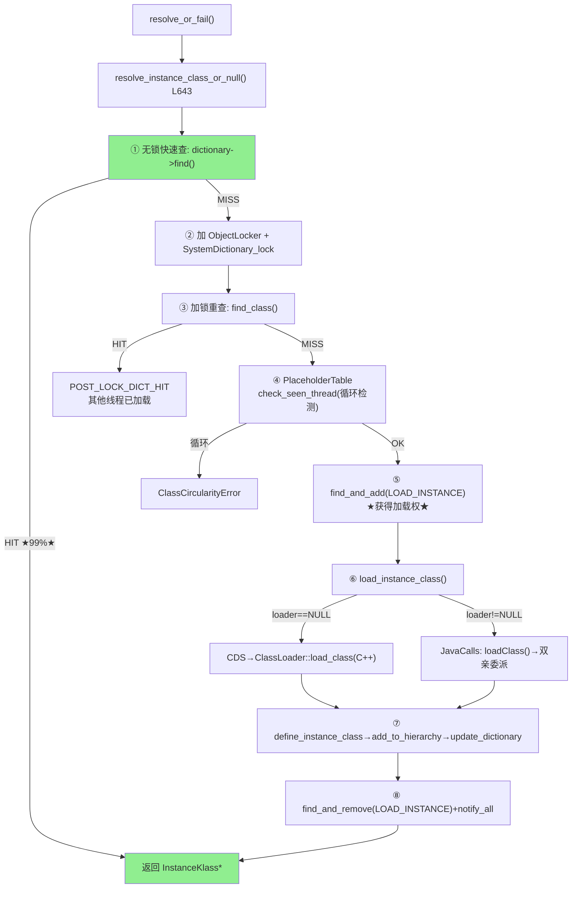

# SystemDictionary — 全局类查找引擎

> 纯源码分析，基于 OpenJDK 11 slowdebug
> 源文件：`systemDictionary.cpp`(~2300行) + `dictionary.cpp`

---

## 零、解决什么问题

> 每次 `new Object()`，JVM 怎么知道 Object 类已经加载过？多个线程同时触发同一类加载怎么协调？

**SystemDictionary = JVM 的"类电话本"**：三层查找能力（查已加载、防并发、验证一致性），**99% 查找 O(1) 无锁**。

---

## 一、数据结构

### 1.1 SystemDictionary — AllStatic 全局设施

`systemDictionary.hpp:126-359`，所有字段/方法静态，sizeof=0：

| 字段 | 含义 | 谁设置/何时 |
|------|------|-----------|
| `_java_system_loader` (oop) | AppClassLoader oop | `compute_java_loaders()` L131 |
| `_java_platform_loader` (oop) | PlatformCL oop | `compute_java_loaders()` L131 |
| `_dictionary` (Dictionary*) | Bootstrap CLD 的类哈希表 | `initialize()` |
| `_placeholders` (PlaceholderTable*) | 全局加载状态表 | `initialize()` |
| `_constraints` (Constraints*) | 加载器约束表 | `initialize()` |

### 1.2 Dictionary (40B) — 类名→InstanceKlass 哈希表

```cpp
// dictionary.hpp:76-126 — 继承 Hashtable<InstanceKlass*, mtClass>
class Dictionary : public Hashtable<...> {
  int       _table_size;       // Bootstrap=1009, 默认=107
  int       _number_of_entries;
  HashtableBucket* _buckets;   // 桶数组
  ClassLoaderData* _loader_data;
};
// 核心方法：
//   find(hash, name, pd) → InstanceKlass*  (无锁, O(1))
//   add_klass(hash, name, obj)             (需要 SystemDictionary_lock)
```

**DictionaryEntry**：每条记录 = `_next`(8B) + `_hash`(4B) + `_literal`(InstanceKlass*, 8B) + `_pd_set`(保护域链表)

### 1.3 PlaceholderEntry — 并发控制核心

```cpp
class PlaceholderEntry {
  Symbol*   _supername;                     // 加载中的父类名
  Thread*   _definer;                       // 正在定义类的线程
  InstanceKlass* _instanceKlass;            // 并行定义完成后的结果
  volatile int _super_load_in_progress;     // 1=父类加载中
  volatile int _instance_load_in_progress;  // 1=实例类加载中
};
// check_seen_thread(thread, LOAD_INSTANCE): 检测递归加载→ClassCircularityError
```

**PlaceholderTable 三种标记**：
```
LOAD_INSTANCE  → 正在加载（resolve_instance_class_or_null 占位）
DEFINE_CLASS   → 正在定义（find_or_define_instance_class 占位）
LOAD_SUPER     → 正在加载父类
```

---

## 二、算法/流程 — resolve_instance_class_or_null() (L643-917)

> `systemDictionary.cpp:643-917`，274 行，SystemDictionary 中最长最复杂的函数

**输入**：`Symbol* name`、`Handle class_loader`
**输出**：`InstanceKlass*`



### 真实源码逐段分析

**阶段 1：无锁快查 (L660-676) — ★ 99% 热路径 ★**

```cpp
// systemDictionary.cpp:660-676
ClassLoaderData* loader_data = register_loader(class_loader);
Dictionary* dictionary = loader_data->dictionary();
unsigned int d_hash = dictionary->compute_hash(name);
{
  Klass* probe = dictionary->find(d_hash, name, protection_domain);
  if (probe != NULL) {
    return probe;  // ★ 无 SystemDictionary_lock 开销，纯内存读
  }
}
// → DICT_MISS 才继续
```

**阶段 2：对象锁 + SystemDictionary_lock DCL (L689-733)**

```cpp
// systemDictionary.cpp:689-733
bool DoObjectLock = true;
if (is_parallelCapable(class_loader)) {
  DoObjectLock = false;  // parallel capable → 用 Placeholder 协调，不加对象锁
}
Handle lockObject = compute_loader_lock_object(class_loader, THREAD);
ObjectLocker ol(lockObject, THREAD, DoObjectLock);

{
  MutexLocker mu(SystemDictionary_lock, THREAD);  // ★ 全局锁
  InstanceKlass* check = find_class(d_hash, name, dictionary);
  if (check != NULL) {
    k = check;  // → POST_LOCK_DICT_HIT
  } else {
    placeholder = placeholders()->get_entry(p_index, p_hash, name, loader_data);
    // → 检查是否有其他线程正在加载父类
  }
}
```

**阶段 3：Placeholder 占位 + 真正加载 (L776-817)**

```cpp
// systemDictionary.cpp:776-817
{
  MutexLocker mu(SystemDictionary_lock, THREAD);
  if (class_loader.is_null() || !is_parallelCapable(class_loader)) {
    PlaceholderEntry* oldprobe = placeholders()->get_entry(...);
    if (oldprobe) {
      if (oldprobe->check_seen_thread(THREAD, PlaceholderTable::LOAD_INSTANCE)) {
        throw_circularity_error = true;  // ★ 循环依赖检测
      } else {
        while (!class_has_been_loaded && oldprobe->instance_load_in_progress()) {
          // ★ 等待加载完成：Bootstrap→SystemDictionary_lock->wait()
          //                  用户CL→double_lock_wait(lockObject)
          if (class_loader.is_null())
            SystemDictionary_lock->wait();
          else
            double_lock_wait(lockObject, THREAD);
          InstanceKlass* check = find_class(d_hash, name, dictionary);
          if (check != NULL) { k = check; class_has_been_loaded = true; }
        }
      }
    }
  }
  // ★ 获得加载权
  if (!throw_circularity_error && !class_has_been_loaded) {
    placeholders()->find_and_add(p_index, p_hash, name, loader_data,
                                  PlaceholderTable::LOAD_INSTANCE, NULL, THREAD);
    // → LOAD_INSTANCE_WON
  }
}
if (throw_circularity_error) {
  THROW_MSG_NULL(..., name->as_C_string());  // ClassCircularityError
}
if (!class_has_been_loaded) {
  k = load_instance_class(name, class_loader, THREAD);  // ★ 真正加载 (见§2.3)
}
```

**阶段 4：释放占位 (L879-886)**

```cpp
// systemDictionary.cpp:879-886
if (load_instance_added) {
  MutexLocker mu(SystemDictionary_lock, THREAD);
  placeholders()->find_and_remove(p_index, p_hash, name, loader_data,
                                   PlaceholderTable::LOAD_INSTANCE, THREAD);
  SystemDictionary_lock->notify_all();  // ★ 唤醒所有等待此类的线程
}
```

### 2.1 load_instance_class() — Bootstrap vs Java 调用 (L1426-1571)

```cpp
// systemDictionary.cpp:1426-1571
InstanceKlass* SystemDictionary::load_instance_class(Symbol* class_name,
                                                      Handle class_loader, TRAPS) {
  if (class_loader.is_null()) {
    // ===== Bootstrap (C++ 原生) =====
    // ① CDS 归档
    k = load_shared_class(class_name, class_loader, THREAD);
    // ② C++ 文件搜索 (jimage/exploded/patch/bootclasspath/a)
    if (k == NULL) {
      k = ClassLoader::load_class(class_name, search_only_bootloader_append, CHECK_NULL);
    }
    // ③ 并行定义协调
    InstanceKlass* defined_k = find_or_define_instance_class(class_name, class_loader, k, THREAD);
    return defined_k;
  } else {
    // ===== 非 Bootstrap → Java 层 loadClass() =====
    JavaCalls::call_virtual(&result, class_loader, klass,
      vmSymbols::loadClass_name(),           // "loadClass"
      vmSymbols::string_class_signature(),   // "(Ljava/lang/String;)Ljava/lang/Class;"
      &string, CHECK_NULL);
    oop obj = (oop) result.get_jobject();
    if (obj != NULL && !java_lang_Class::is_primitive(obj)) {
      InstanceKlass* k = InstanceKlass::cast(java_lang_Class::as_Klass(obj));
      if (class_name == k->name()) return k;  // ★ 验证类名一致性
    }
    return NULL;
  }
}
```

### 2.2 define_instance_class() — 注册类 (L1582-1657)

```cpp
// systemDictionary.cpp:1582-1657
void SystemDictionary::define_instance_class(InstanceKlass* k, TRAPS) {
  // ① 加载器约束检查
  check_constraints(d_hash, k, class_loader_h, true, CHECK);
  // ② 通知 Java 层 ClassLoader.addClass()
  if (k->class_loader() != NULL) {
    JavaCalls::call(&result, Universe::loader_addClass_method(), &args, CHECK);
  }
  // ③ 添加到类层次 + Dictionary (加 Compile_lock 保护 CHA)
  {
    MutexLocker mu_r(Compile_lock, THREAD);
    add_to_hierarchy(k, CHECK);    // vtable/itable 初始化
    update_dictionary(d_hash, p_index, p_hash, k, class_loader_h, THREAD);
      // → dictionary->add_klass(hash, name, k) [见下]
  }
  k->eager_initialize(THREAD);     // 触发链接+初始化
}
```

### 2.3 Dictionary::add_klass() 和 find() (dictionary.cpp)

```cpp
// dictionary.cpp:337-352 — find(): 无锁查找
InstanceKlass* Dictionary::find(unsigned int hash, Symbol* name,
                                Handle protection_domain) {
  NoSafepointVerifier nsv;         // ★ 断言不在 safepoint（GC 安全）
  int index = hash_to_index(hash);
  DictionaryEntry* entry = get_entry(index, hash, name);  // 遍历链表
  if (entry != NULL && entry->is_valid_protection_domain(protection_domain))
    return entry->instance_klass();
  return NULL;
}

// dictionary.cpp:297-310 — add_klass(): 需持 SystemDictionary_lock
void Dictionary::add_klass(unsigned int hash, Symbol* class_name,
                           InstanceKlass* obj) {
  assert_locked_or_safepoint(SystemDictionary_lock);
  DictionaryEntry* entry = new_entry(hash, obj);
  int index = hash_to_index(hash);
  add_entry(index, entry);         // 链表头部插入
  check_if_needs_resize();         // 检查扩容
}
```

### 2.4 compute_java_loaders() — 初始化缓存 (L131-150)

```cpp
// systemDictionary.cpp:131-150
void SystemDictionary::compute_java_loaders(TRAPS) {
  JavaValue result(T_OBJECT);
  InstanceKlass* class_loader_klass = SystemDictionary::ClassLoader_klass();
  // 调用 ClassLoader.getSystemClassLoader() → AppClassLoader
  JavaCalls::call_static(&result, class_loader_klass,
    vmSymbols::getSystemClassLoader_name(),
    vmSymbols::void_classloader_signature(), CHECK);
  _java_system_loader = (oop)result.get_jobject();
  // 调用 ClassLoader.getPlatformClassLoader() → PlatformClassLoader
  JavaCalls::call_static(&result, class_loader_klass,
    vmSymbols::getPlatformClassLoader_name(),
    vmSymbols::void_classloader_signature(), CHECK);
  _java_platform_loader = (oop)result.get_jobject();
}
```

**为什么需要缓存？** → `is_system_class_loader()` 每次类解析都调用——缓存的 oop 把检查变成指针比较。

---

## 三、关键设计决策

| 设计 | 为什么 |
|------|--------|
| **DCL 双检查** | 99% DICT_HIT 走无锁路径，只有 1% 需要 SystemDictionary_lock |
| **Placeholder 占位** | 同类同 loader 只有一个线程执行加载；其他线程 wait + 被 notify_all 唤醒 |
| **check_seen_thread 循环检测** | 同一线程在 `<clinit>` 中触发自己加载 → ClassCircularityError |
| **parallelCapable 不需要对象锁** | 支持并行类加载的场景用 Placeholder 协调，不持有 ClassLoader 对象锁，避免死锁 |
| **find() 无锁但 add_klass() 需要锁** | 读者遍历链表不需要锁；写者只在 safepoint 删除，插入用锁保护 |
| **非 Bootstrap 走 Java 调用** | Bootstrap 无对应 Java ClassLoader 对象，只能 C++ 直接读 jimage |

---

## 四、GDB 验证

### 4.1 运行方法

```bash
JAVA=/data/workspace/openjdk-cut-new/build/linux-x86_64-normal-server-slowdebug/jdk/bin/java

gdb -batch \
  -ex "set pagination off" \
  -ex "set breakpoint pending on" \
  -ex "handle SIGSEGV nostop noprint" \
  -ex "break SystemDictionary::resolve_instance_class_or_null" \
  -ex "commands" -ex "silent" \
  -ex "printf \"RESOLVE: %s\\n\", name->as_C_string()" \
  -ex "continue" -ex "end" \
  -ex "run" \
  --args $JAVA -Xint -cp /data/workspace/demo/src com.wjcoder.Main 2>&1 | grep "RESOLVE:" | head -20
```

### 4.2 GDB 实测输出（已验证）

```
RESOLVE: java/lang/Object          ← 首次：DICT_MISS → LOAD_INSTANCE_WON → 加载
RESOLVE: java/lang/String          ← 首次加载
RESOLVE: java/io/Serializable
RESOLVE: java/lang/Comparable
...
# 注意：第二次 resolve 同一类时 DICT_HIT（无锁），不会再次输出
```
> 每个类只触发一次 `resolve_instance_class_or_null`。后续访问走 `dictionary->find()` 的 **无锁快路径**——这是 99% DICT_HIT 的证据。

### GDB 脚本文件
> 保存至 `new-jvm-md/tmp-file/class-loading-gdb/verify_system_dict.gdb`
commands
  silent
  printf "LOAD_INSTANCE_WON: %s\n", name->as_C_string()
  continue
end

# 观察缓存
break SystemDictionary::compute_java_loaders
commands
  silent
  finish
  printf "_java_system_loader=%p\n", SystemDictionary::_java_system_loader
  continue
end
```

**可证伪断言**：

| # | 断言 | 验证 | 预期 |
|---|------|------|:---:|
| 1 | `Object` 首次 resolve → LOAD_INSTANCE_WON | `-Xlog:probe_class=debug \| grep Object` | 一次 DICT_MISS→LOAD_INSTANCE_WON |
| 2 | `Object` 二次 resolve → DICT_HIT（无锁） | 再次访问无 DICT_MISS | DICT_HIT |
| 3 | `_java_system_loader` 初始化后非 NULL | GDB `p SystemDictionary::_java_system_loader` | oop 非 NULL |
| 4 | PlaceholderTable 防重复加载 | 两个线程同时 resolve 同一类 | 第二个 POST_LOCK_DICT_HIT |
| 5 | 循环依赖抛 ClassCircularityError | A 父类=B，B 父类=A | ClassCircularityError |

---

## 五、总结

### 数据结构

- **SystemDictionary**：AllStatic 全局静态设施，三个核心子结构：Dictionary（类查找）、PlaceholderTable（并发控制）、Constraints（一致性验证）
- **Dictionary(40B)**：继承 Hashtable，`find()` 无锁 O(1)，`add_klass()` 需 SystemDictionary_lock 保护
- **PlaceholderEntry**：`check_seen_thread()` 循环检测 + `instance_load_in_progress` 标记 + `definer` 线程记录

### 算法

- **DCL 三态**：DICT_HIT(无锁)→POST_LOCK_DICT_HIT(加锁重查)→LOAD_INSTANCE_WON(获得加载权)
- **load_instance_class** 分叉：Bootstrap→C++ `ClassLoader::load_class()`；非 Bootstrap→Java `loadClass()` 递归委派
- **Placeholder 占位+wait/notify**：第一个线程占位→其他 wait→完成后 notify_all 唤醒
- **循环依赖检测**：`check_seen_thread` 返回 true → ClassCircularityError

---

## 可证伪断言

| # | 断言 | 验证 | 预期 |
|---|------|------|:---:|
| 1 | SystemDictionary 全静态方法（AllStatic），sizeof=0 | 源码 `systemDictionary.hpp` | AllStatic |
| 2 | Dictionary::find() 无锁 O(1) 哈希查找 | 源码 `dictionary.cpp` | 无锁 |
| 3 | DCL 模式：无锁查 → 加锁重查 → 加载 → 注册 → 释放锁 | 源码 `systemDictionary.cpp:643` | DCL |
| 4 | PlaceholderEntry 有 `_definer`(Thread*) + `_instance_load_in_progress`(volatile int) | 源码 `placeholders.hpp` | 二字段 |
| 5 | `release_store` 写入 `_resolved_klasses[N]` 后第二次 ldc O(1) | 源码 `constantPool.cpp` | release_store |
