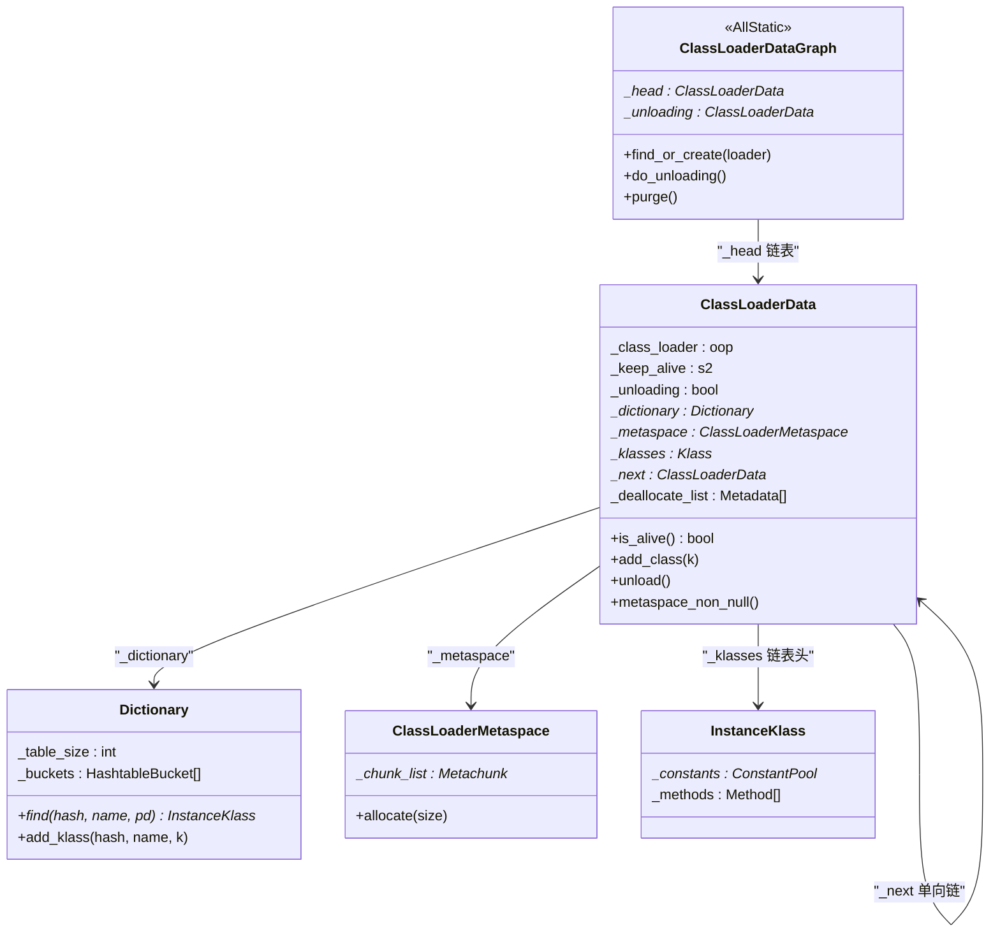
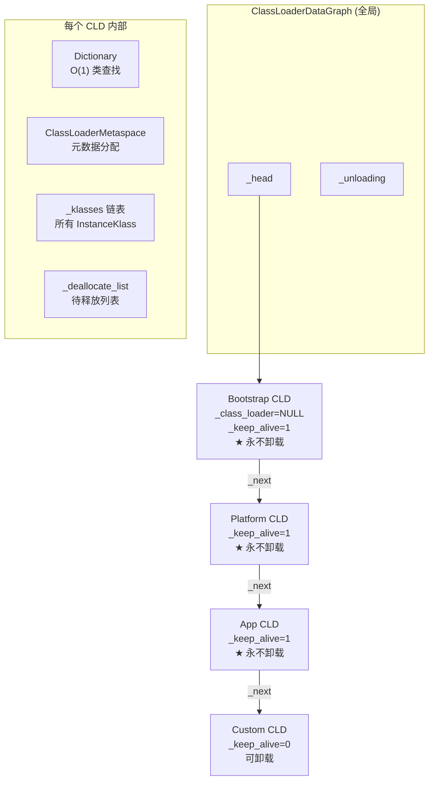

# ClassLoaderData — 类加载器隔离容器

> 纯源码分析，基于 OpenJDK 11 slowdebug
> 源文件：`classLoaderData.cpp` + `classLoaderData.hpp` + `classLoaderDataGraph.cpp`
> 方法论：程序 = 数据结构 + 算法

---

## 前置 5 题

1. **入口**：`ClassLoaderData` 构造函数 `classLoaderData.cpp:207`
2. **核心数据结构**：

| 结构 | sizeof(GDB) | 作用 |
|------|:---:|------|
| `ClassLoaderData` | 168B ✅(01) | 每个 ClassLoader 的数据容器 |
| `ClassLoaderDataGraph` | 0 (AllStatic) | 全局 CLD 链表管理 |
| `Dictionary` | 40B ✅(01) | 类名→InstanceKlass 哈希表 |
| `ClassLoaderMetaspace` | ~100B | Metaspace 分配器 |

3. **关键字段回顾** (01 专题已分析，此处重新总结与本文档相关的生命周期)：
   - `_class_loader`(oop)：标识 ClassLoader，NULL=Bootstrap
   - `_dictionary`(Dictionary*)：每个 CLD 独立的类查找表
   - `_metaspace`(ClassLoaderMetaspace*)：按需延迟分配的元空间
   - `_next`(ClassLoaderData*)：全局链表指针
   - `_keep_alive`(s2)：>0 表示永不被 GC
   - `_unloading`(bool)：标记为正在卸载
   - `_holder`(WeakHandle)：弱引用，用于判断 ClassLoader 是否存活
4. **分支**：Bootstrap CLD（`_class_loader=NULL`, `_keep_alive=1`, 永不被 GC）vs 用户 CLD
5. **上游**：ClassLoader 创建时 → **下游**：GC 类卸载

---

## 零、解决什么问题

> Tomcat 有 100 个 WebApp，每个 WebApp 有自己的 ClassLoader。JVM 怎么保证 A 的类不影响 B？WebApp 卸载时怎么回收它加载的所有类？

**ClassLoaderData = 隔离边界 + 卸载单元。** 每个 ClassLoader 有一个 CLD：
- **命名空间隔离**：每个 CLD 有独立 `Dictionary`，A 和 B 各自看到各自的 `com.Foo`
- **类卸载单元**：WebApp 卸载 → 对应 CLD 标记 `_unloading=true` → GC 回收对应 Metaspace
- **全局链表**：`ClassLoaderDataGraph::_head` 串起所有 CLD，GC 遍历此链表找到活类

---

## 一、数据结构全景

### 1.1 ClassLoaderData 完整字段 (classLoaderData.hpp:180-427)

```cpp
// classLoaderData.hpp:180-427
class ClassLoaderData : public CHeapObj<mtClass> {
  // ========== 生命周期控制 ==========
  static ClassLoaderData* _the_null_class_loader_data; // ★ Bootstrap 的 CLD 单例
  WeakHandle<vm_class_loader_data> _holder;  // L223: 弱引用→检测 ClassLoader 是否存活
  OopHandle _class_loader;                   // L224: ★ java/lang/ClassLoader 实例，NULL=Bootstrap
  s2 _keep_alive;                            // L237: >0=永不被GC（Bootstrap/匿名/Platform/App=1）
  bool _unloading;                           // L230: 卸载标志
  bool _is_anonymous;                        // L231: 匿名类标记

  // ========== 数据容器 ==========
  ClassLoaderMetaspace* volatile _metaspace; // L227: ★ 元空间分配器（延迟分配）
  Mutex* _metaspace_lock;                    // L229: 元空间分配锁
  Dictionary* _dictionary;                   // L254: ★ 类名→Klass 哈希表
  Klass* volatile _klasses;                  // L250: ★ 该类加载器加载的类链表头
  PackageEntryTable* volatile _packages;     // L251: 包入口表
  ModuleEntryTable* volatile _modules;       // L252: 模块表
  ModuleEntry* _unnamed_module;              // L253: 未命名模块

  // ========== 资源管理 ==========
  ChunkedHandleList _handles;                // L245: Oop 句柄链表
  JNIMethodBlock* _jmethod_ids;              // L259: JNI 方法 ID
  GrowableArray<Metadata*>* _deallocate_list; // L263: ★ 延迟释放列表（GC 安全）

  // ========== 链表 ==========
  ClassLoaderData* _next;                    // L266: ★ 全局 CLD 链表中的下一个

  // ========== 辅助 ==========
  Klass* _class_loader_klass;                // L268: ClassLoader 自身的 Klass
  Symbol* _name;                             // L269: 类加载器名
  Symbol* _name_and_id;                      // L270: 名称+ID（日志用）
  volatile int _claimed;                      // L242: GC 遍历时的标记
  bool _modified_oops;                       // L234: GC 修改标记
  bool _accumulated_modified_oops;           // L235
};
```

**sizeof(ClassLoaderData) = 168B** (GDB 实测，含所有字段 + 对齐填充)

### 1.2 关键字段生命周期追踪

**_class_loader (oop)**:
```
谁设置？ → 构造函数 L226: _class_loader = _handles.add(h_class_loader())
何时？   → ClassLoader 对象创建时（JNI/JVM 内部）
什么值？ → Bootstrap=NULL, Platform/App/Custom=对应的 ClassLoader oop
谁读取？ → is_alive() 判断存活、resolve 时判断加载路径、GC 遍历
何时清空？ → 析构函数 ~ClassLoaderData() 中 _handles 链表释放
```

**_dictionary (Dictionary*)**:
```
谁创建？ → create_dictionary() L717
何时？   → 构造函数 L253: !is_anonymous() 时创建
值域？   → Bootstrap=1009 slot 可扩容, System=1009, 默认=107
哈希大小 → _boot_loader_dictionary_size=1009, _default_loader_dictionary_size=107
谁读取？ → SystemDictionary::resolve 时 find() 查类
何时释放？ → 析构函数 L808: delete _dictionary
```

**_keep_alive (s2)**:
```
初始值 → L212: (is_anonymous || h_class_loader.is_null()) ? 1 : 0
         → Bootstrap CLD = 1, 匿名 CLD = 1, 用户 CLD = 0
运行时 → inc_keep_alive() L365（匿名类解析时 +1）
       → dec_keep_alive() L372（匿名类解析完成后 -1）
is_alive() → L754: keep_alive() || (_holder.peek() != NULL)
```

**_metaspace (ClassLoaderMetaspace*)**:
```
谁创建？ → metaspace_non_null() L355（延迟分配，首次 allocate() 时触发）
何时？   → 首次有类需要在该 CLD 的 Metaspace 中分配内存时
谁读取？ → 所有 InstanceKlass/ConstantPool/Method 的元数据分配
```

### 1.3 ClassLoaderDataGraph — 全局链表管理器

```cpp
// classLoaderData.hpp:68-176
class ClassLoaderDataGraph : public AllStatic {
  static ClassLoaderData* _head;              // L76: ★ 全局 CLD 链表头
  static ClassLoaderData* _unloading;         // L77: ★ 正在卸载的 CLD 链表
  static bool _should_purge;                  // L81
  static bool _metaspace_oom;                 // L84
  
  // 核心方法：
  static ClassLoaderData* find_or_create(Handle class_loader); // 查找或创建 CLD
  static bool do_unloading(bool clean_previous_versions);      // ★ 类卸载入口
  static void purge();                                         // ★ 清理 dead CLD
};
```

### 1.4 数据结构关系图



---

## 二、算法/流程分析

### 2.1 构造函数 — CLD 创建 (L207-259)

> `classLoaderData.cpp:207-259`

**解决什么问题**：当 JVM 首次遇到一个新 ClassLoader 时，创建对应的 CLD。

```cpp
// classLoaderData.cpp:207-259
ClassLoaderData::ClassLoaderData(Handle h_class_loader, bool is_anonymous) :
    _is_anonymous(is_anonymous),
    _keep_alive((is_anonymous || h_class_loader.is_null()) ? 1 : 0),  // L212
    _metaspace(NULL), _unloading(false), _klasses(NULL),                // L214
    _modules(NULL), _packages(NULL), _unnamed_module(NULL), _dictionary(NULL), // L215
    _claimed(0), _modified_oops(true), _accumulated_modified_oops(false),
    _jmethod_ids(NULL), _handles(), _deallocate_list(NULL),
    _next(NULL), _class_loader_klass(NULL), _name(NULL), _name_and_id(NULL),
    _metaspace_lock(new Mutex(...)) {                                   // L223
  // ① 存储 ClassLoader oop 引用
  if (!h_class_loader.is_null()) {
    _class_loader = _handles.add(h_class_loader());    // L227
    _class_loader_klass = h_class_loader->klass();      // L228
  }
  // ② 初始化 holder（弱引用 → 检测 ClassLoader 是否存活）
  if (!is_anonymous) {
    initialize_holder(h_class_loader);                   // L234
    _packages = new PackageEntryTable(109);              // L242
    if (h_class_loader.is_null()) {
      _unnamed_module = ModuleEntry::create_boot_unnamed_module(this); // L245
    } else {
      _unnamed_module = ModuleEntry::create_unnamed_module(this);      // L248
    }
    _dictionary = create_dictionary();                   // L253 ★ 创建类字典
  }
  // ③ 加入全局链表头部
  _next = ClassLoaderDataGraph::_head;                   // ClassLoaderDataGraph::add()
  ClassLoaderDataGraph::_head = this;
}
```

**Dictionary 大小决策** (L717-737)：
```cpp
// classLoaderData.cpp:717-737
Dictionary* ClassLoaderData::create_dictionary() {
  int size;
  if (_the_null_class_loader_data == NULL) {
    size = _boot_loader_dictionary_size;  // = 1009 ★ Bootstrap
  } else if (is_system_class_loader_data()) {
    size = _boot_loader_dictionary_size;  // = 1009 ★ AppCL (加载的类也多)
  } else {
    size = _default_loader_dictionary_size; // = 107 ★ 自定义 CL
  }
  return new Dictionary(this, size, resizable);
}
```

**为什么 Bootstrap 和 App CLD 用 1009 而自定义 CLD 用 107？**
- Bootstrap 加载 ~2000 个 JDK 内部类，需要大哈希表避免链表过长
- 自定义 CLD 通常只加载几十个类，107 足够

### 2.2 is_alive() — 存活判定 (L754-759)

> `classLoaderData.cpp:754-759`

```cpp
// classLoaderData.cpp:754-759
bool ClassLoaderData::is_alive() const {
  bool alive = keep_alive()         // ★ Bootstrap/Platform/App/匿名 = true，永不被 GC
      || (_holder.peek() != NULL);  // ★ 弱引用还活着 → ClassLoader 对象还可达
  return alive;
}
```

**`keep_alive()` → `_keep_alive > 0`**

| CLD 类型 | `_keep_alive` 值 | `keep_alive()` | 可卸载？ |
|----------|:---:|:---:|:---:|
| Bootstrap (null CLD) | 1 | true | ❌ 永不卸载 |
| Platform CLD | 1 | true | ❌ 永不卸载 |
| App CLD (System) | 1 | true | ❌ 永不卸载 |
| 匿名 CLD | 1 | true | ❌ 永不卸载 |
| 自定义 CLD | 0 | false | ✅ `_holder.peek()` 判断 |

**`_holder` 的弱引用机制**：
- `_holder` 是 `WeakHandle` → 当 ClassLoader Java 对象被 GC 标记为垃圾时，`_holder.peek()` 返回 NULL
- 此时 `is_alive() = false` → `do_unloading()` 中标记为 dead

### 2.3 unload() — 标记卸载 (L670-692)

> `classLoaderData.cpp:670-692`

```cpp
// classLoaderData.cpp:670-692
void ClassLoaderData::unload() {
  _unloading = true;                           // ★ 设置卸载标志
  // ① 释放 deallocate_list 上的 C heap 结构
  unload_deallocate_list();                    // L684
  // ② 通知 JVMTI 类正在卸载
  classes_do(InstanceKlass::notify_unload_class); // L688
  // ③ 通知编译器全局类迭代器
  static_klass_iterator.adjust_saved_class(this); // L691
}
```

### 2.4 `metaspace_non_null()` — 延迟分配 (classLoaderData.hpp:355)

```cpp
// classLoaderData.hpp:355-365 — inline
ClassLoaderMetaspace* ClassLoaderData::metaspace_non_null() {
  if (_metaspace == NULL) {                    // ★ 延迟创建
    MutexLockerEx ml(_metaspace_lock, Mutex::_no_safepoint_check_flag);
    if (_metaspace != NULL) return _metaspace; // DCL 二次检查
    // 创建新的 Metaspace
    _metaspace = new ClassLoaderMetaspace(_metaspace_lock, Metaspace::StandardMetaspaceType);
  }
  return _metaspace;
}
```

**设计决策**：为什么延迟分配？
- Bootstrap CLD：JVM 启动早期立即需要，但其他 CLD 可能很久不用
- 匿名 CLD：可能只加载一个匿名类后就销毁，提前分配 Metaspace 浪费

---

## 三、GDB 验证

```gdb
# 观察 CLD 创建
break ClassLoaderData::ClassLoaderData
commands
  silent
  printf "CLD created: class_loader=%p, keep_alive=%d\n", \
    h_class_loader.is_null()?0:h_class_loader(), _keep_alive
  continue
end

# 查看全局链表
break ClassLoaderDataGraph::do_unloading
commands
  silent
  set $cld = ClassLoaderDataGraph::_head
  while $cld != 0
    printf "CLD: _next=%p, _keep_alive=%d, _unloading=%d\n", \
      $cld->_next, $cld->_keep_alive, $cld->_unloading
    set $cld = $cld->_next
  end
  continue
end
```

**可证伪断言**：

| # | 断言 | 验证 | 预期 |
|---|------|------|:---:|
| 1 | Bootstrap CLD `_keep_alive=1`，`is_alive()=true` | GDB `p ClassLoaderData::_the_null_class_loader_data->_keep_alive` | 1 |
| 2 | `_class_loader=NULL` 表示 Bootstrap | GDB `p /x ClassLoaderDataGraph::_head->_class_loader` | NULL |
| 3 | 自定义 CLD `_keep_alive=0` | 用自定义 ClassLoader 加载，GDB 检查 | 0 |
| 4 | Dictionary 在 `!is_anonymous()` 时创建 | break `create_dictionary` | 非匿名 CLD 创建 |
| 5 | Metaspace 在首次 allocate 时才创建 | break `metaspace_non_null` | 延迟分配触发 |

---

## 四、数据结构关系图



---

## 五、容器/K8s 下的 Metaspace 诊断

> 容器内存限制 ≠ JVM 堆限制：Metaspace 是 native memory，不受 `-Xmx` 管控

### 5.1 Metaspace vs cgroup limit：默认 unlimited 的危险决策链

当 `MaxMetaspaceSize` 未设置（默认值 0 = unlimited），JVM 对 Metaspace 增长无自限。容器环境下，问题更隐蔽——JVM 看不到自己的"容器天花板"：

```
os::physical_memory() → 返回 cgroup memory.limit_in_bytes (例如 1GB)
Metaspace::_reserve_alignment → 基于 GC 策略的分配对齐

Metaspace 增长直到：
  ① MaxMetaspaceSize=0(unlimited) → 不触发 Metadata GC Threshold
  ② Metaspace 持续分配 → _current_chunk += N
  ③ cgroup 总内存: heap + metaspace + codecache + threads + native > limit
  ④ ★ kernel OOM killer 介入 → SIGKILL(exit 137)
     ↑ JVM 不知道自己已接近容器限制！
  ⑤ hs_err_pid*.log 中无 Metaspace OOM 记录
  ⑥ dmesg: "Memory cgroup out of memory: Killed process (java)"
```

**如果 `MaxMetaspaceSize` 被设置** (如 128m)：
```
metaspace_chunk_allocate() → 检查 used+request > MaxMetaspaceSize
  ├─ 是 → 触发 Metadata GC Threshold → Full GC → 尝试回收类元数据
  │        ├─ 回收成功 → 继续分配（老年代 GC 释放了不再需要的 ClassLoaderData）
  │        └─ 回收失败 → 抛出 java.lang.OutOfMemoryError: Metaspace
  │                       → hs_err_pid 有完整栈记录
  └─ 否 → 继续分配
```

### 5.2 两种 OOM 的区分

```
┌── 容器 OOM Kill (kernel, exit 137) ──────────────────────────┐
│ kubectl describe pod → Exit Code: 137                        │
│ dmesg | grep "oom-kill" → comm=java                          │
│ ★ 无 hs_err_pid*.log, 无 GC 日志                             │
│ ★ JVM 没机会抛出 OutOfMemoryError — kernel 直接 SIGKILL       │
│ ★ 原因: Metaspace + heap + codecache + threads > container limit │
└──────────────────────────────────────────────────────────────┘

┌── JVM Metaspace OOM (JVM, exit 1) ──────────────────────────┐
│ hs_err_pid*.log: java.lang.OutOfMemoryError: Metaspace       │
│ GC 日志: Metadata GC Threshold → Full GC                     │
│ jcmd VM.metaspace: Used=256MB, Capacity=256MB, MaxMetaspaceSize=256MB │
│ ★ JVM 知道限额已到, 尝试 GC 后仍不足 → 抛 OOM (不会 SIGKILL)  │
└──────────────────────────────────────────────────────────────┘
```

### 5.3 Metaspace 内存预算公式

```
MaxMetaspaceSize = container_limit - MaxHeapSize - other_native - safety_margin

其中:
  MaxHeapSize = -Xmx 或 MaxRAMPercentage × container_limit（cgroup-aware ergo 计算）
  other_native = ThreadStackSize × thread_count(N) + ReservedCodeCacheSize + GC_overhead(~10-20% of heap)
  safety_margin = 10% container_limit（kernel memory, glibc malloc structs, agent overhead）

示例: 容器 1GB, MaxHeapSize=625MB(62.5%), thread_stack=256KB×200线程=50MB,
       CodeCache=128MB, GC_overhead=100MB, safety=100MB
  → MaxMetaspaceSize = 1000 - 625 - 50 - 128 - 100 - 100 = -3MB ★ 内存预算不足!
  → 必须降低 MaxHeapSize 或减少线程数
  → 安全配置: MaxHeapSize=500MB(50%), MaxMetaspaceSize=128MB, 其他按需下调
```

### 5.4 容器内存预算模型

```
cgroup memory.limit_in_bytes = 1GB
  ├── JVM heap (-Xmx / MaxRAMPercentage):  ~750MB (75%)
  ├── Metaspace (-XX:MaxMetaspaceSize):    默认 unlimited! ★
  ├── CodeCache (-XX:ReservedCodeCacheSize): ~240MB (默认)
  ├── Thread stacks (-Xss × #threads):      ~1MB × 200 = 200MB
  ├── DirectByteBuffer (-XX:MaxDirectMemorySize): 默认 = -Xmx
  ├── JVM native (GC structures, symbol table, NMT):  ~100MB
  └── OS overhead (page cache, shared libs, kernel):  ~50MB
───────────────────────────────────────────────────
  Total = 750 + X + 240 + 200 + 0 + 100 + 50 = 1340MB + X
  → 超 1GB 限制 → kernel OOM killer → SIGKILL(137)
```

**关键**：`MaxMetaspaceSize=unlimited`（默认值）意味着在容器中 JVM 对 Metaspace 增长无自限 —— 动态代理、反射、Spring Bean 初始化生成的元数据会无限占用 native memory，直到 kernel OOM killer 介入。

### 5.5 K8s 诊断路径

```bash
# Step 1: 确定死亡方式
kubectl describe pod <name> | grep "Exit Code"
# Exit Code 137 = OOMKilled (kernel) → 去 Step 2
# Exit Code 1   = JVM OOM         → hs_err_pid*.log 中有明确原因

# Step 2: 查看 kernel OOM 日志
dmesg | grep -A20 "oom-kill.*java"
# 关键行: "oom-kill:constraint=CONSTRAINT_MEMCG" → cgroup 限制触发
# 关键行: "Memory cgroup out of memory: Killed process 12345 (java)"
# 如果不是 cgroup OOM → 宿主机 OOM → 可能是同 Node 其他 Pod 消耗

# Step 3: 确认 Metaspace 使用量
kubectl exec <pod> -- jcmd 1 VM.metaspace
# Used > Capacity×80% → Metaspace 分配压力
# MaxMetaspaceSize = 0 (unlimited) → ★ 危险

# Step 4: 确认哪些类在占 Metaspace
kubectl exec <pod> -- jcmd 1 VM.classloader_stats
# 输出每 CLD 的 Classes 数和字节量
# 找出异常大的 CLD — 通常是动态代理(Dynamic Proxy)或反射生成类
```

### 5.6 安全参数配置

```bash
# 容器 1GB — 安全预算
-XX:MaxRAMPercentage=75.0          # heap = ~750MB
-XX:MaxMetaspaceSize=128m          # ★ 关键: 显式设置, 不要用 unlimited
-XX:ReservedCodeCacheSize=128m     # 降低 CodeCache
-XX:MaxDirectMemorySize=${MAX_DIRECT_MEMORY:-128m}
-Xss256k                            # 线程栈压缩（默认 1MB → 256KB）

# 总预算: 750+128+128+128+40+100+30 = ~1304MB — 仍然可能超 1GB
# 安全余量: MaxRAMPercentage 降至 62.5% (625MB) → ~1180MB total
```

**经验规则**：
- `MaxMetaspaceSize` = `container_limit × 0.1~0.15`（class-heavy app: Spring Boot + Hibernate ≈ 50-100MB baseline + 20% buffer）
- 设置 `MaxMetaspaceSize` 能在接近限额时触发 GC（`Metadata GC Threshold`），而不是被 kernel 杀死
- 不设置 = JVM 不知道 Metaspace 在吃你的容器限额

交叉引用：[01-jvm-startup/19-Container-Cgroup-Support.md](..01-jvm-startup/19-Container-Cgroup-Support.md)（容器资源感知）、[12-Class-Unloading.md §七](12-Class-Unloading.md)（类卸载诊断 jcmd 三板斧）

---

## 六、总结

### 数据结构

- **ClassLoaderData (168B)**：20+ 字段，核心：`_class_loader`(标记身份)、`_dictionary`(类查找表)、`_metaspace`(元空间分配器)、`_keep_alive`(卸载判定)、`_next`(全局链表)
- **ClassLoaderDataGraph**：两个静态链表管理所有 CLD：`_head`(活跃链表) 和 `_unloading`(待清理链表)
- **`_holder`(WeakHandle)**：弱引用机制，当 ClassLoader 对象被 GC 回收后 `_holder.peek()=NULL` → `is_alive()=false`
- **延迟分配**：`_metaspace` 在首次需要时才通过 `metaspace_non_null()` 创建

### 算法

- **CLD 创建时的字典大小策略**：Bootstrap/App=1009 slot（大量类），自定义=107 slot（少量类）
- **is_alive() 双层判断**：`_keep_alive>0` → 永不卸载（Bootstrap/匿名/Platform/App）；否则检查 `_holder` 弱引用
- **unload() 三步走**：标记→释放 deallocate_list→通知 JVMTI
- **链表管理**：新 CLD 插入 `_head` 头部；GC 时从 `_head` 移除 dead CLD → 加入 `_unloading` 链表 → `purge()` 真正释放

---

## 可证伪断言

| # | 断言 | 验证 | 预期 |
|---|------|------|:---:|
| 1 | ClassLoaderData sizeof = 168B（GDB） | GDB `p sizeof(ClassLoaderData)` | 168 |
| 2 | Bootstrap CLD 的 `_class_loader = NULL`, `_keep_alive = 1` | 源码 `classLoaderData.cpp:207` | NULL/1 |
| 3 | `is_alive()` = `_keep_alive > 0 \|\| _holder.peek() != NULL` | 源码 L754-759 | 二条件 |
| 4 | ClassLoaderDataGraph `_head` 链表串起所有 CLD | 源码 `classLoaderDataGraph.hpp` | head |
| 5 | dead CLD 通过 `_unloading` 链表延迟释放（purge 阶段） | 源码 L1440-1529 | unloading |
