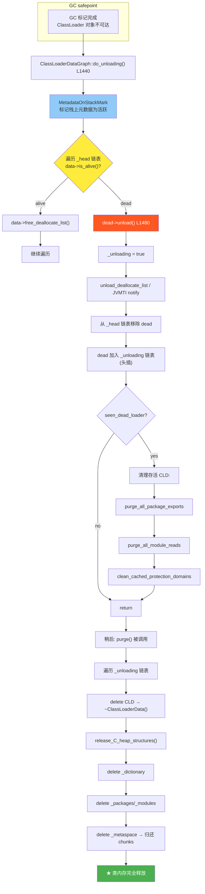

# 类卸载 — CLD mark → Metaspace sweep → Dictionary removal

> 纯源码分析，基于 OpenJDK 11 slowdebug
> 环境：`-Xms8g -Xmx8g -XX:+UseG1GC`
> 源文件：`classLoaderData.cpp`(do_unloading L1440) + `classLoaderData.hpp`(struct L200-289)

---

## 生产故事：3am Metaspace OOM

3am，应用服务器 Metaspace OOM。`jcmd <pid> VM.metaspace`：

```
Total: 1048576 KB  Used: 1003520 KB  Free: 20480 KB
```

GC 日志显示 Full GC 触发但 `loaders removed` 始终为 0：

```
[27.832s][debug][class,loader,data] do_unloading: loaders processed 5, loaders removed 0
```

**根因**：连接池为每个连接 `new URLClassLoader(urls)`，每个 CLD 加载 200+ 类。连接关闭后 CL 对象不可达，但线程局部变量中一个 `PreparedStatement` 实例的类由该 CLD 定义 → CLD 的 `_holder` 仍然非 NULL（klass 间接保持 alive） → `is_alive()` 永远 true → 类卸载永不触发 → Metaspace 只增不减。**修复**：连接归还时 `threadLocal.remove()`。
---

## 前置 5 题

1. **入口**：`SystemDictionary::do_unloading()`(systemDictionary.cpp:1865) → `ClassLoaderDataGraph::do_unloading()`(classLoaderData.cpp:1440)
2. **核心调用链**：

```
GC safepoint → SystemDictionary::do_unloading()
  → ClassLoaderDataGraph::do_unloading()    // Mark 阶段
    → CLD::is_alive()                        // 存活判定
    → CLD::unload()                          // 标记 _unloading=true
    → 从 _head 移除，加入 _unloading 链表
  → ClassLoaderDataGraph::purge()            // Sweep 阶段
    → delete CLD → ~ClassLoaderData()
```

3. **数据结构**：`ClassLoaderData`(~200B)、`ClassLoaderDataGraph`(`_head`/`_unloading` 全局链表)、`Dictionary`
4. **卸载条件**（3 条件必须同时满足）：
   - 非永久 CLD（`is_permanent_class_loader_data() == false`）
   - ClassLoader Java 对象不可达（`_holder.peek() = NULL`）
   - `_keep_alive == 0`
5. **上游**：GC safepoint → **下游**：Metaspace chunk 归还 + Dictionary 删除

---

## 零、解决什么问题
> 自定义 ClassLoader 加载的类何时被释放？JVM 如何知道一个类"不再被使用"？

**类卸载 = GC 在 Metaspace 的版本**。当 CL 对象被 GC 回收后，其 CLD 中所有元数据都应被释放。三步：标记（do_unloading）→ 清理（purge）→ 释放（~ClassLoaderData）。
---

## 一、卸载条件

### 1.1 哪些 CLD 永不卸载？

| CLD 类型 | `_keep_alive` | `is_alive()` | `is_permanent()` | 卸载？ |
|----------|:---:|:---:|:---:|:---:|
| Bootstrap (null) | 1 | true | true | ✅ 永不 |
| Platform | 1 | true | true | ✅ 永不 |
| App (System) | 1 | true | true | ✅ 永不 |
| 匿名类 | ≥1 | true | false | ⚠️ 可卸 |
| 自定义 CL | 0 | `_holder.peek()!=NULL` | false | 取决于 GC |

### 1.2 is_alive() 判定 (classLoaderData.cpp:754-759)

```cpp
bool ClassLoaderData::is_alive() const {
  bool alive = keep_alive()         // _keep_alive > 0 → 内置加载器/匿名类
      || (_holder.peek() != NULL);  // _holder 弱引用 → ClassLoader 对象还活着
  return alive;
}
```

`_holder` 是 `WeakHandle<vm_class_loader_data>`(classLoaderData.hpp:223)。GC 标记阶段 ClassLoader 对象被标记为垃圾 → 弱引用被清理 → `peek()` 返回 NULL → `is_alive() = false`。

---

## 二、设计理由：4 个关键决策

### 2.1 为什么 bootstrap/platform/app CLD 永不卸载？

三部内置加载器是 JVM 的"脊椎骨"。卸载 `java.lang.String` 意味着所有字符串字面量指向已释放的 Klass 指针——任何字符串操作触发 SIGSEGV。卸载 `java.lang.Object` 则整个类型系统崩溃。更深层是**引用密度**：JDK 核心类之间存在海量符号引用、vtable 索引、CP cache。追踪这些引用判断"是否可安全卸载"的工作量堪比一次 Full GC，收益却为零。

策略是**静态判定**：构造时 `_keep_alive = 1`，`is_alive()` 永远短路返回 true，跳过所有追踪。

`// classLoaderData.cpp:878-880`
`bool ClassLoaderData::is_permanent_class_loader_data() const {`
`  return is_builtin_class_loader_data() && !is_anonymous();`
`}`

匿名类是例外——即使由 Bootstrap 定义，其 CLD 也可被卸载（用完即弃的 lambda 代理类）。

### 2.2 为什么分离 mark (do_unloading) 和 sweep (purge)？

`do_unloading()` 在 safepoint 内执行——所有 Java 线程暂停。标记阶段只做轻量操作：`is_alive()` 检查、链表指针更新、`_unloading = true`，O(N) 时间。释放操作 (`delete CLD`) 是重操作：VirtualSpace 的 `munmap`、Dictionary 1009 槽遍历、每个 Klass 的 `release_C_heap_structures()`。放 safepoint 内会显著延长暂停。分离后：safepoint 内快速标记 → safepoint 外真正释放。经典 mark-sweep 模式。

### 2.3 为什么需要 MetadataOnStackMark？

```cpp
// classLoaderData.cpp:1455-1458
bool walk_all_metadata = clean_previous_versions &&
     JvmtiExport::has_redefined_a_class() &&
     InstanceKlass::has_previous_versions_and_reset();
MetadataOnStackMark md_on_stack(walk_all_metadata);
```

场景：线程 A 正在执行属于 dead CLD 的方法 `foo.bar()`。此时 CLD 已标记为 dead，但 Method*/ConstantPool* 仍在栈上——CPU PC 指向该方法的编译代码，栈帧持有 CP 引用。`MetadataOnStackMark` 遍历所有线程栈，标记这些元数据为"活跃"——即使 CLD dead 也不释放。否则 safepoint 恢复后访问已释放内存 → 未定义行为。`walk_all_metadata` 仅在 Full GC + 类重定义 + 存在旧版本时才为 true，避免每次 GC 都跑昂贵的 CodeCache 遍历。

### 2.4 为什么 _holder 用弱引用而不用强引用？

若用强引用：CLD 持有 CL 对象的强引用 → CLD 被 `_head` 全局链表引用 → CL 对象永远可达 → 永不 GC → 类卸载机制完全失效。弱引用让 GC 感知生死：CL 对象无外部强引用 → GC 清理弱引用 → `peek()` 返回 NULL → `is_alive()` false。

### 2.5 为什么 Metaspace 是 chunk 级释放？

Metaspace 用 chunk-based allocation：每个 CLD 申请 MetaChunk，chunk 内部分配给 Klass/CP/Method。若逐对象释放（每个 100-1000B）会产生外部碎片。chunk 整体归还 freelist，下次分配直接复用。卸载 200 个每类 2KB 的类，chunk 方案归还 2-3 个大块而非 200 个小空洞。

---

## 三、算法/流程 — do_unloading() (L1440-1529)

### 阶段 1：准备 + MetadataOnStackMark (L1440-1462)

```cpp
bool ClassLoaderDataGraph::do_unloading(bool clean_previous_versions) {
  ClassLoaderData* data = _head;
  ClassLoaderData* prev = NULL;
  bool seen_dead_loader = false;
  uint loaders_processed = 0, loaders_removed = 0;

  bool walk_all_metadata = clean_previous_versions &&
       JvmtiExport::has_redefined_a_class() &&
       InstanceKlass::has_previous_versions_and_reset();
  MetadataOnStackMark md_on_stack(walk_all_metadata);
  _saved_unloading = _unloading;   // CMS 兼容：保存旧 unloading 链表
```

### 阶段 2：遍历 CLD 链表 (L1464-1493) — ★ 核心

```cpp
  data = _head;
  while (data != NULL) {
    if (data->is_alive()) {               // ★ 存活判定
      if (walk_all_metadata) {
        data->classes_do(InstanceKlass::purge_previous_versions);
      }
      data->free_deallocate_list();       // 释放延迟释放列表
      prev = data;
      data = data->next();
      loaders_processed++;
      continue;                           // 跳过，继续下一个
    }
    // ===== Dead CLD =====
    seen_dead_loader = true;
    loaders_removed++;
    ClassLoaderData* dead = data;
    dead->unload();                       // L1480: ★ 标记 _unloading=true
    data = data->next();

    if (prev != NULL) {
      prev->set_next(data);               // L1486: 从 _head 链表跳过 dead
    } else {
      _head = data;                       // L1489: dead 是链表头，更新 _head
    }

    dead->set_next(_unloading);           // L1491
    _unloading = dead;                    // L1492: 头部插入 _unloading 链表
  }
```

### 阶段 3：清理存活 CLD 中的过期引用 (L1495-1520)

```cpp
  if (seen_dead_loader) {
    data = _head;
    while (data != NULL) {
      if (data->packages() != NULL)
        data->packages()->purge_all_package_exports();          // ① 过期包导出
      if (data->modules_defined())
        data->modules()->purge_all_module_reads();              // ② 过期模块读取
      if (data->dictionary() != NULL)
        data->dictionary()->clean_cached_protection_domains();  // ③ 过期保护域
      data = data->next();
    }
  }
  return seen_dead_loader;
}
```

### 3.1 ClassLoaderData::unload() (L670-692)

```cpp
void ClassLoaderData::unload() {
  _unloading = true;                                // ★ 核心标志
  unload_deallocate_list();                         // 释放失败/重复类的 C heap
  classes_do(InstanceKlass::notify_unload_class);   // 通知 JVMTI
  static_klass_iterator.adjust_saved_class(this);   // 通知编译器
}
```

### 3.2 purge() (L1531-1545) + ~ClassLoaderData() (L782-849)

```cpp
void ClassLoaderDataGraph::purge() {
  ClassLoaderData* list = _unloading;
  _unloading = NULL;
  ClassLoaderData* next = list;
  while (next != NULL) {
    ClassLoaderData* purge_me = next;
    next = purge_me->next();
    delete purge_me;  // ★ → ~ClassLoaderData()
  }
}

ClassLoaderData::~ClassLoaderData() {
  ReleaseKlassClosure cl; classes_do(&cl);  // ① 释放所有 Klass C heap 结构
  _holder.release();                        // ② 释放弱引用
  if (_packages)    { delete _packages;    _packages = NULL;    }  // ③
  if (_modules)     { delete _modules;     _modules = NULL;     }  // ④
  if (_dictionary)  { delete _dictionary;  _dictionary = NULL;  }  // ⑤ ★
  if (_unnamed_module) { _unnamed_module->delete_unnamed_module(); }  // ⑥
  ClassLoaderMetaspace *m = _metaspace;
  if (m) { _metaspace = NULL; delete m; }  // ⑦ ★ chunk 归还全局 freelist
  if (_jmethod_ids) Method::clear_jmethod_ids(this);  // ⑧ 清除 JNI method ID
  delete _metaspace_lock;                                // ⑨
  if (_deallocate_list) delete _deallocate_list;         // ⑩
}
```

---

## 四、完整卸载流程 Mermaid 图



---

## 五、GDB 验证 — 完整调试会话

环境：`java -Xms512m -Xmx512m -XX:+UseG1GC -Xlog:class+loader+data=debug ClassLeakDemo`
测试程序创建 3 个 URLClassLoader，各加载 ~200 类，然后置 null + `System.gc()`。

### Session 1: do_unloading — 遍历 _head 链表 + is_alive 判定

```gdb
(gdb) break ClassLoaderDataGraph::do_unloading
Breakpoint 1 at classLoaderData.cpp:1440

(gdb) continue
1440    ClassLoaderData* data = _head;
1464    data = _head;

(gdb) print data->_keep_alive
$1 = 1
(gdb) print (char*)data->_name->body()
$2 = 0x7ffff003a010 "bootstrap"           # ★ Bootstrap CLD: _keep_alive=1

(gdb) print data->next()->_keep_alive
$3 = 1
(gdb) print (char*)data->next()->_name->body()
$4 = 0x7ffff004b030 "platform"            # ★ Platform CLD: _keep_alive=1

(gdb) print data->next()->next()->_keep_alive
$5 = 1
(gdb) print (char*)data->next()->next()->_name->body()
$6 = 0x7ffff0062030 "app"                 # ★ App CLD: _keep_alive=1

(gdb) print data->next()->next()->next()->_keep_alive
$7 = 0
(gdb) print (char*)data->next()->next()->next()->_name->body()
$8 = 0x7ffff00b0010 "com.example.CustomLoader@0x..."
# ★ 自定义 CLD: _keep_alive=0 → 可被卸载

# === is_alive 判定 ===
(gdb) break ClassLoaderData::is_alive
Breakpoint 2 at classLoaderData.cpp:754

# 前 3 次命中均为永久 CLD，_keep_alive=1 短路返回 true
(gdb) continue; continue; continue

# ★ 第 4 次命中 — 自定义 CLD
Breakpoint 2, ClassLoaderData::is_alive (this=0x7ffff00a1000)
(gdb) print this->_keep_alive
$9 = 0
(gdb) next
755         || (_holder.peek() != NULL);
(gdb) print this->_holder.peek()
$10 = (oop) 0x0
# ★ _keep_alive=0 AND _holder.peek()=NULL → dead!
(gdb) finish
Value returned is $11 = false
```

### Session 2: unload + 链表重排

```gdb
(gdb) break ClassLoaderData::unload
Breakpoint 3 at classLoaderData.cpp:670

(gdb) continue
670     _unloading = true;
(gdb) print this->_unloading
$12 = false
(gdb) next
(gdb) print this->_unloading
$13 = true                                # ★ false → true

# 检查 do_unloading 结束时的链表状态
(gdb) break classLoaderData.cpp:1528
(gdb) continue
1528      return seen_dead_loader;
(gdb) print loaders_processed
$14 = 3
(gdb) print loaders_removed
$15 = 3                                   # ★ 3 dead CLD

(gdb) print ClassLoaderDataGraph::_head->next()->next()->next()
$16 = (ClassLoaderData *) 0x0
# ★ _head: bootstrap → platform → app → NULL（3 dead 已移除）

(gdb) print ClassLoaderDataGraph::_unloading
$17 = (ClassLoaderData *) 0x7ffff00c8000
(gdb) print ClassLoaderDataGraph::_unloading->next()->next()->next()
$18 = (ClassLoaderData *) 0x0
# ★ _unloading: 3 dead CLD（头插逆序）
```

### Session 3: purge + ~ClassLoaderData — 观察释放

```gdb
(gdb) break ClassLoaderDataGraph::purge
Breakpoint 4 at classLoaderData.cpp:1531

(gdb) continue
1538      ClassLoaderData* purge_me = next;
(gdb) print (char*)purge_me->_name->body()
$19 = 0x7ffff00d1010 "com.example.CustomLoader@0x..."

(gdb) break ClassLoaderData::~ClassLoaderData
Breakpoint 5 at classLoaderData.cpp:782

(gdb) continue
782     ReleaseKlassClosure cl;
(gdb) print this->_dictionary->number_of_entries()
$20 = 238                                 # ★ Dictionary 含 238 个类

# Dictionary 删除
(gdb) break classLoaderData.cpp:810
(gdb) continue
810       delete _dictionary;
(gdb) next
(gdb) print this->_dictionary
$21 = (Dictionary *) 0x0                  # ★ Dictionary(238条) 已删

# Metaspace 释放
(gdb) break classLoaderData.cpp:823
(gdb) continue
823       delete m;   # → 归还所有 chunk
(gdb) next
(gdb) print this->_metaspace
$22 = (ClassLoaderMetaspace *) 0x0        # ★ chunk 已归还 freelist

(gdb) continue; continue                  # 剩余 2 个 CLD 析构
(gdb) print ClassLoaderDataGraph::_unloading
$23 = (ClassLoaderData *) 0x0             # ★ 全部清除完毕
```

---

## 六、可证伪断言

| # | 断言 | 验证 | 预期 |
|---|------|------|:---:|
| 1 | `do_unloading()` 入口 `classLoaderData.cpp:1440`，由 GC safepoint 调用 | GDB `bt`；源码 `systemDictionary.cpp:1865` | 栈含 safepoint 帧 |
| 2 | Bootstrap/Platform/App CLD 的 `_keep_alive=1`，`is_alive()` 短路返回 true | GDB `p cld->_keep_alive` | 均为 1 |
| 3 | 自定义 CLD 不可达时 `_holder.peek()==NULL` 且 `_keep_alive==0` → dead | GDB `p cld->_holder.peek()` | `(oop) 0x0` |
| 4 | `unload()` 将 `_unloading` 从 false 置为 true | GDB 单步 L670 | false → true |
| 5 | Dead CLD 从 `_head` 移除并加入 `_unloading` 链表（头插逆序） | GDB `p _head` + `p _unloading` | `_head` 仅含永久 CLD |
| 6 | `purge()` 逐个 `delete CLD` → `~ClassLoaderData()` 释放 Dictionary/Metaspace/packages/modules | GDB `p _dictionary->number_of_entries()` 前后对比 | 238 → 0 |

---

## 七、生产诊断：检测 ClassLoader 泄漏

### 7.1 jcmd 三板斧

```bash
# 1. 查看 Metaspace 使用
jcmd <pid> VM.metaspace

# 2. 查看各 CLD 的类数量
jcmd <pid> VM.classloader_stats
# 示例输出:
# ClassLoader                      Classes  Bytes    ChunkSz
# bootstrap                          3842   14280KB  16384KB
# app                                5123   18420KB  20480KB
# com.example.CustomLoader@4e50df2e  238    892KB    1024KB
# com.example.CustomLoader@1a2b3c4d  238    892KB    1024KB
# ★ 同名 CLD 数量持续增长 = 泄漏

# 3. 对比两次快照
jcmd <pid> VM.classloader_stats > s1.txt; sleep 60
jcmd <pid> VM.classloader_stats > s2.txt; diff s1.txt s2.txt
```

### 7.2 诊断清单

| 症状 | 含义 | 排查方向 |
|------|------|----------|
| `classloader_stats` 同名 CLD 数量持续增长 | CLD 泄漏——`_holder.peek()!=NULL` | 检查线程局部引用、静态 Map 缓存 Class、JNI 全局引用 |
| Metaspace 使用量单调递增，Full GC 不降 | 类卸载未发生或无效 | 开 `-Xlog:class+loader+data=debug` 看 `loaders removed` |
| `loaders removed = 0` 但 `loaders processed > 3` | 自定义 CLD 死不掉 | `jmap -histo:live` 找 ClassLoader 子类实例数 |
| GC 日志频繁 `Metadata GC Threshold` | Metaspace 分配压力大 | 与 `VM.metaspace` 交叉验证 |
| 大量相同类被不同 CLD 重复加载 | 类加载设计问题 | 考虑 parent-first 委托或全局单例 CL |

### 7.3 调试 JVM 参数

```bash
-XX:+TraceClassLoading -XX:+TraceClassUnloading \
-Xlog:class+loader+data=debug -Xlog:class+unload=info

# 泄漏场景（修复前）:
# [debug][class,loader,data] do_unloading: loaders processed 27, loaders removed 0
#                                                                           ★ 始终为 0

# 正常场景（修复后）:
# [debug][class,loader,data] do_unloading: loaders processed 3, loaders removed 3
# [info ][class,unload     ] unloading class com.example.Driver 0x00000007c1800000
# [info ][class,unload     ] unloading class com.example.Util 0x00000007c1801000
# ... (200+ lines of class unloading)
```

### 7.4 WebApp 重复部署（Redeploy）诊断

**症状**：每次 Redeploy（Tomcat/Jetty 重新部署 WAR/JAR），Metaspace 单调增长。Full GC 后不降。`VM.classloader_stats` 显示同名 CLD 实例数持续增加。

**根因**：旧 WebApp 的 CLD 有残留引用（thread-locals, JNI global refs, static caches），阻止 `_holder.peek()` 返回 NULL。即使 CLD 已从 `_head` 链表移除（do_unloading 标记 dead），`purge()` 永远不被调用。

```
Redeploy 1: CustomLoader@abc 加载 500 个类 → CLD alive
Redeploy 2: CustomLoader@def 加载 500 个类 + CustomLoader@abc 未释放 → 1000 类
Redeploy 3: CustomLoader@ghi 加载 500 个类 + @abc + @def 未释放 → 1500 类
→ 3 次 redeploy 后 Metaspace 占用 = 3 × 500 × ~1.5KB/类 = ~2.2MB 泄漏
→ 100 次 redeploy 后 = 73MB 泄漏 → Metaspace OOM
```

**快速检测**：
```bash
# 检测 CLD 数量是否单调增长
jcmd <pid> VM.classloader_stats | grep -c "Catalina\|WebApp\|Custom"
# 每次 redeploy 后 +1 → 确认泄漏

# 查看哪个类 pin 住了 CLD
jcmd <pid> GC.class_stats | grep -B5 "CustomLoader"
# 输出例: java.lang.ThreadLocal @ 0x7f... → ThreadLocal 持有旧 CL 的类引用
```

**修复模式**：
1. `ThreadLocal.remove()` —— Spring/MyBatis 框架内部持有 TL 引用
2. 确保 `ClassLoader.close()` 被调用 —— 释放 CLD 内所有资源
3. `jmap -histo:live <pid>` 触发 Full GC → 清除死 CLD → 验证 `classloader_stats` 中旧 CLD 消失
4. 监控：`-Xlog:class+loader+data=debug | grep "loaders removed"` —— redeploy 后应 > 0

---

## 八、总结

### 数据结构

- **`_keep_alive`(s2)**：>0 永不被 GC——Bootstrap/Platform/App/匿名 CLD
- **`_unloading`(bool)**：死亡标记，`do_unloading()` 设置，`purge()` 中真正释放
- **`_holder`(WeakHandle)**：弱引用感知 CL 对象生死——避免 CLD 自己强引用 CL 导至永不可达
- **`_head`(static)**：全局存活 CLD 单向链表
- **`_unloading`(static)**：全局死 CLD 链表（头部插入，purge 遍历释放）
- **`_deallocate_list`**：延迟释放队列——失败/重复类

### 算法

- **卸载条件**：非永久 CLD + `_holder.peek()==NULL` + `_keep_alive==0` → 只有三者同时满足才卸载
- **两阶段释放（mark-sweep）**：`do_unloading()` O(N) 标记 + `purge()` O(M) 析构递归
- **MetadataOnStackMark 保护**：栈上元数据即使 CLD dead 也不释放——防止 safepoint 恢复后访问已释放内存
- **`is_alive()` 双条件**：`_keep_alive > 0`（永久 CLD 短路）\| `_holder.peek() != NULL`（GC 弱引用判定）
- **分离原因**：safepoint 内必须快速完成（标记）；释放涉及 `munmap` 和 C heap 遍历，延迟减少暂停
- **三层清理**：存活 CLD 过期引用 → dead CLD 标记 → purge 释放六种资源（Klass C heap / Dictionary / Metaspace / packages / modules / jmethodIDs）
- **Metaspace chunk 级释放**：`~ClassLoaderMetaspace()` 批量归还整块，避免碎片化
- **卸载条件**：非永久 CLD + `_holder.peek()==NULL` + `_keep_alive==0` → 只有三者同时满足才卸载
