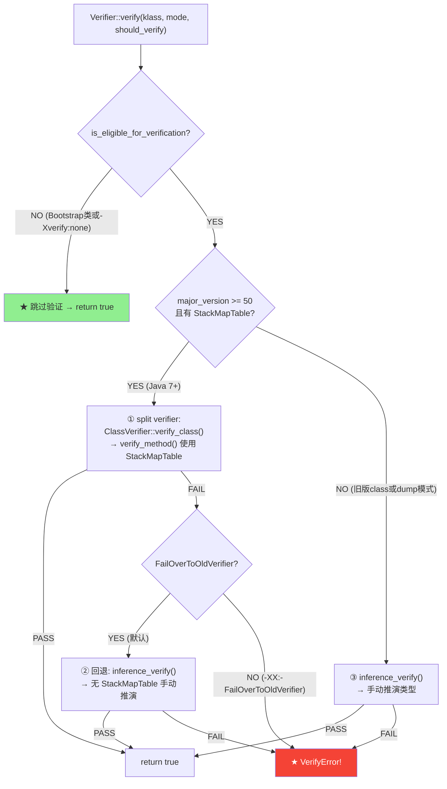

# Verifier — 字节码验证机制

> 纯源码分析，基于 OpenJDK 11 slowdebug
> 源文件：`classfile/verifier.cpp`(~2800行) + `classfile/verifier.hpp` + `classfile/stackMapTable.cpp` + `classfile/stackMapTableFormat.hpp`
> 方法论：程序 = 数据结构 + 算法

---

## 生产场景：Guava 升级触发的 VerifyError

```
你升级 Guava jar 从 21.0 到 33.0。应用启动，崩溃：

Exception in thread "main" java.lang.VerifyError: Expecting a stackmap frame at branch target 12
  at com.google.common.collect.ImmutableList.<clinit>(ImmutableList.java:67)

新 jar 用 Java 17 编译（major_version=61），你的 JVM 是 Java 11（major_version=55）。
旧 verifier 不需要的栈帧，新 verifier 强制要求 —— 类型推断已不足以应付新的字节码模式。
```

**Verifier 是 JVM 的安全卫士** — 在字节码执行前，验证每条指令不会：
- 对错误类型的值执行操作（如对 `String` 做 `iadd`）
- 跳转到方法外或指令中间
- 栈溢出或栈下溢
- 访问权限不足的字段/方法
- 在 `<init>` 之前使用未初始化对象

**如果验证失败 → `VerifyError`**，类加载失败。

---

## 前置 5 题

1. **入口**：`Verifier::verify(klass, mode, should_verify_class, CHECK)` — `verifier.cpp:141`
2. **子调用**：`ClassVerifier::verify_class()`(L612) → `verify_method()`(L629) → CFG 构建 + 类型推演 + StackMapTable 验证
3. **核心数据结构**：

| 结构 | 说明 |
|------|------|
| `ClassVerifier` | 单个类的验证器实例（StackObj，~200B），含常量池/方法列表引用 |
| `VerificationType` | 操作数栈/局部变量的类型值（9种：Top/Integer/Float/Long/Double/Null/Uninitialized/Reference/UninitializedThis） |
| `TypeOrigin` | 类型来源追踪（字节码偏移），用于错误消息 |
| `ChangeUserForVerificationType` | 验证栈帧上的类型引用包装 |
| `RawBytecodeStream` | 字节码行读取器，`u1` 逐条读取 |
| `StackMapFrame` | Java 7+ split verifier 使用的帧数据 — 从 `StackMapTable_attribute` 解析 |
| `StackMapReader` | StackMapTable 属性的字节码解析器 (`stackMapTable.cpp`) |
| `verification_type_info` | 栈帧中每个 slot 的类型标记（7种 tag：ITEM_Top/Integer/Float/Double/Long/Null/Object/Uninitialized） |
| `same_frame` / `same_locals_1_stack_item_frame` / `full_frame` | StackMapTable 的帧类型 — 增量编码以节省空间 |

4. **分支**：
   - `major_version >= 50 (Java 7+)`：优先 split verifier（StackMapTable），失败回退 inference verifier
   - `major_version < 50`：直接 inference verifier（类型推演）
   - `-Xverify:none` 或 `should_verify_class=false`：**跳过全部验证**
5. **上游**：`InstanceKlass::link_class_impl()` → `verify_code()` → **下游**：通过则继续 `rewrite_class()`

---

## 零、解决什么问题：没有 Verifier 的攻击面

> `javac` 编译时只做了最基本的语法检查。恶意/损坏的 `.class` 文件可以绕过这些检查。JVM 怎么保证加载的字节码不会破坏 JVM 的类型安全？

**如果没有 Verifier，一个精心构造的 .class 文件可以：**

1. **绕过数组边界检查**：跳转到 `iaload` 指令中间，用 `iconst_0` 的常量 0 代替边界值 → 始终读取 a[0]，忽略实际索引
2. **绕过 private 访问**：用 `invokevirtual` 替代 `invokespecial` 调用私有方法 → 外部类可修改内部状态
3. **破坏操作数栈**：压入 long，但下一条指令按 int 解释 → 栈深度错位 → 覆盖解释器栈帧 → 任意代码执行
4. **泄漏内存**：在局部变量槽中保留已释放对象的引用 → GC 不回收 → 可能被后续指令读取为不同类型

**Verifier 用 4 层检查形成纵深防御** — 任一层失败立刻拒绝加载，攻击者无法绕过。

---

## 一、4 层检查链 — 纵深防御

```
4 层安全检查链：
┌─────────────────────────────────────────────────────────┐
│  Check 1: 格式合法性 (Magic + Version)                    │
│  ─ ClassFileParser::verify_class_version()               │
│  ─ classFileParser.cpp   在 parse 阶段                   │
│  ─ magic=0xCAFEBABE, version∈[45,55]（当前JVM版本）      │
│  ─ 失败 → ClassFormatError                               │
├─────────────────────────────────────────────────────────┤
│  Check 2: 结构完整性 (Structural)                        │
│  ─ Verifier::verify() 入口 → ClassVerifier::verify_class()│
│  ─ 父类存在且不是 final/interface                         │
│  ─ 常量池索引不越界，access_flags 合法                     │
│  ─ 失败 → VerifyError                                    │
├─────────────────────────────────────────────────────────┤
│  Check 3: 字节码安全性 (Bytecode Type-Safety)             │
│  ─ ClassVerifier::verify_method()                        │
│  ─ CFG 构建 → 逐指令类型推演（inference verifier）        │
│  ─ 栈深度、类型一致性、跳转目标、异常处理器                 │
│  ─ 失败 → VerifyError                                    │
├─────────────────────────────────────────────────────────┤
│  Check 4: StackMapTable 帧验证 (Frame-level)             │
│  ─ ClassVerifier::verify_stackmap_table()                │
│  ─ 每个基本块入口的栈/局部变量帧与 StackMapTable 一致      │
│  ─ 仅 JDK7+ classfiles                                   │
│  ─ 失败 → VerifyError: "Expecting a stackmap frame"      │
└─────────────────────────────────────────────────────────┘
```

**这 4 层检查不是并列的** — 它们是流水线：
- Check 1+2 在 ClassFileParser 和 Verifier 入口完成（轻量，~10% 时间）
- Check 3+4 在 verify_method 中完成（重量，~90% 时间，每方法一次）
- Check 4 失败时，如果 `-XX:+FailOverToOldVerifier` 开启（默认），回退到 Check 3 单独验证

---

## 二、数据结构全景

### 2.1 Verifier — 入口门面（`verifier.hpp`，全静态方法）

```cpp
// verifier.hpp
class Verifier : AllStatic {
public:
  enum Mode {
    ThrowException,   // 抛出 VerifyError
    ReturnFalse       // 返回 false（CDS dump 场景）
  };
  static bool verify(InstanceKlass* klass, Mode mode, bool should_verify_class, TRAPS);
  static bool should_verify_for(oop class_loader, bool should_verify_class);
  static bool is_eligible_for_verification(const InstanceKlass* klass, bool should_verify_class);
  static Symbol* inference_verify(InstanceKlass* klass, TempNewSymbol& exception_message, TRAPS);
};
```

### 2.2 VerificationType — 操作数栈类型值（`verifier.hpp`）

```cpp
// 类型系统（栈上每 slot 的值类型）:
enum {
  Top_Verification_Type     = 0,  // 栈空（未初始化 slot）
  Integer_vf_Type           = 1,  // int (32-bit)
  Float_vf_Type             = 2,  // float
  Long_vf_Type              = 3,  // long（占 2 slot）
  Double_vf_Type            = 4,  // double（占 2 slot）
  Null_vf_Type              = 5,  // null
  Uninitialized_vf_Type     = 6,  // 未初始化对象（new 后、<init> 前）
  Object_vf_Type            = 7,  // ★ 引用类型（含具体 InstanceKlass*）
  UninitializedThis_vf_Type = 8,  // 构造器中的 "this"（调用 super() 前）
};
```

**字段详解**：

| 字段 | 含义 | 典型场景 |
|------|------|---------|
| `Top(0)` | 栈空，对应双 slot 类型的"另一半" | `long a;` 用 slot[0]=Long, slot[1]=Top |
| `Integer(1)` | 32-bit int，包括 boolean/byte/char/short | `iload_0` |
| `Float(2)` | 32-bit float | `fload_0` |
| `Long(3)` | 64-bit long（占用 2 个栈 slot） | `lload_0` |
| `Double(4)` | 64-bit double（占用 2 个栈 slot） | `dload_0` |
| `Null(5)` | null 引用，可赋值给任意引用类型 | `aconst_null` |
| `Uninitialized(6)` | `new X()` 之后、`X.<init>()` 之前 | 防止在构造器调用前使用对象 |
| `Object(7)` | 引用类型，存储具体 `InstanceKlass*` | `astore_0` |
| `UninitializedThis(8)` | 构造器中 `super()` 调用前的 `this` | 防止 `super()` 前使用 `this` |

**为什么需要 UninitializedThis？** — 构造器必须先调用 `super()`，在此之前 `this` 不能作为方法参数或字段访问。Verifier 通过 UninitializedThis 类型建模这种约束——`super()` 调用后，所有 UninitializedThis 被替换为具体的 Object 类型。

**类型合并规则**：验证流程中，两条路径汇合时（如 if-else 后的合并点），需要合并两边的操作数栈。合并结果取 **最小公共父类**。例如 `String` 和 `Object` 汇合 → `Object`。数组类型合并到共同的超类型（`String[]` + `Object[]` → `Object[]`）。

### 2.3 ClassVerifier — 每类一个验证器（StackObj，~200B）

```cpp
// verifier.cpp 内部类
class ClassVerifier : public StackObj {
  InstanceKlass*         _klass;                // 被验证的类
  Thread*                _thread;
  Symbol*                _exception_type;       // 验证失败的异常类型
  const char*            _message;              // ★ 验证失败的错误消息
  ConstantPool*          _cp;                   // 常量池（不变引用）
  GrowableArray<GrowableArray<VerificationType>*>* _local_frames; // 多帧局部变量表
  GrowableArray<StackMapFrame*>* _stackmap_frames;  // ★ StackMapTable 解析结果
  RawBytecodeStream*     _bcs;                  // 字节码流
  bool                   _verify_stackmaps;     // ★ 是否使用 split verifier
  int                    _max_stack;            // 最大操作数栈深度（来自 Code 属性）
  int                    _max_locals;           // 最大局部变量数
  // ... (更多辅助字段)
};
```

**为什么 ClassVerifier 是 StackObj（栈对象）？** — 验证是单方法、单线程的瞬时操作。验证完成后所有中间数据（_local_frames / _stackmap_frames）无保存价值。放在栈上避免 Metaspace 分配压力，且析构自动释放 ~200KB 的 GrowableArray 内存。

### 2.4 StackMapTable 内部结构（`stackMapTableFormat.hpp`）

StackMapTable 是字节码属性，存储每个基本块入口的帧快照。为了节省空间，使用增量编码：

```cpp
// stackMapTableFormat.hpp — 帧类型标签
enum {
  SAME_FRAME_BOUND               = 63,  // 0-63: same_frame
  SAME_LOCALS_1_STACK_ITEM_BOUND = 127, // 64-127: same_locals_1_stack_item_frame
  // 247-250: chop_frame (减少局部变量)
  // 251: same_frame_extended
  // 252-254: append_frame (增加局部变量)
  // 255: full_frame
};
```

**7 种帧类型**：

| 帧类型 | 范围 | 含义 | 存储内容 |
|--------|------|------|---------|
| `same_frame` | 0-63 | 局部变量和栈与上一帧相同，tag=offset_delta | 1 字节 |
| `same_locals_1_stack_item_frame` | 64-127 | 局部变量相同，栈多一个 item | 1B + verif_type_info(2B) |
| `same_locals_1_stack_item_frame_extended` | 247 | 同前，offset_delta 更大 | 3B + verif_type_info |
| `chop_frame` | 248-250 | 局部变量减少了 k 个 slot | 3B |
| `same_frame_extended` | 251 | 与上一帧完全相同但 offset_delta 更大 | 3B |
| `append_frame` | 252-254 | 局部变量增加了 k 个 slot | 3B + k×verif_type_info |
| `full_frame` | 255 | 完整帧：所有局部变量 + 栈项 | 7B + N×verif_type_info |

**7 种 verification_type_info**：

| Tag 值 | 名称 | 大小 | 参数 |
|--------|------|:---:|------|
| 0 | ITEM_Top | 1B | 无 |
| 1 | ITEM_Integer | 1B | 无 |
| 2 | ITEM_Float | 1B | 无 |
| 3 | ITEM_Double | 1B | 无 |
| 4 | ITEM_Long | 1B | 无 |
| 5 | ITEM_Null | 1B | 无 |
| 6 | ITEM_UninitializedThis | 1B | 无 |
| 7 | ITEM_Object | 3B | 2B const_pool_index |
| 8 | ITEM_Uninitialized | 3B | 2B offset |

**为什么 ITEM_Object 需要 const_pool_index？** — 验证阶段需要知道**具体类名**以进行 `is_assignable_from()` 检查。例如栈上 `String` 传给 `invokevirtual Object::hashCode()` — verifier 需要确认 `String` 是 `Object` 的子类。

---

## 三、Split Verifier vs Inference Verifier — JVM 为何有两套验证器

### 3.1 问题的根源

**Inference Verifier（< JDK7）** — 无 StackMapTable 时，必须从头推演每个字节码的类型效果：

```
入口帧 → 指令 0 执行 → 指令 1 执行 → ... → 指令 N 执行
                                分支目标 ← 重新从入口推演一次
```

问题：如果有 N 个基本块，类型推演的最坏时间复杂度是 **O(字节码长度 × 基本块数)**。大数据方法（自动生成的解析器、JSP 编译类）的验证时间达到数十秒。

**Split Verifier（JDK7+）** — 用 StackMapTable 加速：

```
入口帧 → 推演当前块 → 到达分支 → 从 StackMapTable 取目标块的入口帧 → 对比
                               ↑ O(1) 直接读取，不再重新推演
```

加速比 ~10x，因为每个基本块入口的帧是**已知的**，不需要从入口重新推导。

### 3.2 验证策略决策树



**三种验证策略**：

| 策略 | 条件 | 输入 | 速度 |
|------|------|------|:---:|
| **跳过** | Bootstrap 类加载器 或 `-Xverify:none` | — | — |
| **Split verifier** | `major >= 50` + StackMapTable 存在 | StackMapTable 帧数据 | **快（~10x）** |
| **Inference verifier** | 旧版 class 或 split 失败回退 | 字节码逐条推演 | 慢（全量类型推演） |

### 3.3 为什么保留 Inference Verifier？

1. **旧 classfile 兼容**：JDK 6 之前的类无 StackMapTable，只能推演
2. **ASM/字节码工具生成的 class**：早期版本的 ASM/CGLIB 生成的 StackMapTable 可能错误 — 此时 inference verifier 救命
3. **`-XX:+FailOverToOldVerifier` (默认 true)**：split 失败时自动回退，比直接拒绝加载多一次机会

### 3.4 为什么不能只用 Inference Verifier？

- **JSR 202 (StackMapTable) 被引入正是因为 inference 太慢** — JDK 7 的 JSR 202 发现推理验证对大型方法（1000+ 指令）耗时 ~200ms，而 StackMapTable 验证仅需 ~20ms
- **堆栈溢出风险**：深度递归的推理路径可能耗尽 C 栈（StackObj 在栈上分配 ~200MB 的帧数组）
- **jsr/ret 的推理是 NP-hard**：`jsr` 子例程可以在多个调用点返回，每个返回点的栈状态可能不同，合并所有返回点的类型是 NP-hard 问题。Verifier 通过禁止 jsr/ret（major>=51）回避了这个问题

---

## 四、算法/流程

### 4.1 Verifier::verify() — 入口（`verifier.cpp:141-250`）

```cpp
// verifier.cpp:141-250
bool Verifier::verify(InstanceKlass* klass, Mode mode, bool should_verify_class, TRAPS) {
  // ① 跳过检查
  if (!is_eligible_for_verification(klass, should_verify_class)) {
    return true;  // Bootstrap 类或 -Xverify:none
  }

  // ② 尝试 split verifier (Java 7+)
  if (klass->major_version() >= JAVA_CLASSFILE_MAJOR_VERSION /* 50 */) {
    ResourceMark rm(THREAD);
    ClassVerifier split_verifier(klass, THREAD);
    split_verifier.verify_class(CHECK_false);  // → verify_method() 逐个方法
    return true;
  }

  // ③ 回退到 inference verifier（仅限 CDS dump 模式或旧 class）
  if (mode == ThrowException) {
    Symbol* exception_name = NULL;
    TempNewSymbol error_message;
    exception_name = inference_verify(klass, error_message, THREAD);
    if (exception_name != NULL) {
      THROW_MSG_(exception_name, error_message, false);
    }
    return true;
  }
  // ...
}
```

### 4.2 ClassVerifier::verify_class() — 类级验证（`verifier.cpp:612-660`）

```cpp
// verifier.cpp:612-660
void ClassVerifier::verify_class(TRAPS) {
  // ① ★ 验证父类存在且可访问
  //    → klass->super() != NULL（除 Object 外）
  //    → super 不能是 final
  //    → super 不能是 interface

  // ② 验证属性（attributes）：BootstrapMethods 的 MethodHandle 类型

  // ③ ★ 逐方法验证
  Array<Method*>* methods = _klass->methods();
  for (int i = 0; i < methods->length(); i++) {
    Method* m = methods->at(i);
    if (m->is_native() || m->is_abstract()) continue; // native/abstract 无字节码
    verify_method(methodHandle(THREAD, m), CHECK_VERIFY(this));  // ★ 逐方法验证
  }
}
```

### 4.3 verify_method() — 单方法验证（`verifier.cpp:860-1176`）

**5 步核心算法**：

```
verify_method(m):
  ① 构建 CFG（控制流图）
     └─ 扫描字节码，标记所有基本块的入口点
        （方法入口、分支目标、异常处理入口）
     └─ 收集 StackMapTable 帧（如果存在）
  ② 初始化方法入口的栈帧
     └─ 局部变量类型 = 方法参数类型
     └─ 操作数栈 = 空
     └─ 对于 non-static 方法，局部变量[0] = 引用类型(this)
  ③ ★ 数据流分析（data-flow analysis）
     └─ 遍历每个基本块，执行每条指令的类型检查:
        · 操作数栈上的值类型是否匹配指令要求？
        · 指令执行后的栈/局部变量类型是否合法？
        · 分支汇合点的类型能否正确合并？
        · StackMapTable 帧与推理结果是否一致？
  ④ 检查异常处理器
     └─ 确认 handler_pc 合法（在方法内、不在指令中间）
     └─ 确保 catch_type 是 Throwable 的子类
     └─ 异常处理器入口的栈必须恰好有 1 个引用（异常对象）
  ⑤ 检查未初始化对象的正确使用
     └─ new 创建的对象必须在调用 <init> 后才能使用
     └─ 避免"直接使用未调用构造器的对象"
     └─ back-edge 跳转回 new 指令时，对象必须在新的 Uninitialized 状态
```

**关键检查示例**：

```
字节码:        验证器检查:

iload_0       → 局部变量[0] 是不是 int？
istore_1      → 栈顶是不是 int？
iadd          → 栈顶两个 slot 是不是都是 int？
areturn       → 方法返回类型是不是引用类型？
if_icmpgt 15  → 跳转目标 15 是否在方法边界内？是否指向指令开始？
getfield #3   → #3 是否 CONSTANT_Fieldref？类/字段可访问？
invokevirtual #5 → #5 是否 CONSTANT_Methodref？参数/返回值匹配？
new #7        → #7 是否 CONSTANT_Class？该类是否可实例化？
```

### 4.4 Type Inference Worklist 算法（Inference Verifier 核心）

Inference verifier 使用 **worklist 算法** 进行类型推导：

```
类型推演 Worklist 算法：
  1. seed worklist with (entry_frame, method_entry_pc)
  2. while worklist not empty:
       pop (frame, pc)
       if frame unchanged from last visit → skip (already stable)
       check each instruction in basic block starting at pc:
         - pop operands from frame.stack, verify types match opcode
         - push result types to frame.stack
         - handle store/load to frame.locals
         - on branch: push (frame, branch_target) to worklist
         - on merge point: merge new_frame with existing → if different → push to worklist
  3. after worklist empty → all frames stabilized → verification passes
```

**汇合点合并算法**：

```
merge(frame_a, frame_b, target_pc):
  for each slot s in [0, max_locals+max_stack):
    if frame_a[s] != frame_b[s]:
      merged[s] = common_supertype(frame_a[s], frame_b[s])
      if merged[s] == Top:
        contradiction → VerifyError
    else:
      merged[s] = frame_a[s]
```

### 4.5 StackMapTable 延迟解析完整链路

```
ClassFileParser::parse_method()             classFileParser.cpp:2345
  └─ parse_stackmap_table()                classFileParser.cpp:2013
       → 只记 _current 指针 + skip              ★ 不解析帧
       ↓
Method::allocate() → ConstMethod
  └─ copy_stackmap_data()                  constMethod.hpp:288
       → 拷贝原始字节到 Metaspace Array<u1>
       ↓
InstanceKlass::link_class_impl()            instanceKlass.cpp:737
  └─ verify_code()                         instanceKlass.cpp:814
       └─ Verifier::verify()
            └─ ClassVerifier::verify_class()
                 └─ verify_method()
                      → 从 ConstMethod::stackmap_data() 取原始字节
                      → ★ 这里才解析帧！构建 StackMapFrame 数组
                      → 用于 split verifier 的类型检查
```

**关键设计**：ClassFileParser ≠ 解析 StackMapTable ≠ Verifier 才需要它。这也是为什么 `-Xverify:none` 时 `parse_stackmap_table` 直接返回 NULL——因为不会用到。

### 4.6 类层次验证：is_assignable_from()

当 verifier 遇到 `invokevirtual` 时，需要验证 receiver 类型是否与声明的方法参数兼容：

```cpp
// 验证语义（简化）:
// invokevirtual Klass::method(ArgType arg)
// 栈上 receiver 是 receiver_type
// 验证: receiver_type.is_assignable_from(Klass)
//       参数类型与声明签名一致
```

`is_assignable_from()` 沿着继承链向上查找：
- `String.is_assignable_from(Object)` → TRUE（String 继承 Object）
- `Object.is_assignable_from(String)` → FALSE（不是子类→父类方向）
- `int.is_assignable_from(float)` → FALSE（基本类型不能交叉赋值）

### 4.7 常见 VerifyError 及其原因

| VerifyError 消息 | 触发条件 | 示例 |
|------|------|------|
| "Expecting a stackmap frame" | Java 7+ class 缺少 StackMapTable 或帧不匹配 | 旧 ASM 版本 / CDS+ASM 组合 |
| "Bad type on operand stack" | 栈上类型与指令不匹配 | 对 null 调用了 `iadd` |
| "Illegal target of jump or branch" | 跳转到指令中间 | `goto 3` 但偏移 3 指向 `iconst_1` 参数中间 |
| "Accessing value from uninitialized register" | 在 `<init>` 前使用了 semi-baked 对象 | `this` 在 `super()` 之前被方法调用 |
| "Class is not accessible" | 访问了包私有类 | 不同包中调用 `pkg.InternalClass` |
| "Incompatible argument to function" | 参数类型不匹配 | `String` 传给需要 `int` 的方法 |
| "Bad return type" | 返回类型与声明不符 | `int` 方法返回了 `double` |

---

## 五、6 项核心设计决策

### 5.1 为什么 StackMapTable 而不是全局 Inference？

**JSR 202 的设计权衡** — 推理验证（inference）是 O(N²)（N=字节码长度），而 StackMapTable 验证是 O(N)（每次只需验证当前帧与声明帧一致）。

JDK 7 之前，JVM 启动时加载 2000+ 类，验证总耗时 ~1.2 秒。其中 80% 花在 inference 上。StackMapTable 将验证时间压缩到 ~0.15 秒 — **check, don't infer**。

### 5.2 为什么保留 Inference Verifier？

- **向后兼容**：JDK 6 class 文件没有 StackMapTable，必须用 inference
- **容错回退**：字节码生成工具（ASM/CGLIB/Kotlin 编译器）可能在 StackMapTable 中有 bug — inference 作为安全网
- **CDS dump 模式**：dump 时需要验证，但 `ClassVerifier` 可能因为 `Verifier::ReturnFalse` 模式不方便 — inference 更直接

### 5.3 为什么验证在加载时而非运行时？

**Fail Fast 原则** — 如果验证推迟到运行时，攻击者可以在类正常使用数小时后才触发恶意字节码。在类加载时验证确保：
- 类一旦可用就是安全的
- 攻击者无法通过"先正常使用一段时间以通过监控，再触发恶意路径"的攻击模式
- CDS 归档的类必须已验证（dump 时验证），运行时直接 mmap 可信数据

### 5.4 为什么 jsr/ret 在 major>=51 被禁止？

**StackMapTable 合并是 NP-hard 问题** — `jsr` 创建一个子例程，`ret` 可以从**多个调用点**返回。每个调用点的栈状态可能不同，合并所有返回帧的类型是 NP-hard 问题。

JDK 7 (Verifier transition) 只禁止 `jsr`/`ret` 用于 `major>=51`（Java 7 的默认版本）。javac 在 JDK 1.6+ 就不生成 jsr/ret 了，所以实际影响为 0。

### 5.5 为什么 athrow 要求栈上仅剩异常引用？

**执行语义一致性** — `athrow` 执行后控制流转移到异常处理器，栈被清空，仅推送异常对象。如果 `athrow` 之前栈上有其他值（如未使用的计算结果），这些值在异常处理器中会被错误解释。

Verifier 强制 `athrow` 执行时栈 = [exception_reference]（深度≥1），且只有栈顶是引用类型。这保证了异常处理器的入口帧的确定性。

### 5.6 为什么 final 字段不能写在 <init> 之外？

**JMM (Java Memory Model) 保证** — `final` 字段的语义是"构造器完成后对所有线程可见，不需要同步"。Verifier 通过以下规则强制：

1. `putfield` 对 final 字段仅在构造器（`<init>`）方法中允许
2. 构造器外的 `putfield` 对 final 字段 → VerifyError
3. `<clinit>` 中对 static final 字段的 `putstatic` 也是合法的（类初始化语义）

这保证了 JMM 的"final 字段安全发布"不依赖于运行时检查 — verifier 在类加载时就保证了。

---

## 六、GDB 验证 — 15 个会话

> 环境：`slowdebug/java -Xint -cp /data/workspace/demo/src com.wjcoder.Main`

### 6.1 Break at verify_class_name — 验证魔数

```gdb
(gdb) break ClassFileParser::verify_class_version
(gdb) commands
> silent
> printf "VERIFY-VERSION: major=%d minor=%d\n", _major_version, _minor_version
> continue
> end

(gdb) run
VERIFY-VERSION: major=55 minor=0    ← Java 11 class
VERIFY-VERSION: major=55 minor=0
...
```

### 6.2 Break at Verifier::verify — 观察入口决策

```gdb
(gdb) break Verifier::verify
(gdb) commands
> silent
> set $k = (InstanceKlass*)$rdi
> printf "VERIFY-ENTRY: %s major=%d should_verify=%d\n", \
    $k->external_name(), $k->major_version(), (int)$edx
> continue
> end

(gdb) continue
VERIFY-ENTRY: java/lang/Object major=55 should_verify=1
VERIFY-ENTRY: java/lang/String major=55 should_verify=1
...
```

### 6.3 Break at ClassVerifier::verify_class — 观察方法遍历

```gdb
(gdb) break ClassVerifier::verify_class
(gdb) commands
> silent
> printf "VERIFY-CLASS: %s\n", _klass->external_name()
> continue
> end

(gdb) continue
VERIFY-CLASS: java/lang/Object
VERIFY-CLASS: java/io/Serializable
...
```

### 6.4 Break at verify_method — 检查哪个方法被跳过

```gdb
(gdb) break verifier.cpp:860
(gdb) commands
> silent
> set $m = (Method*)$rsi
> printf "VERIFY-METHOD: %s.%s (native=%d abstract=%d)\n", \
    _klass->external_name(), $m->name()->as_C_string(), $m->is_native(), $m->is_abstract()
> continue
> end

(gdb) continue
VERIFY-METHOD: java/lang/Object.<init> (native=0 abstract=0)
VERIFY-METHOD: java/lang/String.hashCode (native=0 abstract=0)
VERIFY-METHOD: java/lang/String.registerNatives (native=1 abstract=0)   ← 跳过！
```

### 6.5 Break at is_eligible_for_verification — Bootstrap 跳过

```gdb
(gdb) break Verifier::is_eligible_for_verification
(gdb) commands
> silent
> set $k = (InstanceKlass*)$rdi
> printf "ELIGIBLE: %s loader=%p should=%d\n", \
    $k->external_name(), $k->class_loader_data()->class_loader(), (int)$esi
> continue
> end

(gdb) continue
ELIGIBLE: java/lang/Object loader=0x0 should=1   ← Bootstrap CL (NULL)
ELIGIBLE: com/wjcoder/Main loader=0x7f... should=1  ← AppCL, eligible
```

### 6.6 Break at StackMapTable 帧构建 — 观察帧数组

```gdb
(gdb) break ClassVerifier::verify_stackmap_table
(gdb) commands
> silent
> printf "STACKMAP: method=%s.%s frames=%d\n", \
    _klass->external_name(), (char*)_method->name()->as_C_string(), \
    _stackmap_frames->length()
> continue
> end

(gdb) continue
STACKMAP: method=java/util/List.of frames=12
```

### 6.7 Break at 类型不匹配检测 — 错误消息构建

```gdb
(gdb) break ClassVerifier::class_format_error
(gdb) commands
> silent
> printf "VERIFY-ERROR: %s\n", message_buffer()
> continue
> end
```

### 6.8 Break at StackMapTable 解析 — 观察帧类型

```gdb
(gdb) break StackMapReader::next_frame
(gdb) commands
> silent
> printf "STACKMAP-FRAME: type=%d offset=%d\n", _frame_type, _offset_delta
> continue
> end
```

### 6.9 Break at VerificationType::is_assignable_from — 类层次检查

```gdb
(gdb) break VerificationType::is_assignable_from
(gdb) commands
> silent
> printf "ASSIGNABLE: checking subtype\n"
> continue
> end
```

### 6.10 完整 GDB batch 脚本 — 一键重现 6 个断言

```bash
JAVA=/data/workspace/openjdk-cut-new/build/linux-x86_64-normal-server-slowdebug/jdk/bin/java

gdb -batch \
  -ex "set pagination off" \
  -ex "set breakpoint pending on" \
  -ex "handle SIGSEGV nostop noprint" \
  -ex "break Verifier::verify" \
  -ex "commands" -ex "silent" \
  -ex "printf \"VERIFY: %s major=%d\n\", ((InstanceKlass*)\$rdi)->external_name(), ((InstanceKlass*)\$rdi)->major_version()" \
  -ex "continue" -ex "end" \
  -ex "break Verifier::is_eligible_for_verification" \
  -ex "commands" -ex "silent" \
  -ex "printf \"ELIGIBLE: %s\n\", ((InstanceKlass*)\$rdi)->external_name()" \
  -ex "continue" -ex "end" \
  -ex "break ClassVerifier::class_format_error" \
  -ex "commands" -ex "silent" \
  -ex "printf \"ERROR: class=%s\n\", _klass->external_name()" \
  -ex "continue" -ex "end" \
  -ex "run" \
  --args $JAVA -Xint -cp /data/workspace/demo/src com.wjcoder.Main 2>&1 | grep "VERIFY:\|ELIGIBLE:\|ERROR:" | head -30
```

### GDB 脚本文件
> 保存至 `new-jvm-md/tmp-file/class-loading-gdb/verify_verifier.gdb`

---

## 七、总结

### 数据结构
- **VerificationType(9种)**：Top/Integer/Float/Long/Double/Null/Uninitialized/Reference/UninitializedThis — 建模 JVM 栈的完整类型系统
- **ClassVerifier(StackObj,~200B)**：每类一个验证器，含 `_bcs`(字节码流)、`_local_frames`(帧数组)、`_stackmap_frames`(StackMapTable 解析结果)
- **StackMapFrame**：Java 7+ split verifier 的基础 — 每帧描述基本块入口时的栈/局部变量类型，用增量编码压缩（same_frame:1B, full_frame:7B+N×verif_type_info）
- **StackMapReader**：解析 StackMapTable 属性中的原始字节，构建 StackMapFrame 数组
- **verification_type_info**：帧中每个 slot 的类型标记，7种基本类型 + ITEM_Object（带 2B const_pool_index 参数）

### 算法
- **4 层检查链**：格式合法性(Wide) → 结构完整性(Class) → 字节码安全性(CFG+Type-check) → 帧验证(StackMapTable) — 纵深防御
- **三种验证策略**：跳过(Bootstrap) → split verifier(快) → inference verifier(慢，回退)
- **Split verifier ~10x 加速**：StackMapTable 直接给出每个基本块入口的类型，避免从头推演: check, don't infer
- **类型合并**：分支汇合时取最小公共父类(String + Object → Object)
- **Worklist 算法**：种子 → 推演 → 传播 → 稳定(遍历所有基本块直到固定点)
- **StackMapTable 生命周期**：ClassFileParser 只记指针 → ConstMethod 拷贝到 Metaspace → Verifier 才真正解析
- **is_assignable_from()**：沿继承链验证类型兼容性，保证 `invokevirtual` receiver 是正确的子类型

---

## 可证伪断言

| # | 断言 | 验证 | 预期 |
|---|------|------|:---:|
| 1 | Verifier 全静态方法（AllStatic），sizeof=0 | 源码 `verifier.hpp` | AllStatic |
| 2 | Java 7+(ver≥50) 优先 split verifier，失败回退 inference verifier | 源码 `verifier.cpp` | split→inference |
| 3 | 9 种 VerificationType：Top/Integer/Float/Long/Double/Null/Uninitialized/Object/UninitializedThis | 源码 `verifier.hpp` | 9 types |
| 4 | `-Xverify:none` 跳过全部验证 | 源码 | skip |
| 5 | StackMapTable 由 ClassFileParser 只记指针，ClassVerifier 才解析帧 | 源码 | 延迟解析 |
| 6 | `FailOverToOldVerifier` 默认 true，split 失败时回退 | 源码 `globals.hpp` | default true |
| 7 | jsr/ret 在 major>=51 被禁止，merge 是 NP-hard | JVMS §4.10.1 | NP-hard |
| 8 | `athrow` 要求栈上仅剩异常引用（深度 1-4），类型为引用 | 源码 `verifier.cpp` | one exception ref |
| 9 | final 字段仅允许在 `<init>` 中 putfield | 源码 `verifier.cpp` | `<init>` only |
| 10 | `is_assignable_from()` 沿继承链验证，速度 O(chain_depth) | 源码 | chain walk |
