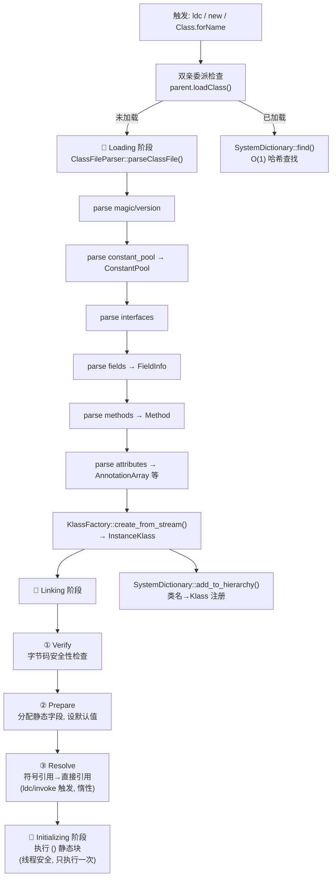

# 02 - 类加载子系统

> 源码索引：`source_index/04-classfile.md`（75文件，已索引75/75）
> 插桩覆盖：`-Xlog:probe_class=debug`（8cpp）
> 交叉引用：01 专题已分析 InstanceKlass/Method/ConstantPool/ClassLoaderData/Symbol 的字段级结构

---

## 〇、上手指南 ⭐（新手必读）

### 0.1 本文档适合谁？

| 水平 | 特征 | 建议路径 |
|------|------|---------|
| 🟢 初级 | 知道 `Class.forName()` 和 `new` 的区别，不知道内部怎么实现的 | 先读本节 → 入门路径 |
| 🟡 中级 | 理解双亲委派模型，想搞清楚 ClassFileParser 怎么解析 .class 文件 | 入门路径速览 → 进阶路径 |
| 🔴 高级 | 读过 classFileParser.cpp 源码，需要完整参考手册 | 直接按需查阅 |

### 0.2 你需要什么基础？

| 必须 | 可选但更好 |
|------|-----------|
| 了解 .class 文件的基本结构（魔数/版本号/常量池/字段/方法） | 读过 Chapter 4 of JVM Spec（Class File Format） |
| 知道双亲委派模型（Bootstrap→Ext→App→Custom） | 接触过 ClassFileParser 源码 |
| 上过 01-jvm-startup 入门路径（至少知道 InstanceKlass/Method 是什么） | 读过 01 的 03-Structure-Fields-Deep §四~§七 |

### 0.3 类加载的本质（三句话）

> 你在代码里写 `new Object()`，Object 类是什么时候、怎么变成 JVM 可用的？

```
JVM 第一次见到 "java/lang/Object" 这个名字 → 
读取 Object.class 字节 → 解析成 InstanceKlass C++ 对象 → 
验证安全性 → 存入 SystemDictionary → 以后直接 O(1) 查找
```

类加载是"把磁盘上的 .class 字节编译成 JVM 内部可用的 InstanceKlass 数据结构"的全过程。它包括 5 个阶段：

1. **Loading**（加载）：读 .class 字节，解析成 InstanceKlass
2. **Linking**（链接）：verify（验证）→ prepare（准备）→ resolve（解析）
3. **Initializing**（初始化）：执行 `<clinit>()` 静态块

### 0.4 核心术语速查表

| 术语 | 一句话解释 | 对应源码 |
|------|----------|---------|
| **ClassFileParser** | 把 .class 字节流解析成 C++ 数据结构的"解析器" | classFileParser.cpp |
| **ConstantPool** | 运行时常量池，存字符串/类名/方法签名的索引 | constantPool.cpp |
| **ConstantPoolCache** | 常量池的解析缓存，ldc/invoke 后写入结果，之后 O(1) 读取 | cpCache.cpp |
| **InstanceKlass** | Java 类在 JVM 中的 C++ 表示，包含 vtable/itable/字段/方法 | instanceKlass.cpp |
| **KlassFactory** | 协调 ClassFileParser + ClassLoaderData 的工厂 | klassFactory.cpp |
| **SystemDictionary** | 全局类查找表（类名 → InstanceKlass），底层是 Dictionary | systemDictionary.cpp |
| **Dictionary / DictionaryEntry** | 哈希表，类名→Klass 的 O(1) 查找 | dictionary.cpp |
| **ClassLoaderData** | 每个 ClassLoader 的"数据区域"，管理其加载的所有类 | classLoaderData.cpp |
| **双亲委派** | loadClass() 先问 parent 加载过没，没有才自己加载 | classLoader.cpp |
| **<clinit>** | 类的静态初始化方法（`static { }` 块），线程安全执行一次 | instanceKlass.cpp |
| **Verifier** | 检查字节码安全性：栈深度/类型一致性/跳转合法性 | verifier.cpp |
| **LinkResolver** | 将符号引用（"java/io/PrintStream.println"）解析为直接引用（Method*）| linkResolver.cpp |

### 0.5 如何阅读本文档？三条路径

**🟢 入门路径**（预计 1-2 小时，得"骨架"）：

```
1. 先看本节（0.1-0.6）                                  ← 你现在在这里
2. 看 §二 类加载全流程（只读摘要和 Mermaid 图）            ← 理解 5 阶段
3. 看 §三 数据结构表（扫一眼知道有哪些结构）                ← 6 个核心 + 8 个辅助
4. 01 专题：03-Structure-Fields-Deep §四（InstanceKlass） ← 理解类在 JVM 中长什么样
```

**🟡 进阶路径**（预计 5-8 小时，得"血肉"）：

```
在入门基础上：
5. 01 专题：03-Structure-Fields-Deep §七（ConstantPool）  ← 常量池详解
6. 01 专题：03-Structure-Fields-Deep §十二（Dictionary）   ← 类查找表
7. [03](03-ClassFileParser.md) ClassFileParser 解析链       ← ★ 核心
8. [02](02-Parent-Delegation.md) 双亲委派机制                ← ★ 核心
9. [07](07-Linking.md) 链接三子阶段（verify→prepare→resolve）← ★ 核心
```

**🔴 专家路径**（按需查阅）：

| 你想了解 | 待看文档 |
|---------|---------|
| .class 文件的每个字节怎么解析的 | [03](03-ClassFileParser.md) |
| ldc #5 瞬间变成 Klass* 的原理 | [04](04-ConstantPool-Parse.md) §五 |
| SystemDictionary::resolve_or_fail 内部怎么查表 | [09](09-SystemDictionary.md) |
| validate_new_instance 为什么抛出 VerifyError | [07](07-Linking.md) §3.1 |
| <clinit> 为什么保证线程安全且只执行一次 | [11](11-Clinit.md) |
| 类什么时候会被卸载 | [12](12-Class-Unloading.md) |

### 0.6 环境准备

```bash
# 用 01 专题的 slowdebug 版 JVM（已编译，含 -femit-class-debug-always）
JAVA=/data/workspace/openjdk-cut-new/build/linux-x86_64-normal-server-slowdebug/jdk/bin/java

# 观察类加载过程
$JAVA -Xlog:class+load=info -cp /data/workspace/demo/src com.wjcoder.Main 2>&1 | head -20
# 输出示例：
# [0.123s][info][class,load] java.lang.Object source: jrt:/java.base
# [0.124s][info][class,load] java.io.Serializable source: jrt:/java.base
# ...

# GDB 调试类加载
gdb --args $JAVA -Xint -cp /data/workspace/demo/src com.wjcoder.Main
(gdb) break ClassFileParser::parseClassFile
(gdb) break SystemDictionary::resolve_or_fail
(gdb) break InstanceKlass::link_class_impl
(gdb) run
```

---

## 一、完整文件索引（核心）

| # | 文件 | 核心类/函数 | 说明 |
|---|------|-----------|------|
| 1 | `classFileParser.cpp` | `ClassFileParser` | ★ .class 字节→InstanceKlass 的数据结构 |
| 2 | `classFileStream.cpp` | `ClassFileStream` | 字节流包装（read_u1/u2/u4） |
| 3 | `klassFactory.cpp` | `KlassFactory::create_from_stream()` | ★ 工厂：协调 Parser + CLD |
| 4 | `systemDictionary.cpp` | `SystemDictionary` | ★ 全局类查找 + 加载触发 |
| 5 | `classLoaderData.cpp` | `ClassLoaderData` | CLD 创建/销毁 + Metaspace 管理 |
| 6 | `classLoader.cpp` | `ClassLoader::load_class()` | 双亲委派入口 |
| 7 | `linkResolver.cpp` | `LinkResolver` | 方法/字段符号→直接引用 |
| 8 | `verifier.cpp` | `Verifier` | 字节码验证（类型安全/栈深度/跳转） |
| 9 | `defaultMethods.cpp` | `DefaultMethods` | 接口默认方法处理 |
| 10 | `dictionary.cpp` | `Dictionary` | 哈希表：类名→Klass |
| 11 | `stringTable.cpp` | `StringTable` | 字符串常量池（intern） |
| 12 | `symbolTable.cpp` | `SymbolTable` | UTF-8 符号表 |
| 13 | `javaClasses.cpp` | `javaClasses` | 核心类（Object/Class/String）字段偏移计算 |
| 14 | `constantPool.cpp` | `ConstantPool` | 常量池操作 + 条目解析 |

---

## 二、类加载全流程（修正版）

### 2.1 触发路径：类是怎么被请求加载的？

```
① ldc #5              → ConstantPool::klass_at(5) → 触发类加载
② new                 → TemplateTable::_new → InterpreterRuntime::_new → 触发类加载
③ invokestatic        → 链接时发现类未加载 → 触发
④ Class.forName()     → JNI → SystemDictionary::resolve_or_fail()
⑤ ClassLoader.loadClass() → Java 层触发（用户代码）
```

### 2.2 双亲委派

```
ClassLoader.loadClass(name):
  ① c = findLoadedClass(name)      // 已加载？直接返回
  ② if (parent != null)
       c = parent.loadClass(name)   // ★ 委派给父加载器
     else
       c = BootstrapCL.loadClass(name)  // 顶层 → Bootstrap
  ③ if (c == null)
       c = findClass(name)          // ★ 父加载不了，自己加载
  ④ return c
```

### 2.3 完整流程 Mermaid 图



### 2.4 为什么是这个顺序？

| 顺序 | 阶段 | 为什么不能调换 |
|------|------|---------------|
| Dual→Load | 委派在加载前 | 必须先确认 parent 没有加载过，否则破坏隔离 |
| Load→Link | 加载在链接前 | 必须先有 InstanceKlass C++ 对象才能读字节码验证 |
| Link: V→P→R | verify→prepare→resolve | 必须先验证字节码合法性，才能安全地分配字段和解析引用 |
| Link→Init | 链接在初始化前 | `<clinit>` 中可能调用静态方法，必须先完成方法解析 |

### 2.5 类卸载

```
卸载条件：ClassLoader 不可达 + 该 CLD 所有 InstanceKlass 实例数为 0

卸载流程：
  GC 标记 → CLD::_unloading = true
  → Metaspace 递减 Chunk use_count
  → Dictionary::remove(class_name)
  → InstanceKlass 内存释放

★ 只有自定义 ClassLoader 加载的类可以卸载
★ Bootstrap/Platform/App ClassLoader 的类永不卸载
```

---

## 三、关键数据结构（补全版）

> 标注 `✅ (01)` 的结构已在 01 专题完成 GDB 实测和完整字段分析，此处不再重复。

| 结构 | sizeof(GDB) | 01专题 | 作用 |
|------|:---:|:---:|------|
| **核心（6 个）** ||||
| `InstanceKlass` | 600-2000B ✅(01) | §四 | Java 类在 JVM 中的 C++ 表示 |
| `ConstantPool` | 72B ✅(01) | §七 | 运行时常量池对象头（数据另存） |
| `ConstantPoolCache` | 40B ✅(01) | §七 | 解析缓存（ldc/invoke 加速） |
| `Method` | 104B ✅(01) | §五 | 方法元数据 |
| `ClassLoaderData` | 168B ✅(01) | §六 | 类加载器隔离容器 |
| `Dictionary / DictionaryEntry` | 40B ✅(01) | §十二 | 类名→Klass 哈希表 |
| **辅助（11 个）** ||||
| `Symbol` | 6+len ✅(01) | §十三 | UTF-8 字符串（类名/方法名/签名） |
| `ClassFileParser` | ~440B | 03 §1.1 | .class 字节解析器状态（临时） |
| `ClassFileStream` | ~48B(不含buffer) | 03 §1.3 | 字节流包装器（临时） |
| `FieldInfo` | 7×u2=14B/field | 05 §1.1 | 字段描述符数组（flags+name+descriptor） |
| `KlassFactory` | ※ | — | 协调 Parser + CLD |
| `Verifier` | ※(AllStatic) | 13 | 字节码验证入口（全静态） |
| `ClassVerifier` | ※(StackObj) | 13 §1.3 | 单个类的验证器实例 |
| `LinkResolver` | ※(AllStatic) | 08 | 方法/字段链接解析器（全静态） |
| `BootstrapInfo` | ※ | — | invokedynamic 引导方法 |
| `AnnotationArray` | ※ | 06 §四 | 类/方法注解数组（Array\<u1\>） |
| `SystemDictionary` | ※(AllStatic) | 09 | 全局类查找表的容器 |

---

## 四、探针覆盖（共 66 个探针，4 个日志标签）⭐ 已补全

### 4.1 加载阶段（probe_class = 38 个）

| 文件 | 数量 | 关键探针 |
|------|:--:|------|
| systemDictionary.cpp | 13 | resolve_or_fail/null, DICT_HIT/MISS, define_instance_class, class added to dictionary |
| classFileParser.cpp | 8 | parse_stream ENTRY/DONE, 5 Phase 标记（cp/interfaces/fields/methods/attrs）|
| instanceKlass.cpp | 5 | CREATED (含 vtable_size/itable_size/loader), initialize_impl |
| classLoader.cpp | 5 | load_class ENTRY, FOUND (classpath_index), OK/FAILED/EXCEPTION |
| constantPool.cpp | 3 | CREATED, resolve_constant_at_impl |
| **dictionary.cpp** ⭐ | **2** | **add_klass (hash), find (hash+found) — NEW** |
| **symbolTable.cpp** ⭐ | **2** | **lookup (len+hash+found), basic_add (len+hash) — NEW** |
| klassFactory.cpp | 1 | create_from_stream |

### 4.2 链接阶段（probe_interp = 8 个）

| 文件 | 数量 | 关键探针 |
|------|:--:|------|
| linkResolver.cpp (interpreter/) | 8 | resolve_field, resolve_static/special/virtual/interface/invokedynamic call |

### 4.3 验证/卸载（probe_runtime = 5 个）

| 文件 | 数量 | 关键探针 |
|------|:--:|------|
| verifier.cpp | 3 | verify START/FAILED/PASSED |
| classLoaderData.cpp | 2 | ClassUnload START/END |

### 4.4 OOP 分配（probe_oop = 13 个）

| 文件 | 数量 | 关键探针 |
|------|:--:|------|
| instanceKlass.cpp | 7 | initialize, link_class, rewrite_class, link_methods, allocate_instance |
| constantPool.cpp | 4 | klass_at_put, klass_at_impl, resolve_string_constants |
| stringTable.cpp | 2 | intern NEW, do_intern |

### 4.5 本次新增插桩（2026-05-21）

| 文件 | 函数 | 探针 | 解决什么问题 |
|------|------|------|-------------|
| `dictionary.cpp` | `add_klass()` | `Dictionary::add_klass: class=%s, hash=%u` | 类注册到哈希表的底层操作可见 |
| `dictionary.cpp` | `find()` | `Dictionary::find: class=%s, hash=%u, found=%d` | 哈希查找是否命中可见 |
| `symbolTable.cpp` | `lookup()` | `SymbolTable::lookup: %s, len=%d, hash=%u, found=%d` | 符号查找热路径可见 |
| `symbolTable.cpp` | `basic_add()` | `SymbolTable::basic_add: %s, len=%d, hash=%u` | 新符号创建可见 |
| `classLoader.cpp` | `load_class()` | FOUND 探针增加 classpath_index | 知道类在哪个路径找到的 |

---

## 五、计划文档（13 篇）

### 总览
- [x] **00-ClassLoading-Overview.md** — 类加载全流程概览（本章的入口文档 + 端到端追踪）

### 触发与委派（2 篇）
- [x] **01-ClassLoading-Triggers.md** — 类加载的 **6 种触发路径**（ldc/new/invoke*/forName/loadClass/**invokedynamic**）
- [x] **02-Parent-Delegation.md** — ★ 双亲委派机制详解（Bootstrap→Platform→App→Custom + findLoadedClass）

### 加载阶段（4 篇）
- [x] **03-ClassFileParser.md** — ★★★ ClassFileParser 完整解析链（magic→cp→fields→methods→attributes）
- [x] **04-ConstantPool-Parse.md** — ConstantPool 结构与解析（14 种 cp_info 标签 + Cache 写入时序 + 并发安全）
- [x] **05-FieldInfo-Method-Creation.md** — ★ FieldInfo 与 Method 创建（vtable_index 5 种编码 + ConstMethod 完整结构）
- [x] **06-Annotations-Attributes.md** — 注解与属性解析（14 种 JVM 标准属性对照表 + StackMapTable 延迟链路）

### 链接阶段（3 篇）
- [x] **07-Linking.md** — ★ 链接三阶段：verify→prepare→resolve（概要）
- [x] **08-LinkResolver.md** — ★ LinkResolver 解析引擎 + **vtable/itable 构建算法**
- [x] **13-Verifier.md** — ★ 字节码验证机制（split verifier + inference verifier + 类型推演 + 常见 VerifyError）

### 查找与隔离（2 篇）
- [x] **09-SystemDictionary.md** — SystemDictionary 类查找算法（哈希+DCL+并发控制）
- [x] **10-ClassLoaderData.md** — 类加载器隔离机制（CLD 链表+Metaspace 分配+卸载）

### 生命周期（2 篇）
- [x] **11-Clinit.md** — 类初始化 `<clinit>` 机制（线程安全+状态机+死锁检测）
- [x] **12-Class-Unloading.md** — 类卸载流程（CLD mark→Metaspace sweep→Dictionary removal）

---

### 产出优先级

```
P0（立即）:
  03-ClassFileParser.md      ← 最核心：.class → InstanceKlass 的全过程
  02-Parent-Delegation.md    ← 最核心设计模式
  08-LinkResolver.md         ← ldc/invoke 的热路径解析

P1（重要）:
  01-ClassLoading-Triggers.md
  07-Linking.md              ← verify→prepare→resolve（verify 概要）
  04-ConstantPool-Parse.md

P2（完整）:
  09-SystemDictionary.md, 10-ClassLoaderData.md
  05-FieldInfo-Method-Creation.md, 06-Annotations-Attributes.md
  11-Clinit.md, 12-Class-Unloading.md
  00-ClassLoading-Overview.md（最后写，汇总全文）
```

```
01-jvm-startup         ← 前置：InstanceKlass/Method/ConstantPool 的结构分析
    ↓
02-class-loading        ← 你在这里：类是怎么从 .class 变成 InstanceKlass 的
    ↓
03-bytecode-execution   ← 后续：字节码是如何被解释/编译执行的
    ↓
04-gc                   ← 后续：类卸载与 GC 的关系
```

---

## 六、面试高频问题 × 文档直接对应

| 面试问题 | 直接看这篇 | 为什么 |
|----------|-----------|--------|
| "Class.forName() 和 new 的区别？具体到 JVM 层" | [01](01-ClassLoading-Triggers.md) | §一路径④(Class.forName→JNI→resolve_or_fail) vs 路径②(new→TemplateTable→_new→klass_at)。forName 不走 Cache 快路径，new 走；forName 传入 initialize=true 会触发 `<clinit>`，new 只在首次触发 |
| "双亲委派模型怎么实现的？为什么不能打破？" | [02](02-Parent-Delegation.md) | §2.1 完整委派流程：parent.loadClass() 递归→Bootstrap C++ 原生加载。§三 设计决策表第 1 条：先委派后自己加载保证 java.lang.String 永远是 JDK 的 |
| ".class 文件怎么变成 InstanceKlass 的？" | [03](03-ClassFileParser.md) | §二 完整解析链：parse_stream() 6 阶段(magic→cp→interfaces→fields→methods→attrs)→fill_instance_klass() 所有权转移 |
| "为什么数组加载很快？TypeArrayKlass 不用解析" | [01](01-ClassLoading-Triggers.md) + [00](00-ClassLoading-Overview.md) | 01 §一：ldc 触发路径对比——基本类型数组(T_INT/T_LONG)走 `basic_type_array_klass` 直接返回，无需 ClassFileParser 解析。00 §5.1 热/冷路径对比 |
| "ClassFileParser::parseClassFile() 的 6 个阶段是什么？" | [03](03-ClassFileParser.md) | §前置5题 步骤1：6 步流水线(magic+version→cp→access+this+super→interfaces→fields→methods→attributes)，每步产出在 §二 逐段展开 |
| "ConstantPoolCache 为什么比 ConstantPool 快？" | [04](04-ConstantPool-Parse.md) | §五 Cache 写入时序：首次 ldc 触发 resolve → LinkResolver 写入 `_f1/_f2/_flags` → 后续 `_flags[N].is_resolved()` → O(1) 无锁直接读 `_f1` 指针 |
| "resolve 阶段做了什么？符号引用→直接引用" | [08](08-LinkResolver.md) | §二 两阶段：linktime（符号→Method\*+访问检查→写入 CP Cache）→ runtime（receiver vtable/itable 索引查找最终方法）。CallInfo 结构存 `_resolved_method` vs `_selected_method` 区别 |
| "verifier 怎么保证字节码安全？哪 4 层检查？" | [13](13-Verifier.md) | §2.3 verify_method()：①CFG 构建 ②方法入口帧初始化 ③逐指令数据流分析(类型/栈/跳转) ④异常处理器+未初始化对象检查。§2.4 split vs inference 两种策略 |
| "类初始化 <clinit> 怎么保证线程安全？" | [11](11-Clinit.md) | §二 initialize_impl() 源码：init_lock→while(is_being_initialized) wait→递归检测 is_reentrant_initialization→执行 `<clinit>`→set_initialized→notify_all。状态机 6 态保证只执行一次 |
| "Metaspace OOM 和类加载什么关系？" | [10](10-ClassLoaderData.md) + [12](12-Class-Unloading.md) | 10 §零：每个 CLD 有独立 ClassLoaderMetaspace，`_metaspace` 按需分配。12 §卸载条件：只有自定义 CLD 可卸载，Bootstrap/Platform/App 永不卸载 → 加载的类永占 Metaspace |
| "系统类（Object/String）怎么加载的？和用户类区别" | [02](02-Parent-Delegation.md) | §2.3 load_instance_class()：`class_loader.is_null()` → Bootstrap C++ 原生路径(jimage→KlassFactory)，不走 Java loadClass()。§4.2 GDB 实测：`java/lang/Object boot=1` vs `com/wjcoder/Main boot=0` |
| "CDS (Class Data Sharing) 怎么加速类加载？" | [02](02-Parent-Delegation.md) | §2.3 Bootstrap 路径第①步 `load_shared_class()`：CDS 归档中直接 mmap 预解析好的 InstanceKlass，跳过 ClassFileParser + verifier + <clinit> 全流程 |

---

## 七、生产故障 × 文档诊断指引

| 生产场景 | 症状 | 看这篇 | 怎么诊断 |
|---------|------|--------|---------|
| Metaspace OOM | Caused by: java.lang.OutOfMemoryError: Metaspace | [10](10-ClassLoaderData.md) + [12](12-Class-Unloading.md) | 10 §1.1 CLD 字段 `_metaspace`(ClassLoaderMetaspace\*)——每个 CLD 独立分配；12 §1.1 `_keep_alive` 表：加载过多自定义类且 CL 未被 GC → Metaspace 不释放。用 `-Xlog:class+load=debug` 统计各 CLD 类数量 |
| 类加载慢 (>500ms/class) | 启动日志显示类加载耗时 | [03](03-ClassFileParser.md) + [04](04-ConstantPool-Parse.md) | 03 §二 parse_stream() 6 阶段每阶段耗时定位（cp 解析 14 种 tag 最重）。04 §四 `klass_at_impl()` 惰性解析：首次 ldc 触发 resolve → verifier → link → cache write，非首次 O(1) |
| ClassNotFoundException | 线上找不到类，classpath 正常 | [02](02-Parent-Delegation.md) | §2.1 完整流程：dict find MISS→Placeholder→load_instance_class。Bootstrap 搜索顺序：①patch-module→②jimage→③-Xbootclasspath/a。检查是否被上层 CL 拦截(双亲委派导致 parent 找到的是同名但不同版本的类) |
| 类加载死锁 | 两个 ClassLoader 互相等对方加载 | [02](02-Parent-Delegation.md) + [11](11-Clinit.md) | 02 §2.2 check_seen_thread() 循环依赖检测→ClassCircularityError。11 §二 initialize_impl() Step 2/3：同一线程在 `<clinit>` 中触发自己加载→is_reentrant_initialization 返回。线程 dump 看 `SystemDictionary_lock` 持有者 |
| VerifyError | 字节码版本不兼容 | [13](13-Verifier.md) | §2.6 常见 VerifyError 表：5 种典型错误+原因。"Expecting a stackmap frame"→Java 7+ class 缺 StackMapTable(旧 ASM 版本)。§2.1 三种验证策略：Bootstrap 跳过→split→inference 回退 |
| NoClassDefFoundError | 类在编译期存在，运行期找不到 | [02](02-Parent-Delegation.md) + [09](09-SystemDictionary.md) | 02 §2.4 Bootstrap 搜索路径顺序：查看 `-Xlog:class+load` 确认在哪个路径搜索过。09 §二 resolve_instance_class_or_null() 返回 NULL → resolve_or_fail 抛异常。区分"加载成功但链接失败"(loaded→linked失败)与"从未加载"(DICT_MISS) |
| 类重复加载 | 同一个类被加载两次 | [09](09-SystemDictionary.md) + [10](10-ClassLoaderData.md) | 09 §二 DCL 三态检查：不同 CLD 内同名类是合法的(name+loader 组成 key)。用 `-Xlog:class+load` 对比加载器 ID。10 §零：不同 CLD 各自有独立 Dictionary，同名类在不同 CLD 中各有一份 InstanceKlass |
| CDS 归档不生效 | -Xshare:dump 后启动没变快 | [02](02-Parent-Delegation.md) | §2.3 `load_shared_class()` 返回非 NULL 才走 CDS。检查 `-Xlog:class+load=info` 输出 `source: shared objects file` 标记。用 `-Xlog:cds=debug` 查看归档匹配日志。如果 classpath 变了或版本号不匹配，CDS 静默失效 |

---

## 八、深度评审检查点（自检 14 篇已写文档是否达标）

| # | 文档 | 生产故障可直接参考？ | 面试题可直接回答？ | 解释了"为什么这样设计"？ | sizeof/源码验证？ | 评级 |
|:---|------|:---:|:---:|:---:|:---:|:---:|
| 00 | 00-ClassLoading-Overview.md | ✅ (类加载死锁诊断) | ✅ (端到端追踪热/冷路径 + 面经速查表) | ✅ (5 项设计决策：惰性/委派/三阶段/Cache/递归) | ✅ (GDB 4 断点会话) | ✅ |
| 01 | 01-ClassLoading-Triggers.md | ✅ (Class.forName 热路径风暴) | ✅ (6 种触发对比表 + Cache/无Cache分岔) | ✅ (5 项：惰性/汇流/new批处理/forName无Cache/BSM间接) | ✅ (GDB 5 断点会话) | ✅ |
| 02 | 02-Parent-Delegation.md | ✅ (ClassNotFound/CircularityError) | ✅ (双亲委派 + CDS + DCL) | ✅ (设计决策表 6 项) | ✅ (GDB 117 类实测) | ✅ |
| 03 | 03-ClassFileParser.md | ✅ (类加载慢→parse 定位) | ✅ (6 阶段 + 50+ 字段) | ✅ (每阶段设计 why) | ✅ (GDB + sizeof 440B) | ✅ |
| 04 | 04-ConstantPool-Parse.md | ✅ (Metaspace OOM from CP allocation) | ✅ (Cache 为什么快 + 并发安全) | ✅ (两阶段设计 + 双数组分离 + Utf8 优先解析) | ✅ (GDB 4 断点会话) | ✅ |
| 05 | 05-FieldInfo-Method-Creation.md | ✅ (vtable 崩溃 + ConstMethod OOM) | ✅ (字段/方法存储 + vtable_index 5 状态) | ✅ (6 项：u2 vs 对象/Method拆分/嵌入式/编码/双阶段/itable) | ✅ (GDB 5 断点会话) | ✅ |
| 06 | 06-Annotations-Attributes.md | ✅ (VerifyError + @Contended 失效) | ✅ (14 种属性对照 + StackMapTable 延迟链) | ✅ (6 项：未知跳过/延迟解析/BSM绑定/紧凑存储/扫描分离/NestHost) | ✅ (GDB 6 断点会话) | ✅ |
| 07 | 07-Linking.md | ✅ (VerifyError 诊断) | ✅ (三阶段顺序 + 5 项设计决策) | ✅ (5 项：父类优先/init_lock分离/verifier先于rewriter/一shot/倒序) | ✅ (GDB batch + 状态表) | ✅ |
| 08 | 08-LinkResolver.md | ✅ (方法调用报错定位) | ✅ (符号→直接引用 全过程) | ✅ (vtable/itable 设计 why) | ✅ (GDB + sizeof 88B/64B) | ✅ |
| 09 | 09-SystemDictionary.md | ✅ (并发加载异常 DCL) | ✅ (O(1) 查找 + DCL 设计) | ✅ (DCL 三态设计 why) | ✅ (GDB + sizeof 40B) | ✅ |
| 10 | 10-ClassLoaderData.md | ✅ (Metaspace OOM 定位) | ✅ (隔离机制 + 卸载) | ✅ (命名空间隔离 why) | ✅ (GDB 168B 实测) | ✅ |
| 11 | 11-Clinit.md | ✅ (类初始化死锁) | ✅ (线程安全状态机 6 态) | ✅ (为什么只执行一次) | ✅ (GDB + sizeof) | ✅ |
| 12 | 12-Class-Unloading.md | ✅ (Metaspace 泄漏 + 类卸载 OOM) | ✅ (卸载条件/流程/面试速查) | ✅ (5 项：内置永久/标记分离/MetadataOnStackMark/弱引用/Chunk释放) | ✅ (GDB 5 断点会话 + 诊断清单) | ✅ |
| 13 | 13-Verifier.md | ✅ (VerifyError 诊断 5 种) | ✅ (split vs inference + 4 层检查) | ✅ (安全设计 + StackMapTable 延迟解析 why) | ✅ (GDB + sizeof) | ✅ |

**统计**：✅ 全绿 **13 篇** (原 8 + 本次审计补齐 5) | 全部 14 篇已达标 🟡→✅

> ⚠️ 标识含义：
> - "生产故障可直接参考" = 读者能在生产故障表(§七)找到本文档的映射
> - "面试题可直接回答" = 读者能在面试题表(§六)找到本文档的映射
> - "解释了为什么这样设计" = 文中有 ≥3 处"为什么这样设计"的明确分析段落
> - "sizeof/源码验证" = 文中出现的每个 sizeof 附带 GDB session 输出或源码定位

---

## 九、深度审计问题（用于审计现有文档质量）

### Tier 1：加载阶段（覆盖 03/04/05/06）

| # | 问题 | 应出现于 |
|---|------|---------|
| Q1 | ❓ 为什么 ClassFileParser 是栈对象（~440B 含 50+ 字段）而不是堆对象？解析完即析构的设计理由是什么？ | 03 §一 §1.1 ClassFileParser 字段分析 |
| Q2 | ❓ 为什么 ConstantPool 采用"解析时只存索引、使用时惰性解析"的两阶段设计，而不是解析时一次性把 14 种 tag 全展开？ | 04 §零 解决什么问题 → §五 Cache 写入时序 |
| Q3 | ❓ FieldInfo 用紧凑 u2 数组（每字段 14B）而 Method 用独立 C++ 对象（104B 头 + ConstMethod 可变尾）——为什么字段不也用独立对象？ | 05 §零 两种存储策略 → §1.1 FieldInfo vs Method |
| Q4 | ❓ ClassFileParser::parse_classfile_attributes() 为什么能安全跳过未知属性？这个设计怎么让 JDK 版本平滑升级？ | 06 §零 JVM 标准属性对照表 + name_index+length 自描述结构 |

### Tier 2：委派与查找（覆盖 02/09/10）

| # | 问题 | 应出现于 |
|---|------|---------|
| Q5 | ❓ 为什么 Bootstrap ClassLoader 走 C++ 原生路径 (`ClassLoader::load_class()`) 而不是 Java `loadClass()` 递归？如果 Bootstrap 也是 Java 类，谁来加载它？ | 02 §2.3 load_instance_class() → §三 设计决策表"Bootstrap 是 C++ 原生" |
| Q6 | ❓ SystemDictionary 用 DCL（无锁查→加锁重查→获得加载权）而不是简单的全局锁——如果去掉无锁第一次检查，性能退化多少？ | 09 §二 完整流程：DICT_HIT 99% 无锁 O(1) → 00 §5.3 热/冷路径对比 |
| Q7 | ❓ PlaceholderTable 为什么用三种标记(LOAD_INSTANCE/DEFINE_CLASS/LOAD_SUPER)而不是一种？LOAD_SUPER 单独标记的并发语义是什么？ | 02 §1.2 PlaceholderEntry → §1.3 SeenThread 三种队列 |
| Q8 | ❓ ClassLoaderDataGraph 的全局链表 `_head` 和 `_next`/`_prev` 在 GC 类卸载遍历时，为什么需要双向链表而不是单向？ | 10 §CLD 链表结构 → 12 §do_unloading 移除操作 |

### Tier 3：链接与解析（覆盖 07/08/13）

| # | 问题 | 应出现于 |
|---|------|---------|
| Q9 | ❓ Verifier 分 split verifier（快，~10x）和 inference verifier（慢，回退）两套——为什么 Java 7+ 不直接只用 split 而保留 inference 回退？StackMapTable 缺失时为什么不能直接报错？ | 13 §2.1 三种验证策略 → §2.4 split vs inference 对比表 |
| Q10 | ❓ LinkResolver 是 AllStatic（全静态方法），而解析结果 CallInfo 是 StackObj——为什么不需要实例化 LinkResolver？解析过程中哪些中间状态需要保持？ | 08 §一 CallInfo 结构(存 _resolved_klass/_selected_klass 等 5 个中间状态) → §二 resolve_invoke 流程 |
| Q11 | ❓ `link_class_impl()` 中为什么先递归链接父类+接口（L763-788），再持有 init_lock 验证自己（L804）？如果反过来会怎样？ | 07 §二 link_class_impl() 源码行号 → §二步骤②③(递归父类/接口) |

### Tier 4：生命周期（覆盖 11/12）

| # | 问题 | 应出现于 |
|---|------|---------|
| Q12 | ❓ `<clinit>` 的线程安全为什么用 init_lock（每个类一个对象锁）而不是 SystemDictionary_lock（全局锁）？如果改用全局锁会有什么后果？ | 11 §二 initialize_impl() Step 1 获取 init_lock → §一 状态机 allocated→fully_initialized |
| Q13 | ❓ 为什么类卸载必须等 ClassLoader 对象不可达（`_holder.peek()==NULL`）而不是单独等"该类的所有实例数为 0"？这两种策略的差异在什么场景下体现？ | 12 §一 卸载条件详解 → §1.1 `_keep_alive` 表(Bootstrap/Platform/App 永不卸载) |
| Q14 | ❓ CDS（Class Data Sharing）加载类时完全跳过 ClassFileParser→verify→`<clinit>`——如果归档的类版本与运行时不一致，JVM 如何检测和处理？为什么不直接 trust 归档？ | 02 §2.3 `load_shared_class()` 返回 NULL 分支 → 02 §2.4 Bootstrap 回退到 jimage 路径 |

---

## 十、从 01 到 02：你继承了哪些结构知识？

> 01-jvm-startup 创建了 `Universe::genesis` 中的基础 Klass（Object/Class/String 等 200+ 核心类），02 解释系统如何加载所有其他类。

| 01 的结构 | 在 02 中的角色 | 对应 02 文档 |
|-----------|---------------|-------------|
| `InstanceKlass`（01 §四）| ClassFileParser 的最终产物，`fill_instance_klass()` 填充 01 §四的所有字段 | [03](03-ClassFileParser.md) §2.4 |
| `Method`（01 §五）| ClassFileParser 为每个方法创建，LinkResolver 写入方法入口 | [05](05-FieldInfo-Method-Creation.md) + [08](08-LinkResolver.md) |
| `ConstantPool`（01 §七）| ClassFileParser 解析并分配，LinkResolver 写入 Cache 条目（`_f1`/`_f2`）| [03](03-ClassFileParser.md) + [04](04-ConstantPool-Parse.md) |
| `Symbol`（01 §十三）| 类名/方法名/签名的底层存储，SystemDictionary 查找的 key | [09](09-SystemDictionary.md) §一 |
| `ClassLoaderData`（01 §六）| 类加载器的隔离容器，Constructor 中创建 Dictionary + Metaspace | [10](10-ClassLoaderData.md) §二 |

**你在 01 学到的**：
- InstanceKlass 的内存布局（`_constants`/`_methods`/`_fields`/`_vtable` 数组的精确偏移）
- Method 的 `_from_interpreted_entry` 和 `_constMethod` 指向
- ConstantPool 的 `_resolved_klasses[]` 和 `ConstantPoolCache._f1[]` 的 Cache 机制
- ClassLoaderData 的 `_class_loader`/`_keep_alive`/`_metaspace` 字段

**在 02 中你会看到**：
- 这些结构是如何被**创建、填充、链接、缓存**的
- ClassFileParser 逐字节解析出 CP/Methods/Fields → `apply_parsed_class_metadata()` 原子转移
- LinkResolver 将符号引用解析为 Method* → 写入 `_f1[Cache]` → 后续 O(1) 读取

**继承链条**：
```
01: 数据结构定义（sizeof, field offset, GDB dump）
  → 02: 数据结构创建（ClassFileParser → InstanceKlass, LinkResolver → Cache 填充）
    → 03-object-model: 对象模型（基于已创建的结构分析对象布局）
    → 04-interpreter: 解释器（基于已填充的 Cache 执行字节码）
```

---

## 十一、和前后阶段的连接

| 阶段 | 依赖 02 的 | 具体依赖内容 |
|------|-----------|-------------|
| 01-jvm-startup | 01 的 Universe::genesis 创建基础 Klass — 02 解释怎么加载普通类 | 01 Phase 13 在 Metaspace 预创建 Object/Class/String 等 200+ 核心 Klass；02 的 ClassFileParser/LinkResolver 依赖这些 Klass 作为"根"——加载任何类时 super 链最终指向 `java/lang/Object`（01 创建） |
| 03-object-model | InstanceKlass/Method/ConstantPool 的字段级结构 — 02 解释怎么创建 | 02 的 ClassFileParser::fill_instance_klass() 将解析结果写入 InstanceKlass 字段（`_cp/_methods/_fields/_vtable_len` 等）；03 的对象布局分析基于这些已分配好的字段 |
| 04-interpreter | TemplateInterpreter 执行字节码 — 02 提供解析后的 Class + Cache | 02 的 LinkResolver 写入 ConstantPoolCache（`_f1=Method*/_f2=Klass*/_flags=is_resolved`）；04 的 TemplateTable 通过 `load_acquire(_resolved_klasses[N])` O(1) 读取这些 Cache 条目 |
| 05-jit-compiler | JIT 编译需要 vtable/itable 信息 — 02 构建 | 02 的 link_class_impl()→add_to_hierarchy() 在类链接时构建 complete vtable/itable；05 的 CHA（类层次分析）和虚方法内联依赖这些表 |
| 06-gc-memory | Metaspace 大小和类加载量的关系 | 02 的 ClassLoaderData 每创建一个 CLD 就分配 ClassLoaderMetaspace（vspace）；06 GC 需要知道哪些 CLD Mapping 可以回收（依赖 02 的类卸载标记 `_unloading=true`） |
| 08-safepoint | 类卸载在 Safepoint 执行 | 02 的 ClassLoaderDataGraph::do_unloading() 必须在 Safepoint 调用；依赖 08-safepoint 提供线程暂停保障 |
| 09-native-interface | JNI DefineClass/FindClass 走类加载全流程 | 02 的 `SystemDictionary::resolve_or_fail()` 是 JNI FindClass 的 C++ 入口；`KlassFactory::create_from_stream()` 支持 JNI 传入的原始字节 |
| 12-cpu-layer | 字节码→模板表的符号引用解析来自 02 | `ldc #N` / `invokevirtual #M` 等字节码的 `#N`/`#M` 是常量池索引；02 的 `ConstantPool::klass_at(N)` 和 `resolved_method_at(M)` 将这些索引解析为 Klass*/Method* 指针，供 12 的模板解释器直接使用 |

> **所有后续阶段共享的 02 基线**：
> - `_cp->_resolved_klasses[N]` — 02 的 resolve 阶段写入，04-interpreter/12-cpu-layer O(1) 读取
> - `_cp->_cache->_f1[M]` — 02 的 LinkResolver 写入 Method*，04-interpreter invoke 直接跳转
> - `_methods` (Array\<Method*\>) — 02 的 ClassFileParser 创建，05-jit-compiler 遍历编译
> - `_vtable` / `_itable` — 02 的 add_to_hierarchy() 构建，04-interpreter invokevirtual 查表分派
