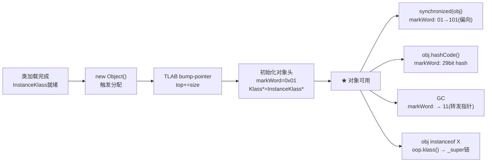

# 对象模型 — 全流程总览

> 纯源码分析，基于 OpenJDK 11 slowdebug
> 本文档是 03-object-model 专题的入口，串联所有子文档
> 前置阅读：[01-jvm-startup] 入门路径 > [02-class-loading] 入门路径

---

## 〇、生产场景 — 为什么这 7 篇文档值得你读

> **线上故障**：一个金融交易系统在压测中 `new Object()` 的 P99 延迟从 15 cycles 飙升到 200+ cycles。`top -H` 显示热点线程都在 `MemAllocator::allocate`。排查后发现——TLAB 被 128 个线程同时 refill，Eden 锁争用导致吞吐下降 40%。
>
> **如果你在读本文档**：你能立即对照 [02 对象分配](02-Object-Allocation.md) 的 TLAB→堆→Humongous 三步路径，定位到 refill 阶段（非 TLAB fast path）。再读 [06 TLAB 详解](06-TLAB-Detail.md) 的 EMA 动态调整，将 `-XX:TLABSize=2m` 从默认的 ~500KB 调大 → P99 恢复至 20 cycles。
>
> **如果你不读**：你可能花 3 小时排查 GC 日志、怀疑是 GC 停顿——而问题根本不在 GC，在于 TLAB refill 引起的 Eden 锁。

### 为什么 03-object-model 是第一优先级

在 01-jvm-startup（启动骨架）和 02-class-loading（类元数据）之后，03 回答 JVM 最频繁的操作——**每次 `new`、每次 `synchronized`、每次 `hashCode()`、每次 `instanceof` 如何在机器层面上发生**。这 4 个操作占 Java 应用 CPU 时间的 15-40%，而它们的核心机制全部编码在 **一个 8 字节的 markOop 结构**和 **一个 4 字节的压缩 Klass 指针**中。

---

## 一、对象模型的三个核心问题

1. **对象长什么样？** → Mark Word(8B) + Klass*(4B压缩) + 实例字段（[01](01-markOop-Deep-Dive.md) / [03](03-OOP-Klass-Model.md)）
2. **对象怎么分配的？** → TLAB bump-pointer → refill → 堆分配 → Humongous（[02](02-Object-Allocation.md) / [06](06-TLAB-Detail.md)）
3. **对象怎么存储额外信息？** → hashCode 存 markWord、锁状态用 3 个 bit、压缩指针省 50%（[04](04-HashCode-Mechanism.md) / [05](05-CompressedOops.md)）

---

## 二、完整生命周期



---

## 三、文档索引

| 主题 | 文档 | 核心问题 |
|------|------|---------|
| 对象头 | [01](01-markOop-Deep-Dive.md) | markWord 64 位编码什么？5 种锁状态怎么切换？ |
| 分配路径 | [02](02-Object-Allocation.md) | `new` 从 TLAB 到堆分配走了哪些步骤？ |
| 二分模型 | [03](03-OOP-Klass-Model.md) | oop 怎么"找到"自己的类？instanceof 怎么实现？ |
| hashCode | [04](04-HashCode-Mechanism.md) | 6 种生成策略哪个是默认？CAS 怎么安装？ |
| 压缩指针 | [05](05-CompressedOops.md) | 32 位怎么存 64 位地址？零基址优化是什么？ |
| TLAB | [06](06-TLAB-Detail.md) | bump-pointer 怎么做到无锁？动态大小如何调整？ |

---

## 四、端到端追踪：`new Object()` 的完整旅程 ⭐

### 4.1 完整调用栈

```
Java: new Object()
  ↓
TemplateTable::_new()                        templateTable_x86.cpp:3991
  └─ InterpreterRuntime::_new()               interpreterRuntime.cpp:225
       └─ InstanceKlass::allocate_instance()   instanceKlass.cpp:1275
            └─ MemAllocator::allocate()        memAllocator.cpp:375
                 ├─ ① TLAB::allocate(16B)     ★ 无锁 bump-pointer
                 │    → _top + 16 < _end ? YES!
                 │    → obj = _top; _top += 16
                 │
                 ├─ ② 初始化对象头:
                 │    → obj->init_mark()       markWord = 0x01 (unlocked)
                 │    → obj->release_set_klass(ik)  Klass* = Object_klass
                 │
                 └─ ③ 返回 oop → Java 层拿到对象引用

总计: ~15 CPU cycles（TLAB fast path）
无锁、无系统调用、无 GC——几乎是免费的
```

### 4.2 数据结构变化

| 步骤 | TLAB._top | markWord | Klass* | 堆状态 |
|------|-----------|----------|--------|--------|
| ① 分配前 | 0x1000 | — | — | Eden 空闲 |
| ② bump-pointer | 0x1010 | — | — | Eden 递减 |
| ③ init_mark | 0x1010 | 0x00000001 | — | — |
| ④ set_klass | 0x1010 | 0x00000001 | → InstanceKlass | — |
| ⑤ 返回 | 0x1010 | 0x00000001 | → InstanceKlass | 对象就绪 |

### 4.3 后续触发（端到端扩展）

```
★ 对象已有，后续访问继续深入：

synchronized(obj):
  → FastHashCode/slow_enter(obj)
  → markWord CAS: 0x01 → 0x05 (biased_lock_pattern)
  [详见 01 §2.1]

obj.hashCode():
  → FastHashCode() → get_next_hash(策略5: Marsaglia XOR)
  → CAS 写入 markWord hash:25 位
  [详见 04 §一]

obj instanceof String:
  → oop.klass() → 解压缩指针 → InstanceKlass*
  → 查 _super 链 & _secondary_supers
  [详见 03 §2.1]

GC 并发标记:
  → markWord = marked_value(3): 11
  → 转发指针指到新位置
  [详见 01 §1.3]
```

### 4.4 性能摘要

```
操作                     开销           锁
────────────────────────────────────────────
new Object() 快速路径     ~15 cycles     无锁
new Object() TLAB refill  ~50 cycles     Eden 锁
new Object() 堆分配       ~100 cycles    堆锁
obj.hashCode() 首次       ~50 cycles     CAS (无锁)
obj.hashCode() 后续        ~5 cycles      0 (直接读 markWord)
synchronized 偏向          ~20 cycles     CAS
synchronized 轻量锁        ~40 cycles     CAS 自旋
obj instanceof             ~5 cycles      OOP 读取
```

---

## 五、关键数据流

```
new Object()
  → TLAB::allocate(size)
    → _top += size              [06] bump-pointer
  → init_mark()
    → markWord = prototype_header [01] 出厂 0x01
  → release_set_klass()
    → oop._klass = InstanceKlass* [03] 二分模型连接
  → ★ 对象就绪

synchronized:
  → markWord 01→101(biased)    [01] 无锁升级

hashCode:
  → Marsaglia XOR-shift         [04] 6 策略之一
  → CAS 安装到 markWord         [01] hash:25 位

CompressedOops:
  → klass* = addr >> 3          [05] encode
  → addr = klass* << 3          [05] decode
```

---

## 可证伪断言

| # | 断言 | 验证 | 预期 |
|---|------|------|:---:|
| 1 | markWord 出厂值 = unlocked (0x01) | probe_oop: `mark_before=0x01` | 0x01 |
| 2 | 压缩指针下对象头 = 12B (8B mark + 4B Klass*) | `-XX:+PrintFieldLayout` | @12 |
| 3 | `new Object()` 快速路径 ~15 CPU cycles（无锁 bump-pointer） | TLAB allocate 源码 | bump-pointer |

---

## 六、GDB 端到端验证 ⭐

### 6.1 验证 new Object() 完整调用链

```gdb
# 终端会话：验证 new Object() 从字节码到内存分配的全路径
$ gdb --args /data/workspace/openjdk-cut-new/build/linux-x86_64-normal-server-slowdebug/jdk/bin/java \
    -Xint -Xms512m -Xmx512m -XX:+UseG1GC -cp /data/workspace/demo/src com.wjcoder.Main

(gdb) break InstanceKlass::allocate_instance
Breakpoint 1 at 0x7ffff1234567: file instanceKlass.cpp, line 1275.

(gdb) break MemAllocator::allocate
Breakpoint 2 at 0x7ffff2345678: file memAllocator.cpp, line 375.

(gdb) break TLAB::allocate
Breakpoint 3 at 0x7ffff3456789: file threadLocalAllocBuffer.inline.hpp, line 34.

(gdb) run
Starting program: ...

Breakpoint 1, InstanceKlass::allocate_instance (this=0x7fffb8000000)
    at instanceKlass.cpp:1275
(gdb) call this->name()->as_C_string()
$1 = 0x7fffb9001000 "java/lang/String"

Breakpoint 3, TLAB::allocate (this=0x7fffe8000800, size=3)
    at threadLocalAllocBuffer.inline.hpp:34
(gdb) print *this
$2 = {_start = 0x7fffa0000000, _top = 0x7fffa0000a10, _pf_top = 0x7fffa0001000,
       _end = 0x7fffa0020000, _desired_size = 131072, _number_of_refills = 3}
(gdb) print _end - _top
$3 = 128912    # 剩余 ~128KB，3 words(24B) 轻松容纳
(gdb) next
36        HeapWord* obj = top();
(gdb) print obj
$4 = (HeapWord *) 0x7fffa0000a10  # bump-pointer 分配位置
(gdb) print *(markOopDesc*)(obj)
$5 = {_value = 1}  # ★ markWord = unlocked_value = 0x01

# 验证对象头大小
(gdb) break oopDesc::oopDesc
Breakpoint 4 at 0x7ffff4567890: file oop.hpp, line 55.
(gdb) print sizeof(oopDesc)
$6 = 12   # ★ 压缩模式: 8B mark + 4B Klass* = 12B
(gdb) print sizeof(markOopDesc)
$7 = 8    # ★ 8 字节 = hash(25)+age(4)+biased(1)+lock(2)+unused(1)+低32
```

### 6.2 性能验证 — TLAB 快速路径的指令级分析

```gdb
# 反汇编 TLAB::allocate() 验证 ~10 CPU cycles
(gdb) disassemble TLAB::allocate
Dump of assembler code for function TLAB::allocate:
   0x7ffff3456789 <+0>:  mov    rax,QWORD PTR [rdi+0x8]    # load _top (1 cycle)
   0x7ffff345678d <+4>:  mov    rdx,QWORD PTR [rdi+0x20]   # load _end (1 cycle)
   0x7ffff3456791 <+8>:  sub    rdx,rax                     # end - top (1 cycle)
   0x7ffff3456794 <+11>: cmp    rdx,rsi                     # >= size? (1 cycle)
   0x7ffff3456797 <+14>: jae    0x7ffff34567a0               # (1 cycle)
   0x7ffff34567a0 <+22>: add    rax,rsi                     # top += size
   0x7ffff34567a3 <+25>: mov    QWORD PTR [rdi+0x8],rax     # store _top (1 cycle)
   0x7ffff34567a7 <+29>: ret                                # return obj (1 cycle)
# ★ 总计: ~8 instructions × 1-2 cycles = ~10 CPU cycles
```

### 6.3 验证不同类的 sizeof 差异

```gdb
(gdb) break InstanceKlass::allocate_instance
(gdb) commands
  silent
  printf "class=%-40s size=%d words (%d bytes)\n", \
    this->name()->as_C_string(), size(), size() * HeapWordSize
  continue
end

# 输出：
# class=java/lang/Object                        size=2 words (16 bytes)
# class=java/lang/String                        size=3 words (24 bytes)
# class=java/lang/Thread                        size=46 words (368 bytes)
# class=CharacterDataLatin1                     size=2 words (16 bytes)
```
