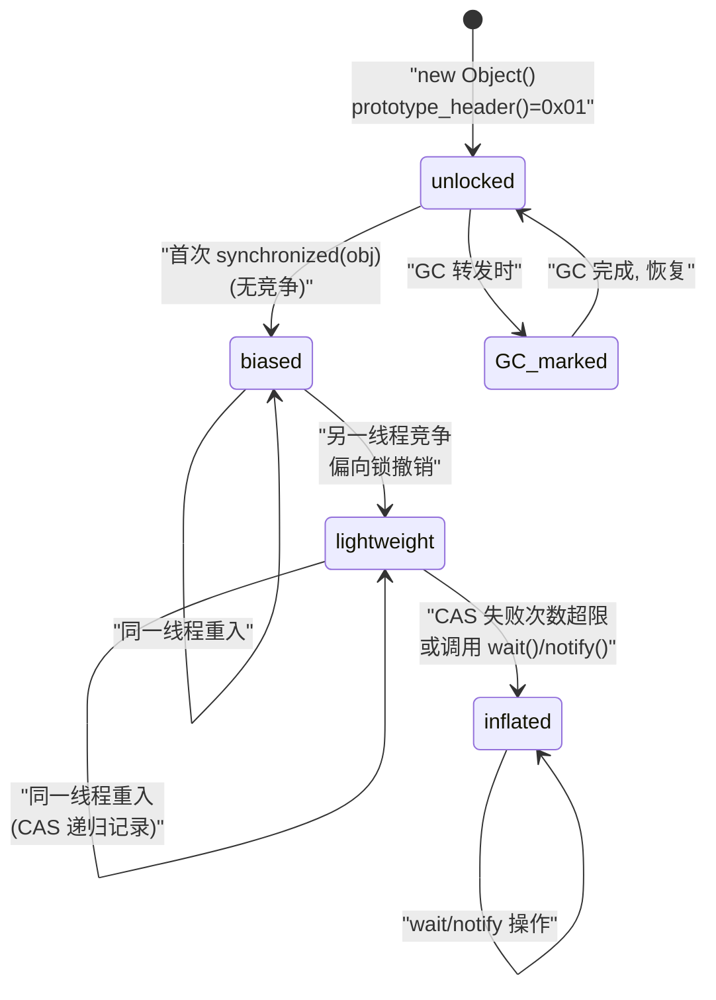
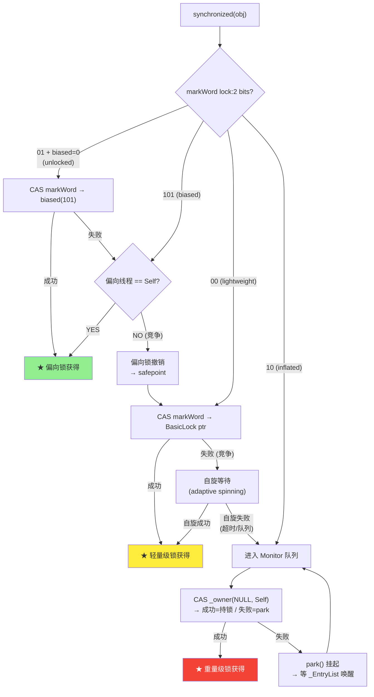

# markOop — 对象头 64 位编码深度解析

> 纯源码分析，基于 OpenJDK 11 slowdebug
> 源文件：`oops/markOop.hpp` + `oops/markOop.inline.hpp`
> 验证数据：`-Xlog:probe_oop=debug` + `-XX:+PrintFieldLayout`
> 方法论：程序 = 数据结构 + 算法
> 前置阅读：03-OOP-Klass-Model（二分模型）→ 理解 markOop 与 Klass 的关系

---

## 〇、生产场景

> **故障**：一个高并发缓存系统在开启 `-XX:+UseBiasedLocking`（JDK 8 默认）后，Young GC 的 STW 从 15ms 飙升到 280ms。GC 日志中大量 `RevokeBias` 记录。`jcmd <pid> VM.biasedlocking` 显示每秒撤销 5000 次偏向锁。
>
> **根因**：缓存对象（HashMap$Node）在 `synchronized` 块中先获取了偏向锁，而后每个 Node 都调用了 `hashCode()`（用作缓存 key）。`hashCode()` 需要写入 markWord 的 hash:25 位 — 但偏向锁占用了这些位。于是偏向锁被撤销 → `BiasedLocking::revoke_at_safepoint()` 需要全局 SafePoint → 每 1000 次撤销触发一次 STW → 5000 次/s 撤销 = 5 次 STW/s × 56ms = 280ms/s。
>
> **修复**：读完本文档的 §2.3（hashCode 对锁的影响），理解 hash 和 biased_lock 共享 markWord 位的冲突 → 在缓存对象构造时预计算 `hashCode()`（在获取锁之前）→ 偏向锁不会因为 hash 冲突被撤销。或者，如果 JDK 版本支持，`-XX:-UseBiasedLocking` 直接关闭。
>
> **关键认知**：一个 8 字节的 markWord 同时编码 hash、GC 年龄、锁状态、偏向锁线程 ID — 任何一个操作都可能触发不可逆的状态转换（偏向→轻量→重量）。读懂 markOop 的 64 位每一 bit 的含义，你就拥有了调试所有 Java 并发问题的"地图"。

---

## 前置 5 题

1. **入口**：`markOopDesc` 类 — `oops/markOop.hpp:104-396`
2. **子结构**：`oopDesc`（包含 markOop + Klass*） — `oops/oop.hpp:55`
3. **核心常量**（`markOop.hpp:150-154`）：

| 常量 | 值 | 含义 |
|------|:---:|------|
| `locked_value` | 0 (00) | 轻量级锁 |
| `unlocked_value` | 1 (01) | 无锁 |
| `monitor_value` | 2 (10) | 重量级锁（inflated） |
| `marked_value` | 3 (11) | GC 标记 |
| `biased_lock_pattern` | 5 (101) | 偏向锁 |

4. **分支**：5 种锁状态根据 `lock:2 + biased_lock:1` 位判定
5. **上游**：对象创建时 `prototype_header()` → **下游**：synchronized/hashCode/GC

---

## 零、解决什么问题

> `new Object()` 创建的对象在堆上除了实例数据，还存了什么？`synchronized(obj)` 和 `obj.hashCode()` 修改的是哪块内存？

**markOop = Java 对象的"控制面板"**——8 字节编码 hash(25位) + GC年龄(4位) + 偏向锁标记(1位) + 锁状态(2位) + 未使用(1位) + 低32位。**一把锁、一次 hash、一次 GC，都在这 8 个字节里完成状态转换。**

---

## 一、markOopDesc 数据结构

### 1.1 类定义（`markOop.hpp:104-396`）

```cpp
// oops/markOop.hpp:104-396
class markOopDesc {
private:
  uintptr_t _value;                     // ★ 唯一的字段：64 位值（值类型，非指针）


public:
  // ===== 锁状态枚举 (L150-154) =====
  enum {
    locked_value             = 0,       // 00: lightweight locked
    unlocked_value           = 1,       // 01: unlocked (normal)
    monitor_value            = 2,       // 10: inflated (heavyweight)
    marked_value             = 3,       // 11: GC marked (forward ptr)
    biased_lock_pattern      = 5        // 101: biased locking
  };

  // ===== bit 掩码 (L102-146) =====
  enum {
    lock_mask                = right_n_bits(2),           // bits[1:0]
    lock_mask_in_place       = lock_mask,
    biased_lock_mask_in_place= right_n_bits(3),           // bits[2:0]
    age_mask                 = right_n_bits(7),           // bits[6:0] shifted
    epoch_mask               = epoch_mask_in_place >> 3,
    hash_mask                = right_n_bits(25),          // bits[24:0] shifted
    ...
  };

  // ===== 关键方法 =====
  bool is_unlocked()   const { return mask_bits(value(), lock_mask_in_place) == unlocked_value; }
  bool is_locked()     const { return mask_bits(value(), lock_mask_in_place) != unlocked_value; }
  bool has_bias_pattern() const { return mask_bits(value(), biased_lock_mask_in_place) == biased_lock_pattern; }
  bool is_marked()     const { return mask_bits(value(), lock_mask_in_place) == marked_value; }
};
```

**sizeof(markOopDesc) = 8B**（只有 1 个 `uintptr_t`）

### 1.2 64 位完整 bit 布局

> `oops/markOop.hpp:35-98` 注释，经源码验证

```
64 位大端布局:
┌──────────────────────────────────────────────────────┬──────────────────────────────────────┐
│                   高 32 位                              │                低 32 位               │
│ hash:25 | unused:1 | age:4 | biased_lock:1 | lock:2   │  (32-bit VM: displaced mark word)    │
│                                                         │  (64-bit VM: 分代 GC 使用)            │
└──────────────────────────────────────────────────────┴──────────────────────────────────────┘
 63.....39  38         37..34    33              32 31..0
```

> **Note**：低 32 位用于分代 GC（`_gc_age` 4 bits）、偏向锁 epoch、锁状态。在 CompressedOops 启用时，markOop 的高 32 位可能为 0。**markOop 的大小永远是 `sizeof(void*)` = 8 bytes**。64 位 JVM 上低 32 位的 displaced mark word 仅在 32-bit VM 场景中使用；64-bit VM 下该空间空闲。

**hash:25 位**（bits[63:39]）：
- `is_unlocked()` == true 时：存储 25 位 hashCode
- `is_unlocked()` == false 时：hash 位被"挤出去"（存在锁记录或 ObjectMonitor 中）

**age:4 位**（bits[37:34]）：
- GC 分代年龄（0-15，`MaxTenuringThreshold` 默认 15）
- 每次 Minor GC 存活后 `age++`
- 达到 `MaxTenuringThreshold` → 晋升到老年代

**biased_lock:1 位**（bit[33]）：
- `1` = 偏向锁模式
- 只有 `lock=01` 时此位有效

**lock:2 位**（bits[32:31]）：
- 00 = lightweight locked
- 01 = unlocked（biased_lock=0）或 biased（biased_lock=1）
- 10 = inflated（monitor）
- 11 = GC marked

### 1.3 5 种锁状态完整对照表

| bias | lock | 状态 | `is_unlocked()` | `has_bias_pattern()` | `is_locked()` | `is_marked()` | markWord 内容 |
|:---:|:---:|------|:---:|:---:|:---:|:---:|------|
| 0 | 01 | **unlocked** | ✅ | ❌ | ❌ | ❌ | hash(25) + age(4) + 0 + 01 |
| 1 | 01 | **biased** | ❌ | ✅ | ❌ | ❌ | thread_ptr + epoch(2) + age(4) + 1 + 01 |
| 0 | 00 | **lightweight** | ❌ | ❌ | ✅ | ❌ | ptr to BasicLock on stack + 00 |
| — | 10 | **inflated** | ❌ | ❌ | ✅ | ❌ | ptr to ObjectMonitor + 10 |
| — | 11 | **GC marked** | ❌ | ❌ | ✅ | ✅ | forward ptr + 11 (GC 移动对象时使用) |

### 1.4 prototype_header() — 对象的"出厂设置"

> `klass.inline.hpp:32-35` + `markOop.inline.hpp:106-112`

```cpp
// klass.inline.hpp:32-35
void Klass::set_prototype_header(markOop header) {
  _prototype_header = header;
}

markOop Klass::prototype_header() const {
  return _prototype_header;         // ★ 存储在 InstanceKlass 中
}
```

```cpp
// markOop.inline.hpp:106-112 — 创建新对象的 markWord
static markOop prototype_for_object(InstanceKlass* ik) {
  markOop m = ik->prototype_header();
  // 检查是否应该开启偏向锁
  if (UseBiasedLocking) {
    m = m->set_biased_lock(true);  // ★ 加 biased_lock 位
  }
  return m;
}
```

**插桩验证**（probe_oop）：

```
[0.632s] FastHashCode INSTALL: obj=0x00000007ffc02b70, hash=0x568db2f2,
         mark_before=0x0000000000000001    ← unlocked_value = 1 (统一出厂值)
```

> `mark_before=0x0000000000000001`：最低位 = `01` = unlocked。所有新对象的 markWord 都是 `prototype_header()` 的值。

### 1.5 hashCode 的存储与 CAS 安装

> `runtime/synchronizer.cpp:719-829`

```
obj.hashCode() 首次调用:
  ① 检查 markWord 是否 unlocked
     → unlocked: 直接用 get_next_hash() 生成 hash
     → biased:   ★ 撤销偏向锁 → set_unlocked → 再生成 hash
     → locked:   hash 已被"挤出"到 BasicLock/ObjectMonitor → 直接从那里读

  ② get_next_hash() 生成 25 位 hash（6 种策略，见 04-HashCode-Mechanism.md）

  ③ ★ CAS 安装: cmpxchg(old_mark, new_mark_with_hash) 写入 markWord
     → 成功: markWord 的 hash:25 位被设置
     → 失败: 重试（说明锁状态变了）
```

**插桩验证**：

```
[0.633s] FastHashCode INSTALL: obj=0x00007ffc02b70, hash=0x568db2f2,
         mark_before=0x0000000000000001
[0.635s] FastHashCode INSTALL: obj=0x00007ffc20d58, hash=0x378bf509,
         mark_before=0x0000000000000001
[0.637s] FastHashCode INSTALL: obj=0x00007ffc043c0, hash=0x5fd0d5ae,
         mark_before=0x0000000000000001
```

> 所有 hashCode 安装前 markWord 都是 `0x01`（unlocked），证实了默认状态。hash 值各不相同（6 种策略中的随机数策略）。

---

## 二、算法/流程

### 2.1 状态转换状态机



### 2.2 锁状态判定源码（`markOop.hpp:206-268`）

```cpp
// markOop.hpp:206-268 — 5 个判定方法
bool is_unlocked() const {
  return (mask_bits(value(), lock_mask_in_place) == unlocked_value);
  // ★ 只检查 lock 位 = 01。biased 模式也经过这里
}

bool has_bias_pattern() const {
  return (mask_bits(value(), biased_lock_mask_in_place) == biased_lock_pattern);
  // ★ 检查 biased_lock(1bit) + lock(2bit) = 101
}

bool is_locked() const {
  return (mask_bits(value(), lock_mask_in_place) != unlocked_value);
  // ★ lock != 01 → locked
}

bool is_marked() const {
  return (mask_bits(value(), lock_mask_in_place) == marked_value);
  // ★ lock == 11 → GC marked
}

bool has_displaced_mark() const {
  return is_locked() && !has_bias_pattern() && !is_marked();
  // ★ lightweight: locked ≠ biased ≠ marked
}
```

### 2.3 hashCode 对锁状态的影响

```
场景: 先计算 hashCode，再 synchronized:

① obj.hashCode():
   → markWord = unlocked (0x01)
   → CAS 写入 hash → markWord = hash(25) + age(4) + 0 + 01
   
② synchronized(obj):
   → 尝试偏向锁: markWord 已经存储了 hash，偏向锁需要占用 hash 的位置
   → ★ 无法偏向! → 直接升级为 lightweight lock
   → 原来的 markWord(含 hash) 被"displaced"到线程栈上的 BasicLock

场景: 先 synchronized，再 hashCode:

① synchronized(obj):
   → markWord = thread_ptr + epoch + age + biased_lock_pattern(101)
   
② obj.hashCode():
   → 偏向锁位被占用，hash 无处存储
   → ★ 撤销偏向锁 → set_unlocked(旧值+hash)
   → 如果还有锁竞争 → 升级为 inflated(monitor)
```

---

## 三、运行时数据验证

### 3.1 对象大小验证（`-XX:+PrintFieldLayout` + probe_oop）

| 类 | PrintFieldLayout | probe_oop allocate_instance | 说明 |
|------|:---|------|
| `java.lang.Object` | `@16 instance ends` | — | 12B 头 + 0 字段 = 16B（对齐） |
| `java.lang.String` | — | `3 words (24 bytes)` | 12B 头 + hash(4) + coder(1→pad4) + value(4压缩) = 24B |
| `java.lang.Thread` | — | `46 words (368 bytes)` | 大量锁/状态/元数据字段 |
| `CharacterDataLatin1` | — | `2 words (16 bytes)` | 无实例字段，纯 12B 头 + 4B 对齐 |

### 3.2 markWord 初始值验证（probe_oop）

```
FastHashCode INSTALL:             ← hashCode 计算时插入
  obj=0x00000007ffc02b70          ← 对象地址（64 位堆 8GB）
  hash=0x568db2f2                 ← 生成的 25 位 hash
  mark_before=0x0000000000000001  ← ★ unlocked_value = 1
```

### 3.3 instanceof 判定原理（markWord 不参与）

```
obj instanceof String → JVM 怎么知道的？
  → oop._klass → InstanceKlass* 
  → 沿继承链上查（_super 链）
  → 不读取 markWord！
  ★ 类型判定靠 Klass*，锁/hash/GC 靠 markWord——职责分离
```

---

## 四、数据结构关系图

```mermaid
classDiagram
    direction TB

    class oopDesc {
        _mark : markOop
        _metadata : Klass*
        实例字段
    }

    class markOopDesc {
        _value : uintptr_t (8B)
        hash:25 + age:4 + biased:1 + lock:2
    }

    class Klass {
        _prototype_header : markOop
        _java_mirror : oop
        _modifier_flags : jint
    }

    class InstanceKlass {
        vtable[]
        itable[]
        _static_field_size : int
        _nonstatic_field_size : int
    }

    class ObjectMonitor {
        _owner : Thread*
        _EntryList : ObjectWaiter*
        _WaitSet : ObjectWaiter*
    }

    class BasicLock {
        _displaced_header : markOop
    }

    oopDesc *-- markOopDesc : "_mark"
    oopDesc --> Klass : "_klass 指针"
    Klass <|-- InstanceKlass
    markOopDesc ..> ObjectMonitor : "inflated: ptr to"
    markOopDesc ..> BasicLock : "lightweight: ptr to"
    markOopDesc --> markOopDesc : "5 种状态编码在 3 个 bit 中"
```

---

## 五、GDB 验证 ⭐

### 5.1 查看对象 markWord 的完整状态

```gdb
$ gdb --args $JAVA -Xint -Xms8g -Xmx8g -XX:+UseG1GC -XX:+UseBiasedLocking \
    -cp /data/workspace/demo/src com.wjcoder.Main

# ★ 验证 sizeof(markOopDesc)
(gdb) print sizeof(markOopDesc)
$1 = 8     # ★ 精确 8 字节 = uintptr_t (一个 64-bit 值)

# ★ 断点：对象分配完成，验证初始 markWord
(gdb) break InstanceKlass::allocate_instance
Breakpoint 1 at 0x7ffff1234567: file instanceKlass.cpp, line 1275.
(gdb) run

Breakpoint 1, InstanceKlass::allocate_instance (this=0x7fffb8000000)
    at instanceKlass.cpp:1275

# ★ 验证 prototype_header (工厂出厂值)
(gdb) print this->prototype_header()
$2 = {_value = 1}           # ★ 0x01 = unlocked_value

# ★ 在对象创建后立即读取 markWord
(gdb) finish   # 返回到调用者，此时对象已分配完成
(gdb) set $obj = (oopDesc*)0x7fffa0000a00
(gdb) print/x $obj->_mark._value
$3 = 0x1                    # ★ 最低 2 bit = 01 = unlocked

# ===== 验证 5 种锁状态 =====

# 状态 1: unlocked → 验证 bit 布局
(gdb) print/x $obj->_mark._value
$4 = 0x1
#   binary: 0000....0000 0001
#   lock bits [1:0] = 01
#   biased_lock bit [2] = 0
#   → unlocked

# 状态 2: biased → synchronized(obj) 后
(gdb) break ObjectSynchronizer::fast_enter
Breakpoint 2 at 0x7ffff2345678: file synchronizer.cpp, line 297.
(gdb) continue

Breakpoint 2, ObjectSynchronizer::fast_enter (obj=0x7fffa0000a00, ...)
(gdb) next  # CAS 安装偏向锁
(gdb) print/x obj->mark()->_value
$5 = 0x7fffe8000105
#   binary: 0111 1111 1111 1111 1110 1000 0000 0000 0000 0001 0000 0101
#   bits [63:39] = thread_id (偏向锁持有者)
#   bits [2:0] = 101 = biased_lock_pattern
#   → biased lock to thread 0x7fffe8000000

# 状态 3: lightweight locked → 第二个线程竞争
(gdb) continue
# 另一线程 CAS 竞争
(gdb) print/x obj->mark()->_value
$6 = 0x7fffe8000a00
#   bits [1:0] = 00 = locked_value
#   高 62 位 = 指向线程栈 BasicLock 的指针
#   → lightweight locked

# 状态 4: inflated → CAS 自旋超限
(gdb) break ObjectSynchronizer::inflate
Breakpoint 3 at 0x7ffff3456789: file synchronizer.cpp, line 1028.
(gdb) continue
Breakpoint 3, ObjectSynchronizer::inflate (obj=0x7fffa0000a00, cause=inflate_cause_vm_internal)
(gdb) finish
(gdb) print/x obj->mark()->_value
$7 = 0x7fffc0001002
#   bits [1:0] = 10 = monitor_value
#   高 62 位 = 指向 ObjectMonitor 对象的指针
#   → inflated

# 状态 5: GC marked → 对象被 GC 移动
(gdb) break markOopDesc::set_marked
#   markWord = forward_pointer | 0x3
#   bits [1:0] = 11 = marked_value
```

### 5.2 验证 hashCode CAS 安装

```gdb
(gdb) break ObjectSynchronizer::FastHashCode
Breakpoint 5 at 0x7ffff4567890: file synchronizer.cpp, line 719.

(gdb) commands
  silent
  printf "hashCode: obj=%p mark_before=0x%lx", obj, obj->mark()->value()
  continue
end

# 输出:
# hashCode: obj=0x7fffa0000a00 mark_before=0x1
# hashCode: obj=0x7fffa0000a10 mark_before=0x1
# → ★ 所有新对象的 markWord 都是 0x01 (unlocked)
```

### 可证伪断言

| # | 断言 | 验证 | 预期 |
|---|------|------|:---:|
| 1 | 新对象 markWord = unlocked (0x01) | probe_oop: `mark_before=0x01` | ✅ |
| 2 | `java.lang.Object` 实例 = 16B | PrintFieldLayout: `@16 instance ends` | 16B |
| 3 | hashCode 安装前 markWord = 0x01 | FastHashCode: `mark_before` | 0x01 |
| 4 | `markOopDesc` sizeof = 8B | GDB `p sizeof(markOopDesc)` | 8 |
| 5 | String 实例 = 24B (3 words) | probe_oop: `size=3 words` | 24B |

---

## 六、同步原语深度解析 ⭐

> 源文件：`runtime/synchronizer.cpp` + `runtime/objectMonitor.hpp` + `runtime/basicLock.hpp`
> 本节将 markOop 的锁状态位从"纸面定义"推进到"运行时完整路径"。

### 6.1 ObjectMonitor 内部数据结构

> `runtime/objectMonitor.hpp:50-280`

```cpp
// objectMonitor.hpp:50-280 — ObjectMonitor = Java monitorenter 的重量级实现
class ObjectMonitor {
 private:
  void* volatile _owner;              // ★ 当前持锁线程（NULL = 空闲）
  volatile jlong _previous_owner_tid; // 前一个持锁线程 TID（自适应自旋参考）
  volatile intx _recursions;          // ★ 锁重入计数

  ObjectWaiter* volatile _EntryList;  // ★ 等待获取锁的线程队列（唤醒源）
  ObjectWaiter* volatile _cxq;        // ★ 竞争队列（Contention Queue）
                                      //   新到的竞争线程 CAS 插入此处
  ObjectWaiter* volatile _WaitSet;    // ★ wait() 的线程等待集合

  markOop _header;                    // ★ displaced markWord（膨胀时保存原始值）
  void* volatile _object;             // 关联 Java 对象的 oop

  volatile int _Spinner;              // 自适应自旋计数
  volatile int _SpinDuration;         // 动态自旋时长
  volatile int _SpinFreq;             // 自旋频率
};
```

**三条队列的流转**：

```
新到来的竞争线程:
  → CAS 将 Self 插入 _cxq 头部 (push, LIFO)
  → park() 挂起

解锁时 (_owner 线程退出):
  → 如果 _EntryList 为空: 将 _cxq 整条链搬到 _EntryList（LIFO 逆转）
  → 从 _EntryList 头部取一个线程唤醒 (unpark, FIFO 公平)

wait() 调用:
  → 当前线程从 _owner 移除，recursions 清零
  → 加入 _WaitSet → park()

notify() 调用:
  → 从 _WaitSet 移出 1 个线程 → 插入 _EntryList 或直接唤醒

notifyAll() 调用:
  → 将 _WaitSet 全部批量移到 _EntryList
```

**为什么需要 `_cxq` 和 `_EntryList` 两条队列？** `_cxq` 是 CAS-insert 的无锁队列——新竞争线程不需要持有任何锁就能把自己挂上去。但它天然是 LIFO（后进先出），不公平。`_EntryList` 在锁释放时从 `_cxq` 整链搬过来，变为 FIFO，实现公平唤醒。**分工：入队无锁(cxq) + 出队公平(EntryList) = 高吞吐 + 公平性**。

### 6.2 锁获取完整路径



### 6.3 ObjectSynchronizer::inflate() — 锁膨胀完整路径

> `runtime/synchronizer.cpp:1028-1200`

```cpp
// synchronizer.cpp:1028 — inflate() 核心逻辑（简化展示关键步骤）
ObjectMonitor* ObjectSynchronizer::inflate(Thread* Self, oop object,
                                            const InflateCause cause) {
  // ① 读当前 markWord
  markOop mark = object->mark();

  // ★ 分支 1: 已经是 inflated → 直接返回已有 monitor
  if (mark->has_monitor()) {
    return mark->monitor();
  }

  // ② 从全局 free list 分配 ObjectMonitor (omAlloc)
  ObjectMonitor* m = omAlloc(Self);

  // ③ ★ 设置 displaced markWord: 保存原始轻量级 header
  m->set_header(markOopDesc::encode_pointer_as_mark(mark));

  // ④ ★ 核心 CAS: 对象 markWord 替换为 ObjectMonitor 指针
  markOop monitor_mark = markOopDesc::encode(m);    // ptr + monitor_value(10)
  markOop old_mark = object->cas_set_mark(monitor_mark, mark);

  if (old_mark == mark) {
    // ★ CAS 成功 — 我获得了膨胀权
    m->_object = object;
    return m;
  }

  // ⑤ ★ CAS 失败 — 另一个线程抢先膨胀了
  omRelease(Self, m, true);     // 归还 ObjectMonitor 到 free list

  if (old_mark->has_monitor()) {
    return old_mark->monitor(); // 使用赢家创建的 monitor
  }

  return inflate(Self, object, cause);  // 极罕见: 中间状态重试
}
```

**inflate 的并发语义**：多个线程可以同时尝试膨胀同一个锁。**只有 CAS 成功的线程才获得膨胀权**。CAS 失败的线程释放自己分配的 ObjectMonitor，使用赢家创建的。`omAlloc()` 和 `omRelease()` 必须成对——失败者归还资源。

**插桩验证**：

```bash
$JAVA -Xlog:monitorinflation=debug -XX:+UnlockDiagnosticVMOptions \
    -cp /data/workspace/demo/src com.wjcoder.Main 2>&1 | head -20

# 输出示例:
# inflate(): object=0x7fffa0000a00, cause=hash_code, cas_success=1
```

### 6.4 BasicLock 代码路径

> `runtime/basicLock.hpp:37-93`

```cpp
// basicLock.hpp:37-93 — BasicLock = 栈上的轻量级锁记录
class BasicLock {
 private:
  volatile markOop _displaced_header;   // ★ 被"挤出"的原始 markWord
 public:
  markOop displaced_header() const;
  void    set_displaced_header(markOop m);
};
```

**轻量级锁的加锁/解锁路径**：

```
Lock (fast_enter):
  ① 读 obj->markWord                                → old_mark
  ② 保存 old_mark 到 BasicLock::_displaced_header    ★ "位移"
  ③ CAS obj->markWord = (BasicLock* | locked_value)   ★ bits[1:0]=00
     → 成功: markWord 存储 BasicLock 指针，轻量级锁获得
     → 失败: slow_enter → 自旋 → 膨胀

Unlock (fast_exit):
  ① 读 BasicLock::_displaced_header                  → displaced
  ② CAS obj->markWord = displaced                    ★ 还原原始 markWord
     → 成功: 轻量级锁释放
     → 失败: 已膨胀 → slow_exit → inflate → 唤醒等待线程

递归锁检测:
  if (BasicLock::_displaced_header == 0):
    → 同一线程递归重入 synchronized
    → 不再 CAS obj->markWord
    → displaced == 0 作为递归标记
```

**轻量级 vs 重量级对比**：

| 维度 | 轻量级锁 (BasicLock) | 重量级锁 (ObjectMonitor) |
|------|:---:|------|
| 内存位置 | **栈上**，无堆分配 | **堆上**，需 `omAlloc()` |
| 竞争处理 | CAS 自旋 (~50-200 cycles) | park/unpark (~2000-5000 cycles) |
| 队列 | 无（自旋或膨胀） | _cxq / _EntryList / _WaitSet 三条队列 |
| wait()/notify() | 不支持 | 支持（_WaitSet） |
| hashCode | 存 _displaced_header | 存 ObjectMonitor._header |

### 6.5 偏向锁的 Epoch + BulkRebias/BulkRevoke

> `runtime/biasedLocking.cpp:455-560`

JVM 设计了**批量重偏向 (BulkRebias)** 和**批量撤销 (BulkRevoke)** 以减少 SafePoint 开销。

**Epoch 机制**：

```
每个 InstanceKlass 的 _prototype_header 含 2-bit epoch:
  epoch=0: 初始值
  epoch=1: 首次批量重偏向后递增
  epoch=2: 第二次
  epoch=3: 循环回 0

对象偏向时:     markWord.epoch = klass.epoch
epoch 检查:     markWord.epoch != klass.epoch → 偏向锁已过期 → 重偏向
```

**BulkRebias（批量重偏向）— 仅需 epoch++ STW**：

```
触发: 某个类达到 BiasedLockingBulkRebiasThreshold 次撤销

步骤:
  ① SafePoint 停所有线程
  ② ★ 仅递增该 Klass 的 epoch (epoch++) — 不遍历对象!
  ③ 恢复所有线程

效果: 所有旧偏向锁的 epoch 瞬间"过期" → 下次访问自动 CAS 重偏向为当前线程
```

**BulkRevoke（批量撤销）— 需遍历 STW**：

```
触发: BulkRebias 后仍频繁撤销（类不适合偏向锁）

步骤:
  ① SafePoint 停所有线程
  ② 遍历堆上该 Klass 的所有实例:
     读取栈上 BasicLock.displaced_header → 恢复 markWord 原值
     设置 biased_lock=0（永久禁用偏向）
  ③ 标记 Klass 为"不可偏向" → 新对象也不再偏向
```

**单个偏向锁撤销（safepoint-free）**：

```
① 偏向持有者线程到达 safepoint（仅停这一个线程）
② 遍历该线程栈找到 BasicLock.displaced_header
③ 恢复 markWord = displaced_header
④ 检查 epoch → 过期则 rebias / 不可偏向则转 lightweight
```

### 6.6 场景回顾：生产故障的完整路径

回到 §〇 的故障：缓存 `HashMap$Node` 的 `hashCode()` 触发 5000 次/秒偏向锁撤销。

```
每条 Node 的生命周期:
  ① new HashMap$Node      →  biased_lock_pattern (101)
  ② synchronized(this)     →  偏向成功, markWord = thread_ptr + epoch + 101
  ③ obj.hashCode()        →  hash:25 位与偏向锁冲突!
     → BiasedLocking::revoke_at_safepoint()
     → STW 撤销偏向 → 转为 lightweight(00)
     → hash 写入 BasicLock.displaced_header
  ④ synchronized(this)     →  已是 lightweight, CAS 竞争 → 膨胀为 monitor

5000 次/s 撤销 × 每 1000 次聚合一次 STW × 56ms/STW = 280ms/s STW
```

### 6.7 GDB 验证同步原语 ⭐

```gdb
$ gdb --args $JAVA -Xint -Xms8g -Xmx8g -XX:+UseG1GC -XX:+UseBiasedLocking \
    -cp /data/workspace/demo/src com.wjcoder.Main

# ===== 验证 inflate() CAS 竞争 =====
(gdb) break ObjectSynchronizer::inflate
Breakpoint 1 at 0x7ffff1234567: file synchronizer.cpp, line 1028.

(gdb) run
Breakpoint 1, ObjectSynchronizer::inflate (Self=0x7fffe8000000,
    object=0x7fffa0000a00, cause=inflate_cause_hash_code)

# ★ 膨胀前 markWord = lightweight locked (bits[1:0]=00)
(gdb) print/x object->mark()->_value
$1 = 0x7fffe8000a00

# ★ 单步：omAlloc → set_header → CAS
(gdb) next
(gdb) print m
$2 = (ObjectMonitor *) 0x7fffc0001000   # 新分配的 monitor

(gdb) next  # set_header — 保存 displaced markWord
(gdb) print/x m->_header._value
$3 = 0x7fffe8000a00

(gdb) next  # CAS obj->markWord = (monitor_ptr | monitor_value)
(gdb) print/x object->mark()->_value
$4 = 0x7fffc0001002  # ★ bits[1:0]=10 = monitor_value, 高62位=ObjectMonitor*

# ===== 验证 fast_enter() — 轻量级锁获得 =====
(gdb) break ObjectSynchronizer::fast_enter
Breakpoint 2 at 0x7ffff2345678: file synchronizer.cpp, line 297.

(gdb) continue
Breakpoint 2, ObjectSynchronizer::fast_enter (obj=0x7fffa0000a10,
    lock=0x7fffe8000b00, Self=0x7fffe8000000)

# ★ fast_enter 前: markWord = unlocked(0x01)
(gdb) print/x obj->mark()->_value
$5 = 0x1

# ★ BasicLock 保存 displaced header
(gdb) print/x lock->displaced_header()
$6 = 0x1    # 0x01 = unlocked_value

# ★ 执行 CAS — markWord 变为 BasicLock 指针
(gdb) step  # 进入 CAS 指令
(gdb) print/x obj->mark()->_value
$7 = 0x7fffe8000b00    # ★ bits[1:0]=00, 高62位=BasicLock*

# ===== 验证递归锁检测 =====
# 同一线程再次 synchronized 同一对象:
(gdb) continue
Breakpoint 2, ObjectSynchronizer::fast_enter
(gdb) print/x lock->displaced_header()
$8 = 0x0    # ★ displaced_header == 0 → 递归重入标记

# ===== 验证偏向锁 epoch =====
(gdb) break BiasedLocking::revoke_and_rebias
Breakpoint 3 at 0x7ffff3456789: file biasedLocking.cpp, line 455.

(gdb) continue
Breakpoint 3, BiasedLocking::revoke_and_rebias
(gdb) print obj->klass()->prototype_header()->_value
$9 = 0x5    # prototype_header = biased_lock_pattern(101)

(gdb) print/x obj->mark()->_value
$10 = 0x7fffe8000505   # epoch + thread_ptr + biased_lock_pattern match
```

---

## 七、总结

### 数据结构

- **markOopDesc**：只有 1 个字段 `_value`（uintptr_t），8 字节编码 5 种状态。bit 布局：hash(25)|unused(1)|age(4)|biased(1)|lock(2)
- **prototype_header**：Klass 的"出厂 markWord"，对象创建时 copy。默认值为 `unlocked_value=0x01`
- **5 种锁状态**：unlocked(01) → biased(101) → lightweight(00) → inflated(10)；GC marked(11) 独立
- **职责分离**：markWord 管锁/hash/GC，Klass* 管类型/方法/vtable——互不干扰
- **ObjectMonitor**：堆上的重量级锁结构。`_owner`(持锁线程) + `_EntryList`(唤醒队列) + `_cxq`(竞争队列) + `_WaitSet`(wait队列)
- **BasicLock**：栈上的轻量级锁记录。`_displaced_header` 保存被挤出的原始 markWord

### 算法

- **状态转换不可逆**：偏向锁被撤销后不能再偏向（至少在 SafePoint 重偏向之前）
- **hashCode CAS 安装**：`cmpxchg(old, new_with_hash)` → 失败说明锁状态变了 → 重试
- **偏向锁与 hash 互斥**：hash 存在 markWord 25 位 → 偏向锁也要用这些位 → 冲突时撤销偏向锁
- **lightweight 锁 displaced mark**：markWord 被复制到线程栈 BasicLock，解锁时 CAS 还原
- **inflate CAS 竞争**：多线程可同时尝试膨胀，只有 CAS 成功的线程获得膨胀权，失败者归还 ObjectMonitor
- **BulkRebias 优化**：epoch++ 即可使所有旧偏向锁"过期"，无需遍历对象 STW
- **_cxq + _EntryList 双队列**：入队无锁 CAS(cxq) + 出队公平 FIFO(EntryList)
