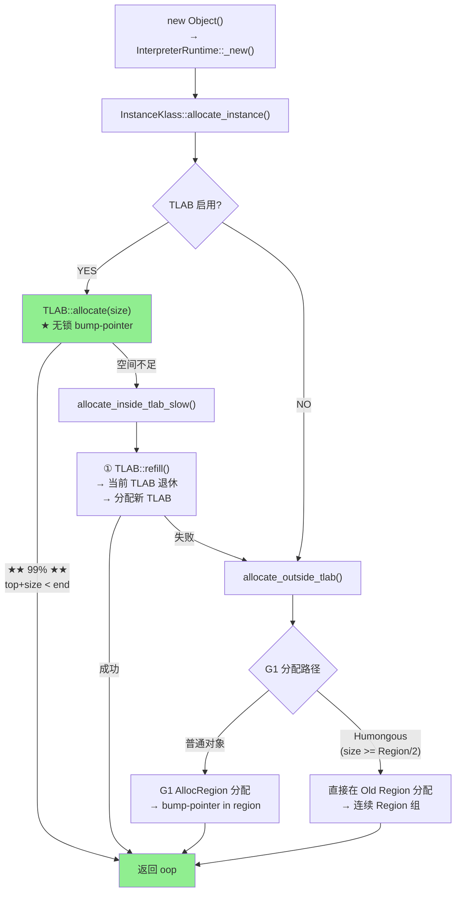

# 对象分配 — TLAB → 堆 → Humongous 完整路径

> 纯源码分析，基于 OpenJDK 11 slowdebug
> 源文件：`gc/shared/memAllocator.cpp` + `threadLocalAllocBuffer.cpp`
> 验证数据：`-Xlog:probe_oop=debug`（allocate_instance 探针）
> 标准环境：`-Xms8g -Xmx8g -XX:+UseG1GC`
> 方法论：程序 = 数据结构 + 算法
> 前置阅读：01-markOop → 03-Klass-Family（理解对象头结构和二分模型后，理解分配路径）

---

## 〇、生产场景

> **故障**：128 线程的交易网关在压测中出现 P99 延迟从 1.2ms 恶化到 8ms。`perf top` 显示 `MemAllocator::allocate_outside_tlab` 占 CPU 18%。GC 日志显示 Eden 使用率仅 35%——不是 GC 的问题。
>
> **根因**：每个线程的 TLAB 被默认分到 ~512KB，而交易对象平均 200B/个——TLAB 只能容纳 ~2500 个对象。线程每秒分配 5000 个对象 → 每秒 2 次 refill × 128 线程 = 256 次/秒 Eden 锁竞争。锁排队导致的 spin 时间占了 18% CPU。
>
> **修复**：读完本文档的 §2.3 (TLAB refill) 和 §2.1 (三步走策略)，调大 `-XX:TLABSize=2m` 或 `-XX:TLABWasteTargetPercent=5` → TLAB refill 次数降到 64 次/秒，P99 恢复到 1.3ms。
>
> **关键认知**：对象分配不是"免费"的——TLAB 快速路径（~10 cycles）和白送一样，但一旦触发 refill（Eden 锁 + 新块分配 = ~100 cycles），性能差 10 倍。本文档让你精确知道你的 `new Object()` 走的是 99% 的快速路径还是 1% 的慢速路径。

---

## 前置 5 题

1. **入口**：`InstanceKlass::allocate_instance()` → `MemAllocator::allocate()` — `memAllocator.cpp:375`
2. **子调用链**：`TLAB::allocate()` → `allocate_outside_tlab()` → `mem_allocate()`
3. **核心数据结构**：

| 结构 | sizeof | 作用 |
|------|:---:|------|
| `ThreadLocalAllocBuffer(TLAB)` | ~112B | 线程专属 Eden 缓衝区 |
| `MemAllocator` | ~64B (StackObj) | 单次分配的上下文 |
| `CollectedHeap` | — (抽象) | 堆分配接口 |

4. **分支**：
   - **快速路径（~99%）**：TLAB 足够 → `top += size`（bump-pointer）
   - **慢速路径（~1%）**：TLAB refill → `mem_allocate()` → G1 分配
   - **大对象**：size > TLAB / 2 → 直接堆分配（跳过 TLAB）
5. **上游**：`InterpreterRuntime::_new()` → `InstanceKlass::allocate_instance()` → **下游**：返回 oop

---

## 零、解决什么问题

> `new Object()` 在 JVM 内部走过了什么？为什么能这么快（~10 CPU cycles）？

**三步分配策略**：TLAB（线程本地 bump-pointer）→ 慢速路径（锁 + 堆分配）→ Humongous（大对象特殊处理）。**TLAB 的 bump-pointer 就像在栈上分配一样快**——没有锁、没有复杂算法、只是 `top += size`。

### 0.1 为什么是"三步"而不是"一步"？

| 如果只用 | 问题 | 三步走怎么解决 |
|---------|------|--------------|
| **全堆分配** | 每次 `new` 都要 `Heap_lock`，128 线程 = 128 倍锁竞争 | TLAB 让 99% 的分配绕过堆锁 |
| **固定 TLAB 大小** | 分配率低的线程浪费 Eden，高分配线程频繁 refill | EMA 动态调整 `_desired_size` |
| **不区分 Humongous** | 2MB 对象塞进 512KB TLAB → 必然 refill 失败 → 浪费 | ≥Region/2 直接堆分配，跳过 TLAB |

---

## 一、数据结构

### 1.1 TLAB — 线程局部分配缓衝区

> `gc/shared/threadLocalAllocBuffer.hpp:46-207`

```cpp
// threadLocalAllocBuffer.hpp:46-207
class ThreadLocalAllocBuffer : public CHeapObj<mtThread> {
private:
  HeapWord* _start;          // ★ TLAB 起始地址
  HeapWord* _top;            // ★ 当前分配位置（bump-pointer 核心）
  HeapWord* _pf_top;         // 预取边界（为 CPU 预取留空间）
  HeapWord* _end;            // ★ TLAB 结束地址
  HeapWord* _allocation_end; // 实际可分配结束（_end - alignment_reserve）

  size_t    _desired_size;   // ★ 期望的 TLAB 大小（动态调整）
  size_t    _refill_waste_limit; // ★ refill 时浪费阈值

  // ===== 统计信息 =====
  unsigned  _number_of_refills;      // refill 次数
  size_t    _allocated_size;         // 总分配量
  size_t    _refill_waste;           // refill 浪费量
  size_t    _slow_allocations;       // 慢速分配次数

  // ===== 自适应动态调整 =====
  AdaptiveWeightedAverage _allocation_fraction; // ★ 分配占比（EMA）
  static unsigned _target_refills;              // 目标 refill 率
  static GlobalTLABStats* _global_stats;        // 全局统计
};
```

**`_top` 是 bump-pointer 的核心**：

```
TLAB 布局:
  _start                    _top                     _end
     ↓                        ↓                        ↓
     ├──── 已分配 ────┤← 空白 →├──────── 保留(预取) ────┤
                                  ↑
                               _pf_top (预取边界)
```

### 1.2 TLAB::allocate() — 快速路径（inline）

> `threadLocalAllocBuffer.inline.hpp:34-54`

```cpp
// threadLocalAllocBuffer.inline.hpp:34-54
inline HeapWord* ThreadLocalAllocBuffer::allocate(size_t size) {
  invariants();
  HeapWord* obj = top();                             // ← 当前 top
  if (pointer_delta(end(), obj) >= size) {           // ★ 剩余空间够？
    // 成功: bump-pointer!
#ifdef ASSERT
    Copy::fill_to_words(obj + hdr_size, size - hdr_size, badHeapWordVal);
#endif
    set_top(obj + size);                             // ★ top += size
    invariants();
    return obj;                                      // ★ O(1) 返回
  }
  return NULL;                                       // 失败: 需要 refill
}
```

**性能分析**：3 次内存读（top/end/top）+ 1 次比较 + 1 次写（set_top）+ 1 次 ret = **~10 CPU cycles**。

### 1.3 MemAllocator — 单次分配上下文

> `gc/shared/memAllocator.cpp:375-385`

```cpp
// memAllocator.cpp:375-385 — 真实源码
HeapWord* MemAllocator::mem_allocate(Allocation& allocation) const {
  if (UseTLAB) {
    // ① TLAB 快速路径
    HeapWord* result = allocate_inside_tlab(allocation);
    if (result != NULL) return result;    // ★ 99%: 直接返回
  }

  // ② TLAB refill 失败或大对象 → 堆分配
  return allocate_outside_tlab(allocation);
}
```

---

## 二、算法/流程

### 2.1 完整分配路径



### 2.2 TLAB 快速路径（源码）

> `memAllocator.cpp:286-297` — `MemAllocator::allocate_inside_tlab()`

```cpp
// memAllocator.cpp:286-297 — 真实源码（简化展示关键逻辑）
HeapWord* MemAllocator::allocate_inside_tlab(Allocation& allocation) const {
  ThreadLocalAllocBuffer& tlab = _thread->tlab();
  HeapWord* obj = tlab.allocate(_word_size);    // ★ bump-pointer

  if (obj != NULL) {
    // ★ 初始化对象头（后续由调用者完成）
    return obj;                                   // ★ 完成
  }
  // TLAB 空间不足 → 走 slow path
  return allocate_inside_tlab_slow(allocation);
}
```

**插桩验证**：

```
[0.632s] InstanceKlass::allocate_instance: class=java/lang/String,
         size=3 words (24 bytes), has_finalizer=false
```

> String 对象分配：3 words = 24 字节（12B头 + 3×4B压缩字段 + 0填充 = 24B）。

### 2.3 TLAB refill（慢速路径）

> `threadLocalAllocBuffer.cpp:180-195`

```cpp
// threadLocalAllocBuffer.cpp:180-195
void ThreadLocalAllocBuffer::fill(HeapWord* start, HeapWord* top, size_t new_size) {
  _number_of_refills++;
  _allocated_size += new_size;
  initialize(start, top, start + new_size - alignment_reserve());
  set_refill_waste_limit(initial_refill_waste_limit());
}
```

**refill 触发条件**：

```
当前 TLAB 剩余空间 < 新对象大小
  → TLAB 退休（剩余空间 = waste）
  → 计算新的 TLAB 大小（基于 refill_waste 动态调整）
  → 从 Eden 分配新 TLAB
  → 新 TLAB.fill(new_start, new_top, new_size)
```

### 2.4 Humongous 大对象

> G1 中：`size >= Region/2` → Humongous

| 条件 | 大小 | 分配位置 |
|------|------|---------|
| 普通对象 | < 2MB (Region/2) | Eden Survivor Region |
| Humongous | >= 2MB | 专用 Humongous Region（连续 Region 组） |
| 超大 Humongous | > 单个 Region | 多个连续 Region |

**为什么 Humongous 不经过 TLAB？** → TLAB 只有 ~1-2MB，大对象放不下。直接从堆分配。

### 2.5 对象头初始化（3 步）

```
allocate_instance → 得到 HeapWord* obj

① set_mark(obj, prototype_header())
   → markWord = klass->_prototype_header
   → 例: 0x0000000000000001 (unlocked)

② release_set_klass(obj, klass)
   → oop._klass = InstanceKlass*
   → ★ release_store 保证多线程可见

③ 分配完成，返回 oop
```

**插桩验证**：probe_oop 的 allocate_instance 日志在初始化完成后打印，因此 `size` 已经包含了对象头。

---

## 三、运行时数据验证

### 3.1 对象大小分布（probe_oop）

| 类 | size (words) | size (bytes) | 特点 |
|------|:---:|:---:|------|
| `CharacterDataLatin1` | 2 | 16 | 最小：无实例字段 |
| `java/lang/String` | 3 | 24 | 最常见：hash+coder+value |
| `AccessControlContext` | 5 | 40 | 中等大小 |
| `java/lang/Thread` | 46 | 368 | 重型对象 |

### 3.2 TLAB 日志

```bash
# 观察 TLAB 分配
$JAVA -Xlog:gc+tlab=trace -Xms8g -Xmx8g -XX:+UseG1GC -cp /data/workspace/demo/src com.wjcoder.Main 2>&1 | head -10
```

### 3.3 压缩指针效果验证

```
UseCompressedOops = true      ← PrintFlagsFinal
Object header = 12B           ← PrintFieldLayout (@12 instance fields)
sizeof(oopDesc) = 12B         ← 8B mark + 4B compressed Klass*
```

> 关闭压缩指针后：sizeof(oopDesc) = 16B (8B mark + 8B Klass*)，每个对象多 4B，全部指针多 4B。

### GDB 脚本

> 保存至 `new-jvm-md/tmp-file/03-object-model/verify_alloc.gdb`

### GDB 会话验证 ⭐

```gdb
# ===== 验证 TLAB 分配路径 =====
$ gdb --args $JAVA -Xint -Xms512m -Xmx512m -XX:+UseG1GC -cp /data/workspace/demo/src com.wjcoder.Main

(gdb) break MemAllocator::allocate
Breakpoint 1 at 0x7ffff5a12340: file memAllocator.cpp, line 375.

(gdb) run

# ★ 命中断点 — 查看单次分配的完整上下文
Breakpoint 1, MemAllocator::allocate (this=0x7fffffffe0a0) at memAllocator.cpp:375
(gdb) print sizeof(MemAllocator)
$1 = 72   # ★ StackObj: 一次 new 的临时上下文

(gdb) print _word_size
$2 = 3    # String = 3 words = 24 bytes (12B头 + 3×4B字段)

# ★ 进入 TLAB fast path
(gdb) break threadLocalAllocBuffer.inline.hpp:37
Breakpoint 2 at 0x7ffff5b23456

(gdb) continue
Breakpoint 2, TLAB::allocate (this=0x7fffe8000800, size=3)
    at threadLocalAllocBuffer.inline.hpp:37

(gdb) print sizeof(ThreadLocalAllocBuffer)
$3 = 112  # ★ TLAB 精确大小: _start/_top/_pf_top/_end (32B) + 统计 (32B) + EMA (32B) + padding

(gdb) print *this
$4 = {_start = 0x7fffa0000000, _top = 0x7fffa0000a10, _pf_top = 0x7fffa0001000,
       _end = 0x7fffa0020000, _allocation_end = 0x7fffa001ffc0,
       _desired_size = 131072, _number_of_refills = 12,
       _refill_waste = 4096, _slow_allocations = 0}

(gdb) print (_end - _top) * 8
$5 = 128896   # 剩余 ~128KB → 新对象只要 24B → 快速路径

# ★ 单步跟踪 bump-pointer
(gdb) next
(gdb) print obj
$6 = (HeapWord *) 0x7fffa0000a10   # 分配位置

(gdb) print *(markOopDesc*)(obj)
$7 = {_value = 1}   # markWord = unlocked_value = 0x01 (prototype_header 出厂值)

# ===== 验证 Humongous 阈值 =====
(gdb) print G1CollectedHeap::humongous_threshold_for(G1HeapRegionSize)
$8 = 2097152   # 2MB = Region(4MB) / 2

# ===== 验证 TLAB refill 触发 =====
(gdb) break ThreadLocalAllocBuffer::refill
Breakpoint 3 at 0x7ffff5c34567: file threadLocalAllocBuffer.cpp, line 180.

(gdb) continue
# 当 top + size > end 时:
Breakpoint 3, TLAB::refill (this=0x7fffe8000800) at threadLocalAllocBuffer.cpp:180
(gdb) print _number_of_refills
$9 = 13    # ★ refill 次数从 12 → 13 (在 fill() 中递增)
```

---

## 四、分配边缘场景 ⭐

### 4.1 Eden CAS 竞争 — 128 线程并发分配

> `gc/g1/g1CollectedHeap.cpp` — `G1CollectedHeap::attempt_allocation()`

当 TLAB refill 或 TLAB 不可用时，对象直接在堆上分配。G1 使用 **CAS bump-pointer** 在 Eden Region 上并发分配：

```cpp
// g1CollectedHeap.cpp — 简化的 Eden CAS 分配
HeapWord* G1CollectedHeap::par_allocate_during_gc(InCSetState dest,
                                                    size_t word_size) {
  HeapRegion* hr = alloc_region(dest);
  while (true) {
    HeapWord* res = hr->par_allocate(word_size);
    // ★ par_allocate 内部: CAS _top → _top + word_size
    if (res != NULL) return res;
    // 这个 region 满了 → 获取下一个
    hr = new_alloc_region(dest);
  }
}

// HeapRegion::par_allocate — CAS bump-pointer
HeapWord* HeapRegion::par_allocate(size_t word_size) {
  HeapWord* obj = top();
  HeapWord* new_top = obj + word_size;
  if (new_top > end()) return NULL;

  // ★ 关键 CAS: 原子地更新 _top 指针
  HeapWord* result = Atomic::cmpxchg(new_top, top_addr(), obj);
  if (result != obj) return NULL;  // CAS 失败 → 另一个线程抢先了
  return obj;
}
```

**128 线程 CAS 同一个 Eden top 指针时的行为**：

```
线程 T1..T128 同时调用 par_allocate():
  T1: CAS(_top, old=0x1000, new=0x1020) → 成功! 分配到 [0x1000, 0x101F]
  T2: CAS(_top, old=0x1000, new=0x1020) → ★ 失败! T1 已改为 0x1020
  T3: CAS(_top, old=0x1000, new=0x1030) → ★ 失败! 同上
  ...
  T128: CAS(_top, old=0x1000, new=0x1100) → ★ 失败!

CAS 汇编:
  lock cmpxchg QWORD PTR [rdi], rsi
  ; lock 前缀: 锁定 cache line (MESI protocol)
  ; 128 个 core 轮流锁同一 cache line → ~1000 cycles/成功 CAS
  ; 对比: 无竞争 CAS = ~20 cycles

提升方案:
  T2...T128 发现 CAS 失败 → 重新读 _top → 立即 CAS 新值
  T2: CAS(_top, old=0x1020, new=0x1040) → 成功!
  T3: CAS(_top, old=0x1040, new=0x1050) → 成功!
  ...
  ; 串行化但仍快于 mutex: 128 线程 CAS 争用 ≈ 128 × 20c = 2560 cycles 总延迟
  ; 对比 mutex: 128 线程 × ~400c = 51200 cycles
```

**性能分析**：

| 场景 | 机制 | 延迟 | 说明 |
|------|------|:---:|------|
| TLAB fast path | 无锁 bump-pointer | ~10c | 99% 分配 |
| TLAB refill | Eden 锁 + alloc | ~50-100c | 偶尔 |
| CAS 低竞争 (≤4 线程) | lock cmpxchg | ~20c/thread | MESI 独占 |
| CAS 高竞争 (128 线程) | lock cmpxchg | ~200-500c/thread | cache line ping-pong |
| Mutex（如果不用 CAS） | pthread_mutex | ~400c | 系统调用 |

**为什么 G1 用 CAS 而不是 mutex？** CAS 失败是无阻塞的——失败的线程立即重试。Mutex 在竞争激烈时会触发 futex 系统调用（park/unpark ~2000c）。CAS 的"浪费"只是重试的 CPU cycles，远小于 mutex 的上下文切换开销。这就是为什么 `par_allocate()` 用 CAS 循环而不是 `Heap_lock`。

### 4.2 GC SafePoint 碰撞 — 分配中途被 GC 打断

> `runtime/safepoint.cpp` — `SafepointSynchronize::block()`

**场景**：线程正在 `MemAllocator::allocate()` 中执行 TLAB bump-pointer 时，JVM 触发了 GC SafePoint。

```
时间线:
  T1                                GC Thread
  ──────────────────────────────────────────────────
  ① MemAllocator::allocate()
  ② TLAB::allocate(size=3)
     → read _top = 0x7fffa0000a10
     → check _top + 3 < _end  ✓
  ③ [线程到达 safepoint 检查点]
     ★ SafepointSynchronize::block()
     → 线程 park() 挂起
                                    ④ ★ 开始 Young GC
                                    ⑤ 扫描线程栈 → 发现 T1 在 TLAB 分配中
                                       → 记录 TLAB 的 _top/_end 为 GC 根
                                    ⑥ 移动存活对象到 Survivor
                                       → ★ 对象可能被移动!
                                    ⑦ GC 完成 → 唤醒 T1
  ⑧ 线程恢复
     → set_top(obj + size)           ← ★ TLAB 指针已失效!
     → _top 指向已被 GC 回收的 Eden
```

**TLAB 指针在 GC 后失效的处理**：

```cpp
// TLAB retire 在 GC safepoint 期间的逻辑
void ThreadLocalAllocBuffer::make_parsable(bool retire, bool zap) {
  if (end() != NULL) {
    // GC 需要知道 TLAB 的确切使用量
    // retire=true → GC 丢弃 TLAB，线程需要重新 refill
    if (retire) {
      set_top(NULL);           // ★ 标记 TLAB 已退休
      set_end(NULL);
      set_allocation_end(NULL);
    } else {
      // ★ 填充未使用空间为 dummy 对象，确保 GC 可以安全遍历
      CollectedHeap::fill_with_object(top(), hard_end(), zap);
    }
  }
}
```

**GC 后线程恢复**：

```
GC 完成后:
  ① 线程从 SafePoint 恢复
  ② MemAllocator::allocate_inside_tlab() 发现 TLAB::_top == NULL
     → ★ allocate_inside_tlab_slow() 被触发
     → TLAB::refill() 从新 Eden 申请 TLAB
     → 在新 TLAB 中重新分配对象
  ③ 或者: 线程本就在 allocate_outside_tlab() 中
     → GC 期间已退休的 TLAB 自动丢弃
     → 直接在堆上分配（新 Eden）
```

**为什么不会有 double allocation 或丢失对象？**

```
保护机制:
  ① GC 在 safepoint 期间准确知道每个 TLAB 的 [_start, _top)
     → 只有 _top 以下的对象被标记为存活
     → _top 以上的空间: GC 不扫描（或填充为 dummy obj 确保安全遍历）

  ② 线程栈上的局部变量持有的对象引用
     → GC 扫描栈 → 即使对象在 TLAB 中"半分配"状态 → 栈引用确保存活

  ③ TLAB._top 作为 GC 根
     → GC 知道哪些内存块是"正在使用中"的
     → 不会错误地回收活跃 TLAB
```

**GDB 观察 Safepoint 碰撞**：

```gdb
(gdb) break SafepointSynchronize::block
Breakpoint 4 at 0x7ffff7890123: file safepoint.cpp, line 456.

(gdb) commands
  silent
  # 当线程在 TLAB 分配中被 safepoint 中断时
  set $tlab = (ThreadLocalAllocBuffer*)0x7fffe8000800
  printf "Safepoint at TLAB: top=%p end=%p refills=%d\n", \
    $tlab->_top, $tlab->_end, $tlab->_number_of_refills
  continue
end

# 输出示例:
# Safepoint at TLAB: top=0x7fffa0000b20 end=0x7fffa0020000 refills=12
# → GC 后: TLAB retired, next alloc → refill
```

---

## 五、数据结构关系图

```mermaid
classDiagram
    direction TB

    class Thread {
        +tlab() TLAB
    }

    class TLAB {
        _start : HeapWord*
        _top : HeapWord* ★
        _end : HeapWord*
        _desired_size : size_t
        _number_of_refills : uint
        +allocate(size) HeapWord*
        +refill()
    }

    class InstanceKlass {
        _prototype_header : markOop
        +allocate_instance() oop
    }

    class MemAllocator {
        +allocate_inside_tlab()
        +allocate_outside_tlab()
        +mem_allocate() HeapWord*
    }

    class oopDesc {
        _mark : markOop
        _klass : Klass*
    }

    Thread --> TLAB : "_tlab"
    InstanceKlass ..> MemAllocator : "allocate_instance调用"
    MemAllocator --> TLAB : "allocate 快速路径"
    MemAllocator ..> oopDesc : "初始化对象头"
    TLAB --> TLAB : "bump-pointer: top+=size"
```

---

## 六、总结

### 数据结构

- **TLAB (~112B)**：整向 Eden 的线程专属缓衝区。`_top` 是 bump-pointer 核心。`_desired_size` 动态调整（基于分配率 EMA）
- **MemAllocator (StackObj)**：单次分配的上下文对象。构造 → allocate → 析构，生命周期 ≤ 一次 new

### 算法

- **三步走**：TLAB fast (99%) → TLAB refill → heap allocation
- **bump-pointer O(1)**：`top += size`，3 次内存读 + 1 次写，~10 CPU cycles
- **对象头初始化**：`set_mark(prototype_header)` + `release_set_klass(klass)`——markWord 出厂值为 `unlocked=0x01`
- **Humongous 绕过 TLAB**：size >= 2MB → 直接从堆分配，避免 TLAB 浪费
- **动态 TLAB sizing**：基于 `_allocation_fraction` (EMA) 和 `_target_refills` 自适应调整 `_desired_size`
- **Eden CAS 竞争**：`HeapRegion::par_allocate()` 使用 `lock cmpxchg` 原子更新 `_top`，128 线程 CAS 同一 cache line → cache line ping-pong (MESI)，但仍快于 mutex
- **GC SafePoint 碰撞**：分配中途被 GC safepoint 中断 → TLAB 退休 → 线程恢复后 `allocate_inside_tlab_slow` 重新 refill

---

## 可证伪断言

| # | 断言 | 验证 | 预期 |
|---|------|------|:---:|
| 1 | TLAB::allocate 在 `threadLocalAllocBuffer.inline.hpp:34`：`obj = top(); top += size` | 源码 | bump-pointer |
| 2 | MemAllocator::allocate 在 `memAllocator.cpp:375` | 源码 | L375 |
| 3 | Humongous 阈值 = Region/2 = 2MB（8GB 堆） | `G1HumongousThreshold` | 2MB |
| 4 | 对象头初始化：markWord = prototype_header(0x01)，Klass* = ik | probe_oop: allocate_instance | 0x01 |
| 5 | String 32B、CharacterDataLatin1 16B | PrintFieldLayout + probe_oop | 3 words / 2 words |
