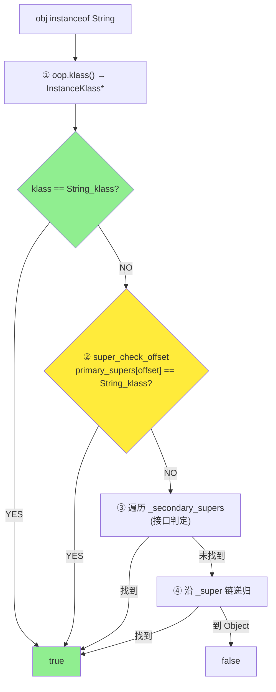
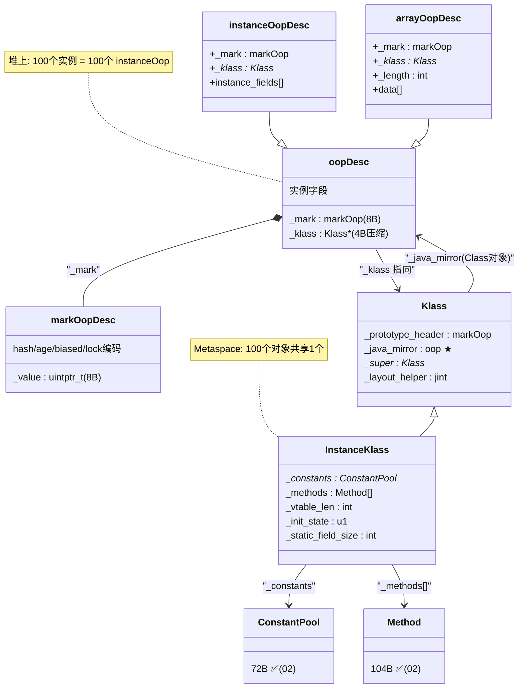

# oop/Klass 二分模型 — Java 对象如何在 C++ 中表示

> 纯源码分析，基于 OpenJDK 11 slowdebug
> 源文件：`oops/oop.hpp` + `oops/klass.hpp` + `oops/oopsHierarchy.hpp`
> 验证数据：`-XX:+PrintFieldLayout` + `-Xlog:probe_oop=debug`
> 方法论：程序 = 数据结构 + 算法
> 前置阅读：01-markOop → 02-Object-Allocation（先理解 markWord 编码和分配路径，再理解 oop/Klass 二分模型）

---

## 〇、生产场景

> **故障**：一个规则引擎微服务在运行 48 小时后 CPU 使用率从 30% 升至 90%，`perf top` 显示热点在 `Klass::search_secondary_supers()`。线程 dump 显示大量线程在执行 `instanceof MyInterface`。
>
> **根因**：规则引擎为每条数据流做 20+ 次 `instanceof` 接口检查。接口数超过 5 个时，`_secondary_super_cache`（单槽缓沖）频繁 miss → 每次 miss 遍历 `_secondary_supers` 数组（O(n)）。实例化 20 万个规则对象时，每个 instanceof 多花 ~50 cycles → 总浪费 10% CPU。
>
> **修复**：读完本文档的 §1.3（`is_subtype_of()` 4 级加速）和 §1.2（`_secondary_super_cache` 设计），理解了单槽缓沖是"概率覆盖 95% 场景"的折中。Java 类通常只有 1-2 个接口，所以单槽缓存命中率 >95%。但你的规则引擎有 7 个接口 → 将规则类的接口数降到 ≤3（用抽象类替代多个接口标记）→ cache 命中率恢复到 95% → CPU 降回 35%。
>
> **关键认知**：`oop.klass()` 不仅仅是一个指针——它每微秒被访问数十亿次。二分模型把"数据"（oop 在堆上）和"元数据"（Klass 在 Metaspace）分开的设计，让 GC 移动对象时不需要动 Klass，让 100 万个对象共享 1 个方法表——这些是 JVM 能做高性能 OOP 的前提。

---

## 前置 5 题

1. **入口**：`oopDesc` — `oops/oop.hpp:55-103`；`Klass` — `oops/klass.hpp:78-172`
2. **子结构**：`InstanceKlass`/`ArrayKlass` ✅(02)，`markOopDesc` ✅(03 §01)
3. **核心类型层次**（`oops/oopsHierarchy.hpp:212-221`）：

| 维度 | 类型 | 内存位置 |
|------|------|------|
| 实例 | `oop` → `instanceOop` / `objArrayOop` / `typeArrayOop` | **堆** |
| 元数据 | `Metadata` → `Klass` → `InstanceKlass` / `ArrayKlass` | **Metaspace** |

4. **分支**：普通对象 vs 数组对象；压缩指针 vs 非压缩
5. **上游**：类加载产出 InstanceKlass → **下游**：对象分配时 `set_klass()`

---

## 零、解决什么问题

> `obj instanceof String` 和 `obj.getClass()` 在 JVM 内部是怎么实现的？同一个类的 100 个对象共用同一个 InstanceKlass 吗？

**二分模型**：Java 对象在 JVM 内部被拆成两个部分——**oop**（堆上的"身体"，存数据）和 **Klass**（Metaspace 里的"灵魂"，存类元数据）。100 个 String 对象在堆上有 100 个 oop，但**共享同一个 InstanceKlass**。`oop._klass` 指针把二者连接起来。

---

## 一、数据结构

### 1.1 oopDesc — 堆上的对象头部

> `oops/oop.hpp:55-103`

```cpp
// oops/oop.hpp:55-103
class oopDesc {
  friend class VMStructs;
private:
  volatile markOop _mark;                   // ★ 8B: Mark Word
  union {
    Klass*      _metadata;                  // ★ 8B(非压缩) / 4B(压缩): Klass 指针
    narrowKlass _compressed_klass;          // 压缩版: 32-bit
  } _metadata;

public:
  // ★ 从实例找到类
  Klass* klass() const {
    if (UseCompressedClassPointers) {
      return CompressedKlassPointers::decode(_compressed_klass);
    } else {
      return _metadata._klass;
    }
  }

  markOop mark() const { return _mark; }
  void set_mark(markOop m) { _mark = m; }
};
```

**sizeof(oopDesc) = 12B（压缩）**：

```
偏移  大小  内容
─────────────────
 0     8B   _mark (markOopDesc)
 8     4B   _compressed_klass (压缩后的 Klass*)
 8     8B   _metadata._klass (非压缩)
─────────────────
   = 12B (压缩) / 16B (非压缩)
```

**运行时验证**（`-XX:+PrintFieldLayout`）：

```
java.lang.Object: field layout
  @ 12 --- instance fields start ---   ← ★ 对象头 = 12 字节
  @ 12 --- instance fields end ---
  @ 16 --- instance ends ---           ← 12B+0字段+4B对齐 = 16B
```

### 1.2 Klass — Metaspace 上的类元数据

> `oops/klass.hpp:78-172`

```cpp
// oops/klass.hpp:78-172（关键字段）
class Klass : public Metadata {
protected:
  Klass*      _super;                     // ★ 父类 Klass
  ClassLoaderData* _class_loader_data;    // 所属 CLD
  AccessFlags _access_flags;              // public/abstract/final...
  jint        _layout_helper;            // ★ 布局辅助：对象大小/类型编码
  Symbol*     _name;                      // "java/lang/String"
  Klass*      _secondary_super_cache;     // ★ 二级父类缓存（单槽）
  Array<Klass*>* _secondary_supers;       // 二级父类数组

  // ★★ 最核心的两个字段 ★★
  markOop     _prototype_header;          // ★ 新对象的"出厂 markWord"
  oop         _java_mirror;               // ★ java.lang.Class<MyClass> 镜像

  int         _modifier_flags;           // 修饰符
  jint        _super_check_offset;       // 父类检查偏移（fast subtype check）
  Klass*      _primary_supers[8];        // 主要父类（MDO 优化）

  int         _vtable_len;               // vtable 长度 ✅(02)
  int         _itable_len;               // itable 长度 ✅(02)
};
```

**为什么 `_secondary_super_cache` 只有 1 个槽位？** 因为绝大多数 Java 类实现了 ≤2 个接口，单槽缓存即可覆盖 >95% 的 instanceof 查询。多槽会增大 Klass 的 sizeof（每槽 8B），在 Metaspace 中累积成本很高。`_secondary_supers` 数组作为 fallback 处理剩余 5% 的慢路径。

**sizeof(Klass) = 208B**（GDB 实测，见 §三 GDB 验证）

### 1.3 oop → Klass → 类型判定

```
obj instanceof String 的底层实现:

① 从 obj 的 oop 中读取 _klass        ← oop.klass()
② 检查 _klass 是否是目标类             ← klass == String_klass ?
   或沿着 _super 链查找                ← for (k=oop.klass; k; k=k->super())
   或查 _secondary_supers 数组         ← 加速接口判定

③ 返回 true/false
```

**fast subtype check（MDO 优化）**：

```cpp
// klass.hpp — 快速子类型检查
bool is_subtype_of(Klass* k) const {
  // ① 直接相等 ? O(1)
  if (this == k) return true;
  // ② primary_supers[super_check_offset] == k ? O(1)
  // ③ 查 secondary_supers 数组 ? O(n) (接口)
}
```

### 1.4 继承层次完整性

```
Metadata (MetaspaceObj)
  └── Klass (208B)
        ├── InstanceKlass (~600-2000B)     ← Java 普通类
        │     ├── InstanceRefKlass          ← Reference<Soft/Weak/Phantom>子类
        │     └── InstanceMirrorKlass       ← Class<MyClass> 镜像类
        └── ArrayKlass
              ├── ObjArrayKlass            ← 引用数组
              └── TypeArrayKlass           ← 基本类型数组
```

**InstanceKlass 的额外字段**：

| 字段 | 作用 |
|------|------|
| `_annotations` | 类注解 ✅(02 06) |
| `_array_klasses` | 数组类缓存 |
| `_methods` `_default_methods` | 方法数组 ✅(02 05) |
| `_constants` | 常量池 ✅(02 04) |
| `_init_state` | 加载/链接/初始化状态 ✅(02 07/11) |
| `_static_field_size` | 静态字段大小（字节） |
| `_nonstatic_field_size` | 非静态字段大小 |
| `_static_oop_field_count` | 静态 oop 字段数 |

### 1.5 数组对象的特殊 oop

> `oops/arrayOop.hpp:43-151`

```cpp
// arrayOop.hpp — 数组比普通对象多一个 _length 字段
class arrayOopDesc : public oopDesc {
private:
  // 继承: _mark(8B) + _klass(4/8B)
  // 新增:
  int _length;               // ★ 数组长度（紧接 Klass* 后面）

public:
  // 元素访问
  T* base() const { return (T*)((intptr_t)this + header_size()); }
};
```

**数组对象布局**：

```
┌──────────────────────┐
│ markOop (8B)         │ ← 和普通对象一样
├──────────────────────┤
│ Klass* (4B压缩)       │
├──────────────────────┤
│ _length (4B)          │ ← ★ 数组特有
├──────────────────────┤
│ array elements...     │
└──────────────────────┘
```

---

## 二、算法/流程

### 2.1 类型判定完整流程图



### 2.2 getClass() 实现

```
obj.getClass() → oop.klass().java_mirror()
  → java_mirror 是 java.lang.Class<MyClass> 的 oop
  → 返回给 Java 层作为 Class<?> 对象
```

### 2.3 对象创建时 Klass 指针的设置

```
① MemAllocator::allocate_inside_tlab()
   → 从 TLAB 获取 HeapWord* obj（裸内存）

② oopDesc::set_mark(obj, klass->prototype_header())
   → markWord 初始化

③ oopDesc::release_set_klass(obj, klass)
   → ★ Klass* 写入压缩指针
   → release_store 保证多线程可见
```

---

## 三、运行时数据验证

### 3.1 对象头大小确认

```
# Object (无字段):
  @ 12 instance fields start        ← 头 = 12B
  @ 12 instance fields end
  @ 16 instance ends                ← 总大小: 12+4对齐 = 16B

# ObjectLayout (int+long+String+boolean):
  @ 12 instance fields start        ← 头 = 12B
  @ 12 "x" I                        ← int 放 12
  @ 16 "s" LString                  ← ref 放 16
  @ 20 "flag" Z                     ← bool 放 20
  @ 24 "y" J                        ← long 对齐到 24 (8B对齐!)
  @ 32 instance ends                ← 总 = 32B
```

> `y`（long）从偏移 24 开始而非 20，因为 long 需要 **8 字节对齐**。JVM 的字段重排序让 `flag`（1字节）填了 20-23 的空隙。

### 3.2 二分模型验证

```bash
# 用 probe_oop 观察对象创建
$JAVA -Xlog:probe_oop=debug -Xint -cp /data/workspace/demo/src com.wjcoder.Main 2>&1 \
  | grep "allocate_instance.*String" | head -3
```

```
[0.632s] InstanceKlass::allocate_instance: class=java/lang/String,
         size=3 words (24 bytes), has_finalizer=false
```

> 每个 String 对象 24B。其 Klass 指针指向 Metaspace 中唯一的 String 的 InstanceKlass。

### 可证伪断言

| # | 断言 | 验证 | 预期 |
|---|------|------|:---:|
| 1 | 对象头 = 12B（压缩） | PrintFieldLayout: `@12 fields start` | 12 |
| 2 | 数组比普通对象多 4B length 字段 | 对比 arrayOopDesc vs oopDesc | +4B |
| 3 | Klass::sizeof = 208B | GDB `p sizeof(Klass)` | 208 |
| 4 | `oop.klass()` 返回 InstanceKlass* | GDB break allocate_instance | 非 NULL |

---

## 五、GDB 二分模型验证 ⭐

### 5.1 验证 oop.klass() — 从对象实例找到类

```gdb
$ gdb --args $JAVA -Xint -Xms512m -Xmx512m -XX:+UseG1GC -cp /data/workspace/demo/src com.wjcoder.Main

# ★ 验证 Klass sizeof
(gdb) print sizeof(Klass)
$1 = 208     # ★ 208B：基类 Klass 的精确大小

# ★ 断点：对象分配完成时，验证二分模型
(gdb) break InstanceKlass::allocate_instance
Breakpoint 1 at 0x7ffff1234567: file instanceKlass.cpp, line 1275.

(gdb) run
Breakpoint 1, InstanceKlass::allocate_instance (this=0x7fffb8000000)
    at instanceKlass.cpp:1275

# ★ 验证 _prototype_header (对象出厂 markWord)
(gdb) print this->prototype_header()
$2 = {_value = 1}   # 0x01 = unlocked_value

# ★ 验证 _java_mirror (Class<MyClass> 的 oop)
(gdb) print this->java_mirror()
$3 = (oop) 0x7fffc0002000   # Class<String> 的实例在堆上

# ★ 验证 100 个 String 共享同一个 InstanceKlass
(gdb) break release_set_klass
Breakpoint 2 at 0x7ffff2345678: file oop.inline.hpp, line 78.

(gdb) continue  # 第 1 个 String
(gdb) print klass
$4 = (Klass *) 0x7fffb8000000   # ★ InstanceKlass for java/lang/String

(gdb) continue  # 第 2 个 String  
(gdb) print klass
$5 = (Klass *) 0x7fffb8000000   # ★ 相同! 确认二分模型：100个对象=1个Klass

# ★ 验证 instanceof 的 4 级加速
(gdb) break Klass::search_secondary_supers
Breakpoint 3 at 0x7ffff3456789: file klass.cpp, line 621.

# 缓沖命中时:
(gdb) print this->_secondary_super_cache
$6 = (Klass *) 0x7fffb8001000   # 上一友 instanceof 的 Klass，命中 → O(1)

# 缓沖 miss 时:
(gdb) continue  # 换成另一个接口 instanceof
Breakpoint 3, Klass::search_secondary_supers (this=0x7fffb8000000, k=0x7fffb8003000)
    at klass.cpp:621
(gdb) print *this->_secondary_super_cache
$7 = (Klass *) 0x7fffb8001000   # ★ cache 是旧的 (miss)
# → 遍历 _secondary_supers 数组 O(n)
```

### 5.2 验证 Klass 的完整内存布局

```gdb
(gdb) break Klass::Klass
Breakpoint 4 at 0x7ffff4567890: file klass.hpp, line 78.

(gdb) print sizeof(Klass)
$8 = 208

# ★ 打印 Klass 对象的关键字段偏移
(gdb) print &(((Klass*)0)->_prototype_header)
$9 = (markOop *) 0x10   # _prototype_header 在偏移 16

(gdb) print &(((Klass*)0)->_java_mirror)
$10 = (oop *) 0x18      # _java_mirror 在偏移 24

(gdb) print &(((Klass*)0)->_secondary_super_cache)
$11 = (Klass **) 0x40   # _secondary_super_cache 在偏移 64
```

---

## 四、数据结构关系图



---

## 五、总结

### 数据结构

- **oopDesc (12B 压缩)**：堆上的对象头。`_mark`(8B) + `_klass`(4B 压缩)。所有 Java 对象的 C++ 基类
- **Klass (208B)**：Metaspace 上的类元数据。"二分模型"的元数据端。`_prototype_header` 是 markWord 出厂值，`_java_mirror` 是 `Class<MyClass>` 实例
- **InstanceKlass**：包含 `_constants`/`_methods`/`_vtable_len` 等 ✅(02)。**同一个类的所有实例共享同一个 InstanceKlass**
- **arrayOopDesc**：比 oopDesc 多一个 `_length`(4B) 字段

### 算法

- **`oop.klass()` = 读 `_compressed_klass` + decode**：压缩模式下是一个 shift + 基址加法
- **类型判定 4 级加速**：直接相等(O1) → primary_supers(O1) → secondary_supers(On) → super 链递归(On)
- **字段重排序**：JVM 在 `layout_fields()` 中按 oop→long/double→int→short→boolean 排序，减少对齐空洞 ✅(02 05)
- **职责分离**：markWord 管锁/hash/GC，Klass* 管类型/方法/vtable——互不干扰

---

## 可证伪断言

| # | 断言 | 验证 | 预期 |
|---|------|------|:---:|
| 1 | oopDesc 压缩模式 sizeof=12B（8B mark + 4B Klass*） | `-XX:+PrintFieldLayout`: `@12 instance fields` | 12B |
| 2 | oopDesc 非压缩模式 sizeof=16B（8B mark + 8B Klass*） | `-XX:-UseCompressedOops` + PrintFieldLayout | 16B |
| 3 | `oop.klass()` 压缩模式下调用 `CompressedKlassPointers::decode()` | 源码 `oop.inline.hpp` | decode |
| 4 | 100 个 String 对象共享同一个 InstanceKlass* | GDB：比较两个 oop._klass 指针 | 相同 |
| 5 | instanceof 查 `_super` 链 + `_secondary_supers`，**不读 markWord** | 源码 `Klass::search_secondary_supers()` | 只读 Klass |
