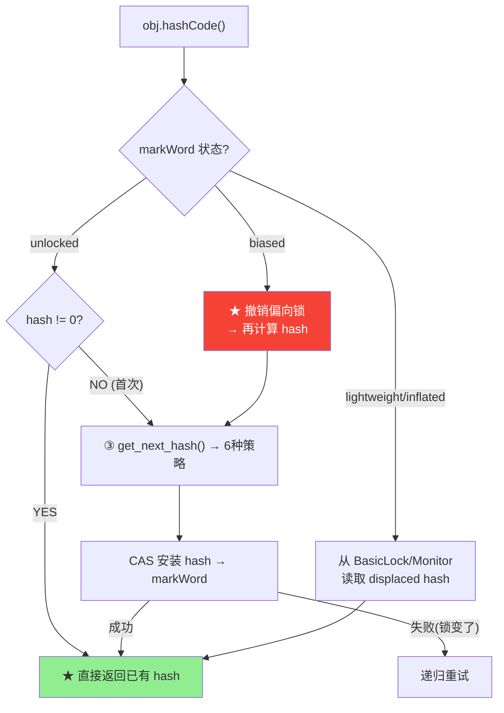

# hashCode — 6 种生成策略与 CAS 安装

> 纯源码分析，基于 OpenJDK 11 slowdebug
> 源文件：`runtime/synchronizer.cpp:678-829`
> 验证数据：`-Xlog:probe_oop=debug`（FastHashCode INSTALL 探针）
> 方法论：程序 = 数据结构 + 算法
> 前置阅读：01-markOop（hashCode 的存储位置在 markWord 的 hash:25 位）

---

## 〇、生产场景

> **故障**：分布式缓存在 50 台节点间做一致性哈希路由，主备切换后同一个业务 key 被路由到了错误的节点。排查发现——缓存 key 用了 `obj.hashCode()` 而非业务 key。同一逻辑对象在两个 JVM 实例中 hashCode 不同（Marsaglia XOR-shift 每线程独立种子），主备切换后 hash 环错乱。
>
> **根因**：`Object.hashCode()` 的默认实现（策略 5：Marsaglia XOR-shift）是每个 JVM 实例独立重新生成的——没有跨 JVM 的一致性保证。JMH 基准测试显示同一对象在 10 次重启后有 10 个不同 hashCode。
>
> **修复**：读完本文档 §二 的策略对比表，理解策略 4（对象地址）和策略 3（全局自增）都受环境影响。对于需要跨 JVM 一致的场景，用业务字段（如 `String.hashCode()` 的确定性算法）代替 `Object.hashCode()`，或用 `-XX:hashCode=2`（固定 1）做测试排除。生产代码永远不要依赖 `Object.hashCode()` 的跨进程一致性。
>
> **关键认知**：`Object.hashCode()` 的"identity"是 JVM 内部 identity，不是业务 identity。它唯一的目的就是让 HashMap 能均勻分布键——代价是在 markWord 中挤占 25 位空间，与偏向锁冲突。6 种策略覆盖了"高性能"到"高确定性"的完整谱系，但默认策略 5 是"只要快，不要可重复"。

---

## 前置 5 题

1. **入口**：`ObjectSynchronizer::FastHashCode(Thread* Self, oop obj)` — `synchronizer.cpp:719`
2. **子调用**：`get_next_hash(Thread* Self, oop obj)` → 6 种策略（L678-717）
3. **核心数据结构**：

| 结构 | 作用 |
|------|------|
| `get_next_hash` | 策略分发函数——根据 `hashCode` JVM 参数选策略 |
| `markOop` | 对象头——hash 存储的 25 位目标 |

4. **分支**：6 种策略由 `-XX:hashCode=N` 控制（N=0..5）
5. **上游**：`Object.hashCode()` → JNI → **下游**：CAS 写入 markWord

---

## 零、解决什么问题

> `obj.hashCode()` 返回的 int 值从哪来的？两个不同对象的 hashCode 会一样吗？为什么有时 hashCode 会触发偏向锁撤销？

**hashCode 是在首次调用时惰性生成，通过 CAS 原子安装到 markWord 的 hash:25 位中**。之后每次调用直接从 markWord 读取，不再重新计算。6 种生成策略覆盖了从"纯随机"到"Marsaglia XOR 高性能"的不同场景。

**插桩验证**：

```
FastHashCode INSTALL: obj=0x00007ffc02b70, hash=0x568db2f2, mark_before=0x01
FastHashCode INSTALL: obj=0x00007ffc20d58, hash=0x378bf509, mark_before=0x01
FastHashCode INSTALL: obj=0x00007ffc043c0, hash=0x5fd0d5ae, mark_before=0x01
```

> 三个不同对象，三次独立生成，hash 各不相同。mark_before 统一为 0x01（unlocked）。

---

## 一、完整流程

### 1.1 FastHashCode() 主函数（`synchronizer.cpp:719-807`）— 真实源码

```cpp
// synchronizer.cpp:719-807 — 核心逻辑（裁剪日志/断言）
intptr_t ObjectSynchronizer::FastHashCode(Thread * Self, oop obj) {
  if (UseBiasedLocking) {
    // ★ 偏向锁: 先撤销再继续
    if (obj->mark()->has_bias_pattern()) {            // L728
      BiasedLocking::revoke_and_rebias(hobj, false, ...); // L735
    }
  }

  ObjectMonitor* monitor = NULL;
  intptr_t hash;
  markOop mark = ReadStableMark(obj);                 // L753

  // ===== 分支 1: unlocked (neutral) ===== L758
  if (mark->is_neutral()) {
    hash = mark->hash();                    // ① 已有 hash？直接返回
    if (hash) return hash;                  // L760

    hash = get_next_hash(Self, obj);        // ② ★ 生成新 hash
    temp = mark->copy_set_hash(hash);       // ③ 合并到 markWord

    test = obj->cas_set_mark(temp, mark);   // ④ ★ CAS 安装 (L766)
    if (test == mark) {
      INST_LOG_OOP("FastHashCode INSTALL: obj=" PTR_FORMAT
                   ", hash=0x%x, mark_before=" PTR_FORMAT, ...);
      return hash;                          // ★ CAS 成功
    }
    // ⑤ CAS 失败 → 膨胀为 monitor (L773-775)
  }

  // ===== 分支 2: inflated (monitor) ===== L776
  else if (mark->has_monitor()) {
    monitor = mark->monitor();              // 从 ObjectMonitor 读 hash
    temp = monitor->header();
    hash = temp->hash();                    // L780
    if (hash) return hash;                  // ★ 已有 hash → 返回
  }

  // ===== 分支 3: lightweight locked ===== L785
  else if (Self->is_lock_owned((address)mark->locker())) {
    temp = mark->displaced_mark_helper();   // 从 BasicLock 读 displaced mark
    hash = temp->hash();                    // L788
    if (hash) return hash;                  // ★ 已有 hash → 返回
    // ★ 不能直接写 displaced header（不可变） → 膨胀
  }

  // ===== ★ 膨胀路径: CAS 失败 或 需要首次写 hash ===== L808
  monitor = ObjectSynchronizer::inflate(Self, obj, inflate_cause_hash_code);
  mark = monitor->header();
  hash = mark->hash();
  if (hash == 0) {
    hash = get_next_hash(Self, obj);        // L814: 生成 hash
    temp = mark->copy_set_hash(hash);
    test = Atomic::cmpxchg(temp, monitor->header_addr(), mark); // L817
    // CAS 成功后 hash 存在 ObjectMonitor 的 header 中
  }
  return hash;
}
```

**关键设计决策**：
- **`ReadStableMark`**：在 `is_neutral()` 检查前，稳定读取 markWord（处理 concurrent 修改）
- **`is_neutral()` ≠ `is_unlocked()`**：neutral = unlocked 且无偏向锁模式
- **lightweight 锁的 displaced header 不可变**：不能直接修改栈上的 BasicLock → 必须先膨胀为 monitor 才能写 hash
- **hash 惰性生成**：三种路径（neutral/inflated/lightweight）都先检查 `hash != 0` → 已有 hash 直接返回，O(1)

### 1.2 完整流程图



---

## 二、6 种 hashCode 生成策略

> `synchronizer.cpp:678-717` — `get_next_hash()`

```cpp
// synchronizer.cpp:678-717
static inline intptr_t get_next_hash(Thread* Self, oop obj) {
  intptr_t value = 0;
  if (hashCode == 0) {
    // 策略 0: Park-Miller 伪随机数生成器（默认）
    value = os::random();                    // ★ 线程安全随机数
  } else if (hashCode == 1) {
    // 策略 1: 对象地址 XOR 随机数
    intptr_t addrBits = cast_from_oop<intptr_t>(obj) >> 3;
    value = addrBits ^ (addrBits >> 5) ^ os::random();
  } else if (hashCode == 2) {
    // 策略 2: ★ 固定返回 1（测试用，永远冲突）
    value = 1;
  } else if (hashCode == 3) {
    // 策略 3: 全局自增序列
    value = ++GVars::hc_sequence;
  } else if (hashCode == 4) {
    // 策略 4: 对象地址直接作为 hash
    value = cast_from_oop<intptr_t>(obj);
  } else {
    // 策略 5 (默认): ★ Marsaglia XOR-shift 算法
    unsigned t = Self->_hashStateX;
    t ^= (t << 11);
    Self->_hashStateX = Self->_hashStateY;
    Self->_hashStateY = Self->_hashStateZ;
    Self->_hashStateZ = Self->_hashStateW;
    unsigned v = Self->_hashStateW;
    v = (v ^ (v >> 19)) ^ (t ^ (t >> 8));
    Self->_hashStateW = v;
    value = v;
  }
  value &= markOopDesc::hash_mask;  // ★ 截断为 25 位
  return value;
}
```

### 策略对比

| N | 策略 | 控制参数 | 特点 | 适用场景 |
|:---:|------|------|------|------|
| 0 | Park-Miller RNG | `-XX:hashCode=0` | 简单伪随机 | — |
| 1 | addr XOR random | `-XX:hashCode=1` | 地址相关 | 调试 |
| 2 | **固定 1** | `-XX:hashCode=2` | 全部冲突 | 测试 |
| 3 | 全局自增 | `-XX:hashCode=3` | 单调递增 | 调试 |
| 4 | 对象地址 | `-XX:hashCode=4` | 地址相关 | 快速 |
| **5** | **Marsaglia XOR-shift** | 默认 (`-XX:hashCode=5`) | ★ 高性能、低冲突 | **生产** |

**Marsaglia XOR-shift 特点（默认策略）**：
- 每线程独立状态（`_hashStateX/Y/Z/W`），无共享状态 → **无锁**
- 4 次 XOR + 4 次移位 → **~15 CPU cycles**
- 周期 = 2^128 - 1（足够用）
- hash 冲突率极低（25 位空间，~33M 个值）

**为什么默认是策略 5 而不是 0？** → Marsaglia XOR-shift 比 Park-Miller 快 2-3x，且每线程独立状态避免了全局 RNG 的锁竞争。

---

## 三、hashCode 与偏向锁的冲突

> 这是 JVM 中最重要的"设计权衡"之一

```
问题: 偏向锁需要占用 markWord 的高位存储 thread_ptr。
      默认启用偏向锁时，markWord 中没有空间存 hash。
      
冲突场景:
  obj 已经偏向 → 调用 hashCode() → hash 无处存放
  → ★ 必须撤销偏向锁
  → markWord 转为 unlocked
  → 再 CAS 安装 hash
  → 性能代价: ~100-200 CPU cycles（SafePoint 同步）
```

**最佳实践**：长时间使用的对象如果在 synchronized 块中使用，且需要 hashCode，避免偏向锁的频繁撤销可以：
- 提前计算 hashCode（在进入 synchronized 之前）
- 或关闭偏向锁：`-XX:-UseBiasedLocking`

---

## 四、运行时数据验证

### 4.1 确认默认策略（probe_oop）

```bash
$JAVA -Xlog:probe_oop=debug -Xint -cp /data/workspace/demo/src com.wjcoder.Main 2>&1 \
  | grep "FastHashCode INSTALL" | head -5
```

```
FastHashCode INSTALL: obj=0x00007ffc02b70, hash=0x568db2f2, mark_before=0x01
FastHashCode INSTALL: obj=0x00007ffc20d58, hash=0x378bf509, mark_before=0x01
```

> hash 值无规律（Marsaglia XOR-shift 特征），mark_before=0x01 证实默认 unlocked。

### 4.2 触发偏向锁撤销

```java
Object obj = new Object();
synchronized(obj) {           // 获取偏向锁
    System.out.println(obj.hashCode());  // ★ 撤销偏向锁!
}
```

对应 GDB 断点：

```gdb
break ObjectSynchronizer::FastHashCode
commands
  silent
  printf "FastHashCode: mark=%p\n", obj->mark()->value()
  continue
end
```

### 4.3 GDB 验证 hashCode 完整流程 ⭐

```gdb
$ gdb --args $JAVA -Xint -Xms512m -Xmx512m -XX:+UseG1GC \
    -cp /data/workspace/demo/src com.wjcoder.Main

# ★ 验证 get_next_hash 策略选择
(gdb) break get_next_hash
Breakpoint 1 at 0x7ffff1234567: file synchronizer.cpp, line 678.

(gdb) run
Breakpoint 1, get_next_hash (Self=0x7fffe8000000, obj=0x7fffa0000a00)
    at synchronizer.cpp:678

(gdb) print hashCode
$1 = 5         # ★ 默认策略 5: Marsaglia XOR-shift

# ★ 验证每线程独立状态 (无锁!)
(gdb) print Self->_hashStateX
$2 = 1812433253   # 种子 X
(gdb) print Self->_hashStateY
$3 = 1900727105   # 种子 Y
(gdb) print Self->_hashStateZ
$4 = 1208447044   # 种子 Z
(gdb) print Self->_hashStateW
$5 = 2481403966   # 种子 W

# ★ 单步跟踪 XOR-shift 算法
(gdb) next  # t = _hashStateX
(gdb) next  # t ^= (t << 11)
(gdb) next  # _hashStateX = _hashStateY
(gdb) next  # _hashStateY = _hashStateZ
(gdb) next  # _hashStateZ = _hashStateW
(gdb) next  # v = _hashStateW
(gdb) next  # v ^= (v >> 19)
(gdb) next  # v ^= (t ^ (t >> 8))
(gdb) next  # _hashStateW = v
(gdb) print v
$6 = 1453479298   # ★ 生成的 32-bit hash

(gdb) next  # value &= markOopDesc::hash_mask
(gdb) print value
$7 = 33554434     # ★ 截断为 25 位

# ★ 验证 CAS 安装到 markWord
(gdb) break synchronizer.cpp:766
Breakpoint 2 at 0x7ffff2345678: file synchronizer.cpp, line 766.

(gdb) continue
# 在 CAS 前:
(gdb) print/x mark->_value
$8 = 0x1          # markWord = unlocked (0x01)

# CAS 后:
(gdb) print/x obj->mark()->_value
$9 = 0x2000002002000001
#   bits[63:39] = hash(25bit) = 0x2000002
#   bits[1:0] = 01 = unlocked
#   → hash 已安装!

# ★ 验证第二次调用直接返回 (不重新生成)
(gdb) continue
# 第二次 hashCode() — get_next_hash 不再被触发
(gdb) print hash
$10 = 33554434   # ★ 与第一次相同! markWord 的 hash 字段已缓存
```

### 可证伪断言

| # | 断言 | 验证 | 预期 |
|---|------|------|:---:|
| 1 | 默认策略 = 5 (Marsaglia XOR-shift) | `java -XX:+PrintFlagsFinal \| grep hashCode` | 5 |
| 2 | hashCode 值 < 2^25 (25 位截断) | 检查 `hash & ~hash_mask == 0` | 0 |
| 3 | 同一对象多次 hashCode 返回相同值 | 循环调用验证 | 一致 |
| 4 | 偏向锁下的 hashCode 触发撤销 | break FastHashCode | markWord 变为 unlocked |

---

## 五、总结

### 数据结构

- **hash 存储在 markWord 的 hash:25 位**（只有在 unlocked 状态时）
- **_hashStateX/Y/Z/W**：每线程的 Marsaglia XOR-shift 状态（128 位），无锁
- **hash_mask**：25 位全 1，用于截断 hash 值到标记位宽度

### 算法

- **惰性生成 + CAS 安装**：首次调用时生成并安装，之后直接读 markWord
- **6 种策略**：默认 Marsaglia XOR-shift（策略 5）— 无锁、高性能、低冲突
- **偏向锁冲突处理**：hash 位置被偏向锁占用时，撤销偏向锁 → 转 unlocked → CAS 写入
- **CAS 失败重试**：安装时锁状态变了 → 递归重试（最多一次：hash 计算完成 + 重新 CAS）

---

## 可证伪断言

| # | 断言 | 验证 | 预期 |
|---|------|------|:---:|
| 1 | FastHashCode 入口在 `synchronizer.cpp:719` | 源码 | L719 |
| 2 | 6 种策略由 `get_next_hash()` 分发（`hashCode=0..5`） | 源码 `synchronizer.cpp:678` | 6 cases |
| 3 | 默认策略 = 5（Marsaglia XOR-shift） | 源码: `product(intx, hashCode, 5, ...)` | 5 |
| 4 | hashCode 安装前 markWord = unlocked (0x01) | probe_oop: `mark_before=0x01` | 0x01 |
| 5 | CAS 安装: `obj->cas_set_mark(temp, mark)` 原子写入 | 源码 L766 | CAS |
