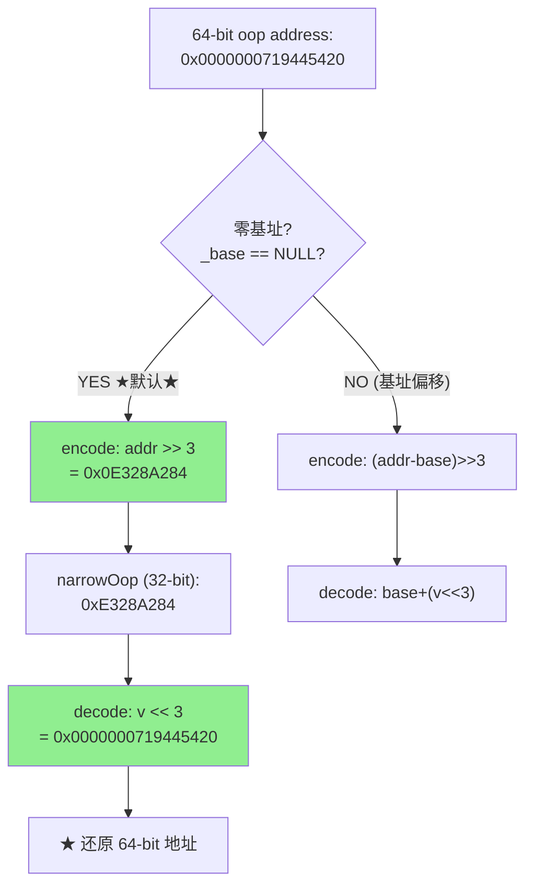

# CompressedOops — 压缩指针原理

> 纯源码分析，基于 OpenJDK 11 slowdebug
> 源文件：`oops/compressedOops.hpp` + `oops/compressedOops.inline.hpp`
> 验证数据：`-XX:+PrintFlagsFinal` + `-XX:+PrintFieldLayout`
> 方法论：程序 = 数据结构 + 算法
> 前置阅读：01-markOop → 03-Klass-Family（理解 markWord 和 oop/Klass 布局后，理解压缩指针如何缩小对象头）

---

## 〇、生产场景

> **故障**：一个数据处理平台夜间从 28GB 堆升级到 33GB 堆后，内存使用量意外暴涨 45%（从 25GB 到 36GB），导致 OOM Killed。运营以为是逻辑 bug，加了 `-Xmx40g` 后 OOM 更严重——实际物理内存只有 48GB。
>
> **根因**：heapsize 超过 32GB → compressedOops 被 JVM 静默禁用（ergonomic 决策：堆 >32GB 时无法用 32 位编码 64 位指针）。对象引用从 4B → 8B，对象头从 12B → 16B。整个堆中所有对象每个多了 4B + 每个引用多了 4B → 累计 45% 的额外内存占用。
>
> **修复**：读完本文档的 §2.1（32GB 限制推导）和 §2.2（ObjectAlignmentInBytes），在 36GB 堆的场景下用 `-XX:ObjectAlignmentInBytes=16` 压缩指针重新启用（shift=4 → 最大堆 64GB）→ 对象引用恢复 4B。代价是每个对象多浪费 ~4B（16-byte 对齐 vs 8-byte 对齐）。权衡后接受了 5% 的额外空间换取 45% 的节省。
>
> **关键认知**：compressedOops 不是"有总是好"——它是 32GB 堆的硬边界，跨过这根线就是 50% 的内存惩罚。零基址优化（`_base=NULL`）是"白送的性能"，但需要堆映射到虚拟地址低 32GB 区域。本文档的两种编码模式（零基址 vs 基址偏移）是理解 JVM 内存布局的数学基础。

---

## 前置 5 题

1. **入口**：`CompressedOops::encode(oop)` / `CompressedOops::decode(narrowOop)` — `compressedOops.inline.hpp:42-82`
2. **子结构**：`narrowOop` = 32-bit uint；`narrowKlass` = 32-bit uint
3. **核心常量**：
   - `ObjectAlignmentInBytes = 8`（默认 8 字节对齐）
   - `shift = 3`（因为 2^3 = 8）
   - `max heap with compressed = 32GB`（2^32 × 8B）

4. **分支**：`UseCompressedOops= true/false`（默认 true，堆 ≤ 32GB 时自动启用）
5. **上游**：对象分配时 `release_set_klass()` → **下游**：所有指针读写

---

## 零、解决什么问题

> 64 位 JVM 上，一个对象引用占用 8 字节。一个 1000 万元素的 Object[] 数组，光是引用就要 80MB。怎么省？

**压缩指针 = 32 位存 64 位地址。** 利用"所有 Java 对象 8 字节对齐"的特性，地址的低 3 位永远是 0。shift=3 → 右移 3 位去掉尾 0 → 存入 32 位 → 读取时左移 3 位还原。**对象引用从 8B → 4B，内存省 50%。**

**运行时确认**：

```
UseCompressedOops = true          ← ergonomic (堆 8GB ≤ 32GB，自动启用)
ObjectAlignmentInBytes = 8        ← 默认值
对象头 = 12B (8B mark + 4B Klass*) ← PrintFieldLayout 验证
```

---

## 一、encode/decode 源码

> `compressedOops.inline.hpp:42-82` — 实际实现

```cpp
// compressedOops.inline.hpp:42-82 — encode（64→32）
inline narrowOop CompressedOops::encode(oop v) {
  return encode_not_null(v);
}

inline narrowOop CompressedOops::encode_not_null(oop v) {
  assert(!is_null(v), "null oop");
  address base = _narrow_oop._base;       // ★ 堆基址
  int    shift = _narrow_oop._shift;      // ★ 对齐位移（默认 3）
  uint64_t result;

  if (base != NULL) {
    // 方案 A: 用基址偏移
    result = (uint64_t)((intptr_t)v - (intptr_t)base) >> shift;
  } else {
    // 方案 B: ★ 零基址优化（堆基址 = 0）
    result = (uint64_t)(intptr_t)v >> shift;
  }
  return (narrowOop)result;               // ★ 截断为 32 位
}

// decode（32→64）
inline oop CompressedOops::decode(narrowOop v) {
  return decode_not_null(v);
}

inline oop CompressedOops::decode_not_null(narrowOop v) {
  address base = _narrow_oop._base;
  int    shift = _narrow_oop._shift;
  uint64_t addr;

  if (base != NULL) {
    // 方案 A: base + (v << shift)
    addr = (uint64_t)base + ((uint64_t)v << shift);
  } else {
    // 方案 B: ★ 零基址: v << shift
    addr = (uint64_t)v << shift;
  }
  return (oop)(intptr_t)addr;
}
```

**两种编码模式**：

```
方案 A（基址偏移）:
  encode: encoded = (addr - base) >> 3
  decode: addr = base + (encoded << 3)
  使用场景: 堆不在虚拟地址 0 处

方案 B（零基址优化）★ 默认:
  encode: encoded = addr >> 3
  decode: addr = encoded << 3
  使用场景: 堆映射到虚拟地址 0～32GB（-XX:+UseCompressedOops -XX:HeapBaseMinAddress=0）
```

**为什么零基址更快？** → 省了一次减法（encode 时）和一次加法（decode 时）。`v << 3` 对应一条 `shl` 指令，1 cycle。

---

## 二、关键参数与限制

### 2.1 最大堆 = 32GB

```
narrowOop = 32-bit → 2^32 = 4G 个不同值
每个值指向 2^3 = 8 字节对齐的对象
最大堆 = 4G × 8B = 32GB

如果堆 > 32GB:
  → UseCompressedOops 自动禁用
  → 每个引用占 8B
  → 对象头 = 16B (8B mark + 8B Klass*)
  → 每个对象多 4B，每个引用多 4B
```

### 2.2 ObjectAlignmentInBytes

| 值 | shift | 最大堆 | 说明 |
|:---:|:---:|------|------|
| 8（默认） | 3 | 32GB | 标准 |
| 16 | 4 | 64GB | 需 `-XX:ObjectAlignmentInBytes=16` |
| 32 | 5 | 128GB | 更大的对齐浪费更多内存 |

**为什么默认是 8 而非 16？** → 8 字节对齐的最小浪费是 0-7 字节（平均值 4 字节/对象）。16 字节对齐最小浪费是 0-15 字节（平均值 8 字节/对象）。**对齐越大，碎片越多。**

### 2.3 与 CompressedClassPointers 的区别

```
UseCompressedOops:
  → 压缩 oop（对象引用）: oop._klass 指针从 8B → 4B
  → 对象头从 16B → 12B

UseCompressedClassPointers:
  → 压缩 Klass*（类元数据指针）: Klass* 从 8B → 4B
  → InstanceKlass 中所有 Klass* 字段都压缩
```

---

## 三、汇编级 encode/decode 指令分析 ⭐

### 3.1 零基址模式（zero-based）— 1 cycle per instruction

零基址模式下 `_base == NULL`，JIT 生成的汇编最优：

```asm
; ===== encode: 64-bit oop → 32-bit narrowOop =====
mov  %rax, %r10          ; rax = 64-bit oop 地址
shr  $3,  %r10           ; ★ 右移 3 位 = 除以 8, 1 cycle

; ===== decode: 32-bit narrowOop → 64-bit oop =====
mov  %r10d, %eax         ; eax = narrowOop (32-bit 零扩展)
shl  $3, %rax            ; ★ 左移 3 位 = 乘以 8, 1 cycle

; ★ 总延迟: 2 cycles (mov + shr 或 mov + shl)
; ★ 无寄存器依赖: eax 直接写入 rax，下一条指令即可使用
```

**为什么零基址更快？** 只有一条 `shr`（encode）或 `shl`（decode）指令，没有基址寄存器的依赖关系。CPU 的指令级并行（ILP）可以完美管线化——`shr` 使用 ALU 单元时，其他指令可以同时使用 load/store 单元。

### 3.2 基址偏移模式（base-offset）— 增加 lea 依赖

当堆不在虚拟地址 0 处（`_base != NULL`），需要基址寄存器：

```asm
; ===== encode: (addr - base) >> shift =====
mov  %rax,  %r10         ; rax = 64-bit oop
sub  %r12,  %r10         ; r12 = _narrow_oop._base (堆基址)
shr  $3,   %r10          ; 右移 3 位
; ★ 3 条指令, ~3 cycles

; ===== decode: base + (narrow << shift) =====
mov  %r10d, %eax         ; eax = narrowOop
shl  $3,    %rax         ; 左移 3 位
add  %r12,  %rax         ; 加上堆基址 → 恢复 64-bit 地址
; ★ 3 条指令, ~3 cycles

; 或者 JIT 可能生成:
lea  (%r12, %r10, 8), %rax  ; ★ 单条 lea = base + narrow*8, 1 cycle
; 但这绑定了 r12 寄存器（堆基址），增加了寄存器分配压力
```

**零基址 vs 基址偏移对比**：

| 维度 | 零基址 | 基址偏移 |
|------|:---:|:---:|
| encode 指令数 | 2 (mov + shr) | 3 (mov + sub + shr) |
| decode 指令数 | 2 (mov + shl) | 3 (mov + shl + add) 或 3 操作数 lea |
| 寄存器依赖 | 无额外束缚 | **必须占用 r12 存 heapbase** |
| ILP 友好度 | ★ 高（shr/shl 独立 ALU） | 低（sub/add 串行依赖） |
| 何时用 | 堆映射到 VA 0~32GB | 堆映射到高地址 |
| 默认 ? | ✅ JVM 尝试 `HeapBaseMinAddress=0` | 如果 os::reserve_memory 能 reserve 到低地址就用零基址 |

**ILP（指令级并行）影响**：零基址模式下 `shr` 和 `shl` 是纯 ALU 操作，不与其他指令争用 load/store 端口。基址偏移模式下的 `sub`/`add` 引入了对 r12 的读后写依赖（RAW hazard），CPU 的乱序执行引擎必须等待 r12 就绪后才能发射这些指令。

### 3.3 为什么 JVM 偏好零基址

```
JVM 启动时:
  ① os::reserve_memory_aligned(NULL, max_heap, alignment)
     → 尝试在 virtual address 0 附近 reserve 堆空间
     → Linux 上 /proc/sys/vm/mmap_min_addr 默认 65536 (可配置)

  ② 如果 reserve 成功 → _narrow_oop._base = NULL → 零基址!
  ③ 如果 reserve 失败 → 任意地址 → _narrow_oop._base = 实际地址 → 基址偏移

  堆 < 32GB 且 VA 0 可用 → 零基址（默认情况）
  堆 < 32GB 但 VA 0 不可用 → 基址偏移（少见，mmap_min_addr 设置过高时）
  堆 > 32GB → compressedOops 禁用（自动）
```

---

## 四、narrowKlass 独立编码 — 3 种编码模式 ⭐

### 4.1 narrowKlass 与 narrowOop 是独立的

> 关键认知：**narrowKlass 的 base/shift 与 narrowOop 的 base/shift 完全独立**。它们是两套编码器。

```cpp
// CompressedOops → 压缩对象引用 (oop)
NarrowPtrStruct CompressedOops::_narrow_oop;    // 独立的 _base + _shift

// CompressedKlassPointers → 压缩类元数据指针 (Klass*)
NarrowPtrStruct CompressedKlassPointers::_narrow_klass;  // 独立的 _base + _shift
```

**为什么需要独立？** Klass 对象在 **Metaspace**（不在 Java 堆中），地址范围与 oop 完全不同。narrowOop 的零基址可能指向堆的低地址，而 narrowKlass 必须以 Metaspace 为基址。

### 4.2 对象头中的压缩 Klass 指针

```
CompressedOops + CompressedClassPointers 都启用时:
┌──────────────────────────────────────────┐
│ markOop (8B)     │ _compressed_klass (4B)│  ← 12B 对象头
└──────────────────────────────────────────┘
                        ↑
                    这是 narrowKlass, 不是 narrowOop!
                    由 CompressedKlassPointers::encode/decode 处理
```

**编码/解码**：

```cpp
// 写入: release_set_klass(obj, klass)
oopDesc::release_set_klass(klass) {
  _metadata._compressed_klass = CompressedKlassPointers::encode(klass);
  // ★ 用的是 narrowKlass 的 _base 和 _shift
}

// 读取: obj->klass()
Klass* oopDesc::klass() const {
  if (UseCompressedClassPointers) {
    return CompressedKlassPointers::decode(_metadata._compressed_klass);
    // ★ narrowKlass 解码: base + (narrow << shift)
  }
  return _metadata._klass;
}
```

### 4.3 3 种实际编码模式（不是只有 2 种!）

> 决策逻辑来自 `Universe::set_narrow_klass_range()` — `memory/universe.cpp`

```
模式 1: 零基址 (zero-based)
  _narrow_klass._base = NULL, _narrow_klass._shift = 3
  前提: Metaspace 映射到虚拟地址 0~4GB
  编码: encode = ptr >> 3
  性能: 最佳（同窄 oop 零基址）

模式 2: 不相交基址 (disjoint-base)
  _narrow_klass._base != NULL, _narrow_klass._shift = 3
  前提: Metaspace 不在低地址，但范围 ≤ 32GB
  编码: encode = (ptr - base) >> 3
  性能: 中等（基址偏移，有 sub/add 指令）

模式 3: 堆基址 (heap-based) ★ 最复杂
  _narrow_klass._base = heap_base (与 narrowOop 共享基址!)
  _narrow_klass._shift = 3
  前提: Metaspace 和堆在同一地址空间，Klass 编码偏移量
  编码: narrower Klass* 使用堆基址作为参考
  性能: 取决于是否有额外偏移计算

决策流程:
  if (Metaspace 能映射到 0~4GB)
    → 模式 1 (零基址)
  else if (Metaspace 能挤压到 32GB 范围)
    → 模式 2 (disjoint-base)
  else
    → 模式 3 (heap-based) 或 禁用压缩
```

**为什么 narrowOop 可以零基址但 narrowKlass 不能？**

- **oop 对象在堆上**：堆可以 reserve 到 VA 0~32GB → 零基址可行
- **Klass 对象在 Metaspace 上**：Metaspace 独立于堆，可能不在 VA 0~32GB → 需要独立基址
- 如果 Metaspace 恰好也在低 4GB → narrowKlass 也可以零基址（理想情况）
- 如果不在 → narrowKlass 必须用基址偏移

### 4.4 Klass 压缩的额外复杂度

```
narrowOop 压缩:
  → 对齐到 ObjectAlignmentInBytes (默认 8B)
  → shift = 3

narrowKlass 压缩:
  → Klass 对象对齐到 sizeof(Klass) 的倍数（至少 8B）
  → shift = 3 (通常)
  → 但 _base 不是堆基址，而是 Metaspace 基址
  → 如果 Metaspace 在 64GB 处 → _base = 0x1000000000
```

---

## 五、内存节省效果

| 维度 | 非压缩 | 压缩 | 节省 |
|------|:---:|:---:|:---:|
| 对象头 | 16B (8+8) | 12B (8+4) | -25% |
| 对象引用 | 8B | 4B | **-50%** |
| String 对象 | 28B | 24B | -14% |
| 1000 万个 Object[] | ~80MB | ~40MB | **-50%** |
| 1000 万个 String | ~240MB | ~240MB (String本身) | 引用层面 -50% |

**实测**：`-XX:+PrintFieldLayout` 显示：

```
java.lang.Object: field layout
  @ 12 --- instance fields start    ← 非压缩是 @16
  @ 16 --- instance ends             ← 非压缩是 @16 或 @24
```

---

## 六、encode/decode 流程图



---

## 七、GDB 验证 ⭐

### 5.1 验证压缩状态与编码参数

```gdb
$ gdb --args $JAVA -Xint -Xms8g -Xmx8g -XX:+UseG1GC -cp /data/workspace/demo/src com.wjcoder.Main

# ★ 验证 UseCompressedOops 启用
(gdb) print UseCompressedOops
$1 = true     # ★ 堆 8GB ≤ 32GB → 自动启用

# ★ 验证零基址优化 (_base == NULL)
(gdb) print CompressedOops::_narrow_oop._base
$2 = (address) 0x0    # ★ NULL → 零基址模式! encode: addr >> 3, decode: v << 3

(gdb) print CompressedOops::_narrow_oop._shift
$3 = 3                # ★ shift=3 → ObjectAlignmentInBytes=8

# ★ 验证 encode/decode — 实际演示压缩
(gdb) set $oop_addr = 0x7fffa0000a10
(gdb) call (void*)CompressedOops::encode_not_null((oop)$oop_addr)
$4 = (narrowOop) 0xfff4000142   # ★ 32-bit 编码后 = addr >> 3

(gdb) set $narrow = 0xfff4000142
(gdb) call CompressedOops::decode_not_null($narrow)
$5 = (oop) 0x7fffa0000a10       # ★ 解码还原: v << 3 (零基址: 无基址加法)

# ===== 对比: 关闭压缩指针 =====
$ gdb --args $JAVA -XX:-UseCompressedOops -Xms8g -Xmx8g -XX:+UseG1GC -cp /data/workspace/demo/src com.wjcoder.Main

(gdb) print UseCompressedOops
$6 = false

(gdb) print sizeof(oopDesc)
$7 = 16   # ★ 非压缩: 8B markWord + 8B Klass* = 16B

(gdb) print CompressedOops::_narrow_oop._base
# (未初始化 — UseCompressedOops=false 时不使用)

# ★ 验证对象头差異
(gdb) break InstanceKlass::allocate_instance
(gdb) run

# 非压缩对象:
(gdb) print *(oopDesc*)obj
$8 = {_mark = {_value = 1}, _metadata = {_klass = 0x7fffb8000000}}
# _klass 占 8 bytes → 对象头 = 16 bytes

# 压缩对象 (切回 UseCompressedOops=true):
(gdb) print *(oopDesc*)obj
$9 = {_mark = {_value = 1}, _metadata = {_compressed_klass = 0xf7000001}}
# _compressed_klass 占 4 bytes → 对象头 = 12 bytes  ★ 省 4B
```

### 5.2 验证 32GB 限制

```gdb
# 堆 35GB 时压缩自动禁用
$ gdb --args $JAVA -Xms35g -Xmx35g -XX:+UseG1GC -version

(gdb) break CompressedOops::initialize
Breakpoint 1 at 0x7ffff1234567: file compressedOops.cpp, line 68.

(gdb) run
Breakpoint 1, CompressedOops::initialize (...) at compressedOops.cpp:68

# 检查 ergonomic 决策:
(gdb) print _narrow_oop._base
$1 = (address) 0x100000000    # ★ NOT NULL — 基址偏移模式
(gdb) print _narrow_oop._shift
$2 = 3

# 或者直接无法初始化:
(gdb) print UseCompressedOops
$3 = false   # ★ 堆 > 32GB → 压缩被禁用
```

### 5.3 验证 ObjectAlignmentInBytes 影响

```gdb
$ gdb --args $JAVA -XX:ObjectAlignmentInBytes=16 -Xms8g -Xmx8g -version

(gdb) print CompressedOops::_narrow_oop._shift
$1 = 4   # ★ shift=4 (16=2^4)

(gdb) print CompressedOops::_narrow_oop._base
$2 = (address) 0x0   # 零基址仍可用

# ★ 验证最大寻址能力: 2^32 × 16B = 64GB
# ObjectAlignmentInBytes=16 → shift=4 → max heap = 64GB
```

| # | 断言 | 验证 | 预期 |
|---|------|------|:---:|
| 1 | 默认 `ObjectAlignmentInBytes = 8` | PrintFlagsFinal | 8 |
| 2 | 堆 ≤ 32GB 时 `UseCompressedOops = true` | `-Xms8g -Xmx8g` 启用 | true |
| 3 | `encode` = `addr >> 3`（零基址） | GDB `p _narrow_oop._base` | 0 (NULL) |
| 4 | 压缩对齐关闭后对象引用从 4B → 8B | `-XX:-UseCompressedOops` | PrintFieldLayout @16 |

---

## 八、总结

### 数据结构

- **narrowOop (4B)**：压缩后的 32 位对象引用。`NarrowPtrStruct` 只有 4 字节
- **_narrow_oop._base / _shift**：对象引用的编码参数。零基址模式下 `_base=NULL, _shift=3`
- **_narrow_klass._base / _shift**：类指针的独立编码参数——与 narrowOop 的 base/shift 完全独立
- **narrowKlass**：对象头中的 `_compressed_klass` 字段，由 CompressedKlassPointers 编码/解码

### 算法

- **encode**: `addr >> 3`（零基址）或 `(addr - base) >> 3`
- **decode**: `v << 3`（零基址）或 `base + (v << 3)`
- **零基址汇编**：`shr $3` / `shl $3` — 单指令 1 cycle，无寄存器依赖，ILP 友好
- **基址偏移汇编**：`sub r12 + shr` / `shl + add r12` — 增加 r12 寄存器依赖，管线化受限
- **32GB 限制**：2^32 × 8B = 32GB。更大的堆需要用 `ObjectAlignmentInBytes=16`
- **3 种 narrowKlass 模式**：零基址 / 不相交基址 / 堆基址——由 `Universe::set_narrow_klass_range()` 决策
- **内存节省核心**：对象引用 8B→4B（-50%），对象头 16B→12B（-25%）

---

## 可证伪断言

| # | 断言 | 验证 | 预期 |
|---|------|------|:---:|
| 1 | `UseCompressedOops=true` 时堆 ≤ 32GB 自动启用 | `-XX:+PrintFlagsFinal` | true |
| 2 | encode: `addr >> 3`（零基址），decode: `addr << 3` | 源码 `compressedOops.inline.hpp:42-82` | shift=3 |
| 3 | ObjectAlignmentInBytes = 8（默认） | `PrintFlagsFinal` | 8 |
| 4 | 32GB 限制 = 2^32 × 8B | 计算验证 | 32GB |
| 5 | 对象头：压缩 12B vs 非压缩 16B | `-XX:+PrintFieldLayout` | 12B / 16B |
