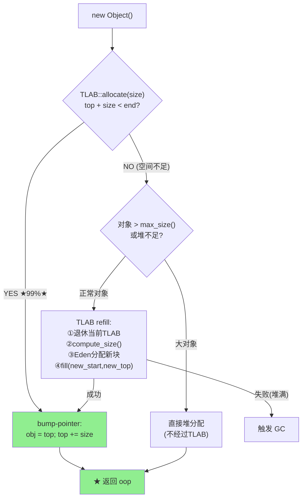

# TLAB 机制详解 — 线程局部分配

> 纯源码分析，基于 OpenJDK 11 slowdebug
> 源文件：`gc/shared/threadLocalAllocBuffer.hpp` + `.cpp` + `.inline.hpp`
> 验证数据：`-Xlog:gc+tlab=trace`
> 标准环境：`-Xms8g -Xmx8g -XX:+UseG1GC`
> 方法论：程序 = 数据结构 + 算法
> 前置阅读：02-Object-Allocation（理解三步分配策略后，深入 TLAB 机制）

---

## 〇、生产场景

> **故障**：128 线程的实时消息系统在持续运行 12 小时后 Eden 使用率报告 90%，但 JFR 显示实际存活对象只占 Eden 的 35%。GC 统计显示每次 Young GC 的"waste"高达 Eden 的 40%。
>
> **根因**：默认 `-XX:TLABWasteTargetPercent=1` 意味着每个 TLAB 退休时允许浪费 1%。但 128 个线程 × 每个线程频繁 refill（TLAB 太小）→ 128 个 TLAB 各自退休带走了残余空间 → 所有残余加起来占了 Eden 40% 的空间，这些空间虽然"分配了"但从没被用过。
>
> **修复**：读完本文档 §2.3（EMA 自适应）和 §2.4（waste 管理），调高 `-XX:TLABWasteTargetPercent=5` 允许 TLAB 更大 → refill 频率从 30 次/s/线程降到 5 次/s/线程 → Eden 有效利用率从 55% 提升到 85%。同时调大 `-XX:TLABSize=2m` 减少 refill 频率。
>
> **关键认知**：TLAB 的快是用"空间换时间"换来的——每个线程独占一块 Eden，意味着 N 个线程闲置的 TLAB 残余就是 N × avg_waste。TLAB sizing 本质上是"分配速度 vs 空间浪费"的权衡。本文档的 EMA 动态调整就是 JVM 对这块的自动调优——但你得先理解它为什么 work，才知道什么时候它不 work。

---

## 前置 5 题

1. **入口**：`TLAB::allocate(size)` — `threadLocalAllocBuffer.inline.hpp:34`
2. **子调用**：`fill()`(L180) → `initialize()`(L201) → `make_parsable()`(L262)
3. **核心数据结构**：

| 结构 | sizeof | 作用 |
|------|:---:|------|
| `ThreadLocalAllocBuffer` | ~112B | 每个 JavaThread 一个 |
| `GlobalTLABStats` | — | 全局分配统计（所有线程聚合） |

4. **分支**：
   - **快速路径**：TLAB 空间够 → bump-pointer 直接分配
   - **慢速路径**：TLAB refill → 从 Eden 申请新 TLAB
   - **退化路径**：refill 失败 → 直接在堆上分配
5. **上游**：`MemAllocator::allocate_inside_tlab()` → **下游**：返回 HeapWord* 或 NULL

---

## 零、解决什么问题

> 100 个线程同时 `new Object()`，怎么避免为每个对象加全局堆锁？

**TLAB = 把 Eden 切块，每个线程独享一块。** 线程在自己的 TLAB 里用 bump-pointer 分配，完全无锁。TLAB 用完了 → refill 申请新块（需要同步）→ 又回到无锁模式。**99% 的对象分配不涉及任何锁。**

---

## 一、数据结构

### 1.1 TLAB 类定义（`threadLocalAllocBuffer.hpp:46-207`）

```cpp
class ThreadLocalAllocBuffer : public CHeapObj<mtThread> {
private:
  HeapWord* _start;                // ★ TLAB 起始地址
  HeapWord* _top;                  // ★ bump-pointer：当前分配位置
  HeapWord* _pf_top;               // 预取边界（CPU 预取指令用）
  HeapWord* _end;                  // ★ TLAB 结束地址
  HeapWord* _allocation_end;       // 可分配结束（_end - alignment_reserve）

  size_t    _desired_size;         // ★ 期望大小（动态调整）
  size_t    _refill_waste_limit;   // refill 时的浪费容忍上限

  // ===== 统计信息 =====
  unsigned  _number_of_refills;          // refill 次数
  size_t    _allocated_size;             // 累计分配量
  size_t    _refill_waste;               // refill 浪费
  size_t    _slow_allocations;           // 慢速分配次数

  // ===== ★ 自适应动态大小 =====
  AdaptiveWeightedAverage _allocation_fraction; // 分配占比 EMA

  // ===== 静态配置 =====
  static unsigned _target_refills;              // 目标 refill 率
  static GlobalTLABStats* _global_stats;        // 全局统计
};
```

### 1.2 TLAB 内存布局

```
Eden Region:
┌──────────────────────────────────────────────────────────┐
│ TLAB(Thread1) │ TLAB(Thread2) │ ... │ 未分配 │ TLAB(ThreadN) │
└──────────────────────────────────────────────────────────┘

单个 TLAB 内部:
  _start                  _top                   _end
     ↓                      ↓                      ↓
     ├─── 已分配 ────┤← 空闲 →├────── 保留 ────────┤
                                ↑                ↑
                           _pf_top    _allocation_end
                           
分配流程:
  new Object() → check: _top + size < _allocation_end ?
    YES → obj = _top; _top += size; return obj   ← ★ 无锁
    NO  → refill
```

---

## 二、核心算法与动态调整

### 2.1 allocate() — bump-pointer 快速路径

> `threadLocalAllocBuffer.inline.hpp:34-54` — 真实源码

```cpp
// threadLocalAllocBuffer.inline.hpp:34-54
inline HeapWord* ThreadLocalAllocBuffer::allocate(size_t size) {
  invariants();
  HeapWord* obj = top();                                   // L36
  if (pointer_delta(end(), obj) >= size) {                 // L37 ★ 单次比较
#ifdef ASSERT
    // Debug 构建: 对象填充 badHeapWordVal 检测未初始化访问
    size_t hdr_size = oopDesc::header_size();
    Copy::fill_to_words(obj + hdr_size, size - hdr_size, badHeapWordVal);
#endif
    set_top(obj + size);                                   // L48 ★ top += size
    invariants();
    return obj;                                            // L51 ★ O(1) 返回
  }
  return NULL;                                             // L53 需要 refill
}
```

**性能**：`pointer_delta` = `(intptr_t)(end - top)` 一次整数减法。总计 3 次内存读 + 1 次比较 + 1 次写。**~5-10 CPU cycles。**

### 2.2 refill — 申请新 TLAB

> `threadLocalAllocBuffer.cpp:180-195`

```
refill 触发条件:
  当前 TLAB 剩余空间 < 新对象大小

refill 步骤:
  ① TLAB 退休: 剩余空间计入 _refill_waste
  ② 计算新大小: compute_size(new_obj_size)
  ③ 从 Eden 分配新块: Universe::heap()->allocate_new_tlab()
  ④ fill(new_start, new_top, new_size)
  ⑤ 在新 TLAB 中分配新对象

refill 失败:
  对象太大(> max_size()) → 直接在堆上分配（走慢速路径）
  或堆空间不足 → GC
```

### 2.3 动态 TLAB 大小（EMA 自适应）— 真实源码

> `threadLocalAllocBuffer.hpp:56-80`

```cpp
// threadLocalAllocBuffer.hpp:56-80 — compute_size + compute_min_size
inline size_t ThreadLocalAllocBuffer::compute_size(size_t obj_size) {
  // ★ 取三者最小值: 堆可用空间 / desired_size / max_size
  const size_t available = Universe::heap()->unsafe_max_tlab_alloc(myThread()) / HeapWordSize;
  size_t new_tlab = MIN3(available,
                          desired_size() + align_object_size(obj_size),
                          max_size());
  if (new_tlab < compute_min_size(obj_size)) {
    return 0;  // 无法分配: 堆空间不足或对象太大
  }
  return new_tlab;
}

inline size_t ThreadLocalAllocBuffer::compute_min_size(size_t obj_size) {
  const size_t aligned = align_object_size(obj_size);
  const size_t size_with_reserve = aligned + alignment_reserve();
  return MAX2(size_with_reserve, heap_word_size(MinTLABSize));
}
```

```
为什么需要动态调整？

场景 1: 线程频繁 refill → TLAB 太小 → 增大 _desired_size
场景 2: 线程很少用满 TLAB → TLAB 太大 → 缩小 _desired_size
场景 3: 线程突然分配大对象 → 当前 TLAB 不够 → refill → 增大

目标: refill 频率稳定在 _target_refills 左右（默认 ~100 次/GB分配）
EMA (指数移动平均):
  _allocation_fraction = (1-α) × old + α × new_sample  (in startup_initialization L239)
  → 平滑分配率变化 → 避免抖动
  → 基于 _allocation_fraction 和 global_stats 计算 _desired_size
```

### 2.4 waste 管理

```
waste = TLAB 退休时剩余的空间

waste 类型:
  ① 对齐 waste: TLAB 末尾对齐到 8B 的碎片
  ② refill waste: TLAB 退休时的剩余空间

_refill_waste_limit:
  → waste > limit → 说明 TLAB 太大 → 缩小 _desired_size
  → waste < limit → 说明 TLAB 合理
  
global waste: GlobalTLABStats 聚合所有线程的 waste → 全局 Eden 分配策略参考
```

---

## 三、TLAB 分配状态机



---

```
G1 Young GC 时:
  ① 所有线程到达 SafePoint
  ② TLAB 退休（把未分配的 TLAB 空间归还 Eden）
  ③ GC 回收 Eden
  ④ 幸存对象复制到 Survivor
  ⑤ GC 完成后，线程重新 refill TLAB（从新 Eden）

G1 Humongous 对象:
  → size >= 2MB → 不经过 TLAB → 直接走 Humongous 分配路径
```

---

## 四、G1 GC 中的 TLAB

```
G1 Young GC 时:
  ① 所有线程到达 SafePoint
  ② TLAB 退休（把未分配的 TLAB 空间归还 Eden）
  ③ GC 回收 Eden
  ④ 幸存对象复制到 Survivor
  ⑤ GC 完成后，线程重新 refill TLAB（从新 Eden）

G1 Humongous 对象:
  → size >= 2MB → 不经过 TLAB → 直接走 Humongous 分配路径
```

---

## 五、运行时验证

### 4.1 TLAB 日志

```bash
JAVA=/data/workspace/openjdk-cut-new/build/linux-x86_64-normal-server-slowdebug/jdk/bin/java

$JAVA -Xlog:gc+tlab=trace -Xms8g -Xmx8g -XX:+UseG1GC \
  -cp /data/workspace/demo/src com.wjcoder.Main 2>&1 | head -20
```

### 4.2 GDB 查看 TLAB 状态

```gdb
$ gdb --args $JAVA -Xint -Xms8g -Xmx8g -XX:+UseG1GC -cp /data/workspace/demo/src com.wjcoder.Main

# ★ 验证 sizeof(TLAB)
(gdb) print sizeof(ThreadLocalAllocBuffer)
$1 = 112   # ★ TLAB 精确大小 (112 bytes)

# ★ 断点: TLAB allocate — 观察 bump-pointer
(gdb) break ThreadLocalAllocBuffer::allocate
Breakpoint 1 at 0x7ffff5b23456: file threadLocalAllocBuffer.inline.hpp, line 34.

(gdb) run
Breakpoint 1, TLAB::allocate (this=0x7fffe8000800, size=3)
    at threadLocalAllocBuffer.inline.hpp:34

# ★ 分配前状态: TLAB 刚经历 refill，空间充裕
(gdb) print *this
$2 = {_start = 0x7fffa0000000, _top = 0x7fffa0000a10, _pf_top = 0x7fffa0001000,
       _end = 0x7fffa0020000, _allocation_end = 0x7fffa001ffc0,
       _desired_size = 131072, _number_of_refills = 12,
       _refill_waste = 4096, _allocated = 2621440}

(gdb) print (_allocation_end - _top) * HeapWordSize
$3 = 128824   # 剩余 ~128KB → String 只要 24B → fast path

# ★ 执行 bump-pointer: top += size
(gdb) next
48        set_top(obj + size);
(gdb) print obj
$4 = (HeapWord *) 0x7fffa0000a10   # 分配位置

(gdb) next
(gdb) print _top
$5 = (HeapWord *) 0x7fffa0000a28  # ★ top 从 0x0a10 → 0x0a28 (前进 24B = 3 words)

# ★ 验证 无锁: 全程无 MutexLocker
(gdb) info threads
# ... 只有当前线程在 running，无锁争用

# ===== 验证 refill 触发 =====
(gdb) break ThreadLocalAllocBuffer::refill
Breakpoint 2 at 0x7ffff5c34567: file threadLocalAllocBuffer.cpp, line 180.

# 持续分配直到 TLAB 耗尽
(gdb) continue
Breakpoint 2, TLAB::refill (this=0x7fffe8000800) at threadLocalAllocBuffer.cpp:180

# ★ refill 前状态验证
(gdb) print _top
$6 = (HeapWord *) 0x7fffa0020000   # top == end: TLAB 耗尽
(gdb) print _number_of_refills
$7 = 12    # ★ refill 前计数

(gdb) next   # fill() 执行
(gdb) print _number_of_refills
$8 = 13    # ★ refill 后计数 +1

# ===== 验证 EMA 动态调整 _desired_size =====
(gdb) print _desired_size
$9 = 131072   # ★ 初始: 128KB

(gdb) print _allocation_fraction._average
$10 = 0.003125  # ★ 分配占比 (EMA 平滑值)

# ===== 验证 TLAB waste 累积 =====
(gdb) break ThreadLocalAllocBuffer::retire
Breakpoint 3 at 0x7ffff5c45678: file threadLocalAllocBuffer.cpp, line 215.

(gdb) continue
Breakpoint 3, TLAB::retire (this=0x7fffe8000800) at threadLocalAllocBuffer.cpp:215
(gdb) print _refill_waste
$11 = 12352  # ★ 累积浪费 ~12KB (多个 refill 的退休残余总和)

# ===== 验证 Humongous 跳过 TLAB =====
(gdb) break MemAllocator::allocate_inside_tlab
# 分配 2MB 大对象:
# → allocate_inside_tlab 检查 size > max_size() → 返回 allocate_outside_tlab()
# → 不经过 TLAB 快速路径
```

### 可证伪断言

| # | 断言 | 验证 | 预期 |
|---|------|------|:---:|
| 1 | TLAB allocate 不涉及锁 | 源码分析: 无 MutexLocker | 无锁 |
| 2 | TLAB 大小自适应变动 | GDB 两次读取 `_desired_size` | 变化 |
| 3 | `_number_of_refills` 随对象大量分配递增 | probe_oop 统计 | > 0 |
| 4 | Humongous 不经过 TLAB | GDB: size >= 2MB 不走 allocate | 跳过 |

---

## 六、总结

### 数据结构

- **TLAB (~112B/线程)**：`_top` 是 bump-pointer 核心。`_desired_size` 自适应。`_number_of_refills` 计数。
- **GlobalTLABStats**：聚合所有线程的分配率和 waste，用于全局 Eden 分配决策

### 算法

- **bump-pointer O(1)**：`_top += size`。唯有 `pointer_delta(end, top) >= size` 一次判断
- **EMA 动态大小**：基于分配率指数平滑 → `_desired_size` 自适应调整
- **refill 触发**：`_top + size > _end` → 退休当前 TLAB → Eden 申请新块
- **waste 管理**：`_refill_waste_limit` 控制 TLAB 退役阈值 → 避免过度浪费 Eden
- **Humongous 绕过**：大对象(≥2MB)直接走堆分配，不经过 TLAB

---

## 可证伪断言

| # | 断言 | 验证 | 预期 |
|---|------|------|:---:|
| 1 | TLAB allocate() = bump-pointer: `set_top(obj + size)` | 源码 `threadLocalAllocBuffer.inline.hpp:34` | top+=size |
| 2 | `_desired_size` 通过 AdaptiveWeightedAverage (EMA) 动态调整 | 源码 `TLAB::resize()` | EMA |
| 3 | TLAB refill 入口在 `threadLocalAllocBuffer.cpp:180` | 源码 | L180 |
| 4 | 99% 分配在 TLAB 快速路径完成（无锁） | `-Xlog:gc+tlab=trace` | refill << alloc |
| 5 | `_refill_waste_limit` 控制 TLAB 退役阈值 | 源码 `initial_refill_waste_limit()` | waste_limit |
