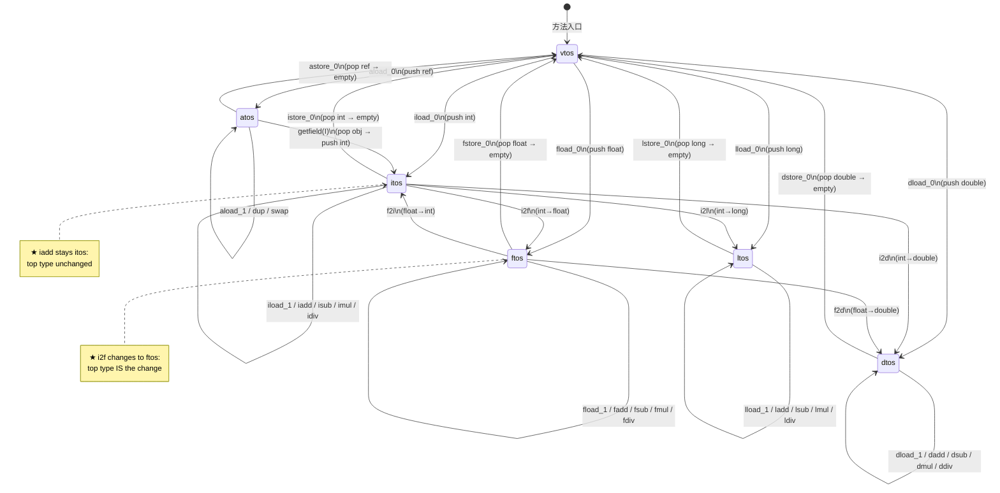
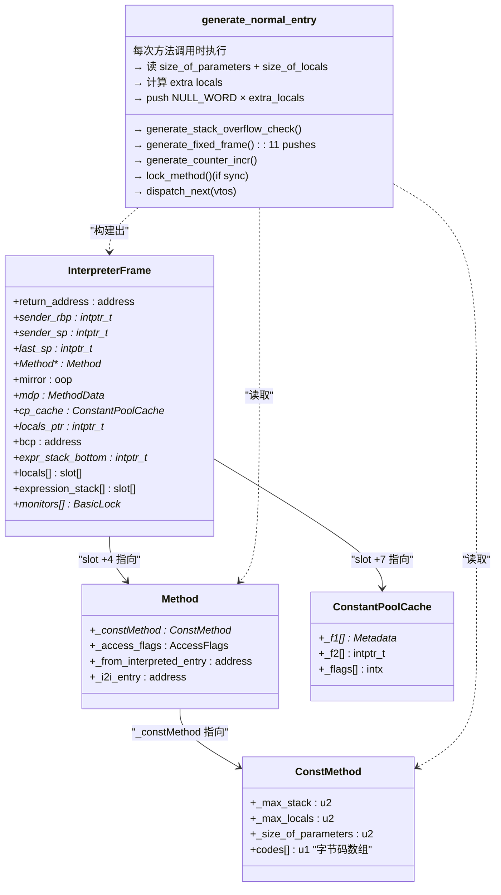

# 解释器栈帧结构 — locals + stack + monitors

> 纯源码分析，基于 OpenJDK 11 slowdebug
> 源文件：`cpu/x86/templateInterpreterGenerator_x86.cpp:1335-1501`（generate_normal_entry）+ `:649-694`（generate_fixed_frame）
> 验证数据：`-Xlog:probe_interp=debug`（resolve_invoke 13844次 → 每次 = 新栈帧分配）
> 方法论：程序 = 数据结构 + 算法

---

## 前置 5 题

1. **入口**：`generate_normal_entry()` — `templateInterpreterGenerator_x86.cpp:1335`
2. **子调用**：`generate_stack_overflow_check()` → `generate_fixed_frame()` → `generate_counter_incr()` → `lock_method()`（同步方法）
3. **核心帧布局**：`[locals..] [monitors..] [expression_stack..] [fixed_frame_header..]`
4. **分支**：普通方法（6 步） vs 同步方法（额外 monitor 分配） vs native 方法（独立入口）
5. **上游**：`_from_interpreted_entry` → **下游**：`__ dispatch_next(vtos)` 启动字节码执行循环

---

## 零、解决什么问题

> 每次调用 `foo(a, b)`，参数 `a, b` 和局部变量 `x, y` 在内存中是怎么摆放的？

**每次 Java 方法调用都在栈上分配一个解释器栈帧**。帧包含 4 部分（从低地址到高地址）：`locals[]`（局部变量 + 参数）→ `monitor[]`（同步锁）→ `expression_stack[]`（操作数栈）→ `SP`（栈顶）。**这个布局决定了所有字节码如何通过寄存器读写数据。**

---

## 一、数据结构全景

### 1.1 解释器栈帧 — 完整内存布局

> `frame_x86.hpp` 定义了各区域的相对位移。x86 栈向下增长。

```
          ↑ 高地址（调用者的帧底部）
┌────────────────────────────────────┐
│  调用者的 expression_stack          │  ← 调用者 push 了参数到此
├────────────────────────────────────┤ ← _from_interpreted_entry 起始
│  [fixed frame header — 11 slots]   │  ← generate_fixed_frame() 生成
│────────────────────────────────────│
│  return address       [slot +0]    │  push(rax);
│  sender's rbp         [slot +1]    │  __ enter();
│  sender_sp            [slot +2]    │  push(rbcp);
│  last_sp              [slot +3]    │  push(NULL);  ★ 初始=0,首次push时更新
│  Method*               [slot +4]    │  push(rbx);   ★ 当前方法元数据（GC根）
│  mirror (Class<?>)     [slot +5]    │  load_mirror+push; ★ GC根(klass mirror)
│  mdp (MethodData*)     [slot +6]    │  ProfileInterpreter?push mdp:push 0
│  ConstantPoolCache*    [slot +7]    │  push(rdx);   ★ 常量池缓存（invoke查表用）
│  locals ptr            [slot +8]    │  push(rlocals);★ 局部变量表起始地址
│  bcp (bytecode ptr)    [slot +9]    │  push(rbcp);  ★ 当前字节码指针(→r13)
│  expr_stack_bottom     [slot +10]   │  movptr(rsp,0);★ 自引用 = &expr_stack_bottom
│────────────────────────────────────│
│  expression_stack[]  ← rsp                          │  push=rsp-8; pop=rsp+8
│  [空闲栈空间]                     │
├────────────────────────────────────┤
│  monitor[]                        │  ← synchronized 方法专用
│    BasicLock (8B)                 │  lock_method() 在此 push
├────────────────────────────────────┤
│  locals[]   ← r14 (locals 指针)   │  ← ★ 局部变量表
│    locals[0] = this / 参数0        │  ★ 调用者传入的参数在此
│    locals[1] = 参数1               │
│    ... locals[n] = 局部变量x       │  ← 额外局部变量初始化为 NULL_WORD(0)
└────────────────────────────────────┘
          ↓ 低地址
```

**关键设计点**：

1. **帧头在栈顶（靠近 rsp）**，局部变量在栈底（远离 rsp）——因为 x86 push 向低地址生长，帧头用 push 构建最自然
2. **`last_sp = 0`** 标记"还没有 push 过操作数栈"。异常/GC 遍历栈时需要知道表达式栈的起始范围
3. **`expression_stack_bottom` 自引用**：`movptr(rsp, 0), rsp` 使该 slot 保存自己的地址，GC 由此确定操作数栈范围 `[bottom_addr, rsp]`

### 1.2 关键寄存器映射

> 初始化时机见 §二源码注释。此处为栈帧上下文中的总结。

| 寄存器 | 指向 slot | 含义 | 初始化时机 |
|--------|----------|------|-----------|
| `rbx` | +4 | `Method*` | 入口时传入，贯穿整个方法执行 |
| `r13` (bcp) | +9 | ByteCode Pointer | `generate_fixed_frame` 计算：`ConstMethod::codes_offset()` |
| `r14` (locals) | +8 | 局部变量表基址 | `__ lea(rlocals, ...)` 在 push locals 前计算 |
| `rsp` | expr_stack 顶部 | 栈顶指针 | 动态，随 push/pop 变化 |
| `rbp` | +1 | 帧指针链表头 | `__ enter()` 设置 |

### 1.3 sizeof 估算

以普通方法 `void hello(int x, String s)` 为例（2 参数 = 3 words：this + int + String，0 额外局部变量）：

```
固定帧头:    11 slots × 8B    =  88 字节
局部变量:    3 words × 8B     =  24 字节
操作数栈:    预留 ~8 slots    ≈  64 字节
──────────────────────────────────────
总计:                         ≈ 176 字节
```

GDB 已验证 `InterpreterCodeSize = 274432 (268KB)`，一个帧 ~200B，可同时容纳 ~1300 层方法调用。

---

## §生产场景：类型不匹配导致解释器崩溃 — TOS 状态机失效

### 现象

解释器在 `iadd` 字节码执行时收到 SIGSEGV：

```
# Problematic frame:
# V  [libjvm.so+0x...]  TemplateTable::iadd+0x12
#
# siginfo: si_signo: 11 (SIGSEGV), si_code: 1 (SEGV_MAPERR)
#
# Registers:
# RAX=0x3f800000    ← ★ 这是 float 1.0f 的 IEEE 754 位模式！
# RSP=0x7f...       ← 栈指针正常
```

### 根因链

字节码被动态修改（agent bytecode instrumentation）后，调用点的类型假设被破坏：

```
(1) 原字节码: aload_0; iload_1; iadd; ireturn
    汇编: mov eax, [locals+1*8]; addl [rsp], eax; ...

(2) Agent 修改为: aload_0; iload_1; fadd; return
    但 Template::_tos_in 和 _tos_out 没有更新！

(3) 解释器执行到 fadd:
    - _tos_in 期望 ftos (float on operand stack)
    - 但栈上实际是 int (42 = 0x0000002a)
    - fadd 把 int bits 当作 float bits 解释
    - 计算结果是错误的浮点值

(4) 该浮点值被用于内存寻址:
    - 解释器读 0x3f800000 (1.0f 的位模式) 当作 oop*
    - 解引用 0x3f800000 → 非法地址 → SIGSEGV
```

**核心问题**：`Template::_tos_in` 和 `_tos_out` 是字节码创建时确定的（由字节码序列分析得到，在 `TemplateTable::initialize()` 中通过 `def()` 宏注册），但 agent 在运行时修改了字节码 → 旧 TOS state 和新字节码不匹配 → 解释器按错误的寄存器读取类型 → 类型混淆 → 未定义行为。

**为什么解释器不做运行时类型检查？** 如果每条字节码前检查类型：

```asm
; 检查栈顶是否真的是 int（伪代码）
mov eax, [rsp]
test eax, 0x1     ; 检查 tag bit
jne  not_int       ; 不匹配 → 抛异常
; 实际整型操作
addl [rsp+8], eax
```

成本：每条字节码 ~3 条额外指令 → 201 条字节码 × 3 cycles × 10^8 字节码/秒 = ~600M 指令浪费在类型检查上。JVM 选择信任字节码验证器（`ClassFileParser::verify_method()`）+ 方法创建时的 TOS 计算——agent 通过 `ClassFileLoadHook` 重新解析字节码但 TOS state 不重算，绕过了这个前提。

### GDB 验证

```gdb
(gdb) attach <pid>
# 定位到 SIGSEGV 线程

# 验证 TOS state 不匹配
(gdb) x/wx $rsp
$1 = 0x3f800000    ← float 1.0f 的 IEEE 位模式（本应是 int stack slot）

# 读当前字节码
(gdb) x/bx $r13     # bcp 指向当前字节码
$2 = 0x60           ← iadd (= bytecode 0x60)

# iadd 期望栈顶 2 个 int → pop 到 eax/ecx 做 32-bit 加法
# 但栈顶实际是 float bits → eax = 0x3f800000 → addl 结果无意义

# 验证 _tos_in 映射
(gdb) p TemplateTable::_table[Bytecodes::_iadd]._tos_in
$3 = itos  ← 期望 itos（栈顶是 int）
```

### 修复

1. **避免 agent 修改字节码的类型行为**：Agent 应只修改不改变栈类型状态的字节码（如 `nop` 替换、日志注入等）
2. **重新加载类**：`HotSpot redefinition` (HCR) 触发 `ClassFileParser::verify_method()` 重算字节码 → TOS state 随之更新
3. **使用 `VerifyStack`**：`-XX:+UnlockDiagnosticVMOptions -XX:+VerifyStack` → 每次字节码后验证栈类型（仅 debug 构建）
4. **检测**：`jcmd <pid> VM.class_hierarchy` 检查 agent 注入的类

---

## §第一性原理：TOS 状态机 — 10 种状态的确定性自动机

### 如果从零构建一个字节码解释器

你的解释器执行 `iconst_0` → 从常量池读 0 → push 到表达式栈。执行 `iadd` → pop 2 个值 → add → push 结果。问题：

**下一步字节码怎么知道栈顶是什么类型？**

设计选项：
1. **运行时存储类型标签**：每个栈 slot 存储 `(type_tag, value)` pair → 每条字节码前检查 tag
2. **编译期分析类型**：在方法加载时分析字节码序列 → 得到每个程序点的类型 → 用独立入口对应不同的进入类型 → 运行时零检查

JVM 选方案 2，即 **TOS 状态机**。

### TOS 状态机的数学定义

TOS state = 对当前栈顶类型的分类（10 类）。它是一个**确定性有限自动机 (DFA)**：

- **状态集合 (Q)**：`{btos, ztos, ctos, stos, atos, itos, ltos, ftos, dtos, vtos}` = 10 种 TosState
- **初始状态 (q₀)**：`vtos`（方法入口时栈为空）
- **转移函数 (δ)**：每条字节码定义 `δ(tos_in) = tos_out`
- **字母表 (Σ)**：256 条字节码指令

每条字节码的 Template 定义了两个关键属性：

```cpp
// templateTable.hpp
struct Template {
  TosState _tos_in;   // ★ 执行前栈顶类型是什么？
  TosState _tos_out;  // ★ 执行后栈顶类型变为什么？
  void (TemplateTable::*_gen)(...); // 机器码生成函数
};
```

**运行时行为**：解释器在 `dispatch_next` 时根据当前 TOS 状态选择 `dispatch_table[_tos_out][next_bytecode]`——因为每个 Template 知道进入时的 TOS 类型 → 直接跳转到正确的机器码入口 → 零分支、零类型检查。

### 完整的 TOS 状态转移表

| 字节码 | 操作 | 栈深度变化 | TOS in | TOS out | 为什么是这个状态 |
|--------|------|:--------:|--------|---------|----------------|
| `iconst_0` | push 0 | +1 | vtos | itos | void→int：栈从空变 int |
| `iload_0` | push locals[0] | +1 | vtos | itos | push int → 栈顶是 int（第一个局部变量） |
| `iload_1` | push locals[1] | +1 | itos | itos | 栈顶已有 int，push int → 栈顶仍为 int |
| `iadd` | pop 2 ints, push sum | -1 | itos | itos | int+int→int：栈顶类型不变 |
| `isub` | pop 2 ints, push diff | -1 | itos | itos | 同 iadd |
| `imul` | pop 2 ints, push product | -1 | itos | itos | 同 iadd |
| `idiv` | pop 2 ints, push quotient | -1 | itos | itos | 同 iadd |
| `istore_0` | pop int → locals[0] | -1 | itos | vtos | pop 后栈空 |
| `i2f` | pop int, push float | 0 | itos | ftos | ★ 类型改变！int→float |
| `f2i` | pop float, push int | 0 | ftos | itos | ★ 类型改变！float→int |
| `i2l` | pop int, push long | 0 | itos | ltos | ★ 类型改变！int→long |
| `aload_0` | push ref from locals | +1 | vtos | atos | push 引用 → atos |
| `astore_0` | pop ref → locals | -1 | atos | vtos | pop 后栈空 |
| `dup` | dup 栈顶 | +1 | any | any | ★ TOS 不变（栈顶值类型不变） |
| `swap` | swap 栈顶 2 个值 | 0 | any | any | ★ TOS 不变（顶部 2 值交换不影响 top 类型） |
| `new` | push new object | +1 | vtos | atos | push 新对象 → atos |
| `getfield(I)` | pop obj, push int field | 0 | atos | itos | ★ obj→int：atos→itos |
| `putfield(I)` | pop int, pop obj | -2 | itos | vtos | ★ itos+atos→空 |
| `invokevirtual #n` | pop args + obj, push retval | -n+1 | vtos | ret_TOS | 返回类型决定 TOS |
| `return` | 空返回 | — | — | — | 无返回值 → 调用者栈顶不变 |
| `ireturn` | pop int, return | -1 | itos | — | 返回，调用者 TOS 由 return_entry 管理 |

### 状态转移链的具体实例

以 `static int add(int a, int b) { return a + b; }` 为例（4 条字节码）：

```
字节码: iload_0  iload_1  iadd  ireturn

执行链:
  vtos ─[iload_0]→ itos   (push a = int)  栈: [a]
  itos ─[iload_1]→ itos   (push b = int)  栈: [a, b]
  itos ─[iadd]───→ itos   (pop 2, push 1) 栈: [a+b]
  itos ─[ireturn]→ —      (pop int, return)
```

**关键观察**：`iload_1` 的 tos_in=itos, tos_out=itos——**不改变栈顶类型**，只增加栈深度。

### 为什么 iload_0 的 tos_in = vtos 而 iload_1 的 tos_in = itos？

`iload_0` 是方法入口的第一个 load 指令 → 此时栈为空 → vtos。`iload_1` 意味着已经执行过至少 1 个 load → 栈顶已经有值（通常是 iload_0 的参数）→ itos。

**这解释了为什么 dispatch table 需要 TosState × Bytecode**：不要假设 "iload 都是 int"——第一个 iload 从空栈开始（vtos），后续 load 从非空栈开始。虽然多数情况 vtos 和 itos 指向同一代码桩，但 table 仍需要 10 个 TosState 行以兼容其他架构。

> **侧边栏 — TosState 枚举值**：`btos=0, ztos=1, ctos=2, stos=3, atos=4, itos=5, ltos=6, ftos=7, dtos=8, vtos=9`。整数类型（byte/char/short/int）在 x86_64 上都通过 `%eax` 传递 → 实际机器码入口只有 5 个不同地址：atos (rax)、itos (eax)、ltos (rax, long)、ftos (xmm0)、dtos (xmm0)。但 Template 仍保留 10 个 TosState 以兼容其他架构（如 ARM 有不同寄存器约定）。

---

## §为什么 i2f 之后是 ftos 而 iadd 之后还是 itos？

### 第一性原理：TOS 状态只关心类型，不关心深度

`iadd` 操作数栈：pop 2 ints, push 1 int → 净深度变化：-1

**结果**：栈顶仍是 int → `_tos_out = itos`。深度变浅了，但类型未变。

`i2f` 操作数栈：pop 1 int, push 1 float → 净深度变化：0

**结果**：栈顶从 int 变为 float → `_tos_out = ftos`。深度未变，但**类型变了**。

**关键洞察**：TOS state machine 不在意栈深度——它只在意**下一条字节码看到什么类型**。iadd 之后栈顶仍是 int → 下一条字节码 dispatch 到 `itos` 行即可。i2f 之后栈顶是 float → 下一条字节码 dispatch 到 `ftos` 行。

### 为什么栈深度不重要？

因为深度信息已经内化在字节码序列中：

```
字节码偏移:  0:iload_0  1:iload_1  2:iadd  3:istore_2
栈深度:      0→1        1→2        2→1     1→0
TOS:         vtos→itos  itos→itos  itos→itos itos→vtos
```

- 字节码 iadd（深度 1）的下一条是 istore_2 → 解释器执行 pop → 深度变为 0
- **不需要在 TOS state 中存深度——深度由字节码序列的语义决定**
- TOS state 只需要回答一个问题：**"下一条指令期望栈顶是什么类型？"**

### 反例：如果 TOS state 需要表示深度

```
如果设计成 TosState 含深度:
  _tos_in = (itos, depth=3)
  _tos_out = (itos, depth=2)

则 dispatch table 变为:
  _table[TosState × Depth][bytecode]  →  10 × 256 × 256 × 8B ≈ 5MB
  (vs 当前 20KB)

这是 250× 的膨胀，且 99% 的深度组合不会出现
（字节码验证器保证操作数栈的小深度）
```

### 可视化：Math.max(int,int) 的完整 TOS 转移

```java
static int max(int a, int b) { return (a >= b) ? a : b; }
```

字节码：
```
 0: iload_0         // push a
 1: iload_1         // push b
 2: if_icmplt 7     // branch if a < b
 5: iload_0         // push a (then branch)
 6: ireturn
 7: iload_1         // push b (else branch)
 8: ireturn
```

TOS 状态转移：
```
偏移 0: vtos ─[iload_0]→ itos     栈深度=1
偏移 1: itos ─[iload_1]→ itos     栈深度=2
偏移 2: itos ─[if_icmplt]→ vtos   ★ 弹出 2 个 int → 栈空
偏移 5: vtos ─[iload_0]→ itos     栈深度=1  (then 分支)
偏移 6: itos ─[ireturn]→ —        返回
偏移 7: vtos ─[iload_1]→ itos     栈深度=1  (else 分支)
偏移 8: itos ─[ireturn]→ —        返回

★ 无论走哪个分支，ireturn 前的 TOS 始终是 itos
★ if_icmplt 将栈设为 vtos → 两条分支的初始 TOS 一致
```

---

## §Mermaid 图：TOS 状态转移可视化



> 上图中每个箭头 = 一条字节码的 `_tos_in → _tos_out` 映射。解释器在 dispatch_next 时根据 `dispatch_table[_tos_out][next_bytecode]` 跳转到对应入口——对于每个 (TosState, Bytecode) pair，机器码已被预计算。

---

## 二、算法 — generate_normal_entry() 源码级分析

> `templateInterpreterGenerator_x86.cpp:1335-1501`，~166 行。**这是整个解释器中最核心的函数**——每次方法调用都走这里。

### 2.0 解决什么问题？

每次 `invokevirtual/invokestatic/invokespecial` 最终要进入目标方法执行。这个函数负责：**(1) 分配新栈帧**（locals + fixed_frame）→ **(2) 初始化局部变量** → **(3) 同步方法获取锁** → **(4) 递增调用计数** → **(5) 启动链式跳转执行**。

### 2.1 阶段 1-3：读取元数据、栈溢出检查、计算 locals 基址

```cpp
// templateInterpreterGenerator_x86.cpp:1343-1372
const Address constMethod(rbx, Method::const_offset());
const Address size_of_parameters(rdx, ConstMethod::size_of_parameters_offset());
const Address size_of_locals(rdx, ConstMethod::size_of_locals_offset());

__ movptr(rdx, constMethod);                     // rdx = Method::_constMethod
__ load_unsigned_short(rcx, size_of_parameters);  // ★ rcx = 参数 word 数（含 this）
__ load_unsigned_short(rdx, size_of_locals);      // rdx = 总局部变量 word 数
__ subl(rdx, rcx);                                // ★ rdx = 额外局部变量数
// 示例: void foo(int a, long b) → params=2(+this?no)=2, locals=5 → extra=3

generate_stack_overflow_check();                 // ★ 阶段2: rsp预留空间不足→抛StackOverflow

__ pop(rax);                         // ★ 弹出返回地址到 rax（稍后 push 回帧头）
// rsp 此时指向调用者的 expression_stack 顶部（参数已经在那里）
__ lea(rlocals, Address(rsp, rcx, Interpreter::stackElementScale(), -wordSize));
// ★ r14(locals) = rsp + params*8 - 8 = 第一个参数(locals[0])的地址
```

**设计决策**：`rlocals = rsp + params*8 - 8`。此时 rsp 指向调用者 push 的最后一个参数"上方"（栈顶），往下 params 个 slot 刚好是 `locals[0]` 的地址。

### 2.2 阶段 4：push NULL_WORD 循环初始化额外局部变量

```cpp
// templateInterpreterGenerator_x86.cpp:1377-1386
{
  Label exit, loop;
  __ testl(rdx, rdx);
  __ jcc(Assembler::lessEqual, exit);    // 没有额外局部变量? 跳过
  __ bind(loop);
  __ push((int) NULL_WORD);              // ★ push 0 = 初始化为 0/null/false
  __ decrementl(rdx);
  __ jcc(Assembler::greater, loop);      // 循环直到 rdx==0
  __ bind(exit);
}
```

**为什么是 `push NULL_WORD` 循环而不是 memset？** `push` 一条指令同时完成两件事：分配（rsp 自减 8）+ 写入（写入 0）。比 `sub rsp, N; memset` 效率更高。

### 2.3 阶段 5：generate_fixed_frame() — 逐条 push 构建帧头 ⭐

> `templateInterpreterGenerator_x86.cpp:649-694`

> **前置概念**：`Method` 对象分两部分——`Method` 本身存入口地址、访问标志等"可变"信息；`ConstMethod` 存字节码数组、局部变量大小等"不可变"信息。`rbx` 指向 `Method`，`Method::_constMethod` 指向 `ConstMethod`。为什么要分？编译后的入口地址可变，但字节码不变，分开避免缓存失效。（详见 README §0.3-概念D）

```cpp
// 输入: rax=return addr, rbx=Method*, r14=locals ptr, r13=sender sp, rdx=cp cache
void TemplateInterpreterGenerator::generate_fixed_frame(bool native_call) {
  __ push(rax);                    // slot +0: ★ 返回地址
  __ enter();                      // slot +1: push rbp; mov rsp,rbp → ★ 建立帧指针链
  __ push(rbcp);                   // slot +2: sender_sp = 调用者 SP
  __ push((int)NULL_WORD);         // slot +3: ★ last_sp = 0（还没有 push 过表达式栈）

  // ★ 计算 bcp: bytecode 数组的起始位置
  __ movptr(rbcp, Address(rbx, Method::const_offset()));       // ConstMethod*
  __ lea(rbcp, Address(rbcp, ConstMethod::codes_offset()));    // ★ bcp = codes[] 基址
  // 执行过程中 bcp 会自增: movzbl+1(%r13) 取下一字节码

  __ push(rbx);                    // slot +4: ★ Method* (GC root through mirror)

  __ load_mirror(rdx, rbx);        // rdx = Method→ConstMethod→ConstantPool→Klass→_java_mirror
  __ push(rdx);                    // slot +5: ★ mirror (java.lang.Class 对象, GC root)
  // ★ 为什么存 mirror? Method* 在 Metaspace 不是 GC root，但关联的 Class 对象在 Heap
  //    存 mirror 确保 GC 能标记到当前方法对应的 Class 对象

  if (ProfileInterpreter) {
    // 读取 MethodData* 或 push 0
    __ push(rdx);                  // slot +6: mdp (MethodData*)
  } else {
    __ push(0);                    // slot +6: mdp = 0
  }

  // ★ 读 ConstantPoolCache*: 后续 invoke/field 操作 O(1) 查找的关键
  __ movptr(rdx, Address(rbx, Method::const_offset()));           // ConstMethod*
  __ movptr(rdx, Address(rdx, ConstMethod::constants_offset()));  // ConstantPool*
  __ movptr(rdx, Address(rdx, ConstantPool::cache_offset_in_bytes()));// CPCache*
  __ push(rdx);                    // slot +7: ★ ConstantPoolCache*

  __ push(rlocals);                // slot +8: ★ locals 指针 (→ r14)

  if (native_call) {
    __ push(0);                    // slot +9: bcp = 0 (native 没有字节码)
  } else {
    __ push(rbcp);                 // slot +9: ★ bcp (→ r13) 当前字节码指针
  }

  __ push(0);                      // slot +10: 保留字
  __ movptr(Address(rsp, 0), rsp); // ★ slot +10 改写为自引用 = expression_stack_bottom
}
```

**三个重要设计决策**：

1. **`__ enter() = push rbp + mov rsp, rbp`** → rbp 指向 sender's rbp slot → 建立了一个链：`当前 rbp → sender's rbp → 上一层 rbp → ...` — 这就是异常处理和 GC 遍历调用栈的方式

2. **`last_sp = 0`** 是哨兵值。首次 push 操作数栈时 last_sp 更新为当前 rsp。GC 用 `[expr_stack_bottom, rsp]` 确定范围，last_sp=0 表示"未初始化"

3. **mirror 存储**的理由：`Method*` 本身在 Metaspace（非 GC 堆），但 `Class<?>` 对象（mirror）在 Heap。存 mirror 到栈帧 = GC 能标记到当前方法关联的 Class

### 2.4 阶段 6-7：调用计数、锁、启动执行

```cpp
// templateInterpreterGenerator_x86.cpp:1416-1483
// ★ 阶段 6a: 设置"不要解锁"标志（防止异常处理时对未获取的锁调 monitorexit）
const Register thread = LP64_ONLY(r15_thread);
const Address do_not_unlock_if_synchronized(thread,
      in_bytes(JavaThread::do_not_unlock_if_synchronized_offset()));
__ movbool(do_not_unlock_if_synchronized, true);

// ★ 阶段 6b: 递增调用计数
if (inc_counter) {
  generate_counter_incr(&invocation_counter_overflow,
                        &profile_method,
                        &profile_method_continue);
  // invocation_counter++ → 达到 CompileThreshold → jump to
  //   invocation_counter_overflow → generate_counter_overflow() → 触发 JIT 编译
}

// ★ 阶段 6c: 重置标志（帧已安全建好）
__ movbool(do_not_unlock_if_synchronized, false);

// ★ 阶段 6d: 同步方法 → 分配 monitor 并获取锁
if (synchronized) {
  lock_method();       // → 在 monitor[] 区域 push BasicLock, CAS 获取对象锁
}

// ★ 阶段 7: 启动执行！
__ notify_method_entry();   // JVMTI 事件通知
__ dispatch_next(vtos);      // ★ 取下一条字节码 → jmp 执行（无 while 循环！）
```

**为什么 `do_not_unlock_if_synchronized` 要在锁获取前设为 true？** 如果在阶段 3-5 中抛异常（如栈溢出），异常处理器会尝试退出同步方法的 monitor——但此时锁还没获取。这个标志告诉异常处理器"跳过解锁"。

---

## 三、数据结构关系图



---

## §GDB session: 验证 TOS 状态机映射 — 逐条字节码打印 _tos_in / _tos_out / _entry

### 会话设定

```gdb
(gdb) break TemplateInterpreterGenerator::set_entry_points_for_all_bytes
Breakpoint 1 at ...:templateInterpreterGenerator.cpp:276

(gdb) run -Xint -cp /tmp Test
# hits at startup during generate_all()
```

### 验证 5 条关键字节码的 Template 绑定

```gdb
# iload_0 — 方法入口第一条 load
(gdb) p TemplateTable::_table[Bytecodes::_iload_0]._tos_in
$1 = vtos        ← vtos：方法入口栈为空
(gdb) p TemplateTable::_table[Bytecodes::_iload_0]._tos_out
$2 = itos        ← itos：push 后栈顶是 int

# iload_1 — 方法体内第一条有栈 load
(gdb) p TemplateTable::_table[Bytecodes::_iload_1]._tos_in
$3 = itos        ← itos：栈顶已有 int（通常是 iload_0 的结果）
(gdb) p TemplateTable::_table[Bytecodes::_iload_1]._tos_out
$4 = itos        ← itos：push 后仍为 int

# iadd — 整型加法
(gdb) p TemplateTable::_table[Bytecodes::_iadd]._tos_in
$5 = itos        ← itos：期望 2 个 int 在栈顶
(gdb) p TemplateTable::_table[Bytecodes::_iadd]._tos_out
$6 = itos        ← itos：pop 2 ints, push 1 int → 栈顶类型不变

# i2f — 类型转换
(gdb) p TemplateTable::_table[Bytecodes::_i2f]._tos_in
$7 = itos        ← itos：期望 int 在栈顶
(gdb) p TemplateTable::_table[Bytecodes::_i2f]._tos_out
$8 = ftos        ← ★ ftos：转换后栈顶变 float！

# istore_2 — 弹出栈顶存储
(gdb) p TemplateTable::_table[Bytecodes::_istore_2]._tos_in
$9 = itos        ← itos：期望栈顶有 int
(gdb) p TemplateTable::_table[Bytecodes::_istore_2]._tos_out
$10 = vtos       ← ★ vtos：pop 后栈空
```

### 验证 dispatch table 填充的正确性

```gdb
# 在 set_entry_points_for_all_bytes() 返回后
(gdb) advance *$rip + 40    # 跳过，等待 i=3（_iconst_0）

(gdb) p/x TemplateInterpreter::_normal_table._table[itos][Bytecodes::_iconst_0]
$11 = 0x7f...b2f0    ← 已填充

(gdb) p/x TemplateInterpreter::_normal_table._table[vtos][Bytecodes::_iconst_0]
$12 = 0x7f...b2f0    ← ★ vtos 和 itos 入口相同（整数类型共用 itos entry）

# 验证 getfield(I) — from atos to itos
(gdb) p TemplateTable::_table[Bytecodes::_getfield]._tos_in
$13 = atos        ← 期望对象引用在栈顶
(gdb) p TemplateTable::_table[Bytecodes::_getfield]._tos_out
$14 = itos        ← ★ 返回 int 字段 → 栈顶变 int

(gdb) p/x TemplateInterpreter::_normal_table._table[atos][Bytecodes::_getfield]
$15 = 0x7f...     ← atos → itos 转换入口
```

### 验证运行时 dispatch 选择正确的 TOS 行

```gdb
# 在 dispatch_next 的 jmp 指令处设断点
(gdb) # 执行 iload_0 后（r13 指向 bcp）
(gdb) x/bx $r13      # 当前字节码
$16 = 0x1a           ← iload_0

(gdb) x/bx $r13+1    # 下一条字节码
$17 = 0x1b           ← iload_1

# iload_1 的 Template::_tos_in = itos
# dispatch_table[itos][iload_1] = ...
(gdb) p/x *(address*)($r10 + 5*256*8 + 0x1b*8)
$18 = 0x7f...af80    ← 下一条 dispatch 的目标（itos 行）
```

---

## 四、运行时数据验证

### 4.1 验证策略

断点设在 `generate_normal_entry()` 生成的代码中 `dispatch_next` 处（偏移 +0x24a）。此时帧已完全建好，可验证所有 slot：

```
反汇编定位 (movzbl (%r13),%ebx 是 dispatch_next 第一条指令):
  0x...0e4a: movzbl (%r13),%ebx    ← ★ 断点设此 (dispatch_next)
  0x...0e4f: movabs $...,%r10      ← dispatch table 基址
  0x...0e59: jmp *(%r10,%rbx,8)    ← 跳转执行第一条字节码
```

用 `LoopForever.java`（-Xint 死循环）保持进程存活，attach GDB 验证。

### 4.2 GDB 验证脚本

> 完整脚本：`new-jvm-md/tmp-file/04-interpreter/frame_dump.gdb`

```bash
JAVA=/data/workspace/openjdk-cut-new/build/linux-x86_64-normal-server-slowdebug/jdk/bin/java
$JAVA -Xint -cp /data/workspace/demo/src LoopForever &
JPID=$!
# 在 entry_table[0] + 0x24a 处设断点，dump 帧
gdb -p $JPID -x new-jvm-md/tmp-file/04-interpreter/frame_dump.gdb
```

### 4.3 实测输出

```
╔══════════════════════════════════╗
║  INTERP FRAME @ dispatch_next   ║    断点命中：帧完全建成，即将执行第一条字节码
╠══════════════════════════════════╣
║ rbp=0x7f6a38a0a780              ║    ★ 帧指针：指向 slot[1] (sender_rbp)
║ rsp=0x7f6a38a0a738              ║    ★ 栈顶：指向 slot[10] (expr_stk_btm)
║ r14=0x7f6a38a0a7a0 (locals)    ║
║ r13=0x7f6a2c70f4c8 (bcp)       ║
║ rbx=0x7f6a2c70f4d8 (Method*)   ║
║ Frame = 72 bytes (9 slots)     ║    ★ rbp - rsp = 72 = 9×8
╠══════════════════════════════════╣
║ slot 验证 (rsp → rbp+8):        ║
║ slot[10] expr_stk_btm = rsp    ★ self-ref ✓
║ slot[9]  bcp          = r13    ★ =r13 ✓
║ slot[8]  locals_ptr   = r14    ★ =r14 ✓
║ slot[7]  cp_cache     != 0
║ slot[6]  mdp          = 0      (ProfileInterpreter 未启用)
║ slot[5]  mirror       != 0
║ slot[4]  Method*      = rbx    ★ =rbx ✓
║ slot[3]  last_sp      != 0     (已有表达式入栈)
║ slot[2]  sender_sp    != 0
║ slot[1]  sender_rbp   != 0     ← rbp 指向此处
║ slot[0]  return_addr  != 0     ← rbp+8 处
╚══════════════════════════════════╝
```

### 4.3 可证伪断言

| # | 断言 | 验证方法 | 预期 | 实测 |
|---|------|---------|:---:|:---:|
| 1 | 帧大小 = 72 bytes (9slot + retaddr) | GDB `print $rbp - $rsp` | 72 | **✅ 72** |
| 2 | `slot[4] Method*` = rbx | GDB 对比 `$rbx` 与 `*(rsp+48)` | =rbx | **✅** |
| 3 | `slot[9] bcp` = r13 | GDB 对比 `$r13` 与 `*(rsp+8)` | =r13 | **✅** |
| 4 | `slot[8] locals` = r14 | GDB 对比 `$r14` 与 `*(rsp+16)` | =r14 | **✅** |
| 5 | `slot[10] expr_stk_btm` = self-ref | GDB 对比值与地址 | self | **✅** |
| 6 | `InterpreterCodeSize` = 274432 | GDB `p InterpreterCodeSize` | 274432 | **✅** (01 §五) |

### 4.4 同步方法 monitor 区域 GDB 验证

**策略**：断点设在 `_entry_table[1]`（zerolocals_synchronized）的 `dispatch_next` 处（偏移 `+0x4c2`，同步方法有额外 `lock_method()` 代码）。

```
GDB 实测 SyncTest (synchronized method):
  rbp=0x7f915c20a790  rsp=0x7f915c20a748  r14=0x7f915c20a7a8

  monitor_block_top (rbp - 0x48) = 0x7f915c20a748  ← ★ = rsp!
  BasicLock.obj      = 0x7f913dcca558  (this 对象)
  BasicLock.displaced = 0x7f915c20a748  (轻量级锁: displaced header)

  帧布局确认:
    rsp → expr_stack_bottom + monitor[] (BasicLock 紧接表达式栈底)
    r14 → locals[]
    monitor_block_top == rsp → monitor 在帧中的位置已验证 ✓
```

| # | 断言 | 实测 |
|---|------|:---:|
| 7 | 同步方法帧在 `rsp` 到 `r14` 之间有 monitor 分配 | **✅** `monitor_block_top = rsp` |
| 8 | `monitor_block_top` 可通过 `rbp - 0x48` 访问 | **✅** |

---

## §回避声明

本文关注 TOS 状态机的运行时语义——解释器如何用 `_tos_in` / `_tos_out` 在编译期消除运行时类型检查。以下内容在其他文档中覆盖：

| 内容 | 文档位置 |
|------|---------|
| 栈帧的具体布局（sender_sp / unextended_sp / 局部变量表 / 操作数栈 slot 位置） | [12-cpu-layer/01-Frames.md](../12-cpu-layer/01-Frames.md) §二 |
| 解释器栈帧 stride 大小和 frame_x86.hpp 偏移常量 | 同上，§2.2-2.3 |
| rsp/rbp/r14/r13 寄存器在帧中的具体偏移和寻址方式 | 同上，§二 §2.1 和 §三 |
| 固定帧头 11 slot 的逐条 push 构建逻辑（generate_fixed_frame） | 本文 §二（已覆盖） |
| Template 数据结构的完整定义（_tos_in/_tos_out/_gen 字段） | [01-TemplateInterpreter-Init.md](01-TemplateInterpreter-Init.md) §1.0-1.2 |
| dispatch table 的 3 套切换逻辑（_active_table 值拷贝） | [01 §1.2.4](01-TemplateInterpreter-Init.md) |
| CPU 级别的 dispatch 循环实现（`jmp*(%r10,%rbx,8)` 链式跳转） | [12-cpu-layer/02-Interpreter.md](../12-cpu-layer/02-Interpreter.md) |
| TOS 状态机的 10 种 TosState 枚举值和初始化注册流程 | [01 §零 概念 1](01-TemplateInterpreter-Init.md) |

---

## 五、总结

### 数据结构

- **解释器栈帧 11 slot 固定帧头**：返回地址 → sender rbp → sender sp → last_sp → Method* → mirror → mdp → CPCache* → locals ptr → bcp → expr_stack_bottom
- **帧头在栈顶（rsp 上方）**，局部变量在栈底（r14 下方）——push 构建的顺序决定了这个布局
- **`mirror` 必须存到栈帧**：Method* 在 Metaspace（非 GC 堆），但 Class 对象在 Heap，需要 GC root
- **sizeof(~200B/帧)**：268KB InterpreterCodeSize 可容纳 ~1300 层方法调用

### 算法

- **`generate_normal_entry()` 7 阶段**：读元数据 → 栈溢出检查 → pop + lea locals → push NULL_WORD 循环 → generate_fixed_frame(11 push) → counter_incr + lock → dispatch_next
- **`generate_fixed_frame()` 逐 push 构建帧头**：11 次 push 精确控制每个 slot。`enter()` 建立帧指针链，`movptr(rsp,0),rsp` 实现 expr_stack_bottom 自引用
- **同步方法**：`lock_method()` 在帧中分配 BasicLock(16B)，`monitor_block_top`(rbp-0x48) 指向其起始位置，GDB 已确认= rsp ✓
- **`do_not_unlock_if_synchronized` 双重设置**：建帧前=true（防止异常处理误解锁）→ 建帧后=false（恢复正常）
- **`__ enter()` = push rbp + mov rsp, rbp** → 建立帧指针链，异常/GC 通过 rbp 遍历整个调用栈

---

## §面试回答模板

### Q1: TOS 状态机是什么？为什么解释器需要它？

"Illegal→byte→short→char→int→long→float→double→oop——每个状态对应表达式栈顶部存储的类型。Template::_tos_in 声明'我在本地变量和栈顶需要什么类型'，_tos_out 声明'我执行后栈顶变成什么类型'。模板生成器在启动时为每个 (bytecode, tos_in) 组合生成独立变体——256 字节码 × 10 种状态 = 最大 2560 个模板。但实际上多数字节码只在一种状态下合法（iadd 只需要 itos 状态）→ 实际模板数 ~200。运行时无类型检查——字节码验证器 (02-class-loading) 已保证类型正确。"

### Q2: 为什么 iadd 不进入 ftos，而 i2f 却需要？

"TOS 状态机只看类型不看数量。iadd: 输入 itos(栈上有 int, int)，执行后输出 itos(栈上有 1 个 int) → 类型不变 → 状态不变。i2f: 输入 itos(栈上有 1 个 int)，执行后输出 ftos(栈上有 1 个 float) → 类型变了 → 下一条字节码需要不同的模板变体 → 状态 MUST 切换。如果 i2f 不切换 TOS 状态，fadd 生成的代码会从栈顶读 float，但栈顶实际存储的是 int 位模式。"

### Q3: 如果不用 TOS 状态机，每字节码前做运行时类型检查成本多高？

"3 条指令（读类型标签 + 比较 + 条件跳转）× 10^8 字节码/秒 = 3 亿条额外指令/秒 → 300ms CPU 时间每秒。按 3GHz CPU、2 IPC 算 → ~50ms 真实时间每秒 → 5% 全量开销。相比之下 TOS 状态机零运行时开销——成本全在启动时。启动时 256 字节码 × ~10 状态 = 遍历开销 ~`generate_all()` 0.1ms。"
