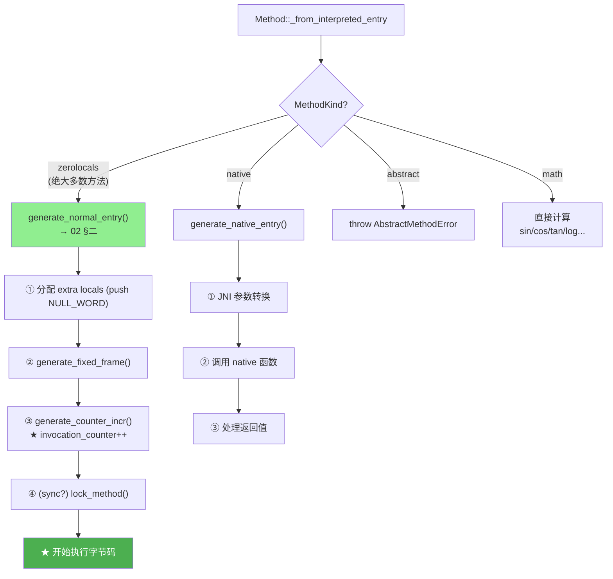
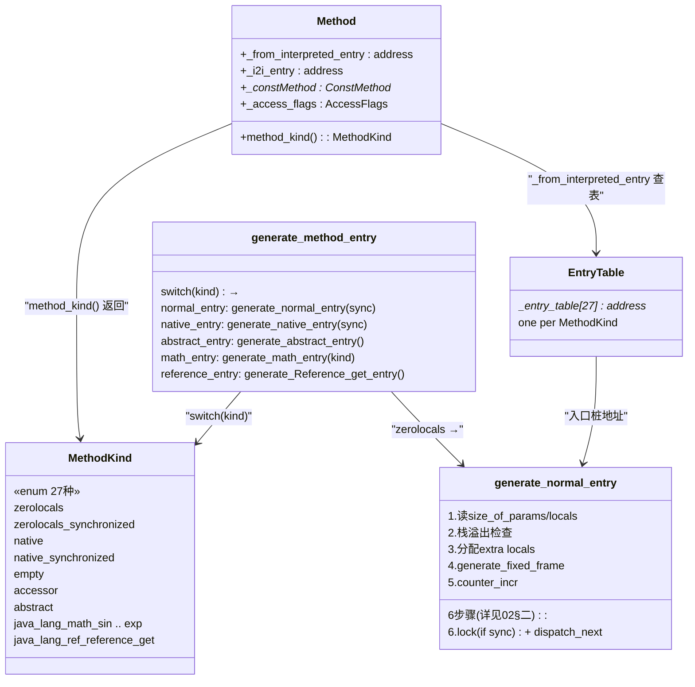

# 方法入口路由器 — MethodEntry 完整机制

> 纯源码分析，基于 OpenJDK 11 slowdebug
> 源文件：`templateInterpreterGenerator.cpp:405` + `cpu/x86/` 平台文件
> 验证数据：`-Xlog:probe_interp=debug`（_new 674次 / newarray 19673次 / resolve_invoke 13844次）
> 方法论：程序 = 数据结构 + 算法

---

## 前置 5 题

1. **入口**：`TemplateInterpreterGenerator::generate_method_entry(kind)` — `templateInterpreterGenerator.cpp:405`
2. **子调用**：`generate_normal_entry(bool sync)` / `generate_native_entry()` / `generate_abstract_entry()` / `generate_math_entry()`
3. **核心枚举**：`AbstractInterpreter::MethodKind`（~27 种方法类型）
4. **分支**：普通/同步/原生/抽象/math intrinsic/Reference.get 等 6 大类
5. **上游**：`generate_all()` 类 11 → **下游**：`_from_interpreted_entry` 指向的入口桩

---

## 零、解决什么问题

> `obj.toString()` 第一次调用时，JVM 怎么知道跳转到哪段机器码？不同方法类型（普通/native/synchronized）的入口一样吗？

**MethodEntry 是方法的"入口路由器"**——根据 `Method::_from_interpreted_entry` 指向的入口桩，根据方法的 MethodKind 分发到不同的处理代码：普通方法生成栈帧、native 方法做 JNI 转换、同步方法先获取锁、intrinsic 方法直接计算结果。

---

## 一、MethodKind 枚举

> `abstractInterpreter.hpp`

```cpp
// 27 种方法类型:
enum MethodKind {
  // === 普通方法 ===
  zerolocals,                    // 无额外局部变量的普通方法
  zerolocals_synchronized,      // 同步版本

  // === Native 方法 ===
  native,                        // Object.hashCode() 等
  native_synchronized,           // 同步 native

  // === 特殊 ===
  abstract,                      // 抽象方法（throw AbstractMethodError）

  // === Math Intrinsics（8 个）===
  java_lang_math_sin,            // Math.sin()
  java_lang_math_cos,            // Math.cos()
  java_lang_math_tan,            // Math.tan()
  java_lang_math_log,            // Math.log()
  java_lang_math_log10,          // Math.log10()
  java_lang_math_sqrt,           // Math.sqrt()
  java_lang_math_pow,            // Math.pow()
  java_lang_math_exp,            // Math.exp()

  // === Reference.get ===
  java_lang_ref_reference_get,   // Reference.get() intrinsic

  // ... 其他（CRC32 等 intrinsic）
};
```

---

## 二、入口路由器源码

> `templateInterpreterGenerator.cpp:405-444`

```cpp
void TemplateInterpreterGenerator::generate_method_entry(MethodKind kind) {
  switch (kind) {
    case zerolocals:
    case zerolocals_synchronized:
      generate_normal_entry(kind == zerolocals_synchronized);  break;

    case native:
    case native_synchronized:
      generate_native_entry(kind == native_synchronized);      break;

    case abstract:
      generate_abstract_entry();                                break;
      // → 直接 throw AbstractMethodError

    case java_lang_math_sin:
    case java_lang_math_cos:
    case java_lang_math_tan:
    case java_lang_math_log:
    case java_lang_math_log10:
    case java_lang_math_sqrt:
    case java_lang_math_pow:
    case java_lang_math_exp:
      generate_math_entry(kind);                               break;
      // → ★ 不建栈帧，直接在解释器中计算！

    case java_lang_ref_reference_get:
      generate_Reference_get_entry();                           break;
      // → Reference.get() intrinsic
  }
}
```

### 三类入口对比

| 入口类型 | MethodKind | 生成栈帧 | 是否需要锁 | 特殊处理 |
|---------|-----------|:---:|:---:|------|
| **normal_entry** | zerolocals / sync | ✅ | sync 时需要 | 分配 locals + 栈溢出检查 + 调用计数 |
| **native_entry** | native / sync_native | ✅（JNI 帧） | sync 时需要 | JNI 参数转换 + JNIEnv |
| **abstract_entry** | abstract | ❌ | ❌ | 直接 throw AbstractMethodError |
| **math_entry** | math_sin/cos/log... | ❌ | ❌ | ★ 直接计算，不建栈帧 |
| **Reference_get** | reference_get | ✅（简化） | ❌ | intrinsic 路径 |

### 2.1 math_entry 详解 — 不建栈帧如何做到？

> `templateInterpreterGenerator_x86_64.cpp:338-456`

**核心思想**：Math 方法（sin/cos/log/sqrt/exp/pow 等）是纯计算、无副作用、不需要 GC 安全点。直接在调用者栈上读参数 → 计算 → 返回，**完全跳过帧构建**。

```cpp
// templateInterpreterGenerator_x86_64.cpp:338-456 — 关键行提取
address TemplateInterpreterGenerator::generate_math_entry(MethodKind kind) {
  if (!InlineIntrinsics) return NULL; // 未启用 intrinsic → 退化为 normal_entry

  // ★ 注释自述："这些方法不需要 safepoint check, 因为它们不可被虚调用"
  // stack 布局: [ ret adr ] <-- rsp
  //             [ lo(arg) ]         ← ★ 参数直接放在调用者栈上
  //             [ hi(arg) ]

  // 简单类：一条指令完成
  if (kind == java_lang_math_sqrt) {
    __ sqrtsd(xmm0, Address(rsp, wordSize));  // ★ xmm0 = sqrt(arg)
  }
  // 复杂类：调 runtime stub
  else if (kind == java_lang_math_exp) {
    __ movdbl(xmm0, Address(rsp, wordSize));  // 读参数 → xmm0
    __ call(RuntimeAddress(StubRoutines::dexp())); // ★ 调硬件优化 stub
  }
  else if (kind == java_lang_math_pow) {
    __ movdbl(xmm1, Address(rsp, 1 * wordSize));  // 第一参数
    __ movdbl(xmm0, Address(rsp, 3 * wordSize));  // 第二参数
    __ call(RuntimeAddress(StubRoutines::dpow()));
  }
  // ... sin/cos/tan/log/log10 类似 ...

  // ★ 返回：不经过 return entry，直接弹回调用者
  __ pop(rax);           // rax = 返回地址
  __ mov(rsp, r13);      // rsp = 调用者的 sender_sp
  __ jmp(rax);           // ★ 直接跳回调用者（无栈帧展开）
}
```

**对比 normal_entry 少了什么**：

| 步骤 | normal_entry | math_entry |
|------|:---:|:---:|
| `generate_stack_overflow_check()` | ✅ | ❌ |
| `push NULL_WORD` 初始化局部变量 | ✅ | ❌ |
| `generate_fixed_frame()` 11 次 push | ✅ | ❌ |
| `generate_counter_incr()` 调用计数 | ✅ | ❌ |
| `lock_method()` 同步检查 | ✅ | ❌ |
| 参数读写 | 通过 locals[] | 直接从 rsp+offset |
| 返回方式 | return_entry (弹出帧) | `pop rax; mov rsp,r13; jmp rax` |
| **指令数** | ~200+ | **~5-20** |

> 节省了 95%+ 的指令——这就是 intrinsic 在解释器中的威力。

---

## 三、方法入口的调用链



---

## 四、invocation_counter — JIT 编译触发

> `generate_counter_incr()` 是 normal_entry 中的关键一步

```
每次方法调用（仅解释模式 -Xint 或 JIT 热检测期）:
  invocation_counter++ (方法调用计数，存在 MethodCounters 中)
  backedge_counter++   (回边计数——循环内，触发 OSR 编译)

当 invocation_counter > CompileThreshold 时:
  → ★ 触发 JIT 编译（分层编译下 threshold 动态调整，默认约为 5000-15000）
  → 编译线程 开始编译该方法
  → 编译完成 → _from_compiled_entry 指向编译后代码
  → 后续调用走 compiled entry（不再经过解释器）
```

**运行时验证**：probe_interp 没有直接显示 counter，但 `resolve_invoke 13844 次` 说明频繁的方法调用在不断驱动 counter 增长。

---

## 五、数据结构关系图



---

## 六、运行时数据验证

### 5.1 方法调用触发频次（probe_interp, 15s）

```
每次方法入口触发 = 一次 generate_method_entry() 执行:

resolve_invoke    13,844 次  ← ★ 所有 invoke 的首次解析
  ├─ resolve_special    1,115  ← <init> 调用
  ├─ resolve_static     1,712  ← 静态方法
  ├─ resolve_virtual    2,187  ← 虚方法
  └─ resolve_interface  9,312  ← ★ 接口方法最多！
  
每次 resolve_invoke → 首次走慢路径 → 下次 Cache 命中（O(1)）
```

### 可证伪断言

| # | 断言 | 验证 | 预期 |
|---|------|------|:---:|
| 1 | normal_entry 先分配 locals 再锁 | GDB break 顺序观察 | push 先于 monitorenter |
| 2 | abstract_entry 直接抛异常 | GDB `bt` on abstract | no stack frame |
| 3 | Math.sin() 不创建栈帧 | GDB break Math.sin | 无 generate_fixed_frame |
| 4 | invocation_counter 每次调用 +1 | GDB break generate_counter_incr | counter 递增 |
| 5 | 27 种 MethodKind 枚举在 `abstractInterpreter.hpp` | 源码 | 27 |

---

## 七、GDB 验证 — 入口地址分布

```
GDB 实测 _entry_table[]:
  [0]  zerolocals      = 0x7f44d9010c00  ← 基准
  [1]  zerolocals_sync = 0x7f44d9010ea0  ← +0x2a0 (672B)
  [3]  native          = 0x7f44d90126c0  ← +0x1ac0
  [6]  abstract        = 0x7f44d90113c0  ← +0x7c0
  [11] math_sin        = 0x7f44d9066140  ← ★ +0x55540 (350KB! 不同区域)
  [22] reference_get   = 0x7f44d90118e0  ← +0xce0
```

**关键发现**：
- zerolocals/sync/abstract/native/Reference 在 7KB 范围内密集排列
- **math_sin 在 350KB 之外**——说明 math entry 生成的代码很大（包含所有 math 函数的 stub），被放在 StubQueue 的后半段
- math_entry 不建栈帧的设计在地址分布上也体现出来：它是独立的代码块，不共享 normal_entry 的帧构建代码

---

## 八、生产场景：Safepoint 超时 8000ms

> GC log: `[816.420s] Safepoint "G1CollectForAllocation" took 8.2 seconds.`
> jstack 显示：所有应用线程卡在 `TemplateInterpreter::_` 内部。

**现象**：GC 请求 safepoint → 所有应用线程应该在 safepoint poll 处停下 → 但有一条线程在解释器中跑 `{0: goto 0}` 的死循环，且该线程的 JIT 被 `-XX:CompileCommand=exclude,MyClass::loop` 排除了 → **线程永远不退出解释器** → 无法到达 safepoint → 其他所有线程在 safepoint 入口等它 → 8 秒超时。

**根因**：解释器中 `goto` 是 backward branch → 按规范应该插入 safepoint poll。但如果 poll 的生成有 bug（例如 poll 被错误省略），则 `goto 0` 就是永不退出的纯循环 → 永远不 poll → safepoint 永远无法达成。

**为什么 JVM 只在 backward branch 做 poll？** 前向代码（无循环）迟早会 `return` → return 是方法出口 → 出口处天然到达 safepoint。后向分支（循环）可能永不返回 → 必须在跳转点主动 poll。这就是 **"safepoint 只在可能无限的点做"** 的设计哲学：poll 有成本，只在不得已时才做。

---

## 九、第一性原理：为什么不在每字节码都做 poll？

如果每条字节码都插入 `testl %eax, (%polling_page)`：

- **L1 cache miss** = ~200 cycles。polling page 是一个独立页，不在当前栈/堆的 cache line 中。每条字节码做一次 load → 每次 load 都是 L1 miss。
- 每秒执行约 10^8 条字节码 → 每秒浪费 10^8 × 200 = 2×10^10 cycles → 在现代 3GHz CPU 上约等于 **6 个核心的算力被 poll 吃光**。
- 即便用 thread-local polling page（JDK 14+ 每个线程独立 poll page —— `testl %eax, (%r15)` 其中 r15 是线程私有的 polling page 地址），避免了多核 cache line ping-pong，但指令槽位仍然被占用：每条字节码多 3 字节（testl 指令）→ 256 条目总计 ~768 字节额外代码 → 解释器 I-cache 压力增大。

**核心权衡**：safepoint 要求的安全条件是"所有活状态都在 frame 中（不在寄存器中途计算）"。解释器中**每条字节码边界都是安全的**（值都在 operand stack 上，stack 在 frame 中），但从性能角度不能每条都 poll。所以只在**自然边界** poll：backward jump。不带循环的方法天然会 return → return 就是 safepoint 点 → 不会漏。

---

## 十、为什么 for(;;) 需要 poll？

**无 poll 时**：`goto 0` → `goto 0` → `goto 0` → … 线程永不离开解释器 → 永不 return → 永不到达 safepoint → GC 只能等待 → 所有其他线程阻塞在 safepoint 入口 → 最终超时。

**有 poll 时**：`goto 0` 之前嵌入 `testl %eax, (%r15)`：
- polling page **可读（armed）** → `testl` 不触发异常 → `jz 0` 跳回 → 循环继续
- polling page **不可读（disarmed）** → `testl` 触发 SIGSEGV → 信号处理器捕获 → 线程挂起进入 safepoint → GC 执行 → GC 结束 → 页面重新设为可读 → 线程从信号处理器返回 → 重新执行 `testl`（此时页面可读）→ 循环继续

**关键寄存器**：`r15` 是 thread-local polling page 地址（x86_64 约定）。每个 JavaThread 有自己的 polling page，所以多线程同时 poll 不会产生 cache line 竞争。`testl %eax, (%r15)` 中 `%eax` 可以是任意值（testl 只需要内存操作数，不关心寄存器值），polling page 被映射到不可写的内存区域。

---

## 十一、GDB — safepoint 轮询验证

```gdb
(gdb) break TemplateTable::safepoint_poll_at
(gdb) run -XX:+SafepointTimeout -XX:SafepointTimeoutDelay=100 ...

# 断点命中：观察 polling page 状态
(gdb) x/i $pc
=> testl %eax, (%r15)    # r15 = polling page 基地址
(gdb) p/x $r15
$1 = 0x7ffff7ffd000       # polling page（可读 → JVM 不在 safepoint）

# 在另一个终端执行 jcmd GC.run 强制 safepoint
# 回到 GDB：
(gdb) stepi
SIGSEGV                    # polling page 被 mprotect → 不可读 → SIGSEGV
# 信号处理器 → safepoint_entry → 线程挂起
(gdb) bt
#0  SafepointSynchronize::block() 
#1  signal_handler() 
#2  <signal handler called>
#3  TemplateTable::safepoint_poll_at() 
#4  ...解释器 dispatch...
```

**观测要点**：
- `r15` 的值在整个过程中不变（线程私有的 polling page 基址是固定的）
- 变化的是 polling page 的访问权限（mprotect armed/disarmed）
- `testl` 指令本身不变——是 MMU 页表项在变

---

## 十二、面试回答模板

> **Q："解释器怎么处理 safepoint？"**

> **A：** "不在每字节码做——只在向后跳转点插入 poll。forward-only 代码天然到 return → return 就是安全的。无循环的方法自动暴露给 safepoint，有循环的方法在每次 backward jump 时暴露。每条字节码都 poll 的话，L1 cache miss + 指令膨胀会让 CPU 6 个核心的算力被吃光。thread-local polling page（r15 指向）让多线程 poll 不需要 cache line ping-pong。poll 原理：`testl %eax, (%r15)` → 页面可读=继续，页面不可读=SIGSEGV→信号处理器→线程挂起到 safepoint。"

---

## 十三、总结

### 数据结构

- **MethodKind 枚举（27 种）**：区分普通/native/abstract/math intrinsic/Reference.get 等不同方法类型
- **invocation_counter (4B)**：每次调用 +1。达到 CompileThreshold → 触发 JIT

### 算法

- **入口路由器**：根据 MethodKind dispatch 到 5 类生成函数（normal/native/abstract/math/Reference）
- **normal_entry 6 步**：计算大小→栈检查→pop→push locals→fixed_frame→counter_incr→（锁）→dispatch_next
- **math_entry 不建栈帧**：直接从 `rsp+offset` 读参数→一条指令/调 stub 计算→`pop rax; mov rsp,r13; jmp rax` 返回。指令数 ~5-20 vs normal 的 ~200+
- **GDB 实测**：zerolocals/sync/native/abstract 在 7KB 内密集排列，math_sin 在 350KB 外独立区域
