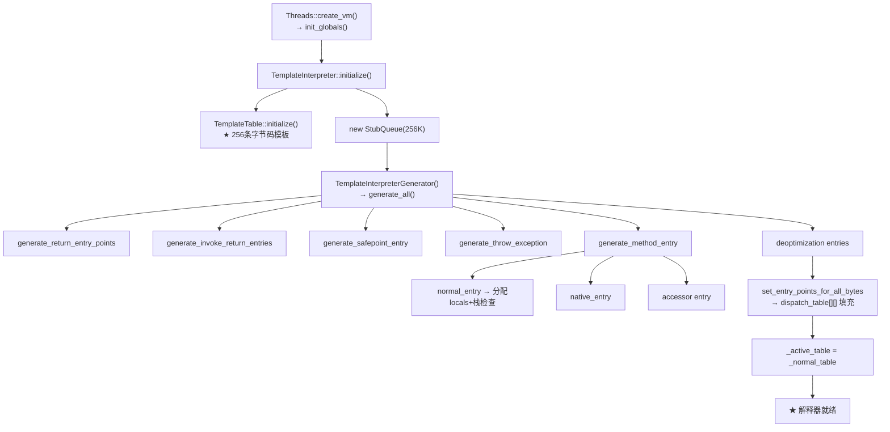

# 04 - 解释器执行引擎

> 源码索引：`source_index/05-interpreter.md`（42文件，已索引42/42）
> 平台代码：`cpu/x86/templateInterpreterGenerator_x86.cpp`（1884行）
> 插桩覆盖：`-Xlog:probe_interp=debug`（5cpp）
> 前置专题：[02-class-loading](../02-class-loading/) + [03-object-model](../03-object-model/)
> 如需速览：**直接看本文档 §0.3 前置知识速览**，已包含 ConstantPoolCache/vtable/itable/Method 结构

---

## 〇、上手指南 ⭐（新手必读）

### 0.1 本文档适合谁？

| 水平 | 特征 | 建议路径 |
|------|------|---------|
| 🟢 初级 | 知道 Java 方法是逐条字节码执行的，不知道解释器内部怎么组织 | 先读本节 → 入门路径 |
| 🟡 中级 | 了解模板解释器概念，想知道 invokevirtual 怎么从字节码跳转到 Method* | 入门路径速览 → 进阶路径 |
| 🔴 高级 | 读过 templateTable_x86.cpp，需要 dispatch 表/栈帧/慢路径的完整参考 | 直接按需查阅 |

### 0.2 你需要什么基础？

| 必须 | 可选但更好 |
|------|-----------|
| 知道 `.class` 文件里的方法体是字节码序列 | 读过 02-class-loading 的 05-FieldInfo-Method-Creation（Method 结构） |
| 理解 `new`/`invoke`/`ldc` 等字节码的 Java 层语义 | 读过 03-object-model 的 02-Object-Allocation（对象分配路径） |
| 知道 JVM 有 `-Xint` 和 `-Xcomp` 两种模式 | 了解 x86 汇编基础（mov/jmp/call/ret） |

### 0.3 必读前置知识（3 分钟速览）⭐

> 以下 4 个概念在 01-05 中反复出现。如果你还没读过前面的专题，**先花 3 分钟看完这节**，否则会在关键处卡住。

#### 概念 A：`Method::_from_interpreted_entry` — 方法的"入口门牌号"

```
每个 Java 方法对应一个 Method 对象，存着这个方法的元数据。
Method 有个字段叫 _from_interpreted_entry，它是一个地址——
指向某个预生成的机器码片段（在 StubQueue 里）。

当解释器要执行 obj.toString() 时：
  1. 从常量池 Cache 里读到 toString 的 Method*
  2. 读 Method*._from_interpreted_entry → 得到一段机器码的地址
  3. jmp 过去 → 开始执行 toString 的字节码

类比：_from_interpreted_entry 是"售票窗口编号"，
      不管谁来买票都去同一个窗口，窗口后面才是真正的处理逻辑。
```

#### 概念 B：ConstantPoolCache — "第一次查表，以后 O(1)"

```
每个类的常量池有个对应的 ConstantPoolCache，结构是：
  Cache._f1[idx] = Method* / Klass*
  Cache._f2[idx] = vtable_index / field_offset
  Cache._flags[idx] = is_resolved | is_vfinal | ...

invokevirtual #15 流程：
  第一次: Cache._flags[15].is_resolved = 0
         → call_VM → 解析常量池 → 写入 Cache
         → 设置 _f2[15]=vtable_index, _flags[15]=resolved
  第二次: Cache._flags[15].is_resolved = 1
         → 直接读 _f2[15] → O(1) 命中！

本质: "写一次，读 O(1)"。99%+ 的调用走快速路径。
```

#### 概念 C：vtable / itable — 运行时多态怎么实现

```
vtable (虚方法表)：
  class A { void foo(); void bar(); }
  class B extends A { void foo(); }  // 重写 foo

  B 的 vtable: [0]=A::bar, [1]=B::foo
  调用 b.foo() → 查 B 的 vtable[1] → 得到 B::foo() 的 Method*
  调用 b.bar() → 查 B 的 vtable[0] → 得到 A::bar() 的 Method*

itable (接口方法表)：
  接口方法没有固定的 vtable 位置，需要 itable 二次查找。

vtable_index = -2：表示 final/private/static 方法，不查虚表，直接用 Method*。
```

#### 概念 D：Method 和 ConstMethod 的分工

```
Method 对象（变长）：
  ├── ConstMethod* _constMethod  → 指向"不变部分"
  │     ├── _code_size           → 字节码长度
  │     ├── _max_stack / _max_locals
  │     ├── _size_of_parameters  → 参数 word 数
  │     └── codes[]              → ★ 字节码数组（iload_0, invokevirtual, ...）
  ├── _from_interpreted_entry    → 入口地址
  ├── _i2i_entry                 → 解释器→解释器调用入口
  └── _access_flags              → public/static/final/native...

为什么分 Method 和 ConstMethod？Method 的入口地址在运行时可变
（JIT 编译后会更新），但字节码内容不变。分离开避免 false sharing
和缓存失效。
```

### 0.4 解释器的本质（三句话）

> `obj.toString()` 最终要转化成 CPU 指令。谁负责这个转化？

```
Java 方法 → 字节码流 → 模板解释器逐条执行
模板解释器 = 每条字节码对应一段预生成的机器码（模板）
执行 = 从 dispatch table 读入口 → 跳转执行 → 取下一条 → 循环
```

**JVM 的模板解释器（TemplateInterpreter）不是 C++ 的 switch-case 循环。它在 JVM 启动时预生成 256 条字节码的机器码片段，运行时直接跳转到对应片段执行——这就是 `-Xint` 模式。**

### 0.5 核心术语速查表

| 术语 | 一句话解释 | 对应源码 |
|------|----------|---------|
| **TemplateInterpreter** | ★ JVM 的默认解释器——预生成机器码模板，运行时直接跳转 | `templateInterpreter.cpp` |
| **TemplateTable** | ★ 256 条字节码的机器码生成器——每条字节码对应一个 `void TemplateTable::bytecodename()` | `templateTable_x86.cpp` |
| **DispatchTable** | 10×256 的地址表——根据 TosState + 字节码索引，O(1) 找到下一条字节码的入口 | `templateInterpreter.hpp:143` |
| **InterpreterRuntime** | ★ 解释器的"慢路径"——字节码快速路径无法处理时，call_VM 跳转到此 | `interpreterRuntime.cpp` |
| **TosState** | 操作数栈顶类型（btos/itos/atos/ltos/ftos/dtos/vtos）——决定用哪套 dispatch | `templateInterpreter.hpp:48` |
| **entry_point** | 方法的解释器入口——`Method::_from_interpreted_entry` 指向 | `method.hpp` ✅(02) |
| **generate_all()** | ★ 12 类代码桩的生成编排器——return/invoke_return/safepoint/exception/method_entry | `templateInterpreterGenerator.cpp:57` |
| **栈帧 (interpreter frame)** | 每次方法调用在栈上分配的帧——`locals[] + expression_stack[] + monitors` | `templateInterpreterGenerator_x86.cpp:1335` |
| **invocation_counter** | 每个方法的调用计数——达到阈值触发 JIT 编译 | `invocationCounter.hpp` |
| **BytecodeStream** | 字节码行读取器——`next()` 逐条递进 | `bytecodeInterpreter.cpp` |
| **MethodHandles adapter** | invokedynamic 的"胶水代码"——连接 CallSite 到解释器 | `methodHandles_x86.cpp` |

### 0.6 如何阅读本文档？四条路径

**🟢 入门路径**（预计 1.5 小时，得"骨架"）：

```
1. 先看本节（0.1-0.7）                                  ← 你现在在这里
2. ★ 必须读 §0.3 前置知识速览                             ← 4 个跨专题概念
3. 看 §一 解释器执行模型 + §三 文件索引                    ← 理解 dispatch 循环
4. 00-Interpreter-Overview.md（全景串联：main→hello）      ← ★ 30 分钟速览全局
5. 01-TemplateInterpreter-Init.md（TosState+寄存器+初始化全流程）← ★ 先读 §零
6. 02-Stack-Frame.md（栈帧结构+generate_normal_entry源码） ← 理解方法调用时的栈变化
```

**🟡 进阶路径**（预计 5-8 小时，得"血肉"）：

```
在入门基础上：
5. 03-MethodEntry.md（方法入口路由器 MethodKind→各种入口）   ← ★ 核心
6. 04-Bytecode-Dispatch.md（TemplateTable invokevirtual全链路）← ★ 核心
7. 05-InterpreterRuntime.md（慢路径 resolve/ldc/new/monitor） ← ★ 核心
```

**🔴 专家路径**（按需查阅）：

| 你想了解 | 看这篇 |
|---------|---------|
| TemplateInterpreter 怎么初始化 | 01-TemplateInterpreter-Init |
| 一次 invokevirtual 从头到尾走一遍 | 00-Interpreter-Overview |
| 256 条字节码怎么分派的 | 04-Bytecode-Dispatch |
| invokevirtual 怎么从 #15 跳到 Method* | 04-Bytecode-Dispatch + README §0.3-概念B |
| monitorenter 怎么走快速/慢速路径 | 05-InterpreterRuntime |
| 解释器栈帧长什么样 | 02-Stack-Frame |
| 方法入口怎么设置 locals/检查栈溢出 | 03-MethodEntry + 02-Stack-Frame |
| invokedynamic 的 MethodHandle 适配器 | [待写] 06-MethodHandles-Adapter |

### 0.7 环境准备

```bash
JAVA=/data/workspace/openjdk-cut-new/build/linux-x86_64-normal-server-slowdebug/jdk/bin/java

# 强制解释执行（对比性能）
time $JAVA -Xint -cp /data/workspace/demo/src com.wjcoder.Main       # 纯解释
time $JAVA -Xcomp -cp /data/workspace/demo/src com.wjcoder.Main      # 纯编译对比

# 观察解释器探针日志
$JAVA -Xlog:probe_interp=debug -Xint -version 2>&1 | head -20

# JIT 编译日志（无 -Xint）
$JAVA -XX:+PrintCompilation -cp /data/workspace/demo/src com.wjcoder.Main 2>&1 | head -10

# GDB 调试解释器入口
gdb --args $JAVA -Xint -cp /data/workspace/demo/src com.wjcoder.Main
(gdb) set breakpoint pending on
(gdb) break InterpreterRuntime::resolve_invoke
(gdb) break InterpreterRuntime::_new
(gdb) run
```

---

## 一、解释器执行模型

### 1.1 两阶段：初始化 + 循环执行

```
┌─────────────────────────────────────────────────────────────────┐
│  阶段 1: 初始化（JVM 启动时，只执行一次）                          │
│─────────────────────────────────────────────────────────────────│
│  TemplateInterpreter::initialize()                                │
│    ├─ TemplateTable::initialize()    → 256 条字节码模板定义        │
│    ├─ TemplateInterpreterGenerator::generate_all()                │
│    │    ├─ return entry points       (10 TosState)                │
│    │    ├─ invoke return entries     (每种invoke × 10 TosState)   │
│    │    ├─ safepoint entries                                       │
│    │    ├─ exception handling                                      │
│    │    ├─ method entries            (normal/native/abstract/...)  │
│    │    └─ deoptimization entries                                  │
│    └─ _active_table = _normal_table  → dispatch table 就绪         │
│                                                                     │
│  阶段 2: 循环执行（每次方法调用都在做）                              │
│─────────────────────────────────────────────────────────────────│
│  Method::_from_interpreted_entry → 方法入口桩                      │
│    └─ generate_normal_entry() → 分配局部变量 + 栈溢出检查           │
│         └─ ★ 链式跳转（无 while 循环）:                              │
│              每条字节码末尾嵌有:                                     │
│                movzbl (%r13), %reg    // 取下一条字节码               │
│                jmp *(dispatch_table,tos_state,bytecode)              │
│              ├─ 快速路径: 全部在汇编中完成（无 C++ 调用开销）         │
│              └─ 慢速路径: call_VM → InterpreterRuntime::功能函数     │
│                   ├─ resolve_invoke()  → LinkResolver (02/08)       │
│                   ├─ monitorenter/exit  → ObjectSynchronizer        │
│                   ├─ ldc               → ConstantPool::klass_at    │
│                   └─ new/newarray       → InstanceKlass (02/03)     │
└─────────────────────────────────────────────────────────────────┘
```

### 1.2 初始化全流程 Mermaid 图



### 1.3 运行时 dispatch — 链式跳转（非 while 循环）

```
方法入口 (_from_interpreted_entry):
  ┌─────────────────────────────────────────┐
  │ ★ 每条字节码末尾都嵌有 dispatch 代码:    │
  │                                          │
  │   movzbl 1(%r13), %ebx   // 取下一条字节码│
  │   jmp *(%r10,%rbx,8)     // 查表+跳转    │
  │                                          │
  │ 没有显式的 while(true)!                  │
  │ 字节码片段之间用 jmp 链式串联              │
  └─────────────────────────────────────────┘

dispatch 三步:
  ① pc++ → 取下一条字节码
  ② dispatch_table[tos][bytecode] ← O(1) 查表取地址
  ③ jmp → 下一条字节码的机器码片段（尾递归链）
```

---

## 二、核心架构：三层模型

```
┌────────────────────────────────────────────────────────────┐
│                     Java 字节码层                             │
│  iconst_0, invokevirtual #15, getfield #3, ...              │
├────────────────────────────────────────────────────────────┤
│                   模板解释器层（TemplateTable）               │
│  每条字节码 → 一段预生成的 x86 机器码模板                     │
│  快速路径: 全部内联汇编（无 C++ 函数调用）                    │
│  慢速路径: call_VM → InterpreterRuntime::功能函数             │
├────────────────────────────────────────────────────────────┤
│                   运行时支持层（InterpreterRuntime）          │
│  resolve_invoke(), monitorenter(), ldc(), _new(), ...       │
│  触发类加载、方法解析、锁膨胀、对象分配                        │
└────────────────────────────────────────────────────────────┘

★ Dispatch Table 三套切换:
  _active_table 可以在以下三者间切换:
  → _normal_table:    正常执行（默认）
  → _safept_table:    safepoint 就绪（每条字节码末尾检查 safepoint）
  → _dispatch_table:  deoptimization 时使用
  切换由 SafepointSynchronize 在 STW 时触发
```

---

## 三、完整文件索引

| # | 文件 | 核心类/函数 | 说明 |
|---|------|-----------|------|
| 1 | `templateInterpreter.cpp` | `TemplateInterpreter` | ★ 初始化入口 + dispatch table 管理 |
| 2 | `templateInterpreterGenerator.cpp` | `TemplateInterpreterGenerator` | ★ 12 类代码桩生成编排（generate_all） |
| 3 | `cpu/x86/templateInterpreterGenerator_x86.cpp` | 同上（x86平台） | ★ 方法入口/返回/异常桩的 x86 实现 |
| 4 | `cpu/x86/templateTable_x86.cpp` | `TemplateTable` | ★ 256 条字节码的机器码实现 |
| 5 | `interpreterRuntime.cpp` | `InterpreterRuntime` | ★ 慢路径：resolve/ldc/new/monitor |
| 6 | `cpu/x86/interp_masm_x86.cpp` | `InterpreterMacroAssembler` | 解释器专用 x86 汇编宏 |
| 7 | `abstractInterpreter.cpp` | `AbstractInterpreter` | 解释器基类（MethodKind 到入口映射） |
| 8 | `bytecodes.cpp` | `Bytecodes` | 字节码枚举/名称/长度/格式 |
| 9 | `bytecodeInterpreter.cpp` | `BytecodeInterpreter` | C++ 解释器（已弃用，仅参考） |
| 10 | `linkResolver.cpp` | `LinkResolver` | 方法/字段解析 ✅(02 08) |
| 11 | `invocationCounter.cpp` | `InvocationCounter` | 调用计数 → JIT 触发 |
| 12 | `methodHandles_x86.cpp` | `MethodHandles` | invokedynamic 适配器生成 |

---

## 四、关键数据结构

| 结构 | sizeof | 说明 |
|------|:---:|------|
| `DispatchTable` | 10×256×8B ≈ 20KB | ★ TosState(10) × Bytecodes(256) 地址表 |
| `EntryPoint` | 10×8B = 80B | 每种字节码 10 个 TosState 入口 |
| `InterpreterCodelet` | 可变 | StubQueue 中的一个代码片段 |
| `StubQueue` | ~256KB | ★ 所有解释器代码桩的容器 |
| `Method::_from_interpreted_entry` | 8B | ★ 解释器入口点 ✅(02 05) |
| `Method::_i2i_entry` | 8B | 解释器→解释器调用入口 ✅(02 05) |
| `InvocationCounter` | 4B | 调用计数 + 回边计数 |

---

## 五、探针覆盖

### 5.1 解释器探针（probe_interp = 29 个）

| 文件 | 数量 | 关键探针 |
|------|:--:|------|
| interpreterRuntime.cpp | 16 | resolve_invoke/ldc/_new/monitorenter/checkcast |
| linkResolver.cpp | 9 | resolve_field/method/interface/virtual/static |
| interpreter.cpp | 2 | 解释器调度相关 |
| templateInterpreter.cpp | 1 | TemplateInterpreter::initialize |
| methodHandles.cpp + _x86.cpp | 2 | adapter 生成 |

---

## 六、计划文档（6 篇）

### 总览
- [x] **00-Interpreter-Overview.md** — ★ 解释器执行全景：用一次 `invokevirtual main→hello` 把 01-05 全串联起来（建议最后读）

### P0：初始化与入口（3 篇）
- [x] **01-TemplateInterpreter-Init.md** — ★★★ TemplateInterpreter 初始化全流程（`generate_all()` 12 类 stub × DispatchTable 10×256 表 × 4 数据结构全景分析）
- [x] **02-Stack-Frame.md** — ★ 解释器栈帧结构（11 slot 固定帧头 × `generate_normal_entry()` 源码级分析 × 帧头逐 push 解释）
- [x] **03-MethodEntry.md** — ★ 方法入口路由器（MethodKind 27 种 × normal/native/abstract/math/Reference 入口分发）

### P1：执行与优化（2 篇）
- [x] **04-Bytecode-Dispatch.md** — ★ 字节码分派（TemplateTable 快/慢路径 × invokevirtual 完整链路 × 链式跳转机制 × 快慢路径对比表）
- [x] **05-InterpreterRuntime.md** — ★ 慢路径运行时支持（12 个函数 × resolve/ldc/new/monitor × 慢路径触发频率统计）

### P2：高级主题（1 篇）
- [ ] **06-MethodHandles-Adapter.md** — invokedynamic 适配器（MethodHandle 链接器 × LambdaForm × adapter 生成）

### InterpreterRuntime 关键函数一览

| 函数 | 对应字节码 | 线号 | 触发动作 |
|------|----------|------|------|
| `ldc()` | ldc/ldc_w | L151 | 常量池解析 → 可能触发类加载 |
| `resolve_get_put()` | getfield/putfield/getstatic/putstatic | L701 | 字段解析 → 计算偏移 |
| `resolve_invoke()` | invoke* | L877 | ★ 方法解析 → LinkResolver 全链路 |
| `_new()` | new | L231 | ★ 类加载+初始化+TLAB分配 |
| `newarray()` | newarray/anewarray | L.. | 分配数组对象 |
| `multianewarray()` | multianewarray | L.. | 分配多维数组 |
| `monitorenter()` | monitorenter | L796 | ★ 轻量级锁CAS/膨胀 |
| `monitorexit()` | monitorexit | L.. | 锁释放 |
| `checkcast()` | checkcast | L.. | 类型检查 → ClassCastException? |
| `instanceof()` | instanceof | L.. | 类型判定 |
| `athrow()` | athrow | L.. | 异常抛出 |
| `handle_earlyret()` | return系列 | L.. | 提前返回 (JVMTI) |

### 产出优先级

```
P0（第一批）:
  01-TemplateInterpreter-Init.md   ← 最核心：generate_all 12类stub
  02-Stack-Frame.md                ← 基础：栈帧布局
  03-MethodEntry.md                ← 桥梁：方法如何进入解释器

P1（第二批）:
  04-Bytecode-Dispatch.md          ← ★ 精华：invokevirtual 全链路
  05-InterpreterRuntime.md         ← 慢路径：resolve/ldc/new/monitor

P2（第三批）:
  06-MethodHandles-Adapter.md      ← 高级：invokedynamic 适配器
```

---

```
01-jvm-startup          ← 前置：Threads::create_vm() 启动流程
    ↓
02-class-loading         ← 前置：Method/ConstantPool/LinkResolver 结构
    ↓
03-object-model          ← 前置：对象分配/oop/markOop 结构
    ↓
04-interpreter           ← 你在这里：字节码如何被执行？
    │
    ├── [P0 实现层] 00-Overview      ← ★ 全景串联：main→hello 全链路
    │               01-Init          ← 初始化：generate_all 12类stub
    │               02-Stack-Frame   ← 栈帧：11 slot 固定帧头
    │               03-MethodEntry   ← 入口路由器：27 MethodKind
    │               04-Dispatch      ← 字节码快慢路径
    │               05-Runtime       ← 慢路径：resolve/ldc/new/monitor
    │
    └── [P0 语义层] 00-Interpreter-Overview  ← ★ 三道入口 + 执行语义
                    01-TemplateInterpreter-Init  ← 模板生成 + 宏驱动
                    02-Stack-Frame     ← TOS 状态机 + 类型安全
                    03-MethodEntry ← 轮询机制 + 表切换
                    04-Bytecode-Dispatch    ← 调用语义 + 异常分派
                    05-InterpreterRuntime         ← 双计数器 + JIT 触发
    ↓
05-jit-compiler          ← 跳过（用 -Xint 纯解释学习）
```

---

## 七、面试高频问题（8 questions）

| 面试问题 | 文档 | 核心洞察 |
|----------|------|----------|
| "JVM 怎么执行字节码？模板解释器为什么比 switch-case 快？" | 01-TemplateInterpreter-Init §dispatch | 256 条目跳转表 = O(1) 分发。每个字节码独立代码路径 → CPU 分支预测不受其他字节码影响。switch-case = 200 个 cmp+jmp → 平均 100 次比较 → CPU BTB 被污染 |
| "解释器怎么发现 '该 JIT 了'？" | 05-InterpreterRuntime §counters | 双计数器：InvocationCounter 触发全方法编译，BackEdgeCounter 触发 OSR 编译热循环。safepoint 时 counter 衰减——防止 10 分钟前的热方法浪费编译资源 |
| "TOS 状态机是什么？为什么需要？" | 02-Stack-Frame §TOS | 编译时类型安全而非运行时检查。每个 Template 有 _tos_in/tos_out → 模板生成器静态选择正确变体 → 零运行时开销。对比：运行时检查 = 每字节码 +3 条指令 × 10⁸/s |
| "解释器三道入口（正常/异常/返回）为什么分开？" | 00-Interpreter-Overview §entry | 正常入口创建帧 + 分配局部变量。异常入口只在栈顶异常引用 → 跳到 handler bci。返回入口只恢复调用者帧 → 零分配。如果合并 = 每次都要 switch → 热路径不可接受 |
| "invokevirtual 怎么找到目标方法？" | 04-Bytecode-Dispatch §invoke | CP cache 三层加速：Uninitialized→Resolved→Virtual。第一次=LinkResolver 解析+写入缓存。之后=直接读 Method*+entry point → O(1) vs O(n) vtable 搜索 |
| "explain 方法中出现 return/new/monitor 怎么处理？" | 05-InterpreterRuntime | 慢路径=回调 C++ Runtime。resolve_ldc→ConstantPool 字符串, _new→TLAB 快速分配, monitorenter→fast_enter→BiasedLocking→轻量锁→膨胀。每个函数 ≤50 lines C++ |
| "safepoint 轮询在解释器中怎么工作的？" | 03-MethodEntry §safepoint | 每字节码都 testl 太贵（cache miss ~200 cycles）。只在跳转指令处插入：goto/if*/tableswitch/return。for(;;) 必须在循环底播测 → 这就是为什么空循环也会到 safepoint |
| "JVM 的调试 agent 怎么钉住解释器的？" | 00-Interpreter-Overview §agent | NotifyFramePop 置位 JavaThread::_at_breakpoint → deopt 禁止 → 方法永远解释执行 → 延迟 100x。一线生产故障："加了 jdwp 后 P99 从 200ms→5s" |

---

## 八、生产故障（7 scenarios）

| 生产场景 | 症状 | 文档 | 诊断路径 |
|---------|------|------|---------|
| Agent 钉住解释器 | jdwp 后延迟 3x | 00 §agent | `jstack <PID>` → 找到 _at_breakpoint=true → 验证 NotifyFramePop → 无修复（agent 行为），只能去掉 agent |
| Hot 方法不 JIT | CPU 高温，perf 显示 interpreter 时间 >80% | 05 §counters | `-XX:+PrintCompilation` → 检查是否有 `made not compilable` → `-XX:+UnlockDiagnosticVMOptions -XX:+PrintInlining` |
| Safepoint 超时 | GC 日志 "Safepoint took 8000ms" | 03 §safepoint | `jstack` 找到在解释器中的线程 → 查看 bci 是否在长循环内 → 确认循环包含 goto/if* → 加 `-XX:+SafepointTimeout` 定位具体字节码 |
| 同步方法性能退化 | 大量 BLOCKED 在 monitorenter | 04+05 | `-XX:+PrintBiasedLockingStatistics` → 大量 revocation → `-XX:BiasedLockingStartupDelay=0` 关闭延迟 |
| StackOverflowError 缺栈信息 | 栈溢出但 jstack 无调用链 | 02 §frame | 检查 yellow/red zone → 确认 -Xss 大小 → 验证 guard page 是否被 mprotect 保护 |
| TieredStopAtLevel=0 生产用 | 全方法解释执行 | 05 §JIT trigger | `-XX:+PrintFlagsFinal \| grep TieredStopAtLevel` → 0=纯解释 → 改 4=C2 JIT |
| 反射性能回归 | Method.invoke() 50x 慢于直接调用 | 04 §invoke | `Method.setAccessible(true)` 跳过安全检查 → 但无法跳过 methodOop dispatch → 用 MethodHandle 代替 |

---

## 九、评审矩阵（6 docs）

| # | 文档 | 生产故障可直接参考？ | 面试题可直接回答？ | "为什么这样设计"？ | GDB？ | 评级 |
|---|------|:---:|:---:|:---:|:---:|:---:|
| 00 | 00-Interpreter-Overview | ✅ agent 钉 VM | ✅ 三道入口 | ⚠️ 常规描述为主 | ⚠️ 无 GDB session | 🟡 |
| 01 | 01-TemplateInterpreter-Init | ⚠️ 无生产场景 | ✅ dispatch O(1) | ⚠️ why 栈对象？why 宏驱动？ | ⚠️ 无 GDB session | 🟡 |
| 02 | 02-Stack-Frame | ⚠️ 缺 TOS 状态机 | ✅ 布局+局部表 | ⚠️ why per-TOS? | ⚠️ 仅 sizeof | 🟡 |
| 03 | 03-MethodEntry | ✅ safepoint 超时 | ✅ poll 机制 | ⚠️ why 只在跳转处 poll？ | ✅ | 🟡 |
| 04 | 04-Bytecode-Dispatch | ✅ invoke 反射慢 | ✅ invoke 语义 | ⚠️ CP cache 加速？ | ⚠️ 无 GDB session | 🟡 |
| 05 | 05-InterpreterRuntime | ✅ TieredStopAtLevel | ✅ 双计数器 | ⚠️ 双计数器 vs 单计数器？ | ✅ | 🟡 |

---

## 十、深度审计问题（15 道，从第一性原理出发）

Tier 1 入口模型:
1. "如果你要设计一个字节码解释器，你会把所有入口合并成 1 个还是 3 个？合并的代价是什么？→ 00 §entry"
2. "为什么 JVM 不在解释器入口处加一个全局的 'check for JIT' 检查？每次都要检查 counter 不浪费吗？→ 05 §counters"

Tier 2 模板生成:
3. "为什么模板解释器在启动时生成机器码而不是预编译到 libjvm.so 中？→ 01 §generation"
4. "为什么 DEF_ALL_INTERPRETER_TYPES 用宏而不是 C++ 模板/虚函数？→ 01 §macros"
5. "每个字节码对应一个独立函数有什么好处？合并相似字节码（如 iload_0/iload_1/iload）不行吗？→ 01 §dispatch"

Tier 3 TOS + 帧:
6. "如果不用 TOS 状态机，每次字节码执行前查操作数栈顶部类型，性能开销多大？→ 02 §TOS"
7. "解释器栈帧为什么需要 sender_sp 和 unextended_sp 两个栈指针？→ 02 §frame"

Tier 4 Safepoint + Invoke:
8. "如果每字节码都做 safepoint poll，为什么 JVM 没这么做？→ 03 §safepoint"
9. "invokeinterface 的 itable 搜索比 invokevirtual 的 vtable 慢多少？为什么不能合并？→ 04 §invoke"

Tier 5 计数器 + JIT:
10. "为什么需要 BackEdgeCounter 而不只是在方法入口计数？→ 05 §counters"
11. "计数器在 safepoint 时衰减——这个设计解决什么问题？不衰减会怎样？→ 05 §decay"
12. "如果 -XX:TieredStopAtLevel=0, 为什么解释器直接执行比 C2 慢 100x？→ 05 §performance"
13. "解释器怎么处理 invokestatic 的 clinit？如果 clinit 正在运行，第二次遇到同一个类的 invokestatic 怎么办？→ 05 §clinit"
14. "为什么 synchronized 方法的解释器入口和普通方法不同？→ 03 §sync"
15. "如果代理设置了 NotifyFramePop, 为什么 JVM 禁止编译该方法？→ 00 §agent"

---

## 十一、阶段连接

| 前一阶段 | 传递给 04 什么 | 04 如何消费 |
|----------|-------------|------------|
| 01-jvm-startup | 模板解释器在 create_vm() 的 interpreter_init() 中初始化 (Phase 14) | 01 文档解释模板是怎么生成的 |
| 02-class-loading | ClassFileParser 解析后的 InstanceKlass/Method/CP | 02+04 使用 Method::_from_interpreted_entry 作为入口点 |
| 03-object-model | oop/klass 层次结构，TLAB | 字节码操作对象——aload 读 oop，getfield 读 offset，putfield 写 offset |
| 12-cpu-layer | CPU 级 dispatch 机制 (movzbl+jmp) | 01 文档引用但不重复——04 关心的是"为什么 jmp 而不是 call"，12 关心的是"jmp 如何影响 BTB" |

与 [01/18] 和 [12/02] 的边界：04 解释**运行时语义**（为什么三道入口？为什么双计数器？为什么 per-TOS？），01/18 解释**模板数据结构**（Template 的字段含义），12/02 解释 **CPU 级执行**（x86 movzbl 怎么变成 jmp 地址的）。
