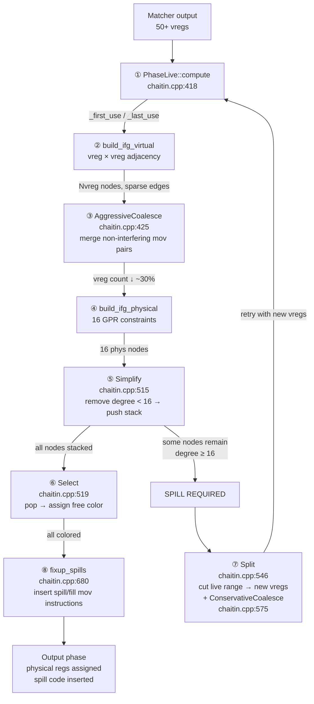

# 03-Chaitin-RegAlloc — Chaitin 图着色寄存器分配：虚拟寄存器（∞个）如何映射到 x86_64 的 16 个物理 GPR

> **阶段**：[05-jit-compiler]
> **前置**：[01-C2-Pipeline] §七（Matcher——Ideal Node→MachNode + vreg 分配）
> **配套**：[01] §八（Output——消费 RegAlloc 的输出）、[02-Inline-Decision] §五（内联→vreg 数→spill 风险）
> **阅读收益**：理解 C2 如何将 ∞ 个虚拟寄存器映射到 16 个 x86_64 GPR——从 Live Range 计算到 IFG 构建到 Coalesce 消除 mov 到 Simplify+Select 着色到 Split spill；掌握 perf spill 风暴诊断 workflow

---

## §〇 生产场景——perf top 显示 48.67% 指令是 spill/fill

### 真实 perf top 输出——Chaitin 溢出的 CPU 视角

方法编译后，CPU 有一半时间在搬数据而非计算：

```
Samples: 128K of event 'cycles', 4000 Hz
Overhead  Shared Object          Symbol
  22.12%  [JIT compiled code]    mov %rax, -0x10(%rbp)    ← spill (reg → stack)
  18.34%  [JIT compiled code]    mov -0x10(%rbp), %rcx    ← fill (stack → reg)
  15.23%  [JIT compiled code]    add %rdx, %rax
   8.21%  [JIT compiled code]    mov %rsi, -0x18(%rbp)    ← spill
   6.45%  [JIT compiled code]    mov -0x18(%rbp), %r9     ← fill
```

Spill ratio：`(22.12 + 18.34 + 8.21 + 6.45) / total = 55.12%` 的指令是 `mov reg↔stack`。

正常编译后代码：< 5% mov 到/从栈——CPU 应该花时间在计算上，不是搬运数据。

**根因**：方法有 50+ 个虚拟寄存器同时活跃 → 寄存器压力 > 16 → Chaitin 着色失败 → spill → 每次 spill+fill pair = ~10 cycles（L1 命中时）。如果无 spill——同一个操作只需要 1 cycle（寄存器到寄存器）。

**10 分钟诊断**：
```bash
# 1. 定位 spill 源方法
perf top -p <PID> --sort symbol | grep "\[JIT compiled code\]" | head -5
# → 查看哪些 JIT 编译的方法最热

# 2. 确认 spill 频率
perf annotate --symbol=<method_name> | grep -c "mov.*\[rbp\]"
# → 统计 spill/fill 指令数 → 如果 > 总指令 10% → spill 严重

# 3. 查看 post-regalloc 汇编
-XX:+PrintOptoAssembly | grep "mov.*\[rsp\|rbp\]" | wc -l
# → 确认编译器生成的 spill/fill 总数
```

---

## §一 ★★★ 16 个物理寄存器对阵 ∞ 个虚拟寄存器

### 1.0 本文不做什么

本文不是 Chaitin 1982 论文的中文翻译。本文是 **HotSpot 的具体 Chaitin 实现分析**——8 步算法顺序与标准教科书不同，Coalesce 的位置决定了 spill 的概率。理解这个顺序差异 = 理解 HotSpot 为什么能在 16 个 GPR 的限制下跑 50+ 个 vreg 而不爆 spill。

### 1.1 读者前提——你从哪里来

你从 [01-C2-Pipeline] §七 学完：Matcher 阶段把 Ideal Node 匹配到 MachNode，每个 MachNode 的输出分配一个 vreg（虚拟寄存器）。**本文回答：那些 50+ 个 vreg 怎么被分配到 16 个物理 GPR？什么时候 spill？Coalesce 在算法的哪个步骤执行？**

```
[01-Pipeline] §七                          本文从这里开始
      │                                         │
      ▼                                         ▼
Matcher: Ideal Node → MachNode ──→ PhaseChaitin::Register_Allocate()
      vreg assigned                           chaitin.cpp:336
                                                  │
                              ┌─ Live → IFG(virtual) → Coalesce(Aggressive) → IFG(physical)
                              │       └─ 8-step loop ──────────────────────────→
                              │  Simplify → Select → (spill? → Split → ConservativeCoalesce → retry)
                              └─ fixup_spills → Output
```

### 1.2 你需要知道的——6 个概念 callout 框

> **以下 6 个概念是理解 Chaitin 寄存器分配的前提。每个不超过 200 字，自包含——不依赖本文其他部分。**

#### 概念 1：虚拟寄存器 vs 物理寄存器

**虚拟寄存器**（vreg）：编译器内部随意创建——一个方法有 50 个变量就创建 50 个 vreg——"无限容量"。C2 的每个 MachNode 输出分配一个 vreg。**物理寄存器**（preg）：x86_64 的 16 个 GPR（RAX、RBX、RCX、RDX、RSI、RDI、RBP、RSP、R8-R15）。寄存器分配的目标：把 vreg（可能 50+ 个）映射到 preg（16 个），同时保证"同一时刻没有两个活跃的 vreg 共享同一个 preg"。

#### 概念 2：Live Range（活跃区间）

一个 vreg 从"被定义"（写入值的位置）到"最后一次被使用"（读取值的位置）的代码区间。`PhaseLive::compute()` 计算每个 Node 的 `_first_use` 和 `_last_use`。如果两个 vreg 的 Live Range 重叠 → 它们在某个时刻同时"活着"→ 不能共享同一个物理寄存器。

#### 概念 3：IFG（Interference Graph / 干扰图）

节点 = vreg，边 = Live Range 重叠。IFG 是寄存器分配的核心数据结构——如果 vreg_A 和 vreg_B 的 Live Range 重叠 → IFG 中 A-B 之间有一条边。着色问题转化为：用 K=16 种颜色给 IFG 涂色，相邻节点（有边的）不能用同色。如果某个节点有 ≥16 个邻居（degree ≥ 16）→ 无法着色 → 必须 spill。

#### 概念 4：Spill（溢出）

当某个 vreg 无法被分配物理寄存器（degree ≥ 16 且所有颜色被邻居占用）→ **spill 到栈上**。编译器在栈帧中为此 vreg 分配一个 slot（spill slot），生成 `mov [rbp-offset], reg`（写入）和 `mov reg, [rbp-offset]`（读取）指令。Spill 的代价：每次 spill+fill pair = ~10 cycles（L1 命中时）。

#### 概念 5：Coalesce（合并）

如果两个 vreg 之间有 `mov vreg_A, vreg_B` 指令——但它们的 Live Range 不重叠 → 可以**合并**为同一个 vreg → 消除 `mov` 指令。`PhaseAggressiveCoalesce::coalesce_driver()` 在 IFG 构建后、着色前执行——合并尽可能多的 vreg 对，减少 IFG 的度，使着色更容易。

#### 概念 6：Simplify + Select（着色步骤）

**Simplify**：迭代移除 IFG 中度 < K(16) 的节点 → 压入栈。这些节点"容易着色"——因为它们邻居少，肯定能分配到某种颜色。**Select**：从栈中弹出节点 → 分配颜色（找一个未被邻居占用的颜色）。如果某节点从栈弹出时 degree ≥ 16 → **着色失败** → 必须 spill 此节点 → 分裂其 Live Range → 重新开始分配。

---

## §二 标准环境

- OpenJDK 11 slowdebug build
- `-Xms8g -Xmx8g -XX:+UseG1GC -XX:+UnlockDiagnosticVMOptions -XX:+PrintOptoAssembly`
- 64 位 Linux x86_64
- ★ GDB 在 slowdebug build 中验证（`#ifdef ASSERT` 全部生效）
- ★ `-XX:+PrintOptoAssembly` 输出 post-regalloc 汇编（可观察 spill/fill mov）

---

## §三 源文件生态——6 个文件驱动寄存器分配

| # | 文件 | 完整路径 | 模块 | 核心函数 | 本文角色 |
|---|------|---------|------|---------|---------|
| 1 | `chaitin.cpp` | `src/hotspot/share/opto/chaitin.cpp` | opto | `PhaseChaitin::Register_Allocate()`(:336-583)、`build_ifg_virtual()`、`build_ifg_physical()`、`Simplify()`(:515)、`Select()`(:519)、`Split()`(:546)、`fixup_spills()`(:680) | ★★★ 主分配器——8 步算法 |
| 2 | `ifg.cpp` | `src/hotspot/share/opto/ifg.cpp` | opto | `PhaseIFG::PhaseIFG()`(构造器)、`add_edge()`、`test_edge()`、`effective_degree()` | ★★★ 干扰图构建 |
| 3 | `coalesce.cpp` | `src/hotspot/share/opto/coalesce.cpp` | opto | `PhaseAggressiveCoalesce::coalesce_driver()`、`PhaseConservativeCoalesce::coalesce_driver()` | ★★★ Coalesce——消除 mov |
| 4 | `live.cpp` | `src/hotspot/share/opto/live.cpp` | opto | `PhaseLive::PhaseLive()`(构造器)、`compute()` | ★★★ Live Range 计算 |
| 5 | `chaitin.hpp` | `src/hotspot/share/opto/chaitin.hpp` | opto | `PhaseChaitin` 类(:141-956)、`LRG`(Live Range Group) 结构 | ★★ 类定义 + LRG |
| 6 | `output.cpp` | `src/hotspot/share/opto/output.cpp` | opto | Post-allocation 代码发射——消费 RegAlloc 的输出 | ★★ 代码生成消费者 |

**跨模块说明**：寄存器分配全在 `opto/` 内部——`chaitin.cpp`（主算法）+ `ifg.cpp`（干扰图）+ `coalesce.cpp`（合并）+ `live.cpp`（活跃区间）。`output.cpp` 是下游消费者——读取分配结果生成最终机器码。

---

## §四 ★★★★ HotSpot 的 8 步算法顺序——与标准 Chaitin 1982 的关键差异

### 4.0 为什么理解顺序是本文的核心

Chaitin 1982 论文的算法顺序是：Live → IFG → Coalesce → Spill Cost → Simplify → Select。

但 HotSpot（`chaitin.cpp:336-583`）的实际顺序完全不同。Coalesce 的位置变了——从 IFG 之后变成了**两个 IFG（virtual + physical）之间**。这个差异不是实现细节——它决定了 spill 的概率和编译时间。

### 4.1 ★★★ HotSpot 的 8 步完整算法

**Step 1: Live Range 计算（`chaitin.cpp:418`）**

`PhaseLive::compute()` —— 对每个 Node 计算 `_first_use`（定义位置）和 `_last_use`（最后使用位置）。

```
int x = a + b;    // x 的 _first_use = 这条指令
int y = c + d;    // y 的 _first_use = 这条指令
return x + y;     // x 和 y 的 _last_use = 这条指令
                  // x 和 y 在 "x + y" 处重叠 → IFG 中 x-y 有边
```

**为什么反向遍历？** 正向遍历不知道"后面是否还有使用"——反向遍历从使用点出发，可以确定"最后一次使用"的位置。从 exit block 到 entry block → 对每个基本块从最后指令到第一条指令 → 维护"当前活着的 vreg 集合"。

**Step 2: Virtual IFG 构建（`build_ifg_virtual`）**

对每对 vreg：如果它们的 Live Range 重叠 → IFG 中加边。边的权重 = 重叠的指令数（用于 spill 选择——优先 spill 权重低的 vreg）。

**Step 3: AggressiveCoalesce（`coalesce_driver()` at `chaitin.cpp:425`）**

遍历所有 `mov vreg_A, vreg_B` 指令 → 如果 A 和 B 不干扰（IFG 中无边）→ 合并为一个 vreg → 消除 mov 指令。

```
Before Coalesce:
  mov vreg_5, vreg_6     ← Matcher 生成的 copy（a+b → y = x+c 的中间值）
  add vreg_6, vreg_7     ← vreg_6 在此被使用

After Coalesce (if vreg_5 and vreg_6 don't interfere):
  add vreg_5, vreg_7     ← mov 被消除，vreg_5 直接用于 add
```

**为什么在 IFG_virtual 之后、IFG_physical 之前？** 因为合并 vreg 减少 vreg 总数 → IFG_physical 的度降低 → 着色更容易 → spill 更少。这是 HotSpot 的核心优化——用 Coalesce 预防 spill，而不是 spill 后再修复。

**为什么叫 Aggressive？** 它在 IFG_physical 之前做——"激进地"合并所有不干扰的 mov 对。即使合并后可能增加节点的度（让邻居更多）也合并——因为它还不知道 IFG_physical 的度限制。可能导致：合并后某个 vreg 的度变成 18（超过 K=16）→ 着色时 spill。

**Step 4: Physical IFG 构建（`build_ifg_physical`）**

用合并后的 vreg 构建真正的物理干扰图——对阵 16 个 GPR。vreg 到 preg 的"候选颜色"由 `MachNode::two_adr()` 的 `reg_class` 限制——某些 MachNode 只能用特定寄存器（如 `idiv` 只能用 RAX:RDX）。

**Step 5: Simplify（`Simplify()` at `chaitin.cpp:515`）**

迭代移除 IFG 中度 < 16 的节点 → 压入栈。

```
为什么 degree < 16 的节点一定能着色？
  每个节点最多 15 个邻居 → 16 种颜色 → 至少 1 种颜色未被邻居占用 → 总有合法颜色
  这是 Chaitin 定理的核心洞察。

每次迭代:
  1. 找 degree < 16 的节点
  2. 从图中移除它（及其边）
  3. 压入简化栈
  4. 重新计算邻居的 degree
  5. 重复直到所有节点入栈或所有剩余节点 degree ≥ 16
```

**Step 6: Select（`Select()` at `chaitin.cpp:519`）**

从简化栈弹出节点 → 分配第一个未被邻居占用的颜色（preg 编号 0-15）。

```
算法:
  for color = 0 to 15:
    if color is not used by any neighbor:
      assign color to this node
      break
  if no color found:
    choose_color() returns -1 → select_spill() → spill this node
```

**Step 7: Spill + Split + ConservativeCoalesce（`chaitin.cpp:546-575`）**

如果 Select 失败 → spill 发生：

`PhaseChaitin::Split()` 把 spill 节点的 Live Range 切成多段：
- 每段分配新 vreg
- 段间插入 spill code：`mov [rsp+slot], reg`（存储→栈）+ `mov reg, [rsp+slot]`（从栈读回）

**Spill Cost 计算**：`Node::_cnt` = 估计执行频率。如果 Node 完全在循环体内——spill 它意味着每次迭代 1 个 store + 1 个 load。10^6 次迭代 → 200 万次额外内存操作。不要 spill 这个 Node。

**ConservativeCoalesce**：spill 后的合并策略转为保守——只有合并后**不导致 degree ≥ 16**的 vreg 对才合并。更保守但更安全——不会引入新 spill。

**Step 8: 回到 Step 1 + fixup_spills**

带着新 spilt 后的 vreg → 重新计算 Live Range → 重建 IFG → 重试。循环直到无 spill 或达到迭代上限。

`PhaseChaitin::fixup_spills()` (`chaitin.cpp:680`) 最后一步——把实际的 x86 spill 指令插入编译后代码。

### 4.2 HotSpot vs 标准 Chaitin 1982 的逐步对比

| 步骤 | Chaitin 1982 (教科书) | HotSpot (`chaitin.cpp:336-583`) | 差异原因 |
|------|----------------------|-------------------------------|---------|
| 1 | Build IFG | PhaseLive::compute() ← **先算 Live Range** | HotSpot 先算 Live Range 再建 IFG——分离关注点 |
| 2 | Coalesce | build_ifg_virtual() ← **虚拟 IFG** | HotSpot 建虚拟 IFG（50+ nodes）用于 Coalesce |
| 3 | Spill Cost | **AggressiveCoalesce** ← 虚拟 IFG 后、物理 IFG 前 | HotSpot 的核心创新——合并消灭 vreg 再建物理图 |
| 4 | Simplify | build_ifg_physical() ← **物理 IFG** | HotSpot 在 Coalesce 后重建 16-node IFG |
| 5 | Select | Simplify() | 相同 |
| 6 | — | Select() | 相同 |
| 7 | — | (if spill: Split → ConservativeCoalesce → goto 1) | HotSpot spill 后转保守 Coalesce 防新 spill |
| 8 | — | fixup_spills() | 最终插入 x86 spill/fill 指令 |

**关键阶段对比**：

| Phase | Standard Chaitin 1982 | HotSpot (`chaitin.cpp:336-583`) |
|-------|----------------------|-------------------------------|
| AggressiveCoalesce | Not present | Between IFG_virtual and IFG_physical (line 425) ← KEY DIFFERENCE |
| Physical IFG | Not separate — single IFG | After Coalesce — vregs now mapped to real 16 GPR constraints |
| Simplify | After Spill Cost computation | After Physical IFG (line 515) — removes low-degree nodes |
| Select | After Simplify — color | After Simplify (line 519) — assign first available GPR |

**3 个关键差异**：

1. **AggressiveCoalesce 在 IFG_physical 之前** —— 在虚拟阶段消灭 mov，IFG_physical 的度更低 → 更容易着色 → spill 更少。这是 HotSpot 对标准 Chaitin 的最大改进。

2. **分离虚拟 IFG / 物理 IFG** —— Chaitin 1982 在同一个 IFG 上做 Coalesce 和着色。HotSpot 拆成两步：先在宽松的虚拟 IFG 上 Aggressive 合并 → 再在紧缩的物理 IFG（16 nodes）上着色。

3. **ConservativeCoalesce 在 spill 之后** —— spill 会引入新 mov（spill/fill code）。这些新 mov 可能可以合并——但只保守合并（不增加 degree ≥ 16）。标准 Chaitin 没有这个 spill 后的合并阶段。

### 4.3 x86_64 的寄存器约束——实际可用几个？

16 个 GPR，但：

| 寄存器 | 用途 | 可用于分配？ |
|--------|------|------------|
| RSP | 栈指针——硬件要求 | ❌ 专用 |
| RBP | 帧指针——通常保留（可释放为 GPR） | ⚠️ 通常占 1 个 |
| R15 | `Thread*` —— 永久绑定 TLS | ❌ 被 JVM 永久占用 |
| R12 | HeapBase —— 压缩 OOP 时占用 | ⚠️ `-XX:-UseCompressedOops` 时释放 |
| R10/R11 | Scratch —— 被 runtime 调用破坏 | ⚠️ 调用边界不保留值 |
| RAX | 返回值——被 call 指令破坏 | ⚠️ call 后需重新加载 |

**实际留给编译器自由分配的：~9-10 个。** 如果方法有 20+ 个同时活跃的变量 → spill 不可避免。

**为什么 JVM 不释放 R15 和 R12？** R15 省掉了每次方法调用的 TLS 查找（省 ~50 cycles/调用）；R12 省掉了每次 OOP 访问的解压（省 ~3 cycles/访问）。"浪费"2 个寄存器换来的收益远超失去的。

### 4.4 Spill Cost 的量化

**每次 spill+fill pair**：
- 存储（spill）：`mov [rbp-offset], reg` → ~5 cycles（L1 cache hit）、~200 cycles（L3 miss）
- 加载（fill）：`mov reg, [rbp-offset]` → ~5 cycles（L1 hit）

**如果 spill slot 在 L1 中**：每对 ~10 cycles。无 spill 版本：同一操作用寄存器 → ~1 cycle。

**perf 验证 spill 风暴**：
```bash
# 查看 JIT 编译后的代码中的 spill 占比
perf top -p <PID> --sort symbol
# → 如果大量 "mov %rax, -0x10(%rbp)" / "mov -0x10(%rbp), %rcx" → spill > 5% =
# 值得优化
```

**如果你看到 40%+ mov 是 spill/fill** —— 编译后的方法一半时间在搬数据。根因：内联太深 → 太多 vreg 同时活跃 → 寄存器压力 > 16 → spill 风暴。修复：减少内联深度或拆大方法。

---

## §五 ★ Mermaid：8 步算法 + spill 回环



**Spill 回环上限**：通常 1-2 轮就够了（第一轮 spill 后 vreg 数减少 → 第二轮着色成功）。上限 = `_maxlrg`（防止无限 spill 循环——如果所有 vreg 都 ≥16 degree 则无法着色 → 强制分配某些 vreg 到栈）。

---

## §六 GDB 验证——8 个关键断点

### 断言 1：`Register_Allocate()` 入口——打印 vreg 总数

```gdb
(gdb) br chaitin.cpp:336
(gdb) p _lrg_map.max_lrg_id()
# 预期: 虚拟寄存器总数 (~40-100)
(gdb) p C->cfg()->number_of_blocks()
# 预期: 基本块数
(gdb) p _framesize
# 预期: 栈帧大小（spill slot 会被分配在这里）
```

### 断言 2：PhaseLive compute 后——验证 Live Range

```gdb
(gdb) br live.cpp:50  # compute() 完成后
(gdb) p _live->live_blocks()
# 预期: 基本块活跃信息
# 在 compute() 内设置条件断点:
(gdb) p nidx  # Node 索引
(gdb) p _first_use[nidx]  # 此 Node 的首次使用位置
(gdb) p _last_use[nidx]   # 此 Node 的最后使用位置
```

### 断言 3：IFG_virtual 构建后——degree 分布

```gdb
(gdb) br chaitin.cpp:440  # build_ifg_virtual 之后
(gdb) p _ifg->_maxlrg
# 预期: 最大 vreg 数
(gdb) p _ifg->effective_degree(0)  # vreg 0 的度
# 预期: 某个数值
# 检查是否有高 degree vreg:
(gdb) p _ifg->effective_degree(5)
# 预期: 如果 > 16 → 此 vreg 可能 spill
```

### 断言 4：AggressiveCoalesce 前后——vreg 数变化

```gdb
(gdb) br chaitin.cpp:425  # coalesce_driver 调用前
(gdb) p _lrg_map.max_lrg_id()
# 预期: coalesce 前的 vreg 总数
# 在 coalesce 完成后:
(gdb) p _lrg_map.max_lrg_id()
# 预期: coalesce 后的 vreg 总数（减少了合并的 mov 对数量）
```

### 断言 5：Simplify——低度节点压栈

```gdb
(gdb) br chaitin.cpp:515  # Simplify 内部
(gdb) p _ifg->_maxlrg
# 预期: 当前 IFG 中的节点数
# 每轮迭代:
(gdb) p _stack._len  # 简化栈的当前大小
# 预期: 随着迭代增加
```

### 断言 6：Select 着色成功——验证颜色分配

```gdb
(gdb) br chaitin.cpp:519  # Select 内部
(gdb) p chose_color
# 预期: 分配给此 vreg 的颜色（0-15，对应 preg 编号）
(gdb) p _lrg_map.reg2opt(chose_color)
# 预期: 此物理寄存器对应的 OptoReg 编号
```

### 断言 7：Select 着色失败——choose_color 返回 -1

```gdb
(gdb) br chaitin.cpp:530  # choose_color 返回后
(gdb) p chose_color
# 预期: -1（着色失败——需要 spill）
(gdb) p _ifg->effective_degree(nidx)
# 预期: ≥ 16（所有颜色被邻居占用）
```

### 断言 8：Split 后——新 vreg 的 Live Range

```gdb
(gdb) br chaitin.cpp:546  # Split 调用
(gdb) p lidx  # 被 spill 的 vreg
(gdb) p _lrg_map.max_lrg_id()
# 预期: Split 后的 vreg 总数 > Split 前的 vreg 总数（因为 Live Range 被切段）
```

### 断言 9：fixup_spills——插入的 spill/fill mov 指令数

```gdb
(gdb) br chaitin.cpp:680  # fixup_spills 入口
(gdb) p _spilled
# 预期: spill 计数
# fixup_spills 完成后:
(gdb) p C->cfg()->number_of_blocks()
# 验证 spill 指令被插入到正确的基本块中
```

### 断言 10：IFG_physical 的 K=16 限制验证

```gdb
(gdb) br chaitin.cpp:470  # build_ifg_physical 之后
(gdb) p _ifg->_num_physical_regs
# 预期: 16（GPR 数量）
(gdb) p _ifg->_num_float_regs
# 预期: 16（XMM 寄存器数量——浮点寄存器）
# 物理 IFG 的节点数 = 16（preg），而不是 50+（vreg）
```

---

## §七 ★ 面试 Story Format——"Chaitin 着色算法的核心思想？"（90 秒版）

x86_64 只有 16 个通用寄存器。但一个方法可能有 50+ 个临时变量——每个都是"虚拟寄存器"。Chaitin 着色就是把 50 个虚拟寄存器映射到 16 个物理寄存器的问题。

核心思想：用图着色。给每个虚拟寄存器一个"颜色"——一个物理寄存器。但颜色有限的：16 种。如果两个虚拟寄存器在某个时刻**同时活着**——它们的活跃区间重叠——它们需要**不同的颜色**。

HotSpot 的实现分 8 步。先算每个 vreg 的活跃区间——从定义点到最后一次使用。然后构建干扰图——任何两个活跃区间重叠的 vreg 之间加一条边。然后做 Coalesce——如果两个 vreg 之间有 `mov v1, v2` 指令但没有边（不干扰）→ 合并为一个 vreg → 消除 mov。

然后是图着色：Simplify 把所有 degree < 16 的节点反复移除（它们肯定能着色），然后 Select 从栈中弹出分配颜色。如果某个节点的 degree ≥ 16 → 所有 16 种颜色被邻居占满 → 着色失败 → spill → 把这个 vreg 的值"溢出"到栈上。

spill 后重新计算活跃区间、重建干扰图、重试。每轮 spill 都选"最便宜的"vreg：不在循环内的、使用频率低的。这样保证了整体性能损失最小。

核心洞察：**degree < 16 的节点一定能着色**——因为它只有 ≤15 个邻居，16 种颜色中至少 1 种未被占用。这是 Chaitin 算法的数学保证——如果 spill 发生，它一定发生在度 ≥ 16 的节点上。

---

## §八 核心发现总结

| # | 发现 | 核心洞察 |
|---|------|--------|
| 1 | **HotSpot 的算法顺序 ≠ Chaitin 1982** | AggressiveCoalesce 在 IFG_virtual 之后、IFG_physical 之前——这是 HotSpot 的核心创新 |
| 2 | **Coalesce 的位置决定了 spill 的概率** | 虚拟阶段合并 → 物理阶段度低 → 着色更容易 → spill 更少 |
| 3 | **分离 IFG_virtual / IFG_physical** | 先宽松合并（50+ nodes）→ 再紧缩着色（16 nodes）——两阶段降低复杂度 |
| 4 | **degree < 16 = 一定能着色** | Chaitin 定理的数学保证——如果 spill 发生，一定在有 ≥16 邻居的节点上 |
| 5 | **实际可用 ~9-10 个 GPR** | RSP/RBP/R15/R12 专用 → 寄存器压力比看起来更严重 |
| 6 | **每次 spill+fill = ~10 cycles** | L1 命中时——1 cycle in register → 10 cycles via stack = 10× 性能降级 |
| 7 | **ConservativeCoalesce 防止 spill 循环** | Spill 后只做保守合并——不把 degree 推到 ≥ 16 |
| 8 | **spill 风暴的根 = 内联太深** | vreg 数 ↑ → 寄存器压力 ↑ → spill ↑ → mov 占 40%+ 指令 |
