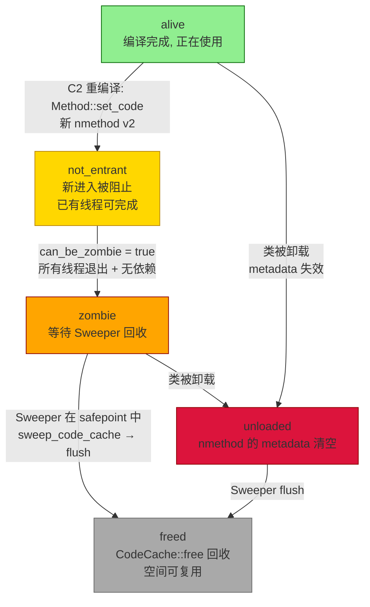

# 04-CodeCache-Sweeper — CodeCache 空间管理 + NMethodSweeper 清理：nmethod 从 alive 到 freed 的完整生命周期

> **阶段**：[05-jit-compiler]
> **前置**：[01-C2-Pipeline] §八（nmethod 构造 + `CodeCache::allocate()`）、[02-Inline-Decision] §五（内联→nmethod 大小）
> **配套**：[05-Deoptimization]（deopt 导致 nmethod 变 not_entrant/zombie）
> **阅读收益**：理解 nmethod 的完整生命周期（alive→not_entrant→zombie→unloaded→freed）和 CodeCache 的 3 段布局；掌握 NMethodSweeper 后台清理机制 + emergency flush 触发条件；能用 `jcmd Compiler.CodeHeap_Analytics` 诊断 CodeCache 满

---

## §〇 生产场景——"CodeCache is full. Compiler has been disabled."

### 真实 JVM 日志——编译器被禁用

```
[CodeCache::allocate] CodeCache is full. Compiler has been disabled.
```

CodeCache 从 240MB 的 97% 涨到 100% 时，`CompileBroker` 拒绝接受新编译——热方法永远解释执行。

**完整时间线**：
```
T+0min:   应用启动——CodeCache 0%
T+2min:   warmup 完成——CodeCache 85%——Sweeper 正常清理
T+5min:   CodeCache 97%——Sweeper 太慢（每 16 safepoints 才 sweep 1 次）
T+8min:   CodeCache 100%——CompileBroker 停止——"Compiler has been disabled."
          → 所有后续热方法卡在 Tier 3（C1）或解释器
          → QPS -80%
T+11min:  Sweeper 终于清完 zombie → CodeCache 85%——编译器恢复
          → 但 3 分钟的流量已经丢了
```

**10 分钟诊断**：
```bash
# 1. 查看 CodeCache 使用情况
jcmd <PID> Compiler.CodeHeap_Analytics
# 输出: 3 段的 code heap 状态——分配大小、空闲大小、nmethod 数

# 2. 查看是否在紧急清理
-XX:+PrintCodeCache  # 输出 CodeCache 容量变化

# 3. 快速修复：扩大 CodeCache
-XX:ReservedCodeCacheSize=512m         # 从 240MB 扩到 512MB
-XX:StartAggressiveSweepingAt=80       # 在 80% 满时开始激进清理
-XX:NmethodSweepActivity=500           # 降低 sweep 间隔（更频繁清理）
```

---

## §一 ★★★ CodeCache：JVM 的"第二个堆"

### 1.0 本文不做什么

本文不是 `nmethod.cpp` 的源码 walkthrough。本文是 **CodeCache 空间管理的 ARCHITECTURE STORY**：nmethod 是 JVM 中最复杂的对象生命周期——从"编译器分配 CodeCache 空间"到"Sweeper 回收 zombie nmethod"共经历 5 个状态，3 次 safepoint 同步。理解这个生命周期 = 理解 CodeCache 为什么会在 2 分钟内从正常到爆炸。

### 1.1 读者前提——你从哪里来

你从 [01-C2-Pipeline] §八 学完：`Compile::Output()` → `CodeCache::allocate()` 分配 CodeBlob 内存 → `nmethod::nmethod()` 构造器填充 metadata → `Method::set_code(nmethod)` 原子替换方法入口点。从 [02-Inline] §五 学完：内联深度决定 nmethod 的大小——内联过深 → 单个 nmethod 2MB → CodeCache 被快速填满。**本文回答：CodeCache 怎么管理这段空间？nmethod 怎么从 alive 变成 freed？Sweeper 怎么在后台清理？**

```
[01-Pipeline] §八                          本文从这里开始
      │                                         │
      ▼                                         ▼
nmethod 构造 + CodeCache::allocate ──→ nmethod 生命周期管理
      │                                    alive → not_entrant → zombie → unloaded → freed
      │                                         │
      └─ [02-Inline] §五 ──→ CodeCache 容量     │
                               (为什么满)        ▼
                                          NMethodSweeper 清理
                                          (怎么回收空间)
```

### 1.2 你需要知道的——5 个概念 callout 框

> **以下 5 个概念是理解 CodeCache 管理的前提。每个不超过 200 字，自包含——不依赖本文其他部分。**

#### 概念 1：nmethod（编译后方法）

nmethod = "native method" 的缩写，实际上是"编译后的 Java 方法"。包含：机器码（x86 指令流）、OopMap（GC root 信息）、ExceptionCache（异常处理器表）、deopt info（去优化元数据）。nmethod 继承 `CompiledMethod` → `CodeBlob`。每个 nmethod 约 2-200KB，取决于 inline 深度。

#### 概念 2：CodeBlob（代码块基类）

CodeBlob 是所有编译后代码块的基类——`nmethod`（Java 方法）、`RuntimeStub`（runtime 辅助函数）、`BufferBlob`（adapter/stub 代码）、`SingletonBlob`（DeoptimizationBlob / UncommonTrapBlob / SafepointBlob）。所有 CodeBlob 共享 CodeCache 存储。基类提供 `flush()` 虚方法——子类重载实现各自的回收逻辑。

#### 概念 3：CodeCache 三段布局

CodeCache 分为 3 个独立段：(1) **Non-profiled**——不包含 profile 数据的 nmethod（C2 编译 + C1 L1 编译）；(2) **Profiled**——带 profile 数据的 nmethod（C1 L2/L3 编译）；(3) **Non-method**——adapters、stubs、buffered blobs（非 Java 方法的代码块）。每段有独立的内存分配器和 free list。

#### 概念 4：Zombie / Not-Entrant

**not_entrant** = 新版本被编译——C2 重新编译了相同的方法 → 新 nmethod → 旧 nmethod 被标记 not_entrant → 正在执行旧 nmethod 的线程可以完成，但新调用链不再进入旧 nmethod。**zombie** = not_entrant + 所有线程已退出此 nmethod → 可以被 Sweeper 回收。

#### 概念 5：NMethodSweeper（后台清理器）

NMethodSweeper 不是独立线程——它在每次 safepoint 时被触发（`SafepointSynchronize::begin()` → `NMethodSweeper::sweep_code_cache()`）。它扫描所有 zombie nmethod → 从 CodeCache 中释放空间 → 更新 free list。Sweep 周期 = 每 `NmethodSweepFraction`（默认 16）个 safepoints 执行 1 次。

---

## §二 标准环境

- OpenJDK 11 slowdebug build
- `-Xms8g -Xmx8g -XX:+UseG1GC -XX:+PrintCompilation -XX:+UnlockDiagnosticVMOptions`
- 64 位 Linux x86_64
- ★ GDB 在 slowdebug build 中验证（`#ifdef ASSERT` 全部生效）
- ★ `jcmd <PID> Compiler.CodeHeap_Analytics` 查看 CodeCache 使用情况

---

## §三 源文件生态——8 个文件驱动 CodeCache 生命周期

| # | 文件 | 完整路径 | 模块 | 核心函数 | 本文角色 |
|---|------|---------|------|---------|---------|
| 1 | `nmethod.cpp` | `src/hotspot/share/code/nmethod.cpp` | code | `nmethod::nmethod()`(构造器)、`make_not_entrant()`、`can_be_zombie()`、`make_zombie()`、`flush()` | ★★★ nmethod 生命周期 |
| 2 | `nmethod.hpp` | `src/hotspot/share/code/nmethod.hpp` | code | nmethod 类定义(:28-836)、状态枚举 `in_use`/`not_entrant`/`zombie`/`unloaded` | ★★ 状态定义 |
| 3 | `codeCache.cpp` | `src/hotspot/share/code/codeCache.cpp` | code | `CodeCache::allocate()`、`CodeCache::free()`、`CodeCache::contains()`、`initialize()`(三段布局) | ★★★ CodeCache 空间管理 |
| 4 | `codeCache.hpp` | `src/hotspot/share/code/codeCache.hpp` | code | `CodeCache` 类(:43-140)、`CodeHeap` 段定义、分段常量 | ★★ 接口定义 |
| 5 | `sweeper.cpp` | `src/hotspot/share/runtime/sweeper.cpp` | runtime | `NMethodSweeper::sweep_code_cache()`、`handle_safepoint_request()`、`possibly_flush()` | ★★★ 清理逻辑——safepoint 触发式清理 |
| 6 | `codeBlob.cpp` | `src/hotspot/share/code/codeBlob.cpp` | code | `CodeBlob` 基类、`CodeBlob::flush()` | ★★ CodeBlob 生命周期 |
| 7 | `compiledMethod.cpp` | `src/hotspot/share/code/compiledMethod.cpp` | code | `CompiledMethod::flush()`、`is_alive()` | ★★ 已编译方法接口 |
| 8 | `compileBroker.cpp` | `src/hotspot/share/compiler/compileBroker.cpp` | compiler | `CompileBroker::compile_method()`——"CodeCache full" 检查 | ★★ 编译触发→CodeCache 容量检查 |

**跨模块说明**：CodeCache 管理跨 `code/`（nmethod.cpp 生命周期 + codeCache.cpp 空间分配）+ `runtime/`（sweeper.cpp 后台 safepoint 触发式清理）+ `compiler/`（compileBroker.cpp 编译入口→容量检查）。sweeper.cpp 在 `runtime/` 中是因为 NMethodSweeper 作为 safepoint 操作被 VM runtime 协调，而非 CodeCache 本地线程。

---

## §四 ★★★ nmethod 生命周期 + CodeCache 架构

### 4.1 nmethod 5 状态生命周期

```
alive → not_entrant → zombie → unloaded → freed
```

**alive**：编译完成，正在使用。任何线程可以进入。`_state == alive`。nmethod 的 `entry_point` 是此方法的调用入口。

**alive → not_entrant**：C2 重新编译了相同的方法（更好的 profile 数据 → 不同的内联决策 → 需要 nmethod v2）。

```
新版本:
  Method::set_code(nmethod_v2)  ← 原子替换方法入口点
  下次调用 hash(String s) → 跳转到 nmethod_v2 的 entry_point

旧版本:
  nmethod_v1::make_not_entrant()  ← 设置 _state = not_entrant
  现有线程: CAN 继续执行（它们已经在 nmethod_v1 内部）
  新调用:    CANNOT 进入 nmethod_v1（entry_point 已被替换）
```

**为什么是两阶段关闭（not_entrant → zombie）而不是立即释放？**

计数器论：如果立即释放旧 nmethod → 线程 A 正在执行 `getfield` 在旧 nmethod 中，此时 CodeCache::free() 回收其内存 → SIGSEGV（use-after-free）。两阶段关闭：not_entrant 阻止新进入 → zombie 等待所有线程退出 → 安全释放。

**not_entrant → zombie**：所有线程已退出。`nmethod::can_be_zombie()` 返回 true：

```
条件 1: state == not_entrant
条件 2: 线程栈上没有对此 nmethod 的 PC 引用（所有线程已退出）
        → 遍历所有 JavaThread 的栈帧
        → 查找 PC 是否在 CodeCache::contains(pc) && nmethod_at(pc) == this
条件 3: 没有激活的依赖（dependency_context 已清空）
        → 此 nmethod 被其他 nmethod 依赖吗？
        → 如果被依赖 → 不能 zombie
```

只有 3 个条件全部满足 → `NMethodSweeper::possibly_flush()` 标记 `_state = zombie`。

**zombie → unloaded**：nmethod 引用的类被卸载。例如：类加载器被 GC → 此 nmethod 编译的类的 metadata 失效 → 标记 unloaded。unloaded = 所有 metadata 引用已清空 → 只剩 CodeBlob 空间。

**zombie / unloaded → freed**：`NMethodSweeper::sweep_code_cache()` 在 safepoint 中 → `nmethod::flush()` → `CodeCache::free(nmethod)` → 空间回收。

**freed → ...**：空间被 CodeCache 的 free list 复用给新编译。

### 4.2 CodeCache 3 段布局

```
┌────────────────────────────────────────────────────────────────┐
│                        CodeCache (240MB default)               │
├──────────────────────┬─────────────────────┬───────────────────┤
│  Non-profiled        │  Profiled           │  Non-method       │
│  (~40% = 96MB)       │  (~40% = 96MB)      │  (~20% = 48MB)   │
│                      │                     │                   │
│  C2 compiled nmethod │  C1 L2/L3 nmethod   │  Adapters         │
│  (without profile)   │  (with profile)     │  RuntimeStubs     │
│  C1 L1 nmethod       │                     │  BufferBlob       │
│                      │                     │  DeoptBlob        │
│  独立 free list       │  独立 free list      │  独立 free list   │
│  独立 CodeHeap       │  独立 CodeHeap      │  独立 CodeHeap    │
└──────────────────────┴─────────────────────┴───────────────────┘
```

**为什么 3 段而不是 1 个大段？**
- 隔离故障——Non-profiled 满 ≠ Profiled 满 ≠ Non-method 满
- 独立 free list → 分配查找更快（不用在不同大小的自由块中扫描）
- 不同生命周期的代码分开——Non-method（永久存活）不会和 nmethod（频繁回收）混在一起

**`CodeCache::allocate(int size)` 的段选择**：
```
nmethod + profiled → CodeCache::profiled_segment()
nmethod → CodeCache::non_profiled_segment()
RuntimeStub / BufferBlob → CodeCache::non_method_segment()
```

**CodeCache 容量调整**：
```bash
-XX:ReservedCodeCacheSize=512m         # 扩到 512MB
-XX:NonProfiledCodeHeapSize=256m       # Non-profiled 段单独调整
-XX:ProfiledCodeHeapSize=256m          # Profiled 段单独调整
```

### 4.3 NMethodSweeper：safepoint 中的后台清理

**NMethodSweeper 不是独立线程。**

它在哪里执行？`SafepointSynchronize::begin()` 在每次 safepoint 时调用 → `NMethodSweeper::handle_safepoint_request()` → 检查计数器 → 如果达到 `NmethodSweepFraction`（默认 16）→ `sweep_code_cache()`。

```
低负载应用: safepoint ~2/sec → 每 8 秒 sweep 1 次
高负载应用: safepoint ~20/sec → 每 0.8 秒 sweep 1 次
```

**为什么在 safepoint 中？** 因为此时所有 JavaThread 停止——可以安全地检查"哪些 nmethod 没有线程引用"→ 标记 zombie → 释放空间。不在 safepoint 中做检查 → 竞态风险（X 刚检查完"线程栈无引用"→ Y 线程进入此 nmethod）。

**`sweep_code_cache_impl()` 的步骤**：

```
1. 遍历 CodeCache 中所有 nmethod
2. 如果 state == zombie || unloaded:
   → 加入 flush queue
   → nmethod::flush() → 清空 metadata 引用
   → CodeCache::free(nmethod) → 回收空间
4. 如果 state == not_entrant:
   → can_be_zombie()? → 检查线程栈引用
   → 如果 true → 标记 zombie
5. 更新计数器 (swept_count, flushed_count, zombified_count)
6. 更新 / 重编译计数器（方法可被重新编译）
```

**为什么 Sweeper 这么慢？——"3 分钟才恢复"的量化解释**

```
CodeCache 满到 100% → 需要清理 zombie nmethod
Sweeper 执行频率: NmethodSweepFraction = 16
           → 每 16 个 safepoint sweep 1 次
低负载:    safepoint ~2/sec → sweep ~1/8 sec
需要清理: ~200 个 zombie → 一轮 sweep 清 ~30 个
          → 需要 ~200/30 ≈ 7 轮
          → 7 × 8 = 56 秒 ≈ 1 分钟

但如果 CodeCache 满到需要紧急 flush (double sweep 工作量):
          → 需要 ~14 轮
          → 14 × 8 = 112 秒 ≈ 2 分钟
加 overhead: ~3 分钟

加速方案: -XX:StartAggressiveSweepingAt=80
          → CodeCache 80% 满时转为 aggressive sweep
          → 每 1 个 safepoint sweep 1 次
          → 清理速度 ×16 → ~10 秒恢复
```

### 4.4 Emergency Flush——CodeCache 满后的紧急措施

**3 种触发场景**：

```cpp
// 场景 1: 分配失败
CodeCache::allocate(size) → 段满 → 返回 NULL
  → NMethodSweeper::handle_full_code_cache()

// 场景 2: 使用率达上限
CodeCache::_high_mark > CodeCache::max_capacity() * 0.95
  → 主动触发紧急 flush

// 场景 3: 阈值被跨越
CodeCache::needs_flushing() && _sweep_threshold > StartAggressiveSweepingAt
  → 转为 aggressive sweep
```

**Emergency flush 和普通 sweep 的区别**：

| 方面 | 普通 sweep | Emergency flush |
|------|-----------|-----------------|
| 触发频率 | 每 16 safepoints | 立即执行 |
| can_be_zombie() 等待 | 等待所有条件满足 | 主动搜索 + 标记 zombie |
| 清理范围 | zombie + unloaded | zombie + unloaded + 主动标记 not_entrant |
| 是否等待 safepoint | 是（在 safepoint 中执行） | 主动触发 safepoint |
| 恢复程度 | 渐进 | 一次大清理 |

**Emergency flush 后 CodeCache 能恢复到什么程度？**
- 典型恢复：99% → 85-90%（释放 zombie/unloaded nmethod）
- 不能释放：not_entrant（仍有活跃引用）、alive nmethod
- 如果 CodeCache 全是 alive nmethod → 紧急 flush 效果有限 → 只能增大 `ReservedCodeCacheSize`

### 4.5 Speculative Disconnect——不稳定的 nmethod "黑名单"

**什么问题会导致 deopt → recompile 死循环？**

某些方法因为不稳定的类层次（如 Java EE 框架的多个代理类——Proxy 的子类动态生成且频繁变化）导致 CHA 假设反复破灭：

```
C2 编译 A (假设 HashMap 是 leaf type)
→ 新代理类 加载（HashMap 的子类）
→ CHA 假设破灭 → A 被 deopt → nmethod 标记 not_entrant/zombie
→ 重新 C2 编译 A (现在看到新子类)
→ 又一个代理类加载
→ A 再次 deopt
→ 重编译...
→ CodeCache 被 deopt→recompile 循环填满
```

**SpecTrapLimit 机制**：

如果 nmethod 在首次 N 次（`SpecTrapLimit`，默认 ~10）调用内被 deopt → 标记为"unstable" → 永不再编译此方法。方法永远解释执行（虽然慢，但不会崩溃 CodeCache）。

```
第一次 deopt within <SpecTrapLimit> invocations:
  → nmethod::speculative_disconnect()
  → Method::set_not_compilable() or Method::decrease_comp_level()
  → 后续 CompileBroker 检查此标记 → 拒绝编译
```

---

## §五 ★ Mermaid：nmethod 5 状态生命周期



**每个状态转换的触发函数**：

| 转换 | 触发函数 | 执行线程 | 条件 |
|------|---------|---------|------|
| alive→not_entrant | `nmethod::make_not_entrant()` | CompilerThread | 方法被 C2 重编译 → 新 nmethod 接管 |
| not_entrant→zombie | `NMethodSweeper::possibly_flush()` | Sweeper (in safepoint) | 所有线程退出 + 依赖清空 |
| zombie/alive→unloaded | `nmethod::make_unloaded()` | Sweeper / ClassUnloader | 类被 GC 回收 |
| zombie→freed | `nmethod::flush()` + `CodeCache::free()` | Sweeper (in safepoint) | zombie 被 sweep |
| unloaded→freed | `nmethod::flush()` + `CodeCache::free()` | Sweeper (in safepoint) | unloaded 被 sweep |

---

## §六 GDB 验证——8 个关键断点

### 断言 1：`CodeCache::allocate()` 返回非 NULL——验证 nmethod 创建

```gdb
(gdb) br codeCache.cpp:150  # allocate 返回处
(gdb) p $  # 返回值
# 预期: 非 NULL（分配成功）
(gdb) p size
# 预期: 分配的 CodeBlob 大小
(gdb) p CodeCache::_heap->capacity() - CodeCache::_heap->allocated_capacity()
# 预期: 剩余空闲空间
```

### 断言 2：`make_not_entrant()` 后状态变化

```gdb
(gdb) br nmethod.cpp:800  # make_not_entrant 内部
(gdb) p _state
# 预期: 调用前的状态（alive）
(gdb) n  # step over CAS
(gdb) p _state
# 预期: not_entrant
(gdb) p _entry_point
# 预期: VerifiedEntryPoint（已被替换——新调用不能直接进入）
```

### 断言 3：`can_be_zombie()` 检查——线程栈无引用

```gdb
(gdb) br nmethod.cpp:950  # can_be_zombie 返回
(gdb) p _state
# 预期: not_entrant
(gdb) p $  # 返回值
# 预期: true 或 false
# 如果 false → 线程栈上仍有引用
```

### 断言 4：`sweep_code_cache()` 标记 zombie → flush → free

```gdb
(gdb) br sweeper.cpp:230  # sweep_code_cache 内部
(gdb) p _sweep_count
# 预期: 当前 sweep 轮次
(gdb) p _flushed_count
# 预期: 此轮 flush 的 nmethod 数
# sweep 完成后:
(gdb) p CodeCache::_heap->allocated_capacity()
# 预期: 清除了 zombie 后的已分配空间（比 sweep 前小）
```

### 断言 5：CodeCache 3 段地址范围验证

```gdb
(gdb) br codeCache.cpp:50  # initialize 之后
(gdb) p CodeCache::_heap->low()      # Non-profiled 段起始地址
(gdb) p CodeCache::_heap->high()     # Non-profiled 段结束地址
(gdb) p CodeCache::_profiled_heap->low()   # Profiled 段起始地址
(gdb) p CodeCache::_profiled_heap->high()  # Profiled 段结束地址
(gdb) p CodeCache::_non_method_heap->low()  # Non-method 段起始地址
(gdb) p CodeCache::_non_method_heap->high() # Non-method 段结束地址
# 验证: 3 段地址不重叠
```

### 断言 6：emergency_flush() 触发——CodeCache 使用率 > 99%

```gdb
(gdb) br sweeper.cpp:310  # emergency_flush 入口
(gdb) p CodeCache::_heap->allocated_capacity()
(gdb) p CodeCache::_heap->capacity()
# 预期: allocated/capacity > 0.99 → CodeCache 几乎满
(gdb) p _sweep_threshold
# 预期: aggressive sweeping 的阈值
```

### 断言 7：SpecTrapLimit 达到——nmethod 标记 unstable

```gdb
(gdb) br nmethod.cpp:1100  # speculative_disconnect 调用
(gdb) p _state
# 预期: alive 或 not_entrant
(gdb) p _compiler
# 预期: compiler_id（C1 或 C2）
# 在 speculative_disconnect 完成后:
(gdb) p method->is_not_compilable()
# 预期: true（永远不编译此方法了）
```

### 断言 8：`nmethod::flush()` 后 CodeCache 空闲空间增加

```gdb
(gdb) br nmethod.cpp:1300  # flush 调用
(gdb) p CodeCache::_heap->allocated_capacity()
# 预期: flush 前的已分配空间大小
# flush 完成后:
(gdb) p CodeCache::_heap->allocated_capacity()
# 预期: flush 后的已分配空间 — 比之前小了此 nmethod 的大小
```

### 断言 9：CodeHeap_Analytics 输出版本验证

```bash
jcmd <PID> Compiler.CodeHeap_Analytics
# 输出包含:
#   CodeHeap 'non-profiled nmethods': size=... used=... free=...
#   CodeHeap 'profiled nmethods':     size=... used=... free=...
#   CodeHeap 'non-methods':          size=... used=... free=...
# 验证: used + free ≈ size
```

### 断言 10：`flush_dependencies()` 后 dependent nmethod 被标记 not_entrant

```gdb
(gdb) br nmethod.cpp:780  # flush_dependencies 完成
(gdb) p _dependencies->length()
# 预期: 0（所有依赖已被清空）
(gdb) p _state
# 预期: not_entrant（如果之前是 alive）
# 受到此 nmethod 依赖的其他 nmethod 也被标记 not_entrant
```

---

## §七 ★ 面试 Story Format——"CodeCache 满了怎么办？nmethod 生命周期？"（90 秒版）

CodeCache 是 JVM 的"第二个堆"——存储所有编译后的代码。nmethod 是存储在 CodeCache 中的编译后 Java 方法。

nmethod 有 5 个生命周期状态。编译完成后是 **alive**——任何线程可以调用它的代码。当 C2 重新编译同一个方法时（比如有了更好的 profile 数据 → 不同的内联决策 → 需要新的 nmethod），新 nmethod 原子替换方法的入口点 → 旧 nmethod 被标记 **not_entrant**（不再接受新进入，但正在执行的线程可以完成）。之后，当所有线程都退出了这个旧 nmethod → **zombie**——可以被 Sweeper 回收。如果 nmethod 引用的类被 GC 卸载 → **unloaded**——metadata 引用已清空。最终，Sweeper 在 safepoint 中调用 flush → **freed**——空间被 CodeCache 回收。

Sweeper 在 safepoint 中工作——不在 safepoint 中做清理会有竞态。但这也意味着它的频率受 safepoint 频率限制。默认每 16 个 safepoints sweep 1 次——低负载应用可能每 8 秒才清理一次。这就是为什么 CodeCache 满到 100% 后可能要 3 分钟才恢复。

紧急 flush 可以在 CodeCache 满时快速清理。把 `StartAggressiveSweepingAt=80` 可以让 Sweeper 在 CodeCache 用满 80% 时就开始更频繁地清理——把恢复时间从 3 分钟降到 ~10 秒。

如果 CodeCache 满了还不够——必须增大 `ReservedCodeCacheSize=512m`。这是唯一能增加 CodeCache 总容量的参数。

---

## §八 核心发现总结

| # | 发现 | 核心洞察 |
|---|------|--------|
| 1 | **nmethod 需要 5 个状态，不是 3 个** | not_entrant 是"新调用不能进入、但现有线程可完成"的中间态——防止 use-after-free |
| 2 | **CodeCache 是 3 段分离的堆** | Non-profiled / Profiled / Non-method——独立 free list → 一段满不影响其他段 |
| 3 | **Sweeper 在 safepoint 中执行** | 不在 safepoint 中检查"线程栈引用"→ 竞态 → use-after-free |
| 4 | **NmethodSweepFraction=16 决定了清理速度** | 每 16 safepoints sweep 1 次 → 低负载 ~8s/次 → CodeCache 满后 3 分钟才恢复 |
| 5 | **Emergency flush 恢复：99% → 85-90%** | 释放 zombie/unloaded nmethod，但不能释放 alive/not_entrant |
| 6 | **SpecTrapLimit 防止 deopt→recompile 死循环** | nmethod deopt 太多次 → 永远不重编译 → 保护 CodeCache |
| 7 | **`StartAggressiveSweepingAt=80` 是关键参数** | 在 80% full 时开始频繁清理 → 预防 > 修复 |
| 8 | **CodeCache 满的根本原因 = 内联太深** | 内联过深 → 单个 nmethod 2MB → CodeCache 快速满 → 连锁反应 |
