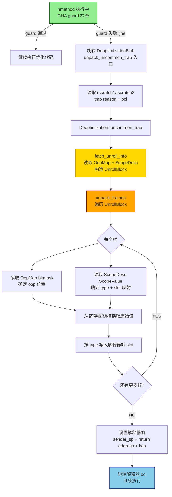

# 05-Deoptimization — 去优化：C2 怎么在假设破灭时从 16 个 x86 寄存器重建解释器帧——完整过程

> **阶段**：[05-jit-compiler]
> **前置**：[01-C2-Pipeline] §八（nmethod + uncommon trap guard）、[06-OopMap-GC-Roots] §二（OopMap bitmask 结构）
> **配套**：[02-Inline-Decision] §二（CHA 破灭→deopt 触发）、[04-CodeCache-Sweeper] §五（deopt→not_entrant）
> **阅读收益**：理解 Java 的"回退机制"——从 C2 优化代码回到解释器的完整过程；掌握 Frame Rebuild 原理（ScopeValue + OopMap → 解释器帧）；能用 PrintDeoptimizationDetails 诊断 deopt 风暴

---

## §〇 生产场景——200 deopt/s，CPU 50% 在 deopt blob

### 真实 PrintDeoptimizationDetails 输出——CHA 破灭

线上应用在新地域上线后。你打开 `-XX:+PrintDeoptimizationDetails`：

```
Uncommon trap happened in java.util.HashMap::putVal
  @ 42 java.util.HashMap::hashCode (5 bytes)
  reason: class_check
  action: maybe_recompile
  trap_request: 5
```

解读这份 deopt 输出：
- `@ 42 java.util.HashMap::hashCode` = 字节码偏移 42 处的调用点——C2 编译时插入了一个 CHA guard，假设 receiver 类固定
- `reason: class_check` = 运行时 guard 失败——receiver 的类**不是** C2 预期的类——CHA 失效
- `action: maybe_recompile` = C2 会尝试用更新后的 profile 重新编译——但仅当此方法 deopt 次数不超过 SpecTrapLimit 时
- `trap_request: 5` = deopt reason 位掩码：`reason_class_check` = bit 2 (值 4) + `action_maybe_recompile` = bit 0 (值 1) = 5
- 如果同一方法反复出现 → CHA 假设持续破灭 → deopt→recompile→deopt 循环 → CodeCache + CPU 危机

**生产时间线**：

```
T+0s:   反射框架调用方法——receiver 是 HashMap
T+5s:   C2 编译方法——CHA 判断"只有一个子类→单态内联 HashMap::hashCode()"
T+10s:  新子类被加载——receiver 变成 TreeMap
T+10.001s: CHA guard 失败 → deopt → 重编译
T+10.5s: 另一个新子类被加载 → 又 deopt → 又重编译
T+10s~15s: 200 deopt/s → CPU 50% 在 deopt blob → 重编译循环 → CodeCache 230MB→240MB
```

**10 分钟诊断 + 修复**：

```bash
# 1. 诊断：查看 deopt 频率
-XX:+PrintDeoptimizationDetails | grep "trap_request" | wc -l
# → 200+ lines/min → deopt 风暴确认

# 2. 定位：哪个方法频率最高？
-XX:+PrintDeoptimizationDetails | grep "reason:" | sort | uniq -c | sort -rn
# → class_check 占 95% → CHA 失效是根因

# 3. 修复：限制重编译
-XX:PerMethodTrapLimit=50            # 从 100 降到 50
-XX:CompileCommand=exclude,problematicSource  # 排除问题方法

# 4. 长期：消除 CHA 依赖
# → 在反射代码中做显式 if-else dispatch，不依赖 C2 单态化
```

---

## §一 ★★★ 去优化是 C2 的"逃生舱"——不是 crash，是设计好的回退

### 1.0 本文不做什么

本文不是 `deoptimization.cpp` 的逐行源码翻译。本文是 **Deopt 的 ARCHITECTURE STORY**：去优化的核心问题是——**C2 做了一个乐观假设（"receiver 总是 HashMap"），运行时被打破 → 如何从 16 个 x86 寄存器中完整重建 Java 栈帧，让解释器能无缝继续执行？**

### 1.1 读者前提——你从哪里来

你从 [01-C2-Pipeline] §八 学完：`PhaseOutput::install_code()` → `nmethod::nmethod()` 构造器中生成 OopMap 和 uncommon trap guard。从 [06-OopMap-GC-Roots] §二 学完：OopMap 是每个 safepoint 的 bitmask——记录哪些寄存器/栈槽是 oop。**本文回答：OopMap 在 deopt 时怎么被消费——ScopeDesc 的 type 信息 + OopMap 的位置信息 → 16 个寄存器 → 1 个完整的解释器帧。**

```
[01-Pipeline] §八                         本文从这里开始
      │                                         │
      ▼                                         ▼
nmethod 构造 + trap guard ──→ uncommon trap 触发 ──→ deopt
      │                              │                  │
      └─ [06-OopMap] §二              │                  │
           OopMap bitmask ────────────┘                  │
                                    OopMap 消费 ←─────────┘
                                                         │
                                              ▼
                                   Frame Rebuild: 寄存器 → 解释器帧
```

### 1.2 你需要知道的——4 个概念 callout 框

> **以下 4 个概念是理解去优化的前提。每个不超过 200 字，自包含——不依赖本文其他部分。**

#### 概念 1：Deopt（去优化）

Deopt = "优化后的机器码 → 解释器"。当 C2 编译时基于的假设被打破（如 CHA 说"只有 1 个子类"，但新子类被加载）→ C2 的优化代码不再正确 → 必须回退到解释器。Deopt 不是 crash——它是有序的、可恢复的"回退"操作。代价：~1000 cycles（frame rebuild）+ 解释器退化 20-100×。

#### 概念 2：Uncommon Trap（罕见陷阱）

C2 编译时插入的 guard check 指令——如 `cmp [recv+klass], HashMap_Klass; jne uncommon_trap`。当 guard 失败时（执行了 `jne`）→ CPU 跳转到 DeoptimizationBlob 的入口 → 读取 trap 信息（bci + reason + action）→ 执行去优化。叫"罕见"是因为 C2 假设这个 guard 极少失败——如果频繁失败 → deopt 风暴。

#### 概念 3：Frame Rebuild（帧重建）

Deopt 的核心操作：从 16 个 x86 寄存器和当前栈状态中重建一个**解释器帧**。C2 编译的代码把 Java 的局部变量分散在寄存器 + 栈槽中——寄存器分配是随意的（R10=local0, RDI=expr1, 等等）。Frame Rebuild 需要：(a) OopMap——哪些寄存器/栈槽是 oop；(b) ScopeDesc——每个值的 Java 类型（int/long/oop/float/double）和目标局部变量位置。

#### 概念 4：DeoptimizationBlob

所有 nmethod 共享的去优化入口代码——在 JVM 启动时由 `SharedRuntime::generate_deopt_blob()` 生成一次，存储在 CodeCache 的 Non-method 段。包含 3 个入口：`unpack_uncommon_trap`（陷阱→不重执行触发指令）、`unpack_reexecute`（deopt→重执行触发指令）、`unpack_UncommonTrap_and_Reexecute`（复合）。每个 nmethod 的 `jne` 都跳转到同一个 DeoptimizationBlob 入口。

---

## §二 标准环境

- OpenJDK 11 slowdebug build（`#ifdef ASSERT` 全部生效）
- `bash configure --with-debug-level=slowdebug`
- `-Xms8g -Xmx8g -XX:+UseG1GC`
- 64 位 Linux x86_64
- deopt 观察：`-XX:+PrintDeoptimizationDetails -XX:+TraceDeoptimization -XX:+UnlockDiagnosticVMOptions`
- GDB 在 slowdebug build 中验证

---

## §三 源文件生态——6 个文件驱动 deopt 全流程

| # | 文件 | 完整路径 | 模块 | 核心函数 | 本文角色 |
|---|------|---------|------|---------|---------|
| 1 | `deoptimization.cpp` | `src/hotspot/share/runtime/deoptimization.cpp` | runtime | `fetch_unroll_info()`、`unpack_frames()`、`uncommon_trap()`、`UnrollBlock` 构造 | ★★★ 核心 deopt 逻辑 |
| 2 | `deoptimization.hpp` | `src/hotspot/share/runtime/deoptimization.hpp` | runtime | `Deoptimization` 类、`UnrollBlock` 结构、`DeoptReason` 枚举 | ★★ 接口定义 |
| 3 | `sharedRuntime.cpp` | `src/hotspot/share/runtime/sharedRuntime.cpp` | runtime | `SharedRuntime::generate_deopt_blob()` | ★★ deopt blob 生成 |
| 4 | `frame_x86.cpp` | `src/hotspot/cpu/x86/frame_x86.cpp` | cpu/x86 | `frame::deoptimize()`、sender_for_compiled_frame | ★★ 平台帧重建 |
| 5 | `oopMap.cpp` | `src/hotspot/share/compiler/oopMap.cpp` | compiler | `OopMapSet::find_map_at_offset()`、`OopMap::oops_do()` | ★★ OopMap 消费 |
| 6 | `scopeDesc.cpp` | `src/hotspot/share/code/scopeDesc.cpp` | code | `ScopeDesc::locals()`、`ScopeDesc::expressions()` | ★★★ 类型信息消费 |

**跨模块说明**：deopt 跨 runtime/（核心逻辑）+ cpu/x86/（平台帧重建）+ compiler/（OopMap 消费）+ code/（ScopeDesc）。`deoptimization.cpp` 是主引擎——调用 `OopMapSet::find_map_at_offset()` 读取 OopMap → 调用 `ScopeDesc` 读取类型 → 调用 `frame::deoptimize()` 重建帧。

---

## §四 ★★★ The Full Deopt Journey——从 trap 触发到解释器继续执行

### 4.1 Deopt 触发类型（3 种）

**类型 1：Uncommon Trap——C2 的乐观假设破灭**

| Trap 原因 | C2 假设 | 运行时破灭 | 示例 |
|-----------|---------|-----------|------|
| `class_check` | CHA：receiver 只有 1 个具体类 | 新子类被加载 | C2 内联了 HashMap::hashCode()，但实际 receiver 是 TreeMap |
| `null_check` | C2 证明此值"永不为 null" | 实际是 null | `get(int)` 在文档上说"返回 Object or null if not found"——但 C2 看到的是"本代码路径总是先 containsKey 再 get" → 假设永不为 null |
| `range_check` | C2 消除数组越界检查 | 数组长度小于预期 | loop bound 推导出错，索引超出实际数组长度 |
| `unstable_if` | C2 假设某分支极大概率 taken | 分支走向改变 | profile 说 99% taken → deopt 时只有 40% taken |

> **Counterfactual**："如果没有 uncommon trap——C2 必须为**每个**边界情况生成慢速代码——即使 0.01% 的情况也要慢。有了 trap：常见情况得到 FAST 代码。罕见情况 → deopt → 解释器 → 不 crash，只是慢。"

**类型 2：OSR Deopt——循环编译的入口条件不再满足**

OSR（On-Stack Replacement）编译的循环入口条件变化——如数组长度变化导致 OSR 代码中的 loop bound 假设不成立 → 回退到解释器重新进入循环。`DeoptReason::OSR_migration_fail`。

**类型 3：JVMTI Force Deopt——Agent 强制回退**

`DeoptReason::ForceDeoptTopFrame / PopFrame / ForceEarlyReturn`——JVMTI agent 调用 `RetransformClasses` 后立即 deopt 所有相关帧，让解释器从新的类定义重新执行。这是 tooling（debugger/profiler）触发的 deopt，不是程序行为导致的。

**代价排序**：
1. Uncommon trap + 重编译循环——价最大（deopt + recompile + 可能再次 deopt）
2. OSR deopt——中等（deopt + 解释执行循环 + 可能重新 OSR 编译）
3. JVMTI deopt——最小（deopt + 解释器执行，但 JVMTI agent 通常只在调试时使用）

### 4.2 ★★★ Frame Rebuild：核心机制——从 16 个寄存器重建解释器帧

Deopt 的核心操作就是 Frame Rebuild。过程如下：

**Step 1：`Deoptimization::fetch_unroll_info()` 读取元数据**

编译帧的 return address 处保存了 PC `→` 计算 `pc_offset = PC - nmethod->code_begin()` `→` `OopMapSet::find_map_at_offset(pc_offset)` 找到 OopMap `→` `ScopeDesc::decode(nmethod, pc_offset)` 找到 ScopeDesc。

返回一个 `UnrollBlock`——包含：
- 每个帧的 `frame_size`（解释器帧大小）
- 每个帧的 `num_locals / num_expressions / num_monitors`（帧内分区大小）
- `caller_adjustment`（caller 帧的栈调整量）

**Step 2：`unpack_frames()` 重建帧**

Compiled frame in registers before deopt：
```
R10 = oop HashMap     (OopMap: reg 10, bit = 1 → oop)
RDI = int 42          (OopMap: reg 7, bit = 0 → non-oop)
RSI = float 3.14      (OopMap: reg 6, bit = 0 → non-oop)
[RSP+0x10] = oop "hello" (OopMap: stack slot 0, bit = 1 → oop)
[RSP+0x18] = int 99       (OopMap: stack slot 1, bit = 0 → non-oop)
```

OopMap for this PC offset (0x2a)：
```
bitmask: 0b000000010000000100000001... (bits 10, 7, 6 are registers; bits 16+ are stack slots)
         bit 10 = 1 → R10 is oop
         bit 7  = 0 → RDI is non-oop
         bit 6  = 0 → RSI is non-oop
         stack slot 0 = 1 → [RSP+0x10] is oop
         stack slot 1 = 0 → [RSP+0x18] is non-oop
```

ScopeDesc for this PC offset：
```
locals[0] = {type=T_OBJECT, klass=java/util/HashMap, location=REG_R10}
locals[1] = {type=T_INT, location=REG_RDI}
locals[2] = {type=T_FLOAT, location=REG_RSI}
locals[3] = {type=T_OBJECT, klass=java/lang/String, location=STACK_SLOT_0}
```

Interpreter frame after deopt reconstruction：
```
locals[0] = oop(HashMap)     ← from R10 (OopMap says oop, ScopeDesc says T_OBJECT/HashMap)
locals[1] = int(42)          ← from RDI (ScopeDesc says T_INT)
locals[2] = float(3.14)      ← from RSI (ScopeDesc says T_FLOAT)
locals[3] = oop("hello")     ← from [RSP+0x10] (OopMap says oop, ScopeDesc says T_OBJECT/String)
```

> **Counterfactual**："如果没有 ScopeDesc：deopt 能重建 GC roots（OopMap 告诉我哪些值不能 GC），但**不能**重建局部变量表或表达式栈。解释器需要精确的类型信息来继续执行——ScopeDesc 提供类型映射。OopMap + ScopeDesc = 完整帧重建的两个关键数据源。"

**Step 3：重建顺序——从老帧到新帧（高地址到低地址）**

重建按调用链从 caller 到 callee 的顺序——先分配最老帧（高地址），再分配较新帧（低地址）。重建完成后：

```
高地址 ↓
┌──────────────────────────────┐
│  old caller frame (RSP+...)  │
├──────────────────────────────┤
│  [new interpreter frame N]   │ ← oldest inlined method frame (rebuilt first)
├──────────────────────────────┤
│  [new interpreter frame N-1] │
├──────────────────────────────┤
│  ...                         │
├──────────────────────────────┤
│  [new interpreter frame 0]   │ ← current method frame (trapping method)
├──────────────────────────────┤
│  new frames' operands stack  │
└──────────────────────────────┘ ← RSP after deopt
低地址
```

### 4.3 ★ DeoptimizationBlob 执行——3 个入口，2 条路径

DeoptimizationBlob 是 JVM 启动时生成一次的共享代码块。所有 nmethod 的 uncommon trap guard 都跳转到此 blob。

**3 个入口**：

| 入口 | 场景 | 行为 |
|------|------|------|
| `unpack_uncommon_trap` | CHA guard / null check 失败 | **不重新执行**触发指令（该指令的结果基于破灭的假设——用了会错误）→ 跳到解释器的 handler bci |
| `unpack_reexecute` | class loading 完成后 deopt | **重新执行**触发指令（指令本身没问题——问题是调用上下文。类加载完成后重新执行可以触发新的内联）|
| `unpack_UncommonTrap_and_Reexecute` | 复合场景 | 同时触发 trap 和 reexecute |

> **Counterfactual**：为什么需要 2 条路径？"如果 CHA guard 在 `invokevirtual hash()` 处失败——trap 在 callee 的编译代码内部触发。此时不重执行 invoke——直接跳到解释器的 handler 继续。如果 deopt 是因为 `getfield #value` 被标量替换优化掉了——需要重执行整个 getfield 以让解释器从字段读真实值。"

**Trap 信息传递——rscratch1/rscratch2 的角色**：

nmethod 的 trap guard 前一条指令把 trap reason + bci 写入 rscratch1（r10）和 rscratch2（r11）。DeoptimizationBlob 入口的第一条指令读取这两个寄存器 `→` 获得 trap 信息 `→` 传递给 `fetch_unroll_info()`。这两个寄存器的值在正常执行时不保证保留（caller-saved），所以 trap guard 写入它们没有副作用。

### 4.4 ★★ OopMap 在 deopt 中的消费——和 GC 的不同

Deopt 消费 OopMap 的方式与 GC 不同：

| | GC 消费 OopMap | Deopt 消费 OopMap |
|---|---|---|
| **目的** | 找到所有 live oop → 标记为活跃 | 知道哪些值是 oop → 正确重建解释器帧的 oop slot |
| **遍历方式** | `OopMap::oops_do(OopClosure*)` → 对所有 oop 执行 closure | 按需查询特定寄存器/栈槽的 oop 状态 |
| **需要类型?** | 否——GC 只需要 oop vs non-oop | 是——需要 ScopeDesc 提供的类型信息（T_INT/T_LONG/T_OBJECT/...）|
| **执行线程** | GC 线程（safepoint 中） | 当前 Java 线程（执行 deopt 的线程） |

Deopt 通过 `OopMapSet::find_map_at_offset()` 做二分查找 → 读取 OopMap bitmask → 结合 ScopeDesc 的 type 信息 → 逐个 slot 写入解释器帧。

### 4.5 ★★ Recompilation 决策——deopt 后是否重编译？

Deopt 后 C2 根据 `action` 字段决定是否重编译：

| action | 含义 | 行为 |
|--------|------|------|
| `none` | 正常 deopt（如 class loading） | 不需要重编译 |
| `maybe_recompile` | 基于乐观假设的 deopt | 更新 profile → 不包含乐观假设重新编译 |
| `make_not_entrant` | nmethod 被永久 deopt | 此 nmethod 永远不重编译 → 方法标记 `not_compilable()` |

重编译的关键约束：**SpecTrapLimit**（默认：方法被调用次数 + 1）。如果某方法 deopt 次数超过了 SpecTrapLimit → 方法被标记为 `not_compilable()` → 永远不重编译 → 永远解释执行。

> **Counterfactual**："如果没有 SpecTrapLimit：CHA guard 破灭 200 次/s → 200 次重编译/s → CompileBroker 队列无界增长 → compile threads 饿死 → JIT 系统实际被禁用。SpecTrapLimit 是防止 deopt→recompile 死循环的最后一道防线。"

---

## §五 ★ Mermaid：从 trap guard 到 interpreter re-entry 的完整路径



**关键路径的代码追踪**：

| 步骤 | 源码位置 | 核心操作 |
|------|---------|---------|
| trap guard 触发 | nmethod 机器码 | `cmp [recv+klass], klass; jne deopt_blob` |
| 读取 trap 信息 | deoptimization.cpp `uncommon_trap()` | 从 rscratch1/rscratch2 读 reason + bci |
| 构造 UnrollBlock | deoptimization.cpp `fetch_unroll_info()` | OopMap + ScopeDesc → frame_size + num_locals + num_exprs |
| 重建帧 | deoptimization.cpp `unpack_frames()` | 遍历 UnrollBlock → 每个帧重建解释器 layout |
| 跳转解释器 | 平台汇编 | 设置 bcp + R13(bcp) → jmp handler entry |

---

## §六 ★ GDB 验证——10 个关键断点

### 断言 1：`Deoptimization::fetch_unroll_info()` —— 打印 deopt reason + method + bci

```gdb
(gdb) br deoptimization.cpp:100  # fetch_unroll_info 内部
(gdb) p trap_reason
# 预期: Deoptimization::Reason_class_check 或其他 reason
(gdb) p trap_method->name()->as_utf8()
# 预期: 触发 deopt 的方法名——如 "putVal"
(gdb) p trap_bci
# 预期: 字节码偏移——如 42
```

### 断言 2：`unpack_frames()` —— 验证帧重建前后的栈布局

```gdb
(gdb) br deoptimization.cpp:400  # unpack_frames 内部
(gdb) p thread->last_Java_sp()
# 预期: unpack 前的 SP
(gdb) n  # step through unpack
(gdb) p thread->last_Java_sp()
# 预期: unpack 后的 SP——值已改变（新解释器帧已创建）
```

### 断言 3：UnrollBlock 的 frame_size 列表

```gdb
(gdb) br deoptimization.cpp:180  # fetch_unroll_info 返回处
(gdb) p unroll_block->number_of_frames()
# 预期: deopt 涉及的帧数——如 1-3（取决于内联深度）
(gdb) p unroll_block->frame_sizes()
# 预期: 每个帧的解释器帧大小（bytes）
(gdb) p unroll_block->size_of_deoptimized_frame()
# 预期: 被 deopt 的最顶层帧大小
```

### 断言 4：`OopMapSet::find_map_at_offset()` —— 验证 OopMap 查找

```gdb
(gdb) br oopMap.cpp:250  # find_map_at_offset 返回
(gdb) p pc_offset
# 预期: 当前 PC 在 nmethod 中的偏移
(gdb) p $
# 预期: 非 NULL（safepoint 处有 OopMap）
(gdb) p $->count()
# 预期: OopMap 中的 oop 数量——如 2-5
```

### 断言 5：OopMap bitmask——验证寄存器 oop 标记

```gdb
(gdb) br oopMap.cpp:300  # oops_do 遍历
(gdb) p map->has_oop_for_register(VMRegImpl::as_VMReg(10))
# 预期: true（如果 R10 在编译时保存了 oop）
(gdb) p map->has_oop_for_register(VMRegImpl::stack2reg(0))
# 预期: true/false（取决于栈槽 0 是否有 oop）
```

### 断言 6：DeoptimizationBlob 入口——验证所有 trap 跳转到同一 blob

```gdb
(gdb) br sharedRuntime.cpp:2100  # generate_deopt_blob 内部
(gdb) p _deopt_blob
# 预期: DeoptimizationBlob 地址——存在且非 NULL
(gdb) p _deopt_blob->entry_point()
# 预期: unpack_uncommon_trap 入口的地址
```

### 断言 7：uncommon trap 的 jne 目标——验证跳转到 DeoptimizationBlob

```gdb
(gdb) info registers pc
# => 在常见 guard 点停住
(gdb) disassemble $pc, $pc+20
# 预期: 看到 jne <target> → <target> 地址在 DeoptimizationBlob 范围内
```

### 断言 8：unpack_reexecute 路径——验证 return 到触发指令

```gdb
(gdb) br deoptimization.cpp:500  # unpack_reexecute 中
(gdb) p reexecute_bci
# 预期: 触发指令的 bci（而不是下一指令的 bci）
# 对比: uncommon_trap 的 handler_bci 指向下一指令（跳过触发指令）
```

### 断言 9：deopt 后 method->from_compiled_entry 的变化

```gdb
(gdb) br compile.cpp:947  # register_method 之后
(gdb) p method->from_compiled_entry()
# 预期: verified_entry_point（编译完成后的入口）
# deopt 后:
(gdb) p method->from_compiled_entry()
# 预期: 如果 make_not_entrant → 回退到 C1 entry 或 interpreter entry
```

### 断言 10：PrintDeoptimizationDetails 输出与 GDB 信息一致性

```gdb
(gdb) br deoptimization.cpp:50  # uncommon_trap 入口
(gdb) p trap_request
# 预期: bitmask 值——如 5（=class_check + maybe_recompile）
# 与 -XX:+PrintDeoptimizationDetails 输出的 trap_request 一致
```

---

## §七 ★ 面试 Story Format——"去优化是什么？"（90 秒版）

去优化是 C2 的"逃生舱"——C2 做了一个乐观假设编译出高效代码，当假设被运行时现实打破时，JVM 必须有办法安全地"回退"到解释器。

两个核心部分：**C2 为什么做假设**，和 **JVM 怎么在假设破灭时恢复**。

**为什么做假设？** C2 的优化能力取决于它能看到多少确定性。如果 C2 看到 `invokevirtual` 只有 1 个可能的目标——它可以直接内联 callee → 消除 vtable dispatch → 启用 10+ 种后续优化。但 C2 编译时类层次可能不完整——所以 C2 做"乐观假设"并插入 guard check（`jne uncommon_trap`）。

**怎么恢复？** 当 guard 失败时——CPU 跳转到 DeoptimizationBlob（所有 nmethod 共享的入口代码）。DeoptimizationBlob 读取 OopMap（哪位寄存器里有 oop？）和 ScopeDesc（哪个寄存器里的值是 int？哪个是 float？）→ 从 16 个 x86 寄存器中完整重建解释器帧的局部变量和操作数栈 → 跳转到解释器继续执行。

代价：~1000 cycles（frame rebuild）+ 解释器退化 20-100× + 可能重编译 ~100ms。但如果 deopt→recompile→deopt 循环发生 → CPU 一半时间在 deopt 和重编译 → 这就是线上"deopt 风暴"——JVM 最严重的性能问题之一。

---

## §八 和 [01][04][06] 的交叉验证

| 交叉文档 | 相关内容 | 验证方法 |
|---------|---------|---------|
| 01-Pipeline §八 | nmethod 构造中生成 uncommon trap guard + OopMap | deopt 在 guard `jne` 跳转时触发——验证 guard 跳转目标 = DeoptimizationBlob |
| 04-CodeCache-Sweeper §五 | deopt→nmethod make_not_entrant→zombie | `PrintDeoptimizationDetails` 看到 action=make_not_entrant → nmethod 进入 not_entrant 状态 |
| 06-OopMap-GC-Roots §二 | OopMap bitmask 结构 | deopt 通过 `find_map_at_offset()` 二分查找 OopMap——验证与 GC 查找同一 OopMapSet |
| 06-OopMap-GC-Roots §五 | OopMap 在 deopt 中的消费——与 GC 的对比 | GC 需要 oop vs non-oop，deopt 还需要 ScopeDesc 的 type 信息——两条路径消费同一 OopMap，用途不同 |

---

## 核心发现总结

| # | 发现 | 核心洞察 |
|---|------|--------|
| 1 | **Deopt 不是 crash——是设计好的回退** | C2 的乐观假设 = 性能来源；Deopt = 安全网——两者缺少任何一个，JIT 要么慢、要么不稳定 |
| 2 | **Frame Rebuild 依赖 OopMap + ScopeDesc 两套数据** | OopMap 提供 oop 位置（GC 视角），ScopeDesc 提供 type + slot 映射（解释器视角）——缺一不可 |
| 3 | **DeoptimizationBlob 是全局单例** | 所有 nmethod 共享同一个 deopt 入口——启动时生成，CodeCache Non-method 段存储 |
| 4 | **3 种 unpack 入口对应 3 种恢复策略** | unpack_uncommon_trap(不重执行)、unpack_reexecute(重执行)、unpack_UncommonTrap_and_Reexecute(复合) |
| 5 | **SpecTrapLimit 防止 deopt 死循环** | 方法 deopt 太多次 → 永远不重编译 → 打破 deopt→recompile→deopt 循环 |
| 6 | **rscratch1/rscratch2 是 deopt 的"信封"** | trap reason + bci 通过这两个 caller-saved 寄存器传递——零开销、无副作用 |
| 7 | **deopt 代价 ~1000 cycles + 解释器退化 + 可能重编译** | 单次 deopt 不算灾难——但 deopt/s > 10 就是生产问题——deopt 风暴 = 50% CPU 在 deopt blob |
