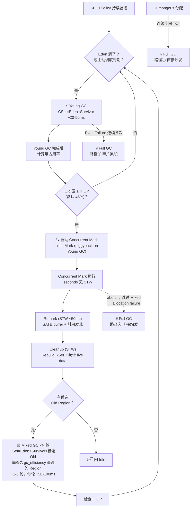

# 00-G1GC-Overview — G1 GC 全链路：一个对象从分配到消亡的全生命周期

> **生产场景切入**：
> ```
> $ java -Xms8g -Xmx8g -XX:+UseG1GC -Xlog:gc*=info:file=gc.log MyApp
> 
> # 故障现象：服务偶尔卡顿 2s，GC log 显示：
> [0.234s][info][gc] GC(0) Pause Young (Normal) (G1 Evacuation Pause) 8M->6M(8192M) 15.2ms
> [2.891s][info][gc] GC(1) Pause Young (Normal) 120M->32M(8192M) 22.3ms
> [5.123s][info][gc] GC(2) Pause Young (Concurrent Start) 480M->128M(8192M) 38.7ms
> [5.234s][info][gc] GC(3) Pause Remark 800M->780M(8192M) 42.1ms
> [5.567s][info][gc] GC(4) Pause Cleanup 780M->760M(8192M) 1.2ms
> [5.689s][info][gc] GC(5) Pause Mixed 760M->540M(8192M) 55.0ms
> [7.245s][info][gc] GC(6) Pause Young (Normal) 620M->128M(8192M) 28.1ms
> [8.901s][info][gc] GC(7) Pause Full (Allocation Failure) 5120M->4096M(8192M) 2147.0ms  ← 问题！
> ```
> 一个 2s Full GC 就能让 P99 延迟从 30ms 爆到 2s。本文解释所有这 8 条日志背后发生了什么——为什么有些 GC 只停 15ms，有些要停 2s。

> **元信息**
> - 标准环境：OpenJDK 11 slowdebug build，`-Xms8g -Xmx8g -XX:+UseG1GC -XX:MaxGCPauseMillis=200`，64 位 Linux x86，G1 Region 大小 = 4MB，共 2048 Regions
> - **阅读收益**：读完本文后能回答"一个对象从分配到回收在 G1 中经历的四阶段是什么？四种 GC 类型有什么区别（触发条件、大致耗时、解决了什么问题）？什么时候触发哪种 GC（含 Humongous 直接 Full GC 和 CM abort 两条隐藏路径）？G1 依赖哪些关键基础设施（Region、RSet、SATB、TLAB/PLAB、G1Policy/IHOP）？四种引用在什么时候被处理？Reference Processing 在 Young/Mixed GC 中为什么是 CSet 限定的？G1 和 Serial/Parallel/CMS/ZGC 的核心区别？"
> - **目标读者**：入门→进阶的 Java 开发者。不需要任何 GC 背景，每个术语第一次出现有一句话解释。
> - **阅读路径**：
>   - **入门**（本文就够了）→ `[01-HeapRegion]` → `[02-ObjectAllocation]` → `[03-YoungGC]` → `[06-ConcurrentMark-Core]`
>   - **进阶** → 续读 `[04-CardTable-RSet]` → `[05-SATB-Barrier]` → `[07-ConcurrentMark-Phases]` → `[08-MixedGC-Policy]`
>   - **专家** → 续读 `[09-FullGC]` → `[10-PLAB]` → `[11-Reference-Processing]`

---

## §〇 文档清单 + 阅读导航

本文是 G1 GC 文档集的**唯一全景导航**——它不是任何一篇已有文档的缩写，而是"序言 + 索引"。这里不展开实现细节，只说**每一步是什么、什么时候做、为什么需要它、在哪篇文档深挖**。

| # | 文档 | 一句话核心 | 入门？ |
|---|------|-----------|--------|
| **[01]** | `01-HeapRegion` | G1 最小回收单元：Region 432B 字段全景、状态机（Free→Eden→Survivor→Old→Free）、free_list、TAMS 双缓冲 | ✅ |
| **[02]** | `02-ObjectAllocation` | 对象分配五级降级链：TLAB bump → Eden CAS → Region 替换 → Young GC → Humongous 特殊路径 | ✅ |
| **[03]** | `03-YoungGC` | Young GC 四阶段：Pre-Evacuation → Evacuation → Post-Evacuation → Free CSet，含 work stealing | ✅ |
| **[06]** | `06-ConcurrentMark-Core` | 并发标记核心：SATB + Finger CAS + do_marking_step 四段走读 + MarkStack | ✅ |
| **[04]** | `04-CardTable-RSet` | CardTable（512B 粒度脏卡）+ RSet（三级：Sparse→Fine→Coarse）— Old→Young 反向索引 | 进阶 |
| **[05]** | `05-SATB-Barrier` | SATB 前屏障 + per-thread buffer → completed_buffers → 并发标记消费 | 进阶 |
| **[07]** | `07-ConcurrentMark-Phases` | CM 四阶段：Initial Mark → Concurrent Mark → Remark → Cleanup + Rebuild RSet | 进阶 |
| **[08]** | `08-MixedGC-Policy` | G1Policy 全局决策引擎 + IHOP + Mixed GC CSet 选策（gc_efficiency 排序） | 进阶 |
| **[09]** | `09-FullGC` | Full GC 触发链（三条路径）+ 四阶段 MPAC + 滑动压缩消除碎片 | 专家 |
| **[10]** | `10-PLAB` | GC worker 侧的 TLAB：三级降级分配 + PLABStats 自适应 + waste accounting | 专家 |
| **[11]** | `11-Reference-Processing` | 四种引用的 Discovery/Processing 两阶段 + 四 Phase 管线 + Young/Mixed/Full 差异 | 专家 |

> **建议顺序**：先读本文 → [01] → [02] → [03] → [06]，对 Young GC 和并发标记有感觉后，再按需翻阅进阶和专家文档。

---

## §一 ★ 全景 — 对象全生命周期

### 1.1 Mermaid 1：从 `new` 到 `free_list`

```mermaid
flowchart TD
    A["👤 Java 代码: new byte[1024]()"] --> B{对象大小 ≥ 2MB?}

    B -->|否 ~99.9%| C["TLAB bump-pointer 分配\n(~10 cycles, 无锁)"]
    C -->|成功| OBJ["✅ 对象出生在 Eden Region"]
    C -->|TLAB 满| D["Eden Region CAS bump\n(~100 cycles, 乐观重试)"]
    D -->|成功| OBJ
    D -->|Eden 满| E["换新 Region / 触发 Young GC"]
    E -->|有空间| OBJ

    B -->|是 ~0.1%| F["Humongous 分配: 连续 N 个 Region"]
    F -->|成功| OBJ_H["✅ 大对象在 Humongous Region"]
    F -->|失败| G["💀 直接触发 Full GC — 不经过 Young/Mixed"]
    G -.->|"Full GC 压缩后\n重试分配"| F

    OBJ --> BARRIER["🛡️ 运行时屏障（每次 obj.field = other）"]
    BARRIER --> CT["CardTable 写屏障: 标记脏卡 → RSet [04]"]
    BARRIER --> SATB["SATB 前屏障: 记录旧值 → CM 消费 [05]"]

    OBJ --> GC_CYCLE{"🔄 GC 周期触发？\n（由 G1Policy 决策 [08]）"}

    GC_CYCLE -->|Eden 满 or 主动调度| YGC["⚡ Young GC\nEden+Survivor → Evacuation\n~20-50ms [03]"]
    GC_CYCLE -->|Old 超过 IHOP(默认45%)| CM["🔍 Concurrent Mark\n后台找 Old 垃圾，无完整 STW\n~seconds 并发 + ~50ms Remark [06][07]"]
    CM --> CLEANUP{Cleanup: 有候选 Old Region?}
    CLEANUP -->|是| MIXED["🟡 Mixed GC ×N\nCSet=Eden+Survivor+精选 Old\n~50-100ms/次 [08]"]
    CLEANUP -->|否| IDLE["😴 回到 Idle"]

    GC_CYCLE -->|Humongous 失败\nCM abort\nEvac Failure 累积| FGC["💀 Full GC\n全堆 MPAC 四阶段 + 压缩\n~seconds STW [09]"]

    YGC --> RECLAIM_Y["♻️ CSet Region type → Free\n放回 free_list [01 §六][03 §五]"]
    MIXED --> RECLAIM_M["♻️ 同 Young GC\nOld Region 逐步回收 [08]"]
    FGC --> RECLAIM_F["♻️ 滑动压缩 → 连续大块空间\n完全重建 free_list [09]"]

    RECLAIM_Y --> FREE["🔄 Region 回到 free_list\n等待下一次分配"]
    RECLAIM_M --> FREE
    RECLAIM_F --> FREE
    FREE -.-> C
```

> **图例**：每条边上标注了对应的文档编号。蓝色路径 = 分配，橙色路径 = 运行时屏障，红色路径 = GC 周期，绿色路径 = 回收。

### 1.2 各阶段的时间量级

| 阶段 | 操作 | 耗时量级 | 阻塞应用？ |
|------|------|----------|-----------|
| TLAB 分配 | bump-pointer (pointer increment) | ~10 CPU cycles | 否 |
| Eden CAS 分配 | atomic CAS | ~100 cycles | 否（乐观，可能重试） |
| CardTable 写屏障 | 1 条 `OR` 指令标记脏卡 | ~10 cycles | 否 |
| SATB 前屏障 | 记录旧值到 per-thread buffer | ~50 cycles | 否 |
| Young GC | STW Evacuation → Free CSet | ~20-50ms | ✅ 是 |
| Mixed GC | CSet=Eden+Survivor+Old | ~50-100ms/次 | ✅ 是 |
| Concurrent Mark | 后台追踪对象图 | ~seconds | ❌ 否（应用运行中） |
| Remark (CM 阶段) | 处理 SATB buffer + 引用发现 | ~50ms | ✅ 是 |
| Full GC | 全堆标记 + 压缩 | ~seconds | ✅ 是 |

### 1.3 ★ 设计替代分析 ① — 如果 G1 不分 Region（单一块式堆）

假设堆是"一个整块"（像 Serial GC / Parallel GC 那样），G1 的**核心价值**——可预测停顿——当场消失：

| 维度 | 单一块式堆 | G1 分区堆 (Region) |
|------|-----------|-------------------|
| 回收单元 | 整个堆 | 选中的 CSet（Collection Set）|
| Pause Time ∝ | ∝ **堆大小**（8GB 全扫） | ∝ **CSet 内活对象量**（可动态缩小） |
| 碎片化 | 需全堆 compaction 消除 | 活对象复制到全新 Region，天然无碎片 |
| 并发标记 | 需要（但 CMS 证明块式也可以） | 配合 SATB + TAMS，快照不丢 |

**核心结论**：不分 Region，每次 Young GC 都要扫全堆 → pause time target 永远达不到。Region 把"堆有多大"和"每次 GC 做多少"解耦了。

---

## §二 ★★ 阶段 A：分配 — 对象怎么到达堆上

### ❓ 2.1 为什么 G1 需要 TLAB？没有 TLAB 会怎样？

**TLAB**（Thread-Local Allocation Buffer）= 每个线程在 Eden 中独占的一小块空间。线程在自己的 TLAB 内分配对象只需一次 pointer bump（~10 cycles），不需要任何锁。

**没有 TLAB**：所有线程共享 Eden 的 bump-pointer → 每次分配都需要 CAS 竞争（~100 cycles，且高并发下大量重试）→ 分配速度降 10 倍，GC 密集场景下吞吐量崩溃。

→ 深挖 TLAB 内部结构和 retire 机制：`[02-ObjectAllocation §二]`

### ❓ 2.2 为什么 TLAB 满了不直接 GC，还要试 Eden CAS？

**乐观重试**。TLAB 满了只说明"当前线程的 TLAB 用完了"，不说明"当前 Eden Region 也没空间了"——Eden Region 的 top 可能还有大量空闲。直接尝试 Eden CAS（绕过 TLAB，从 Region top 分配）：成功就省掉一次 Young GC 的全部 STW 开销，失败才说明 Eden 真满了。

```
TLAB bump 失败（线程内没空间了）
  → Eden Region CAS bump 成功 → 分配完成（省掉 GC）
  → Eden Region CAS bump 失败（Eden 真满了）→ 触发 Young GC
```

→ 完整降级链（5 级）：`[02-ObjectAllocation §三]`

### ❓ 2.3 Region 到底是什么？为什么 G1 选 4MB？

**Region** = G1 GC 的最小回收单元。每次 GC 不是回收"整个堆"，而是回收"选中的若干 Region"（CSet — Collection Set）。G1 把堆切成 ~2048 个 4MB 的 Region。

| Region 大小 | 8GB 堆的 Region 数 | 后果 |
|------------|-------------------|------|
| **1MB** | 8192 个 | Region 太多 → 扫描开销大、RSet 管理开销大 |
| **4MB** ✅ | 2048 个 | 折中：数量适中、碎片粒度可接受 |
| **16MB** | 512 个 | Region 太少 → 一个小对象浪费一整块，碎片严重 |

4MB 是时间开销和空间效率的折中。Region 有 5 种状态（Free / Eden / Survivor / Old / Humongous），**状态机**驱动了整个 G1 的分配和回收逻辑。

→ 完整 Region 字段（432B）和状态机：`[01-HeapRegion §二][01 §五]`

### 2.4 TLAB vs PLAB：Mutator 侧 vs GC 侧的对偶结构

| 维度 | TLAB [02] | PLAB [10] |
|------|----------|----------|
| 使用者 | **Mutator**（应用线程） | **GC Worker**（GC 线程） |
| 分配对象 | `new` 创建的新对象 | **复制**活对象到 Survivor/Old |
| 内存来源 | 当前 Eden Region | 目标 Survivor / Old Region |
| 锁策略 | 无锁 bump | 无锁 bump（并发 write barrier 保护） |
| 失败降级 | Eden CAS → 换 Region → GC | CAS 分配直连 → new PLAB → Evac Failure → promotion failure |

→ TLAB：`[02-ObjectAllocation]` | PLAB：`[10-PLAB]`

### 2.5 ★ Humongous 分配：绕过 Young/Mixed，直达 Full GC

**Humongous 对象** = 大小 ≥ Region 一半（默认 2MB）的对象。需要**连续 N 个 Region** 存储。关键路径：

```
申请连续 N 个 Free Region
  → 有 → 分配成功，标记为 Humongous starts + Humongous continues
  → 无 → ★ 直接触发 Full GC（不经过 Young GC，不经过 Mixed GC，不经过 CM）
```

这是 G1 最危险的一条 Full GC 触发路径——**一个大 `byte[3MB]` 可以让 G1 跳过所有优化直接进入秒级 STW**。

**为什么 Humongous 对象不参与 Evacuation（复制）？** → 复制 3MB 对象的成本（拷贝 + 更新所有引用）远超常规对象，不划算。Humongous 对象直接分配在 Old Region 中（跳过 Eden），回收方式不是 Evacuation 而是 **in-place deallocation**：当对象变得不可达后，CM Cleanup 阶段直接将其所有 Region 标为 Free——不需要复制，一步到位。

→ Humongous 分配的完整触发链：`[02-ObjectAllocation §八]` + Full GC 的三条触发路径：`[09-FullGC §一]`

---

## §三 ★★ 阶段 B：运行时屏障 — GC 基础设施在暗中铺路

### ❓ 每次 `obj.field = other`，JVM 额外做了什么？

两件事——为未来的 GC 同时铺两条路：

```
obj.field = other;
// ↓ JIT 编译器插入的屏障代码 ↓
// ① CardTable 写屏障：标记 obj 所在的卡为"脏"
card_table->dirty_card_for(obj);
// ② SATB 前屏障：如果并发标记在进行中，记录 old_value
if (SATB_active) satb_enqueue(old_value);
```

### 3.1 CardTable 写屏障：为 RSet 提供"脏卡"数据源

**Card** = 堆内存的 512 字节单元。**CardTable** = 一个 byte 数组（不是 bitmap！），第 i 项表示第 i 张 Card 是否有 inter-region 引用更新。为什么用 byte 而非 bit？→ `mark_dirty` 只需一条 `MOV` 指令写 0，bitmap 需要 read-modify-write（先读→位运算→写回），屏障的热路径上每条指令都算钱。

- **什么时候激活**：**始终激活**（只要 G1 在运行）
- **为什么需要**：没有 CardTable，RSet（Remembered Set）无法增量更新——每次 GC 都要全堆扫描找 Old→Young 跨区引用
- **谁消费脏卡**：Young GC 的 Redirty 阶段、CM Rebuild RSet 阶段

→ CardTable 结构 + RSet 三级设计：`[04-CardTable-RSet §二][04 §三]`

### 3.2 SATB 前屏障：为并发标记提供"逻辑快照"

**SATB**（Snapshot-At-The-Beginning）= 在并发标记开始前拍下**逻辑快照**。规则：标记开始时活的对象，即使标记过程中引用被修改，它仍然算"活"。

实现：每次 `obj.field = other` 前，把 `old_value` 记录到 per-thread SATB buffer。并发标记线程消费这些 buffer，追踪 old_value 引用的对象。

- **什么时候激活**：仅在**并发标记期间**激活（为什么？→ 省无关开销，非 CM 期间大多数引用更新不需要记录历史值）
- **为什么不能关掉**：CM 期间如果 SATB 关了，`obj.field = null` 后 old_value 没被标记 → 活对象被当垃圾回收

→ SATB buffer 的完整生命周期：`[05-SATB-Barrier §三]` | 并发标记消费 SATB：`[06-ConcurrentMark-Core §四]`

### 3.3 两套屏障的激活窗口对比

| 屏障 | 激活条件 | 作用 | 读方 | 无此屏障的后果 |
|------|---------|------|------|--------------|
| **CardTable** | 始终激活 | 记录脏卡 → RSet 增量更新 | Young/Mixed GC | 每次 GC 都要全堆扫描 |
| **SATB 前屏障** | 仅 CM 期间 | 记录旧值 → CM 增量标记 | Concurrent Mark | 漏标活对象 → 回收错误 |

### ❓ 3.4 为什么 G1 用 SATB 而不是 CMS 那种 incremental update？

这是 G1 与 CMS 最根本的设计分歧，也是面试高频问题：

| 策略 | 代表 GC | 屏障记录什么 | 优点 | 代价 |
|------|---------|------------|------|------|
| **SATB** | G1 | `old_value`（被覆盖前的值） | ★ 绝不漏标活对象（安全） | floating garbage — 标记开始后变垃圾的对象被多留一轮 |
| **Incremental Update** | CMS | `new_value`（新写入的值） | floating garbage 更少 | 并发清理时引用变更可能漏标 → 需要 remark 阶段的 mod-union table 重新扫描 |

**为什么 G1 选择了"宁可多留一轮、绝不漏标一个"？** → G1 的设计目标是有界的 pause time。SATB 的 floating garbage 在下一轮 Mixed GC 就会被回收（不影响最终回收），但漏标活对象会导致 JVM crash。在这个 tradeoff 上，安全压倒精确。

→ SATB 完整协议：`[05-SATB-Barrier §二]` | CMS 对比：`[06-ConcurrentMark-Core §一]`

---

## §四 ★★★ 阶段 C：GC 周期 — 四种 GC 的全景对比

### ❓ G1 怎么决定做 Young GC、Mixed GC 还是 Full GC？

**G1Policy** 是 G1 的全局决策引擎。它维护一个状态机，根据堆占用率（IHOP）、Eden 分配速率、pause time target 实时选择路径。

### 4.1 Mermaid 2：GC 类型决策树



> **关键观察**：三路 Full GC 触发条件——① Humongous 失败（直接触发，绕过 YG/CM）；② CM abort（间接触发：abort → 跳过一个 Mixed 周期 → 最终 allocation failure）；③ Evacuation Failure 连续多次（碎片累积 → G1Policy 判兜底）。后两条不是"立即"触发，而是退出了优化路径后的必然结果。

### 4.2 Young GC：快速常规回收

- **触发**：Eden 填满返回失败，或 G1Policy 基于 pause time target **主动调度**
- **核心操作**：Evacuation（复制）——把 Eden + Survivor 中的活对象复制到 Survivor / Old Region，然后整个 Eden 清空
- **CSet** = 所有 Eden Region + 当前 Survivor Region（不含 Old）
- **时间**：~20-50ms STW
- **依赖**：RSet（Old→Young 引用快速定位）、CardTable（RSet 数据源）、TLAB/PLAB（分配新位置）
- → 完整走读：`[03-YoungGC §三]`

### 4.3 Concurrent Mark（CM）：后台找 Old 垃圾

- **触发**：Old 区占用超过 **IHOP**（Initiating Heap Occupancy Percent，默认 45%）
- **核心操作**：并发追踪对象图，标记 Old 区哪些是活对象（基于 SATB 快照），产生 bitmap
- **四阶段**：
  - Initial Mark（STW, piggyback on Young GC）：标记 GC Roots
  - Concurrent Mark（并发）：do_marking_step 追踪对象图
  - Remark（STW ~50ms）：处理 SATB buffer 中的残留 + 发现引用
  - Cleanup（STW）：**Rebuild RSet**（消费 CM 期间积压的所有脏卡→把 CardTable 增量转换成 RSet 精确索引）+ 统计各 Region live data，确定哪些 Old Region 值得回收
- **为谁服务**：为 Mixed GC 提供"哪些 Old Region 值得回收"的数据
- → 并发标记核心：`[06-ConcurrentMark-Core]` | 四阶段时序：`[07-ConcurrentMark-Phases]`

### 4.4 Mixed GC：Old 区分批回收

- **触发**：CM Cleanup 发现有可回收的 Old Region
- **核心操作**：CSet = 所有 Eden + 当前 Survivor + **精选 Old Region**（按 `gc_efficiency = garbage_bytes / predicted_time` 排序——"每毫秒 STW 能回收多少垃圾"，值越大越优先）
- **分轮执行**：不是一轮回收所有 Old，而是 1-8 轮分批（每轮挑效率最高的几个）。为什么分批？→ 每轮 pause time 不能超 `MaxGCPauseMillis`
- **时间**：每轮 ~50-100ms
- **为什么需要 gc_efficiency 排序**：如果 CSet 只能放 20 个 Old Region，必须挑"活对象最少、回收空间最大"的那 20 个，否则 STW 花在复制活对象上毫无回报
- → Mixed GC CSet 选策：`[08-MixedGC-Policy §四]`

### 4.5 Full GC：保底全堆压缩

- **触发**（三条路径）：
  1. **Humongous 分配失败**（找不到连续 N 个 Free Region）→ 不经过 YG/Mixed
  2. **CM abort**（并发标记异常终止）→ 标记信息丢失，只能全堆重建
  3. **Evacuation Failure 连续多次**（GC 过程中 to-space 不够，多次发生）→ 告诉 G1Policy 堆碎片化严重
- **核心操作**：MPAC 四阶段——Mark → Prepare → Adjust Pointers → Compact（滑动压缩）
- **时间**：~seconds STW（无法设定 pause time target）
- **为什么保底**：当所有优化都失败时，用全堆压缩消除碎片、重建 free_list
- → Full GC 完整触发链 + MPAC 四阶段：`[09-FullGC §一][09 §三]`

### 4.6 四种 GC 对比总表

| 维度 | Young GC | Mixed GC | Concurrent Mark | Full GC |
|------|----------|----------|----------------|---------|
| **触发条件** | Eden 满 / Policy 主动调度 | CM Cleanup 后有候选 Old Region | Old ≥ IHOP (45%) | Humongous 失败(直接) / CM abort(间接) / Evac Failure 连续多次 |
| **CSet 内容** | Eden + Survivor | Eden + Survivor + 精选 Old | N/A（不回收，只标记） | 全堆 |
| **STW 时间** | ~20-50ms | ~50-100ms/轮 | 仅 Remark(~50ms) | ~seconds |
| **依赖 RSet？** | ✅ 必须（Old→Young 引用） | ✅ 必须 | ❌ 不依赖 | ❌ 全堆扫描 |
| **依赖 SATB？** | ❌ | ❌ | ✅ 必须（快照一致性） | ❌ 全堆 STW 标记 |
| **依赖 TAMS？** | ❌ | ❌ | ✅ 必须（并发判活） | ❌ |
| **回收策略** | Evacuation（复制） | Evacuation（复制+选Old） | 不回收（只标记） | Compaction（滑动压缩） |
| **引用发现范围** | CSet 内 | CSet 内 | 全堆 | 全堆 |
| **消除碎片？** | ✅（复制天然紧凑） | ✅（复制天然紧凑） | N/A | ✅（压缩排列） |

### 4.7 ★ 设计替代分析 ② — 如果每次 GC 都做 Compaction（像 Full GC）

假设 G1 不做 Evacuation，每次 Young GC 也用 Compaction（滑动压缩）会怎样？

| 维度 | Evacuation（G1 实际） | Compaction（假设） |
|------|----------------------|-------------------|
| 活对象扫描 | 只扫描 Eden（90%+ 垃圾，只关心活的那 10%） | 扫描整堆（全堆标记） |
| STW ∝ | ∝ **活对象量**（很少） | ∝ **堆大小**（8GB 全扫） |
| 碎片 | 复制天然紧凑，无碎片 | 压缩也紧凑 |
| pause time target | 可达（控制 CSet 大小） | 不可达（每次都要全堆） |

**核心结论**：Compaction 是紧急灭火器（碎片化严重时才用），不是日常工具。Evacuation 利用"大多数新对象很快死亡"的假设（弱分代假说），只处理少量活对象，把 STW 控制在毫秒级。

---

## §五 ★ 阶段 C 内嵌：Reference Processing — GC 扫描引用

### ❓ GC 怎么处理 Soft/Weak/Final/Phantom 引用？

G1 的所有 GC 类型共享同一套引用处理管线 `process_discovered_references()`，但**发现范围不同**：
- **Young/Mixed GC**：只扫描 CSet → 只有 CSet 内扫描到的 Reference 对象被 discovered。Old 区的 Reference（它的 referent 指向 CSet 中的垃圾）不在本次扫描范围内——留到 Mixed GC 扫 Old 时才处理。
- **Full GC**：全堆扫描 → 发现全堆 Reference

**四 Phase 管线**（硬依赖顺序，不可调换）：
1. Phase 1: Soft Reference → 内存够就不清除，不够就清除
2. Phase 2: Weak Reference → 一律清除（只要只有 weak referent）
3. Phase 3: Final Reference → 活对象入 finalizer 队列
4. Phase 4: Phantom Reference → 幽灵引用，referent 已被回收

**为什么不能边发现边处理？** → 并行 scanning 的硬约束：多个 GC worker 同时扫描 CSet，发现是并行的——必须等所有 worker 完成 discovery 后，才能统一处理。

→ 四 Phase 管线的完整走读 + Strongly Reachable 判定：`[11-Reference-Processing §四]`

---

## §六 ★ 阶段 D：回收 — Region 回到 free_list

### ❓ GC 完成后，Region 去了哪里？

**Young/Mixed GC 回收**（`remove_all_from_collection_set()`）：
1. CSet 中每个 Region 的 `_type` 清为 Free
2. 插入 `_free_list`（有序双向链表）
3. Region 内数据不清零（下次分配时覆盖）→ 分配侧只需 bump-pointer，不需要清零

**Full GC 回收**：
1. 活对象通过**滑动压缩**（sliding compaction）紧凑排列到堆底部
2. 堆顶部形成连续的大块空闲空间 → **完全重建** free_list
3. 效果：碎片被彻底消除

### ❓ 为什么 Full GC 后堆碎片被消除？

滑动压缩 = 所有活对象按地址顺序"滑"到堆底挤在一起。举例：

```
压缩前：Region 0 [A  _  _  _]  Region 1 [_  B  _]  Region 2 [C  _  _  _]
压缩后：Region 0 [A  B  C  _]  Region 1 [_  _  _  _]  Region 2 [_  _  _  _]
                                 ↑ 连续空闲，可分配 Humongous
```

→ free_list 结构：`[01-HeapRegion §六]` | Full GC 压缩算法：`[09-FullGC §四]`

---

## §七 ★ 面试视角 + 全景总结

### ❓ "请简要介绍 G1 GC" — 30 秒版 / 2 分钟版

**30 秒版**：
> G1 把堆切成 ~2048 个 4MB 的 Region——这是它与 Parallel/CMS 的根本分水岭。分配用 TLAB 无锁 bump-pointer。每次 GC 只回收选中的 Region（CSet），而不是整个堆——所以 **pause time ∝ CSet live data，不是 ∝ heap size**。Young GC 做 Evacuation 复制活对象（~20ms），Old 区满了先用并发标记后台找垃圾（无 STW），再用 Mixed GC 分批回收。万不得已才做 Full GC 全堆压缩（~seconds）。

**2 分钟版**（在上述基础上展开）：
> G1 的四个关键基础设施：① Region — 最小回收单元，5 种状态；② RSet — "哪个 Old Region 引用了这个 Young Region" 的反向索引，避免全堆扫描；③ SATB — 并发标记的逻辑快照，保证标记期间不丢活对象；④ CardTable — 512B 粒度的脏卡标记，驱动 RSet 增量更新。
>
> 四种 GC：Young GC（~20-50ms, CSet=Eden+Survivor）、Mixed GC（~50-100ms, CSet+精选 Old, 靠 gc_efficiency 排序选高回收价值的 Region）、Concurrent Mark（后台运行，不 STW，只为 Mixed GC 提供"哪里值得回收"的数据）、Full GC（保底，三条路径：Humongous 分配失败 / CM abort 间接触发 / Evac Failure 连续多次）。
>
> 四种引用按 Soft→Weak→Final→Phantom 顺序处理。Young/Mixed 只发现 CSet 内的 Reference；Full GC 全堆发现。

### 面试问题 7 题

**1. G1 和 Serial/Parallel/CMS/ZGC 的核心区别？**

| GC | 分代 | 并发 | 回收策略 | pause time |
|----|------|------|---------|------------|
| Serial | 分代 | ❌ | 复制+标记压缩 | ∝ heap size |
| Parallel | 分代 | ❌ | 复制+标记压缩（并行） | ∝ heap size |
| CMS | 分代 | ✅ Old 并发 | Old 标记清除 → 碎片累积 → promotion failure → 退化为 Serial Old 全堆压缩 | 好时 ~ms，退化时 ~seconds |
| **G1** | **逻辑分代** | ✅ | **Region 分区+Evacuation+Mixed** | **∝ CSet live data** |
| ZGC | 不分代 | ✅ 全并发 | 染色指针+重定向 | <1ms（追求） |

**2. G1 怎么实现可预测停顿？pause time target 怎么起作用？**

Region 把堆切成 ~2048 块。G1Policy 根据 pause time target 动态计算本次 GC 最多回收多少 Region（`_young_list_target_length`）。如果预估耗时超标，就缩小 CSet。这是"先发制人"的主动调度：不等 Eden 耗空才 GC，而是在"下次 GC 预计超标"前主动触发。

→ `[08-MixedGC-Policy §三]`

**3. 什么情况下 G1 降级到 Full GC？三条触发路径分别是什么？**

① **Humongous 分配失败**：找不到连续 N 个 Free Region → 直接 Full GC（绕过 YG/Mixed）
② **CM abort**：并发标记异常终止（如 application 分配速率 > CM 进度）→ 标记数据丢失 → 跳过一个 Mixed GC 周期 → Old 持续堆积 → 最终 allocation failure 触发 Full GC
③ **Evacuation Failure 连续多次**：GC 过程中 to-space 不够 → 堆碎片化，G1Policy 决定做 Full GC

**4. Concurrent Mark abort 后会发生什么？**

CM abort → 标记 bitmap 不可信 → 无法识别"哪些 Old Region 值得回收" → 跳过一个 Mixed GC 周期 → 如果堆持续增长，最终触发 Full GC（路径②）。

→ `[06-ConcurrentMark-Core §七]`

**5. IHOP 调低了/调高了分别什么后果？**

- **IHOP 太低**（如 20%）：Old 区还有大量空间就启动 CM → CM 频繁但找不到可回收的 Old Region（空转）→ CPU 浪费
- **IHOP 太高**（如 70%）：Old 区接近满时才启动 CM → CM 来不及完成就 allocation failure → 直接 Full GC
- **默认 45%** 是经验值：给并发标记留出足够时间，同时不频繁触发

→ `[08-MixedGC-Policy §二]`

**6. Young GC 和 Mixed GC 在执行流程上有什么相同和不同？**

| 维度 | Young GC | Mixed GC |
|------|----------|----------|
| 流程结构 | Pre-Evac → Evacuation → Post-Evac → Free CSet | **完全相同** |
| CSet 内容 | Eden + Survivor | Eden + Survivor + **Old Region** |
| CSet 选择 | 所有 Eden/Survivor（固定） | Old Region 按 gc_efficiency 排序选 |
| 轮数 | 1 轮 | 1-8 轮分批 |

→ Young GC 流程：`[03-YoungGC]` | Mixed GC 选策：`[08-MixedGC-Policy §四]`

**7. G1 的两套写屏障（CardTable + SATB）各有什么用？为什么需要两套？**

| 屏障 | 目标 | 读者 |
|------|------|------|
| CardTable | RSet 增量更新 | Young/Mixed GC 的 Evacuation |
| SATB | 并发标记的逻辑快照 | Concurrent Mark 的对象图追踪 |

**为什么需要两套？** 因为它们服务于两个完全不同的 GC 阶段，激活窗口不同。CardTable 始终激活（每次引用更新都可能影响 RSet），SATB 只在 CM 期间激活（省无关开销）。一个标记"在哪里改了"（空间），一个记录"改之前是什么"（时间），缺一不可。

### 一句话总结

> G1 GC = Region 分区堆 + TLAB 无锁分配 + CardTable+RSet 反向索引 + SATB 并发快照 + G1Policy 自适应调度 + Evacuation 消除碎片 + Full GC 保底压缩。核心创新：**pause time ∝ CSet live data, not ∝ heap size**。

---

### 📚 附录：11 篇深度文档快速导航

| 文档 | 关键看什么 | 适合谁 |
|------|-----------|--------|
| [01] HeapRegion | Region 432B 字段全景、状态机 Free→Eden→Survivor→Old→Free | 所有人 |
| [02] ObjectAllocation | TLAB bump → Eden CAS → Humongous 五级降级链 | 所有人 |
| [03] YoungGC | 四阶段 Evacuation、work stealing、CAS forwarding | 所有人 |
| [06] ConcurrentMark-Core | do_marking_step、Finger CAS、MarkStack、SATB 消费 | 所有人 |
| [04] CardTable-RSet | Card 512B、RSet Sparse→Fine→Coarse 三级设计 | 进阶 |
| [05] SATB-Barrier | SATB buffer 生命周期、per-thread → global → CM | 进阶 |
| [07] CM-Phases | Initial Mark → Remark → Cleanup → Rebuild RSet 时序 | 进阶 |
| [08] MixedGC-Policy | G1Policy 状态机、IHOP 自适应、gc_efficiency 排序 | 进阶 |
| [09] FullGC | 三条触发链、MPAC 四阶段、滑动压缩 | 专家 |
| [10] PLAB | GC worker 侧 TLAB、waste accounting、自适应 | 专家 |
| [11] Reference-Processing | 四种引用四 Phase 管线、Discovery/Processing 分离 | 专家 |

---

> **可证伪断言 + GDB 验证**（读完本文应能验证/推翻）：
> 
> ```gdb
> # 断言 1: Region 大小 = 4MB（8GB堆）
> (gdb) p/x HeapRegion::GrainBytes
> $1 = 0x400000       # 4194304 = 4MB
> (gdb) p HeapRegion::GrainBytes >> 20
> $2 = 4              # 4 MB per Region
> (gdb) p _g1h->_num_regions
> $3 = 2048           # 8GB / 4MB = 2048
> 
> # 断言 2: pause time ∝ CSet live data，不是 ∝ heap size
> (gdb) b G1Policy::record_collection_pause_end
> (gdb) c
> # Young GC 后检查：
> (gdb) p _collection_set->young_region_length()
> $4 = 48             # CSet 只有 48 个 Region (~192MB) — 不是 2048
> (gdb) p _analytics->recent_gc_times_ms
> $5 = {21.3, 18.7, 25.1, ...}  # ~20-30ms，不随 8GB 堆大小变化
> 
> # 断言 3: IHOP 默认 45% → CM 在 Old 占 45% 时触发
> (gdb) p InitiatingHeapOccupancyPercent
> $6 = 45
> (gdb) b G1ConcurrentMarkThread::sleep_before_next_cycle
> # 断点触发时检查：
> (gdb) p G1CollectedHeap::heap()->old_set()->used_bytes()
> $7 = 3879731200     # ~3.6GB = 8GB × 45%
> 
> # 断言 4: Humongous ≥ 2MB
> (gdb) p HeapRegion::GrainWords / 2
> $8 = 262144         # = 2MB / 8 bytes-per-word = 262144 words
> (gdb) p G1CollectedHeap::is_humongous(262144)
> $9 = true           # =GrainWords/2 → Humongous
> (gdb) p G1CollectedHeap::is_humongous(262143)
> $10 = false         # <GrainWords/2 → Normal
> 
> # 断言 5: Full GC 三路径 — Humongous failure 可观测
> (gdb) b G1FullCollector::collect
> (gdb) c
> (gdb) p _heap->_gc_cause
> $11 = GCCause::_g1_humongous_allocation  # 路径①: Humongous 分配失败
> # 也可见: GCCause::_g1_inc_collection_pause → 路径②/③: CM abort/Evac failure
> 
> # 断言 6: RSet 替代全堆扫描 — 扫描量对比
> (gdb) b G1RemSet::oops_into_collection_set_do
> (gdb) c
> # 在 oops_into_cset_do 入口检查 CSet Region 数:
> (gdb) p _scan_state->_collection_set->young_region_length()
> $12 = 48            # 只扫 48 Region 的 RSet，而非 2048 Region 的全堆
> (gdb) p _scan_state->_collection_set->old_region_length()
> $13 = 0             # Young GC 不扫 Old Region
> 
> # 断言 7: TLAB 无锁分配 ~10 cycles
> (gdb) b MemAllocator::allocate_inside_tlab
> # 进入时检查 TLAB 可用空间:
> (gdb) p thread->tlab().free()
> $14 = 98304         # ~96KB 剩余 → bump pointer 直接成功，无需 CAS
> (gdb) p/x thread->tlab()._top
> $15 = 0x7fffbc012000
> # 分配后 _top 前进了 object_size（约 64-256 bytes，即 8-32 words）
> ```
