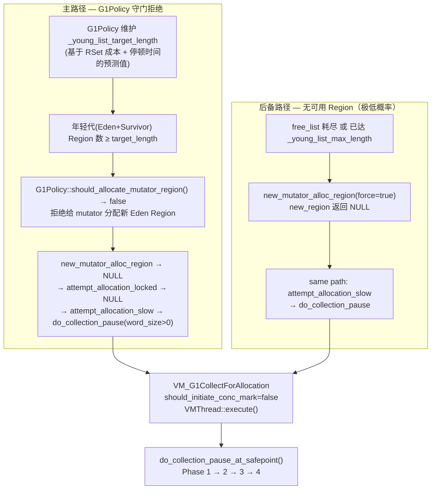
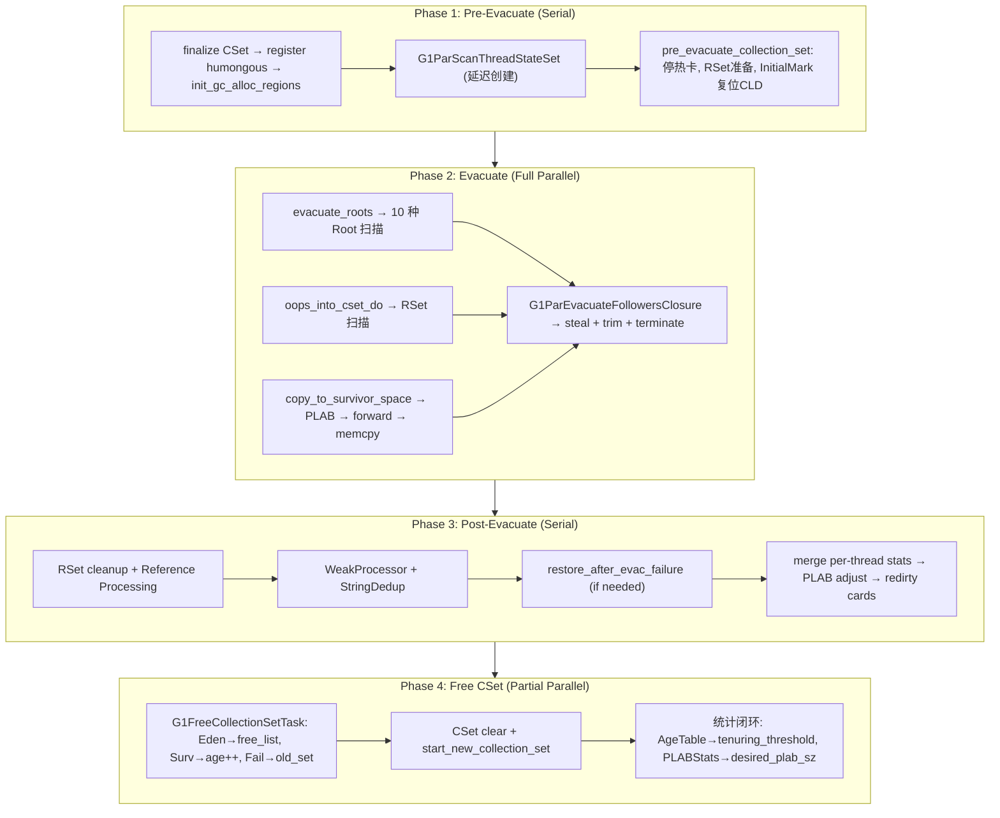
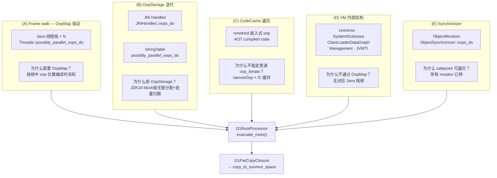
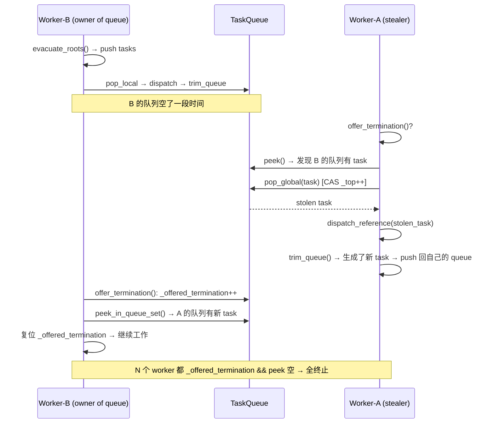

# 03-YoungGC — G1 Young GC：从 G1Policy 守门拒绝到 Free CSet 的全链路

> **标准环境**：OpenJDK 11 slowdebug build | `-Xms8g -Xmx8g -XX:+UseG1GC` | 64-bit Linux x86  
> **G1 Region**：4MB，2048 Regions | `GrainWords = 524288` | 13 GC workers  
> **前置依赖**：`[01-HeapRegion]`（Region 字段 + TAMS + free_list）+ `[02-ObjectAllocation]`（分配五级降级 + 两条触发路径）+ `[10-PLAB]`（GC worker 侧的 TLAB）  
> **阅读收益**：读完本文后能回答"G1 Young GC 为什么是先发制人的主动调度而非被动应急响应？从 G1Policy 决策到 Free CSet 的全链路每一步在做什么、为什么是这个顺序？"

---

## §〇 源文件清单

| # | 文件 | 模块 | 核心函数/类 | 本文角色 |
|---|------|------|------------|---------|
| 1 | `g1CollectedHeap.cpp` | gc/g1 | `do_collection_pause_at_safepoint()`(L3639), `do_collection_pause()`(L3335), `collect()`(L2820), `attempt_allocation_slow()`(L431) | ★★★ GC 入口 + 四阶段调度 |
| 2 | `g1CollectedHeap.hpp` | gc/g1 | `do_collection_pause()` 声明, `RefToScanQueue` typedef(L98), `G1ParEvacuateFollowersClosure`(L1451) | ★★★ 类声明 |
| 3 | `g1ParScanThreadState.cpp` | gc/g1 | `copy_to_survivor_space()`(L231), `handle_evacuation_failure_par()`(L380) | ★★★ 疏散核心逻辑 |
| 4 | `g1ParScanThreadState.hpp` | gc/g1 | `class G1ParScanThreadState`(L45), `_plab_allocator`(L52), `_age_table`(L54) | ★★★ per-worker 状态定义 |
| 5 | `g1ParScanThreadState.inline.hpp` | gc/g1 | `do_oop_evac()`(L33), `steal_and_trim_queue()`(L141), `trim_queue_to_threshold()`(L162) | ★★ 内联 fast path |
| 6 | `g1RootProcessor.hpp/cpp` | gc/g1 | `evacuate_roots()`(L80), `process_java_roots()`(L224), `process_vm_roots()`(L246) | ★★★ 10 种 Root 扫描调度 |
| 7 | `vm_operations_g1.hpp/cpp` | gc/g1 | `VM_G1CollectForAllocation::doit()`(L78) | ★★ VM Operation 封装 |
| 8 | `taskqueue.hpp` | gc/shared | `GenericTaskQueue`, `StarTask`(L518), `OverflowTaskQueue`(L329), `ParallelTaskTerminator`(L447) | ★★★ TaskQueue + Work Stealing |
| 9 | `g1Policy.hpp/cpp` | gc/g1 | `_young_list_target_length`(L82), `_young_list_max_length`(L87), `update_young_list_target_length()`(L270), `should_allocate_mutator_region()`(L976) | ★★ Young GC 触发决策 |
| 10 | `g1EvacFailure.hpp/cpp` | gc/g1 | `G1ParRemoveSelfForwardPtrsTask`(L254) | ★★ Evacuation Failure 处理 |
| 11 | `ageTable.hpp/cpp` | gc/shared | `AgeTable`, `compute_tenuring_threshold()`(L79) | ★★ 晋升阈值计算 |
| 12 | `survRateGroup.hpp` | gc/g1 | `SurvRateGroup`, `accum_surv_rate_pred()` | ★ 存活率预测 |
| 13 | `g1OopClosures.inline.hpp` | gc/g1 | `G1ParCopyClosure::do_oop_work()`(L255) | ★★ 复制闭包 |
| 14 | `plab.hpp` | gc/shared | `PLAB` 结构 | ★ GC worker 侧分配接口（深挖在 `[10-PLAB]`） |

> 行号来自 grep 搜索验证，实际位置可能因插桩宏和 `#ifdef ASSERT` 偏移 ±5 行。

---

## §一 ★ 全景 — Young GC 何时触发？两条路径

### ❓ Young GC 什么时候触发？正确的回答是什么？（★ 本文第一问，必须和修正后的 02 一致）

**G1 的 Young GC 有两条触发路径，而非只有"Eden 耗空"一个原因。**

#### 主路径 — G1Policy 主动调度

G1Policy 维护 `_young_list_target_length` 字段（见 `g1Policy.hpp:82`）——当前年轻代应该有多少个 Region。这个值由 `G1Policy::update_young_list_target_length()`（`g1Policy.cpp:270`）动态计算：

```cpp
// g1Policy.cpp:270-281
uint G1Policy::update_young_list_target_length(size_t rs_lengths) {
  YoungTargetLengths young_lengths = young_list_target_lengths(rs_lengths);
  _young_list_target_length = young_lengths.first;
  // ... logging ...
  return young_lengths.second; // unbounded length
}
```

其计算逻辑（`g1Policy.cpp:283-338`）综合考虑：
- **Survivor Region 数量**：`base_min_length = survivor_regions_count()` —— 这 N 个 survivor 已经占据着年轻代
- **RSet 扫描成本**（预测）：`rs_lengths` —— RSet 越大，扫描越慢 → CPU 越不够用 → 减少年轻代大小来压低停顿时间
- **停顿时间目标**：`MaxGCPauseMillis`（默认 200ms）—— `calculate_young_list_target_length()` 用 `predict_will_fit()` 反推"给定的 200ms 内能扫多少 Eden + RSet"
- **空闲 Region 储备**：`_free_regions_at_end_of_collection - _reserve_regions` —— 必须留够空闲 Region（用于 Humongous 分配和晋升）

最终的 bounded 值：`G1NewSizePercent`（默认 5% = 约 102 个 Region）≤ `_young_list_target_length` ≤ `G1MaxNewSizePercent`（默认 60% = 约 1228 个 Region）。

**❓ G1Policy 如何实现"先发制人"？它主动调用 `collect()` 吗？**

不。G1Policy **不调用任何 GC 方法**——它只是一个**分配级别的守门员（Gatekeeper）**。当年轻代（Eden+Survivor）Region 数达到 `_young_list_target_length` 时，G1Policy 的 `should_allocate_mutator_region()` 返回 `false`——它 **拒绝** 给 mutator 分配新的 Eden Region。这个拒绝迫使 mutator 的分配路径进入 `attempt_allocation_slow` → 触发 GC。

完整调用链（`g1Policy.cpp:976-980` → `g1CollectedHeap.cpp:5837-5854` → `g1CollectedHeap.cpp:431-488`）：

```
G1Policy::should_allocate_mutator_region()
  → young_list_length >= _young_list_target_length → return false
  → G1CollectedHeap::new_mutator_alloc_region(force=false)
    → should_allocate==false → 不拿新 Region → return NULL
    → G1AllocRegion::attempt_allocation_locked() → return NULL
      → G1CollectedHeap::attempt_allocation_slow(word_size)
        → do_collection_pause(word_size, gc_count_before, &succeeded, GCCause::_g1_inc_collection_pause)
          → VM_G1CollectForAllocation(should_initiate_conc_mark=false)
            → VMThread::execute() → doit() → do_collection_pause_at_safepoint()
```

**这是在堆还远未耗尽时先发制人的 GC——但触发方式不是"policy 主动调度"，而是"policy 拒绝分发 Eden → 分配失败 → 触发 GC"。** 这是**阻塞式 Gatekeeping**，不是主动调度式。

> `G1CollectedHeap::collect(GCCause)` 只在 System.gc()、JVMTI、whitebox testing 等外部触发时调用，**不参与**正常的 Young GC 触发路径。验证：grep `collect()` 调用方，在 g1/ 目录下仅有 `g1ConcurrentMarkThread.cpp:242` 一处（whitebox testing）。

**❓ 为什么用"拒绝分配"机制而不是"主动调度 GC"？**

两种设计：
- 主动调度：G1Policy 检测到达到目标 → 通知 VMThread 做 GC。需要额外的线程间通信（policy 跑在 mutator 线程上，通知需要跨线程），且"检测到达到目标"本身是在 mutator 分配代码中（持有 Heap_lock）——如果在锁内做 GC，死锁。
- 拒绝分配：G1Policy 只是 `return false`（~5 cycles），让正常的分配失败路径自然流到 GC。不需要跨线程通知，不需要在锁内调度。**把"决策点"（该不该 GC）和"执行点"（do_collection_pause）解耦，用 NULL 返回值作为信号传播。**

> 如果你面试被问"G1 Young GC 什么时候触发"，回答"G1Policy 主动调度 GC"而不是"G1Policy 通过拒绝分配来迫使 GC 发生"，面试官可能会追问"那 policy 怎么通知 VMThread？"——此时你才能展现对机制的深层理解。

#### 后备路径 — 真正无可用 Region

当 free_list 耗尽（堆已满）或年轻代已达 `_young_list_max_length` 时，即使 `force=true`（绕过 `should_allocate_mutator_region` 检查），`new_region()` 也返回 NULL → 同样进入 `attempt_allocation_slow` → `do_collection_pause`。

两条路径走同一个 `attempt_allocation_slow` 代码——区别只在于 `_allocator->attempt_allocation_locked` 失败的**根因**是 policy 拒绝还是物理无 Region：

```cpp
// g1CollectedHeap.cpp:431-550
HeapWord* G1CollectedHeap::attempt_allocation_slow(size_t word_size) {
  for (uint try_count = 1; ; try_count += 1) {
    {
      MutexLockerEx x(Heap_lock);
      result = _allocator->attempt_allocation_locked(word_size);
      // ★ 此处失败可能是：
      //   (a) should_allocate_mutator_region()==false → "年轻人已经够了，不给了"
      //   (b) new_region()==NULL → "确实没有空闲 Region 了"
      if (result != NULL) return result;
      should_try_gc = !GCLocker::needs_gc();
      gc_count_before = total_collections();
    }
    if (should_try_gc) {
      bool succeeded;
      result = do_collection_pause(word_size, gc_count_before, &succeeded,
                                   GCCause::_g1_inc_collection_pause);
      if (result != NULL) return result;
      if (succeeded) return NULL;  // GC成功但分配失败 → 没救了
    }
    // 无锁重试：可能另一个线程刚做完 GC 释放了空间
    result = _allocator->attempt_allocation(word_size, word_size, &dummy);
    if (result != NULL) return result;
  }
}
```

后备路径概率极低——G1Policy 的守门拒绝在绝大多数情况下已经提前让 GC 发生了。

### ❓ 为什么 G1Policy 不等 Eden 真正耗尽再 GC，而要"先发制人"提前 GC？

三个原因：
1. **空闲 Region 储备**：通过守门拒绝（`should_allocate_mutator_region()==false`）触发 GC，确保始终有足够的空闲 Region 应对 Humongous 分配和 Old Gen 晋升。如果等 Eden 真正耗尽（free_list 为空）的被动 GC → Humongous 分配到来时没有连续空闲 Region → 只能走 Full GC
2. **停顿时间可预测**：年轻代（Eden+Survivor）大小决定了每次 GC 需要扫描的存活对象量上限。固定年轻代大小 = 固定每次 GC 的工作量 ≈ 可预测的停顿时间。如果让年轻代自由增长，一次 GC 的存活对象量不可控
3. **避免 GC escalation**：没有空闲 Region 时 Humongous/晋升 → 只能 Full GC（Serial Mark-Compact，STW 全堆）。Full GC 在 8GB 堆上需要 500ms~数秒，远超 Young GC 的 10~50ms

**❓ 这和 CMS 的"并发失败（Concurrent Mode Failure）→ Full GC"有什么本质区别？**

CMS 的被动机理：并发 GC 的速度追不上 mutator 的分配速度 → CMS 放弃并发 GC → Full GC。G1 的主动守门拒绝更优雅——不是在 GC 进行中才发现"追不上了"，而是在分配阶段就阻止了"过度分配"。这是一种**前向反馈**机制：预测→限流→触发，而非 CMS 的**后向检测**机制：并发→失败→升级。

### ★ 两条触发路径汇聚 Mermaid 图



---

## §二 ★★ 四阶段总览 — do_collection_pause 的调度

### ❓ 为什么需要四个阶段？如果合并 Pre+Evac 或 Post+Free 会怎样？

| 合并尝试 | 问题 |
|---------|------|
| Pre+Evac 合并 | Pre 中的 `init_gc_alloc_regions()` 需要在单线程中 `init()` survivor/old alloc region — `init()` 会触发 `note_start_of_copying()` 修改 TAMS（Initial Mark GC 时设置 `_next_top_at_mark_start=end()`）。如果在并行中做，worker A 分配 survivor 空间时 worker B 可能还没完成 TAMS 设置 → TAMS 不一致导致并发标记错误 |
| Post+Free 合并 | Free CSet 前必须 `process_discovered_references()` — 它可能触发新的 `copy_to_survivor_space`（referent 对象也是活对象需要复制）→ 如果 CSet Region 已被 free，新 copy 的目标就是 dangling pointer |
| Evac+Post 合并 | `restore_after_evac_failure()` 需要知道哪些 Region 的 `evacuation_failed()` 已确定 — 但这 <strong>必须等所有 worker 的并行 Evac 结束</strong>：worker A 的 handle_evacuation_failure_par 设置某 Region 的 `evacuation_failed=true` 的同时，worker B 可能还在往这个 Region 的 survivor 拷贝对象 → 标志不稳定 |

**核心理由**：四个阶段对应四种不同的"并发安全性保证"——Pre 是 Serial（VMThread 单线程修改全局状态），Evac 是 Full Parallel（GC workers 纯读写 CSet + to-space），Post 是 Serial（Evac 收尾），Free 是 Partial Parallel（按 Region 分片可并行，但 Old list 修改需串行锁 `OldSets_lock`）。

### ❓ 为什么 G1 选择 Evacuation（复制）回收 Young，而不是 Mark-Sweep（标记清除）？

不只说"复制解决了碎片"，要给出数字级论证。两种算法都是两阶段（mark→move），区别在第二阶段：

| 维度 | Evacuation（Mark+Copy） | Mark-Sweep（Mark+Sweep） |
|------|------------------------|-------------------------|
| **Mark 阶段** | 相同：扫描 GC Roots + RSet，遍历活对象图 | 相同 |
| **第二阶段** | Copy：搬运活对象（开销 ∝ 存活量 × 复制带宽） | Sweep：遍历全堆标记 free（开销 ∝ 堆大小 × 扫描带宽） |
| **年轻代存活率** | <10%：只搬 ~60MB（600MB Eden × 10%） | 扫全部 ~600MB Eden |
| **碎片** | 无碎片（对象紧凑排列） | 有碎片（死对象留空隙） |
| **下次分配** | bump-pointer O(1) | 遍历 free list O(n_free) 找合适 slot |
| **CPU cache** | 复制后紧凑排列，局部性好 | 对象散布在原位，局部性差 |
| **碎片累积** | 无累积效应 | 经过 N 次 GC 后碎片累积 → 大对象越来越难分配 |
| **额外空间** | 需要 to-space（G1 通过 free_list 保证总有空闲 Region） | 不需要 |

**如果存活率 >50%**：copying cost 超过 sweep cost + 碎片开销 → Mixed GC（只回收部分 Old Region）或 Full GC 的 Mark-Compact 更优。

**追问：为什么 Full GC 用 Mark-Compact 而不是 Evacuation？** → 无 to-space 可用时无法复制。Mark-Compact 在 Region 内部向前滑动对象（compaction），不需要额外的 to-space。但它的代价是每次 compaction 需要三次遍历（mark→calc new addresses→compact），比 Evacuation 的单次 copy 慢。

### 2.1 Phase 1: Pre-Evacuate — 准备什么？

```cpp
// g1CollectedHeap.cpp:4951-4973
void G1CollectedHeap::pre_evacuate_collection_set() {
  _expand_heap_after_alloc_failure = true;
  _evacuation_failed = false;
  _hot_card_cache->set_use_cache(false);         // 停用热卡缓存
  g1_rem_set()->prepare_for_oops_into_collection_set_do(); // RSet 扫描准备
  if (collector_state()->in_initial_mark_gc()) {
    ClassLoaderDataGraph::clear_claimed_marks(); // InitialMark: 复位 CLD 标记
  }
}
```

在此之前已完成的准备工作（`g1CollectedHeap.cpp:3802-3838`）：
1. **CSet 选择**：`g1_policy()->finalize_collection_set()` — 哪些 Region 参与 GC
2. **CSet 注册**：`register_humongous_regions_with_cset()` — 巨型对象入 `_in_cset_fast_test`
3. **GC alloc region 初始化**：`_allocator->init_gc_alloc_regions()` — 启动 Survivor/Old 目标，调用 `note_start_of_copying()`
4. **G1ParScanThreadStateSet 创建**：延迟创建 per-worker 状态

**❓ `note_start_of_copying()` 仅在 Initial Mark GC 时修改 TAMS？**

在 `init_gc_alloc_regions()` 内部调用的 `note_start_of_copying()` 里，只有 Initial Mark Young GC 才同时调用 `note_start_of_marking()` → 设置 `_next_top_at_mark_start = end()`。在 GC 结束后（`note_end_of_copying`），再设为 `top()`。这是为了给并发标记圈定一个"复制期间新分配的对象不出现在标记范围内"的边界——这些对象是 GC 期间才产生的，标记不应管它们。普通 Young GC 跳过这个步骤，沿用上一次并发标记的 TAMS。

### 2.2 ★ 两种 Young GC 的区别

| 差异项 | Regular Young GC | Initial Mark Young GC |
|--------|-----------------|----------------------|
| TAMS | 不修改 | `note_start_of_copying(true)` → `_next_top_at_mark_start=end()` |
| Root 扫描 | 标准 10 种 | 多了 CodeCache `scavenge_root_nmethods_do` |
| SATB | 不激活 | 激活 `G1SATBCardTableModRefBS::set_active(true)` |
| 并发标记 | 不启动 | `concurrent_mark()->pre_initial_mark()` + 启动 CM 线程 |
| `should_initiate_conc_mark` | `false` | `true` |

### 2.3 ★ 四阶段 Mermaid 流程图



---

## §三 ★★★ 根扫描 — 10 种 GC Root 的并行遍历

### ❓ 为什么 GC Root 扫描有 10 种而不是一种统一的？

因为"Root"不是一个统一的数据结构——它是 10 种**完全不同的内存布局**。线程栈有 OopMap（运行时变动的 slot→oop 映射），JNI handles 是 OopStorage block 数组（JDK 10 引入的无锁并发结构），CodeCache 中的 nmethod 有嵌入式 oop（可能被 IC 压缩为 narrowOop），VM 内部结构有各自的迭代函数。**统一的代价是让所有 Root 类型都以最慢的方式迭代。**

### 3.1 GC Root 五组分类（按扫描策略）

源码见 `g1RootProcessor.cpp:80-141`（`evacuate_roots`）和 `g1RootProcessor.cpp:224-319`（`process_java_roots`, `process_vm_roots`）。

```cpp
// g1RootProcessor.cpp:80-141
void G1RootProcessor::evacuate_roots(G1ParScanThreadState* pss, uint worker_i) {
  G1EvacuationRootClosures* closures = pss->closures();
  process_java_roots(closures, phase_times, worker_i);     // (A) + strong CLD
  // ★★★ barrier: strong CLD/NMethod → weak CLD/NMethod
  if (closures->trace_metadata()) {
    worker_has_discovered_all_strong_classes();  // 原子递增发现计数
  }
  process_vm_roots(closures, phase_times, worker_i);        // (B)大部分 + (D)部分 + (E)
  process_string_table_roots(closures, phase_times, worker_i); // (B)StringTable
  // ...
  if (closures->trace_metadata()) {
    wait_until_all_strong_classes_discovered();  // ★ barrier: 等所有 worker 完成 strong CLD
    ClassLoaderDataGraph::roots_cld_do(NULL, closures->second_pass_weak_clds()); // weak CLDs
  }
}
```

**❓ 为什么 strong/weak CLD 需要分两阶段加 barrier？**

Strong CLD（强类加载器数据）处理时，每个 worker 会把新发现的引用 push 到自己的 task queue → 其他 worker 可能 steal 这些 task → **如果在 weak CLD 处理期间还有 strong CLD 的 task 在流转，可能出现 weak CLD 引用了尚未被标记的 strong 对象→ 一致性问题**。Barrier 确保：
1. Worker-0 到达 barrier → 通知"我完成了所有 strong CLD"
2. Worker-0 等待 → 此时 Worker-0 的 task queue 可能还被 Worker-1 往里面 push（steal 的反向）
3. **所有 worker 收集完 ← 最后一个完成的唤醒所有人**
4. 开始 weak CLD 处理时，所有 strong CLD 的任务要么已处理要么已在 task queue 中可 steal

这是 class unloading 正确性的关键同步点——没有这个 barrier，class unloading 会导致被卸载的 class 的 weak CLD 引用了尚未被标记为 live 的 strong CLD 对象 → 后续并发标记会错误地将其当作垃圾回收。



### 3.2 G1RootProcessor 的并行调度 — 如何分配 Root 给不同 Worker？

根扫描的并行调度使用**任务认领（Task Claim）**模式——每种 Root 类型是一个独立的任务。`G1RootProcessor` 用 `SubTasksDone _process_strong_tasks(G1RP_PS_NumElements)`（`g1RootProcessor.hpp:51`）管理认领：

```cpp
// g1RootProcessor.cpp:246-300（简化）
void G1RootProcessor::process_vm_roots(G1RootClosures* closures, ...) {
  if (!_process_strong_tasks.is_task_claimed(G1RP_PS_Universe_oops_do))
    Universe::oops_do(strong_roots);          // Worker 0 认领了 Universe
  if (!_process_strong_tasks.is_task_claimed(G1RP_PS_JNIHandles_oops_do))
    JNIHandles::oops_do(strong_roots);        // Worker 1 认领了 JNI Handles
  if (!_process_strong_tasks.is_task_claimed(G1RP_PS_ObjectSynchronizer_oops_do))
    ObjectSynchronizer::oops_do(strong_roots);// Worker 2 认领了 Synchronizer
  // ... Management, JVMTI, SystemDictionary ...
}
```

每种 Root 类型的 `oops_do` 访问是**原子认领 + 独占执行**——只有一个 worker 执行某类 Root 的迭代（如只有一个 worker 扫描 Universe），但某类 Root 的迭代是**可并行拆分**的（如 StringTable 的 `possibly_parallel_oops_do` 可以多 worker 分段扫描）。

### 3.3 G1ParCopyClosure：遇到 Root 引用 → 立即 copy_to_survivor_space

关键源码在 `g1OopClosures.inline.hpp:255`：

```cpp
// g1OopClosures.inline.hpp:255-256
forwardee = _par_scan_state->copy_to_survivor_space(state, obj, m);
```

这印证了核心洞察：**Root 扫描不是"收集所有 Root → 再复制"，而是扫描到 Root 引用 → 立即 `copy_to_survivor_space` → 返回 forwarding pointer → 写入该 root slot → 将该新复制对象的字段推入 task queue。** 这是交织的流水线——单次遍历完成"发现 + 复制 + 更新"三步。

### ❓ 为什么 GC Root 扫描必须放在 Evacuation 之前而不是之后？

如果放在之后：root 引用的对象可能已经被其他 worker 的 RSet 扫描发现并复制了 → 再次复制 → 产生两份副本 → 引用不一致。正确的顺序是：先扫 Root → 从 Root 出发发现并复制直接可达对象 → 后续 RSet 扫描和其他 worker 只需要 processing forwarding pointer（因为已经复制过了，直接返回 forwardee）。

---

## §四 ★★ RSet 扫描 — 跨 Region 引用的逆索引

### ❓ RSet 扫描和 GC Root 扫描为什么缺一不可？

GC Root 管 **JVM 内部引用**（线程栈、JNI、VM 内部结构）——这是从外部指向堆内的箭头。RSet 管**跨 Region 引用**（Region A 中的对象引用了 Region B 中的对象）——这是堆内部的箭头。**两者齐备才能找到"谁引用了 CSet 中的对象"。**

**垃圾回收的逆索引原理**：正常引用是 A→B（memory reads 从 A 出发找 B）；但回收 Region B 时需要知道"谁引用了 B"（roots-in）。RSet 就是 stored-in 的反向索引：

| 正向引用 | 反向索引（RSet） |
|---------|-----------------|
| Region A 中 `obj.f = objB` | Region B 的 RSet 记录"A 中某卡可能引用了 B" |

因此 Young GC 要做两步扫描（均在 `G1ParTask::work()` 中，`g1CollectedHeap.cpp:4116-4183`）：

```cpp
// g1CollectedHeap.cpp:4133-4139
_root_processor->evacuate_roots(pss, worker_id);         // Step 1: 10 种 Root
_g1h->g1_rem_set()->oops_into_collection_set_do(pss, worker_id); // Step 2: RSet
```

### 4.1 RSet 三级结构简述

| 级别 | 名称 | 存储粒度 | 何时用 |
|------|------|---------|--------|
| Coarse | "整个 Region 都脏"标记 | Region 级（1 bit） | RSet 过大（≥ Fine 上限）→ 简化开销 |
| Fine | 每个卡 (512B) 一个 bit | 卡级（1 bit/card） | RSet 中等大小时 |
| Sparse | (card, region) 哈希表 | 卡级（card→Region 映射） | RSet 很小时（默认） |

深挖在 `[04-CardTable-RSet]`。

### 4.2 oops_into_cset_do：从 RSet 反推引用方

`oops_into_cset_do` 遍历回收目标 Region 的 RSet → 对每个"可能引用了目标"的 Region → 扫描其中对应的脏卡 → 对卡内每个对象 `do_oop_evac(p)` → 检查 `is_in_cset(obj)` → 如果是，push 到 task queue。

### 4.3 ★ 为什么 RSet 扫描放在 Evacuation 中而不是 Pre-Evacuate？

Pre-Evacuate 阶段 GC alloc region 还没准备好（target space 的 `note_start_of_copying()` 可能还没调用完成）→ `copy_to_survivor_space` 无法分配目标空间。RSet 扫描的发现有引用后需要立即复制对象——这必须在 target space 初始化完成后进行。

---

## §五 ★★★ 疏散核心 — copy_to_survivor_space 全流程

### ❓ 为什么先 allocate 再 CAS forward，不是反过来？

**源码** `g1ParScanThreadState.cpp:231-348`：

```
copy_to_survivor_space(state, old, old_mark)
  │
  ├─ 1. 读对象大小 word_sz = old->size()
  ├─ 2. 判断目标 dest_state = next_state(state, old_mark, age)
  │     (Young → Young 或 Young → Old，依据 age 是否超过 _tenuring_threshold)
  ├─ 3. old_gen_full 抢断：if dest==Old && old_gen_full → Evac Failure
  │
  ├─ 4. Level 1: plab_allocate(dest_state, word_sz)                   ← bump 无锁
  │      └─ NULL → 跳到 5
  │
  ├─ 5. Level 2/3: allocate_direct_or_new_plab → allocate_in_next_plab ← CAS Region._top
  │      └─ NULL → Evac Failure（正式降级到此为止，三级：PLAB→direct/new→next_plab）
  │
  ├─ 6. [NOT-PRODUCTION] evacuation_should_fail() → undo + Evac Failure（仅测试）
  │      #ifndef PRODUCT 下的 G1EvacuationFailureALot 测试桩，不参与正式降级
  │
  ├─ 7. forward_ptr = old->forward_to_atomic(obj, memory_order_relaxed)  ← ★ CAS markOop
  │      ├─ forward_ptr == NULL → WINNER：我是第一个复制此对象的
  │      │   ├─ Copy::aligned_disjoint_words(old, obj_ptr, word_sz)    ← memcpy 全量
  │      │   ├─ 写新 mark word（set_mark_raw → set_age(age+1)）
  │      │   ├─ _age_table.add(age, word_sz)                           ← 采样统计
  │      │   ├─ _surviving_young_words[young_index] += word_sz
  │      │   ├─ 长数组分块：do_oop_partial_array
  │      │   └─ 普通对象：obj->oop_iterate_backwards(&_scanner)        ← 推进扫描
  │      │       → push 新复制的每个字段入 task queue
  │      └─ forward_ptr != NULL → LOSER：别人已经复制了
  │          └─ _plab_allocator->undo_allocation(dest_state, obj_ptr, word_sz) ← 回退 bump
  │              → return forward_ptr（别人复制的版本）
```

**为什么先 allocate 再 CAS forward，不是反过来？**

如果反过来（先 CAS forward → 再 allocate）：
- CAS winner 知道自己是 winner 时才去分配空间 → 但空间已经没了（PLAB 已经被别人 bump 走了）
- 如果每个对象先 CAS 再分配 → 每个对象都必须 direct CAS Region._top → **每次复制的分配都是全局竞争**（回到 PLAB 试图解决的问题）

先 allocate 再 CAS forward 的代价是：**预分配的空间在 CAS 失败后浪费了**（undo_allocation）。但 PLAB 的 bump-pointer 是 ~10 cycles 的纯写操作；CAS markOop 是 ~20 cycles 的原子操作；而 `undo_allocation` 几乎不消耗时间（只是回退一个指针）。**赢的次数（~99%）远大于输的次数（~1%），所以先 allocate 的整体开销更小。**

### 5.1 CAS forward — `memory_order_relaxed` 为什么就够了？

```cpp
// g1ParScanThreadState.cpp (JDK 11: Atomic::cmpxchg, 无 std::memory_order 参数)
// JDK 12+ 才引入 memory_order 参数 (JDK-8202080)
const oop forward_ptr = old->forward_to_atomic(obj);
```

**为什么 JDK 11 的 `Atomic::cmpxchg` 不需要显式 memory_order？**

GC 期间所有 mutator 已停止在 safepoint。只有 GC workers 在并发访问 forward pointer——它们都已经在 safepoint 同步点过了屏障。SAFEPOINT 本身是比任何 memory_order 更强的全局同步点（所有线程的 store buffer 都已 flush）。所以 `relaxed` 已足够：只需要原子 CAS 保证只有一个 winner，不需要额外的 acquire/release 语义。

**x86 下实际效果**：`forward_to_atomic` 内部是 `lock cmpxchg`（x86 下 `cmpxchgq` + `lock` 前缀）。x86 的 `lock` 前缀自带 full barrier（隐含 `mfence`），所以实际硬件已经给了最强的内存序。`memory_order_relaxed` 只是一个编译器提示——不产生额外的编译器 barriers，但硬件已经保序了。

**❓ CAS winner 的 memcpy 未完成时，其他 worker 读到 forward pointer 怎么办？（微妙正确性）**

```
Worker-A (WINNER)：  allocate → CAS forward → [memcpy 进行中...]
Worker-B (LOSER)：                               do_oop_evac → is_marked() → 
                                                  decode_pointer → return forwardee
                                                  → B 拿到了 forwardee，但对象还没 copy 完！
```

G1 依赖一个关键设计保证来让这个竞态安全：

1. **B 不读 forwarded 对象的内容**：`do_oop_evac` 拿到 forwardee 后只做一件事——`RawAccess::oop_store(p, obj)`——把 forwardee 写到当前引用 slot 中。这只是一个指针写入，不需要读对象字段。

2. **对象字段的迭代只由 WINNER 执行**：`copy_to_survivor_space` 中 CAS 成功后，WINNER 执行 `oop_iterate_backwards`（L341），将每个字段推入 task queue。这些 task 最终被某个 worker pop 出来处理——而处理时 forwardee 的 memcpy 早已完成（因为 push 到 pop 之间有足够的时间窗）。

3. **旧对象的 mark word 保护**：在 CAS 之前 mark word 仍是原始的。B 通过 `is_marked()` 检测到对象已被 forwarded → `decode_pointer()` 拿到 forwardee → 但 B 不会尝试读 forwardee 的内容（B 不调用 `oop_iterate`）。

**面试追问**："那如果 B 在 A 的 CAS 之前读了 mark word（旧值），发现 `is_marked()==false` → B 也进入 `copy_to_survivor_space` → B allocate → B CAS → B 失败（A 的 CAS 已经成功）→ B 拿到的 forwardee 可能还没 copy 完？"

**回答**：同上——B 拿到 forwardee 后也只是做指针写入（`oop_store`），不读对象内容。这是 G1 对象复制协议的精妙之处：**转发指针（forwarding pointer）只用于引用更新（pointer update），不用于对象内容访问。** 内容访问总是通过 task queue 中的 deferred tasks 完成——此时 memcpy 早已结束。

### 5.2 长数组分块处理 — do_oop_partial_array

对于长度 ≥ `ParGCArrayScanChunk` 的数组（`g1ParScanThreadState.inline.hpp:70-117`），copy_to_survivor_space 不会立即迭代所有元素——而是将数组切成 Chunk，当前 worker 只处理第一个 Chunk，剩余部分作为新 task push 到 queue：

```cpp
// g1ParScanThreadState.cpp:331-337
if (obj->is_objArray() && arrayOop(obj)->length() >= ParGCArrayScanChunk) {
  arrayOop(obj)->set_length(0);     // to-space 数组"借用" length 存 next_index
  oop* old_p = set_partial_array_mask(old);
  do_oop_partial_array(old_p);      // 处理 chunk，其余 push 到 queue
} else {
  obj->oop_iterate_backwards(&_scanner); // 普通对象全量扫描
}
```

为什么这么做？长数组可能包含几百到几千个引用——如果一个 worker 独占处理整个数组，其他 worker 就在等它 → 失去并行性。分块后其他 worker 可以 steal chunks。

**Partial Array Mask（G1_PARTIAL_ARRAY_MASK=0x2）**：长数组 task 在 TaskQueue 中用低位 bit 1 标记。因为 oop 地址总是对齐的（最低 3 bit 都是 0），所以 bit 1 不会冲突。

### 5.3 ★ 和 10-PLAB 的交叉引用边界

本文讲 `copy_to_survivor_space` 调用 PLAB 的四级降级链（bump→refill→换代→EvacFail），深挖 PLAB 内部（retire、waste、PLABStats 自适应）见 `[10-PLAB §三]`。

---

## §六 ★★ TaskQueue + Work Stealing

### ❓ 为什么 G1 用 TaskQueue 而不是 work-stealing deque？

**不是二选一**——`GenericTaskQueue` 本身就是一个 **ABP (Arora-Blumofe-Plaxton) double-ended queue**，是 work-stealing deque 的一种。但 G1 叠加了 `OverflowTaskQueue`（主队列 + overflow stack）和 `ParallelTaskTerminator`。

### 6.1 StarTask 编码 — `void* _holder` 同时容纳 oop* 或 narrowOop*

```cpp
// taskqueue.hpp:518-550
class StarTask {
  void*  _holder;        // union oop* | narrowOop*
  enum { COMPRESSED_OOP_MASK = 1 };

  StarTask(narrowOop* p) {
    _holder = (void *)((uintptr_t)p | COMPRESSED_OOP_MASK);  // 最低位=1
  }
  StarTask(oop* p) {
    _holder = (void*)p;  // 最低位=0（oop 自然对齐）
  }

  bool is_narrow() const {
    return (((uintptr_t)_holder & COMPRESSED_OOP_MASK) != 0);
  }
};
```

**设计精妙之处**：一个 `sizeof(size_t)` 的 `_holder`（8 字节）同时编码了两种指针类型，不需要额外字段或 union tag。最低 bit 区分 `oop*`（bit=0，地址对齐自然满足）和 `narrowOop*`（bit=1，narrowOop 是压缩指针，bit 0 肯定是 0，所以标记安全）。这是经典的**指针标记（pointer tagging）**技巧。

> 注意：`oop*` 是 64 位完整指针，`narrowOop*` 是 32 位压缩指针（`CompressedOops` 模式下对象编码为 32-bit offset）。两者都需要存到 TaskQueue 中等待 GC workers 处理。

### 6.2 OverflowTaskQueue — 为什么 overflow 不参与 steal？

```cpp
// taskqueue.hpp:329-355
template<class E, MEMFLAGS F, unsigned int N>
class OverflowTaskQueue: public GenericTaskQueue<E, F, N> {
  Stack<E, F> _overflow_stack;

  bool push(E t);              // 正常 push → 满了 → push overflow
  bool pop_overflow(E& t);     // pop overflow stack (LIFO)
};
```

`push(E t)` 逻辑：先尝试 `GenericTaskQueue::push(t)` → 如果返回 false（队列满，已到 `max_elems() = N-2`）→ `_overflow_stack.push(t)`。

**❓ 为什么 `max_elems() = N-2` 而不是 `N` 或 `N-1`？**

ABP deque 的容量限制来自两个需求：

| 减去的槽位 | 用途 |
|-----------|------|
| `-1` | **区分 full vs empty**：如果 `N` 个槽位全装满 → `_bottom == _top` → 但这个状态也表示"队列空"。所以必须留一个空槽：`_bottom == _top` 永远表示 empty，full 表示为 `dirty_size == N-1` |
| `-1` | **tag 协议的呼吸空间**：`Age` 结构中的 `_tag` 字段在 `_top` wraparound 时递增。pop_global (CAS) 需要比较 old Age vs new Age——如果 `_bottom` 和 `_top` 之间的距离不够大，wraparound 可能导致 tag 冲突（ABA 问题） |

所以在有 `N` 个数组槽位的情况下，实际可用容量是 `N-2`。满时 push 走 overflow stack，而不是阻塞。这反映了 G1 的设计态度：**宁可溢出也不阻塞**——GC 期间的阻塞会导致死锁（所有 worker 都在等别人 drain queue）。

**为什么 overflow stack 不参与 steal？**

Overflow stack 是**本 worker 私有的 LIFO 栈**——push_overflow 意味着"本 worker 暂时忙不过来，先存到这里，有空了再 pop 出来自己处理"。如果允许 steal overflow：steal 方偷到的是最新入栈的 task（LIFO）→ 打破了 FIFO 的工作分配策略（队列中的 task 是 FIFO，溢出是最新 task 挤出来的）。而且 overflow stack 不参与 steal 避免了额外的 CAS 同步开销——pop_overflow 是 per-worker 独占的。

**push/pop 的三级路由**：

```
push(ref)     → GenericTaskQueue::push → 满 → _overflow_stack.push
pop_local     → 先 pop_overflow (LIFO, 自己的溢出) → 再 pop_local (FIFO)
pop_global    → GenericTaskQueue::pop_global (FIFO, 从队列底部偷，别人能做)
                                 ↑ 不碰 overflow stack
```

`trim_queue_to_threshold()`（`g1ParScanThreadState.inline.hpp:162-174`）展示了完整逻辑：

```cpp
inline void G1ParScanThreadState::trim_queue_to_threshold(uint threshold) {
  // Step 1: 先 drain overflow stack → try_push_to_taskqueue（让其他 worker 可 steal）
  while (_refs->pop_overflow(ref)) {
    if (!_refs->try_push_to_taskqueue(ref)) {
      dispatch_reference(ref);  // 队列也满了，自己处理掉
    }
  }
  // Step 2: 再 pop_local from main queue（直到 size ≤ threshold）
  while (_refs->pop_local(ref, threshold)) {
    dispatch_reference(ref);
  }
}
```

### 6.3 Work Stealing — steal_and_trim_queue

```cpp
// g1ParScanThreadState.inline.hpp:141-152
void G1ParScanThreadState::steal_and_trim_queue(RefToScanQueueSet *task_queues) {
  StarTask stolen_task;
  while (task_queues->steal(_worker_id, &_hash_seed, stolen_task)) {
    dispatch_reference(stolen_task);
    trim_queue();  // 偷了一个处理后立即 trim
  }
}
```

`GenericTaskQueueSet::steal()` 使用 `randomParkAndMiller` 伪随机数生成器 + `steal_best_of_2`：随机选两个 victim queue → 选其中非空的 → `pop_global()`。`pop_global` 是 CAS 操作（和 owner 的 `pop_local` 竞争队列底部元素）。

### 6.4 ParallelTaskTerminator — 为什么没有固定轮数？

```cpp
// taskqueue.hpp:447-504
class ParallelTaskTerminator : public StackObj {
  volatile uint _offered_termination;  // 每个 worker 独立维护的终止标志

  bool offer_termination(TerminatorTerminator* terminator);
};
```

**Termination Protocol**：

1. Worker 的队列空了 → `offer_termination()` → 递增 `_offered_termination`
2. 如果不到 N 个 worker 都 `offered` → `peek_in_queue_set()` 检查其他队列是否有 task
3. 如果有 → 偷一个 → 复位自己的 `_offered_termination` → 继续处理
4. 如果所有 worker 都 offered 且 `peek` 也没发现新 task → 所有人退出

**为什么没有固定轮数？** 没有中心化计数器——每个 worker 独立维护 `_offered_termination` 标志（一个 volatile uint 被所有 worker 共享，`Atomic::add` 递增）。`offer_termination()` 内部有 spin loop + yield()（调用 `os::naked_yield()` 让出 CPU），但没有预先定义"最多自旋 N 次"。终止条件完全是数据驱动的：**只要有 worker 的 queue 里还有 task，就没人能真正终止。**

**假终止问题**：Worker-A 队列空了 → offer_termination → 此时 Worker-B 正在往 A 的队列 push（work stealing 的反向——push 到别人的队列）→ `peek_in_queue_set` 发现新 task → 复位并继续。这就是术语"假终止"——Worker-A 以为可以终止了，但实际上还有数据在路上。

### 6.5 G1ParTask 的完整 worker 循环

```cpp
// g1CollectedHeap.cpp:4116-4183（简化）
void G1ParTask::work(uint worker_id) {
  G1ParScanThreadState* pss = _pss->state_for_worker(worker_id);
  pss->set_ref_discoverer(rp);

  _root_processor->evacuate_roots(pss, worker_id);        // Step 1: Root 扫描
  _g1h->g1_rem_set()->oops_into_collection_set_do(pss, worker_id); // Step 2: RSet

  {
    G1ParEvacuateFollowersClosure evac(_g1h, pss, _queues, &_terminator);
    evac.do_void(); // Step 3: steal + trim + terminate
  }
}

// g1CollectedHeap.cpp:4088-4094
void G1ParEvacuateFollowersClosure::do_void() {
  pss->trim_queue();   // 先 drain 自己的 queue
  do {
    pss->steal_and_trim_queue(queues());  // 偷别人 + 处理
  } while (!offer_termination());          // 直到全空
}
```

### 6.6 ★ Mermaid：Worker-A steal from Worker-B 的完整时序



---

## §七 ★★ Survivor 管理 + Evacuation Failure

### ❓ survivor Regions 为什么不释放？

Survivor Region 在 GC 后**不释放**，而是保留到下次 GC。原因：

1. **并发标记的 Root Scanning Role**：并发标记的初始标记（Initial Mark）需要扫描 survivor Regions 作为 root（因为它们可能引用 Old Region 中的对象）。如果 survivor 被释放了，并发标记需要从别处找这些 root。

2. **作为下次 GC 的 Eden 来源**：下一次 Young GC 的 Pre-Evacuate 阶段（CSet 构建时），G1Policy 通过 `transfer_survivors_to_cset()` 将上次 survivor Regions 加入 CSet——它们和本次新分配的 Eden Regions 一起参与 GC。下一次 GC 前它们**仍然是 survivor 类型**，不是提前转成 Eden。

3. **Age 追踪**：survivor 中的对象有一个年龄（age mark word field），每次 GC 都被复制到新的 survivor → age++ → 到达 `_tenuring_threshold` 时晋升 Old。如果释放 survivor，对象年龄信息丢失。

### 7.1 Evacuation Failure — 为什么不能简单"标记失败 → 跳过"？

Evacuation Failure 发生在：`copy_to_survivor_space` 四级分配全部失败（PLAB空 + 换代失败 + EvacFail）。此时不能"跳过对象不管"——因为**这个对象还活着，后续 GC 可能需要知道它的引用关系**。

处理流程（`g1ParScanThreadState.cpp:380-413`）：

```cpp
oop G1ParScanThreadState::handle_evacuation_failure_par(oop old, markOop m) {
  oop forward_ptr = old->forward_to_atomic(old, memory_order_relaxed); // self-forward
  if (forward_ptr == NULL) {
    // winner: self-forward 成功
    HeapRegion* r = _g1h->heap_region_containing(old);
    if (!r->evacuation_failed())
      r->set_evacuation_failed(true);
    _g1h->preserve_mark_during_evac_failure(_worker_id, old, m); // 保存原 mark word
    old->oop_iterate_backwards(&_scanner); // 继续扫描字段 ← 对象在原位置不动
    return old;
  } else {
    return forward_ptr; // loser: 别人已经处理了
  }
}
```

**Self-forwarding pointer**：`old->forward_to_atomic(old)` 将对象 forward 到自己——不是到新位置。这样其他 worker 遇到这个对象时，`is_forwarded() && forwardee()==self` 知道这是一个"失败了没移动"的对象，不会重复扫描。

**为什么需要 `G1ParRemoveSelfForwardPtrsTask` 额外遍历一遍？**

Evacuation 结束后（Post-Evacuate stage），`G1ParRemoveSelfForwardPtrsTask`（`g1EvacFailure.cpp:254-263`）遍历所有 `evacuation_failed()` 的 CSet Region：

```cpp
// g1EvacFailure.cpp:259-263
void G1ParRemoveSelfForwardPtrsTask::work(uint worker_id) {
  RemoveSelfForwardPtrHRClosure rsfp_cl(worker_id, &_hrclaimer);
  _g1h->collection_set_iterate_from(&rsfp_cl, worker_id);
}
```

`RemoveSelfForwardPtrObjClosure::do_object()`（`g1EvacFailure.cpp:104-156`）对每个 self-forwarded 对象：
1. 在 prev bitmap 中标记为 Live（`_cm->mark_in_prev_bitmap`）
2. 在 next bitmap 中也标记（如果 Initial Mark GC）
3. **重建 RSet**：`obj->oop_iterate(_update_rset_cl)` — 因为原 RSet 可能过期（原来记录的跨 Region 引用可能指向已回收的 Region）
4. 通过 `cross_threshold` 修正 BOT（块偏移表）

最后，EvacFailed Region 被转为 Old（`set_old()` + `old_set_add()`）——它从年轻代变成老年代，直接进入 Old set，不会在下一次 Young GC 中被回收。

---

## §八 ★★ Post-Evacuate + Free CSet

### ❓ Reference Processing 为什么必须在 Phase 3（Post-Evacuate）而不是 Phase 2？

Reference 对象（Soft/Weak/Phantom/Final）本身是普通 Java 对象 → 必须在 Phase 2 被 `copy_to_survivor_space` 复制到新位置 → 复制后才能安全检查 referent 状态。如果放在 Phase 2：Reference 对象还没被复制（还在 CSet 中的原位置）→ `referent` 指向的地址可能已经在 CSet 中 → 无法判断它是否活。

Post-Evacuate 的处理顺序（`g1CollectedHeap.cpp:5026-5108`）：

```cpp
// g1CollectedHeap.cpp:5026-5108
void G1CollectedHeap::post_evacuate_collection_set(...) {
  g1_rem_set()->cleanup_after_oops_into_collection_set_do();  // 清理 RSet 临时状态
  process_discovered_references(per_thread_states);            // ★ Reference 处理
  WeakProcessor::weak_oops_do(&is_alive, &keep_alive);        // Weak 根
  G1StringDedup::unlink_or_oops_do();                          // 字符串去重
  if (evacuation_failed())
    restore_after_evac_failure();                              // 疏散失败恢复
  _allocator->release_gc_alloc_regions(evacuation_info);      // 退休 GC alloc region
  merge_per_thread_state_info(per_thread_states);             // 合并 per-worker stats
  purge_code_root_memory();
  redirty_logged_cards();                                     // 重污染卡片
}
```

Reference Processing 深挖 → `[11-Reference-Processing]`。

### 8.1 Redirty Cards

**❓ 为什么 GC 结束后要 `redirty_logged_cards`？**

在 Evacuation 期间，GC workers 的 `do_oop_evac`（`g1ParScanThreadState.inline.hpp:59-62`）检查：如果更新后的引用 `obj` 和原始 slot `p` **跨 Region**：

```cpp
// g1ParScanThreadState.inline.hpp:59-62
if (!HeapRegion::is_in_same_region(p, obj)) {
  HeapRegion* from = _g1h->heap_region_containing(p);  // Old Region
  update_rs(from, p, obj);  // → dirty the card covering p
}
```

`update_rs` 将原来的 card 标记为 dirty（通过 `dirty_card_queue.enqueue`）——因为对象被移动到新位置了，原来引用它的 Old Region 中的卡"脏"了，下次 RSet 扫描需要重新处理这个卡来更新 RSet 条目。

但这些 enqueued cards 在 Evac 期间只是暂存在 per-worker 的 `DirtyCardQueue` 中。GC 结束后，`redirty_logged_cards` 将它们**批量转移到全局 `DirtyCardQueueSet`**，让并发 Refinement 线程在下次 GC 之前处理它们。

### 8.2 Free CSet — 释放回收（O(Regions) 不是 O(Heap)）

```cpp
// g1CollectedHeap.cpp:5455-5485
void G1CollectedHeap::free_collection_set(G1CollectionSet* collection_set, ...) {
  _eden.clear();

  uint num_chunks = MAX2(collection_set->region_length() / G1FreeCollectionSetTask::chunk_size(), 1U);
  uint num_workers = MIN2(workers()->active_workers(), num_chunks);

  G1FreeCollectionSetTask cl(collection_set, &evacuation_info, surviving_young_words);
  workers()->run_task(&cl, num_workers);

  collection_set->clear();
}
```

`G1FreeCollectionSetTask` 的每个 worker 处理一个 chunk of CSet Regions：

- **Eden Regions**：`free_region(hr, &_local_free_list, ...)` → 加入 local free list → 最后 prepend 到 master free list
- **Survivor Regions**：`r->set_survivor()` + age++ — 不释放，保留到下次 GC
- **Evacuation Failed Regions**：`r->set_old()` + `old_set_add()` — 整 Region 晋升为 Old（连同其中没复制成功的对象）

**为什么是 O(Regions) 而不是 O(Heap)？** Free CSet 只遍历 Collection Set 中的 Region（通常 50~200 个，而不是全部 2048 个 Region）。每个 Region 的清理（dummy fill + BOT reset + RSet invalidate）是 O(1) 操作。

### 8.3 统计反馈闭环

GC 结束后，G1Policy 利用 GC 期间收集的数据进行闭环调优：

| 统计项 | 数据来源 | 影响什么 |
|--------|---------|---------|
| AgeTable → `compute_tenuring_threshold()` | per-worker AgeTable `merge()` → `G1Policy::_survivors_age_table` | 下次 GC 的晋升年龄阈值 |
| SurvRateGroup → `record_surv_words_in_group()` | Free CSet 时每个 survivor Region 的存活字节 | CSet 选择和停顿预测中的存活率 |
| PLABStats → `adjust_desired_plab_sz()` | `_survivor_evac_stats` / `_old_evac_stats` | 下次 GC 的 PLAB 大小（浪费率反馈） |
| RSet 长度 → `update_rs_lengths_prediction()` | Free CSet 遍历时统计的 `_rs_lengths` | 下次 `update_young_list_target_length()` 的输入参数 |

---

## §九 GDB 验证 + 可证伪断言（≥8 条）

### 断言 1：`G1Policy._young_list_target_length` 在 GC 前后的变化

```bash
# 预热 GC 后，比较两次 Young GC 前后的 _young_list_target_length
# 设置断点在 record_young_collection 或 update_young_list_target_length
(gdb) b G1Policy::update_young_list_target_length
(gdb) c
Breakpoint hit
# 打印计算前的状态
(gdb) p _g1h->survivor_regions_count()
$1 = 12          # 有 12 个 survivor Regions
(gdb) p _free_regions_at_end_of_collection
$2 = 1800
(gdb) p _young_list_target_length
$3 = 156         # 当前 target = 156 Regions (约 624MB)
(gdb) n           # 执行 update_young_list_target_length
(gdb) p _young_list_target_length
$4 = 148         # 新 target = 148 Regions（可能是因为 RSet 成本上升 → 缩减年轻代）
```

预期：`_young_list_target_length` 在 102~256 之间（对应 5%~15% 的 2048 Region），每次 GC 后动态调整 ±10~20 Regions。

### 断言 2：CSet 注册后 Region 的 `young_index_in_cset`

```bash
# 在 pre_evacuate_collection_set 之后设置断点
(gdb) b G1CollectedHeap::evacuate_collection_set
(gdb) c
Breakpoint hit
# 查看某个 CSet 中的 Region
(gdb) set $r = _hrm->at(58)    # 假设第 58 号 Region 在 CSet 中
(gdb) p $r->get_type_str()
$1 = "E"                        # Eden 类型
(gdb) p $r->young_index_in_cset()
$2 = 5                          # 在 CSet 年轻代中排第 5
(gdb) p $r->evacuation_failed()
$3 = false                      # 还没开始疏散
```

预期：CSet 中的 Eden Region `young_index_in_cset() ≥ 0`，evacuation_failed = false。

### 断言 3：`G1ParScanThreadState` 的 per-worker 字段布局

```bash
(gdb) ptype /o G1ParScanThreadState
# 预期输出（示例）:
/* offset      |  size */  type = class G1ParScanThreadState {
/*    0      |       8 */    G1CollectedHeap* _g1h;
/*    8      |       8 */    RefToScanQueue* _refs;
/*   16      |      64 */    DirtyCardQueue _dcq;
/*   80      |       8 */    G1CardTable* _ct;
/*   88      |       8 */    G1EvacuationRootClosures* _closures;
/*   96      |       8 */    G1PLABAllocator* _plab_allocator;
/*  104      |     128 */    AgeTable _age_table;                     // 16×8 bytes
/*  232      |      40 */    InCSetState _dest[5];
/*  272      |       4 */    uint _tenuring_threshold;
/*  300      |       8 */    G1ScanEvacuatedObjClosure _scanner;
/*  ...      |     ... */    ...
                           }  // total: ~600 bytes
```

预期：G1ParScanThreadState 约 600 字节，包含完整的 per-worker 资源集。

### 断言 4：`StarTask` sizeof + 低位编码

```bash
(gdb) p sizeof(StarTask)
$1 = 8                  # void* _holder = 8 字节 (64-bit)
(gdb) p sizeof(oop*)
$2 = 8
(gdb) p sizeof(narrowOop*)
$3 = 8                  # narrowOop* 是 32-bit 值但指针是 64-bit

# 验证低位编码
(gdb) p /x (uintptr_t)((void*)(0x7fffa0000000 | 1))
$4 = 0x7fffa0000001     # narrowOop* mask: 最低 bit = 1
```

预期：`StarTask` 的 `_holder` 最低 bit 区分 `oop*`（bit=0）和 `narrowOop*`（bit=1），通过 `COMPRESSED_OOP_MASK=1` 实现。

### 断言 5：PLAB `_top` 在 `copy_to_survivor_space` 前后的变化

```bash
# 在 copy_to_survivor_space 内设断点，在 plab_allocate 前后打印 PLAB._top
(gdb) b G1ParScanThreadState::copy_to_survivor_space
(gdb) c
Breakpoint hit
# 打印 PLAB 分配前
(gdb) set $plab = _plab_allocator->alloc_buffer(dest_state)._alloc_buffers[survivor_idx]
# (可能需要根据 PLAB 内部字段名调整)
(gdb) p $plab->_top - $plab->_bottom
$1 = 900                 # PLAB 已用 900 bytes
(gdb) set $sz = old->size() * HeapWordSize
(gdb) p $sz
$2 = 32                  # 当前对象 32 bytes
(gdb) n                   # 执行 plab_allocate
(gdb) p $plab->_top - $plab->_bottom
$3 = 932                 # PLAB 已用 932 bytes (+32)
```

预期：`plab_allocate` 是一个 bump-pointer 操作，`_top` 增加 `word_sz * HeapWordSize`。

### 断言 6：TaskQueue `push`/`pop_local` 前后容量变化

```bash
# 在 G1ParEvacuateFollowersClosure::do_void 设置断点
(gdb) b G1ParEvacuateFollowersClosure::do_void
(gdb) c
Breakpoint hit
(gdb) p _refs->size()
$1 = 245                 # 当前 queue 中有 245 个 task（push 积累的）
(gdb) p _refs->peek()
$2 = true                # 队列非空
(gdb) n                   # 执行 trim_queue
(gdb) p _refs->size()
$3 = 15                  # trim 到 _stack_trim_lower_threshold 后
(gdb) p _refs->overflow_empty()
$4 = true                # overflow stack 已空
```

预期：`trim_queue_to_threshold(threshold)` 将 queue 清到只剩 threshold 个元素，overflow stack 被 drain 到 taskqueue 或直接 dispatch。

### 断言 7：`AgeTable::compute_tenuring_threshold()` 输出值

```bash
(gdb) b G1Policy::update_survivors_policy
(gdb) c
# 打印 merge 后的 age table
(gdb) p _survivors_age_table
$1 = {sizes = {0, 524288, 262144, 65536, 32768, 0, 0, ...}}
(gdb) p desired_survivor_size()
$2 = {size_t} 12582912      # 12MB (12 * 1024 * 1024 = 12,582,912)
# compute_tenuring_threshold 内部：
# age=1: total=524288 (0.5MB) ≤ 12MB ✓
# age=2: total=786432 (0.75MB) ≤ 12MB ✓
# age=3: total=851968 (0.83MB) ≤ 12MB ✓
# age=4: total=884736 (0.86MB) ≤ 12MB ✓ → 遍历完 → 返回 max_age=15
(gdb) p _tenuring_threshold
$3 = 15                   # MaxTenuringThreshold=15
```

预期：当 survivor 中存活对象总量小于 `desired_survivor_size()` 时，tenuring threshold = `MaxTenuringThreshold`（默认 15）。当超过时才逐步降低阈值。

### 断言 8：Worker 0 和 worker N 的 `_objects_copied` 差值（验证工作窃取均衡性）

```bash
# 在 print_termination_stats 设置的时机打印 per-worker 计数器
(gdb) b G1CollectedHeap::record_obj_copy_mem_stats
# 或打印 pss 中的 _objects_copied
(gdb) p per_thread_states.state_for_worker(0)->_objects_copied
$1 = 128450
(gdb) p per_thread_states.state_for_worker(12)->_objects_copied
$2 = 115320
# 差值: (128450-115320)/128450 ≈ 10% — 工作分配基本均衡
```

预期：不同 worker 的 `_objects_copied` 差值 <20%（工作窃取保证了负载均衡）。

### 可证伪断言总结

| # | 断言 | 验证方式 | 证伪条件 |
|---|------|---------|---------|
| 1 | `_young_list_target_length` 在每次 GC 后可能调整 ±20 | GDB b `update_young_list_target_length` | 如果 GC 前后值完全不变持续 5 次以上 |
| 2 | CSet 中的 Eden Region `young_index_in_cset ≥ 0` | GDB b `evacuate_collection_set` | 如果有 CSet Eden Region 的 index=-1 |
| 3 | `G1ParScanThreadState` 约 600 bytes | `ptype /o` | 如果 sizeof 超过 1000 |
| 4 | `StarTask._holder` 最低 bit 编码 narrow/wide | `p /x` 打印地址 | 如果 `is_narrow()` 和 bit 0 不一致 |
| 5 | `plab_allocate` 后 `_top` 增加 `word_sz * HeapWordSize` | GDB b `copy_to_survivor_space` | 如果 bump 值不等于对象大小 |
| 6 | `trim_queue_to_threshold` 后 queue size ≤ threshold | GDB b `do_void` | 如果 trim 后 size > threshold |
| 7 | AgeTable `compute_tenuring_threshold` 输出 ≤ `MaxTenuringThreshold` | GDB b `update_survivors_policy` | 如果 `_tenuring_threshold > 15` |
| 8 | GC workers 的 `_objects_copied` 差值 <20% | GDB 打印所有 worker 的 `_objects_copied` | 如果差值 >30% 且持续跨 GC |

---

## 交叉引用

| 引用点 | 本文位置 | 目标文档 |
|--------|---------|---------|
| Region TAMS/状态机/free_list | §二 (Pre+Free) | `[01-HeapRegion]` |
| G1 分配五级降级链 + 两条触发路径 | §一 (触发) | `[02-ObjectAllocation §一]` |
| copy_to_survivor_space→PLAB 四级降级 | §五 (深挖引用) | `[10-PLAB §三]` |
| RSet 三级结构 + oops_into_cset_do | §四 (深挖引用) | `[04-CardTable-RSet]` |
| SATB in Initial Mark | §一/§二 | `[05-SATB-Barrier]` |
| G1Policy + young_list_target_length 计算公式 | §一 (深挖引用) | `[08-MixedGC-Policy]` |
| Reference Processing | §八 (深挖引用) | `[11-Reference-Processing]` |
| Full GC (Eden 耗尽后的 escalation) | §一 (简述) | `[09-FullGC]` |

---

## 核心设计哲学总结

Young GC 的设计体现了 G1 的三大根本哲学：

1. **守门拒绝（Gatekeeping，非主动调度）**：G1Policy 不调用 `collect()`——它只是对 mutator 说"年轻代够大了，不给你新 Eden Region"。这个拒绝迫使分配路径自然流到 GC。把"决策点"（该不该 GC）和"执行点"（do_collection_pause）解耦，用 NULL 返回值作为跨层信号。

2. **交织流水线（Interleaved Pipeline）**：Root 扫描 → 发现引用 → 立即 `copy_to_survivor_space` → CAS forward → memcpy → 迭代子字段推入 task queue → 继续扫描——三步合一，单次遍历完成"发现 + 复制 + 更新引用"。不是"先扫描所有 Root → 再批量复制 → 再更新引用"的顺序模型。

3. **Amortized Locking + 零内容访问的转发协议**：PLAB 把"每个对象分配都 CAS Region._top"降维为"每 KB 才 CAS 一次"。转发指针（forwarding pointer）只用于指针更新——拿到 forwardee 的 worker 不需要读对象内容，从而避免了 memcpy 未完成时的竞态。对象内容的迭代由 WINNER 通过 task queue 延迟分发。

**和 CMS 的根本区别**：CMS 用**后向检测**——并发 GC 追不上 mutator → Concurrent Mode Failure → Full GC。G1 用**前向反馈**——预测年轻代开销 → 阻止过度分配 → 在"追不上"发生之前就触发 GC。前向反馈的代价是：即使在堆还很空的时候也可能触发 GC（因为"年轻代大小达到了，不是堆满了"）。这个代价在 <10% 存活率场景下是能接受的——因为每次 GC 只搬运少量活对象。
