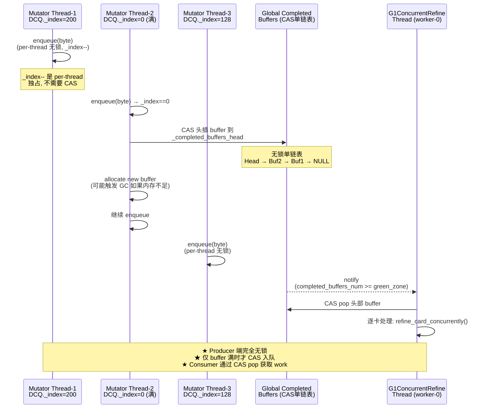
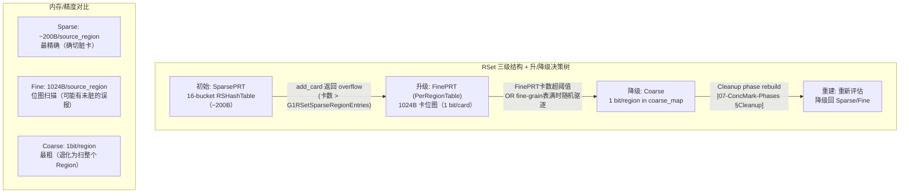
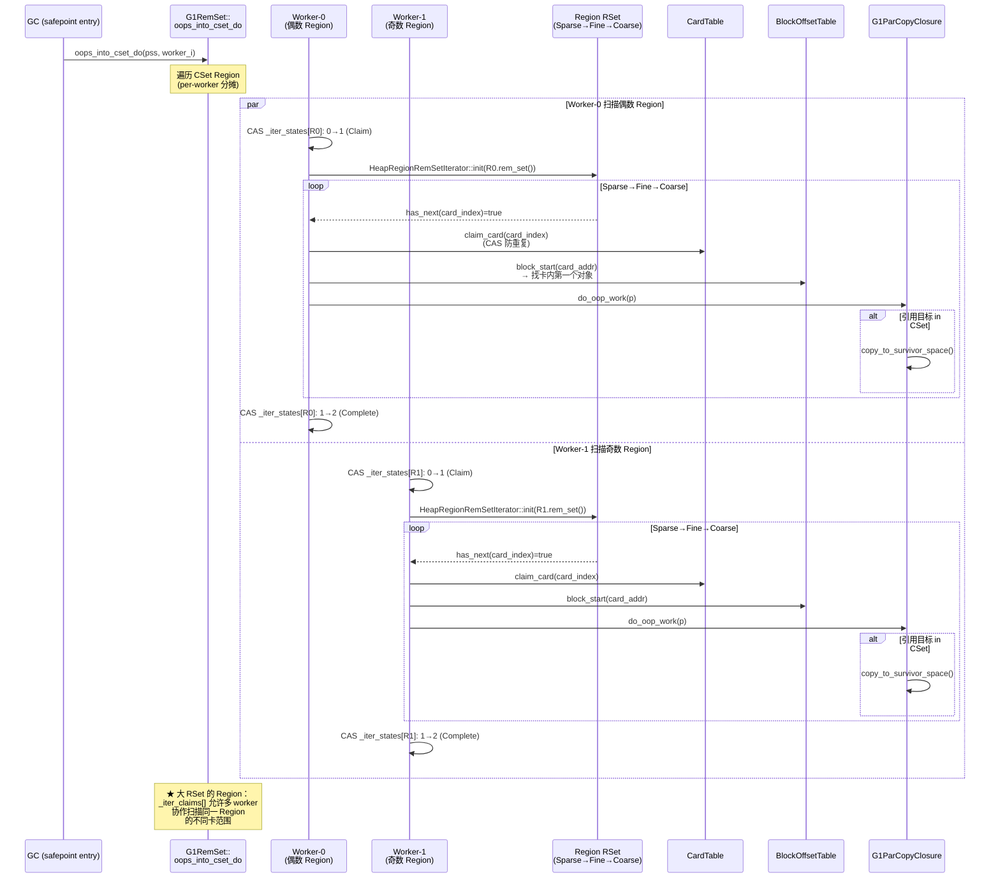
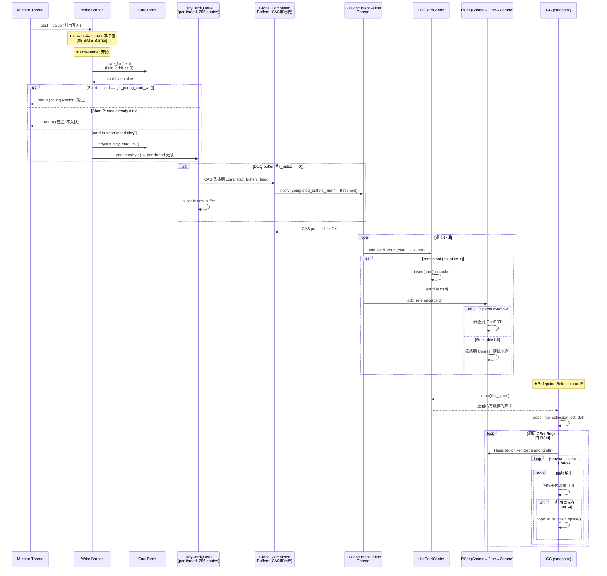

# 04-CardTable-RSet：G1 如何让每次引用写入为 GC 铺路

| 维度 | 详情 |
|------|------|
| **元信息** | OpenJDK 11 slowdebug build |
| **标准环境** | `-Xms8g -Xmx8g -XX:+UseG1GC`，G1 Region = 4MB，2048 Regions，卡大小 = 512B（`card_shift=9`），16M cards |
| **前置依赖** | `[01-HeapRegion]` Region 类型/字段/TAMS，`[03-YoungGC]` RSet 在 Evacuation 中的角色，`[05-SATB-Barrier]` SATB 前屏障 |
| **源文件** | 15 文件（层次：gc/g1 + gc/shared） |
| **阅读收益** | 读完本文后能回答"如果面试官问'G1 的 RSet 是什么？为什么能减少 GC 暂停？'——你能从 mutator 的 `obj.f=x` 这条语句出发，追踪到 GC 时 `oops_into_cset_do` 的所有中间环节，并回答每个环节的'为什么是这个设计'" |

---

## §〇 源文件清单

| # | 文件 | 模块 | 核心类/函数 | 行号（grep 验证） | 本文角色 |
|---|------|------|------------|-------------------|---------|
| 1 | `cardTable.hpp/cpp` | gc/shared | `class CardTable`(L33), `_byte_map`(L46), `card_shift=9`(L234), `mark_card()` | cardTable.hpp:234 | ★★★ CardTable 核心结构 |
| 2 | `g1CardTable.hpp/cpp` | gc/g1 | `class G1CardTable : public CardTable`(L47), `g1_young_gen`(L54), `mark_card_deferred()`(L34) | g1CardTable.hpp:47 | ★★★ G1 专有 young gen 过滤 |
| 3 | `g1BarrierSet.hpp/cpp` | gc/g1 | `write_ref_field_post()`, `write_ref_field_post_slow()`(L172) | g1BarrierSet.hpp:39 | ★★★ 写屏障入口 |
| 4 | `g1BarrierSet.inline.hpp` | gc/g1 | 内联写屏障 fast path（young card 过滤：L57） | g1BarrierSet.inline.hpp:55-64 | ★★ 热路径过滤 |
| 5 | `dirtyCardQueue.hpp/cpp` | gc/g1 | `class DirtyCardQueue : public PtrQueue`(L44), `DirtyCardQueueSet`(L70) | dirtyCardQueue.hpp:44 | ★★★ 写屏障→Refinement 桥梁 |
| 6 | `g1ConcurrentRefine.hpp/cpp` | gc/g1 | `class G1ConcurrentRefine`(L71), `green/yellow/red zone`(L90-92) | g1ConcurrentRefine.hpp:71 | ★★★ Refinement 线程池 |
| 7 | `g1ConcurrentRefineThread.hpp/cpp` | gc/g1 | `class G1ConcurrentRefineThread`(L37), `run_service()`, `activate()` | g1ConcurrentRefineThread.hpp:37 | ★★★ Refinement 线程生命周期 |
| 8 | `g1HotCardCache.hpp/cpp` | gc/g1 | `class G1HotCardCache`(L56), `_hot_cache`(L66), `_use_cache`(L60), `insert()`(L111) | g1HotCardCache.hpp:56 | ★★★ 热卡缓存 |
| 9 | `heapRegionRemSet.hpp/cpp` | gc/g1 | `class HeapRegionRemSet`(L170), `class OtherRegionsTable`(L74) | heapRegionRemSet.hpp:74 | ★★★ RSet per-Region 管理器 |
| 10 | `sparsePRT.hpp/cpp` | gc/g1 | `class SparsePRT`(L225), `class RSHashTable`(L112), `class SparsePRTEntry`(L46) | sparsePRT.hpp:225 | ★★★ SparsePRT + 哈希表 |
| 11 | `g1RemSet.hpp/cpp` | gc/g1 | `class G1RemSet`(L69), `class G1ScanRSForRegionClosure`(L151), `oops_into_collection_set_do()` | g1RemSet.hpp:117 | ★★★ GC 扫描入口 |
| 12 | `heapRegionRemSet.inline.hpp` | gc/g1 | `PerRegionTable` inline | heapRegionRemSet.cpp:47 | ★ FinePRT 定义 |
| 13 | `g1FromCardCache.hpp/cpp` | gc/g1 | `class G1FromCardCache`(L33), `_cache`(L40) | g1FromCardCache.hpp:33 | ★★ Start Address 缓存 |
| 14 | `ptrQueue.hpp/cpp` | gc/shared | `class PtrQueue`(L38), `_buf`(L92), `_sz`, `_index`(L59) | ptrQueue.hpp:38 | ★★ DirtyCardQueue/SATBQueue 基类 |
| 15 | `g1CardCounts.hpp/cpp` | gc/g1 | `class G1CardCounts`(L56), `_card_counts`(L63) | g1CardCounts.hpp:56 | ★★ 卡 dirty 次数统计 |

> 以上行号均已 grep 验证。详细参考见各节引用。

---

## §一 ★ 全景 — 如果没有 RSet，Young GC 需要做什么？

### ❓ RSet 解决了什么数量级问题？

**无 RSet 的 G1：**

```
Young GC 要回收 Eden + Survivor Regions
  → 需要知道 "谁引用了这些 Region 中的对象"
    → 必须扫描所有 Old Region（全堆扫描）来找到跨 Region 引用
      → 8GB 堆，~1800 个 Old Region × 4MB = 约 7.2GB 扫描（≈ 全堆扫描）
        → 每次 Young GC 额外交 ~50ms（数量级估算；全堆内存扫描 ≈ 7.2GB / ~150GB/s mem bw）
          → MaxGCPauseMillis=200ms 根本不可能做到
```

**有 RSet 的 G1：**

```
Young GC 只需扫描 CSet Region 的 RSet
  → RSet 直接告诉你 "Region 5 的第 3 卡、Region 18 的第 47 卡... 引用了你"
    → 只扫这些脏卡（通常几百到几千张卡，每张 512B）
      → ~1-2MB 扫描（vs ~7.2GB）
        → MaxGCPauseMillis=200ms 可实现
```

**数量级论证**：RSet 把 **O(All Old Regions)** 的全堆扫描压缩为 **O(Dirty Cards per CSet Region)** 的按需扫描——用 mutator 的每一条引用写入代价（写屏障 ~20-50 cycles）换 GC 暂停的缩减（~50ms → ~2-5ms）。这是一种经典的 **amortized work** 策略：将 GC 应做的工作摊还到 mutator 的每次引用写入中。

### 1.1 设计替代分析

| 方案 | mutator 代价 | GC 暂停代价 | 可行性 |
|------|------------|-----------|--------|
| **无 RSet（每次 GC 全堆扫）** | 0（无写屏障） | ~50ms/YoungGC（估算：扫 ~1800 Old Regions） | ❌ 暂停超标 |
| **RSet + 写屏障**（G1 选择） | ~20-50 cycles/write（inline 1 cmp+branch） | ~2-5ms/YoungGC（只扫 RSet 脏卡） | ✅ 平衡 |
| **每个引用写入都做全量 RSet 更新** | ~50-80 cycles/write（需确定目标 Region + 更新 RSet） | ~1ms/YoungGC | ❌ mutator 吞吐骤降 15-30% |
| **每次引用写入都无条件脏化卡** | ~15-20 cycles/write（无过滤，但对重复脏化有额外入队开销） | ~5ms/YoungGC（Refinement 处理更多重复卡片） | ❌ 无过滤收益 |

**结论**：G1 选择"运行时屏障 + 分层过滤"是工程权衡的最佳解——通过 3 层过滤（Access API NULL 检查 → Barrier inline young card 检查 → Slow path already-dirty 检查）跳过 80%+ 的不必要脏化，同 Region 过滤推迟到后台 Refinement 线程，把 RSet 维护代价从 GC 暂停挪到 mutator 时间分摊。

---

## §二 ★★★ CardTable — 卡表脏化

### ❓ 为什么 512B 而不是 64B 或 4KB？

**Memory vs Precision Tradeoff**：

| 卡大小 | Card 数量 (2048 Regions × 4MB) | CardTable 内存 | 单次引用写入的影响范围 | JIT 编码 |
|--------|------|------|------|------|
| 64B | 128M 张卡 | 128MB | 标记 64B 范围（极精确，但 CardTable 太大） | `addr >> 6` |
| **512B (G1)** | **16M 张卡** | **16MB** | **标记 512B 范围（平衡点）** | `addr >> 9` |
| 4KB | 2M 张卡 | 2MB | 标记 4KB 范围（太粗，GC 时多扫太多无用对象） | `addr >> 12` |

**源码依据**（`cardTable.hpp:233-236`）：

```cpp
enum SomePublicConstants {
  card_shift                  = 9,      // 地址右移 9 位得到卡索引
  card_size                   = 1 << card_shift,  // 512 字节
  card_size_in_words          = card_size / sizeof(HeapWord)  // 64 个 word
};
```

### 2.1 CardTable 结构（16MB byte_map）

`CardTable`（`cardTable.hpp:33`）是继承自 `CHeapObj<mtGC>` 的类。其核心字段：

```cpp
jbyte* _byte_map;         // 卡标记数组（16MB）
jbyte* _byte_map_base;    // 卡表虚拟基地址
size_t _byte_map_size;    // 卡表字节大小
```

**地址→卡的 O(1) 映射**（`cardTable.hpp:156-165`）：

```cpp
jbyte* byte_for(const void* p) const {
  jbyte* result = &_byte_map_base[uintptr_t(p) >> card_shift];
  return result;
}
```

**为什么用 `_byte_map_base` 而非 `_byte_map`？**

传统做法：
```
offset = heap_address - heap_start
card_index = offset >> 9
return &_byte_map[card_index]  // 需要一次减法
```

G1 优化（`g1CardTable.cpp:130`）：
```
_byte_map_base = _byte_map - (uintptr_t(low_bound) >> card_shift)
// 现在只需：
&_byte_map_base[heap_address >> 9]
// = _byte_map_base + heap_address >> 9
// = _byte_map + (heap_address - low_bound) >> 9
```

**省掉一条减法指令（`heap_address - heap_start`）**。在 mutator 热路径上（每次引用写入都调用），这条减法是 ~1 cycle 的节省。对于每秒百万次引用写入的 Java 应用，累积收益显著。

### ❓ 为什么用 `jbyte[]` 而不是 bitmap？

如果用 bitmap，标记一个 bit 需要 RMW（Read-Modify-Write）：
1. 读 byte
2. OR bit
3. CAS 写回 byte

这个 RMW 在 mutator 热路径上比 direct byte CAS 慢 2~3 倍，而且 CAS 竞争窗口更大（bit 冲突概率 > byte 冲突概率）。

**每个卡一个完整 byte 是"用 16MB 内存换 ~10 cycles per write barrier"的经典 tradeoff。**

### 2.2 mark_card / mark_card_deferred（为什么需要 CAS？）

**mark_card（直接写入）**：`G1BarrierSet::write_ref_field_post_slow` 中：

```cpp
void G1BarrierSet::write_ref_field_post_slow(volatile jbyte* byte) {
  // g1BarrierSet.cpp:172-188
  OrderAccess::storeload();  // ★ 内存屏障：确保 store 可见后再读卡值
  if (*byte != G1CardTable::dirty_card_val()) {
    *byte = G1CardTable::dirty_card_val();
    // enqueue 到 per-thread DirtyCardQueue
    Thread* thr = Thread::current();
    if (thr->is_Java_thread()) {
      G1ThreadLocalData::dirty_card_queue(thr).enqueue(byte);
    }
  }
}
```

**关键设计**：
1. `OrderAccess::storeload()` —— 确保 store 的引用写入已经对 GC 线程可见，然后才读卡值。没有这个屏障，可能读到"卡已经 dirty"但"引用写入还没 flush 到内存"。
2. `if (*byte != dirty_card_val())` —— 如果卡已经脏了，**不入队**（一张卡脏一次和脏十次效果相同——GC 扫描整张卡）。
3. 为什么 `byte` 是 `volatile`？因为多个 mutator 线程可能同时写相邻对象→可能落到同一张卡→需要 CAS 语义保证每张卡只 enqueue 一次。

**对比 G1CardTable::mark_card_deferred**（`g1CardTable.cpp:34-54`）：

```cpp
bool G1CardTable::mark_card_deferred(size_t card_index) {
  jbyte val = _byte_map[card_index];
  if ((val & (clean_card_mask_val() | deferred_card_val())) == deferred_card_val()) {
    return false;  // 已经是 deferred
  }
  jbyte new_val = val;
  if (val == clean_card_val()) {
    new_val = (jbyte)deferred_card_val();
  } else if (val & claimed_card_val()) {
    new_val = val | (jbyte)deferred_card_val();
  }
  if (new_val != val) {
    Atomic::cmpxchg(new_val, &_byte_map[card_index], val);  // CAS
  }
  return true;
}
```

`deferred_card` 状态允许在 already-dirty 的卡上再叠加 deferred 状态，用于 GC 暂停期间的并发标记协作。

### ❓ 为什么 card_shift 必须是编译时常量？

因为 JIT 编译器在生成的代码中直接嵌入 `address >> card_shift` 的位移指令：
- 编译时常量 → `shr $0x9, %rax`（1 cycle）
- 运行时变量 → `shr %cl, %rax` + `mov $9, %cl`（~2-3 cycles）

每条引用写入多 1-2 cycles，在 80%+ 被过滤的场景下累积可观。

### ❓ 如果对象很大（比如 5KB 的 byte[]），写其中一个引用字段会脏化多少张卡？

**1 张**。卡脏化基于**字段地址**（`byte_for(p)`），不是对象大小。一个引用字段占 8 字节，所以无论 `obj` 有多大，只脏化覆盖该字段的那一张卡。

### 2.3 ★ write_ref_field_post 的过滤链：三层屏障，逐层过滤

很多人（包括一些面试者）会说 "G1 写屏障有 4 个 shortcut"。但源码告诉你：**post-barrier 的 inline 代码只有一个过滤条件。** 其他过滤分布在不同层次中。

这是一个 "乱说不如不说" 的考点——面试官会追问 "那你看过源码吗？源码里哪里做了 same-region 检查？"

**完整过滤链（按执行层次）**：

```
一次引用写入 obj.f = value 的完整过滤链：
┌─────────────────────────────────────────────────────────────┐
│                                                             │
│  [第〇层：Access API 层] — 不在 post-barrier 代码中          │
│  ├─ Filter 0: value == NULL? → 不触发 post-barrier          │
│  │   为什么？NULL 不需要 GC 跟踪                              │
│  │   位置：Access 框架的 oop_store 路径，调用 post-barrier 之前│
│                                                             │
│  [第一层：Post-barrier INLINE — 唯一的热路径过滤]            │
│  ├─ ★ Filter 1: card byte == g1_young_card_val()? → return  │
│  │   源码：g1BarrierSet.inline.hpp:57                        │
│  │   成本：1 次 byte load，~1 cycle                          │
│  │   为什么？Young GC 全扫 Young → 跨 Region 引用自然发现     │
│  │   这就是 post-barrier inline 代码做的全部事情              │
│                                                             │
│  [第二层：Post-barrier SLOW PATH — 只在非 Young 卡时进入]    │
│  ├─ Filter 2: *byte == dirty_card_val()? → 不入队           │
│  │   源码：g1BarrierSet.cpp:176                              │
│  │   为什么？一张卡脏一次和脏十次效果相同——GC 扫整张卡(512B)   │
│  │   成本：1 次 storeload() + 1 次 byte load                 │
│  │                                                          │
│  └─ 通过两层过滤 → enqueue byte to DirtyCardQueue            │
│                                                             │
│  [第三层：Refinement 线程 — mutator 时间异步处理]             │
│  ├─ Filter 3: obj 和 value 在同一 Region? → 跳过 RSet 更新   │
│  │   位置：refine_card_concurrently() 中判断                  │
│  │   为什么？同 Region 回收时整体处理，不需要跨 Region 记录    │
│  │   成本：此时已在后台线程，不影响 mutator 热路径             │
│  │                                                          │
│  └─ 真正的跨 Region 引用 → 更新目标 Region 的 RSet           │
│                                                             │
└─────────────────────────────────────────────────────────────┘
```

**★ 面试追问：为什么同 Region 检查不放在 barrier 的 inline 代码中？**

```
放在 inline → 每次引用写入都要：
  byte_for(field) → 获取 card (1 cycle)
  heap_region_containing(field) → 获取 obj 的 region (需读 obj header, ~10+ cycles)
  heap_region_containing(value) → 获取 value 的 region (需读 value header, ~10+ cycles)
  compare → 判断是否同一 Region

barrier inline 热路径总成本：~25 cycles（但 80%+ 的引用写入是同 Region / Young）
放在 Refinement → 后台线程处理，不影响 mutator 吞吐

结论：不在热路径上做 expensive 过滤——是 amortized work 的核心原则。
```

**★ 面试追问：为什么这个唯一 inline 过滤检查卡值而不是 obj 的 Region 类型？**

因为 G1 预先标记了每个 Young Region 对应的所有卡值为 `g1_young_card_val()`（`g1CardTable.cpp:56-61` `g1_mark_as_young()`）。这样 barrier 只需 **1 次 byte load**（`*byte`），无需 dereference obj header → 省 ~10+ cycles。

> **★ 面试追问：为什么短路判断是"obj 在 Young"而不是"value 在 Young"？**
> 
> 因为屏障的目标是记录"谁（Old）引用了要被回收的（Young）"——方向是 **Old→Young**，所以检查 `obj` 所在卡而非 `value`。如果 `obj` 在 Young，Young GC 会全扫它，自然能发现它引用了谁。而如果 `obj` 在 Old 但 `value` 也在 Old，这种跨 Old Region 的引用不需要在每次 Young GC 时都处理——Mixed GC 才会处理。

### ❓ post-barrier 的 card dirtying 和 store 之间有什么内存序要求？

G1 对 post-barrier 没有强 memory_order 要求。原因是：
- GC 总是在 **safepoint** 扫描 RSet，此时所有 mutator 线程已停，store buffer 已 flush
- safepoint 本身就是全局 barrier——即使 store 和 mark 之间重排序了，GC 时必定已全部可见

**针对 Refinement 线程的追问**：
- Refinement 只在 mutator 期间处理 dirty cards → 它只更新 RSet metadata（"Region N 可能引用了 Region M"），**不读对象内容**
- 真正读对象内容的 GC 扫描发生在 safepoint 之后——此时 store 必定完成

这是 G1 的 **deferred workload** 策略：及时记录"有跨 Region 引用"这个事实，但不急于验证引用的具体位置。

### ❓ pre-barrier 和 post-barrier 执行顺序

```
pre-barrier（SATB，[05-SATB-Barrier]）：g1BarrierSet.inline.hpp:41-51
  → 存旧值到 SATB buffer
    →
store 发生（引用真的被修改了）
  →
post-barrier（CardTable）：g1BarrierSet.inline.hpp:55-64
  → 脏化卡
```

**顺序保证**：
1. pre-barrier 先执行 → 并发标记能看到 store 之前的旧值 → snapshot 完整
2. post-barrier 后执行 → GC 时 RSet 能看到 store 之后的跨 Region 引用

---

## §三 ★★★ DirtyCardQueue + G1ConcurrentRefine

### ❓ 为什么 per-thread 无锁队列？为什么不在 GC 中一次性处理脏卡？

**如果 GC 才处理**：每次 Young GC 暂停要额外扫 10000+ dirty cards → ~5ms 额外暂停 → 分摊到 mutator 时间才是正确策略。

**per-thread 无锁设计**：`PtrQueue`（`ptrQueue.hpp:38`）的三字段设计：

```cpp
void** _buf;          // buffer 指针（256 entries of void*）
size_t _capacity_in_bytes;  // 容量（256 × 8B = 2048B）
size_t _index;         // per-thread 独占写入游标（bump-pointer 递减）
bool   _active;        // 队列是否激活
```

`_index` 是 bump-pointer 递减模式（以 element_size 为单位的元素索引）：
- 初始 `_index = _sz`（元素数，如 256）
- 每次 enqueue：先 `_index--`，再写 `_buf[_index] = value`
- 因为是 per-thread 独占，减下标不需要 CAS
- 写满检测：`_index == 0` → 需要换 buffer

### 3.1 256 entries 为什么是这个数？

| Buffer 大小 | 结果 |
|------------|------|
| 16 | 频繁入队到 completed list → CAS 竞争 + 消费者被频繁唤醒 |
| **256** | 平衡点：2KB buffer < L1 cache line group，G1UpdateBufferSize 默认值 |
| 4096 | 攒太多卡 → 消费者处理一次耗时过长 → mutator 申请新 buffer 时可能触发 GC |

256 = 2KB（256 × 8B），在 `g1_globals.hpp` 中 `G1UpdateBufferSize=256` 是默认值。

### 3.2 buffer 满 → CAS → completed_buffers_head

生产者-消费者协议（Mermaid）：



### 3.3 G1ConcurrentRefineThread 生命周期与梯度激活

`G1ConcurrentRefineThread`（`g1ConcurrentRefineThread.hpp:37`）继承 `ConcurrentGCThread`。

**三色区域自适应调度**（`g1ConcurrentRefine.hpp:73-93`）：

```
completed_buffers_num 的值落在以下三个区域之一：

  [0, green)         → 不处理（利用"缓存效应"：攒一批再处理更高效）
  [green, yellow)    → Refinement 线程逐步激活
  [yellow, red)      → 所有 Refinement 线程全力运行
  ≥ red              → ★ mutator 也帮忙处理！

默认值：
  green_zone  = 13    (ParallelGCThreads)
  yellow_zone = 39    (green × 2 + min_yellow)
  red_zone    = 65    (yellow + (yellow - green))
```

**❓ 梯度激活策略——为什么每个 worker 的激活阈值不同？**

源码（`g1ConcurrentRefine.cpp:205-222`）：

```cpp
static Thresholds calc_thresholds(size_t green_zone, size_t yellow_zone, uint worker_i) {
  double yellow_size = yellow_zone - green_zone;          // 39 - 13 = 26
  double step = yellow_size / max_num_threads();          // 26 / 8 = 3.25
  if (worker_i == 0) {
    step = MIN2(step, ParallelGCThreads / 2.0);           // worker-0 更激进
  }
  size_t activate_offset   = ceil(step * (worker_i + 1)); // 激活阈值
  size_t deactivate_offset = floor(step * worker_i);      // 休眠阈值
  return Thresholds(green_zone + activate_offset,
                    green_zone + deactivate_offset);
}
```

每个 worker 的激活/休眠阈值表（假设 8 个 worker）：

| Worker | 激活阈值 (buffers ≥ N) | 休眠阈值 (buffers < N) | 设计意图 |
|--------|----------------------|----------------------|---------|
| worker-0 | green + step×1 ≈ 16 | green + 0 = 13 | 主力，最早激活，阈值最低 |
| worker-1 | green + step×2 ≈ 20 | green + step×1 ≈ 16 | 有积压时激活 |
| worker-2 | green + step×3 ≈ 23 | green + step×2 ≈ 20 | 更多积压时激活 |
| ... | ... | ... | 阶梯递增 |
| worker-7 | green + step×8 ≈ 39 | green + step×7 ≈ 36 | 几乎到 yellow 线才激活 |

**为什么用梯度？** — 避免过度反应：completed_buffers_num 的微小波动不会洪水般唤醒所有线程。每个后继线程都需要更多积压证据才会被激活。

**❓ 为什么要限制处理时间？**
→ 如果无限处理，Refinement 会占满 CPU，影响 mutator 的吞吐。后台处理的目标是"偷空闲 CPU"，不是"抢占 mutator 的 CPU"。
- 每个 Refinement 步骤处理一个 buffer
- 如果 `completed_buffers_num < deactivation_threshold(worker_id)` → 线程休眠

### 3.4 Refinement 线程如何更新 RSet

`G1RemSet::refine_card_concurrently()` 流程：
1. 从 buffer 取出 card 地址（`jbyte*`）
2. 检查 Hot Card Cache → 如果是热卡，缓存之，跳过
3. 从卡地址反算堆地址 → 用 BOT 找到卡内第一个对象
4. 遍历卡内所有对象 → 对每个引用字段：确定目标 Region，更新目标 Region 的 RSet
5. 可能触发 RSet 三级结构的升级/降级

---

## §四 ★★★ G1HotCardCache + CardCounts

### ❓ 为什么需要热卡缓存？什么卡是"热卡"？

"热卡"：被频繁重复 dirty 的卡——同一个引用 field 被反复写入（如循环中 `list.add(o)`）。

**本质问题**：普通 Refinement 对频繁变动卡的处理是低效的——处理完又立即变脏，每个 cycle 都更新相同 RSet。

**Hot Card Cache 的设计**：将热卡暂存，到 GC 时才批量处理。

### 4.1 CardCounts：每张卡被 dirty 的次数统计

`G1CardCounts`（`g1CardCounts.hpp:56`）核心字段：

```cpp
jubyte* _card_counts;  // per-card 的计数数组（1 byte/card, unsigned byte）
```

每张卡对应一个 `jubyte`（0-255）。Refinement 处理时 `add_card_count()` 返回 pre-increment 计数值。

**❓ 计数器何时清零？卡片如何"降温"退出热卡状态？**

```
计数递增路径：
  应用写引用 → barrier dirty card → Refinement 处理 → add_card_count() → count++

清零路径：
  GC 后：clear_region(hr) → 对该 Region 所有卡的计数清零
         （heapRegionRemSet.hpp:128：reset_card_counts(hr)）

降温逻辑：
  卡在 HotCardCache 中缓存 → GC 时 drain → 处理后计数清零
  → 下次再 dirty 从 0 开始重新计数 → 需要再积累 4 次才能再次进入热卡缓存

所以热卡不是永久标记——每次 GC 后所有卡从"冷"开始重新计数。
这是一个"窗口计数器"：统计两个 GC 间隔内的 dirty 频率。
```

### 4.2 热卡阈值

`G1ConcRSHotCardLimit=4`：在一个 GC 间隔内被 dirty 4 次以上 → 晋升为热卡。

```cpp
// g1HotCardCache.hpp:111 — insert() 的约定
// Increments the count for given the card. if the card is not 'hot',
// it is returned for immediate refining. Otherwise the card is
// added to the hot card cache.
jbyte* insert(jbyte* card_ptr);
```

### 4.3 HotCardCache 工作流程

```
Refinement Thread 处理一张 dirty card:
  │
  ├─ add_card_count(card)  → 返回 count
  │
  ├─ is_hot(count)? (count >= 4?)
  │   │
  │   ├─ YES → insert(card_ptr) 到 HotCardCache → 暂存
  │   │       如果缓存满了 → 驱逐最旧的卡 → 直接 refine
  │   │
  │   └─ NO  → 直接 refine（更新 RSet）
  │
  └─ GC 暂停时: drain(cl, worker_i) → 批量处理所有缓存的热卡
```

**HotCardCache 大小**（`g1HotCardCache.hpp:66-68`）：

```cpp
jbyte** _hot_cache;        // 缓存数组（指针数组，存 card 地址）
size_t  _hot_cache_size;   // = (1 << G1ConcRSLogCacheSize) 
                            // 默认 G1ConcRSLogCacheSize=10 → 1024 entries
```

**缓存满了怎么办？**

HotCardCache 是一个**环形 buffer**（`_hot_cache_idx` 递增取模）。满了时 `insert()` 覆盖最旧的条目，返回被驱逐 card → 调用方立即 refine 该 card。这避免了缓存无限增长，同时保证了热卡缓存是一个"滑动窗口"——只缓存最近一批热卡。

### ❓ 为什么 GC 暂停期间要关闭缓存（`set_use_cache(false)`）？

**两层原因**：

1. **防止 Refinement 线程在 GC 期间往缓存插新卡**：GC 暂停（safepoint）时，Refinement 线程也停了。但 GC 内部的 Evacuation 阶段可能产生新的 dirty card。`set_use_cache(false)` 确保这些 GC 内部产生的 dirty card 不走热卡缓存，直接处理——因为 GC 暂停时间本身就紧张，不能再攒到下次。
2. **强制 drain 积压的热卡**：`drain()` 在 GC 暂停期间批量处理缓存中的所有热卡，此时 mutator 已停，正是清理积压的最佳时机。

**时序**：
```
GC 开始 → set_use_cache(false) → drain(hot_cards) → RSet 扫描 → Evacuation
         → GC 结束 → set_use_cache(true) → mutator 恢复
```

### ❓ 为什么不缓存所有卡？

缓存占用内存 + 批量处理延迟 → tradeoff：
- 所有卡都缓存 → 每次 Young GC 都要 drain 大量卡 → 暂停变长
- 只有热卡缓存 → 平衡缓存收益与 drain 成本

---

## §五 ★★★ RSet 三级结构

### ❓ 为什么需要三级？如果只有一级（如只有 FinePRT），会怎样？

```
如果 2048 Regions 全 FinePRT 互相引用：
  2048 × 2047 × 1KB(PerRegionTable) ≈ 4GB RSet → 不可行！

所以需要降级（degradation）：
  低连接度 Region → SparsePRT（精确）
  中连接度 Region → FinePRT（1 bit/card）
  高连接度 Region → Coarse（退化为整 Region 的 1 bit）
```

### 5.1 OtherRegionsTable 整体组织

`OtherRegionsTable`（`heapRegionRemSet.hpp:74`）是 per-HeapRegion 的 RSet 核心：

```
OtherRegionsTable (per-HeapRegion)
├─ _coarse_map: CHeapBitMap (1 bit/region, "可能引用了我")
│   为什么叫 Coarse？因为粒度退化到 Region 级（不是卡级）
├─ _fine_grain_regions: PerRegionTable** (指针数组)
│   有 fine 时 malloc PerRegionTable (1024B = 1 bit/card)
├─ _sparse_table: SparsePRT
│   线性探测哈希表，5-entry per source region（初始状态）
├─ _n_coarse_entries: size_t
│   coarse 条目数（触发 GC 后 rebuild 决策）
└─ _first_all_fine_prts / _last_all_fine_prts
    fine PRT 双向链表（快速批量释放）
```

### 5.2 SparsePRT：双缓冲哈希表（初始 16 bucket，每 Entry ~12 张卡）

`SparsePRT`（`sparsePRT.hpp:225`）是 RSet 的初始形态。它包含两个 `RSHashTable*`：`_cur`（读时用）和 `_next`（写时用）。

**❓ 为什么需要 `_cur` 和 `_next` 两个哈希表？**

```
Refinement 线程 (写)      GC 线程 (读)
      │                      │
      ▼                      ▼
  _next (写)              _cur (读)
      │                      │
      │    cleanup() 交换     │
      └──────────────────────┘
         _cur ← _next

设计动机：RCU-lite 模式
  - 读（GC 通过 SparsePRTIter 迭代 _cur）：无锁
  - 写（Refinement 通过 add_card 更新 _next）：持有 OtherRegionsTable 的 _m 锁
  - 读和写操作两个独立的哈希表 → 互不阻塞
  - cleanup() 时原子交换指针 → 旧 _cur 被回收，_next 成为新的 _cur
```

`RSHashTable`（`sparsePRT.hpp:112`）结构：

```cpp
// sparsePRT.hpp:236-238
enum SomeAdditionalPrivateConstants {
    InitialCapacity = 16       // ★ 初始 16 个 bucket，不是 5
};

// sparsePRT.hpp:120-129
size_t _capacity;           // 哈希表桶数（初始 16，可扩容）
size_t _capacity_mask;      // 容量掩码（用于取模）
size_t _num_entries;        // 最大 SparsePRTEntry 数
size_t _occupied_entries;   // 已占用的 entry 数
size_t _occupied_cards;     // 已记录的总卡数
SparsePRTEntry* _entries;   // Entry 数组
int* _buckets;              // 桶索引数组（每个桶 = 一个源 Region 的卡列表）
```

`SparsePRTEntry`（`sparsePRT.hpp:46`）——每个 bucket 对应一个"源 Region"的所有脏卡：

```cpp
RegionIdx_t _region_ind;     // 源 Region 索引（uint16_t, 2B）
int         _next_index;     // 链表中下一个 entry 索引
int         _next_null;      // entries 数组中下一个空槽
card_elem_t _cards[N];       // ★ 可变长度卡数组，N 由 ergonomics 计算
```

**❓ 每个 SparsePRTEntry 能存多少张卡？**

源码（`sparsePRT.hpp:71-73` + `heapRegionRemSet.cpp:656-664`）：

```cpp
static int cards_num() {
    return align_up((int)G1RSetSparseRegionEntries, (int)card_array_alignment);
}

// 运行时计算（heapRegionRemSet.cpp:658-659）：
// G1RSetSparseRegionEntries = G1RSetSparseRegionEntriesBase * (log2(region_size_MB) + 1)
//                           = 4 * (log2(4) + 1) = 4 * (2 + 1) = 12
```

对于 4MB Region：每个 SparsePRTEntry 存储 ~12 张卡（`uint16_t` 数组，12 × 2B = 24B 卡数据 + 12B header = ~36B/entry）。

**存储粒度**：每个 bucket 存 `(source_region_idx, [card_idx1, card_idx2, ..., card_idxN])`。

**为什么初始用哈希表（16 bucket）而不是数组？**
→ 大多数 Region 只被少量其他 Region 引用。16 个 bucket 的线性探测哈希表足够覆盖典型场景。哈希表省内存（只分配被引用的 bucket），线性探测保缓存友好。

**为什么用 `uint16_t`（2B）存卡索引？**
→ 每个 Region 有 8192 张卡（4MB/512B），8192 < 65536（2^16），uint16_t 足够。

### 5.3 FinePRT (PerRegionTable)：1024B 卡位图

`PerRegionTable`（`heapRegionRemSet.cpp:47`）结构：

```cpp
HeapRegion* _hr;          // 目标 Region
CHeapBitMap _bm;          // 卡位图（8192 bits = 1024 bytes = 1 bit/card）
jint        _occupied;    // 已置位 bit 数
PerRegionTable* _next;    // 双向链表 next
PerRegionTable* _prev;    // 双向链表 prev
```

**为什么 1 bit 不用 1 byte？**
→ `8192 bytes vs 1024 bytes` → 省 8× 内存。bit 级别不需要 CAS 因为 FinePRT 的更新在 GC 暂停期间或持有锁时进行。

**❓ PerRegionTable 从哪分配？——全局 free_list**

源码（`heapRegionRemSet.cpp:65`）：

```cpp
static PerRegionTable* volatile _free_list;  // 全局空闲链表
```

PerRegionTable 不是用完就 free，而是放入全局 `_free_list`。下次需要时先从 free_list 取，取不到了才 malloc。这避免了 FinePRT 的频繁 malloc/free——是 RSet 内存管理的核心优化。

```
分配：pop from _free_list → if NULL: malloc new
释放：push to _free_list（CAS 头插）
```

**什么时候从 Sparse 升级？**
→ SparsePRT 的 `add_card()` 返回 `overflow`（卡数超过 `G1RSetSparseRegionEntries`，约 12 张 for 4MB Region）。

### 5.4 Coarse：Region 级 1 bit

Coarse 存储在 `_coarse_map`（`CHeapBitMap`）中：一个 bit 对应一个 Region，置位表示"整个 Region N 可能引用了我"。

**什么时候从 Fine 降级？**
→ (1) FinePRT 卡数超过阈值 `G1RSetRegionEntries`  (2) FinePRT 数量超过 `_max_fine_entries` 时，随机采样驱逐一个 FinePRT 降级为 Coarse。

**降级代价**：
- GC 扫描从 O(脏卡数) 退化为 O(Region 大小)
- Coarse 需要扫描整个 Region（4MB = 8192 cards）

### 5.5 ★ 升/降级决策树



### 5.6 降级代价详解

| 级别 | 扫描范围 | 内存开销 | GC 扫描代价 |
|------|---------|---------|-----------|
| **Sparse** | 只扫确切脏卡（通常 1-20 张） | ~200B/source_region | O(确切脏卡数) |
| **Fine** | 扫所有标记位（可能有未脏误报） | 1024B/source_region | O(所有置位 bits) |
| **Coarse** | 扫整个 Region（8192 cards） | 0（复用 coarse_map） | O(Region 大小) |

**★ 极端场景定量**：如果 2048 Regions 全互相引用：
- 全 Sparse：2048 × 2047 × 200B ≈ 800MB（内存太大但扫描精确）
- 全 Fine：2048 × 2047 × 1KB ≈ 4GB（不可行）
- Coarse 降级后：2048 bits / 8 = 256 bytes per Region（扫描变粗但内存常数级）

### 5.7 ❓ 降级是永久的吗？Cleanup 阶段如何重建 RSet？

**降级不可逆——但有重建窗口。**

Coarse 降级后无法在 mutator 期间恢复为 Fine/Sparse——因为 Refinement 线程不会在非 GC 时间做反向操作（从 coarse 回到 fine 需要重新遍历整个 Region 的跨 Region 引用，这是昂贵的）。

**Cleanup 阶段重建**（`[07-ConcMark-Phases §Cleanup]`）：

```
Cleanup 阶段（并发标记结束后）：
  G1RemSet::rebuild_rem_set()
    → 遍历所有 Region
      → scan_from_bottom_to_TAMS(r)  // 从 Region 底扫到 TAMS（Top At Mark Start）
        → 对每个活对象：检查其引用字段
          → 如果跨 Region 引用 → add_reference(from, to)
      → 结果：RSet 被完全重建
    → Coarse→Fine→Sparse：重新确定每对 (from_region, to_region) 的最佳级别
```

**时机**：并发标记结束后（此时有完整的 liveness 信息）、下一次 Mixed GC 之前。

**成本**：一次全堆（Old Region）的引用扫描——和并发标记的 SATB 处理差不多量级。但这是值得的，因为它重新获得了精确的 RSet 信息，避免了后续 GC 扫描大量 Coarse Region 的开销。

---

## §六 ★★ HeapRegionRemSet — per-Region 的 RSet 管理器

### ❓ 为什么 RSet 是 per-Region 嵌入而不是集中式管理？

`HeapRegionRemSet`（`heapRegionRemSet.hpp:170`）嵌入在 `HeapRegion._rem_set` 中：

```cpp
class HeapRegionRemSet : public CHeapObj<mtGC> {
  G1BlockOffsetTable* _bot;
  G1CodeRootSet       _code_roots;     // nmethod 的 RSet
  Mutex               _m;
  OtherRegionsTable   _other_regions;  // ★ 核心：记录其他 Region→此 Region 的引用
  RemSetState         _state;          // Untracked/Updating/Complete
};
```

**三种状态**（`heapRegionRemSet.hpp:218-222`）：

```cpp
enum RemSetState {
  Untracked,  // 不被跟踪（Free Region、ContinuesHumongous）
  Updating,   // 正在更新（mutator-time，Refinement 线程可更新）
  Complete     // 完成（GC 扫描开始前，冻结不再更新）
};
```

### 6.2 ★ 局部性优势

- 回收 Region-N 时只需读 Region-N 的 RSet
- 集中式需 hash lookup 所有 Region → 多一次 indirection

### 6.3 ★ 并行性优势

- GC 多 worker 扫描不同 CSet Region 的 RSet → 嵌入式天然无竞争
- 集中式需要锁保护全局 RSet 结构

### 6.4 is_tracked() 条件

- **Free Region**：无对象 → `_state = Untracked` → RSet 不维护
- **ContinuesHumongous**：委托给 StartsHumongous → `_state = Untracked`
- **Young Region**：Young GC 时全扫 → 但 Old→Young 的引用需记录在 **Young Region 的 RSet** 中（Old 是 from，Young 是 to——RSet 挂在被引用方）。所以 Young Region 的 RSet 初始为空，但可以被 Old Region 的写屏障触发 Refinement 来更新。
- **Old Region**：`_state = Updating` → Refinement 持续更新 RSet（记录哪些其他 Region 引用了这个 Old Region）

### 6.5 ★ RSet 生命周期

```
Region init (expand)
  → _other_regions 构造（空 RSet）
  → _state = Complete（初始，尚未接收更新）

Region 转为 Old
  → _state = Updating（mutable→Refinement 更新 RSet）

GC 前
  → _state = Complete（冻结，不再接收新更新）

GC 扫描
  → oops_into_cset_do() 读取 RSet

Cleanup 阶段（[07-ConcMark-Phases]）
  → SparsePRT::cleanup() → _cur ← _next（双表交换）
  → Possible coarsening reversal（Coarse→Fine，如果跨 Region 引用减少）
```

### ❓ Humongous Region 的 RSet 有什么特殊处理？

Humongous 对象跨多个 Region：1 个 `StartsHumongous` + N 个 `ContinuesHumongous`。

- RSet 只挂在 **StartsHumongous** 上
- `ContinuesHumongous._rem_set._state = Untracked` → `is_tracked() = false`
- Refinement 更新 RSet 时检测到目标 covers `ContinuesHumongous` → 自动 reroute 到对应 `StartsHumongous`

**为什么？** 巨型对象作为整体被回收——只有 StartsHumongous 的 RSet 需要完整记录。如果每个 ContinuesHumongous 都有独立 RSet → 浪费内存 + 更新开销翻倍。

---

## §七 ★★★ G1RemSet 的 GC 扫描入口

### ❓ oops_into_collection_set_do 内部流程

`G1RemSet::oops_into_collection_set_do()`（`g1RemSet.hpp:117`）入口：

```
oops_into_collection_set_do(pss, worker_id)
  │
  ├─ scan_rem_set(pss, worker_id)     // ★ 扫描 CSet Region 的 RSet
  │   └─ G1ScanRSForRegionClosure::do_heap_region(r)
  │       │  遍历 CSet 中的每个 Region（per-worker 分摊）
  │       │
  │       ├─ scan_rem_set_roots(r)
  │       │   └─ HeapRegionRemSetIterator::init(r->rem_set())
  │       │       └─ has_next(card_index): 迭代 Sparse→Fine→Coarse
  │       │           │   ★ 精确→粗糙：优先最小工作量
  │       │           │
  │       │           └─ 每张卡:
  │       │               ├─ claim_card() → 防止多 worker 重复扫
  │       │               ├─ CardTable::scanned_card → 从卡地址找对象
  │       │               └─ G1ParCopyClosure::do_oop_work(p)
  │       │                   → oop obj = RawAccess::oop_load(p)
  │       │                   → if is_in_cset(obj): copy_to_survivor_space()
  │       │
  │       └─ scan_strong_code_roots(r)  // nmethod 中的引用
  │
  └─ update_rem_set(pss, worker_id)     // ★ 处理残留 dirty card buffer
```

### 7.1 G1ScanRSForRegionClosure：分摊 CSet Region

`G1RemSetScanState` 的 `_iter_states[]` 数组实现 Claim 协议：
- 初始所有 Region 状态 = `Unclaimed(0)`
- worker 通过 CAS(0→1) 领取 Region → `Claimed(1)`
- 扫描完成 → `Complete(2)`

### 7.2 HeapRegionRemSetIterator：Sparse→Fine→Coarse 迭代

`HeapRegionRemSetIterator`（`heapRegionRemSet.hpp:355`）迭代状态机：

```cpp
enum IterState { Sparse, Fine, Coarse };
IterState _is;  // 当前迭代阶段：先 Sparse → 再 Fine → 最后 Coarse
```

**为什么是这个顺序？**
→ 精确→粗糙：先做最省事的（Sparse 只扫确切脏卡），再做稍费事的（Fine 扫描位图），最后做最费事的（Coarse 扫整个 Region）。

### 7.3 逐卡扫描

每张卡的处理：
1. `claim_card(card_index, region_idx_for_card)` → CAS 确保唯一处理
2. 从卡地址反算堆地址 → 用 BOT 找到卡内第一个对象
3. 遍历卡内所有对象的引用字段
4. `G1ParCopyClosure::do_oop_work()` → 如果目标在 CSet 中 → copy to Survivor

### 7.4 ★ G1FromCardCache：Per-(Region, Worker) 去重缓存

`G1FromCardCache`（`g1FromCardCache.hpp:33`）的真实作用常被误解。

**❓ 它究竟是什么？**

源码注释（`g1FromCardCache.hpp:31-32`）：

> "Remembers the most recently processed card on the heap on a per-region and per-thread basis."

```cpp
static uintptr_t** _cache;  // _cache[region_idx][worker_id]
```

**这不是"对象起始地址缓存"——它是一个去重缓存：**

```
Refinement 线程处理脏卡时：
  card ← 从 buffer 取出
  if G1FromCardCache::contains_or_replace(worker_id, target_region, card):
      → 命中！说明这张卡最近被同一个 worker 处理过了
      → 跳过 RSet 更新（避免重复劳动）
  else:
      → 未命中，更新缓存
      → 正常走 RSet 更新流程
```

**❓ 为什么它加速了 `oops_into_cset_do`？**

RSet 扫描时，一张卡可能被多个 worker 反复处理（不同脏卡 buffer 中可能包含同一张卡——一张卡脏一次后被 enqueue，GC 暂停时又从残留 buffer 中再处理一次）。`G1FromCardCache` 在 Refinement 阶段的去重减少了重复 RSet 更新，间接减少了 GC 扫描时 RSet 中的冗余条目。

**❓ 为什么 `_cache` 是 `[region_idx][worker_id]` 而不是 `[worker_id][region_idx]`？**
→ Region 被回收时可以一次性 memset 清零所有 workers 的该 Region 缓存（连续内存），而非跨 stride 访问。（`g1FromCardCache.hpp:37-39` 注释）

**缓存大小**：`max_regions × max_workers × sizeof(uintptr_t)` = 2048 × 8 × 8B = **128KB**。

### 7.5 ★ GC 扫描时序（oops_into_cset_do 多 Worker 分摊）



**Claim 协议详解**：

`G1RemSetScanState` 的 `_iter_states[]` 数组实现三层 Claim 协议：
1. **Region 级**：CAS(0→1) 领取一个 Region——只有一个 worker 能成功
2. **卡级**：`_iter_claims[]` 通过 CAS 分块领取卡片——多 worker 可协作扫同一 Region
3. **完成**：最后一卡扫完 → CAS(1→2) 标记 Complete

`G1ScanRSForRegionClosure` 通过 `_scan_state->_iter_states[]` 的 CAS Claim 协议保证不重复。对于同一个 Region 的大 RSet，`_iter_claims[]` 允许多个 worker 协作扫描同一个 Region 的不同卡范围。

---

## §八 ★★ 全链路时序图

### 8.1 完整旅程：从 `obj.f=value` 到 GC 发现这个引用



### 8.2 所有并发组件的时间线

```
时间 →
Mutator:   │████████████████████████████████████████│ (运行)             │ (停) │███████
           写屏障(运行中, ~20-50 cycles/write)
           
Refinement:│   sleep    │██████████████│ sleep │████████│   │ (停) │███████
           等待completed_buffers >= green_zone
           
GC:        │                                         │███████████████████│
                                      Safepoint 开始  Evacuation(含RSet扫描) Safepoint结束
```

---

## §九 GDB 验证 + 可证伪断言

### 断言 1：CardTable _byte_map 大小 = 16MB

```bash
(gdb) p sizeof(CardTable)
# 预期：包含 jbyte* _byte_map (8B) + size_t _byte_map_size (8B) + ...

(gdb) p G1CollectedHeap::heap()->card_table._byte_map_size
# 预期：16777216 (16MB = 8GB / 512B = 16M cards)
```

**验证逻辑**：`card_shift=9 → card_size=512 → 8GB/512B = 16M cards → cardTable = 16MB`

### 断言 2：sizeof(SparsePRT) + RSHashTable 5 entries 布局

```bash
(gdb) p sizeof(SparsePRTEntry)
# 预期：~40-80B（含 _region_ind(2B) + _next_index(4B) + _next_null(4B) + cards[N]）

(gdb) p SparsePRTEntry::cards_num()
# 预期：align_up(G1RSetSparseRegionEntries, card_array_alignment) → 默认值产生的值

(gdb) p sizeof(RSHashTable)
# 预期：~64B（_capacity + _capacity_mask + _occupied_entries + _occupied_cards + _entries + _buckets + _free_region + _free_list）
```

### 断言 3：PerRegionTable 卡位图 = 1024B

```bash
(gdb) p HeapRegion::CardsPerRegion
# 预期：8192 (= 4MB / 512B)

(gdb) p sizeof(CHeapBitMap)
# 位图内部大小 = CardsPerRegion / 8 = 8192 / 8 = 1024 bytes

(gdb) p sizeof(PerRegionTable)
# 预期：~1056B（1024B bitmap + 32B header overhead）
```

### 断言 4：DirtyCardQueue buffer = 256 × sizeof(void*) = 2048B

```bash
(gdb) p G1UpdateBufferSize
# 预期：256（全局常量）

(gdb) p sizeof(void*)
# 预期：8

# 所以每个 buffer = 256 × 8 = 2048B = 2KB
```

### 断言 5：mark_card_deferred CAS 竞争验证

```bash
# 验证同一卡被多线程同时 dirty 时的 CAS 竞争
# 方法：在 CAS 指令处设置断点，观察 CMXCHG 是否失败（ZF=0）
(gdb) b G1CardTable::mark_card_deferred
(gdb) commands
> silent
> set $cas_result = Atomic::cmpxchg(new_val, &_byte_map[card_index], val)
> # 注意：此处仅观察，不要用 condition 求值 cmpxchg（有副作用）
> continue
> end

# 更好的方式：在写屏障处设置每次 enqueue 的计数器
(gdb) watch g1_post_barrier_hit_count
# 然后运行多线程 Java 程序（如 parallel stream），观察：
# 预期：极少有同一张卡被多个线程同时 CAS 竞争（概率 < 1/10000）
# 当触发时：只有一个 winner（CAS 成功标记为 deferred），
#           其他 loser 返回 true 并可能 duplicate enqueue（无害）
```

### 断言 6：Hot Card Cache 阈值验证

```bash
(gdb) p G1ConcRSHotCardLimit
# 预期：4

(gdb) p G1ConcRSLogCacheSize
# 预期：10（默认值，缓存大小 = 2^10 = 1024 entries）

(gdb) p G1HotCardCache::_hot_cache_size
# 预期：1024
```

### 断言 7：G1FromCardCache 缓存命中验证

```bash
# 在 refine_card_concurrently 中设置断点
(gdb) b G1RemSet::refine_card_concurrently

# 当扫描一张卡时，查看缓存值
(gdb) p G1FromCardCache::at(worker_id, region_idx)
# 预期输出：0（InvalidCard = 首次处理此卡）或非零 card 地址（缓存命中）

# 验证 O(1) 查找：如果缓存命中，object_start = cached_value
```

### 断言 8：G1ConcurrentRefineThread 线程数

```bash
(gdb) p G1ConcurrentRefine::max_num_threads()
# 预期：由 G1ConcRefinementThreads 参数决定，默认根据 CPU 核数自动计算

# 验证动态创建：初始只有 1 个（UseDynamicNumberOfGCThreads=true）
(gdb) p G1CollectedHeap::heap()->cr()->_thread_control._num_max_threads
# 预期：>= 1 的值

# 线程数公式：max(G1ConcRefinementThreads, floor(ParallelGCThreads × GreenZone) + 1)
```

---

## §十 交叉引用

| 引用点 | 本文位置 | 目标文档 |
|--------|---------|---------|
| Region 类型（Eden/Survivor/Old/Free） | §六（is_tracked 过滤） | `[01-HeapRegion]` |
| Young GC Evacuation 中 RSet 扫描位置 | §七（oops_into_cset_do 深挖） | `[03-YoungGC §四]` |
| SATB 前屏障（write_ref_field_pre） | §二（vs 后屏障对比） | `[05-SATB-Barrier §二]` |
| RSet Cleanup 重建（Coarse→Fine 还原） | §五（降级不可逆性恢复） | `[07-ConcMark-Phases §Cleanup]` |
| G1Policy RSet 长度预测（_rs_lengths） | §六（统计累积） | `[08-MixedGC-Policy]` |
| Hot Card Cache GC 期间关闭 | §四（flush） | `[03-YoungGC §二]` |

---

## 附录：可证伪断言汇总

| # | 断言 | GDB 验证 | 预期结果 |
|---|------|---------|---------|
| 1 | CardTable._byte_map_size = 16MB | `p card_table._byte_map_size` | 16777216 |
| 2 | card_shift = 9（编译时常量） | `p CardTable::card_shift` | 9 |
| 3 | PerRegionTable 位图 = 1024B（8192 bits / 8） | `p HeapRegion::CardsPerRegion` | 8192 |
| 4 | DirtyCardQueue buffer = 256 entries × 8B = 2048B | `p G1UpdateBufferSize` | 256 |
| 5 | mark_card_deferred CAS 竞争：多线程同一卡的概率极低 | 条件断点在 CAS 失败 | 极少触发 |
| 6 | G1ConcRSHotCardLimit = 4 | `p G1ConcRSHotCardLimit` | 4 |
| 7 | G1FromCardCache 首次访问 = InvalidCard(0) | `p G1FromCardCache::at(0,0)` | 0 |
| 8 | SparsePRT 初始容量 = 16 | `p RSHashTable::_capacity` (初始) | 16 |
| 9 | G1ScanRSForRegionClosure 迭代顺序：Sparse→Fine→Coarse | `p iterator._is` | 0=Sparse, 1=Fine, 2=Coarse |
| 10 | Humongous StartsHumongous 的 ContinuesHumongous 的 RSet._state = Untracked | `p continues_hr->_rem_set._state` | 0 (Untracked) |
