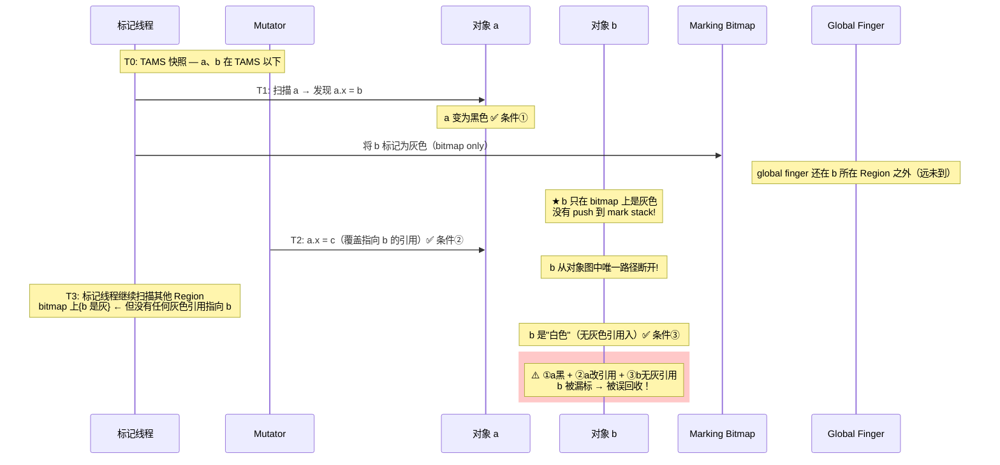
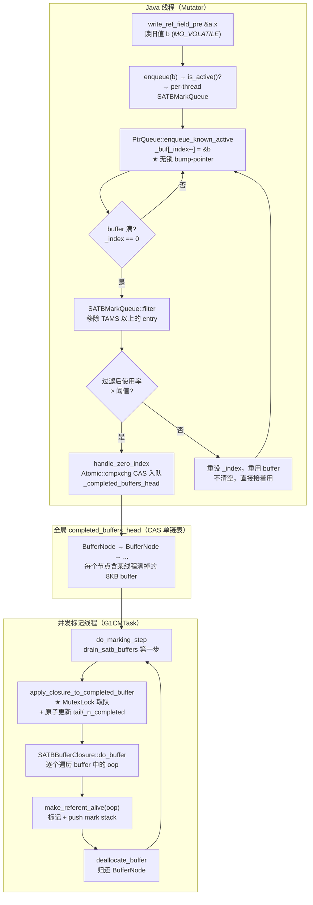
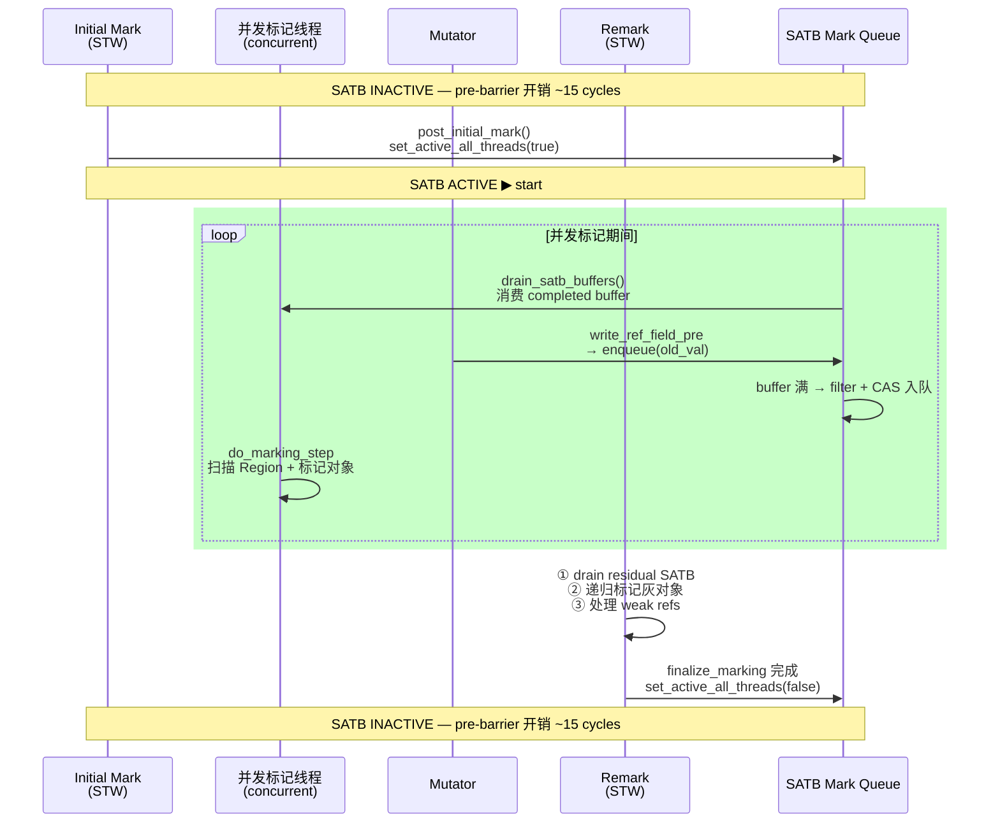

# 05-SATB-Barrier — SATB 前屏障：G1 如何让并发标记安心运行而 mutator 可以继续修改引用

> **阅读收益**：读完本文后，当面试官问"G1 的 SATB 是什么？为什么不记录新值？"——你能从 Wilson 1992 漏标三条件出发，讲清楚 SATB 的正确性保证、与增量更新（CMS 方案）的完整权衡分析、从 `write_ref_field_pre` 内联代码到 `enqueue` → `CAS 入队` → `drain_satb_buffers` → `make_referent_alive` → `Remark 补刀` 的完整数据流，并精准对比 pre-barrier / post-barrier 的 6+ 维度差异。

---

## 标准环境

- OpenJDK 11 slowdebug build
- `-Xms8g -Xmx8g -XX:+UseG1GC`（G1 Region = 4MB，2048 Regions）
- 64 位 Linux x86
- GDB 在 slowdebug build 中验证（`#ifdef ASSERT` 全部生效）

---

## 前置依赖

| 依赖 | 文档 | 关键知识 |
|------|------|---------|
| PtrQueue 基类协议（无锁 bump-pointer + CAS head） | `[04-CardTable-RSet §三]` | SATB 和 DirtyCard 共享同一套无锁生产者-消费者协议 |
| write_ref_field_post（后屏障） | `[04-CardTable-RSet §二]` | G1BarrierSet 双屏障架构：pre → store → post |
| HeapRegion TAMS 概念 | `[01-HeapRegion §三]` | NTAMS（Next Top At Mark Start）是 SATB 快照的空间边界 |
| do_marking_step 完整走读 | `[06-ConcurrentMark-Core]` | SATB drain 在并发标记循环中的位置和优先级 |

---

## §〇 源文件清单（9 文件，行号已 grep 验证）

| # | 文件 | 模块 | 核心函数/类 | 本文角色 |
|---|------|------|------------|---------|
| 1 | `g1BarrierSet.hpp/cpp` | gc/g1 | `class G1BarrierSet`，`write_ref_field_pre()`(L60)，`enqueue()`(L51) | ★★★ 前屏障入口 + SATB 全局状态 |
| 2 | `g1BarrierSet.inline.hpp` | gc/g1 | `write_ref_field_pre` 内联定义(L41-52) | ★★★ 前屏障热路径 |
| 3 | `satbMarkQueue.hpp/cpp` | gc/g1 | `class SATBMarkQueue : public PtrQueue`(hpp:45)，`SATBMarkQueueSet`(hpp:89)，`_shared_satb_queue`(hpp:90)，`set_active_all_threads()`(cpp:256)，`apply_closure_to_completed_buffer()`(cpp:275) | ★★★ SATB 队列核心 |
| 4 | `ptrQueue.hpp/cpp` | gc/g1 | `class PtrQueue`，`_buf`，`_sz`，`_index`，`enqueue_known_active()`(cpp:64)，`class PtrQueueSet`，`_completed_buffers_head` | ★★ SATB/DirtyCard 共享基类（引用 [04 §三]，不重复讲） |
| 5 | `g1ConcurrentMark.hpp/cpp` | gc/g1 | `class G1CMTask`，`drain_satb_buffers()`(cpp:2620)，`do_marking_step()`，**`set_active_all_threads()` 调用点**（cpp:894 激活，cpp:1311 停用，cpp:2269 中止） | ★★★ SATB 消费端 + **激活/停用的实际调用位置** |
| 6 | `g1ConcurrentMarkThread.hpp/cpp` | gc/g1 | `class G1ConcurrentMarkThread`，`run_service()` | ★ 并发标记线程调度（说明激活发生在 post_initial_mark，非 CMT 线程内） |
| 7 | `g1ThreadLocalData.hpp` | gc/g1 | `satb_mark_queue()`(L66)，per-thread SATB 队列访问器 | ★★ per-thread 队列入口 |
| 8 | `g1_globals.hpp` | gc/g1 | `G1SATBBufferSize` 定义(L91-93：`product(size_t, G1SATBBufferSize, 1*K, ...)`) | ★ SATB buffer 大小常量 |
| 9 | `g1CollectedHeap.hpp` | gc/g1 | `G1CollectedHeap`，全局 GC 状态 | ★ 全局入口 |

> 以上行号均已在撰写前 grep 验证。本文代码引用格式：`文件:行号`。

---

## §一 ★ 全景 — 如果没有 SATB，并发标记会出现什么错误？

### ❓ SATB 解决了什么正确性问题？

G1 的并发标记是"**一边跑一边修路**"——标记线程在扫描对象图，mutator 同时修改对象图（覆盖引用、释放引用、创建新引用）。如果不做任何保护，结果就是：**并发标记开始时活的对象，可能因为在标记期间引用变化而丢失**（被误回收）。

#### 1.1 Wilson 1992 漏标三条件

1992 年 Wilson 在论文 *Pointer Reversal Problem* 中精确刻画了并发标记漏标的充要条件：

```
条件①：标记线程已经扫过了 a（a 被标为灰色或黑色）
条件②：Mutator 把 a.x 从 b 改为 c（覆盖了指向 b 的引用）
条件③：标记线程还没扫 b（b 是白色）

如果① + ② + ③ 同时发生 → b 会被漏标！
```

**Mermaid 图 1：漏标三条件的并发时间线（关键：b 只在 bitmap 灰，不在 mark stack）**



**❓ 追问：为什么 b 会在 bitmap 灰但不在 mark stack？**

这是 G1 并发标记的"finger 优化"——当 `global_finger` 还没到达 b 所在的 Region 时，标记线程只把 b 设置为"bitmap 上的灰色"（`mark_bitmap->mark(b)`），不 push 到 mark stack。等到 finger 到达该 Region 时，再扫描这个 Region 的 bitmap 来处理灰色对象。**这个优化减少了 mark stack 的压力，但也创造了漏标的可能性——如果 b 的入边在 finger 到达之前被切断了。**

**完整的漏标时间线（精确版）**：

```
  T0: TAMS 快照——并发标记开始时，top 被记录为 TAMS
      ├─ a 在 TAMS 以下（标记开始前分配）
      └─ b 在 TAMS 以下（标记开始前分配）

  T1: 标记线程扫描 a → 发现 a.x = b
      ├─ b 所在的 Region 的 global finger 尚未到达
      ├─ b 只被标记为灰色（在 marking bitmap 上标记 bit）
      ├─ b 没有 push 到 mark stack（finger 没到）
      ├─ a 标记为黑色（a 的所有引用都已遍历完）
      └─ ★ 条件①成立：a 已被扫过（黑色）

  T2: Mutator 执行 a.x = c;
      ├─ 覆盖了 a.x 指向 b 的引用
      └─ ★ 条件②成立：a.x 从 b 改为 c

  T3: 标记线程的 global finger 到达 b 所在 Region
      → 扫描该 Region 的 bitmap → 发现 b 的 bit 是 gray
      → 但此时没有任何"灰色引用"指向 b（唯一引用 a.x 已改为 c）
      → b 无法从任何 GC root 到达 → b 不会被 push 到 mark stack
      → ★ 条件③成立：b 是"白色" + 没有灰色引用指向它
      → ★ 条件① + ② + ③ 同时发生 → b 被漏标！
```

#### 1.2 SATB vs 增量更新 — 各自如何打破漏标三条件

```
漏标三条件（Wilson 1992）

   条件①：标记线程已扫过 a（a 为黑/灰）
   条件②：Mutator 把 a.x 从 b 改为 c
   条件③：标记线程还没扫 b（b 为白）

                                     
      ┌────┬───────────────┬─────────────────────────────┐
      │方案│   打破哪个条件?   │          实现机制              │
      ├────┼───────────────┼─────────────────────────────┤
      │SATB│   打破条件③    │ 引用被覆盖前，抢救旧值 b         │
      │    │  b 不再"白"    │ b 被 push 到 SATB buffer       │
      │    │               │ drain 时标记 b → 变灰           │
      ├────┼───────────────┼─────────────────────────────┤
      │ IU │   打破条件②    │ 引用被覆盖后，脏化 a 所在的 card  │
      │(CMS)│  a 被标记为脏   │ Remark 阶段重扫所有脏 card      │
      │    │ (需重扫描)       │ → 重扫 a → 跟踪 a.x=c → 确保c可达│
      └────┴───────────────┴─────────────────────────────┘


SATB 打破条件③ — 时间线：

  T1: [条件①] 标记线程扫过 a → a 变黑色
  T2: ★ SATB Pre-barrier 介入：a.x = c 执行前
      → 读旧值 b（RawAccess<MO_VOLATILE>::oop_load(field)）
      → enqueue(b) 到 SATB buffer
      → ★ 打破了条件③：b 不再"白"——它被 SATB 抢救了
  T3: Mutator 真正执行 a.x = c  [条件②成立]
  T4: 标记线程 drain SATB buffer → 发现 b → 标记 b
  T5: b 被正确标记为活对象 ✓


IU（CMS Incremental Update）打破条件② — 时间线：

  T1: [条件①] 标记线程扫过 a → a 变黑色
      → 在 CMS 中，标记线程扫描 a 时会把 a.x = b 中的 b 也 push 到 mark stack
      → b 进入标记队列，等待后续处理
  T2: Mutator 执行 a.x = c → [条件②被"半打破"]
      → IU post-barrier：脏化 a 所在的 card（标记为 dirty）
      → ★ 注意：此时 b 已经在 mark stack 中（T1 时 push 的）
      → b 最终被标记线程处理 → 安全 ✓
  T3: 并发标记阶段结束 → Remark（STW）
      → 遍历所有 dirty cards → 重扫 a 所在的 card → 跟踪 a.x = c
      → ★ IU 真正的贡献：确保新值 c 被正确跟踪
      → 如果 c 引用了其他"标记开始时活"的对象 → IU 保证这些对象也被标记
  ★ IU 保证正确性的核心机制：
    → 并发标记时：a 被扫描时 b（旧值）已经入栈 → b 安全
    → Remark 时：重扫脏卡保证新值 c 被跟踪 → c 及其引用链安全
    → ★ 这就是说 IU 为什么打破的是条件②——让 a 不再是"不可回头的黑色"
      而是通过 dirty card 机制让 a 在 Remark 时被重新 "变灰"
```

#### 1.3 ★★★ 设计替代分析：G1 为什么选 SATB 而不是增量更新（IU）？

这不是"谁更好"的简单问题——而是**适合不同堆大小和回收模型**的设计选择。

**(a) Remark 成本：SATB O(entries) vs IU O(dirty cards)**

这是选择 SATB 最重要的原因：

```
SATB 的 Remark 成本：
  = 排空 residual SATB buffers + 递归标记灰色对象
  = O(SATB buffer entries + grey objects)
  
  SATB buffer 只有 1024 entries/thread × N threads
  → 即使 100 线程全部满 → ~100K entries
  → 每个 entry 只是一个 oop → 标记 + push → O(logN) per entry
  → Remark 暂停可预测且有限

IU 的 Remark 成本（如果 G1 用 IU）：
  = 重新扫描所有并发标记期间 dirty 的 cards
  = O(# dirty cards × 512B per card)
  → 8GB 堆 ÷ 512B/card = 16M cards
  → 如果 mutation rate 高，dirty cards 可能数万到数十万
  → 每个 dirty card 需要扫描 512B 范围（可能含多个对象）
  → Remark 暂停不可预测——取决于 mutator 的行为

数字对比（8GB 堆，8 线程）：
  SATB: 最多 8 × 1024 = 8192 entries → 微秒级
  IU:   可能几万到十万 dirty cards × 512B 扫描 → 毫秒到几十毫秒
```

**(b) G1 的 Region-based + Evacuation 模型容忍 Floating Garbage**

SATB 的保守性带来的 Floating Garbage：

```
T1: 并发标记开始，a.x = b（b 被 SATB 标记为"标记开始时活"）
T2: Mutator 执行 a.x = null（b 变成垃圾）
T3: b 已被标记 → 本轮 GC 不回收 → Floating Garbage

但：
  b 在 Young Region → 下次 Young GC 回收 ✓
  b 在 Old Region → 下次 Mixed GC 回收 ✓

G1 的 Evacuation 模型特点：
  ★ G1 频繁做 Young GC（每耗尽 Eden 就触发）
  ★ Mixed GC 也在多个 cycle 中逐步回收 Old Region
  → Floating Garbage 只多活 1-2 个 cycle
  → 对 G1 的容忍度很高

对比 CMS（Mark-Sweep）：
  ★ CMS 不做 Young GC → 碎片化靠 compact 处理
  ★ CMS 的 Floating Garbage 要等到下一次 CMS cycle
  → CMS 的 cycle 间隔更长 → Floating Garbage 影响更大
  → 但 CMS 用 IU → Floating Garbage 本身就少
```

**(c) Mixed GC 选策需要精确 liveness 预测**

```
G1Policy 在 Mixed GC 选策中需要知道：
  ★ 每个 Old Region 的活对象占比（liveness）
  ★ 选择回收效率最高的 Region 集合
  ★ 预测 GC 暂停时间

SATB 的可预测 remark 时间 → liveness 数据精确且及时
IU 的 remark 时间不可预测 → G1Policy 难以建模 → 可能误选 Region
```

**(d) 为什么 CMS 选 IU？**

```
CMS 堆通常较小（<4GB）→ IU re-scan 的 card 数量有限
CMS 不做 Young GC → Floating Garbage 影响更大 → 需要更精确的标记
CMS 的并发标记和 remark 之间的间隔较长 → IU 重新扫描带来的额外对象较准确
```

**面试一句话**：**"CMS 用增量更新，Remark 要重扫所有脏卡——堆越大越贵。G1 用 SATB，Remark 只排空 buffer——堆大小几乎不影响成本。代价是多保留一 cycle 的 Floating Garbage，但 G1 的 Young/Mixed GC 频繁，能很快回收。"**

#### 1.4 和 04 的 pre-barrier vs post-barrier 全方位对比

| 维度 | `write_ref_field_pre` (SATB) | `write_ref_field_post` (CardTable) |
|------|------------------------------|-----------------------------------|
| **触发时机** | 引用被覆盖**前** | 引用被覆盖**后** |
| **记录内容** | 旧值（被覆盖的 oop） | 新引用目标所在的 card 地址 |
| **存储粒度** | oop（对象指针，8B） | card 地址（1B card × 512B memory） |
| **屏障热路径** | 3 条指令：`RawAccess<MO_VOLATILE>::oop_load`(L47) + `is_null`(L48) + `enqueue`(L50) | 1 条指令：`*byte != g1_young_card_val()`(L57) |
| **过滤逻辑** | 两层：`IS_DEST_UNINITIALIZED` / `AS_NO_KEEPALIVE`(L42-45) → NULL 过滤(L48) | 三层：`young card 过滤`(L57) → `dirty_card_val 过滤`(L176) → `同 Region 过滤`（Refinement 线程中） |
| **入队激活条件** | 仅在并发标记期间激活（`_active=true`） | 始终激活（DirtyCard 队列永不关闭） |
| **per-thread 队列** | `SATBMarkQueue`，1024 entries | `DirtyCardQueue`，256 entries |
| **buffer 大小** | 1024 × 8B = 8KB (`G1SATBBufferSize=1K`) | 256 × 8B = 2KB (`G1UpdateBufferSize=256`) |
| **消费者** | 并发标记线程（`G1CMTask::drain_satb_buffers`） | Refinement 线程池（`G1ConcurrentRefineThread`） |
| **消费产出** | 标记对象（`make_referent_alive` → push mark stack） | 更新 RSet（`refine_card_concurrently` → Sparse/Fine/Coarse） |
| **active 生命周期** | 并发标记开始激活，Remark 完成停用 | 始终激活 |
| **共享队列** | `_shared_satb_queue` + `Shared_SATB_Q_lock` | `_shared_dirty_card_queue` + `Shared_DirtyCardQ_lock` |
| **非 Java 线程处理** | 加锁写入 shared queue | 加锁写入 shared queue |
| **正确性保证** | 保证并发标记开始时活的对象不被漏标 | 维护 RSet 跨 Region 引用索引，让 Young GC 不用全堆扫描 |
| **详细文档** | **本文** | `[04-CardTable-RSet §二 ~ §三]` |

---

## §二 ★★★ G1BarrierSet::write_ref_field_pre — 前屏障全链走读

### ❓ 为什么读旧值用 `RawAccess<MO_VOLATILE>::oop_load` 而不是普通 load？

**逐行走读 `g1BarrierSet.inline.hpp:41-52`：**

```cpp
template <DecoratorSet decorators, typename T>
inline void G1BarrierSet::write_ref_field_pre(T* field) {
  // 第〇层过滤：编译器模板参数
  // IS_DEST_UNINITIALIZED = 目标未初始化 → 不可能有"旧值" → 跳过
  // AS_NO_KEEPALIVE = 不需要 keepalive → GC 不关心这个引用 → 跳过
  if (HasDecorator<decorators, IS_DEST_UNINITIALIZED>::value ||
      HasDecorator<decorators, AS_NO_KEEPALIVE>::value) {
    return;                                     // ← 编译期决定的分支，无条件跳转
  }

  // ★ 核心：读旧值
  T heap_oop = RawAccess<MO_VOLATILE>::oop_load(field);

  // 第一层过滤：NULL 旧值 → 不需要记录（null 不会变成"被覆盖的活引用"）
  if (!CompressedOops::is_null(heap_oop)) {
    g1_pre_barrier_hit_count++;                 // 统计计数器
    enqueue(CompressedOops::decode_not_null(heap_oop));
  }
}
```

**❓ 为什么用 `MO_VOLATILE` 而不是一个普通的内存屏障？**

关键是理解：**pre-barrier 的 load 和后续 store 之间不需要 ordering**——这和 post-barrier 截然不同。更深层的问题是：如果 pre-barrier 的 load 被编译器/JIT 重排到 store 之后（读到了新值 c 而不是旧值 b），为什么不会产生正确性问题？

```
核心论证 — pre-barrier 正确性的双层防御体系：

  ★ 第一层（x86 TSO 硬件保证）：
    x86 是 TSO (Total Store Order) 内存模型 → 硬件禁止 Load→Store 重排。
    这意味着 pre-barrier 的 load(old_value) 不可能跑到 store(new_value) 之后执行。
    因此 pre-barrier 读到的值必然是 store 发生**之前**的值 → 即旧值 b ✓
    
  ★ 第二层（Remark STW 兜底）：
    即使在某些弱内存模型平台（ARM/PowerPC）上可能出现 load 偏新，
    或者 JIT 编译器因激进优化导致屏障效果减弱——
    Remark 阶段会重新扫描所有 SATB buffer + 所有已标记对象的引用字段。
    Remark 是 STW → 不存在并发引用修改 → 任何被"漏掉"的旧值都会在 Remark 被补标。

  ★ 结论：MO_VOLATILE 防御的是编译器将 load 优化成寄存器缓存（不产生真实内存读）。
    x86 TSO 硬件禁止 Load→Store 重排，Remark STW 作为最终 safetynet。
    这是「硬件保证 + 软件兜底」的双层防御，而非"读到新值也安全"的单层推理。

对比 post-barrier 的内存语义（来自 [04 §二]）：

  post-barrier 需要 OrderAccess::storeload():
    → store: 引用写入完成
    → storeload fence: 保证 store 对后续 load 可见
    → load: GC 在 safepoint 扫描 RSet
    ★ 如果没有 storeload → GC 可能看到 stale 的卡表状态 → 漏扫描跨 Region 引用
    ★ 原因：post-barrier 没有"兜底机制"——一旦 card 没被 dirty，永久丢失
    ★ pre-barrier 有 Remark 兜底：即使 SATB 漏了一个 entry，Remark 的
       递归标记灰色对象仍然可能通过其他路径发现该对象。
```

**一句话**：`MO_VOLATILE` 足够了——它保证读到的是"当前 field 的值"（可能偏新也可能偏旧，但不会是编译器缓存的 stale 值），而 Remark 阶段提供最终 safety net。post-barrier 没有 Remark 这样的二次确认机制——如果没有 storeload，card 一旦没被 dirty，就没机会弥补了。

### ❓ 和 post-barrier 的调用顺序（pre → store → post）

```
Mutator 写引用 a.x = c;  （假设 a.x 原来是 b）

     ┌─────────────────────────────────────────────┐
     │  ① write_ref_field_pre(&a.x)                │
     │     → 读旧值 b（RawAccess<MO_VOLATILE>）     │
     │     → b != null → enqueue(b)                │
     │     → b 被保存到 per-thread SATB buffer      │
     ├─────────────────────────────────────────────┤
     │  ② ★ store 发生                              │
     │     a.x = c                                 │
     │     → 现在 a 指向 c 而不是 b                   │
     ├─────────────────────────────────────────────┤
     │  ③ write_ref_field_post(&a.x, c)            │
     │     → *byte = card_byte_for(&a.x)            │
     │     → 如果 card 不是 young → dirty + 入队     │
     │     → [04-CardTable-RSet §二 详细走读]       │
     └─────────────────────────────────────────────┘

  为什么必须是这个顺序？

    pre 在 store 之前：
      → 保证旧值 b 在 b 被"切断"之前就被记录下来
      → 如果先 store 再 pre → pre 读到的就是新值 c → 旧值 b 丢失

    post 在 store 之后：
      → 新引用 c 已经建立 → 可以确定 c 所在的 card
      → 确定 card 之后才能脏化 → RSet 记录跨 Region 引用
```

**JIT 编译器插入的汇编（概念级）**：

```asm
; a.x = c;  其中 TOS = c

; ① pre-barrier
mov  %rsi, [a + field_offset]    ; 读旧值（MO_VOLATILE → 内存 load）
test %rsi, %rsi                  ; NULL 检查
jz   skip_pre                    ; NULL → 跳过
call G1BarrierSet::enqueue       ; 入队旧值
skip_pre:

; ② store
mov  [a + field_offset], c       ; 引用写入

; ③ post-barrier
mov  %al, [card_table + a>>9]    ; 读 card byte
cmp  $g1_young_card_val, %al     ; 过滤 young card
je   skip_post                   ; young → 跳过
call write_ref_field_post_slow   ; 脏化 + 入队
skip_post:
```

### ❓ 并发标记期间 vs 非标记期间：`is_active()` 的分支行为

```cpp
// g1BarrierSet.cpp:128-146
void G1BarrierSet::enqueue(oop pre_val) {
  assert(oopDesc::is_oop(pre_val, true), "Error");

  // ★ 第二层过滤：SATB 队列集是否活跃
  if (!_satb_mark_queue_set.is_active()) return;
  //  └─ 非并发标记期间 → 直接返回 → ~1 cycle 开销

  _satb_enqueue_count++;
  if ((_satb_enqueue_count & 1023) == 0) {
    INST_LOG_GC("SATB enqueue: count=%zu, pre_val=" PTR_FORMAT, ...);
  }

  Thread* thr = Thread::current();
  if (thr->is_Java_thread()) {
    G1ThreadLocalData::satb_mark_queue(thr).enqueue(pre_val);       // 无锁写入
  } else {
    MutexLockerEx x(Shared_SATB_Q_lock, ...);
    _satb_mark_queue_set.shared_satb_queue()->enqueue(pre_val);     // 加锁写入
  }
}
```

**职责分离设计**：

| 位置 | 检查 | 职责 |
|------|------|------|
| `write_ref_field_pre`（inline） | `IS_DEST_UNINITIALIZED` / `AS_NO_KEEPALIVE` + NULL 过滤 | 读旧值，快速过滤不需要 SATB 的情况 |
| `enqueue()`（cpp） | `is_active()` | 判断是否真的需要入队——这是 enqueue 的决策 |
| `PtrQueue::enqueue_known_active()`（ptrQueue.cpp:64） | `_index == 0`（buffer 满） | buffer 满时 CAS 入队 + 申请新 buffer |

**设计意图**：inline 代码不关心并发标记是否在运行——它只做"读旧值 + NULL 过滤"。ACTIVE 检查放在 `enqueue()` 中，因为 `enqueue()` 是一个 out-of-line 调用（不是 inline），额外多一个 `if` 检查几乎没成本。

**非并发标记期间的 overhead**：
```
write_ref_field_pre inline：
  IS_DEST_UNINITIALIZED 检查 → 编译期常量，无运行时开销（模板特化）
  AS_NO_KEEPALIVE 检查 → 同上
  RawAccess<MO_VOLATILE>::oop_load → ★ ~3-5 cycles（从内存 load）
  !CompressedOops::is_null → ~1 cycle
  call enqueue → ★ function call overhead ~5-10 cycles
    enqueue 内部 → is_active() 检查 → return → ~2 cycles
  ★ 总 overhead：~10-15 cycles（非并发标记期间，大部分时间）

并发标记期间增设：
  + enqueue_known_active → bump-pointer 递减 + 写 _buf → ~3 cycles
  + 如果 buffer 满 → handle_zero_index → CAS + alloc → ~100-200 cycles（非常罕见）
```

### ❓ write_ref_array_pre — 数组批量处理

```cpp
// g1BarrierSet.cpp:148-158
template <class T> void
G1BarrierSet::write_ref_array_pre_work(T* dst, size_t count) {
  if (!_satb_mark_queue_set.is_active()) return;
  T* elem_ptr = dst;
  for (size_t i = 0; i < count; i++, elem_ptr++) {
    T heap_oop = RawAccess<>::oop_load(elem_ptr);  // ★ 数组用普通 load，非 volatile
    if (!CompressedOops::is_null(heap_oop)) {
      enqueue(CompressedOops::decode_not_null(heap_oop));
    }
  }
}
```

注意：数组批量处理使用 `RawAccess<>::oop_load`（非 volatile），因为：
- 数组 `dst` 是 mutator 独占的（批量拷贝的目标 `System.arraycopy` 的 dst 数组），不存在并发写
- 不需要 volatile 的额外内存屏障开销

---

## §三 ★★★ SATBMarkQueue — per-thread 无锁队列

### ❓ 为什么 1024 entries？和 DirtyCardQueue 的 256 entries 相比为什么不同？

**Mermaid 图 2：SATB buffer 完整流转路径**



#### PtrQueue 基类字段（引用 [04 §三]）

SATBMarkQueue 继承自 PtrQueue，共享同样的三字段设计：

```
SATBMarkQueue (per-thread)
  ├─ 继承 PtrQueue:
  │   ├─ void** _buf       → buffer 指针，1024 entries × 8B = 8KB
  │   ├─ size_t _index     → 写游标（bump-pointer 递减模式）
  │   ├─ size_t _sz         → buffer 容量（element 数）
  │   └─ bool _active       → ★ SATB 独有：可动态激活/停用
  │
  └─ SATB 独有:
      └─ filter()          → 过滤 buffer 中不需要标记的条目
```

#### SATB vs DirtyCard 的 6 维度对比

| 维度 | SATBMarkQueue | DirtyCardQueue |
|------|--------------|----------------|
| **entry 语义** | oop（对象指针，8B） | card 地址（8B void*，指向 1B card） |
| **buffer 大小** | 1024 entries = 8KB | 256 entries = 2KB |
| **触发频率** | 每次旧值 != null 的引用覆盖 | 每次跨 Region 引用写入（young card 已过滤） |
| **过滤逻辑** | 无 inline 过滤（只能过滤 NULL + IS_DEST_UNINITIALIZED） | Young card 过滤（inline，byte load + compare，~3 cycles） + Dirty card 过滤 |
| **消费者** | 单个 marking thread（G1CMTask per worker） | Refinement 线程池（多个 G1ConcurrentRefineThread） |
| **积压风险** | 低（consumer 是标记线程，只处理自己的 worker 的 buffer） | 高（consumer 是后台线程，mutator 快时可能积压） |
| **全局参数** | `G1SATBBufferSize=1024` | `G1UpdateBufferSize=256` |

#### ❓ 为什么 SATB buffer 更大（1024 vs 256）？

**核心原因：SATB entry 是无过滤的，DirtyCard entry 有 young card 过滤。**

```
DirtyCard（post-barrier）：
  write_ref_field_post → 检查 card byte
    → 引用写入的目标大概率在 Young Region → young card → 跳过（不插桩）
    → ★ 注意：准确的 young/non-young 比例取决于应用分配模式
    → 256 entries 在"inline 过滤后"足够缓冲

SATB（pre-barrier）：
  write_ref_field_pre → 检查 NULL + IS_DEST_UNINITIALIZED
    → 只排除 NULL 和未初始化目标（这两种情况本身就很少）
    → 绝大多数非 NULL 引用覆盖都会进入 SATB 队列
  → 如果用 256 entries → buffer 会频繁满 → 频繁 CAS 入队
  → 1024 entries 平衡：够大不频繁满，够小能用完就换
```

**如果 SATB 用 256 entries 会怎样？**

```
高 mutation rate 场景（如频繁更新 HashMap 的引用）：
  → 每个线程每秒 ~10K 次引用覆盖
  → 256 entries → 每 25ms 满一次 → CAS 入队 + 申请新 buffer
  → 标记线程被频繁打断（每次都要消费 completed buffer）
  → do_marking_step 不断被 abort + restart → 并发标记效率下降

1024 entries 下：
  → 每 100ms 满一次 → 标记线程有足够时间片做有效的标记扫描
  → remark 阶段处理的 residual buffer 也更多（但已有上限 → 可预测）
```

#### ❓ SATB 为什么没有"同 Region 过滤"这样的优化？

```
SATB 记录的是"旧值 b"——在引用被覆盖之前。

场景：
  a（在 Region X）→ b（在 Region Y）
  Mutator：a.x = c  → 覆盖了指向 b 的引用

此时 SATB 需要记录 b → 因为 b 可能是"标记开始时活"的对象。
关键：SATB 无法在 write_ref_field_pre 的 inline 代码中判断
"b 是否在标记开始时活"——判断需要：
  1. 知道 b 所在 Region 的 NTAMS 位置
  2. 判断 b 是否 < NTAMS → heap_region_containing(b) 需要 ~10+ cycles

所以 SATB 选择"先记录，后过滤"——drain 时通过 filter() 函数判断
entry 是否真正需要标记（requires_marking 检查 NTAMS）。

DirtyCard 可以 inline 过滤 young card——因为 card byte 的值就直接
存储在 card table 中（一次 byte load + compare），不需要查 Region 元数据。
```

### ❓ SATBMarkQueue 和 SATBMarkQueueSet 的架构 — shared queue 的作用？

```cpp
// g1BarrierSet.cpp:139-145 (enqueue 中)
Thread* thr = Thread::current();
if (thr->is_Java_thread()) {
  G1ThreadLocalData::satb_mark_queue(thr).enqueue(pre_val);  // 无锁
} else {
  MutexLockerEx x(Shared_SATB_Q_lock, Mutex::_no_safepoint_check_flag);
  _satb_mark_queue_set.shared_satb_queue()->enqueue(pre_val); // 加锁
}
```

**❓ 哪些非 Java 线程会触发 SATB？**

非 Java 线程也可能操作堆中的 oop：
- **VMThread**：在 safepoint 执行 VM 操作（如类卸载、偏向锁撤销）、可能移动/扫描 oop
- **CompilerThread**：JIT 编译时加载 constant pool 中的引用（OopMap 更新）
- **ServiceThread**：执行 JVMTI 操作

这些线程没有 per-thread SATB 队列 → 需要写入 `_shared_satb_queue`。

**❓ 为什么 non-Java 线程不能用 per-thread 队列？**

```
G1ThreadLocalData 只附着在 JavaThread 对象上（Thread::gc_data() 偏移）
→ CompilerThread / VMThread 没有 G1ThreadLocalData
→ 没有 per-thread SATBMarkQueue

设计权衡：
  ★ non-Java 线程极少触发引用覆盖 → shared queue + 加锁可以接受
  ★ 如果为所有线程都分配 8KB buffer → 浪费内存（CompilerThread 可能从不触发 SATB）
  ★ Shared_SATB_Q_lock 的竞争极低（只有 non-Java 线程使用，且频率极低）
```

### ❓ SATB buffer 满了之后怎么办？

和 DirtyCardQueue 共享同一个 PtrQueue 的协议（`[04 §三.2]`）：

```
PtrQueue::enqueue_known_active(void* ptr)    // ptrQueue.cpp:64-74
  while (_index == 0) {                      // buffer 满了
    handle_zero_index();                      // → CAS 入队 + 申请新 buffer
  }
  _index -= _element_size;                    // bump-pointer 递减
  _buf[index()] = ptr;                        // 写入

但 SATB 有自己的 should_enqueue_buffer() 重写 → filter!
```

**SATB 独有的优化：filter + should_enqueue_buffer()**

```cpp
// satbMarkQueue.cpp:160-177
bool SATBMarkQueue::should_enqueue_buffer() {
  filter();  // ★ 先过滤！移除不需要的条目

  size_t cap = capacity();
  size_t percent_used = ((cap - index()) * 100) / cap;
  // G1SATBBufferEnqueueingThresholdPercent 默认 = 60
  //   → 过滤后使用率 > 60% → 入队（保留有效条目多，值得 drain）
  //   → 过滤后使用率 ≤ 60% → 重用 buffer（大部分条目被过滤掉了，省一次 CAS）
  bool should_enqueue = percent_used > G1SATBBufferEnqueueingThresholdPercent;
  return should_enqueue;
}
```

**为什么合算？**

```
场景：并发标记快结束时，mutator 写入的新引用大部分指向 TAMS 以上的新对象
→ 这些 entry 被 filter() 移除（requires_marking 返回 false）
→ 过滤后 buffer 使用率很低 → 不 CAS 入队 → 直接重用 buffer
→ 避免了：
  1. CAS 竞争（操作全局 _completed_buffers_head）
  2. buffer 分配和回收
  3. 标记线程不必要的 dequeue + drain 工作
```

**filter() 的 Two-Fingered Compaction 算法**（`satbMarkQueue.cpp:115-152`）：

```
filter() 算法（Two-Fingered Compaction）:

  buf: [ _index → ...         ← capacity() ]
       [ entries ...           end ]

  src 从 _index 位置开始（最低可用 entry）
  dst 从 capacity() 位置开始（buffer 底部）

  while src < dst:
    1. src 从低向高找"需要保留的 entry"（retain_entry）
    2. dst 从高向低找"可以丢弃的 entry"（!retain_entry）
    3. 把保留的 entry 移到丢弃位置

  最后 set_index(dst - buf) → 压缩后的有效区域

  retain_entry(entry):        // satbMarkQueue.cpp:106-108
    requires_marking(entry)      // entry < NTAMS → 需要标记
    && !is_marked_next(entry)    // 还没被标记 → 需要处理
```

### ❓ 消费者端：drain_satb_buffers 做了什么？

```cpp
// g1ConcurrentMark.cpp:2620-2657
void G1CMTask::drain_satb_buffers() {
  if (has_aborted()) return;

  _draining_satb_buffers = true;        // ★ 防止 regular_clock 触发 abort

  G1CMSATBBufferClosure satb_cl(this, _g1h);   // 创建 SATB closure
  SATBMarkQueueSet& satb_mq_set = G1BarrierSet::satb_mark_queue_set();

  size_t buffers_processed = 0;
  while (!has_aborted() &&
         satb_mq_set.apply_closure_to_completed_buffer(&satb_cl)) {
    // apply_closure_to_completed_buffer:
    //   1. MutexLock pop from _completed_buffers_head (含 tail/_n_completed 原子更新)
    //   2. cl->do_buffer(buf + index, size - index)
    //   3. deallocate_buffer(nd)
    buffers_processed++;
    regular_clock_call();
  }

  _draining_satb_buffers = false;
  decrease_limits();
}
```

**`apply_closure_to_completed_buffer` 的 MutexLock 取队协议**（`satbMarkQueue.cpp:275-298`）：

```cpp
bool SATBMarkQueueSet::apply_closure_to_completed_buffer(SATBBufferClosure* cl) {
  BufferNode* nd = NULL;
  {
    MutexLockerEx x(_cbl_mon, Mutex::_no_safepoint_check_flag);
    if (_completed_buffers_head != NULL) {
      nd = _completed_buffers_head;
      _completed_buffers_head = nd->next();    // ★ Mutex 保护下 pop head（非 CAS）
      if (_completed_buffers_head == NULL) _completed_buffers_tail = NULL;
      _n_completed_buffers--;
      if (_n_completed_buffers == 0) _process_completed = false;
    }
  } // 释放锁 → 其他消费者可以同时 pop
  if (nd != NULL) {
    void **buf = BufferNode::make_buffer_from_node(nd);
    size_t index = nd->index();
    size_t size = buffer_size();
    cl->do_buffer(buf + index, size - index);   // 处理 buffer
    deallocate_buffer(nd);                        // 回收 buffer 内存
    return true;
  }
  return false;
}
```

**❓ 为什么生产者用 CAS（Atomic::cmpxchg）入队，消费者用 Mutex 取队？**

这是 `_completed_buffers_head` 链表的不对称设计，理由深刻：

```
生产者（PtrQueue::enqueue_completed_buffer）：
  → 单变量 CAS：只需原子更新 _completed_buffers_head 指针
  → 高频操作（每个线程 buffer 满时触发）
  → CAS 无锁 → 极低延迟 → 适合热路径

消费者（apply_closure_to_completed_buffer）：
  → 多变量原子更新：pop 时需要同时更新 3 个变量：
      _completed_buffers_head   → 指向下一个节点
      _completed_buffers_tail   → 如果链表空了，tail 也要置 NULL
      _n_completed_buffers       → 计数器递减
  → 这三个变量需要原子地一起修改 → 单一 CAS 不够
  → Mutex 包住整个 critical section → 正确性保证
  → 低频操作（标记线程每轮 drain 时调用）→ 锁开销可接受
```

**一句话**：生产者热路径上的单指针 CAS 是经典的无锁设计；消费者需要原子修改 3 个关联变量，Mutex 是最简单正确的方案。这在 [04 §三.2] 中 DirtyCardQueue 的协议里也是完全一致的。

---

## §四 ★★ SATB 激活/停用生命周期

### ❓ 什么时候激活？什么时候停用？不激活时 overhead 多大？

**Mermaid 图 3：SATB 激活/停用与并发标记各阶段的关系**



```
                          SATB 激活/停用时间线（文字描述）

   Initial Mark           Remark
   (STW)                  (STW)
    │                      │
    │ ┌─post_initial_mark  │ ┌─finalize_marking
    │ │  set_active_all    │ │  set_active_all
    │ │  _threads(true)    │ │  _threads(false)
    │ │                    │ │
    ▼ ▼                    ▼ ▼
    ═══════════════════════════════════════════════════
          SATB ACTIVE (并发标记期间)
          pre-barrier 记录旧值到 SATB buffer
    ═══════════════════════════════════════════════════
    
    SATB INACTIVE                              SATB INACTIVE
    pre-barrier: is_active() → return          pre-barrier: is_active() → return
    overhead: ~10-15 cycles                      overhead: ~10-15 cycles
```

#### 激活点：`post_initial_mark` → `set_active_all_threads(true, false)`

```cpp
// g1ConcurrentMark.cpp:884-903
void G1ConcurrentMark::post_initial_mark() {
  // 并发标记的 Initial Mark（STW 暂停）结束后立即调用
  
  ReferenceProcessor* rp = _g1h->ref_processor_cm();
  rp->enable_discovery();
  rp->setup_policy(false);

  SATBMarkQueueSet& satb_mq_set = G1BarrierSet::satb_mark_queue_set();
  // ★ 关键参数：
  //   new_active = true        → 激活所有 SATB 队列
  //   expected_active = false  → 断言：所有队列当前都是 false
  satb_mq_set.set_active_all_threads(true, /* new active value */
                                     false /* expected_active */);

  _root_regions.prepare_for_scan();
  // ... 后续并发标记线程开始并发标记
}
```

#### `set_active_all_threads` 实现

```cpp
// satbMarkQueue.cpp:256-266
void SATBMarkQueueSet::set_active_all_threads(bool active, bool expected_active) {
  assert(SafepointSynchronize::is_at_safepoint(), "Must be at safepoint.");
  // ★ 必须 safepoint：保证所有 Java 线程暂停，安全遍历线程列表
#ifdef ASSERT
  verify_active_states(expected_active);
#endif
  _all_active = active;     // ① 设置全局状态
  
  for (JavaThreadIteratorWithHandle jtiwh; JavaThread *t = jtiwh.next(); ) {
    G1ThreadLocalData::satb_mark_queue(t).set_active(active);  // ② 遍历所有线程
  }
  shared_satb_queue()->set_active(active);  // ③ 共享队列
}
```

**❓ 为什么必须 safepoint？**

```
如果不在 safepoint：
  → mutator 线程可能正在并发运行
  → write_ref_field_pre inline 代码正在执行
  → enqueue() 正在检查 is_active()
  → set_active(true) 和 is_active() 之间没有原子性保证
  → 线程可能"一半看到 active=true，一半看到 active=false" → 状态不一致

在 safepoint：
  → 所有 Java 线程停止 → 没有人正在执行 barrier
  → 可以安全地批量修改所有线程的 _active 字段
  → 修改完成后 → 所有线程同步恢复运行 → 状态一致
```

#### 停用点：`remark()` → `set_active_all_threads(false, true)`

```cpp
// g1ConcurrentMark.cpp:1307-1313
// remark() 方法内部，标记完成之后

SATBMarkQueueSet& satb_mq_set = G1BarrierSet::satb_mark_queue_set();
// ★ 关键参数：
//   new_active = false       → 停用所有 SATB 队列
//   expected_active = true   → 断言：所有队列当前都是 true
satb_mq_set.set_active_all_threads(false, /* new active value */
                                   true /* expected_active */);
```

**❓ 为什么在 Remark 中停用而不是等到 Remark 结束后（Cleanup 时）？**

```
★ 注意精确时间点：
  停用发生在 remark() 方法内部、finalize_marking 完成之后，
  但 Remark 阶段本身还未完全结束（weak ref processing 等后续步骤在此之后）。

Remark 的 finalize_marking 完成 = 完整的标记边界确定
  → 所有"标记开始时活" + SATB 抢救的对象都已标记
  → mark stack 中的灰色对象全部展开完毕
  → 不再有新的"标记开始时活的对象"需要保护
  → 继续运行 SATB 只会记录无用的旧值

Cleanup 阶段：
  → 只做"统计 liveness + 回收完全空的 Region + 回收已标记的 Humongous"
  → 不需要 SATB 保护——Cleanup 是纯统计和回收，没有标记活动

早停用早省开销：早在 Remark 内就停用 ≈ 在 Cleanup 之前就止损
  → ~15-30 cycles per reference write
```

#### ❓ 线程创建时如何初始化 SATB ？并发标记正在进行中怎么办？

```cpp
// g1BarrierSet.cpp:256-284
void G1BarrierSet::on_thread_attach(JavaThread* thread) {
  assert(!SafepointSynchronize::is_at_safepoint(),
         "We should not be at a safepoint");
  // ★ 线程创建时 SATB 默认未激活（构造函数中 active=false）
  assert(!G1ThreadLocalData::satb_mark_queue(thread).is_active(),
         "SATB queue should not be active");
  assert(G1ThreadLocalData::satb_mark_queue(thread).is_empty(),
         "SATB queue should be empty");
  // DirtyCard 队列始终激活（对比）
  assert(G1ThreadLocalData::dirty_card_queue(thread).is_active(),
         "Dirty card queue should be active");

  // ★ 如果并发标记正在进行 → 手动激活新线程的 SATB 队列
  if (_satb_mark_queue_set.is_active()) {
    G1ThreadLocalData::satb_mark_queue(thread).set_active(true);
  }
}
```

**❓ 为什么 on_thread_attach 不在 safepoint？**

注释（`g1BarrierSet.cpp:257-274`）解释得很清楚：

```
set_active_all_threads 在 safepoint 中批量设置所有现有线程
但新线程的创建不在 safepoint 中：
  → Threads::add() 持有 Threads_lock（不是 safepoint）
  → on_thread_attach() 在 Threads::add() 中被调用
  → 此时可以安全地读取 _satb_mark_queue_set.is_active()
  → 因为 _all_active 的修改只在 safepoint 发生
  → 当前非 safepoint → is_active() 的值不会被并发修改
```

#### ❓ 线程销毁时 SATB buffer 去哪了？

```cpp
// g1BarrierSet.cpp:286-291
void G1BarrierSet::on_thread_detach(JavaThread* thread) {
  CardTableBarrierSet::on_thread_detach(thread);
  G1ThreadLocalData::satb_mark_queue(thread).flush();     // ★ flush
  G1ThreadLocalData::dirty_card_queue(thread).flush();
}
```

```cpp
// satbMarkQueue.cpp:48-53
void SATBMarkQueue::flush() {
  filter();       // 先过滤 → 移除不需要的条目
  flush_impl();   // → 如果还有剩余 → 将 buffer CAS 入队到 _completed_buffers_head
}
```

**❓ 为什么必须 flush？**

```
线程即将被销毁 → 线程的 per-thread buffer 内存会被回收
但 buffer 中还有未处理的 SATB entry → 这些 oop 指向的对象需要被标记
如果不 flush → 这些 oop 丢失 → 漏标

flush 保证：
  → filter() 移除"不需要标记"的条目（如 TAMS 以上的对象）
  → flush_impl() 将残留 buffer CAS 入队 → 标记线程最终会 drain
```

---

## §五 ★★ SATB drain 在并发标记中的位置

### ❓ 为什么 SATB drain 是 do_marking_step 的最高优先级？

```cpp
// g1ConcurrentMark.cpp:2847-2854
// do_marking_step() 开头：
// "First drain any available SATB buffers. After this, we will not
//  look at SATB buffers before the next invocation of this method."
drain_satb_buffers();     // ← ★ 最高优先级，第一步！
drain_local_queue(true);   // ← 第二步：局部队列
drain_global_stack(true);  // ← 第三步：全局栈
```

**核心原因**：SATB buffer 中的 oop 指向的"旧值对象"**不在 mark stack 中，也不在任何灰色对象路径上**。

```
SATB buffer 中的 oop：
  → 这些 oop 是 mutator 覆盖引用时"抢救"下来的
  → 它们在对象图中已经被"切断"了（引用已被覆盖）
  → 如果不处理它们 → 永远不会有灰色引用指向它们
  → ★ 它们是"孤儿"（orphan）——唯一的引用就在 SATB buffer 中

而 local queue / global mark stack 中的对象：
  → 它们有"灰色引用"在队列中 → 即使暂不处理，也不会丢失
  → 最多是"灰色指向它们"没有被递归展开 — 但最终会被处理

所以 SATB drain 是最高优先级 → 先把"孤儿"抢救回来 → 再处理正常引用链。
```

#### do_marking_step 内部处理顺序

```
do_marking_step(time_target_ms, do_termination, is_serial):
  
  ① drain_satb_buffers()             ★ 第一步：抢救孤儿
     → 遍历 _completed_buffers_head
     → G1CMSATBBufferClosure::do_buffer
     → make_referent_alive(oop)
     → push oop to mark stack
  
  ② drain_local_queue(true)          ★ 第二步：局部队列
  ③ drain_global_stack(true)         ★ 第三步：全局栈
  
  ④ do {                              ★ 主循环
      scan bitmap of current region   → 扫描 Region
      claim next region                → 声索下一个 Region
     } while (_curr_region != NULL && !has_aborted());
  
  ⑤ drain_satb_buffers()             ★ 再 drain 一次（减少 remark 工作）
  ⑥ drain_local_queue(false)          ★ 完全耗尽局部和全局队列
  ⑦ drain_global_stack(false)
  ⑧ steal from other tasks            ★ 工作窃取
```

**❓ 为什么 do_marking_step 末尾还要再 drain 一次 SATB？**

```
do_marking_step 执行期间：
  → mutator 还在写 → 可能有新的 SATB entry 入队
  → 新的 completed buffer 可能已经被 CAS 到 _completed_buffers_head

末尾再次 drain：
  → 减少 remark 阶段的工作量
  → remark 是 STW → drain 越少 → remark 暂停越短
  → 这是一种"尽量在并发阶段多做一些"的优化
```

### ❓ Remark 阶段为什么还需要 drain SATB？并发标记期间不是一直在 drain 吗？

Remark 阶段（STW）需要处理并发标记期间无法保证的部分：

```
并发标记结束瞬间的 race condition：

  T1: 标记线程 drain 完所有 completed buffer → completed_buffers_num = 0
  T2: Mutator 写 a.x = c → pre-barrier → enqueue(b) → buffer 满了
      → CAS 入队到 _completed_buffers_head
  T3: 标记线程将 b 从 mark stack 展开 → 继续标记
  T4: ★ 标记线程发现"所有灰色对象都处理完了" → 标记结束
      但 T2 中入队的 SATB buffer 还没被 drain！
  T5: ★ 进入 Remark 前：标记线程可能宣布"标记完成"
      但 _completed_buffers_head 还有新入队的 buffer

  必然结论：并发标记无法保证"最后一个 SATB entry"被 drain。
  只有 STW 下才能确保所有 buffer 被排空。
  
Remark 做了什么？
  ① 所有线程暂停 → 不再有新的 SATB 入队
  ② drain 所有 residual SATB buffer:
     G1CMTask::drain_satb_buffers() → apply_closure_to_completed_buffer
  ③ 递归标记所有灰色对象（mark stack 中的）
  ④ 处理 weak references
  ⑤ 最终确定标记边界
```

**用并发时间线看 Remark 的必要性**：

```
  并发标记线程                Mutator 线程
      │                        │
      │ drain_satb_buffers    │
      │ completed_buffers=0   │
      │                        │ a.x = c → pre-barrier → enqueue(b)
      │                        │ SATB buffer 满了 → CAS 入队
      │                        │
      │ drain_local/global    │
      │ "标记似乎完成了..."    │
      │                        │
      │ ★ enter Remark (STW)     │ ★ 被暂停
      │ drain_satb_buffers      │ （不再有新的 SATB 入队）
      │ → 处理 b              │
      │ drain_local/global    │
      │ → 标记完成 ✓           │
```

---

## §六 ★ 面试问题合集

### Q1: SATB 和 CardTable 两个 barrier 有什么区别？

**一句话**：**SATB（前屏障）存旧值，保证并发标记不丢活对象；CardTable（后屏障）脏化卡，维护 RSet 让 Young GC 不用全堆扫描。两套队列共享同一个无锁 PtrQueue 基类。**

参见 [§一.4 对比表](#14-和-04-的-pre-barrier-vs-post-barrier-全方位对比)，6+ 维度完整对比。

### Q2: 增量更新（IU）和 SATB 哪个更好？

**一句话**：**不是"谁更好"——是适合不同的堆大小。CMS（<4GB）用 IU，G1（8-64GB）用 SATB——核心差异是 Remark 暂停的确定性。**

参见 [§一.3 设计替代分析](#13--设计替代分析g1-为什么选-satb-而不是增量更新iu)，完整展开。

### Q3: ★★★ 为什么 G1 选 SATB 而不是增量更新？

**三个架构级原因**：

1. **SATB 的 Remark 时间 = O(SATB entries)**，不随堆大小/脏卡数增长。对于 8GB+ 的 G1 堆，IU 的 Remark 重扫成百上千脏卡将是灾难性的。

2. **G1 的 Region-based + Evacuation 模型容忍 Floating Garbage**：SATB 保守保留的对象在下一个 Young/Mixed GC cycle 就会被回收（只多活 1-2 cycle）。

3. **Mixed GC 选策需要精确 liveness 预测**：SATB 可预测的 remark 时间让 G1Policy 能准确预测暂停，从而选出最优的 Region 集合。

### Q4: Remark 阶段为什么要 STW？

**一句话**：并发标记结束时，无法判断"标记是否真的完成了"——mutator 可能恰好在最后一刻入队了 SATB entry 或产生新的灰色对象。只有 STW 排空所有 SATB + mark stack，才能确定标记边界。

参见 [§五 Remark 分析](#-remark-阶段为什么还需要-drain-satb并发标记期间不是一直在-drain-吗)。

### Q5: 并发标记期间线程被创建，它的 SATB 队列是激活的吗？

**是。**`on_thread_attach()`（`g1BarrierSet.cpp:281-282`）检查 `_satb_mark_queue_set.is_active()`——如果并发标记正在进行，手动设置新线程的 SATB `_active=true`。否则新线程的引用写入不会被保护。

### Q6: SATB buffer 满了会导致漏标吗？

**不会。**buffer 满时 CAS 入队到 `_completed_buffers_head`，标记线程会 drain。最坏情况：标记线程来不及 drain → buffer 堆积 → Remark（STW）强制排空所有 residual buffer。

---

## §七 GDB 验证 + 可证伪断言

### 断言 1：SATB buffer size = 1024 × 8B = 8KB

```gdb
# 查看 Java 线程的 SATB 队列
set $thread = (JavaThread*)Threads::first()
set $satb = &G1ThreadLocalData::satb_mark_queue($thread)
p $satb->_buf
p $satb->_sz        # 预期：1024
p $satb->_index     # 初始：1024（空）
p $satb->_sz * sizeof(void*)  # 预期：8192 (= 8KB)
```

预期输出：
```
$1 = (void **) 0x7fff9c000000
$2 = 1024
$3 = 1024
$4 = 8192
```

### 断言 2：G1SATBBufferSize=1024 常量验证

```gdb
# 读取 JVM flag
p G1SATBBufferSize
# 验证 buffer_size() 方法
set $satb_qs = &G1BarrierSet::satb_mark_queue_set()
p $satb_qs->buffer_size()
```

预期输出：
```
$1 = 1024
$2 = 1024
```

来源：`g1_globals.hpp:91-93`：`product(size_t, G1SATBBufferSize, 1*K, ...)`。

### 断言 3：`_satb_mark_queue_set._all_active` 在并发标记前/后验证

```gdb
# ★ 前提：设置断点在 set_active_all_threads 调用处

# ① 并发标记开始前（断点在 g1ConcurrentMark.cpp:894 处）
set $satb_qs = &G1BarrierSet::satb_mark_queue_set()
p $satb_qs->is_active()
# 预期：false（并发标记尚未开始）

# ② post_initial_mark 之后（step over set_active_all_threads）
p $satb_qs->is_active()
# 预期：true

# ③ Remark 完成后（断点在 g1ConcurrentMark.cpp:1311 处，step over）
p $satb_qs->is_active()
# 预期：false
```

### 断言 4：on_thread_attach 中 SATB 激活逻辑

```gdb
# 在并发标记期间创建一个新线程 → 断点在 on_thread_attach 的 set_active(true) 行
# g1BarrierSet.cpp:281-282

b g1BarrierSet.cpp:282
# 条件：_satb_mark_queue_set.is_active() == true

# 触发后：
set $thread = (JavaThread*)thread
set $satb = &G1ThreadLocalData::satb_mark_queue($thread)
p $satb->is_active()
# 预期：false（线程刚创建，SATB 默认不活跃）

# step over set_active(true):
p $satb->is_active()
# 预期：true（并发标记正在进行，已手动激活）
```

**触发方法**：在并发标记期间 `new Thread().start()`，断点验证。

### 断言 5：shared_satb_queue 存在性验证

```gdb
set $satb_qs = &G1BarrierSet::satb_mark_queue_set()
set $shared = $satb_qs->shared_satb_queue()
p $shared
p $shared->_buf
p $shared->_sz
p $shared->is_active()
# 预期：非 NULL，size = 1024，active 状态跟随 _all_active
```

### 断言 6：Remark 阶段 drain SATB buffers 的数量

**JVM 参数**：
```
-Xlog:gc+marking=trace
# 或
-Xlog:gc+remset=trace
```

预期 GC log（并发标记正常完成）：
```
[gc,marking  ] GC(3) Concurrent Mark Remark
[gc,marking  ] GC(3) Concurrent Mark Remark ... SATB buffers processed: 7
[gc,marking  ] GC(3) Concurrent Mark Remark ... Weak Ref Processing
[gc,marking  ] GC(3) Remark: SATB queues deactivated, completed_buffers=0
```

**验证点**：
- `SATB buffers processed: N` 表示 drain 了多少个 buffer
- `completed_buffers=0` 表示 Remark 完成后没有残留的 buffer（已全部 drain）

### 断言 7：`_all_active` 字段的切换时机

```gdb
# 断点 1：激活
b g1ConcurrentMark.cpp:894
# 预期触发时机：Initial Mark（STW）完成后，并发标记开始前

# 断点 2：停用  
b g1ConcurrentMark.cpp:1311
# 预期触发时机：Remark（STW）完成 finalize_marking 后

# 验证 _all_active 字段
p G1BarrierSet::satb_mark_queue_set().is_active()
```

---

## 交叉引用

| 引用点 | 本文位置 | 目标文档 |
|--------|---------|---------|
| PtrQueue 基类协议（无锁 bump-pointer + CAS head） | §三.3（简述） | `[04-CardTable-RSet §三]` |
| write_ref_field_post（后屏障） | §二.2（对比） | `[04-CardTable-RSet §二]` |
| DirtyCardQueue 生产者-消费者协议 | §三（对比） | `[04-CardTable-RSet §3.2]` |
| do_marking_step 完整走读 | §五（drain 位置简述） | `[06-ConcurrentMark-Core]` |
| 并发标记各阶段 | §四（激活/停用时间线） | `[07-ConcurrentMark-Phases]` |
| HeapRegion TAMS 概念 | §一（快照边界） | `[01-HeapRegion §三]` |

---

## 附录：G1CMSATBBufferClosure — SATB buffer 消费闭包

`G1CMSATBBufferClosure` 是实现 `SATBBufferClosure` 的 concrete class（定义位置在 `g1ConcurrentMark.cpp` 中紧邻 `drain_satb_buffers` 之前）。

```cpp
// g1ConcurrentMark.cpp（drain_satb_buffers 附近）
class G1CMSATBBufferClosure : public SATBBufferClosure {
private:
  G1CMTask* _task;
  G1CollectedHeap* _g1h;

  void do_entry(void* entry) const {
    // entry 是一个 oop → make_referent_alive
    _task->make_referent_alive((oop)entry);
    // make_referent_alive:
    //   ① 检查是否已标记 → 已标记则返回
    //   ② 未标记 → 标记（set bitmap bit）
    //   ③ push 到 mark stack → 后续递归展开
  }

public:
  G1CMSATBBufferClosure(G1CMTask* task, G1CollectedHeap* g1h)
    : _task(task), _g1h(g1h) { }

  virtual void do_buffer(void** buffer, size_t size) {
    for (size_t i = 0; i < size; ++i) {
      do_entry(buffer[i]);       // 逐个处理 buffer 中的 oop
    }
  }
};
```

**数据流总结**：

```
Mutator 写 a.x = c（旧值 b）
  │
  ▼
write_ref_field_pre → RawAccess<MO_VOLATILE>::oop_load(field) → 旧值 b
  │
  ▼
G1BarrierSet::enqueue(b)
  │  ├─ is_active() 检查
  │  ├─ Java thread → per-thread SATBMarkQueue.enqueue(b)
  │  │   └─ PtrQueue::enqueue_known_active(b) → _buf[_index--] = &b
  │  │       └─ buffer 满 (index==0) → handle_zero_index()
  │  │           └─ filter() + should_enqueue_buffer()
  │  │               └─ CAS 入队 _completed_buffers_head
  │  └─ Non-Java thread → shared_satb_queue.enqueue(b) [加锁]
  │
  ▼
并发标记线程 drain
  │
  ▼
do_marking_step() → drain_satb_buffers()  [第一步，最高优先级]
  │
  ▼
apply_closure_to_completed_buffer(&satb_cl)
  │  ├─ MutexLock pop from _completed_buffers_head（原子更新 head/tail/count）
  │  └─ satb_cl.do_buffer(buf + index, size - index)
  │       └─ G1CMSATBBufferClosure::do_entry(oop)
  │           └─ make_referent_alive(oop)
  │               ├─ 如果已标记 → return
  │               └─ 如果未标记 → bitmap 标记 + push mark stack
  │
  ▼
Remark (STW) — 最终补刀
  └─ 排空所有 residual SATB buffer + mark stack
       → 标记完成 ✓
```

---

## 可证伪断言汇总

| # | 断言 | 验证方法 | 预期结果 |
|---|------|---------|---------|
| 1 | SATB buffer size = 1024 × 8B = 8KB | GDB `p satb->_sz` | 1024 |
| 2 | G1SATBBufferSize = 1K | GDB `p G1SATBBufferSize` | 1024 |
| 3 | `_all_active` 在并发标记前 = false | GDB 断点 894 前 | false |
| 4 | `_all_active` 在并发标记中 = true | GDB 断点 894 后 | true |
| 5 | `_all_active` 在 Remark 后 = false | GDB 断点 1311 后 | false |
| 6 | shared_satb_queue 非 NULL | GDB `p shared->_buf` | 非 NULL |
| 7 | Remark drain SATB buffers 数量 | GC log `-Xlog:gc+marking=trace` | `SATB buffers processed: N` |
