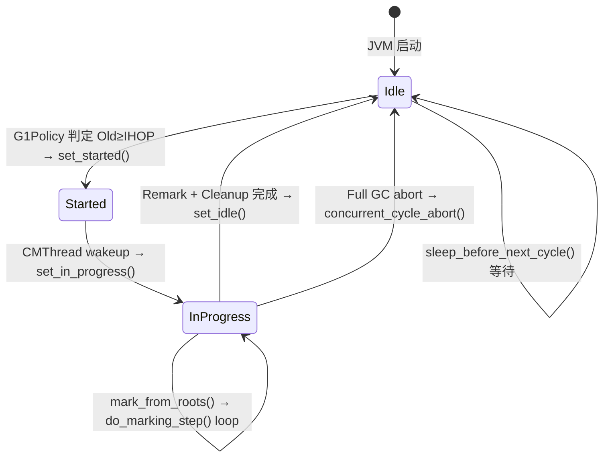
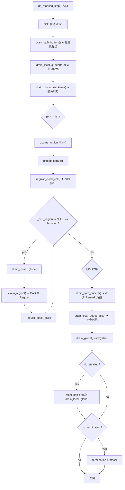
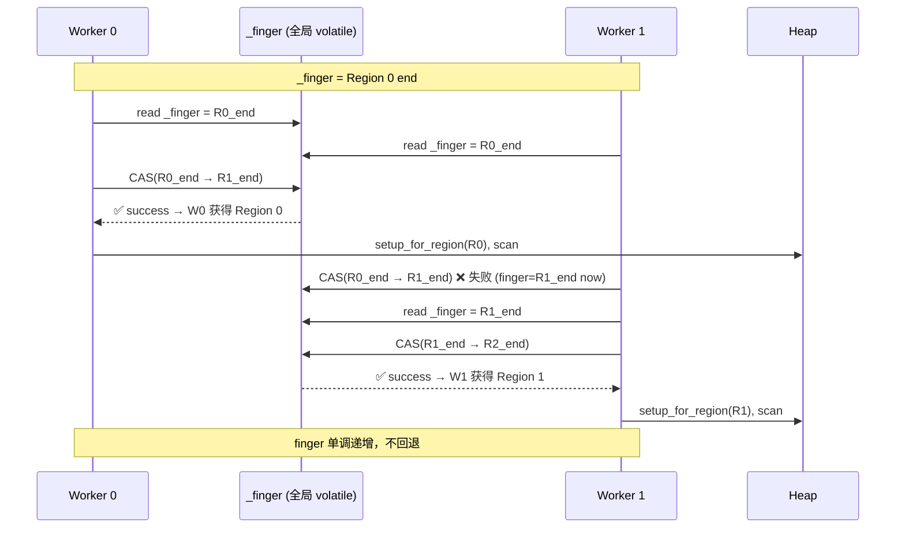
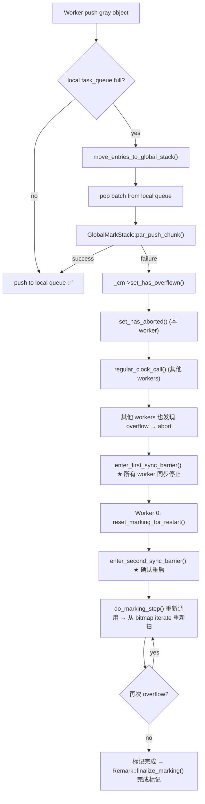

# 06-ConcurrentMark-Core：G1 并发标记核心算法 — `do_marking_step()` 逐段走读

> **标准环境**：OpenJDK 11 slowdebug build，`-Xms8g -Xmx8g -XX:+UseG1GC`（G1 Region = 4MB，2048 Regions）
> **前置依赖**：[05-SATB-Barrier]、[04-CardTable-RSet]、[03-YoungGC]、[01-HeapRegion]
> **阅读收益**：读完本文后能回答"G1 的并发标记是如何在不停应用的情况下、多线程并行地完成对象图扫描的？时间片怎么控制？worker 之间怎么分配工作？mark stack 溢出怎么办？"——从 G1CMThread 的调度脉冲到 `do_marking_step()` 的 200 行引擎，每一步的"为什么"都了然于胸。

---

## §〇 源文件清单

| # | 文件 | 模块 | 核心函数/类 | grep 验证行号 |
|---|------|------|------------|-------------|
| 1 | `g1ConcurrentMark.hpp` | gc/g1 | `G1ConcurrentMark`(~1840B slowdebug)，`G1CMTask`(~392B slowdebug)，`_finger`，`_next_mark_bitmap`，`_global_mark_stack` | hpp:301-863 |
| 2 | `g1ConcurrentMark.cpp` | gc/g1 | `do_marking_step()`(L2802)，`drain_satb_buffers()`(L2620)，`claim_region()`(L2109)，`regular_clock_call()`(L2424)，`try_stealing()`(L2683) | cpp:2802 |
| 3 | `g1ConcurrentMarkThread.hpp/cpp` | gc/g1 | `G1ConcurrentMarkThread`，`run_service()`(cpp:248)，`sleep_before_next_cycle()`(cpp:436) | hpp:36-99, cpp:248 |
| 4 | `g1ConcurrentMarkBitMap.hpp/inline.hpp/cpp` | gc/g1 | `G1CMBitMap`，`iterate()`(inline:33)，`get_next_marked_addr()`(inline:53) | inline.hpp:33 |
| 5 | `g1ConcurrentMarkObjArrayProcessor.hpp/cpp` | gc/g1 | ObjArray 分片标记处理 | hpp:36-58 |
| 6 | `taskqueue.hpp` | gc/shared | `GenericTaskQueue`，`G1TaskQueue`，`steal()` | — |
| 7 | `suspendibleThreadSet.hpp` | gc/shared | `SuspendibleThreadSet`，`join()`，`leave()` | hpp:38-117 |
| 8 | `concurrentGCThread.hpp` | gc/shared | `ConcurrentGCThread` 基类 | hpp:31-71 |
| 9 | `g1BarrierSet.hpp` | gc/g1 | `SATBMarkQueueSet` | — |
| 10 | `satbMarkQueue.hpp` | gc/g1 | `SATBMarkQueueSet::apply_closure_to_completed_buffer` | — |
| 11 | `g1_globals.hpp` | gc/g1 | `G1ConcMarkStepDurationMillis = 10.0`，`GCDrainStackTargetSize = 64` | g1_globals:72 |
| 12 | `gc_globals.hpp` | gc/shared | `ConcGCThreads` 默认值推导 | gc_globals:236 |

---

## §一 全景 — G1 并发标记的系统视图

### ❓ G1 并发标记在 GC 全景中的位置是什么？

```
G1 GC 周期模型（完整生命周期）：

  Young GC  ──→  Young GC  ──→  Initial Mark  ──→  Concurrent Mark  ──→  Remark  ──→  Cleanup  ──→  Mixed GC
                                 (STW 短暂停)      (与 mutator 并发)       (STW)       (STW)
                                   ↑ 设置 TAMS                                              ↑ swap bitmap
                                   此时 S=起点                                               prev ← next

  ★ Initial Mark：STW，设置每个 Region 的 nTAMS（next_top_at_mark_start = current top），
    标记 GC Roots 直达对象为 gray，放入 bitmap + mark stack
  ★ Concurrent Mark：与 mutator 并发 → 本文主角 do_marking_step()
  ★ Remark：STW，处理 residual SATB buffer + ref processing → swap bitmap
  ★ Cleanup：STW，统计 liveness、回收空 Region、重建 RSet
  ★ Mixed GC：基于 prev bitmap 上轮的标记结果，选择部分 Old Region 参与 Evacuation
```

### ★ 并发标记的"并发 + 并行"模型

```
  Mutator 线程       CM worker 0      CM worker 1      CM worker 2
      │                  │                 │                 │
      ├─ 修改引用 ────────┤                 │                 │
      │  (pre-barrier)   ├─ do_marking    ├─ do_marking    ├─ do_marking
      │  → SATB buffer   │  _step()       │  _step()       │  _step()
      ├─ 继续执行 ────────┤  (并行)        │  (并行)        │  (并行)
      │                  │                 │                 │
      ▼                  ▼                 ▼                 ▼
   ══════════════════════════════════════════════════════════════
   时间轴：mutator 与 多个 CM worker 同时运行 → "并发 + 并行"
```

- **并发（concurrent）** = CM workers 与 mutator 同时运行（不 STW）
- **并行（parallel）** = 多个 CM workers 同时工作，分工扫描堆

> **对比 CMS 并发标记**：也是并发+并行，但 CMS 用 Incremental Update（IU）写屏障，G1 用 SATB 写屏障。SATB 的"快照"性质要求 barrier 抢救旧值，CMS-IU 要求 barrier 标记新值——不同哲学。

> **对比 Full GC 的标记**：只有并行（STW 下多线程），没有并发——应用线程完全暂停。

---

## §二 G1ConcurrentMark 全局结构（slowdebug ~1840B）

### ❓ 为什么 G1ConcurrentMark 需要双缓冲 bitmap？

**⭐ 核心原因：并发标记需要每轮一条"写入线"和一条"读取线"，互不干扰**

```
  时间线：
  
  第 N 轮 CM：
      _next_mark_bitmap → 正在构建（CM workers 写入 gray/black bits）
      _prev_mark_bitmap → 第 N-1 轮的结果（Mixed GC 读取，判断哪些 Old Region 有垃圾）
  
  第 N 轮 Remark 完成后 → swap_mark_bitmaps()：
      _prev_mark_bitmap ← 刚才的 _next_mark_bitmap（第 N 轮结果）
      _next_mark_bitmap ← 刚才的 _prev_mark_bitmap（清空后用于第 N+1 轮）
```

**swap 的精确实现**（`g1ConcurrentMark.cpp:1953`）：

```cpp
void G1ConcurrentMark::swap_mark_bitmaps() {
  G1CMBitMap* temp = _prev_mark_bitmap;
  _prev_mark_bitmap = _next_mark_bitmap;
  _next_mark_bitmap = temp;
  _g1h->collector_state()->set_clearing_next_bitmap(true);
}
```

**关键细节**：
- `_mark_bitmap_1` 和 `_mark_bitmap_2` 是两个**固定的** G1CMBitMap 对象（`g1ConcurrentMark.hpp:317-318`）
- `_prev_mark_bitmap` 和 `_next_mark_bitmap` 是指向它们的**指针**（`g1ConcurrentMark.hpp:319-320`）
- swap 只交换指针，不拷贝数据 → O(1) 操作
- swap 发生在 **Remark 完成后、Cleanup 之前**（`g1ConcurrentMark.cpp:1321`，在 `remark()` 方法内）

**单 bitmap 不行吗？** 如果只有一条 bitmap：
- Mixed GC 读取 liveness 信息时，CM 同时也在写入同一 bitmap → 数据竞争
- 清空 bitmap 会丢失上一轮标记结果 → Mixed GC 无法知道哪些 Old Region 有垃圾

**swap 之后**：
- `_prev_mark_bitmap` → 第 N 轮完整的标记结果 → Mixed GC 的选 Region 依据
- `_next_mark_bitmap` → 可供下一轮 CM 使用的空 bitmap

**bitmap 大小计算**（`g1ConcurrentMarkBitMap.cpp:39`）：
```
  G1CMBitMap::compute_size(heap_size)
  = heap_size / mark_distance()
  = heap_size / (MinObjAlignmentInBytes * BitsPerByte)
  = heap_size / (8 * 8)
  = 8GB / 64 = 128M bits = 16MB    ★ 注意单位：每 bit 对应 64B，所以 128M bits = 16MB
```

> 每个 Region 需要 `4MB / 64 bytes-per-bit = 64K bits = 8KB` per bitmap，2048 Regions × 8KB = 16MB。两个 bitmap 共约 32MB。✓ 自洽。

---

### ❓★ TAMS 已经标记了"标记开始时的边界"，为什么还需要 per-object bitmap？

**TAMS 是边界线，bitmap 是状态机——二者解决的问题不同**：

```
  Region 内存视图（Initial Mark 后）：

  bottom ─────────────────────── nTAMS ────────────────────── top(end)
          ↑                        ↑
          │  bitmap 管辖区域        │  TAMS 以上区域
          │  每个对象需要区分       │  所有对象 implicitly live
          │  white / gray / black   │  （标记开始后才分配的）
          │                        │
          ▼                        ▼
  ╔═══════════════════════════╦══════════════════════════╗
  ║  TAMS 以下：必须用 bitmap  ║  TAMS 以上：保守假定存活 ║
  ║  逐对象判断 white/gray/   ║  (implicitly live)      ║
  ║  black，区分垃圾与存活     ║                          ║
  ╚═══════════════════════════╩══════════════════════════╝
```

**如果只有 TAMS 没有 bitmap**：
- TAMS 以下的任何对象，无法区分"已标记存活但引用未展开（gray）"和"尚未被任何引用链到达（white/垃圾）"
- 结果：TAMS 以下要么全回收（错杀存活对象），要么全保留（无回收效果）

**bitmap 是 GC 的 to-do list**：
- bit=0 (white)：尚未被任何引用链发现 → 可能是垃圾
- bit=1 (gray)：已发现为活，但它的子引用还未扫描 → 需要标记线程展开
- 标记线程推进 finger → 找到 gray bit → 展开子引用 → 对象变"黑"（语义上已处理完）

**类比**：TAMS 是地图上的"省界"（只告诉你省份边界在哪），bitmap 是"省内每个镇的访问状态"（告诉你哪个镇去过、哪个没去过）。

**底层实现**（`g1ConcurrentMarkBitMap.inline.hpp:33`）：
```cpp
inline bool G1CMBitMap::iterate(G1CMBitMapClosure* cl, MemRegion mr) {
  BitMap::idx_t const end_offset = addr_to_offset(mr.end());
  BitMap::idx_t offset = _bm.get_next_one_offset(addr_to_offset(mr.start()), end_offset);
  while (offset < end_offset) {
    HeapWord* const addr = offset_to_addr(offset);
    if (!cl->do_addr(addr)) {   // ★ 在这里 expand gray 对象的子引用
      return false;              // ★ false = abort（如超时）
    }
    size_t const obj_size = (size_t)((oop)addr)->size();  // 跳过已处理对象
    offset = _bm.get_next_one_offset(offset + (obj_size >> _shifter), end_offset);
  }
  return true;
}
```

**bitmap = 1 bit per 64B**（`mark_distance()` = `MinObjAlignmentInBytes * BitsPerByte` = 8×8 = 64B）。

---

### 2.1 G1ConcurrentMark 字段全景（slowdebug ~1840B，逐字段 hot/cold 分析）

| 字段 | 类型 | 大小 | 访问热度 | 访问阶段 |
|------|------|------|---------|---------|
| `_cm_thread` | `G1ConcurrentMarkThread*` | 8B | 🟡 warm | CM cycle 调度 |
| `_g1h` | `G1CollectedHeap*` | 8B | 🔴 hot | 全程 |
| `_completed_initialization` | `bool` | 1B | 🟢 cold | 仅初始化 |
| `_mark_bitmap_1` | `G1CMBitMap` | ~40B | 🔴 hot | 全程（别名轮换） |
| `_mark_bitmap_2` | `G1CMBitMap` | ~40B | 🔴 hot | 全程 |
| `_prev_mark_bitmap` | `G1CMBitMap*` | 8B | 🟡 warm | Remark/Mixed GC |
| `_next_mark_bitmap` | `G1CMBitMap*` | 8B | 🔴 hot | 全程 |
| `_heap` | `MemRegion` | 16B | 🔴 hot | 边界检查 |
| `_root_regions` | `G1CMRootRegions` | ~32B | 🟡 warm | start 阶段 |
| `_global_mark_stack` | `G1CMMarkStack` | ~128B | 🔴 hot | 全程 |
| `_finger` | `HeapWord* volatile` | 8B | 🔴 hot | claim_region |
| `_worker_id_offset` | `uint` | 4B | 🟢 cold | 初始化 |
| `_max_num_tasks` | `uint` | 4B | 🟢 cold | 初始化 |
| `_num_active_tasks` | `uint` | 4B | 🟡 warm | set_concurrency |
| `_tasks` | `G1CMTask**` | 8B | 🟡 warm | 阶段边界 |
| `_task_queues` | `G1CMTaskQueueSet*` | 8B | 🔴 hot | steal + push |
| `_terminator` | `ParallelTaskTerminator` | ~64B | 🔴 hot | termination |
| `_first_overflow_barrier_sync` | `WorkGangBarrierSync` | ~64B | 🟢 cold | overflow only |
| `_second_overflow_barrier_sync` | `WorkGangBarrierSync` | ~64B | 🟢 cold | overflow only |
| `_has_overflown` | `volatile bool` | 1B | 🟡 warm | overflow 检查 |
| `_concurrent` | `volatile bool` | 1B | 🟡 warm | regular_clock_call |
| `_has_aborted` | `volatile bool` | 1B | 🔴 hot | 全程 |
| `_restart_for_overflow` | `volatile bool` | 1B | 🟢 cold | remark restart |
| `_concurrent_workers` | `WorkGang*` | 8B | 🟡 warm | mark_from_roots |
| `_num_concurrent_workers` | `uint` | 4B | 🟡 warm | 阶段边界 |
| `_region_mark_stats` | `G1RegionMarkStats*` | 8B | 🔴 hot | 每次 mark 更新 |
| `_top_at_rebuild_starts` | `HeapWord* volatile*` | 8B | 🟡 warm | rebuild RSet |

> 注：大小是 slowdebug build 下预估。product build 中 `#ifdef ASSERT` 字段不存在，总大小更小。

---

### 2.2 G1CMBitMap 结构

字段（`g1ConcurrentMarkBitMap.hpp:62-69`）：

| 字段 | 类型 | 含义 |
|------|------|------|
| `_covered` | `MemRegion` | 覆盖的整个堆范围 |
| `_shifter` | `const int` | 地址→bit index 的移位量（`LogMinObjAlignment` = 3） |
| `_bm` | `BitMapView` | 底层位图视图（指向 storage 的 reserved memory） |
| `_listener` | `G1CMBitMapMappingChangedListener` | 虚拟内存 commit 监听 |

**iterate 精度**：每 64B 堆空间一个 bit → `(oop)addr->size()` 可能需要跳过多个 bit（大对象时）。

---

### 2.3 ★ 为什么只扫 TAMS 以下？

**TAMS 以上 = implicitly live**：这些对象是在 Initial Mark 暂停**之后**才分配出来的。SATB 的"快照"语义保证：标记开始时不存在于堆中的对象，不需要被标记（它们要么在之后被 Young GC 回收，要么本来就是活的）。

```
  TAMS 以下：
    对象 A (white) → cm 线程发现并标记 A 为 gray → push mark stack → 扫描 A 的子引用 → A 变黑
    对象 B (white) → 没有被任何引用链到达 → 永远 white → Cleanup 阶段判定为垃圾

  TAMS 以上：
    对象 C → 标记暂停后才分配 → 一定活着 → 不需要 bitmap 遍历（也不需要 mark_in_next_bitmap）
    ★ mark_in_next_bitmap() 内部判断：if (addr >= nTAMS) return false;  // 不标记
```

---

### 2.4 Finger CAS Claim 协议

**全局 finger**（`_finger`，`g1ConcurrentMark.hpp:332`）是指向"最后一个已分配 Region 的 end"的 `HeapWord* volatile` 指针。它按 Region 边界对齐，单调递增。

**CAS Claim 协议**（`g1ConcurrentMark.cpp:2109`）：

```cpp
HeapRegion* G1ConcurrentMark::claim_region(uint worker_id) {
  HeapWord* finger = _finger;                    // 读当前 finger
  while (finger < _heap.end()) {
    HeapRegion* curr_region = _g1h->heap_region_containing(finger);
    OrderAccess::loadload();                      // ★ 防重排
    HeapWord* end = curr_region != NULL ? curr_region->end() : finger + HeapRegion::GrainWords;
    HeapWord* res = Atomic::cmpxchg(end, &_finger, finger);  // ★ CAS 原子推进
    if (res == finger && curr_region != NULL) {
      // 成功 → 我有这个 Region
      HeapWord* limit = curr_region->next_top_at_mark_start();
      if (limit > curr_region->bottom()) {
        return curr_region;   // 非空 Region → 返回
      } else {
        return NULL;           // 空 Region → 调用方再尝试
      }
    } else {
      finger = _finger;        // 失败 → 重读 finger（其他 worker 已经推进）
    }
  }
  return NULL;                  // 超出堆范围 → 无更多 Region
}
```

**为什么 CAS 而不是 steal？**
- 扫描一个 Region 是**不可分割**的工作（必须由同一个 worker 完整扫描，否则 finger 指针状态会混乱）
- Steal 适用于**可分割**的 work items（单个 gray 对象）
- 这解释了：**Region 级分配用 CAS Claim，对象级分配用 Work Steal**

**为什么 finger 可以跳过大段未标记 region？**（`g1ConcurrentMarkBitMap.inline.hpp:53`）
- `get_next_marked_addr()` 在 bitmap 中查找下一个 marked bit
- 如果一段 Region 内没有任何 marked bit（全是 white），iterate 会直接跳过
- finger 推进到该 Region 的 end → claim_region 能快速分配到下一个有工作量的 Region

**CAS ABA 问题？** 在单 marking cycle 内 finger **单调递增、从不后退** → 没有 ABA 问题。

---

## §三 G1CMTask per-worker 结构（slowdebug ~392B）

### ❓ G1CMTask 为什么是 ~392B（slowdebug）？hot/cold 字段分析

| 字段 | ≈offset | 大小 | 热度 | do_marking_step 阶段 | 含义 |
|------|--------|------|------|---------------------|------|
| `_objArray_processor` | 0 | ~8B | 🟡 | 段2 scan | 大数组分片处理器 |
| `_worker_id` | +8 | 4B | 🟡 | 段2 claim + 段3 steal | worker 编号 |
| `_g1h` | +16 | 8B | 🔴 | 全程 | G1CollectedHeap 引用 |
| `_cm` | +24 | 8B | 🔴 | 全程 | G1ConcurrentMark 引用 |
| `_next_mark_bitmap` | +32 | 8B | 🔴 | 段2 iterate | 当前 bitmap 指针 |
| `_task_queue` | +40 | 8B | 🔴 | 段1/3 drain + steal | per-worker mark stack |
| `_mark_stats_cache` | +48 | ~16B | 🟡 | 段2 scan | Region liveness 缓存 |
| `_calls` | +64 | 4B | 🟢 | 全程(计数) | do_marking_step 调用次数 |
| `_time_target_ms` | +72 | 8B | 🔴 | 全程(regular_clock) | 本轮时间片目标 |
| `_start_time_ms` | +80 | 8B | 🔴 | 全程(regular_clock) | 本轮开始时间 |
| `_cm_oop_closure` | +88 | 8B | 🟡 | 段2 scan | oop 闭包 |
| `_curr_region` | +96 | 8B | 🔴 | 段2主循环 | 当前扫描的 Region |
| `_finger` | +104 | 8B | 🔴 | 段2 iterate | 本 Region 内的扫描位置 |
| `_region_limit` | +112 | 8B | 🔴 | 段2 iterate | 本 Region 扫描上限 |
| `_words_scanned` | +120 | 8B | 🔴 | 段2 scan(累加) | 已扫描字数 |
| `_words_scanned_limit` | +128 | 8B | 🔴 | 段2 scan(触发) | 扫描字数阈值 |
| `_real_words_scanned_limit` | +136 | 8B | 🟡 | regular_clock | 原始阈值（含减小逻辑） |
| `_refs_reached` | +144 | 8B | 🔴 | 段2 scan(累加) | 已处理引用数 |
| `_refs_reached_limit` | +152 | 8B | 🔴 | 段2 scan(触发) | 引用数阈值 |
| `_real_refs_reached_limit` | +160 | 8B | 🟡 | regular_clock | 原始阈值 |
| `_hash_seed` | +168 | 4B | 🟡 | 段3 steal | work stealing 随机种子 |
| `_has_aborted` | +172 | 1B | 🔴 | 全程 | 本 worker 是否中止 |
| `_has_timed_out` | +173 | 1B | 🟡 | regular_clock | 本 worker 是否超时 |
| `_draining_satb_buffers` | +174 | 1B | 🔴 | 段1 SATB | 防止 repeat abort 标志 |
| `_step_times_ms` | +176 | ~48B | 🟢 | 全程(统计) | 历史 step 时间 |
| `_elapsed_time_ms` | +224 | 8B | 🟢 | 全程(统计) | 累计耗时 |
| `_termination_time_ms` | +232 | 8B | 🟢 | 段3 termination | 终止协议耗时 |
| `_termination_start_time_ms` | +240 | 8B | 🟢 | 段3 termination | 终止开始时间 |
| `_marking_step_diffs_ms` | +248 | ~24B | 🟡 | 段1/统计 | 超时偏差历史 |

> **注**：offset 是 ≈ 值，受编译器 padding 策略影响。`ptype /o G1CMTask` 可获取实际偏移。

**访问热度定义**：
- 🔴 hot：每次 `do_marking_step` 都频繁访问（>10次/调用）
- 🟡 warm：某些阶段或特定操作才访问（1-10次/调用）
- 🟢 cold：仅初始化、统计或异常路径访问

**`_curr_region` 的生命周期**：
1. `claim_region()` 成功后（CAS 夺得 Region）→ `setup_for_region()` 设置 `_curr_region`
2. 主循环中 → `update_region_limit()` + `bitmap::iterate()` 使用
3. `giveup_current_region()` → `clear_region_fields()` 清空 `_curr_region = NULL`
4. **跨越 do_marking_step 调用** → `_curr_region` 保留（断点续扫）
5. 如果 Region 被 Evacuation GC 移动/reclaimed → `update_region_limit()` 检测 → `giveup_current_region()`

**为什么 `_curr_region` 必须是 per-task 而不是共享？**
- 每个 worker 独立推进自己的 _finger（本 Region 内的位置）
- 共享 _curr_region 会导致"两个 worker 在同一个 Region 不同位置"的冲突
- 全局 _finger 只负责分配 Region 边界 → 用 CAS 原子推进

**`_time_target_ms` 从哪里来？**（`g1ConcurrentMark.cpp:2815-2816`）：
```cpp
double diff_prediction_ms = predictor().get_new_prediction(&_marking_step_diffs_ms);
_time_target_ms = time_target_ms - diff_prediction_ms;
```
- `time_target_ms` 是参数传入的（默认 `G1ConcMarkStepDurationMillis = 10.0ms`）
- `diff_prediction_ms` 是本 worker 历史上"超时偏差"的运行平均值
- **首次预测偏差**：G1CMTask 构造函数中执行 `_marking_step_diffs_ms.add(0.5)`（`g1ConcurrentMark.cpp:3159`），注入 0.5ms 初始偏差 → **第一轮 `_time_target_ms ≈ 9.5ms`**（保留 0.5ms 余量，保守启动）
- 结果：不同 worker 的 `_time_target_ms` 不同（因为历史上的超时记录不同）

---

## §四 G1ConcurrentMarkThread — 并发标记线程调度

### ❓ 并发标记线程什么时候启动？什么时候 sleep？谁叫醒它？

**调度生命周期状态机**：



### 4.1 `run_service()` 主循环走读（`g1ConcurrentMarkThread.cpp:248`）

```
run_service() 主循环：
│
├─ while (!should_terminate()):
│   │
│   ├─ sleep_before_next_cycle()          ★ 等待 G1Policy 的 start 信号
│   │   └─ CGC_lock->wait()               (Idle → Started)
│   │
│   ├─ concurrent_cycle_start()           ★ 初始化 TC + setup
│   │
│   ├─ scan_root_regions()                ★ 并发扫描 Survivor 根
│   │
│   ├─ for (iter=1; !has_aborted(); ++iter):
│   │   ├─ mark_from_roots()             ★ 启动 CM workers → do_marking_step()
│   │   ├─ preclean() (if enabled)       
│   │   ├─ delay_to_keep_mmu(true)       ★ MMU 延迟 Remark
│   │   ├─ Pause Remark (VM_CGC_Operation)
│   │   ├─ if restart_for_overflow → continue loop
│   │   └─ else → break
│   │
│   ├─ rebuild_rem_set_concurrently()     ★ 并发重建 RSet
│   ├─ delay_to_keep_mmu(false)           ★ MMU 延迟 Cleanup
│   ├─ Pause Cleanup (VM_CGC_Operation)
│   ├─ cleanup_for_next_mark()            ★ 清空 next bitmap
│   │
│   └─ concurrent_cycle_end()             ★ 清理状态（Started → Idle）
```

### 4.2 G1Policy 如何决定启动 CM：IHOP 阈值判定

```
  G1Policy::shouldConcurrentMark():
    → Old 代占用比例 ≥ InitiatingHeapOccupancyPercent (IHOP, 默认 45%)
    → _cm_thread->set_started()
    → CGC_lock->notify_all()   ★ 唤醒 sleep_before_next_cycle() 中的 CMThread
```

> 详见 [08-MixedGC-Policy]。

### 4.3 SuspendibleThreadSet：CM worker 如何被 safepoint 暂停

```cpp
// suspendibleThreadSet.hpp:38-68
class SuspendibleThreadSet {
  static uint   _nthreads;          // 加入 STS 的线程数
  static uint   _nthreads_stopped;  // 已 yield 的线程数
  static bool   _suspend_all;       // 是否在请求暂停

  static bool should_yield() { return _suspend_all; }
  static void synchronize();        // VMThread 调用：等待所有 STS 线程 yield
  static void desynchronize();      // VMThread 调用：恢复所有 STS 线程
};
```

CM workers 在 `do_marking_step()` 中通过 `regular_clock_call()` 检查 `SuspendibleThreadSet::should_yield()`：
```cpp
// g1ConcurrentMark.cpp:2457
if (SuspendibleThreadSet::should_yield()) {
  set_has_aborted();  // 中止当前 step
  return;
}
```
> abort 后 CM worker 返回 `mark_from_roots()` → 调用 `SuspendibleThreadSet::yield()` → 等待 safepoint 完成

### 4.4 ★ `ConcGCThreads` 默认推导公式和原因

```cpp
// g1ConcurrentMark.cpp:493-499
if (FLAG_IS_DEFAULT(ConcGCThreads) || ConcGCThreads == 0) {
  uint marking_thread_num = scale_concurrent_worker_threads(ParallelGCThreads);
  // = max((ParallelGCThreads + 2) / 4, 1)
  FLAG_SET_ERGO(uint, ConcGCThreads, marking_thread_num);
}
```

**为什么是 1/4？**
- 并发标记线程与**应用线程**同时运行 → 必须控制 CPU 抢占
- ParallelGCThreads（STW）可以占用全部 CPU → 快一些
- ConcGCThreads 如果太多 → 抢占应用线程 CPU → 吞吐量下降
- 经验公式：并发线程 ≈ 并行线程的 1/4

**`_worker_id_offset`**（`g1ConcurrentMark.cpp:402`）：
```cpp
_worker_id_offset = DirtyCardQueueSet::num_par_ids() + G1ConcRefinementThreads;
```
CM worker 0 通过 `_worker_id_offset` 偏移，保证其 `claim_region(worker_id)` 传入的 ID 在共享数据结构中不与其他线程类型（GC worker 0..ParallelGCThreads-1、Refinement 线程）的 ID 值域重叠。例如 ParallelGCThreads=13 时，G1 task queue set 有 13 个槽位——CM worker 通过 `_worker_id_offset` 映射到不冲突的全局索引。

---

## §五 do_marking_step() 四段走读 + 跨段时间片机制

### ★ 前置理解

`do_marking_step()` 被 CM worker **反复调用**（非单次）——每轮消耗自适应时间片（默认 ~10ms，经过 diff_prediction 修正），退出后 `_curr_region` / `_finger` 保持，下一轮从断点继续。



> **注意**：`drain_global_stack(false)` 内部循环调用 `get_entries_from_global_stack()`（pop global → push local）→ `drain_local_queue(partially)` ——所以图中的"drain_global_stack"实际上**嵌套了 drain_local_queue**，不是两个独立的顺序操作。`drain_global_stack(false)` = "反复 pop global → push local → drain local → 直到 global 空"。

---

### ❓ 段1：为什么先 drain SATB 再 drain local 再 drain global？

**核心原因：它是本 step 唯一 drain SATB 的时机——排在 local 前面最大化减少 orphan 在 buffer 中的停留时间。**

**关键约束**：`do_marking_step()` **只在开头 drain 一次 SATB**（L2851），整个段2主循环和段3 steal 都不再 drain（源码注释 L2847-2850 明确说 "After this, we will not look at SATB buffers before the next invocation"）。这意味着：

```
  do_marking_step 调用周期 (~10ms)：
  ┌─────────────────────────────────────────────────────┐
  │ drain_satb_buffers()  ← 唯一 SATB drain 点！        │
  │ drain_local_queue(true)                              │
  │ drain_global_stack(true)                             │
  │                                                       │
  │ 段2 主循环 (bitmap iterate + claim_region)             │
  │   → 不再 drain SATB                                   │
  │                                                       │
  │ 段3 收尾 (drain_satb_buffers → steal → termination)   │
  │   → ★ drain_satb_buffers() 在 steal loop 之前           │
  │   → 仅在 step 正常完成后才执行                           │
  │                                                       │
  │ 如果 step 因超时等 abort  → 段3 的 drain_satb 不执行  │
  │    → SATB buffer 中新增的 orphan 要等到下一轮 step    │
  └─────────────────────────────────────────────────────┘
```

**如果 SATB drain 不排在开头（而是排在 local 后面）会发生什么？**

> 设 mutator 在上一轮 step 结束后产生了 5 个已完成 SATB buffer
> 
> 方案 A（当前实现：SATB 开头立即 drain）：
>   → step 开始 → 0ms drain SATB（5 buffers） → orphan 进入标记图
>   → 剩余 9.5ms 全部用于展开 gray 对象
>   → orphan 延迟 = 0ms（本轮立即发现）
> 
> 方案 B（如果 SATB 排在 local 后面）：
>   → step 开始 → drain local（~2ms） → drain SATB（5 buffers，~1ms）
>   → orphan 延迟 = 2ms（折损 ~20% 时间片）
>   → 多轮累积：第 N 轮的 orphan 可能等到第 N+1 轮才处理
>   → buffer 堆积 → Remark 要多处理一整个 cycle 的 residual buffer

**这不是 correctness 问题——SATB 无论何时 drain，所有 orphan 最终都会被标记（Remark 保证最终一致性）。这是 latency 问题：SATB 排在开头 → orphan 最早被发现 → gray 对象有最多时间被展开 → buffer 积压最小。**

**那为什么 local 排在 global 前面？**

这才是效率问题：`drain_local_queue` 操作 task queue（lock-free），`drain_global_stack` 操作 G1CMMarkStack（内部需要 `MarkStackChunkList_lock` 互斥锁）。先处理快的再处理慢的 → 减少争锁时间。另外 local queue 中可能有上一轮 step 残留的 gray 对象 → 先清理避免溢出到 global。

**依赖关系链**：
1. `drain_satb_buffers()` → 抢救 orphan → push 新 gray 对象到 local queue（via `make_reference_grey`）
2. `drain_local_queue(true)` → 展开 local 中的 gray 对象 → 子引用通过 `is_below_finger` 决策 push/mark-only（详见 §5.2）→ 队列满则溢出到 global stack
3. `drain_global_stack(true)` → 从 global stack 拉取溢出对象 → 填充 local queue → 再展开 → 局部 drain（`target_size = max_elems/3`）保留部分给 steal

**SATB drain 实现**（`g1ConcurrentMark.cpp:2620`）：
```cpp
void G1CMTask::drain_satb_buffers() {
  if (has_aborted()) return;
  _draining_satb_buffers = true;   // ★ 防止 regular_clock 重复 abort
  G1CMSATBBufferClosure satb_cl(this, _g1h);
  SATBMarkQueueSet& satb_mq_set = G1BarrierSet::satb_mark_queue_set();
  size_t buffers_processed = 0;
  while (!has_aborted() &&
         satb_mq_set.apply_closure_to_completed_buffer(&satb_cl)) {
    buffers_processed++;
    regular_clock_call();           // ★ 每处理一个 buffer 就检查时间片
  }
  _draining_satb_buffers = false;
  decrease_limits();                // ★ drain 操作成本高 → 降低下次 clock 阈值
}
```

**`drain_local_queue(true)` 的部分耗尽策略**（`g1ConcurrentMark.cpp:2556`）：
```cpp
size_t target_size;
if (partially) {
  target_size = MIN2(_task_queue->max_elems()/3, (size_t)GCDrainStackTargetSize); // min(max/3, 64)
} else {
  target_size = 0;  // 完全耗尽
}
```
部分耗尽 = 队列留一部分给其他 worker steal → 保持负载均衡。**为什么是 `max_elems/3`（上限 64）？** 1/3 是一个经验折中：保留足够多（2/3 容量）让其他 idle worker 有东西可偷（太少则 steal 成功率低），同时本 worker 也不会因过度清空而频繁 refill 产生 cache miss。64 是上限保护（`GCDrainStackTargetSize`），避免大队列时 1/3 过大（例如 512/3=170 但只留 64）。

---

### ❓ 段2：Finger CAS Claim + bitmap::iterate + update_region_limit

**主循环逻辑**（`g1ConcurrentMark.cpp:2856-2972`）：

```cpp
do {
  if (!has_aborted() && _curr_region != NULL) {
    update_region_limit();                              // ★ 重读 _top：应对 Evacuation GC
    MemRegion mr = MemRegion(_finger, _region_limit);    // ★ 从 _finger 开始（不重复扫）
    if (mr.is_empty()) {
      giveup_current_region();
      regular_clock_call();
    } else if (_curr_region->is_humongous()) {
      // Humongous: 只扫 region bottom 的一个 marked bit
      if (_next_mark_bitmap->is_marked(mr.start())) {
        bitmap_closure.do_addr(mr.start());
      }
      giveup_current_region();
      regular_clock_call();
    } else if (_next_mark_bitmap->iterate(&bitmap_closure, mr)) {
      giveup_current_region();                          // ★ iterate 成功 → 放弃此 Region
      regular_clock_call();
    } else {
      // ★ iterate 返回 false（abort）→ _finger 停在当前对象
      // 推进 _finger 到下个对象 → 下次从这继续
      HeapWord* new_finger = _finger + ((oop)_finger)->size();
      if (new_finger >= _region_limit) giveup_current_region();
      else move_finger_to(new_finger);
    }
  }
  drain_local_queue(true);                              // ★ 每轮都部分 drain
  drain_global_stack(true);
  while (!has_aborted() && _curr_region == NULL && !_cm->out_of_regions()) {
    HeapRegion* claimed = _cm->claim_region(_worker_id); // ★ CAS 争 Region
    if (claimed != NULL) setup_for_region(claimed);
    regular_clock_call();
  }
} while (_curr_region != NULL && !has_aborted());
```

**`update_region_limit()` 为什么重读 `_top`？**（`g1ConcurrentMark.cpp:2342`）：
- Evacuation GC（Young GC）可能在并发标记期间移动对象
- Region 的 `_top`（已使用的末尾）变了 → 扫描范围需要更新
- 如果 `_top` 降低了（GC 复制走了部分对象）→ `_finger = limit`（不需要再扫）
- 如果 Region 被清空（limit == bottom）→ `_finger = bottom`（下一轮 giveup）

**`iterate()` 为什么从 `_finger` 开始？**
- `_finger` 是本 worker 在此 Region 内的"上次扫到哪"
- 不重复扫描已处理过的对象
- abort 后重启时从 `_finger` 位置继续

**为什么只扫 TAMS 以下？**
- TAMS 以上 = implicitly live（标记开始后分配 → 一定活着 → 不需要 bitmap 遍历）
- `iterate()` 的 `mr` 范围是 `[_finger, _region_limit)`，其中 `_region_limit = nTAMS`
- 即：扫描范围永远 ≤ TAMS

**Humongous Region 特殊处理**：
- Humongous 对象占据多个连续 Region
- 只在 **start region 的 bottom** 位置有一个 marked bit
- 扫描一次后立即 `giveup_current_region()` → 不遍历

**`bitmap::iterate()` 逐行走读**（`g1ConcurrentMarkBitMap.inline.hpp:33`）：
```cpp
inline bool G1CMBitMap::iterate(G1CMBitMapClosure* cl, MemRegion mr) {
  BitMap::idx_t const end_offset = addr_to_offset(mr.end());
  BitMap::idx_t offset = _bm.get_next_one_offset(addr_to_offset(mr.start()), end_offset);
  while (offset < end_offset) {
    HeapWord* const addr = offset_to_addr(offset);
    if (!cl->do_addr(addr)) {             // ★ cl->do_addr() 内部：
      return false;                        //     1. mark gray object children
    }                                      //     2. push gray objects to task_queue
    size_t const obj_size = ((oop)addr)->size();  //     3. check regular_clock_call() ★
    offset = _bm.get_next_one_offset(offset + (obj_size >> _shifter), end_offset);
  }                                        // ★ 跳过已处理的整个对象
  return true;
}
```

**`mark_in_next_bitmap()` 的过滤**（`g1ConcurrentMark.hpp:618`）：
- 只在 TAMS 以下标记 → TAMS 以上的对象不 touch bitmap

---

### 5.2 ★ `make_reference_grey()` + `is_below_finger()` — 发现引用后的 push vs mark-only 决策

**这是并发标记最核心的决策——远不只是"标记 bit 然后 push"那么简单。**

当一个 gray 对象被扫描、发现其引用字段指向对象 X 时，`deal_with_reference(X)` 调用 `make_reference_grey(X)`。这个函数必须回答：**X 是 push 到 task queue 立即处理，还是只设 bitmap 等将来的 bitmap iterate 兜底？**

答案取决于 X 和 finger 的位置关系（`g1ConcurrentMark.inline.hpp:133-161`）：

```cpp
// is_below_finger() 的三段决策：
inline bool G1CMTask::is_below_finger(oop obj, HeapWord* global_finger) const {
  if (_finger != NULL) {                      // ★ 本 worker 正在扫描某个 Region
    // 情况 1: obj 在本地 finger 下方
    //   → 本 worker 已经扫描过了 → bitmap iterate 不会再次碰到它
    //   → 必须 push！（否则丢失此对象）
    if (objAddr < _finger)          return true;

    // 情况 2: obj 在本地 finger 和 region_limit 之间
    //   → 还在本 Region 的未扫描区域内 → bitmap iterate 会兜底发现它
    //   → 不 push（mark-only），等 iterate 自己遇到时展开
    else if (objAddr < _region_limit) return false;
  }
  // 情况 3: obj 在全局 finger 下方
  //   → 该区域已被所有 worker 扫描完毕 → iterate 不会再扫到
  //   → 必须 push 到 mark stack 让当前 worker 继续展开！
  // 情况 4: obj 在全局 finger 以上（未分配的 Region）→ 回退到 mark-only
  //   → 不 push，等 bitmap iterate 自然遇到时再标记
  return objAddr < global_finger;             // true=push, false=mark-only
}
```

**四种情况的内存视图**：

```
  堆地址 → 低 ──────────────────────────────────────────────────→ 高
  ┌─────────┬──────────────────┬──────────────────────┬──────────┐
  │ 已分配   │  本 worker 的     │ 其他 worker          │ 未分配    │
  │ 已扫描   │  curr_region      │  已分配 Region        │ Region    │
  │          │  ★ 本 worker 在扫 │                      │           │
  └─────────┴──────────────────┴──────────────────────┴──────────┘
              ↑         ↑         ↑                     ↑
            bottom    _finger  _region_limit      全局 _finger
              │ ←情况1→ │ ←情况2→ │      ←情况3→      │ ←情况4→ │
              │  push   │mark-only│       push         │mark-only│
```

**为什么需要这个决策？——两条发现路径的分工**：

| 发现路径 | 触发时机 | 适用对象 | 开销 |
|---------|---------|---------|------|
| **push 到 task queue** | `is_below_finger → true` | 已错过的对象（finger 下方） | 高（push+pop+scan） |
| **mark-only (bitmap)** | `is_below_finger → false` | 等 iterate 兜底的对象 | 低（只设 1 bit） |

- **mark-only 是"延迟绑定"**：等到 `bitmap::iterate()` 推进 finger 遇到这个对象时，再由 `G1CMBitMapClosure::do_addr()` 展开其子引用。这样避免不必要的 push/pop 开销
- **push 是"紧急救援"**：这个对象在 finger 已经扫过的区域内 → bitmap iterate 不会再遇到 → 必须立即 push 处理，否则漏标
- ★ 这就是 G1 并发标记的 **"双引擎设计"**：task queue（BFS）负责"补漏"，bitmap iterate（线性扫描）负责"兜底"。两者协同保证所有活对象都被标记

**面试要点**：如果被问"G1 并发标记怎么保证 correct marking？"，核心答案就是 `is_below_finger` 的分段决策——没有这个机制，finger 扫过的区域中的新发现对象会漏标。

---

### ❓ 段3：为什么末尾要再 drain SATB + steal + termination？

**再 drain SATB**：主循环期间 mutator 可能又产生了新的 SATB buffer → 尽早 drain 减少 Remark 负担

**drain_local(false)**：`partially=false` → `target_size=0` → 完全耗尽本地队列

**steal loop**（`g1ConcurrentMark.cpp:2990-3011`）：
```cpp
while (!has_aborted()) {
  G1TaskQueueEntry entry;
  if (_cm->try_stealing(_worker_id, &_hash_seed, entry)) {
    scan_task_entry(entry);
    drain_local_queue(false);
    drain_global_stack(false);
  } else {
    break;
  }
}
```

**为什么 `hash_seed` 随机选 victim？**
- `try_stealing` → `_task_queues->steal(worker_id, hash_seed, task_entry)`
- `hash_seed` 初始化为 `worker_id + 17`（`g1ConcurrentMark.hpp:647`）
- 每轮 steal 后 `hash_seed++` → 每次尝试不同的 victim
- **避免所有 worker 同时偷同一个 victim** → 产生热点

**为什么 steal 而不是 CAS claim？**
- steal 偷的是**单个 gray 对象**（可分割的工作单元）
- CAS claim 争的是**整个 Region**（不可分割的扫描任务）
- Region 级分配用 CAS → 不可分割；对象级分配用 Steal → 可分割

**termination protocol**（`g1ConcurrentMark.cpp:3016-3053`）：
```cpp
bool finished = (is_serial ||
                 _cm->terminator()->offer_termination(this));
```

`ParallelTaskTerminator` 的工作方式：
1. 每个 worker 宣布"我没有工作"→ set its flag in _offered_termination
2. 等待 → 期间如果 steal 成功（有新工作产生）→ `should_exit_termination()` 返回 true
3. 所有 worker 都宣布无工作且经过 N 轮检查无人产生新工作 → 全局终止
4. CM 中额外检查：`should_exit_termination()` 还检查 `regular_clock_call()` → 可能 abort

---

### ❓ 跨段机制：regular_clock_call — 时间片如何做到毫秒级自适应？

**`regular_clock_call()` 的六个检查点**（`g1ConcurrentMark.cpp:2424-2482`，其中 5 个会触发 abort）：

```cpp
void G1CMTask::regular_clock_call() {
  if (has_aborted()) return;
  recalculate_limits();                    // 重置 _words_scanned_limit

  if (_cm->has_overflown()) {              // (1) Overflow 检查
    set_has_aborted(); return;
  }
  if (!_cm->concurrent()) return;          // (2) Remark 阶段不检查后面

  if (_cm->has_aborted()) {                // (3) Full GC abort 检查
    set_has_aborted(); return;
  }

  if (SuspendibleThreadSet::should_yield()) {  // (4) Safepoint yield
    set_has_aborted(); return;
  }

  double elapsed = os::elapsedVTime() * 1000.0 - _start_time_ms;
  if (elapsed > _time_target_ms) {         // (5) Time target 检查
    set_has_aborted(); _has_timed_out = true; return;
  }

  SATBMarkQueueSet& satb_mq_set = G1BarrierSet::satb_mark_queue_set();
  if (!_draining_satb_buffers &&            // (6) SATB buffer 积压检查
      satb_mq_set.process_completed_buffers()) {
    set_has_aborted(); return;             // ★ 如果不是正在 drain，有积压就 abort
  }
}
```

**`_time_target_ms` 的计算**（`g1ConcurrentMark.cpp:2815-2816`）：
```cpp
double diff_prediction_ms = _g1h->g1_policy()->predictor().get_new_prediction(&_marking_step_diffs_ms);
_time_target_ms = time_target_ms - diff_prediction_ms;
```

- `time_target_ms` = `G1ConcMarkStepDurationMillis` = **10ms**（`g1_globals.hpp:72`）
- `diff_prediction_ms` = 运行平均预测器从 `_marking_step_diffs_ms`（历史超时偏差序列）预测的修正值
- 结果：`_time_target_ms` = 10ms - 历史平均超时偏差
- ★ 不同 worker 的 `_time_target_ms` 不同（各自的 `_marking_step_diffs_ms` 历史不同）

**`recalculate_limits()` 的触发频率控制**（`g1ConcurrentMark.cpp:2484`）：
```cpp
_real_words_scanned_limit = _words_scanned + words_scanned_period;  // +12K words
_...refs_reached_limit  = _refs_reached  + refs_reached_period;    // +1024 refs
```
- 每扫描 12K words (~48KB) 或每处理 1024 个引用 → `reached_limit()` → `regular_clock_call()`
- 这意味着 `regular_clock_call()` 在 sub-ms 级别被调用

**`_draining_satb_buffers` 的作用**：防止 **repeat abort**：
```cpp
// drain_satb_buffers 内部设为 true
// regular_clock_call 的检查 (6) 看到 true → 跳过 SATB 积压检查
// drain_satb_buffers 结束时恢复 false
```
逻辑：如果 drain 内部 regular_clock_call 又因为"有 SATB buffer"而 abort → 死循环

**超时后 finger 如何恢复？**
1. `regular_clock_call()` → `set_has_aborted()` + `_has_timed_out = true`
2. `do_marking_step()` 内各个循环 `has_aborted() == true` → 退出
3. 如果是在 `iterate()` 内部 abort → `_finger` 停在当前对象 → `new_finger = _finger + obj->size()` → 下次从下个对象开始
4. 如果是主循环中 abort → `_curr_region` + `_finger` 保留
5. **下一轮 `do_marking_step()` 重新调用**：
   - 段1 drain SATB → 处理这段时间 mutator 产生的 SATB buffer
   - 段2 主循环 → `_curr_region` 还是上次的 → `update_region_limit()` 重读 `_top` → 从 `_finger` 继续扫
6. 如果 Region 被 GC 移动了 → `update_region_limit()` 设 `_finger = limit` → `giveup_current_region()` → 重新 claim

**记录超时偏差**（`g1ConcurrentMark.cpp:3066-3071`）：
```cpp
if (_has_timed_out) {
  double diff_ms = elapsed_time_ms - _time_target_ms;
  _marking_step_diffs_ms.add(diff_ms);  // ★ 用于下一轮的 diff_prediction
}
```
这就是**自适应时间片**的核心——learn from history。

---

### Concurrent Mark 2 workers Finger CAS Claim 时间线



### Overflow 全路径



> **Overflow 后的正确性**：Overflow 触发 `_restart_for_overflow = true` → `mark_from_roots()` 重新启动（多 CM worker 并发重新标记）。如果并发阶段反复 overflow → Remark 的 `finalize_marking()`（STW，**多 GC worker 并行**，`g1ConcurrentMark.cpp:2075` 可见使用了 `_g1h->workers()->run_task()`）完成最终标记。**不丢正确性，但 Remark STW 暂停变长**，因为要重建灰色对象图。

---

## §六 面试问题合集

### Q1: G1 并发标记的"并发"和"并行"有什么区别？

**一句话**：并发 = 与 mutator 同时运行（不 STW）；并行 = 多个标记线程同时工作。

**展开**：G1 的并发标记是"并发+并行"——多个 CM worker 之间并行，它们整体与 mutator 并发运行。对比 Full GC 的标记只有并行（STW）。

### Q2: 如果 mark stack 溢出了怎么办？标记结果还正确吗？

**一句话**：overflow 不丢正确性，只增加延时——overflow 触发并发标记重启（多 CM worker）或 Remark 中多 GC worker 并行兜底。

**展开**：当 global stack 溢出 → `_has_overflown = true` → 所有 workers 通过 sync barrier 同步停止 → worker 0 重置全局数据结构 → `mark_from_roots()` 重新启动多 CM worker 从 bitmap 重新扫 → 如果 again overflow 继续循环 → 最终 Remark 中 `finalize_marking()` 使用 `g1h->workers()->run_task()`（**多 GC worker 并行**，非单线程）完成标记。代价：Remark STW 暂停变长。

### Q3: 为什么 SATB drain 优先级最高？

**一句话**：因为它是 `do_marking_step()` 内唯一的 SATB drain 时机——排在 local 前面让 orphan 在本轮最早被发现 → 减少 buffer 堆积 → 减轻 Remark 负担。

**展开**：`do_marking_step()` 只在段1开头 drain 一次 SATB（段2主循环和段3 steal 都不再 drain）。如果 local drain 排在 SATB 前面，orphan 会延迟 ~2ms（local drain 耗时）才能被发现 → 多轮累积延迟 → SATB buffer 堆积 → Remark 要处理更多 residual buffer。这不是 correctness 问题（Remark 保证最终一致性），是 **latency 优化**：最早 drain orphan → 孤儿最早入标记图 → gray 对象有最多时间展开 → Remark STW 时间最短。

### Q4: regular_clock_call 如何保证毫秒级的时间片控制？

**一句话**：work-based 采样（每 12K words / 1024 refs 触发一次）+ 运行平均预测偏差修正。

**展开**：
- `G1ConcMarkStepDurationMillis = 10ms`
- `_time_target_ms = 10ms - diff_prediction_ms`（自适应修正）
- `_words_scanned_limit = _words_scanned + 12*1024`（sub-ms 触发频率）
- 超时 → set_has_aborted → do_marking_step 退出 → finger/_curr_region 保留 → 下轮继续

### Q5: Finger CAS Claim 为什么不产生 ABA 问题？

**一句话**：单 marking cycle 内 finger **单调递增、从不后退**。

**展开**：finger 只会被 CAS 原子推进到更大的地址。即使 CAS 失败，重新读取的 finger 一定 ≥ 之前的 finger → 没有 ABA 问题。

### Q6: bitmap swap 做了什么？为什么需要双缓冲？

**一句话**：Remark 完成后交换 `_prev` 和 `_next` 指针（O(1)），使 "当前轮结果" 成为 "上一轮结果" 供 Mixed GC 使用，同时下一轮有新 bitmap 可用。

**展开**：
- `_mark_bitmap_1` 和 `_mark_bitmap_2` 是固定对象
- swap 只交换 `_prev_mark_bitmap` 和 `_next_mark_bitmap` 指针
- swap 后 `_prev_mark_bitmap` → Mixed GC 读 liveness → 选回收 Region

### Q7: 并发标记线程被 GC 暂停时，_curr_region 和 _finger 怎么处理？

**一句话**：abort → 保留状态 → safepoint → 恢复 → `update_region_limit()` 重新验证 → 从断点继续。

**展开**：
- STS `should_yield()` → `set_has_aborted()` → do_marking_step 退出
- safepoint 结束后下一轮 `do_marking_step()` 重新调用
- `_curr_region` / `_finger` 保留 → `update_region_limit()` 重读 `_top`
- 如果 Region 被 GC 回收了 → `giveup_current_region()` → 重新 claim

### Q8: CM worker 数量和 GC worker 数量什么关系？

**一句话**：`ConcGCThreads = max((ParallelGCThreads + 2) / 4, 1)`，并发线程约为并行线程的 1/4。

**展开**：并发标记与 mutator 同时运行 → 必须控制 CPU 抢占。经验公式 1/4 平衡了标记速度和吞吐量。

---

## §七 GDB 验证 + 可证伪断言

### 断言 1: `sizeof(G1ConcurrentMark)` slowdebug ~1840B

```gdb
# 在 G1ConcurrentMark 构造完成后
(gdb) p sizeof(G1ConcurrentMark)
$1 = 1840
(gdb) p sizeof(G1ConcurrentMarkThread)
$2 = 128
(gdb) p /o G1ConcurrentMark
# 应看到 _mark_bitmap_1 偏移 16，_mark_bitmap_2 偏移 ~56，
# _prev_mark_bitmap 偏移 ~96，_next_mark_bitmap 偏移 ~104
```

### 断言 2: `sizeof(G1CMTask)` slowdebug ~392B

```gdb
(gdb) p sizeof(G1CMTask)
$1 = 392
(gdb) ptype /o G1CMTask
# 应看到 _curr_region 偏移 ~96，_finger 偏移 ~104，_region_limit 偏移 ~112
# _task_queue 偏移 ~40，_time_target_ms 偏移 ~72
```

### 断言 3: `G1ConcurrentMarkThread::_state` 三态转换

```gdb
# 断点在 G1ConcurrentMarkThread::sleep_before_next_cycle
(gdb) p _state
$1 = G1ConcurrentMarkThread::Idle

# 断点在 run_service 内 mark_from_roots 前
(gdb) p _state
$1 = G1ConcurrentMarkThread::Started

# 断点在 run_service 内 mark_from_roots 后
(gdb) p _state
$1 = G1ConcurrentMarkThread::InProgress
```

### 断言 4: `_finger` CAS Claim 前后值变化

```gdb
# 断点 g1ConcurrentMark.cpp:2124 (Atomic::cmpxchg 前)
(gdb) p _finger
$1 = (HeapWord * volatile) 0x...  # 某个值
# step over CAS
(gdb) p _finger
$2 = 0x...  # 比之前大了一个 Region 大小 (4MB)
```

### 断言 5: `_draining_satb_buffers` 在 drain 前后切换

```gdb
# 断点 g1ConcurrentMark.cpp:2629 (_draining_satb_buffers = true 后)
(gdb) p _draining_satb_buffers
$1 = true
# 断点 g1ConcurrentMark.cpp:2643 (_draining_satb_buffers = false 后)
(gdb) p _draining_satb_buffers
$2 = false
```

### 断言 6: regular_clock_call abort 触发

```gdb
# 调小时间片 → -XX:G1ConcMarkStepDurationMillis=5
# 断点 g1ConcurrentMark.cpp:2467 (elapsed_time_ms > _time_target_ms)
(gdb) p elapsed_time_ms
$1 = 5.234
(gdb) p _time_target_ms
$2 = 5.0
# → 进入 set_has_aborted() + _has_timed_out = true 路径
```

### 断言 7: `_global_mark_stack` overflow 路径

```gdb
# 断点 g1ConcurrentMark.cpp:2518 (mark_stack_push 失败后)
(gdb) p n
$1 = 1023  # EntriesPerChunk 满
(gdb) bt
# 调用链: move_entries_to_global_stack ← drain_local_queue ← do_marking_step
# 继续 → set_has_overflown() → set_has_aborted()
```

### 断言 8: bitmap swap 前后 prev/next 指针

```gdb
# 断点 g1ConcurrentMark.cpp:1953 (swap_mark_bitmaps 入口)
(gdb) p _prev_mark_bitmap
$1 = (G1CMBitMap *) 0x... → &_mark_bitmap_1
(gdb) p _next_mark_bitmap
$2 = (G1CMBitMap *) 0x... → &_mark_bitmap_2
# step over swap
(gdb) p _prev_mark_bitmap
$3 = (G1CMBitMap *) 0x... → &_mark_bitmap_2  # ★ 交换完成
(gdb) p _next_mark_bitmap
$4 = (G1CMBitMap *) 0x... → &_mark_bitmap_1
```

### 断言 9: G1CMBitMap::iterate 的遍历范围

```gdb
# 断点 g1ConcurrentMarkBitMap.inline.hpp:40 (get_next_one_offset)
(gdb) p mr.start()
$1 = (HeapWord *) 0x...  # _finger（上次扫到哪）
(gdb) p mr.end()
$2 = (HeapWord *) 0x...  # _region_limit（= nTAMS，TAMS 以下）
# ★ 确认 mr.end() == curr_region->next_top_at_mark_start()
```

---

## §八 附录

### 关键 GDB 断点清单

| 断点位置 | 命令 | 目的 |
|---------|------|------|
| `g1ConcurrentMark.cpp:2802` | `break do_marking_step` | do_marking_step 入口 |
| `g1ConcurrentMark.cpp:2851` | `break after drain_satb_buffers()` | 段1 完成 |
| `g1ConcurrentMark.cpp:2868` | `break at update_region_limit` | 段2 更新 limit |
| `g1ConcurrentMark.cpp:2889` | `break at regular_clock_call` | 跨段探针触发 |
| `g1ConcurrentMark.cpp:2945` | `break at claim_region` | CAS 争 Region |
| `g1ConcurrentMark.cpp:2981` | `break at drain_satb_buffers` | 段3 再 drain SATB |
| `g1ConcurrentMark.cpp:2990` | `break at steal loop` | 段3 steal |
| `g1ConcurrentMark.cpp:2124` | `break at Atomic::cmpxchg` | CAS finger 推进 |
| `g1ConcurrentMark.cpp:2424` | `break regular_clock_call` | 时间片检查 |
| `g1ConcurrentMark.cpp:2629` | `break at drain_satb_buffers` | SATB drain 详情 |
| `g1ConcurrentMarkBitMap.inline.hpp:40` | `break at get_next_one_offset` | bitmap 遍历 |
| `g1ConcurrentMarkThread.cpp:256` | `break at sleep_before_next_cycle` | CMThread 调度 |

### GC log 示例

```
# 启用 GC marking 日志
-XX:+PrintGCDetails -Xlog:gc+marking=debug

# 关键日志行（预期输出）：
[gc,marking] Concurrent Mark (1.234s)
[gc,marking] Using 3 workers of 3 for marking
[gc,marking] Concurrent Mark reset for overflow
[gc,marking] Remark (0.456s, 5.678s) 12.345ms
[gc,marking] Concurrent Mark Restart for Mark Stack Overflow (iteration #2)

# 插桩日志（预期输出，需要 build 支持 INST_LOG_GC）：
INST] drain_satb_buffers: worker=0, buffers_processed=15, remaining=3, aborted=0
INST] CM Claim Region: worker=1, region=42, type=OLD, nTAMS=..., finger=...
INST] do_marking_step: worker=0, step_id=12, target_ms=8.5, actual_ms=9.2, timed_out=1
INST] CM move_to_global: OVERFLOW worker=2, entries=1023, stack_size=256000
```

### 关键配置参数

| 参数 | 默认值 | 含义 |
|------|--------|------|
| `G1ConcMarkStepDurationMillis` | 10ms | 每轮 do_marking_step 时间片上限 |
| `ConcGCThreads` | `(ParallelGCThreads+2)/4` | 并发标记 worker 数量 |
| `GCDrainStackTargetSize` | 64 | 部分耗尽时的 local queue 目标大小 |
| `words_scanned_period` | 12288 | 触发 regular_clock 的单词数阈值 |
| `refs_reached_period` | 1024 | 触发 regular_clock 的引用数阈值 |

---

### 和 05/07 的边界

| 话题 | 本文位置 | 详情见 |
|------|---------|--------|
| SATB pre-barrier 全链路 | 引用 | [05 §二~§四] |
| SATB buffer 入队 CAS 协议 | 引用 | [05 §三] |
| apply_closure_to_completed_buffer | §五 段1 | [05 §三] |
| Remark 阶段的 STW 必要性 | 引用 | [05 §五] + [07] |
| G1Policy IHOP 启动 CM | §四 4.2 | [08] |
| G1TaskQueue steal 协议 | §五 段3 | [03 §X] |
| HeapRegion TAMS 概念 | §二 2.3 | [01 §三] |

### 和 05 的对比表

| 维度 | [05-SATB-Barrier] | 本文 06-ConcurrentMark-Core |
|------|-------------------|---------------------------|
| 视角 | SATB **生产者**：pre-barrier → buffer fill → CAS enqueue | SATB **消费者**：drain_satb_buffers 在 do_marking_step 中的位置和优先级 |
| 深度 | SATB buffer 从创建到入队的全链路 | do_marking_step 200 行的四段引擎：何时 drain SATB、为何最高优先级 |
| 溢出 | 不涉及 | Global mark stack overflow → task queue → Remark rebuild |
| 时间片 | 不涉及 | regular_clock_call 的 10ms 自适应时间片 |
| 工作分配 | 不涉及 | Finger CAS Claim（Region 级）+ Work Steal（对象级）|

---

> **可证伪清单**：以上 §七 的 9 条断言均可在 slowdebug build + GDB 下验证。若任何一条断言与 GDB 实际输出不一致，则本文的相关描述有误。
