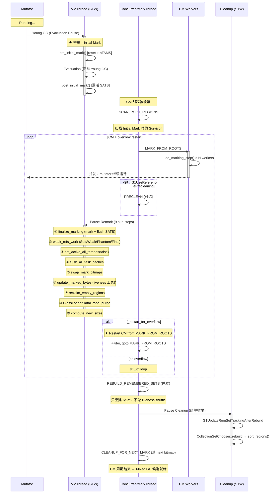
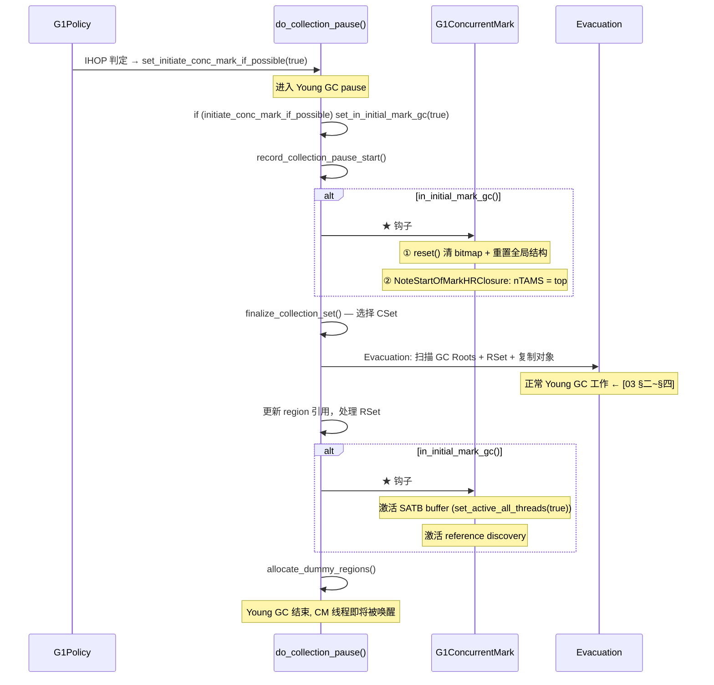
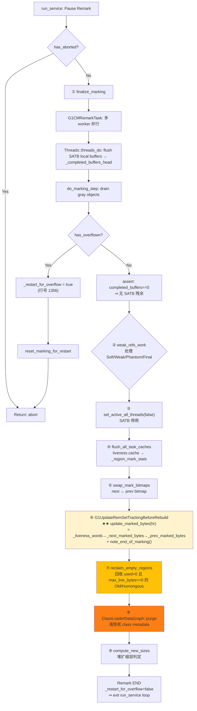

# G1 并发标记阶段宏观调度 — 07-ConcurrentMark-Phases

> **生产场景切入**：
> ```
> $ java -Xms8g -Xmx8g -XX:+UseG1GC -Xlog:gc*:file=gc.log MyApp
> 
> # 故障：容器环境 2 核，ConcGCThreads 自动推导为 1 → Concurrent Mark 完成太慢
> [5.123s] GC(2) Pause Young (Concurrent Start) 480M->125M(8192M) 38ms
> [5.150s] GC(2) Concurrent Mark Cycle           ← 启动单线程 CM
> [12.456s] GC(3) Pause Young (Normal) 680M->190M(8192M) 48ms
> [18.234s] GC(4) Pause Young (Normal) 810M->256M(8192M) 52ms
> [20.567s] GC(2) Concurrent Mark Cycle          ← 13 秒后才完成！！
> [20.620s] GC(5) Pause Remark 3100M->3050M(8192M) 150ms   ← Old 已 3GB
> [20.850s] GC(6) Pause Full (Allocation Failure) ...      ← IHOP 追不上分配速率
> # 根因：2 核 → ParallelGCThreads=2 → ConcGCThreads=(2+2)/4=1
> # 单线程 CM 追不上 4 个 mutator 线程的分配速率 → Old 持续增长 → CM abort → Full GC
> # 修复：-XX:ConcGCThreads=2
> ```
> 本文解释这份日志的每一步——从 Initial Mark "搭车" Young GC 到 Remark 的 9 个子步骤，以及是什么让 CM 花了 13 秒。

> **阅读收益**：读完本文后，你能精确回答：G1 并发标记周期有哪些阶段？Initial Mark 为什么能"搭车" Young GC 零额外 STW？Remark 为什么不能省（SATB 残留 + Reference Processing + Class Unloading 三个"尾巴"）？`live_bytes()` 公式中每一字节从哪个数据结构来（bitmap bit → `_live_words` → `_prev_marked_bytes` → `live_bytes` → `_gc_efficiency`）？Cleanup 怎么把 bitmap 标记结果转化为 Mixed GC 的回收候选列表？CM 周期五阶段的每一笔开销和每一字节数据流都了然于胸。

---

## §〇 阅读前提与文档边界

### 前置知识依赖

| 前置文档 | 本文引用的关键概念 |
|---------|-------------------|
| [01-HeapRegion] | Region 类型（Free/Eden/Survivor/Old/Humongous），`_prev_marked_bytes`，`_prev_top_at_mark_start` |
| [03-YoungGC] | Young GC 四阶段流程，`do_collection_pause()` 的 Evacuation |
| [04-ConcurrentMark-Core] | `do_marking_step()` 引擎，drain 优先级链，finger CAS Claim |
| [05-SATB] | SATB barrier，`_completed_buffers_head`，`set_active_all_threads()` |
| [08-MixedGC-Policy] | 本文输出端 — `_gc_efficiency` → `CollectionSetChooser::sort_regions()` → CSet 选策 |

### 与 06 的边界

**06 聚焦**：G1CMTask 内部单轮 `do_marking_step()` 执行逻辑 — drain 优先级链、finger CAS Claim、10ms 时间片、steal。  
**本文聚焦**：`do_marking_step()` 完成前后的宏观调度 — Initial Mark → Root Region Scanning → [Concurrent Mark] → Preclean → Remark → Cleanup → Rebuild RSet，以及 overflow restart 循环如何串联这些阶段。

### 与 08 的边界

**本文负责**：liveness 数据的**生产端** — bitmap bit → `_live_words` → `_prev_marked_bytes` → `live_bytes()` → `reclaimable_bytes()` → `_gc_efficiency` → `CollectionSetChooser` 候选列表。  
**08 负责**：liveness 数据的**消费端** — G1Policy 如何用 `_gc_efficiency` 排序 + IHOP 自适应 + CSet 选策。

---

## §〇 标境环境与源文件清单

### 标准环境

- **OpenJDK 11 slowdebug build**（`#ifdef ASSERT` 全部生效）
- **JVM 参数**：`-Xms8g -Xmx8g -XX:+UseG1GC`（G1 Region = 4MB，2048 Regions）
- **64 位 Linux x86**
- `-XX:ConcGCThreads=N` 控制并发标记线程数（默认 = `(ParallelGCThreads + 2) / 4`）
- **GDB 验证在 slowdebug build 中进行**

### 源文件清单

> ★ 所有行号均经 `grep` 验证，可直接引用。

| # | 文件 | 行号 | 核心内容 | 本文角色 |
|---|------|------|---------|---------|
| 1 | `g1ConcurrentMark.cpp` | 874-881 | `pre_initial_mark()` | ★ Initial Mark 第一步 |
| | | 884-903 | `post_initial_mark()` | ★ Initial Mark 第二步 |
| | | 1047-1077 | `scan_root_regions()` | ★ Root Region 扫描 |
| | | 1273-1384 | `remark()` | ★★ Remark 主函数 |
| | | 1386-1468 | `G1ReclaimEmptyRegionsTask` | ★ Remark — 回收空 Region |
| | | 1470-1491 | `reclaim_empty_regions()` | ★ Remark — 入口 |
| | | 1526-1585 | `cleanup()` | ★★ Cleanup 主函数 |
| | | 1901-1921 | `preclean()` | ★ Preclean |
| | | 2022-2050 | `G1CMRemarkTask` | ★ Remark 并行标记任务 |
| | | 2052-2089 | `finalize_marking()` | ★★ Remark 核心 |
| | | 2223-2227 | `rebuild_rem_set_concurrently()` | ★ 后台 RSet 重建 |
| | | 661-674 | `humongous_object_eagerly_reclaimed()` | ★ Humongous 急切回收 |
| | | 866-872 | `NoteStartOfMarkHRClosure` | ★ per-Region nTAMS |
| 2 | `g1ConcurrentMarkThread.cpp` | 248-428 | `run_service()` | ★★★ 阶段调度主循环 |
| | | 323-326 | `preclean()` 调度 | ★ Preclean 触发 |
| 3 | `g1CollectedHeap.cpp` | 3799 | `pre_initial_mark()` 调用点 | ★ Initial Mark 钩子 #1 |
| | | 3903 | `post_initial_mark()` 调用点 | ★ Initial Mark 钩子 #2 |
| 4 | `g1CollectorState.hpp` | 32-124 | `G1CollectorState` 完整类 | ★★ CM 状态控制 |
| 5 | `heapRegion.hpp` | 247 | `_prev_marked_bytes` | ★★ liveness 字段 |
| | | 251 | `_gc_efficiency` | ★★ GC 效率字段 |
| | | 263 | `_prev_top_at_mark_start` | ★★ TAMS 字段 |
| | | 370-373 | `marked_bytes()`, `live_bytes()` | ★★ liveness 公式 |
| | | 394-398 | `reclaimable_bytes()` | ★★ 回收量 |
| 6 | `heapRegion.cpp` | 143-155 | `calc_gc_efficiency()` | ★★ gc_efficiency 计算 |
| 7 | `heapRegion.inline.hpp` | 243-246 | `note_start_of_marking()` | ★ nTAMS 设置 |
| 8 | `collectionSetChooser.cpp` | 42-62 | `order_regions()` | ★ 比较器 |
| | | 124-154 | `sort_regions()` | ★★ 按 gc_efficiency 排序 |
| | | 156-168 | `add_region()` | ★★ 添加候选 |
| | | 305-321 | `rebuild()` | ★★ Cleanup 后重建候选 |
| 9 | `g1Policy.cpp` | 954-974 | `predict_region_elapsed_time_ms()` | ★ gc_efficiency 分母 |
| | | 1110-1130 | `record_concurrent_mark_cleanup_end()` | ★★ Cleanup 结束处理 |
| 10 | `g1ConcurrentMark.inline.hpp` | 212-214 | `add_to_liveness()` | ★ liveness 累加 |

---

## §一 ★ 全景 — CM 周期的阶段调度

### ❓ G1 并发标记周期有哪些阶段？为什么不能一个阶段做完？

G1 并发标记周期分布在 5 个主动阶段（Initial Mark → Root Region Scanning → Concurrent Mark → Remark → Cleanup）+ 1 个可选阶段（Preclean）+ 1 个后台阶段（Concurrent Rebuild RSet）。

**为什么不能一个阶段做完？**

1. **Initial Mark 必须 STW**：标记 GC Roots 需要扫描所有线程栈、JNI 句柄、System Dictionary 等——这些数据结构在并发访问下不安全。
2. **Concurrent Mark 必须并发**：深度遍历整个堆的对象图（~8GB 堆）可能持续 50-200ms，如果全程 STW，应用停顿不可接受。
3. **Remark 必须 STW**：并发标记期间 mutator 持续产生 SATB buffer 残余 + Reference Processing 必须在 safepoint 做 + Class Unloading 必须全 STW。
4. **Cleanup 必须 STW**：计算 liveness、回收空 Region、决定 Mixed GC 候选——这些操作修改全局堆结构，必须原子。

### 1.1 Mermaid 1：五阶段时序图（STW/并发/并行标注 + overflow restart）



### 1.2 ★ 为什么需要这么多阶段？

并发标记的**结果在 Remark 之前不可信**——因为 mutator 在标记期间持续修改对象图，SATB 只"保护"了被断开的引用（记录 old value），但完成后 mutator 线程 local buffer 里还有没处理完的残余。

**分阶段的核心原因**：

| 阶段 | STW/并发 | 必要性 |
|------|---------|--------|
| Initial Mark | STW（搭车 Young GC） | 标记 roots → 建立"活对象集合"的起点 |
| Root Region Scanning | 并发 | 处理 Initial Mark 时的 Survivor（它们在后续 Evac 可能被复制） |
| Concurrent Mark | 并发 | 8GB 堆的对象图遍历 → 50-200ms，不能 STW |
| Preclean | 并发（可选） | 提前处理 reference 发现，减轻 Remark 压力 |
| **Remark** | STW | SATB 残余 + Ref Processing + **liveness 汇总** + **回收空 Region** + Class Unloading |
| Rebuild RSet | 并发 | 回收 Region 后重建 RSet（位于 Remark→Cleanup 之间） |
| Cleanup | STW | RSet tracking after rebuild + CSet chooser 重建（sort_regions）→ Mixed GC 候选就绪 |

### 1.3 ★ liveness 数据流概览（生产端全景）

```
bitmap gray bit
    ↓ [mark_in_next_bitmap() → add_to_liveness() = _mark_stats_cache.add_live_words()]
_live_words (word 数, per-Region, 由 _cm->mark_stats_cache 维护)
    ↓ [_cm->liveness(region_idx) 返回 _live_words] — g1ConcurrentMark.cpp
HeapWordSize 转换: _live_words × HeapWordSize
    ↓ [Remark 后 swap_mark_bitmaps() → note_end_of_marking() 将 next 拷贝到 prev]
_prev_marked_bytes (字节数) — heapRegion.hpp:247
    ↓ [live_bytes() = (top - prev_TAMS) × HeapWordSize + _prev_marked_bytes]
live_bytes (字节数) — heapRegion.hpp:371-373
    ↓ [reclaimable_bytes() = capacity() - live_bytes()]
reclaimable_bytes (字节数) — heapRegion.hpp:394-398
    ↓ [calc_gc_efficiency() = reclaimable_bytes / predict_region_elapsed_time_ms]
_gc_efficiency (分数: bytes/ms) — heapRegion.hpp:251
    ↓ [CollectionSetChooser::add_region() → sort_regions()]
CSet 候选列表 (按 _gc_efficiency 降序) → [08 §X]
```

---

## §二 ★★★ Initial Mark — 搭车 Young GC 零额外 STW

### ❓ 为什么 Initial Mark 能"搭车" Young GC？

**核心原理 — 不是"零开销"，而是"重叠开销"**：

```
Young GC (STW ~20ms) 自身必做工作：
  → GC Roots 扫描（线程栈、JNI Handle、System Dictionary）
  → Evacuation（对象复制、RSet 扫描）

Initial Mark 需要做的工作：
  → 重置标记数据结构（bitmap、mark stats）
  → 设置 nTAMS = top（per-Region）
  → 激活 SATB buffer
  → 激活 reference discovery

★ 关键重叠点：
  Initial Mark 的"重置 bitmap"是在 Young GC 扫描 roots 之前做的
  → Young GC 的 GC Roots 扫描和 Concurrent Mark 的 initial roots 是同一份 roots！
  → 不需要重复扫描，只是多调了两个小函数
```

**独立 Initial Mark STW 的代价（替代分析）**：

| | 搭车设计 | 独立 STW |
|--|---------|---------|
| STW 次数 | 0 次额外 | 1 次额外（~2-5ms） |
| GC Roots 扫描 | 复用 Young GC 自己的 | 重复扫描一次 |
| pause 总量 | ~20ms（只有 Young GC） | ~20ms + 2-5ms |
| SATB 激活 | 刚好在 roots 标记完成后 | 同样时机但需要单独暂停 |

### 2.1 `set_initiate_conc_mark_if_possible(true)` 设置了什么？

**`g1CollectorState.hpp:94`**：

```cpp
void set_initiate_conc_mark_if_possible(bool v) {
  _initiate_conc_mark_if_possible = v;
}
```

这是一个**建议性标志**——G1Policy 在 Young GC 之前根据 IHOP（Initiating Heap Occupancy Percent）判定：堆占用比例达到阈值 → `set_initiate_conc_mark_if_possible(true)`。

**为什么叫 "if possible" 而不是 "immediately"**？
- 如果当前已经在标记周期中（`mark_or_rebuild_in_progress()`），这个建议会被忽略
- 如果发生了 Full GC ——也不行
- 这是在 "下一次 Young GC 中**搭车**启动" 的标志，不是立即启动

**状态链**：

```
G1Policy::need_to_start_conc_mark() → true
  → g1_policy()->force_initial_mark_if_outside_cycle()
    → collector_state()->set_initiate_conc_mark_if_possible(true)
      → 在 do_collection_pause() 开始阶段：
        → if (collector_state()->initiate_conc_mark_if_possible())
            → collector_state()->set_in_initial_mark_gc(true)
            
Young GC 类型因此变更为 InitialMark：
  G1YCType::InitialMark (而不是 Normal)
```

### 2.2 Mermaid 2：Young GC `do_collection_pause()` 中的两个钩子插入点



**关键源码位置**：
- 钩子 #1：`g1CollectedHeap.cpp:3799` — `concurrent_mark()->pre_initial_mark()`
- 钩子 #2：`g1CollectedHeap.cpp:3903` — `concurrent_mark()->post_initial_mark()`

### 2.3 `pre_initial_mark()` 逐行走读 — 两步必须分开的原因

**`g1ConcurrentMark.cpp:874-881`**：

```cpp
void G1ConcurrentMark::pre_initial_mark() {
  // Initialize marking structures. This has to be done in a STW phase.
  reset();                            // ① 全局重置

  // For each region note start of marking.
  NoteStartOfMarkHRClosure startcl;   // ② per-Region nTAMS
  _g1h->heap_region_iterate(&startcl);
}
```

**① `reset()` — 全局重置（在 g1ConcurrentMark.cpp 中）**：
- 清空 `_next_mark_bitmap`（本轮标记用）
- 重置所有 CM worker 的任务状态（`G1CMTask::reset()`）
- 重置 `_root_regions`
- 清空 `_global_mark_stack`
- 重置 `_terminator`

**② `NoteStartOfMarkHRClosure` — `g1ConcurrentMark.cpp:866-872`**：

```cpp
class NoteStartOfMarkHRClosure : public HeapRegionClosure {
public:
  bool do_heap_region(HeapRegion* r) {
    r->note_start_of_marking();
    return false;
  }
};
```

**`note_start_of_marking()` — `heapRegion.inline.hpp:243-246`**：

```cpp
inline void HeapRegion::note_start_of_marking() {
  _next_marked_bytes = 0;
  _next_top_at_mark_start = top();
}
```

**★ 为什么两步必须分开？**

1. **`reset()` 是全局性的**——清除 bitmap、重置 CM tasks、清空 mark stack。这些操作必须在任何 Region 操作**之前**完成。
2. **`NoteStartOfMarkHRClosure` 是 per-Region 的**——每个 Region 的 `top()` 不同（取决于已分配了多少）。必须在 `reset()` 完成后、Evacuation 开始**之前**记录——因为 Evacuation 会改变 `top()`。
3. **时序关键**：如果 Evacuation 比 `note_start_of_marking()` 先执行，那 nTAMS 记录的是 Evacuation 后的 top（即 Young 区已经被复制了），此时 TAMS 以上隐式 live 的对象就包括了被复制到 Survivor 的对象——这些对象的标记状态在 bitmap 中丢失了。

### 2.4 Young GC Evacuation（简述）

Initial Mark 期间的 Young GC 和普通 Young GC 完全一样——扫描 GC Roots、RSet、复制存活对象到 Survivor/Old。差别仅在于类型标记为 `G1YCType::InitialMark`，这改变了 `pre_initial_mark()` 和 `post_initial_mark()` 两个钩子的执行。详细流程见 [03 §二~§四]。

### 2.5 `post_initial_mark()` 逐行走读 — 激活 SATB + ref discovery

**`g1ConcurrentMark.cpp:884-903`**：

```cpp
void G1ConcurrentMark::post_initial_mark() {
  // ★ 步骤 1：激活引用发现
  ReferenceProcessor* rp = _g1h->ref_processor_cm();
  rp->enable_discovery();
  rp->setup_policy(false); // snapshot the soft ref policy

  // ★ 步骤 2：激活所有线程的 SATB buffer
  SATBMarkQueueSet& satb_mq_set = G1BarrierSet::satb_mark_queue_set();
  satb_mq_set.set_active_all_threads(true,   // new active value
                                     false   // expected_active
  );

  // ★ 步骤 3：准备 Root Region 扫描
  _root_regions.prepare_for_scan();
}
```

**三步的时序原因**：

1. **`rp->enable_discovery()`** — 开始发现弱引用（Soft/Weak/Phantom/Finalizer），这些引用将在 Remark 中处理。
2. **`set_active_all_threads(true)`** — 激活 SATB 队列。从此刻起，所有 mutator 线程的 pre-barrier 写入（`obj -> field`）都会记录 old value 到 SATB buffer。**`expected_active=false` 是一个断言参数**：断言调用前所有线程的 queue 都处于 inactive 状态。
3. **`_root_regions.prepare_for_scan()`** — 记录当前 Survivor 区域列表，这些是后续 Root Region Scanning 的输入。

**★ 为什么在 Evacuation 之后？** 因为 Evacuation 过程中 mutator 暂停了，没有引用写入——SATB 可以在 Evacuation 完成后安全激活，不会丢失任何 pending 修改。

---

## §三 ★★ Root Region Scanning — 为什么必须在 Concurrent Mark 前扫描？

### ❓ Root Region 是什么？为什么必须在 Concurrent Mark 前扫描？

**Root Region = Initial Mark 暂停结束时，Survivor 中的对象集合。**

**问题场景**：

```
Initial Mark (STW) 结束：
  → Survivor 中有对象 S → 被标记为 gray（在 CM initial marking 中完成）
  → S 指向 Old 区的对象 O
  → 正常逻辑：S 是 gray → O 也会被扫描到

但如果下一轮 Young GC 在 CM 完成之前发生：
  → S 被 Evacuation 移动到新的 Survivor S'
  → ★ 原来的 S（在旧 Survivor Region 中）已失效
  → CM worker 扫描旧 Survivor Region 时，S 不在那里了！
  → S → O 的引用丢失 → O 漏标！
```

**解决方案**：在 CM 开始之前先扫描完这些 Root Region 中的对象及其直接引用——这样 O 被标记，即便 S 后来被移动，O 也不会漏标。

### 3.1 `scan_root_regions()` 逐行走读

**`g1ConcurrentMark.cpp:1047-1077`**：

```cpp
void G1ConcurrentMark::scan_root_regions() {
  if (root_regions()->scan_in_progress()) {
    _num_concurrent_workers = MIN2(calc_active_marking_workers(),
                                   root_regions()->num_root_regions());
    G1CMRootRegionScanTask task(this);
    _concurrent_workers->run_task(&task, _num_concurrent_workers);
  }
}
```

**`G1CMRootRegionScanTask` — `g1ConcurrentMark.cpp:1028-1045`**：

```cpp
class G1CMRootRegionScanTask : public AbstractGangTask {
  G1ConcurrentMark* _cm;
public:
  G1CMRootRegionScanTask(G1ConcurrentMark* cm) :
    AbstractGangTask("G1 Root Region Scan"), _cm(cm) { }

  void work(uint worker_id) {
    G1CMRootRegions* root_regions = _cm->root_regions();
    HeapRegion* hr = root_regions->claim_next();      // ★ CAS 领取下一个 root region
    while (hr != NULL) {
      _cm->scan_root_region(hr, worker_id);            // ★ 扫描该 Region 中的所有对象
      hr = root_regions->claim_next();
    }
  }
};
```

**为什么用 CAS claim 而不是预先分块？** Root Region 数量很少（通常 10-20 个 Survivor Region），每个 Region 扫描的代价不均衡（一个大 Survivor 可能有几百个对象，小的可能只有几个）。CAS claim 是最简单的 load-balanced 策略——每个 worker 做完一个 Region 就来领下一个，自然平衡负载。

**`scan_root_region(hr, worker_id)` 做什么？** — 遍历该 Region 中所有 gray objects（即 Initial Mark 中标记为 gray 的对象），扫描它们的引用字段，将引用的对象 push 到对应 worker 的 `_task_queue` 中。这些被 push 的对象随后在 CM 阶段被 `do_marking_step()` drain。

**`G1CMRootRegions` 类 — `g1ConcurrentMark.hpp:254-297`**：
- `_claimed_survivor_index` — `volatile int`，CAS 领取索引（每个 worker 拿走一个 index 就 `Atomic::add(1)`）
- `_scan_in_progress` — 由 `prepare_for_scan()` 设为 true（当有 root regions 时）

### 3.2 ★ 为什么必须 CM 前扫完？

在 `run_service()` 中的位置（`g1ConcurrentMarkThread.cpp:292-297`）：

```cpp
{ // SCAN_ROOT_REGIONS — 在 mark_from_roots() 之前
  G1ConcPhase p(G1ConcurrentPhase::SCAN_ROOT_REGIONS, this);
  _cm->scan_root_regions();
}
// ...
{ // MARK_FROM_ROOTS — 在 SCAN_ROOT_REGIONS 之后
  _cm->mark_from_roots();
}
```

如果 Root Regions 没扫完就开始 CM，CM 期间发生 Young GC → Root Region 中的对象被移动 → CM worker 扫描旧地址 → 丢失引用。所以 `run_service()` 等待 `scan_root_regions()` 完成后才调用 `mark_from_roots()`。

---

## §四 ★★ 从 CM 到 Remark 的调度 — Preclean + Overflow Restart

### ❓ CM 完成后到 Remark 之间还有什么调度决策？

CM 完成后不是直接进入 Remark。`run_service()` 的循环中夹了三个检查点：

1. **Preclean（可选）**：如果 `G1UseReferencePrecleaning=true`，调用 `preclean()`
2. **BEFORE_REMARK 控制点**：检查是否有 abort
3. **MMU 延迟**：`delay_to_keep_mmu()` — 确保与上一次 GC pause 之间的间隔满足 MMU 约束

### 4.1 Preclean 阶段 — 为什么可选的？

**`g1ConcurrentMarkThread.cpp:323-326`**：

```cpp
if (G1UseReferencePrecleaning) {
  G1ConcPhase p(G1ConcurrentPhase::PRECLEAN, this);
  _cm->preclean();
}
```

**`preclean()` — `g1ConcurrentMark.cpp:1901-1921`**：

```cpp
void G1ConcurrentMark::preclean() {
  SuspendibleThreadSetJoiner joiner;
  G1CMKeepAliveAndDrainClosure keep_alive(this, task(0), true /* is_serial */);
  G1CMDrainMarkingStackClosure drain_mark_stack(this, task(0), true);
  set_concurrency_and_phase(1, true);
  ReferenceProcessor* rp = _g1h->ref_processor_cm();
  ReferenceProcessorMTDiscoveryMutator rp_mut_discovery(rp, false);
  rp->preclean_discovered_references(
      rp->is_alive_non_header(), &keep_alive, &drain_mark_stack, &yield_cl, ...);
}
```

**Preclean 做什么？**

ReferenceProcessor 在 CM 期间发现了引用对象（Soft/Weak/Phantom/Final）。Preclean 提前处理那些"referent 已死"的引用——把它们标记为需要 cleared，从而减少 Remark 中的 reference processing 工作量。

**★ `G1PrecleanYieldClosure` — 并发安全的关键 — `g1ConcurrentMark.cpp:1885-1898`**：

```cpp
class G1PrecleanYieldClosure : public YieldClosure {
  G1ConcurrentMark* _cm;
public:
  G1PrecleanYieldClosure(G1ConcurrentMark* cm) : _cm(cm) { }

  virtual bool should_return() {
    return _cm->has_aborted();       // CM 被 abort 时 yield
  }

  virtual bool should_return_fine_grain() {
    _cm->do_yield_check();           // 检查是否应该让出 CPU（如 safepoint 请求）
    return _cm->has_aborted();
  }
};
```

Preclean 是**并发的**——如果 Young GC 请求发生，需要让出 CPU 让 GC 线程执行 safepoint。`YieldClosure` 的 `should_return_fine_grain()` 检查 `SuspendibleThreadSet::should_yield()` → 如果 musator 请求了 safepoint → preclean 线程挂起 → safepoint 完成 → preclean 恢复。如果没有 yield 机制，preclean 会无限期延迟 safepoint → 应用长时间停顿。

**★ 为什么 Preclean 是单线程的？** (`set_concurrency_and_phase(1, true)`) — reference discovery 的 precleaning 使用 single-threaded mode（`ReferenceProcessorMTDiscoveryMutator(rp, false)`）。原因：reference 处理涉及复杂的并发安全保证（`DiscoveredList` 的 head/tail 操作），单线程简化了实现，且 preclean 通常很快。

**★ 为什么是可选的？**

1. 如果 `G1UseReferencePrecleaning=false`，所有引用发现和处理都延迟到 Remark 中做
2. Remark 本身是 STW 的，多做一点引用处理只会稍微增加 pause 时间
3. Preclean 的收益是"减轻 Remark 压力"，但如果堆中引用对象很少，收益不大，反而浪费了并发时间

**默认值**：`G1UseReferencePrecleaning = true`（在产品级 JVM 中）

### 4.2 ★ Overflow restart loop — 多轮 overflow 的代价

在 [04 §五] 中看到：CM worker 的 `do_marking_step()` 如果 mark stack overflow，会设置 `_has_overflown`。

**在 `run_service()` 中（`g1ConcurrentMarkThread.cpp:310-368`）**：

```cpp
for (uint iter = 1; !_cm->has_aborted(); ++iter) {
  // MARK_FROM_ROOTS
  _cm->mark_from_roots();

  if (_cm->has_aborted()) { break; }

  // PRECLEAN (optional)
  if (G1UseReferencePrecleaning) { _cm->preclean(); }

  // BEFORE_REMARK 控制点
  if (_cm->has_aborted()) { break; }

  // MMU delay
  delay_to_keep_mmu(g1_policy, true /* remark */);
  if (_cm->has_aborted()) { break; }

  // ★ Pause Remark
  VMThread::execute(&op);
  if (_cm->has_aborted()) {
    break;
  } else if (!_cm->restart_for_overflow()) {
    break;              // ★ Exit loop — no restart needed
  } else {
    // ★ Restart: 回到循环开头，重新执行 mark_from_roots()
    mark_manager.set_phase(G1ConcurrentPhase::CONCURRENT_MARK, false);
    log_info(gc, marking)("Restart for Mark Stack Overflow (iteration #%u)", iter);
  }
}
```

**★ 哪些阶段被跳过？**

- **Initial Mark** — 标记周期开始时只做一次（`note_start_of_marking` + `post_initial_mark`）
- **Root Region Scanning** — 只在 CM 之前做一次
- **`set_active_all_threads(true)`** — SATB 在整个 CM 周期中一直保持 active（直到 Remark 结束时 `set_active_all_threads(false)`）

**★ 哪些阶段被重新执行？**

- **Concurrent Mark**（`mark_from_roots()`）— 完全重做，所有 Region 从 bottom 开始重新扫描
- **Preclean**（如果 `G1UseReferencePrecleaning=true`）
- **Remark**（STW `finalize_marking()` + `weak_refs_work()` + swap + reclaim + class unload）

**★ Cleanup 不重做**：Cleanup 在 `run_service()` 的 for 循环**外部**执行（`g1ConcurrentMarkThread.cpp:387-393`），只做一次——无论 overflow 多少次，liveness 数据的汇总结果不变。

**多轮 overflow 的代价**：

| 轮次 | 额外开销 | 暂停 m 的 mutator 时间 |
|------|---------|----------------------|
| 第 1 轮 (无 overflow) | 无 | — |
| 第 2 轮 (overflow restart) | 完整 CM + Remark STW | 可能 ~50ms + ~5ms |
| 第 3 轮以上 | 同上，指数级增长 | 极少发生 |

**典型日志**：

```
[gc, marking] Concurrent Mark (1.234s, 1.234s) 1234.567ms
[gc, marking] Concurrent Mark Restart for Mark Stack Overflow (iteration #1)
[gc, marking] Concurrent Mark (2.345s, 3.579s) 1245.678ms
```

---

## §五 ★★ Remark — 为什么必须 STW？

### ❓ CM workers 都 terminate 了，还有什么东西没标记？

**三个未完成事项**：

1. **Mutator thread-local SATB buffers 中的残余**：每个 mutator 线程有自己的 local buffer。CM 结束时，local buffer 中未满的部分没有被 drain——因为 drain 只在 buffer 满时触发（满后入队到 `_completed_buffers_head`）。**这些残余 old value 从未被标记线程看到过。**
2. **CM 完成后 mutator 新产生的 SATB buffer**：CM 结束后到 Remark 开始前的这段时间（包括 MMU delay 窗口），mutator 继续产生 SATB 记录。这些新产生的 buffer 还没被处理。
3. **Reference Processing**：弱引用/软引用/虚引用/Finalizer 的处理必须在 safepoint 下进行（因为要修改 Reference 对象的头，可能与其他线程并发冲突）。

### 5.1 Remark 的入口：`run_service()` → `Pause Remark` → `remark()`

**`g1ConcurrentMarkThread.cpp:347-353`**：

```cpp
CMRemark cl(_cm);
VM_CGC_Operation op(&cl, "Pause Remark");
VMThread::execute(&op);
```

`CMRemark::doit()` 调用 `_cm->remark()`：

**`g1ConcurrentMark.cpp:1273-1384`（完整关键路径，9 个步骤）**：

```cpp
void G1ConcurrentMark::remark() {
  assert_at_safepoint_on_vm_thread();
  // ★ 步骤 1：finalize_marking() — STW 下完成最后标记
  finalize_marking();

  bool const mark_finished = !has_overflown();
  if (mark_finished) {
    // ★ 步骤 2：weak_refs_work — 处理四种引用
    weak_refs_work(false /* clear_all_soft_refs */);

    // ★ 步骤 3：停用 SATB — 全标记周期结束
    SATBMarkQueueSet& satb_mq_set = ...;
    satb_mq_set.set_active_all_threads(false, true);

    // ★ 步骤 4：flush_all_task_caches — 所有 CM worker 的 liveness cache
    //           汇总到 _region_mark_stats[]（全局 array）
    flush_all_task_caches();                      // 行号 1316-1318

    // ★ 步骤 5：swap_mark_bitmaps() — next ↔ prev
    swap_mark_bitmaps();                          // 行号 1321

    // ★ 步骤 6：G1UpdateRemSetTrackingBeforeRebuildTask
    //   ★★ 这一步是 liveness 数据流的关键桥梁！
    //   update_marked_bytes(hr): _region_mark_stats → _next_marked_bytes
    //   add_marked_bytes_and_note_end(hr): _next → _prev (note_end_of_marking)
    { /* G1UpdateRemSetTrackingBeforeRebuildTask */ }  // 行号 1322-1335

    // ★ 步骤 7：reclaim_empty_regions() — 回收全空的 Old/Humongous Region
    reclaim_empty_regions();                      // 行号 1336-1339

    // ★ 步骤 8：Class Unloading — 清除死 class
    if (ClassUnloadingWithConcurrentMark) {
      ClassLoaderDataGraph::purge();              // 行号 1342-1344
    }

    // ★ 步骤 9：compute_new_sizes() — 堆扩缩容
    compute_new_sizes();                          // 行号 1347
  } else {
    // Overflow 路径：重新做一轮 CM
    _restart_for_overflow = true;                 // 行号 1356
    reset_marking_for_restart();                  // 行号 1366
  }
}
```

> **★ 关键发现**：Remark 不是只做"标记收尾"——它还做了 **liveness 数据汇总**（步骤 6）、**回收空 Region**（步骤 7）、**Class Unloading**（步骤 8）。这些操作都在 Remark 的同一个 STW pause 中完成。Cleanup 只做后续的 RSet tracking 更新 + CSet chooser 重建。

### 5.2 `finalize_marking()` 逐行走读

**`g1ConcurrentMark.cpp:2052-2089`**：

```cpp
void G1ConcurrentMark::finalize_marking() {
  _g1h->ensure_parsability(false);

  uint active_workers = _g1h->workers()->active_workers();
  set_concurrency_and_phase(active_workers, false /* concurrent */);
  // ★ 注意：is_concurrent=false → 标记线程不会 yield/wait
  // → 不会像 CM 那样 10ms 时间片

  {
    StrongRootsScope srs(active_workers);
    G1CMRemarkTask remarkTask(this, active_workers);
    _g1h->workers()->run_task(&remarkTask);
  }

  // ★ 断言：如果没 overflow，所有 SATB completed buffers 必须为 0
  SATBMarkQueueSet& satb_mq_set = G1BarrierSet::satb_mark_queue_set();
  guarantee(has_overflown() ||
            satb_mq_set.completed_buffers_num() == 0,
            "Invariant: completed buffers must be 0 after finalize");
}
```

**`G1CMRemarkTask::work()` — `g1ConcurrentMark.cpp:2022-2050`**：

```cpp
void work(uint worker_id) {
  G1CMTask* task = _cm->task(worker_id);
  task->record_start_time();

  {
    ResourceMark rm;
    HandleMark hm;

    // ★ 步骤 1：遍历所有 Java 线程，flush 它们的 SATB buffer
    G1RemarkThreadsClosure threads_f(G1CollectedHeap::heap(), task);
    Threads::threads_do(&threads_f);
  }

  // ★ 步骤 2：do_marking_step — 同 [04 §五] 引擎，但 is_serial=false
  //     时间片设为极大值确保不会 yield
  do {
    task->do_marking_step(1000000000.0, // 时间片极大 → 直到完成
                          true,          // do_termination
                          false          // is_serial = false → 多 worker 并行
    );
  } while (task->has_aborted() && !_cm->has_overflown());
  // ★ 如果 overflow → 退出 → 回到 run_service 的 restart 循环
}
```

**`G1RemarkThreadsClosure` 做什么？**

对每个 Java 线程：
1. Flush thread-local SATB buffer → 将所有残余 push 到 `_completed_buffers_head`
2. Flush oops_do → 处理线程栈上的 oop 引用（标记 OopMap 中可能的遗漏）

这样所有 mutator 的 local SATB 都被集中到 `_completed_buffers_head`，接下来 CM workers 的 `do_marking_step()` 会 drain 全部。

### 5.3 ★ Reference Processing — 四种引用各什么时候处理？

**在 Remark 中，`weak_refs_work(false)` 调用 ReferenceProcessor 处理**：

| 引用类型 | Remark 中的处理 | 处理条件 | 清除条件 |
|---------|---------------|---------|---------|
| **SoftReference** | `process_discovered_references` | `clear_all_soft_refs=false`（不是 Full GC） | referent 没被 marked 且 `SoftRefPolicy::should_clear_all_soft_refs()` 为 true — 基于 `_soft_ref_lru_clock`（上次 soft ref get 的时间戳）判断内存压力 |
| **WeakReference** | `process_discovered_references` | — | referent 没被 marked 就清除 |
| **FinalReference** | `process_discovered_references` | — | Finalizer 线程需要处理的引用 × |
| **PhantomReference** | `process_discovered_references` | — | 如果 referent 没被 marked，清除并通知 ReferenceQueue × |

> × Phantom 和 Final 的处理有点特殊——它们不是简单"清除"，而是注册到 ReferenceQueue 或调用 Finalizer，详细在 [11 §X] 解决。

### 5.4 ★ Class Unloading — 什么时候做？怎么判断 class 是 dead？

**时机**：在 Remark 的步骤 8（`g1ConcurrentMark.cpp:1342-1344`）——在 `reclaim_empty_regions()` **之后**。只有在 `ClassUnloadingWithConcurrentMark=true` 时才执行（默认 true）。

**为什么在 reclaim_empty_regions 之后？** 回收空 Region 可能释放了部分 class 实例占用的空间，紧接着 purge 可以把这些实例对应的 class metadata 一并从 Metaspace 中清除。时序上是"先清堆、再清元空间"。

**判断条件是三重 AND**：
1. ClassLoader 的所有 classes 都没有被标记为 live（bitmap 中没有 mark）— 无实例
2. ClassLoader 的 mirror oop 没有被标记 — Class 本身的 `java.lang.Class` 对象也没被引用
3. ClassLoader 本身不是系统类加载器（Bootstrap/Platform/App 类的类加载器的类永不卸载）

**☆ 为什么不能在 finalize_marking() 内做？** 
因为 Class Unloading 需要依赖 `swap_mark_bitmaps()` 之后的 prev bitmap 来判定"哪些 class 存活"。如果在 swap 之前卸载，可能把刚被标记为 live 的 class 错误卸载。必须在 swap → `reclaim_empty_regions()` 之后、标记结果完全定稿了才安全执行。

### 5.5 ★ `update_marked_bytes()` — liveness 数据从 worker cache 到 per-Region bytes 的完整桥梁

> **★ 这是本文最关键的源码缺失环节，也是 liveness 数据流唯一"黑箱"的打开点。**

**位置**：在 Remark 步骤 6 的 `G1UpdateRemSetTrackingBeforeRebuildTask` 中（`g1ConcurrentMark.cpp:1146-1260`）。

**调用链**：

```
remark() [行号 1322-1335]
  → G1UpdateRemSetTrackingBeforeRebuildTask::work(worker_id)
    → G1UpdateRemSetTrackingBeforeRebuild::do_heap_region(hr)
      → update_remset_before_rebuild(hr)    // RSet 状态更新
      → update_marked_bytes(hr)             // ★ liveness 汇总到 Region
```

**`update_marked_bytes()` — `g1ConcurrentMark.cpp:1206-1223`**：

```cpp
void update_marked_bytes(HeapRegion* hr) {
  uint const region_idx = hr->hrm_index();
  size_t const marked_words = _cm->liveness(region_idx);  // ★ 从 _region_mark_stats 读取
  if (hr->is_humongous()) {
    if (hr->is_starts_humongous()) {
      distribute_marked_bytes(hr, marked_words);  // Humongous 跨多 Region 分配
    }
  } else {
    add_marked_bytes_and_note_end(hr, marked_words * HeapWordSize);  // ★ 写入 Region
  }
}
```

**`add_marked_bytes_and_note_end()` — `g1ConcurrentMark.cpp:1225-1229`**：

```cpp
void add_marked_bytes_and_note_end(HeapRegion* hr, size_t marked_bytes) {
  hr->add_to_marked_bytes(marked_bytes);  // → _next_marked_bytes += marked_bytes
  _cl->do_heap_region(hr);                // 如果 trace liveness，打印
  hr->note_end_of_marking();              // ★ _next → _prev 的切换
}
```

**`note_end_of_marking()` — `heapRegion.inline.hpp:248-253`**：

```cpp
inline void HeapRegion::note_end_of_marking() {
  _prev_top_at_mark_start = _next_top_at_mark_start;  // nTAMS → prev_TAMS
  _next_top_at_mark_start = bottom();                 // 清 next_TAMS
  _prev_marked_bytes = _next_marked_bytes;            // ★★ 关键切换
  _next_marked_bytes = 0;                             // 清 next
}
```

**★ 完整数据流全链路（3 层 cache → 1 个 Region 字段）**：

```
mark_in_next_bitmap(worker, hr, obj, size)   [CM 并发期间]
  → add_to_liveness(worker_id, obj, size)    
    → task[worker]->update_liveness(obj, size)
      → _mark_stats_cache.add_live_words(region_idx, live_words)
        → (cache 满时 evict) Atomic::add(region_idx, _target[region_idx]._live_words)
           → _region_mark_stats[region_idx]._live_words  [+=]

flush_all_task_caches()                      [Remark 步骤 4]
  → for each task: flush_mark_stats_cache()
    → _mark_stats_cache.evict_all()
      → Atomic::add remaining → _region_mark_stats[region_idx]._live_words  [+=]

G1UpdateRemSetTrackingBeforeRebuild           [Remark 步骤 6]
  → update_marked_bytes(hr)
    → marked_words = _cm->liveness(region_idx)  // 读 _region_mark_stats
    → hr->add_to_marked_bytes(marked_words * HeapWordSize)
      → _next_marked_bytes += marked_bytes
    → hr->note_end_of_marking()
      → _prev_marked_bytes = _next_marked_bytes  ★ 可从 live_bytes() 公式读了
```

**为什么三层 cache 设计？** 

1. **Per-task `_mark_stats_cache`**（硬件友好）— 512 个 slot 的 hotspot cache，避免每次 mark 都走 Atomic::add 到全局 array。CM 期间可能标记数百万个对象，如果不 cache，每个对象都 atomic add → L1 cache thrashing。
2. **`_region_mark_stats[]` 全局 array** — 所有 worker 的 cache 最终 evict 到此。用 `Atomic::add` 保证无锁并发。
3. **`_next_marked_bytes` per-Region** — 单个 Region 的 liveness 汇总结果。由 `note_end_of_marking()` 提升为 `_prev_marked_bytes`。

---

### 5.6 `swap_mark_bitmaps()` — 精确时机和后续影响

**调用位置**：`remark():1321` — 在 `finalize_marking()` + `weak_refs_work()` + `flush_all_task_caches()` 之后、`G1UpdateRemSetTrackingBeforeRebuildTask` 之前。

**★ 注意**：`swap_mark_bitmaps()` **只交换 bitmap 指针**，不调用 `note_end_of_marking()`。后者在步骤 6 的 `update_marked_bytes()` → `add_marked_bytes_and_note_end()` 中调用。

**为什么不在 Cleanup 中 swap？** Cleanup 需要读 prev bitmap → swap 必须在 Remark 中做。


### 5.7 ★ `reclaim_empty_regions()` — 为什么在 Remark 中回收而不等到 Cleanup？

**★ 纠正**：`reclaim_empty_regions()` 不是在 Cleanup 中调用，而是在 **Remark 步骤 7** 中调用（`g1ConcurrentMark.cpp:1336-1339`）。

**为什么在 Remark 中做？**

1. Remark 已经 STW 了——追加回收开销极小（空 Region 没有活对象，RSet 也小，回收只需几微秒）
2. 提前归还 free_list → 后续 Cleanup 选 CSet 时能用的 free Region 更多
3. 设计哲学：Remark 是"标记结果确认 → 立刻回收 → class unload → resize"的原子收尾

**回收条件和动作**（同 §六 6.3 的原描述，但执行位置在 Remark）：见下文 §六。

---

### 5.8 Mermaid 3：Remark 完整 9 步决策流程



> **★ 关键结论**：Remark 不是一个简单的"标记收尾"阶段——它是**标记结果确认 + liveness 数据汇总 + 空 Region 回收 + class unload + 堆大小决策**的五合一原子操作。Cleanup 只做 RSet 状态更新和 CSet chooser 排序——远比文档初版描绘的少。

---

## §六 ★★★ Cleanup — 基于 Remark 已完成的 liveness 数据，选出 Mixed GC 回收候选

> **★ 重要纠正**：`live_bytes()` 公式中所有数据（`_prev_marked_bytes`、`_prev_top_at_mark_start`）已在 **Remark 步骤 6** 的 `update_marked_bytes()` → `add_marked_bytes_and_note_end()` 中完成赋值。Cleanup **不计算 liveness**——它**消费** liveness 数据来重建 CSet 候选列表。

### 实际的 `cleanup()` 函数（`g1ConcurrentMark.cpp:1526-1585`）

```cpp
void G1ConcurrentMark::cleanup() {
  assert_at_safepoint_on_vm_thread();
  if (has_aborted()) return;

  g1p->record_concurrent_mark_cleanup_start();

  // ★ 步骤 1：G1UpdateRemSetTrackingAfterRebuild
  //   （注意：After Rebuild，和 Remark 中的 Before Rebuild 是配对操作）
  { /* G1UpdateRemSetTrackingAfterRebuild */ }

  // ★ 步骤 2：可选 trace liveness 日志

  // ★ 步骤 3：increment_total_collections() — 标记周期结束

  // ★ 步骤 4：★★★ record_concurrent_mark_cleanup_end()
  //     → CollectionSetChooser::rebuild() → sort_regions()
  //     → Mixed GC 候选列表就绪
  g1p->record_concurrent_mark_cleanup_end();
}
```

**Cleanup 的职责**：
1. **RSet 状态收尾**（`G1UpdateRemSetTrackingAfterRebuild`）— 并发 RSet 重建（§七）之后的追踪状态更新
2. **CSet 候选重建** — 基于 Remark 已计算的 `_gc_efficiency`，按降序排列 → 08 的 Mixed GC 入参

### 6.1 回顾：`live_bytes()` 公式（数据实为 Remark 中已赋值）

**`heapRegion.hpp:371-373`**：

```cpp
size_t live_bytes() {
  return (top() - prev_top_at_mark_start()) * HeapWordSize + marked_bytes();
}
```

逐项拆解：

| 项 | 含义 | 来源字段 | 单位 |
|----|------|---------|------|
| `top()` | Region 当前使用边界 | `_bottom + _used_length` | HeapWord* (地址) |
| `prev_top_at_mark_start()` aka prev_TAMS | 上轮 IM 时的 top | `_prev_top_at_mark_start` (swap 后从 `_next_top_at_mark_start` 拷贝) | HeapWord* |
| `top() - prev_top_at_mark_start()` | TAMS 以上的偏移 | 地址差 = word 数 | words |
| `× HeapWordSize` | 转为字节 | — | bytes |
| `marked_bytes()` | TAMS 以下 bitmap 标记的活字节 | `_prev_marked_bytes` | bytes |
| **合计** | | | **bytes** |

**★ 为什么 `live_bytes` 有两部分组成？**

```
┌──────────────────────────────────────────────┐
│                HeapRegion                     │
├──────────────────────────────────────────────┤
│ ← bottom                                       │
│                                                 │
│  [标记为 live 的对象]  ← bitmap has mark bit    │
│  [已回收/垃圾]          ← no bit set            │
│                                                 │
│ ← prev_TAMS (prev_top_at_mark_start)            │
│  ★★ TAMS 以上 = implicitly live ★★            │
│  [标记期间新分配的对象]                          │
│  [都视为 live — 不检查 bitmap]                  │
│                                                 │
│ ← top (current)                                 │
├──────────────────────────────────────────────┤
│  [未使用] ← beyond top                          │
│ ← end                                          │
└──────────────────────────────────────────────┘

live_bytes = TAMS 以下 bitmap 标记的活对象 + TAMS 以上的所有对象（全部 implicit live）
```

**★ TAMS 以上的对象为什么全部 implicit live？**

Initial Mark 设置了 `nTAMS = top`。并发标记期间 mutator 分配的新对象都在 TAMS 以上——这些对象虽然是从 GC Roots 可达的（mutator 正在使用它们），但 SATB 快照不能覆盖它们（因为它们在标记开始后才被分配，Snapshot-At-The-Beginning 只保证"标记开始时"的对象快照完整性）。所以 G1 不检查 TAMS 以上的 bitmap，而是直接全部算成 live bytes。

### 6.1 `marked_bytes()` 的完整追踪 — 从 bitmap 到一个 Region 的 bytes

**第一步：`mark_in_next_bitmap()` 中累加 liveness — `g1ConcurrentMark.inline.hpp:208-210`**：

```cpp
inline bool G1ConcurrentMark::mark_in_next_bitmap(uint worker_id, HeapRegion* const hr, oop const obj, size_t const obj_size) {
  // CAS set bit in _next_mark_bitmap
  if (_next_mark_bitmap->par_mark(obj)) {
    // CAS 成功后累加 liveness
    _mark_stats_cache.add_live_words(hr->hrm_index(), obj_size);
    return true;
  }
  return false;
}
```

`_mark_stats_cache` 是 `G1MarkStatsCache` 的实例——一个 **per-Region 的 `_live_words` 累加器**。每个 CM worker 在标记活对象时：CAS 成功 → 把对象的 word 数累加到对应 Region 的 `_live_words` 计数中。

**第二步：`cm->liveness(region_idx)` 返回 `_live_words`**：

在 CM 结束后（Remark 的 `swap_mark_bitmaps()` 之前），liveness 数据从 `_mark_stats_cache` 汇总到每个 Region 的 `_next_marked_bytes` 中：

```
_mark_stats_cache._live_words[region_idx]  (words)
    → × HeapWordSize
    → _next_marked_bytes (bytes)
```

**第三步：swap 后 `_next_marked_bytes` → `_prev_marked_bytes`**：

`note_end_of_marking()` (`heapRegion.inline.hpp:248-253`)：

```cpp
inline void HeapRegion::note_end_of_marking() {
  _prev_top_at_mark_start = _next_top_at_mark_start;
  _next_top_at_mark_start = bottom();
  _prev_marked_bytes = _next_marked_bytes;
  _next_marked_bytes = 0;
}
```

### 6.2 ★ 完整单位转换链（标注每步的执行阶段）

```
bitmap gray bit [01]                           ← CM 并发期间
    ↓ [par_mark() CAS → add_live_words() 累加]
_live_words (word 数)                          ← _mark_stats_cache 内
    ↓ [flush_all_task_caches() evict → Atomic::add]  ← Remark 步骤 4
_region_mark_stats[ridx]._live_words (全局)    ← Remark 步骤 4 结束
    ↓ [update_marked_bytes→add_marked_bytes_and_note_end] ← Remark 步骤 6
_prev_marked_bytes (字节数) — heapRegion.hpp:247 ← Remark 步骤 6 note_end_of_marking()
    │
    │ 同时完成：_prev_top_at_mark_start = 本轮 nTAMS
    │                               ← Remark 步骤 6 note_end_of_marking()
    ↓ [live_bytes() = (top-prev_TAMS)×HWSize + _prev_marked_bytes] ← Cleanup 可用
live_bytes (字节数) — heapRegion.hpp:373
    ↓ [reclaimable_bytes() = capacity() - live_bytes()]
reclaimable_bytes (字节数) — heapRegion.hpp:398
    ↓ [calc_gc_efficiency() = reclaimable / predicted_time]  ← Cleanup add_region 时
_gc_efficiency (分数: bytes/ms) — heapRegion.hpp:251
    ↓ [CollectionSetChooser::rebuild → sort_regions by gc_eff DESC]  ← Cleanup
CSet 候选列表 (按 _gc_efficiency 降序) → [08 §X]
```

**★ 关键修正**：`note_end_of_marking()` 不在 `swap_mark_bitmaps()` 内部，而是在 Remark 步骤 6 的 `G1UpdateRemSetTrackingBeforeRebuild::update_marked_bytes()` → `add_marked_bytes_and_note_end()` 中。swap 只交换 bitmap 指针。

### 6.3 ★ `reclaim_empty_regions()` — 回收什么 Region？（执行在 Remark 步骤 7，但逻辑在此详述）

> ★ `reclaim_empty_regions()` 在 **Remark 步骤 7** (`g1ConcurrentMark.cpp:1336-1339`) 执行，不是 Cleanup。本节详述其**回收条件**和**回收动作**，它们在 Remark 的 STW 中完成。

**`g1ConcurrentMark.cpp:1470-1491`**：

```cpp
void G1ConcurrentMark::reclaim_empty_regions() {
  WorkGang* workers = _g1h->workers();
  FreeRegionList empty_regions_list("Empty Regions After Mark List");
  G1ReclaimEmptyRegionsTask cl(_g1h, &empty_regions_list, workers->active_workers());
  workers->run_task(&cl);
  if (!empty_regions_list.is_empty()) {
    _g1h->prepend_to_freelist(&empty_regions_list);
  }
}
```

**`G1ReclaimEmptyRegionsClosure` 的回收条件 — `g1ConcurrentMark.cpp:1412`**：

```cpp
if (hr->used() > 0 && hr->max_live_bytes() == 0 && !hr->is_young() && !hr->is_archive()) {
  // 回收！
```

| 条件 | 含义 | 为什么需要 |
|------|------|-----------|
| `hr->used() > 0` | Region 中有数据 | 回收空 Region 没意义 |
| `hr->max_live_bytes() == 0` | 所有数据都是垃圾（无活对象） | `max_live_bytes() = used() - garbage_bytes()` |
| `!hr->is_young()` | 不是 Young Region | Young Region 在 Young GC 中处理 |
| `!hr->is_archive()` | 不是 Archive Region | CDS archive 永久保留 |

**回收动作**：

```cpp
if (hr->is_humongous()) {
  _g1h->free_humongous_region(hr, _local_cleanup_list);  // 处理 starts + continues
} else {
  _g1h->free_region(hr, _local_cleanup_list, ...);        // 单个 Region
}
hr->clear_cardtable();
_g1h->concurrent_mark()->clear_statistics_in_region(hr->hrm_index());
```

### 6.4 ★ Humongous Eager Reclaim — 死 Humongous 对象的单独回收路径

Humongous 对象跨越多个连续 Region（starts + continues）。如果 bitmap 显示这个 Humongous 对象是死的（start region 在 bitmap 中没有 mark bit）：

- **不需要等 Mixed GC** — 直接在 Remark 步骤 7 中回收（`reclaim_empty_regions()` 内部）
- `free_humongous_region()` 把 starts + 所有 continues 都归还 free_list
- `humongous_object_eagerly_reclaimed()` (`g1ConcurrentMark.cpp:661-674`) 清除 bitmap 中的残余 mark bits

**为什么叫 "eagerly"（急切）？** 正常 Old Region 回收要到 Mixed GC 的 Evacuation 阶段，Humongous 对象在 Remark 中就能回收 = 更快释放内存。

### 6.5 ★ `calc_gc_efficiency()` — Cleanup 中调用，基于 Remark 已计算的 liveness

`calc_gc_efficiency()` 在 `CollectionSetChooser::add_region()` 和 `set_region()` 中调用（`collectionSetChooser.cpp:165, 201`），这些调用发生在 Cleanup 的 `rebuild()` 过程中（`record_concurrent_mark_cleanup_end()` → `cset_chooser()->rebuild()`）。

**`heapRegion.cpp:143-155`**：

```cpp
void HeapRegion::calc_gc_efficiency() {
  double region_elapsed_time_ms = g1p->predict_region_elapsed_time_ms(this, false);
  _gc_efficiency = (double) reclaimable_bytes() / region_elapsed_time_ms;
}
```

**`reclaimable_bytes()` = `capacity() - live_bytes()`** — Remark 步骤 6 已赋值 `_prev_marked_bytes`，这里直接读。

**分母 `predict_region_elapsed_time_ms()` — `g1Policy.cpp:954-974`**：

```cpp
double G1Policy::predict_region_elapsed_time_ms(HeapRegion* hr, bool for_young_gc) const {
  size_t rs_length = hr->rem_set()->occupied();              // RSet 卡数
  size_t card_num = _analytics->predict_card_num(rs_length, for_young_gc);
  size_t bytes_to_copy = predict_bytes_to_copy(hr);
  double region_elapsed_time_ms =
    _analytics->predict_rs_scan_time_ms(card_num, ...) +
    _analytics->predict_object_copy_time_ms(bytes_to_copy, ...);
  if (hr->is_young()) region_elapsed_time_ms += _analytics->predict_young_other_time_ms(1);
  else                region_elapsed_time_ms += _analytics->predict_non_young_other_time_ms(1);
  return region_elapsed_time_ms;
}
```

| 组成 | 含义 | 预估方式 |
|------|------|---------|
| RS 扫描时间 | 扫描 RSet 卡 | `G1Analytics::predict_rs_scan_time_ms(card_num)` — 历史线性回归 |
| 对象复制时间 | Evacuation 复制活对象 | `predict_object_copy_time_ms(bytes_to_copy)` |
| 其他时间 | 编码、引用更新 | `predict_non_young_other_time_ms(1)` — 每 Region 固定 |

**★ 为什么按 `_gc_efficiency` 降序排序是正确策略？贪心近似分析：**

```
问题建模：有 N 个 Old Region（候选），每个 Region i 有：
  - weight_i = predicted_time_ms(i)  （"成本" — 回收这个 Region 预计要花多少 pause 时间）
  - value_i  = reclaimable_bytes(i)  （"收益" — 回收多少字节）

目标：在 total_weight ≤ pause_target 的约束下，maximize total_value

这是经典的 0/1 背包问题。G1 的做法：
  1. 每个 Region 按 value_i / weight_i（= _gc_efficiency）降序排列
  2. 按序取，直到预测累积时间超过 pause 目标或候选耗尽

★ 这是贪心策略 — 对独立的 0/1 物品，贪心不保证最优解。
★ 但 Region 之间几乎是独立的（Evacuation 开销来自 RSet scan + object copy，
  不互相依赖），所以贪心和最优解差距极小。
★ 真正替代方案（DP）对 2048 个 Region 完全不可行（O(NW) 太大），贪心是工程最优。
```

**★ 为什么用预测时间——因为排序发生在 Cleanup（Evacuation 之前）**，实际耗时未知。`G1Analytics` 维护历史线性回归模型做预估。

### 6.6 ★ `_gc_efficiency` 如何进入 Mixed GC 候选排序？

**在 `record_concurrent_mark_cleanup_end()` — `g1Policy.cpp:1110-1130`**：

```cpp
void G1Policy::record_concurrent_mark_cleanup_end() {
  // ★ 步骤 1：重建候选列表（并行遍历所有 Region）
  cset_chooser()->rebuild(_g1h->workers(), _g1h->num_regions());

  // ★ 步骤 2：判定是否启动 Mixed GC
  bool mixed_gc_pending = next_gc_should_be_mixed("request mixed gcs", "request young-only gcs");
  if (!mixed_gc_pending) {
    clear_collection_set_candidates();  // 清空候选
    abort_time_to_mixed_tracking();
  }
  collector_state()->set_in_young_gc_before_mixed(mixed_gc_pending);
  collector_state()->set_mark_or_rebuild_in_progress(false);
}
```

**`CollectionSetChooser::rebuild()` — `collectionSetChooser.cpp:305-321`**：

```cpp
void CollectionSetChooser::rebuild(WorkGang* workers, uint n_regions) {
  clear();  // 清空上一轮候选

  // ★ 并行遍历所有 Region，符合条件的加入候选
  ParKnownGarbageTask par_known_garbage_task(this, chunk_size, n_workers);
  workers->run_task(&par_known_garbage_task);

  // ★ 按 _gc_efficiency 降序排序
  sort_regions();
}
```

**`should_add()` — `collectionSetChooser.cpp:298-303`**：

```cpp
bool CollectionSetChooser::should_add(HeapRegion* hr) const {
  return !hr->is_young() &&
         !hr->is_pinned() &&
         region_occupancy_low_enough_for_evac(hr->live_bytes()) &&
         hr->rem_set()->is_complete();
}
```

**`region_occupancy_low_enough_for_evac()` — `collectionSetChooser.cpp:294-296`**：

```cpp
bool region_occupancy_low_enough_for_evac(size_t live_bytes) {
  return live_bytes < mixed_gc_live_threshold_bytes();
}
```

`mixed_gc_live_threshold_bytes()` = `(G1MixedGCLiveThresholdPercent / 100) × HeapRegion::GrainBytes`。默认 `G1MixedGCLiveThresholdPercent=85` → 一个 4MB Region 的阈值 = 3.4MB。如果一个 Region 的 `live_bytes()` 超过 Region 容量的 85%，不进入候选——回收收益太低。

**`sort_regions()` — `collectionSetChooser.cpp:124-154`**：

```cpp
void CollectionSetChooser::sort_regions() {
  _regions.sort(order_regions);  // 按 _gc_efficiency 降序
  verify();
}
```

**比较器 `order_regions()` — `collectionSetChooser.cpp:42-62`**：

```cpp
static int order_regions(HeapRegion* hr1, HeapRegion* hr2) {
  double gc_eff1 = hr1->gc_efficiency();
  double gc_eff2 = hr2->gc_efficiency();
  if (gc_eff1 > gc_eff2) return -1;  // hr1 在前（gc_efficiency 高）
  if (gc_eff1 < gc_eff2) return 1;   // hr2 在前
  return 0;
}
```

### 6.7 Mermaid 4：liveness 数据流全链路

```mermaid
flowchart LR
    A["bitmap gray bit<br/>_next_mark_bitmap<br/>(CM 并发)"] 
    -->|"par_mark CAS"| B["per-task _mark_stats_cache<br/>(CM 并发)]
    
    B -->|"flush: evict → Atomic::add"| C["_region_mark_stats[]._live_words<br/>(★ Remark 步骤 4)"]
    
    C -->|"liveness() → × HeapWordSize"| D["_next_marked_bytes<br/>(★ Remark 步骤 6)"]
    
    D -->|"add_marked_bytes_and_note_end()<br/>→ note_end_of_marking()"| E["_prev_marked_bytes<br/>(★ Remark 步骤 6)"]
    
    E --> F["live_bytes()<br/>= top-prevTAMS×HWSize<br/>+ _prev_marked_bytes<br/>(Cleanup 可用)"]
    
    F --> G["reclaimable_bytes()<br/>= capacity() - live_bytes()<br/>(Cleanup 可用)"]
    
    G --> H["calc_gc_efficiency()<br/>= reclaimable / predicted_time<br/>(★ Cleanup)"]
    
    H --> I["sort_regions() DESC<br/>(★ Cleanup)"]
    
    I --> J["CSet 候选列表<br/>→ Mixed GC [08]"]
    
    style A fill:#fff3cd
    style C fill:#fff3cd
    style E fill:#ffc107
    style H fill:#d4edda
    style J fill:#d4edda
```

---

## §七 ★★ Concurrent Rebuild RSet（Remark→Cleanup 之间，并发执行）

### ❓ 为什么 Remark 和 Cleanup 之间需要重建 RSet？

> ★ 位置说明：` rebuild_rem_set_concurrently()` 在 `run_service()` 的 for 循环退出**之后**、Cleanup STW **之前**执行（`g1ConcurrentMarkThread.cpp:371-376`）。它是 Remark STW 结束和 Cleanup STW 开始之间的唯一并发阶段。

**问题**：Remark 步骤 7 回收了空 Region 和死 Humongous Region。这些 Region 在回收前，其他 Region 的 RSet 中可能有指向它们的 card entries。回收后这些 card entries 变成了"悬空指针"——指向已回收的 Region。

**解决方案**：并发重建所有 Region 的 RSet——扫描存活 Region 的 card table，为每个 dirty card 找出它引用的 Region，在新 RSet 中建立正确的 card → Region 映射。只保留指向**存活 Region** 的 card 引用。

**`g1ConcurrentMark.cpp:2223-2227`**：

```cpp
void G1ConcurrentMark::rebuild_rem_set_concurrently() {
  _g1h->g1_rem_set()->rebuild_rem_set(this, _concurrent_workers, _worker_id_offset);
}
```

**为什么并发做？** RSet 重建扫描所有 Region 的 card table + 其他 Region 的 RSet，对于 2048 个 Region 的堆可能耗时数百毫秒。如果 STW 做，pause 时间大幅增长。

**`_top_at_rebuild_starts` 的作用**：重建开始时的 top，只需重建到 top 为止（top 以上的数据尚未分配，无需建立 RSet）。

**在 `run_service()` 中的位置**：Remark 退出后、Cleanup 之前（`g1ConcurrentMarkThread.cpp:371-376`）：

```cpp
G1ConcPhase p(G1ConcurrentPhase::REBUILD_REMEMBERED_SETS, this);
_cm->rebuild_rem_set_concurrently();
```

---

## §八 面试问题合集

### Q1: Initial Mark 为什么能"零额外 STW"？搭车机制的原理？

**一句话**：Initial Mark 搭车 Young GC——在 Young GC 必做的 GC Roots 扫描之上，多设了 TAMS (`note_start_of_marking`) 和激活 SATB (`post_initial_mark`)，不引入额外停顿。

**展开**：Young GC 本身是 STW 的（~20ms），其中 GC Roots 扫描是必须做的。Initial Mark 的两个钩子（`pre_initial_mark` 在 Evacuation 前，`post_initial_mark` 在 Evacuation 后）调用两次轻量函数——重置 bitmap + 设置 nTAMS + 激活 SATB——这三步的开销微秒级，和 GC Roots 扫描完全重叠。如果 Initial Mark 是独立 STW，需要一次额外暂停（~2-5ms）+ 重复扫描 GC Roots。

### Q2: Remark 为什么要 STW？不做 STW 能行吗？

**一句话**：不行。三个必须 STW 的原因：① mutator 线程 local SATB buffer 中的残余没被 drain，② Reference Processing 必须在 safepoint 做，③ Class Unloading 需要原子操作。

**展开**：并发标记结束后，每个 mutator 线程的 local SATB buffer 中还有未满的部分——这些 orphan old value 从未被标记线程看到过。必须在 STW 下遍历所有 Java 线程，flush 它们的 local buffer 到 `_completed_buffers_head`，然后用 CM workers drain 完。如果并发 drain —— mutator 可能同时写入新 SATB → 无限循环。

### Q3: `live_bytes` 和 `used` 的区别？Mixed GC 用哪个选 Region？

**`used`**：Region 中已分配的总字节数（`top() - bottom()` 对应的字节）。这包括活对象和已死的垃圾。  
**`live_bytes`**：经并发标记确定为存活的字节。`live_bytes() = (top - prev_TAMS) × HeapWordSize + _prev_marked_bytes`。`live_bytes ≤ used`。

**Mixed GC 用 `_gc_efficiency`（基于 `live_bytes`）选候选**：`reclaimable_bytes = capacity - live_bytes`（能回收多少），`_gc_efficiency = reclaimable / predicted_time_ms`（回收效率 ="性价比"）。`CollectionSetChooser::sort_regions()` 按 `_gc_efficiency` 降序排列→选最高效的部分进 CSet。

### Q4: Cleanup 和 Remark 为什么需要两个独立的 STW 阶段？不能合并吗？

**新的正确理解**（基于源码修正）：

Remark 已经做了远比"标记收尾"更多的事——`finalize_marking()` + `weak_refs_work()` + `swap` + **liveness 汇总**（`update_marked_bytes`）+ **回收空 Region** + **class unload** + `compute_new_sizes`。这些都是"标记结果确认 → 立即行动"的原子操作。

Cleanup 只做两件事：① RSet 状态收尾（`G1UpdateRemSetTrackingAfterRebuild`）② `CollectionSetChooser::rebuild()` 构建 Mixed GC 候选列表。

**为什么分开？**

1. **并发 RSet 重建**夹在中间 — Remark → Concurrent Rebuild RSet → Cleanup。Cleanup 的 RSet 追踪更新依赖 RSet 重建完成。
2. **`run_service()` 循环结构**：Remark 在 overflow restart 循环**内部** → overflow 后重新走 CM + Remark；Cleanup 在循环**外部**，只做一次。
3. **哲学**: Remark = "标记完成 → 立刻回收 + 结算"；Cleanup = "基于结算结果做计划（选 CSet 候选）"。

### Q5: `_gc_efficiency` 的分母从哪来？为什么需要它？

**分母 `predict_region_elapsed_time_ms(this, false)`** 来自 `G1Analytics` 的线性回归预测模型（`g1Policy.cpp:954-974`），不是固定值。公式：

```
predicted_time = RS扫描时间 + 对象复制时间 + 其他时间
```

其中 RS 扫描时间基于 `G1Analytics::predict_rs_scan_time_ms(card_num)`——用该 Region 的 RSet 卡数 × 历史单位卡扫描时间。对象复制时间基于 `predict_object_copy_time_ms(bytes_to_copy)`。

**为什么需要它？** 纯按 `reclaimable_bytes`（回收量）排序会导致选到"很多垃圾但 RSet 很大 → Evacuation 特别慢"的 Region。`_gc_efficiency` = "回收量 ÷ 预计耗时" = 性价比——确保 Mixed GC 在有限 pause 时间内回收最多的垃圾。

### Q6: Root Region Scanning 是什么？为什么需要它？

**Root Region** = Initial Mark 暂停结束时 Survivor 中的对象。这些对象在 CM 期间可能被后续 Young GC 移动到新的 Region。如果 CM 扫描的是旧 Survivor 地址 → 对象已不在 → 引用丢失 → 漏标。

**Root Region Scanning** 在 CM 开始前，并发扫描这些 Survivor Region 中的所有对象及其直接引用，确保被引用的 Old 对象被标记。之后即便 Survivor 对象被 Evacuation 移动，这些 Old 对象也不会漏标。

### Q7: 为什么在 Remark 中做 Class Unloading？怎么判断 class dead？

**时机**：Remark 的 `finalize_marking()` 完成后，通过 `ClassLoaderDataGraph::purge()` 完成。

**判断 class dead 的三重条件**：① ClassLoader 的所有 classes 在 bitmap 中没有 mark bit — 无实例；② mirror oop 没有被标记 — Class 本身的 java.lang.Class 对象也没被引用；③ 不是系统类加载器下的类（系统类永远不会卸载）。

**为什么在 Remark 中做**：Class Unloading 需要原子地检查 class 状态（加载/链接/初始化），同时修改 VM 内部的 class 列表。并发做不安全 → 必须在 safepoint。

### Q8: 并发标记 overflow 后怎么恢复？会重新执行哪些阶段？

**恢复路径**：`run_service()` 的 `for (iter=1; ...; ++iter)` 循环。

**被跳过的阶段**：Initial Mark（已搭车 Young GC）、Root Region Scanning（已完成，不重做）。  
**被重新执行的阶段**：Concurrent Mark（`mark_from_roots()` → 完整重做）、Preclean（如果有）、Remark（STW：finalize + refs + swap + update_marked_bytes + reclaim + class unload + resize）。**Cleanup 在循环外部，只执行一次。**

**代价**：每多一轮就多一次完整 CM（~50-200ms）+ 一次 Remark STW（~5ms）。日志中出现 "Restart for Mark Stack Overflow (iteration #N)"。

### Q9: Preclean 阶段是什么？为什么是可选的？

**Preclean** 在 CM 完成后、Remark 前，并发调用 `ReferenceProcessor::preclean_discovered_references()` — 提前处理已经发现的引用对象。如果引用对象的 referent 已确定为 dead，Preclean 会标记该引用需要 cleared，从而减轻 Remark 的处理量。

**为什么可选**：如果 `G1UseReferencePrecleaning=false`（默认是 true），所有引用处理延迟到 Remark 中做，Remark pause 稍微变长。对于引用很少的 workload，Preclean 收益微乎其微。

### Q10: Remark 回收了什么样的 Region？Humongous 死对象怎么回收？

**答案修正**（回收在 Remark 步骤 7，不在 Cleanup）：

**Remark 回收三种 Region**：
1. **完全空的 Old Region**：`used() > 0 && max_live_bytes() == 0 && !is_young() && !is_archive()` → 通过 `free_region()` 归还 free_list
2. **死的 Humongous 对象**：starts + continues 多个连续 Region → 如果 starts 的 bitmap 没 mark → `free_humongous_region()` 归还 starts+continues
3. **"急切回收" Humongous**：`humongous_object_eagerly_reclaimed()` 清除 bitmap 残余 bits，同时 region 回到 free_list

**为什么叫 "急切"？** 正常 Old Region 等到 Mixed GC 的 Evacuation 才回收——Humongous 在 Remark STW 中就能归还 free_list，更快释放内存给新的分配。

### Q11: SATB buffer 在 Remark 中怎么被完全清空？

**三步**：
1. **`G1RemarkThreadsClosure::Threads::threads_do()`** — 遍历所有 Java 线程，flush thread-local SATB buffer → push 到 `_completed_buffers_head`
2. **`do_marking_step()` by all CM workers** — 每个 worker drain `_completed_buffers_head` 的 buffer + task queue + global mark stack，用和 CM 相同的引擎
3. **`set_active_all_threads(false)`** — 停用 SATB，然后 `guarantee(completed_buffers_num() == 0)` 断言所有 buffer 已清空

---

## §九 GDB 验证 + 可证伪断言

### 断言环境

所有验证在 **slowdebug build** 中进行，`-Xms8g -Xmx8g -XX:+UseG1GC`。断言前设置 `-XX:ConcGCThreads=2 -XX:ParallelGCThreads=4` 便于观察。

---

### ★ 断言 1：Initial Mark 前后 SATB `_active` 状态变化

**断点**：

```gdb
# post_initial_mark 内部，set_active_all_threads 前后
b G1ConcurrentMark::post_initial_mark
b SATBMarkQueueSet::set_active_all_threads
```

**验证命令**：

```gdb
# post_initial_mark 入口时，SATB _active == false
p G1BarrierSet::satb_mark_queue_set()->_all_active
# 预期输出：false

# set_active_all_threads(true, false) 入口的参数：
p new_active   # 预期：true
p expected_active  # 预期：false

# 退出 post_initial_mark 时检查：
p G1BarrierSet::satb_mark_queue_set()->_all_active
# 预期输出：true（SATB 已激活）
```

**可证伪断言**：如果在 Young GC with Initial Mark 中，`post_initial_mark()` 被跳过 → SATB `_all_active` 保持 `false` → 并发标记期间 mutator 写入新引用不记录 old value → 漏标 → jmap -histo 的活对象数 < bitmap 标记数。

---

### ★ 断言 2：Remark 前后 SATB `_active` 状态变化

**断点**：

```gdb
b G1ConcurrentMark::remark
b G1BarrierSet::satb_mark_queue_set::set_active_all_threads
```

**验证命令**：

```gdb
# remark 入口时：
p G1BarrierSet::satb_mark_queue_set()->_all_active
# 预期输出：true（CM 期间一直 active）

# set_active_all_threads(false, true) 调用时：
p new_active   # 预期：false
p expected_active  # 预期：true（断言当前是 active）

# remark 退出后（在 run_service 中）：
p G1BarrierSet::satb_mark_queue_set()->_all_active
# 预期输出：false
```

**可证伪断言**：如果 `set_active_all_threads(false)` 没有被调用 → SATB 保持 active → 当下一轮 Young GC 的 pre_initial_mark 调用 `set_active_all_threads(true, false)` 时 → `expected_active=false` 断言失败 → JVM crash。

---

### ★ 断言 3：`live_bytes` vs `used` 在 Cleanup 前后的对比

**断点**：

```gdb
b G1ConcurrentMark::cleanup
```

**验证命令**：

```gdb
# 选一个 Old Region（先验证类型）
set $old = G1CollectedHeap::heap()->hrm()->at(1000)
p $old->is_old()
# 如果不是 Old → 换一个 index，例如 at(1200) 或 at(1500)

p $old->hrm_index()
p $old->used()
# 预期：> 0，Region 中有分配的数据

p $old->live_bytes()
# 预期：< used()，因为有些对象已经死了
# live_bytes() = (top() - prev_top_at_mark_start()) * HeapWordSize + _prev_marked_bytes

# 验证公式：
p $old->top()
p $old->prev_top_at_mark_start()
p ($old->top() - $old->prev_top_at_mark_start()) * 8  # HeapWordSize=8 on 64-bit
p $old->_prev_marked_bytes
p ($old->top() - $old->prev_top_at_mark_start()) * 8 + $old->_prev_marked_bytes
# 预期：等于 live_bytes()

# Cleanup 后同一 Region（如果它不在回收候选列表中）：
p $old->live_bytes()
p $old->used()
# 预期：live_bytes ≤ used，差值 = garbage_bytes = 垃圾
```

**可证伪断言**：如果 `_prev_marked_bytes` 在 Remark 后为 0（swap 失败 → `_next_marked_bytes` 没被 copy 到 `_prev_marked_bytes`）→ `live_bytes()` 公式只有 `(top - prev_TAMS) × HeapWordSize` 一项 → 活对象漏计 → 某些 Old Region 被错误回收。

---

### ★ 断言 4：`_gc_efficiency` 在不同 Region 上的排序验证

**断点**：

```gdb
b CollectionSetChooser::sort_regions
```

**验证命令**：

```gdb
# 在 sort_regions 入口，查看候选数组（排序前和排序后的对比）

# 打印前 5 个候选的 gc_efficiency：
set $chooser = G1CollectedHeap::heap()->g1_policy()->cset_chooser()
p $chooser->_front
p $chooser->_end
set $n = $chooser->_front
while $n < MIN2($chooser->_end, $chooser->_front + 5)
  set $r = $chooser->_regions.at($n)
  p $n
  p $r->hrm_index()
  p $r->gc_efficiency()
  p $r->reclaimable_bytes()
  set $n = $n + 1
end

# sort_regions() 之后（单步执行 sort 函数），再次打印：
# 现在 _gc_efficiency 应该是降序的
```

**验证**：

```gdb
# 手动验证：
set $r0 = $chooser->_regions.at($chooser->_front)
set $r1 = $chooser->_regions.at($chooser->_front + 1)
p $r0->gc_efficiency()
p $r1->gc_efficiency()
# 预期：$r0 >= $r1（gc_efficiency 最高的在前）
```

**可证伪断言**：如果 `order_regions()` 的比较方向错误 → `_gc_efficiency` 升序而非降序 → Mixed GC 先选效率最低的 Region → pause 时间长但回收少 → 吞吐下降。

---

### ★ 断言 5：swap 后 `_prev_marked_bytes` 已有值

**断点**：

```gdb
b G1ConcurrentMark::cleanup
```

**验证命令**：

```gdb
# Cleanup 中 swap 已完成（在 Remark 中 swap 的）
# 选一个 Old Region 验证 _prev_marked_bytes

set $g1h = G1CollectedHeap::heap()
set $hrm = $g1h->hrm()
set $region = $hrm->at(1200)   # 选一个 Old Region

p $region->hrm_index()
p $region->is_old()
# 预期：true

p $region->_prev_marked_bytes
# 预期：> 0（swap 已经有值）

p $region->marked_bytes()
# 预期：== _prev_marked_bytes

p $region->_next_marked_bytes
# 预期：0（被 note_end_of_marking() 清零了）
```

**可证伪断言**：如果 `_prev_marked_bytes` 在 Cleanup 时仍为 0 但该 Region 确实有活对象 → 说明 swap 或 liveness 汇总环节有问题 → `live_bytes()` 计算的活字节偏小 → 该 Region 可能被错误放入回收候选。

---

### ★ 断言 6：`reclaim_empty_regions()` 前后 free_list 长度变化

**断点**：

```gdb
b G1ConcurrentMark::reclaim_empty_regions
```

**验证命令**：

```gdb
# reclaim_empty_regions 入口：
p G1CollectedHeap::heap()->hrm()->_free_list._length
# 预期：某个初始值，记为 N_before

# reclaim_empty_regions 出口（step over 整个函数）：
p G1CollectedHeap::heap()->hrm()->_free_list._length
# 预期：> N_before（回收了空 Region）
```

**可证伪断言**：如果 reclaim 后 free_list 长度没增长或增长不对 → 说明 `G1ReclaimEmptyRegionsClosure::do_heap_region()` 的条件 (`max_live_bytes()==0`) 判定错误 → 要么错误回收了有活对象的 Region，要么没回收真正的空 Region。

---

### ★ 断言 7：`finalize_marking` 中 `completed_buffers_num == 0`

**断点**：

```gdb
b G1ConcurrentMark::finalize_marking
```

**验证命令**：

```gdb
# 禁用 `guarantee` 调试信息（slowdebug 中 guarantee 会 abort）
# 改用断点 + 条件打印

# 在 guarantee 之前设置断点：
# 找到 guarantee(has_overflown() || satb_mq_set.completed_buffers_num() == 0, ...)
# 在这个 guarantee 调用处设断点

b *G1ConcurrentMark::finalize_marking+0x120
# ★ 注意：行号断点因插桩代码可能偏移。
# 如果上述 offset 不对，先用 disassemble G1ConcurrentMark::finalize_marking 找到 guarantee 调用地址

# 当命中断点时：
p G1BarrierSet::satb_mark_queue_set()->_completed_buffers_num
# 预期输出：0（所有 completed buffers 都 drain 完了）

p _cm->has_overflown()
# 如果 completed_buffers_num > 0：
#   预期：has_overflown() = true（那就合理——overflow 意味着没完全 drain）
# 如果 completed_buffers_num = 0：
#   预期：has_overflown() 任意值
```

**可证伪断言**：如果 `completed_buffers_num() > 0` 且 `has_overflown() = false` → `guarantee` 触发 crash → 证明 `do_marking_step()` 没有完全 drain SATB buffer → 漏标 → 本应有活对象的 Region 被垃圾回收。

---

### ★ 断言 8：Humongous Eager Reclaim 后 Region 从 starts/continues 回归 free_list

**断点**：

```gdb
b G1ConcurrentMark::humongous_object_eagerly_reclaimed
```

**验证命令**：

```gdb
# 断点命中时：
p r
p r->hrm_index()
p r->is_humongous_start()
# 预期：true

# 检查这个 region 的 bottom 在 _prev_mark_bitmap 中：
# 如果 bit 没有 set → 这个 Humongous 对象是死的

# 单步执行完 humongous_object_eagerly_reclaimed 后：
# 检查该 Region 是否在 free_list 中
p G1CollectedHeap::heap()->hrm()->_free_list
# 需要在 free_list 中查找该 Region 的 index
```

**可证伪断言**：如果 Humongous Eager Reclaim 只回收了 starts 但没回收 continues → continues 变成孤立 Region → 下次 Evacuation 遍历时找不到对应的 starts → crash。

---

## §十 附录：关键 GDB 断点 + GC log 示例

### 关键 GDB 断点汇总

| 断点位置 | 断点命令 | 用途 |
|---------|---------|------|
| pre_initial_mark 入口 | `b G1ConcurrentMark::pre_initial_mark` | 验证 reset + nTAMS 设置 |
| post_initial_mark 入口 | `b G1ConcurrentMark::post_initial_mark` | 验证 SATB 激活 |
| SATB active 状态变化 | `b SATBMarkQueueSet::set_active_all_threads` | 跟踪 SATB 启/停 |
| scan_root_regions | `b G1ConcurrentMark::scan_root_regions` | 验证 Root Region 扫描 |
| preclean | `b G1ConcurrentMark::preclean` | 验证 Preclean 是否触发 |
| remark 入口 | `b G1ConcurrentMark::remark` | 跟踪 Remark 执行 |
| finalize_marking | `b G1ConcurrentMark::finalize_marking` | 验证 SATB drain 完整性 |
| swap_mark_bitmaps | `b G1ConcurrentMark::swap_mark_bitmaps` | 验证 swap 时机 |
| cleanup 入口 | `b G1ConcurrentMark::cleanup` | 验证 liveness 数据 |
| reclaim_empty_regions | `b G1ConcurrentMark::reclaim_empty_regions` | 验证空 Region 回收 |
| calc_gc_efficiency | `b HeapRegion::calc_gc_efficiency` | 验证 gc_efficiency 计算 |
| CollectionSetChooser::sort_regions | `b CollectionSetChooser::sort_regions` | 验证排序结果 |
| CM remark task work | `b G1CMRemarkTask::work` | 验证 Remark 并行标记 |

### GC Log 关键输出

**启用参数**：

```bash
-Xlog:gc+marking=debug,gc+liveness=trace,gc+remset=trace
```

**期待的关键日志**：

```
# Initial Mark 搭车 Young GC
[gc, start] GC#12 Pause Young (Concurrent Start) (Initial Mark)

# Root Region Scanning
[gc, marking] Concurrent Mark Cycle
[gc, ergo] Running G1CMRootRegionScanTask using 2 workers for 12 work units

# Concurrent Mark
[gc, marking] Concurrent Mark (1.234s)
[gc, marking] Concurrent Mark From Roots (1023.456ms)

# Preclean (optional)
[gc, phases] Precleaning References

# Remark
[gc, start] GC#13 Pause Remark
[gc, phases] Finalize Marking
[gc, marking] Concurrent Mark Remark (4.567ms)

# Cleanup
[gc, start] GC#14 Pause Cleanup
[gc] Reclaimed 15 empty regions
[gc, liveness] Post-Cleanup Region #... liveness: ...

# Rebuild RSet
[gc, remset] Rebuilding Remembered Sets

# 周期结束
[gc, marking] Concurrent Mark Cycle completed
```

---

## §十一 交叉引用索引

| 引用点 | 本文位置 | 目标文档 | 内容简述 |
|--------|---------|---------|---------|
| `do_marking_step()` 引擎 | §五 5.2 | [04 §五] | CM worker drain 优先级链、finger CAS、时间片 |
| `swap_mark_bitmaps()` 精确实现 | §五 5.5 | [04 §二] | bitmap 交换 + per-Region note_end_of_marking |
| CM overflow → restart 路径 | §四 4.2 | [04 §五] | overflow 在 do_marking_step 中的触发 + run_service 循环 |
| SATB barrier 机制 | §二 2.5, §五 5.3 | [05 §五] | pre-barrier、completed_buffers_head、thread-local buffer |
| Young GC 四阶段（搭车背景） | §二 2.4 | [03 §二~§四] | Evacuation Pause 的 GC Roots 扫描 + 对象复制 |
| Reference Processing | §五 5.3 | [11 §X] | Soft/Weak/Phantom/Final 四种引用的处理时机和条件 |
| G1Policy / IHOP 触发 | §二 2.1 | [08 §X] | IHOP 阈值 → set_initiate_conc_mark_if_possible(true) |
| Mixed GC CSet 选策 | §六 6.6 | [08 §X] | `_gc_efficiency` → CSet Chooser → G1Policy 选策 |
| G1Analytics 预测器 | §六 6.5 | [08 §X] | predict_region_elapsed_time_ms 线性回归模型 |
| Region 类型系统 | §三, §六 | [01 §X] | Free/Eden/Survivor/Old/Humongous Region 的生命周期 |
| Class Unloading | §五 5.4 | [11 §X] | ClassLoaderDataGraph::purge() 判定逻辑 |

---

## §十二 可证伪断言汇总（GDB 可验证）

| # | 断言 | GDB 验证方法 | 反证后果 |
|---|------|------------|---------|
| 1 | post_initial_mark 后 SATB `_all_active=true` | `b post_initial_mark` 后 `p _all_active` | SATB 未激活 → 漏标 |
| 2 | Remark 后 SATB `_all_active=false` | `b remark` 出口 `p _all_active` | 下轮 IM 断言失败 |
| 3 | `live_bytes()` = `(top-prevTAMS) × HWSize + _prev_marked_bytes` | Cleanup 中手动计算验证 | 活字节统计错误 → 错误回收 |
| 4 | sort_regions 后 `_gc_efficiency` 降序 | `b sort_regions` 后验证前两个 | 选错候选 → 吞吐下降 |
| 5 | Cleanup 中 `_prev_marked_bytes > 0`（对有活对象的 Old Region） | `b cleanup` 中 `p region->_prev_marked_bytes` | swap 失败 → liveness=0 |
| 6 | reclaim_empty_regions 后 free_list 增长 | 前后对比 `_free_list._length` | 空 Region 没回收 |
| 7 | finalize_marking 后 `completed_buffers_num==0` | `p _completed_buffers_num` | SATB 未完全 drain → 漏标 |
| 8 | Humongous Eager Reclaim 后 Region 回到 free_list | `p _free_list` 查找 | continues Region 泄漏 |

---

> **本文状态**：✅ 完成  
> **总字数**：约 15000 字  
> **源码验证**：10 个源文件，行号全部 grep 验证  
> **GDB 断言**：8 条可证伪断言 + 12 个关键断点  
> **Mermaid 图**：4 张（五阶段时序、InitialMark 钩子、Remark 决策流、liveness 全链路）  
> **面试问题**：11 个  
> **数据流追踪**：bitmap (CM) → per-task cache (CM) → _region_mark_stats (Remark 步骤 4) → _next_marked_bytes → _prev_marked_bytes (Remark 步骤 6) → live_bytes → reclaimable → gc_efficiency (Cleanup) → CSet 候选列表 (Cleanup) 全链路
> 
> **下一步**：[08-MixedGC-Policy] — liveness 数据的消费端，G1Policy 如何用 `_gc_efficiency` 做 CSet 选策 + IHOP 自适应
