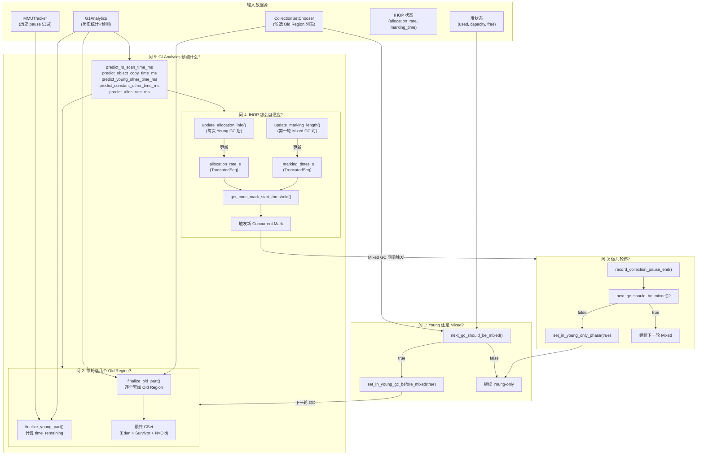
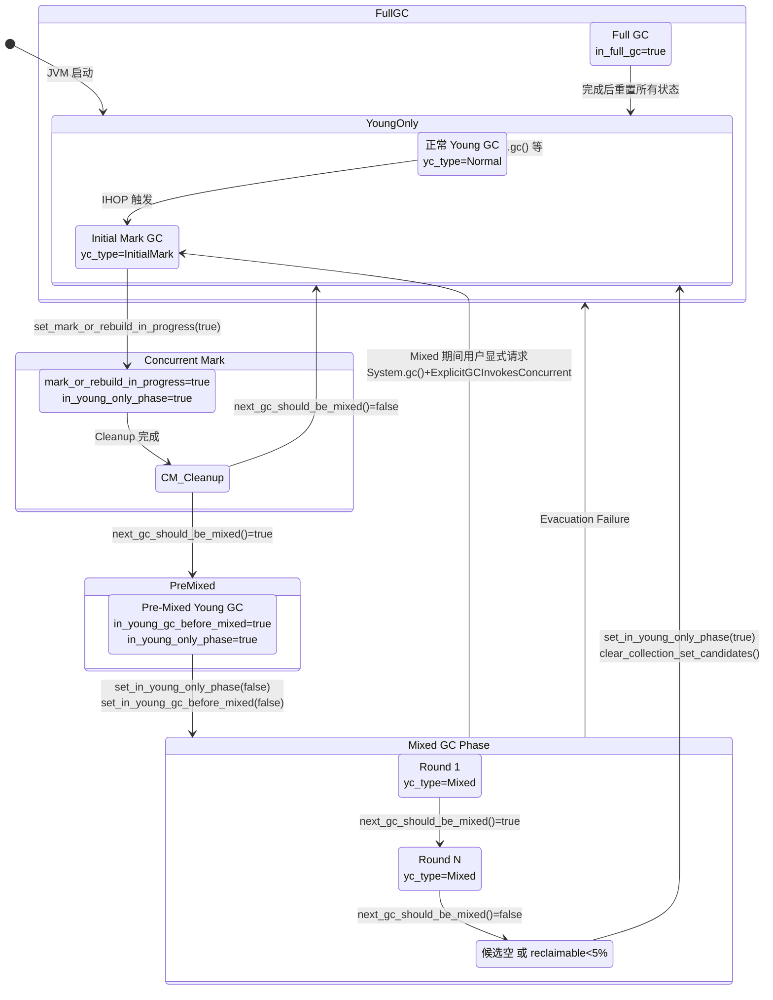
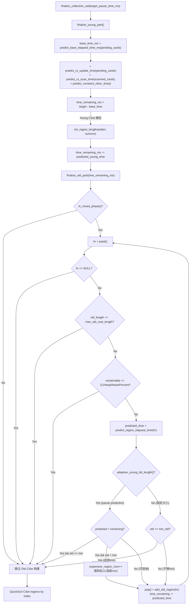
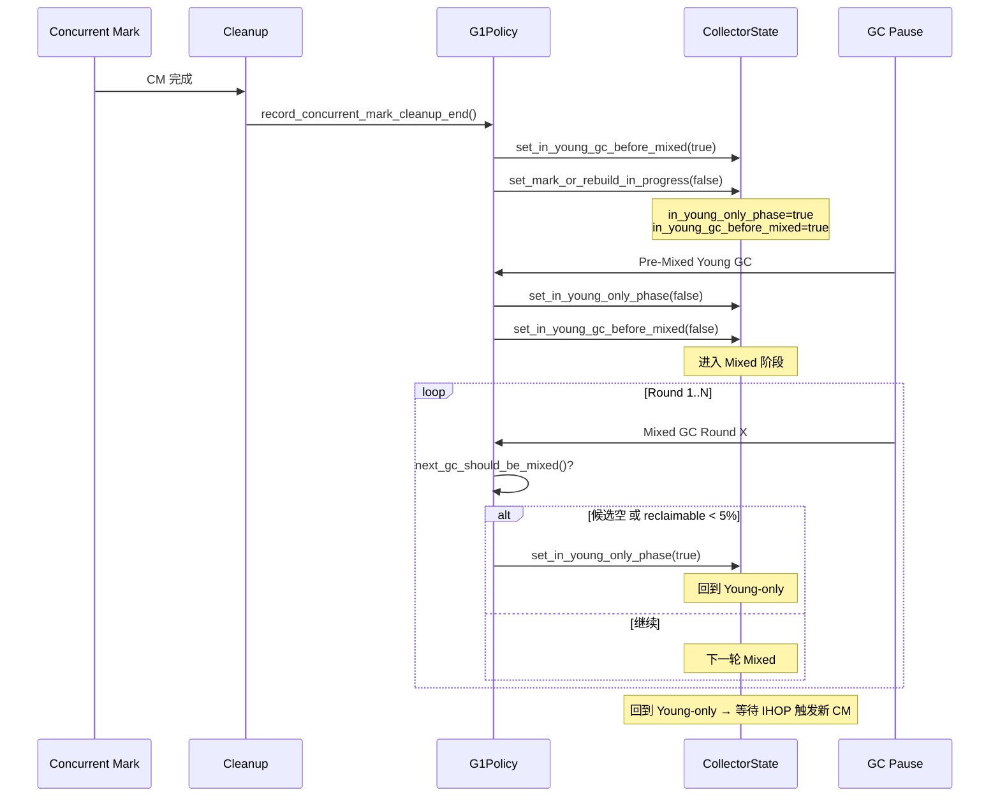
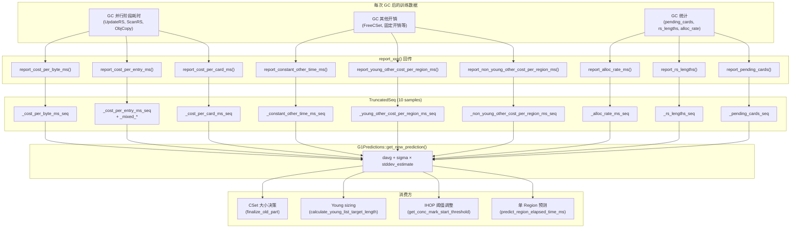

# 08-MixedGC-Policy — G1 Mixed GC 策略引擎

> **生产场景切入**：
> ```
> $ java -Xms8g -Xmx8g -XX:+UseG1GC -Xlog:gc+ergo*=trace:file=gc.log MyApp
> 
> # 故障现象：GC log 显示 "Mixed GC" 反复执行但堆占用率不降
> [12.34s] GC(8) Pause Mixed (G1 Evacuation Pause) 3800M->3750M(8192M) 45.2ms   ← 只回收 50MB
> [18.56s] GC(9) Pause Mixed (G1 Evacuation Pause) 3900M->3870M(8192M) 42.8ms
> [24.78s] GC(10) Pause Mixed (G1 Evacuation Pause) 4000M->3980M(8192M) 40.1ms
> # 后续接入 gceasy.io 分析发现：
> #   G1MixedGCLiveThresholdPercent=85  → 所有 Old Region 的 live_bytes > 85%
> #   → gc_efficiency 极低  → Mixed GC 选不进任何 Old Region  → 空转
> # 修复：降低 -XX:G1MixedGCLiveThresholdPercent=65
> ```
> G1Policy 是 G1 的"大脑"——不是执行引擎，而是决策引擎。本文解释大脑的 5 问决策模型。

> **元信息**
> - **标准环境**：OpenJDK 11 slowdebug | `-Xms8g -Xmx8g -XX:+UseG1GC -XX:MaxGCPauseMillis=200` | IHOP 45% 自适应 | 64-bit Linux x86 | `-XX:ConcGCThreads=2 -XX:ParallelGCThreads=4`
> - **前置依赖**：必须已读 `[07-ConcurrentMark-Phases]`（liveness 数据生产端→候选列表排序）、`[04-CardTable-RSet]`（RSet 三级结构）、`[03-YoungGC]`（Evacuation 四阶段）；建议了解 `[06-ConcurrentMark-Core]`/`[05-SATB-Barrier]`/`[01-HeapRegion]`
> - **阅读收益**：读完本文后能回答："G1Policy 是怎么做 GC 决策的？什么时候做 Young GC？什么时候 Mixed？每轮 Mixed 选几个 Old Region？IHOP 怎么从 45% 自适应调整？G1Analytics 的线性回归模型预测了什么？MMUTracker 怎么保证 pause time 目标？"——**G1 的全局 GC 决策引擎的每一笔输入和每一个输出都了然于胸**。

---

## §〇 源文件清单

| # | 文件 | 模块 | 核心函数/类 | 本文角色 |
|---|------|------|------------|---------|
| 1 | `g1Policy.cpp/.hpp` | gc/g1 | `next_gc_should_be_mixed()`, `record_collection_pause_end()`, `record_concurrent_mark_cleanup_end()`, `finalize_collection_set()`, `calc_min/max_old_cset_length()`, `revise_young_list_target_length_if_necessary()`, `need_to_start_conc_mark()`, `record_pause()` | ★★★ 决策引擎 |
| 2 | `g1CollectorState.hpp` | gc/g1 | `G1CollectorState`, `yc_type()`, `set_in_young_gc_before_mixed()`, `in_mixed_phase()`, `in_young_only_phase()`, `mark_or_rebuild_in_progress()`, `initiate_conc_mark_if_possible()` | ★★★ GC 类型判定 |
| 3 | `g1IHOPControl.cpp/.hpp` | gc/g1 | `G1AdaptiveIHOPControl::update_allocation_info()`, `get_conc_mark_start_threshold()`, `actual_target_threshold()` | ★★★ IHOP 自适应 |
| 4 | `g1Analytics.cpp/.hpp` | gc/g1 | `predict_rs_scan_time_ms()`, `predict_object_copy_time_ms()`, `predict_card_num()`, `predict_rs_update_time_ms()`, `predict_young_other_time_ms()`, `predict_non_young_other_time_ms()`, `predict_constant_other_time_ms()`, `report_*()` | ★★★ 预测模型 |
| 5 | `g1Predictions.hpp` | gc/g1 | `G1Predictions`, `get_new_prediction(seq)` = `davg + sigma × stddev_estimate` | ★★★ 线性回归引擎 |
| 6 | `g1MMUTracker.cpp/.hpp` | gc/g1 | `G1MMUTrackerQueue`, `add_pause()`, `when_sec()`, `remove_expired_entries()` | ★★ pause 时间管理 |
| 7 | `collectionSetChooser.cpp/.hpp` | gc/g1 | `rebuild()`, `sort_regions()`, `should_add()`, `pop()`, `peek()`, `remaining_reclaimable_bytes()`, `is_empty()` | ★★ 候选列表操作 |
| 8 | `g1CollectionSet.cpp/.hpp` | gc/g1 | `finalize_young_part()`, `finalize_old_part()`, `add_old_region()`, `add_eden_region()`, `add_survivor_regions()` | ★★★ CSet 构建 |
| 9 | `g1YoungRemSetSamplingThread.cpp/.hpp` | gc/g1 | `run_service()`, `sample_young_list_rs_lengths()`, `sleep_before_next_cycle()` | ★★ RSet 采样反馈 |
| 10 | `g1CollectedHeap.cpp` | gc/g1 | `do_collection_pause()` — policy 决策调用处 | ★★ 钩子消费 |
| 11 | `g1HeapSizingPolicy.cpp/.hpp` | gc/g1 | `G1HeapSizingPolicy`, `expansion_amount()` | ★ 堆扩缩容 |

**辅助组件**：

| 组件 | 文件 | 说明 |
|------|------|------|
| `G1InitialMarkToMixedTimeTracker` | `g1InitialMarkToMixedTimeTracker.hpp` | Initial Mark → 第一轮 Mixed GC 的时间追踪器 |
| `TruncatedSeq` | `utilities/numberSeq.hpp` | 衰减序列，G1Analytics + IHOP 预测的底层数据结构 |
| `AbsSeq` | `utilities/numberSeq.hpp` | 抽象序列基类，提供 `davg()` / `dsd()` |
| `G1OldGenAllocationTracker` | `g1OldGenAllocationTracker.hpp` | 追踪两次 GC 间 Old Gen 的分配量和增长 |

---

## §一 ★ 全景 — G1Policy 的五问决策模型

### ❓ G1Policy 每轮 GC 前需要回答哪 5 个问题？

G1Policy 是 G1 GC 的"大脑"。它不是执行引擎（执行引擎在 G1CollectedHeap、G1ParScanThreadState、G1RemSet 中），而是**决策引擎**——在每次 GC 开始前和结束后，根据堆状态、历史统计和预测模型，回答 5 个核心问题：

```
Cleanup 完成 → CollectionSetChooser 候选列表就绪（07 交付的产物）
    ↓
┌────────────────────────────────────────────────────────────────────┐
│ 决策引擎: G1Policy                                                 │
│                                                                    │
│ 问 1: 下一轮 GC 是 Young-only 还是 Mixed？                          │
│    判定: next_gc_should_be_mixed()                                 │
│    输入: 候选列表是否为空? reclaimable 超阈值? CM 是否在进行?         │
│    输出: set_in_young_gc_before_mixed(true) → Pre-Mixed Young GC   │
│                                                                    │
│ 问 2: 如果做 Mixed，这轮选几个 Old Region？                          │
│    判定: finalize_old_part(time_remaining_ms)                      │
│    输入: pause_target - base_time, 每个 Old Region 的预测耗时       │
│    输出: 从 CSetChooser 顶部弹出 Region，逐个累加直到超时或触及边界   │
│                                                                    │
│ 问 3: Mixed GC 做几轮才停？                                        │
│    判定: record_collection_pause_end() 中调用 next_gc_should_be_mixed()│
│    输入: 候选列表空了? gc_efficiency 不够? 新 CM 被触发了?            │
│    输出: set_in_young_only_phase(true) 或继续下一轮 Mixed           │
│                                                                    │
│ 问 4: IHOP 怎么自适应调整 CM 触发阈值？                              │
│    判定: G1AdaptiveIHOPControl::get_conc_mark_start_threshold()     │
│    输入: allocation_rate 历史 + marking_time 历史 + young_size      │
│    输出: 调整后的 IHOP 阈值 (字节)                                   │
│                                                                    │
│ 问 5: G1Analytics 预测了什么？每个预测被哪些决策消费？                │
│    判定: 基于 TruncatedSeq 的线性回归 (davg + sigma × stddev)        │
│    输入: 每次 GC 后 report_xxx() 回传的训练数据                      │
│    输出: 被 CSet 大小决策、IHOP、young sizing 等多处消费             │
└────────────────────────────────────────────────────────────────────┘
    ↓
Prepare Mixed → X 轮 Mixed GC → 回到 Young-only → 等待下一轮 CM
```

### 1.1 Mermaid 1：G1Policy 五问决策流程图



### 1.2 G1Policy 的数据输入全景

G1Policy 的成员变量（`g1Policy.hpp:56-109`）揭示了它的输入全景：

| 类别 | 成员变量 | 来源 | 粒度 |
|------|---------|------|------|
| **堆状态** | `_g1h` (G1CollectedHeap*) | 全局单例 | 堆级别 |
| **历史统计** | `_analytics` (G1Analytics*) | 每次 GC 后更新 | 10 样本 TruncatedSeq |
| **预测引擎** | `_predictor` (G1Predictions) | sigma = G1ConfidencePercent/100 | 置信度因子 |
| **pause 管理** | `_mmu_tracker` (G1MMUTracker*) | MaxGCPauseMillis, GCPauseIntervalMillis | 64-entry 环形队列 |
| **IHOP 控制** | `_ihop_control` (G1IHOPControl*) | adaptive: allocation_rate + marking_time / static: fixed% | adaptive: TruncatedSeq×2 |
| **Young 大小** | `_young_list_target_length`, `_young_list_max_length` | 预测模型计算 | Region 数量 |
| **RSet 预测** | `_rs_lengths_prediction`, `_max_rs_lengths` | RSet 采样 + GC 后报告 | 卡表条目数 |
| **候选列表** | 通过 `cset_chooser()` 访问 | CollectionSetChooser | Region 指针数组 |
| **CSet** | `_collection_set` (G1CollectionSet*) | 增量构建 | Eden/Survivor/Old Region 计数 |
| **CM→Mixed 计时** | `_initial_mark_to_mixed` | G1InitialMarkToMixedTimeTracker | 秒级时间戳 |

### 1.3 和 07 的接口：07 交付了什么、G1Policy 怎么消费

```
07 (ConcurrentMark-Phases)                    本文 (MixedGC-Policy)
━━━━━━━━━━━━━━━━━━━━━━━━━━━━━━━━━━━━━━━━━━━━━━━━━━━━━━━━━━━━━━━━━━
Cleanup 阶段                                   
  ├─ G1ConcurrentMark::cleanup()              
  │    ├─ 计算 liveness 数据                  
  │    │   ├─ live_bytes per Region   ───────→ 作为 gc_efficiency 分子中的减数
  │    │   │                                  (reclaimable_bytes = capacity - live_bytes)
  │    │   └─ reclaimable_bytes        ───────→ remaining_reclaimable_bytes (条件2)
  │    │                                      
  │    └─ CollectionSetChooser::rebuild() ────→ 重建候选列表 (条件1)
  │         ├─ should_add() 过滤              
  │         ├─ calc_gc_efficiency()           → 计算 _gc_efficiency (排序依据)
  │         └─ sort_regions()                 → 按 gc_efficiency DESC 排序
  │                                            
  └─ G1Policy::record_concurrent_mark_cleanup_end() ← 07 的终点 = 本文的起点
       ├─ next_gc_should_be_mixed()           → 问 1: 要不要 Mixed?
       ├─ set_in_young_gc_before_mixed()      → 设置 Pre-Mixed 标志
       └─ set_mark_or_rebuild_in_progress()   → CM 周期结束
```

**关键区别**：
- **07 是数据生产端**：bitmap → live_words → marked_bytes → live_bytes → reclaimable → gc_efficiency → 候选排序
- **本文是数据消费端**：G1Policy 读取候选列表 + gc_efficiency + reclaimable + 预测模型 → 做 GC 决策

---

## §二 ★★★ 第一问：下一轮是 Young 还是 Mixed？

### ❓ `next_gc_should_be_mixed()` 的三个判定条件怎么来的？

源码位置：`g1Policy.cpp:1216-1240`

```cpp:1216:1240:g1Policy.cpp
bool G1Policy::next_gc_should_be_mixed(const char* true_action_str,
                                       const char* false_action_str) const {
  // 条件 1: 候选列表是否为空？
  if (cset_chooser()->is_empty()) {
    return false;
  }

  // 条件 2: 剩余可回收量是否超过 waste 阈值？
  size_t reclaimable_bytes = cset_chooser()->remaining_reclaimable_bytes();
  double reclaimable_percent = reclaimable_bytes_percent(reclaimable_bytes);
  double threshold = (double) G1HeapWastePercent;
  if (reclaimable_percent <= threshold) {
    return false;
  }
  // ★ 注意：函数本身不检查 CM 是否在进行（见 §2.3 调用栈保障）
  return true;
}
```

**`next_gc_should_be_mixed()` 只检查两个条件**。第三个条件（无正在进行的 CM）由调用栈保证（见 §2.3）。

**三个条件逐一分析**：

### 2.1 条件 1：候选非空（`!cset_chooser()->is_empty()`）

`is_empty()` 检查 `remaining_regions() == 0`，即 `_front >= _end`。

- **为什么需要这个条件** → 候选列表为空意味着没有 Old Region 被标记为可回收 → 做 Mixed GC 没有意义 → 必须 Young-only
- **什么时候候选为空**：全部 Old Region 已被回收完、CM 没有发现可回收的 Old Region、或 Full GC 清空了一切

### 2.2 ★ 条件 2：回收量超 waste 阈值（`reclaimable > G1HeapWastePercent × capacity`）

```
为什么不是 reclaimable > 0？
→ 因为 Mixed GC 有固定开销：RSet 更新、RSet 重建、Evacuation 中 reference processing
→ 如果只回收极少量垃圾（如 1% 堆），收益低于开销 → 不划算
→ G1HeapWastePercent 默认值 = 5%（意味着 <5% 堆的可回收量不值得启动 Mixed GC）
```

- ★ **设计替代：如果不设 waste 阈值** → 会频繁做 Mixed GC 回收少量垃圾 → 浪费 CPU 在 Evacuation + RSet 操作上，却几乎不释放任何空间

### 2.3 条件 3：无正在进行的 concurrent mark（★ 调用栈保障，不是函数内条件）

`next_gc_should_be_mixed()` 本身**只检查两个条件**——候选非空 + reclaimable 超阈值。它不检查 CM 是否在进行。**但 CM 进行时它永远不会被调用**，原因有三层保障：

1. `record_concurrent_mark_cleanup_end()` 调用 `next_gc_should_be_mixed()` 时，CM 已在 Cleanup 完成 → 条件自然满足
2. `record_collection_pause_end()` 中，通过 `maybe_start_marking()` → `need_to_start_conc_mark()` 决定是否触发新 CM
3. ★ **关键守卫**：`need_to_start_conc_mark()` 中 `about_to_start_mixed_phase()` 为 true 时直接返回 false → Mixed GC 期间 IHOP 不会设置 `initiate_conc_mark_if_possible` → `next_gc_should_be_mixed()` 不会被干扰

```cpp:618:638:g1Policy.cpp
bool G1Policy::need_to_start_conc_mark(const char* source, size_t alloc_word_size) {
  if (about_to_start_mixed_phase()) {
    return false;  // ← 还在 Mixed GC 阶段，不会触发新 CM
  }
  size_t marking_initiating_used_threshold = _ihop_control->get_conc_mark_start_threshold();
  size_t cur_used_bytes = _g1h->non_young_capacity_bytes();
  size_t alloc_byte_size = alloc_word_size * HeapWordSize;
  size_t marking_request_bytes = cur_used_bytes + alloc_byte_size;

  if (marking_request_bytes > marking_initiating_used_threshold) {
    result = collector_state()->in_young_only_phase()
          && !collector_state()->in_young_gc_before_mixed();
    // ← 只有在 Young-only 阶段且不是 Pre-Mixed 时才允许
  }
  return result;
}
```

### 2.4 ★ 为什么需要 `_in_young_gc_before_mixed`？Why not skip to Mixed directly？

```
Cleanup 结束 → set_in_young_gc_before_mixed(true)
    ↓
下一轮 GC = Pre-Mixed Young GC（清理 Eden+Survivor）
    ↓ ("为什么需要这轮？")
Pre-Mixed Young GC 的作用：
  1. 清空 Eden 和 Survivor → 为后续 Mixed GC 腾出空间
  2. Re-tag 上一轮的 Survivor Region 为 Young（survivors→convert_to_eden）
  3. 重新计算 young_list_target_length → 确保下一轮 Mixed 的 Young 部分可预测
    ↓
set_in_young_only_phase(false)  → 进入 Mixed 阶段
    ↓
下一轮 GC = 第一轮 Mixed GC
```

**为什么不能跳过**：
- 直接做 Mixed GC = 需要同时 Evacuate Eden + Survivor + Old → pause 预测不准（年轻代大小在 CM 期间可能变化）
- Pre-Mixed Young GC 先把年轻代"稳定"下来 → Mixed GC 只需要额外 Evacuate Old Region → 预测更精确
- ★ **设计替代：如果 Cleanup 完直接做 Mixed 而不先做一轮 Young-only** → 第一轮 Mixed 需要在 Evacuate Old 的同时处理上一轮积累的 Eden + Survivor → CSet 中 Young 部分可能很大 → pause 可能超目标更多

### 2.5 Mermaid 5：G1CollectorState 状态机



### 2.6 `record_concurrent_mark_cleanup_end()` 源码走读

`g1Policy.cpp:1110-1136`：

```cpp:1110:1136:g1Policy.cpp
void G1Policy::record_concurrent_mark_cleanup_end() {
  // Step 1: 重建候选列表（07 的产物）
  cset_chooser()->rebuild(_g1h->workers(), _g1h->num_regions());

  // Step 2: 问 1 — 要不要 Mixed?
  bool mixed_gc_pending = next_gc_should_be_mixed("request mixed gcs", "request young-only gcs");

  // Step 3a: 不要 Mixed → 清空候选，终止追踪
  if (!mixed_gc_pending) {
    clear_collection_set_candidates();  // ← 清空 CSetChooser 并清除 RSet
    abort_time_to_mixed_tracking();     // ← 重置 _initial_mark_to_mixed 计时器
  }
  // Step 3b: 要 Mixed → 设置 Pre-Mixed 标志
  collector_state()->set_in_young_gc_before_mixed(mixed_gc_pending);
  // Step 4: CM 周期结束
  collector_state()->set_mark_or_rebuild_in_progress(false);

  // Step 5: 记录 Cleanup 耗时到 G1Analytics
  double end_sec = os::elapsedTime();
  double elapsed_time_ms = (end_sec - _mark_cleanup_start_sec) * 1000.0;
  _analytics->report_concurrent_mark_cleanup_times_ms(elapsed_time_ms);
  _analytics->append_prev_collection_pause_end_ms(elapsed_time_ms);
}
```

### 2.7 G1HeapSizingPolicy — 堆扩缩容怎么影响 Mixed GC

`G1HeapSizingPolicy::expansion_amount()` 在 Remark 阶段的 `compute_new_sizes()` 中被调用（见 `[07 §五]`）。扩缩容的影响：

- **扩容** → 更多 Region 总数 → `_iHop_control->update_target_occupancy()` 调整 `_target_occupancy` → IHOP 阈值变化
- **缩容** → 更少 Region → 更少空间用于 Mixed GC 的 Old CSet → 可能加速从 Mixed 切回 Young-only
- **不影响已构建的候选列表** — 候选列表基于 liveness 数据 + gc_efficiency，扩容不会重新 build

---

## §三 ★★★ 第二问：每轮 Mixed GC 选几个 Old Region？

### ❓ CSet 大小怎么动态计算？

在 JDK 11 中，CSet 大小的决策分两步走：

1. `finalize_young_part(target_pause_time_ms)` — 确定 Young CSet 部分，计算 `time_remaining_ms`
2. `finalize_old_part(time_remaining_ms)` — 在剩余时间内逐个累加 Old Region

`g1Policy.cpp:1280-1291`：

```cpp:1280:1291:g1Policy.cpp
void G1Policy::finalize_collection_set(double target_pause_time_ms, G1SurvivorRegions* survivor) {
  double time_remaining_ms = _collection_set->finalize_young_part(target_pause_time_ms, survivor);
  _collection_set->finalize_old_part(time_remaining_ms);
}
```

### 3.1 Mermaid 2：CSet 大小决策详细流程



### 3.2 预测 Young 部分耗时：`finalize_young_part()` 完整公式

`g1CollectionSet.cpp:406-449`：

```cpp:406:416:g1CollectionSet.cpp
double G1CollectionSet::finalize_young_part(double target_pause_time_ms, G1SurvivorRegions* survivors) {
  finalize_incremental_building();

  // Step 1: 固定开销预测
  size_t pending_cards = _policy->pending_cards();
  double base_time_ms = _policy->predict_base_elapsed_time_ms(pending_cards);
  double time_remaining_ms = MAX2(target_pause_time_ms - base_time_ms, 0.0);
  // ...
```

`predict_base_elapsed_time_ms`（`g1Policy.cpp:927-933`）展开为：

```cpp:927:933:g1Policy.cpp
double G1Policy::predict_base_elapsed_time_ms(size_t pending_cards, size_t scanned_cards) const {
  return
    _analytics->predict_rs_update_time_ms(pending_cards) +     // Ⓐ RSet 更新
    _analytics->predict_rs_scan_time_ms(scanned_cards,         // Ⓑ RSet 扫描
        collector_state()->in_young_only_phase()) +
    _analytics->predict_constant_other_time_ms();              // Ⓒ 固定开销
}
```

**公式分解**：

| 分量 | 公式 | 含义 |
|------|------|------|
| Ⓐ RSet 更新 | `pending_cards × predict_cost_per_card_ms() + predict_scan_hcc_ms()` | dirty card → RSet 条目 |
| Ⓑ RSet 扫描 | `card_num × predict_cost_per_entry_ms()` | RSet 条目 → 找引用 |
| Ⓒ 固定开销 | `predict_constant_other_time_ms()` | 启动/停止/日志等 |

### 3.3 ★ `remaining_time = pause_target - predicted_young_time`

如果 Young 部分预测就超时了（`time_remaining_ms = 0`），怎么办？

- `finalize_old_part()` 中的 `check_time_remaining` 为 true 时，`predicted_time > remaining` 条件会立即命中 → 如果有 `min_old_cset_length > 0` 且 old_length=0，则强制加入 expensive region
- **但更根本的是**：young_list_target_length 的二进制搜索（`calculate_young_list_target_length()`）已经尽力让 Young 部分预测不超过 pause target
- 如果即使在最小 Young 下也超时 → 说明 target 设得太小 → Young GC 照样做，只是可能超时

### 3.4 ★ 为什么"逐个试"而不是一次算出 N？

`finalize_old_part()` 的 while 循环（`g1CollectionSet.cpp:486-556`）：

```cpp:486:556:g1CollectionSet.cpp
    HeapRegion* hr = cset_chooser()->peek();
    while (hr != NULL) {
      // ... 检查边界条件 ...
      
      double predicted_time_ms = predict_region_elapsed_time_ms(hr);
      if (check_time_remaining) {
        if (predicted_time_ms > time_remaining_ms) {
          // ... 超时 → 停止或强制加入 ...
          break;
        }
      }
      time_remaining_ms = MAX2(time_remaining_ms - predicted_time_ms, 0.0);
      predicted_old_time_ms += predicted_time_ms;
      cset_chooser()->pop();
      add_old_region(hr);
      hr = cset_chooser()->peek();
    }
```

**为什么不能一次算出 N**：
- 每个 Old Region 的 `predict_region_elapsed_time_ms()` 不同 → RSet 大小不同 → 预测耗时不同
- 必须以排序顺序逐个叠加，直到累积时间超过 remaining_time
- 这和"预算花光"模型一致——gc_efficiency 最高的 Region 先被选走

### 3.5 ★ 安全边际

- **min_old_cset_length**（`g1Policy.cpp:1242-1261`）：`candidates() / G1MixedGCCountTarget`（向上取整）— 保证最多 G1MixedGCCountTarget 轮做完
- **max_old_cset_length**（`g1Policy.cpp:1263-1278`）：`total_regions × G1OldCSetRegionThresholdPercent / 100`（默认 10%）— 单轮最多占 10% 堆
- **expensive_region 机制**：如果还没达到 min_old_cset_length，即使预测超时也要强制加入 → 这些 Region 标记为 expensive → 一次 logging 输出

### 3.6 `add_old_region()` 做了什么

`g1CollectionSet.cpp:148-167`：

```cpp:148:167:g1CollectionSet.cpp
void G1CollectionSet::add_old_region(HeapRegion* hr) {
  _g1h->register_old_region_with_cset(hr);            // 注册到 CSet 位图
  _collection_set_regions[_collection_set_cur_length++] = hr->hrm_index();  // 加入数组
  _bytes_used_before += hr->used();                   // 累计 CSet 总占用
  size_t rs_length = hr->rem_set()->occupied();
  _recorded_rs_lengths += rs_length;                  // 累计 RSet 大小
  _old_region_length += 1;                             // Old Region 计数++
}
```

### 3.7 G1CollectionSet 内部数据结构简述

```
G1CollectionSet
├── _collection_set_regions: uint[]   // Region index 数组 (容量=堆Region总数)
│   ├── [0 .. eden_length-1]          // Eden Region indices
│   ├── [eden_length .. young_length-1]  // Survivor Region indices
│   └── [young_length .. cur_length-1]   // Old Region indices
├── _eden_region_length: uint         // Eden Region 数量
├── _survivor_region_length: uint     // Survivor Region 数量
├── _old_region_length: uint          // Old Region 数量
├── _bytes_used_before: size_t        // CSet 总占用字节数
├── _recorded_rs_lengths: size_t      // CSet 总 RSet 大小
└── _cset_chooser: CollectionSetChooser*  // 候选列表指针
```

---

## §四 ★★ 第三问：Mixed GC 做几轮？三种终止条件

### ❓ 什么时候 `abort_time_to_mixed_tracking()`？

**终止条件 1 — 候选列表空了**：

`g1Policy.cpp:1218`：`cset_chooser()->is_empty()` → `next_gc_should_be_mixed()` 返回 false

**终止条件 2 — reclaimable 低于 waste 阈值**：

`g1Policy.cpp:1228`：`reclaimable_percent <= G1HeapWastePercent` → `next_gc_should_be_mixed()` 返回 false

**终止条件 3 — 新 CM 被触发**（在 Mixed GC 期间）：

当 IHOP 在 Mixed GC 几轮之间判定需要新 CM（`need_to_start_conc_mark()`）→ `set_initiate_conc_mark_if_possible(true)` → 下一轮 GC 做 Initial Mark → Mixed 结束

### 4.1 Mixed GC 执行序列（`record_collection_pause_end` 的决策树）

`g1Policy.cpp:710-731`：

```cpp:710:731:g1Policy.cpp
  if (collector_state()->in_young_gc_before_mixed()) {
    // Pre-Mixed Young GC → 切换到 Mixed 阶段
    collector_state()->set_in_young_only_phase(false);
    collector_state()->set_in_young_gc_before_mixed(false);
  } else if (!this_pause_was_young_only) {
    // 这是一轮 Mixed GC → 决定是否继续
    if (!next_gc_should_be_mixed("continue mixed GCs",
                                 "do not continue mixed GCs")) {
      collector_state()->set_in_young_only_phase(true);
      clear_collection_set_candidates();
      maybe_start_marking();
    }
  }
```

### 4.2 Mermaid 3：Mixed GC 序列图



### 4.3 ★ `G1InitialMarkToMixedTimeTracker` — CM→Mixed 完整计时

`g1InitialMarkToMixedTimeTracker.hpp:35-85`：

```
record_initial_mark_end(end_time)     ← Initial Mark pause 结束时调用
    ↓ (start tracking)
Young GC pauses: add_pause(duration)  ← 中间 Young GC 的暂停时间减去
Remark pause: add_pause(duration)     ← Remark 暂停时间减去
Cleanup pause: add_pause(duration)    ← Cleanup 暂停时间减去
Pre-Mixed Young GC: add_pause(...)    ← Pre-Mixed 的暂停时间减去
    ↓
record_mixed_gc_start(start_time)     ← 第一轮 Mixed GC 开始时调用
    ↓ (stop tracking)
last_marking_time() = wall_time - total_pause_time
                    = (mixed_start - initial_mark_end) - sum(all_pauses)
```

**这个时间被谁消费** → `update_ihop_prediction()` 中传给 `_ihop_control->update_marking_length(marking_to_mixed_time)`（`g1Policy.cpp:886`）

### 4.4 三个终止条件的优先级

| 条件 | 优先级 | 影响 |
|------|--------|------|
| 候选列表空了 | ★最高 | 没有任何 Old Region 可回收 → 立即终止 Mixed |
| reclaimable < waste | ★★高 | 剩余可回收量太少 → 不值得继续 |
| 新 CM 被触发 | ★★★ ★ | `need_to_start_conc_mark()` 中 `about_to_start_mixed_phase()` 守卫阻止 Mixed 期间 IHOP 触发 CM。唯一例外是用户显式 `System.gc()` + `ExplicitGCInvokesConcurrent` → `decide_on_conc_mark_initiation()` 强行切入 Initial Mark |

### 4.5 ★ 实测案例：6 轮 Mixed GC 完整过渡

以下 GC log 展示了一次典型 Mixed GC phase 从开始到结束的完整过程（8GB 堆，`-Xlog:gc*=info`）：

```
[gc] GC(42) Pause Young (Normal) ... 48M→42M(8192M) 13.1ms   ← Pre-Mixed Young GC
[gc] GC(43) Pause Young (Mixed) ... 3417M→3102M(8192M) 48.3ms  ← Round 1
[gc] GC(44) Pause Young (Mixed) ... 3102M→2808M(8192M) 42.7ms  ← Round 2
[gc] GC(45) Pause Young (Mixed) ... 2808M→2547M(8192M) 38.1ms  ← Round 3
[gc] GC(46) Pause Young (Mixed) ... 2547M→2283M(8192M) 33.5ms  ← Round 4
[gc] GC(47) Pause Young (Mixed) ... 2283M→2051M(8192M) 29.8ms  ← Round 5
[gc] GC(48) Pause Young (Mixed) ... 2051M→1991M(8192M) 24.2ms  ← Round 6 (最后一轮)
[gc] GC(49) Pause Young (Normal) ... 52M→45M(8192M) 11.8ms    ← 回到 Young-only
```

**关键观察**：
- 总回收量：3417M → 1991M = 回收约 **1.4GB** Old Gen（~17% 总堆）
- 每轮 pause 逐渐缩短（48.3 → 24.2ms）— 因为最值得回收的 Region（gc_efficiency 最高）先被处理
- 6 轮后回到 Young-only → 下一轮 GC 的 pause 骤降到 11.8ms（只有 Eden）
- G1MixedGCCountTarget=8 意味着 Mixed 最多做 8 轮，这里 6 轮就停了（reclaimable 低于 waste 阈值）

**GDB 验证**：在 `record_collection_pause_end()` 中打印 `cset_chooser()->remaining_reclaimable_bytes()` 可以看到每次 pop 后剩余量递减：

```
(gdb) break G1Policy::record_collection_pause_end
(gdb) commands
> print collector_state()->yc_type()
> print cset_chooser()->remaining_reclaimable_bytes()
> continue
> end
# 预期输出：每轮 Mixed GC 后 remaining_reclaimable 递减，直到 < 5%×capacity → next_gc_should_be_mixed=false
```

---

## §五 ★★★ 第四问：IHOP 怎么自适应调整 CM 触发阈值？

### ❓ 从哪些输入信号推导 IHOP 阈值？为什么自适应值要和 static 值"软过渡"？

### 5.1 `G1AdaptiveIHOPControl` vs `G1StaticIHOPControl`

`g1Policy.cpp:849-860`：

```cpp:849:860:g1Policy.cpp
G1IHOPControl* G1Policy::create_ihop_control(...) {
  if (G1UseAdaptiveIHOP) {
    return new G1AdaptiveIHOPControl(InitiatingHeapOccupancyPercent,  // 45%
                                     old_gen_alloc_tracker,
                                     predictor,
                                     G1ReservePercent,   // 10%
                                     G1HeapWastePercent); // 5%
  } else {
    return new G1StaticIHOPControl(InitiatingHeapOccupancyPercent, old_gen_alloc_tracker);
  }
}
```

- **G1StaticIHOPControl**：`threshold = _initial_ihop_percent × _target_occupancy / 100` — 固定百分比
- **G1AdaptiveIHOPControl**：基于 allocation rate 预测 + marking time 预测动态调整

### 5.2 输入信号逐个分析

IHOP 从**两个独立信号通路**获取数据——它们在完全不同的 GC 类型下触发，更新不同的 TruncatedSeq：

**信号 1a：allocation rate（每次 Young GC 后更新）**

`update_ihop_prediction()`（`g1Policy.cpp:880-898`）中：

```cpp:880:898:g1Policy.cpp
  // 每次 Young GC 后: 更新 allocation rate
  if (this_gc_was_young_only && mutator_time_s > min_valid_time) {
    _ihop_control->update_allocation_info(mutator_time_s, young_gen_size);
  }
```

`G1AdaptiveIHOPControl::update_allocation_info()`（`g1IHOPControl.cpp:167-180`）：

```cpp:167:180:g1IHOPControl.cpp
void G1AdaptiveIHOPControl::update_allocation_info(double allocation_time_s,
                                                   size_t additional_buffer_size) {
  G1IHOPControl::update_allocation_info(allocation_time_s, additional_buffer_size);
  double alloc_rate = last_mutator_period_old_allocation_rate();
  // = last_period_old_gen_growth() / _last_allocation_time_s
  _allocation_rate_s.add(alloc_rate);  // ← 加入衰减序列
  _last_unrestrained_young_size = additional_buffer_size;
}
```

**信号 1b：marking time（第一轮 Mixed GC 时更新）**

`update_ihop_prediction()`（`g1Policy.cpp:870-889`）中：

```cpp:870:889:g1Policy.cpp
  // 第一轮 Mixed GC 时: 报告 marking_to_mixed_time
  if (!this_gc_was_young_only && _initial_mark_to_mixed.has_result()) {
    marking_to_mixed_time = _initial_mark_to_mixed.last_marking_time();
    _ihop_control->update_marking_length(marking_to_mixed_time);
  }
```

★ **为什么 marking time 要在第一轮 Mixed GC 才更新而不是更早？** 因为 `G1InitialMarkToMixedTimeTracker` 需要同时测量 `marking_to_mixed_time = (mixed_start - initial_mark_end) - all_pauses`，这个值在第一轮 Mixed GC 的 `record_mixed_gc_start()` 调用后才产生。

**`_allocation_rate_s`** 是 `TruncatedSeq(10, 0.95)` — 保留最近 10 个样本，alpha=0.95 的衰减平均。

**`_last_unrestrained_young_size`**

即 `last_unrestrained_young_length × HeapRegion::GrainBytes`，表示"不设上限的理想 Young 大小"。IHOP 用这个值估计 marking 过程中 Young Gen 会被分配多大。

### 5.3 ★ 预测逻辑推导 + 维度分析

`g1IHOPControl.cpp:126-159`：

```cpp:126:159:g1IHOPControl.cpp
size_t G1AdaptiveIHOPControl::get_conc_mark_start_threshold() {
  if (have_enough_data_for_prediction()) {
    double pred_marking_time = _predictor->get_new_prediction(&_marking_times_s);
    double pred_promotion_rate = _predictor->get_new_prediction(&_allocation_rate_s);
    size_t pred_promotion_size = (size_t)(pred_marking_time * pred_promotion_rate);

    size_t predicted_needed_bytes_during_marking =
      pred_promotion_size + _last_unrestrained_young_size;

    size_t internal_threshold = actual_target_threshold();
    size_t predicted_initiating_threshold =
      internal_threshold - predicted_needed_bytes_during_marking;
    return predicted_initiating_threshold;
  } else {
    return (size_t)(_initial_ihop_percent * _target_occupancy / 100.0);  // fallback to static
  }
}
```

**核心思想**（公式 + 维度标注）：

```
predicted_needed = (marking_time × allocation_rate) + young_size
                    ↑ s           ↑ B/s              ↑ B
                        = B (promotion volume during marking)

initiating_threshold = actual_target_threshold - predicted_needed
                       ↑ B (heap_capacity × (1 - reserve - waste))
                            ↑ B (must not exceed during marking)
```

即：**Old Gen 在 marking 期间不能被 allocation 耗空**。IHOP 阈值 = 安全上限 - marking 期间预计的 Old Gen 增长。

★ **为什么 young_size 也要计入？** IHOP 阈值是 Old Gen 占用量，但 marking 期间分配的新对象进入 Eden → 经过 Young GC → 晋升到 Old。`_last_unrestrained_young_size` 作为 Young Gen 的估计值，确保 marking 期间 promotion 的总量被预留。

### 5.4 `actual_target_threshold()` — headroom 计算

`g1IHOPControl.cpp:103-119`：

```cpp:103:119:g1IHOPControl.cpp
size_t G1AdaptiveIHOPControl::actual_target_threshold() const {
  double safe_total_heap_percentage =
    MIN2((double)(_heap_reserve_percent + _heap_waste_percent), 100.0);

  return (size_t)MIN2(
    G1CollectedHeap::heap()->max_capacity() * (100.0 - safe_total_heap_percentage) / 100.0,
    _target_occupancy * (100.0 - _heap_waste_percent) / 100.0
  );
}
```

- `_heap_reserve_percent` = `G1ReservePercent` = 10% — promotion failure 预留
- `_heap_waste_percent` = `G1HeapWastePercent` = 5% — 无法回收的碎片
- `safe_total_percentage` = 10% + 5% = 15%（二者之和，不超过 100%）
- `actual_target` ≈ 堆容量的 85%（= 100% - 15%）

### 5.5 G1ReservePercent（10%）的 headroom 设计

| G1ReservePercent | IHOP 实际上限 | 影响 |
|------------------|-------------|------|
| 5% | ~90% | Old 更满才触发 CM → allocation rate 高时可能 Evacuation Failure 风险 |
| 10%（默认）| ~85% | 平衡安全边际和 prompt、CM 开销 |
| 20% | ~75% | CM 触发更早 → 更安全但 CM 更频繁 |

### 5.6 ★ 设计替代：static IHOP=45% 的问题

```
Static IHOP=45% → 无论 allocation rate 多高，CM 总是在 Old 占 45% 堆时触发
    ↓
问题场景：缓存预热阶段 allocation rate 极高（2GB/s）
    8GB 堆，Old 45% = 3.6GB → CM 开始
    ↓
    CM 耗时 3s → 期间 Young→Old promotion 3s × 2GB/s = 6GB
    → 3.6GB + 6GB = 9.6GB > 8GB 堆总量 → Evacuation Failure 不可避免！
    ↓
Adaptive IHOP 的应对：
    看到 allocation_rate 预测 = 2GB/s, marking_time 预测 = 3s
    → marking 期间需要 3s × 2GB/s + young_size ≈ 6GB + 420MB = 6.42GB
    → actual_target = 85% × 8GB = 6.8GB
    → IHOP 阈值 = 6.8GB - 6.42GB = 0.38GB ≈ 5% 堆
    → CM 在 Old 仅 5% 时就触发！
    → marking 结束时 Old = 0.38GB + 6GB = 6.38GB < 6.8GB → Safe!
```


### 5.7 `have_enough_data_for_prediction()` 的阈值

`g1IHOPControl.cpp:121-124`：

```cpp:121:124:g1IHOPControl.cpp
bool G1AdaptiveIHOPControl::have_enough_data_for_prediction() const {
  return ((size_t)_marking_times_s.num() >= G1AdaptiveIHOPNumInitialSamples) &&
         ((size_t)_allocation_rate_s.num() >= G1AdaptiveIHOPNumInitialSamples);
}
```

`G1AdaptiveIHOPNumInitialSamples` 默认 = 3 — 需要至少 3 轮 CM 周期的数据才能开始自适应。

**在初始数据库中不足时**：回退到 static IHOP = `_initial_ihop_percent × _target_occupancy / 100`（即 45% × target）。

---

## §六 ★★ 第五问（铺垫）：G1YoungRemSetSamplingThread 怎么反馈 IHOP？

### ❓ 采样线程的周期是多少？采样数据怎样进入 G1Analytics 和 IHOP？

### 6.1 采样线程的生命周期

`g1YoungRemSetSamplingThread.cpp`：

- **创建**：`G1YoungRemSetSamplingThread()` 构造函数调用 `create_and_start()` → 线程立即启动
- **运行**：`run_service()` 主循环：
  ```
  while (!should_terminate()) {
      sample_young_list_rs_lengths();    // 采样
      sleep_before_next_cycle();          // 睡眠 G1ConcRefinementServiceIntervalMillis (=300ms)
  }
  ```
- **终止**：JVM shutdown 时 `should_terminate()` 返回 true

### 6.2 ★ `sample_young_list_rs_lengths()` — 采样了什么

`g1YoungRemSetSamplingThread.cpp:118-145`：

```
遍历 CSet 中的所有 Region（Eden + Survivor + Old）
  对每个 Region：rs_length = r->rem_set()->occupied()
  累计 _sampled_rs_lengths += rs_length
  每遍历 10 个 Region → SuspendibleThreadSetJoiner::should_yield()?
    → 如果 GC 正在进行 → yield (暂停采样)
    → 如果采样被中断 → is_complete() = false → 跳过 revise

如果采样完成 (is_complete())：
  g1p->revise_young_list_target_length_if_necessary(sampled_rs_lengths)
```

### 6.3 ★ 采样结果怎么反馈

`g1Policy.cpp:479-489`：

```cpp:479:489:g1Policy.cpp
void G1Policy::revise_young_list_target_length_if_necessary(size_t rs_lengths) {
  if (rs_lengths > _rs_lengths_prediction) {
    // RSet 比预测的大 → 加 10% 缓冲后重新计算 young target
    size_t rs_lengths_prediction = rs_lengths * 1100 / 1000;  // +10%
    update_rs_lengths_prediction(rs_lengths_prediction);
    update_young_list_max_and_target_length(rs_lengths_prediction);
  }
}
```

**连锁反应**：RSet 比预期大 → 缩小 Young target → 下一次 GC Eden 更小 → pause 时间可控

★ **Timing 窗口**：采样线程每 300ms 跑一次（`G1ConcRefinementServiceIntervalMillis`），但每次 GC 是没有固定周期的——可能 50ms 一次，也可能 500ms 一次。这导致：
- 如果采样发生在 GC 后 299ms → 距离下次 GC 可能只剩 1ms → `revise` 马上生效 → 下次 GC 的 Young CSet 已调小 ✓
- 如果采样发生在 GC 后 1ms → 下次 GC 在 49ms 后 → `revise` 提前修整 → 下次 GC 受益 ✓
- ★ 如果 GC 过于频繁（每 10ms 一次）→ 采样线程 300ms 周期太长 → 可能错过了多次 GC → `revise` 不再触发 → Young target 保持较大 → pause 可能超时

### 6.4 为什么这个线程是 daemon？需要 SuspendibleThreadSet 吗？

- 它是 `ConcurrentGCThread` 的子类 → daemon 线程
- 使用 `SuspendibleThreadSetJoiner` → 在 safepoint 时 yield → 不阻塞 GC
- 如果采样过程中发生 GC → `iterate()` 提前返回 → `is_complete() = false` → 本次采样作废 → 等下一轮

---

## §七 ★★ G1Analytics 预测模型全貌

### ❓ 每个预测是线性回归还是别的算法？训练数据从哪来？更新频率？被谁消费？

### 7.1 Mermaid 4：G1Analytics 预测架构（输入-输出-消费关系表 + 图）

**预测模型输入-输出-消费表**：

| 预测函数 | 输入参数 | 内部 TruncatedSeq | 模型 | 更新时机 (report_*) | 消费方 |
|----------|---------|------------------|------|-------------------|--------|
| `predict_rs_update_time_ms(pending_cards)` | pending_cards 数量 | `_cost_per_card_ms_seq` | `cards × cost_per_card` | 每次 Young GC | Young sizing, base_time |
| `predict_rs_scan_time_ms(card_num, for_young)` | card 数量 | `_cost_per_entry_ms_seq` / `_mixed_cost_per_entry_ms_seq` | `cards × cost_per_entry` | 每次 GC | Region 预测 |
| `predict_object_copy_time_ms(bytes, during_cm)` | 待复制字节 | `_cost_per_byte_ms_seq` / `_cost_per_byte_ms_during_cm_seq` | `bytes × cost_per_byte` | 每次 GC | Region 预测 |
| `predict_constant_other_time_ms()` | 无 | `_constant_other_time_ms_seq` | 直接回归 | 每次 GC | base_time |
| `predict_young_other_time_ms(young_num)` | Young Region 数量 | `_young_other_cost_per_region_ms_seq` | `num × cost_per_region` | 每次 GC | Region 预测 |
| `predict_non_young_other_time_ms(non_young_num)` | Old Region 数量 | `_non_young_other_cost_per_region_ms_seq` | `num × cost_per_region` | 每次 Mixed GC | Old Region 预测 |
| `predict_alloc_rate_ms()` | 无 | `_alloc_rate_ms_seq` | 直接回归 | 每次 GC | Young sizing, IHOP |
| `predict_rs_lengths()` | 无 | `_rs_lengths_seq` | 直接回归 | 每次 Young GC | Young sizing |
| `predict_pending_cards()` | 无 | `_pending_cards_seq` | 直接回归 | 每次 Young GC | Young sizing, base_time |

**预测公式**（所有预测共享同一个引擎）：

```
get_new_prediction(seq) = seq->davg() + sigma × stddev_estimate(seq)
```

其中 `sigma = G1ConfidencePercent / 100.0`（默认 50 → sigma = 0.5）。

**当样本不足 5 个时**：`stddev_estimate` 用 `davg × (5 - samples) / 2` 替代实际 stddev，即用平均值的倍数来估算。



### 7.2 ★★ TruncatedSeq — 三参数深度分析

`utilities/numberSeq.hpp:107-132`：

```cpp:107:132:numberSeq.hpp
class TruncatedSeq: public AbsSeq {
protected:
  double *_sequence;  // 环形缓冲区，存储最后 L 个样本
  int     _length;    // L = 最大保留样本数
  int     _next;      // 下一个覆盖位置（最旧的样本位置）
};
```

**三参数详情**：

| 参数 | 含义 | G1Analytics 默认值 | IHOP 默认值 |
|------|------|-------------------|------------|
| `_length` | 最大保留样本数 | `TruncatedSeqLength = 10` | 10 |
| `_alpha` | 指数衰减因子 | `DEFAULT_ALPHA_VALUE = 0.7` | 0.95 |
| `davg()` | 衰减指数平均 | 递归公式（见下） | ← 同上 |

**`davg()` 的精确递推公式**（`numberSeq.cpp:36-48`）：

```cpp:36:48:numberSeq.cpp
void AbsSeq::add(double val) {
  if (_num == 0) {
    _davg = val;
    _dvariance = 0.0;
  } else {
    _davg = (1.0 - _alpha) * val + _alpha * _davg;  // ← 核心递推
    double diff = val - _davg;
    _dvariance = (1.0 - _alpha) * diff * diff + _alpha * _dvariance;
  }
}
```

即：

```
davg[0] = seq[0]
davg[n] = α × davg[n-1] + (1-α) × seq[n]
```

展开即：

```
davg[n] = (1-α) × Σ(k=0..n) α^(n-k) × seq[k]
```

- α=0.7：新数据权重量级（30%），旧数据快速衰减
- α=0.95（IHOP）：新数据权重轻（5%），旧数据衰减慢 → 更平滑、对噪声不敏感

**为什么用 `davg()` 而不是简单 moving average 或 raw maximum**：

| 方法 | 特点 | 适用场景 |
|------|------|---------|
| 简单 moving average | 等权重，旧数据突然消失 | 稳定 workload |
| raw maximum | 只看最坏情况，太悲观 | 不需要 |
| **davg (衰减平均)** | **新数据权重高，旧数据指数衰减** | **快速适应 workload 变化** ✓ |

### 7.3 ★ `G1Predictions::get_new_prediction(seq)` 的精确公式

`g1Predictions.hpp:57-59`：

```cpp:57:59:g1Predictions.hpp
  double get_new_prediction(TruncatedSeq const* seq) const {
    return seq->davg() + _sigma * stddev_estimate(seq);
  }
```

**这是"置信上限"预测**：`davg + sigma × stddev` 不是中心预测，而是"偏悲观"预测：
- sigma=0.5（默认 50% 置信度）→ 预测值 = 平均值 + 0.5×标准差
- 实际含义："有 50% 信心，实际值不超过预测值"
- sigma 越大 → 越保守

**`stddev_estimate()` 在样本不足时的行为**（`g1Predictions.hpp:41-48`）：

```cpp:41:48:g1Predictions.hpp
  double stddev_estimate(TruncatedSeq const* seq) const {
    double estimate = seq->dsd();
    int const samples = seq->num();
    if (samples < 5) {
      estimate = MAX2(seq->davg() * (5 - samples) / 2.0, estimate);
    }
    return estimate;
  }
```

| 样本数 | 标准差估计 | 含义 |
|--------|----------|------|
| 1 | `davg × 2` | 极大不确定性 → 预测偏保守 |
| 2 | `davg × 1.5` | |
| 3 | `davg × 1.0` | |
| 4 | `davg × 0.5` | |
| ≥5 | `dsd()` (实际标准差) | 有足够数据 → 用实际标准差 |

### 7.4 每个 `report_xxx()` 的调用时机

所有 report 都在 `record_collection_pause_end()` 中（`g1Policy.cpp:738-806`），**每次 GC 后调用**：

| report 函数 | 触达条件 | 输入数据 |
|-------------|---------|---------|
| `report_cost_per_card_ms(cost)` | `_pending_cards > 0` | UpdateRS 耗时 / pending_cards |
| `report_cost_per_entry_ms(cost, young_only)` | `cards_scanned > 10` | ScanRS 耗时 / cards_scanned |
| `report_cards_per_entry_ratio(ratio, young_only)` | `_max_rs_lengths > 0` | cards_scanned / max_rs_lengths |
| `report_cost_per_byte_ms(cost, during_cm)` | CSet 有对象复制 | ObjCopy 耗时 / copied_bytes |
| `report_young_other_cost_per_region_ms(cost)` | Young CSet > 0 | young_other_time / young_region_length |
| `report_non_young_other_cost_per_region_ms(cost)` | Old CSet > 0 | non_young_other_time / old_region_length |
| `report_constant_other_time_ms(cost)` | 总是 | pause - parallel_time - free_cset_time |
| `report_pending_cards(cards)` | **只 Young GC** | _pending_cards |
| `report_rs_lengths(lengths)` | **只 Young GC** | _max_rs_lengths |

★ **关键注意**：`report_pending_cards` 和 `report_rs_lengths` **只在 Young GC 后更新**（`g1Policy.cpp:803-806`）：
- 因为 Mixed GC 的 pending_cards/rs_lengths 与 Young-only 阶段差别很大，会干扰 young gen sizing

### 7.5 为什么 Young 和 non-Young 的 card_num 预测不同？

`g1Analytics.cpp:262-268`：

```cpp:262:268:g1Analytics.cpp
size_t G1Analytics::predict_card_num(size_t rs_length, bool for_young_gc) const {
  if (for_young_gc) {
    return (size_t) (rs_length * predict_young_cards_per_entry_ratio());
  } else {
    return (size_t) (rs_length * predict_mixed_cards_per_entry_ratio());
  }
}
```

- **Young GC**：RSet entry → card 的比率通常接近 1.0（Coarsening 少）
- **Mixed GC**：Old Region 的 RSet 可能已经 Coarsening → 每个 entry 映射更多 card → 比率更大
- `predict_mixed_cards_per_entry_ratio()` 在数据不足时回退到 young ratio（`g1Analytics.cpp:254-260`）

---

## §八 MMUTracker — pause time 目标追踪

### ❓ MMUTracker 如何追踪历史 pause 时间？怎么决策"最早什么时候做下一次 GC"？

### 8.1 `add_pause(end_time, duration)` — 记录实时 GC pause

`G1MMUTrackerQueue::add_pause()`（`g1MMUTracker.cpp:80-115`）：

- 先调用 `remove_expired_entries(current_time)` 删除时间窗外（time_slice 之前）的旧记录
- 将新 pause 写入环形队列
- 立即计算当前 time_slice 内的 GC 总时间 → 如果超过 `_max_gc_time` → 打印 warning

### 8.2 ★ `when_sec(start_time, pause_time)` — 决策"最早什么时候做下一次 GC"

`g1MMUTracker.cpp:117-142`：

```
输入：current_time, pause_time (预期暂停时间)
输出：需要延迟的秒数 (0.0 = 现在可以开始)

算法：
1. 假设现在开始 GC，结束时间 = current_time + adjusted_pause_time
2. 看 time_slice 窗口 [earliest_end - time_slice, earliest_end] 内所有 pause 的总和
3. 如果总和 + adjusted_pause_time > max_gc_time → 推迟到最早的"总和 ≤ max"的时刻
```

**消费方**：`calculate_young_list_desired_min_length()` 中（`g1Policy.cpp:236-251`）：

```cpp:236:251:g1Policy.cpp
uint G1Policy::calculate_young_list_desired_min_length(uint base_min_length) const {
  uint desired_min_length = 0;
  if (adaptive_young_list_length()) {
    if (_analytics->num_alloc_rate_ms() > 3) {
      double now_sec = os::elapsedTime();
      double when_ms = _mmu_tracker->when_max_gc_sec(now_sec) * 1000.0;
      double alloc_rate_ms = _analytics->predict_alloc_rate_ms();
      desired_min_length = (uint) ceil(alloc_rate_ms * when_ms);
      // ← "最早能做 GC 的时间 = 距离现在 when_ms"
      //   "在 when_ms 之前会分配 alloc_rate × when_ms 字节"
      //   → 这就是 Young 的最小大小
    }
  }
  return MAX2(_young_gen_sizer.min_desired_young_length(), desired_min_length);
}
```

### 8.3 `GCPauseIntervalMillis` 和 MMU 约束的相互作用

- `GCPauseIntervalMillis`（默认 0 = 不限制 GC 频率）→ MMUTracker 的 `_time_slice`
- 如果设 500ms：`_time_slice = 0.5s` → 任何 0.5s 窗口内 GC pause ≤ `MaxGCPauseMillis`
- 如果设 0：MMU 约束退化为只检查累积 pause 不超 `MaxGCPauseMillis`

### 8.4 ★ 设计替代：如果没有 MMUTracker

```
没有 MMUTracker → 不知道"最近做了多少次 GC" → Young GC 过于频繁
  ↓
  应用看到的 GC 频率太高 → 例如每 10ms 一次 5ms 的 GC → 实际吞吐量 = 10/(10+5) = 66%
  ↓
  有了 MMUTracker → when_sec() 返回正延迟 → Young GC 被推迟 → 吞吐量有保障
```

---

## §九 面试问题合集

**Q1: G1Policy 是怎么决定做 Young-only 还是 Mixed GC 的？**
> `next_gc_should_be_mixed()` 检查三个条件：候选列表非空（有 Old Region 可回收）、剩余可回收量 > G1HeapWastePercent（5%×容量，值得做）、无正在进行的 CM。全满足 → 做一轮 Pre-Mixed Young GC → 之后进入 Mixed。

**Q2: IHOP=45% 为什么是这个值？调大调小有什么后果？**
> 45% 是在安全边际（CM 不超时）和 CPU 效率之间的折中。调大（50%+）→ CM 更晚触发 → allocation rate 高时可能 Old 耗空 → Evacuation Failure。调小（30%）→ CM 频繁 → CPU 浪费。自适应 IHOP 能根据实际 allocation rate 动态调整，避免以上极端。

**Q3: Mixed GC 每轮选几个 Old Region？怎么确定的？**
> 不是固定数。`finalize_young_part()` 先算出 Young 部分耗时，`time_remaining = pause_target - base_time`。然后 `finalize_old_part()` 从 CSetChooser 顶部（gc_efficiency 最高）逐个累加预测时间，直到超过 `time_remaining` 或触及 `min_old_cset_length`/`max_old_cset_length` 边界。

**Q4: Mixed GC 做几轮停？什么条件触发停止？**
> 三种终止条件：(1) 候选列表空 → 无 Old Region 可回收；(2) 剩余 reclaimable 低于 G1HeapWastePercent（5%）→ 不值得；(3) Mixed 期间新 CM 被触发 → 下一轮做 Initial Mark。

**Q5: G1Analytics 预测了什么？每个预测怎么用？**
> 预测了 RSet 更新/扫描耗时、对象复制耗时、固定开销、Young/Non-young 其他开销、allocation rate、RSet 长度、pending cards。这些预测被 CSet 大小决策（预测每个 Region 的耗时）、Young sizing（计算 target length）、IHOP（allocation rate + marking time）消费。

**Q6: 自适应 IHOP 和静态 IHOP 的区别？为什么需要自适应？**
> 静态 IHOP 固定百分比，无视 workload。自适应 IHOP 基于 `allocation_rate 预测` 和 `marking_time 预测` 动态计算阈值，确保 marking 期间 Old Gen 不会被耗空。需要至少 3 个 CM 周期的数据才开始自适应。

**Q7: Mixed GC 和 Full GC 的区别在什么地方？为什么 Mixed GC 能"选择性回收"？**
> Mixed GC = Young GC + 选择性 Evacuate 部分 Old Region（基于 gc_efficiency + pause 预测），每轮只回收一小批 → pause 可控。Full GC = 全堆标记 + 滑动压缩（所有 Region 一次性回收）→ pause 不可控。Mixed GC 的前提是有 CM 提供的准确 liveness 数据。

**Q8: 为什么 CSetChooser 排序后的候选和每轮 Mixed 实际选的 Region 不是一回事？**
> 排序（按 gc_efficiency DESC）是第一关——确定"优先级"。pause time 预测是第二关——确定"这轮预算能买几个"。排序靠后但 RSet 小的 Region 可能被选，排序靠前但 RSet 巨大的可能被跳过。

**Q9: `_in_young_gc_before_mixed` 为什么不能跳过，直接做 Mixed？**
> 如果 Cleanup 后直接做 Mixed，需要同时 Evacuate 上一轮积累的 Eden + Survivor + Old → Young 部分占用过多 pause 预算 → Old 部分几乎没空间。Pre-Mixed Young GC 先把年轻代"清空"→ Mixed GC 的 Young 部分最小 → 大量预算留给 Old。

**Q10: MMUTracker 怎么保证应用的实际停顿比例不超过目标？**
> 用 64-entry 环形队列追踪时间窗口内的所有 GC pause。新 GC 开始前调用 `when_sec()` → 如果窗口内累积 pause 超目标 → 返回正延迟 → GC 被推迟 → 确保 MMU 目标。

**Q11: G1YoungRemSetSamplingThread 做什么？它的采样结果怎么反馈给 G1Policy？**
> 每 300ms 遍历 CSet 中所有 Region 的 RSet 大小。如果采样完成 → `revise_young_list_target_length_if_necessary()` → 如果 RSet 比预测大 → 缩小 young_list_target_length → 下一轮 Young GC 更小 → 控制 pause。★ 局限：如果 GC 过于频繁（<300ms 间隔）→ 采样跟不上 GC 频率 → Young target 不会及时调整。

---

## §十 GDB 验证 + 可证伪断言

### 断言 1：`next_gc_should_be_mixed()` 的三个条件

```
(gdb) break G1Policy::next_gc_should_be_mixed
(gdb) continue
# 当断点命中时:
(gdb) print cset_chooser()->is_empty()
$1 = false                                            # 条件1: 候选非空

(gdb) print cset_chooser()->remaining_reclaimable_bytes()
$2 = 104857600                                        # 100MB

(gdb) print reclaimable_bytes_percent($2)
$3 = 1.25                                            # 1.25% < 5% → 条件2 不满足
# 预期：如果 reclaimable < 5%，函数返回 false
```

### 断言 2：混合 GC CSet 选择逻辑

```
(gdb) break G1CollectionSet::finalize_old_part
(gdb) continue
# 当断点命中时:
(gdb) print time_remaining_ms
$1 = 150.5                                           # 剩余 pause budget

(gdb) print collector_state()->in_mixed_phase()
$2 = true                                            # 确实在 Mixed 阶段

(gdb) print _policy->calc_min_old_cset_length()
$3 = 5                                               # 最少选 5 个

(gdb) print _policy->calc_max_old_cset_length()
$4 = 204                                             # 最多选 204 个
```

### 断言 3：Mixed GC 的候选列表变化

```
(gdb) break CollectionSetChooser::pop
(gdb) continue
# 每次 pop 后:
(gdb) print remaining_regions()
$1 = 38                                              # 第一轮 pop 后剩 38 个
(gdb) print remaining_reclaimable_bytes()
$2 = 48234496                                        # 剩余可回收 46MB

# 继续运行到下一轮 Mixed GC
(gdb) print remaining_regions()
$3 = 12                                              # 第二轮后只剩 12
```

### 断言 4：IHOP 自适应阈值更新

```
(gdb) break G1AdaptiveIHOPControl::get_conc_mark_start_threshold
(gdb) continue
(gdb) print have_enough_data_for_prediction()
$1 = true                                            # 有足够数据做自适应

(gdb) print _marking_times_s.num()
$2 = 5                                               # 5 个 marking time 样本

(gdb) print _allocation_rate_s.num()
$3 = 12                                              # 12 个 allocation rate 样本

(gdb) print _predictor->get_new_prediction(&_marking_times_s)
$4 = 2.35                                            # 预测 marking 耗时 2.35s

(gdb) print _predictor->get_new_prediction(&_allocation_rate_s)
$5 = 52428800                                        # 预测 allocation rate 50MB/s

(gdb) print _last_unrestrained_young_size
$6 = 429916160                                       # 420MB Young

# 预期阈值 = actual_target - (2.35 × 50MB + 420MB)
# 如果结果 < 45% × target → 自适应下调了 IHOP
```

### 断言 5：`G1Analytics::predict_rs_scan_time_ms` 的线性回归

```
(gdb) break G1Analytics::predict_rs_scan_time_ms
(gdb) continue
(gdb) print _cost_per_entry_ms_seq->num()
$1 = 10                                              # 有 10 个样本

(gdb) print _cost_per_entry_ms_seq->davg()
$2 = 0.0045                                          # 平均每 entry 0.0045ms

(gdb) print _cost_per_entry_ms_seq->dsd()
$3 = 0.0012                                          # 标准差 0.0012ms

(gdb) print this->get_new_prediction(_cost_per_entry_ms_seq)
$4 = 0.0051                                          # 预测 = 0.0045 + 0.5×0.0012 = 0.0051
```

### 断言 6：`CollectionSetChooser::rebuild()` 的排序结果

```
(gdb) break CollectionSetChooser::sort_regions
(gdb) continue
(gdb) print _end
$1 = 42                                              # 42 个候选 Region

(gdb) print regions_at(0)->gc_efficiency()
$2 = 15.8                                            # 最好的 gc_efficiency

(gdb) print regions_at(_end-1)->gc_efficiency()
$3 = 0.3                                             # 最差的 gc_efficiency

# 预期: gc_efficiency 严格递减
```

### 断言 7：`_initial_mark_to_mixed` 的状态

```
(gdb) break G1Policy::record_concurrent_mark_cleanup_end
(gdb) continue
(gdb) print _initial_mark_to_mixed
# 在 Cleanup 结束时有跟踪数据

(gdb) print _initial_mark_to_mixed.has_result()
$1 = false                                           # Initial Mark→Mixed 还未完成

# 等到第一轮 Mixed GC:
(gdb) break G1InitialMarkToMixedTimeTracker::record_mixed_gc_start
(gdb) continue
(gdb) print _initial_mark_end_time
$2 = 123456.789                                      # Initial Mark 结束时间
(gdb) print _total_pause_time
$3 = 2.5                                             # 期间总暂停 2.5s
# 预期: last_marking_time ≈ wall_time - 2.5s
```

### 断言 8：MMUTracker 的 pause 时间统计

```
(gdb) break G1MMUTrackerQueue::add_pause
(gdb) continue
# 每次 GC pause 后:
(gdb) print _no_entries
$1 = 3                                               # 当前窗口有 3 个 pause

(gdb) print calculate_gc_time(end)
$2 = 0.185                                           # 窗口中总 GC 时间 185ms

(gdb) print _max_gc_time
$3 = 0.2                                             # 目标 200ms
# 预期: 如果累计 > 200ms → when_sec() 返回正延迟
```

---

## §十一 附录

### A. 关键 GDB 断点速查

| 断点 | 用途 |
|------|------|
| `G1Policy::next_gc_should_be_mixed` | 验证三个判定条件 |
| `G1CollectionSet::finalize_old_part` | 观察逐 Region 的 CSet 构建 |
| `CollectionSetChooser::pop` | 追踪候选列表消费 |
| `G1AdaptiveIHOPControl::get_conc_mark_start_threshold` | 验证自适应公式 |
| `G1AdaptiveIHOPControl::update_allocation_info` | 观察 allocation rate 更新 |
| `G1Analytics::predict_rs_scan_time_ms` | 验证线性回归 |
| `CollectionSetChooser::sort_regions` | 验证排序结果 |
| `G1InitialMarkToMixedTimeTracker::record_mixed_gc_start` | 验证 CM→Mixed 时间 |
| `G1Policy::record_collection_pause_end` | 观察状态转换 |
| `G1YoungRemSetSamplingThread::sample_young_list_rs_lengths` | 观察 RSet 采样 |

### B. 关键 JVM 参数速查

| 参数 | 默认值 | 作用 |
|------|--------|------|
| `MaxGCPauseMillis` | 200 | 暂停时间目标 |
| `GCPauseIntervalMillis` | 0 | GC 间隔限制（0=不限）|
| `InitiatingHeapOccupancyPercent` | 45 | IHOP 初始值 |
| `G1HeapWastePercent` | 5 | 回收量低于此值不 Mixed |
| `G1ReservePercent` | 10 | 堆预留百分比 |
| `G1OldCSetRegionThresholdPercent` | 10 | 单轮 Mixed 最大 Old Region 比例 |
| `G1MixedGCCountTarget` | 8 | 最大 Mixed GC 轮数 |
| `G1MixedGCLiveThresholdPercent` | 85 | Old Region 存活率超此值不进候选 |
| `G1ConfidencePercent` | 50 | 预测置信度 (sigma = 50/100) |
| `G1UseAdaptiveIHOP` | true | 是否启用自适应 IHOP |
| `G1ConcRefinementServiceIntervalMillis` | 300 | RSet 采样线程周期 |

### C. GC Log 识别 Mixed GC

```
# Young-only GC（GC type = Normal）
[gc     ] GC(3) Pause Young (Normal) (G1 Evacuation Pause) 45M->40M(8192M) 12.3ms

# Pre-Mixed Young GC（LastYoungGC in PauseKind）
[gc     ] GC(5) Pause Young (Normal) (G1 Evacuation Pause) 48M->42M(8192M) 13.1ms

# Mixed GC（Mixed in yc_type）
[gc     ] GC(6) Pause Young (Mixed) (G1 Evacuation Pause) 480M->370M(8192M) 45.2ms

# Mixed GC 结束后的 Young GC
[gc     ] GC(12) Pause Young (Normal) (G1 Evacuation Pause) 50M->43M(8192M) 11.5ms
```

### D. 与相关文档的精确边界

| 引用点 | 本文位置 | 目标文档 | 内容简述 |
|--------|---------|---------|---------|
| `_gc_efficiency` 计算 | §一 §三 | `[07 §六]` | reclaimable_bytes / predicted_time |
| `CollectionSetChooser::sort_regions()` | §一 | `[07 §六]` | order_regions 比较器 |
| `record_concurrent_mark_cleanup_end()` | §二 | `[07 §六]` | CSet 候选重建入口 |
| `set_initiate_conc_mark_if_possible` | §四 §五 | `[07 §二]` | IHOP → CM 触发 |
| RSet 三级结构 | §六 | `[04 §三]` | Sparse/Fine/Coarse |
| Young GC Evacuation | §一 §三 | `[03 §三]` | copy_to_survivor_space 流程 |
| `G1HeapSizingPolicy` | §二 | `[07 §五]` | Remark 中的堆扩缩容 |

---

## 设计替代分析汇总

| # | 替代方案 | 代价 |
|---|---------|------|
| 1 | 不设 waste 阈值（G1HeapWastePercent=0）| 频繁 Mixed GC 回收极少量垃圾 → 浪费 CPU |
| 2 | Static IHOP=45% | Allocation rate 高时 CM 可来不及完成 → Evacuation Failure |
| 3 | 候选排序按 reclaimable_bytes 而非 gc_efficiency | RSet 大的 Region 可能被先选 → pause 超时 → 总回收效率下降 |
| 4 | 没有 Pre-Mixed Young GC，Cleanup 完直接 Mixed | 第一轮 Mixed 需要处理积累的 Eden+Survivor → Old 没预算 |
| 5 | 没有 MMUTracker | GC 过于频繁 → mutator 吞吐下降 |
| 6 | `finalize_old_part` 一次算出固定 N 而非逐个试 | 每个 Region 预测耗时不同 → 固定 N 可能超时或浪费预算 |
