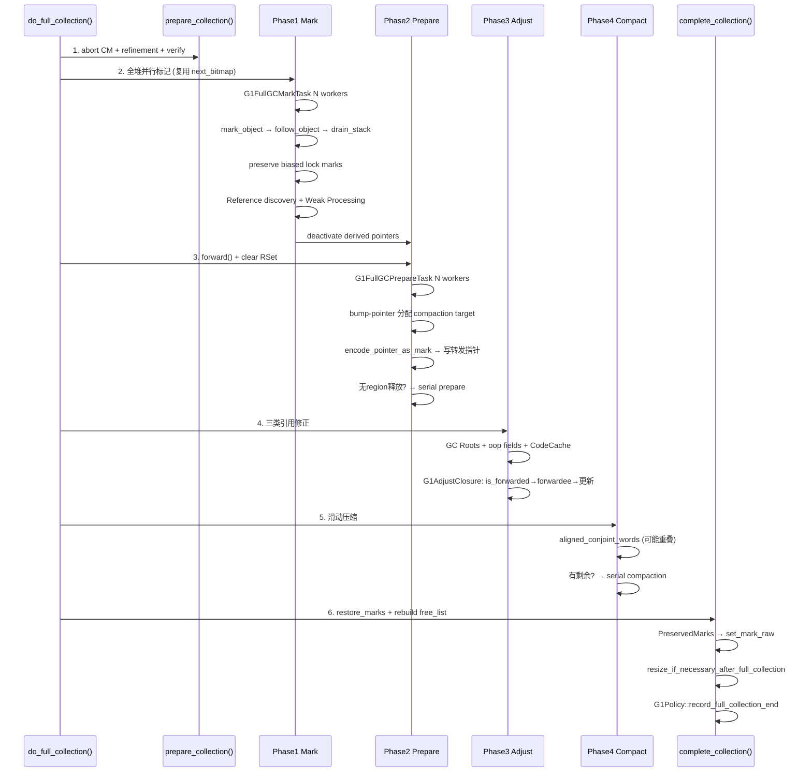
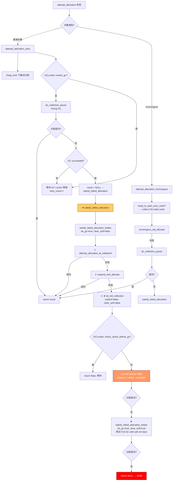
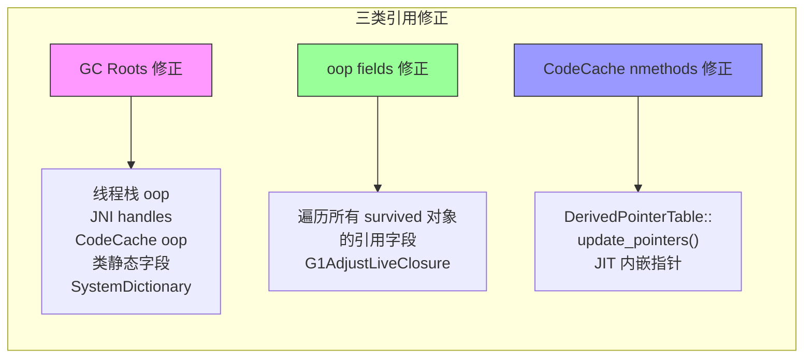
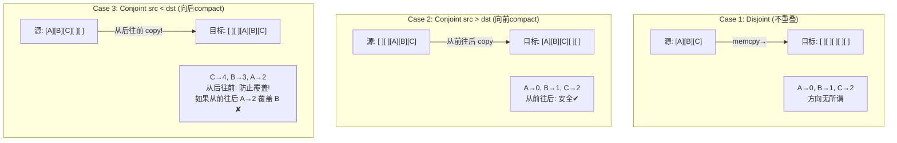

# 09-FullGC — G1 全堆 GC 保底回收机制全栈走读

> **阅读收益**：读完本文后能回答：
> - G1 Full GC 什么时候触发？Evacuation Failure → RETAINED Region → Expansion failure → Full GC 的完整升级链？
> - 4 阶段 Mark-Prepare-Adjust-Compact 各自做什么？为什么是 4 阶段而不是 2 或 3？
> - markOop 怎么同时存储 forwarding pointer 和 GC 状态位？
> - 为什么 Full GC 不需要 RSet、不需要 SATB、不需要 TAMS、不需要 CAS forwarding？
> - conjoint_words 怎么处理源目标重叠？serial_compaction_point 为什么需要？
> - preserved marks 怎么保护偏向锁不被 forward() 覆盖？
> - Full GC 后 G1Policy 状态机如何重置？

**前置依赖**：必须已读 [03-YoungGC §2 Evacuation]、[06-ConcurrentMark]、[08-MixedGC]；建议了解 [04-RSet §2]、[01-ObjectLayout §3 markOop]

**标准环境**：OpenJDK 11 slowdebug, `-Xms8g -Xmx8g -XX:+UseG1GC`, 默认 IHOP=45%, 64位Linux, `-XX:ConcGCThreads=2 -XX:ParallelGCThreads=4`, G1RegionSize=4MB

---

## §〇 源文件清单

| # | 文件 | 模块 | 核心函数/类 | 本文角色 |
|---|------|------|------------|---------|
| 1 | `g1FullCollector.cpp/.hpp` | gc/g1 | `G1FullCollector::collect()`, `phase1-4_*()`, `restore_marks()` | ★★★ 4 阶段主调度器 |
| 2 | `g1FullGCMarker.cpp/.hpp/.inline.hpp` | gc/g1 | `G1FullGCMarker`, `mark_object()`, `follow_object()` | ★★★ Phase 1 标记引擎 |
| 3 | `g1FullGCMarkTask.cpp/.hpp` | gc/g1 | `G1FullGCMarkTask::work()` | ★★ Phase 1 任务定义 |
| 4 | `g1FullGCPrepareTask.cpp/.hpp` | gc/g1 | `G1FullGCPrepareTask::work()`, `G1CalculatePointersClosure` | ★★★ Phase 2 核心逻辑 |
| 5 | `g1FullGCCompactionPoint.cpp/.hpp` | gc/g1 | `G1FullGCCompactionPoint::forward()`, `add()`, `merge()` | ★★★ Phase 2/4 分配目标 |
| 6 | `g1FullGCOopClosures.cpp/.hpp/.inline.hpp` | gc/g1 | `G1MarkAndPushClosure`, `G1AdjustClosure` | ★★ 标记/调整/转发闭包 |
| 7 | `g1FullGCAdjustTask.cpp/.hpp` | gc/g1 | `G1FullGCAdjustTask::work()`, `G1AdjustLiveClosure` | ★★ Phase 3 核心逻辑 |
| 8 | `g1FullGCCompactTask.cpp/.hpp` | gc/g1 | `G1FullGCCompactTask::work()`, `compact_region()`, `G1CompactRegionClosure` | ★★ Phase 4 核心逻辑 |
| 9 | `g1FullGCReferenceProcessorExecutor.cpp/.hpp` | gc/g1 | Reference discovery during marking | ★ Phase 1 子组件 |
| 10 | `g1FullGCScope.cpp/.hpp` | gc/g1 | `G1FullGCScope` — GC timer + logging | ★ 计时统计 |
| 11 | `g1EvacFailure.cpp/.hpp` | gc/g1 | `RemoveSelfForwardPtrHRClosure`, self-forwarded ptr removal | ★★ 触发链起点 |
| 12 | `vm_operations_g1.cpp/.hpp` | gc/g1 | `VM_G1CollectForAllocation::doit()`, `VM_G1CollectFull::doit()` | ★★ 触发链 VM Operation |
| 13 | `g1CollectedHeap.cpp/.hpp` | gc/g1 | `do_full_collection()`:1164, `satisfy_failed_allocation()`:1313, `prepare_heap_for_full_collection()`:1058 | ★★★ 触发调度+准备+收尾 |
| 14 | `preservedMarks.cpp/.hpp/.inline.hpp` | gc/shared | `PreservedMarksSet`, `PreservedMarks`, `OopAndMarkOop` | ★★★ Complete 恢复 |

**辅助组件**：

| 组件 | 归属 | 说明 |
|------|:---:|------|
| `markOopDesc` | `oops/markOop.hpp` | `encode_pointer_as_mark()`:356, `decode_pointer()`:359, `is_marked()`:212, `must_be_preserved()`:230 |
| `oopDesc::forward_to()/forwardee()` | `oops/oop.inline.hpp` | `forward_to()`:349, `forward_to_atomic()`:373, `is_forwarded()`:342, `forwardee()`:398 |
| `GCLocker` | `gc/shared/gcLocker.hpp` | `check_active_before_gc()` — JNI 临界区阻止 GC |
| `DerivedPointerTable` | `compiler/oopMap.hpp`:437 | Phase 1 激活 → Phase 2 冻结 → Complete 更新 |
| `Copy::aligned_conjoint_words()` | `utilities/copy.hpp` | 滑动压缩用的 conjoint 拷贝 |

---

## §一 ★ 全景 — Full GC 的角色和对比定位

### ❓ G1 为什么还需要 Full GC？Young GC + Mixed GC 不已经解决了吗？

G1 的设计哲学是**"用增量 GC 避免 Full GC"**。正常情况下：

- **Young GC**（[03]）：只回收年轻代，Eden→Survivor/Promotion，RSet 驱动的增量 GC
- **Mixed GC**（[08]）：Young Region + 一部分 Old Region，靠 G1Policy 逐步回收
- **Concurrent Mark**（[06][07]）：在 Mixed GC 前识别 Old Region 中的垃圾

这套组合拳在大多数场景下足够。但有一个致命前提：**Mixed GC 的 CSet 候选 Region 中，存活对象必须能被成功 Evacuate 到空闲 Region**。

当这个前提不成立时——Evacuation Failure 发生并且累积到所有预留空间耗尽——G1 的回退机制是 **Full GC（全堆 STW Mark-Compact）**。

```
┌─────────────────────────────────────────────────────────────────────────────────────┐
│                        G1 GC 演进谱系                                                 │
│                                                                                     │
│  Young GC ───→ Mixed GC ───→ Young GC ───→ ... (正常路径)                            │
│     │               │                                                               │
│     │               │                                                               │
│     └ Evac Fail ────┴ Evac Fail ──→ Expansion fail ──→ ★ Full GC (保底)              │
│                                                                                     │
│  Full GC 后：状态机重置 → 回到 Young GC 重新 accumulation                              │
└─────────────────────────────────────────────────────────────────────────────────────┘
```

### 1.1 Full GC vs Young/Mixed/CM 对比矩阵

| 对比维度 | Young GC [03] | Concurrent Mark [06] | Mixed GC [08] | Full GC (本文) |
|---------|:---:|:---:|:---:|:---:|
| **并发度** | STW (short) | Concurrent + 2 STW | STW (medium) | STW (长停顿，全堆一次性) |
| **依赖 RSet？** | ✅ Evacuation 入边追踪 | ❌ 不需要 | ✅ Evacuation 入边追踪 | ❌ **不需要** — STW 全堆标记覆盖所有入边 |
| **依赖 SATB？** | ❌ | ✅ 核心 | ❌ | ❌ **不需要** — 无并发mutator修改 |
| **依赖 TAMS？** | ❌ | ✅ 双 TAMS | 回收后重置 | ❌ **不需要** — 标记期间无分配 |
| **存活判定** | RSet扫描+copy | bitmap 并发标记 | 复用 CM bitmap | 全堆递归标记(复用 next_bitmap) |
| **回收方式** | Evacuate(复制) | — | Evacuate(复制) | 滑动压缩(同Region内/跨Region) |
| **转发指针** | CAS (forward_to_atomic) | — | CAS | **direct write**（STW+互斥） |
| **碎片处理** | 无(Eden全清) | — | 无 | ✅ 消除碎片 |
| **停顿时间** | ~数十 ms | ~数百 ms (remark) | ~数十-百 ms | **数百 ms ~ 数 s** |

### ❓ 为什么 Full GC 不需要 RSet？

**RSet 的作用**：在 Young/Mixed GC 中，GC 只扫描 CSet 中的 Region。但要从 GC Roots 追踪到 CSet 内的引用，必须知道"谁引用了 CSet 中的对象"——这就是 RSet 的作用（记录外→内的引用）。

**Full GC 不需要 RSet 的原因**：Phase 1 Mark 阶段**扫描全堆所有 Region**，从 GC Roots 递归遍历所有可达对象。换言之，Full GC 做的是全局标记，不依赖 RSet 提供入边信息。**标记完成后，所有引用的入边和出边都已覆盖**。

### ❓ 为什么 Full GC 不需要 SATB？

**SATB**（Snapshot-At-The-Beginning）是并发标记的产物：mutator 在标记过程中修改引用，SATB 快照确保不会漏标已被覆盖的旧引用。

**Full GC 不需要 SATB 的原因**：Full GC 全程 STW，所有 mutator 线程暂停，**标记期间不会有任何引用被修改**。因此可以用精确的递归标记，不需要 SATB 的 pre-write barrier。

### ❓ 为什么 Full GC 不需要 TAMS？

**TAMS**（Top-At-Mark-Start）是并发标记中用于区分"标记前已分配"和"标记期间新分配"对象的分界线。

**Full GC 不需要 TAMS 的原因**：标记期间没有 mutator 运行，**没有任何新对象被分配**。所以不需要双缓冲区分新旧对象，一次 bitmap pass 即可。

### 1.2 全文 4 阶段总览 + G1FullCollector 结构



```cpp
// g1FullCollector.hpp:56-67 — G1FullCollector 是 StackObj！
class G1FullCollector : StackObj {  // ← 栈上对象，GC 结束自动析构
  G1CollectedHeap*     _heap;
  G1FullGCScope        _scope;                 // 计时 + 日志
  uint                 _num_workers;           // 并行线程数
  G1FullGCMarker**     _markers;               // 每 worker 一个标记器
  G1FullGCCompactionPoint** _compaction_points; // 每 worker 一个压缩目标
  OopQueueSet          _oop_queue_set;         // 跨 worker 工作窃取
  ObjArrayTaskQueueSet _array_queue_set;        // 数组分片队列
  PreservedMarksSet    _preserved_marks_set;    // 偏向锁快照
  G1FullGCCompactionPoint _serial_compaction_point; // ★ 串行兜底
};
```

**★ G1FullCollector 为什么是 StackObj？**

```cpp
// g1CollectedHeap.cpp:1184-1192
bool G1CollectedHeap::do_full_collection(...) {
  // ...
  G1FullCollector collector(this, ...);  // 栈上构造！
  collector.prepare_collection();
  collector.collect();                   // 4 阶段
  collector.complete_collection();
  // collector 自动析构 → 释放 markers, compaction_points
  return true;
}
```

这反映了 Full GC 的两个本质特性：
1. **全 STW 同步执行**：不像 CM 在后台线程跑，Full GC 在 VM Thread 上一次性完成
2. **与调用者生命周期绑定**：不需要堆上持久对象。对比 `G1Policy`、`G1ConcurrentMark` 都是 `CHeapObj`，生命周期跨越多次 GC

析构时释放：
```cpp
// g1FullCollector.cpp:132-138
G1FullCollector::~G1FullCollector() {
  for (uint i = 0; i < _num_workers; i++) {
    delete _markers[i];           // 每个 worker 的 marker
    delete _compaction_points[i]; // 每个 worker 的 compaction_point
  }
  FREE_C_HEAP_ARRAY(G1FullGCMarker*, _markers);
  FREE_C_HEAP_ARRAY(G1FullGCCompactionPoint*, _compaction_points);
}
```

**Worker 数量计算**（`calc_active_workers`:77-105）：

```cpp
uint G1FullCollector::calc_active_workers() {
  uint max = heap->workers()->total_workers();
  if (!UseDynamicNumberOfGCThreads) return max;

  // 考虑 G1HeapWastePercent：每个 worker 平均浪费半个 region
  uint waste_limit = MIN2((num_regions * G1HeapWastePercent / 100) * 2, max);
  // 考虑 HeapSizePerGCThread
  uint adaptive_limit = AdaptiveSizePolicy::calc_active_workers(max, current, 0);

  return MIN2(waste_limit, adaptive_limit);
}
```

---

## §二 ★★★ 触发链：从 Evacuation Failure 到 Full GC

### 2.1 触发链决策树



### 2.2 ❓ Evacuation Failure 怎么积累的？

**两个层面的 `_evacuation_failed` 标志**：

1. **`HeapRegion::_evacuation_failed`**（per-Region）：Region 层面标记
2. **`G1CollectedHeap::_evacuation_failed`**（全局）：表示本次 GC pause 期间有 Region 发生了 Evac Failure

**发生路径**（[03 §4] 详细分析）：
```
Young GC Phase 2 Evacuate → copy_to_survivor_space(oop, age)
  → PLAB 分配失败 → 换 PLAB → 换 Region
    → 所有 Survivor/Old Region 都满
      → forward_to_atomic(oop) → self-forwarding: markOop=encode_pointer_as_mark(self_addr)=self_addr|0x3
        → _evacuation_failed = true
```

**Evac Failure 后的 RETAINED Region**（`g1EvacFailure.cpp`）：

```cpp
// g1EvacFailure.cpp:104-155 — RemoveSelfForwardPtrObjClosure::do_object()
void do_object(oop obj) {
  if (obj->is_forwarded() && obj->forwardee() == obj) {
    // ★ self-forwarded：对象无法被 evacuate
    // 标记为 prev_bitmap 存活（保留在 Old Gen）
    if (!_cm->is_marked_in_prev_bitmap(obj)) {
      _cm->mark_in_prev_bitmap(obj);
    }
    PreservedMarks::init_forwarded_mark(obj);  // 清除 forwarding marker

    // 重建 RSet entries（因为 CSet 扫描期间跳过了 cards）
    obj->oop_iterate(_update_rset_cl);
  }
}
```

**为什么 RETAINED Region 积累会导致 Full GC？**

`RemoveSelfForwardPtrHRClosure` 处理后，RETAINED Region 变成一个普通的 Old Region（`_evacuation_failed` 标志被清除）。但关键在于：
- Self-forwarded 对象全部是**真正存活的**（无法 evacuate 才失败）
- 后续 CM 标记时必然被标为 live → `garbage_ratio ≈ 0`
- G1Policy 选 Mixed GC CSet 时按 garbage_ratio 排序 → garbage_ratio=0 的 Region 永远不会被选中

**效应**：每次 Evac Failure 都在 Old Gen 中永久留下一个"高存活率"Region。反复发生 → Old Gen 中充满低垃圾比的 Region → Mixed GC 空间回收率骤降 → Old Gen 持续膨胀 → Humongous 无连续 Region 可分配 → Expansion fail → Full GC inevitable。

### 2.3 ★ 扩容为什么也失败了？

```cpp
// g1CollectedHeap.cpp:1281-1311 — satisfy_failed_allocation_helper
HeapWord* G1CollectedHeap::satisfy_failed_allocation_helper(..., bool do_gc, ...) {
  // 第 1 步：尝试直接分配
  result = attempt_allocation_at_safepoint(word_size, ...);
  if (result != NULL) return result;

  // 第 2 步：尝试扩容
  result = expand_and_allocate(word_size);
  if (result != NULL) return result;

  // 第 3 步：如果扩容也失败了 → Full GC
  if (do_gc) {
    *gc_succeeded = do_full_collection(false, clear_all_soft_refs);
  }
  return NULL;
}
```

**扩容失败的根因**：
- `G1ReservePercent`（默认 10%）的预留空间在 Evacuation Failure 后全被 RETAINED Region 占据
- 大对象（Humongous ≥ 2MB）需要连续多个 Region，Old Gen 碎片化导致无法找到连续的 Region
- 即使扩容，新 Region 在 `-Xms=Xmx` 配置下也无法再 commit 新内存

### 2.4 ★ GCLocker：JNI 临界区必须等

```cpp
// g1CollectedHeap.cpp:1175
bool G1CollectedHeap::do_full_collection(...) {
  if (GCLocker::check_active_before_gc()) {
    return false;  // ★ JNI 临界区活跃 → 直接跳过！
  }
  // ... proceed with Full GC
}
```

**GCLocker 协议**：
- JNI 线程调用 `GetPrimitiveArrayCritical()` 后进入临界区
- 临界区期间**不能 GC**（因为对象可能被移动）
- `check_active_before_gc()`：如果有线程在 JNI 临界区 → 设置 `_needs_gc=true` → 等下次 safepoint 再重试
- 这就是为什么 `attempt_allocation_slow` 和 `attempt_allocation_humongous` 都有 `gclocker_retry_count` 重试逻辑

### 2.5 ★ `VM_G1CollectForAllocation::doit()` — 内联升级逻辑

```cpp
// vm_operations_g1.cpp:78-166 — 关键行号标注
void VM_G1CollectForAllocation::doit() {
  // 行 89：先尝试在 safepoint 分配
  if (_word_size > 0) {
    _result = g1h->attempt_allocation_at_safepoint(_word_size, false);
    if (_result != NULL) { _pause_succeeded = true; return; }
  }

  // 行 100-136：如果需要初始标记（IHOP 触发），先做 CM
  if (_should_initiate_conc_mark) {
    bool res = g1h->g1_policy()->force_initial_mark_if_outside_cycle(_gc_cause);
    if (!res) { /* CM already in progress, skip */ return; }
  }

  // 行 139：★ 先尝试 Young/Mixed GC pause
  _pause_succeeded = g1h->do_collection_pause_at_safepoint(_target_pause_time_ms);

  if (_pause_succeeded) {
    if (_word_size > 0) {
      // 行 145：★★ 关键升级点！
      _result = g1h->satisfy_failed_allocation(_word_size, &_pause_succeeded);
      // satisfy_failed_allocation 内部：
      //   → allocate → expand → do_full_collection → allocate
    } else if (!g1h->should_do_concurrent_full_gc(_gc_cause) &&
               !g1h->has_regions_left_for_allocation()) {
      // 行 149-155：没有任何可用 region → 直接 Full GC
      log_info(gc, ergo)("Attempting maximally compacting collection");
      _pause_succeeded = g1h->do_full_collection(false, true);
    }
  }
  // ...
}
```

### 2.6 ★ `prepare_collection()` — Full GC 前的准备工作

```cpp
// g1FullCollector.cpp:141-171
void G1FullCollector::prepare_collection() {
  _heap->g1_policy()->record_full_collection_start();  // 设置 in_full_gc=true
  _heap->print_heap_before_gc();
  _heap->abort_concurrent_cycle();          // ★ 终止 CM
  _heap->verify_before_full_collection();
  _heap->gc_prologue(true);
  _heap->prepare_heap_for_full_collection(); // ★ 释放分配器 + 清空 CSet
  reference_processor()->enable_discovery();
  CodeCache::gc_prologue();                  // CodeCache 准备
  BiasedLocking::preserve_marks();           // ★ 保存全局偏向锁
  clear_and_activate_derived_pointers();     // ★ 激活 DerivedPointerTable
}

// g1CollectedHeap.cpp:1058-1071
void G1CollectedHeap::prepare_heap_for_full_collection() {
  _allocator->release_mutator_alloc_region();  // 释放 TLAB 缓冲区
  _allocator->abandon_gc_alloc_regions();       // 放弃 GC alloc regions
  g1_rem_set()->cleanupHRRS();                  // 清理 RSet 结构
  abandon_collection_set(collection_set());     // 清空 CSet
  tear_down_region_sets(false /* free_list_only */); // 拆散 region sets
}
```

**★ 为什么需要 `tear_down_region_sets()`？**

这是 Full GC 区别于 Young/Mixed GC 的**根本操作**。它拆散所有 Region 集合：
- `_old_set`、`_humongous_set`、`_free_list` → 全部清空
- `_survivor_regions`、`_eden_regions` → 全部清空
- 所有 Region 进入**"无归属"状态**

**为什么必须拆散？** Phase 2-4 会移动全堆对象——原本在 Old Region 中的对象被 compact 到另一个 Region，Region 的类型和归属完全打乱。只有先把一切拆散，compact 后才能按**新布局**重建 Region sets（在 `prepare_heap_for_mutators()` 中 `rebuild_region_sets()` 重建 free list，再通过 `start_new_collection_set()` 启动新的 Eden/Survivor 分配）。

**对比 Young GC**：Young GC 只 evacuate CSet 中的 Region，释放后放入 free list。它从不拆散 `_old_set`——Old Region 保持不动。只有 Full GC 才做"推倒重来"级别的 Region 重组。

**★ `abort_concurrent_cycle()` 做了什么？**
1. 终止 Concurrent Mark 线程
2. 放弃 CM Ref Processor 的部分发现
3. Flush all marks (SATB buffer) — 清空 SATB 队列
4. Abort refinement（`g1CollectedHeap.cpp:1087`）

---

## §三 ★★★ Phase 1 Mark：全堆标记

### 3.1 ❓ 为什么 Full GC 的标记比 CM 简单一个数量级？

**核心理由：无并发 mutator → 无需处理标记期间的引用变化。**

| 复杂度来源 | CM [06] | Full GC |
|----------|---------|---------|
| SATB 快照 | 需要（pre-write barrier） | 不需要 |
| TAMS 双缓冲 | 需要（标记期间有分配） | 不需要 |
| 分阶段/单次 | 分阶段（initial+concurrent+remark+cleanup，但 transitive closure 只一遍） | **一次 pass** |
| finger/task_queue | 需要（工作窃取、负载均衡） | 有但简单得多 |
| 时间片管理 | 4 段式（do_marking_step） | drain_stack 一次性 |
| 标记栈 | CMTask 的 MarkStack（大容量） | OopQueue + ObjArrayQueue |

### 3.2 `G1FullGCMarkTask::work()` — 标记入口

```cpp
// g1FullGCMarkTask.cpp:46-71
void G1FullGCMarkTask::work(uint worker_id) {
  G1FullGCMarker* marker = collector()->marker(worker_id);

  // ★ Step 1: 扫描所有 GC Roots
  if (ClassUnloading) {
    _root_processor.process_strong_roots(
        marker->mark_closure(),   // G1MarkAndPushClosure → mark_and_push
        marker->cld_closure(),    // CLDToOopClosure
        &code_closure);           // CodeBlobToOopClosure
  } else {
    _root_processor.process_all_roots_no_string_table(
        marker->mark_closure(),
        marker->cld_closure(),
        &code_closure);
  }

  // ★ Step 2: 工作窃取 + 递归标记
  marker->complete_marking(
      collector()->oop_queue_set(),
      collector()->array_queue_set(),
      &_terminator);
}
```

### 3.3 `mark_object()` — 标记 + 偏向锁快照

```cpp
// g1FullGCMarker.inline.hpp:40-64
inline bool G1FullGCMarker::mark_object(oop obj) {
  if (G1ArchiveAllocator::is_closed_archive_object(obj)) return false;

  // ★ Step 1: 对 bitmap 做 par_mark (CAS)
  if (!_bitmap->par_mark(obj)) return false;  // Lost mark race

  // ★ Step 2: 检查是否需要保存偏向锁 markOop
  markOop mark = obj->mark_raw();
  if (mark->must_be_preserved(obj) &&
      !G1ArchiveAllocator::is_open_archive_object(obj)) {
    preserved_stack()->push(obj, mark);  // ★ Phase 1 快照！
  }

  // Step 3: String Dedup 入队
  if (G1StringDedup::is_enabled()) {
    G1StringDedup::enqueue_from_mark(obj, _worker_id);
  }
  return true;
}
```

**为什么必须在 Phase 1 保存偏向锁？**
- Phase 1 标记阶段，对象还在原来的位置
- Phase 2 `forward()` 会用 `encode_pointer_as_mark()` **覆写** markOop 为转发指针
- 偏向锁的低 3 位是 `101`（biased pattern），包含持有线程 ID、epoch 等信息
- 如果不在 Phase 1 保存，Phase 2 后这些信息永久丢失
- Complete 阶段的 `restore_marks()` 把保存的 markOop 写回

### 3.4 `must_be_preserved()` — 什么 markOop 需要保存？

```cpp
// markOop.hpp:230,250
// must_be_preserved_for_promotion_failure(obj):
//   - biased locking pattern (low 3 bits = 101)
//   - or has hash code (and not the prototype)
// 因为 Phase 2 会把 markOop 覆写为 forwarding pointer
```

### 3.5 标记栈 — OopQueue + ObjArrayTaskQueue

```cpp
// g1FullGCMarker.hpp:47-57
class G1FullGCMarker : public CHeapObj<mtGC> {
  uint              _worker_id;
  G1CMBitMap*       _bitmap;           // ★ 复用 CM 的 next_bitmap
  OopQueue          _oop_stack;        // 普通对象栈
  ObjArrayTaskQueue _objarray_stack;   // 数组分片栈（工作窃取用）
  PreservedMarks*   _preserved_stack;  // 偏向锁快照
};

// g1FullGCMarker.inline.hpp:152-165
void G1FullGCMarker::drain_stack() {
  do {
    oop obj;
    while (pop_object(obj)) {
      follow_object(obj);    // 遍历 field → mark_and_push
    }
    ObjArrayTask task;
    if (pop_objarray(task)) {
      follow_array_chunk(objArrayOop(task.obj()), task.index());
    }
  } while (!is_empty());
}
```

**对比 CM 的 `do_marking_step()`**（[06 §4]）：
- CM 有 `_finger` 指针保证进度、有时间片（`GCConcMarkStepDurationMillis`）保证公平
- Full GC 没有这些：全 STW、没有时间片限制、没有 finger claim → 简单得多

### 3.6 `complete_marking()` — 工作窃取

```cpp
// g1FullGCMarker.cpp:47-63
void G1FullGCMarker::complete_marking(OopQueueSet* oop_stacks,
                                       ObjArrayTaskQueueSet* array_stacks,
                                       ParallelTaskTerminator* terminator) {
  int hash_seed = 17;
  do {
    drain_stack();                              // 清空自己的栈
    ObjArrayTask steal_array;
    if (array_stacks->steal(_worker_id, &hash_seed, steal_array)) {
      follow_array_chunk(...);                  // ★ 窃取数组分片
    } else {
      oop steal_oop;
      if (oop_stacks->steal(_worker_id, &hash_seed, steal_oop)) {
        follow_object(steal_oop);               // ★ 窃取普通对象
      }
    }
  } while (!is_empty() || !terminator->offer_termination());
}
```

### 3.7 ★ 为什么复用 CM 的 `next_bitmap`？

```cpp
// g1FullCollector.cpp:69-71
G1CMBitMap* G1FullCollector::mark_bitmap() {
  return _heap->concurrent_mark()->next_mark_bitmap();
}
```

- Full GC 后 CM 被 abort，next_bitmap 的数据也不再需要
- 复用 next_bitmap 避免了额外分配 bitmap 内存
- Mark 完成后，这个 bitmap 就是整个堆的精确存活标记

### 3.8 Reference Processing 简述

Phase 1 标记完成后，`G1FullGCReferenceProcessorExecutor` 负责处理 soft/weak/phantom/finalizer 引用。这是 Full GC 中唯一一个需要"异步"处理的子组件——因为标记结束后才知道哪些 referent 存活。**深挖在 [11-ReferenceProcessing]**。

**★★ 设计替代 (#4)：如果 Full GC 用并发标记**

理论上可以在 Full GC 中复用 CM 的并发标记：在 Phase 1 启动一个 concurrent mark cycle，然后 STW Remark+Cleanup。但这样：
1. **比直接 STW 标记慢 3-5 倍**：STW 全堆标记 ≈ 数百 ms，但 concurrent mark 需要 initial mark + concurrent + remark + cleanup，总时间可到秒级
2. **复杂度剧增**：需要 SATB 快照（pre-write barrier）、TAMS 双缓冲、CMTask 的 4 段式时间片，而 CM 的所有 infrastructure 是持续的运行成本
3. **收益为零**：因为 Full GC 后要 Compact，并发标记节省的那点 mutator 时间（几百 ms）远不如 Full GC 的 STW 停顿大

**结论**：STW 全堆标记是 Full GC 的合理设计——保底回收不应该在标记阶段再浪费时间。

---

## §四 ★★★ Phase 2 Prepare：压缩规划（核心章节）

### 4.1 ❓ 为什么 Phase 2 叫"Prepare"？它在为 Phase 3 和 4 准备什么？

Phase 2 不是执行压缩，而是**计算每个存活对象将被移动到的目标地址（forwarding pointer）+ 为后续阶段清理战场**。

三任务：`G1FullGCPrepareTask`：

1. **② 设置 forwarding pointer**（`G1CalculatePointersClosure` → `prepare_for_compaction`）
2. **① 清空 RSet**（`reset_region_metadata` → `hr->rem_set()->clear()`）
3. **③ 冻结 DerivedPointerTable**（`deactivate_derived_pointers()`）

### 4.2 G1FullGCPrepareTask — 核心逻辑

```cpp
// g1FullGCPrepareTask.cpp:79-94
void G1FullGCPrepareTask::work(uint worker_id) {
  G1FullGCCompactionPoint* compaction_point = collector()->compaction_point(worker_id);
  G1CalculatePointersClosure closure(collector()->mark_bitmap(), compaction_point);

  // ★ 并行遍历所有 Region
  G1CollectedHeap::heap()->heap_region_par_iterate_from_start(&closure, &_hrclaimer);

  closure.update_sets();
  compaction_point->update();           // 写回最后一个 Region 的 compaction_top
  if (closure.freed_regions()) set_freed_regions();
}
```

**`G1CalculatePointersClosure::do_heap_region()`**（行 43-61）：

```cpp
bool do_heap_region(HeapRegion* hr) {
  if (hr->is_humongous()) {
    oop obj = oop(hr->humongous_start_region()->bottom());
    if (_bitmap->is_marked(obj)) {
      if (hr->is_starts_humongous()) {
        obj->forward_to(obj);   // ★ Humongous 对象原地不动
      }
    } else {
      free_humongous_region(hr);  // Dead humongous → free
    }
  } else if (!hr->is_pinned()) {
    prepare_for_compaction(hr);    // ★ 普通 Region → 设置 forwarding
  }
  reset_region_metadata(hr);       // ★ 清空 RSet + card table
  return false;
}
```

**★ Pinned Region — Phase 2 的"不动区"**：

注意 `else if (!hr->is_pinned())` 这个分支：Pinned Region（来自 JNI 临界区，如 `GetPrimitiveArrayCritical()` 锁定的对象所在 Region）**不参与 compact**——其中的对象既不被 forward，也不被移动。RSet 仍会被清空（`reset_region_metadata` 无条件执行）。

**为什么需要 Pinned Region？** JNI 临界区内的对象不能移动（native code 持有裸指针）。G1 通过 `GCLocker` 阻止 Full GC 在 JNI 临界区活跃时启动（[§二 2.4]），但针对"GC 启动后才有线程进入 JNI 临界区"的极端情况，Pinned Region 是最后防线。

**面试角度**：如果被问"Full GC 期间有 JNI 临界区锁定的对象怎么处理？"——答：`is_pinned()` 检查 → 该 Region 不参与压缩 → 对象原地不动（不设置 forwarding、不 compact），但 RSet 仍会清空重建。

**`prepare_for_compaction_work()`**（行 147-152）：

```cpp
void prepare_for_compaction_work(G1FullGCCompactionPoint* cp, HeapRegion* hr) {
  G1PrepareCompactLiveClosure prepare_compact(cp);
  hr->set_compaction_top(hr->bottom());  // 重置 compaction_top 到 Region 底部
  hr->apply_to_marked_objects(_bitmap, &prepare_compact);  // ★ 遍历所有 marked 对象
}

// 行 126-131
size_t G1PrepareCompactLiveClosure::apply(oop object) {
  size_t size = object->size();
  _cp->forward(object, size);  // ★ 计算目标地址 + 设置 forwarding
  return size;
}
```

### 4.3 ★★★ markOop 转发指针——位布局精解

```
markOop 的 forwarding 编码（64位）：

┌──────────────────────────────────────────────────────────────────────────────┐
│  Forwarding Pointer 编码：encode_pointer_as_mark(p) = p | marked_bit          │
│                                                                              │
│  markOop.hpp:356                                                             │
│  static markOop encode_pointer_as_mark(void* p) {                            │
│      return markOop(p)->set_marked();                                        │
│  }                                                                           │
│                                                                              │
│  64位地址:  [63 ............................................ 3][2]  [1][0]│
│             ← 对象目标地址 (HeapWord*)            → bias  lock_bits = 11  │
│                                                                              │
│  lock_bits = 2 位 ([1:0]): 00=轻量锁, 01=无锁, 10=重量级锁, 11=GC marked      │
│  bias bit = bit[2]: 1=偏向模式, 0=正常                                       │
│  set_marked() → 设置 bit[1:0] = 11 → 其他位不变                              │
│                                                                              │
│  解码：decode_pointer() = clear_lock_bits()                                  │
│  markOop.hpp:359                                                             │
│  void* decode_pointer() {                                                    │
│      if (UseBiasedLocking && has_bias_pattern()) return NULL;                │
│      return clear_lock_bits();                                               │
│  }                                                                           │
└──────────────────────────────────────────────────────────────────────────────┘
```

**`is_forwarded()` 判定**（`oop.inline.hpp:342`）：

```cpp
bool oopDesc::is_forwarded() const {
  return mark_raw()->is_marked();  // lock_bits == 11 ?
}
```

**`forward_to()` 写入**（`oop.inline.hpp:349`）：

```cpp
void oopDesc::forward_to(oop p) {
  markOop m = markOopDesc::encode_pointer_as_mark(p);
  assert(m->decode_pointer() == p, "encoding must be reversable");
  set_mark_raw(m);   // ★ 直接写入，无 CAS！
}
```

**`forwardee()` 解码**（`oop.inline.hpp:398`）：

```cpp
oop oopDesc::forwardee() const {
  return (oop) mark_raw()->decode_pointer();  // clear_lock_bits
}
```

**★ 偏向锁对象不能通过 markOop forwarding！**

`decode_pointer()` 中有一个关键分支（`markOop.hpp:359`）：

```cpp
void* decode_pointer() {
  if (UseBiasedLocking && has_bias_pattern()) return NULL;
  return clear_lock_bits();
}
```

**为什么偏向锁对象返回 NULL？** 偏向锁的 markOop 低位是 `101`（biased pattern），而 forwarding 编码后低位是 `011`（marked）。如果一个对象已经有偏向锁（low bits = 101），`encode_pointer_as_mark()` 设置 `set_marked()` 后 low bits 变成 `111`——**但这不会发生**，因为偏向锁对象在 Phase 1 的 `mark_object()` 中已经被 capture 到 `_preserved_stack`，Phase 2 `forward()` 前 `mark_raw()` 已经被替换为 prototype mark。

**那 `has_bias_pattern()→return NULL` 的作用是什么？** 它处理的是 `mark_object()` 中 **没有** 进入 `preserved_stack` 的情况（比如 `must_be_preserved()` 返回 false 但 markOop 恰好看似有 bias pattern 的对象）。此时 `forwardee()` 返回 NULL → `is_forwarded()` 为 false → 对象不会被移动到错误地址。这是一种**防御性安全检查**。**没有这个防御，Full GC 会把 bias mark 误解释为 forwarding pointer → 对象被"移动"到随机地址 → 堆损坏。**

**★ markOop 位布局 Mermaid 图**：

```mermaid
flowchart TB
    subgraph "markOop 64位布局 (forwarding 模式)"
        direction LR
        BIT63["bit63"] --- BIT3["..."] --- L2["lock_bit[2]"] --- L1["lock_bit[1]"] --- L0["lock_bit[0]"]
    end
    subgraph "编码: encode_pointer_as_mark"
        A["目标地址 0x7FFF_C000_0000"] --> B["| marked_bit (11b)"]
        B --> C["= 0x7FFF_C000_0003"]
    end
    subgraph "解码: forwardee()"
        D["markOop 0x7FFF_C000_0003"] --> E["is_marked() → (0x3 & 0x3) == 0x3 → true"]
        E --> F["decode_pointer() → clear_lock_bits → 0x7FFF_C000_0000"]
    end
    subgraph "判断: is_forwarded()"
        G["mark_raw()"] --> H["is_marked()?"]
        H -->|"lock_bits==11"| I["true → 已转发"]
        H -->|"lock_bits!=11"| J["false → 未转发"]
    end
```



### 4.4 ★ 为什么 Full GC 不需要 CAS forwarding？

**Young GC 的 `forward_to_atomic()`**（[03 §2]）：

```cpp
// oop.inline.hpp:373 — CAS 循环！
oop oopDesc::forward_to_atomic(oop p, ...) {
  markOop oldMark = mark_raw();
  markOop forwardPtrMark = markOopDesc::encode_pointer_as_mark(p);
  markOop curMark;
  while (!oldMark->is_marked()) {
    curMark = cas_set_mark_raw(forwardPtrMark, oldMark, order);
    // ...
  }
  return forwardee();
}
```

Young GC 需要 CAS 是因为：**多个 GC worker 可能同时尝试把同一个对象 forward 到不同的 Survivor Region**。

**Full GC 不需要 CAS 的原因**：

1. **全 STW**：所有 mutator 暂停。即使没有互斥保证，也没有 mutator 会读 markOop
2. **Phase 2 worker 各处理互不重叠的 Region**：`heap_region_par_iterate_from_start` + `HeapRegionClaimer` 确保每个 Region 只被一个 worker 处理
3. 在同一个 Region 内，`apply_to_marked_objects` 按地址顺序遍历，不会出现两个 worker 竞争同一个对象

**例外**：如果 `prepare_serial_compaction()` 重新处理同一 Region，那是在 Phase 2 的串行阶段完成的，也没有竞争。

### 4.5 ★ G1FullGCCompactionPoint — bump-pointer 分配器

```cpp
// g1FullGCCompactionPoint.hpp:34-62
class G1FullGCCompactionPoint : public CHeapObj<mtGC> {
  HeapRegion*                _current_region;     // 当前分配目标 Region
  HeapWord*                  _threshold;          // 跨过 threshold 更新 BOT
  HeapWord*                  _compaction_top;     // ★ bump pointer
  GrowableArray<HeapRegion*>* _compaction_regions; // 已分配的 Region 列表
};
```

**`forward()` 核心算法**（`g1FullGCCompactionPoint.cpp:97-134`）：

```cpp
void G1FullGCCompactionPoint::forward(oop object, size_t size) {
  // ★ Step 1: 如果当前 Region 放不下 → 切到下一个
  while (!object_will_fit(size)) {
    switch_region();  // 保存当前 compaction_top → 换新 Region
  }

  // ★ Step 2: 如果对象需要移动 → 写 forwarding pointer
  if ((HeapWord*)object != _compaction_top) {
    object->forward_to(oop(_compaction_top));  // ★ 设置转发指针
  } else {
    // 对象恰好在 compaction_top（原地不动）
    if (object->forwardee() != NULL) {
      object->init_mark_raw();  // 清除旧的 mark word
    }
  }

  // ★ Step 3: bump pointer 前进
  _compaction_top += size;
  if (_compaction_top > _threshold) {
    _threshold = _current_region->cross_threshold(...);  // 更新 BOT
  }
}
```

**`switch_region()`**（行 89-95）：

```cpp
void G1FullGCCompactionPoint::switch_region() {
  _current_region->set_compaction_top(_compaction_top);  // 写回
  _current_region = next_region();                        // 下一 Region
  initialize_values(true);                                // 重置 _compaction_top=_current_region->bottom()
}
```

**`merge()`**（行 140-142）— 用于 `serial_compaction_point`：

```cpp
void G1FullGCCompactionPoint::merge(G1FullGCCompactionPoint* other) {
  _compaction_regions->appendAll(other->regions());
}
```

### 4.6 ★ 为什么清空 RSet？

```cpp
// g1FullGCPrepareTask.cpp:114-121
void reset_region_metadata(HeapRegion* hr) {
  hr->rem_set()->clear();       // ★ 清空 RSet
  hr->clear_cardtable();        // ★ 清空 Card Table
  if (_g1h->g1_hot_card_cache()->use_cache()) {
    _g1h->g1_hot_card_cache()->reset_card_counts(hr);
  }
}
```

**原因**：Phase 4 会移动全堆所有存活对象。移动后：
- 所有跨 Region 引用都变了 → RSet 全部失效
- 所有 card 标记失效 → Card Table 需要重建
- Full GC 后在 `prepare_heap_for_mutators()` 中调用 `rebuild_region_sets()` 从头重建 free list

### 4.7 ★ `prepare_serial_compaction()` — 串行兜底

```cpp
// g1FullGCPrepareTask.cpp:164-194
void G1FullGCPrepareTask::prepare_serial_compaction() {
  // 从每个 worker 的 compaction_point 中取出最后一个 Region
  for (uint i = 0; i < collector()->workers(); i++) {
    G1FullGCCompactionPoint* cp = collector()->compaction_point(i);
    if (cp->has_regions()) {
      collector()->serial_compaction_point()->add(cp->remove_last());
    }
  }

  // 重新为这些 Region 计算 forwarding（目标现在是 serial_compaction_point）
  G1FullGCCompactionPoint* cp = collector()->serial_compaction_point();
  for (auto it = cp->regions()->begin(); it != cp->regions()->end(); ++it) {
    HeapRegion* current = *it;
    if (!cp->is_initialized()) {
      cp->initialize(current, false);
    } else {
      G1RePrepareClosure re_prepare(cp, current);
      current->set_compaction_top(current->bottom());
      current->apply_to_marked_objects(collector()->mark_bitmap(), &re_prepare);
    }
  }
  cp->update();
}
```

**★ Phase 2 的 `prepare_serial_compaction()` 和 Phase 4 的 `serial_compaction()` 是配对关系**：

| 阶段 | 函数 | 做什么 |
|------|------|--------|
| Phase 2 | `prepare_serial_compaction()` | 重新计算 forwarding（从各 worker 取最后一个 Region，统一 re-prepare 到 `_serial_compaction_point`） |
| Phase 4 | `serial_compaction()` | 执行物理 compact（串行 conjoint memcpy，以 Phase 2 算好的 forwarding 为目标） |

Phase 2 决定"搬到哪"，Phase 4 执行"搬过去"。两阶段分离保持了 4 阶段架构的清洁：forwarding 全部在 Prepare 中算好，Compact 只管复制。

### 4.8 ★★ 设计替代：如果 forwarding 用单独的表存储？

**现状**：复用 markOop 的低位存储 forwarding — 零额外内存。

**替代**：像 Parallel GC 那样用 `PSOldPromotionLAB` + 独立的 forwarding table → 需要 O(N) 额外内存来存储地址映射表。对于 8GB 堆，可能有几百万个存活对象 → 额外数 MB ~ 数十 MB 开销。

**为什么 G1 选择复用 markOop**：
1. Full GC 全 STW → 没人需要读 markOop 的锁信息（Phase 2-4 期间）
2. Complete 阶段 `restore_marks()` 恢复所有被覆写的 markOop
3. 零内存成本，零哈希表查询开销

---

## §五 ★★ Phase 3 Adjust：修正所有引用

### 5.1 ❓ 为什么 Phase 2 和 Phase 3 必须分开？

**核心原因**：在 Phase 2 期间，Referrer 的对象本身也可能被转发（forwarding target 未知）。如果边转发边修正，Referrer 可能被修正到一个临时地址。

```
时序要求：
  Phase 2: 所有存活对象都有 forwarding pointer（is_forwarded() = true）
  Phase 3: 基于已完成的 forwarding 统一修正所有引用

反例（如果合并 Phase 2 和 Phase 3）：
  Worker A 处理 obj1 → forward obj1 到新地址 → 修正 obj1 的字段
  Worker B 同时处理 obj2 → obj2 引用了 obj1
  → 此时 obj1 的 forwarding 可能还没设置 → obj2 引用指向旧地址 → 错误！
```

**★★ 设计替代 (#1)：如果 Phase 2 和 Phase 3 合并**

理论上可以"边 forward 边 adjust" —— 对每个对象：先 forward，再立刻修正其所有字段。但这样做的问题：
1. **Ordering 依赖**：Worker A 修正了 obj2->obj1 的引用，但后来 obj1 的 forwarding 被 Worker B 改成另一个地址 → 多轮修正循环
2. **需要额外的"修正队列"**：被错误修正的引用需要重新修正 → 成本 O（修正次数），最坏 O(N²) 在紧密耦合的对象图
3. **复杂度爆炸**：合并后任务不再是纯粹的并行 Map 操作 → 需要锁或 CAS 保护引用更新

因此分离是更优的设计：**两次 O(N) pass 总比一次 O(N²) 好**。

### 5.2 `G1FullGCAdjustTask::work()` — 三类引用修正

```cpp
// g1FullGCAdjustTask.cpp:90-118
void G1FullGCAdjustTask::work(uint worker_id) {
  // ★ Step 0: 先调整 preserved_marks 中的 oop（这些 oop 可能也被转发了）
  G1FullGCMarker* marker = collector()->marker(worker_id);
  marker->preserved_stack()->adjust_during_full_gc();

  // ★ Step 1: 修正 Weak Roots（JFR/JVMTI/StringTable 等）
  _root_processor.process_full_gc_weak_roots(&_adjust);

  // ★ Step 2: 修正 GC Roots（线程栈/JNI/CodeCache/类/SystemDictionary 等）
  CLDToOopClosure adjust_cld(&_adjust);
  CodeBlobToOopClosure adjust_code(&_adjust, CodeBlobToOopClosure::FixRelocations);
  _root_processor.process_all_roots(&_adjust, &adjust_cld, &adjust_code);

  // ★ Step 3: 修正堆内对象的 oop fields（逐 Region 遍历）
  G1AdjustRegionClosure blk(collector()->mark_bitmap(), worker_id);
  G1CollectedHeap::heap()->heap_region_par_iterate_from_worker_offset(&blk, &_hrclaimer, worker_id);
}
```

### 5.3 ★ 三类引用修正



**`G1AdjustClosure` — 单个指针修正**（`g1FullGCOopClosures.inline.hpp:63-90`）：

```cpp
template <class T> inline void G1AdjustClosure::adjust_pointer(T* p) {
  T heap_oop = RawAccess<>::oop_load(p);
  if (CompressedOops::is_null(heap_oop)) return;  // null → skip

  oop obj = CompressedOops::decode_not_null(heap_oop);
  if (G1ArchiveAllocator::is_archive_object(obj)) return;  // archive → skip

  oop forwardee = obj->forwardee();  // ★ 读 forwarding pointer
  if (forwardee == NULL) {
    // 没有转发 → 对象原地不动 → 不需要修正
    return;
  }

  // ★ 对象被移动 → 更新引用
  RawAccess<IS_NOT_NULL>::oop_store(p, forwardee);
}
```

### 5.4 ★ `preserved_stack()->adjust_during_full_gc()`

```cpp
// preservedMarks.cpp:42-52
void PreservedMarks::adjust_during_full_gc() {
  StackIterator<OopAndMarkOop, mtGC> iter(_stack);
  while (!iter.is_empty()) {
    OopAndMarkOop* elem = iter.next_addr();
    oop obj = elem->get_oop();
    if (obj->is_forwarded()) {
      elem->set_oop(obj->forwardee());  // ★ 更新 PreservedMarks 中的 oop
    }
    // 注意：只更新 oop，不更新 markOop（markOop 是原始需要恢复的值）
  }
}
```

### 5.5 `DerivedPointerTable` — JIT 内嵌指针修正

```
Phase 1 prepare: clear_and_activate_derived_pointers()
   → DerivedPointerTable::clear() — 激活收集
Phase 2 prepare: deactivate_derived_pointers()  
   → 停止收集 → 冻结当前快照
Phase 3 adjust: (CodeBlobToOopClosure 同时处理)
   → 在修正 GC Roots + CodeCache 引用时，nmethod 中的 derived oop 也被调整
Complete: update_derived_pointers()
   → DerivedPointerTable::update_pointers() — 最终修正
```

`DerivedPointerTable` 记录 JIT 编译后 nmethod 中内嵌的对象指针（如 `ldr x0, [obj+offset]` 这种编译后的偏移量）。当对象被移动后，需要修正这些相对于对象基址的偏移。

---

## §六 ★★ Phase 4 Compact：滑动压缩

### 6.1 ❓ `aligned_conjoint_words` 怎么处理重叠？

```cpp
// g1FullGCCompactTask.cpp:63-79
size_t G1FullGCCompactTask::G1CompactRegionClosure::apply(oop obj) {
  size_t size = obj->size();
  HeapWord* destination = (HeapWord*)obj->forwardee();
  if (destination == NULL) return size;  // 不移动

  HeapWord* obj_addr = (HeapWord*) obj;
  assert(obj_addr != destination, "everything in this pass should be moving");
  Copy::aligned_conjoint_words(obj_addr, destination, size);  // ★ conjoint copy
  oop(destination)->init_mark_raw();  // 清除 forwarding mark word
  return size;
}
```

**`conjoint` vs `disjoint`**：



```
┌──────────────────────────────────────────────────────────────────┐
│            conjoint_words 处理重叠 — 算法核心                      │
│                                                                  │
│  disjoint: 源和目标不重叠 → 直接 memcpy                           │
│    src:  [A][B][C]                                               │
│    dst:  [ ][ ][ ][ ][ ]   A→dst[0], B→dst[1], C→dst[2]         │
│                                                                  │
│  conjoint (src < dst): 从后往前 copy                              │
│    src:  [A][B][C][ ][ ]                                         │
│    dst:  [ ][ ][A][B][C]   C→dst[4], B→dst[3], A→dst[2]         │
│    如果从前往后: A→dst[2] 会覆盖 B → 数据损坏！                    │
│                                                                  │
│  conjoint (src > dst): 从前往后 copy                              │
│    src:  [ ][ ][A][B][C]                                         │
│    dst:  [A][B][C][ ][ ]   A→dst[0], B→dst[1], C→dst[2]         │
│    从前往后安全：A→0 从 后面位置 A 读取 B 还未被覆盖              │
│                                                                  │
│  在 G1 Full GC 中: 滑动压缩向 Region 底部(低地址) → src > dst     │
│  → 从前往后 copy 安全                                             │
└──────────────────────────────────────────────────────────────────┘
```

**为什么 Full GC 会有重叠？**
- 滑动压缩将一个 Region 内的存活对象向 Region **底部**（低地址）压缩
- 源地址 > 目标地址 → 从前往后 copy → 安全
- 但如果压缩策略把对象压缩到高地址（少用），则可能 src < dst → 需要从后往前

### 6.2 `G1FullGCCompactTask::work()` — 并行 + 串行兜底

```cpp
// g1FullGCCompactTask.cpp:91-102
void G1FullGCCompactTask::work(uint worker_id) {
  // ★ Step 1: 并行压缩各 worker 的 Region 队列
  GrowableArray<HeapRegion*>* compaction_queue =
      collector()->compaction_point(worker_id)->regions();
  for (auto it = compaction_queue->begin(); it != compaction_queue->end(); ++it) {
    compact_region(*it);
  }

  // ★ Step 2: 重置 Humongous Region 的 mark word
  G1ResetHumongousClosure hc(collector()->mark_bitmap());
  G1CollectedHeap::heap()->heap_region_par_iterate_from_worker_offset(&hc, &_claimer, worker_id);
}
```

### 6.3 ★ `serial_compaction()` — 为什么需要串行兜底？

**并行 compact 的碎片问题**：

Phase 2 每个 worker 独立分配 Region 作为 compaction target。可能出现：
- Worker A 的最后一个 Region 有 `compaction_top` 在 Region 中间（部分满了）
- Worker B 也有类似情况
- 这些"半满" Region 无法被任何 worker 充分利用

Phase 4 的 `serial_compaction()` 从 `serial_compaction_point` 中取出这些"剩余"Region，**串行**压缩剩余的存活对象：

```cpp
// g1FullGCCompactTask.cpp:105-113
void G1FullGCCompactTask::serial_compaction() {
  GrowableArray<HeapRegion*>* compaction_queue =
      collector()->serial_compaction_point()->regions();
  for (auto it = compaction_queue->begin(); it != compaction_queue->end(); ++it) {
    compact_region(*it);
  }
}
```

**trigger**（`g1FullCollector.cpp:297-299`）：

```cpp
void G1FullCollector::phase4_do_compaction() {
  G1FullGCCompactTask task(this);
  run_task(&task);
  // ★ 如果 serial_compaction_point 有 Region → 额外串行 compact
  if (serial_compaction_point()->has_regions()) {
    task.serial_compaction();
  }
}
```

### 6.4 Humongous 对象重置

```cpp
// g1FullGCCompactTask.cpp:38-61
class G1ResetHumongousClosure : public HeapRegionClosure {
  bool do_heap_region(HeapRegion* current) {
    if (current->is_humongous()) {
      if (current->is_starts_humongous()) {
        oop obj = oop(current->bottom());
        if (_bitmap->is_marked(obj)) {
          _bitmap->clear(obj);        // 清除 bitmap
          obj->init_mark_raw();       // 恢复到 prototype mark
        }
      }
      current->reset_during_compaction();  // 重置 Region 元数据
    }
    return false;
  }
};
```

Humongous 对象不移动（Phase 2 `obj->forward_to(obj)` → self-forwarding），但 Phase 4 需要清除其标记位。

**★★ 设计替代 (#2)：如果 Full GC 不做 compaction 而只 Mark-Sweep**

Serial GC 和 Parallel GC 的 Full GC 都有 Mark-Compact。如果 G1 Full GC 退化为 Mark-Sweep：
1. **碎片化灾难**：Full GC 本身就是因为 Evacuation Failure（碎片导致大对象无法分配）而触发的 → 不做 compaction 等于白做 → 下一轮 Humongous 分配又会失败
2. **自由链表 vs 连续空间**：Sweep 产生的自由链表（linked free chunks）对大对象（≥ 2MB）分配有显著的碎片开销 → 没有连续的 2+ Region 可用
3. **RSet 仍需重建**：即使不移动，RSet 上的过时 entries 仍需清空 → 但这不是做 compactions 的理由

**结论**：Compaction 是 Full GC 的核心价值——消除碎片，为后续的 Young/Mixed GC 提供干净的分配空间。

---

## §七 ★★ Complete：恢复和重建

### 7.1 ❓ 为什么必须 `restore_marks()`？

Phase 2 `encode_pointer_as_mark(p)` 把 markOop 覆写为 forwarding pointer。锁信息（偏向锁、hash code、age）全部丢失！

```cpp
// g1FullCollector.cpp:302-306
void G1FullCollector::restore_marks() {
  SharedRestorePreservedMarksTaskExecutor task_executor(_heap->workers());
  _preserved_marks_set.restore(&task_executor);         // ★ 并行恢复
  _preserved_marks_set.reclaim();                       // ★ 回收内存
}
```

### 7.2 ★ PreservedMarks 数据结构

```
┌──────────────────────────────────────────────────────────────────┐
│            PreservedMarks 结构                                    │
│                                                                  │
│  PreservedMarksSet (per-GC)                                      │
│    ├── PreservedMarks[0]   ← Worker 0 的偏向锁快照               │
│    │     └── OopAndMarkOopStack                                  │
│    │           ├── (obj1, original_mark1)                        │
│    │           ├── (obj2, original_mark2)                        │
│    │           └── ...                                           │
│    ├── PreservedMarks[1]   ← Worker 1                            │
│    └── PreservedMarks[N-1] ← Worker N-1                          │
│                                                                  │
│  OopAndMarkOop (preservedMarks.hpp:38-49):                       │
│    oop     _o;   // 对象地址                                      │
│    markOop _m;   // 原始 markOop（包含偏向锁信息）                │
│                                                                  │
│  PreservedMarks::push(obj, mark)  ← Phase 1 mark_object() 调用   │
│  PreservedMarks::restore()        ← Complete 阶段恢复            │
│  PreservedMarks::adjust_during_full_gc() ← Phase 3 修正 oop      │
└──────────────────────────────────────────────────────────────────┘
```

**`restore()` 实现**（`preservedMarks.cpp:34-39`）：

```cpp
void PreservedMarks::restore() {
  while (!_stack.is_empty()) {
    const OopAndMarkOop elem = _stack.pop();
    elem.set_mark();  // → _o->set_mark_raw(_m)
  }
}
```

**并行恢复**（`preservedMarks.cpp:149-161`）：

```cpp
void SharedRestorePreservedMarksTaskExecutor::restore(PreservedMarksSet* preserved_marks_set,
                                                       volatile size_t* total_size_addr) {
  if (_workers == NULL) {
    for (uint i = 0; i < preserved_marks_set->num(); i++) {
      *total_size_addr += preserved_marks_set->get(i)->size();
      preserved_marks_set->get(i)->restore();    // 串行
    }
  } else {
    ParRestoreTask task(_workers->active_workers(), preserved_marks_set, total_size_addr);
    _workers->run_task(&task);                    // ★ 并行恢复
  }
}
```

### 7.3 ★ `preserved_stack` 与全局 `BiasedLocking::preserve_marks()` 的差异

Full GC 中有 **两个层面** 的偏向锁保护：

1. **Phase 1 的 `preserved_stack`**（per-worker 粒度）：
   - 在 `mark_object()` 中，对每个需要保存 markOop 的对象做快照
   - 恢复时通过 `restore_marks()` 并行恢复

2. **`prepare_collection()` 中的 `BiasedLocking::preserve_marks()`**（全局粒度）：
   - `g1FullCollector.cpp:167` — 在 Phase 1 之前执行
   - 保存所有**当前被偏向锁定的**对象的 marks
   - 恢复时通过 `BiasedLocking::restore_marks()`（`g1FullCollector.cpp:224`）

### 7.4 ★ G1Policy 状态机重置

```cpp
// g1Policy.cpp:509-538
void G1Policy::record_full_collection_end() {
  double full_gc_time_ms = (os::elapsedTime() - _full_collection_start_sec) * 1000.0;
  _analytics->update_recent_gc_times(end_sec, full_gc_time_ms);

  collector_state()->set_in_full_gc(false);

  // ★★★ "核爆"式重置 — 所有并发标记/Mixed GC 状态归零
  collector_state()->set_in_young_only_phase(true);
  collector_state()->set_in_young_gc_before_mixed(false);
  collector_state()->set_initiate_conc_mark_if_possible(need_to_start_conc_mark(...));
  collector_state()->set_in_initial_mark_gc(false);
  collector_state()->set_mark_or_rebuild_in_progress(false);
  collector_state()->set_clearing_next_bitmap(false);

  _short_lived_surv_rate_group->start_adding_regions();  // 重新开始 age 统计
  _survivor_surv_rate_group->reset();
  update_young_list_max_and_target_length();
  update_rs_lengths_prediction();
}
```

**为什么是"毁灭性的重置"**：
- `set_in_young_only_phase(true)` → 回到最初状态，只做 Young GC
- `set_mark_or_rebuild_in_progress(false)` → 即使 CM 进行到一半也清空
- `start_adding_regions()` → 年龄表重置（Full GC 后 age 数据不可信）
- RSet 被全量清空 → 需要从头积累
- Free list 重建（`rebuild_region_sets()`）

### 7.5 ★ `resize_if_necessary_after_full_collection()`

```cpp
// g1CollectedHeap.cpp:1203-1278
void G1CollectedHeap::resize_if_necessary_after_full_collection() {
  const double min_free_pct  = MinHeapFreeRatio / 100.0;  // 默认 40%
  const double max_free_pct  = MaxHeapFreeRatio / 100.0;  // 默认 70%
  const double max_used_pct  = 1.0 - min_free_pct;        // 60%
  const double min_used_pct  = 1.0 - max_free_pct;        // 30%

  size_t used_after_gc = capacity() - unused_committed_regions_in_bytes();

  // 如果 used% > 60% → 扩容
  // 如果 used% < 30% → 缩容
  size_t min_desired = (size_t)(used_after_gc / max_used_pct);  // used / 0.6 → 扩容
  size_t max_desired = (size_t)(used_after_gc / min_used_pct);  // used / 0.3 → 缩容边界

  if (capacity() < min_desired) {
    expand(expand_bytes, _workers);
  } else if (capacity() > max_desired) {
    shrink(shrink_bytes);
  }
}
```

**★ 注意**：Young GC 和 Mixed GC 也会调整堆大小——每次 GC 暂停后在 `do_collection_pause()` 中调用 `G1HeapSizingPolicy::expansion_amount()` 进行扩展（详见 08 §2.7），但缩容仅发生在 Remark 的 `compute_new_sizes()` 和 Full GC 之后。Full GC 使用独立的 `resize_if_necessary_after_full_collection()`——基于 used_after_gc 占容量的比例（>60% 扩容，<30% 缩容），逻辑更直接。

### 7.6 ★ `update_derived_pointers()` — 最后修正

```cpp
// g1FullCollector.cpp:63-67
static void update_derived_pointers() {
  DerivedPointerTable::update_pointers();  // 修正 JIT 内嵌指针
}
```

Phase 3 修正了 GC Roots 和对象字段，但 JIT nmethod 中的 `derived oop`（相对于基址的偏移）需要额外处理。这些指针在 `DerivedPointerTable::update_pointers()` 中通过计算基址修改后的偏移量进行修正。

---

## §八 面试问题合集

**Q1: G1 的 Full GC 什么时候触发？Evacuation Failure 怎么升级到 Full GC？**

答：`attempt_allocation()` 失败 → `attempt_allocation_slow()` → `do_collection_pause()` Young/Mixed GC → 仍失败 → `satisfy_failed_allocation()` → `satisfy_failed_allocation_helper()`：先尝试直接分配 → 扩容 → `do_full_collection(false, false)` → 仍失败 → `do_full_collection(false, true)`（清 soft refs）→ 仍失败 → OOM。

**Q2: 为什么 Full GC 不需要 RSet、SATB、TAMS？**

- RSet：Full GC 做全堆标记，不依赖增量信息
- SATB：全 STW，没有并发 mutator 修改引用
- TAMS：标记期间没有分配，不需要双缓冲

**Q3: Full GC 中 Phase 2 叫 "Prepare" 而不是 "Forward"——它在准备什么？**

为 Phase 3（修正引用）和 Phase 4（压缩移动）做准备：设置 forwarding pointer、清空 RSet、冻结 DerivedPointerTable。

**Q4: markOop 转发指针怎么编码解码？为什么不需要 CAS？**

- 编码：`encode_pointer_as_mark(p) = p | marked_bit`（lock_bits=11）
- 解码：`decode_pointer()` → `clear_lock_bits()`
- 不需要 CAS：全 STW + Phase 2 worker 各处理互不重叠的 Region

**Q5: Phase 2 和 Phase 3 为什么不能合并？**

Referrer 对象本身在 Phase 2 期间可能也在被转发，目标地址未知。合并会导致引用被修正到临时或错误地址。

**Q6: `aligned_conjoint_words` 和 `memcpy` 的区别？**

`conjoint_words` 处理源和目标可能重叠的情况：src < dst 时从后往前 copy，src > dst 时从前往后 copy。`memcpy` 假设不重叠（UB if overlap）。

**Q7: preserved marks 是什么？为什么要保存和恢复？**

Phase 2 `forward()` 覆写 markOop 为转发指针，偏向锁信息丢失。Phase 1 在 `mark_object()` 中调用 `preserved_stack->push(obj, original_mark)` 做快照，Complete 阶段 `restore_marks()` 恢复。

**Q8: Full GC 后 G1Policy 状态机发生了什么？**

`record_full_collection_end()`：`in_young_only_phase=true`、`mark_or_rebuild_in_progress=false`、`in_initial_mark_gc=false`、surv_rate_group 重启、RSet 需要从头积累。

**Q9: Full GC 各阶段的并行模型？**

全部 4 阶段都是 GangTask（N workers 并行），Phase 2 通过 HeapRegionClaimer 保证互斥。Phase 4 需要 `serial_compaction()` 兜底处理碎片。

**Q10: G1 Full GC vs Parallel/Serial GC Full GC？**

- Parallel GC：传统 Mark-Compact（计算 dense prefix + 修正 + 移动）
- Serial GC：单线程 Mark-Compact
- G1 Full GC：4 阶段 MPAC，并行（除了 serial compaction point），复用 CM bitmap

**Q11: Serial compaction point 的兜底原因？**

并行 compact 时，各 worker 独立分配 Region 作为 compaction target，最后的 Region 可能有碎片（部分填满）。`serial_compaction_point` 串行处理剩余 Region 中的对象。

**Q12: `prepare_collection()` 在 Full GC 前做了什么？**

终止 CM（`abort_concurrent_cycle`）、释放分配器 Region、清空 CSet、拆散 region sets、保存全局偏向锁、激活 DerivedPointerTable。

---

## §九 GDB 验证 + 可证伪断言

### 断言 1: Full GC 触发链

```gdb
# 断点
(gdb) break G1CollectedHeap::do_full_collection
(gdb) break G1CollectedHeap::satisfy_failed_allocation

# 验证：Full GC 是 satisfy_failed_allocation 调用的
(gdb) bt
#0  G1CollectedHeap::do_full_collection (this=0x..., explicit_gc=false, clear_all_soft_refs=false)
#1  G1CollectedHeap::satisfy_failed_allocation_helper (this=0x..., word_size=..., do_gc=true, ...)
#2  G1CollectedHeap::satisfy_failed_allocation (this=0x..., word_size=..., succeeded=0x...)
#3  VM_G1CollectForAllocation::doit (this=0x...)
```

### 断言 2: G1FullCollector 是 StackObj

```gdb
(gdb) break G1CollectedHeap::do_full_collection
(gdb) p sizeof(G1FullCollector)
# 预期：约 200-300 字节（栈上对象）

(gdb) p &collector
# 预期：地址在 RSP 附近（栈区域）
```

### 断言 3: Phase 1 Mark — G1FullGCMarkTask worker 分配

```gdb
(gdb) break G1FullGCMarkTask::work
(gdb) info threads
# 预期：N workers 同时停在 work() 中（ParallelGCThreads=4 → 4 个线程）

(gdb) p worker_id
# 每个线程有不同的 worker_id (0, 1, 2, 3)
```

### 断言 4: Phase 2 forwarding 的 markOop 格式

```gdb
(gdb) break G1FullGCCompactionPoint::forward
(gdb) p object
(gdb) p/x object->mark_raw()
# 记录调用前 markOop 的值

(gdb) finish
# 返回后
(gdb) p/x object->mark_raw()
# 预期：低位是 11 (marked_value)，其余位是目标地址
(gdb) p object->is_forwarded()
# 预期：true
(gdb) p object->forwardee()
# 预期：非 NULL 的 HeapWord* 地址
```

### 断言 5: Phase 3 Adjust — 三类 root 修正

```gdb
(gdb) break G1FullGCAdjustTask::work
(gdb) break G1AdjustClosure::adjust_pointer
(gdb) bt
# 验证调用栈来自 process_all_roots 或 G1AdjustRegionClosure
```

### 断言 6: Phase 4 Compact — conjoint_words

```gdb
(gdb) break Copy::aligned_conjoint_words
(gdb) p from
(gdb) p to
(gdb) p count
# 验证：在某些情况下，from > to（向前 compact → 从前往后 copy）
# 预期：from >= to（向前紧凑，低地址）
```

### 断言 7: Complete restore_marks

```gdb
(gdb) break PreservedMarks::restore
(gdb) p _stack.size()
# 预期：>0（有偏向锁对象需要恢复）

(gdb) p elem.get_oop()
(gdb) p/x elem._m
(gdb) p/x elem.get_oop()->mark_raw()
# 执行 elem.set_mark() 后
(gdb) p/x elem.get_oop()->mark_raw()
# 预期：== elem._m（原始 markOop 已恢复）
```

### 断言 8: G1Policy 状态机重置

```gdb
(gdb) break G1Policy::record_full_collection_end
(gdb) p collector_state()->_in_young_only_phase
# 执行前：false (Full GC 期间)
# 执行后：true (回到 young-only)
(gdb) p collector_state()->_mark_or_rebuild_in_progress
# 执行后：false
(gdb) p _short_lived_surv_rate_group->_all_regions_allocated
# 执行后：false (start_adding_regions 重置)
```

### 断言 9: Worker 数计算

```gdb
(gdb) break G1FullCollector::calc_active_workers
(gdb) finish
(gdb) p $rax  # (x86-64 返回值)
# 预期：<= ParallelGCThreads (4)，考虑 waste/adaptive 限制
```

### 断言 10: G1FullCollector 析构 — 资源释放

```gdb
(gdb) break G1FullCollector::~G1FullCollector
(gdb) p _num_workers
# 执行 delete _markers[i] 时验证内存释放
# 执行后 _markers 和 _compaction_points 被 FREE_C_HEAP_ARRAY
```

---

## §十 附录：关键 GDB 断点 + GC Log 示例

```gdb
# Phase 0: 触发链
break G1CollectedHeap::do_full_collection
break G1CollectedHeap::satisfy_failed_allocation

# Phase 1: Mark
break G1FullCollector::phase1_mark_live_objects
break G1FullGCMarkTask::work
break G1FullGCMarker::mark_object
break G1FullGCMarker::complete_marking

# Phase 2: Prepare (forwarding)
break G1FullCollector::phase2_prepare_compaction
break G1FullGCPrepareTask::work
break G1FullGCCompactionPoint::forward
break G1FullGCCompactionPoint::switch_region

# Phase 3: Adjust
break G1FullCollector::phase3_adjust_pointers
break G1FullGCAdjustTask::work
break G1AdjustClosure::adjust_pointer

# Phase 4: Compact
break G1FullCollector::phase4_do_compaction
break G1FullGCCompactTask::work
break G1FullGCCompactTask::compact_region
break G1FullGCCompactTask::serial_compaction

# Complete
break G1FullCollector::complete_collection
break G1FullCollector::restore_marks
break PreservedMarks::restore
break G1Policy::record_full_collection_end
break G1CollectedHeap::resize_if_necessary_after_full_collection
```

**Full GC Log 示例**：

```log
[999.999s][info][gc,start    ] GC(10) Pause Full (G1 Evacuation Pause)
[999.999s][info][gc,task     ] GC(10) Using 4 workers of 4 for full compaction
[999.999s][info][gc,phases   ] GC(10) Phase 1: Mark live objects
[1000.500s][info][gc,phases   ] GC(10) Phase 1: Mark live objects 500.234ms
[1000.500s][info][gc,phases   ] GC(10) Phase 2: Prepare for compaction
[1000.800s][info][gc,phases   ] GC(10) Phase 2: Prepare for compaction 300.456ms
[1000.800s][info][gc,phases   ] GC(10) Phase 3: Adjust pointers
[1001.000s][info][gc,phases   ] GC(10) Phase 3: Adjust pointers 200.123ms
[1001.000s][info][gc,phases   ] GC(10) Phase 4: Compact heap
[1001.500s][info][gc,phases   ] GC(10) Phase 4: Compact heap 500.789ms
[1001.500s][info][gc,heap     ] GC(10) Eden regions: 0->0(1024)
[1001.500s][info][gc,heap     ] GC(10) Survivor regions: 0->0(32)
[1001.500s][info][gc,heap     ] GC(10) Old regions: 1024->512
[1001.500s][info][gc,heap     ] GC(10) Humongous regions: 5->2
[1001.500s][info][gc,metaspace] GC(10) Metaspace: 45678K->45678K
[1001.500s][info][gc          ] GC(10) Pause Full (G1 Evacuation Pause) 8192M->4096M(8192M) 1501.602ms
```

---

## 交叉引用表

| 引用点 | 本文位置 | 目标文档 | 内容简述 |
|--------|---------|---------|---------|
| Evacuation Failure → RETAINED | §二 2.2 | [03 §4] | Young GC Phase 2 Evac 失败处理 |
| Full GC 标记 vs do_marking_step | §三 3.1 | [06 §4] | CM 4段式 vs Full GC 一 pass |
| Young GC CAS forwarding | §四 4.4 | [03 §2] | forward_to_atomic vs forward_to |
| Full GC RSet Clear | §四 4.6 | [04 §2] | RSet 三级结构 → 全量清空 |
| CM 终止 + RSet rebuild | §二 2.6 | [07 §3] | CM Cleanup vs Full GC abort |
| Reference Processing | §三 3.8 | [11 §X] | G1FullGCReferenceProcessorExecutor |
| G1Policy 状态机重置 | §七 7.4 | [08 §3] | record_full_collection_end |
| Humongous 分配 | §二 | [02 §4] | attempt_allocation_humongous |

---
