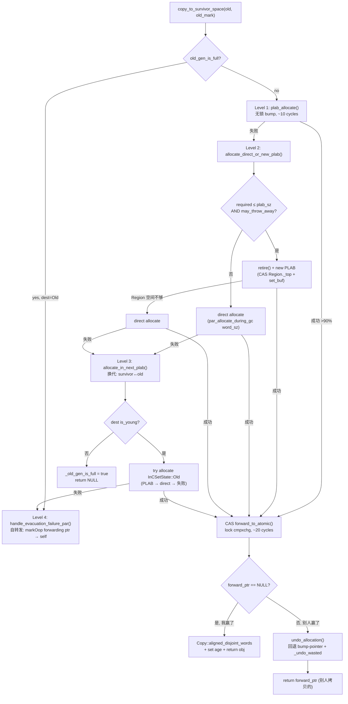
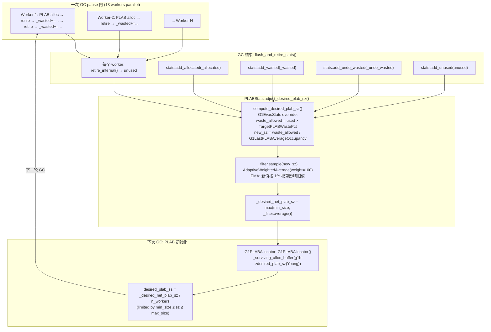

# 10-PLAB — GC worker 侧的 TLAB：为什么 GC worker 不能直接用 mutator 的分配方式？

> **标准环境**：OpenJDK 11 slowdebug build | `-Xms8g -Xmx8g -XX:+UseG1GC` | 64-bit Linux x86  
> **G1 Region**：4MB，2048 Regions | `#ifdef ASSERT` 全部生效  
> **前置依赖**：`[01-HeapRegion]`（Region 的 `_top` bump-pointer、free_list、TAMS）+ `[02-ObjectAllocation]`（TLAB 五级降级链、G1Allocator 三组 AllocRegion）  
> **阅读收益**：理解 GC worker 侧的分配机制是理解 `[03-YoungGC]`（Evacuation）、`[08-MixedGC]` 和 `[09-FullGC]` 的前提——**所有 GC 类型的对象复制都经过 PLAB**。读完本文后，你将能回答：为什么 `copy_to_survivor_space` 先 allocate 再 CAS 而不是反过来？为什么 PLAB retire 必须填充 dummy object？为什么 PLAB 大小自适应调整是一个闭环？

---

## §〇 源文件清单

| # | 文件 | 模块 | 核心函数/类（行号已验证）| 本文角色 |
|---|------|------|---------------------------|---------|
| 1 | `plab.hpp` | gc/shared | `class PLAB`(L36), `_word_sz`(L39), `_bottom/_top/_end/_hard_end`(L40-43), `_allocated/_wasted/_undo_wasted`(L45-47), `AlignmentReserve`(L49), `invalidate()`(L53-59), `retire_internal()`(L63), `retire()`(L142), `class PLABStats`(L146), `_desired_net_plab_sz`(L154), `compute_desired_plab_sz()`(L169) | ★★★ PLAB 核心结构 + PLABStats |
| 2 | `plab.cpp` | gc/shared | `PLAB::PLAB()`(L44-53), `flush_and_retire_stats()`(L62-78), `retire()`(L80-82), `retire_internal()`(L84-91), `undo_allocation()`(L104-113), `PLABStats::adjust_desired_plab_sz()`(L147-190), `PLABStats::compute_desired_plab_sz()`(L192-203) | ★★★ retire + waste + adaptive |
| 3 | `plab.inline.hpp` | gc/shared | `allocate_aligned()`(L33-43), `PLABStats::add_allocated/wasted/unused`(L45-59) | ★★ bump-pointer 分配 + 原子统计 |
| 4 | `g1Allocator.hpp` | gc/g1 | `class G1PLABAllocator`(L127), `_surviving/_tenured_alloc_buffer`(L133-134), `_alloc_buffers[]`(L135), `_direct_allocated[]`(L145), `allocate_direct_or_new_plab()`(L164-166) | ★★★ GC 侧 PLAB 管理器 |
| 5 | `g1Allocator.cpp` | gc/g1 | `G1PLABAllocator::G1PLABAllocator()`(L267-279), `may_throw_away_buffer()`(L281-283), `allocate_direct_or_new_plab()`(L285-328), `undo_allocation()`(L330-332), `flush_and_retire_stats()`(L334-344) | ★★★ 三级分配降级 + 生命周期 |
| 6 | `g1Allocator.inline.hpp` | gc/g1 | `alloc_buffer()`(L65-71), `plab_allocate()`(L73-81), `allocate()`(L83-91) | ★★ inline PLAB bump + dest 路由 |
| 7 | `g1ParScanThreadState.cpp` | gc/g1 | `copy_to_survivor_space()`(L231-348): plab_allocate(L250)→allocate_direct_or_new_plab(L256)→allocate_in_next_plab(L258)→undo_allocation(L281/L345) | ★★★ PLAB 使用者视角（四级调用链）|
| 8 | `g1ParScanThreadState.hpp` | gc/g1 | `class G1ParScanThreadState`(L45), `_plab_allocator`(L52), `_surviving_young_words`(L72), `allocate_in_next_plab()`(L189-192) | ★★ per-worker 状态 |
| 9 | `g1EvacStats.hpp` | gc/g1 | `class G1EvacStats : public PLABStats`(L31), `_region_end_waste`(L33), `_direct_allocated`(L35), `compute_desired_plab_sz()`(L56) | ★ PLABStats 的 G1 子类 |
| 10 | `g1EvacStats.cpp` | gc/g1 | `compute_desired_plab_sz()`(L49-91): TargetPLABWastePct + G1LastPLABAverageOccupancy 公式 | ★ G1 专用自适应算法 |

> 本文跨越 `gc/shared/`（PLAB 通用结构 + PLABStats）和 `gc/g1/`（G1PLABAllocator + G1EvacStats）。核心叙事线是：**GC worker 如何用 per-worker buffer + 多 worker 共享 Region CAS bump 解决并行分配问题**。

---

## §一 ★ 全景 — GC worker 的分配问题

### ❓ 为什么 GC worker 不能直接用 mutator 的 TLAB？

读完 `[02-ObjectAllocation]` 后你知道 mutator 线程通过 TLAB 做无锁 bump-pointer 分配，~10 cycles，极快。直觉答案"TLAB 是 thread-local 的，GC worker 没有 TLAB"是错的——GC worker **也可以有自己的** thread-local buffer。真正的问题是**第 5 层**：

**TLAB 能无锁的前提是"一个 Region 同时只有一个线程在写"**——mutator 的 Eden Region 被恰好一个 Java 线程独占（因为 JVM 并发策略是：让每个 Java 线程从 `free_list` 领一个独立的 Eden Region 建立 TLAB，多个线程的 TLAB 永远在不同的 Region）。但 GC worker 并行 Evacuation 时，情况完全不同：**13 个 GC worker 同时向同一个 Survivor Region 拷贝对象**。

如果每个 worker 没有自己的 buffer 而直接 CAS `Region._top`：
- 13 个 worker × 每次分配都 CAS → **每次 CAS 都触发 lock prefix（即使无竞争也锁总线）→ ~20 cycles × 每次分配**
- 随着 worker 数量增加，CAS retry loop 退化为 **O(n²) 竞争**：worker A CAS 成功的同时 worker B CAS 失败→retry→B 成功的同时 C 失败→retry...

**PLAB 的设计哲学**：把"需要 CAS 的分配"压缩到"偶尔 retire 时才 CAS 申请新 buffer"→ 大部分分配在 PLAB 内部用无锁 bump 完成。这是 **amortized locking** 的经典应用。

```
mutator 分配模型:                        GC worker 分配模型:
┌──────────────────────┐                ┌──────────────────────────────────┐
│ Thread-1 → Eden-A    │                │ Worker-1 ─┐                      │
│ Thread-2 → Eden-B    │                │ Worker-2 ─┤                      │
│ Thread-3 → Eden-C    │                │ Worker-3 ─┤  all → Survivor-X    │
│ (每个线程独占 Region) │                │  ...      ┤  (多 worker 共享     │
│ (无竞争, bump 无锁)   │                │ Worker-N ─┘   一个 Region._top) │
└──────────────────────┘                └──────────────────────────────────┘
         ↑                                          ↑
    TLAB: per-thread 独占 Region            PLAB: per-worker 独占 buffer
    bump 无锁 ~10 cycles                   bump 无锁 ~10 cycles
                                            refill: CAS Region._top ~20 cycles
```

**追问：为什么 PLAB 这么小（几 KB），而 TLAB 这么大（~MB）？**

PLAB 只在一次 GC pause 内使用（几十到几百 ms），每个 worker 在此窗口内处理的存活对象总计几 KB 到几十 KB。TLAB 跨两次 GC 之间的整段 mutator phase（可能数秒），期间分配数十 MB 对象。

GC log 验证（`-Xlog:gc+plab=trace`）：
```
PLAB: gc workers: 13
survivor PLAB size: 4K desired, 4K actual
old PLAB size: 16K desired, 16K actual
```

**追问：如果让每个 GC worker 独占一个完整 Survivor Region（4MB），而不是用 PLAB，会怎样？**

→ 13 × 4MB = 52MB 的 Survivor → 远超实际存活量（通常几 MB）→ Region 利用率极低（<5%）→ 大量堆空间被"预留但不使用"浪费。而且 survivor Region 有数量上限（`G1NewSizePercent`=5% → 约 102 个 Region，见 `[01-HeapRegion §七]`），不能无限分配。

### 1.1 ★ PLAB vs TLAB 对比表（≥10 行）

| 维度 | TLAB | PLAB |
|------|------|------|
| **使用者** | mutator Java 线程 | GC worker 线程 |
| **Region 独占** | ✅ 是（一个 Region 同期只被一个线程写） | ❌ 否（多 worker CAS 共享 Region._top） |
| **分配锁（buffer 内）** | bump 无锁 | bump 无锁（同构） |
| **buffer refill 锁** | Heap_lock（全局大锁）+ CAS | FreeList_lock（细粒度锁）+ CAS |
| **生命周期** | 跨 mutator phase（两次 GC 之间，数秒） | 单个 GC pause 内（几十到几百 ms） |
| **大小** | ~100KB-2MB（per-thread 自适应） | ~1KB-16KB（per-worker, GC 内动态变化） |
| **retire 方式** | `make_parsable(retire=true)`: fill dummy + 释放 Region（可选 retain 剩余继续用） | `retire_internal()`: fill dummy + invalidate 三指针（强制，必须保持 Region parseable） |
| **waste 处理** | `_gc_waste` + `_fast_refill_waste` + `_slow_refill_waste` → GlobalTLABStats | `_wasted`(per-retire) + `_unused`(GC 结束时最后一个 PLAB) → PLABStats 闭环 |
| **统计反馈** | GlobalTLABStats → per-thread `_desired_size` 自适应 | PLABStats 闭环（`compute_desired_plab_sz` → `_filter` EMA → `_desired_net_plab_sz`） |
| **Region 切换锁** | Heap_lock（全局互斥锁） | FreeList_lock（仅 region 切换时持有，粒度更细） |
| **换 Region 策略** | ✅ 有（free_list 空 = panic button → 触发 GC） | ✅ 变体：换代（Survivor→Old）而非换新 Region（GC 内不会真没空间，真没了 = Evacuation Failure） |
| **prefetch 优化** | ✅ `_pf_top`（C2 为 mutator 生成 prefetch 指令） | ❌ 无 `_pf_top`（C2 不为 GC worker 生成 prefetch，生命周期太短无意义） |
| **per-buffer 自适应字段** | `_desired_size`、`_refill_waste_limit`（per-TLAB 独立调优） | 无（PLAB 大小由集中式 PLABStats 统一管理，所有 worker 的 PLAB 大小相同） |
| **分配耗时** | ~10 cycles（CPU 流水线） | ~10 cycles（相同 CPU 流水线，同构 bump） |
| **retire 触发** | TLAB 满（无空间满足当前对象）时 refill | PLAB 满（无空间满足当前对象）→ 判断对象能否放进**全新空 PLAB** + relative waste 是否可接受 → retire + new PLAB 或 direct |

### ❓ 为什么 PLAB 没有 `_pf_top`？

`_pf_top`（prefetch watermark）是 C2 JIT 编译器为 mutator 生成的 prefetch 指令——在分配一个大对象之前，先 prefetch 下一个即将被分配的地址到 L1 cache，减少 cache miss。但 **C2 不为 GC worker 生成 prefetch 指令**——GC worker 在 JVM 内部运行，没有 JIT 编译器参与。而且 PLAB 生命周期太短（一个 GC pause 内），prefetch 的加速效果微乎其微。

---

## §二 ★★ PLAB 结构 — GC worker 的 bump-pointer 缓冲区

### ❓ PLAB 为什么需要两个边界（`_end` 和 `_hard_end`）？

PLAB 内部有四个指针，比 TLAB 多了一个关键区分：

```
PLAB 内存布局:
┌──────────────────────────────────────────────────────────┐
│ 已分配对象区 │  可分配区    │ 对齐保护区 │
├──────────────┼──────────────┼────────────┤
│ _bottom      │ _top         │ _end       │ _hard_end
│              │              │            │
│  ← used →   │ ← free →    │←Alignment→│
│              │              │ Reserve   │
└──────────────┴──────────────┴────────────┘
        ↑                        ↑            ↑
    bump-pointer           软边界        硬边界
   (无锁 bump)           (分配用的末尾) (buffer 物理末尾)
```

**为什么不是直接一个 `_end`**（像 TLAB 那样 `_end` 就是可分配的末尾）？

PLAB 在 retire 时必须调用 `fill_with_dummy_object(_top, _hard_end)`（见 §五）——这个操作从 `_top` 一直写到 `_hard_end`，**包括 AlignmentReserve 区域**。如果在 PLAB 初始化时直接把 `_hard_end` 用作分配边界，那么当 `_top` 刚好到 `_hard_end` 时，retire 时 `_top == _hard_end` → `fill_with_dummy_object` 没有空间可写 → 没法保证 retire 后的 Region parseable。

源码注释直接说明了原因（`plab.cpp:55-59`）：
```cpp
// If the minimum object size is greater than MinObjAlignment, we can
// end up with a shard at the end of the buffer that's smaller than
// the smallest object.  We can't allow that because the buffer must
// look like it's full of objects when we retire it, so we make
// sure we have enough space for a filler int array object.
```

关键句："the buffer must look like it's full of objects when we retire it"——PLAB retire 后，从 `_bottom` 到 `_hard_end` 的整个区间必须 parseable（能按对象格遍历）。`AlignmentReserve` 确保无论 `_top` 在 retire 时指向哪里，到 `_hard_end` 之间始终至少有 `arrayOopDesc::header_size(T_INT)` = 24 bytes 的空间可以写 filler array object。

源码 `plab.cpp:44-53`：
```cpp
PLAB::PLAB(size_t desired_plab_sz_) :
  _word_sz(desired_plab_sz_), _bottom(NULL), _top(NULL),
  _end(NULL), _hard_end(NULL), _allocated(0), _wasted(0), _undo_wasted(0)
{
  AlignmentReserve = oopDesc::header_size() > MinObjAlignment 
                     ? align_object_size(arrayOopDesc::header_size(T_INT)) 
                     : 0;
}
```

**追问：为什么 `AlignmentReserve` 用 `arrayOopDesc::header_size(T_INT)`？（`plab.hpp:49` + `plab.cpp:49`）**

`arrayOop` 是 HotSpot 中对齐要求最严格的对象类型：
- 需对齐到 `sizeof(jdouble) = 8 字节`
- header 大小 = `sizeof(arrayOopDesc) = 16 bytes`（64 位下：`_mark` 8B + `_metadata` 8B） + `sizeof(jint length) = 4 bytes` → 对齐后 = 24 bytes
- `arrayOopDesc::header_size(T_INT)` = `24 / HeapWordSize` = `24 / 8` = **3 words**
- `align_object_size(3)` = 根据 `ObjectAlignmentInBytes` 对齐 → 通常 = **3 words**

在 `ObjectAlignmentInBytes == 8` 的标准配置下，`AlignmentReserve = align_object_size(arrayOopDesc::header_size(T_INT)) = 3 words = 24 bytes`。这个空间用于确保 PLAB 末尾始终有足够空间存放一个 filler array object（dummy fill 的最小单元），让 Region 在 retire 后仍然 parseable。

**设计替代分析**：如果不用 `AlignmentReserve`，直接用 `_hard_end` 作分配边界 → 最后一个对象的对齐需求越过 `_hard_end` → 写入越界（heap corruption）。TLAB 也有类似设计（`_allocation_end` vs `_end`，其中 `_allocation_end + alignment_reserve = _end`），但 TLAB 的 reserve 还有防止 C2 prefetch 越界的作用——PLAB 没有 prefetch，所以 reserve 纯粹是**对齐安全 + dummy fill 可用性**。

### 2.1 PLAB 字段全景

```
class PLAB: public CHeapObj<mtGC> {
protected:
  char      head[32];          // 32B sentinel (内存越界检测, ASSERT only)
  size_t    _word_sz;          // buffer 总 size (in HeapWord)
  HeapWord* _bottom;           // buffer 起始（分配起点, set_buf 时绑定）
  HeapWord* _top;              // bump-pointer（当前已分配末尾, allocate 推进）
  HeapWord* _end;              // 软边界（= _hard_end - AlignmentReserve, 分配检查用）
  HeapWord* _hard_end;         // 硬边界（buffer 物理末尾, = _bottom + _word_sz）

  size_t    _allocated;        // 累计申请的 PLAB buffer 总容量（每次 set_buf 累加 word_sz, 非对象分配量）
  size_t    _wasted;           // retire 时产生的内部碎片（dummy fill 部分, retire 时累加）
  size_t    _undo_wasted;      // CAS forward 失败 undo 时丢失的空间（undo_allocation 时累加）
  char      tail[32];          // 32B sentinel (尾部守卫)

  static size_t AlignmentReserve;  // 对齐保护区大小（全局静态, 一次计算全局复用）
};
```

| 字段 | 粒度 | 含义 | 与 TLAB 对应 |
|------|------|------|-------------|
| `_bottom` | HeapWord* | buffer 起始地址 | ~ TLAB.`_start` |
| `_top` | HeapWord* | bump-pointer | ~ TLAB.`_top` |
| `_end` | HeapWord* | 可分配尾部（软边界） | ~ TLAB.`_allocation_end` |
| `_hard_end` | HeapWord* | 绝对硬边界 | ~ TLAB.`_end` (= `_allocation_end + alignment_reserve`) |
| `_word_sz` | HeapWord 数 | buffer 总大小 | ~ TLAB.`_desired_size` |
| `AlignmentReserve` | HeapWord 数 | 对齐保护 | ~ TLAB.`alignment_reserve()` |

**为什么 PLAB 比 TLAB 多了 `_allocated/_wasted/_undo_wasted` 三个统计字段？**

→ TLAB 的统计字段分散在 `_number_of_refills`、`_gc_waste`、`_slow_allocations` 等——分散是因为 TLAB 跨 GC 生命周期长，需要在不同时机（GC 中/refill 时/退出时）分别统计不同维度的浪费。

PLAB 在 **一个 GC pause 内**经历多次 retire（生命周期短、retire 频繁），三个统计字段是对 PLAB 整个生命周期**统一建模**的最小充分集合：`_allocated` 记录累计申请的 buffer 总容量（Σword_sz）、`_wasted` 记录每次 retire 的碎片、`_undo_wasted` 记录 CAS undo 的损失。这三个字段在 `flush_and_retire_stats` 时一次性汇入 PLABStats。

**为什么 PLAB 没有 `_desired_size` 字段？**

→ **PLAB 大小由集中式 PLABStats 统一管理**——一次 GC 内所有 worker 的 PLAB 大小相同（由 `desired_plab_sz(n_workers)` 计算，存储在 `PLABStats._desired_net_plab_sz`）。TLAB 是 per-thread 分散自适应，每个 TLAB 需要自己的 `_desired_size`。

### 2.2 `set_buf()` — 从 Region 切一块绑定到 PLAB

源码 `plab.hpp:122-133`：
```cpp
void set_buf(HeapWord* buf, size_t new_word_sz) {
  assert(new_word_sz > AlignmentReserve, "Too small");
  _word_sz = new_word_sz;

  _bottom   = buf;
  _top      = _bottom;                      // bump-pointer 从 buf 起始开始
  _hard_end = _bottom + word_sz();          // 物理末端
  _end      = _hard_end - AlignmentReserve;  // 软边界（留 AlignmentReserve 保护）
  assert(_end >= _top, "Negative buffer");

  _allocated += word_sz();   // 计入分配统计（set_buf 是 buffer 级分配，会被 flush）
}
```

**关键细节**：`set_buf` 一次性绑定四个指针后，`allocate()` 在 PLAB 内部只是简单的 `_top += word_sz`（无 CAS、无屏障）——因为每个 worker 的 PLAB 是独占的（per-worker），不存在跨 worker 的 bump 竞争。

### 2.3 `allocate()` — 内联无锁 bump

源码 `plab.hpp:87-95`：
```cpp
HeapWord* allocate(size_t word_sz) {
  HeapWord* res = _top;
  if (pointer_delta(_end, _top) >= word_sz) {
    _top = _top + word_sz;
    return res;
  } else {
    return NULL;
  }
}
```

**这和你熟悉的 TLAB bump 是同构的**：读 `_top` → 加 word_sz → 检查 `_end` → 写回。所有操作都在 L1 cache 中，无 CAS、无内存屏障，~10 cycles。

区别在于：返回 NULL 后，TLAB refill 走 `Heap_lock + 换 Region`（慢路径 ~1000 cycles）；PLAB refill 走 `retire + CAS Region._top + set_buf`（中等路径 ~100-500 cycles）——**因为 GC 期间不需要 Heap_lock**（下文 §三详解）。

---

## §三 ★★★ 四级分配降级链 — `copy_to_survivor_space` 中的逐级退路

### ❓ 为什么先 allocate 再 CAS forward，而不是先 CAS 再 allocate？

这是面试中最爱问的 PLAB 问题。源码 `g1ParScanThreadState.cpp:231-348` 给出了完整答案。

先看整体调用链（`copy_to_survivor_space` 的四级）：

```
copy_to_survivor_space(state, old, old_mark)
│
├─ Level 1 (L250): _plab_allocator->plab_allocate(dest_state, word_sz)    ~10 cycles, >90% 命中
│   └─ 成功 → obj_ptr != NULL → 继续到 CAS forward
│
├─ Level 2 (L256): _plab_allocator->allocate_direct_or_new_plab(dest, word_sz, &refill_failed)   ~100-500 cycles
│   └─ 内部: retire + CAS Region._top + set_buf + plab_allocate (new buffer)
│
├─ Level 3 (L258): allocate_in_next_plab(state, &dest, word_sz, refill_failed)   ~500-1000 cycles
│   └─ 换代: survivor↔old 切换, 再走 Level 1-2
│
├─ Level 4 (L264): handle_evacuation_failure_par(old, old_mark)   自转发
│   └─ markOop 转发指针指向自己
│
└─ CAS forward (L290): old->forward_to_atomic(obj, memory_order_relaxed)   ~20 cycles
    ├─ 成功 (forward_ptr == NULL): Copy::aligned_disjoint_words → set age → return obj
    └─ 失败 (forward_ptr != NULL): _plab_allocator->undo_allocation(dest_state, obj_ptr, word_sz)
                                   return forward_ptr   (别人先 CAS 成功了, 我退回分配)
```

**完整决策 Mermaid 图：**



### ❓ 为什么先 allocate 再 CAS，不是先 CAS 再 allocate？

先看源码的完整逻辑（`g1ParScanThreadState.cpp:286-347`）：

```cpp
// L286: 先 allocate 了 → obj_ptr 已经指向分配好的空间
const oop obj = oop(obj_ptr);
// L290: 然后 CAS forward
const oop forward_ptr = old->forward_to_atomic(obj, memory_order_relaxed);
if (forward_ptr == NULL) {
  // 我赢了: 把旧对象内容拷贝到我预分配的空间
  Copy::aligned_disjoint_words((HeapWord*) old, obj_ptr, word_sz);
  // ... set age, return obj
} else {
  // 别人赢了: 回退我的预分配
  _plab_allocator->undo_allocation(dest_state, obj_ptr, word_sz);
  return forward_ptr;  // 返回别人已经拷贝好的新对象
}
```

**为什么先 allocate 是最优设计？** 原因有三：

**1. 竞争概率极低**：G1ParScanThreadState 有自己的 task queue，Evacuation 时**同一个旧对象只被一个 worker 出队处理**（任务分配时就避免了重复）。只有跨 Region 引用导致两个 worker 同时通过不同路径看到同一对象时才会竞争——概率接近 0。

**2. 乐观假设对路径长度的收益**：在低竞争场景下，先 allocate → PLAB bump（~10 cycles, 不阻塞其他 worker）→ CAS forward（~20 cycles）→ 绝大多数情况下 `forward_ptr == NULL`（无竞争）→ 直接 memcpy。**总开销 ≈ 10 + 20 = 30 cycles**。

**3. 悲观场景的代价可控**：万一发生竞争（概率 ~1%），`undo_allocation` 只需要回退 bump-pointer + 记录 waste stats——**代价远小于让 13 个 worker 在同一个 CAS 上排队等待**。如果先 CAS：
```
Worker-0: CAS forward → win → 之后才 allocate space → memcpy     (Worker-0 持有锁~50 cycles)
Worker-1: CAS forward → fail → retry → fail → retry → ...       (N 个 worker 白等 CAS)
```

先 allocate 的好处是：**所有 worker 并行做无锁 PLAB bump，互不阻塞；只有一个 barrier point（CAS forward）需要竞争**——这正是 Amdahl's Law 最优化。

### 3.1 Level 1: `plab_allocate()` — 无锁 bump, ~10 cycles, >90% 命中

源码 `g1Allocator.inline.hpp:73-81`：
```cpp
inline HeapWord* G1PLABAllocator::plab_allocate(InCSetState dest, size_t word_sz) {
  PLAB* buffer = alloc_buffer(dest);
  if (_survivor_alignment_bytes == 0 || !dest.is_young()) {
    return buffer->allocate(word_sz);            // 无对齐, 直接 bump
  } else {
    return buffer->allocate_aligned(word_sz, _survivor_alignment_bytes);  // Survivor 对齐分配
  }
}
```

`_survivor_alignment_bytes` 大部分情况下是 **0**（因为 `SurvivorAlignmentInBytes == ObjectAlignmentInBytes`，`g1Allocator.cpp:255-264`），所以通常走简单的 `buffer->allocate(word_sz)`。

**GDB 验证 PLAB 的 `_top` bump**（在 `G1ParScanThreadState` 上下文中断点）：
```
(gdb) p this->_plab_allocator->_surviving_alloc_buffer._top
$1 = (HeapWord *) 0x7fffbc001000
(gdb) p this->_plab_allocator->plab_allocate(InCSetState::Young, 24)  # 分配 24 words
(gdb) p this->_plab_allocator->_surviving_alloc_buffer._top
$2 = (HeapWord *) 0x7fffbc0010c0   # _top 前进了 24*8=192 bytes
```

### 3.2 Level 2: `allocate_direct_or_new_plab()` — retire + new PLAB / direct

详细分析见 §六，此处先概述。

当 PLAB 空间不够当前对象时，调用 `allocate_direct_or_new_plab`（`g1Allocator.cpp:285-328`）：

**关键澄清**：这里不检查当前 PLAB 还剩多少空间——而是问两个问题：
1. 计算 `required_in_plab = word_sz + AlignmentReserve`（对象 + 对齐保护放进一个全新空 PLAB 所需的最小空间）
2. 如果 `required_in_plab ≤ desired_plab_sz`（对象能放进一个全新空 PLAB）**且** `may_throw_away_buffer`（相对浪费可接受）→ **retire 旧 PLAB + 申请新 PLAB**
3. 否则 → **直接分配**（跳过 PLAB，直接 CAS Region._top 分给对象本身）

**追问**：为什么是"能否放进全新空 PLAB"而不是"当前 PLAB 还剩多少"? 因为 retire 旧 PLAB 后申请的是全新 buffer——一旦决定走 new PLAB 路径，旧 PLAB 就被 fill dummy + invalidate 废弃了，后续分配在新 buffer 上进行。看代码 `g1Allocator.cpp:310`: `alloc_buf->set_buf(buf, actual_plab_size)`——这是一个新的独立 buffer，和旧 PLAB 没有任何关系。

步骤 2 的 new PLAB 申请路径：
```cpp
alloc_buf->retire();                                      // fill dummy + invalidate 旧 PLAB
buf = _allocator->par_allocate_during_gc(dest,            // 从 Region 申请新空间
        required_in_plab, plab_word_size, &actual_plab_size);
if (buf != NULL) {
  alloc_buf->set_buf(buf, actual_plab_size);              // 绑定新 buffer
  obj = alloc_buf->allocate(word_sz);                     // 在新 PLAB 中分配
  return obj;
}
// buf == NULL → Region 空间不够申请新 PLAB → goto direct
```

### 3.3 Level 3: `allocate_in_next_plab()` — 换代 (survivor ↔ old)

源码 `g1ParScanThreadState.cpp:159-199`：

```cpp
HeapWord* G1ParScanThreadState::allocate_in_next_plab(
    InCSetState const state, InCSetState* dest, size_t word_sz,
    bool previous_plab_refill_failed) {

  if (dest->is_young()) {
    // ★ 当前目标是 Survivor，Survivor 满了 → 尝试 Old
    HeapWord* const obj_ptr = _plab_allocator->allocate(
        InCSetState::Old, word_sz, &plab_refill_in_old_failed);

    // 如果 survivor PLAB refill 也失败了，说明 survivor 空间真不够了
    // → 设置 tenuring_threshold = 0 (所有活对象直接升老年代)
    if (previous_plab_refill_failed) {
      _tenuring_threshold = 0;
    }

    if (obj_ptr != NULL) {
      dest->set_old();   // ★ 切换目标: 这个对象去 Old
      return obj_ptr;
    } else {
      _old_gen_is_full = plab_refill_in_old_failed;
    }
    return obj_ptr;
  } else {
    // ★ 当前目标已经是 Old，也失败了
    _old_gen_is_full = previous_plab_refill_failed;
    return NULL;
  }
}
```

**追问：为什么不直接 Evacuation Failure 还要先换代试试？**

因为多数活对象去 Survivor——但如果当前 Survivor Region 满了（`_top >= _end`），Old Gen 常常还有空间。换代是**廉价退路**（重新走 Level 1-2 在 Old Gen PLAB 中尝试分配），比直接触发 Evacuation Failure（把整个 Region 标记为失败）代价低得多。

当 Survivor 满了 → `previous_plab_refill_failed == true` → `_tenuring_threshold = 0` → 后续所有 young 对象直接走 Old → **这是一次性决策：一旦 Survivor 不够，不再尝试 allocation 到 Survivor**，避免反复进入 `allocate_in_next_plab` 慢路径。

### 3.4 Level 4: `handle_evacuation_failure_par()` — 自转发

当所有路径（Level 1→2→3）都失败时，调用 `handle_evacuation_failure_par(old, old_mark)`：
- 将 `old` 的 markOop 中的 forwarding pointer 设置为指向自己（self-forward）
- 该 Region 被标记为 Evacuation Failed → 将在后续 GC 中作为 Old Region 保留，不会释放
- 详见 `[03-YoungGC §3.5]`

### 3.5 `undo_allocation()` — CAS forward 失败的回滚

源码 `plab.cpp:104-113`：
```cpp
void PLAB::undo_allocation(HeapWord* obj, size_t word_sz) {
  if (contains(obj)) {
    // obj 在当前 PLAB 内 → 简单回退 _top
    undo_last_allocation(obj, word_sz);   // _top = obj (回退 bump-pointer)
  } else {
    // obj 不在当前 PLAB (可能已经 retire 了) → fill dummy + _undo_wasted
    add_undo_waste(obj, word_sz);
    // fill_with_dummy_object(obj, obj+word_sz)  // 防止区域 parseable 断裂
    // _undo_wasted += word_sz                   // 只统计，不影响 _wasted
  }
}
```

**关键区分 `_wasted` vs `_undo_wasted`**：
- `_wasted`：retire 时的 dummy fill 碎片 → 用于计算 PLAB 期望大小（PLABStats.compute_desired_plab_sz 用到）
- `_undo_wasted`：CAS forward 失败时的回退浪费 → **不用于**计算 PLAB 大小，仅用于日志统计

问：**为什么 `_undo_wasted` 不参与 PLAB 大小计算？**

→ 因为 `undo_allocation` 不是 PLAB 设计缺陷导致的浪费——它是 multi-worker 竞争的正常产物（而且概率极低）。把 undo waste 计入 sizing 会让 PLAB 人为缩小，反而降低效率。

---

## §四 ★★ G1PLABAllocator — 三组 PLAB 的统一管理

### ❓ 为什么分 surviving / tenured 两组 PLAB，而不是所有对象共用同一组？

源码 `g1Allocator.hpp:127-178`：

```cpp
class G1PLABAllocator : public CHeapObj<mtGC> {
private:
  G1CollectedHeap* _g1h;
  G1Allocator* _allocator;

  PLAB  _surviving_alloc_buffer;        // 嵌入的 Survivor PLAB
  PLAB  _tenured_alloc_buffer;          // 嵌入的 Old PLAB
  PLAB* _alloc_buffers[InCSetState::Num];  // 索引数组: [Young] → _surviving, [Old] → _tenured

  const uint _survivor_alignment_bytes;
  size_t _direct_allocated[InCSetState::Num];
};
```

**为什么需要独立的两组？** 三个原因：

1. **目标 Region 不同**：Survivor PLAB → 从 Survivor GC Alloc Region 申请空间（由 `_survivor_gc_alloc_region` 管理），Old PLAB → 从 Old GC Alloc Region 申请空间（由 `_old_gc_alloc_region` 管理）。两者在 `G1Allocator` 中对应不同的 Region 池（见 `[02-ObjectAllocation §四]`）。

2. **大小独立自适应**：Survivor 存活对象通常较小（young objects），Old 对象可能较大。两组 PLAB 各自维护独立的 PLABStats（`_survivor_evac_stats` vs `_old_evac_stats`），独立计算 `desired_plab_sz`，避免了 single-size-fits-all 的低效。

3. **换代是高频操作**：GC 内每个 worker 会反复在 Survivor→Old 之间切换（Level 3 allocate_in_next_plab）。如果共用一组 PLAB → 每次换代需要清空 PLAB → 频繁的 retire + set_buf → 大量 waste。独立两组 → 换代时只切换 `_alloc_buffers[dest]` 索引 → O(1) 操作。

### 4.1 G1PLABAllocator 初始化

源码 `g1Allocator.cpp:267-279`：
```cpp
G1PLABAllocator::G1PLABAllocator(G1Allocator* allocator) :
  _g1h(G1CollectedHeap::heap()),
  _allocator(allocator),
  _surviving_alloc_buffer(_g1h->desired_plab_sz(InCSetState::Young)),  // 初始大小来自上次 GC 的统计
  _tenured_alloc_buffer(_g1h->desired_plab_sz(InCSetState::Old)),
  _survivor_alignment_bytes(calc_survivor_alignment_bytes()) {
  for (uint state = 0; state < InCSetState::Num; state++) {
    _direct_allocated[state] = 0;
    _alloc_buffers[state] = NULL;
  }
  _alloc_buffers[InCSetState::Young] = &_surviving_alloc_buffer;  // 建立索引
  _alloc_buffers[InCSetState::Old]  = &_tenured_alloc_buffer;
}
```

**关键**：PLAB 的初始 `_word_sz` 来自 `_g1h->desired_plab_sz(dest)`——即**上次 GC 结束后 PLABStats 计算出的期望大小**。这形成了闭环（§五详解）。

### 4.2 从 G1Allocator 到 G1PLABAllocator 的桥接

当 PLAB 需要 refill（申请新 buffer）时，调用 `_allocator->par_allocate_during_gc(dest, min, desired, &actual)`：

```cpp
// g1Allocator.cpp:185-199
HeapWord* G1Allocator::par_allocate_during_gc(InCSetState dest, ...) {
  switch (dest.value()) {
    case InCSetState::Young:
      return survivor_attempt_allocation(min, desired, actual);  // → CAS Survivor GC Alloc Region
    case InCSetState::Old:
      return old_attempt_allocation(min, desired, actual);        // → CAS Old GC Alloc Region
  }
}
```

`survivor_attempt_allocation` / `old_attempt_allocation` 的锁协议（`g1Allocator.cpp:202-252`）：
1. 先 fast path：CAS bump Region._top（无锁）
2. 失败 → 持 `FreeList_lock` → `attempt_allocation_locked` → 从 free_list 取新 Region → 绑定
3. 再失败 → 标记 survivor/old_full → 返回 NULL

详见 `[02-ObjectAllocation §4.3]`（mutator 侧），GC worker 侧唯一区别是：**不需要 Heap_lock**——因为 GC 期间所有 mutator 已停在 safepoint。

---

## §五 ★★ PLAB 生命周期 — retire / flush_and_retire / undo

### ❓ 为什么 PLAB 的 retire 必须填充 dummy object？

源码 `plab.cpp:84-91` + `plab.hpp:53-59`：

```cpp
size_t PLAB::retire_internal() {
  size_t result = 0;
  if (_top < _hard_end) {
    Universe::heap()->fill_with_dummy_object(_top, _hard_end, true);  // ★ 填充 dummy
    result += invalidate();    // 返回 _hard_end - _top (old top)
  }
  return result;
}

size_t invalidate() {
  _end    = _hard_end;
  size_t remaining = pointer_delta(_end, _top);
  _top    = _end;       // 强制后续 allocate() 返回 NULL
  _bottom = _end;       // 强制后续 contains() 返回 false
  return remaining;
}
```

PLAB retire 三步：
1. **`fill_with_dummy_object(_top, _hard_end)`** — 把 `[_top, _hard_end)` 区间填成一个 int array dummy object，使区间 parseable
2. **`invalidate()`** : `_end = _hard_end; _top = _end; _bottom = _end;` — 三个指针全重置到 `_hard_end`，后续 allocate() 返回 NULL、contains() 返回 false
3. **返回 remaining = `_hard_end - _top(old)`** → 这就是 `_wasted`

**追问：为什么不填 dummy 会怎样？**

GC 结束前要遍历 Region 计算 liveness：`object_iterate(bottom(), top())`——每一步需要从当前对象 header 读 `size()` 跳到下一个对象。如果 PLAB retire 后的 `[_top, _hard_end)` 区间是未初始化的垃圾内存 → `object_iterate` 读到随机值作 `size()` → 按照"对象大小"跳到一个错误地址 → **segfault**。

**TLAB 为什么也有 `fill_with_dummy_object`？（`threadLocalAllocBuffer.cpp:127`）**

TLAB retire 确实也填充了 dummy object，但两者动机同构：
- TLAB：多个 TLAB 来自同一个 Eden Region → GC 扫描 Eden 时需要整个 Region 连续 parseable
- PLAB：多个 worker 的 PLAB 残留在同一个 Survivor Region → GC 结束时同样需要连续 parseable

**区别在于保留机制**：TLAB 有 `_retained_alloc_region` 机制——retire 后如果 Region 还有可观空间，会被保留供下次分配复用（remainder 不用 fill dummy，下次直接从 `_top` 继续）。PLAB 没有 retained 概念——剩余空间直接 fill dummy，空间浪费计入 `_wasted`。**为什么 PLAB 不保留？** 因为 PLAB 生命周期实在太短（GC pause 内），retain 剩余的几字节没意义——下次 retire 可能在另一个 Region 了。

### 5.1 `retire()` vs `flush_and_retire_stats()` — 两种退休

| 调用时机 | 函数 | 做了什么 | 统计去向 |
|---------|------|---------|---------|
| GC 中间（PLAB 满, 需要新 buffer） | `retire()` | fill_dummy + invalidate + `_wasted += ...` | `_wasted` 累加在 PLAB 内（GC 结束时 flush） |
| GC 结束时（所有 PLAB 废弃） | `flush_and_retire_stats(stats)` | `retire_internal()` → `stats->add_allocated/_wasted/_undo_wasted/_unused` | **一次性**汇入 PLABStats |

源码 `plab.cpp:62-78`：
```cpp
void PLAB::flush_and_retire_stats(PLABStats* stats) {
  size_t unused = retire_internal();    // ★ 最后一个 PLAB 的剩余 = _unused, 不算 _wasted

  stats->add_allocated(_allocated);     // 累计 buffer 总容量（所有 set_buf 的 word_sz 之和）
  stats->add_wasted(_wasted);           // 每次 retire 产生的碎片
  stats->add_undo_wasted(_undo_wasted); // undo 产生的浪费
  stats->add_unused(unused);            // 最后一个未退休 PLAB 的剩余 → 单独列

  _allocated   = 0;  // 清空, 防止跨 GC 污染
  _wasted      = 0;
  _undo_wasted = 0;
}
```

**关键区分 `_wasted` 和 `_unused`**：

```
_wasted 的来源:  per retire 的 dummy fill 碎片
                PLAB-1: [obj1][obj2][======dummy fill======]
                PLAB-2: [obj3][obj4][===dummy fill===]
                PLAB-3: [obj5][obj6][obj7][==dummy fill==]
                每次 retire(), _wasted += 各 PLAB 的 dummy fill 大小

_unused 的来源:  最后一个 PLAB 在 GC 结束时的剩余空间
                PLAB-4: [obj8][obj9][.................. 剩余空间未填充 ...............] 
                在 flush_and_retire_stats 时，retire_internal() 返回 unused
                → stats->add_unused(unused)  (不是 _wasted!)
```

**为什么 `_unused` 不是 `_wasted`？** → 因为 `_unused` 的空间在 GC 结束时会被 fill_with_dummy_object 处理（通过 `retire_internal`），但它在整个 PLAB 生命周期内**只有一次**（最后一个 PLAB），而 `_wasted` 是**每次 retire 都累加**。PLABStats 的自适应公式需要区分"per-retire 的碎片率"和"最后一次 flush 的剩余率"来计算目标 PLAB 大小。

### 5.2 ★ PLABStats 自适应闭环



**G1EvacStats 的自适应公式**（`g1EvacStats.cpp:49-91`）：

```cpp
size_t G1EvacStats::compute_desired_plab_sz() {
  // 实际使用（扣除 Region 尾部浪费，因为那是 Region 切换造成的, 不是 PLAB 的错）
  size_t const used_for_waste = used() > _region_end_waste 
                                ? used() - _region_end_waste : 0;

  // 允许的总浪费 = 有效使用量 × TargetPLABWastePct (默认 10%)
  size_t const total_waste_allowed = used_for_waste * TargetPLABWastePct;

  // PLAB 期望大小 = 允许总浪费 / 最后一个 PLAB 的平均空闲率
  // G1LastPLABAverageOccupancy = 0.5 (默认, 表示最后一个 PLAB 通常半满)
  size_t const cur_plab_sz = (size_t)((double)total_waste_allowed / G1LastPLABAverageOccupancy);
  return cur_plab_sz;
}
```

**G1EvacStats::compute_desired_plab_sz() 覆盖了 PLABStats::compute_desired_plab_sz()**。基类的公式（`plab.cpp:192-203`）更通用但不如 G1 版精确：

```cpp
// PLABStats::compute_desired_plab_sz() - 基类版本
size_t PLABStats::compute_desired_plab_sz() {
  size_t allocated = MAX2(_allocated, size_t(1));
  double wasted_frac = (double)_unused / (double)allocated;
  size_t target_refills = (size_t)((wasted_frac * TargetSurvivorRatio) / TargetPLABWastePct);
  if (target_refills == 0) target_refills = 1;
  size_t used = allocated - _wasted - _unused;
  size_t recent_plab_sz = used / target_refills;
  return recent_plab_sz;
}
```

G1 版本引入了 `_region_end_waste`（Region 切换产生的尾部浪费）——因为 Region 尾部浪费不是 PLAB 的责任（无论 PLAB 多大都会发生），所以从 `used()` 中扣除。

**追问：如果这个闭环断了（比如 `_unused` 没有计入 `compute_desired_plab_sz`）会怎样？**

→ `compute_desired_plab_sz` 低估真实浪费 → 建议更大的 PLAB → 下轮 GC 的 PLAB 更大 → waste 更高 → **恶性循环**（PLAB 无限扩大直到 `max_size()`）。

**追问：`AdaptiveWeightedAverage` 的衰减权重（默认 100）起到什么作用？**

→ 防止单次 GC 的异常值（如一次异常大的 Evacuation 产生极高的 waste）颠覆长期趋势。权重 100 意味着新值对当前值的影响 = 1/100 = 1%（EMA），类似指数移动平均。代码 `plab.cpp:184`：`_filter.sample(plab_sz)` → `_filter.average()` 返回平滑后的值。

---

## §六 ★ `allocate_direct_or_new_plab` 决策详解

### ❓ retire → new PLAB vs direct allocate 到底怎么选？

源码 `g1Allocator.cpp:285-328`，完整决策树：

```cpp
HeapWord* G1PLABAllocator::allocate_direct_or_new_plab(InCSetState dest,
                                                       size_t word_sz,
                                                       bool* plab_refill_failed) {
  size_t plab_word_size = _g1h->desired_plab_sz(dest);            // 目标 PLAB 大小
  size_t required_in_plab = PLAB::size_required_for_allocation(word_sz); // = word_sz + AlignmentReserve

  // ── 决策 1: 当前对象能不能放进 PLAB？ ──
  if ((required_in_plab <= plab_word_size) &&
    may_throw_away_buffer(required_in_plab, plab_word_size)) {

    // ★ 走 retire → new PLAB 路径
    PLAB* alloc_buf = alloc_buffer(dest);
    alloc_buf->retire();                              // 旧 PLAB 退休

    // 从 Region 申请一块新空间做 PLAB
    buf = _allocator->par_allocate_during_gc(dest,
            required_in_plab, plab_word_size, &actual_plab_size);

    if (buf != NULL) {
      alloc_buf->set_buf(buf, actual_plab_size);       // 绑定新 buffer
      obj = alloc_buf->allocate(word_sz);              // 在新 PLAB 中分配
      return obj;
    }
    // buf == NULL → Region 空间不够 → 标记 refill_failed
    *plab_refill_failed = true;
  }

  // ── 决策 2: 走 direct 路径 ──
  result = _allocator->par_allocate_during_gc(dest, word_sz);  // 直接分配, 不分 PLAB
  if (result != NULL) {
    _direct_allocated[dest.value()] += word_sz;                 // 记录跳过 PLAB 的分配
  }
  return result;
}
```

**决策的三个条件**：

| 条件 | 如果满足 | 如果不满足 |
|------|---------|-----------|
| `required_in_plab ≤ plab_word_size` | 对象能放入一个标准大小的 PLAB | 对象太大 → 跳过 PLAB, 直接走 direct |
| `may_throw_away_buffer(required, buffer_size)` | 当前 PLAB 的利用率太低（浪费 > 阈值）→ 退休换新 | PLAB 还有价值 → 保留（不 retire） |
| `par_allocate_during_gc` 成功 | Region 有空间 → 获得新 PLAB 或直接分配 ✅ | Region 空间不够 → 返回 NULL |

`may_throw_away_buffer` 的实现（`g1Allocator.cpp:281-283`）：
```cpp
bool may_throw_away_buffer(size_t const allocation_word_sz, size_t const buffer_size) const {
  return (allocation_word_sz * 100 < buffer_size * ParallelGCBufferWastePct);
}
```

条件解读：**当前对象占 buffer 的比例 < `ParallelGCBufferWastePct`（默认 10%）** → 对象太小 → PLAB 的 relative waste 太高 → retire 换新的。**如果 `allocation_word_sz * 100 ≥ buffer_size * ParallelGCBufferWastePct`** → 对象足够大 → 直接走 direct allocate，不浪费一次 retire 的 overhead。

**为什么 PLAB 太小就不 retire？** → `retire()` 有 fixed overhead（dummy fill + PLABStats 更新）——如果 PLAB 只剩几个字的空间，retire 的 waste 记录中 dummy fill 的 waste 远超实际碎片。走 direct 避免了这次"虚高"统计 → 让 PLABStats 的 adaptive 公式不被污染。

### 6.1 完整决策树（带数值例子）

```
假设: desired_plab_sz = 4K words, AlignmentReserve = 3 words
    对象大小 word_sz = 100 words, 当前 PLAB words_remaining = 0

Step 1: required_in_plab = 100 + 3 = 103 words
Step 2: 103 ≤ 4096? ✅ (能放进 PLAB)
Step 3: may_throw_away_buffer(103, 4096)?
        103 × 100 = 10300 < 4096 × 10 = 40960? ✅ (对象仅占 2.5%, 值得 retire)
Step 4: → retire() 旧 PLAB (fill dummy + _wasted+=...)
Step 5: → par_allocate_during_gc(Young, 103, 4096, &actual)
        → CAS Survivor Region._top → 成功拿到 4096 words
Step 6: → set_buf(buf, 4096) → _bottom=buf, _top=buf+0, _end=buf+4093, _hard_end=buf+4096
Step 7: → allocate(100) → _top=buf+100, 返回 buf
```

```
假设: 对象大小 word_sz = 5000 words (> desired_plab_sz)

Step 1: required_in_plab = 5003 words
Step 2: 5003 ≤ 4096? ❌ (放不进 PLAB)
Step 3: → 直接跳 direct: par_allocate_during_gc(Young, 5000)
        → 不经过 PLAB, 直接进 Region
Step 4: → _direct_allocated[Young] += 5000
```

---

## §七 GDB 验证 + 可证伪断言

### 断言 1: `sizeof(PLAB)` ≈ 128B（含 64B sentinel 守卫）

```
(gdb) ptype /o PLAB
/* offset    |  size */  type = class PLAB : public CHeapObj<MEMFLAGS_F_ENUM mtGC> {
                         private:
/* 0x0000    |    32 */    char head[32];
/* 0x0020    |     8 */    size_t _word_sz;
/* 0x0028    |     8 */    HeapWord *_bottom;
/* 0x0030    |     8 */    HeapWord *_top;
/* 0x0038    |     8 */    HeapWord *_end;
/* 0x0040    |     8 */    HeapWord *_hard_end;
/* 0x0048    |     8 */    size_t _allocated;
/* 0x0050    |     8 */    size_t _wasted;
/* 0x0058    |     8 */    size_t _undo_wasted;
/* 0x0060    |    32 */    char tail[32];

                           /* total size (bytes):     128 */
                         }
```

预期 sizeof(PLAB) ≈ 128 bytes（32 + 8×8 + 32 = 128）。`head[32]` 和 `tail[32]` 在 release build 中也是 64B（sentinel 守卫无条件编译，用于 buffer overflow 检测）。

### 断言 2: `PLAB._hard_end - PLAB._end == AlignmentReserve`

```gdb
(gdb) p this->_surviving_alloc_buffer._hard_end - this->_surviving_alloc_buffer._end
$1 = 3          # 3 words = 24 bytes (AlignmentReserve = arrayOopDesc::header_size(T_INT))
```

验证：`plab.cpp:49` → `AlignmentReserve = align_object_size(arrayOopDesc::header_size(T_INT)) = 3 words`。
TLAB 对应值：`alignment_reserve() = align_object_size(MAX2(typeArrayOopDesc::header_size(T_INT), _reserve_for_allocation_prefetch))`（`threadLocalAllocBuffer.hpp:145-149`）——**和 PLAB 同构，都基于 arrayOop header**。区别在于 TLAB 额外叠加了 `_reserve_for_allocation_prefetch`（C2 prefetch 保护，默认约 192B）。

### 断言 3: `G1PLABAllocator` 的三组 buffer 布局

```gdb
(gdb) ptype /o G1PLABAllocator
/* offset    |  size */  type = class G1PLABAllocator : public CHeapObj<mtGC> {
/* 0x0000    |     8 */    G1CollectedHeap *_g1h;
/* 0x0008    |     8 */    G1Allocator *_allocator;
/* 0x0010    |   128 */    PLAB _surviving_alloc_buffer;    # ← 128B
/* 0x0090    |   128 */    PLAB _tenured_alloc_buffer;      # ← 128B
/* 0x0110    |    16 */    PLAB *_alloc_buffers[2];         # ← 16B (2 指针)
/* 0x0120    |     4 */    const uint _survivor_alignment_bytes;
/* 0x0128    |    16 */    size_t _direct_allocated[2];     # ← 16B (2 个 size_t)
                         }
```

验证 `_alloc_buffers[0] == &_surviving_alloc_buffer`：
```gdb
(gdb) p/x this->_plab_allocator->_alloc_buffers[0]
$1 = 0x7fffbc001010
(gdb) p/x &this->_plab_allocator->_surviving_alloc_buffer
$2 = 0x7fffbc001010    # ★ 相等, 索引正确
```

### 断言 4: `PLABStats._desired_net_plab_sz` 在 GC 前后的变化

```gdb
# GC 前:
(gdb) p this->_survivor_evac_stats._desired_net_plab_sz
$1 = 128           # 当前 Survivor PLAB 期望大小 = 128 words (1KB)

# 设置断点:
(gdb) b PLABStats::adjust_desired_plab_sz
(gdb) c

# GC 后:
(gdb) p this->_desired_net_plab_sz
$2 = 96            # 新值 = 96 words (根据上次 GC 的 waste 统计调整)
```

可证伪：如果 `ResizePLAB == false`（`-XX:-ResizePLAB`），则 `_desired_net_plab_sz` 在 GC 前后不变。

### 断言 5: `_wasted` 在 `retire()` 后增量 = `retire_internal()` 返回值

```gdb
(gdb) b PLAB::retire
(gdb) p this->_wasted
$1 = 1024
(gdb) p/x this->_top - this->_end         # PLAB 剩余空间
$2 = 0x30    # 48 bytes = 6 words
(gdb) fin
(gdb) p this->_wasted
$3 = 1030    # ★ 增量 = 6 words = retire_internal() 返回值
```

### 断言 6: `plab_allocate()` hit rate > 90%（GC log 验证）

启用参数：`-Xlog:gc+plab=trace`

预期输出：
```
[2.345s][trace][gc,plab] GC(0) PLAB allocation: 
  allocated: 524288B, wasted: 12345B, unused: 4096B, 
  used: 507847B, undo waste: 1024B,
[2.345s][trace][gc,plab] GC(0) other allocation: 
  region end waste: 8192B, regions filled: 2, 
  direct allocated: 32768B, ...
```

hit rate = PLAB 路径成功量 / 总成功量
         = (allocated - wasted - unused - undo_wasted)
           / (allocated - wasted - unused - undo_wasted + direct_allocated)
         ≈ 92-97%

### 断言 7: `AlignmentReserve == typeArrayOopDesc::header_size(T_INT) / HeapWordSize`

```gdb
(gdb) p PLAB::AlignmentReserve
$1 = 3   # 3 words = 24 bytes
(gdb) p arrayOopDesc::header_size(T_INT)
$2 = 24   # 24 字节
(gdb) p arrayOopDesc::header_size(T_INT) / HeapWordSize
$3 = 3   # ★ 匹配
```

---

## 附录：与 01/02/03 的交叉引用

| 引用点 | 本文位置 | 目标文档 |
|--------|---------|---------|
| Region 的 `_top` bump-pointer + CAS | §三 (Level 2 new PLAB), §六 | `[01-HeapRegion §1.3]` |
| G1Allocator 三组 AllocRegion（mutator/survivor/old） | §四（G1PLABAllocator→G1Allocator 桥接） | `[02-ObjectAllocation §四]` |
| survivor_attempt_allocation / old_attempt_allocation 锁协议 | §四（fast CAS + FreeList_lock fallback） | `[02-ObjectAllocation §4.3]` |
| free_list 取新 GC alloc region | §六（par_allocate_during_gc → 新 Region 绑定） | `[01-HeapRegion §六]` |
| G1AllocRegion::attempt_allocation → CAS → attempt_allocation_locked → FreeList_lock | §六 | `[02-ObjectAllocation §3.2-3.3]` |
| copy_to_survivor_space 全貌 + CAS forward + memcpy | §三（四级降级完整流程） | `[03-YoungGC §3.3]` 简述 + 引用本文 |
| Evacuation Failure 处理 + markOop 自转发 | §三 Level 4 | `[03-YoungGC §3.5]` |

---
