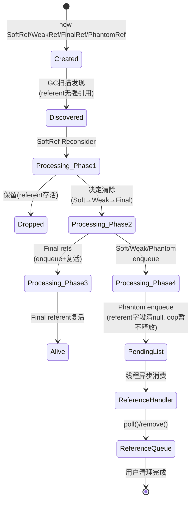
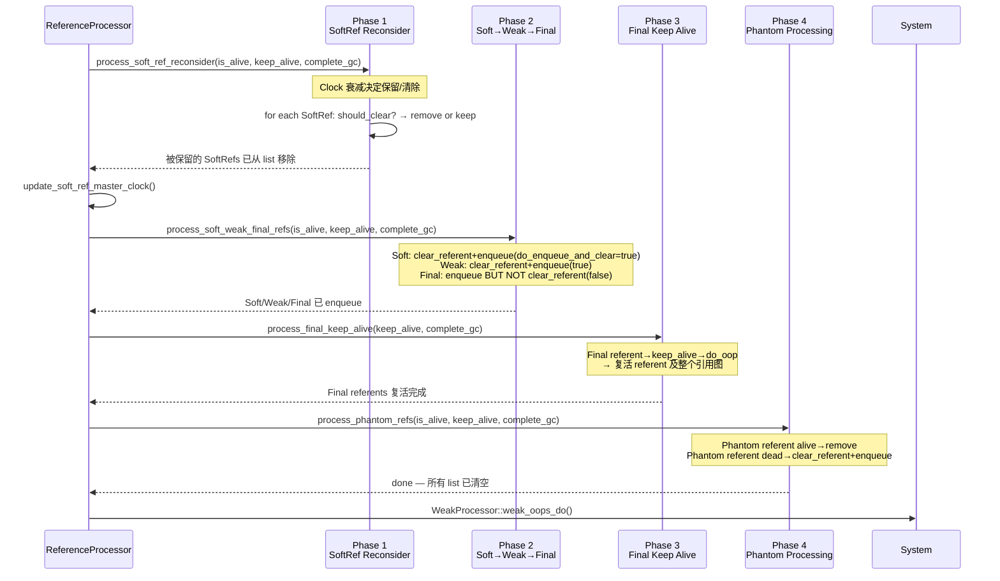
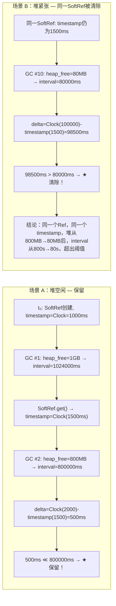
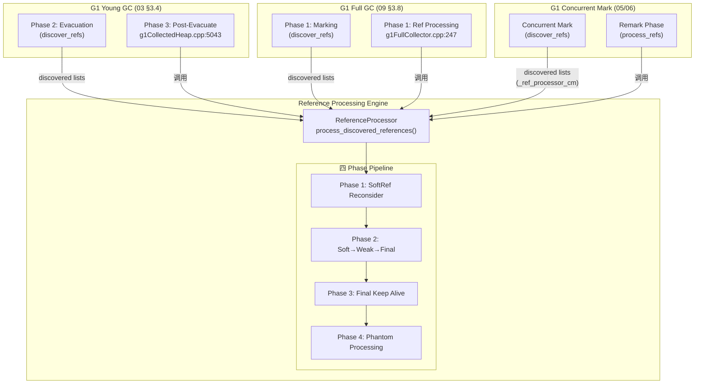

# 11-Reference-Processing — G1 Reference Processing：跨 GC 类型的引用处理引擎

> **生产场景切入**：
> ```
> $ java -Xms8g -Xmx8g -XX:+UseG1GC -Xlog:gc+ref*=debug:file=gc.log MyApp
> 
> # 故障现象：Remark 阶段耗时 800ms，远超预期的 ~50ms
> [5.234s] GC(3) Pause Remark 3800M->3780M(8192M) 812.3ms
> # 开启 ref 日志后发现：
> [5.234s][debug][gc,ref] GC(3) SoftReference 12439 discovered   ← 12000+ SoftRef
> [5.350s][debug][gc,ref] GC(3) SoftReference 处理耗时: 116ms     ← 每毫秒处理 ~100 个
> [5.780s][debug][gc,ref] GC(3) FinalReference 85 enqueued        ← Finalizer 复活
> [5.820s][debug][gc,ref] GC(3) PhantomReference 23 processed
> # 根因：121k+ SoftReference 等待 Clock 衰减判定 + FinalReference 复活触发额外扫描
> # 修复：-XX:SoftRefLRUPolicyMSPerMB=0（立即清除）+ 消除 finalize()
> ```
> 本文解释 Reference Processing 的四 Phase 管线——从 Discovery 到 Enqueue 的全程，以及在 Young/Mixed/Full 三种 GC 中的差异。

> **标准环境**：OpenJDK 11 slowdebug build | `-Xms8g -Xmx8g -XX:+UseG1GC -XX:MaxGCPauseMillis=200` | 64-bit Linux x86
> **G1 Region**：4MB，2048 Regions | `-XX:SoftRefLRUPolicyMSPerMB=1000`（默认）| `ParallelGCThreads=4`
> **前置依赖**：`[03-YoungGC]`（Phase 3 调用上下文）+ `[09-FullGC]`（Phase 1 调用上下文）| 建议了解 `[05-SATB]`（CM 期间引用发现）
> **阅读收益**：读完本文后能回答"四种引用 + JNI Weak Global 在 GC 层面怎么实现？Discovery 和 Processing 为什么分离？四 Phase 管线为什么是 Soft→Weak→Final→Phantom？`DiscoveredListIterator` 做什么？SoftRef Clock 衰减怎么算？`_discovery_is_atomic` 怎么控制并发？FinalReference 怎么复活？Phantom 为什么只通知不清除（和 finalization 无关）？三种 GC 类型如何统一调用这套管线？"

---

## §〇 源文件清单

| # | 文件 | 模块 | 核心函数/类 | 本文角色 |
|---|------|------|------------|---------|
| 1 | `referenceProcessor.cpp/.hpp` | gc/shared | `process_discovered_references()`:202, `discover_reference()`:1109, `process_soft_ref_reconsider_work()`:351, `process_soft_weak_final_refs_work()`:382, `process_final_keep_alive_work()`:427, `process_phantom_refs_work()`:453, `update_soft_ref_master_clock()`:158, `DiscoveredListIterator`:65, `_soft_ref_timestamp_clock`:199 | ★★★ 引用处理引擎 |
| 2 | `referencePolicy.cpp/.hpp` | gc/shared | `LRUCurrentHeapPolicy::should_clear_reference()`:45, `LRUMaxHeapPolicy::should_clear_reference()`:76, `_max_interval`:61/73 | ★★★ SoftRef Clock 衰减算法 |
| 3 | `softRefPolicy.cpp/.hpp` | gc/shared | `SoftRefPolicy::should_clear_all_soft_refs()`:46, `ClearedAllSoftRefs`:59 | ★★ 全局清除策略 |
| 4 | `referenceProcessorPhaseTimes.cpp/.hpp` | gc/shared | `ReferenceProcessorPhaseTimes`:39 — 四 Phase 计时 | ★ 统计基础设施 |
| 5 | `weakProcessor.cpp/.hpp` | gc/shared | `WeakProcessor::weak_oops_do()`:36 — JNI Weak Global Refs | ★★ JNI 弱引用 |
| 6 | `g1FullGCReferenceProcessorExecutor.cpp/.hpp` | gc/g1 | `G1FullGCReferenceProcessingExecutor::execute()`:82 | ★★ Full GC 集成 |
| 7 | `g1ParScanThreadState.cpp/.hpp/.inline.hpp` | gc/g1 | `deal_with_reference()`:119, `dispatch_reference()`:132, `set_ref_discoverer()` | ★★★ Young GC Discovery |
| 8 | `g1CollectedHeap.cpp/.hpp` | gc/g1 | `process_discovered_references()`:4862, `_ref_processor_stw`:2631, `_ref_processor_cm`:2620 | ★★★ 双 RP 创建 + Young GC 调用 |
| 9 | `referenceType.hpp` | memory | `enum ReferenceType`:32 — REF_SOFT/WEAK/FINAL/PHANTOM/NONE/OTHER | ★ 类型枚举 |
| 10 | `g1FullCollector.cpp/.hpp` | gc/g1 | `G1FullGCSubjectToDiscoveryClosure`:47 — 全堆 subject to discovery | ★ Full GC 集成 |

**辅助组件**：

| 组件 | 归属 | 说明 |
|------|:---:|------|
| `java.lang.ref.Reference` (JDK) | java.base | `discovered`/`next` 字段、`ReferenceQueue` — Java 层引用对象结构 |
| `Finalizer` / `FinalizerThread` (JDK) | java.base | FinalReference 的消费线程 → 调用 `finalize()` |
| `ReferenceHandler` (JDK) | java.base | pending list → ReferenceQueue 的交接线程 |
| `IsAliveClosure` / `KeepAliveClosure` | gc/shared | 判断存活/保持存活的双闭包模式 |
| `InstanceRefKlass` (`instanceRefKlass.inline.hpp`) | oops | `try_discover()`:65, `oop_oop_iterate_ref_processing()`:111 — Reference 子类的 oop_iterate 拦截点 | ★★ Discovery 触发机制 |
| `AbstractRefProcTaskExecutor` / `RefProcMTDegreeAdjuster` | gc/shared | 并行处理 Worker 调度 + 自适应并行度 |

> 行号来自 `grep` 验证，可能因插桩宏和 `#ifdef ASSERT` 偏移 ±3 行。

---

## §一 ★ 全景 — 四种引用类型 + JNI Weak Global 和 GC 的关系

### ❓ 为什么 Java 需要四种引用而不是一种？它们和 GC 是什么关系？

四种引用的本质区别是**对 GC 行为的不同控制能力**，它们形成了一个从"强"到"弱"的梯度：

| 引用类型 | get() 返回值 | referent 何时被 GC 清除 | 何时 enqueue | 典型场景 |
|---------|:---:|------|:---:|------|
| **Strong** | 永远返回对象 | 从不（传统 GC 依据） | 不参与 | 普通对象 |
| **SoftReference** | 返回 referent | ★ Clock 衰减决定 → 上次访问时间 + 堆压力 | 清除时 | 内存敏感缓存（图片/网页缓存） |
| **WeakReference** | 返回 referent | referent 无 Strong 引用即清除 | 清除时 | `WeakHashMap`（key 自动清理） |
| **FinalReference** | 返回 referent | GC 发现时**不立即清除**→ Phase 2 enqueue → Phase 3 复活 → `finalize()` 执行完后才清除 | Phase 2 时 | `finalize()`（应避免使用） |
| **PhantomReference** | ★ **永远返回 null** | GC 发现 referent 已死后 → Phase 4 enqueue（但 **不立即清除**，等到 PhantomReference 本身 unreachable 后才清） | Phase 4 时 | NIO `DirectByteBuffer` Cleaner（堆外内存释放） |

**四种引用的设计哲学**：

```
Strong > Soft > Weak > Final ≈ Phantom
  ｜    ｜      ｜       ｜
  ｜    ｜      ｜       └─ 通知但不给访问权（替代 finalize）
  ｜    ｜      └─ 完全不影响 GC（不影响存活判定）
  ｜    └─ 内存敏感的缓存（堆紧张时才清除）
  └─ 传统 GC 的"活对象"标准
```

如果只有一种引用（如 WeakReference），就没有"堆紧张时才释放缓存"的语义——SoftReference 恰恰填补了这个空白。如果只有一种 FinalReference，就没有安全的资源清理方案——PhantomReference 正是作为 `finalize()` 的替代品设计的（确定性通知、无复活副作用、不给访问权）。

---

### 1.1 四种引用类型 + JNI Weak Global 状态机



### 1.2 `Reference.discovered` vs `Reference.next` — 两个字段分离的含义

这是理解两阶段分离的第一步：

```java
// java.lang.ref.Reference (简化的 C++ 等价)
class Reference {
    private T referent;          // 被引用的对象（GC 关心）
    ReferenceQueue<T> queue;     // 用户注册的通知队列
    Reference<?> discovered;     // ★ GC 用 — discovered list → pending list（一个字段两段生命周期）
    Reference<?> next;           // ★ ReferenceHandler/ReferenceQueue 用 — queue 内链表指针
}
```

| 字段 | 谁写 | 谁读 | 存储什么 | 生命周期 |
|------|:---:|:---:|------|------|
| `discovered` | ① `discover_reference()` (C++, CAS/plain) ② `enqueue()` / `complete_enqueue()` (C++, pending list 旧头) | ① ReferenceProcessor (Phase 1-4) ② `ReferenceHandler` 线程 (Java, 从 pending list 消费) | ★ **一个字段两段复用**：先作为 discovered list 链表指针 → 后作为 pending list 链表指针 | Discovery 开始 → ReferenceHandler 消费完毕 |
| `next` | `ReferenceHandler` (Java, 将 Reference 链入其注册的 ReferenceQueue) / `process_final_keep_alive_work()` (C++, FinalRef `next==self` sentinel) | `ReferenceHandler` (Java, 遍历同一 queue 内的 Reference) / `discover_reference()` (C++, `next != NULL` 跳过已处理 FinalRef) | ReferenceQueue 内链表 / FinalRef "已 enqueue" 标记 | enqueue→用户 `poll()` 拿走 |

**★ 为什么要分开？**— 因为 `discovered` 字段实际上承担了**两段不相交的生命周期**：

- **阶段 A（GC 内部）**：GC worker 发现 Reference → 写入 `discovered` 形成 discovered list（私有数据结构）
- **阶段 B（交接）**：`enqueue()` 复用 `discovered` 字段构建 pending list → `complete_enqueue()` 原子 swap 到全局 pending list（`Universe::swap_reference_pending_list()`）
- **阶段 C（用户侧）**：`ReferenceHandler` 线程（Java 层）从 pending list（通过 `discovered` 字段遍历）消费每个 Reference → 将其链入该 Reference 注册的 `ReferenceQueue`（通过 `next` 字段链入）→ 用户 `poll()`/`remove()` 取出

`discovered` 字段的两段复用是关键设计：GC 不需要额外分配链表节点——链表直接建在 Reference 对象的已有字段上。`next` 字段与此完全正交，用于**用户侧的 ReferenceQueue 内链表**。

---

### 1.3 ★ 为什么 Discovery 和 Processing 必须两阶段分离？

这是全文最核心的设计问题。答案分三层：

**(a) 时序约束：标记未完成前不知道谁是垃圾**

Discovery 发生在 GC worker 扫描对象图的**过程中**——此时标记操作还在进行，GC 还没有完成全图遍历。只有整个标记流程结束后，才知道：

- 哪些 referent **还活着**（有 Strong 引用链到达）→ Soft/Weak/Final/Phantom 引用应该被保留
- 哪些 referent **已经死了**（只有 Weak 引用链）→ 应该被清除

**如果边发现边处理**：标记顺序可能先遇到 Reference A → 此时 referent 刚被扫描到，"看起来活着"→ 删除 Reference A。但后续标记发现：唯一到 referent 的路径就是通过 A → referent 实际上已死，但 A 已被错误删除了 → **不可逆的错误**。

**(b) 并发约束：多 GC worker 的竞争窗口**

**假设**合并两阶段时的以下场景：Young GC 有多个 worker 并行扫描 CSet。worker 1 发现 SoftRef A（拷贝 referent 到 Survivor，但尚未完成），worker 2 已经完成自己的扫描并开始处理（因为发现"完成"了）→ worker 2 清除 referent，但 worker 1 还没完成 copy_to_survivor_space → referent 的旧地址变成 dangling pointer → worker 1 写入时出错。

**两阶段分离的设计保证**：所有 GC worker 完成扫描（Evacuation 阶段）→ **显式 barrier（所有 worker 完成扫描后）**→ 单一进入 Processing 阶段 —— worker 不可能在其他人还在扫描时就开始处理。

**(c) 跨 GC 类型一致性的代价（Full GC 对比）**

| 特性 | Young/Mixed GC | Full GC | 为什么统一？ |
|------|:---:|:---:|------|
| 标记方式 | Evacuation 扫描 CSet | Phase 1 全堆 STW 标记（多 worker 并行） | — |
| 标记完成时机 | Evacuation 结束后 | MarkingTask 所有 worker 完成 | — |
| **理论上可否合并** | ❌（并发 worker） | ❌（多 worker 并行标记，**单 worker 不知道全图**） | 三者不可合并 |
| **实际做了什么** | 两阶段 | **同样两阶段** | ★ **一致性 + 正确性 > 性能** |

> **设计替代分析 ①**：Full GC 虽然 STW，但 Phase 1 是由多个 worker **并行标记**的——worker A 在标记 Object X 时发现 Reference R，但 worker B 可能还在标记 Object Y（Y 有一条 Strong 引用到 R.referent，尚未被 worker A 看到）。如果 worker A 在发现 R 的同时立即处理（清除 referent），而 worker B 随后标记到 Y 试图访问 referent → referent 的堆状态已被破坏。**结论：三种 GC 类型全都不可合并 Discovery 和 Processing——不是因为"代码一致性"的被动选择，而是因为多 worker 并行标记时不存在"单 worker 已知全图"的时刻。**两阶段分离是所有并行 GC 的硬约束，不是设计偏好。

---

### 1.4 ★ `WeakProcessor::weak_oops_do()` — "第五种弱引用"：JNI Weak Global References

在分析四种 Java 引用之前，必须澄清一个容易被混淆的概念：

**`WeakProcessor::weak_oops_do()` 处理的不是 Java `WeakReference` 对象——而是 JNI Weak Global References（`jweak`）。**

```cpp
// weakProcessor.cpp:36
void WeakProcessor::weak_oops_do(BoolObjectClosure* is_alive, OopClosure* keep_alive) {
    JNIHandles::weak_oops_do(is_alive, keep_alive);      // JNI jweak handle
    JvmtiExport::weak_oops_do(is_alive, keep_alive);     // JVMTI weak tag
    SystemDictionary::vm_weak_oop_storage()->weak_oops_do(is_alive, keep_alive); // StringTable/ResolvedMethodTable
}
```

| 对比维度 | Java `WeakReference` | JNI Weak Global (`jweak`) |
|---------|-----|------|
| 所属层 | Java 层 `java.lang.ref.Reference` 子类 | C++ 层 `JNIHandles` 模块 |
| 存储结构 | discovered list（`Reference.discovered` 字段） | `OopStorage`（底层 oop 容器） |
| GC 发现 | `discover_reference()` → CAS 头插 | JNIHandles 管理器内部处理 |
| GC 处理 | `process_discovered_references()` → Phase 2 | `WeakProcessor::weak_oops_do()` |
| 调用时机 | Young GC Phase 3 / Full GC Phase 1 | 紧随 `process_discovered_references()` 之后 |
| 对标 Java 概念 | `WeakReference.get()` | `NewGlobalRef()` → `DeleteGlobalRef()` 的弱引用版本 |

**★ 为什么 JNI Weak Global 不纳入 Reference Processing？**
- 它不走 Java 的 `Reference` 继承体系——没有 `discovered`/`next` 字段、没有 `ReferenceQueue`
- 它在 C++ 层管理——通过 `OopStorage` 维护 oop 指针，GC 直接在 oop 层面操作
- 路径完全独立：`WeakProcessor::weak_oops_do()` 从不调用 `ReferenceProcessor`

在三种 GC 的调用点中，`WeakProcessor::weak_oops_do()` 总是紧随 `process_discovered_references()` 之后：
- Young GC：`g1CollectedHeap.cpp:5056`
- Full GC：`g1FullCollector.cpp:253`

---

## §二 ★★ Discovery 阶段：引用如何被发现

### ❓ 为什么在 GC worker 扫描对象图的过程中要"顺便"发现引用？

Discovery 阶段的核心问题：**当 GC worker 扫描到一个对象的字段时，这个字段恰好指向一个 Reference 子类实例——应该怎么处理？**

答案取决于 GC 类型——这就是 Discovery 有**两条路径**的原因。

---

### 2.1 Young GC Discovery 路径 — `deal_with_reference()`

**调用链**（参见 `[03 §3.3]`）：

```
G1ParScanThreadState::steal_and_trim_queue()
  → dispatch_reference(StarTask ref)         // g1ParScanThreadState.inline.hpp:132
    → deal_with_reference(oop* ref_to_scan)  // g1ParScanThreadState.inline.hpp:119
      ┌─ 中继到 copy_to_survivor_space（[03 §3.3] 深挖）
      │   → 在 Evacuation 过程中遇到 Reference 子类
      │   → ReferenceProcessor::discover_reference()
```

**关键代码**（`g1ParScanThreadState.inline.hpp:119-130`）：

```cpp
inline void G1ParScanThreadState::deal_with_reference(oop* ref_to_scan) {
  if (!has_partial_array_mask(ref_to_scan)) {
    do_oop_evac(ref_to_scan);   // → G1ParCopyClosure → 最终触发 discover_reference
  } else {
    do_oop_partial_array(ref_to_scan);
  }
}
```

**★ 为什么在 copy_to_survivor_space 之后才发现引用？**

不是"之后"——是"之中"发现。`copy_to_survivor_space` 在复制对象后，会遍历被复制对象的字段。如果某个字段指向 Reference 子类，遍历闭包会自动触发 `discover_reference()`。

**关键点**：在 Young GC 的 Evacuation 过程中，Reference **对象本身也被复制了**。只有对象被复制到 Survivor/Old Region 后，它的 `discovered` 字段才稳定——此时才能安全地 CAS 入 discovered list。

---

### 2.2 Full GC Discovery 路径 — InstanceRefKlass 自动拦截

**★ Full GC 和 Young GC 的根本区别：Discover 不是显式调用的，而是通过 `InstanceRefKlass` 的多态分发自动触发。**

```
// g1FullCollector.hpp:47-53
// ★ Subject-to-discovery 闭包：全堆 subject to discovery
class G1FullGCSubjectToDiscoveryClosure: public BoolObjectClosure {
public:
  bool do_object_b(oop p) {
    assert(p != NULL, "must be");
    return true;    // ★ 整个堆的所有对象都 subject to discovery
  }
};
```

**调用链**：

```
Full GC Phase 1 标记:
  G1FullCollector::collect() → run_task(&marking_task)
    → G1FullGCMarker::follow_object(obj)
      → obj->oop_iterate(mark_closure())
        → InstanceKlass::oop_oop_iterate()          // 遍历所有 Java 字段
        → InstanceRefKlass::oop_oop_iterate_ref_processing()
          → closure->reference_iteration_mode() == DO_DISCOVERY
            → InstanceRefKlass::try_discover(obj, type, closure)  // ★ instanceRefKlass.inline.hpp:65
              → if referent not marked:
                → closure->ref_discoverer()->discover_reference(obj, type)
                  // ★ ref_discoverer = ref_processor_stw()
```

**★ 关键设计**：GC worker **完全不知道**它在处理引用——`InstanceRefKlass`（Reference 子类的 Klass）在 `oop_iterate` 的最后一步，根据 closure 的 `reference_iteration_mode()` 自动分发到 `try_discover()`。这是虚函数多态实现的零侵入集成。

**核心源码**（`instanceRefKlass.inline.hpp:65-76`）：

```cpp
bool InstanceRefKlass::try_discover(oop obj, ReferenceType type, OopClosureType* closure) {
  ReferenceDiscoverer* rd = closure->ref_discoverer();
  if (rd != NULL) {
    oop referent = load_referent(obj, type);
    if (referent != NULL && !referent->is_gc_marked()) {
      return rd->discover_reference(obj, type);   // ★ 这里触发 discovery
    }
  }
  return false;
}
```

**对比 Young GC 和 Full GC 的差异不是发现机制**（两者都通过 `InstanceRefKlass`），而是：
- Young GC：由 `G1ParCopyClosure` 设置 `reference_iteration_mode() = DO_DISCOVERY`（在 Evacuation 时）
- Full GC：由 `G1MarkAndPushClosure` 设置 `reference_iteration_mode() = DO_DISCOVERY`（在标记时）
- **闭包不同，拦截模式相同**

**`G1FullCollector` 构造时的 RAII 设置**（`g1FullCollector.cpp:117-118`）：

```cpp
// 构造函数初始化列表中：
_is_subject_mutator(heap->ref_processor_stw(), &_always_subject_to_discovery)
// ★ 临时将 _ref_processor_stw 的 is_subject_to_discovery 设为全堆 true
```

此时 `_is_subject_mutator` 是一个 RAII 对象，在 Full GC 结束后自动恢复原值。

**★ 为什么 Full GC 全堆 subject to discovery？**
- Full GC 扫描全堆 → 全堆的所有 Reference 对象都需要被发现
- Young GC 只扫描 CSet 内 Region → 只有 CSet 内的 Reference 对象才 subject to discovery → 需要 `SpanSubjectToDiscoveryClosure` 做范围限定

---

### 2.3 `discover_reference()` — CAS 头插 discovered list

```cpp
// referenceProcessor.cpp:1109
bool ReferenceProcessor::discover_reference(oop obj, ReferenceType rt) {
  // 1. 前置检查：是否正在发现？是否启用了注册？
  if (!_discovering_refs || !RegisterReferences) return false;

  // 2. FinalReference 特殊检查：已 enqueue 的不再发现
  if ((rt == REF_FINAL) && (java_lang_ref_Reference::next(obj) != NULL)) return false;

  // 3. Subject to discovery 范围检查
  if (RefDiscoveryPolicy == ReferenceBasedDiscovery &&
      !is_subject_to_discovery(obj)) return false;

  // 4. ★ 活跃度检查：如果 referent 还活着（有强引用），不发现
  if (is_alive_non_header() != NULL) {
    if (is_alive_non_header()->do_object_b(java_lang_ref_Reference::referent(obj)))
      return false;  // referent is reachable
  }

  // 5. ★ Soft 引用预判：Clock 决定是否该清除
  if (rt == REF_SOFT) {
    if (!_current_soft_ref_policy->should_clear_reference(obj, _soft_ref_timestamp_clock))
      return false;
  }

  // 6. 获取 discovered 字段地址 → select queue → CAS/plain 插入
  DiscoveredList* list = get_discovered_list(rt);
  if (_discovery_is_mt) {
    add_to_discovered_list_mt(*list, obj, discovered_addr); // CAS
  } else {
    RawAccess<>::oop_store(discovered_addr, next_discovered); // plain store
    list->set_head(obj);
    list->inc_length(1);
  }
  return true;
}
```

**CAS 头插**（`referenceProcessor.cpp:1036-1063`）：

```cpp
void ReferenceProcessor::add_to_discovered_list_mt(DiscoveredList& refs_list,
                                                    oop obj, HeapWord* discovered_addr) {
  oop current_head = refs_list.head();
  oop next_discovered = (current_head != NULL) ? current_head : obj;

  // ★ CAS: 如果 obj.discovered == NULL → 写入 next_discovered
  oop retest = HeapAccess<AS_NO_KEEPALIVE>::oop_atomic_cmpxchg(
      next_discovered, discovered_addr, oop(NULL));

  if (retest == NULL) {
    // 胜出 → 设置链表头
    refs_list.set_head(obj);
    refs_list.inc_length(1);
  } else {
    // 另一个线程已经发现 → 什么都不做
  }
}
```

**★ 两种 Discovery Policy**（`discover_reference()` 的 `RefDiscoveryPolicy` 分支，行 1120-1189）：

| Policy | 默认 | 判断依据 | 允许范围 | 跨代发现 |
|--------|:---:|------|------|:---:|
| `ReferenceBasedDiscovery` (0) | ✅ | Reference **对象**本身是否在 subject 范围内 | 保守：Reference 对象必须在 CSet/全堆 内 | ❌ 不允许（Reference 在 Old Gen 但 referent 在 Young Gen → 不发现） |
| `ReferentBasedDiscovery` (1) | ❌ | Reference **对象的 referent** 是否在 subject 范围内 | 宽松：只要 referent 在范围内，即使 Reference 在 Old Gen 也发现 | ✅ 允许（原子模式 + referent 在范围内 → 发现跨代引用） |

两种策略的核心差异在行 1175-1189：

```cpp
if (RefDiscoveryPolicy == ReferentBasedDiscovery) {
    // 宽松策略：Reference 在范围内 OR (原子模式 + referent 在范围内)
    if (is_subject_to_discovery(obj) ||
        (discovery_is_atomic() && is_subject_to_discovery(referent))) {
        // 可以发现
    } else { return false; }
}
```

**为什么默认用 ReferenceBasedDiscovery？** 因为它更保守（只在 Reference 对象所在代收集时发现），避免了"Reference 在 Old Gen、referent 在 Young Gen 被并发收集器发现"的跨代复杂性——参考对象本身在另一个 ReferenceProcessor 的管辖范围内。

---

### 2.4 ★ 为什么 STW 模式需要 CAS 而 CM 模式不需要？

**关键**：区分标准不是 GC 类型（Young/Full），而是 `_discovery_is_atomic` 字段。两种 STW GC（Young GC / Full GC）共享 `_ref_processor_stw`，`_discovery_is_atomic=true`，都需要 CAS。CM 使用 `_ref_processor_cm`，`_discovery_is_atomic=false`，不需要 CAS。

| 场景 | `_discovery_is_mt` | `_discovery_is_atomic` | 并发风险 | 策略 |
|------|:---:|:---:|------|------|
| **Young / Full GC (STW)** | `true`（多个 worker） | `true` | 多个 worker 并行扫描，可能同时遇到同一个 Reference 对象 | **CAS** — 只有一个 worker 能 CAS 成功插入 discovered list，其他 worker 检测到 `retest != NULL` 直接跳过 |
| **CM (Concurrent Mark)** | `true` | **`false`** | CM worker 多线程并行发现 Reference；但即使 CAS 保证链表一致性，也无法防止 discovery→remark 之间 mutator 清除 referent → 允许 `load_ptrs(allow_null_referent=true)` | **plain store** — 不用 CAS（理由见下） |

**★ 为什么 CM 模式不需要 CAS？** 不是因为"没竞争"——实际上 CM worker 也是多线程的。真正原因是 CM 的发现和 mutator 交错执行：即使 CAS 保证链表一致性，也不能保证 referent 在发现时和 remark 时一致（mutator 可能中途清除）。因此 CM 选择非原子发现 + SATB 保证不丢失引用 + Remark 阶段再 `process_discovered_references()`。

**关键计算**（`g1CollectedHeap.cpp:2619-2639` 双 ReferenceProcessor 创建）：

```cpp
// CM ref processor — 非原子发现
_ref_processor_cm = new ReferenceProcessor(
    &_is_subject_to_discovery_cm,
    true,                               // mt processing
    ParallelGCThreads,                  // degree of mt processing
    (ParallelGCThreads > 1) || (ConcGCThreads > 1), // mt discovery
    MAX2(ParallelGCThreads, ConcGCThreads),
    false,                              // ★ _discovery_is_atomic = false (非原子)
    &_is_alive_closure_cm,
    true);

// STW ref processor — 原子发现
_ref_processor_stw = new ReferenceProcessor(
    &_is_subject_to_discovery_stw,
    true,                               // mt processing
    ParallelGCThreads,
    (ParallelGCThreads > 1),            // mt discovery
    ParallelGCThreads,
    true,                               // ★ _discovery_is_atomic = true (原子)
    &_is_alive_closure_stw,
    true);
```

---

### 2.5 ★ 双 ReferenceProcessor 架构：`_ref_processor_stw` vs `_ref_processor_cm`

```
G1CollectedHeap
├── _ref_processor_stw (STW ReferenceProcessor)
│   ├── _discovery_is_atomic = true   ← 原子发现
│   ├── _discovery_is_mt = true       ← 多线程发现
│   ├── 用途：Young GC + Mixed GC + Full GC
│   └── 调用点：g1CollectedHeap.cpp:4865
│
└── _ref_processor_cm (CM ReferenceProcessor)
    ├── _discovery_is_atomic = false  ← 非原子发现
    ├── _discovery_is_mt = true       ← 多线程发现
    ├── 用途：Concurrent Mark (Remark 阶段处理)
    └── 调用点：g1ConcurrentMark::weak_refs_work()
```

| 对比维度 | `_ref_processor_stw` | `_ref_processor_cm` |
|---------|-----|------|
| 发现方式 | 原子（CAS） | 非原子（plain store） |
| 并发安全 | CAS 保证多 worker 竞争安全 | mutator 单线程发现，无竞争 |
| SATB 依赖 | 无（STW，mutator 静止） | **是**（mutator 可能在发现过程中修改引用 → SATB pre-barrier 记录旧值） |
| 异常处理 | 无 | `abandon_partial_discovery()` — CM 可能 abort → 丢弃不完整发现 |
| 处理时机 | 同一 STW pause 内 | **Remark 阶段**才 `process_discovered_references()` |

**CM abort 时的清理**（`referenceProcessor.cpp:495-503`）：

```cpp
void ReferenceProcessor::abandon_partial_discovery() {
  for (uint i = 0; i < _max_num_queues * number_of_subclasses_of_ref(); i++) {
    clear_discovered_references(_discovered_refs[i]); // 置空所有 discovered 字段
  }
}
```

**为什么 CM abort 后不保留 discovered list？**
- CM 标记可能被终止（目标时间超限、分配压力等）→ Full GC 接管全堆标记
- Full GC 使用 `_ref_processor_stw` 自己的 discovered list → 之前的 concurrent list 无效且可能包含过期信息
- `abandon_partial_discovery()` 确保两个 ReferenceProcessor 的 discovered list 不互相污染

---

## §三 ★★★ Processing 阶段总览 — process_discovered_references 管线

### ❓ 为什么必须四 Phase？每个 Phase 的职责和边界是什么？

回答这个问题的前提是理解四种引用的**相互依赖**：

1. **Soft 引用**可能被保留 → 它的 referent 变为 alive → 可能影响 Weak/Final/Phantom 的 referent 存活判定
2. **Final 引用**的 referent 可能在 Phase 3 被复活 → 复活后的对象图可能包含更多 Reference 子类 → 必须在 Soft/Weak 之后、Phantom 之前处理
3. **Phantom 引用**的 referent 只有在所有其他引用都处理完毕后才能安全清除 → 因为 Soft 保留或 Final 复活后，Phantom referent 可能重新变回 alive

**四 Phase 的设计逻辑**：

| Phase | 名称 | 输入 | 核心操作 | 输出 | 为什么这个位置？ |
|:---:|------|------|------|------|------|
| **1** | SoftRef Reconsider | `_discoveredSoftRefs` | Clock 衰减 → 保留/清除 | 从 list 中移除"保留"的 Soft 引用（referent 变 alive） | 必须在 Phase 2 之前 — 此时 Soft 引用减少后续工作量 |
| **2** | Soft→Weak→Final 处理 | Phase 1 剩余的 Soft + Weak + Final | 清除 referent + enqueue（Final: 只 enqueue 不清除） | 引用移入 pending list | Final 必须在此保留 referent → Phase 3 需要复活 |
| **3** | Final Keep Alive | Phase 2 后的 Final | referent 复活 → keep_alive→do_oop → 标记整个引用图 | Final referent 变为 alive | 必须在 Phantom 之前 — 复活后 Phantom referent 可能重新 alive |
| **4** | Phantom Processing | Phantom list | 清除 referent + enqueue → referent 保留 alive 直到 PhantomReference 被清除 | 通知资源清理器 | 最后 — 在所有复活完成后才能确定 Phantom 的真正最终状态 |

---

### 3.1 四 Phase 处理管线序列图



---

### 3.2 ★ `DiscoveredListIterator` — 四 Phase 的共享迭代基础设施

四个 Phase 虽然操作不同，但都是在 `DiscoveredList` 上遍历——`DiscoveredListIterator` 为这个共同需求提供了统一的抽象。

```cpp
// referenceProcessor.hpp:65
class DiscoveredListIterator {
private:
  DiscoveredList&    _refs_list;             // 被遍历的 discovered list
  HeapWord*          _prev_discovered_addr;  // 前一个节点的 discovered 字段地址
  oop                _prev_discovered;       // 前一个节点
  oop                _current_discovered;    // 当前节点 (Reference 对象)
  HeapWord*          _current_discovered_addr; // 当前节点的 discovered 字段地址
  oop                _next_discovered;       // 下一个节点

  HeapWord*          _referent_addr;         // referent 字段地址
  oop                _referent;              // referent 对象

  OopClosure*        _keep_alive;            // 标记 alive 的闭包
  BoolObjectClosure* _is_alive;              // 判断 alive 的闭包

  size_t             _processed;             // 已处理数
  size_t             _removed;               // 已移除数

public:
  void load_ptrs(DEBUG_ONLY(bool allow_null_referent)); // 加载三元组
  inline void next();                                    // 前进
  void remove();                                         // 从 list 移除
  inline void make_referent_alive();                     // 标记 referent 为 alive
  void clear_referent();                                 // 清空 referent
  void enqueue();                                        // enqueue
  void complete_enqueue();                               // 批量移入 pending list
};
```

**核心操作分解**：

**(1) `load_ptrs()`** — 从当前 Reference 对象加载三个关键字段：
```cpp
// referenceProcessor.cpp:272-289
void DiscoveredListIterator::load_ptrs(DEBUG_ONLY(bool allow_null_referent)) {
  _current_discovered_addr = ...discovered_addr_raw(_current_discovered);
  _next_discovered = ...discovered(_current_discovered); // 下一个 discovered
  _referent_addr = ...referent_addr_raw(_current_discovered);
  _referent = ...referent(_current_discovered);          // 引用的对象
}
```

**(2) `remove()`** — 从 discovered list 中移除当前 Reference：
```cpp
// referenceProcessor.cpp:291-311
void DiscoveredListIterator::remove() {
  RawAccess<>::oop_store(_current_discovered_addr, oop(NULL)); // 清空当前节点的 discovered
  // 调整 _prev_discovered_addr 指向的节点 → 跳过当前节点
  RawAccess<>::oop_store(_prev_discovered_addr, new_next);
  _removed++;
  _refs_list.dec_length(1);
}
```

**(3) `enqueue()` / `complete_enqueue()`** — 从 discovered list 移到 pending list：
```cpp
// referenceProcessor.cpp:317-331
void DiscoveredListIterator::enqueue() {
  HeapAccess<AS_NO_KEEPALIVE>::oop_store_at(_current_discovered,
    java_lang_ref_Reference::discovered_offset, _next_discovered);
  // discovered 字段被复用为 pending list 的 next 指针
}

void DiscoveredListIterator::complete_enqueue() {
  oop old = Universe::swap_reference_pending_list(_refs_list.head());
  // ★ 原子 swap: pending list ← discovered list
  HeapAccess<AS_NO_KEEPALIVE>::oop_store_at(_prev_discovered,
    java_lang_ref_Reference::discovered_offset, old);
}
```

**★ 为什么用 `DiscoveredListIterator` 而不是手写 while 循环？**

- **统一并发安全抽象**：`load_ptrs()` 的 `allow_null_referent` 参数——在原子发现模式下 referent 必为非 null（`assert(oopDesc::is_oop(_referent))`），非原子模式下允许 null（CM 期间 mutator 可能已清除 referent）
- **统一 barrier 语义**：`remove()`/`enqueue()` 使用 `RawAccess<>::oop_store`（无 barrier）— 因为 Reference 对象本身已被扫描过，不需要 SATB 记录
- **统计一致性**：`_processed`/`_removed` 统一计数

---

### 3.3 `process_discovered_references()` 主框架走读

```cpp
// referenceProcessor.cpp:202-270
ReferenceProcessorStats ReferenceProcessor::process_discovered_references(
  BoolObjectClosure* is_alive, OopClosure* keep_alive, VoidClosure* complete_gc,
  AbstractRefProcTaskExecutor* task_executor, ReferenceProcessorPhaseTimes* phase_times) {

  disable_discovery();  // ★ 禁止继续发现 — 进入 processing 模式

  // Phase 1: SoftRef Reconsider
  {
    RefProcTotalPhaseTimesTracker tt(RefPhase1, phase_times, this);
    process_soft_ref_reconsider(is_alive, keep_alive, complete_gc, task_executor, phase_times);
  }

  update_soft_ref_master_clock();  // ★ Clock +1

  // Phase 2: Soft→Weak→Final 处理
  {
    RefProcTotalPhaseTimesTracker tt(RefPhase2, phase_times, this);
    process_soft_weak_final_refs(is_alive, keep_alive, complete_gc, task_executor, phase_times);
  }

  // Phase 3: Final Keep Alive
  {
    RefProcTotalPhaseTimesTracker tt(RefPhase3, phase_times, this);
    process_final_keep_alive(keep_alive, complete_gc, task_executor, phase_times);
  }

  // Phase 4: Phantom Processing
  {
    RefProcTotalPhaseTimesTracker tt(RefPhase4, phase_times, this);
    process_phantom_refs(is_alive, keep_alive, complete_gc, task_executor, phase_times);
  }

  if (task_executor != NULL) {
    task_executor->set_single_threaded_mode(); // 恢复单线程模式
  }

  return stats; // {soft_count, weak_count, final_count, phantom_count}
}
```

**★ `disable_discovery()` 的时机意义**：调用 `disable_discovery()` 意味着 Reference 对象不再被动态发现——后续所有操作都在已有的 discovered lists 上进行。这是「发现阶段结束，处理阶段开始」的信号。

---

### 3.4 ★ 并行 vs 串行调度 — `RefProcMTDegreeAdjuster`

```cpp
// referenceProcessor.hpp:677
class RefProcMTDegreeAdjuster : public StackObj {
  ReferenceProcessor* _rp;
  bool _saved_mt_processing;
public:
  RefProcMTDegreeAdjuster(ReferenceProcessor* rp, ReferenceProcessor::RefProcPhases phase,
                          size_t refs_count);
  ~RefProcMTDegreeAdjuster();
};
```

**调度决策依据**：

1. 全局开关：`ParallelRefProcEnabled && ParallelGCThreads > 1`
2. **Phase 级自适应**：`RefProcMTDegreeAdjuster` 在构造时检查 `refs_count`——如果某类引用数量太少，串行更高效（线程创建/协调开销 > 并行收益）

---

## §四 ★★★ Phase 1：SoftRef Reconsider — Clock 衰减算法

### ❓ Soft 引用为什么特殊？Clock 衰减凭什么决定"最近被访问"？

Soft 引用和 Weak 引用只有一个区别：**Soft 引用不一定会被清除**——它有机会被保留，条件是"最近被访问过"。

**"最近"怎么定义？— 不是墙上时间，而是 GC 次数 × 堆压力。**

---

### 4.1 SoftRef Clock 衰减算法示意图



---

### 4.2 ★ `_soft_ref_timestamp_clock` 全局时钟 — 为什么只在 GC 时推进墙上时间？

```cpp
// referenceProcessor.hpp:199
static jlong _soft_ref_timestamp_clock;  // 全局 SoftReference 时间戳时钟

// referenceProcessor.cpp:158
void ReferenceProcessor::update_soft_ref_master_clock() {
  jlong now = os::javaTimeNanos() / NANOSECS_PER_MILLISEC;  // ★ 墙上时间（ms）
  if (now > _soft_ref_timestamp_clock) {
    _soft_ref_timestamp_clock = now;
    java_lang_ref_SoftReference::set_clock(now);  // 同步到 Java 层 SoftReference.clock
  }
}
```

**★ Clock 的精确语义——一个只在 GC 时推进的墙上时间快照**

`_soft_ref_timestamp_clock` 存储的类型是 `jlong`（毫秒级 Unix 时间戳），值来源是 `os::javaTimeNanos() / NANOSECS_PER_MILLISEC`（墙上时间）。更新规则：

1. **`enable_discovery()`** (每次 GC 开始时)：无条件拉取 `SoftReference.clock` 的当前值
2. **`process_discovered_references()`** (Phase 1 入口)：再次无条件同步 `SoftReference.clock`
3. **`update_soft_ref_master_clock()`** (Phase 1 结束后)：`max(now, _soft_ref_timestamp_clock)` → 单调推进并写回 Java 层

所以语义是：**一个连续的墙上时间轴，但只在 GC 时才被采样和推进**——并非"GC 次数"的计数器，也不是"GC 次数 × 时间"的乘积。

**为什么不用纯 GC 次数？** — GC 频率不稳定：100 次 Young GC 可能发生在 1 分钟内（堆太小时），也可能是 1 小时内（堆空闲时）。纯 GC 次数无法反映真实的时间跨度。

**为什么不用纯墙上时间（不采样）？** — 如果 GC 之间间隔很久，墙钟走了很远（如 1 小时），但堆一直空闲（没有 OOM 风险），Soft 引用不应该被清除——因为它没有给系统带来任何实际压力。**墙上时间快照（GC 时采样）+ 堆空间因子**（`interval = SoftRefLRUPolicyMSPerMB × heap_available`）完美连接了时间和堆压力。

---

### 4.3 `LRUCurrentHeapPolicy::should_clear_reference()` — 堆空间驱动的衰减

```cpp
// referencePolicy.cpp:39-56
// ★ LRUCurrentHeapPolicy — 基于"当前堆空闲量"的衰减策略
void LRUCurrentHeapPolicy::setup() {
  _max_interval = (Universe::get_heap_free_at_last_gc() / M) * SoftRefLRUPolicyMSPerMB;
}

bool LRUCurrentHeapPolicy::should_clear_reference(oop p, jlong timestamp_clock) {
  jlong interval = timestamp_clock - java_lang_ref_SoftReference::timestamp(p);
  // ★ timestamp(p) 是 SoftReference 最后一次被 get() 时的 Clock 值
  if (interval <= _max_interval) {
    return false;    // 间隔不够长 → 不消除
  }
  return true;        // 足够长 → 消除
}
```

**算法核心**：

```
应该清除 = (timestamp_clock - SoftRef.timestamp) > _max_interval

其中：
  _max_interval = (heap_free_at_last_gc / M) × SoftRefLRUPolicyMSPerMB

  SoftRefLRUPolicyMSPerMB = 1000（默认值）
```

**★ `SoftRefLRUPolicyMSPerMB=1000` 意味着什么？**

| 堆空闲量 | _max_interval | 含义 |
|------|:---:|------|
| 8GB 空闲 ≈ 8192MB | 8192 × 1000ms = **8192s ≈ 136 分钟** | Soft 引用几乎不删 |
| 1GB 空闲 = 1024MB | 1024 × 1000ms = **1024s ≈ 17 分钟** | 上次被 get() 17 分钟内的 Soft 引用保留 |
| 200MB 空闲 | 200 × 1000ms = **200s ≈ 3.3 分钟** | 3 分钟没被 get() 就清除 |
| 80MB 空闲 | 80 × 1000ms = **80s** | 极度紧张 → 快速清除 |

**这是一个经验值**——`SoftRefLRUPolicyMSPerMB` 表达的是：**"每 1MB 空闲堆空间，Soft 引用可以'活' 1000ms"**。设计目标是"堆足够空时 Soft 引用几乎不删，堆紧张时快速清除"。

---

### 4.4 Phase 1 的 SoftRef Reconsider 具体实现

```cpp
// referenceProcessor.cpp:351-380
size_t ReferenceProcessor::process_soft_ref_reconsider_work(
    DiscoveredList& refs_list, ReferencePolicy* policy,
    BoolObjectClosure* is_alive, OopClosure* keep_alive, VoidClosure* complete_gc) {

  DiscoveredListIterator iter(refs_list, keep_alive, is_alive);
  while (iter.has_next()) {
    iter.load_ptrs(DEBUG_ONLY(!discovery_is_atomic()));

    bool referent_is_dead = (iter.referent() != NULL) && !iter.is_referent_alive();

    if (referent_is_dead &&
        !policy->should_clear_reference(iter.obj(), _soft_ref_timestamp_clock)) {
      // ★ 策略说"不要清除"→ 保留
      iter.remove();              // 从 discovered list 移除
      iter.make_referent_alive(); // referent 标记为 alive
      iter.move_to_next();
    } else {
      iter.next();  // 留在 list 中 → Phase 2 会清除
    }
  }
  complete_gc->do_void();
  return iter.removed();
}
```

**Phase 1 的处理结果**：
- 保留下来的 SoftRef：从 discovered list 中移除，referent 变为 alive → Phase 2 不再处理
- 决定清除的 SoftRef：留在 list 中 → Phase 2 清除 referent + enqueue

---

### 4.5 三种策略的对比

| 策略 | 行为 | 使用场景 |
|------|------|------|
| `LRUCurrentHeapPolicy` | 基于当前堆空闲量 | **Client VM 默认**（`!is_server_compilation_mode`） |
| `LRUMaxHeapPolicy` | 基于最大堆空闲量（`MaxHeapSize - used`） | **Server VM 默认**（`is_server_compilation_mode`） |
| `AlwaysClearPolicy` | 永远清除 | Full GC `clear_soft_refs=true` 时（`System.gc()` / OOM 前最后一搏） |

**`LRUCurrentHeapPolicy` vs `LRUMaxHeapPolicy` 的区别**：

```cpp
// LRUCurrentHeapPolicy: 当前堆空闲
_max_interval = (Universe::get_heap_free_at_last_gc() / M) * SoftRefLRUPolicyMSPerMB;

// LRUMaxHeapPolicy: 最大堆空闲（更保守 — 更难清除）
_max_interval = ((MaxHeapSize - Universe::get_heap_used_at_last_gc()) / M) * SoftRefLRUPolicyMSPerMB;
```

`LRUMaxHeapPolicy` 更保守——即使当前堆已用 7GB/8GB，它仍以 MaxHeap 为参考 → 保留更多 Soft 引用。

---

### 4.6 ★ 设计替代：如果只用墙上时间不用堆空间因子 — 为什么不行？

> **设计替代分析 ②**：如果用纯粹的墙上时间（`System.currentTimeMillis()` 差值固定设为 N 秒），不用堆空间因子：

- **问题 1**：GC 频率极高时（如每分钟 10 次 Young GC = 间隔 6 秒），即使堆极度紧张（80MB 空闲），固定 N=120s 意味着 6 秒远小于 120 秒 → Clock 判定"刚访问过"→ **错误保留** Soft 引用，可能导致 OOM
- **问题 2**：GC 频率极低时（堆闲 1 小时不发 GC），固定 N=120s → 虽然堆很空闲、没有 OOM 风险，但墙钟早就超过 120s → **错误清除** Soft 引用（缓存被无辜清空）
- **核心矛盾**：时间流逝和堆压力是**两个独立变量**——只用一个变量无法编码另一个变量
- **当前方案**：`interval = heap_free / M × SoftRefLRUPolicyMSPerMB` → interval **随堆压力动态缩放**：堆空时 interval 大（几乎只靠最近访问保留），堆紧时 interval 小（快速清除冷 Soft 引用）
- **结论**：**"墙上时间快照 × 堆空闲空间因子"** 是关键创新——它把两个独立变量编码为一个决策函数，不是简单的三因子乘积，而是以堆空间修正时间敏感度

---

## §五 ★★ Phase 2：Soft→Weak→Final 处理

### ❓ 为什么三种引用在同一 Phase 处理？为什么 Soft 先于 Weak 先于 Final？

```cpp
// referenceProcessor.cpp:382-425
size_t ReferenceProcessor::process_soft_weak_final_refs_work(
    DiscoveredList& refs_list, BoolObjectClosure* is_alive,
    OopClosure* keep_alive, bool do_enqueue_and_clear) {

  DiscoveredListIterator iter(refs_list, keep_alive, is_alive);
  while (iter.has_next()) {
    iter.load_ptrs(DEBUG_ONLY(!discovery_is_atomic()));

    if (iter.referent() == NULL) {
      // ★ 情况 1：referent 已经被清除（非原子发现才可能）
      iter.remove();
      iter.move_to_next();

    } else if (iter.is_referent_alive()) {
      // ★ 情况 2：referent 变活了（可能被 Strong 引用或其他 GC 操作复活）
      iter.remove();
      iter.make_referent_alive();
      iter.move_to_next();

    } else {
      // ★ 情况 3：referent 确认已死
      if (do_enqueue_and_clear) {
        iter.clear_referent();  // ★ 清除 referent 字段（设为 NULL）
        iter.enqueue();         // ★ enqueue: discovered field 变为 pending list
      }
      iter.next(); // 保留在 list 中（不移除——等待后续处理）
    }
  }

  if (do_enqueue_and_clear) {
    iter.complete_enqueue();    // ★ 批量移入 Universe::reference_pending_list
    refs_list.clear();
  }
  return iter.removed();
}
```

**★ Phase 2 中三种引用通过 `do_enqueue_and_clear` 参数区分行为**：

```cpp
// RefProcPhase2Task::work() (referenceProcessor.cpp:578-588)
// Soft: do_enqueue_and_clear = true → 清除 referent + enqueue
run_phase2(worker_id, _discoveredSoftRefs, is_alive, keep_alive,
           true /* do_enqueue_and_clear */, REF_SOFT);

// Weak: do_enqueue_and_clear = true → 清除 referent + enqueue
run_phase2(worker_id, _discoveredWeakRefs, is_alive, keep_alive,
           true /* do_enqueue_and_clear */, REF_WEAK);

// ★ Final: do_enqueue_and_clear = false → 只 enqueue，不清除 referent！
run_phase2(worker_id, _discoveredFinalRefs, is_alive, keep_alive,
           false /* do_enqueue_and_clear */, REF_FINAL);
```

**★ 为什么 Final refs 在 Phase 2 只 enqueue 不清除 referent？**
— Phase 3 需要 referent **还活着**才能 `keep_alive→do_oop` 标记复活。如果 Phase 2 清除了 referent，Phase 3 拿不到 referent oop，复活失败。

**★ 为什么 Soft→Weak→Final 是这个顺序？**

| 如果交换顺序 | 后果 |
|------|------|
| Weak 先于 Soft | Weak 清除后 referent 死了，但随后 Soft 引用可能"保留"它（Phase 2 Soft do_enqueue_and_clear=true）→ 矛盾——已经 enqueue 了一个不能再用的 Reference |
| Final 先于 Soft/Weak | Final referent 复活后可能让更多 Soft/Weak 引用变 alive → 但 Phase 2 只有一趟，无法回溯 |
| 三者合并 | Final 的 `do_enqueue_and_clear=false` 行为无法和 Soft/Weak 区分 |

> **设计替代分析 ③**：如果四种引用统一处理而不是四 Phase → 无法处理 Soft 重考虑（Phase 1 需要单独的 `should_clear_reference` 判断 + `make_referent_alive`）和 Final 复活（Phase 3 需要 `keep_alive` 标记整个引用图）——因为它们在 Phase 2 的 `do_enqueue_and_clear=false` 保持了 referent，但随后需要一个独立的标记阶段。合并必然丢失语义。

---

## §六 ★★ Phase 3：Final Keep Alive — 复活机制

### ❓ FinalReference 的 referent 怎么"复活"？复活后对 GC 有什么影响？

```cpp
// referenceProcessor.cpp:427-451
size_t ReferenceProcessor::process_final_keep_alive_work(
    DiscoveredList& refs_list, OopClosure* keep_alive, VoidClosure* complete_gc) {

  DiscoveredListIterator iter(refs_list, keep_alive, NULL); // ★ is_alive = NULL！
  while (iter.has_next()) {
    iter.load_ptrs(DEBUG_ONLY(false));

    // ★ 核心操作：keep the referent and followers around
    iter.make_referent_alive();  // keep_alive→do_oop(referent_addr) → 标记 alive + follow 引用图

    // ★ 关键：设置 next = self → 标记"已经 enqueued"
    java_lang_ref_Reference::set_next_raw(iter.obj(), iter.obj());

    iter.enqueue();  // 移入 pending list
    iter.next();
  }
  iter.complete_enqueue();
  complete_gc->do_void();  // 关闭可达集
  refs_list.clear();

  assert(iter.removed() == 0, "This phase does not remove anything.");
  return iter.removed();
}
```

**★ Phase 3 的关键操作**：

**(1) `make_referent_alive()`** — 本质是 `keep_alive→do_oop(referent_addr)`：

```cpp
// referenceProcessor.hpp:124-130
inline void DiscoveredListIterator::make_referent_alive() {
  if (UseCompressedOops) {
    _keep_alive->do_oop((narrowOop*)_referent_addr);
  } else {
    _keep_alive->do_oop((oop*)_referent_addr);
  }
}
```

在 Full GC 中，`keep_alive` 是 `G1FullKeepAliveClosure` — 它会标记 referent 及其整个引用图为 alive（设置标记位 + 将对象推入标记栈以便后续 traversal）。

在 Young GC 中，`keep_alive` 是 `G1CopyingKeepAliveClosure` — 将 referent 复制到 Survivor/Old Region。

**(2) ★ Phase 3 为什么 `is_alive` 传入 NULL？**

```cpp
DiscoveredListIterator iter(refs_list, keep_alive, NULL); // ★ is_alive = NULL！
```

Phase 3 的 `process_final_keep_alive_work()` **从不调用 `is_referent_alive()`**——它对每个 FinalReference **无条件执行 `make_referent_alive()`**，不管 referent 当前是否 alive。原因：

- Phase 2 已经把 FinalReference enqueue（但保留了 referent），意味着 FinalizerThread 需要在下一步调用 referent 的 `finalize()`
- 这个 referent **必须在此时保持 alive**——无论它之前通过什么路径到达 GC 的 discovered list
- 所以 Phase 3 不需要检查"是否 alive"——**所有 Final referents 无条件复活**

**(3) `complete_gc->do_void()` 的作用**

```cpp
complete_gc->do_void();  // referenceProcessor.cpp:446
```

在 Young GC 中，`complete_gc` 是 `G1STWDrainQueueClosure`——其 `do_void()` 会排空 task queue 中所有剩余任务（把 `keep_alive` 推入的引用处理完毕）。在 Full GC 中，它是 `G1FullGCMarker::stack_closure()`——同样排空标记栈。

**为什么每个 Phase 末尾都调用？** 因为 `keep_alive → do_oop` 只是把引用推入队列/栈，没有立即完成可达性传播。`complete_gc->do_void()` 确保本 Phase 的所有 alive 标记完全传播完毕，下一 Phase 才能拿到一致的视图。

**(4) `set_next_raw(iter.obj(), iter.obj())`** — 设置 `next == self`：

这是 FinalReference 的"已处理"标记。在 `discover_reference()` 中有一行检查：

```cpp
// referenceProcessor.cpp:1115-1118
if ((rt == REF_FINAL) && (java_lang_ref_Reference::next(obj) != NULL)) {
    return false;  // ★ 已经处理过的 FinalReference 不再发现
}
```

---

### ★ 为什么 Final Keep Alive 必须在 Phantom 之前？

- Final 复活后，被复活的对象可能包含 Phantom 引用的 **referent → 该 referent 重新变 alive**
- 如果先处理 Phantom：该 referent 已被清除 → 但随后 Final 复活让整个对象图变 alive → Phantom 的状态不一致
- 正确的顺序：Final 复活 → Phantom 重新评估 alive 状态 → 决定清除/enqueue

---

### 6.1 Finalizer → FinalizerThread → finalize() — Java 层的用户可见副作用

**完整链路**：

```
Phase 2: FinalReference enqueue (不清除 referent)
  → Phase 3: referent 复活 (is_alive = true)
    → Universe::reference_pending_list (pending list)
      → ReferenceHandler 线程消费
        → FinalizerThread 调用 referent.finalize()
          → finalize() 执行后
            → 下次 GC 时 referent 失去最后一根稻草 → 真正回收
```

**★ 为什么应该避免 `finalize()`？**
1. **不确定何时执行** — 依赖 GC 调度，可能在 JVM 退出前都不执行
2. **复活副作用** — `finalize()` 中可以把 `this` 赋给静态字段 → 对象被复活（"is resurrectable"→ 下次 GC 不再执行 finalize()）
3. **性能开销大** — 每次分配 FinalReference 需要 `Finalizer::register()` 开销

---

## §七 ★ Phase 4：Phantom Processing — 只通知不清除

### ❓ Phantom 的 referent 为什么还活着但 `get()` 永远返回 null？

```cpp
// referenceProcessor.cpp:453-481
size_t ReferenceProcessor::process_phantom_refs_work(
    DiscoveredList& refs_list, BoolObjectClosure* is_alive,
    OopClosure* keep_alive, VoidClosure* complete_gc) {

  DiscoveredListIterator iter(refs_list, keep_alive, is_alive);
  while (iter.has_next()) {
    iter.load_ptrs(DEBUG_ONLY(!discovery_is_atomic()));

    oop const referent = iter.referent();

    if (referent == NULL || iter.is_referent_alive()) {
      // ★ 情况 1/2：referent NULL 或活着 → 从 list 移除，保持 alive
      iter.make_referent_alive();
      iter.remove();
      iter.move_to_next();

    } else {
      // ★ 情况 3：referent 确认已死
      iter.clear_referent();   // 清除 referent 字段（设为 NULL → PhantomReference.get()=null）
      iter.enqueue();           // ★ 只 enqueue，不复活
      iter.next();
    }
  }
  iter.complete_enqueue();
  complete_gc->do_void();
  refs_list.clear();
  return iter.removed();
}
```

**★ Phantom 的核心语义**：

```
Phase 4: clear_referent() → PhantomReference.referent 字段 = null → PhantomReference.get() 永远返回 null
        enqueue() → PhantomReference 链入 pending list → ReferenceHandler 处理 → 加入用户注册的 ReferenceQueue
等待：用户 poll()/remove() 收到 PhantomReference → 用户从 PhantomReference 的其他字段（非 referent）读取清理信息
      用户处理完毕后丢弃 PhantomReference → PhantomReference unreachable → referent oop 失去最后一个引用
下次 GC：referent oop 真正回收
```

**★ 注意**：Phase 4 虽然 `clear_referent()` 把 `PhantomReference.referent` **字段**设为了 null（JDK 层 `get()` 返回 null），但 referent **oop** 的堆内存**并没有立即释放**——因为 PhantomReference 对象本身还活着（正被 enqueue），referent oop 通过它还有一条引用链。只有用户处理完 PhantomReference 后，referent oop 才失去最后一个可达路径，在下次 GC 时被回收。

**★ Phantom 和 finalization 没有关系。**

`finalize()` 的问题：
- 复活副作用（`finalize()` 中可以把对象"复活"）
- 执行时机不确定（依赖 GC 调度 + FinalizerThread 优先级）

`PhantomReference` 解决了这两个问题：
- **不给访问权**（`get()` 强制返回 null）— 无法在代码中让对象"复活"
- **确定性通知**（ReferenceQueue 的 `remove()`/`poll()` 是用户可控的）
- **资源清理典范**：

```java
// NIO DirectByteBuffer 的 Cleaner（内部使用 PhantomReference）
class DirectByteBuffer {
    private Cleaner cleaner; // PhantomReference 子类
    static {
        cleaner = Cleaner.create(this, new Deallocator(unsafe, address));
    }
    // Deallocator::run() → unsafe.freeMemory(address)    ← 清理堆外内存
    // referent(this) 在 enqueue 后暂不释放 → Deallocator 需要 address 字段值
}
```

---

## §八 ★ 三种 GC 类型的集成

### ❓ 为什么不同 GC 类型可以共用同一套 Reference Processing？

因为 Reference Processing 的抽象层和 GC 策略正交：**不管是什么 GC，处理引用的语义都是一样的——"标记完成后决定哪些引用要清除"**。



| 对比维度 | Young GC | Mixed GC | Full GC | CM (Remark) |
|---------|:---:|:---:|:---:|:---:|
| **ReferenceProcessor** | `_ref_processor_stw` | `_ref_processor_stw` | `_ref_processor_stw` | `_ref_processor_cm` |
| **Subject to discovery** | CSet 内 | CSet 内 | **全堆** | **堆内** |
| **Discovery 方式** | `G1ParScanThreadState::deal_with_reference` → `InstanceRefKlass::try_discover()` | 同 Young GC | `InstanceRefKlass` 多态分发（`try_discover()`） | `G1CMTask::deal_with_reference` |
| **Processing 调用点** | Post-evacuation Phase 3 | Post-evacuation Phase 3 | Phase 1 标记完成后 | Remark 阶段 |
| **IsAlive Closure** | `G1STWIsAliveClosure` | 同 | `G1IsAliveClosure`（bitmap 判定） | `G1CMIsAliveClosure` |
| **KeepAlive Closure** | `G1CopyingKeepAliveClosure` | 同 | `G1FullKeepAliveClosure` | `G1CMKeepAliveClosure` |
| **并行执行器** | `G1STWRefProcTaskExecutor` | 同 | `G1FullGCReferenceProcessingExecutor` | CM task |

### 8.1 Young GC 集成 — 为何在 Phase 3 而非 Phase 2？

参见 `[03 §3.4]`。核心原因：

- Evacuation 阶段（Phase 2）GC worker 并行复制 CSet 对象
- 此时 **discovered lists 还在构建中**——多个 worker 可能还没完成发现
- Phase 3 是 post-evacuation（所有 worker 完成 + barrier）→ discovered lists 完整 → 安全调用 `process_discovered_references()`

### 8.2 Full GC 集成 — 先标记后处理

```cpp
// g1FullCollector.cpp:243-253
run_task(&marking_task);                      // Phase 1: 标记（自动发现引用）

// ★ 标记完成后 → discovered lists 完整 → 处理引用
G1FullGCReferenceProcessingExecutor reference_processing(this);
reference_processing.execute(scope()->timer(), scope()->tracer());
```

Full GC 的 `G1FullGCSubjectToDiscoveryClosure` 使全堆所有对象都 subject to discovery — 这是 Full GC 特有的能力——因为 Full GC 是全堆扫描。

---

## §九 面试问题合集（12 个）

> **面试诀窍**：回答"四种引用"时，关键是**先答语义差异（对 GC 的控制能力），再答实现（四个 Phase 的顺序逻辑）**——面试官要的不是 API 手册，而是你对 GC 内部设计的理解。

**Q1: 四种引用类型各有什么区别？各自在什么场景下使用？**

| 类型 | 对 GC 的控制 | 场景 |
|------|------|------|
| SoftReference | 堆紧张时才清除 → 内存敏感的弹性缓存 | 图片缓存、网页缓存（允许 OOM 时自动释放） |
| WeakReference | 完全不阻止 GC → 最"弱"的非通知型引用 | `WeakHashMap`（key 自动清理）、`ThreadLocal` 的 key |
| FinalReference | 不让 GC 直接清除 → 给对象最后一次 `finalize()` 机会 | 历史遗留，应避免（推荐 Phantom 替代） |
| PhantomReference | 不阻碍 GC 但延迟释放 → 通知+清理但不给访问权 | NIO `DirectByteBuffer` Cleaner（堆外内存安全释放） |

核心理解（`[§一]`）：强引用链上越靠左的引用，对 GC 的"阻力"越大。Soft 靠 Clock 衰减算法动态调整（`[§四]`），Weak 零阻力，Final 复活机制产生"二次 GC"开销（`[§六]`），Phantom 是 finalize 的安全替代。

**Q2: 为什么 Reference Processing 需要 Discovery 和 Processing 两阶段分离？**
— 三层原因（`[§1.3]`）：(1) **标记未完成**—来不及判断 referent 真死活 → 过早处理导致不可逆错误；(2) **多 worker 并发**—合并会触发 worker A 扫描 + worker B 处理的竞争窗口；(3) **并行标记的硬约束**—三种 GC 类型全都不可合并：Young GC 有多个 worker 并行 Evacuate、Full GC 有多个 worker 并行标记、CM 有并发 worker 交错——不存在"单 worker 已知全图"的时刻。面试扩展点：追问时答 "Full GC 虽然是 STW，但 Phase 1 标记由多个 worker 并行完成——单一 worker 在标记过程中不知道其他 worker 是否已经标记到某个关键引用路径——因此必须等所有 worker 完成后才能处理引用。"

**Q3: SoftRef Clock 衰减算法怎么工作？为什么用堆空间而不是时间？**
— 公式：`should_clear = (Clock - timestamp) > (heap_free/MB × 1000ms)`。Clock 存储毫秒时间戳，只在 GC 时单调推进（`[§4.2]`）。用堆空间因为**堆才是真实压力源**（`[§4.3]`）：时间是变量但无法编码"堆还剩多少"——堆非常空闲时 Soft 引用应永久保留。面试追问："如果堆 8GB 且始终空闲 → interval=8192s≈136分钟 → 任何至少 136 分钟内被 get() 过的 Soft 引用都不会被清除。"

**Q4: 四 Phase 处理管线为什么必须是 Soft→Weak→Final→Phantom 的顺序？**
— 顺序是**硬依赖链**（`[§三]`）：Phase 1 Soft 重考虑（可能保留 → 减少后续）→ Phase 2 执行清除（Final 只 enqueue 不清除 → 为 Phase 3 保留 referent）→ Phase 3 Final 复活（标记整个引用图 → 可能让 Phantom referent 重新 alive）→ Phase 4 Phantom 最后评估（所有复活完成后的最终视图）。交换任一顺序都会破坏语义依赖。

**Q5: Phase 1 的 Reconsider 是什么意思？它和 Phase 2 的 Soft 处理有什么区别？**
— Phase 1 做**决策**，Phase 2 做**执行**（`[§四 §五]`）。(1) Phase 1：`should_clear_reference()` 判断每个 SoftRef → 保留的从 list 移除 + `make_referent_alive()` → 其 referent 变为 alive。(2) Phase 2：只处理 Phase 1 **剩余的** SoftRef（即决定清除的）→ `clear_referent()` + `enqueue()`。面试要点：两个 Phase 处理的是**同一个 `_discoveredSoftRefs` 列表**——Phase 1 做减法筛选，Phase 2 处理剩余。

**Q6: FinalReference 的 referent 怎么"复活"？复活后其他引用怎么办？**
— Phase 3 对每个 FinalReference 无条件执行 `make_referent_alive()` → `keep_alive→do_oop(referent_addr)` 标记 referent + 整个引用图（`[§六]`）。因为 Phase 2 用 `do_enqueue_and_clear=false` 保留了 referent oop，Phase 3 能拿到 oop 并标记 alive。复活后果：**已死亡**的 Soft/Weak/Phantom referent 如果恰在复活的对象图中 → 重新变 alive → 它们对应的引用不再被清除。面试追问："`System.gc()` 能保证 `finalize()` 立即执行吗？——不能，因为 `System.gc()` 只完成 Phase 3 复活（referent 进入 pending list），但 FinalizerThread 的调度是异步且不可预测的。"

**Q7: PhantomReference.get() 为什么永远返回 null？如果 referent 活着为什么不让访问？**
— 这是 Phantom 的**设计安全约束**（`[§七]`）。让用户访问 referent = 开复活之门（这正是 `finalize()` 失败的根因）。Phantom 的设计哲学：**分离通知和访问**——只通知"referent 即将不可达，请释放关联资源"，不把 referent 交给你。(2) 资源清理由 PhantomReference 自身持有（如 NIO 的 `address` 字段）——用户不需要通过 `get()` 获取 referent 就能取到清理信息。(3) referent oop 的**堆内存**不立即释放的原因：PhantomReference 本身上还在 pending list 上 → 通过它可达 → oop 不 free。直到 PhantomReference 被丢弃才真正回收。面试诀窍：对比 Phantom vs Finalize 时说"一个通知但不给钥匙，一个给钥匙但不确定谁来开门"。

**Q8: `Reference.discovered` 和 `Reference.next` 有什么区别？各被谁用？**
— `discovered`：一个字段两段复用——GC 先用于 discovered list（`discover_reference()` 写入、Phase 1-4 读取），后用于 pending list（`enqueue()`/`complete_enqueue()` 复用同一字段写入新链表头→`ReferenceHandler` 从中消费）。`next`：用户侧 ReferenceQueue 内链表指针，由 `ReferenceHandler`（Java）写入/遍历，唯一 C++ 写入是 `process_final_keep_alive_work()` 的 `next==self` sentinel。详见 `[§1.2]`。

**Q9: Young GC 和 Full GC 的 Reference Discovery 路径有什么不同？**
— 两者都通过 `InstanceRefKlass::try_discover()` 触发（`[§2.2]`），但入参的 closure 不同：Young GC 用 `G1ParCopyClosure`（Evacuation 时 `do_oop_evac` → `InstanceRefKlass` 拦截）；Full GC 用 `G1MarkAndPushClosure`（标记时 `oop_iterate` → `InstanceRefKlass` 拦截）。核心区别：Young GC 的发现和 `copy_to_survivor_space` 耦合（需要确保 Reference 对象先 copy 再发现），Full GC 的发现和标记耦合（全堆 STW，安全窗口更长）。

**Q10: 为什么需要两个 ReferenceProcessor（`_ref_processor_stw` vs `_ref_processor_cm`）？**
— 因为原子发现模式是编译期常量且全局切换不可行（`[§2.5]`）。(1) `_ref_processor_stw`：`_discovery_is_atomic=true` → CAS 写 `discovered`（多 worker 安全），用于 Young/Mixed/Full GC，discovered lists 在同一 STW 内完成 Processing。(2) `_ref_processor_cm`：`_discovery_is_atomic=false` → plain store（无 CAS 开销），用于 CM，discovery 和 processing 间隔遥远（remark 阶段才处理，通过 SATB 保持一致性）。不能用一个 RP 切换——两个 RP 的 discovered lists 和 `is_alive` 闭包完全不同，混用会造成过期引用或遗漏。

**Q11: `WeakProcessor::weak_oops_do()` 处理的是什么？和 `WeakReference` 有什么关系？**
— 完全没有关系（`[§1.4]`）。(1) `WeakProcessor` 处理：JNI Weak Global References（`jweak`）、JVMTI Weak Tags、StringTable/ResolvedMethodTable 的弱引用。(2) 走的是 `OopStorage` 而非 `discovered` 字段，和 `ReferenceProcessor` 的代码路径完全独立。(3) 面试陷阱：面试官问"JVM 怎么处理 JNI Weak Global References"时，不要答到 `WeakReference` 上——这是两套系统。

**Q12: 能给一个"用错 SoftReference/WeakReference/PhantomReference"的例子吗？**
- **SoftRef 错用**：连接池 — 不能因为 OOM 就自动关闭连接（业务逻辑中断 ≠ 优雅降级）。SoftRef 适合"纯粹的内存缓存"（数据可重建，无副作用）。
- **WeakRef 错用**：用 `WeakReference<CriticalBusinessObject>` — 一次 GC 后对象就没了，用户的 `get()` 返回 null。WeakRef 只适合"可有可无"的关联（如 listener 列表的自动注销）。
- **PhantomRef 错误期待**：以为 enqueue 时可以 `get()` 访问 referent — 永远返回 null。PhantomRef 必须把清理需要的**额外信息**存为非 referent 字段（如 Cleaner 的 `address` 字段）。

---

## §十 GDB 验证 + 可证伪断言

### 断言 1：Discovery — CAS 头插验证

```bash
# GDB 断点
(gdb) b ReferenceProcessor::add_to_discovered_list_mt
(gdb) condition 1 _discovery_is_mt == true
(gdb) c
# 预期：在 oop_atomic_cmpxchg 处停住
# (gdb) p *discovered_addr     # 第一次断：NULL → 写入成功
# (gdb) p refs_list._len       # 递增
# 如果另一个线程也发现同一个 Reference，CAS 失败 → retest != NULL → 跳过
```

### 断言 2：Processing — 四 Phase 顺序验证

```bash
(gdb) b ReferenceProcessor::process_discovered_references
(gdb) c
# 预期：函数内依次执行 Phase 1→2→3→4
# (gdb) n  # 单步验证顺序
# 调用的函数顺序：process_soft_ref_reconsider → update_soft_ref_master_clock
# → process_soft_weak_final_refs → process_final_keep_alive → process_phantom_refs
```

### 断言 3：SoftRef Clock — `_soft_ref_timestamp_clock` 递增

```bash
(gdb) b ReferenceProcessor::update_soft_ref_master_clock
(gdb) p _soft_ref_timestamp_clock   # 上一次的值
(gdb) c
(gdb) p _soft_ref_timestamp_clock   # 更新后的值 → 应该 >= 上一次的值
# 预期：如果两次 GC 间隔 > 0ms，值严格递增
```

### 断言 4：Final Keep Alive — next == self sentinel + removed == 0

```bash
(gdb) b ReferenceProcessor::process_final_keep_alive_work
(gdb) c
# ★ 注意：Phase 3 里 is_alive=NULL，不能调用 is_referent_alive()（会 NULL 解引用）
# 观察 referent 非 null + next==self sentinel 写入
(gdb) p iter.referent()                                    # 非 null（Phase 2 保留了 referent）
(gdb) n                                                     # 执行 make_referent_alive() + set_next_raw(obj, obj)
(gdb) p java_lang_ref_Reference::next(iter.obj())          # = iter.obj() → next == self
# 函数末尾：
(gdb) p iter.removed()                                     # 预期：0（Phase 3 不 remove 任何东西）
```

### 断言 5：Phantom — referent 被清除但 Reference 被 enqueue

```bash
(gdb) b ReferenceProcessor::process_phantom_refs_work
(gdb) c
# 在 clear_referent 之前
(gdb) p iter.referent()              # 非 null
(gdb) n                              # 执行 iter.clear_referent()
(gdb) p iter.referent()              # 预期：null（get() 返回 null）
(gdb) p java_lang_ref_Reference::next(iter.obj()) # 非 null（已 enqueue）
```

### 断言 6：WeakProcessor — 与 ReferenceProcessor 独立运行

```bash
(gdb) b WeakProcessor::weak_oops_do
(gdb) b ReferenceProcessor::process_discovered_references
(gdb) c
# 预期：process_discovered_references 先断住 → 处理完成后
# → WeakProcessor::weak_oops_do 断住
# 两个断点绝不重叠（两条独立路径）
```

---

## §十一 附录

### A. 关键 GDB 断点汇总

| 断点位置 | GDB 命令 | 观察目标 |
|---------|------|------|
| `ReferenceProcessor::discover_reference` | `b referenceProcessor.cpp:1109` | Discovery 入口 |
| `ReferenceProcessor::add_to_discovered_list_mt` | `b referenceProcessor.cpp:1036` | CAS 头插 |
| `ReferenceProcessor::process_discovered_references` | `b referenceProcessor.cpp:202` | Processing 入口 |
| `ReferenceProcessor::process_soft_ref_reconsider_work` | `b referenceProcessor.cpp:351` | Phase 1 核心 |
| `ReferenceProcessor::process_soft_weak_final_refs_work` | `b referenceProcessor.cpp:382` | Phase 2 核心 |
| `ReferenceProcessor::process_final_keep_alive_work` | `b referenceProcessor.cpp:427` | Phase 3 复活 |
| `ReferenceProcessor::process_phantom_refs_work` | `b referenceProcessor.cpp:453` | Phase 4 Phantom |
| `LRUCurrentHeapPolicy::should_clear_reference` | `b referencePolicy.cpp:45` | Clock 衰减决策 |
| `WeakProcessor::weak_oops_do` | `b weakProcessor.cpp:36` | JNI Weak Global |
| `G1FullGCSubjectToDiscoveryClosure::do_object_b` | `b g1FullCollector.hpp:49` | Full GC 全堆 subject |

### B. GC Log 示例

```bash
# 启用引用处理日志
-Xlog:gc+ref=debug,gc+ref*=debug

# 预期输出（Young GC 后的引用处理统计）：
# [debug][gc,ref   ] GC(3) 软引用: discovered=15, cleared=2
# [debug][gc,ref   ] GC(3) 弱引用: discovered=100, cleared=98
# [debug][gc,ref   ] GC(3) Final引用: discovered=5, enqueued=5
# [debug][gc,ref   ] GC(3) Phantom引用: discovered=3, enqueued=2
# [debug][gc,ref   ] GC(3) Reference Processing: 12.345ms
# [debug][gc,ref   ] GC(3)   Phase1: 0.123ms
# [debug][gc,ref   ] GC(3)   Phase2: 10.456ms
# [debug][gc,ref   ] GC(3)   Phase3: 0.789ms
# [debug][gc,ref   ] GC(3)   Phase4: 0.977ms
```

### C. 可配置参数

| 参数 | 默认值 | 含义 |
|------|:---:|------|
| `SoftRefLRUPolicyMSPerMB` | 1000 | 每 MB 堆空间的 Soft 引用存活时间（ms） |
| `ParallelRefProcEnabled` | true | 是否并行处理引用 |
| `RefDiscoveryPolicy` | 0 (ReferenceBasedDiscovery) | 发现策略：0=基于 Reference 对象位置，1=基于 Referent 位置 |

---

## 交叉引用索引

| 引用点 | 本文位置 | 目标文档 | 内容简述 |
|--------|---------|---------|---------|
| Young GC Phase 3 Reference 调用 | §八 | `[03 §3.4]` | post-evacuation 调用 process_discovered_references |
| Full GC Phase 1 Reference 调用 | §八 | `[09 §3.8]` | G1FullGCReferenceProcessorExecutor |
| Young GC copy_to_survivor_space | §二 | `[03 §3.3]` | Evacuation 中的 reference discovery |
| CM Reference Processor | §二 | `[06 §X]` | _ref_processor_cm 非原子发现 |
| SATB 和 Reference | §二 | `[05 §X]` | CM 期间 SATB 保证引用不丢失 |
