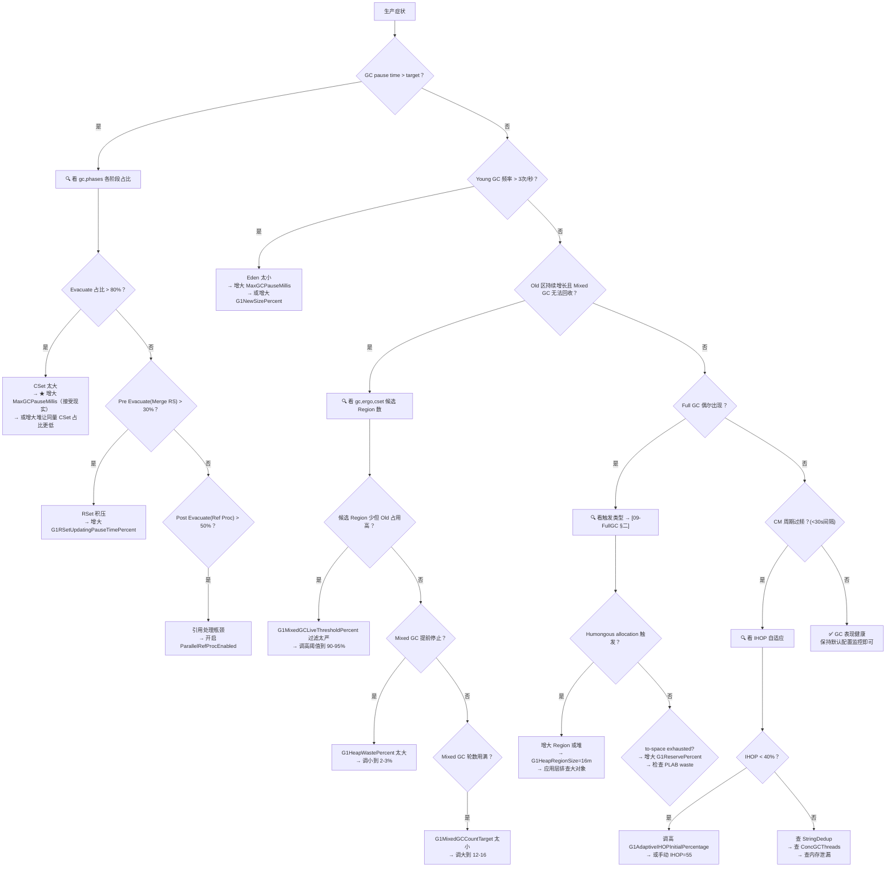

# A1-G1-Tuning: G1 GC 调优实战指南 —— 从源码理解到生产调优

> **元信息**
>
> | 项目 | 说明 |
> |------|------|
> | **标准环境** | OpenJDK 11 slowdebug, `-Xms8g -Xmx8g -XX:+UseG1GC -XX:MaxGCPauseMillis=200`, G1 Region=4MB (2048 Regions), 64位Linux x86 |
> | **前置文档** | 已阅读 [01]~[11] 的 G1 源码分析系列（参见 §〇 文档索引表） |
> | **阅读收益** | 能够端着 GC log 定位瓶颈 → 选出正确参数 → 给出源码级别的"为什么是这个值" → 验证调参效果 |
> | **独特价值** | **每个建议值都有源码因果链支撑**（追溯到 Region 4MB、CardTable 512B、PLAB waste、gc_efficiency 排序），不是"经验值"或"Oracle 推荐" |

---

## §〇 文档索引

本文是 12 篇 G1 深度源码分析文档的"实战转换器"——把源码理解转化为生产决策。

### 已有文档交叉引用

| 文档 | 本文引用点 |
|------|-----------|
| [01] HeapRegion | Region 4MB 的 tradeoff、free_list 结构、G1HeapRegionSize |
| [02] ObjectAllocation | Humongous 分配风暴排查、attempt_allocation_slow 持锁 expand |
| [03] YoungGC | Evacuation Failure 处理、Work Stealing 机制、MaxTenuringThreshold/ageTable |
| [04] CardTable-RSet | RSet 更新消耗、G1RSetUpdatingPauseTimePercent |
| [05] SATB-Barrier | SATB 激活窗口（CM 期间 Concurrent Refinement 开销影响） |
| [06] ConcurrentMark-Core | ConcGCThreads 的 CPU 竞争、时间片控制 |
| [07] ConcurrentMark-Phases | CM Cleanup 阶段 Humongous in-place 回收 |
| [08] MixedGC-Policy | IHOP 自适应、gc_efficiency、G1MixedGCCountTarget、G1HeapWastePercent、G1MixedGCLiveThresholdPercent、G1NewSizePercent |
| [09] FullGC | 三条触发路径排查 |
| [10] PLAB | PLAB waste rate → to-space 利用效率 → Evacuation Failure 排查 |
| [11] Reference-Processing | ParallelRefProcEnabled 的影响范围 |

### 聚焦源文件

| # | 文件 | 核心用途 |
|---|------|------|
| 1 | `g1Policy.cpp` / `g1Policy.hpp` | MaxGCPauseMillis → `_young_list_target_length` 计算、IHOP 自适应 |
| 2 | `g1IHOPControl.cpp` | G1AdaptiveIHOPControl 的自适应算法 |
| 3 | `g1Analytics.cpp` | allocation rate、pause time 预测 |
| 4 | `g1CollectedHeap.cpp` | heap expand/shrink、G1ReservePercent 使用 |
| 5 | `g1ConcurrentMark.cpp` | `scale_concurrent_worker_threads()` → ConcGCThreads 推导 |
| 6 | `collectionSetChooser.cpp` | gc_efficiency 排序 + G1HeapWastePercent 止损 |
| 7 | `g1RemSet.cpp` | G1RSetUpdatingPauseTimePercent 应用 |
| 8 | `g1YoungGenSizer.cpp` | G1NewSizePercent / G1MaxNewSizePercent 边界计算 |
| 9 | `g1_globals.hpp` | 所有 G1 参数声明 + 默认值 + 约束范围 |
| 10 | `abstract_vm_version.cpp` | `nof_parallel_worker_threads(5, 8, 8)` → ParallelGCThreads 推导 |

---

## §一 ★ 调优方法论 —— 不是调参数，是调决策链

### 1.1 调优的本质：G1 的所有参数都在控制同一个决策循环

> **不要空想"这个参数调大调小分别会怎样"——先看懂参数影响的是 G1Policy 决策循环的哪一环。**

```
G1Policy 的决策循环（简化 5 步）：
┌───────────────────────────────────────────────────────────────────────┐
│  ① MaxGCPauseMillis → _young_list_target_length                      │
│     ↓                                                                 │
│  ② _young_list_target_length → Eden 大小（多少个 Region）             │
│     ↓                                                                 │
│  ③ Eden 大小 → GC 频率（= allocation_rate / Eden_size）               │
│              → 两轮 GC 之间的 promotion 量（影响 Old 增长速度）        │
│     ↓                                                                 │
│  ④ allocation rate + promotion rate → Old 增长速率 → IHOP 触发        │
│     ↓                                                                 │
│  ⑤ IHOP 触发 → CM → Mixed GC（gc_efficiency 排序回收 Old）           │
│     → 回到 ①：新的 _young_list_target_length                         │
└───────────────────────────────────────────────────────────────────────┘
```
**为什么 pause time 不在因果链里？** pause time 是 CSet 大小的**同义反复**（CSet 大 = pause 长），它不是独立变量。真正驱动循环的是 Eden 大小决定的 GC 频率——Eden 越小 → GC 越频繁 → 每次 promotion 量越小 → Old 增长更"均匀分散"而非"集中爆发"。**你要调优的是"频率 vs 单次量的平衡"，不是 pause time 这个结果。**

**★面试追问：为什么大 Eden 能压低 Old 净增长速率？** 不是"每次 promotion 少了"（实际上单次 promotion 量变大），而是**对象死亡窗口变大**了。Eden 从 100 Regions → 200 Regions：对象在被 promote 到 Old 前**经历了更多轮 Young GC**。短命对象（活 2-3 次 GC 就死）在大 Eden 下到第 3 次 GC 时还在 Young Gen，已经死了——从未进过 Old。这是"大 Eden 降低 Old 增长"的正和效应，不是简单的频率-单次量 tradeoff。

**核心洞察**：你在改变一个参数时，是在改变上述循环的某个环节。**单参数调优是伪命题**——改`MaxGCPauseMillis`会影响 Young GC 频率，进而影响 Old 增长速率，进而影响 IHOP 触发，进而影响 Mixed GC。调优的本质是理解这个因果链，然后**选对"杠杆点"**。

### 1.2 调优四步法

```
步骤 1：看症状 — 从 GC log 提取量化的异常指标（频率、时长、增长速率）
  工具：-Xlog:gc*=info（基础）+ 聚焦排查集（按需）

步骤 2：定瓶颈 — 判断瓶颈在决策循环的哪一环
  - Young GC 频率太高 → ① 或 ②
  - pause time > target → ②（CSet 太大）
  - Old 持续增长 → ④（IHOP 没拦住）
  - Mixed GC 回收太少 → ⑤（gc_efficiency 过滤太严）
  - Full GC 出现 → [09-FullGC §二] 三条触发路径

步骤 3：改参数 — 按因果链选参数，不是翻手册
  改了参数必须能说清"它动了决策循环的哪一环"

步骤 4：验证 — 看日志确认预期效果，不是"感觉快了"
  每次改参后看对应的日志字段（本文每个参数都标注了验证字段）
```

### 1.3 ★ 设计替代分析：如果所有参数都用默认值，什么场景会出问题？

**场景 A：4GB 堆 + 高 allocation rate（每秒 200MB+）**

| 参数 | 默认值 | 4GB 下实际表现 | 问题 |
|------|--------|---------------|------|
| Region 大小 | 2MB（自动，4GB / 2048 = 2MB，恰好是 2¹ MB） | 4GB / 2MB = 2048 Regions | 无问题 |
| G1NewSizePercent | 5% | 5% × 4GB = 200MB = 100 Regions（Young Gen 总大小；SurvivorRatio=8 → Eden≈80%、Survivor≈20%） | Eden≈80 Regions（160MB），高 allocation rate 下 Young GC 约每 0.8 秒一次（200MB/s / 160MB Eden） |
| MaxGCPauseMillis | 200ms | 允许 CSet ~50 Region ≈ 100MB | CSet 约束住了 Eden（100→50），GC 频率翻倍 |
| IHOP | 45% | 45% × 4GB = 1.8GB Old | Old 从初始到 1.8GB 很快→ CM 频繁→ CPU 浪费 |
| **结论** |  | 高 allocation rate 下 CM 几乎不停（4GB 堆下 IHOP 窗口只有约 900MB Old，promotion 很快填满） | **增大堆到 8GB+，或增大 G1NewSizePercent** |

**场景 B：MaxGCPauseMillis = 10ms 会怎样？**

```
10ms 预算 ÷ ~4ms/Region（RSet扫描+Evacuation，实际1-20ms波动） 
  → _young_list_target_length ≤ 2 个 Region（G1Policy 的计算会压到边界）

但 G1NewSizePercent=5% 硬限制了 Eden ≥ 5% 堆：
  8GB × 5% = 400MB = 100 Regions

因此 _young_list_target_length 被夹在 [100, 60%堆] 之间
  → G1Policy 无论怎么预测都无法让 CSet < 100 Regions
  → 实际 Young GC 的 pause time ~50-100ms（100 Region × ~0.5-1ms 典型耗时）
  → **10ms target 完全不起作用**，GGTolerance 会持续报超限
```

**核心结论**：`MaxGCPauseMillis` 的**有效下限由 `G1NewSizePercent × HeapSize / RegionSize` 决定**。你想设 10ms，但 Eden 的 100 个 Region 扫描起来就是 50ms+，这是 Region 粒度决定的物理下限。

---

## §二 ★★ 核心参数 —— 13 个参数 × 每个"为什么是这个默认值"

> **阅读提示**：每个参数按"管什么 → 为什么是这个默认值（源码因果链或工程推导）→ 调大/调小→ 场景 → 值 → 验证"的模板组织。
> 按排查链路排列（不是字母序）：前 4 个是"调 GC 节奏"的杠杆，中间 4 个是"调 GC 内部效率"的杠杆，后 5 个是"高级/特殊场景"杠杆。
>
> **诚实声明**：部分参数的默认值（如 G1HeapWastePercent=5%、G1MixedGCCountTarget=8）来自 benchmark 实测调优而非纯数学推导——本文会诚实标注哪些是"源码公式推导"，哪些是"经验最优（benchmark 验证）"，并给出为什么这个经验值在该数量级的定性分析。这比"Oracle 推荐"强了不止一个层次。

---

### 2.1 MaxGCPauseMillis —— 停顿目标

| 属性 | 值 |
|------|-----|
| **管什么** | 告诉 G1Policy "你每次 GC pause 不要超过这个时间"，G1Policy 据此反推 `_young_list_target_length`（Eden 最多几个 Region），间接控制 Young GC 频率 |
| **默认值** | **200ms** |
| **声明位置** | `globals.hpp`（非 G1 专属，所有 GC 共用） |

#### ★ 为什么是 200ms？（三层论证）

**第一层：人类感知阈值**。200ms 是人类对 UI 停顿的主观感知分水岭——超过 200ms 用户有明显卡顿感，低于 200ms 为"可接受延迟"。这不是从 Region 数学推导出来的，而是**产品体验驱动的选择**。

**第二层：200ms 在 Region 数学下能做什么？** 在 4MB Region + 典型 workload 下：
- 200ms 预算 ÷ ~4ms/Region（RSet 扫描 + Evacuation 的平均耗时，实际 1-20ms 波动取决于 RSet 卡片密度和对象平均大小）→ 允许 CSet ≈ 50 Region
- 50 Region × 4MB = 200MB Eden → 中等 allocation rate（~100MB/s）下 Young GC 频率 ≈ 2 次/秒
- 频率 × 单次 pause = 总 GC 开销 ≈ 0.4% 的 wall time → 可接受

**第三层：源码链路**。G1Policy 在每次 Young GC 后用 `G1Analytics` 预测下次 GC 的 `rs_lengths`（RSet 扫描量）和 Evacuation 耗时，结合 `MaxGCPauseMillis` 反推 CSet 可容纳的 Region 数 → 存为 `_young_list_target_length`。详见 [08-MixedGC-Policy §三]。

#### ★ 改大会怎样？
`CSet 变大 → 单次 pause 更长 → Young GC 频率降低`

**两条对 Old 的影响互相抵消**：
- 单次 promotion 量变大（Eden 更大 → 单次 GC 中活过 threshold 的对象更多 → 一次 promote 进 Old 的量更大）
- 但对象在 Young Gen 停留更久 → **更多短命对象在晋升前自然死亡** → 总 promotion rate（bytes/sec）可能**反而降低**

哪个效应占主导取决于对象生命周期分布：
- 大部分对象活 < 5 次 GC → 大 Eden 让它们多活几轮才遇到 threshold → 更多自然死亡 → total promotion ↓（好事）
- 大部分对象活 > 15 次 GC（真长命）→ 不管 Eden 多大他们都会晋升 → total promotion 大致不变

净效果：大 Eden 通常降低 Old 增长速率（除非应用几乎全是长命对象）。这个效应才是"为什么放宽 pause target 不一定会让 Old 爆得更快"的深层原因——不是简单的"频率低→每次量大→总量持平"（那是零和思维），而是"频率低→对象死亡窗口大→总量可能变少"（正和效应）。

**副作用**：MMUTracker 的压力。如果多次 Young GC 的间隔变长但单次 pause 变大，`G1MMUTracker` 可能在时间窗口内检测到更多超限事件 → G1Policy 可能在下个周期收紧 CSet。但这属于 G1Policy 的自适应调节，不会导致灾难。

**关键副作用**：单次 promotion 量的绝对值变大。如果这个值超过了 Survivor 的承受能力，可能触发 Evacuation Failure。

#### ★ 改小会怎样？
`CSet 变小 → 单次 pause 更短 → Young GC 频率升高 → GC 固定 overhead（~1ms STW 协调）占比升高 → throughput 下降`

**为什么不能无限小**：Region 4MB 是 CSet 的最小粒度。如果 target = 10ms，理论上 CSet 只能容纳 ~2 个 Region。但 [08-MixedGC-Policy §一] 中的 `G1YoungGenSizer` 有硬限制：Eden 最小 = 堆 × 5%（G1NewSizePercent）。8GB 堆下 Eden 至少 100 个 Region → 实际 pause 至少 ~50ms——**10ms target 形同虚设**。详见 [2.11 G1NewSizePercent]。

#### 什么场景调？
| 症状 | 方向 | 原因 |
|------|------|------|
| GC pause 长期 > target → `G1GCPhaseTimes` 的 `evacuation` > 200ms | 要么调大 target，要么减 Eden | 物理上做不到：Eden 太大，Region 数太多 |
| Young GC 频率 > 3 次/秒，pause 却 < 100ms | 调大 target | 说明 G1Policy "过于保守"——可以放宽给更多 Eden |
| 延迟敏感型应用（在线交易） | 调小到 **50-100ms** | 但必须同步调大堆（否则 Eden < 堆×5% 后无法再缩小） |

#### 调到多少？

```
低延迟应用（API 网关、交易系统）：
  -XX:MaxGCPauseMillis=50-100
  前提：堆 ≥ 12GB，确保 5% Eden 仍能容纳足够对象

通用 Web 应用：
  -XX:MaxGCPauseMillis=200（默认即可）

批处理 / 大数据（throughput 优先）：
  -XX:MaxGCPauseMillis=500-1000
  配合 -XX:GCTimeRatio=19（GC 时间占 application 时间的 1/(1+19)=5%，允许慢但控制总比例）
```

#### 验证方式
```
-Xlog:gc+phases=debug:file=/tmp/gc-phases.log
↓ 看
[gc,phases] GC(42)   Evacuate Collection Set: XX.Xms
```
**如果 Evacuate > MaxGCPauseMillis 持续发生**：要么 CSet 太大（调大 target 接纳现实，或减小 Eden 供应），要么 Evacuation 本身慢（排查 PLAB waste、Survivor 不足 → 见 [§三 场景 2]）。

---

### 2.2 -Xms / -Xmx + G1ReservePercent —— 堆大小 + 预留空间

| 参数 | 默认值 | 管什么 |
|------|--------|--------|
| `-Xms` / `-Xmx` | 必须用户指定 | 堆的初始和最大大小 |
| `G1ReservePercent` | **10%** | 堆中保留不给分配的"安全垫"，用于 Evacuation 的 to-space headroom |

#### -Xms = -Xmx 还是不一样大？

**推荐 `-Xms = -Xmx`**（生产环境）。原因链：

```
-Xms < -Xmx → 运行时可能 expand
  → expand 需要 commit memory + update page table → 额外延迟
  → G1CollectedHeap::attempt_allocation_slow() 中 expand 持 Heap_lock（[02-ObjectAllocation §三]）
  → 阻塞正在 new 的其他线程（这是"分配竞争"，不是全 STW，但延迟远小于一次 Young GC）
  → 如果 expand 发生在高 allocation rate 下 → 连锁放大延迟
```

**`-Xms < -Xmx` 的唯一理由**：节省物理内存（堆没用到时不 commit），适用于容器化/共享环境。代价：expand 时有短暂的分配阻塞。

#### ★ G1ReservePercent —— 为什么 G1 要预留 10%？

```
源码：g1_globals.hpp:188
product(uintx, G1ReservePercent, 10,
  "It determines the minimum reserve we should have in the heap "
  "to minimize the probability of promotion failure.")
```

**因果链**：

```
Evacuation 阶段，GC worker 把 CSet 中的活对象 copy 到 to-space（Survivor / Old）
  → to-space 需要 headroom（GC worker 在做 bump-pointer allocation，类似 mutator 的 TLAB）
  → 如果 to-space 不够 → Evacuation Failure（to-space exhausted）
     → 失败 Region 标记 RETAINED → 等 Mixed GC 回收 → 大延迟
     → 多次连续 Evac Failure → Full GC

G1ReservePercent = 10% 的含义：
  8GB 堆预留约 800MB。这部分空间平时不用于分配，只在 Evacuation 时作为 buffer
  → 假设 CSet max ≈ 60% 堆 ≈ 4.8GB，活对象 50% ≈ 2.4GB 需要 copy
  → to-space = Old(非CSet) + 预留 800MB
  → 预留足够容纳 promotion spikes
```

**为什么 10% 不是 5% 或 20%？** 这是经验折中：5% 预留太少 → Evacuation Failure 概率增大（尤其在 Survivor 不足 + promotion spike 时）。20% 预留太多 → 8GB 堆实际可用 6.4GB → 有效堆缩水 20%。10% 在两者间取得平衡。详见 [03-YoungGC §七] 的 Evacuation Failure 处理。

#### 什么场景调？

| 症状 | 动作 |
|------|------|
| `to-space exhausted` 频繁出现 | 增大 `G1ReservePercent` 到 15-20% |
| 堆内存紧张（堆实际可用太小） | 减小 `G1ReservePercent` 到 5%（但需监控 Evac Failure） |
| Humongous 分配风暴 | 增大堆（-Xmx），而非调 G1ReservePercent |

#### 验证方式
```
-Xlog:gc+ergo+heap=debug
↓ 看
[gc,heap] GC(42) Eden: ... Survivor: ... Old: ... Humongous: ...
```
如果 Old 区在 GC 后接近 `HeapSize × (100% - G1ReservePercent)` → 预留空间基本用完 → 风险高。

---

### 2.3 G1HeapRegionSize —— Region 大小

| 属性 | 值 |
|------|-----|
| **管什么** | G1 的最小管理单元大小（堆 / 2048，自动取 2^n MB，范围 1MB~32MB） |
| **默认值** | **自动计算**（8GB 堆 → 8GB/2048 ≈ 4MB） |
| **声明位置** | `g1_globals.hpp:196` → `product(size_t, G1HeapRegionSize, 0, ...)` → 0=自动 |
| **核心约束** | Region 总数必须在合理范围（下限由 JVM 内部断言保证，上限 ~4096），Region 大小必须是 2 的幂（`1<<n` MB），范围 [1MB, 32MB] |
| **致命错误** | `-XX:G1HeapRegionSize=24m` 会**启动失败**——24MB 不是 2 的幂。G1 只接受 1, 2, 4, 8, 16, 32 MB |

#### ★ 为什么默认值是 4MB（在 8GB 堆下）？

这不是"选的 4MB"，而是**公式推导出的 4MB**：

```
Region 总数目标 ≈ 2048（核心设计：2048 是 G1 假定的平衡点）
堆 8GB ÷ 2048 = 4MB → 恰好是 2² MB
```

**为什么是 2048 个 Region？** 这是 G1 设计的核心 tradeoff：
- Region 太少 → 碎片粒度过大 → 一个小 Humongous 对象要独占整个 Region → 浪费严重
- Region 太多 → RSet 管理开销过大 → 每个 Region 都要维护自己的 RSet → 内存 + 扫描开销

#### ★ 为什么不是 1MB？

```
8GB / 1MB = 8192 Regions
  → RSet 扫描开销 ×4（oops_into_cset_do 需要遍历的 RSet 数 ×4）
  → RSet 管理内存增加（每个 Region 一个 RSet 对象，数量 ×4，但单个 RSet 更小——
     因为每个 Region 持有更少对象，被其他 Region 引用的概率更低。
     总内存增长是亚线性的，但 Region 数×4 的固定开销（对象头、索引）不能忽略）
  → Young GC 的 RSet 扫描耗时近似线性增长（遍历 8192 个而非 2048 个 RSet）
```

**关键洞察**：RSet 内存问题和扫描开销是两件不同的事。内存方面，RSet 三级结构（SparsePRT→FinePRT→Coarse）的总内存取决于 incoming reference 数，而非 Region 总数——更多 Region 意味着单个 RSet 更小，总内存近似不变。**扫描开销**才是主要问题：`oops_into_cset_do` 遍历所有 Region 的 RSet 找指向 CSet 的引用，Region 越多遍历越久。

更重要的是：JVM 用一个 byte 表示 Region 类型（`HeapRegionType`），Region 数超过 2048 时内部索引开销也开始膨胀。

#### ★ 为什么不是 16MB？

```
16MB Region:
  8GB / 16MB = 512 Regions → 碎片粒度 16MB

问题 1：Humongous 浪费（[02-ObjectAllocation §八]）
  → 一个 2.1MB 对象 = Humongous（> 50% Region = 8MB）
  → 独占 1 个 16MB Region → 14MB 浪费

问题 2：Eden 粒度太粗
  → G1Policy 调整 young_list_target_length（[08-MixedGC-Policy §三]）
  → Eden = target_length × 16MB
  → 16MB 粒度让 Eden 调整的"步长"变为 16MB
  → 无法精细控制 pause time

问题 3：Survivor 浪费
  → 2048 × 5% = 102 Regions（最小年轻代）
  → 如果每个 Survivor Region 利用率只有 30%，16MB × 70% × N 个 Region = 巨大浪费
```

#### 什么时候手动设？

| 堆大小 | 自动 Region 大小 | 是否需要调？ |
|--------|-----------------|-------------|
| ≤ 32GB | 1MB ~ 16MB | **不需要**，自动计算合理 |
| 32GB ~ 64GB | 16MB ~ 32MB | **可能有风险** — Region 16MB+ 导致 Humongous 阈值 8MB+，但碎片粒度也变大 |
| > 64GB | 32MB | **肯定需要** — 32MB Region 的碎片粒度过大，建议手动设为 16MB |

**手动设置公式**：
```
推荐：-XX:G1HeapRegionSize=N
  N = 2^n MB，且堆 / N 在 [512, 4096] 之间

示例：64GB 堆 → 推荐 16MB（64GB/16MB = 4096 Regions，上限附近）
```

#### 验证方式
```
-Xlog:gc+region=trace
↓ 看
Heap Region Size: 4M
```

或者通过 `jinfo` 查看运行时值，但 **Region 大小是启动参数，不能运行时改**。

---

### 2.4 InitiatingHeapOccupancyPercent (IHOP) —— 并发标记触发阈值

| 属性 | 值 |
|------|-----|
| **管什么** | Old 区占用率达到此百分比时，触发 Concurrent Mark 周期（Initial Mark） |
| **默认值** | **45%** |
| **自适应** | `-XX:+G1UseAdaptiveIHOP`（默认开启）→ G1AdaptiveIHOPControl 根据历史数据动态修正 |
| **声明位置** | `globals.hpp`（非 G1 专属，所有 generational GC 共用） |

#### ★ 为什么是 45%？（公式推导）

**核心公式**：

```
IHOP 的语义 = 给 CM 预留 (100% - IHOP%) 的 Old 空间作为"标记窗口"

CM duration（Initial Mark → Cleanup）≈ T_cm 秒
CM 期间 Old 净增长速率 = allocation_rate + promotion_rate（Old 同时接收 Humongous + promotion）
CM 期间 Old 增长量 = T_cm × 净增长速率

安全条件：
  净增长量 < (100% - IHOP) × (1 - G1ReservePercent) × Old 总容量
  即：T_cm × rate < 55% × 0.9 × Old_size ≈ 49.5% × Old_size
```

**为什么不是 70%？** → 留 30% Old = 在 8GB 堆下约 1.2GB（假设 Old = 50%堆）。如果 allocation rate + promotion rate = 200MB/s → 只有 6 秒窗口 → CM 通常需要 2-10 秒 → 很容易溢出 → allocation failure → Full GC。

**为什么不是 20%？** → CM 频繁但找不到可回收 Old Region（对象大部分还活着）→ CPU 浪费在无效 CM 周期上 → Mixed GC 回收量极少 → 纯浪费。

**45% 的本质**：给 CM 留出 `(100%-45%)×(1-10%) ≈ 49.5%` 的 Old 空间作为"标记窗口"（扣除 G1ReservePercent=10% 的保留空间后）。在典型 workload 下（Old 净增长 ~5-10% heap/min），这个窗口足够 CM 完成而不 overflow。详见 [08-MixedGC-Policy §二] 的 G1AdaptiveIHOPControl 分析。

#### 自适应模式做了什么？

```
G1AdaptiveIHOPControl（[08-MixedGC-Policy §二]）：

观察 N 个 CM 周期（G1AdaptiveIHOPNumInitialSamples=3）
  → 记录 Mark Start 时的 Old occupancy
  → 记录 Mixed GC 结束时的 Old 谷值
  → 计算"如果能提前/推迟启动，能回收多少"

自适应修正公式：
  IHOP_adjusted = Old_current + (allocation_rate × predicted_marking_time)
  → 如果 allocation rate 升高 → IHOP 下调（更早触发 CM）
  → 如果 allocation rate 降低 → IHOP 上调（更晚触发 CM）

如果自适应偏太低（CM 过频）：
  → 先试：-XX:G1AdaptiveIHOPInitialPercentage=55（只改初始值，自适应继续跑）
  → 最后手段：-XX:-G1UseAdaptiveIHOP -XX:InitiatingHeapOccupancyPercent=55（关自适应，手动设）
```

#### 什么场景调？

| GC log 症状 | 诊断 | 参数动作 |
|------------|------|---------|
| CM 周期间隔 < 10 秒，但 Old 增长慢 | 自适应偏太低 | 调高初始值到 50-55% |
| CM 周期后频繁触发 Full GC | IHOP 太高或 marking 太慢 | 调低到 35-40%，或增大 ConcGCThreads |
| Old 持续 > 70%，但 Mixed GC 回收量很少 | Old 对象大多长命 | 这不是 IHOP 问题，而是 [§三 场景 3]——增大堆或排查泄漏 |

#### 调到多少？

```
默认适用大部分场景。仅在以下情况手动调：

低 allocation rate 应用（缓存、配置服务）：
  -XX:InitiatingHeapOccupancyPercent=55-60
  原因：Old 增长慢，45% 触发太早

高 allocation rate 应用（流处理、消息队列）：
  -XX:InitiatingHeapOccupancyPercent=35-40
  原因：Old 增长快，需要更早开始标记
```

#### 验证方式
```
-Xlog:gc+ergo+ihop=trace
↓ 输出
[gc,ergo,ihop] IHOP 自适应信息（当前目标 occupancy、预测的 marking time 等）
```

**如果手动设 IHOP=50，确认生效**：看 Initial Mark 触发时 `[gc,heap]` 中 `Old: XXXXM` 是否接近 50% × MaxHeapSize。

---

### 2.5 ConcGCThreads —— 并发标记线程数

| 属性 | 值 |
|------|-----|
| **管什么** | Concurrent Mark 阶段使用的 GC worker 线程数 |
| **默认公式** | `ConcGCThreads = MAX2((ParallelGCThreads + 2) / 4, 1)` — 约 **ParallelGCThreads / 4** |
| **源码位置** | `g1ConcurrentMark.cpp:367` `scale_concurrent_worker_threads()` |

#### ★ 源码公式解析

```cpp
// g1ConcurrentMark.cpp:367-368
static uint scale_concurrent_worker_threads(uint num_gc_workers) {
  return MAX2((num_gc_workers + 2) / 4, 1U);
}
```

| CPU 核数 | ParallelGCThreads (≈) | ConcGCThreads (公式) |
|----------|----------------------|---------------------|
| 4 | 4 | `(4+2)/4 = 1` |
| 8 | 8 | `(8+2)/4 = 2` |
| 16 | 13 (8+8×5/8) | `(13+2)/4 = 3` |
| 32 | 23 | `(23+2)/4 = 6` |
| 64 | 43 | `(43+2)/4 = 11` |

#### ★ 为什么是 ~1/4 而不是等量？

**核心矛盾**：CM 线程和 mutator 线程**共享同一组 CPU 核**。

```
如果 ConcGCThreads = ParallelGCThreads（13 核 = 13 个 CM 线程）：
  → CM 线程和 mutator 在 13 核上激烈竞争，OS 调度器频繁切换
  → mutator 实际可用 CPU 降到 ~30-40%（CM 的 do_marking_step 每 10ms yield 一次，
     但 13 个 CM 线程轮番占用后 mutator 几乎无连续 CPU 时间片可用）
  → allocation rate 大幅下降到正常水平的 10-20% → 应用吞吐崩盘
  → 这不是"GC pause"，这是"并发 GC 把 mutator 饿到濒死"
  → ★ 面试追问：有 G1ConcMarkStepDurationMillis=10ms 作时间片控制，
     mutator 为什么还会被饿死？
  → 答：13 个 CM 线程各自每 10ms yield，但它们的 yield 时刻不同步，
     总有一个 CM 线程在跑，13 核几乎没有"全部空闲"的时刻给 mutator

如果 ConcGCThreads = 1：
  → CM 线程在 1 个核上慢慢标记
  → marking speed < allocation rate → Old 持续增长 → 标记窗口耗尽 → Full GC
```

**~1/4 规则的平衡点**：在 13 核场景下，3 个 CM 线程约占总 CPU 的 ~23%，mutator 保留 ~77%。这个比例确保：
- mutator 基本不受影响（~77% CPU 够用）
- CM 有足够推进速度（~23% CPU 用于标记，配合 `do_marking_step` 的时间片控制）

这是 Amdahl 定律在并发 GC 场景的应用：GC 本身不是 100% 可并行，并发阶段和 mutator 共享 CPU 时需要留出"mutator headroom"。详见 [06-ConcurrentMark-Core §四]。

#### ★ 调大/调小 的因果链

```
调大（如设为 ParallelGCThreads / 2）：
  → CM 更快结束 → Old 在 CM 期间的净增长少 → IHOP 窗口更大
  → 但 mutator 只剩 50% CPU → allocation rate 下降 → **应用吞吐降一半**
  → 仅适用于：CPU 核心数远多于应用需要的场景

调小（如设为 1）：
  → CM 变慢 → marking time 拉长 → Old 在标记期间增长更多
  → CM 还没结束 Old 就可能 overflow → Full GC 风险
  → 仅适用于：CM 周期中 Old 增长很慢的场景
```

#### 什么场景调？

| 症状 | 动作 |
|------|------|
| CM 周期时长 > 5 秒（Initial Mark→Cleanup），Old 持续增长 | 增大到 `MAX2((ParallelGCThreads+2)/3, 2)` |
| CM 期间应用吞吐明显下降（CPU 利用率 < 80%） | 减小到 `MAX2((ParallelGCThreads+2)/5, 1)` |
| CM 周期结束不到 10 秒又触发新的 CM | 可能不是 ConcGCThreads 问题 → 查 IHOP |

#### 验证方式
```
-Xlog:gc+ergo+cset=trace
↓ 对比 CM 周期间隔
[gc,start] GC(42) Pause Initial Mark (G1 Evacuation Pause)
[gc       ] GC(52) Pause Cleanup
→ Initial Mark (GC#42) → Cleanup (GC#52) ≈ CM 周期时长
```

---

### 2.6 G1RSetUpdatingPauseTimePercent —— RSet 更新占停顿时间比例

| 属性 | 值 |
|------|-----|
| **管什么** | 每次 GC pause 中，最多用总 pause 的 X% 来更新 RSet（处理 dirty cards） |
| **默认值** | **10%** |
| **声明位置** | `g1_globals.hpp:145` |

#### ★ 为什么是 10%？

**因果链**：

```
GC pause 有三件事要干：
  ① RSet 更新（处理 dirty card buffer → 更新各 Region 的 RSet）  — 在 Pre Evacuate 阶段
  ② Evacuation（CSet 中活对象 copy 到 to-space）                   — 在 Evacuate 阶段
  ③ Post-Evacuate（重建 RSet、Reference Processing、Free CSet）    — 在 Post Evacuate 阶段

如果 ① 占太多时间 → 本次总 pause 超过 target
  → G1Analytics 记录更长的 pause time 历史
  → 下次 GC 时 G1Policy 基于预测反推 → 下次 _young_list_target_length 缩小
  → 下次 CSet 缩小 → GC 频率升高 → throughput 崩
  
  ★ 注意顺序：RSet 更新时间不影响**本次**的 CSet（CSet 在 pause 开始前已选定），
  它影响的是**下一次** GC 的 CSet —— 这中间隔着 G1Analytics 的预测模型

如果 ① 占太少时间 → dirty cards 残留多 → 下次 GC 的 RSet 扫描开销更大
  → 等于"把今天的债推到明天还"
```

**10% 的权衡**：200ms × 10% = 20ms 给 RSet 更新，剩余 180ms 给 Evacuation + Post-Evacuate。
  → 平衡了一次 GC 内的"当前偿还"和"跨 GC 的继承开销"

详见 [04-CardTable-RSet §二] 的 DirtyCardQueue 消费流程。

#### ★ 调大/调小 的因果链

```
调大（如 20%）：
  → 本次 RSet 更新更彻底（更多 dirty cards 被处理）
  → 但本次 pause 可能超 target
  → G1Analytics 记录更长 pause → 下次 CSet 被缩小 → 下次 GC 频率升高
  → RSet 更新是"固定开销"（和 CSet 大小基本无关——dirty cards 由 mutator 写入决定）
  
  特殊风险：如果 CSet 本身很小（如 10 个 Region），RSet 更新的绝对开销占总 pause 比例本来就高，
  再调大 RSetUpdatePercent 可能让 G1Policy 预测的 CSet 越来越小 → 恶性循环

调小（如 5%）：
  → 本次 pause 更短 → 更多时间留给 Evacuation
  → 但 dirty cards 残留多 → 下次 GC 的 RSet 扫描阶段（Merge RS）更重
  → 等于"从一次 GC 借时间，跨到下一次还"
```

#### 什么场景调？

| 症状 | 动作 |
|------|------|
| `[gc,phases]` 中 `Merge RS` 或 `Update RS` > 20% 总 pause | 说明 dirty cards 积压过多 → 先查 G1ConcRefinementThreads 是否太小 |
| 连续 GC 的 `Pre Evacuate` 阶段越来越长（RSet 扫描越来越重） | 调大到 15-20%，"多还债" |
| RSet 更新占比 < 5%，但 Young GC 很频繁 | 调小到 5%，把时间释放给 Evacuation |

#### 验证方式
```
-Xlog:gc+phases=debug
↓ 看
[gc,phases] GC(42)   Merge RS: X.Xms    ← RSet 更新
[gc,phases] GC(42)   Evacuate Collection Set: X.Xms  ← 主要回收阶段
```
**Merge RS / (Merge RS + Evacuate + Post Evacuate) → 和 10% 对比**。

---

### 2.7 G1MixedGCCountTarget —— Mixed GC 最大轮数

| 属性 | 值 |
|------|-----|
| **管什么** | 一次 CM→Mixed GC 周期内，最多做几轮 Mixed GC |
| **默认值** | **8** |
| **声明位置** | `g1_globals.hpp:246` |

#### ★ 为什么是 8？

**8 的推导**：

```
每轮 Mixed GC：
  → CSet 中 Old Region 数量 = 由 G1OldCSetRegionThresholdPercent（默认 10% 堆）控制
  → 8GB 堆 → 每轮最多 2048 × 10% = 204 个 Old Region（实际少得多，受 pause time 限制）
  → 每轮实际选 ~10-30 个高 gc_efficiency Old Region

8 轮 × ~20 Region/轮 = 最多回收 ~160 个 Old Region
  → 分母应为 Old Region 数量而非全部 2048 个 Region
  → 假设 Old 占用 ~50% 堆（~1024 个 Old Region）：160/1024 ≈ 15.6%
  → 若 Old 占用 ~45% 堆（IHOP 触发点附近 ~922 Regions）：160/922 ≈ 17.3%
  → 这 7.8% 是 gc_efficiency 最高的（垃圾最多的）
  → 超过 8 轮 → 回收的是 gc_efficiency 很低的 Region → 边际收益递减

8 轮不是数学推导，是"边际收益递减的经验上限"
```

gc_efficiency 排序和 CollectionSetChooser 的详细分析见 [08-MixedGC-Policy §四]。

#### ★ 三元过滤链全景

```
CM Cleanup 后，候选 Old Region 经过三层过滤：
  ① G1MixedGCLiveThresholdPercent（85%）— 过滤活对象太多的
     → 活对象 > 85% → 直接排除（成本 > 收益）
  
  ② gc_efficiency 排序 — 按 (回收垃圾字节 / 预期耗时) 从高到低排
     → 每轮取 Top-N 个（N 受 pause time target 和 G1OldCSetRegionThresholdPercent 限制）
  
  ③ G1MixedGCCountTarget（8） + G1HeapWastePercent（5%）— 控制何时停止
     → 轮数到 8 → 或 剩余可回收 < 5% 堆 → 停止 Mixed GC
```

#### 什么场景调？

| 症状 | 动作 |
|------|------|
| Mixed GC 做了 8 轮但 `[gc,heap]` 显示 Old 还有大量可回收空间 | 调大到 12-16 |
| Mixed GC 每轮回收量很少（< 100MB）但仍持续 8 轮 | 减小到 4-6，同时增大 G1HeapWastePercent |

#### 验证方式
```
-Xlog:gc+ergo+cset=trace
↓ 统计一轮 Mixed GC 周期中 CSet 包含 Old Region 的次数
↓ 或看
[gc,heap] Old: XXXXM->YYYYM  ← 如果多轮后 Old 几乎不再减少，说明轮数太多了
```

---

### 2.8 ParallelGCThreads —— GC 并行线程数

| 属性 | 值 |
|------|-----|
| **管什么** | STW GC pause 中使用的 GC worker 线程数 |
| **默认公式** | `cores ≤ 8: = cores`；`cores > 8: = 8 + (cores - 8) × 5/8` |
| **源码位置** | `abstract_vm_version.cpp:349` `nof_parallel_worker_threads(5, 8, 8)` |

#### ★ 源码公式解析

```cpp
// abstract_vm_version.cpp:348-368
unsigned int Abstract_VM_Version::nof_parallel_worker_threads(
  unsigned int num,      // 5 分子
  unsigned int den,      // 8 分母
  unsigned int switch_pt // 8 切换点
) {
  // cores ≤ 8: ParallelGCThreads = cores
  // cores > 8: ParallelGCThreads = 8 + (cores - 8) × 5/8
  // 例：72 核 → 8 + (72 - 8) × 5/8 = 8 + 40 = 48
}
```

| CPU 核数 | ParallelGCThreads | 利用率 (Threads/CPU) |
|----------|-------------------|---------------------|
| 4 | 4 | 100% |
| 8 | 8 | 100% |
| 16 | 13 | 81% |
| 32 | 23 | 72% |
| 64 | 43 | 67% |
| 128 | 83 | 65% |

#### ★ 为什么不是 `= CPU cores`？

**Amdahl 定律**：GC 不是 100% 可并行：
- **Work Stealing 开销**：线程数越多 → TaskQueue 越多 → steal 概率降低，但每个 steal 操作本身有原子开销。超过一定线程数后，steal 的协调开销 > 并行收益
- **线程同步开销**：Termination 协议（`offer_termination`）中线程间的 spin/block 协调开销随线程数超线性增长
- **NUMA 跨 socket 开销**：大机型的 NUMA 拓扑下，跨 socket 的 work stealing 延迟是 local 的 2-3x

5/8 系数是 HotSpot 团队在大规模基准测试（SPECjbb、SPECjvm）上实测的折中点。

详见 [03-YoungGC §六] 的 Work Stealing 小节。

#### 什么场景调？

**一般不需要手动设**——自动计算在大多数场景下是最优的。

| 症状 | 动作 |
|------|------|
| CPU 核数 > 32 且 GC pause 中 CPU 利用率 < 60% | 尝试减小（-20%）减少协调开销 |
| Docker 容器限核（如 4 核但物理机 64 核，自动按 64 算） | **必须手动设** `-XX:ParallelGCThreads=4` |
| 应用是纯 CPU 密集型（GC 和业务高度竞争 CPU） | 适度减小，释放 CPU 给 mutator 的并发阶段 |

**Docker 陷阱**：JVM 默认读取的是物理机 CPU 核数（`os::active_processor_count()`），不是容器限制。在 4 核容器上跑 64 核物理机 → ParallelGCThreads=43 → 43 个 GC 线程抢 4 个核 → 激烈的 context switch → GC 反而更慢。

**★ JDK 版本差异**：
- **JDK 8/9**：默认没有容器感知，**必须手动设** `-XX:ParallelGCThreads=N`（N = 容器核数）
- **JDK 10+**：`-XX:+UseContainerSupport` 默认开启，能读取 cgroup 限制，但仍建议显式设 GC 线程数以防自动计算偏差

**解决方案**：
```
# JDK 8/9（必须）：
-XX:ParallelGCThreads=4 -XX:ConcGCThreads=1

# JDK 10+（推荐）：
-XX:ActiveProcessorCount=4 -XX:ParallelGCThreads=4
# ActiveProcessorCount 显式指定 JVM"认为"有多少核，覆盖 cgroup 读取
```

#### 验证方式
```
jinfo <pid> | grep ParallelGCThreads
```
或 GC log 中 Worker 数量：`[gc,task ] GC(42) Using 13 workers for evacuation`

---

### 2.9 G1HeapWastePercent —— Mixed GC 停止阈值

| 属性 | 值 |
|------|-----|
| **管什么** | 当剩余候选 Old Region 的可回收空间 < 堆的 X% 时，停止 Mixed GC（即使还有候选 Region） |
| **默认值** | **5%** |
| **声明位置** | `g1_globals.hpp:241` |

#### ★ 为什么是 5%？

```
源码定义："Amount of space, expressed as a percentage of the heap size,
           that G1 is willing not to collect to avoid expensive GCs."

三元过滤链第三环（→ [2.7] 全景）：
  ① G1MixedGCLiveThresholdPercent（85%）— 过滤活对象太多的
  ② gc_efficiency 排序 — 每轮选性价比最高的
  ③ G1HeapWastePercent（5%） + G1MixedGCCountTarget（8）— 何时停止

5% 的计算：
  8GB 堆 × 5% = 400MB
  含义：如果再多一轮 Mixed GC 只能回收 < 400MB → 不做了，等下一轮 CM
  一轮 Mixed GC 的 STW ≈ 50ms → 回收 < 400MB → "性价比"太低
```

#### ★ 调大/调小 的因果链

```
调大（如 10%）：
  → Mixed GC 提前停止 → Old 回收不彻底 → Old 更高 baseline → IHOP 更早触发
  → CM 周期变频繁 → CPU 开销增大
  → 但 Mixed GC 总轮数减少 → STW 总时间减少

调小（如 2%）：
  → Mixed GC 做更多轮 → 更多低 gc_efficiency Region 被回收
  → STW 总时间增加 → throughput 下降
  → 但 Old 回收更彻底 → IHOP 延迟触发 → CM 周期间隔拉长
```

#### 什么场景调？

| `[gc,heap]` 观察 | 动作 |
|-----------------|------|
| Mixed GC 停止后 Old 还有大量可回收空间（Old post-GC > 60%） | 调小到 2-3% → 更多轮回收 |
| Mixed GC 最后一两轮 Old 几乎不动（每轮回收 < 100MB） | 调大到 8-10% → 提前止损 |

#### 验证方式
```
-Xlog:gc+ergo+cset=trace
↓ 看
[gc,ergo,cset] GC(42) Finish choosing CSet, candidates: XXX regions, 
  reclaimable: XXXM → 这个 reclaimable vs 堆大小 × 5% 的比较
```

---

### 2.10 G1MixedGCLiveThresholdPercent —— Old Region 候选过滤

| 属性 | 值 |
|------|-----|
| **管什么** | 如果 Old Region 中活对象比例 > X%，排除在 Mixed GC 候选之外 |
| **默认值** | **85%** |
| **声明位置** | `g1_globals.hpp:235` |

#### ★ 为什么是 85%？

```
源码定义："Threshold for regions to be considered for inclusion in the
           collection set of mixed GCs. Regions with live bytes exceeding
           this will not be collected."

三元过滤链第一环（详见 [2.7] 全景）：
  如果 Old Region 活对象 > 85%
    → 需要 copy 的对象 > 85% → 复制开销很大
    → 可回收垃圾 < 15% → 收益很小
    → 成本 > 收益 → 不回收

85% 的含义：
  活对象 85% → 可回收 15% 垃圾
  假设 Region 4MB → 可回收约 600KB 垃圾
  → copy 3.4MB 活对象 + 更新 RSet → 获得 600KB 空间
  → 不如留到下次 CM 再评估（活对象可能已经死了）
```

#### ★ 什么场景调？

| 症状 | 动作 |
|------|------|
| Mixed GC 回收量很少（每轮 < 几百 MB），Old 占用率高 | **调高阈值到 90-95%** → 让更多"活对象 85%-95%"的 Region 进入候选池 |
| Mixed GC 回收的 Region 在下一轮 CM 中几乎没变化（白 copy） | 保持默认或**调低到 80%** |

**注意**：调高阈值意味着更多"几乎全是活对象"的 Region 也被回收 → Evacuation 成本高但可能得不偿失。适合对象 turnover 率高的场景（对象快速死掉）。

#### 验证方式
```
-Xlog:gc+ergo+cset=trace
↓ 看候选 Region 数量 vs 实际被选入 CSet 的数量
如果候选很多但实际被选入的很少 → liveness 过滤可能是瓶颈
```

---

### 2.11 G1NewSizePercent / G1MaxNewSizePercent —— 年轻代边界

| 参数 | 默认值 | 管什么 |
|------|--------|--------|
| `G1NewSizePercent` | **5%** | 年轻代最小占堆比例 |
| `G1MaxNewSizePercent` | **60%** | 年轻代最大占堆比例 |
| 声明位置 | `g1_globals.hpp:223,229` | |

#### ★ 源码公式：年轻代边界如何计算？

```cpp
// g1YoungGenSizer.cpp:73-81
uint G1YoungGenSizer::calculate_default_min_length(uint new_number_of_heap_regions) {
  uint default_value = (new_number_of_heap_regions * G1NewSizePercent) / 100;
  return MAX2(1U, default_value);
}

uint G1YoungGenSizer::calculate_default_max_length(uint new_number_of_heap_regions) {
  uint default_value = (new_number_of_heap_regions * G1MaxNewSizePercent) / 100;
  return MAX2(1U, default_value);
}

// 8GB 堆（2048 Regions）：
//   min_young = 2048 × 5% = 102 Regions = 408MB
//   max_young = 2048 × 60% = 1228 Regions ≈ 4.9GB
```

详见 [08-MixedGC-Policy §一] 的 G1YoungGenSizer 完整分析。

#### ★ 为什么有上下界？

**下限 5%**：
- 防止 Young GC 过于频繁。每次 Young GC 有固定开销 ~1ms（STW 协调 + RSet 更新准备）。如果 Eden 太小 → Young GC 频率太高 → overhead 占比过高
- 5% × 8GB = 400MB Eden → 中等 allocation rate（~100MB/s）下 Young GC 频率 ~4 次/秒 → 开销 ~4‰ → 可接受

**上限 60%**：
- 给 Old 区留至少 40% 空间 → IHOP=45% 时有足够 Old 空间用于标记窗口
- 如果 Young = 60%，Old 最多 = 40%（还要减去 G1ReservePercent 的 10%）→ Old 实际可用 ≈ 30%
- 30% Old 中 IHOP=45% → 13.5% 的 Old 就触发 CM → 标记窗口 ≈ 16.5% Old → 很窄

#### ★ 为什么调 MaxGCPauseMillis 不会让 Eden < 5%？

```
MaxGCPauseMillis → G1Policy 计算 _young_list_target_length
  → 但这个值被 G1YoungGenSizer 硬限制在 [5%堆, 60%堆] 之间
  → 即使 pause time target 要求更小的 CSet，Eden 也不会 < 堆的 5%

这是 pause time target "为什么不能无限小"的硬边界：
  想设 10ms → 实际 Eden 最少 100 个 Region → 实际 pause ≈ 50-100ms
  → 不是 G1Policy 不听话，是 G1YoungGenSizer 说"做不到"
```

#### 什么场景调？

| 症状 | 动作 |
|------|------|
| Old 区长期不足（频繁 Full GC，Old > 80%） | **调小 G1MaxNewSizePercent 到 40%** → 释放更多空间给 Old |
| Young GC 过于频繁（> 5 次/秒），但 pause < 50ms | **调大 G1NewSizePercent 到 10-15%** → 增大 Eden 降低频率 |
| Survivor 空间不足（Evacuation Failure） | 调大 G1NewSizePercent（增大 Survivor）+ 调小 G1MaxNewSizePercent（给 Old 留空间） |

#### 验证方式
```
-Xlog:gc+heap=debug
↓ 看
[gc,heap] Eden: XXXXM(YYYYM)  ← YYYY 是当前 Eden capacity
```
**YYYY 应在 [堆 × 5%, 堆 × 60%] 之间**。

---

### 2.12 ParallelRefProcEnabled —— 并行引用处理

| 属性 | 值 |
|------|-----|
| **管什么** | 是否用多线程并行处理 Reference 发现队列（Soft/Weak/Final/Phantom） |
| **默认值** | **false（关闭）** |
| **声明位置** | `globals.hpp`（非 G1 专属，所有 GC 共享） |

#### ★ 为什么默认关闭？

**CAS 开销 vs 收益的权衡**：

```
串行模式（默认）：
  → ReferenceProcessor::process_discovered_references() 单线程遍历
  → DiscoveredList 无需 CAS → 无原子操作开销
  → 适用于引用数量少的场景（< 1000 个引用）→ 串行就够快了

并行模式（-XX:+ParallelRefProcEnabled）：
  → 多线程并发遍历 DiscoveredList
  → DiscoveredList 需要原子操作（_discovery_is_mt = true）→ 每个引用操作都 CAS
  → 适用于引用数量多的场景（> 10000 个引用）→ 并行收益 > CAS 开销
```

详见 [11-Reference-Processing §四] 的并行路径分析。

#### ★ 什么场景必须开？

**判断条件**：GC log 中 `Post Evacuate` 阶段（含 Reference Processing）耗时 > 总 pause 的 50%，或 `Reference Processing` 子阶段 > 30%。

**典型场景**：
- 大量使用 `WeakHashMap`（每个 entry 产生一个 WeakReference）
- `ThreadLocal` 大量创建/销毁（每个 ThreadLocal 产生一个 WeakReference 指向 ThreadLocalMap.Entry）
- 缓存框架（Guava Cache、Caffeine）大量 SoftReference
- Netty 的 `ResourceLeakDetector`（PhantomReference 追踪）

**效果**：开启后 Reference Processing 耗时可降低 50-70%（[11-Reference-Processing §四] 的并行化分析）。

#### 验证方式
```
# 开启前后分别收集
-Xlog:gc+phases+ref=debug:file=/tmp/gc-ref-{before,after}.log

# 对比
[gc,phases,ref] GC(42) Reference Processing: XX.Xms
```
**如果启用前耗时 > 10ms 且引用数量 > 5000，启用后应有显著下降**。

---

### 2.13 MaxTenuringThreshold —— 对象晋升年龄

| 属性 | 值 |
|------|-----|
| **管什么** | 对象在 Survivor 中经过多少次 Young GC 后自动晋升到 Old |
| **默认值** | **15** |
| **声明位置** | `globals.hpp`（非 G1 专属） |

#### ★ 为什么是 15？

**不是经验值——是 markOop 的硬件位宽限制**：

```
markOop（对象头中的 mark word）用 4 位存储对象年龄：
  → 4 bits → 最大值 2⁴ - 1 = 15
  → 这是 JVM 对象布局的硬件约束，不是 GC 算法的选择

ageTable（[03-YoungGC §二]）：
  → 记录每个 age 的存活对象大小
  → G1 用 ageTable 决定 promotion：当 Survivor 中的对象 age 达到 _tenuring_threshold 时晋升
  → _tenuring_threshold 由 G1Policy 根据 TargetSurvivorRatio 自适应调整
  → MaxTenuringThreshold 只是 _tenuring_threshold 的**上限**
```

详见 [03-YoungGC §二] 的 ageTable 和 promotion 判定。

#### ★ 调大/调小 的因果链

```
调大（从非最大值如 8 → 15）：
  → 对象在 Survivor 停留更久 → 更多短命对象自然死亡（不被晋升到 Old）
  → Old 增长放缓 → IHOP 触发延迟 → CM 频率降低 → CPU 开销减少
  → 代价：Survivor 占用更多 → 如果 Survivor 空间不足可能引发 Evacuation Failure

默认已是最大值（15）无法再调大：
  → 如果 _tenuring_threshold 被自适应算法压低（TargetSurvivorRatio 限制）
  → 调大 MaxTenuringThreshold 到 15 只是解除上限，实际 promotion 仍由自适应决定
  → 需要同时调大 TargetSurvivorRatio（如 90%）让 Survivor 容纳更多龄对象

调小（如 15 → 8）：
  → 对象更快晋升到 Old → Old 更快达到 IHOP → CM 更频繁
  → 好处：Survivor 空间压力减小 → Evacuation Failure 概率降低
```

#### 什么场景调？

| 症状 | 动作 |
|------|------|
| Old 区持续增长且大量对象活不过几秒（短命对象被过早晋升） | **调大到 15（默认已最大）** + 配合 `-XX:TargetSurvivorRatio=90`（增大 Survivor 容量） |
| Survivor 经常满，promotion 压力大 | 调小到 10-12（更快晋升释放 Survivor 空间） |

**重要**：`MaxTenuringThreshold` 只是上限，实际 `_tenuring_threshold` 由 G1 自适应。如果你发现对象过早晋升（Old 增长快 + Survivor 几乎空），检查 `TargetSurvivorRatio`（默认 50%）——它决定了 G1 允许 Survivor 的最大占用率。

#### 验证方式
```
-Xlog:gc+age=trace
↓ 输出每个 age 的存活对象统计
[gc,age] GC(42) Desired survivor size 104857600 bytes, 
  new threshold 6 (max threshold 15)
  - age   1:   52428800 bytes,   52428800 total
  - age   2:   26214400 bytes,   78643200 total
  ...
```
**`new threshold` 是当前自适应阈值，应 ≤ `MaxTenuringThreshold`**。

---

## §三 ★★ 生产场景诊断 —— 3 个高频问题的完整排查

### 3.1 场景 1：Humongous 分配风暴 → 间歇性 Full GC

#### 症状识别
```
GC log 特征：
  → 频繁出现 "Humongous allocation" 日志
  → [gc,heap] 中 Humongous 持续增长
  → 间歇性出现 "Pause Full (G1 Evacuation Pause)" 或 "Pause Full (G1 Humongous Allocation)"
  → pause time 偶发秒级波动
```

#### 根因链（源码级）

```
[02-ObjectAllocation §八]：对象 ≥ 50% Region → Humongous 分配
  → 跳过 Young → 直接在 Old 分配（HumongousStart + 连续的 HumongousContinues）
  → 即使只活 1 秒，也垫高 Old occupancy → IHOP 提前 → CM 周期浪费

[07-ConcurrentMark-Phases §六]：CM Cleanup 阶段 in-place 回收
  → 短命 Humongous（CM 发现全死）→ 直接标 Free → 不需要 Evacuation
  → 但连续空间需求（N 个连续 Region 分配）→ 碎片化后找不到 → Full GC

[09-FullGC §二]：三条触发路径中，Humongous 分配是最"无辜"的
  → 不是 Old 满了，是"连续空间没了"→ Full GC 做压缩 → 制造连续空间
```

#### 诊断步骤

**步骤 1：确认有哪些 Humongous 对象**
```
-Xlog:gc+humongous=debug
↓ 输出示例
[gc,humongous] GC(42) Humongous allocation: word_size 524288 -> 2.0M
```
如果同一个大小的 Humongous 频繁出现 → 可能是某个数据结构。

**步骤 2：应用层排查（优先级最高）**
```
jmap -histo <pid> | grep -E "byte\[\]|String|ByteBuffer" | sort -k3 -n -r | head -20
```
常见来源：
- 大 `byte[]` 缓存（文件读入内存、序列化buffer）
- 大 `String`（日志拼接、JSON/XML payload）
- Netty 的 `PooledByteBuf`（直接内存，非堆）
- Kafka Producer 的 record batch buffer

**第一步应该是应用层优化**——G1 对大对象不友好是设计上决定的（[01-HeapRegion §六]），无法通过调参完全规避。

**步骤 3：无法避免时的 GC 调优**

| 能重启 JVM | 不能重启 JVM |
|-----------|------------|
| `-XX:G1HeapRegionSize=16m`（增大 Region → Humongous 阈值从 2MB 升到 8MB） | 增大 `-Xmx`（给 Humongous 分配留更多连续空间） |
| `-Xms=16g -Xmx=16g`（增大堆） | 开启 `-XX:+G1EagerReclaimHumongousObjects`（JDK 8u40+，默认开启） |

#### ★ 为什么增大 Region 能缓解？

```
默认 4MB Region → Humongous 阈值 = 2MB（> 50% Region）
  → 应用中 2.1MB 的 byte[] 就是 Humongous
  → 独占 1 个 Region（4MB × 1 = 4MB，浪费约 1.9MB）

设 16MB Region → Humongous 阈值 = 8MB
  → 2.1MB 变成常规对象 → 走 Young → 走 Evacuation
  → 不再占用 Old，不再触发 Humongous 路径

代价：
  16MB / 4MB = 碎片粒度 ×4
  但当应用有大量 2-4MB 对象时，这个 tradeoff 是值得的
```

#### ★ Humongous 回收不是只有 Full GC

很多人误解"Humongous 只能 Full GC 回收"。实际上短命 Humongous 有一条"快车道"：

```
CM Cleanup 阶段（[07-ConcurrentMark-Phases §六]）：
  → 遍历所有 Humongous Region
  → 如果 next_mark_bitmap 显示全死 → in-place 回收（直接标 Free）
  → 不需要 Evacuation，不需要 compaction → 延迟极低

只有当：
  → 多个 Humongous 同时存活 → 连续空间碎片化
  → 新 Humongous 分配时找不到连续 Region
  → 才退化 Full GC
```

#### 验证方式
```
-Xlog:gc+humongous=debug,gc+heap=debug
↓ 看 Humongous Region 数量变化
[gc,heap] ... Humongous: XXXM
如果 Humongous 在 Cleanup 后骤降 → in-place 回收在起作用
如果 Humongous 持续增长 → 对象存活时间过长 → 回归应用层优化
```

---

### 3.2 场景 2：to-space exhausted / Evacuation Failure

#### 症状识别
```
GC log 特征：
  → [gc,phases] 中出现 "to-space exhausted"
  → GC pause 突然从 50ms 变到 500ms+
  → 偶尔出现 Full GC（"Pause Full"）
  → 但大部分 GC 仍是 Young GC（非 Full GC 频发）
```

#### 根因链（源码级）

```
[03-YoungGC §七]：Evacuation Failure 处理
  → copy_to_survivor_space 分配失败（to-space 满了）
  → 该 Region 标记 _evacuation_failed = true → RETAINED
  → 剩余对象不 copy，forward 指针指向自己，保留在原 Region
  → 下次 Mixed GC 或累积多次后触发 Full GC

to-space 不足的原因（4 个排查点）：
  ① G1ReservePercent 预留不足
  ② PLAB waste rate 过高（[10-PLAB §三]）
  ③ Survivor 空间不足（promotion 压力大）
  ④ promotion spike（大量对象同时晋升）
```

#### 诊断步骤

**步骤 1：检查 G1ReservePercent**
```
默认 10%。如果已手动改小 → 改回 15-20% 应急。
jinfo -flag G1ReservePercent <pid>
```

**步骤 2：检查 PLAB waste rate（常被忽略但效果显著）**
```
-Xlog:gc+plab=trace
↓ 焦点字段
[gc,plab] GC(42) Young PLAB allocation: allocated: XXXXM, wasted: YYYYM, unused: ZZZZM
  → waste rate = wasted / allocated × 100%
  → 如果 > 50%：PLAB 太小 → retired PLAB 中大量浪费 → 有效 to-space 缩水

解决：
  -XX:YoungPLABSize=32768  （默认由 PLABStats 自适应，手动设 32KB 起步）
  或增大 G1ReservePercent（给 PLAB auto-tuning 更大的操作空间）
```

**PLAB waste 10% vs 50%，可用 to-space 差 40%——这一条常常被忽略但效果显著**。[10-PLAB §三] 详细分析了 retire/release 中的 waste accounting。

**步骤 3：检查 Survivor 容量**
```
-Xlog:gc+heap=debug
↓ 看
[gc,heap] Survivor: XXXM->YYYM  ← YYY 是 GC 后 Survivor 占用
如果 YYY 接近 Survivor 容量上限 → 调大 G1NewSizePercent（增大 Survivor）

Survivor 容量 ≈ Eden × 10%（G1 默认 SurvivorRatio=8 → Survivor = 1/(8+2) ≈ 10% 年轻代）
```

**步骤 4：排查 promotion spike**
```
-Xlog:gc+age=trace
↓ 如果某个 age 的对象量突然跳变 → promotion spike
→ 不是 GC 参数问题 → 应用层有批量对象创建+抛弃
```

#### ★ 为什么单次 Evac Failure ≠ Full GC？

```
Evacuation Failure 发生时的处理（[03-YoungGC §七]）：
  ① 失败 Region 标记 RETAINED（_evacuation_failed = true）
  ② 剩余对象留在原地（forward 指针指向自己）
  ③ GC 继续正常完成（只是回收量减少）
  
  之后：
  → RETAINED Region 在下次 Mixed GC 中优先回收
  → 如果连续多次 Young GC 都发生 Evac Failure → G1ReservePercent 耗尽 → Full GC
```

**所以"一次 Evac Failure"不需要恐慌，但"连续 Evac Failure"是灾难前兆**。

---

### 3.3 场景 3：并发标记周期过频

#### 症状识别
```
GC log 特征：
  → CM 周期间隔 < 10 秒
  → 持续出现 "Concurrent Mark" → "Pause Remark" → "Pause Cleanup" → 周而复始
  → CPU 持续偏高（CM 线程 + Concurrent Refinement 线程）
  → 应用吞吐量下降
```

#### 根因链（源码级）

```
可能原因（4 个排查方向）：

① IHOP 设置太低（[08-MixedGC-Policy §二]）
  → 自适应 IHOP 过早触发 CM
  → 但 Old 中大部分对象是长命的 → Mixed GC 回收量极少 → Old 快速回到 IHOP → 又触发 CM
  → 恶性循环

② allocation rate 过高 + 对象短命
  → 大量对象从 Eden → Survivor → Old（快速晋升）
  → Old 增长快 → IHOP 触发 CM
  → CM 发现大量死对象 → Mixed GC 回收 → 但新一轮 promotion 又快速填满 Old

③ ConcGCThreads 不当
  → 太少：标记速度 < promotion 速率 → Old 在标记期间增长 → CM 结束时 Old 更高
  → 太多：抢占 mutator CPU → allocation 堆积 → Old 增长更快

④ CM 本身在加速 Old 增长（负反馈循环）
  → CM 占 CPU → 标记时间窗口拉长 → Old 在更长的标记期间积累更多 promoted objects
  → Remark 发现 Old occupancy 远高于预期 → allocation failure 风险大增
  → 越 GC 越慢 → 越慢越 GC
```

#### 诊断步骤

**步骤 1：看 IHOP 自适应是否偏太低**
```
-Xlog:gc+ergo+ihop=trace
↓ 观察自适应 IHOP 的目标值
如果自适应 IHOP < 40% 且 Mixed GC 回收量少 → 调高初始值：
  -XX:G1AdaptiveIHOPInitialPercentage=55
  → 只改初始值，自适应继续跑
  → 仍不行 → 最后手段：-XX:-G1UseAdaptiveIHOP -XX:InitiatingHeapOccupancyPercent=55
```

**步骤 2：检查 StringDedup（比调任何 GC 参数效果都好）**
```
jmap -histo <pid> | head -20
↓ 如果 char[] 排名靠前（占比 > 20%）
  → -XX:+UseStringDeduplication -XX:StringDeduplicationAgeThreshold=3
  → 可以削减 Old 区 25%+ 的 live data（String 的 char[] 重复率极高）
  → StringDedup 详情见 src/hotspot/share/gc/g1/g1StringDedup.cpp
```

**但注意**：
- StringDedup 在 JDK 8u20+ 才有，且消耗额外 CPU（每发现一个重复 String 的 char[]，需要 CAS 更新其 `value` 字段指向共享数组）
- **先确认值得开**：`char[]` 实例数 > 存活对象总数 × 30% 且很多 String 内容相同（如日志框架产生的固定前缀消息）→ 收益大
- 如果 `char[]` 占比虽高但几乎不重复（UUID/String hashCode 等随机内容）→ 纯费 CPU 无收益

**步骤 3：检查 ConcGCThreads**
```
如果 CM 周期时长 > 5 秒 → ConcGCThreads 可能不够 → 增大到 ParallelGCThreads/3
如果 CM 期间应用 CPU < 60% → ConcGCThreads 太多 → 减小到 ParallelGCThreads/5
```

**步骤 4：排查内存泄漏**
```
jmap -histo:live <pid> | head -20
→ 对比两次 dump：哪些类实例数/占用持续增长？
```

#### 验证方式
```
-Xlog:gc*=info
↓ 计算 CM 周期间隔
Pause Initial Mark → Pause Initial Mark = 一个 CM 周期到下一个周期
如果间隔 < 30 秒 → CM 过频 → 按上述步骤排查
```

---

## §四 ★ GC 日志速查 —— G1 特有字段解读

### 4.0 ★ 调优必备日志套装

```
# 生产环境必备（低开销，日常监控）：
-Xlog:gc*=info:file=/tmp/gc-%t.log::filecount=10,filesize=100M

# 聚焦排查（怀疑 GC 是瓶颈时追加）：
-Xlog:gc+heap=debug,gc+ergo+cset=trace,gc+phases=debug,gc+ref=debug,gc+plab=trace,gc+humongous=debug,gc+age=trace
```

### 4.1 Young GC log 逐行解读

```
[gc,start     ] GC(42) Pause Young (Normal) (G1 Evacuation Pause)
                ↑        ↑        ↑           ↑
                GC编号   GC类型   子类型     GC cause / 触发原因
                │        │        │           │
                │        │        │           └─ "G1 Evacuation Pause" = 因疏散触发的暂停
                │        │        └─ Normal: 纯Young(非Initial Mark/Mixed)
                │        └─ Pause Young: Young GC
                └─ 第42次GC

[gc,phases    ] GC(42)   Pre Evacuate Collection Set: 0.3ms
                         ↑ Merge Heap Roots（合并 dirty card queues → RSet 更新）
                           + Choose CSet + Prepare Evacuation

[gc,phases    ] GC(42)   Evacuate Collection Set: 18.7ms
                         ↑ ★ 核心阶段：copy_to_survivor_space + 根扫描

[gc,phases    ] GC(42)   Post Evacuate Collection Set: 2.1ms
                         ↑ Reference Processing + 重建 RSet + Free CSet

[gc,phases    ] GC(42)   Other: 0.5ms
                         ↑ 杂项：GC 前后 hook、日志输出等

[gc,heap      ] GC(42) Eden: 2048M(2048M)->0B(1892M)
                         ↑    GC前(容量)    GC后(新容量)
                         Survivor: 256M->156M
                         Old: 2048M->2200M
                                ↑ Old 变大了 → promotion 进来了
[gc,ergo,cset ] GC(42)   Chosen CSet: 52 regions (Eden: 48, Survivor: 4, Old: 0)
                                                   ↑ Old=0 → 纯 Young GC
```

**关键字段解读**：

| 字段 | 怎么读 | 异常信号 |
|------|--------|---------|
| `Pre Evacuate` vs `Evacuate` 比例 | RSet 更新 vs 实际回收 | Pre > 30% → RSet 积压严重 |
| `Old: X→Y` 变化 | promotion 量 = Y - X（若 Y > X） | 单次 promotion > 200MB → 检查 MaxTenuringThreshold |
| `Chosen CSet: Old: 0` | 确认是否纯 Young GC | Old > 0 → Mixed GC（需关注轮数） |

#### ★ 为什么 GC 后 Old 反而变大？

```
Young GC 做的事情：
  ① Eden 中的活对象 → copy 到 Survivor（或直接到 Old，如果 age >= threshold）
  ② Survivor 中的活对象 → 如果 age < threshold → stay，如果 >= threshold → promote 到 Old
  ③ CSet 中不会选 Old Region（Young GC 不回收 Old）

所以：
  Old(new) = Old(old) + promotion_from_eden + promotion_from_survivor
  → 必然 ≥ Old(old)
  → "垃圾回收后 Old 反而变大"是正常的——说明 application 还在产生长命对象
```

### 4.2 Mixed GC log 关键差异点

```
[gc,start     ] GC(83) Pause Young (Mixed) (G1 Evacuation Pause)
                                  ↑ 关键差异：Mixed 而非 Normal（但在 JDK 11 中可能都显示为 Normal，需看 CSet）

[gc,ergo,cset ] GC(83)   Chosen CSet: 68 regions (Eden: 48, Survivor: 4, Old: 16)
                                                                    ↑ Old > 0 → Mixed GC
```

### 4.3 Full GC log 识别

```
[gc,start     ] GC(99) Pause Full (G1 Evacuation Pause)
                         ↑ 关键字 "Full"

或者：
[gc,start     ] GC(99) Pause Full (G1 Humongous Allocation)
                         ↑ 因 Humongous 分配触发的 Full GC
```

### 4.4 Concurrent Mark 周期识别

```
[gc,start     ] GC(42) Pause Initial Mark (G1 Evacuation Pause)
                         ↑ CM 开始（搭车 Young GC，零额外 STW）

[gc           ] GC(42) Concurrent Root Region Scanning  ↑ 扫描 Survivor Region roots
[gc           ] GC(42) Concurrent Mark                  ↑ 并发标记（无 STW）
[gc           ] GC(42) Concurrent Mark Abort            ↑ 可能 abort + restart
[gc,start     ] GC(48) Pause Remark                     ↑ Remark（STW）
[gc           ] GC(48) Concurrent Cleanup                ↑ Cleanup 并发部分（RSet 重建）
[gc,start     ] GC(52) Pause Cleanup                     ↑ Cleanup STW 部分（计算 liveness、Humongous 回收、重建 free_list）
                → 之后进入 Mixed GC 周期
```

**周期辨识规则**：
```
Initial Mark (搭车 Young GC) → Root Region Scanning (concurrent) → Concurrent Mark → Remark (STW) → Cleanup (concurrent+STW) → Mixed GC 周期

如果 Mixed GC 结束后：Old occupancy 低 → 回到纯 Young GC
如果 Mixed GC 结束后：Old occupancy 仍 > IHOP → 立即开始新一轮 CM
```

---

## §五 调优决策树

### 5.1 Mermaid 决策图：从症状到参数



### 5.2 常见调优组合（不要单参数调）

| 场景 | 组合 | 原理 |
|------|------|------|
| **低延迟 API** | `MaxGCPauseMillis=100` + `G1ReservePercent=15` + `G1NewSizePercent=10` | 缩短 pause + 增大预留防 EvacFailure + 增大 Eden 抵御高频率 |
| **高吞吐批处理** | `MaxGCPauseMillis=1000` + `GCTimeRatio=19` + `G1MixedGCCountTarget=12` | 放宽 pause → 更多 Old 被回收 → 更少 Full GC。<br>GCTimeRatio=19 含义：GC 时间 ≤ application 时间的 1/(1+19)=5%，即允许慢 GC 但比例可控 |
| **大量 Humongous** | `G1HeapRegionSize=16m` + `-Xms16g -Xmx16g` | 增大 Region → Humongous 阈值升到 8MB → 减少 Humongous 发生率 |
| **Reference-heavy** | `ParallelRefProcEnabled` + `G1ReservePercent=15` | 并行处理引用 + 预留空间容错 |
| **String-heavy** | `UseStringDeduplication` + `StringDeduplicationAgeThreshold=3` | 削减 25%+ Old live data → IHOP 延迟触发 |

---

## §六 可证伪断言

以下断言在标注的命令环境下可证伪。标准环境：OpenJDK 11, `-Xms8g -Xmx8g`, G1, Region=4MB, 2048 Regions。

---

**断言 1：MaxGCPauseMillis=10ms 不生效**

- **命令**：`java -Xms8g -Xmx8g -XX:+UseG1GC -XX:MaxGCPauseMillis=10 -Xlog:gc+phases=debug:file=/tmp/gc10ms.log -jar app.jar`
- **预期输出**：`[gc,phases] GC(N) Evacuate Collection Set: XXms` 其中 XX > 30（远大于 10ms，受限于 G1NewSizePercent=5% → Eden ≥ 100 Regions → 至少 ~50ms）
- **源码链**：[2.11] G1YoungGenSizer 的硬边界 → [2.1] MaxGCPauseMillis 的有效下限

---

**断言 2：Humongous 对象在 Cleanup 阶段 in-place 回收**

- **命令**：`java -Xms8g -Xmx8g -XX:+UseG1GC -Xlog:gc+humongous=debug:file=/tmp/gc-humongous.log`
- **预期输出**：CM Cleanup 后 `[gc,heap]` 的 Humongous 从 XXXM → 0M（或显著下降），没有 "Pause Full" 出现
- **源码链**：[07 §六] Cleanup 阶段 Humongous in-place 回收

---

**断言 3：PLAB waste 高导致 Evacuation Failure（to-space exhausted）**

- **命令**：`java -Xms4g -Xmx4g -XX:+UseG1GC -XX:G1ReservePercent=5 -XX:YoungPLABSize=4096 -Xlog:gc+plab=trace:file=/tmp/gc-plab.log -jar app.jar`
- **预期输出**：`[gc,plab] Young PLAB allocation: ... wasted: > 40%` + GC log 中出现 `to-space exhausted`
- **修复验证**：增大 YoungPLABSize 到 32768 后，waste 下降到 < 20%，不再出现 to-space exhausted
- **源码链**：[10 §三] PLAB waste accounting

---

**断言 4：IHOP 自适应偏太低导致 CM 过频**

- **命令**：
  ```
  java -Xms8g -Xmx8g -XX:+UseG1GC -Xlog:gc+ergo+ihop=trace:file=/tmp/gc-ihop.log -jar app.jar
  # 等待 10 分钟，观察 CM 周期
  ```
- **预期输出**：如果 CM 周期间隔 < 30 秒且 Mixed GC 回收量 < 500MB → 自适应 IHOP 可能偏太低
- **修复验证**：`-XX:G1AdaptiveIHOPInitialPercentage=55` 后，CM 周期间隔 > 60 秒
- **源码链**：[08 §二] G1AdaptiveIHOPControl

---

**断言 5：ParallelRefProcEnabled 降低 Reference Processing 耗时 50%+（引用密集型场景）**

- **命令**：
  ```
  # 先不开（基准）
  java -Xms8g -Xmx8g -XX:+UseG1GC -Xlog:gc+phases+ref=debug:file=/tmp/gc-ref-off.log -jar app.jar
  
  # 开启
  java -Xms8g -Xmx8g -XX:+UseG1GC -XX:+ParallelRefProcEnabled -Xlog:gc+phases+ref=debug:file=/tmp/gc-ref-on.log -jar app.jar
  ```
- **预期输出**：开启后 `[gc,phases,ref] Reference Processing: XXms` 的 XX 值 ≤ 基准的 50%
- **前提**：应用产生 > 5000 个引用对象（WeakHashMap / ThreadLocal / 缓存框架）
- **源码链**：[11 §四] 并行路径的 Discovery 协议

---

**断言 6：ConcGCThreads 公式 `MAX2((ParallelGCThreads+2)/4, 1)` 生效**

- **命令**：`java -XX:+UseG1GC -XX:ParallelGCThreads=13 -XX:+PrintFlagsFinal -version 2>&1 | grep ConcGCThreads`
- **预期输出**：`uintx ConcGCThreads = 3 {product} {ergonomic}`（`(13+2)/4 = 3.75 → truncate → 3`）
- **替代验证**：在运行中的应用 GC log 中看 `[gc,task] GC(N) Using X workers for concurrent marking`
- **源码位置**：`g1ConcurrentMark.cpp:367` `scale_concurrent_worker_threads()`

---

**断言 7：G1NewSizePercent=5% 硬限制 Eden 不能低于 100 Regions（8GB 堆）**

- **命令**：`java -Xms8g -Xmx8g -XX:+UseG1GC -XX:MaxGCPauseMillis=1 -Xlog:gc+heap=debug:file=/tmp/gc-eden.log -jar app.jar`
- **预期输出**：`Eden: ...(YYYYM)` 中 YYYY ≥ 408MB（= 8GB × 5% = 102 Regions × 4MB）
- **即使 MaxGCPauseMillis=1ms，Eden 也不会 < 408MB**
- **源码链**：`g1YoungGenSizer.cpp:73-76` `calculate_default_min_length`

---

> **全文完**。本文是源码因果链驱动的 G1 调优指南，与 [01]~[11] 12 篇源码分析文档互补构成 G1 GC 知识体系。
>
> **推荐阅读路径**：先读本文掌握调优方法论 → 遇到具体模块深入时 → 按本文交叉引用跳到对应源码分析文档。
