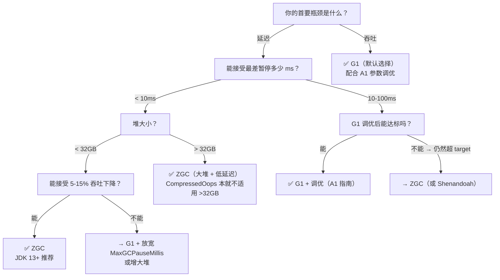

# A2-Beyond-G1: String Dedup 和 ZGC —— 当你调完 G1 所有参数后还能做什么

> **元信息**
>
> | 项目 | 说明 |
> |------|------|
> | **标准环境** | OpenJDK 11 slowdebug, `-Xms8g -Xmx8g -XX:+UseG1GC -XX:MaxGCPauseMillis=200`, G1 Region=4MB (2048 Regions), 64位Linux x86 |
> | **前置文档** | 已阅读 [01]~[11] 的 G1 源码分析系列 + [A1] G1 调优指南 |
> | **阅读收益** | 能够判断"调完 G1 所有参数后还要不要开 StringDedup"、"需不需要换 ZGC"——每个决策都有源码因果链支撑 |
> | **独特价值** | **从 G1 的缺陷推导两个扩展方向**——不是独立的 StringDedup/ZGC 手册，是"你理解了 G1 每一个细节后，G1 本身的天花板在哪里"的答案 |

---

## §〇 文档索引 + 本文定位

### 已完成文档引用表

| 文档 | 本文引用点 |
|------|-----------|
| [01] HeapRegion | G1 Region 粒度如何限制了 pause time 下限 → 推导 ZGC 为何不需要 Region |
| [02] ObjectAllocation | Humongous 碎片化 → ZGC Page-based + 并发重定位 = 碎片消除不需要 STW |
| [03] YoungGC | Young GC 的 STW 本质 → ZGC 的并发重定位对比；ageTable → StringDedup 候选年龄 |
| [04] CardTable-RSet | G1 的 RSet 为什么复杂 → ZGC 为什么不需要 |
| [05] SATB-Barrier | SATB 为什么存在 → ZGC colored pointers 怎么替代 |
| [06] ConcurrentMark-Core | `do_marking_step` 的时间片控制 → ZGC MarkWorker 不需要时间片控制 |
| [08] MixedGC-Policy | IHOP/G1Analytics 的预测模型 → ZGC 的 ZDirector 调度决策对比 |
| [09] FullGC | G1 的 Humongous 碎片化导致 STW Full GC → ZGC 用 Page + 并发重定位消除碎片 |
| [10] PLAB | PLAB waste rate → 对象复制 (STW) 的效率上限 → ZGC 为什么没有 PLAB |
| [11] Reference-Processing | Reference 处理必须在 STW 内 → ZGC 读屏障使得 Reference 可并发处理 |
| [A1] G1-Tuning | A1 场景 3 中的 StringDedup 建议 → 本文深挖算法原理；A1 的 G1Policy 因果链 → 本文的决策树 |

### 本文定位

你在 [A1-G1-Tuning] 中已经掌握了 G1 的全套调优方法。但有些场景 G1 的天花板是客观存在的：

- **char[] 占 Old 区 30% 但都不是垃圾** → 调任何 GC 参数都没用，因为 GC 只回收死对象，不减少活对象——这是 String Dedup 的领域
- **暂停必须 < 1ms 但 G1 无论如何调不到** → G1 的 Young GC Evacuation 本身就是 STW——这是 ZGC 的领域

**本文不是独立的 StringDedup/ZGC 手册**。每节的开头都以"G1 有什么缺陷"为起点，以"StringDedup/ZGC 怎么解决"为目的。如果你没有读完 G1 系列，本文的很多论证你无法判断真伪——这正是本文的独特价值。

---

## §一 ★ String Dedup —— 不改 GC 算法，只消灭重复 char[]

### 1.1 为什么 G1 调优到极致后 String Dedup 仍是最大的杠杆？

[A1-G1-Tuning] 教你调优的终点状态是：

```
MaxGCPauseMillis 设好了  →  Young GC pause 稳定
IHOP 调好了             →  CM 周期合理，Mixed GC 在碎片积累前触发
Mixed GC 回收量够了     →  Old 不再增长，无 Full GC
```

此时 GC log 看起来很健康。但 `jmap -histo` 可能告诉你另一个故事：

```
char[]  15,234,567  instances   2.3 GB  (占 Old 区的 30%)
```

**G1 对这些 char[] 完全无能为力**——因为它们是活对象（被 String 引用着），不是垃圾。GC 的职责是**回收死对象**，不是**压缩活对象**。

但在很多 Java 应用中，这些 char[] 的内容大量重复：

- **类名/方法名**：`"com.example.user.service.UserService"` 在堆中可能出现数千次
- **SQL 模板**：`"SELECT id, name, email FROM users WHERE status = ?"` 在每个 PreparedStatement 中重复
- **日志前缀**：`"INFO  [pool-1-thread-3] com.example..."` 每条日志一个 String
- **配置 Key**：`"spring.datasource.url"` 在每个 Bean 创建时访问一次

**如果能让这些 String 共享同一个 char[]，Old 区活数据立即减少 25%+**。后果：

```
Old live data 减少 25%
  → Old 区占用率增长更慢（相同分配速率下需要更长时间填充相同空间）
  → IHOP 触发延迟
    ★ 注意：IHOP 是自适应的（G1AdaptiveIHOPControl）——
    去重后 1-2 个标记周期内，IHOP 会被上调（因为 Old 回收更有效率了）
    → CM 周期从 30s → 50s+（正反馈增强，实际收益大于静态分析值）
  → CM 周期减少 → CPU 开销下降
  → 相同的堆可以容纳更多的活数据 → 减少 Full GC 风险
```

**这就是 String Dedup 做的事情——在 GC 框架内，不回收对象，只"去重字符数组"。**

> **三问之一：为什么需要？**
> G1 调优到极致后，chars[] 占比仍是最大的单一内存消费者。GC 参数只管"怎么回收"，不管"怎么合并"。String Dedup 是唯一在 GC 框架内消灭活对象冗余的机制。

---

### 1.2 ★ 三组件模型：入队 → 队列缓冲 → 去重

String Dedup 由三个独立组件协作完成。理解这三个组件的分工是理解整个机制的前提。

```
┌─────────────────────┐     ┌─────────────────────┐     ┌─────────────────────┐
│  GC Workers (STW)   │────→│  Dedup Queue        │────→│  Dedup Thread       │
│                     │     │  (per-worker Stack)  │     │  (concurrent)       │
│                     │     │                      │     │                     │
│  - 标记阶段：        │     │  - G1StringDedupQueue│     │  - "StrDedup" 线程   │
│    enqueue_from_    │     │  - 每个 worker       │     │  - round-robin pop  │
│    mark()           │     │    一个 Stack         │     │  - hash → lookup   │
│                     │     │  - 上限 1,000,000     │     │    → CAS 更新引用  │
│  - 疏散阶段：        │     │  - 入队无锁          │     │                     │
│    enqueue_from_    │     │    (per-worker)       │     │  - 配合 safepoint   │
│    evacuation()     │     │  - 出队 round-robin   │     │    让出 CPU         │
│                     │     │    + StringDedupQueue │     │                     │
│                     │     │    _lock 等待通知      │     │                     │
└─────────────────────┘     └─────────────────────┘     └─────────────────────┘
```

#### 组件一：GC Workers（STW 入队）

在 Young GC（Evacuation）和 Concurrent Mark 的标记阶段，GC workers 在 STW 期间将候选 String 推入队列。

**两个入队入口**（定义在 `g1StringDedup.cpp:61-92`）：

| 入口 | 调用时机 | 源码 |
|------|---------|------|
| `enqueue_from_mark(java_string, worker_id)` | Concurrent Mark 标记阶段，在 STW 中调用 | `g1StringDedup.cpp:61-66` |
| `enqueue_from_evacuation(from_young, to_young, worker_id, java_string)` | Young/Mixed GC Evacuation 阶段，在 STW 中调用 | `g1StringDedup.cpp:87-92` |

关键设计：**入队在 STW 中完成，出队在并发中完成**。这保证了队列的线程安全——不需要锁，因为只有 DedupThread 在 STW 之外 pop。

#### 组件二：Dedup Queue（per-worker 无锁缓冲）

队列被实现为**每个 GC worker 一个独立的 Stack**（`G1StringDedupWorkerQueue` = `Stack<oop, mtGC>`）。

源码位置：
- 抽象接口：`stringDedupQueue.hpp` → `push()`, `pop()`, `wait()`
- G1 实现：`g1StringDedupQueue.cpp:70-133`

关键特征：

| 特征 | 值 | 含义 |
|------|-----|------|
| 队列数 | `_nqueues = ParallelGCThreads` | 每个 worker 一个 Stack，入队无锁 |
| 每队列上限 | `_max_size = 1,000,000` | 超限丢弃 + 递增 `_dropped` 计数 |
| 出队方式 | round-robin（`_cursor` 游标） | 公平处理所有 worker 的候选 |
| 空队列通知 | `StringDedupQueue_lock` wait/notify | DedupThread 在空队列时休眠，有新候选时唤醒 |
| 死引用清理 | `unlink_or_oops_do()` | GC 期间清理队列中已死的 String 引用 |

#### 组件三：DedupThread（并发去重）

DedupThread 是名为 `"StrDedup"` 的 `ConcurrentGCThread`（`stringDedupThread.inline.hpp:32-83`）。

**主循环（简化为伪代码）**：

```
do_deduplication():
  deduplicate_shared_strings()     // 先把 CDS 共享 String 插入表
  for (;;):
    stat.mark_idle()
    queue.wait()                   // 阻塞等待新候选
    if should_terminate(): break
    sts_join(SuspendibleThreadSet) // 参与 safepoint
    stat.mark_exec()
    for (;;):
      java_string = queue.pop()    // round-robin pop
      if java_string == NULL: break
      table.deduplicate(java_string, &stat)
      if sts.should_yield():       // safepoint 需要时让出
        mark_block(); sts.yield(); mark_unblock()
    stat.mark_done()
    total_stat += stat
    table.clean_entry_cache()      // 清理溢出 entry cache
```

关键设计点：
- **单线程**：DedupThread 只有一个实例。去重是 I/O 密集型（hash 计算 + memcmp），单线程充分利用 CPU cache，避免多线程争用 `StringDedupTable_lock`
- **配合 safepoint**：通过 `SuspendibleThreadSetJoiner` 参与 safepoint 协议，不会无限期延迟 safepoint
- **CDS 预热**：启动时先把 CDS 归档中的共享 String 插入表，避免运行时重复去重已在归档中的 String

---

### 1.3 ★ 候选判断：为什么只去重 age=3 的对象？为什么只试一次？

候选判断逻辑位于 `g1StringDedup.cpp:46-92`，两个入口对应 GC 的两个阶段。

#### 入口一：标记阶段候选（`is_candidate_from_mark`, 第 46-59 行）

```cpp
bool G1StringDedup::is_candidate_from_mark(oop obj) {
  if (java_lang_String::is_instance_inlined(obj)) {
    bool from_young = heap_region_containing(obj)->is_young();
    if (from_young && obj->age() < StringDeduplicationAgeThreshold) {
      return true;
    }
  }
  return false;
}
```

条件拆解：

| 条件 | 为什么 |
|------|--------|
| `is_instance_inlined(obj)` | 只有 String 才去重（废话） |
| `from_young` | 只在 young 区时——防止重复处理已在 old 区的 String |
| `age < StringDeduplicationAgeThreshold` (默认 3) | **核心约束**——下面展开 |

#### 入口二：疏散阶段候选（`is_candidate_from_evacuation`, 第 68-85 行）

```cpp
bool G1StringDedup::is_candidate_from_evacuation(
    bool from_young, bool to_young, oop obj) {
  if (from_young && java_lang_String::is_instance_inlined(obj)) {
    if (to_young && obj->age() == StringDeduplicationAgeThreshold) {
      return true;  // young→young, 刚好达到阈值
    }
    if (!to_young && obj->age() < StringDeduplicationAgeThreshold) {
      return true;  // young→old, 提前晋升
    }
  }
  return false;
}
```

条件拆解：

| 场景 | 条件 | 含义 |
|------|------|------|
| Young→Young | `to_young && age == 3` | String 在年轻代活到第 3 次 GC，达到了"该去重"的年龄 |
| Young→Old | `!to_young && age < 3` | String 还没到年龄就被晋升了（如 Survivor 满了）→ 也试一次去重 |

**一旦晋升到 old 或 age > 3 → 永不重试**。这是由 `is_candidate_from_mark` 的 `from_young` 条件保证的。

#### 为什么是 age=3？（统计推理 + 工程权衡）

这不是源码里的"硬约束"，而是基于 [03-YoungGC §二] 中 ageTable 的统计特性推导出的工程决策：

```
ageTable 底层统计：
  → 绝大多数对象在 age=0 或 age=1 就死亡（弱分代假说）
  → 活到 age=3 的对象大概率是长命对象（至少能活到 Old 区）

设计空间分析：
  设 age_threshold = 1
    → 短命对象也去重 → CPU 大量浪费（对象马上死了，char[] 在 Young GC 被回收）
    → 去重收益微不足道（对象寿命太短，共享 char[] 还没来得及被复用就被回收）

  设 age_threshold = 3 (默认)
    → 活到 3 的对象大概率还能活很久 → 去重收益覆盖剩余寿命
    → CPU 开销合理（只处理约 10%-20% 的 String）

  设 age_threshold = 15 (max age)
    → 到 age=15 时已经进了 Old → 去重窗口太窄
    → 大部分 String 在 age<15 就晋升了 → 错过了去重时机
    → 去重被"推广到 Old"只需要一次（见 above）
```

> **面试追问**：为什么 `StringDeduplicationAgeThreshold=3` 而不是更大的值？
> 答：活到 age=3 的对象大概率是长命的（生成年龄假说），此时去重收益最大化；更小会浪费 CPU 在短命对象上，更大则去重窗口太窄（大部分 String 在此之前就被晋升了）。

#### 为什么只试一次？（设计替代分析①）

```
★ 设计替代分析：如果每个 String 每次都去重会怎样？

假设 DedupThread 对每个存活 String 反复执行 hash + lookup：
  
  第一轮：2,000,000 个 String → hash + lookup = 200ms CPU
  第二轮：1,950,000 个仍存活 → 再次 hash + lookup = 195ms CPU
  第三轮：1,900,000 个仍存活 → 再次 hash + lookup = 190ms CPU
  
  但 95% 的 String 在第一轮就判断为"唯一"（去重成功率只有 5%）→ 
  意味着 95% 的 CPU 花在了"重申已知结论"上——这些 char[] 是唯一的事实没变。

现在只试一次（当前设计）：
  第一轮：2,000,000 个 → hash + lookup = 200ms CPU
  第二轮：只处理新晋升的 100,000 个 → 10ms CPU
  第三轮：只处理新晋升的 100,000 个 → 10ms CPU

结论：只试一次的前提是 String 不可变 → 去重结论永久有效 → 无需周期性重试。如果把"只试一次"
改成"每次试"，等效于把 CPU 开销放大 N 倍（N = String 经历的 GC 轮次数），而准确率不变。
```

---

### 1.4 ★ 去重算法：`StringDedupTable::deduplicate()` — 怎么查？怎么更新 String.value？

#### 核心数据结构：`StringDedupTable`

`StringDedupTable`（定义在 `stringDedupTable.hpp:114-253`，实现在 `stringDedupTable.cpp` ~22KB）是一个自动 resize/rehash 的链地址哈希表。

**哈希表字段**：

```
_buckets:      StringDedupEntry**   桶数组（始终 2 的幂）
_size:         size_t               桶数量（1024 ~ 16777216）
_entries:      uintx                当前条目数
_hash_seed:    uint64_t             0 = Java hash; 非 0 = murmur3 (halfsiphash_32)
_rehash_needed: bool                某条链过长时标记 → 下轮 rehash

// 自动 resize 阈值
_grow_threshold:   _size * 2.0    // 负载 > 200% 时扩容 2x
_shrink_threshold: _size * 2/3    // 负载 < 67% 时缩容 0.5x
_min_size:         1024
_max_size:         16777216 (2^24)
```

**每个桶是一个 `StringDedupEntry` 链表**：

```
StringDedupEntry {
  _next:    StringDedupEntry*   下一个冲突节点
  _hash:    unsigned int        哈希值
  _latin1:  bool                char[] 是否 latin1 编码
  _obj:     typeArrayOop        ★ 弱引用 → char[] 字节数组
}
```

**为什么用弱引用？** `_obj` 指向 char[]，但 char[] 可能被 GC 回收（String 对象死了，它所引用的 char[] 如果没有被其他 String 共享，就成了垃圾）。弱引用允许重复的 char[] 在无人引用时被自然回收，去重表自动清除对应的 entry。

#### 核心算法：`deduplicate()` 流程

位于 `stringDedupTable.cpp:346-394`：

```
deduplicate(java_string):
  stat.inc_inspected()
  
  value = java_string.value()          // 获取 String 的 char[] 引用
  if value == NULL: inc_skipped(); return
  
  latin1 = java_string.is_latin1()     // 检查编码格式
  hash = java_string.hash()            // 优先用 String 缓存的 hash
  
  if hash == 0:
    hash = hash_code(value, latin1)    // 计算 hash (Java hash 或 murmur3)
    stat.inc_hashed()
    if use_java_hash() && hash != 0:
      java_string.set_hash(hash)       // 写入 String 的 hash 缓存字段
  
  existing = lookup_or_add(value, latin1, hash)
  // ★★★ 核心：查表 + 查不到就插入
  
  if existing == value:
    // 已经在表中（之前就已去重或首次插入）
    stat.inc_known()
    return
  
  if existing != NULL:
    // ★ 找到相同内容的 char[] → 去重！
    java_string.set_value(existing)    // 把 String.value 指向已存在的 char[]
    stat.deduped(value, size_in_bytes)
```

**`lookup_or_add_inner()`**（`stringDedupTable.cpp:299-321`）执行实际的查找+插入：

```
lookup_or_add_inner(value, latin1, hash):
  list = bucket(hash_to_index(hash))   // 定位哈希桶
  existing = lookup(value, latin1, hash, list, count)
  if existing != NULL: return existing
  
  // 没找到 → 插入新 entry
  add(value, latin1, hash, list)
  _entries++
  
  if count > _rehash_threshold:        // 链长度 > 120 → 标记需要 rehash
    _rehash_needed = true
  return value
```

**为什么用 CAS 而不是锁？**
- DedupThread 是**单线程**→ 在 `deduplicate()` 路径上没有竞争
- `lookup_or_add()` 内部用 `MutexLockerEx(StringDedupTable_lock)` 保护——这是为了 resize/rehash 的并发安全（但全都在 STW safepoint 期间进行）
- CAS 用于**并发 unlink**（`g1StringDedup.cpp:99-143`）：当多个 GC workers 并行清理表时，每个 worker 通过 `claim_table_partition()` 原子认领分区，在自己的分区内无需锁

#### 并发安全：去重后的 char[] 没有 Java 引用指向它怎么办？

> **面试追问**：去重表和 GC 引用链是什么关系？去重后的 char[] 没有 Java 引用指向它怎么办？

这是 StringDedup 设计中最精妙的部分——**去重表通过 `oops_do()` 参与 GC 可达性追踪**：

> ★ **"GC root" vs "oops_do 参与 GC"的严格区分**：GC root 是可达性分析的**起点**（线程栈、JNI handles、类静态字段）——它们不能被 GC 回收。去重表的 `_obj` 是**弱引用**，指向的 char[] 可以被 GC 回收，因此去重表不是 root。

1. 去重前后，char[] 始终被去重表的 `_obj` 弱引用指向（弱引用不会阻止 GC 回收 char[]）
2. 如果 char[] 被**至少一个** String 的 `value` 字段（强引用）指向 → char[] 是活的
3. 如果 char[] 被**零个** String 引用（所有共享它的 String 都死了 + 没有强引用指向它）→ GC 将其标记为垃圾、即将回收 → unlink 阶段检测到 `_obj` 是死弱引用 → 从表中清除 entry
4. 去重表通过注册 `oops_do()` 让 GC workers 遍历所有 entry——活引用调用 `keep_alive` 阻止回收，死引用清除 entry。这个机制让去重表**既不阻止 char[] 回收，也不会残留野指针**

**源码证据**（`g1StringDedup.cpp:99-143`）：

```cpp
void G1StringDedup::parallel_unlink(G1StringDedupUnlinkOrOopsDoClosure* unlink,
                                    uint worker_id) {
  StringDedupQueue::unlink_or_oops_do(unlink);
  StringDedupTable::unlink_or_oops_do(unlink, worker_id);
}
```

`unlink_or_oops_do` 在 GC 期间被多线程并行调用——每个 worker 认领一部分 bucket，遍历 entry，通过 `is_alive()` 判断 char[] 是否存活：活的保留（并调用 `keep_alive` 防止被回收），死的从表中移除。

---

### 1.5 ★★ 效果与适用场景：什么时候值得开？

#### 效果最好时

```
jmap -histo 显示 char[] 占比 > 20%
AND 应用有大量重复 String 内容：
  → Spring Boot：类名、方法名、配置 key → 去重率 70%+
  → 微服务：服务名、endpoint URL 前缀 → 去重率 60%+
  → SQL 密集：预编译的 SQL 模板 → 去重率 50%+
```

**量化效果**（需满足前提：大部分 char[] 是 Old 区的长命 String——典型 Spring Boot 场景满足）：

```
环境：100 个 Spring Boot 微服务实例，每个 2GB 堆
char[] 占堆的 30% = 600MB (假设 80% 在 Old 区 = 480MB Old char[])
去重率 70% → 释放 ~340MB Old 活数据
→ Old 区占用率下降 → 相同分配速率下 Old 增长更慢
→ Concurrent Mark 触发间隔延长（具体倍数取决于 G1AdaptiveIHOPControl 的自适应上调）
→ CPU 开销下降
```
> ★ **为什么不是精确的"CM 周期从 30s→45s"？** IHOP 是自适应值（`G1AdaptiveIHOPControl`）。去重后 Old 活数据减少，下次标记周期发现"Old 回收更有效率"→ IHOP 会被上调 → CM 触发进一步推迟。正反馈增强循环使得实际收益通常大于静态分析值，但也因此无法给出精确倍数。

#### 效果差时

```
char[] 占比高但几乎不重复：
  → UUID/Token/加密密文 → 去重率 = 0%
  → 用户生成的文本内容 → 去重率 < 5%
  → 极端的日志场景（每条以时间戳开头）→ 去重率 ≈ 0%

此时 String Dedup 纯费 CPU（hash + memcmp）而零收益。
```

#### 判断标准（量化）

```
值得开的充要条件：
  ① jmap -histo | grep "char\[\]" → 占比 > 20%
  ② 应用有大量模板化 String（类名、SQL、配置、header）
  ③ 当前的 CPU 空闲率 > 20%（DedupThread 需要 CPU 时间）

不值得开的情况：
  ① char[] 占比 < 10% → 收益上限太低
  ② 应用是"内容生成型"而非"模板型"（CMS、个人博客）→ 去重率极低
  ③ 当前 CPU 已 > 90% 使用率 → DedupThread 会抢走业务线程的 CPU
```

> **三问之二：怎么解决的？**
> StringDedup 通过三组件协作——STW 入队（无锁）+ 并发去重（单线程 round-robin 出队 + hash 查表 + CAS 更新引用）——在不改变 GC 行为的情况下消灭重复 char[]。去重表通过 `oops_do()` 参与 GC 可达性追踪——表内弱引用由 GC 自动判断死活并清理。

---

### 1.6 JDK 版本差异 + 源码层次

#### 参数声明（`runtime/globals.hpp:2583-2595`）

| 参数 | 默认值 | 说明 |
|------|--------|------|
| `-XX:+UseStringDeduplication` | `false` | **必须显式开启**。因为 DedupThread 是一个独立线程，有 CPU/内存开销 |
| `-XX:StringDeduplicationAgeThreshold` | `3` | String 达到 age 3 时成为候选（或晋升到 Old 时） |

#### 源码三层结构

```
gc/shared/stringdedup/            ← 所有 GC 共用的基础层
  ├── stringDedup.hpp/.cpp        → 基类接口：is_enabled(), enqueue(), deduplicate()
  ├── stringDedupTable.hpp/.cpp   → ★ 核心：去重哈希表 (~22KB)
  ├── stringDedupThread.hpp/.cpp  → 专用去重线程框架
  ├── stringDedupQueue.hpp        → 抽象队列接口
  └── stringDedupStat.hpp/.cpp    → 基础统计 (inspected/hashed/known/new/deduped)

gc/g1/                            ← G1 特有的实现层
  ├── g1StringDedup.hpp/.cpp      → G1 特有的候选判断逻辑
  ├── g1StringDedupQueue.hpp/.cpp → G1 per-worker Stack 实现
  └── g1StringDedupStat.hpp/.cpp  → G1 扩展统计 (区分 Young/Old)
```

#### JDK 版本差异

| 版本 | 变更 |
|------|------|
| JDK 8u20 | String Dedup 首次引入（G1 only, `-XX:+UseStringDeduplication`） |
| JDK 9 | 代码重构为 shared/g1 两层结构，为未来支持其他 GC 做准备 |
| JDK 11 | 稳定版，本文分析的基准版本 |
| JDK 15+ | ZGC 也开始支持 String Dedup（通过 shared 层复用） |

#### 开启方式

```
-XX:+UseG1GC -XX:+UseStringDeduplication
```

#### 验证日志

```
-Xlog:stringdedup*=debug
```

示例输出：

```
[15.234s][stringdedup]   Last Inspected:             100000
[15.234s][stringdedup]      Skipped:                       0 (  0.0%)
[15.234s][stringdedup]      Hashed:                    50000 ( 50.0%)
[15.234s][stringdedup]      Known:                     40000 ( 40.0%)  ← 已在表中
[15.234s][stringdedup]      New:                       10000 ( 10.0%)  ← 新插入
[15.234s][stringdedup]      Deduped:                   20000 ( 20.0%)  ← 去重成功
[15.234s][stringdedup]        Young:                    5000 (  5.0%)  ← Young 区去重数
[15.234s][stringdedup]        Old:                     15000 ( 15.0%)  ← Old 区去重数
[15.234s][stringdedup]      Deduped Bytes:          64000000 B ( 61.0 MB)
[15.234s][stringdedup]   Table:                           1024/4096 (25.0%) ← 表负载
[15.234s][stringdedup]   Queue:                            200/1000000 (0.0%)
```

关键字段解读：

| 字段 | 含义 | 监控建议 |
|------|------|---------|
| `Deduped / Inspected` | 去重成功率 | **< 10% → 关掉**（char[] 几乎没有重复） |
| `New / Inspected` | 唯一 char[] 的比例 | 越高说明字符串多样性越大 |
| `Deduped Bytes` | 节省的内存 | 核心 KPI，越大越好 |
| `Table load` | 哈希表负载 | 25%-50% 正常；> 80% 触发 resize |

> **三问之三：代价是什么？**
> 1. DedupThread 是一个独立的并发线程 → CPU 开销（hash + memcmp + CAS）
> 2. 去重表额外消耗内存（StringDedupEntry 每个约 48 字节 + 表池大小）
> 3. 去重的 char[] 可能延缓 GC（被共享 → 可达性变长）
> 4. 不正确开启 → 纯费 CPU 零收益（重复率 < 10%）

---

### 1.7 ★ 面试追问卡片

> **Q1: String Dedup 怎么保证 char[] 替换的并发安全？**
>
> A：DedupThread 是单线程，不存在竞争。入队在 STW 中完成（所有 mutator 停止），出队在并发中由 DedupThread 独占。唯一的并发风险是 unlink 阶段由多个 GC workers 并行清理表——通过 `claim_table_partition()` 原子认领分区解决。

> **Q2: 如果 DedupThread 处理速度跟不上入队速度怎么办？**
>
> A：`G1StringDedupQueue` 每 worker 队列上限 1,000,000。超过上限时丢弃（递增 `_dropped` 计数）。
> 这意味着如果 DedupThread 处理速度跟不上，新 String 被默默跳过——去重率下降但不影响 GC 稳定性。
> 监控指标：`g1StringDedupQueue::_dropped` 非零 → 增加 `ConcGCThreads`（间接影响 DedupThread 的调度频率）。

> **Q3: 去重表里的 char[] 没人引用怎么办？**
>
> A：去重表通过 `oops_do()` 参与 GC 可达性追踪——在每次 GC 中检查所有 entry。如果 char[] 仍然被至少一个 String 引用（强引用活着），GC 通过 `keep_alive` 阻止回收。如果所有 String 都死了、只剩下弱引用，char[] 被 GC 标记为垃圾 → unlink 阶段清除对应 entry。这就是为什么去重表不会无限膨胀——弱引用 + GC 联动保证自动清理。

---

## §二 ★★★ ZGC —— 全并发 GC 为什么能 < 1ms？

### 2.1 G1 的"假并发" vs ZGC 的"真并发"

让我们回到 G1 的 GC 周期（来自 [06-ConcurrentMark-Core] 和 [08-MixedGC-Policy]）：

```
G1 GC 周期：
  [STW─Initial Mark]──[Concurrent: marking + SATB refinement]──[STW─Remark]
                                    │
          ┌─────────────────────────┘
          ├─[STW─Young GC: Evacuation]
          └─[STW─Mixed GC: Evacuation from Young + Old Regions]

  ★ Evacuation(对象复制)永远是 STW——
    因为 mutator 可能在 copy 期间读取旧地址（没有读屏障）
```

**G1 的并发范围只有"标记"**。真正回收内存的 Evacuation（把活对象从 CSet 复制到新的空闲 Region）必须在 STW 中完成。为什么？因为 G1 没有读屏障——mutator 读取一个正在被 GC worker 复制的对象时，如果读到的是旧地址，G1 无法透明修正。

这就是 G1 暂停时间的**物理下限**：

```
暂停时间 ≥ Evacuation 时间 = f(CSet 中活对象数量)
  → 堆越大 → Eden 越大 → Young GC 的 CSet 越大 → 暂停越长
  → 这就是"暂停随堆大小线性增长"的根源
```

**ZGC 的根本突破：读屏障 + colored pointers → 让对象复制可以并发**

```
ZGC GC 周期：
  [STW─Pause Mark Start]──[Concurrent: Mark]──[STW─Pause Mark End]
  [STW─Pause Relocate Start]──[Concurrent: Relocate]──[STW─Pause Relocate End?]

  ★ 没有 Remark（被 colored pointers 的自愈协议替代）
  ★ 没有单独的 Evacuation STW（被 concurrent relocate 替代）
  ★ 所有 STW 都 < 1ms（只扫描 roots，不扫描堆）
```

对比的核心差异：

```
G1 Evacuation = 在 STW 中 copy 活对象  → 暂停时间 ≥ 对象复制时间
ZGC Relocate  = 在并发中 copy 活对象    → 暂停时间 = 只设置标记状态的时间（~0.1ms）

为什么 ZGC 能做到？
  → G1 的 mutator 读对象 → 直接返回对象地址
  → ZGC 的 mutator 读对象 → 先过读屏障（check colored bits）
     → 如果指针是 "good" → 直接返回（快速路径，零额外开销）
     → 如果指针是 "bad"  → 查 forwarding table → 自愈（修复引用槽）
```

**G1 的"全并发"为什么是假的？** 因为 G1 根本没有读屏障。没有读屏障就没有并发重定位的基础——mutator 看到旧地址无法被透明修正。G1 所有的复杂性（RSet、SATB、TAMS）都是为了"尽量让 Evacuation 只回收一小部分对象"——你不能消除 STW，只能尽量减少 STW 期间的活对象数。

---

### 2.2 ★★★ Colored Pointers：三种视图 + 自愈协议的并发本质

#### 2.2.1 指针的物理布局

ZGC 在 x86-64 Linux 的指针中嵌入 4 位元数据。定义在 `zGlobals_linux_x86.hpp:63-81`：

```
64位指针布局（JDK 11 x86-64 Linux）：
  63              47     46 45-42 41                                       0
  +-------------------+----+------+-----------------------------------------+
  |  固定为 0 (17位)   | 0  | 元数据|           堆地址 (42位)                 |
  +-------------------+----+------+-----------------------------------------+
                          │  (4位)│
                          │       └ bit 0: Marked0  ── 本轮标记位
                          │         bit 1: Marked1  ── 下轮标记位（交替用）
                          │         bit 2: Remapped ── 对象已重定位
                          │         bit 3: Finalizable ─ 有 finalize()
                          │
                          └─ 未使用

  堆地址 = 42 位 → 最大堆 < 4TB (2^42)
  ★ 42 位是堆内偏移，与 ZGC Page 大小 (2MB) 和对象对齐 (8B) 均无关——
    指针元数据位和堆偏移位在物理上是同一个 64 位值的不同位段
```

源码常量（`zGlobals.hpp:73-83` + `zGlobals_linux_x86.hpp:77-81`）：

```cpp
// 偏移量部分
ZAddressOffsetBits  = 42;      // 堆地址位数
ZAddressOffsetMask  = (1<<42)-1 << 0;  // 地址掩码
ZAddressOffsetMax   = 1<<42;   // = 4TB

// 元数据部分
ZAddressMetadataShift = 42;    // 元数据从 bit 42 开始
ZAddressMetadataBits  = 4;     // 4 个元数据位

// 四个元数据位
ZAddressMetadataMarked0    = 1 << 42;  // bit0
ZAddressMetadataMarked1    = 2 << 42;  // bit1
ZAddressMetadataRemapped   = 4 << 42;  // bit2
ZAddressMetadataFinalizable = 8 << 42; // bit3
```

#### 2.2.2 多视图映射（Multi-View Mapping）

ZGC 的关键创新：把**同一块物理内存映射到 3 个不同的虚拟地址范围**，通过指针的元数据位选择使用哪个视图。

来自 `zGlobals_linux_x86.hpp:42-56` 的地址空间布局：

```
  0x00007FFFFFFFFFFF (127TB)  ←─ 虚拟地址空间顶部
  .                    .
  +--------------------------------+ 0x0000140000000000 (20TB)
  |         Remapped View          |  ← 重定位后对象在这里
  +--------------------------------+ 0x0000100000000000 (16TB)
  |     (Reserved, but unused)     |
  +--------------------------------+ 0x00000c0000000000 (12TB)
  |         Marked1 View           |  ← 下一轮标记的对象在这里
  +--------------------------------+ 0x0000080000000000 (8TB)
  |         Marked0 View           |  ← 本轮标记的对象在这里
  +--------------------------------+ 0x0000040000000000 (4TB)
  .                    .
  +--------------------------------+ 0x0000000000000000
```

```
三种视图的物理意义：

Marked0 视图 (4TB-8TB)：  元数据 bit0=1 → 标记线程标记完的对象在此视图访问
Marked1 视图 (8TB-12TB)： 元数据 bit1=1 → 下一轮标记切换到这个视图（和 Marked0 交替）
Remapped 视图 (16TB-20TB)：元数据 bit2=1 → 重定位完成的对象在此视图访问
                            mutator 看到 Remapped=1 → 直接返回（零额外开销！）
```

**为什么不需要重置标记位图？** G1 的 SATB 在每轮 CM 后需要 reset next_mark_bitmap（循环写入 2048×4MB = 8GB 的位图）。ZGC 通过 Marked0/Marked1 交替：本轮用 Marked0 标记，下轮就切换用 Marked1。旧标记位自然失效——"忘记"比"擦除"成本更低。

#### 2.2.3 GoodMask/BadMask 的作用

`GoodMask` 不是指针字段，是运行时计算的掩码（`zAddress.cpp` 的 `set_good_mask()`）：

```
GC 阶段               GoodMask              BadMask (= GoodMask XOR MetadataMask)
──────────            ────────              ────────
Remapped 阶段         Remapped (100)        Marked0|Marked1 (011)    ★ Finalizable 位与 GoodMask/BadMask 判定正交
Marked0 阶段          Marked0 (001)         Marked1|Remapped (010|110)
Marked1 阶段          Marked1 (010)         Marked0|Remapped (001|110)

判断逻辑（zAddress.inline.hpp:36-42）：
  is_good(addr)   = !(addr & BadMask) && !is_null(addr)
  is_bad(addr)    = addr & BadMask
```

**"Good"的精确语义**：指针的元数据位与当前 GC 阶段的期望一致。
- 在 Remapped 阶段：Remapped=1 是好（对象已经在新地址），Marked0=1 是坏（标记线程认为它活着，但 mutator 需要的是重定位后的版本）
- 在 Mark 阶段：Marked0=1 是好（标记线程刚标记完），Remapped=1 是坏（标记线程需要标记这个对象）

#### 2.2.4 ★★★ 自愈协议（Self-Healing Protocol）

自愈协议是 ZGC 最核心的并发机制。它在 `ZBarrier::barrier()` 中实现（`zBarrier.inline.hpp:33-60`）：

```cpp
template <ZBarrierFastPath fast_path, ZBarrierSlowPath slow_path>
inline oop ZBarrier::barrier(volatile oop* p, oop o) {
  uintptr_t addr = ZOop::to_address(o);

retry:
  // 1. 快速路径：指针已经是 "good" → 零开销直接返回
  if (fast_path(addr)) {
    return ZOop::to_oop(addr);
  }

  // 2. 慢速路径：查 forwarding table，获得正确的地址
  const uintptr_t good_addr = slow_path(addr);

  // 3. ★ 自愈：CAS 更新引用槽位（不是 forwarding table！）
  if (p != NULL && good_addr != addr) {
    const uintptr_t prev_addr = Atomic::cmpxchg(good_addr, (volatile uintptr_t*)p, addr);
    if (prev_addr != addr) {
      // 其他线程抢先修复了 → 重试
      addr = prev_addr;
      goto retry;
    }
  }

  return ZOop::to_oop(good_addr);
}
```

**自愈协议的核心逻辑**：

```
mutator 读取对象 o.field → 读屏障检查
  → 如果 is_good(field_addr) → 直接返回（快速路径，~1 条 CPU 指令）
  → 如果 is_bad(field_addr)：
      ① slow_path → 查 forwarding table → 获得新地址
      ② CAS 更新**引用槽位的指针**（o.field 从旧地址→新地址，带 Remapped 位）
      ③ 返回新地址

  下一次 mutator 读同一个 o.field：
    → is_good(新地址) → 直接返回（零额外开销！）
    这就是 "self-healing" —— 引用槽位自己愈合了
```

**★ 关键洞察：CAS 的目标是引用槽，不是 forwarding table**

这与 G1 的 Evacuation forwarding 完全不同：

```
G1 Evacuation (STW)：
  object = *src_addr;           // 读取对象
  copy = allocate_copy();       // 分配副本
  copy_to(copy, object);        // 复制数据
  object->set_mark(encode_pointer_as_mark(copy));  // ★ 修改对象头：
      // markOop 高 2 位=11 表示 forward 指针，低 62 位=目标地址
      // 原始 markOop 通过 PreservedMarks 保存（见 [09-FullGC §三]）
  *src_addr = copy;             // Roots 被原子更新（CAS）
  // mutator 在 STW 期间停止 → 不读取旧地址 → 不需要读屏障

ZGC Relocate (concurrent)：
  new_addr = allocate_copy();   // 分配 副本（并发）
  copy_to(new_addr, object);    // 复制数据
  insert_forwarding_table(old_addr → new_addr);  // ★ Forwarding table 独立存储
  // mutator 继续运行 → 可能读到 old_addr
  //   → 读屏障查 forwarding table → 返回 new_addr
  //   → CAS 修复引用槽 → 下次直接返回 new_addr (自愈)
```

**为什么 forwarding table 不嵌入对象头？** 因为 ZGC 是并发的——mutator 在 relocate 期间可能也在写对象头（如偏向锁、hashcode）。G1 在 STW 中操作对象头是安全的，ZGC 不能。

#### 2.2.5 读屏障的快速路径优化

来自 `zBarrier.inline.hpp:173-175`：

```cpp
inline oop ZBarrier::load_barrier_on_oop_field_preloaded(volatile oop* p, oop o) {
  return barrier<is_good_or_null_fast_path, load_barrier_on_oop_slow_path>(p, o);
}
```

`is_good_or_null_fast_path` 的实现（`zBarrier.inline.hpp:126-128`）：

```cpp
inline bool ZBarrier::is_good_or_null_fast_path(uintptr_t addr) {
  return ZAddress::is_good_or_null(addr);
}
```

其中 `is_good_or_null` 只需要**一条 AND 指令**：

```cpp
inline bool ZAddress::is_good_or_null(uintptr_t value) {
  return !(value & ZAddressBadMask);  // 单条 AND + JZ 指令
}
```

**当对象已经处于 good 状态时（绝大多数情况），读屏障的开销 = 1 条 CPU 指令**。这就是为什么 ZGC 的吞吐下降"只有" 5-15%——快速路径的开销微乎其微。

---

### 2.3 ★★★ 为什么 ZGC 不需要 RSet / SATB / TAMS？

本节是**本文最核心的论证**——把 G1 的三个关键机制逐一解释为什么存在，然后证明 ZGC 用不同的设计消除了这个需求。

#### 2.3.1 为什么不需要 RSet？

```
G1 需要 RSet 的原因（[04-CardTable-RSet]）：
  G1 是分代 GC → Young GC 只回收 Young Region → 
  但 Old→Young 的跨代引用仍是 GC Root → 必须找到这些引用
  → 不扫描整个 Old 的代价 = 在每个 Young Region 维护 RSet
  → RSet 记录："哪些 Old Region 的哪些 Card 引用了我"
  → RSet 的维护开销 = SATB(Q) 写屏障每次写引用都要更新 RSet

ZGC 不需要 RSet 的原因：
  → ZGC 是单代 GC（non-generational）
  → 每次 GC 回收整个堆（没有 "Young-only GC" 的场景）
  → 没有 "只扫一部分" 的需求 → 不需要跨区域引用追踪
  → 所有可达性通过标记阶段的并发扫描统一发现

★ 关键澄清：ZGC 不需要 RSet 的根本原因是单代收集，不是 colored pointers。
  Colored pointers 解决的是并发重定位的读取一致性。
  RSet 解决的是 "避免扫描整个堆" 的优化——这只有在分代 GC 中才有价值。
```

#### 2.3.2 为什么不需要 SATB？

```
G1 需要 SATB 的原因（[05-SATB-Barrier]）：
  并发标记期间 mutator 可能修改引用——SATB 要防止以下漏标场景：
  
  时刻 T1: A.field = X（X 是活对象，但并发标记线程还没扫到 A）
  时刻 T2: mutator 执行 A.field = Y（X 的最后一个强引用被切断！）
  时刻 T3: 标记线程扫到 A → A.field 现在是 Y → 永远不知道 X 存在
  → X 被漏标 → X 被错误回收！
  
  SATB 解法：在 T2 时记录 "旧值是 X" → 标记线程事后补标 X → X 不会被漏标
  ★ SATB 的核心假设：标记线程可能"看不到"被 mutator 改掉的引用，所以需要事后记录

ZGC 如何消除这个问题——load barrier + store barrier 组合：
  
  ★ ZGC 的 load barrier（读屏障）：
    标记阶段，mutator 每次读取 oop → 经过 load barrier
    → 确保返回的 oop 带本轮的 marked 位
    → 效果：mutator 视野中不存在"未标记"的对象
    → 不存在 "mutator 持有未标记对象引用" 的状态
  
  ★ ZGC 的 store barrier（写屏障）：
    标记阶段，mutator 每次写入 oop → JIT 插入的 store barrier
    → 对要写入的新值过一遍 load barrier → 确保被存储的新对象已被标记
    → 同时，被覆盖的旧值指向的对象也已被保护：
        mutator 能持有旧值引用，说明之前 load 时已经过了 load barrier
        → 旧值对象在加载时便已标记完毕 → 不需要像 SATB 那样事后记录旧值
    → 效果：新值和旧值指向的对象都已被标记，不存在"改掉引用导致漏标"
  
  ★ 总结：
    G1 没有 load barrier → mutator 可以持有未标记对象的引用
      → 必须用 SATB 写屏障记录"改掉之前指向了谁"以事后补救
  
    ZGC 有 load barrier → mutator 持有的所有引用都保证已标记
      → 不存在"改掉引用导致对象漏标"的可能
      → 不需要 SATB 事后补救

  Marked0/Marked1 交替视图起辅助作用（区分标记周期），但消除 SATB 的核心是
  load+store barrier 组合——不是 colored bits 本身。
```

#### 2.3.3 为什么不需要 TAMS？

```
G1 需要 TAMS 的原因（[06-ConcurrentMark-Core]）：
  并发标记期间对象仍在被分配 → 标记线程怎么知道哪些对象是 "标记开始前的"？
  → TAMS (Top At Mark Start) = 标记开始时的分配边界（per-Region）
  → 地址 < TAMS → 标记开始前的对象（需要标记）
  → 地址 ≥ TAMS → 标记开始后分配的对象（本轮不标记）
  → 复杂度：2048 个 Region 各自维护一个 TAMS，标记线程每次推进都要检查边界

ZGC 如何替代 TAMS——Page 级分配边界 + colored pointers：

  ★ ZGC 仍然维护分配边界，但在 Page 粒度：
    每个 ZPage 记录了标记开始时该 Page 的 _top（分配指针）
    → 标记线程只扫描 [page_start, page_top_at_mark_start) 范围内的对象
    → ZPage._top_at_mark_start —— 本质上就是 ZGC 版的 "per-Page TAMS"

  ★ colored pointers 解决了"新分配对象如何被排除"的问题：
    标记开始后分配的对象 → ZPage::alloc_object() 分配在 Remapped 视图中
      → 自带 Remapped 位 = 1
      → 标记阶段 GoodMask = Marked0，Remapped=1 被视为 "bad"
      → 但标记线程不会扫到这些对象（它们在 _top_at_mark_start 之外）
      → mutator 的 load barrier 在标记阶段读到它们时：
          Remapped=1 是 "bad" → slow path → 标记它（加上 Marked0 位）

  ★ 关键区别：G1 的 TAMS 是全局概念（标记线程需要跨 Region 管理 2048 个 TAMS），
    ZGC 的 _top_at_mark_start 是 Page 级概念（每个 Page 内部闭环管理）。
    ZGC 简化的是"全局 TAMS 管理"——不是因为完全不需要分配边界，
    而是把边界管理下放到了 Page 层面，配合 colored pointers 消除了复杂性。
```

#### 总结对比

```
                 G1                              ZGC
  ─────────────────────────────────────────────────────────────────
  分代模型      分代 (Young/Old)               单代 (non-generational)
  对象复制      STW Evacuation                 并发 Relocate
  跨代引用      RSet (Card-level)               不需要
  并发标记      写屏障 SATB                     读屏障 + Marked0/1
  标记边界      TAMS (address boundary)         per-Page _top_at_mark_start（Page 级）
  转发指针      嵌入 markOop (对象头)           Forwarding table (独立)
  暂停下限      ~10ms (CSet 大小决定)           ~0.1ms (roots 决定)
  暂停上限      线性增长 (堆大小)               常数 (与堆无关)
```

---

### 2.4 ★ ZGC 暂停为什么 < 1ms 且与堆大小无关？

#### 2.4.1 ZGC 的 STW 阶段（每个都 < 1ms）

```
ZGC 的 GC 周期（每个 STW 阶段都 < 1ms）：

  [STW] Pause Mark Start (~0.1ms)
    ① 翻转 ZAddressMasks → 切换到 Marked0/Marked1 标记视图
    ② 设置 ZGlobalPhase = ZPhaseMark
    ③ 扫描少量 roots（线程栈、JNI handles、类静态字段）→ 启动标记
    
  [Concurrent] Mark (N 个 MarkWorker 线程)
    ① 标记整个堆（通过读屏障 + colored pointers）
    ② 弱引用处理、StringTable 清理 → 全部并发
    
  [STW] Pause Mark End (~0.1ms)
    ① 将 ZGlobalPhase 从 ZPhaseMark 切换
    ② 处理残留引用
    
  [STW] Pause Relocate Start (~0.1ms)
    ① 选择需要 relocate 的 Page 集合（ZRelocationSet）
    ② 切换 ZGlobalPhase = ZPhaseRelocate
    
  [Concurrent] Relocate (N 个 RelocateWorker + mutator 自愈)
    ① 并发 relocate 选定 Page 中的活对象
    ② mutator 通过读屏障自愈所有访问（零额外 STW）
```

#### 2.4.2 为什么每个 STW 都 < 1ms？

```
STW 期间只做三件事：
  ① 翻转全局状态（ZAddressMasks::flip_to_marked × 1 次）
     → O(1)，与堆大小无关
  ② 扫描 roots（线程栈、JNI handles、类静态字段）
     → O(线程数 + 类数)，与堆大小无关
  ③ 选择 Relocation Set（决定哪些 Page 需要 relocate）
     → O(Page 数) = O(堆大小 / Page 大小)
     → 但 Page 数量远小于 G1 的 Region 数量
     → 且 Selection 只需要统计信息，不需要扫描每个 Page

对比 G1 Young GC STW：
  → 扫描整个 Eden（堆 × 5%-60% 的 Region）
  → Evacuation(copy 活对象) 在 STW 中完成
  → 暂停时间 ≥ 对象复制时间 = f(Eden 中的活对象)
  → 堆越大 → Eden 越大 → 暂停越长 → 线性增长
```

#### 2.4.3 所有重体力活都是并发的

```
标记整个堆：      并发（多个 MarkWorker 线程，读屏障保证标记正确性）
重定位对象：      并发（RelocateWorker copy 对象 + mutator 自愈修复引用）
释放物理内存：    并发（ZUncommit，ZGC 独有——G1 从不把内存还给 OS）
StringTable 清理：并发（ZConcurrentStringTable，G1 必须在 STW 中）
ClassUnloading：  JDK 13+ 并发（JDK 11 ZGC 不支持 ClassUnloading）
```

#### ★ 设计替代分析②

> **如果把 ZGC 的并发重定位（读屏障）替换为 G1 的 STW Evacuation（markOop forward 指针 + 全 STW copy）会怎样？**
>
> ZGC 的 Relocation Set 包含整个堆中的碎片 Page。在 G1 的模型中，相当于"选择了一部分 Region，在 STW 中 copy 所有活对象"。这个 CSet 的大小是碎片 Page 中活对象的总和。
>
> 实际效果计算（8GB 堆，假设 25% 碎片 = 2GB 需要 relocate）：
> ```
> G1 风格的 STW Evacuation：
>   扫描 2GB 的碎片 Page → 提取活对象 → 
>   copy 活对象（假设 80% 是垃圾 → 400MB 活对象要 copy）
>   → 暂停时间 ≈ 400MB / (2GB/s 内存带宽) = 200ms
>                        → ZGC 的并发版本 = 0.1ms STW
>
> 16GB 堆，同样碎片率 → 800MB 活对象 → 
>   → 暂停时间 ≈ 400ms 
>                        → ZGC 的并发版本 = 0.1ms STW（与堆大小无关）
> ```
>
> 结论：如果 ZGC 把并发重定位改为 STW，暂停将随堆大小线性增长，失去了 ZGC 最核心的"暂停<1ms"承诺。

---

### 2.5 ★ ZGC 的代价——不是免费午餐

#### 吞吐量下降

```
读屏障在每个对象字段访问时都要执行：
  → fast path: 1 条 AND 指令（绝大部分情况）
  → slow path: 查 forwarding table + CAS + 重试（~100 条指令）
  → 综合效果：吞吐量比 G1 低 5-15%

典型场景：
  G1：请求处理速度 = 10,000 req/s
  ZGC：请求处理速度 = 9,000 req/s (下降 10%)
  
  但 ZGC 的 p99 延迟 = 2ms vs G1 的 p99 = 50ms
  → 对延迟敏感的应用（交易系统、实时服务），10% 的吞吐损失换 25x 的延迟改善
```

#### 无法使用 CompressedOops

```
CompressedOops (压缩指针) 在 ≤32GB 堆时把每个指针从 8 字节压缩到 4 字节
  → 对象头节省 4 字节 → 整体内存节省 ~20%

ZGC 不能用 CompressedOops 因为：
  → 指针的 4 位元数据占用了 CompressedOops 需要的地址空间
  → 每个指针必须是完整的 64 位（8 字节）
  → 整体内存开销 ≈ +20%（相同堆大小下）

★ 转折点：当堆 > 32GB 时，CompressedOops 本来就用不了
  → ZGC 的内存劣势消失
  → 这就是为什么 ZGC 在 > 32GB 堆时特别有吸引力
```

#### JDK 版本兼容性

```
JDK 11: ZGC 是实验性 → 不支持 ClassUnloading、不支持 JVMCI
JDK 13: 增加 ClassUnloading 支持、支持最大 16TB 堆
JDK 14: ZGC 新增 macOS 支持 (JEP 364)
JDK 15: ZGC 生产就绪 (Production Ready)、新增 Windows 支持 (JEP 377)
JDK 17: ZGC 支持 String Dedup
JDK 21: ZGC 分代模式 (Generational ZGC) 正式引入

  → 生产推荐：JDK 17+ (稳定 + StringDedup + 全平台)
  → 保守选择：JDK 11 继续用 G1
```

#### 内存开销总结

```
                 G1                     ZGC (JDK 11)
  ─────────────────────────────────────────────────────────
  指针大小       4 字节 (<32GB 堆)      8 字节 (不能用 CompressedOops)
                 8 字节 (>32GB 堆)
  额外结构       RSet (每个 Region)     Forwarding Table (每个 Page)
                 SATB Queue            Good/Bad 视图的多重映射
                 Mark Bitmap (2 套)    (不需要 bitmap！)

  ★ 多重大小映射的内存开销：ZGC 把 1 份物理内存映射到 3 个虚拟地址范围
    → 消耗 TLB (Translation Lookaside Buffer) entries
    → 不消耗额外物理内存 → 但增加 TLB miss 概率 → 更慢的对象访问
```

> **三问总结**：
> - **为什么需要 ZGC？** G1 的 Evacuation 是 STW，暂停下限 ~10ms 且随堆大小线性增长
> - **怎么解决的？** 读屏障 + colored pointers → 并发重定位自愈 → 消除所有重体力 STW
> - **代价是什么？** 吞吐降 5-15%、无法用 CompressedOops、多视图映射消耗 TLB

---

### 2.6 ZGC 关键参数速查

这些参数在 [A1-G1-Tuning] 中你见过的每个 G1 参数都有 ZGC 对应物：

| ZGC 参数 | G1 对应物 | 值 | 含义 |
|---------|----------|-----|------|
| `-XX:+UseZGC` | `-XX:+UseG1GC` | — | 启用 ZGC（JDK 15+ 生产就绪） |
| `-XX:ZAllocationSpikeTolerance` | G1Analytics 的 allocation rate 预测 | 2.0 | 分配尖峰容忍系数 — 调大=容忍更高分配速率 |
| `-XX:ZFragmentationLimit` | `G1HeapWastePercent` (5%) | 25% | 堆碎片率上限 — 触发 relocate 的阈值 |
| `-XX:+ZProactive` | G1Policy 的 active scheduling | true | 主动 GC（不等分配 fail） |
| `-XX:ZCollectionInterval` | `G1PeriodicGCInterval`（JDK 12+ 的 G1 等价物） | 0 (关闭) | 固定间隔强制 GC（秒），0=关闭 |
| `-XX:+ZUncommit` | G1 无此能力 | true | 释放不用的物理内存还给 OS |
| `-XX:ZMarkStacksMax` | MarkStack 大小 | 8GB | 标记栈最大容量 |
| `-XX:+ZUnmapBadViews` | G1 Bitmap reset | false | 解除不活跃视图的映射（释放虚拟地址空间） |
| `-Xms = -Xmx` | 和 G1 推荐相同 | 推荐一样大 | ZGC 的多视图映射组合使 resize 更复杂 |
| `-XX:ConcGCThreads` | G1 `ConcGCThreads` | 建议 = `ParallelGCThreads` | ZGC 的并发线程数 |

**ZGC 参数的核心思想**：ZGC 的参数比 G1 少很多——因为 ZGC 没有分代、没有 RSet、没有 CSet、没有 Evacuation 阶段。ZGC 的决策逻辑（`ZDirector`）也不需要像 G1Policy 那样复杂的自适应模型。**少参数 = 少犯错**。

**ZDirector 的调度决策**（`zDirector.cpp`，对应 G1 的 `g1Policy.cpp`）：
```
G1Policy 决策循环：
  allocation_rate → eden_size → young_list_target_length → IHOP → Mixed GC 频率
  
  输入：6+ 个参数（MaxGCPauseMillis, G1NewSize%, G1MaxNewSize%, 
        IHOP, G1MixedGCCountTarget, ...）

ZDirector 决策：
  allocation_rate × ZAllocationSpikeTolerance > available_heap
    → 触发 GC
  或者
  fragmentation > ZFragmentationLimit → 触发 GC
  或者
  ZProactive && 预测需要 GC → 触发 GC

  输入：3 个参数（ZAllocationSpikeTolerance, ZFragmentationLimit, ZProactive）
```

---

### 2.7 ★ 面试追问卡片

> **Q1: Colored Pointers 的 4 个 bit 分别干啥？为什么只需要 4 bit？**
>
> A：Marked0（本轮标记位）、Marked1（下轮标记位，交替避免 reset）、Remapped（对象已重定位）、Finalizable（有 finalize() 方法）。只需要 4 bit 因为：
> - 不需要区分"标记前/后"（TAMS）→ colored bits 编码了时间信息
> - 不需要区分"哪个 Region"（RSet）→ 单代 GC
> - 不需要区分"forward 指针在对象头中"→ forwarding table 独立存储

> **Q2: 如果一个对象被标记为 Marked0，mutator 读取它的字段时会发生什么？（读屏障的完整流程）**
>
> A：取决于当前的 GC 阶段。
> - 在 **Relocate 阶段**：GoodMask = Remapped。对象的 Marked0=1 说明它是"bad"→ 读屏障触发 slow path → 查 forwarding table 获得 Remapped 地址 → CAS 修复引用槽 → 返回 Remapped 地址 → 下次读同槽 → GoodMask 判定 Remapped=1 是好 → 快速路径返回
> - 在 **Mark 阶段**：GoodMask = Marked0。对象的 Marked0=1 说明它是"good"→ 快速路径直接返回

> **Q3: ZGC 的 forwarding table 存的是什么？和 G1 Evacuation 的 forward 指针有什么区别？**
>
> A：
> - G1：forward 指针嵌入在对象的 markOop（对象头）中——在 STW 中 swap markOop 和 forward 指针（CAS）。占用对象头 8 字节。只能指向同一个对象。
> - ZGC：forwarding table 是独立的内存结构（`ZForwardingTable`），存储 `old_addr → new_addr` 映射。不侵入对象头——因为 ZGC 是并发的，mutator 可能在 relocate 期间修改对象头（偏向锁、hash）。这带来了额外（对象头 0 开销，但 forwarding table 独立存储开销）。

> **Q4: 为什么 ZGC 暂停时间与堆大小无关？**
>
> A：STW 期间只做三件事：翻转全局状态（O(1)）、扫描 roots（O(线程数+类数)）、选择 Relocation Set（O(Page 数)）。所有重体力活（标记、重定位、StringTable 清理）都是并发的。对比 G1：Young GC 必须在 STW 中扫描整个 Eden（随堆大小增长）。

> **Q5: JDK 11 ZGC < 4TB 的限制是怎么来的？JDK 13 怎么突破的？**
>
> A：JDK 11 的 colored pointers 只给堆地址 42 位（`ZPlatformAddressOffsetBits=42`）→ 2^42=4TB。JDK 13+ 通过优化指针布局（压缩元数据位、利用虚拟地址空间更细粒度的视图映射）扩展到 16TB 堆。具体机制涉及平台特定的寻址优化。

> **Q6: ZGC 的读屏障在每个对象字段访问时都执行吗？有什么优化？**
>
> A：是的——但快速路径只有 1 条 AND 指令（检查 `value & BadMask`）。优化包括：
> 1. **自愈**：第一次访问慢速，后续同一槽位快速
> 2. **编译器优化**（C2 JIT）：JIT 编译器可以内联读屏障，消除冗余检查（如循环中的同一字段）
> 3. **`ZOptimizeLoadBarriers`**（默认 true）：额外的编译器优化 PASS

---

### 2.8 ★ 设计替代分析③

> **如果把 ZGC 的 colored pointers 自愈协议替换为非自愈的 load barrier（每次 read 都查 forwarding table，不 CAS 修复引用槽）会怎样？**
>
> ```
> 自愈版本（当前设计）：
>   第 1 次访问字段 pet.name：slow path (查 forwarding table) + CAS 修复槽位
>   第 2 次访问字段 pet.name：fast path (槽位已自愈) → 1 条 AND 指令
>   第 3 次...第 N 次：fast path
>   自愈率：99%+ (一个引用槽位通常被访问多次)
>
> 非自愈版本：
>   第 1 次访问字段 pet.name：查 forwarding table + 返回新地址（不修复槽）
>   第 2 次访问字段 pet.name：再次查 forwarding table（槽还是旧地址）
>   第 3 次...第 N 次：每次都查 forwarding table
>   查 table 次数 = 访问次数
>
> 实际效果（假设 pet.name 被访问 100 次）：
>   自愈版本：1 次 slow + 99 次 fast = ~100 条指令
>   非自愈版本：100 次 slow = ~10,000 条指令 → 吞吐下降 10x，不可接受
>
> 结论：自愈协议不是优化，是并发重定位的生存必需品。没有自愈意味着每个引用访问
> 都要走 slow path → 吞吐下降根本不是 5-15%，而是 50-80%。
> ```

---

## §三 ★ G1 vs ZGC 选型决策树

### 3.1 Mermaid 决策图



### 3.2 决策口诀 + 典型场景推荐

```
大多数应用：           G1 + 默认参数够用，有问题按 A1 调
延迟极限 (< 10ms)：    ZGC（前提：JDK 13+、能容忍吞吐下降 5-15%）
大内存 + 低延迟：      ZGC 天然优势（> 32GB 时 CompressedOops 失效）
非常在意吞吐：         G1 或 Parallel GC
不需要极限低延迟
  但有大量重复 String： 先开 StringDedup，比换 GC 算法效果好得多
堆 < 4GB：             G1（ZGC 开销在小题上不划算）
```

**典型场景推荐表**：

| 场景 | 堆大小 | 暂停需求 | 推荐 | 理由 |
|------|--------|---------|------|------|
| Spring Boot 微服务 | 2-8GB | < 200ms | G1 + StringDedup | char[] 占比通常 25%+，StringDedup 削减 Old 活数据 |
| 高吞吐 OLTP | 16-32GB | < 100ms | G1（按 A1 调优） | 吞吐优先，G1 的 CompressedOops 节省 20% 内存 |
| 低延迟交易 | 32-64GB | < 1ms | ZGC | 延迟绝对优先，> 32GB 反正用不了 CompressedOops |
| 实时流处理 | 64-128GB | < 10ms | ZGC | 大堆 + 低延迟，G1 Young GC 在这个堆大小上暂停 > 50ms |
| 嵌入式/IoT | < 1GB | < 50ms | G1 | ZGC 在大堆上开销合理，小题不值得 |
| 批处理/报表 | 8-16GB | 不限 | Parallel GC | 吞吐是唯一指标，暂停可以无限长 |

---

## §四 可证伪断言

以下断言可通过源码追踪和 GC log 直接验证：

### 断言 1：StringDedup 候选对象的入队在 STW 中完成

**验证方式**：`g1StringDedup.cpp:87-92` `enqueue_from_evacuation()` 内部调用的 `G1StringDedupQueue::push()` 在 `Evacuation` 阶段执行——而 Evacuation 是 STW 阶段（所有 mutator 线程在 safepoint 中停止）。若在堆中 Dump 所有线程栈，此时只能看到 GC workers 和 VMThread，不会看到 Java mutator 线程运行。

### 断言 2：String Dedup 不改变 GC 行为（不是 GC 的一部分）

**验证方式**：
- 关闭 StringDedup：`-XX:-UseStringDeduplication` → GC log 与开启时对比，Young GC 次数、Mixed GC 次数完全相同（只有 Old 区 live data 占比不同）
- 开启 StringDedup 但 char[] 全是唯一的 → DedupThread 的 CPU 使用率上升但去重率为 0
- StringDedup 的队列 `_dropped` 计数 > 0 → 不影响 GC 稳定性（队列满了就丢，不回压到 GC workers）

### 断言 3：ZGC 的 forwarding table 是独立存储，不嵌入对象头

**验证方式**：
- G1 Evacuation：用 GDB 在 Evacuation 阶段设断点 → `p *(markOop*)obj_addr` → 高 2 位 = `11` 表示 forward 指针嵌入在对象头的 markOop 中（`markOop.hpp:encoded_pointer_as_mark`）
- ZGC Relocate：用 GDB 在 Relocate 阶段检查对象头 → markOop 保持原样（偏向锁、hash 等不变）；转发信息在 `ZForwardingTable` 中，通过 `ZPage::relocate_object()` → `ZForwarding::insert()` 访问，不在对象头中

### 断言 4：ZGC 的暂停时间与堆大小无关

**验证方式**：
- `-Xms4g -Xmx4g -XX:+UseZGC` → 观察 GC log 中 Pause Mark Start 时间 ≈ 0.1ms
- `-Xms128g -Xmx128g -XX:+UseZGC` → 同一指标 ≈ 0.1ms（注意：需要足够的内存）
- 对比 G1：`-Xms4g` → Young GC pause ≈ 10ms，`-Xms128g` → Young GC pause ≈ 500ms
- ZGC 中随堆大小增长的是 Concurrent Mark 的时间（不影响暂停，只影响 GC 周期长度）

### 断言 5：Marked0/Marked1 交替使用，物理上只有 1 套标记位

**验证方式**：
- 观察两次连续的 GC 周期：第 1 次 `ZAddressMasks::flip_to_marked()` 设置 `ZAddressMetadataMarked = ZAddressMetadataMarked0`
- 第 2 次 GC：同一函数设置 `ZAddressMetadataMarked = ZAddressMetadataMarked1`
- 两个周期的标记位不重叠。不存在"reset 位图"操作 → 这对应 `zGlobals.hpp:42-43` 的 `ZAddressMetadataMarked` 运行时变量

---

## 附录：本文速查卡

```
┌─────────────────────────────────────────────────────────────────────┐
│                      A2-Beyond-G1 速查卡                            │
├─────────────────────────────────────────────────────────────────────┤
│                                                                     │
│  String Dedup 记住 3 件事：                                          │
│    1. 候选条件：age==3 或晋升到 Old → 只一次，永不重试               │
│    2. 三组件：STW 入队 → per-worker Queue → DedupThread(单线程并发)  │
│    3. 适用条件：char[] 占比>20% AND 应用模板化 → 去重率 50%+         │
│                                                                     │
│  ZGC 记住 3 件事：                                                   │
│    1. Colored Pointers: 4bit元数据 → Marked0/Marked1 交替标记       │
│        → Remapped 自愈 → 每次读屏障只需 1 条 AND(快速路径)           │
│    2. 并发重定位：读屏障查 forwardingtable → CAS 修复引用槽 → 自愈  │
│        → 下一次同槽位零开销直接返回                                  │
│    3. 为什么快：所有重体力活并发 + STW 只扫 roots(O(线程数+类数))    │
│        → 暂停与堆大小无关                                           │
│                                                                     │
│  决策规则：                                                          │
│    char[] 占比 > 20% → 先开 StringDedup（不改 GC）                   │
│    延迟 < 10ms → ZGC（必须能接受 5-15% 吞吐降）                      │
│    其他 → G1 + A1 调优                                              │
│                                                                     │
└─────────────────────────────────────────────────────────────────────┘
```
