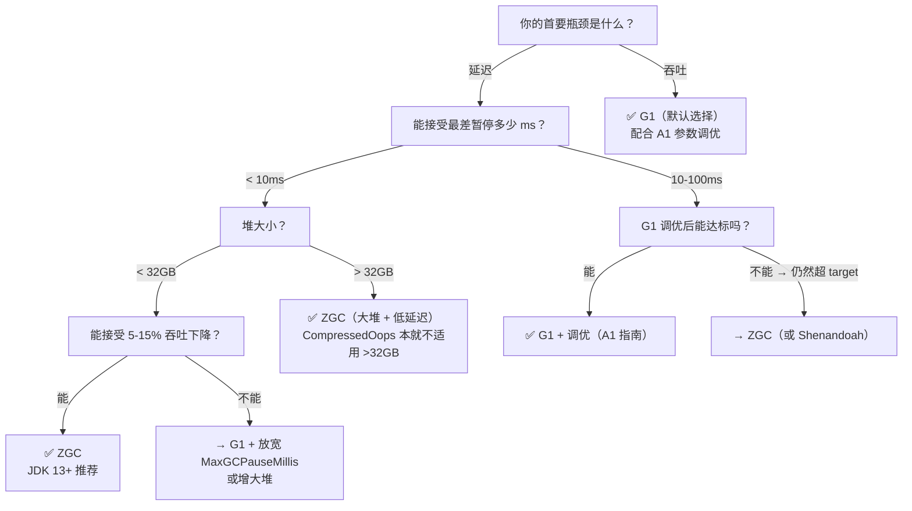

# PROMPT: 请撰写 A2-Beyond-G1.md

## 一、任务

撰写一篇 G1 之外两个关键扩展的简要指南，主题：**String Dedup 和 ZGC —— 当你调完 G1 所有参数后还能做什么**

### 定位与独特性

你已经完成了 12 篇 G1 GC 深度源码分析文档 + 1 篇 A1 调优指南。**本文是 G1 知识体系的"桥头堡"**——它告诉你两个方向：

1. **不动 GC 算法，深挖一个参数的潜力**：String Dedup —— 在 G1 框架内，不改变任何 GC 行为，只通过消灭重复 `char[]` 来降低 25%+ 的 Old 区 live data
2. **换 GC 算法，从根源解决 G1 的天花板**：ZGC —— 全并发 GC，暂停 < 1ms，不需要 RSet、不需要 SATB、不需要 Region 粒度 tradeoff

> **本文的独特价值**：不是 UI 参数的罗列，而是 **"如果你已经理解了 G1 的每一个细节，从 G1 的缺陷推导出为什么需要 String Dedup 和 ZGC"**。

---

## 二、核心叙事线（两个"从 G1 的痛点到解法"的故事）

### 叙事 A：String Dedup —— G1 调优到极致后还能做什么？

```
A1-G1-Tuning 中你已经做了所有能做的：
  MaxGCPauseMillis 设好了 → pause 稳定
  IHOP 调好了 → CM 周期合理
  Mixed GC 回收量够了 → Old 不再增长

但 jmap -histo 显示 char[] 占 Old 区的 30%
  → 这些 char[] 不是垃圾（它们被 String 引用着）→ GC 永远不会回收
  → 但很多 char[] 的内容是重复的（"com.example.User", "SELECT * FROM ...", 日志前缀）
  → 如果能识别重复 → 让 String 共享同一个 char[] → Old live data 减少 25%+
  → IHOP 触发延迟 → CM 周期减少 → CPU 开销下降

这就是 String Dedup 做的事情 —— 在 GC 框架内，不回收对象，只"去重字符数组"。
```

### 叙事 B：ZGC —— 为什么 G1 的"全并发"是假的？

```
G1 的 ConcGCThreads 做着"并发标记"，但：
  → Young GC 是 STW（200ms target 但就是 STW）
  → Mixed GC 是 STW
  → Evacuation（copy 对象）是 STW
  → Remark 是 STW
  G1 只有"标记"是并发的——这还不算 Root Region Scanning

ZGC 的"全并发"是真的：
  → 标记是并发的 ← G1 也能
  → 重定位是并发的 ← G1 做不到！G1 的 Evacuation(copy对象)必须 STW
  → Remark 被消除了 ← ZGC 用 colored pointers 自愈协议替代了 STW Remark
  → 暂停 < 1ms，且和堆大小无关 ← G1 做不到（Young GC 随 Eden 大小线性增长）

核心问题回答：为什么 ZGC 不用 RSet？为什么不用 SATB？为什么不用 TAMS？
  → 为什么不用 RSet：因为 ZGC 是单代 GC（non-generational）——没有"只回收一半"的场景
  → 为什么不用 SATB：因为 colored pointers 的 Marked0/Marked1 视图天然编码了时间信息
  → 为什么不用 TAMS：因为 colored bits 替代了 allocation boundary 的时间分界功能
```

---

## 三、必须覆盖的内容

### Part A：String Dedup（含源码因果链，深度不设上限）

#### A1. String Dedup 的三组件模型

```
┌──────────────────┐     ┌──────────────────┐     ┌──────────────────┐
│  GC Workers      │────→│  Dedup Queue     │────→│  Dedup Thread    │
│  (STW enqueue)   │     │  (per-worker无锁) │     │  (concurrent)    │
└──────────────────┘     └──────────────────┘     └──────────────────┘
  标记/疏散阶段              per-worker Stack          pop→hash→查表
  找到候选 String            上限 1,000,000             重复→共享 char[]
  enqueue_from_mark()        round-robin pop         不重复→插入哈希表
  enqueue_from_evacuation()
```

#### A2. 什么时候 String 成为候选？（候选判断逻辑，不是"代码翻译"）

```
为什么不是所有 String 都去重？（成本控制）
  → 只尝试一次：age == StringDeduplicationAgeThreshold（默认 3）时
  → 或者 promotion 到 Old 时（age < 3 就被 promote → 也试一次）
  → 一旦进入 Old 或 age > 3 → 永不重试

为什么是 age=3？（统计推理 + 工程权衡，非源码硬约束）
  → [03-YoungGC §二] ageTable: 绝大多数对象 age=0 或 age=1 就死亡
  → 活到 age=3 的对象大概率是长命的（至少活到 Old）
  → 此时去重，收益覆盖对象的剩余生命周期
  → 如果设为 1 → 短命对象也去重 → CPU 浪费（对象马上就死了）
  → 如果设为 15 → 对象都快进 Old 了才去重 → 去重窗口太窄

为什么只试一次？(设计替代分析)
  → String 的 char[] 内容不会变（immutable）
  → 这次去重失败 → 说明 char[] 内容是唯一的 → 永久唯一
  → 不需要周期性地重试
  → 对比：如果每次都去重 → 每个存活 String 被重复 hash+lookup 无数次 → 纯浪费
```

#### A3. 去重算法：StringDedupTable 的 lookup_or_add()

```
流程（简述，禁止逐行翻译源码）：
  hash(string_value) → lookup(hash) in hashtable
    → 找到相同 hash + 相同内容的 char[] → CAS 更新 String.value 指向共享 char[]
    → 没找到 → insert 新 char[] 到 hashtable
    ★ 为什么用 CAS 而不是锁？→ DedupThread 是单线程（concurrent），
    但 GC workers 在 unlink 阶段可能需要并发访问 hashtable

核心 Table: StringDedupTable (shared/stringdedup/stringDedupTable.cpp, ~22KB)
  → 链表+数组桶 实现的哈希表
  → 自动 resize（当前桶数 < 条目数/3 → 扩容；当前桶数 > 条目数×3 → 缩容）
  → resize 时 rehash + 清理死引用（unlink）
```

#### A4. 什么时候不灵？

```
效果差的情况：
  → char[] 占比虽高但几乎不重复（UUID、Hash、加密密文、随机 token）
  → 极端示例：日志中每条消息以 UUID 开头 → 去重率为 0，纯费 CPU

效果好的情况：
  → String 内容高度重复（日志前缀、SQL 模板、JSON key、配置项名）
  → 典型：Spring Boot 应用中，类名/方法名/配置 key 去重率 70%+
  → 典型：微服务的服务名、endpoint URL 前缀

判断是否值得开（在 A1 也提过，但这里深挖算法原理）：
  jmap -histo | 如果 char[] 占比 > 20% 
  AND 应用有大量重复的 String 内容（同构微服务、模板化的业务数据）
  → 值得开，预期削减 Old live data 25%+
```

#### A5. String Dedup 的 JDK 版本差异和源码来源

```
源码三层结构：
  gc/shared/stringdedup/stringDedup.hpp    ← 基类，所有 GC 共用
  gc/shared/stringdedup/stringDedupTable   ← 去重哈希表实现（~22KB）
  gc/shared/stringdedup/stringDedupThread   ← 专用去重线程
  gc/g1/g1StringDedup.hpp                  ← G1 特有的候选判断逻辑
  gc/g1/g1StringDedupQueue.hpp             ← G1 per-worker 队列实现
  gc/g1/g1StringDedupStat.hpp              ← G1 区分 Young/Old 统计
```

### Part B：ZGC 概览（含关键对比，深度不设上限）

#### B1. ZGC 的核心差异：全并发 GC 怎么做到的？

```
G1 的并发范围：      [--- STW ---][       Concurrent       ][--- STW ---]
                      Initial Mark     marking + cleanup         Remark
                      Evacuation = STW（copy 对象时 STW）

ZGC 的并发范围：      [STW][     Concurrent marking + relocation      ][STW]
                      root  │                                        │ root
                      scan   │ NEVER STW for copy objects           │ scan
                             │ ★ 读屏障 + colored pointers          │
                             │   让 relocation 完全并发！           │

对比核心：
  G1 的 Evacuation = copy 活对象 → STW（因为 mutator 可能在 copy 期间读取旧地址）
  ZGC 的 Relocation = copy 活对象 → 并发（因为读屏障在 mutator 读旧地址时透明修正）
```

#### B2. Colored Pointers —— ZGC 的黑科技

```
ZGC 在 64 位指针中嵌入 4 位元数据：

JDK 11 x86-64 Linux 典型布局：
  [   未使用 18 位   ][   堆地址 42 位   ][ 元数据 4 位 ][ 00(4KB对齐) ]
                                              ││││
                        bit0 = Marked0  ────────┘│││  ← 本轮标记位
                        bit1 = Marked1  ──────────┘││  ← 下轮标记位（交替用）
                        bit2 = Remapped  ───────────┘│  ← 对象已重定位到新地址
                        bit3 = Finalizable ───────────┘  ← 有 finalize() 方法

  ★ "GoodMask"不是指针字段，是运行时计算的掩码：
    GoodMask = Marked0 | Marked1 | Remapped
    用于判断"对象在当前 GC 阶段是否处于'正确'状态"

  地址空间限制：
    JDK 11: 42 位地址空间 → 最大堆 < 4TB
    JDK 13+: 指针压缩放宽 → 支持 16TB 堆

三种视图（三色标记的"无锁版本"）：
  Marked0  → 并发标记时，"已标记"对象带 Marked0 位
  Marked1  → 下一轮并发标记用 Marked1（和 Marked0 交替，避免 reset 位图）
  Remapped → 对象已被重定位到新地址（读屏障该做的已经做完）
             Mutator 看到 Remapped=1 的指针 → 直接返回，零额外开销

自愈协议（★ CAS 的目标是引用槽，不是 forwarding table）：
  mutator 读取对象字段 → 读屏障检查 colored bits
    → 如果 GoodMask 判定"好"（当前阶段的标记位或 Remapped 已设置）：直接返回
    → 如果 GoodMask 判定"坏"：
       ① 查 forwarding table：旧地址 → 新地址
       ② CAS 更新**引用槽位**（持有旧指针的那个字段），改为带 Remapped 的新指针
       ③ 返回新地址
    → ★ 下一次读同一个引用槽 → GoodMask 判定"好" → 零开销返回
      这就是 "self-healing"（自愈）——引用槽位自己愈合了，不需要再查 forwarding table
```

#### B3. 为什么 ZGC 不需要 RSet / SATB / TAMS？

```
★ 先澄清常见的混淆：ZGC 不需要 RSet 的根本原因是 ZGC 不做分代收集（non-generational），
   不是 colored pointers。colored pointers 解决的是并发重定位的读取一致性问题——
   这是两个正交维度。下面逐一说明：

RSet：G1 需要 RSet 的原因 = G1 是分代 GC，Young GC 只回收 Young 不回收 Old，
  但 Old→Young 的跨代引用仍然是 GC Root → 必须找到这些引用。
  不扫描整个 Old 的代价 = 维护 RSet 记录"Old 中哪些 Card 引用了我"。
  
  ZGC 不需要 RSet 的原因：
    → ZGC 是单代 GC — 每次 GC 回收整个堆（没有 Young-only GC）
    → 没有"只扫一部分"的场景 → 不需要跨区域引用追踪
    → 所有可达性通过标记阶段的并发扫描统一发现

SATB：G1 需要 SATB 记录并发标记期间的引用变化（写前旧值）。
  ZGC 不需要 SATB → Marked0/Marked1 交替视图天然记录了"本轮标记的起点"：
  Marked0=1 的对象是上轮标记过的 → 在并发标记期间，新分配对象自带 Marked0=0
  → 标记线程看到 Marked0=0 就知道"这是新对象，本轮不用管"。
  不需要"记录旧值"——colored bits 本身就编码了时间信息。

TAMS：G1 用 TAMS 区分标记开始前/后分配的对象。
  ZGC 不需要 TAMS → colored bits 替代了 TAMS 的时间分界功能：
  标记开始时的对象 → Marked0 = 本轮标记目标
  标记开始后新分配的对象 → Marked0 默认未设置 → 自然排除

总结：G1 的很多复杂机制是为了"弥补分代收集 + 非并发重定位的不完整性"，
ZGC 选择"非分代 + 并发重定位 + colored pointers 编码时间"——这不是优化，
是两种根本不同的设计哲学：G1 = 分代 + STW copy + SATB write barrier，
ZGC = 单代 + 并发 relocate + colored pointer read barrier。
```

#### B4. ZGC 的暂停为什么 < 1ms 且与堆大小无关？

```
ZGC 的 STW 阶段（不少于 3 个，每个都 < 1ms）：
  Pause Mark Start (STW, ~0.1ms)     ← 设置标记状态、扫描少量 roots
  Pause Mark End (STW, ~0.1ms)       ← 结束标记、处理残留引用
  Pause Relocate Start (STW, ~0.1ms) ← 选择重定位集合
  （某些周期还可能有额外的短暂 STW）

每次 STW 极短且不随堆大小增长的原因：
  → STW 期间只扫描 roots（线程栈、JNI handles、类静态字段）和处理少量元数据
  → 不扫描堆中的对象——标记和重定位都是并发的
  → roots 数量由线程数、类数决定，与堆大小无关
  → 对比 G1：Young GC STW 需要扫描整个 Eden（= 堆 × 5%-60% 的 Region）
     → 堆越大 → Eden 越大 → STW 越长 → 线性增长

所有重体力活都是并发的：
  → 标记整个堆：并发（多个 MarkWorker 线程）
  → 重定位对象：并发（读屏障自愈，mutator 同步参与修正）
  → 释放物理内存：并发（ZUncommit）
```

#### B5. ZGC 的代价（不是免费的午餐）

```
吞吐量：比 G1 低 5-15%（读屏障在每个对象访问时都有 check 开销）
内存开销：不能使用 CompressedOops（每个指针 8 字节 vs 4 字节）
CPU 开销：读屏障 + colored pointer 操作（虽然不是 CAS 但也是额外指令）
兼容性：JDK 11 不支持 ClassUnloading（需 JDK 13+）
堆大小上限：JDK 11 限制 < 4TB（42 位地址空间用于 colored pointers）

选 ZGC 的条件：
  → 延迟是绝对第一优先级（暂停必须 < 1ms，G1 调不到）
  → 堆很大（> 32GB，CompressedOops 本来就用不了）
  → 可以接受 5-15% 的吞吐下降
  → JDK 13+（推荐，JDK 11 ZGC 是实验性）
```

#### B6. ZGC 关键参数速查（补充说明）

> 以下参数在 B5 "代价"或其他节中交叉引用即可，不需独立成节。但 prompt 需要让 writer 知道这些参数的存在和含义，确保不遗漏。

```
关键参数速查（每个一句话）：
  -XX:+UseZGC                      启用 ZGC（JDK 11+ 实验性，JDK 15+ 生产就绪）
  -XX:ZAllocationSpikeTolerance=N  （默认 2.0）分配尖峰容忍系数 — 调大=容忍更高分配速率
  -XX:ZFragmentationLimit=N        （默认 25%）堆碎片率上限 — ZGC 的"G1HeapWastePercent 等价物"
  -XX:ZProactive                   （默认 true）主动 GC — ZGC 的"G1Policy 等价物"
  -XX:ZCollectionInterval=N        （默认 0=关闭）固定间隔强制 GC — 类似 CMS 的定时 GC
  -XX:ZUncommit                    （默认 true）释放不用的物理内存还给 OS — G1 没有这能力
  -Xms = -Xmx                      强烈推荐一样大（原因和 G1 相同，但 ZGC 内存映射开销更大）
```

### Part C：G1 vs ZGC 选型决策树



#### 决策口诀

```
大多数应用：G1 + 默认参数够用，有问题按 A1 调
延迟极限要求（< 10ms）：ZGC（前提：JDK 13+, 能容忍吞吐下降）
大内存 + 低延迟：ZGC 天然优势（> 32GB 时 CompressedOops 失效）
非常在意吞吐：G1 或 Parallel GC
不需要极限低延迟但有大量重复 String：先开 StringDedup，比换 GC 算法效果好得多
```

---

## 四、文章结构

```
§〇 文档索引 + 本文定位
  - 已完成 13 篇文档引用表（01-11 + A1）
  - 本文定位：从 G1 的缺陷推导出两个扩展方向

§一 ★ String Dedup —— 不改 GC 算法，只消灭重复 char[]
  1.1 为什么 G1 调优到极致后 String Dedup 仍是最大的杠杆？
  1.2 ★ 三组件模型：GC Workers(入队) → Queue(per-worker无锁) → DedupThread(并发去重)
  1.3 ★ 候选判断：为什么只去重 age=3 的对象？为什么只试一次？（设计替代分析）
  1.4 ★ 去重算法：lookup_or_add() — 怎么查？怎么更新 String.value？
  1.5 ★★ 效果与适用场景：什么时候值得开？（量化条件）
  1.6 JDK 版本差异 + 源码层次（shared/g1 两层结构）

§二 ★★★ ZGC —— 全并发 GC 为什么能 < 1ms？
  2.1 G1 的"假并发" vs ZGC 的"真并发"——Straw-man 对比
  2.2 ★★★ Colored Pointers：三种视图 + 自愈协议的并发本质
  2.3 ★★★ 为什么 ZGC 不需要 RSet / SATB / TAMS？（从 G1 的痛点到 ZGC 的解法）
  2.4 ★ ZGC 暂停为什么 < 1ms 且与堆大小无关？
  2.5 ★ ZGC 的代价：吞吐量、内存、兼容性——不是免费午餐
  2.6 ZGC 关键参数速查（ZAllocationSpikeTolerance、ZProactive、ZUncommit 等）

§三 ★ G1 vs ZGC 选型决策树
  3.1 Mermaid 决策图：从瓶颈到 GC 选择
  3.2 决策口诀 + 典型场景推荐

§四 可证伪断言 ≥3 条
```

---

## 五、写作要求

1. **★ 立足 G1 推导，不做独立的 StringDedup/ZGC 手册** — 每个论点必须从"G1 的这个问题为什么存在 → StringDedup/ZGC 怎么解决的"这个角度展开。例如讲 ZGC 的读屏障时，先讲"G1 的 Evacuation 为什么必须 STW"。

2. **★ 禁止源码翻译** — 不贴大段源码，但每个机制必须标注到具体文件的具体行范围。例如"候选判断见 `g1StringDedup.cpp:is_candidate_from_evacuation()`"

3. **★ 三问原则贯穿全文**：
   - 为什么需要？（G1 的什么缺陷）
   - 怎么解决的？（核心机制）
   - 代价是什么？（为什么不所有人默认开启）

4. **★ 设计替代分析 ≥3 处**：
   - StringDedup：如果每个 String 都去重（不是只一次）会怎样？
   - ZGC：如果把 ZGC 的 colored pointers 自愈协议替换为非自愈的 load barrier
     （每次 read 都查 forwarding table，不 CAS 修复引用槽，不享受自愈的零开销）会怎样？
   - ZGC：如果把 ZGC 的并发重定位（读屏障）替换为 G1 的 STW Evacuation
     （markOop forward 指针 + 全 STW copy）会怎样？暂停会爆炸到什么程度？

5. **★ "本文是扩展指南，不是源码分析"** — String Dedup 和 ZGC 各自有大量源码（Dedup 19 个源文件，ZGC 161 个源文件），本文只讲"为什么需要"和"核心机制"，不逐行走读源码。每个机制要指向源文件的正确行号让读者自行深入。

6. **★ Mermaid 决策树 1 张**：G1 vs ZGC 选型
7. **★ 可证伪断言 ≥3 条**（附录档标准，3 条即可，不要求 5 条）
8. **元信息头**：标准环境（同 A1）+ 前置依赖 + 阅读收益

---

## 六、标准环境

- OpenJDK 11 slowdebug build
- `-Xms8g -Xmx8g -XX:+UseG1GC -XX:MaxGCPauseMillis=200`
- G1 Region 大小 = 4MB，共 2048 Regions
- 64 位 Linux x86

---

## 七、已有文档交叉引用

| 文档 | 本文引用点 |
|------|-----------|
| [01] HeapRegion | G1 Region 粒度如何限制了 pause time 下限 → 推导 ZGC 为何不需要 Region |
| [03] YoungGC | G1 Young GC 的 STW 本质 → ZGC 的并发重定位对比；ageTable → StringDedup 候选年龄 |
| [04] CardTable-RSet | G1 的 RSet 为什么复杂 → ZGC 为什么不需要 |
| [05] SATB-Barrier | SATB 为什么存在 → ZGC colored pointers 怎么替代 |
| [06] ConcurrentMark-Core | do_marking_step 的时间片 → ZGC MarkWorker 不需要时间片控制（全并发） |
| [08] MixedGC-Policy | IHOP/G1Analytics 的预测模型 → ZGC 的 ZDirector 调度决策对比 |
| [09] FullGC | G1 的 Humongous 碎片化导致 STW Full GC → ZGC 的 Page-based + 并发重定位 = 碎片消除不需要 STW（ZGC 也有 ZFragmentationLimit，但处理过程可以并发） |
| [A1] G1-Tuning | A1 附录 §三 场景 3 中的 StringDedup 建议 → 本文深挖算法原理 |

---

## 八、聚焦源文件

### String Dedup（19 文件，聚焦以下 8 个）

| # | 文件 | 核心用途 |
|---|------|------|
| 1 | `gc/shared/stringdedup/stringDedup.hpp` | 基类接口：`is_candidate()`, `enqueue()`, `deduplicate()` |
| 2 | `gc/shared/stringdedup/stringDedupTable.cpp` | **★ 核心**：去重哈希表，`deduplicate()` + `lookup_or_add()` — ~22KB 实现 |
| 3 | `gc/shared/stringdedup/stringDedupThread.cpp` | 专用去重线程：从 queue pop → hash → lookup → CAS 重定向 |
| 4 | `gc/shared/stringdedup/stringDedupQueue.hpp` | 抽象队列接口 |
| 5 | `gc/g1/g1StringDedup.cpp` | **G1 候选判断**：`is_candidate_from_evacuation()` / `is_candidate_from_mark()` |
| 6 | `gc/g1/g1StringDedupQueue.cpp` | G1 per-worker Stack 实现 |
| 7 | `gc/g1/g1StringDedupStat.cpp` | G1 扩展统计（区分 Young/Old 去重数量） |
| 8 | `runtime/globals.hpp:2583-2595` | `UseStringDeduplication` + `StringDeduplicationAgeThreshold=3` 声明 |

### ZGC（161 文件，聚焦以下 6 个）

| # | 文件 | 核心用途 |
|---|------|------|
| 1 | `gc/z/zAddress.hpp` + `zAddress.inline.hpp` | **★ 核心**：colored pointers 的位布局 + 视图切换 |
| 2 | `gc/z/zBarrier.cpp` + `zBarrierSetRuntime.cpp` | **★ 核心**：读屏障实现（`load_barrier_on_oop_field_preloaded`） |
| 3 | `gc/z/zRelocate.cpp` | 并发重定位（ZGC 的"并发 copy 对象"） |
| 4 | `gc/z/zMark.cpp` | 并发标记（无 SATB 的并发标记怎么做到？） |
| 5 | `gc/z/zDirector.cpp` | GC 触发决策（ZGC 版的 G1Policy，但逻辑简单得多） |
| 6 | `gc/z/zGlobals.hpp` + `z_globals.hpp` | 全局常量（3 种 Page 大小、colored bits 定义） |

---

## 九、输出格式

- 输出 Markdown 文件命名：`A2-Beyond-G1.md`（本文是 prompt，最终产出是正文）
- 输出路径：`/data/workspace/openjdk-cut-new/probe_md/libjvm-analysis/06-gc-memory/`
- **行数要求**：不限行数，深度优先。该贴源码就贴源码，该画图就画图，该展开就展开。宁可长不要短。
- **结构要求**：Part A (String Dedup) + Part B (ZGC) + Part C (决策树) + §四 可证伪断言
- **禁止行为**：不要把本文写成"ZGC 源码分析"——这是 G1 文档集的扩展附录，始终从 G1 的视角推导

---

## 十、附录：关键面试题（可嵌入 §一/§二 中作为"面试追问"卡片）

### String Dedup 面试追问

1. String Dedup 怎么保证 char[] 替换的并发安全？
2. 去重表和 GC 引用链是什么关系？去重后的 char[] 没有 Java 引用指向它怎么办？
3. 为什么 `StringDeduplicationAgeThreshold=3` 而不是更大的值？
4. 如果 DedupThread 处理速度跟不上入队速度怎么办？

### ZGC 面试追问

1. Colored Pointers 的 4 个 bit 分别干啥？为什么只需要 4 bit？
2. 如果一个对象被标记为 Marked0，mutator 读取它的字段时会发生什么？（读屏障的完整流程）
3. ZGC 的 forwarding table 存的是什么？和 G1 Evacuation 的 forward 指针有什么区别？
4. 为什么 ZGC 暂停时间与堆大小无关？
5. JDK 11 ZGC < 4TB 的限制是怎么来的？JDK 13 怎么突破的？
6. ZGC 的读屏障在每个对象字段访问时都执行吗？有什么优化？（self-healing）
